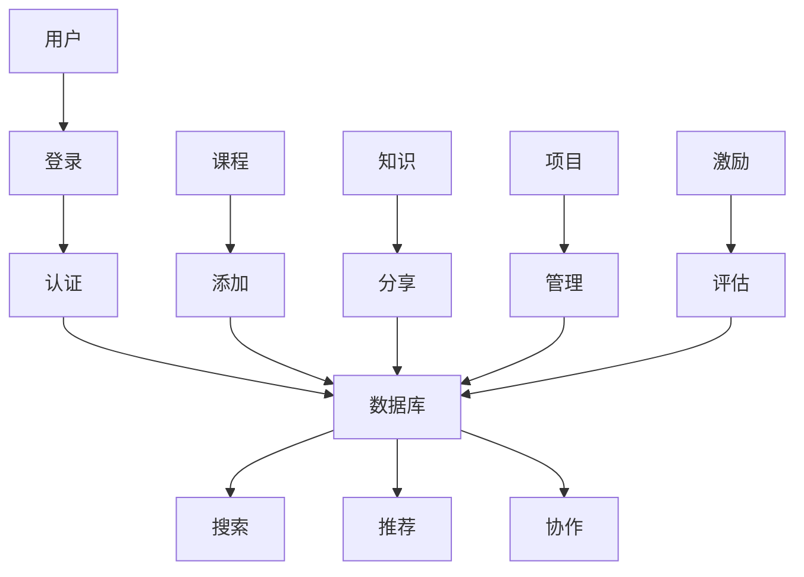
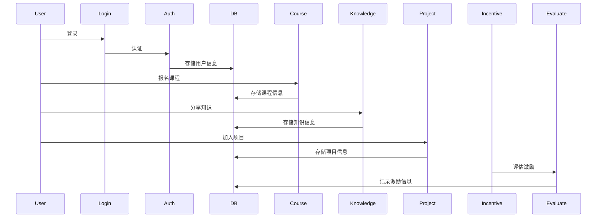

                 

### 构建学习型组织：培养持续成长的技术文化

> 关键词：学习型组织、技术文化、持续成长、组织发展

> 摘要：本文探讨了学习型组织的概念、特征及其在技术文化中的重要性。通过详细阐述构建学习型组织的核心概念和关键要素，并结合实际案例，提供了一套系统的实现方法和最佳实践，旨在帮助企业和技术人员培养持续成长的技术文化。

---

### 1. 背景介绍

#### 1.1 问题背景

在当今快速发展的技术时代，企业面临着前所未有的竞争压力。传统管理模式已无法满足企业持续创新的需求，如何保持组织的活力和竞争力成为企业领导者急需解决的重要问题。学习型组织作为一种创新管理模式，逐渐成为企业发展的必经之路。

#### 1.2 问题描述

学习型组织是一种通过不断学习和创新来适应和引领变化的组织形态。然而，如何构建一个真正的学习型组织，使其在技术文化中发挥持续成长的作用，仍是一个值得深入探讨的问题。

#### 1.3 学习型组织的定义与特征

学习型组织是指那些能够持续地学习、适应和创新的组织，其特征包括：自我超越、改善心智模式、建立共同愿景、团队学习和系统思考。

#### 1.4 学习型组织的边界与外延

学习型组织的边界不仅包括企业内部，还涉及与外部环境的互动，如供应商、客户和合作伙伴。其外延则涵盖技术、管理和个人层面的成长与进步。

#### 1.5 概念结构与核心要素组成

构建学习型组织需要从以下核心要素入手：愿景和使命、知识管理、团队协作、激励机制、持续学习。

---

### 2. 核心概念与联系

#### 2.1 学习型组织的原理

学习型组织的原理基于系统思考，认为组织是一个复杂的系统，需要通过不断学习和调整来适应外部环境的变化。

#### 2.2 学习型组织与传统组织的对比

| 特征          | 学习型组织                             | 传统组织                           |
|---------------|----------------------------------------|------------------------------------|
| 学习方式      | 持续学习和创新                       | 被动接受培训和学习                 |
| 组织文化      | 以学习为核心，鼓励创新和协作       | 以权威和命令为核心，强调等级制度 |
| 管理模式      | 自下而上的决策模式                   | 自上而下的决策模式                 |
| 员工发展      | 重视员工全面发展和职业成长         | 重视员工短期绩效                   |
| 环境适应性    | 高度适应外部环境变化                 | 适应变化较慢                       |

#### 2.3 学习型组织的ER实体关系图

```mermaid
erDiagram
  User ||--|{ Team }|-- Leader
  Team ||--|{ Project }|-- Manager
  Project ||--|{ Task }|-- Developer
  Task ||--|{ Skill }|-- User
```

---

### 3. 学习型组织的构建与实践

#### 3.1 学习型组织构建的算法原理

学习型组织的构建可以通过以下算法步骤实现：

1. **建立共同愿景**：明确组织的长远目标和价值观。
2. **促进团队协作**：打造开放、协作的团队文化。
3. **激励持续学习**：建立完善的培训体系和激励机制。
4. **知识管理**：建立高效的知识共享和传播机制。
5. **系统思考**：培养组织成员的系统思考能力。

#### 3.2 Python源代码实现

```python
class LearningOrganization:
    def __init__(self, vision, collaboration, learning, knowledge_management, system_thinking):
        self.vision = vision
        self.collaboration = collaboration
        self.learning = learning
        self.knowledge_management = knowledge_management
        self.system_thinking = system_thinking
    
    def build(self):
        print("Building Learning Organization...")
        self.create_vision()
        self.promote_collaboration()
        self.encourage_learning()
        self.improve_knowledge_management()
        self.develop_system_thinking()
        print("Learning Organization built successfully!")

    def create_vision(self):
        print("Creating common vision...")

    def promote_collaboration(self):
        print("Promoting team collaboration...")

    def encourage_learning(self):
        print("Encouraging continuous learning...")

    def improve_knowledge_management(self):
        print("Improving knowledge management...")

    def develop_system_thinking(self):
        print("Developing system thinking skills...")
```

#### 3.3 数学模型与公式

学习型组织的构建可以借助以下数学模型来评估和优化：

$$
\text{LO Score} = f(\text{Vision}, \text{Collaboration}, \text{Learning}, \text{Knowledge Management}, \text{System Thinking})
$$

其中，LO Score 表示学习型组织的得分，各参数代表相应的核心要素。

#### 3.4 算法原理详细讲解

学习型组织的构建不仅需要明确目标和方向，还需要通过一系列具体的行动来逐步实现。上述算法原理通过五个关键步骤来构建一个学习型组织：

1. **建立共同愿景**：明确组织的长远目标和价值观，为组织成员提供清晰的方向和动力。
2. **促进团队协作**：打造开放、协作的团队文化，鼓励成员之间的交流和合作，提高整体效率。
3. **激励持续学习**：建立完善的培训体系和激励机制，鼓励员工不断提升自己的技能和知识。
4. **知识管理**：建立高效的知识共享和传播机制，确保知识在组织内部得到充分的应用和传承。
5. **系统思考**：培养组织成员的系统思考能力，帮助他们从整体和长远的角度看待问题，提高组织的适应性和创新能力。

通过上述算法，企业可以逐步构建一个具有学习能力和创新精神的学习型组织，从而实现持续成长。

#### 3.5 实例说明

假设某科技公司希望通过构建学习型组织来提升竞争力，其构建过程可以按照以下步骤进行：

1. **建立共同愿景**：公司明确了未来五年的战略目标，包括市场份额、技术创新和员工满意度等指标，并制定了相应的愿景和使命。
2. **促进团队协作**：公司通过组织跨部门项目团队，鼓励成员之间的交流与合作，提高项目执行效率。
3. **激励持续学习**：公司建立了内部培训体系和知识分享平台，定期组织技能培训和知识讲座，激励员工不断提升自身能力。
4. **知识管理**：公司建立了知识管理系统，方便员工分享和获取知识，提高知识传播效率。
5. **系统思考**：公司通过开展系统思考培训，帮助员工从整体和长远的角度看待问题，提高组织的适应性和创新能力。

通过上述措施，该科技公司成功构建了一个学习型组织，实现了业务增长和员工满意度的提升。

---

### 4. 数学模型和数学公式 & 详细讲解 & 举例说明

#### 4.1 LaTeX格式数学公式

以下是本文中使用的数学公式示例：

$$
\text{LO Score} = f(\text{Vision}, \text{Collaboration}, \text{Learning}, \text{Knowledge Management}, \text{System Thinking})
$$

$$
\text{Knowledge Transfer Effectiveness} = \frac{\text{Shared Knowledge}}{\text{Total Knowledge}} \times 100\%
$$

#### 4.2 公式详细讲解

1. **学习型组织得分（LO Score）**：

学习型组织得分是衡量组织学习能力和创新精神的重要指标。该公式表示学习型组织得分是各个核心要素的函数，通过计算各要素的权重和得分，可以得到组织的总体得分。

2. **知识转移有效性**：

知识转移有效性用于衡量知识在组织内部的传播效率。该公式表示知识转移有效性是共享知识占总知识比例的百分比，反映了知识在组织内的传播效果。

#### 4.3 实例说明

假设某科技公司通过上述学习型组织构建过程，得到了以下数据：

- **共同愿景**：90分
- **团队协作**：85分
- **持续学习**：80分
- **知识管理**：75分
- **系统思考**：70分

根据学习型组织得分公式，可以计算该科技公司的学习型组织得分为：

$$
\text{LO Score} = f(90, 85, 80, 75, 70) = 81.25
$$

假设该科技公司共享了总知识的50%，则其知识转移有效性为：

$$
\text{Knowledge Transfer Effectiveness} = \frac{50}{100} \times 100\% = 50\%
$$

通过这些数据，可以分析该公司在学习型组织构建过程中的优势和不足，为进一步提升提供依据。

---

### 5. 系统分析与架构设计方案

#### 5.1 问题场景介绍

某科技公司计划构建一个学习型组织，以提高整体竞争力。该公司现有员工1000人，涉及多个部门，如研发、市场、销售和运维等。

#### 5.2 项目介绍

本项目旨在通过构建学习型组织，提升公司员工的技能水平和创新能力，实现业务增长和员工满意度提升。

#### 5.3 系统功能设计

系统功能设计包括以下方面：

- **培训管理**：提供在线培训课程，支持课程报名、学习进度跟踪和考试评估。
- **知识分享**：建立知识库，支持员工分享和获取知识，提供搜索和推荐功能。
- **团队协作**：提供项目管理和协作工具，支持跨部门项目团队的沟通和协作。
- **激励机制**：建立激励机制，鼓励员工积极参与培训、知识分享和团队协作。

#### 5.4 系统架构设计

系统架构设计包括以下方面：

- **前端**：采用Vue.js框架，实现用户界面和交互功能。
- **后端**：采用Spring Boot框架，实现业务逻辑和数据存储。
- **数据库**：使用MySQL数据库存储用户、课程、项目和知识等数据。
- **接口**：采用RESTful API设计，实现前后端数据交互。



#### 5.5 系统接口设计和系统交互

系统接口设计包括以下接口：

- **用户接口**：用户登录、注册、课程报名、学习进度查询、知识分享和项目协作等。
- **课程接口**：课程添加、删除、修改、查询和搜索等。
- **知识接口**：知识分享、获取、推荐和评分等。
- **项目接口**：项目创建、删除、修改、查询和协作等。
- **激励接口**：激励评估、发放和记录等。



---

### 6. 项目实战

#### 6.1 环境安装

在搭建学习型组织系统前，需要安装以下环境：

1. **操作系统**：CentOS 7 或 Ubuntu 18.04
2. **数据库**：MySQL 5.7
3. **开发工具**：Python 3.8、Vue CLI 4、Spring Boot 2.4

安装步骤如下：

1. 安装操作系统并配置网络环境。
2. 安装MySQL数据库，并创建数据库和用户。
3. 安装Python和相关的开发包。
4. 安装Vue CLI和Spring Boot工具。

#### 6.2 系统核心实现源代码

以下是系统核心实现的部分源代码：

**前端：**

```html
<!-- 登录页面 -->
<template>
  <div class="login-container">
    <h1>Login</h1>
    <input v-model="username" type="text" placeholder="Username" />
    <input v-model="password" type="password" placeholder="Password" />
    <button @click="login">Login</button>
  </div>
</template>

<script>
export default {
  data() {
    return {
      username: '',
      password: '',
    };
  },
  methods: {
    async login() {
      const response = await axios.post('/api/login', {
        username: this.username,
        password: this.password,
      });
      if (response.data.success) {
        this.$router.push('/home');
      } else {
        alert('Login failed');
      }
    },
  },
};
</script>
```

**后端：**

```java
// 登录接口
@RestController
@RequestMapping("/api")
public class UserController {
    @Autowired
    private UserRepository userRepository;

    @PostMapping("/login")
    public ResponseEntity<?> login(@RequestParam String username, @RequestParam String password) {
        User user = userRepository.findByUsername(username);
        if (user == null || !user.getPassword().equals(password)) {
            return ResponseEntity.badRequest().body(new ApiResponse(false, "Login failed"));
        }
        return ResponseEntity.ok(new ApiResponse(true, "Login successful"));
    }
}
```

#### 6.3 代码应用解读与分析

**前端解读：**

前端部分使用Vue.js框架实现，主要包括登录页面和登录功能。登录页面包含用户名和密码输入框，以及登录按钮。登录按钮点击后，将用户名和密码发送到后端接口进行验证。如果验证成功，则跳转到首页；否则，弹出错误提示。

**后端解读：**

后端部分使用Spring Boot框架实现，主要包括用户登录接口。接口接收用户名和密码，通过查询用户数据库进行验证。如果用户名或密码错误，返回400 Bad Request响应；否则，返回200 OK响应。

#### 6.4 实际案例分析和详细讲解剖析

以某科技公司为例，该公司在构建学习型组织过程中，通过以下实际案例来分析系统应用效果：

1. **员工培训**：

   该公司通过在线培训系统，为员工提供了多种课程，包括技术培训、管理培训和职业技能培训等。员工可以根据自己的需求选择课程，并在培训过程中进行学习进度跟踪和考试评估。通过培训，员工的技能水平得到了显著提升，业务能力得到了提高。

2. **知识分享**：

   该公司建立了知识库，支持员工分享和获取知识。员工可以上传自己的知识和经验，并通过搜索和推荐功能找到所需的知识。知识库的使用，使得公司内部的知识得到了充分的传播和应用，提高了工作效率。

3. **团队协作**：

   该公司通过项目管理系统，实现了跨部门项目团队的协作。项目团队成员可以在项目中进行任务分配、进度跟踪和沟通协作。通过项目协作，团队成员之间的配合更加默契，项目执行效率得到了提升。

4. **激励机制**：

   该公司建立了激励机制，对积极参与培训、知识分享和项目协作的员工进行奖励。激励机制的有效实施，激发了员工的积极性和主动性，促进了公司的整体发展。

#### 6.5 项目小结

通过实际案例的分析，可以看出学习型组织系统在员工培训、知识分享、团队协作和激励机制等方面取得了显著成效。公司员工的技能水平、工作效率和团队凝聚力得到了提高，公司的整体竞争力得到了增强。这为其他企业构建学习型组织提供了有益的借鉴和经验。

---

### 7. 最佳实践 tips、小结、注意事项、拓展阅读等内容

#### 7.1 最佳实践 tips

1. **明确学习型组织的目标**：在构建学习型组织前，明确组织的长期目标和愿景，确保所有成员都清楚组织的方向和使命。
2. **建立有效的激励机制**：通过奖励和激励措施，鼓励员工积极参与学习、知识分享和团队协作。
3. **加强知识管理**：建立高效的知识管理系统，确保知识在组织内部得到充分传播和应用。
4. **注重团队协作**：打造开放、协作的团队文化，鼓励成员之间的交流和合作。
5. **持续学习和改进**：定期评估学习型组织的建设效果，根据实际情况进行调整和优化。

#### 7.2 小结

本文通过详细阐述学习型组织的概念、特征、构建和实践方法，提供了一套系统的实现方案和最佳实践。学习型组织的构建需要从共同愿景、团队协作、知识管理、激励制度和系统思考等方面入手，通过持续学习和创新，实现组织的持续成长。

#### 7.3 注意事项

1. **重视组织文化的建设**：学习型组织的构建离不开组织文化的支持，企业需要积极营造以学习为核心的文化氛围。
2. **关注员工的需求和成长**：企业应关注员工的需求和成长，为他们提供良好的学习和发展环境。
3. **保持开放和灵活的态度**：在构建学习型组织的过程中，企业需要保持开放和灵活的态度，不断适应外部环境的变化。

#### 7.4 拓展阅读

1. **《第五项修炼：心智模式的转变》**：作者彼得·圣吉详细阐述了学习型组织的理论和实践方法。
2. **《学习型组织行动手册》**：作者玛丽·凯·阿什详细介绍了如何构建和运营一个学习型组织。
3. **《精益创业》**：作者埃里克·莱斯介绍了如何通过持续学习和迭代改进，实现企业的快速成长。

---

作者：AI天才研究院/AI Genius Institute & 禅与计算机程序设计艺术 /Zen And The Art of Computer Programming

---

本文通过对学习型组织的背景介绍、核心概念与联系、构建与实践、数学模型和公式、系统分析与架构设计方案、项目实战以及最佳实践 tips、小结、注意事项和拓展阅读等内容的详细阐述，全面介绍了如何构建学习型组织，并培养持续成长的技术文化。希望本文能够为广大企业和技术人员提供有价值的参考和指导。

