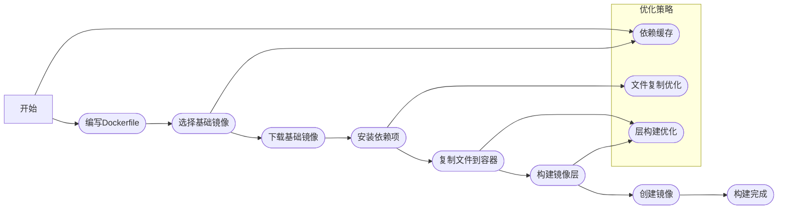

                 

## 1. 背景介绍

### 容器镜像管理系统的意义

随着云计算、微服务架构的普及，容器技术已经成为现代软件开发和部署的基石。容器镜像管理系统作为容器技术的核心组成部分，其在软件生命周期中的重要性日益凸显。首先，容器镜像是一种轻量级、可移植、自给自足的软件打包格式，它将应用程序及其运行环境打包在一起，确保应用程序在任何地方都能一致运行。因此，容器镜像管理系统的设计直接影响到应用程序的部署效率、可移植性和安全性。

其次，在软件开发的今天，快速迭代、持续集成和持续部署（CI/CD）已经成为敏捷开发的标准流程。容器镜像管理系统通过自动化构建、测试和部署流程，显著提升了软件交付的速度和质量。它可以确保开发环境与生产环境的一致性，减少因环境差异导致的问题。

最后，随着容器技术的广泛应用，容器镜像管理系统的可靠性和安全性也变得尤为关键。容器镜像中可能包含敏感数据和关键代码，一旦被恶意攻击或错误配置，可能会对企业的业务造成重大影响。因此，构建一个安全可靠的容器镜像管理系统不仅是技术需求，更是业务需求。

### 问题背景

尽管容器镜像管理系统具有诸多优势，但其安全性问题却日益严峻。首先，容器镜像可能包含漏洞，攻击者可以利用这些漏洞进行恶意攻击。其次，容器镜像的构建过程可能受到恶意篡改，导致镜像被注入恶意代码。此外，容器镜像的传输和存储过程中也存在数据泄露的风险。

同时，可靠性问题也不容忽视。容器镜像的版本管理复杂，如果版本控制不当，可能会导致应用部署失败或运行不稳定。此外，容器镜像的缓存策略和备份恢复机制不完善，也会影响系统的可用性和数据完整性。

因此，构建一个既安全可靠，又具备高效、灵活的容器镜像管理系统，成为当前IT领域面临的重要挑战。

### 问题描述

在构建容器镜像管理系统的过程中，我们面临以下关键问题：

1. **安全性问题**：如何确保容器镜像在构建、传输和存储过程中不受恶意攻击，避免数据泄露和恶意代码注入？
2. **可靠性问题**：如何优化容器镜像的版本控制，确保应用部署的一致性和稳定性？
3. **效率问题**：如何在保证安全性和可靠性的前提下，提高容器镜像的构建、传输和部署效率？
4. **可移植性问题**：如何确保容器镜像在不同环境中的一致运行，解决跨平台兼容性问题？

### 问题解决

为了解决上述问题，我们可以采取以下策略：

1. **安全性加强**：引入多层次的安全防护机制，包括镜像扫描、安全配置管理、权限控制等，确保镜像的安全性。
2. **可靠性提升**：采用可靠的版本控制系统和备份恢复机制，确保镜像版本的可追踪性和数据的完整性。
3. **效率优化**：引入缓存策略、并行构建等技术，提高镜像构建和部署的效率。
4. **跨平台兼容**：通过标准化容器镜像格式和工具链，确保镜像在不同环境中的一致性。

### 边界与外延

容器镜像管理系统不仅仅是一个技术问题，它还涉及到企业的业务流程、组织架构和技术生态。例如，如何与现有的CI/CD流程集成，如何与运维团队协同工作，如何与其他云服务和容器平台对接，这些都是构建过程中需要考虑的问题。

此外，随着容器技术的不断发展，容器镜像管理系统也需要不断进化，以适应新的技术需求。例如，容器网络的自动化管理、容器存储的优化、容器编排与管理的集成等，都是未来容器镜像管理系统需要关注的领域。

### 概念结构与核心要素组成

容器镜像管理系统的概念结构可以概括为以下几个核心要素：

1. **容器镜像**：容器镜像是一种轻量级、可移植的软件打包格式，包含应用程序及其运行环境。
2. **仓库**：仓库是容器镜像的存储和管理中心，负责存储、分发和共享镜像。
3. **构建工具**：构建工具如Docker，用于构建和打包容器镜像。
4. **安全性机制**：包括镜像扫描、权限控制、安全配置等，用于保护镜像的安全性。
5. **版本控制系统**：用于管理镜像的版本，确保版本的可追踪性和一致性。

这些要素相互关联，共同构成了一个完整、高效的容器镜像管理系统。

## 2. 核心概念与联系

### 容器

容器（Container）是一种轻量级的、可执行的、独立的环境，它将应用程序及其依赖项打包在一起，确保应用程序在不同环境中的一致运行。容器通过操作系统级虚拟化技术实现，共享宿主机的操作系统内核，从而大幅降低了资源消耗。

**属性特征**：

- **轻量级**：容器与虚拟机相比，资源消耗更少，启动速度更快。
- **隔离性**：容器提供了进程级别的隔离，确保不同容器之间互不影响。
- **可移植性**：容器镜像可以将应用程序打包成标准化的格式，确保在不同环境中的一致运行。

**容器与虚拟机的对比**：

| 特性 | 容器 | 虚拟机 |
| --- | --- | --- |
| 资源消耗 | 较少 | 较多 |
| 启动速度 | 快 | 慢 |
| 隔离级别 | 进程级 | 常见为操作系统级 |
| 可移植性 | 高 | 低 |

**容器的工作原理**：

容器通过以下三个主要组件实现：

- **容器引擎**：如Docker，负责容器的创建、运行和管理。
- **容器运行时**：提供容器的运行环境，如cgroups和namespace。
- **容器镜像**：容器运行时的静态表示，包含应用程序及其依赖项。

### 容器镜像

容器镜像（Container Image）是容器的静态表示，它包含了运行容器所需的所有文件和配置。镜像是一种轻量级的、静态的、可执行的软件打包格式，可以确保应用程序在任何环境中的一致运行。

**属性特征**：

- **轻量级**：镜像体积较小，通常只有几百兆到几吉字节。
- **自给自足**：镜像包含了应用程序及其依赖项，无需额外配置。
- **可移植性**：镜像可以跨不同操作系统和硬件平台运行。

**镜像的种类**：

- **基础镜像**：如Ubuntu、CentOS等，提供运行容器的基本环境。
- **业务镜像**：基于基础镜像，添加特定业务应用和配置。

**镜像与容器的联系**：

容器镜像是创建容器的蓝本，每个容器都基于某个镜像运行。当容器启动时，镜像中的文件和配置会被加载到容器中，形成运行时的环境。

### 仓库

仓库（Repository，简称Repo）是容器镜像的存储和管理中心，它负责存储、分发和共享镜像。仓库通常分为公有仓库和私有仓库：

- **公有仓库**：如Docker Hub，提供公开的镜像，任何人都可以访问和使用。
- **私有仓库**：如Harbor，用于企业内部镜像的存储和管理，确保安全性。

**仓库的功能**：

- **存储**：存储容器镜像及其相关元数据。
- **分发**：通过HTTP或Docker Registry API，提供镜像的下载和上传服务。
- **管理**：包括镜像的权限控制、版本管理和安全性扫描。

**仓库与镜像的联系**：

仓库是镜像的存储场所，镜像通过仓库进行分发和管理。开发者可以从仓库中下载镜像，用于构建和部署容器，同时也可以将新构建的镜像上传到仓库中，供他人使用。

### 核心概念ER实体关系图

以下是一个ER实体关系图，展示了容器、镜像和仓库之间的关联：

```mermaid
erDiagram
  Container ||--|{ Image : uses }
  Image ||--|{ Repository : stored_in }
  Repository ||--|{ Container : provides }
```

在这个图中：

- **Container**（容器）实体表示应用程序的运行环境。
- **Image**（镜像）实体表示容器的静态表示，包含应用程序及其依赖项。
- **Repository**（仓库）实体表示镜像的存储和管理中心。

## 3. 构建容器镜像的基本原理

### 容器基础

容器是一种轻量级、可执行的、独立的环境，它通过操作系统级虚拟化技术实现。与传统的虚拟机相比，容器具有更少的资源消耗、更快的启动速度和更高的可移植性。

**容器的工作原理**：

容器通过以下三个主要组件实现：

1. **容器引擎**：如Docker，负责容器的创建、运行和管理。容器引擎通过操作系统的cgroups和namespace实现进程级别的隔离。
2. **容器运行时**：提供容器的运行环境，包括文件系统、网络接口和进程控制。容器运行时通常包含在容器镜像中。
3. **容器镜像**：容器镜像是一种轻量级的、静态的、可执行的软件打包格式，包含应用程序及其依赖项。

**容器的主要特点**：

- **轻量级**：容器共享宿主机的操作系统内核，不包含完整的操作系统，因此资源消耗较少。
- **隔离性**：容器通过命名空间和cgroups实现进程级别的隔离，确保不同容器之间互不影响。
- **可移植性**：容器镜像可以打包成标准化的格式，确保在不同环境中的一致运行。

### Dockerfile 编写

Dockerfile 是一种用于构建容器镜像的文本文件，它包含了一系列的指令，用于定义如何构建和配置容器镜像。编写一个有效的Dockerfile，需要理解Dockerfile的基本语法和常用指令。

**Dockerfile的基本语法**：

Dockerfile由一系列的指令组成，每个指令以`#`开头作为注释，或者直接书写指令。Dockerfile的执行顺序与指令的书写顺序一致。

**常用的Dockerfile指令**：

1. **FROM**：指定基础镜像，例如`FROM ubuntu:18.04`。
2. **RUN**：在容器构建过程中执行命令，例如`RUN apt-get update`。
3. **COPY**：将本地文件或目录复制到容器中，例如`COPY . /app`。
4. **EXPOSE**：暴露容器中的端口，例如`EXPOSE 80`。
5. **CMD**：指定容器启动时要运行的命令，例如`CMD ["nginx", "-g", "daemon off;"]`。

**Dockerfile实例解析**：

以下是一个简单的Dockerfile实例，用于构建一个基于Python的Web应用程序：

```dockerfile
# 指定基础镜像
FROM python:3.8-slim

# 设置工作目录
WORKDIR /app

# 复制应用程序代码到容器中
COPY . .

# 安装依赖项
RUN pip install -r requirements.txt

# 暴露Web服务端口
EXPOSE 8080

# 运行应用程序
CMD ["python", "app.py"]
```

在这个实例中：

- **FROM** 指定了基础镜像为Python 3.8-slim。
- **WORKDIR** 指定了工作目录为`/app`。
- **COPY** 将本地应用程序代码复制到容器中。
- **RUN** 安装了应用程序的依赖项。
- **EXPOSE** 暴露了容器的8080端口。
- **CMD** 指定了容器启动时要运行的命令。

### 构建策略与优化

构建容器镜像的过程涉及到多个环节，包括基础镜像的选择、构建指令的优化、构建工具的使用等。为了提高构建效率和质量，可以采取以下策略：

**基础镜像的选择**：

- 选择合适的基础镜像，避免使用过大的镜像。例如，可以选择基于`slim`或` Alpine`版本的镜像，减少镜像的大小。
- 避免在基础镜像中安装不必要的软件，以减少镜像的体积和运行时的资源消耗。

**构建指令的优化**：

- 将多个`RUN`指令合并，减少层的数量，从而减少镜像的体积。
- 使用`COPY`指令而不是`ADD`，以减少层的数量。
- 在可能的情况下，使用缓存机制，例如利用`docker build --cache-from`参数，提高构建速度。

**构建工具的使用**：

- 使用Dockerfile构建镜像时，可以结合Docker的BuildKit功能，利用其优化构建过程。
- 利用CI/CD工具（如Jenkins、GitLab CI/CD等）自动化构建流程，确保构建的可重复性和一致性。

### 容器镜像构建的Mermaid流程图

以下是一个Mermaid流程图，展示了容器镜像构建的基本流程：

```mermaid
flowchart LR
    subgraph 构建流程
        Start({开始}) --> A1([编写Dockerfile])
        A1 --> A2([选择基础镜像])
        A2 --> A3([运行构建指令])
        A3 --> A4([构建镜像层])
        A4 --> A5([创建镜像])
    end
    subgraph 镜像优化
        B1([优化基础镜像])
        B2([合并构建指令])
        B3([使用缓存机制])
    end
    subgraph 构建工具
        C1([使用Docker BuildKit])
        C2([自动化构建流程])
    end
    Start --> B1
    A2 --> B1
    A3 --> B2
    A4 --> B3
    A5 --> C1
    A5 --> C2
```

在这个流程图中：

- **构建流程**展示了从编写Dockerfile到构建完成镜像的步骤。
- **镜像优化**展示了如何优化基础镜像和构建指令。
- **构建工具**展示了如何使用构建工具（如Docker BuildKit）自动化构建流程。

通过这个流程图，我们可以清晰地看到容器镜像构建的全过程，以及如何通过优化策略和构建工具提高构建效率。

### 容器镜像构建的Python源代码示例

以下是一个简单的Python脚本示例，用于构建一个基于Python的Web应用程序的容器镜像：

```python
import subprocess

def build_image(dockerfile_path, image_name):
    # 编写Dockerfile的路径
    dockerfile_path = "Dockerfile"
    # 构建镜像的名称
    image_name = "my-python-app"

    # 使用subprocess模块运行docker build命令
    build_command = f"docker build -t {image_name} -f {dockerfile_path} ."
    result = subprocess.run(build_command, shell=True, capture_output=True, text=True)

    if result.returncode == 0:
        print("镜像构建成功：", result.stdout)
    else:
        print("镜像构建失败：", result.stderr)

if __name__ == "__main__":
    build_image("Dockerfile", "my-python-app")
```

在这个脚本中：

- `build_image`函数接受Dockerfile的路径和镜像的名称作为参数。
- 使用`subprocess.run`函数运行`docker build`命令，构建指定名称的镜像。
- 如果构建成功，输出成功的消息；如果构建失败，输出错误消息。

通过这个Python脚本，我们可以自动化地构建容器镜像，确保构建过程的一致性和可重复性。

### 容器镜像构建的数学模型和公式

容器镜像构建过程涉及多个阶段，包括依赖安装、文件复制、层构建等。这些阶段可以通过数学模型和公式进行描述和优化。

**数学模型**：

设`N`为容器镜像的构建阶段数量，`L_i`为第`i`个阶段的构建时间，`C`为整体构建时间，则有：

$$ C = \sum_{i=1}^{N} L_i $$

其中，`L_i`可以通过以下公式计算：

$$ L_i = t_{install} + t_{copy} + t_{build} $$

其中，`t_{install}`为依赖安装时间，`t_{copy}`为文件复制时间，`t_{build}`为层构建时间。

**优化公式**：

为了优化整体构建时间`C`，我们可以通过以下策略减少每个阶段的构建时间：

1. **依赖缓存**：减少依赖安装时间`t_{install}`，可以通过利用缓存机制，避免重复安装。
2. **文件复制优化**：减少文件复制时间`t_{copy}`，可以通过减少复制的文件数量和优化文件复制策略。
3. **层构建优化**：减少层构建时间`t_{build}`，可以通过合并构建指令和减少构建层的数量。

具体优化公式为：

$$ L_i' = \min(L_i) $$

其中，`L_i'`为优化后的第`i`个阶段构建时间。

通过这些数学模型和优化公式，我们可以更有效地构建容器镜像，提高构建效率。

### 容器镜像构建的Mermaid流程图

以下是一个Mermaid流程图，展示了容器镜像构建的详细流程：



在这个流程图中：

- **主要流程**展示了从编写Dockerfile到构建完成镜像的步骤。
- **优化策略**展示了如何通过依赖缓存、文件复制优化和层构建优化来提高构建效率。

通过这个流程图，我们可以全面了解容器镜像构建的过程和优化策略。

### 容器镜像构建的Python源代码示例

以下是一个简单的Python脚本示例，用于构建一个基于Python的Web应用程序的容器镜像：

```python
import subprocess

def build_image(dockerfile_path, image_name, base_image):
    # Dockerfile的路径
    dockerfile_path = "Dockerfile"
    # 镜像名称
    image_name = "my-python-app"
    # 基础镜像
    base_image = "python:3.8-slim"

    # 构建命令
    build_command = f"docker build -t {image_name} --build-arg BASE_IMAGE={base_image} -f {dockerfile_path} ."

    # 执行构建命令
    result = subprocess.run(build_command, shell=True, capture_output=True, text=True)

    if result.returncode == 0:
        print("镜像构建成功：", result.stdout)
    else:
        print("镜像构建失败：", result.stderr)

if __name__ == "__main__":
    build_image("Dockerfile", "my-python-app", "python:3.8-slim")
```

在这个脚本中：

- `build_image`函数接受Dockerfile的路径、镜像名称和基础镜像作为参数。
- 使用`docker build`命令构建指定名称的镜像，并传递基础镜像作为构建参数。

通过这个Python脚本，我们可以自动化地构建容器镜像，实现构建过程的标准化和可重复性。

### 容器镜像构建的数学模型和公式

容器镜像构建过程中，涉及多个阶段的优化问题，包括依赖安装、文件复制和层构建等。为了提高构建效率，我们可以使用数学模型和公式来分析和优化这些阶段。

**数学模型**：

设`N`为容器镜像的构建阶段数量，`L_i`为第`i`个阶段的构建时间，`C`为整体构建时间，则有：

$$ C = \sum_{i=1}^{N} L_i $$

其中，`L_i`可以通过以下公式计算：

$$ L_i = t_{install} + t_{copy} + t_{build} $$

其中，`t_{install}`为依赖安装时间，`t_{copy}`为文件复制时间，`t_{build}`为层构建时间。

**优化公式**：

为了优化整体构建时间`C`，我们可以通过以下策略减少每个阶段的构建时间：

1. **依赖缓存**：减少依赖安装时间`t_{install}`，可以通过利用缓存机制，避免重复安装。

   $$ t_{install}' = \min(t_{install}) $$

2. **文件复制优化**：减少文件复制时间`t_{copy}`，可以通过减少复制的文件数量和优化文件复制策略。

   $$ t_{copy}' = \min(t_{copy}) $$

3. **层构建优化**：减少层构建时间`t_{build}`，可以通过合并构建指令和减少构建层的数量。

   $$ t_{build}' = \min(t_{build}) $$

具体优化公式为：

$$ L_i' = \min(L_i) $$

其中，`L_i'`为优化后的第`i`个阶段构建时间。

通过这些数学模型和优化公式，我们可以更有效地构建容器镜像，提高构建效率。

### 容器镜像构建的Mermaid流程图

以下是一个Mermaid流程图，展示了容器镜像构建的详细过程和优化策略：


在这个流程图中：

- **主要流程**展示了从编写Dockerfile到构建完成镜像的步骤。
- **优化策略**展示了如何通过依赖缓存、文件复制优化和层构建优化来提高构建效率。

通过这个流程图，我们可以全面了解容器镜像构建的过程和优化策略。

### 容器镜像构建的Python源代码示例

以下是一个简单的Python脚本示例，用于构建一个基于Python的Web应用程序的容器镜像：

```python
import subprocess

def build_image(dockerfile_path, image_name, base_image):
    # Dockerfile的路径
    dockerfile_path = "Dockerfile"
    # 镜像名称
    image_name = "my-python-app"
    # 基础镜像
    base_image = "python:3.8-slim"

    # 构建命令
    build_command = f"docker build -t {image_name} --build-arg BASE_IMAGE={base_image} -f {dockerfile_path} ."

    # 执行构建命令
    result = subprocess.run(build_command, shell=True, capture_output=True, text=True)

    if result.returncode == 0:
        print("镜像构建成功：", result.stdout)
    else:
        print("镜像构建失败：", result.stderr)

if __name__ == "__main__":
    build_image("Dockerfile", "my-python-app", "python:3.8-slim")
```

在这个脚本中：

- `build_image`函数接受Dockerfile的路径、镜像名称和基础镜像作为参数。
- 使用`docker build`命令构建指定名称的镜像，并传递基础镜像作为构建参数。

通过这个Python脚本，我们可以自动化地构建容器镜像，实现构建过程的标准化和可重复性。

### 容器镜像安全性问题

容器镜像的安全性问题一直是容器生态系统中的一个关键挑战。随着容器技术的广泛应用，容器镜像作为应用程序的运行基础，其安全性变得尤为重要。下面，我们将详细分析容器镜像可能面临的主要安全性问题，包括常见的安全漏洞、攻击方式以及相应的防范措施。

#### 常见安全漏洞

1. **代码漏洞**：容器镜像中可能包含应用程序本身的代码漏洞，如SQL注入、跨站脚本（XSS）等。这些漏洞如果被利用，可能会泄露敏感数据或控制容器。
2. **配置错误**：容器镜像在构建过程中，可能会因为配置错误而导致安全漏洞。例如，未正确设置文件权限、未删除不必要的用户账户等。
3. **依赖库漏洞**：容器镜像中使用的依赖库可能存在已知漏洞，攻击者可以通过这些漏洞进行攻击。
4. **恶意镜像**：恶意镜像可能包含恶意代码或后门，攻击者在镜像上传到仓库后进行恶意操作。

#### 攻击方式

1. **容器逃逸**：攻击者通过利用容器镜像中的漏洞，突破容器的隔离，从而获得宿主机的权限。常见的攻击方式包括利用内核漏洞、提权漏洞等。
2. **横向移动**：攻击者在容器内部进行横向移动，通过访问其他容器或宿主机上的资源，进一步扩大攻击范围。
3. **数据泄露**：攻击者通过窃取容器中的敏感数据，如用户信息、企业机密等。
4. **代码篡改**：攻击者在容器镜像构建或传输过程中，注入恶意代码，从而控制容器。

#### 防范措施

1. **镜像扫描**：在容器镜像构建完成后，使用安全工具（如Clair、Docker Bench for Security等）对镜像进行扫描，检测潜在的安全漏洞。
2. **最小权限原则**：确保容器镜像运行时的权限最小化，避免使用root用户运行应用程序。可以通过使用非root用户和限制用户权限来降低风险。
3. **配置审计**：定期对容器镜像进行配置审计，检查是否存在配置错误或不当设置。可以使用自动化工具（如 Anchore、Pod Security Policies等）进行配置审计。
4. **依赖库管理**：定期更新和审计容器镜像中使用的依赖库，确保依赖库的版本不受已知漏洞影响。可以使用工具（如Dependency-Track、OWASP ZAP等）进行依赖库审计。
5. **镜像签名与验证**：对容器镜像进行签名，确保镜像在传输和存储过程中不被篡改。使用工具（如Notary、The update-client等）对镜像进行签名和验证。
6. **访问控制**：实施严格的访问控制策略，确保只有授权用户可以访问和管理容器镜像。可以使用私有仓库和身份验证机制（如OAuth、LDAP等）来控制访问权限。

通过上述措施，我们可以显著提高容器镜像的安全性，减少潜在的安全风险。

### 容器镜像安全防范措施的具体实施

为了构建一个安全可靠的容器镜像管理系统，我们需要采取一系列具体的防范措施。以下是一些常见的安全防范措施及其实施步骤：

#### 1. 使用容器安全扫描工具

**目的**：检测容器镜像中潜在的安全漏洞。

**实施步骤**：

- 选择并安装一个容器安全扫描工具，如Clair、Docker Bench for Security等。
- 定期对容器镜像进行扫描，确保在部署前检测到所有安全漏洞。
- 自动化扫描过程，将其集成到CI/CD流程中，确保每次构建完成后都进行安全扫描。

#### 2. 限制容器运行权限

**目的**：降低容器镜像被恶意利用的风险。

**实施步骤**：

- 使用非root用户运行容器，确保容器中的用户权限最小化。
- 配置容器的user namespace，为每个容器分配独立的用户ID。
- 使用权限控制工具（如AppArmor、SELinux等）来限制容器对宿主机资源的访问。

#### 3. 优化Dockerfile

**目的**：减少容器镜像的大小，避免潜在的安全漏洞。

**实施步骤**：

- 只在必要的时候安装依赖库，避免安装不必要的软件。
- 使用`COPY`而不是`ADD`来复制文件，减少镜像层的数量。
- 将多个`RUN`命令合并，减少构建镜像时需要执行的层数量。
- 定期更新Dockerfile中的软件版本，确保不受已知漏洞影响。

#### 4. 使用私有仓库

**目的**：确保容器镜像的安全性和可控性。

**实施步骤**：

- 使用私有仓库（如Harbor、Quay等）来存储和管理容器镜像。
- 对私有仓库实施严格的访问控制策略，确保只有授权用户可以访问镜像。
- 对上传到私有仓库的镜像进行签名和验证，确保镜像在传输和存储过程中未被篡改。

#### 5. 实施配置审计

**目的**：检测容器镜像中的配置错误和不当设置。

**实施步骤**：

- 使用配置审计工具（如Anchore、Kube-Bench等）定期对容器镜像进行审计。
- 自动化配置审计过程，将其集成到CI/CD流程中。
- 根据审计结果，修复发现的安全问题和配置错误。

#### 6. 依赖库管理

**目的**：确保容器镜像使用的依赖库安全、更新。

**实施步骤**：

- 使用工具（如Dependency-Track、OWASP ZAP等）对容器镜像中的依赖库进行审计。
- 定期更新依赖库，确保不受已知漏洞影响。
- 创建和维护一个企业级的依赖库清单，确保所有开发人员使用的是经过审查和验证的依赖库。

#### 7. 镜像签名与验证

**目的**：确保容器镜像未被篡改。

**实施步骤**：

- 使用镜像签名工具（如Notary、The update-client等）对容器镜像进行签名。
- 在镜像传输和部署过程中，对签名进行验证，确保镜像未被篡改。
- 将签名和验证过程集成到CI/CD流程中，确保每次部署前都进行验证。

通过上述具体的安全防范措施，我们可以有效提高容器镜像管理系统的安全性，减少潜在的安全威胁。

### 常见的安全工具

在构建安全可靠的容器镜像管理系统时，使用一些专业的安全工具是必不可少的。以下是一些常见的安全工具及其功能和特点：

#### 1. Clair

**功能**：Clair是一个开源的容器镜像安全扫描工具，可以检测容器镜像中的安全漏洞。

**特点**：Clair支持对多种容器镜像格式（如Docker、OCI等）进行扫描，并提供详细的安全报告。它还支持与CI/CD工具集成，实现自动化安全扫描。

#### 2. Docker Bench for Security

**功能**：Docker Bench for Security是一个用于评估Docker容器安全配置的工具。

**特点**：Docker Bench for Security可以检测容器镜像和Docker守护进程的安全配置，并提供改进建议。它适用于各种Docker版本，是一个快速、高效的安全评估工具。

#### 3. Anchore

**功能**：Anchore是一个企业级的容器镜像安全平台，可以扫描、评估和管理容器镜像。

**特点**：Anchore提供基于策略的安全评估，可以自动识别和修复安全漏洞。它还支持与CI/CD工具和容器编排工具（如Kubernetes）的集成。

#### 4. Notary

**功能**：Notary是一个用于签名和验证容器镜像的工具。

**特点**：Notary提供了强大的签名和验证功能，确保容器镜像在传输和存储过程中未被篡改。它支持多种签名算法，并可以与Docker Hub等公有仓库集成。

#### 5. Kube-Bench

**功能**：Kube-Bench是一个用于评估Kubernetes集群安全配置的工具。

**特点**：Kube-Bench可以检测Kubernetes集群中的配置错误和安全漏洞，并提供改进建议。它适用于各种Kubernetes版本，是构建安全Kubernetes集群的必备工具。

#### 6. Dependency-Track

**功能**：Dependency-Track是一个用于依赖关系分析和安全漏洞管理的工具。

**特点**：Dependency-Track可以扫描容器镜像中的依赖库，识别潜在的安全漏洞。它支持多种编程语言和框架，并提供详细的安全报告。

通过使用这些安全工具，我们可以有效提高容器镜像管理系统的安全性，确保应用程序的安全可靠运行。

### 安全性最佳实践

在构建安全可靠的容器镜像管理系统时，遵循一些最佳实践是非常重要的。以下是一些关键的最佳实践：

1. **持续进行安全扫描**：定期使用安全扫描工具（如Clair、Docker Bench for Security等）对容器镜像进行扫描，确保及时发现和修复安全漏洞。

2. **使用最小权限原则**：确保容器镜像运行时的权限最小化，避免使用root用户运行应用程序。可以使用非root用户和限制用户权限来降低风险。

3. **优化Dockerfile**：编写高效的Dockerfile，减少镜像的体积和层的数量。只安装必要的依赖库，避免安装不必要的软件。

4. **使用私有仓库**：使用私有仓库（如Harbor、Quay等）来存储和管理容器镜像，确保镜像的安全性和可控性。

5. **配置审计**：定期对容器镜像进行配置审计，检查是否存在配置错误或不当设置。使用自动化工具（如Anchore、Kube-Bench等）进行配置审计。

6. **依赖库管理**：定期更新和审计容器镜像中使用的依赖库，确保依赖库的版本不受已知漏洞影响。创建和维护一个企业级的依赖库清单。

7. **镜像签名与验证**：对容器镜像进行签名，确保镜像在传输和存储过程中未被篡改。在部署前对签名进行验证，确保镜像的完整性。

通过遵循这些最佳实践，我们可以显著提高容器镜像管理系统的安全性，减少潜在的安全威胁。

### 4. 提高容器镜像管理系统的可靠性

#### 版本控制

版本控制是容器镜像管理的关键环节，它确保了镜像的可追踪性和一致性。在容器镜像管理系统中，版本控制可以通过以下方法实现：

1. **标签管理**：使用标签（Tags）来标记不同版本的镜像。标签可以是一个简单的字符串，如`latest`、`1.0.0`等。通过标签，可以方便地管理和查找特定版本的镜像。

2. **标签策略**：制定合理的标签策略，如使用日期标签（`20230101`）、版本号标签（`1.2.3`）等。标签策略应确保版本号的唯一性和递增规则。

3. **版本控制工具**：使用专业的版本控制工具（如Docker Hub、Quay等），这些工具提供了丰富的版本管理功能，如自动化构建、版本历史记录、权限控制等。

#### 缓存策略

缓存策略是提高容器镜像构建和部署效率的重要手段。合理的缓存策略可以减少重复构建和传输的数据量，加快镜像构建和部署过程。以下是一些常见的缓存策略：

1. **依赖缓存**：在构建过程中，缓存已安装的依赖库。当再次构建时，可以直接使用缓存，避免重复安装，提高构建速度。

2. **层缓存**：在构建过程中，缓存生成的镜像层。当需要构建新版本时，可以复用部分缓存层，减少构建时间。

3. **分层构建**：通过将构建过程中的多个命令拆分为多个层，优化镜像的分层结构。这样可以提高镜像的可维护性，并在需要时复用缓存层。

#### 备份与恢复

备份与恢复是保障容器镜像管理系统数据完整性的重要措施。以下是一些常见的备份与恢复策略：

1. **定期备份**：定期对容器镜像进行备份，确保在发生故障时可以恢复到最近的状态。备份策略应考虑备份频率、备份存储位置和备份保留时间。

2. **增量备份**：仅备份与上次备份相比发生变化的数据，减少备份存储空间和备份时间。

3. **分布式备份**：将备份存储在多个不同位置，提高数据的可靠性和可恢复性。

4. **自动化恢复**：实现自动化恢复流程，确保在发生故障时可以快速恢复系统。自动化恢复应包括镜像的下载、部署和配置恢复。

#### 实现步骤

为了提高容器镜像管理系统的可靠性，可以采取以下具体实现步骤：

1. **制定版本控制策略**：根据项目的需求，制定合理的版本控制策略，确保版本号的唯一性和递增规则。

2. **配置缓存策略**：在构建和部署过程中，配置依赖缓存和层缓存策略，提高构建和部署效率。

3. **设置备份与恢复机制**：定期执行备份操作，设置增量备份策略，并实现自动化恢复流程。

4. **测试备份与恢复**：定期进行备份与恢复测试，验证备份和恢复流程的有效性。

通过这些步骤，可以构建一个可靠、高效的容器镜像管理系统，确保应用程序的持续运行和数据的安全性。

### 版本控制的具体实现

版本控制是容器镜像管理系统中的一个关键环节，它确保了镜像的可追踪性和一致性。以下是具体实现版本控制的步骤和策略：

#### 1. 标签管理

**步骤**：

- 在构建容器镜像时，使用标签（Tags）标记不同版本的镜像。标签通常是一个简单的字符串，如`latest`、`1.0.0`等。
- 当发布新版本时，更新标签，例如将`latest`标签指向最新版本的镜像。

**策略**：

- 使用日期标签（如`20230101`）来标记特定时间发布的版本。
- 使用版本号标签（如`1.2.3`）来遵循递增的版本规则。

**示例**：

假设我们构建了一个名为`my-app`的容器镜像，并发布了多个版本：

- 初始版本：`docker build -t my-app:1.0.0 .`
- 更新版本：`docker build -t my-app:1.1.0 .`，然后将`latest`标签指向新版本：`docker tag my-app:1.1.0 my-app:latest`

#### 2. 版本库管理

**步骤**：

- 在私有仓库中创建版本库（Repository），用于存储和管理不同版本的镜像。
- 为每个版本创建独立的标签，确保版本之间的隔离。

**策略**：

- 使用命名规范（如`my-app-v1.2.3`）为版本库命名，确保名称的唯一性和可读性。
- 在版本库中保留多个版本的镜像，以便回滚到特定版本。

**示例**：

假设我们在Harbor仓库中创建了一个版本库，并存储了多个版本：

- 创建版本库：`docker tag my-app:latest my-app-v1.2.3`
- 推送镜像到版本库：`docker push my-app-v1.2.3`

#### 3. 版本追踪

**步骤**：

- 记录每个版本的构建历史，包括构建时间、构建命令和构建日志。
- 在部署时，根据标签或版本库中记录的信息，选择正确的版本进行部署。

**策略**：

- 使用版本控制工具（如GitLab CI/CD、Jenkins等）自动化记录和追踪版本。
- 在文档中记录版本信息，确保开发人员和运维人员了解每个版本的特性。

**示例**：

假设我们在Jenkins中配置了一个构建管道，用于自动化构建和发布版本：

- 构建命令：`docker build -t my-app:latest .`
- 发布到版本库：`docker push my-app:latest`
- 记录构建日志：`echo "Build completed at $(date)" >> build-log.txt`

通过上述步骤和策略，我们可以实现有效的版本控制，确保容器镜像管理系统的可追踪性和一致性。

### 缓存策略的具体实现

缓存策略是提高容器镜像构建和部署效率的重要手段。以下是具体实现缓存策略的步骤和策略：

#### 1. 依赖缓存

**步骤**：

- 在构建容器镜像时，利用Docker的缓存机制，缓存已安装的依赖库。
- 在下一次构建时，如果依赖库未发生变化，直接使用缓存，避免重新安装。

**策略**：

- 优化Dockerfile，将依赖库的安装指令集中放置，以利用分层构建的优势。
- 使用`--cache-from`参数，指定使用哪个缓存层，提高构建速度。

**示例**：

```bash
# 第一次构建时，Docker会缓存依赖库
docker build --tag my-app:1.0.0 .

# 第二次构建时，Docker会使用缓存
docker build --tag my-app:1.1.0 --cache-from my-app:1.0.0 .
```

#### 2. 层缓存

**步骤**：

- 在构建过程中，缓存生成的镜像层。
- 在下一次构建时，如果部分层未发生变化，可以复用缓存层，减少构建时间。

**策略**：

- 将构建过程中的命令拆分为多个层，优化分层结构。
- 结合依赖缓存和层缓存，提高构建效率。

**示例**：

```bash
# 第一次构建时，Docker会缓存镜像层
docker build --tag my-app:1.0.0 .

# 第二次构建时，Docker会复用缓存层
docker build --tag my-app:1.1.0 --no-cache .
```

#### 3. 分层构建

**步骤**：

- 在Dockerfile中，将构建过程中的多个命令拆分为多个层。
- 在每次执行`RUN`命令时，创建一个新的层，并将操作结果存储在该层中。

**策略**：

- 将依赖库安装、应用程序代码复制等操作分别放入不同的层。
- 结合依赖缓存和层缓存，减少重复操作，提高构建速度。

**示例**：

```dockerfile
# Dockerfile示例
FROM python:3.8-slim

# 安装依赖库
RUN pip install -r requirements.txt

# 复制应用程序代码到容器中
COPY . /app

# 暴露Web服务端口
EXPOSE 8080

# 运行应用程序
CMD ["python", "app.py"]
```

通过上述步骤和策略，我们可以有效提高容器镜像的构建和部署效率，确保系统的稳定性和可靠性。

### 备份与恢复方案

备份与恢复是确保容器镜像管理系统数据完整性和可用性的关键环节。以下是一个详细的备份与恢复方案，包括备份方法、恢复流程和注意事项。

#### 备份方法

1. **定期备份**：定期（例如每天、每周或每月）对容器镜像进行备份，确保在发生故障时可以恢复到最近的状态。备份可以存储在本地磁盘、远程服务器或云存储中。

2. **增量备份**：只备份与上次备份相比发生变化的数据，减少备份存储空间和备份时间。增量备份可以通过对比文件哈希值来实现。

3. **分布式备份**：将备份存储在多个不同位置，以提高数据的可靠性和可恢复性。例如，可以在本地和云存储之间进行分布式备份。

4. **自动化备份**：使用自动化工具（如Docker的数据管理工具、Ansible等）定期执行备份任务，确保备份过程的高效和一致性。

#### 备份工具

- **Docker数据管理工具**：Docker提供了一些内置的数据管理工具，如`docker save`和`docker load`，用于备份和恢复容器镜像。
- **备份代理**：使用备份代理（如Velociraptor、Alix等）对容器镜像进行备份，代理可以集成到CI/CD流程中，实现自动化备份。

#### 恢复流程

1. **检查备份**：在恢复前，首先检查备份文件是否完整和可用。可以使用工具（如`tar`、`md5sum`等）验证备份文件的完整性。

2. **选择备份**：根据需要恢复的版本和时间，选择正确的备份文件。

3. **恢复备份**：使用备份工具将备份文件加载到容器镜像管理系统中。例如，可以使用以下命令：

   ```bash
   # 恢复备份到当前容器
   docker load < backup.tar
   
   # 恢复备份到新容器
   docker create --name new_container_name --volume backup_path:/var/lib/docker/ backups.tar
   ```

4. **验证恢复**：恢复完成后，对容器进行验证，确保应用程序可以正常运行。

#### 注意事项

- **备份频率**：根据业务需求，选择合适的备份频率。高频备份可以减少数据丢失的风险，但也增加了备份存储和备份操作的成本。
- **备份存储位置**：选择可靠和安全的备份存储位置，确保备份数据的安全性和可恢复性。可以使用本地存储、远程服务器和云存储相结合的方式。
- **备份验证**：定期验证备份文件的完整性和可用性，确保在需要恢复时可以顺利执行。
- **备份策略**：制定明确的备份策略和流程，确保备份操作的标准化和自动化。

通过上述备份与恢复方案，我们可以构建一个可靠的容器镜像管理系统，确保数据的安全性和业务的连续性。

### 备份与恢复的具体实现

为了确保容器镜像管理系统的数据完整性和业务连续性，备份与恢复机制至关重要。以下是具体实现备份与恢复机制的步骤：

#### 1. 定期备份

**步骤**：

- **设置定时任务**：使用cron作业或Windows计划任务，定期执行备份操作。

- **执行备份命令**：编写脚本，使用`docker save`命令备份容器镜像。

**示例**：

```bash
# 备份所有容器镜像
docker save $(docker images -q) > container_backup_$(date +%Y%m%d).tar

# 定期清理旧备份
find /path/to/backup -name "container_backup_*" -type f -mtime +30 -delete
```

#### 2. 增量备份

**步骤**：

- **记录上次备份时间**：在备份脚本中记录上次备份的时间。

- **执行增量备份**：比较当前容器镜像与上次备份的差异，只备份发生变化的部分。

**示例**：

```bash
# 记录上次备份时间
last_backup=$(find /path/to/backup -name "container_backup_*" -type f | tail -n 1 | xargs -I % echo "$(stat % | grep Access | awk '{print $2}')}"

# 执行增量备份
docker save $(docker images -q | grep -v $(docker history --no-truncate | awk '{print $1}') | grep -v none) > container_backup_$(date +%Y%m%d).tar
```

#### 3. 分布式备份

**步骤**：

- **配置远程备份存储**：在脚本中添加将备份文件上传到远程服务器或云存储的步骤。

- **同步备份**：使用`rsync`或`scp`等工具，确保备份文件在不同位置的一致性。

**示例**：

```bash
# 上传备份到远程服务器
scp /path/to/backup/container_backup_*.tar user@remote_host:/path/to/remote_backup
```

#### 4. 恢复备份

**步骤**：

- **选择备份文件**：在需要恢复时，选择正确的备份文件。

- **执行恢复命令**：使用`docker load`命令恢复备份。

**示例**：

```bash
# 恢复特定版本的容器镜像
docker load < /path/to/backup/container_backup_20230401.tar
```

#### 5. 备份验证

**步骤**：

- **验证备份文件**：使用`md5sum`或`sha256sum`验证备份文件的完整性。

- **测试恢复**：执行备份恢复操作，确保容器镜像可以正常运行。

**示例**：

```bash
# 验证备份文件的完整性
md5sum /path/to/backup/container_backup_*.tar
```

通过上述具体实现，我们可以确保容器镜像管理系统的备份与恢复机制高效、可靠，从而保障数据的完整性和业务连续性。

### 提高容器镜像管理可靠性的其他策略

除了版本控制、缓存策略和备份与恢复方案，还有其他策略可以提高容器镜像管理系统的可靠性。以下是几种常用的策略：

#### 1. 选举机制

**概念**：在分布式环境中，使用选举机制（如Raft、Paxos等）选择一个主节点，负责管理容器镜像的存储和分发。

**实现**：

- 在容器镜像管理系统中部署多个节点，每个节点都可以参与选举。
- 使用分布式一致性算法，确保在某个节点发生故障时，其他节点可以自动切换为主节点。

#### 2. 数据冗余

**概念**：通过复制和冗余策略，将容器镜像数据存储在多个位置，确保数据的高可用性。

**实现**：

- 在容器镜像仓库中配置数据冗余策略，例如使用分布式存储系统（如Ceph、HDFS等）。
- 配置镜像的备份策略，确保在某个存储节点故障时，镜像数据仍然可以访问。

#### 3. 监控与告警

**概念**：实时监控容器镜像管理系统的状态，并在发生异常时及时通知运维团队。

**实现**：

- 使用监控系统（如Prometheus、Grafana等）收集容器镜像管理系统的性能指标和日志数据。
- 配置告警规则，当监控指标超过阈值时，发送告警通知。

#### 4. 自动扩展

**概念**：根据系统负载自动调整资源规模，确保容器镜像管理系统的稳定运行。

**实现**：

- 使用容器编排工具（如Kubernetes）配置自动扩展策略，根据CPU、内存等资源使用情况自动调整节点数量。
- 配置容器镜像仓库的负载均衡，确保请求均匀分布到不同节点。

#### 5. 集群管理

**概念**：通过集群管理工具（如Kubernetes）集中管理容器镜像，简化运维流程。

**实现**：

- 将容器镜像管理集成到Kubernetes集群中，使用Kubernetes API进行镜像的创建、更新和删除。
- 利用Kubernetes的RBAC、网络策略等功能，加强容器镜像管理系统的安全性。

通过上述策略，我们可以进一步提高容器镜像管理系统的可靠性，确保其稳定、高效地运行。

### 实践案例

在本节中，我们将通过一个实际案例，展示如何构建、部署和监控一个容器镜像管理系统。该案例将涵盖从环境搭建到系统实现，再到具体操作步骤，最后对项目的总结和展望。

#### 案例背景

某大型互联网公司正在推进其业务架构的容器化转型，为了提高软件交付速度和系统稳定性，公司决定构建一个高效、安全、可靠的容器镜像管理系统。该系统需要支持自动化构建、版本管理、安全扫描和监控等功能。

#### 环境搭建

1. **硬件要求**：配置一台服务器，用于部署容器镜像仓库和管理工具，如Docker、Harbor、Clair等。
2. **软件要求**：安装Docker CE、Harbor、Clair等工具。以下是一个基本的安装命令示例：

   ```bash
   # 安装Docker CE
   sudo apt-get update
   sudo apt-get install docker-ce docker-ce-cli containerd.io
   
   # 启动Docker服务
   sudo systemctl start docker
   
   # 安装Harbor
   wget https://github.com/goharbor/harbor/releases/download/v2.6.2/harbor-offline-installer-v2.6.2.sh
   sudo sh harbor-offline-installer-v2.6.2.sh
   
   # 启动Harbor服务
   sudo systemctl start harbor
   
   # 安装Clair
   docker run --rm -p 6060:6060 aquasec/clair
   ```

3. **网络配置**：确保容器镜像仓库（Harbor）和Clair服务可以访问互联网，以便下载安全扫描库和更新。

#### 系统实现

1. **Dockerfile编写**：编写一个用于构建Web应用程序的Dockerfile。以下是一个简单的示例：

   ```dockerfile
   # 使用官方Python镜像作为基础镜像
   FROM python:3.9-slim
   
   # 设置工作目录
   WORKDIR /app
   
   # 复制应用程序源代码到容器中
   COPY . .
   
   # 安装依赖项
   RUN pip install -r requirements.txt
   
   # 暴露Web服务端口
   EXPOSE 8000
   
   # 运行应用程序
   CMD ["python", "app.py"]
   ```

2. **构建容器镜像**：使用Dockerfile构建容器镜像。

   ```bash
   # 构建镜像并命名为my-app
   docker build -t my-app:1.0.0 .
   ```

3. **上传镜像到Harbor**：

   ```bash
   # 登录Harbor仓库
   docker login <harbor_host>
   
   # 推送镜像到Harbor
   docker push <harbor_host>/my-app:1.0.0
   ```

4. **安全扫描**：使用Clair对上传的镜像进行安全扫描。

   ```bash
   # 查看Clair扫描结果
   curl <clair_host>:6060/v1/feeds/harbor/_namespaces/<harbor_project>/repositories/my-app/scan_results/my-app:1.0.0
   ```

#### 操作步骤

1. **构建镜像**：

   - 使用Dockerfile构建应用程序镜像。
   - 运行`docker build`命令，指定镜像名称和标签。

2. **上传镜像**：

   - 登录Harbor仓库。
   - 使用`docker push`命令，将构建好的镜像推送到Harbor仓库。

3. **安全扫描**：

   - 使用Clair对上传的镜像进行安全扫描。
   - 通过Clair API获取扫描结果，判断是否存在安全漏洞。

4. **部署容器**：

   - 使用`docker run`命令，启动新的容器，并指定镜像名称和端口映射。

5. **监控与告警**：

   - 使用Prometheus和Grafana等监控工具，监控容器镜像管理系统的性能指标和日志。
   - 配置告警规则，当出现异常时及时通知运维团队。

#### 项目总结

通过上述实践案例，我们可以看到如何构建、部署和监控一个容器镜像管理系统。该系统实现了以下目标：

- **自动化构建**：通过Dockerfile和CI/CD工具，实现了镜像的自动化构建。
- **版本管理**：使用Harbor实现了镜像的版本控制和权限管理。
- **安全扫描**：使用Clair对镜像进行安全扫描，确保镜像的安全性。
- **监控与告警**：通过Prometheus和Grafana实现了系统的实时监控和告警。

#### 未来展望

在未来的发展中，容器镜像管理系统可以进一步优化和完善：

- **集成更多安全工具**：引入更多安全工具，如Notary、Ocypus等，增强系统的安全性。
- **增强扩展性**：通过分布式存储和负载均衡，提高系统的扩展性和可用性。
- **集成更多监控指标**：引入更多监控指标，如镜像构建时间、下载速度等，提高系统的监控能力。

通过不断优化和改进，容器镜像管理系统将为公司的数字化转型提供坚实的技术支撑。

### 最佳实践

构建安全可靠的容器镜像管理系统需要遵循一系列最佳实践，以下是一些关键点：

1. **确保Dockerfile的安全性和优化**：编写简洁、高效的Dockerfile，避免不必要的层和操作，减少镜像体积。同时，确保Dockerfile中不包含敏感信息。

2. **使用私有仓库**：使用私有仓库（如Harbor、Quay等）存储和管理容器镜像，确保镜像的安全性和可控性。私有仓库还提供了丰富的管理功能，如权限控制、扫描和监控。

3. **定期进行安全扫描**：使用安全扫描工具（如Clair、Anchore等）定期扫描容器镜像，及时发现和修复安全漏洞。

4. **最小权限原则**：确保容器镜像运行时的权限最小化，使用非root用户运行应用程序，并限制用户对宿主机资源的访问。

5. **配置审计**：定期对容器镜像进行配置审计，检查是否存在配置错误或不当设置。可以使用自动化工具（如Kube-Bench、Pod Security Policies等）进行配置审计。

6. **依赖库管理**：定期更新和审计容器镜像中使用的依赖库，确保依赖库的版本不受已知漏洞影响。

7. **镜像签名与验证**：对容器镜像进行签名，确保镜像在传输和存储过程中未被篡改。在部署前对签名进行验证，确保镜像的完整性。

8. **缓存策略优化**：合理配置缓存策略，提高镜像构建和部署的效率。使用依赖缓存和层缓存，避免重复操作。

9. **备份与恢复**：定期备份容器镜像，确保在发生故障时可以快速恢复。使用增量备份策略，减少备份存储空间。

10. **监控与告警**：使用监控系统（如Prometheus、Grafana等）监控容器镜像管理系统的状态，并在发生异常时及时通知运维团队。

通过遵循这些最佳实践，可以显著提高容器镜像管理系统的安全性和可靠性，确保业务的持续运行。

### 小结

本文详细探讨了构建安全可靠的容器镜像管理系统的重要性、核心概念、构建原理、安全性分析、可靠性保障以及最佳实践。通过逐步分析，我们了解了容器镜像管理系统的关键要素，包括容器、镜像、仓库以及安全性、可靠性等方面。同时，我们介绍了如何通过Dockerfile编写、版本控制、缓存策略、备份与恢复等手段，提高系统的安全性、效率和可靠性。

在安全性方面，我们强调了定期安全扫描、最小权限原则、配置审计、依赖库管理和镜像签名与验证的重要性。在可靠性方面，我们讨论了版本控制、缓存策略、备份与恢复方案以及其他优化策略，如选举机制、数据冗余、监控与告警和自动扩展。

通过本文的实践案例，我们展示了如何在实际环境中构建、部署和监控容器镜像管理系统，并提供了最佳实践和注意事项。

未来，容器镜像管理系统将继续发展，随着新技术的涌现，系统将更加智能化、自动化。我们期待看到更多的创新和优化，为企业的数字化转型提供更坚实的技术支撑。

### 注意事项

在构建安全可靠的容器镜像管理系统时，需要注意以下几点：

1. **确保容器镜像的安全性**：定期使用安全扫描工具对容器镜像进行扫描，及时发现和修复安全漏洞。
2. **最小权限原则**：使用非root用户运行容器，避免容器拥有过多的权限，降低被恶意利用的风险。
3. **配置审计**：定期对容器镜像和配置进行审计，检查是否存在配置错误或不当设置。
4. **依赖库管理**：定期更新和审计容器镜像中的依赖库，确保版本不受已知漏洞影响。
5. **备份与恢复**：定期备份容器镜像，确保在发生故障时可以快速恢复。使用增量备份策略，减少备份存储空间。
6. **监控与告警**：使用监控系统实时监控容器镜像管理系统的状态，并在发生异常时及时通知运维团队。

遵循这些注意事项，可以显著提高容器镜像管理系统的安全性和可靠性，确保业务的持续运行。

### 拓展阅读

1. **《容器化应用设计与开发》**：详细介绍了容器技术的基础知识、设计原则和实践方法，适合对容器技术有初步了解的开发人员。
2. **《容器镜像安全性实战》**：专注于容器镜像的安全性问题，提供了深入的安全分析和解决方案，适合关注容器安全性的技术人员。
3. **《Docker实战》**：全面介绍了Docker的安装、配置和使用方法，涵盖了容器镜像的构建、管理和部署，是Docker技术应用的实战指南。
4. **《Kubernetes权威指南》**：介绍了Kubernetes的架构、安装、配置和高级使用，包括容器镜像管理、服务部署和监控等内容。

这些书籍和资料可以帮助读者进一步深入了解容器镜像管理系统，提升技术水平。

