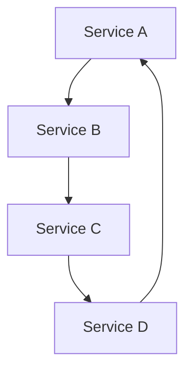

                 

### 引言：构建弹性可伸缩的微服务架构

在当今数字化时代，软件系统正以前所未有的速度和规模演变，而微服务架构（Microservices Architecture）已经成为应对复杂性和大规模分布式系统设计的重要策略。微服务架构的核心思想是将应用程序分解为多个独立的小型服务，每个服务负责特定的业务功能，并通过轻量级的通信机制（如HTTP/REST或消息队列）进行交互。

微服务架构的优势在于其可扩展性、灵活性和容错性。通过将大型的单体应用程序分解成一系列相互独立的小服务，开发团队能够更快地迭代和部署功能，从而提高开发效率和业务响应速度。此外，微服务的分布式特性使得系统具有更高的弹性和容错能力，单个服务的故障不会影响到整个系统的正常运行。

然而，微服务架构也带来了一系列新的挑战。由于服务的数量和交互复杂性增加，系统的部署、监控和运维变得更加复杂。如何设计一个既弹性又可伸缩的微服务架构，成为许多开发者面临的重大问题。本文将深入探讨如何构建这样的微服务架构，并提供一系列实践指南和最佳实践。

本文将分以下几部分进行详细阐述：

1. **微服务架构的基石**：介绍微服务的基本概念、原则及其相对于单体架构的优势和挑战。
2. **微服务设计模式**：探讨如何有效地设计和分解服务，以及服务之间的通信策略。
3. **构建微服务架构**：讨论微服务的部署、故障处理和监控等基础设施问题。
4. **实现微服务**：分享开发微服务的最佳实践，包括持续集成、测试和安全性等方面。
5. **微服务的扩展策略**：探讨如何实现微服务的水平扩展和垂直扩展，以及性能优化技术。
6. **维护与监控**：介绍如何保持微服务的健康运行，包括实时监控和故障响应策略。
7. **案例分析**：通过实际案例展示如何应用微服务架构，以及其优势和挑战。
8. **总结与展望**：回顾本文的主要观点，并展望未来的发展方向。

通过本文的逐步分析，我们希望读者能够对构建弹性可伸缩的微服务架构有更深入的理解，从而在设计分布式系统时能够更加得心应手。

### 关键词

- **微服务架构**
- **弹性**
- **可伸缩性**
- **设计模式**
- **持续集成**
- **监控与运维**
- **最佳实践**

### 摘要

本文旨在深入探讨如何构建一个弹性且可伸缩的微服务架构。首先，我们介绍了微服务架构的基本概念、原则和优势，以及其相对于传统单体架构的挑战。随后，我们探讨了微服务的设计模式，包括服务分解策略、通信协议和数据格式选择。接着，文章详细讨论了微服务的构建过程，涉及服务发现、负载均衡、故障处理和监控系统。然后，我们分享了开发微服务的最佳实践，包括持续集成、测试和安全策略。最后，文章提出了实现微服务扩展的策略，如水平扩展和垂直扩展，以及性能优化技术。通过实际案例的分析和总结，本文为开发者提供了全面的微服务架构实践指南，帮助他们设计并维护高度弹性和可伸缩的分布式系统。

## 第一章：微服务架构的基石

### 1.1 微服务的基本概念

微服务（Microservices）是一种架构风格，其核心思想是将一个大型、复杂的单体应用程序分解为一系列更小、更独立的子服务。每个微服务专注于实现特定的业务功能，并且拥有自己独立的数据库和其他资源。这些微服务通过轻量级的通信机制（如HTTP/REST或消息队列）进行交互，共同构成一个完整的分布式系统。

与传统的单体架构不同，微服务架构具有高度的模块化和独立性。每个微服务都是独立部署、开发和运维的，这意味着任何一个微服务的故障都不会影响整个系统的运行。此外，微服务允许开发团队采用不同的技术栈来开发各个服务，从而提高开发效率和灵活性。

微服务的基本组件包括：

- **服务实例**：单个运行中的服务实例，负责处理客户端请求。
- **服务注册中心**：存储服务实例的地址和状态信息，实现服务发现和动态负载均衡。
- **API网关**：作为客户端和服务实例之间的入口，实现请求路由、负载均衡和请求聚合。
- **服务间通信**：服务实例之间通过HTTP/REST或消息队列进行通信。
- **数据库**：每个微服务拥有独立的数据库，避免了跨服务的复杂事务。

### 1.2 微服务架构的优势

微服务架构相较于传统的单体架构，具有以下显著优势：

1. **高可扩展性**：通过水平扩展单个服务实例，可以轻松实现系统性能的提升。单个服务的故障不会影响其他服务的运行，提高了系统的容错性。
2. **灵活性**：开发团队可以独立开发、测试和部署各个微服务，降低了协同开发的难度。同时，可以灵活选择最适合各个服务的技术栈，提高开发效率。
3. **快速迭代**：微服务的独立性使得团队能够更快速地迭代和部署功能，缩短了产品从概念到市场的时间。
4. **更好的容错性**：单个服务的故障可以被隔离，减少了故障传播的风险，提高了系统的稳定性。
5. **资源共享**：多个服务可以共享公共库、API网关和其他基础设施，降低了开发和运维的成本。

### 1.3 微服务架构的挑战

尽管微服务架构带来了众多优势，但也伴随着一些挑战：

1. **复杂性**：随着服务数量的增加，系统的复杂度也相应提升，增加了部署、监控和运维的难度。
2. **数据一致性问题**：由于每个服务拥有独立的数据库，跨服务的复杂事务处理和数据一致性保证变得更加困难。
3. **通信开销**：服务之间通过远程调用的方式进行通信，相较于单体架构中的本地调用，存在一定的通信开销。
4. **分布式追踪**：在分布式系统中，追踪请求的整个生命周期变得更加复杂，需要引入分布式追踪工具来监控和分析系统性能。
5. **安全性**：分布式系统的安全性设计比单体架构更加复杂，需要关注服务间的认证、授权和数据加密。

### 1.4 微服务与单体架构的对比

#### 性能和可扩展性

| 特性       | 微服务架构 | 单体架构 |
|------------|-------------|----------|
| **性能**   | 优秀的横向扩展能力，单个服务性能优化不影响其他服务 | 线性扩展能力，性能瓶颈可能影响整个系统 |
| **可扩展性** | 高度可扩展，可以通过增加服务实例来提升系统性能 | 扩展难度较大，扩展后可能需要重构整个系统 |

#### 开发与部署

| 特性       | 微服务架构 | 单体架构 |
|------------|-------------|----------|
| **开发**   | 各个服务可以独立开发、测试和部署 | 需要多个团队协作，开发周期较长 |
| **部署**   | 独立部署，单个服务可以随时升级或回滚 | 部署过程复杂，需要全面测试和风险控制 |

#### 灵活性与可维护性

| 特性       | 微服务架构 | 单体架构 |
|------------|-------------|----------|
| **灵活性** | 高度灵活性，可以采用不同技术栈 | 技术栈较为单一，灵活性较低 |
| **可维护性** | 每个服务独立维护，易于定位和修复问题 | 整体维护难度较大，故障难以隔离 |

### 结论

微服务架构通过其模块化和分布式特性，为开发者提供了一种更加灵活、可扩展和容错的解决方案。然而，这并不意味着微服务架构适用于所有场景。在实际应用中，需要根据业务需求和系统特点，权衡其优势与挑战，选择最合适的架构方案。

在下一章中，我们将深入探讨微服务的设计模式，包括服务分解策略、通信协议和数据格式选择，帮助读者更好地理解和应用微服务架构。

## 第二章：微服务设计模式

### 2.1 服务分解策略

微服务架构的核心在于如何有效地将一个复杂的应用程序分解成多个独立的微服务。正确的设计服务分解策略对于实现微服务架构的成功至关重要。以下是一些常用的服务分解策略：

#### 2.1.1 业务领域驱动设计

业务领域驱动设计（Domain-Driven Design, DDD）是一种常用的服务分解策略。根据DDD的原则，首先需要识别系统中的核心业务领域，并将这些领域划分为独立的微服务。每个微服务负责一个特定的业务领域，具有较高的业务一致性和自治性。

**案例：电子商务系统**
在电子商务系统中，可以将购物车、订单处理、库存管理和支付等业务领域划分为独立的微服务。每个微服务独立管理自己的数据，并在服务间进行数据同步。

#### 2.1.2 功能驱动设计

功能驱动设计（Feature-Driven Design, FDD）是一种根据功能模块来分解服务的策略。将系统功能分解成一系列独立的功能模块，每个模块对应一个微服务。这种方法适用于功能复杂且需求变化频繁的系统。

**案例：社交媒体平台**
在社交媒体平台上，可以将用户登录、发帖、评论、私信等功能分解成独立的微服务。每个微服务独立处理特定功能，并与其他服务通过API进行交互。

#### 2.1.3 组件复用驱动设计

组件复用驱动设计（Component-Based Design, CBD）是基于组件的分解策略。将系统分解成一系列可复用的组件，每个组件可以独立开发和部署。这种方法适用于组件化程度较高的系统。

**案例：金融服务系统**
在金融服务系统中，可以将身份验证、风险控制、支付处理等核心组件分解成独立的微服务。这些组件具有较高的复用性和灵活性，可以应用于不同的金融服务场景。

### 2.2 通信协议与数据格式

微服务之间的通信协议和数据格式选择对于系统的性能和可靠性至关重要。以下是一些常用的通信协议和数据格式：

#### 2.2.1 HTTP/REST

HTTP/REST（Representational State Transfer）是一种广泛使用的通信协议，特别适用于微服务架构。RESTful API具有简单、灵活和易于理解的特点，支持各种编程语言和工具。

**优点：**
- **通用性**：HTTP是互联网标准协议，具有广泛的兼容性和可扩展性。
- **灵活性**：支持各种数据格式（如JSON、XML）和HTTP方法（如GET、POST、PUT、DELETE）。

**缺点：**
- **性能开销**：相较于其他通信协议，HTTP通信存在一定的性能开销。
- **复杂度**：在处理复杂事务时，HTTP请求和响应的序列化与反序列化过程可能导致一定的延迟。

#### 2.2.2 gRPC

gRPC是一种高性能、跨平台的通信协议，基于HTTP/2协议实现。gRPC使用Protocol Buffers（Protobuf）作为数据格式，具有序列化和反序列化速度快、二进制格式等优点。

**优点：**
- **性能优异**：gRPC使用高效的二进制协议，减少了序列化和反序列化时间。
- **多语言支持**：支持多种编程语言，便于集成和开发。

**缺点：**
- **学习曲线**：相较于HTTP/REST，gRPC的学习曲线较高，需要了解Protobuf语法和gRPC框架。
- **互操作性**：由于使用特定的协议和数据格式，与其他系统的集成可能存在一定的互操作性问题。

#### 2.2.3 消息队列

消息队列（Message Queue）是一种异步通信机制，常用于实现分布式系统中的解耦和异步处理。常用的消息队列技术包括RabbitMQ、Kafka和ActiveMQ等。

**优点：**
- **解耦**：消息队列将生产者和消费者解耦，提高了系统的可扩展性和可靠性。
- **异步处理**：支持异步消息传递，降低系统的响应时间。

**缺点：**
- **延迟问题**：消息队列可能引入一定的延迟，影响系统的实时性。
- **复杂度**：消息队列的管理和监控需要额外的资源和技能。

### 2.3 选择合适的通信协议与数据格式

在选择通信协议和数据格式时，需要根据具体场景和需求进行权衡：

1. **简单性和兼容性**：对于需要快速开发和部署的系统，可以选择HTTP/REST和JSON。这些技术易于理解和实现，支持多种编程语言和工具。
2. **性能和可靠性**：对于对性能和可靠性有较高要求的系统，可以选择gRPC和Protobuf。这些技术具有高效的序列化和反序列化性能，适用于大规模分布式系统。
3. **异步处理和解耦**：对于需要实现异步处理和解耦的系统，可以选择消息队列。消息队列支持复杂的业务逻辑和大规模数据处理，但需要考虑延迟问题和系统复杂性。

### 结论

微服务的设计模式是构建高效、可扩展和容错分布式系统的关键。通过合理的服务分解策略和选择合适的通信协议与数据格式，开发团队能够更好地应对复杂业务场景，提高系统性能和可靠性。在下一章中，我们将深入探讨如何构建微服务的架构，包括服务发现、负载均衡、故障处理和监控系统。

## 第三章：构建微服务架构

### 3.1 架构与基础设施

构建一个成功的微服务架构不仅需要精心设计服务本身，还需要构建一个坚实且高效的基础设施。以下是构建微服务架构时需要考虑的关键组件和策略。

#### 3.1.1 服务发现

服务发现（Service Discovery）是微服务架构中的一个关键组成部分，它允许服务实例动态地注册和发现其他服务的位置。服务发现确保了微服务之间能够顺利通信，并能够在服务实例出现故障或新实例上线时自动调整通信路径。

**实现服务发现的方法：**

1. **基于DNS的服务发现**：使用DNS进行服务发现是一种简单且常用的方法。服务实例启动时，向DNS服务器注册自己的地址，客户端通过DNS查询服务名称来获取服务实例的地址。
2. **服务注册中心**：服务注册中心是一种集中管理的服务发现机制。服务实例启动时，向注册中心注册自身的信息，客户端通过查询注册中心来获取服务实例的地址。

**示例：**

- **Consul**：Consul是一个分布式服务发现和健康检查工具，支持服务注册、健康检查和动态服务发现。
- **Eureka**：Eureka是Netflix开源的服务注册和发现工具，广泛用于Spring Cloud微服务架构中。

#### 3.1.2 负载均衡

负载均衡（Load Balancing）是一种用于分配网络流量到多个服务实例的机制，以确保系统的高可用性和性能。负载均衡器可以动态地分配请求到不同的服务实例，以避免单点故障和性能瓶颈。

**实现负载均衡的方法：**

1. **轮询负载均衡**：将请求依次分配到每个服务实例，是最简单和最常用的负载均衡策略。
2. **最小连接数负载均衡**：将请求分配到当前连接数最少的服务实例，以平衡负载。
3. **哈希负载均衡**：根据请求的某些特征（如客户端IP地址），将请求固定分配到特定的服务实例，以确保会话保持一致性。

**示例：**

- **Nginx**：Nginx是一个高性能的Web服务器和反向代理服务器，支持多种负载均衡策略。
- **HAProxy**：HAProxy是一个开源的高性能负载均衡器，广泛应用于高并发的Web应用程序。

#### 3.1.3 故障处理

在分布式系统中，故障是不可避免的。有效的故障处理策略能够确保系统的稳定性和可靠性，包括故障检测、故障恢复和故障隔离。

**实现故障处理的方法：**

1. **健康检查**：定期对服务实例进行健康检查，确保其能够正常处理请求。
2. **断路器模式**：当服务实例频繁失败或响应时间过长时，断路器模式可以自动切换到备用服务实例或触发降级处理。
3. **服务熔断**：在服务实例不可用时，熔断机制可以切断对服务的调用，避免请求堆积和系统过载。

**示例：**

- **Hystrix**：Hystrix是Netflix开源的断路器库，用于实现断路器模式和服务熔断。
- **Resilience4j**：Resilience4j是一个轻量级的容错库，提供断路器、熔断和回退等故障处理功能。

#### 3.1.4 监控与日志

监控和日志是确保微服务架构正常运行的重要工具。通过监控和日志，开发团队能够实时了解系统的运行状况，快速定位和解决潜在问题。

**实现监控与日志的方法：**

1. **指标监控**：使用指标监控工具（如Prometheus、Grafana）收集和展示系统的性能指标，如请求响应时间、CPU使用率、内存使用率等。
2. **日志收集**：使用日志收集工具（如ELK堆栈、Logstash）将服务日志集中存储，并进行实时分析和搜索。
3. **异常告警**：设置异常告警机制，当系统出现异常时，自动发送通知到相关人员，以便快速响应。

**示例：**

- **Prometheus**：Prometheus是一个开源的监控解决方案，支持灵活的数据采集和告警机制。
- **ELK堆栈**：ELK堆栈由Elasticsearch、Logstash和Kibana组成，提供强大的日志收集、存储和可视化功能。

### 3.2 容器化与编排

容器化（Containerization）和编排（Orchestration）技术在微服务架构中发挥着重要作用。容器化通过将应用程序及其依赖打包到独立的容器中，提高了部署的灵活性和可移植性。编排则负责管理和调度这些容器实例，确保系统的高可用性和性能。

**容器化与编排的关键组件：**

1. **Docker**：Docker是一个开源的容器化平台，用于构建、运行和分发容器化的应用程序。
2. **Kubernetes**：Kubernetes是一个开源的容器编排平台，用于自动化容器的部署、扩展和管理。

**示例：**

- **Docker Compose**：Docker Compose用于定义和运行多容器应用的模板文件，支持服务发现和负载均衡。
- **Kubernetes Ingress**：Kubernetes Ingress用于管理外部访问到集群内部服务的路由规则。

### 3.3 云原生技术与自动化

云原生技术（Cloud-Native Technologies）和自动化（Automation）是构建现代微服务架构的重要趋势。云原生技术利用云计算的优势，提供灵活、可扩展和自动化的解决方案。自动化则通过工具和流程的自动化，减少了人工干预，提高了系统的可靠性和效率。

**实现云原生和自动化的方法：**

1. **持续集成与持续部署（CI/CD）**：通过自动化工具（如Jenkins、GitLab CI）实现代码的自动化测试和部署，提高开发效率和软件质量。
2. **基础设施即代码（Infrastructure as Code, IaC）**：使用配置管理工具（如Ansible、Terraform）将基础设施定义和部署过程代码化，实现基础设施的自动化管理和扩展。
3. **自动化监控与告警**：使用自动化工具（如Prometheus、PagerDuty）实现实时监控和告警，快速响应系统异常。

**示例：**

- **Jenkins**：Jenkins是一个开源的持续集成工具，支持自动化测试和部署。
- **Ansible**：Ansible是一个开源的配置管理和自动化工具，用于自动化部署和管理基础设施。

### 结论

构建微服务架构需要综合考虑服务发现、负载均衡、故障处理、监控与日志、容器化与编排、云原生技术和自动化等方面。通过合理设计和部署这些关键组件和策略，开发团队能够构建一个高效、可靠且可扩展的分布式系统。在下一章中，我们将深入探讨如何实现微服务的最佳实践，包括开发、测试和安全性等方面。

## 第四章：实现微服务的最佳实践

### 4.1 开发微服务的最佳实践

开发微服务的过程中，遵循一系列最佳实践可以显著提高系统的质量、可维护性和可扩展性。以下是一些关键的实践指南：

#### 4.1.1 持续集成与持续部署（CI/CD）

持续集成（Continuous Integration, CI）和持续部署（Continuous Deployment, CD）是微服务开发中不可或缺的实践。CI/CD通过自动化流程，确保每次代码提交后都能进行全面的测试和部署，从而提高开发效率和代码质量。

**实现CI/CD的方法：**

1. **自动化测试**：编写单元测试、集成测试和端到端测试，确保每次代码变更后都能自动运行。
2. **自动化构建**：使用自动化工具（如Jenkins、GitLab CI）将代码打包、构建和部署到测试环境。
3. **容器化**：使用容器（如Docker）将应用程序和其依赖打包到一个独立的镜像中，确保环境一致性。

**示例：**

- **Jenkins**：Jenkins是一个开源的持续集成和持续部署工具，支持多种插件和自动化流程。
- **GitLab CI**：GitLab CI是GitLab内置的持续集成服务，通过YAML配置文件定义自动化流程。

#### 4.1.2 测试与质量保证

微服务架构中，测试和质量保证（Quality Assurance, QA）是确保系统可靠性和稳定性的关键环节。以下是一些关键的测试和QA实践：

1. **单元测试**：编写单元测试，验证每个微服务的功能模块是否符合预期。
2. **集成测试**：编写集成测试，验证不同微服务之间的交互是否正常。
3. **性能测试**：进行负载测试和压力测试，评估系统在高并发场景下的性能和稳定性。
4. **安全性测试**：进行安全性测试，确保系统免受常见的安全威胁。

**实现测试与QA的方法：**

1. **自动化测试框架**：使用自动化测试框架（如JUnit、TestNG）编写测试用例。
2. **测试环境**：建立独立的测试环境，确保测试的独立性。
3. **测试报告**：生成详细的测试报告，记录测试结果和问题。

**示例：**

- **JUnit**：JUnit是一个流行的Java测试框架，支持编写单元测试和集成测试。
- **Postman**：Postman是一个API测试工具，用于测试微服务之间的交互。

#### 4.1.3 安全性考虑

微服务架构中，安全性是设计的一个重要方面。由于微服务之间通过网络进行通信，需要特别关注数据安全和通信安全。

**实现安全性考虑的方法：**

1. **身份验证与授权**：使用身份验证（如OAuth 2.0、JWT）确保只有授权用户可以访问服务。
2. **数据加密**：对敏感数据进行加密存储和传输，使用HTTPS、TLS等协议保护数据安全。
3. **安全配置**：配置安全的网络设置，如防火墙、网络隔离等。
4. **审计与监控**：建立审计和监控机制，及时发现和响应安全事件。

**示例：**

- **Spring Security**：Spring Security是一个开源的安全框架，提供身份验证、授权和安全配置等功能。
- **Vault**：Vault是一个集中化的安全秘密管理工具，用于管理加密密钥和认证令牌。

### 4.2 微服务的部署策略

微服务的部署策略对于系统的可用性、性能和可扩展性至关重要。以下是一些关键的部署策略：

#### 4.2.1 独立部署

独立部署（Independent Deployment）是指每个微服务可以独立进行部署，无需关心其他服务的状态。这种方法提高了部署的灵活性和可扩展性，但需要确保服务之间的依赖关系得到妥善处理。

**实现独立部署的方法：**

1. **版本管理**：为每个微服务分配唯一的版本号，确保不同版本的服务可以同时运行。
2. **服务发现**：使用服务发现机制，确保部署后的服务实例能够被其他服务发现和调用。
3. **滚动部署**：采用滚动部署策略，逐步替换旧版本的服务实例，确保系统的连续性和稳定性。

**示例：**

- **Kubernetes Rolling Update**：Kubernetes的滚动更新策略可以确保在部署新版本的服务实例时，旧版本实例仍然可用。

#### 4.2.2 一致性部署

一致性部署（Consistent Deployment）是指整个系统中的所有微服务需要同时部署到同一环境中。这种方法确保了系统的一致性和完整性，但可能降低部署的灵活性。

**实现一致性部署的方法：**

1. **一次性部署**：将所有微服务的代码打包成一个大型的部署包，一次性部署到生产环境中。
2. **蓝绿部署**：部署一个新环境的“蓝绿”副本，将流量逐步切换到新环境，确保系统稳定运行。
3. **金丝雀部署**：部署一个小规模的新环境，将部分流量切换到新环境，观察其性能和稳定性。

**示例：**

- **Kubernetes蓝绿部署**：Kubernetes支持蓝绿部署策略，确保在部署新版本的服务实例时，可以逐步切换流量。

### 4.3 运维与监控

运维（Operations）和监控（Monitoring）是确保微服务架构稳定运行的重要环节。以下是一些关键的运维和监控实践：

#### 4.3.1 实时监控

实时监控可以帮助开发团队及时发现系统中的异常和问题，确保系统的稳定性和可靠性。

**实现实时监控的方法：**

1. **指标监控**：使用指标监控工具（如Prometheus、Grafana）收集和展示系统的性能指标。
2. **日志监控**：使用日志监控工具（如ELK堆栈、Logstash）收集和存储服务日志，进行实时分析和告警。
3. **应用性能监控**：使用应用性能监控工具（如New Relic、AppDynamics）监控应用程序的运行状态和性能。

**示例：**

- **Prometheus**：Prometheus是一个开源的监控解决方案，支持灵活的数据采集和告警机制。
- **Grafana**：Grafana是一个开源的数据可视化和监控工具，支持多种数据源和仪表盘。

#### 4.3.2 故障恢复

故障恢复（Fault Recovery）是指系统在发生故障后能够迅速恢复，减少对用户的影响。

**实现故障恢复的方法：**

1. **故障检测**：定期对系统进行健康检查，及时发现故障。
2. **自动恢复**：使用自动化工具（如Kubernetes自动重启、弹性伸缩）自动恢复故障服务。
3. **备份与恢复**：定期备份系统数据，确保在故障发生后可以快速恢复。

**示例：**

- **Kubernetes自动重启**：Kubernetes可以在服务实例发生故障时自动重启。
- **AWS弹性伸缩**：AWS的弹性伸缩功能可以根据负载自动增加或减少服务实例的数量。

### 结论

实现微服务的最佳实践涵盖了开发、测试、部署、运维和监控等各个环节。通过遵循这些最佳实践，开发团队能够构建一个高效、可靠且可扩展的微服务架构，从而更好地满足业务需求。在下一章中，我们将探讨如何实现微服务的水平扩展和垂直扩展，以及性能优化技术。

## 第五章：微服务的扩展策略

### 5.1 水平扩展与垂直扩展

为了应对不断增长的业务需求和用户负载，微服务架构必须具备良好的扩展能力。扩展策略分为水平扩展（Horizontal Scaling）和垂直扩展（Vertical Scaling）两种，每种方法都有其独特的优势和适用场景。

#### 5.1.1 水平扩展

水平扩展是指通过增加更多的服务实例来提升系统的处理能力。每个服务实例都是独立的，它们之间通过负载均衡器进行均衡负载，从而实现系统性能的线性提升。

**优势：**

- **高可扩展性**：通过增加服务实例，可以轻松应对突发流量和长期增长。
- **低成本**：水平扩展通常比垂直扩展更加经济，因为可以使用廉价的硬件资源。
- **高容错性**：单个服务实例的故障不会影响整个系统，因为其他实例可以继续处理请求。

**适用场景：**

- **高并发访问**：适用于需要处理大量并发请求的场景，如电子商务网站。
- **读操作密集型**：对于读操作密集型应用，水平扩展可以提供更高的读性能。

**实现方法：**

- **负载均衡**：使用负载均衡器（如Nginx、HAProxy）将请求分配到不同的服务实例。
- **容器编排**：使用容器编排工具（如Kubernetes）管理服务实例的部署和扩展。
- **自动伸缩**：配置自动伸缩规则，根据系统的负载自动增加或减少服务实例的数量。

#### 5.1.2 垂直扩展

垂直扩展是指通过增加服务实例的硬件资源（如CPU、内存、存储）来提升系统的处理能力。这种方法通常涉及升级现有服务实例的硬件配置。

**优势：**

- **高性能**：垂直扩展可以提供更高的计算能力和存储容量，适用于处理复杂计算或大量数据的应用。
- **简单性**：升级硬件配置相对简单，不需要大规模改变系统的架构。

**适用场景：**

- **计算密集型**：适用于需要进行大量计算的应用，如数据分析、机器学习等。
- **存储密集型**：适用于需要存储大量数据的应用，如大数据处理、内容分发等。

**实现方法：**

- **硬件升级**：增加服务实例的CPU、内存、存储等硬件资源。
- **分布式存储**：使用分布式存储系统（如Hadoop、Cassandra）来处理大量数据。
- **数据库扩展**：通过分片（Sharding）和复制（Replication）来扩展数据库的性能和容量。

### 5.2 负载测试与性能优化

为了确保微服务架构在扩展后仍然能够保持高性能和稳定性，负载测试和性能优化是不可或缺的步骤。

#### 5.2.1 负载测试

负载测试（Load Testing）是一种评估系统性能和稳定性的方法，通过模拟大量用户请求来测试系统的响应时间、吞吐量和资源利用率。以下是一些负载测试的关键步骤：

1. **定义测试场景**：根据实际业务场景，定义不同的负载场景，如正常负载、高并发负载和极限负载。
2. **配置测试工具**：使用负载测试工具（如JMeter、LoadRunner）配置测试场景，模拟用户请求。
3. **执行测试**：运行负载测试，收集系统的性能指标和日志信息。
4. **分析结果**：分析测试结果，识别系统的瓶颈和性能问题。

#### 5.2.2 性能优化

性能优化（Performance Optimization）是指通过改进系统架构、代码和基础设施来提升系统性能的过程。以下是一些常见的性能优化策略：

1. **缓存策略**：使用缓存（如Redis、Memcached）来减少数据库访问，提高响应速度。
2. **数据库优化**：通过索引、分片和复制来优化数据库性能。
3. **代码优化**：优化算法和数据结构，减少不必要的计算和资源消耗。
4. **服务拆分**：将大型服务拆分成更小的服务，减少单个服务的负载。
5. **网络优化**：优化网络配置，减少网络延迟和带宽占用。

### 5.3 水平扩展与垂直扩展的比较

#### 比较

| **特性** | **水平扩展** | **垂直扩展** |
|----------|-------------|-------------|
| **扩展方式** | 增加服务实例 | 增加硬件资源 |
| **成本** | 低成本，适合大规模扩展 | 高成本，适合小规模扩展 |
| **性能提升** | 线性提升，适用于读操作密集型应用 | 非线性提升，适用于计算密集型应用 |
| **适用场景** | 高并发、读操作密集型应用 | 计算密集型、存储密集型应用 |

### 结论

水平扩展和垂直扩展是微服务架构中实现性能提升和可扩展性的重要策略。通过合理选择和应用这些策略，开发团队能够确保微服务架构在应对业务增长和用户需求变化时保持高性能和稳定性。在下一章中，我们将探讨如何保持微服务的健康运行，包括实时监控、故障响应和长期维护策略。

## 第六章：保持微服务的健康运行

### 6.1 实时监控

实时监控是确保微服务架构健康运行的关键环节。通过实时监控，开发团队能够及时发现系统中的异常和问题，从而快速响应和解决。以下是一些关键的实时监控实践：

#### 6.1.1 指标监控

指标监控（Metrics Monitoring）是一种通过收集和展示系统性能指标来监控系统健康状况的方法。常用的指标包括：

- **CPU和内存使用率**：监控服务实例的CPU和内存使用情况，以识别资源瓶颈。
- **请求响应时间**：监控服务的请求响应时间，以评估系统的响应性能。
- **吞吐量**：监控系统的请求处理能力，以识别系统的负载情况。

**实现指标监控的方法：**

1. **集成监控工具**：使用集成监控工具（如Prometheus、Grafana）来收集和展示指标数据。
2. **定制指标**：根据业务需求，自定义监控指标，以便更准确地反映系统的运行状况。

**示例：**

- **Prometheus**：Prometheus是一个开源的监控解决方案，支持多种数据源和监控插件。
- **Grafana**：Grafana是一个开源的数据可视化工具，支持多种图表和仪表盘。

#### 6.1.2 日志监控

日志监控（Log Monitoring）是一种通过收集和存储服务日志来监控系统运行状态的方法。日志包含详细的信息，有助于识别系统中的异常和错误。

**实现日志监控的方法：**

1. **集中存储**：使用日志收集工具（如ELK堆栈、Logstash）将日志集中存储在统一的存储系统中。
2. **实时分析**：使用日志分析工具（如Kibana、Logz.io）对日志进行实时分析和搜索。
3. **告警机制**：配置告警规则，当日志中包含特定关键字或异常时，自动发送告警通知。

**示例：**

- **ELK堆栈**：ELK堆栈由Elasticsearch、Logstash和Kibana组成，提供强大的日志收集、存储和可视化功能。
- **Kibana**：Kibana是一个开源的数据可视化工具，用于监控和可视化日志数据。

#### 6.1.3 应用性能监控

应用性能监控（Application Performance Monitoring, APM）是一种通过监控应用程序的运行状态和性能来识别潜在问题的方法。APM工具可以提供关于请求处理时间、错误率和异常情况等详细信息。

**实现应用性能监控的方法：**

1. **集成APM工具**：使用APM工具（如New Relic、AppDynamics）对应用程序进行监控。
2. **定制监控指标**：根据业务需求，自定义监控指标，以便更准确地反映应用程序的性能状况。

**示例：**

- **New Relic**：New Relic是一个商业APM工具，提供全面的性能监控和错误分析功能。
- **AppDynamics**：AppDynamics是一个商业APM工具，支持自动化监控和故障排除。

### 6.2 故障响应

在分布式系统中，故障是不可避免的。有效的故障响应（Fault Response）策略能够确保系统在发生故障时能够迅速恢复，减少对用户的影响。

#### 6.2.1 故障检测

故障检测（Fault Detection）是指定期对系统进行健康检查，以识别潜在的故障。以下是一些故障检测的方法：

1. **周期性健康检查**：定期对服务实例进行健康检查，确保其能够正常处理请求。
2. **异常检测**：使用机器学习算法和统计模型对系统行为进行分析，识别异常行为。

#### 6.2.2 自动恢复

自动恢复（Automatic Recovery）是指系统在发生故障时能够自动恢复，减少人工干预。以下是一些自动恢复的方法：

1. **自动重启**：当服务实例出现故障时，自动重启实例以恢复正常。
2. **故障转移**：当主服务实例出现故障时，自动将流量切换到备用实例。
3. **自我修复**：使用自我修复机制（如自我修复数据库、自我修复网络）来自动解决常见故障。

#### 6.2.3 故障隔离

故障隔离（Fault Isolation）是指将故障限制在最小范围内，防止其扩散到其他服务实例。以下是一些故障隔离的方法：

1. **服务隔离**：当某个服务实例出现故障时，将其从系统中隔离，防止影响其他服务实例。
2. **熔断机制**：当服务实例频繁失败或响应时间过长时，熔断机制可以切断对服务的调用，防止请求堆积和系统过载。

### 6.3 长期维护策略

长期维护（Long-term Maintenance）是确保微服务架构持续稳定运行的关键。以下是一些长期维护策略：

#### 6.3.1 更新和升级

定期对系统进行更新和升级，确保其保持最新的安全和性能优化。以下是一些更新和升级的最佳实践：

1. **版本控制**：使用版本控制系统（如Git）管理代码和配置文件，确保版本的可追溯性和可回滚性。
2. **灰度发布**：采用灰度发布策略，逐步将更新和升级部署到生产环境，确保系统的稳定性和安全性。
3. **自动化更新**：使用自动化工具（如Ansible、Terraform）进行系统的更新和升级，减少人工干预。

#### 6.3.2 负载均衡和故障转移

确保系统的负载均衡和故障转移策略能够有效地处理流量和故障。以下是一些最佳实践：

1. **动态负载均衡**：使用动态负载均衡器（如Nginx、HAProxy）根据系统负载自动调整流量分配。
2. **高可用集群**：使用高可用集群（如Kubernetes集群）确保系统的容错能力和可靠性。

#### 6.3.3 监控和告警

建立全面的监控和告警机制，确保系统能够及时发现和响应异常情况。以下是一些监控和告警的最佳实践：

1. **多维度监控**：监控系统的多个维度，如性能、安全、资源利用率等，确保全面了解系统的运行状况。
2. **实时告警**：配置实时告警，当系统出现异常时，自动发送通知到相关人员，以便快速响应。

### 结论

通过实时监控、故障响应和长期维护策略，开发团队能够确保微服务架构持续稳定运行。在下一章中，我们将通过实际案例展示如何应用微服务架构，并分析其优势和挑战。

## 第七章：案例分析

### 7.1 实际案例展示

为了更好地理解如何在实际项目中应用微服务架构，我们将分析两个具有代表性的案例：亚马逊和Uber。

#### 7.1.1 亚马逊

亚马逊是一个典型的采用微服务架构的大型电商平台。其微服务架构具有以下特点：

1. **高度模块化**：亚马逊将各种业务功能（如订单处理、支付、库存管理、推荐系统等）分解成多个独立的微服务，每个微服务负责特定的业务功能。
2. **分布式部署**：亚马逊的微服务分布在多个数据中心，通过负载均衡器实现流量分发和故障转移。
3. **自动化运维**：亚马逊使用自动化工具进行微服务的部署、监控和故障处理，如Kubernetes、AWS Lambda等。

**优势：**

- **高可扩展性**：通过水平扩展，亚马逊能够轻松应对高峰期的流量。
- **高容错性**：单个微服务的故障不会影响整个系统，其他微服务可以继续正常运行。
- **快速迭代**：开发团队能够独立开发和部署各个微服务，提高开发效率。

**挑战：**

- **复杂性**：随着微服务数量的增加，系统的复杂度也随之提升，增加了部署、监控和运维的难度。
- **数据一致性**：由于各个微服务拥有独立的数据库，需要处理跨服务的数据一致性问题。

#### 7.1.2 Uber

Uber是一个提供出租车和拼车服务的全球性公司，其微服务架构同样具有显著的特点：

1. **高并发处理**：Uber需要处理大量的并发请求，其微服务架构通过水平扩展和负载均衡来确保系统的高性能和高可用性。
2. **分布式数据存储**：Uber使用分布式数据库（如MySQL Cluster、Cassandra）来存储大量的用户数据和历史数据。
3. **实时数据处理**：Uber使用实时数据处理框架（如Apache Kafka、Apache Flink）来处理和分析实时数据，支持实时推荐和决策。

**优势：**

- **高性能**：通过水平扩展，Uber能够高效处理海量并发请求。
- **实时性**：实时数据处理框架支持Uber提供实时的推荐和决策。
- **高可扩展性**：Uber能够根据业务需求灵活扩展服务实例，应对流量波动。

**挑战：**

- **数据一致性**：Uber需要处理跨服务的数据一致性问题，特别是在分布式系统中。
- **监控复杂性**：由于系统的规模和复杂性，Uber需要强大的监控工具来确保系统的稳定性和可靠性。

### 7.2 案例分析

通过以上案例分析，我们可以看到微服务架构在实际应用中的优势和挑战：

#### 7.2.1 优势

- **高可扩展性**：微服务架构通过水平扩展和负载均衡，能够高效应对流量的波动和业务需求的增长。
- **高容错性**：单个微服务的故障不会影响整个系统，系统的其他部分可以继续正常运行。
- **快速迭代**：开发团队能够独立开发和部署各个微服务，提高开发效率和业务响应速度。
- **灵活性**：可以灵活选择最适合各个服务的技术栈，提高开发效率和系统性能。

#### 7.2.2 挑战

- **复杂性**：随着微服务数量的增加，系统的复杂度也随之提升，增加了部署、监控和运维的难度。
- **数据一致性**：在分布式系统中，跨服务的数据一致性问题需要特别处理。
- **监控与运维**：需要强大的监控工具和运维团队能力，以确保系统的稳定性和可靠性。

### 结论

通过案例分析，我们深入了解了微服务架构在实际应用中的优势和挑战。尽管微服务架构带来了复杂的挑战，但其高可扩展性、高容错性和快速迭代的优势使得其在现代分布式系统中仍然具有强大的吸引力。在下一章中，我们将总结本文的主要观点，并展望未来的发展方向。

### 总结

本文围绕构建弹性可伸缩的微服务架构进行了深入探讨。通过详细分析微服务的基本概念、设计模式、构建策略、扩展策略、最佳实践以及实际案例分析，我们系统地了解了微服务架构的设计原则和实现方法。

首先，我们介绍了微服务的基本概念和优势，强调了其高可扩展性、灵活性、快速迭代和容错性等优势，并指出了相对于传统单体架构的挑战。

接着，我们探讨了微服务的设计模式，包括业务领域驱动设计、功能驱动设计和组件复用驱动设计，以及通信协议和数据格式选择，为构建合理的微服务架构奠定了基础。

在构建微服务架构的部分，我们详细讨论了服务发现、负载均衡、故障处理、监控与日志等基础设施组件，并介绍了容器化与编排、云原生技术和自动化等现代微服务架构的最佳实践。

随后，我们分享了开发微服务的最佳实践，包括持续集成与持续部署（CI/CD）、测试与质量保证、安全性考虑等，为开发团队能够高效地实现微服务提供了指导。

扩展策略部分，我们介绍了水平扩展和垂直扩展的优缺点以及实现方法，并探讨了负载测试与性能优化的重要性。

最后，通过实际案例分析，我们展示了微服务架构在亚马逊和Uber等大型企业中的应用，并分析了其实际优势与挑战。

未来，随着云计算和人工智能技术的发展，微服务架构将继续演进。分布式系统的一致性、安全性、自动化和智能化将成为重要研究方向。同时，微服务与区块链、物联网（IoT）等新兴技术的融合也将为微服务架构带来新的机遇和挑战。

### 拓展阅读

- 《微服务设计》- by Chris Richardson
- 《微服务架构实践》- by Sam Newman
- 《分布式系统设计》- by Vaughn Vernon
- 《Kubernetes实战》- by Kelsey Hightower

通过这些资源，您可以更深入地了解微服务架构的设计与实现，为实际项目提供有力支持。感谢您的阅读，希望本文能对您在构建弹性可伸缩的微服务架构过程中有所启发。

### 作者信息

作者：AI天才研究院/AI Genius Institute & 禅与计算机程序设计艺术 /Zen And The Art of Computer Programming

### Mermaid 流程图和LaTeX公式

为了更好地理解文章中的概念和算法，我们将在此处提供几个Mermaid流程图和LaTeX公式。

#### Mermaid 流程图

以下是一个简单的Mermaid流程图，用于描述微服务架构的核心组件：



该图展示了服务A、B、C和D之间的交互，形成了一个闭环。

#### LaTeX 公式

下面是一个用于描述微服务扩展的LaTeX公式：

```latex
\documentclass{article}
\usepackage{amsmath}
\begin{document}
\begin{equation}
\text{C}_{\text{total}} = \sum_{i=1}^{n} \text{C}_{i}
\end{equation}
\end{document}
```

该公式表示系统的总成本（\( \text{C}_{\text{total}} \)）是各个服务成本（\( \text{C}_{i} \)）的总和。

通过这些Mermaid流程图和LaTeX公式，您可以更直观地理解文章中的技术概念和算法原理。希望这些工具能够帮助您更好地学习和应用微服务架构。

