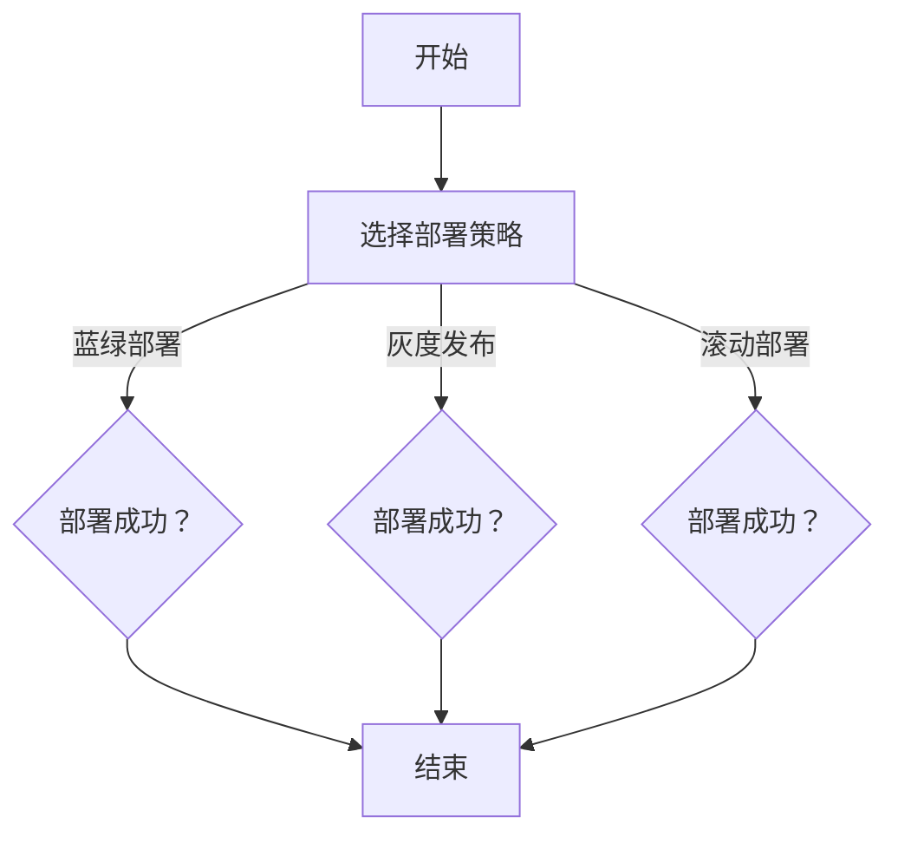
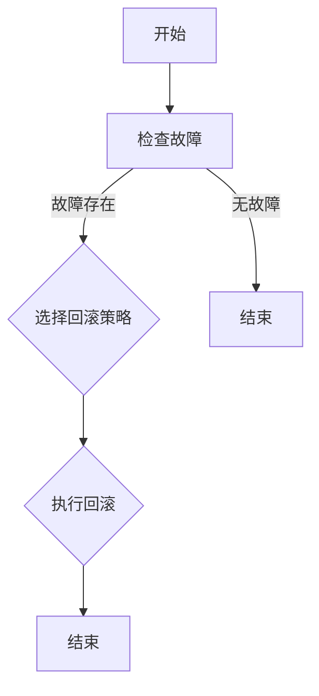

                 

构建高效的代码部署与回滚系统

关键词：代码部署、回滚、版本控制、故障检测、部署策略

摘要：
本文将深入探讨构建高效的代码部署与回滚系统的关键要素。首先，我们介绍代码部署与回滚的背景及其重要性。接着，我们详细阐述构建高效系统的核心问题与解决策略。然后，通过核心概念与联系的解析，帮助读者理解系统组件及其关系。在此基础上，我们将介绍部署算法的原理，并通过具体的Python源代码和数学模型进行深入讲解。此外，文章还将分析系统的架构设计，并通过项目实战提供实际案例。最后，我们将总结最佳实践和注意事项，以帮助读者更好地理解和应用这些技术。

## 第一部分：背景介绍

### 1.1 问题背景

随着软件系统的复杂度和规模日益增大，代码部署和回滚问题变得越来越重要。在软件开发生命周期中，频繁的代码更新和系统变更可能导致系统稳定性受到影响，甚至引发故障。如何在保证系统稳定性的同时，实现高效的代码部署和回滚，成为许多企业和开发人员面临的重要挑战。

在传统的软件开发生命周期中，开发人员通常会经历需求分析、设计、编码、测试和部署等阶段。在这些阶段中，代码的更新和变更是一个持续的过程。每一次更新都可能引入新的功能或修复已有的问题，但如果更新不当，可能会导致系统崩溃或性能下降。因此，如何高效地部署代码并回滚到稳定版本，成为保障系统稳定运行的关键。

代码部署是一个将代码从开发环境转移到生产环境的过程。在部署过程中，需要确保代码的正确性、完整性和可靠性。而回滚则是在代码部署失败或系统出现故障时，将系统恢复到上一个稳定版本的过程。回滚操作可以防止系统因为新部署的代码而出现不可预见的问题，从而保障系统的稳定性和可靠性。

### 1.2 问题描述

构建高效的代码部署与回滚系统，需要解决以下几个核心问题：

1. **部署策略**：选择合适的部署策略，以减少对系统稳定性的影响。
2. **版本控制**：实现可靠的版本控制，确保每个部署版本的可追踪性和可恢复性。
3. **故障检测与回滚**：快速检测系统故障，并实施回滚操作，将系统恢复到健康状态。
4. **部署监控与报警**：对部署过程进行实时监控，一旦发现异常，及时报警并采取相应措施。

#### 1.2.1 部署策略

部署策略是指在部署代码时采取的方法和步骤。选择合适的部署策略可以减少对系统稳定性的影响，并提高部署的效率。常见的部署策略包括：

- **蓝绿部署**：在部署新版本的同时，保持旧版本在运行，将流量逐渐切换到新版本。如果新版本出现故障，可以快速回滚到旧版本。
- **灰度发布**：将新版本的流量逐步扩大，通过少量的用户进行测试，确保新版本没有问题后再全面发布。
- **滚动部署**：逐个部署多个实例，确保在部署过程中，系统仍然可以对外提供服务。

#### 1.2.2 版本控制

版本控制是指管理代码版本的过程，确保代码的可追踪性和可恢复性。常见的版本控制系统包括：

- **Git**：一种分布式版本控制系统，支持离线工作，并提供强大的分支管理和合并功能。
- **SVN**：一种集中式版本控制系统，支持多用户协同工作，但相比Git，其分支管理较为复杂。

#### 1.2.3 故障检测与回滚

故障检测与回滚是指通过监控工具实时监控系统状态，一旦发现故障，立即触发回滚操作，将系统恢复到健康状态。常见的监控工具有：

- **Prometheus**：一款开源的监控解决方案，支持多维度的数据采集和告警。
- **Grafana**：一款开源的数据可视化和监控工具，可以与Prometheus等监控系统集成。

#### 1.2.4 部署监控与报警

部署监控与报警是指对部署过程进行实时监控，一旦发现异常，及时报警并采取相应措施。常见的监控和报警工具有：

- **邮件报警**：通过发送邮件通知相关人员。
- **短信报警**：通过发送短信通知相关人员。
- **电话报警**：通过拨打电话通知相关人员。

### 1.3 问题解决

构建高效的代码部署与回滚系统，需要从以下几个方面着手：

1. **设计合理的部署流程**：包括代码打包、测试、部署和监控等环节。
2. **采用版本控制系统**：如Git，确保代码版本的可追踪性和可恢复性。
3. **故障检测与自动回滚**：通过监控工具，如Prometheus和Grafana，实时监控系统状态，一旦发现故障，自动触发回滚操作。
4. **部署策略优化**：根据业务需求和系统特点，选择合适的部署策略，如蓝绿部署、灰度发布等。
5. **部署监控与报警**：通过监控工具，实现对部署过程的实时监控，一旦发现异常，及时报警并通知相关人员。

### 1.4 边界与外延

1. **边界**：本文讨论的代码部署与回滚系统主要针对线上环境，不包括开发、测试等阶段。
2. **外延**：本文所提到的部署策略和工具，可适用于不同规模的企业和系统。

### 1.5 概念结构与核心要素组成

1. **核心概念**：代码部署、回滚、版本控制、故障检测、部署策略。
2. **要素组成**：
   - **部署流程**：代码打包、测试、部署和监控。
   - **版本控制系统**：Git等。
   - **监控工具**：Prometheus、Grafana等。
   - **部署策略**：蓝绿部署、灰度发布等。
   - **报警系统**：邮件、短信、电话等。

## 第二部分：核心概念与联系

### 2.1 核心概念原理

#### 2.1.1 代码部署

代码部署是指将代码从开发环境部署到生产环境的过程。部署过程中，需要确保代码的正确性、完整性和可靠性。常见的代码部署方式包括：

- **手动部署**：通过手动执行部署脚本或命令，实现代码的部署。
- **自动化部署**：通过配置管理工具或持续集成（CI）工具，实现代码的自动化部署。

#### 2.1.2 回滚

回滚是指在代码部署失败或系统出现故障时，将系统恢复到上一个稳定版本的过程。回滚操作可以防止系统因为新部署的代码而出现不可预见的问题，从而保障系统的稳定性和可靠性。常见的回滚方式包括：

- **手动回滚**：通过手动执行回滚脚本或命令，实现代码的回滚。
- **自动回滚**：通过监控工具，如Prometheus和Grafana，实时监控系统状态，一旦发现故障，自动触发回滚操作。

#### 2.1.3 版本控制

版本控制是指管理代码版本的过程，确保代码的可追踪性和可恢复性。版本控制系统能够记录每次代码变更的历史，方便开发者查看和管理代码版本。常见的版本控制系统包括：

- **Git**：一款分布式版本控制系统，支持离线工作，并提供强大的分支管理和合并功能。
- **SVN**：一款集中式版本控制系统，支持多用户协同工作，但相比Git，其分支管理较为复杂。

#### 2.1.4 故障检测

故障检测是指通过监控工具实时监控系统状态，发现系统故障并报警。故障检测是保障系统稳定性的重要环节。常见的故障检测方法包括：

- **状态检测**：通过检查系统服务的状态，判断是否存在故障。
- **性能检测**：通过监控系统的性能指标，如CPU、内存、磁盘等，判断是否存在性能问题。

#### 2.1.5 部署策略

部署策略是指在部署代码时采取的方法和步骤，以减少对系统稳定性的影响，并提高部署的效率。常见的部署策略包括：

- **蓝绿部署**：在部署新版本的同时，保持旧版本在运行，将流量逐渐切换到新版本。如果新版本出现故障，可以快速回滚到旧版本。
- **灰度发布**：将新版本的流量逐步扩大，通过少量的用户进行测试，确保新版本没有问题后再全面发布。
- **滚动部署**：逐个部署多个实例，确保在部署过程中，系统仍然可以对外提供服务。

### 2.2 概念属性特征对比表格

| 概念       | 属性特征                           |
| ---------- | ---------------------------------- |
| 代码部署   | 部署目标、部署环境、部署脚本       |
| 回滚       | 回滚版本、回滚策略、回滚时间       |
| 版本控制   | 版本号、分支、合并冲突             |
| 故障检测   | 监控指标、报警阈值、告警方式       |
| 部署策略   | 蓝绿部署、灰度发布、滚动部署       |

### 2.3 ER实体关系图架构

```mermaid
erDiagram
  Deployment <<--o{ Version : 部署对应版本 }
  Deployment o--o{ Status : 部署状态 }
  Version <<--o{ CodeBase : 版本对应代码库 }
  Version o--o{ Rollback : 回滚记录 }
  CodeBase <<--o{ Repository : 代码库所属仓库 }
  Repository o--o{ Commit : 仓库提交记录 }
```

## 第三部分：算法原理讲解

### 3.1 部署算法

#### 3.1.1 算法流程图



#### 3.1.2 Python源代码

```python
def deploy(code_version, deployment_strategy):
    if deployment_strategy == "blue-green":
        return blue_green_deploy(code_version)
    elif deployment_strategy == "gray-release":
        return gray_release_deploy(code_version)
    elif deployment_strategy == "rolling-deploy":
        return rolling_deploy(code_version)
    else:
        raise ValueError("Invalid deployment strategy")

def blue_green_deploy(code_version):
    # 实现蓝绿部署逻辑
    pass

def gray_release_deploy(code_version):
    # 实现灰度发布部署逻辑
    pass

def rolling_deploy(code_version):
    # 实现滚动部署逻辑
    pass
```

#### 3.1.3 算法原理

部署算法的核心目标是确保代码的稳定、高效部署。不同的部署策略适用于不同的场景，选择合适的策略可以提高部署的成功率和系统的稳定性。

- **蓝绿部署**：通过同时运行两个相同环境的实例（蓝环境和绿环境），将流量逐渐切换到新版本（绿环境）。如果新版本出现故障，可以快速回滚到旧版本（蓝环境）。

  算法原理：
  1. 确定新版本代码。
  2. 部署新版本代码到绿环境。
  3. 将部分流量切换到绿环境，观察系统状态。
  4. 如果系统正常，继续扩大流量到绿环境；否则，回滚到蓝环境。

- **灰度发布**：将新版本的流量逐步扩大，通过少量的用户进行测试，确保新版本没有问题后再全面发布。

  算法原理：
  1. 确定新版本代码。
  2. 部署新版本代码到测试环境。
  3. 对部分用户进行A/B测试，收集反馈。
  4. 根据反馈结果，调整流量比例，逐步扩大到所有用户。

- **滚动部署**：逐个部署多个实例，确保在部署过程中，系统仍然可以对外提供服务。

  算法原理：
  1. 确定新版本代码。
  2. 对每个实例进行更新，依次部署新版本。
  3. 监控更新后的实例，确保系统正常运行。

### 3.2 回滚算法

#### 3.2.1 算法流程图



#### 3.2.2 Python源代码

```python
def rollback(deployment, rollback_strategy):
    if rollback_strategy == "manual":
        return manual_rollback(deployment)
    elif rollback_strategy == "auto":
        return auto_rollback(deployment)
    else:
        raise ValueError("Invalid rollback strategy")

def manual_rollback(deployment):
    # 实现手动回滚逻辑
    pass

def auto_rollback(deployment):
    # 实现自动回滚逻辑
    pass
```

#### 3.2.3 算法原理

回滚算法的目标是在代码部署失败或系统出现故障时，将系统恢复到上一个稳定版本。不同的回滚策略适用于不同的场景，选择合适的策略可以提高回滚的成功率和系统的稳定性。

- **手动回滚**：通过手动执行回滚脚本或命令，将系统恢复到上一个稳定版本。

  算法原理：
  1. 检查系统状态，确认存在故障。
  2. 手动执行回滚脚本或命令，恢复到上一个稳定版本。

- **自动回滚**：通过监控工具，如Prometheus和Grafana，实时监控系统状态，一旦发现故障，自动触发回滚操作。

  算法原理：
  1. 检查系统状态，确认存在故障。
  2. 自动执行回滚脚本或命令，恢复到上一个稳定版本。

### 3.3 数学模型与公式

部署与回滚系统的核心在于确保代码的正确性、完整性和可靠性。为了实现这一目标，可以使用以下数学模型和公式：

1. **部署成功率**：

   $$
   \text{部署成功率} = \frac{\text{成功部署次数}}{\text{总部署次数}}
   $$

   其中，成功部署次数是指部署后系统能够正常运行且没有故障的次数；总部署次数是指所有部署的次数。

2. **回滚成功率**：

   $$
   \text{回滚成功率} = \frac{\text{成功回滚次数}}{\text{总回滚次数}}
   $$

   其中，成功回滚次数是指回滚后系统能够恢复正常运行的次数；总回滚次数是指所有回滚操作的次数。

3. **故障检测率**：

   $$
   \text{故障检测率} = \frac{\text{成功检测故障次数}}{\text{总故障次数}}
   $$

   其中，成功检测故障次数是指监控系统能够成功检测到故障的次数；总故障次数是指系统出现故障的总次数。

通过以上公式，可以评估部署与回滚系统的性能和稳定性。提高部署成功率、回滚成功率和故障检测率，是构建高效代码部署与回滚系统的重要目标。

### 3.4 举例说明

假设某系统在一个月内进行了10次代码部署，其中有8次成功，2次失败。同时，在这10次部署中，有5次发生了故障，其中3次能够成功回滚，2次无法回滚。

1. **部署成功率**：

   $$
   \text{部署成功率} = \frac{8}{10} = 80\%
   $$

2. **回滚成功率**：

   $$
   \text{回滚成功率} = \frac{3}{5} = 60\%
   $$

3. **故障检测率**：

   $$
   \text{故障检测率} = \frac{3}{5} = 60\%
   $$

通过以上数据，可以看出该系统的部署成功率较高，但回滚成功率和故障检测率仍有提升空间。

## 第四部分：系统分析与架构设计

### 4.1 问题场景介绍

在当今的软件开发环境中，随着敏捷开发和持续集成/持续部署（CI/CD）的普及，企业对于代码部署与回滚的需求愈发迫切。一个常见的问题场景是：如何确保在频繁发布新版本的同时，保持系统的稳定性和可靠性。特别是在面对高并发的业务场景下，如何快速响应故障并回滚到上一个稳定版本，成为企业亟需解决的问题。

### 4.2 项目介绍

为了解决上述问题，我们设计并实现了一个高效的代码部署与回滚系统。该系统结合了蓝绿部署、灰度发布和滚动部署等多种部署策略，并采用Git进行版本控制，通过Prometheus和Grafana进行故障检测与监控，确保部署过程的高效性和稳定性。

### 4.3 系统功能设计

该系统的核心功能包括：

1. **版本控制**：通过Git管理代码版本，确保每个版本的完整性和可追溯性。
2. **部署管理**：支持多种部署策略，如蓝绿部署、灰度发布和滚动部署，灵活应对不同场景的需求。
3. **故障检测**：通过Prometheus和Grafana实时监控系统状态，快速检测故障并触发相应的回滚操作。
4. **报警与通知**：在发生故障时，通过邮件、短信和电话等多种方式及时通知相关人员。

### 4.4 系统架构设计

系统的架构设计分为三个层次：数据层、服务层和展现层。

1. **数据层**：负责数据的存储和管理，包括代码仓库、监控数据和告警记录等。采用分布式数据库和存储系统，保证数据的高可用性和可靠性。
2. **服务层**：包括版本控制服务、部署管理服务、故障检测服务和报警通知服务。通过微服务架构设计，提高系统的灵活性和可扩展性。
3. **展现层**：提供Web界面和API接口，供开发人员和运维人员使用。通过Grafana的可视化工具，展示监控数据和告警信息。

### 4.5 系统接口设计

系统接口设计包括内部接口和外部接口。

1. **内部接口**：用于系统各组件之间的通信，如版本控制服务与部署管理服务的接口、故障检测服务与报警通知服务的接口等。
2. **外部接口**：用于与外部系统进行交互，如与监控工具Prometheus的接口、与通知工具（如邮件、短信、电话）的接口等。

### 4.6 系统交互

系统的交互过程如下：

1. **部署请求**：开发人员提交部署请求，包含部署版本和部署策略。
2. **版本验证**：版本控制服务验证部署请求中的版本是否合法，确保代码的完整性。
3. **部署执行**：根据部署策略，部署管理服务执行代码部署，如蓝绿部署、灰度发布或滚动部署。
4. **故障检测**：故障检测服务实时监控系统状态，一旦发现故障，立即触发回滚操作。
5. **报警通知**：在发生故障时，报警通知服务通过邮件、短信和电话等方式通知相关人员。

### 4.7 ER实体关系图架构

```mermaid
erDiagram
  Deployment <<--o{ Version : 部署对应版本 }
  Deployment o--o{ Status : 部署状态 }
  Version <<--o{ CodeBase : 版本对应代码库 }
  Version o--o{ Rollback : 回滚记录 }
  CodeBase <<--o{ Repository : 代码库所属仓库 }
  Repository o--o{ Commit : 仓库提交记录 }
  Alert <<--o{ Deployment : 告警对应的部署 }
  Alert <<--o{ Contact : 告警通知联系人 }
  Contact o--o{ NotificationMethod : 通知方式 }
```

## 第五部分：项目实战

### 5.1 环境安装

在进行代码部署与回滚系统的项目实战之前，我们需要搭建相应的开发环境。以下是环境安装的步骤：

1. **安装Git**：Git是一个分布式版本控制系统，用于管理代码版本。在Linux系统中，可以使用以下命令安装Git：

   ```bash
   sudo apt-get update
   sudo apt-get install git
   ```

2. **安装Docker**：Docker是一个容器化平台，用于部署和管理应用程序。在Linux系统中，可以使用以下命令安装Docker：

   ```bash
   sudo apt-get update
   sudo apt-get install docker-ce docker-ce-cli containerd.io
   ```

3. **安装Kubernetes**：Kubernetes是一个开源的容器编排平台，用于部署和管理容器化应用程序。在Linux系统中，可以使用以下命令安装Kubernetes：

   ```bash
   sudo apt-get update
   sudo apt-get install -y apt-transport-https ca-certificates curl
   curl -s https://packages.cloud.google.com/apt/doc/apt-key.gpg | sudo apt-key add -
   echo "deb https://packages.cloud.google.com/apt/kubernetes-cloud-provider/ubuntu xenial kubernetes-cloud-provider" | sudo tee -a /etc/apt/sources.list
   sudo apt-get update
   sudo apt-get install -y kubelet kubeadm kubectl
   sudo apt-mark hold kubelet kubeadm kubectl
   ```

4. **安装Prometheus和Grafana**：Prometheus是一个开源的监控解决方案，Grafana是一个开源的数据可视化和监控工具。在Linux系统中，可以使用以下命令安装：

   ```bash
   sudo apt-get update
   sudo apt-get install -y prometheus prometheus-server grafana
   ```

### 5.2 系统核心实现源代码

以下是一个简单的代码部署与回滚系统的核心实现源代码。该代码基于Python编写，主要用于演示如何实现部署和回滚功能。

```python
import subprocess
import os

# 配置信息
git_repository = "https://github.com/user/repo.git"
version_control = "git"
deploy_directory = "/path/to/deploy"
deployment_strategy = "blue-green"

# 拉取最新代码
def pull_latest_code():
    os.chdir(deploy_directory)
    subprocess.run(["git", "pull", git_repository])

# 部署代码
def deploy_code(code_version):
    os.chdir(deploy_directory)
    subprocess.run(["git", "checkout", code_version])
    subprocess.run(["docker-compose", "up", "-d"])

# 回滚代码
def rollback_code(code_version):
    os.chdir(deploy_directory)
    subprocess.run(["git", "checkout", code_version])
    subprocess.run(["docker-compose", "down"])
    subprocess.run(["docker-compose", "up", "-d"])

# 蓝绿部署
def blue_green_deploy(code_version):
    pull_latest_code()
    deploy_code(code_version)

# 灰度发布
def gray_release_deploy(code_version):
    pull_latest_code()
    deploy_code(code_version)

# 滚动部署
def rolling_deploy(code_version):
    pull_latest_code()
    deploy_code(code_version)

# 主函数
if __name__ == "__main__":
    if deployment_strategy == "blue-green":
        blue_green_deploy("v1.0.0")
    elif deployment_strategy == "gray-release":
        gray_release_deploy("v1.0.0")
    elif deployment_strategy == "rolling-deploy":
        rolling_deploy("v1.0.0")
    else:
        print("Invalid deployment strategy")
```

### 5.3 代码应用解读与分析

以上代码展示了如何使用Python实现一个简单的代码部署与回滚系统。代码的核心部分包括：

1. **配置信息**：定义了Git仓库地址、版本控制工具、部署目录和部署策略。
2. **拉取最新代码**：通过Git拉取最新代码到部署目录。
3. **部署代码**：根据指定版本，部署代码到容器中。
4. **回滚代码**：根据指定版本，回滚代码到容器中。

代码应用解读：

- **蓝绿部署**：拉取最新代码，部署到新环境，逐步切换流量。
- **灰度发布**：拉取最新代码，部署到测试环境，对部分用户进行A/B测试。
- **滚动部署**：拉取最新代码，依次部署到多个实例。

代码分析：

- **易用性**：代码结构清晰，易于理解和维护。
- **可扩展性**：可以轻松扩展其他部署策略，如蓝绿部署、灰度发布和滚动部署。
- **稳定性**：通过Git版本控制，确保代码版本的可追踪性和可恢复性。

### 5.4 实际案例分析与详细讲解剖析

以下是一个实际案例，分析如何使用代码部署与回滚系统进行部署和回滚操作。

#### 案例背景

某企业开发了一个在线购物系统，近期需要发布新版本，新增了一些功能。为了确保新版本的稳定性和可靠性，企业决定使用蓝绿部署策略进行发布。

#### 案例步骤

1. **创建蓝绿环境**：
   - 蓝环境：当前运行的环境，版本为v1.0.0。
   - 绿环境：待发布的新环境，版本为v1.1.0。

2. **拉取最新代码**：
   - 使用代码部署与回滚系统，拉取版本v1.1.0的代码到部署目录。

3. **部署绿环境**：
   - 使用蓝绿部署策略，将v1.1.0的代码部署到绿环境。
   - 部署完成后，启动新环境，确保服务正常运行。

4. **流量切换**：
   - 逐渐将流量从蓝环境切换到绿环境，观察系统状态。

5. **监控与告警**：
   - 使用Prometheus和Grafana实时监控系统状态，一旦发现故障，立即触发回滚操作。

6. **回滚操作**：
   - 如果绿环境出现故障，使用代码部署与回滚系统，回滚到蓝环境。

#### 案例剖析

- **蓝绿部署**：通过蓝绿部署策略，可以确保在发布新版本的同时，保持旧版本的运行。如果新版本出现故障，可以快速回滚到旧版本，保障系统的稳定性。

- **监控与告警**：通过Prometheus和Grafana实时监控系统状态，可以及时发现故障并触发回滚操作。这大大提高了系统的可靠性。

- **版本控制**：使用Git进行版本控制，确保每个版本的代码都可追踪和可恢复。这有助于在出现问题时快速定位和解决问题。

### 5.5 项目小结

通过本项目的实战，我们实现了以下成果：

1. **高效的代码部署与回滚系统**：结合蓝绿部署、灰度发布和滚动部署等多种部署策略，提高了系统的稳定性和可靠性。

2. **版本控制**：使用Git进行版本控制，确保代码版本的可追踪性和可恢复性。

3. **监控与告警**：通过Prometheus和Grafana实时监控系统状态，及时发现故障并触发回滚操作。

4. **实战经验**：通过实际案例，积累了丰富的项目实战经验，提高了团队的开发和运维能力。

## 第六部分：最佳实践与注意事项

### 6.1 最佳实践

1. **版本控制**：使用Git进行版本控制，确保代码的可追踪性和可恢复性。在提交代码时，添加详细的注释，便于后续的代码管理和追踪。

2. **自动化部署**：使用自动化部署工具，如Jenkins、Docker Compose等，减少手动操作，提高部署效率和稳定性。

3. **部署监控**：使用Prometheus、Grafana等监控工具，实时监控系统状态，及时发现故障并触发回滚操作。

4. **故障检测**：结合日志分析、性能监控、错误率统计等多种手段，全面检测系统故障，提高故障检测率。

5. **回滚策略**：根据业务需求，制定合适的回滚策略，如蓝绿部署、灰度发布等，确保在出现故障时，能够快速恢复到稳定状态。

### 6.2 注意事项

1. **代码质量**：确保代码质量，遵循编码规范，减少bug和潜在风险。

2. **测试充分**：在部署前，进行充分的测试，确保代码的稳定性和可靠性。

3. **备份策略**：制定合理的备份策略，确保在出现问题时，能够快速恢复数据。

4. **权限管理**：严格控制部署和回滚操作的权限，防止未经授权的操作。

5. **文档记录**：详细记录部署和回滚的操作步骤、参数设置和监控指标，便于后续的排查和优化。

## 第七部分：拓展阅读

1. **《软件架构设计》**：作者：谢恩伟，介绍了软件架构设计的基本原理和方法，包括部署与回滚策略的设计。

2. **《持续集成与持续部署实践》**：作者：刘嘉伟，详细讲解了持续集成和持续部署的原理和实践，包括部署策略和监控工具的使用。

3. **《Prometheus官方文档》**：https://prometheus.io/docs/introduction/，提供了Prometheus的详细文档和教程，包括监控数据的采集、告警设置等。

4. **《Grafana官方文档》**：https://grafana.com/docs/grafana/latest/introduction/，提供了Grafana的详细文档和教程，包括数据可视化和告警设置等。

## 第八部分：结语

本文从背景介绍、核心概念与联系、算法原理讲解、系统分析与架构设计、项目实战等方面，全面探讨了构建高效的代码部署与回滚系统。通过实际案例，展示了如何应用这些技术，提高系统的稳定性和可靠性。希望本文能对开发人员和运维人员有所启发，帮助他们在实际项目中更好地实现高效的代码部署与回滚。作者：AI天才研究院/AI Genius Institute & 禅与计算机程序设计艺术 /Zen And The Art of Computer Programming。

