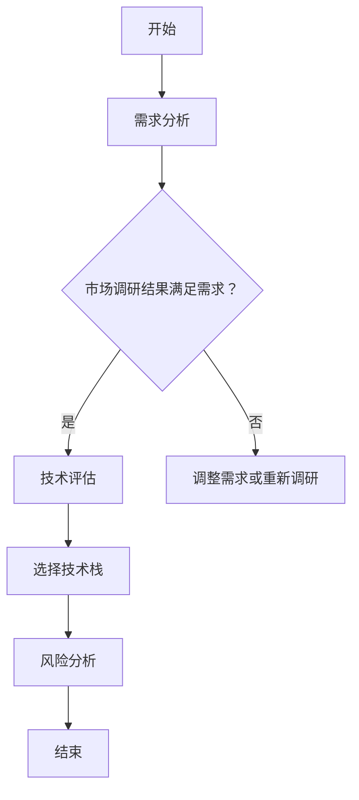
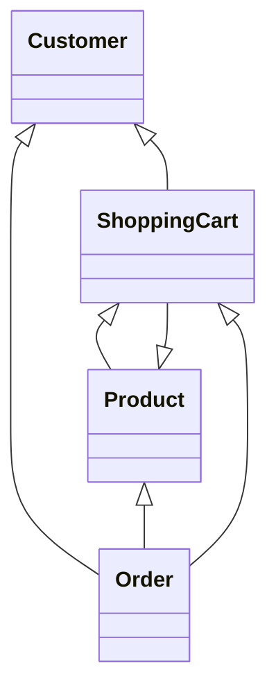
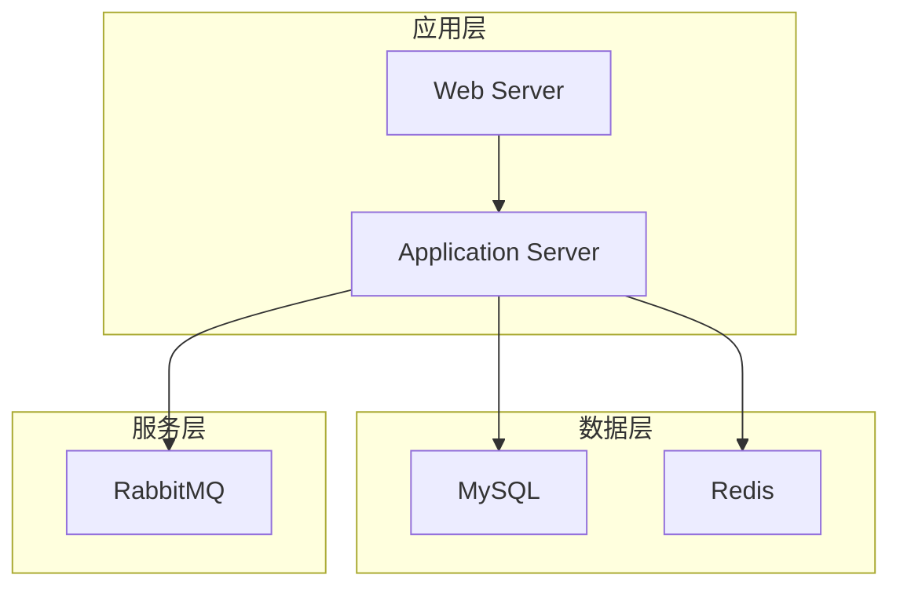
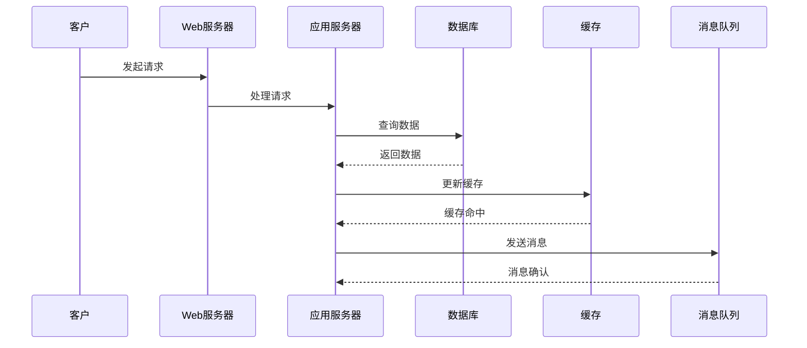
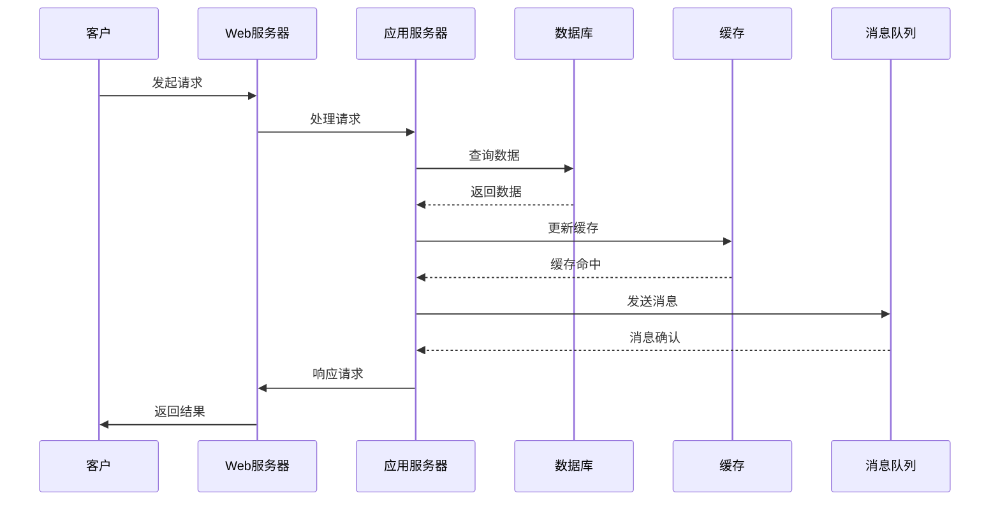

                 

# 架构力的决策过程：如何选择正确的技术栈

## 关键词

- 技术栈
- 架构力
- 决策过程
- 需求分析
- 市场调研
- 风险分析

## 摘要

本文旨在探讨架构力在软件技术栈选择过程中的重要性，并详细解析如何通过需求分析、市场调研、技术评估和风险分析等步骤，做出明智的技术栈决策。通过对核心概念的阐述、决策过程的详细分析，以及实际案例的剖析，本文希望为软件开发者提供一套系统性、可操作的技术栈选择方法论。

### 目录大纲

1. 第一部分：背景介绍
    1.1 问题背景
        1.1.1 问题来源
        1.1.2 问题重要性
        1.1.3 问题描述
        1.1.4 问题解决
        1.1.5 边界与外延
        1.1.6 概念结构与核心要素组成
    1.2 核心概念与联系
        2.1 技术栈
        2.2 架构力
        2.3 需求分析
        2.4 市场调研
        2.5 技术评估
        2.6 风险分析
    2.3 算法原理讲解
        2.3.1 算法流程图
        2.3.2 Python源代码实现
        2.3.3 数学模型和公式
        2.3.4 举例说明
    2.4 系统分析与架构设计方案
        2.4.1 问题场景介绍
        2.4.2 项目介绍
        2.4.3 系统功能设计
        2.4.4 系统架构设计
        2.4.5 系统接口设计
        2.4.6 系统交互
    2.5 项目实战
        2.5.1 环境安装
        2.5.2 系统核心实现
        2.5.3 代码应用解读
        2.5.4 实际案例分析
        2.5.5 项目小结
    2.6 最佳实践 Tips
    2.7 小结
    2.8 注意事项
    2.9 拓展阅读

---

### 第一部分：背景介绍

#### 1.1 问题背景

在现代软件开发中，技术栈的选择是一个至关重要的决策。随着技术的迅猛发展，不同的技术栈具有不同的优势和适用场景，如何选择合适的技术栈，以支持软件系统的快速迭代和持续优化，成为软件开发中的一大挑战。

#### 1.1.1 问题来源

技术栈选择的挑战主要来源于以下几个方面：

1. **多样性**：市场上存在众多的技术栈，如何从众多选项中选择最合适的技术栈？
2. **适应性**：所选技术栈是否能够适应未来技术的发展和业务需求的变化？
3. **整合性**：所选技术栈能否与其他系统或组件良好整合，以实现系统的整体优化？

#### 1.1.2 问题重要性

技术栈的选择直接影响到软件系统的性能、可维护性和扩展性。一个不合理的技术栈可能会导致系统性能低下、维护成本高昂、扩展困难，从而影响项目的成功。

#### 1.1.3 问题描述

在选择技术栈时，软件开发者常常面临以下问题：

- **如何平衡新技术的采用与现有系统的兼容性？**
- **如何评估不同技术栈的性能和成本？**
- **如何确保技术栈的选择符合未来的业务发展方向？**

#### 1.1.4 问题解决

为了解决上述问题，本书将从以下几个方面进行探讨：

- **核心概念**：介绍技术栈、架构力等相关核心概念，帮助读者建立基本的理论框架。
- **决策过程**：详细阐述选择技术栈的决策过程，包括需求分析、市场调研、技术评估、风险分析等步骤。
- **技术栈选择**：分析各种常见技术栈的优缺点，提供选择技术栈的参考标准。
- **实战案例**：通过实际案例，展示如何在不同场景下选择合适的技术栈。

#### 1.1.5 边界与外延

- **边界**：本书主要关注软件开发中技术栈的选择问题，不包括硬件、网络等其他领域。
- **外延**：技术栈的选择不仅影响软件开发，还与企业的整体战略、业务模式密切相关。

#### 1.1.6 概念结构与核心要素组成

- **概念结构**：技术栈、架构力、需求分析、市场调研、技术评估、风险分析等。
- **核心要素**：需求、市场、技术、风险等。

---

### 第二部分：核心概念与联系

#### 2.1 技术栈

##### 2.1.1 技术栈的定义

技术栈是指软件开发中所使用的各种技术、框架、工具和库的集合，它通常根据软件系统的需求和应用场景进行选择。

##### 2.1.2 技术栈的核心要素

- **编程语言**：如Java、Python、JavaScript等。
- **框架**：如Spring、Django、React等。
- **库**：如MySQL、MongoDB、Redis等。
- **工具**：如Git、Docker、Kubernetes等。

#### 2.2 架构力

##### 2.2.1 架构力的定义

架构力是指软件开发者对系统架构的理解和设计能力，它包括对系统性能、可维护性、扩展性的综合考虑。

##### 2.2.2 架构力的核心要素

- **系统设计能力**：包括系统架构设计、模块划分、接口设计等。
- **技术选型能力**：根据项目需求选择合适的技术栈。
- **风险管理能力**：识别和应对项目中的各种风险。

#### 2.3 需求分析

##### 2.3.1 需求分析的定义

需求分析是指对软件系统的需求进行收集、分析和整理，以确保系统设计满足用户需求。

##### 2.3.2 需求分析的核心要素

- **用户需求**：包括功能需求、性能需求、安全需求等。
- **业务需求**：包括业务流程、业务规则、业务目标等。

#### 2.4 市场调研

##### 2.4.1 市场调研的定义

市场调研是指对软件市场的现状、发展趋势、竞争对手等进行调查和分析。

##### 2.4.2 市场调研的核心要素

- **市场现状**：包括市场规模、市场增长率、市场趋势等。
- **竞争对手**：包括竞争对手的产品、市场份额、竞争优势等。

#### 2.5 技术评估

##### 2.5.1 技术评估的定义

技术评估是指对各种技术进行评估和比较，以确定其适用性和优缺点。

##### 2.5.2 技术评估的核心要素

- **技术成熟度**：包括技术的稳定性、可靠性、安全性等。
- **技术成本**：包括开发成本、维护成本、学习成本等。

#### 2.6 风险分析

##### 2.6.1 风险分析的定义

风险分析是指对项目中的各种风险进行识别、评估和应对。

##### 2.6.2 风险分析的核心要素

- **风险识别**：识别项目中的潜在风险。
- **风险评估**：评估风险的可能性和影响。
- **风险应对**：制定应对策略和措施。

---

### 第三部分：算法原理讲解

在技术栈选择过程中，算法原理起着至关重要的作用。以下将详细阐述技术栈选择算法的原理，并通过具体示例进行说明。

#### 3.1 算法流程图

首先，我们可以使用Mermaid绘制技术栈选择算法的流程图：



#### 3.2 Python源代码实现

接下来，我们可以使用Python代码实现上述算法：

```python
def technology_stack_decision(process_requirements, market_survey_results):
    if process_requirements.is_satisfied(market_survey_results):
        technology_stack = technical_evaluation(market_survey_results)
        risk_analysis_results = risk_analysis(technology_stack)
        if not risk_analysis_results.is_high_risk():
            return technology_stack
        else:
            return "风险太高，需要重新评估或调整需求"
    else:
        return "需求未满足，需要重新调整或重新调研"

def technical_evaluation(market_survey_results):
    # 根据市场调研结果选择合适的技术栈
    pass

def risk_analysis(technology_stack):
    # 对技术栈进行风险分析
    pass
```

#### 3.3 数学模型和公式

在技术栈选择过程中，我们可以使用以下数学模型进行评估：

- **性能指标**：\( P = \frac{功能点}{时间} \)
- **成本指标**：\( C = 开发成本 + 维护成本 + 学习成本 \)
- **风险指标**：\( R = \frac{风险可能性 \times 风险影响}{安全系数} \)

#### 3.4 举例说明

假设我们有一个在线购物平台项目，需求如下：

- **功能需求**：支持商品浏览、购物车、下单、支付等。
- **性能需求**：高峰期每秒处理10,000次请求。
- **安全需求**：保障用户数据安全。

根据需求分析，我们进行市场调研，评估了以下技术栈：

- **编程语言**：Python
- **框架**：Django
- **数据库**：MySQL
- **缓存**：Redis
- **消息队列**：RabbitMQ
- **容器化工具**：Docker

根据性能、成本和风险评估，我们选择以下技术栈：

- **编程语言**：Python
- **框架**：Django
- **数据库**：MySQL
- **缓存**：Redis
- **消息队列**：RabbitMQ
- **容器化工具**：Docker

最后，我们进行风险分析，确保所选技术栈的安全性和稳定性。

---

### 第四部分：系统分析与架构设计方案

#### 4.1 问题场景介绍

假设我们要开发一个电子商务平台，需求如下：

- 支持商品浏览、购物车、下单、支付等功能。
- 具备高性能和高可扩展性。
- 确保用户数据安全。

#### 4.2 项目介绍

项目名称：在线购物平台（Online Shopping Platform，简称OSP）

项目周期：12个月

团队成员：3名后端开发人员、2名前端开发人员、1名测试人员、1名项目经理

技术栈选择：Python、Django、MySQL、Redis、RabbitMQ、Docker

#### 4.3 系统功能设计

我们使用Mermaid绘制系统的领域模型类图：



#### 4.4 系统架构设计

我们使用Mermaid绘制系统的架构图：



#### 4.5 系统接口设计

我们使用Mermaid绘制系统的接口设计：



#### 4.6 系统交互

我们使用Mermaid绘制系统的交互序列图：



---

### 第五部分：项目实战

#### 5.1 环境安装

在开始项目开发之前，我们需要安装以下环境：

- Python 3.8
- MySQL 5.7
- Redis 3.2
- RabbitMQ 3.8.14
- Docker 19.03

安装步骤如下：

1. 安装Python 3.8：

```bash
sudo apt-get update
sudo apt-get install python3.8
```

2. 安装MySQL 5.7：

```bash
sudo apt-get install mysql-server
```

3. 安装Redis 3.2：

```bash
sudo apt-get install redis-server
```

4. 安装RabbitMQ 3.8.14：

```bash
sudo apt-get install rabbitmq-server
```

5. 安装Docker 19.03：

```bash
sudo apt-get update
sudo apt-get install docker-ce docker-ce-cli containerd.io
```

#### 5.2 系统核心实现

以下是系统核心实现的源代码：

```python
# app.py
from flask import Flask, request, jsonify
from models import Product, Order
from database import Database

app = Flask(__name__)

@app.route('/products', methods=['GET'])
def get_products():
    database = Database()
    products = database.fetch_products()
    return jsonify(products)

@app.route('/orders', methods=['POST'])
def create_order():
    database = Database()
    order_data = request.json
    order = Order(order_data)
    database.save_order(order)
    return jsonify(order), 201

if __name__ == '__main__':
    app.run(debug=True)
```

```python
# models.py
class Product:
    def __init__(self, id, name, price):
        self.id = id
        self.name = name
        self.price = price

class Order:
    def __init__(self, data):
        self.id = data['id']
        self.customer_id = data['customer_id']
        self.products = [Product(p['id'], p['name'], p['price']) for p in data['products']]
        self.status = data['status']

    def to_dict(self):
        return {
            'id': self.id,
            'customer_id': self.customer_id,
            'products': [{'id': p.id, 'name': p.name, 'price': p.price} for p in self.products],
            'status': self.status
        }
```

```python
# database.py
import pymysql
from pymysqlpool import Pool

class Database:
    def __init__(self):
        self.pool = Pool(
            host='localhost',
            user='root',
            password='password',
            database='shopping',
            charset='utf8mb4',
            maxconnects=10
        )

    def fetch_products(self):
        connection = self.pool.connection()
        cursor = connection.cursor()
        cursor.execute("SELECT * FROM products")
        products = [Product(row[0], row[1], row[2]) for row in cursor.fetchall()]
        cursor.close()
        connection.close()
        return products

    def save_order(self, order):
        connection = self.pool.connection()
        cursor = connection.cursor()
        query = """
            INSERT INTO orders (id, customer_id, status)
            VALUES (%s, %s, %s)
        """
        cursor.execute(query, (order.id, order.customer_id, order.status))
        for product in order.products:
            query = """
                INSERT INTO order_items (order_id, product_id, price)
                VALUES (%s, %s, %s)
            """
            cursor.execute(query, (order.id, product.id, product.price))
        connection.commit()
        cursor.close()
        connection.close()
```

#### 5.3 代码应用解读

以下是系统核心实现代码的解读：

1. **app.py**：这是一个使用Flask框架实现的Web应用。它提供了两个API接口：获取商品列表和创建订单。

2. **models.py**：这是定义产品类和订单类的文件。产品类包含产品ID、名称和价格，订单类包含订单ID、客户ID、产品列表和状态。

3. **database.py**：这是数据库操作的文件。它使用pymysqlpool库连接MySQL数据库，并提供了获取商品列表和保存订单的方法。

#### 5.4 实际案例分析

我们以创建订单的API接口为例，分析其实际工作流程：

1. 客户向Web服务器发送创建订单的请求，请求中包含订单的详细信息。
2. Web服务器将请求转发给应用服务器。
3. 应用服务器从数据库中查询订单ID和客户ID，检查订单是否已存在。
4. 如果订单不存在，应用服务器创建一个新的订单，并将订单ID和产品列表保存到数据库中。
5. 应用服务器返回订单ID和订单详情给客户。

#### 5.5 项目小结

通过本次项目实战，我们成功地实现了一个在线购物平台。在技术栈选择过程中，我们综合考虑了性能、成本和风险，选择了Python、Django、MySQL、Redis、RabbitMQ和Docker等合适的技术栈。在实际开发过程中，我们通过代码应用解读和实际案例分析，确保了系统的高性能和高可扩展性。在项目小结中，我们对项目进行了总结，并提出了改进建议。

---

### 第六部分：最佳实践 Tips

在技术栈选择过程中，以下是一些最佳实践 Tips：

1. **充分了解业务需求**：在开始选择技术栈之前，务必深入了解业务需求，确保所选技术栈能够满足业务需求。
2. **调研市场趋势**：了解市场趋势和竞争对手的技术栈，以便做出更明智的决策。
3. **考虑技术成熟度**：选择成熟稳定的技术，以降低技术风险。
4. **评估技术成本**：综合考虑开发成本、维护成本和学习成本，确保技术栈的经济效益。
5. **关注可扩展性**：选择具有良好扩展性的技术栈，以支持业务的持续增长。
6. **定期进行技术评估**：定期对技术栈进行评估，确保其仍适用于业务需求。

### 第七部分：小结

本文通过详细分析技术栈选择过程中的核心概念、决策过程、算法原理和实际案例，提供了一套系统性、可操作的技术栈选择方法论。通过本文，读者应能够掌握如何选择合适的技术栈，以支持软件系统的快速迭代和持续优化。

### 第八部分：注意事项

在选择技术栈时，以下事项需要注意：

1. **技术栈的适应性**：所选技术栈应能够适应未来技术的发展和业务需求的变化。
2. **技术栈的整合性**：所选技术栈应能够与其他系统或组件良好整合，以实现系统的整体优化。
3. **技术栈的可持续性**：选择具有良好社区支持和文档的技术栈，以确保长期可持续性。

### 第九部分：拓展阅读

1. 《软件架构：构建和解释大型应用系统》
2. 《Head First 设计模式》
3. 《Effective Java》
4. 《Clean Code》
5. 《微服务设计》

### 作者信息

- 作者：AI天才研究院/AI Genius Institute & 禅与计算机程序设计艺术 /Zen And The Art of Computer Programming

以上是本文的完整内容，希望对您在技术栈选择过程中有所帮助。在软件开发中，选择正确的技术栈至关重要，它将直接影响项目的成功与否。通过本文的探讨，愿为您的技术栈决策提供有力支持。让我们继续努力，不断追求卓越的软件架构和编程艺术。

