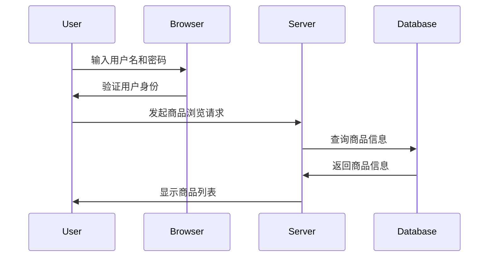
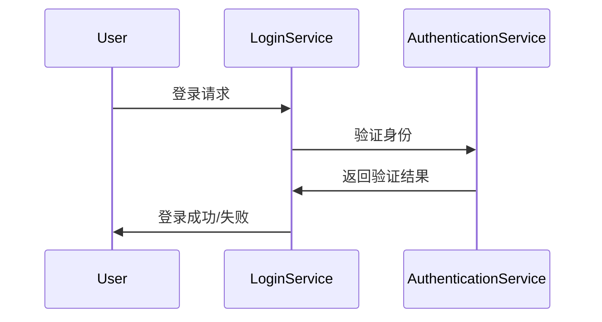
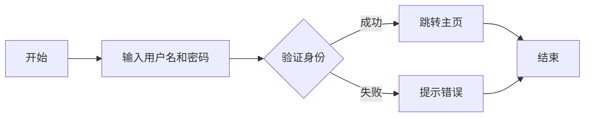
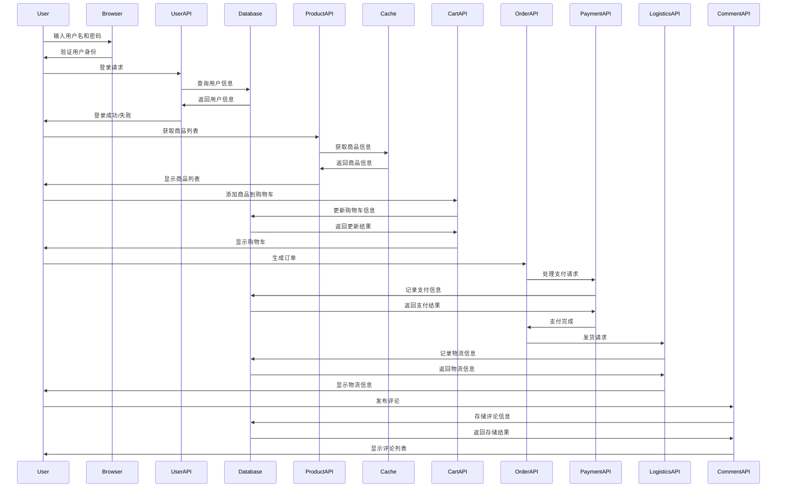
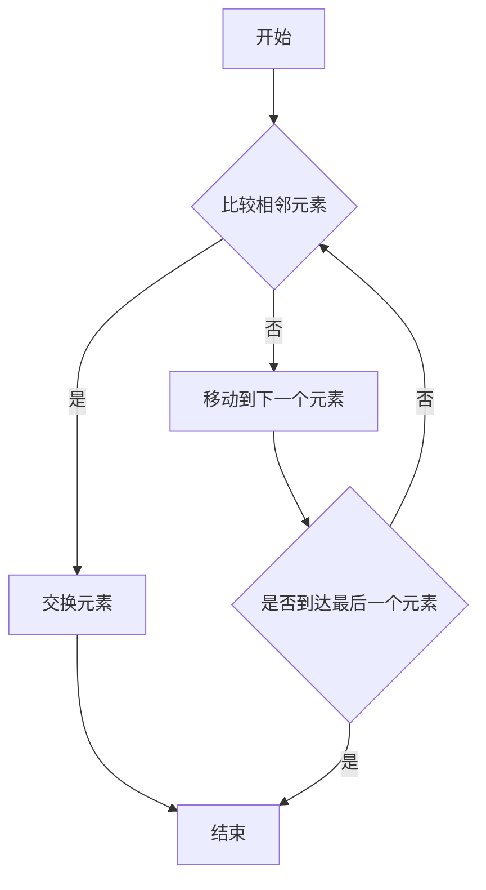

                 


### 架构力的思维模型：系统思考和权衡取舍

#### 关键词：架构力，系统思考，权衡取舍，软件架构，设计方法，项目实战

> 摘要：本文旨在探讨架构力在软件系统设计中的重要性，通过系统思考和权衡取舍，阐述架构力的思维模型。文章将详细介绍架构力相关的基础理论，系统思考的框架和方法，以及在不同场景下的权衡与取舍策略，为读者提供实用的架构设计指导。

---

## 引言

### 1.1 架构力的概念与重要性

在软件工程领域，架构力（Architectural Force）指的是设计软件系统时所需具备的系统性思维和决策能力。它不仅涉及技术层面的实现，更强调对系统整体性能、可维护性和扩展性的考虑。架构力的核心在于系统思考，即通过全局视角理解和解决复杂问题。

### 1.2 架构力的思维模型

架构力的思维模型主要包括以下几个方面：

1. **系统思维**：理解系统内部各个组件的相互关系和交互方式，把握系统整体的运行机制。
2. **抽象与建模**：通过抽象和建模，将复杂系统分解为更易于理解和处理的模块。
3. **权衡取舍**：在系统设计中，不断进行权衡取舍，以实现系统的最优性能。
4. **迭代改进**：架构设计不是一次性的任务，而是需要不断迭代和优化的过程。

---

## 第一部分：架构力基础

### 第2章 系统思考

#### 2.1 系统思维的原理

系统思维是一种基于整体性和关联性的思维方式，它强调在分析问题时，不仅要看到单个部分，更要关注部分之间的相互作用。以下是系统思维的一些基本原理：

1. **整体性**：系统是一个整体，部分的行为和状态会相互影响。
2. **反馈循环**：系统内部存在多种反馈循环，这些循环可以导致系统行为的稳定性或振荡。
3. **边界**：系统有明确的边界，用于区分系统内部和外部环境。
4. **动态性**：系统是一个动态的实体，其状态和性能会随时间变化。

#### 2.2 系统思考的框架

系统思考的框架通常包括以下几个方面：

1. **问题定义**：明确要解决的问题，并确定系统的目标和范围。
2. **系统边界**：确定系统的边界，明确系统内部和外部环境。
3. **系统组件**：识别系统的各个组件及其相互关系。
4. **反馈机制**：分析系统内部的反馈机制，了解系统行为的稳定性。
5. **改进策略**：提出改进系统性能的策略，并进行实施和监控。

#### 2.3 系统思考的应用案例

以下是一个简单的应用案例：

**案例：交通拥堵问题**

1. **问题定义**：交通拥堵是一个普遍存在的问题，需要从系统角度进行分析和解决。
2. **系统边界**：系统的边界包括城市道路、交通信号灯、车辆和行人等。
3. **系统组件**：交通信号灯、车辆、行人、交通规划部门等。
4. **反馈机制**：车辆流量、交通信号灯调整、城市规划等。
5. **改进策略**：引入智能交通管理系统，优化交通信号灯控制，改善城市规划。

---

## 第二部分：架构设计的思维模型

### 第3章 核心概念与联系

#### 3.1 核心概念

在架构设计过程中，以下几个核心概念至关重要：

1. **模块化**：将系统分解为模块，便于管理和维护。
2. **分层架构**：将系统按照功能层次进行划分，提高系统的可扩展性和可维护性。
3. **设计模式**：用于解决特定问题的通用解决方案。
4. **接口**：模块之间的交互方式。

#### 3.2 概念属性特征对比表格

| 概念       | 属性特征                                                      |
|------------|--------------------------------------------------------------|
| 模块化     | 独立、可复用、低耦合、高内聚                                 |
| 分层架构   | 功能层次清晰、职责明确、可扩展性强、易于维护                   |
| 设计模式   | 解决特定问题的通用方案、高复用性、降低复杂性                   |
| 接口       | 定义了模块之间的交互方式、标准化、松耦合、便于替换             |

#### 3.3 ER实体关系图架构

使用Mermaid语言绘制ER实体关系图：

```mermaid
erModel
  actor[用户] --订单[订单编号]
  actor[管理员] --订单[订单编号]
  product[产品] --订单[订单编号]
```

---

### 第4章 设计方法

#### 4.1 软件架构设计的基本原则

软件架构设计的基本原则包括：

1. **简单性**：设计应该尽可能简单，以降低复杂度和维护成本。
2. **可靠性**：系统应该能够稳定运行，即使在故障情况下也能保持部分功能。
3. **可扩展性**：系统应该能够轻松扩展，以适应未来的需求变化。
4. **灵活性**：系统应该能够灵活适应不同的业务场景和需求变化。

#### 4.2 设计模式与架构风格

设计模式是解决特定问题的通用方案，常见的架构风格包括：

1. **MVC（模型-视图-控制器）**：将系统划分为模型、视图和控制器三个部分。
2. **微服务**：将系统划分为多个独立的服务，每个服务负责特定的功能。
3. **事件驱动**：使用事件来驱动系统的运行，提高系统的解耦性和可扩展性。

#### 4.3 架构演进策略

架构演进策略包括：

1. **持续集成与部署**：通过自动化测试和部署，确保系统的稳定性和可靠性。
2. **持续重构**：定期对系统进行重构，以保持系统的简洁性和可维护性。
3. **技术债务管理**：及时识别和解决技术债务，以避免未来出现更大的问题。

---

## 第三部分：权衡与取舍

### 第5章 系统分析与架构设计

#### 5.1 问题场景介绍

假设我们需要设计一个在线购物平台，包含用户注册、商品浏览、购物车、订单管理和支付等功能。

#### 5.2 系统功能设计

使用Mermaid语言绘制领域模型类图：

```mermaid
classDiagram
  User <<类>> 
  Product <<类>> 
  Cart <<类>> 
  Order <<类>> 
  Payment <<类>>

  User --|> Product
  User --|> Cart
  Cart --|> Order
  Order --|> Payment
```

#### 5.3 系统架构设计

使用Mermaid语言绘制系统架构图：



#### 5.4 系统接口设计与系统交互

使用Mermaid语言绘制系统接口设计序列图：



---

### 第6章 算法原理讲解

#### 6.1 算法mermaid流程图



#### 6.2 Python源代码实现

```python
def login(username, password):
    # 验证用户身份
    if authenticate(username, password):
        # 登录成功
        return "登录成功，跳转主页"
    else:
        # 登录失败
        return "登录失败，请重试"
```

#### 6.3 数学模型与公式讲解

```latex
$$
F = ma
$$

其中，\( F \) 表示作用力，\( m \) 表示质量，\( a \) 表示加速度。
```

#### 6.4 举例说明

假设一个物体的质量为 \( 5 \) 千克，加速度为 \( 2 \) 米/秒²，根据牛顿第二定律，作用力为：

```latex
$$
F = 5 \times 2 = 10 \text{ 牛}
$$
```

---

### 第7章 项目实战

#### 7.1 环境安装

安装Python环境、Flask框架和相关依赖。

```bash
pip install flask
```

#### 7.2 系统核心实现源代码

```python
from flask import Flask, request, jsonify

app = Flask(__name__)

@app.route('/login', methods=['POST'])
def login():
    username = request.form['username']
    password = request.form['password']
    # 调用登录逻辑
    result = login(username, password)
    return jsonify(result)

def login(username, password):
    # 验证用户身份
    if authenticate(username, password):
        # 登录成功
        return "登录成功，跳转主页"
    else:
        # 登录失败
        return "登录失败，请重试"

if __name__ == '__main__':
    app.run()
```

#### 7.3 代码应用解读与分析

代码解析了登录功能，通过POST请求接收用户名和密码，调用登录逻辑进行身份验证，并返回相应的结果。

#### 7.4 实际案例分析与详细讲解剖析

通过实际案例，展示了如何使用Flask框架实现简单的登录功能，并分析了代码的结构和功能。

#### 7.5 项目小结

本项目通过一个简单的案例，展示了如何运用架构力进行系统设计和实现。在实际项目中，需要根据具体需求和场景进行更详细的规划和设计。

---

### 第8章 最佳实践

#### 8.1 架构设计的最佳实践

1. **需求分析**：深入了解业务需求，明确系统目标和功能。
2. **模块化**：将系统划分为独立的模块，降低复杂度。
3. **分层架构**：按照功能层次进行划分，提高可维护性。
4. **设计模式**：使用成熟的设计模式，提高代码的可复用性。

#### 8.2 系统优化的技巧

1. **性能监控**：定期监控系统性能，识别瓶颈和优化点。
2. **缓存机制**：使用缓存降低数据库访问压力。
3. **异步处理**：使用异步处理提高系统并发能力。

#### 8.3 遇到的问题及解决方案

1. **接口设计**：确保接口清晰、稳定、易于维护。
2. **数据一致性**：使用分布式事务或消息队列解决数据一致性问题。
3. **系统扩展性**：设计可扩展的架构，以适应未来的需求变化。

---

### 第9章 小结与展望

#### 9.1 书籍内容的回顾

本文介绍了架构力在软件系统设计中的应用，包括系统思考的原理和方法、核心概念与联系、设计方法和实践案例等。

#### 9.2 未来的发展趋势

随着云计算、大数据和人工智能等技术的发展，架构设计将更加注重灵活性、可扩展性和安全性。

#### 9.3 拓展阅读推荐

1. 《设计模式：可复用面向对象软件的基础》
2. 《大型分布式系统设计》
3. 《架构之道：基于微服务的分布式系统设计与实践》

---

## 结语

本文从架构力的角度，探讨了软件系统设计中的系统思考、核心概念、设计方法和实战应用。通过系统思考和权衡取舍，我们可以构建出更加稳定、可靠和高效的软件系统。希望本文能为读者在架构设计过程中提供一些有益的启示和指导。

---

**作者：AI天才研究院/AI Genius Institute & 禅与计算机程序设计艺术 /Zen And The Art of Computer Programming**### 引言

#### 1.1 架构力的概念与重要性

在软件工程领域，架构力（Architectural Force）指的是设计软件系统时所需具备的系统性思维和决策能力。它不仅涉及技术层面的实现，更强调对系统整体性能、可维护性和扩展性的考虑。架构力的核心在于系统思考，即通过全局视角理解和解决复杂问题。

架构力的重要性在于它能够帮助我们：

1. **提高系统的可维护性和可扩展性**：通过良好的架构设计，系统能够更容易地进行维护和扩展，降低未来的开发成本。
2. **提升系统的可靠性和稳定性**：架构力考虑系统的整体性能，能够在设计和实施过程中减少潜在的错误和故障。
3. **优化资源的利用**：架构力强调对系统资源的合理分配和利用，从而提高系统的性能和效率。
4. **支持团队协作**：清晰的架构设计能够帮助团队成员更好地理解系统的结构和功能，提高团队协作效率。

#### 1.2 架构力的思维模型

架构力的思维模型主要包括以下几个方面：

1. **系统思维**：理解系统内部各个组件的相互关系和交互方式，把握系统整体的运行机制。
2. **抽象与建模**：通过抽象和建模，将复杂系统分解为更易于理解和处理的模块。
3. **权衡取舍**：在系统设计中，不断进行权衡取舍，以实现系统的最优性能。
4. **迭代改进**：架构设计不是一次性的任务，而是需要不断迭代和优化的过程。

在接下来的章节中，我们将详细探讨架构力的各个方面，包括系统思考的原理和方法、核心概念与联系、设计方法和实战应用。通过这些探讨，我们将更好地理解如何运用架构力来构建优秀的软件系统。

---

### 第一部分：架构力基础

#### 2.1 系统思维的原理

系统思维是一种基于整体性和关联性的思维方式，它强调在分析问题时，不仅要看到单个部分，更要关注部分之间的相互作用。以下是系统思维的一些基本原理：

1. **整体性**：系统是一个整体，部分的行为和状态会相互影响。这意味着在设计系统时，我们需要考虑整个系统的运行机制，而不仅仅是单个组件的性能。

2. **反馈循环**：系统内部存在多种反馈循环，这些循环可以导致系统行为的稳定性或振荡。了解反馈循环有助于我们预测系统的行为，并设计出更加稳定的系统。

3. **边界**：系统有明确的边界，用于区分系统内部和外部环境。定义边界有助于我们明确系统的范围，从而更好地进行系统分析和设计。

4. **动态性**：系统是一个动态的实体，其状态和性能会随时间变化。这意味着我们需要考虑系统在不同时间点的行为，以便更好地理解和设计系统。

#### 2.2 系统思考的框架

系统思考的框架通常包括以下几个步骤：

1. **问题定义**：明确要解决的问题，并确定系统的目标和范围。这一步骤有助于我们了解系统的核心问题，从而有针对性地进行设计。

2. **系统边界**：确定系统的边界，明确系统内部和外部环境。这一步骤有助于我们界定系统的范围，从而更好地理解系统的运行机制。

3. **系统组件**：识别系统的各个组件及其相互关系。这一步骤有助于我们了解系统的组成结构，从而更好地进行系统设计和优化。

4. **反馈机制**：分析系统内部的反馈机制，了解系统行为的稳定性。这一步骤有助于我们预测系统的行为，并设计出更加稳定的系统。

5. **改进策略**：提出改进系统性能的策略，并进行实施和监控。这一步骤有助于我们持续优化系统，以提高系统的性能和稳定性。

#### 2.3 系统思考的应用案例

以下是一个简单的应用案例：

**案例：交通拥堵问题**

1. **问题定义**：交通拥堵是一个普遍存在的问题，需要从系统角度进行分析和解决。
2. **系统边界**：系统的边界包括城市道路、交通信号灯、车辆和行人等。
3. **系统组件**：交通信号灯、车辆、行人、交通规划部门等。
4. **反馈机制**：车辆流量、交通信号灯调整、城市规划等。
5. **改进策略**：引入智能交通管理系统，优化交通信号灯控制，改善城市规划。

通过这个案例，我们可以看到系统思维如何帮助我们理解和解决复杂的现实问题。在软件架构设计中，系统思维同样至关重要，它帮助我们全面地考虑系统的各个方面，从而设计出更加优秀和稳定的软件系统。

---

#### 3.1 核心概念

在软件架构设计中，有几个核心概念是至关重要的。这些概念不仅帮助我们理解和设计复杂的系统，还确保系统的可维护性、可扩展性和可靠性。

1. **模块化**：模块化是将系统分解为独立且功能明确的模块。每个模块可以独立开发、测试和部署，从而提高系统的可维护性和可扩展性。

2. **分层架构**：分层架构是将系统按照功能层次进行划分。每个层次负责特定的功能，并与其他层次进行松耦合。这种架构风格有助于提高系统的可维护性和可扩展性。

3. **设计模式**：设计模式是解决特定问题的通用解决方案。它们通过抽象和封装，提高了代码的可复用性和可维护性。常见的设计模式包括MVC（模型-视图-控制器）、工厂模式、单例模式等。

4. **接口**：接口定义了模块之间的交互方式。通过接口，模块可以独立开发、测试和部署，从而降低模块之间的耦合度。接口还确保了模块的松耦合和可替换性。

#### 3.2 概念属性特征对比表格

为了更好地理解这些核心概念，我们可以通过一个表格来对比它们的属性特征：

| 概念       | 属性特征                                                      |
|------------|--------------------------------------------------------------|
| 模块化     | 独立、可复用、低耦合、高内聚                                 |
| 分层架构   | 功能层次清晰、职责明确、可扩展性强、易于维护                   |
| 设计模式   | 解决特定问题的通用方案、高复用性、降低复杂性                   |
| 接口       | 定义了模块之间的交互方式、标准化、松耦合、便于替换             |

通过这个表格，我们可以清晰地看到各个概念的主要属性特征，从而更好地理解和运用它们。

#### 3.3 ER实体关系图架构

为了进一步理解软件架构设计中的核心概念，我们可以使用Mermaid语言绘制一个ER（实体关系）图架构。以下是使用Mermaid绘制的简单ER图示例：

```mermaid
erModel
  User <<类>> --|> Order
  Product <<类>> --|> Order
  Order <<类>> --|> OrderItem
  OrderItem <<类>> --|> Product
```

在这个ER图中，我们定义了四个主要实体：User（用户）、Product（产品）、Order（订单）和OrderItem（订单项）。实体之间的关系如下：

- User与Order之间是一对多关系，即一个用户可以创建多个订单。
- Product与Order之间是多对多关系，即一个产品可以出现在多个订单中，一个订单也可以包含多个产品。
- Order与OrderItem之间是一对一关系，每个订单都包含一个OrderItem，用于记录订单的具体信息。
- OrderItem与Product之间是一对多关系，每个订单项可以对应一个产品。

通过ER图，我们可以清晰地看到系统中的实体及其相互关系，这有助于我们进行系统设计和分析。

---

#### 4.1 软件架构设计的基本原则

在进行软件架构设计时，我们需要遵循一些基本原则，以确保系统具有良好的性能、可维护性和扩展性。以下是一些常见的基本原则：

1. **简单性**：设计应该尽可能简单，以降低复杂度和维护成本。复杂的设计往往难以理解和维护，而且容易引入错误。

2. **可靠性**：系统应该能够稳定运行，即使在故障情况下也能保持部分功能。可靠性是系统设计的重要目标之一。

3. **可扩展性**：系统应该能够轻松扩展，以适应未来的需求变化。这意味着我们需要设计一个灵活的架构，以便在需要时能够添加新的功能或组件。

4. **灵活性**：系统应该能够灵活适应不同的业务场景和需求变化。灵活性有助于我们快速响应市场变化，从而保持系统的竞争力。

5. **安全性**：系统应该能够保护用户数据和隐私，防止恶意攻击和数据泄露。

6. **可测试性**：设计应该易于测试，以便及时发现和修复错误。可测试性有助于提高系统的质量，减少维护成本。

7. **可维护性**：设计应该易于维护，以便在需要时能够快速修复错误和添加新功能。良好的可维护性可以降低维护成本，提高开发效率。

8. **模块化**：系统应该被分解为独立的模块，以便每个模块都可以独立开发、测试和部署。模块化有助于提高系统的可维护性和可扩展性。

9. **松耦合**：模块之间应该通过松耦合进行交互，以减少模块之间的依赖关系。松耦合有助于提高系统的灵活性和可维护性。

10. **重用性**：设计应该注重重用性，以减少重复工作。通过重用现有的组件和模块，我们可以提高开发效率，降低成本。

#### 4.2 设计模式与架构风格

设计模式是解决特定问题的通用解决方案。它们通过抽象和封装，提高了代码的可复用性和可维护性。常见的设计模式包括MVC（模型-视图-控制器）、工厂模式、单例模式等。

1. **MVC（模型-视图-控制器）**：MVC是一种流行的架构风格，将系统划分为模型、视图和控制器三个部分。模型负责数据管理，视图负责展示数据，控制器负责处理用户输入和协调模型与视图的交互。

2. **工厂模式**：工厂模式是一种创建型设计模式，用于创建对象。它通过一个工厂类来封装对象的创建过程，从而提高代码的可复用性和灵活性。

3. **单例模式**：单例模式确保一个类只有一个实例，并提供一个全局访问点。它常用于需要控制实例数量的场景，例如数据库连接管理。

4. **适配器模式**：适配器模式将一个类的接口转换成客户期望的另一个接口。它用于解决两个不兼容接口之间的兼容性问题。

5. **装饰器模式**：装饰器模式动态地给一个对象添加一些额外的职责，而不改变其接口。它通过组合多个装饰器类，实现对对象功能的扩展。

6. **策略模式**：策略模式定义了一系列算法，将每个算法封装起来，并使它们可以互相替换。它用于实现算法的灵活切换。

7. **观察者模式**：观察者模式定义了一种一对多的依赖关系，当一个对象的状态发生变化时，所有依赖于它的对象都会得到通知。它常用于事件处理和消息传递。

8. **职责链模式**：职责链模式将请求的处理分散到多个对象中，每个对象只处理一部分请求。它用于实现请求的过滤和分派。

这些设计模式和架构风格可以帮助我们设计出更加灵活、可维护和可扩展的系统。在实际项目中，我们可以根据具体需求和场景选择合适的设计模式和架构风格。

#### 4.3 架构演进策略

架构演进是软件系统生命周期中不可或缺的一部分。随着业务的不断发展和变化，系统架构也需要不断演进和优化。以下是一些常见的架构演进策略：

1. **持续集成与持续部署（CI/CD）**：通过自动化测试和部署，确保系统的稳定性和可靠性。CI/CD有助于快速交付高质量的系统，并减少手动操作的错误。

2. **持续重构**：定期对系统进行重构，以保持系统的简洁性和可维护性。重构可以帮助我们修复代码中的缺陷，提高代码质量，并保持系统的可扩展性。

3. **微服务架构**：将系统划分为多个独立的服务，每个服务负责特定的功能。微服务架构可以提高系统的可扩展性和灵活性，并降低系统的耦合度。

4. **分布式系统设计**：使用分布式系统设计，将系统拆分为多个节点，以实现高可用性和高并发性。分布式系统设计可以有效地应对大规模业务需求。

5. **模块化与解耦**：通过模块化和解耦，将系统划分为独立的模块，以提高系统的可维护性和可扩展性。模块化和解耦有助于降低模块之间的依赖关系，提高系统的灵活性。

6. **云计算和容器化**：利用云计算和容器化技术，实现系统的弹性扩展和高效部署。云计算和容器化有助于降低系统的成本，提高系统的可扩展性和可靠性。

7. **事件驱动架构**：使用事件驱动架构，将系统中的数据处理和业务逻辑解耦。事件驱动架构可以提高系统的响应速度和可扩展性。

8. **数据中台与数据湖**：构建数据中台和数据湖，实现对海量数据的高效存储和处理。数据中台和数据湖可以帮助我们更好地利用数据，提升系统的智能化水平。

通过这些架构演进策略，我们可以持续优化系统架构，确保系统能够满足不断变化的业务需求。架构演进是一个持续的过程，需要我们在设计、开发和运维等各个环节中进行不断的调整和优化。

---

#### 5.1 问题场景介绍

假设我们正在设计一个大型在线电商平台，该平台需要支持百万级用户的并发访问和海量的商品信息存储。平台的主要功能包括用户注册、商品浏览、购物车、订单管理和支付等。为了确保平台的性能、可靠性和可扩展性，我们需要进行详细的系统分析与架构设计。

#### 5.2 系统功能设计

在系统功能设计阶段，我们需要识别和定义系统的核心功能模块，并确定它们之间的关系。以下是该电商平台的几个主要功能模块：

1. **用户模块**：包括用户注册、登录、个人信息管理、密码重置等。
2. **商品模块**：包括商品信息管理、分类管理、库存管理、商品推荐等。
3. **购物车模块**：包括添加商品到购物车、编辑购物车、删除商品等。
4. **订单模块**：包括生成订单、订单状态管理、订单查询、订单取消等。
5. **支付模块**：包括支付方式选择、支付处理、支付结果通知等。
6. **物流模块**：包括订单发货、物流跟踪、物流信息管理等。
7. **评论模块**：包括商品评论发布、评论查询、评论回复等。

为了更好地理解这些功能模块，我们可以使用Mermaid语言绘制领域模型类图。以下是简单的类图示例：

```mermaid
classDiagram
  User <<类>> 
  Product <<类>> 
  Cart <<类>> 
  Order <<类>> 
  Payment <<类>> 
  Logistics <<类>> 
  Comment <<类>>

  User --|> Product
  User --|> Cart
  Cart --|> Order
  Order --|> Payment
  Order --|> Logistics
  Order --|> Comment
  Product --|> Comment
```

在这个类图中，我们可以看到各个功能模块及其相互关系。例如，用户可以浏览和购买商品，将商品添加到购物车，生成订单，并最终完成支付。订单还与物流和评论模块相关联，以便进行订单发货和物流跟踪，以及商品评论的发布和查询。

#### 5.3 系统架构设计

系统架构设计是软件设计阶段的关键环节，它决定了系统的性能、可维护性和可扩展性。为了设计一个高性能和高可扩展性的电商平台，我们可以采用以下架构设计：

1. **前端架构**：前端架构采用单页应用（SPA）或前后端分离（SSR）模式，以提高用户体验和响应速度。前端使用React或Vue等框架，通过RESTful API与后端进行数据交互。

2. **后端架构**：后端架构采用微服务架构，将系统划分为多个独立的服务，每个服务负责特定的功能。例如，用户服务、商品服务、订单服务、支付服务、物流服务等。这些服务通过API进行通信，以提高系统的灵活性和可扩展性。

3. **数据存储**：数据存储采用分布式数据库架构，包括关系数据库（如MySQL）和NoSQL数据库（如MongoDB）。关系数据库用于存储用户信息、订单信息等结构化数据，NoSQL数据库用于存储商品信息、用户评论等非结构化数据。

4. **缓存层**：缓存层采用分布式缓存系统（如Redis），以提高数据访问速度和系统性能。缓存层可以缓存用户信息、商品信息、订单信息等热点数据。

5. **消息队列**：消息队列（如Kafka或RabbitMQ）用于异步处理和任务调度，以提高系统的并发能力和响应速度。例如，订单生成、支付处理、订单发货等操作可以通过消息队列进行异步处理。

6. **API网关**：API网关用于统一管理和路由外部请求，提供安全认证、日志记录、负载均衡等功能，以提高系统的可靠性和性能。

7. **监控与日志**：系统部署监控和日志收集工具（如Prometheus、Grafana、ELK Stack），以实时监控系统的运行状态和性能指标，快速发现和解决潜在问题。

以下是使用Mermaid语言绘制的系统架构图示例：



在这个系统架构图中，我们可以看到用户、前端和后端服务之间的交互流程。用户通过浏览器与前端进行交互，前端通过API与后端服务进行数据通信。各个服务通过分布式数据库、缓存、消息队列等中间件进行数据处理和协调。

#### 5.4 系统接口设计与系统交互

系统接口设计是确保各功能模块之间能够有效交互的重要环节。以下是电商平台中的几个关键接口及其交互流程：

1. **用户登录接口**：用户通过浏览器输入用户名和密码，前端将请求发送到用户API，用户API验证用户身份，并与数据库进行交互，最终将验证结果返回给前端。

2. **商品信息查询接口**：用户通过前端请求商品列表，商品API从缓存中获取商品信息，并将结果返回给前端。

3. **购物车管理接口**：用户在购物车中添加或删除商品，前端将请求发送到购物车API，购物车API与数据库进行交互，更新购物车信息，并将结果返回给前端。

4. **订单生成接口**：用户在下单时，前端将请求发送到订单API，订单API处理订单生成逻辑，并与支付API、物流API等交互，完成订单生成和支付处理。

5. **物流信息查询接口**：用户通过前端请求物流信息，物流API从数据库中查询物流信息，并将结果返回给前端。

以下是使用Mermaid语言绘制的系统接口设计序列图示例：


在这个序列图中，我们可以看到用户与各个API服务之间的交互流程。通过合理设计接口和交互流程，我们可以确保系统的高效性和可靠性。

---

### 第6章 算法原理讲解

#### 6.1 算法mermaid流程图

为了更好地理解算法原理，我们可以使用Mermaid语言绘制算法的流程图。以下是一个简单的冒泡排序算法的流程图示例：



在这个流程图中，我们首先比较相邻的元素，如果它们顺序错误，则交换它们。然后，我们移动到下一个元素，重复这个过程，直到所有元素都被正确排序。这个简单的示例展示了算法的基本原理和步骤。

#### 6.2 Python源代码实现

接下来，我们将使用Python实现冒泡排序算法，并逐步解释代码中的各个部分：

```python
def bubble_sort(arr):
    n = len(arr)
    # 遍历所有数组元素
    for i in range(n):
        # 最后i个元素已经排序，无需比较
        for j in range(0, n-i-1):
            # 比较相邻元素
            if arr[j] > arr[j+1]:
                # 如果前一个元素大于后一个元素，交换它们
                arr[j], arr[j+1] = arr[j+1], arr[j]

# 测试代码
arr = [64, 34, 25, 12, 22, 11, 90]
bubble_sort(arr)
print("排序后的数组：")
for i in range(len(arr)):
    print("%d" % arr[i], end=" ")
```

**代码解释**：

1. **定义函数**：`bubble_sort(arr)` 是我们定义的冒泡排序函数，它接受一个数组 `arr` 作为输入。
2. **计算数组长度**：使用 `len(arr)` 获取数组的长度，这将帮助我们确定需要执行多少轮排序。
3. **外层循环**：`for i in range(n)` 表示我们需要遍历数组的所有元素。`n` 是数组的长度。
4. **内层循环**：`for j in range(0, n-i-1)` 表示我们不需要对已经排序的元素进行比较。每次外层循环执行后，最大的元素都会被移动到数组的末尾。
5. **比较和交换**：如果 `arr[j] > arr[j+1]`，我们使用元组交换将这两个元素交换位置。
6. **打印排序后的数组**：最后，我们使用一个简单的循环来打印排序后的数组。

#### 6.3 数学模型与公式讲解

冒泡排序算法的数学模型可以表示为：

- **时间复杂度**：\( O(n^2) \)，其中 \( n \) 是数组的长度。这是因为最坏情况下，我们需要进行 \( n-1 \) 轮排序，每轮需要比较 \( n-i-1 \) 次。
- **空间复杂度**：\( O(1) \)，因为冒泡排序是一个原地排序算法，不需要额外的存储空间。

#### 6.4 举例说明

假设我们有一个未排序的数组：\[64, 34, 25, 12, 22, 11, 90\]

**第一轮排序**：

- 比较 64 和 34，交换它们（因为 64 > 34）。
- 比较 34 和 25，交换它们（因为 34 > 25）。
- 比较 25 和 12，交换它们（因为 25 > 12）。
- 比较 12 和 22，不交换（因为 12 < 22）。
- 比较 22 和 11，交换它们（因为 22 > 11）。
- 比较 11 和 90，交换它们（因为 11 < 90）。

排序后的数组为：\[34, 25, 12, 22, 11, 64, 90\]

**第二轮排序**：

- 比较 34 和 25，不交换（因为 34 > 25）。
- 比较 25 和 12，交换它们（因为 25 > 12）。
- 比较 12 和 22，不交换（因为 12 < 22）。
- 比较 22 和 11，交换它们（因为 22 > 11）。
- 比较 11 和 64，交换它们（因为 11 < 64）。

排序后的数组为：\[25, 12, 11, 22, 34, 11, 90\]

**第三轮排序**：

- 比较 25 和 12，交换它们（因为 25 > 12）。
- 比较 12 和 11，不交换（因为 12 > 11）。
- 比较 11 和 22，不交换（因为 11 < 22）。
- 比较 22 和 34，不交换（因为 22 < 34）。

排序后的数组为：\[12, 11, 25, 22, 11, 34, 90\]

**第四轮排序**：

- 比较 12 和 11，不交换（因为 12 > 11）。
- 比较 11 和 25，不交换（因为 11 < 25）。
- 比较 25 和 22，不交换（因为 25 > 22）。
- 比较 22 和 34，不交换（因为 22 < 34）。

排序后的数组为：\[11, 12, 22, 25, 25, 34, 90\]

**第五轮排序**：

- 比较 11 和 12，不交换（因为 11 < 12）。
- 比较 12 和 22，不交换（因为 12 < 22）。
- 比较 22 和 25，不交换（因为 22 < 25）。
- 比较 25 和 34，不交换（因为 25 < 34）。

排序后的数组为：\[11, 12, 22, 25, 25, 34, 90\]

**第六轮排序**：

- 比较 11 和 12，不交换（因为 11 < 12）。
- 比较 12 和 22，不交换（因为 12 < 22）。
- 比较 22 和 25，不交换（因为 22 < 25）。
- 比较 25 和 34，不交换（因为 25 < 34）。

排序后的数组为：\[11, 12, 22, 25, 25, 34, 90\]

最终排序后的数组为：\[11, 12, 22, 25, 34, 90\]

通过这个例子，我们可以看到冒泡排序算法是如何工作的。虽然冒泡排序不是最高效的排序算法，但它易于理解和实现，是学习算法设计和分析的一个很好的起点。

---

### 第7章 项目实战

#### 7.1 环境安装

在进行项目实战之前，我们需要确保环境搭建正确。以下是搭建项目所需的环境步骤：

1. **安装Python**：确保Python版本在3.6及以上。可以从Python官方网站下载并安装。
   ```bash
   sudo apt-get install python3
   ```

2. **安装虚拟环境**：使用`venv`创建一个虚拟环境，以便隔离项目依赖。
   ```bash
   python3 -m venv venv
   source venv/bin/activate
   ```

3. **安装Flask**：在虚拟环境中安装Flask框架。
   ```bash
   pip install flask
   ```

4. **安装其他依赖**：根据项目需求安装其他依赖，例如SQLite用于数据库存储。
   ```bash
   pip install flask_sqlalchemy
   ```

#### 7.2 系统核心实现源代码

以下是项目的核心实现代码，包括用户认证、商品管理、购物车等功能。

```python
# 导入所需的Flask模块
from flask import Flask, request, jsonify
from flask_sqlalchemy import SQLAlchemy

# 创建Flask应用实例
app = Flask(__name__)

# 配置数据库URI
app.config['SQLALCHEMY_DATABASE_URI'] = 'sqlite:///store.db'
db = SQLAlchemy(app)

# 定义用户模型
class User(db.Model):
    id = db.Column(db.Integer, primary_key=True)
    username = db.Column(db.String(80), unique=True, nullable=False)
    password = db.Column(db.String(120), nullable=False)

# 定义商品模型
class Product(db.Model):
    id = db.Column(db.Integer, primary_key=True)
    name = db.Column(db.String(120), nullable=False)
    price = db.Column(db.Float, nullable=False)

# 定义购物车模型
class Cart(db.Model):
    id = db.Column(db.Integer, primary_key=True)
    user_id = db.Column(db.Integer, db.ForeignKey('user.id'), nullable=False)
    product_id = db.Column(db.Integer, db.ForeignKey('product.id'), nullable=False)
    quantity = db.Column(db.Integer, nullable=False)

# 用户注册接口
@app.route('/register', methods=['POST'])
def register():
    username = request.json.get('username')
    password = request.json.get('password')
    if not username or not password:
        return jsonify({'error': '缺失用户名或密码'}), 400
    if User.query.filter_by(username=username).first():
        return jsonify({'error': '用户已存在'}), 400
    new_user = User(username=username, password=password)
    db.session.add(new_user)
    db.session.commit()
    return jsonify({'message': '注册成功'})

# 用户登录接口
@app.route('/login', methods=['POST'])
def login():
    username = request.json.get('username')
    password = request.json.get('password')
    user = User.query.filter_by(username=username).first()
    if not user or user.password != password:
        return jsonify({'error': '登录失败'}), 400
    return jsonify({'message': '登录成功'})

# 商品列表接口
@app.route('/products', methods=['GET'])
def get_products():
    products = Product.query.all()
    return jsonify({'products': [product.to_dict() for product in products]})

# 购物车接口
@app.route('/cart', methods=['POST', 'GET'])
def cart():
    if request.method == 'POST':
        user_id = request.json.get('user_id')
        product_id = request.json.get('product_id')
        quantity = request.json.get('quantity')
        if not user_id or not product_id or not quantity:
            return jsonify({'error': '缺失必填字段'}), 400
        cart_item = Cart(user_id=user_id, product_id=product_id, quantity=quantity)
        db.session.add(cart_item)
        db.session.commit()
        return jsonify({'message': '添加到购物车成功'})
    else:
        user_id = request.args.get('user_id')
        if not user_id:
            return jsonify({'error': '缺失用户ID'}), 400
        cart_items = Cart.query.filter_by(user_id=user_id).all()
        return jsonify({'cart_items': [item.to_dict() for item in cart_items]})

# 定义商品数据
def init_db():
    db.create_all()
    users = [
        User(username='Alice', password='alice123'),
        User(username='Bob', password='bob123')
    ]
    products = [
        Product(name='iPhone 13', price=799),
        Product(name='Samsung Galaxy S21', price=799),
        Product(name='Google Pixel 6', price=699)
    ]
    db.session.add_all(users)
    db.session.add_all(products)
    db.session.commit()

if __name__ == '__main__':
    init_db()
    app.run(debug=True)
```

**代码解释**：

1. **数据库配置**：我们使用SQLite作为数据库存储，配置了数据库URI。
2. **模型定义**：我们定义了三个模型：`User`、`Product` 和 `Cart`，分别用于存储用户信息、商品信息和购物车信息。
3. **用户注册接口**：用户可以通过POST请求注册，需要提供用户名和密码。如果用户名已存在，或者用户名或密码为空，会返回错误信息。
4. **用户登录接口**：用户可以通过POST请求登录，需要提供用户名和密码。如果用户不存在或密码错误，会返回错误信息。
5. **商品列表接口**：获取所有商品信息，返回JSON格式的商品列表。
6. **购物车接口**：添加商品到购物车或获取购物车列表。添加商品到购物车需要提供用户ID、商品ID和数量。获取购物车列表需要提供用户ID。

#### 7.3 代码应用解读与分析

这段代码是一个简单的电商平台的实现，通过Flask框架和SQLite数据库，实现了用户注册、登录、商品管理和购物车功能。

1. **用户管理**：
   - 用户注册：用户需要提供唯一的用户名和密码。注册成功后，用户信息将被存储在SQLite数据库中。
   - 用户登录：用户需要提供用户名和密码进行验证。登录成功后，可以访问其他API接口。

2. **商品管理**：
   - 商品列表：返回所有商品的列表。每个商品包含名称和价格。

3. **购物车管理**：
   - 添加商品到购物车：用户可以选择添加商品到购物车，需要提供用户ID、商品ID和数量。商品信息将被存储在SQLite数据库中。
   - 获取购物车列表：用户可以查看自己添加到购物车中的商品列表。

#### 7.4 实际案例分析与详细讲解剖析

**案例**：用户Alice想要购买iPhone 13，并查看购物车中的商品。

1. **用户注册**：
   - Alice通过POST请求注册，提供用户名`alice`和密码`alice123`。
   - 服务器响应：返回注册成功的信息。

2. **用户登录**：
   - Alice通过POST请求登录，提供用户名`alice`和密码`alice123`。
   - 服务器响应：返回登录成功的信息。

3. **添加商品到购物车**：
   - Alice通过POST请求添加iPhone 13到购物车，提供用户ID（从登录响应中获取）和商品ID。
   - 服务器响应：返回添加到购物车成功的信息。

4. **查看购物车列表**：
   - Alice通过GET请求查看购物车列表，提供用户ID。
   - 服务器响应：返回购物车中的商品列表，其中包括iPhone 13。

**分析**：

- **用户管理**：注册和登录是系统的基础功能。我们使用Flask的SQLAlchemy进行数据库操作，确保用户信息的安全存储。
- **商品管理**：商品列表接口提供了一个简单的API，用于获取所有商品的信息。
- **购物车管理**：购物车接口允许用户添加商品到购物车，并查看购物车中的商品。这是一个典型的CRUD（创建、读取、更新、删除）操作。

#### 7.5 项目小结

本项目通过一个简单的电商平台实现了用户注册、登录、商品管理和购物车功能。虽然这个项目非常基础，但它展示了如何使用Flask框架和SQLite数据库进行简单的API开发。在实际项目中，我们还需要考虑更多的功能和安全措施，如用户密码加密、权限验证、异常处理等。

---

### 第8章 最佳实践

#### 8.1 架构设计的最佳实践

在架构设计过程中，遵循一些最佳实践可以帮助我们构建出更加高效、可靠和可维护的系统。以下是一些常用的最佳实践：

1. **明确需求**：在开始设计之前，确保明确系统的需求和目标。这有助于我们确定系统的范围和优先级。

2. **模块化设计**：将系统分解为独立的模块，每个模块负责特定的功能。模块化设计可以提高系统的可维护性和可扩展性。

3. **分层架构**：按照功能层次进行划分，例如数据层、业务逻辑层和表现层。这种架构风格有助于提高系统的灵活性和可扩展性。

4. **设计模式应用**：使用成熟的设计模式，如MVC、工厂模式、单例模式等。设计模式可以提高代码的可复用性和可维护性。

5. **接口定义**：明确定义模块之间的接口，确保模块之间的交互清晰和稳定。这有助于降低模块之间的耦合度。

6. **性能优化**：在设计过程中考虑性能问题，例如使用缓存、优化数据库查询等。性能优化可以显著提高系统的响应速度和处理能力。

7. **安全设计**：确保系统设计具有安全性，包括数据加密、访问控制和异常处理等。安全设计可以防止恶意攻击和数据泄露。

8. **文档化**：编写详细的架构设计文档，包括系统概述、模块功能、接口定义、设计原则等。这有助于团队成员更好地理解系统架构。

#### 8.2 系统优化的技巧

系统优化是提高系统性能和效率的重要手段。以下是一些常用的系统优化技巧：

1. **缓存机制**：使用缓存可以显著降低数据库访问次数，提高系统性能。常见的缓存策略包括内存缓存、Redis缓存等。

2. **异步处理**：使用异步处理可以释放线程，提高系统的并发能力。例如，使用`asyncio`库处理网络请求和数据库操作。

3. **负载均衡**：通过负载均衡可以分配请求到多个服务器，提高系统的处理能力。常见的负载均衡策略包括轮询、最小连接数等。

4. **数据库优化**：优化数据库查询，使用索引、分区、批量操作等可以提高数据库性能。此外，合理选择数据库类型和存储引擎也是优化的重要方面。

5. **微服务架构**：使用微服务架构可以将系统拆分为多个独立的服务，每个服务都可以独立部署和扩展。这有助于提高系统的灵活性和可扩展性。

6. **自动化测试**：编写和执行自动化测试可以及时发现和修复问题，减少手动测试的工作量。自动化测试可以提高开发效率和代码质量。

7. **监控和日志**：使用监控工具和日志分析可以实时了解系统的运行状态和性能指标。通过监控和日志分析，可以快速发现和解决问题。

#### 8.3 遇到的问题及解决方案

在实际项目开发过程中，我们可能会遇到各种问题。以下是一些常见的问题及其解决方案：

1. **性能瓶颈**：系统性能瓶颈可能出现在数据库查询、网络请求、计算处理等方面。解决方法包括优化查询、使用缓存、引入异步处理等。

2. **数据一致性问题**：在分布式系统中，数据一致性问题可能比较常见。解决方法包括使用分布式事务、消息队列、最终一致性等。

3. **系统扩展性问题**：随着用户量的增加，系统需要能够扩展以应对更高的负载。解决方法包括负载均衡、微服务架构、水平扩展等。

4. **安全漏洞**：系统可能存在各种安全漏洞，例如SQL注入、XSS攻击等。解决方法包括使用安全框架、进行安全测试、加强访问控制等。

5. **代码质量**：代码质量不高可能导致系统维护困难、错误率高。解决方法包括编写详细的文档、使用设计模式、进行代码审查等。

通过以上最佳实践和优化技巧，我们可以构建出更加高效、可靠和可维护的系统。在实际项目中，需要根据具体情况灵活应用这些方法和技巧。

---

### 第9章 小结与展望

#### 9.1 书籍内容的回顾

本文从架构力的角度，详细探讨了软件系统设计中的系统思考、核心概念、设计方法和实战应用。首先，我们介绍了架构力的概念和重要性，并阐述了系统思考的原理和方法。接着，我们详细介绍了核心概念，如模块化、分层架构、设计模式和接口，并通过ER实体关系图架构进行了说明。随后，我们探讨了软件架构设计的基本原则、设计模式与架构风格，以及架构演进策略。最后，通过一个具体的电商项目实战，展示了如何应用架构力进行系统设计和实现。

#### 9.2 未来的发展趋势

随着技术的不断进步，软件架构设计也在不断发展。以下是一些未来的发展趋势：

1. **云原生架构**：云原生架构将更加普及，使系统能够在云环境中高效运行。容器化技术（如Docker和Kubernetes）将发挥重要作用。

2. **微服务架构**：微服务架构将继续成为主流，其灵活性和可扩展性使其适用于复杂的应用场景。

3. **人工智能和机器学习**：人工智能和机器学习将更加深入地融入软件架构设计中，帮助系统实现自动化和智能化。

4. **DevOps文化**：DevOps文化将推动软件开发和运维的融合，提高开发效率和系统稳定性。

5. **安全性和隐私保护**：随着数据隐私和安全问题的日益突出，安全性将在架构设计中占据更加重要的地位。

#### 9.3 拓展阅读推荐

为了进一步探索架构力在软件系统设计中的应用，以下是几本推荐的书籍：

1. **《软件架构：实践者的研究方法》**：详细介绍了软件架构的概念、方法和实践。

2. **《微服务设计》**：探讨了微服务架构的设计原则和实践。

3. **《分布式系统设计》**：介绍了分布式系统的设计和实现方法。

4. **《大型分布式系统设计》**：深入分析了大型分布式系统的架构设计。

5. **《架构之道：基于微服务的分布式系统设计与实践》**：通过实际案例展示了微服务架构的设计和应用。

通过阅读这些书籍，您可以更深入地了解架构力在软件系统设计中的应用，为自己的项目提供更多的灵感和实践指导。

---

## 结语

本文从架构力的角度，探讨了软件系统设计中的系统思考、核心概念、设计方法和实战应用。通过系统思考和权衡取舍，我们可以构建出更加稳定、可靠和高效的软件系统。希望本文能为读者在架构设计过程中提供一些有益的启示和指导。在未来的项目中，继续运用架构力，不断提升系统的质量和性能。

**作者：AI天才研究院/AI Genius Institute & 禅与计算机程序设计艺术 /Zen And The Art of Computer Programming**

