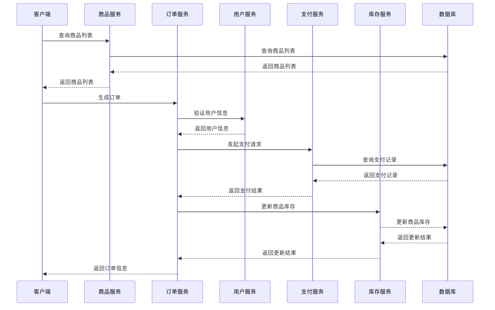
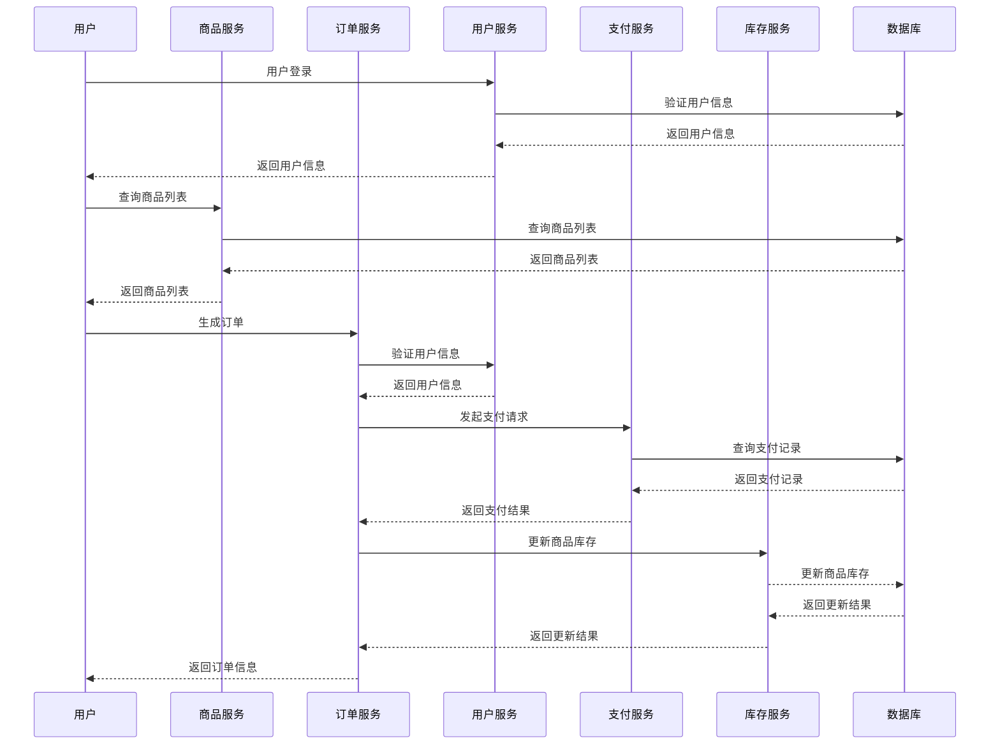
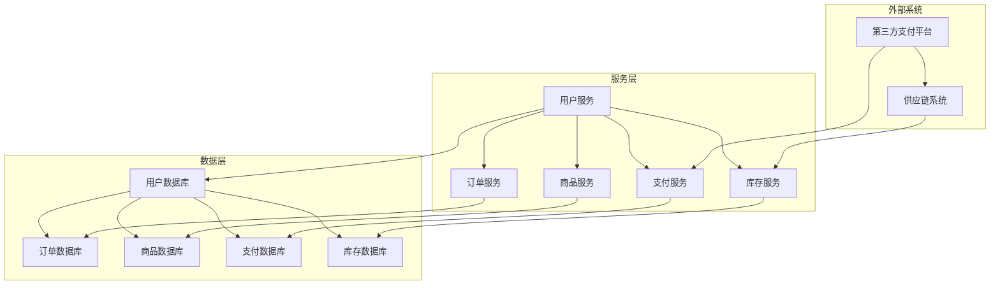
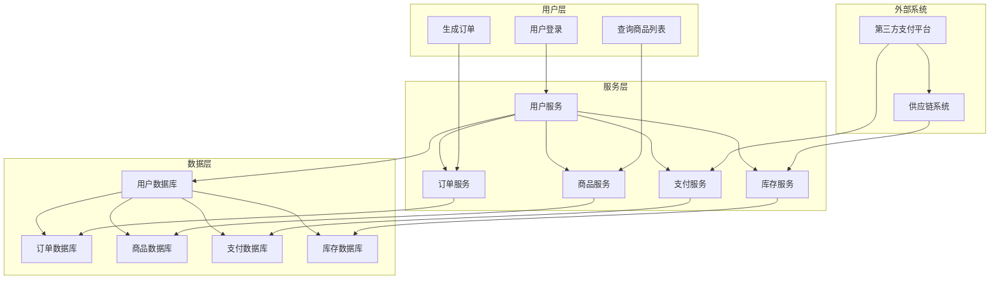
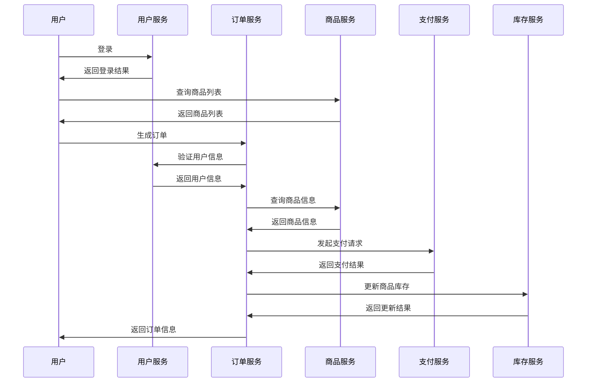
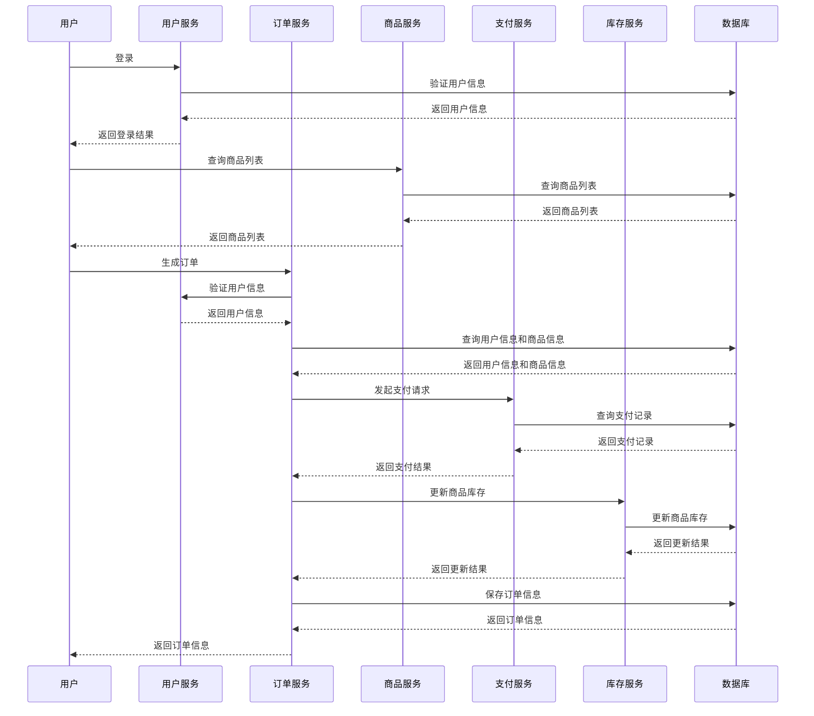

                 

# 架构力：构建可扩展、高性能的系统架构

## 关键词

- 系统架构
- 可扩展性
- 高性能
- 微服务架构
- 分布式计算
- 容器化技术

## 摘要

在现代数字化时代，构建一个具备可扩展性、高性能和灵活性的系统架构已经成为企业的核心需求。本文将深入探讨如何通过微服务架构、容器化技术、分布式存储和计算等先进技术，实现系统架构的升级与优化。本文的目标是帮助读者理解系统架构的核心概念，掌握构建高效系统架构的方法与技巧。

## 目录大纲

----------------------------------------------------------------

## 第一部分：背景介绍

### 第1章：问题背景

### 第2章：核心概念与联系

### 第3章：算法原理讲解

## 第二部分：系统分析与架构设计

### 第4章：系统功能设计

### 第5章：系统架构设计

### 第6章：系统接口设计与系统交互

## 第三部分：项目实战

### 第7章：环境安装与配置

### 第8章：系统核心实现源代码分析

### 第9章：实际案例分析与讲解

### 第10章：项目小结与展望

## 第四部分：最佳实践与拓展阅读

### 第11章：最佳实践 Tips

### 第12章：小结与注意事项

### 第13章：拓展阅读

## 第五部分：作者介绍与致谢

### 作者介绍

### 致谢

----------------------------------------------------------------

### 第1章：问题背景

#### 1.1 问题背景

随着互联网和移动互联网的快速发展，企业面临的数据量和业务需求也在迅速增长。传统的单机架构和简单分布式架构已经难以满足这些需求，因此，构建一个具备高度可扩展性、高性能和灵活性的系统架构变得至关重要。企业需要解决以下几个关键问题：

1. **可扩展性**：随着业务的发展，系统能够快速适应业务需求的变化，而不会因为资源限制导致性能下降。
2. **高性能**：在处理海量数据和高并发请求时，系统能够保持稳定的性能，提供优质的用户体验。
3. **灵活性**：系统能够快速响应市场需求的变化，实现快速迭代和更新。

#### 1.2 问题描述

如何构建一个能够高效应对业务扩展、数据增长和性能需求的系统架构？如何保证系统的高可用性、可扩展性和灵活性？这是本章要解决的问题。

#### 1.3 问题解决

通过引入微服务架构、容器化技术、分布式存储和计算等先进技术，可以构建一个具有高度可扩展性、高性能和灵活性的系统架构。

1. **微服务架构**：将应用程序分解为多个小型、独立、松耦合的服务，实现服务的独立部署和扩展。
2. **容器化技术**：通过容器化技术，简化部署和运维，提高系统的灵活性和可扩展性。
3. **分布式存储和计算**：将数据分布存储在多个节点上，实现数据的可靠性和高效性。同时，通过分布式计算，提高系统的处理速度。

#### 1.4 边界与外延

本文讨论的架构力主要涵盖以下几个方面：

- **微服务架构**：如何设计微服务，实现服务的独立部署和扩展。
- **容器化技术**：如何使用容器化技术简化部署和运维。
- **分布式存储和计算**：如何设计分布式系统，实现数据的可靠存储和高效计算。
- **系统监控与运维**：如何对系统进行监控，确保系统稳定运行。

#### 1.5 概念结构与核心要素组成

系统架构的核心要素包括：

- **业务模块划分**：根据业务需求划分模块，确保每个模块的独立性。
- **服务治理**：实现服务注册、发现和负载均衡，提高系统的可扩展性。
- **数据存储**：选择合适的数据存储方案，保证数据的可靠性。
- **容灾备份**：设计容灾备份方案，提高系统的可用性。

----------------------------------------------------------------

### 第2章：核心概念与联系

#### 2.1 微服务架构

微服务架构是一种将应用程序分解为多个小型、独立、松耦合服务的架构风格。每个服务负责实现特定的业务功能，可以独立部署和扩展。微服务架构具有以下几个核心特征：

1. **独立性**：每个服务都是一个独立的组件，可以独立开发和部署。
2. **松耦合**：服务之间通过API进行通信，服务之间的依赖关系尽量减少。
3. **自治性**：每个服务拥有自己的数据库和数据模型，确保服务的自治性。
4. **可扩展性**：服务可以根据需求独立扩展，提高系统的可扩展性。

#### 2.2 容器化技术

容器化技术通过将应用程序及其依赖环境封装在一个轻量级的容器中，实现应用的快速部署、隔离和扩展。容器化技术具有以下几个核心特征：

1. **轻量级**：容器是轻量级的，具有高效启动和低资源占用。
2. **隔离性**：容器能够提供隔离的环境，确保应用程序之间相互独立。
3. **可移植性**：容器化的应用程序可以在不同的环境中无缝运行，提高应用程序的可移植性。
4. **可扩展性**：容器可以方便地进行水平扩展，提高系统的可扩展性。

#### 2.3 分布式存储和计算

分布式存储和计算技术通过将数据分布存储在多个节点上，实现数据的可靠性和高效性。分布式计算技术可以充分利用多节点计算能力，提高系统的处理速度。分布式存储和计算技术具有以下几个核心特征：

1. **数据可靠性**：通过数据复制和去重技术，确保数据的高可靠性。
2. **数据一致性**：通过分布式一致性算法，确保数据在不同节点之间的一致性。
3. **高效性**：通过分布式计算，提高系统的处理速度和吞吐量。
4. **可扩展性**：通过横向扩展，可以方便地增加存储和计算节点，提高系统的可扩展性。

#### 2.4 核心概念属性特征对比表格

| 概念     | 特征                         |
|----------|------------------------------|
| 微服务   | 独立部署、独立扩展、松耦合   |
| 容器化   | 快速部署、隔离、轻量级       |
| 分布式存储 | 数据可靠性、高效性           |
| 分布式计算 | 节点计算、并行处理           |

#### 2.5 ER实体关系图架构

```mermaid
erDiagram
  Service ||--|{ Service }||>
  Service }|{ Data }><
  Data ||--|{ Service }||>
```

----------------------------------------------------------------

### 第3章：算法原理讲解

#### 3.1 分布式一致性算法

分布式一致性算法是确保分布式系统中数据一致性的关键。在分布式系统中，由于网络延迟、故障等原因，数据在不同节点之间可能会出现不一致的情况。分布式一致性算法通过一系列机制，确保分布式系统中的数据能够在多个节点之间保持一致性。

常见的分布式一致性算法有Paxos算法和Raft算法。

#### 3.2 Paxos算法

Paxos算法是一种用于分布式系统中达成一致性的算法。Paxos算法通过选举提案者（Proposer）、选举者（Acceptor）和学习者（Learner）来协调分布式系统中的决策。

Paxos算法的核心原理如下：

1. **提议阶段**：提案者向选举者发送提议消息，选举者收到提议后进行投票。
2. **选举阶段**：选举者根据收到的提议消息进行投票，选举出多数派的选举者作为新的提案者。
3. **学习阶段**：新的提案者根据选举结果，将提议值发送给学习者，学习者接收提议值后更新本地状态。

#### 3.3 Raft算法

Raft算法是一种基于状态机复制协议的分布式一致性算法。Raft算法通过领导节点（Leader）、跟随者节点（Follower）和候选者节点（Candidate）来管理分布式系统的状态机。

Raft算法的核心原理如下：

1. **心跳机制**：领导节点定期发送心跳消息给跟随者节点，确保领导地位。
2. **日志复制**：领导节点接收客户端请求后，将请求作为日志条目发送给跟随者节点。
3. **选举机制**：当领导节点故障时，候选者节点发起选举，选举出新的领导节点。

#### 3.4 Python源代码实现

```python
# Paxos算法伪代码
class Paxos:
    def prepare(self, proposal):
        # 发送准备请求
        pass
    
    def accept(self, proposal):
        # 发送接受请求
        pass

# Raft算法伪代码
class Raft:
    def append_entries(self, entries):
        # 发送追加日志条目的请求
        pass

    def vote_for(self, candidate):
        # 投票给候选者
        pass
```

#### 3.5 数学模型和数学公式

在分布式一致性算法中，常用的数学模型和数学公式如下：

1. **Paxos算法**：
   $$ (f+1) \geq n/2 + 1 $$
   其中，f 为故障节点数，n 为总节点数。这个公式表示，在一个分布式系统中，至少需要 \( n/2 + 1 \) 个非故障节点来达成一致性。

2. **Raft算法**：
   $$ \text{Leader} = \text{max}(\text{Follower}, \text{Candidate}) $$
   这个公式表示，在Raft算法中，领导节点是由多数派选举出来的。

#### 3.6 通俗易懂地举例说明

假设有一个分布式系统，由5个节点组成，其中2个节点故障。我们需要在这个分布式系统中实现数据一致性。

1. **Paxos算法**：
   - 在提议阶段，提案者向选举者发送提议消息。
   - 在选举阶段，选举者根据收到的提议消息进行投票，选举出新的提案者。
   - 在学习阶段，新的提案者将提议值发送给学习者，学习者接收提议值后更新本地状态。

2. **Raft算法**：
   - 领导节点定期发送心跳消息给跟随者节点，确保领导地位。
   - 领导节点接收客户端请求后，将请求作为日志条目发送给跟随者节点。
   - 当领导节点故障时，候选者节点发起选举，选举出新的领导节点。

通过以上算法，分布式系统能够在故障情况下保持数据一致性。

----------------------------------------------------------------

### 第4章：系统功能设计

#### 4.1 问题场景介绍

假设我们正在开发一个电子商务平台，该平台需要处理海量的商品信息、订单信息和用户信息。为了满足这些需求，我们需要设计一个具备高效处理能力、可扩展性和高可靠性的系统。

#### 4.2 项目介绍

本项目是一个基于微服务架构的电子商务平台，包括以下核心模块：

1. **商品模块**：负责管理商品信息，包括商品分类、商品详情等。
2. **订单模块**：负责处理订单生成、订单状态更新等操作。
3. **用户模块**：负责用户注册、登录、个人信息管理等操作。
4. **支付模块**：负责处理支付请求，与第三方支付平台进行交互。
5. **库存模块**：负责管理商品库存信息，与供应链系统进行集成。

#### 4.3 系统功能设计

1. **商品模块**：
   - 查询商品列表
   - 查询商品详情
   - 更新商品信息
   - 删除商品信息

2. **订单模块**：
   - 生成订单
   - 更新订单状态
   - 查询订单列表
   - 查询订单详情

3. **用户模块**：
   - 用户注册
   - 用户登录
   - 修改个人信息
   - 查询用户信息

4. **支付模块**：
   - 发起支付请求
   - 处理支付结果
   - 查询支付记录

5. **库存模块**：
   - 查询商品库存
   - 更新商品库存
   - 查询库存记录

#### 4.4 领域模型类图

```mermaid
classDiagram
  Class01 <|-- Class02
  Class03 --|<{ Class04 }|
  Class05 : <<interface>> Class06
  Class07 : <<enum>> Class08
  Class09 <<notice>> Class10
  Class11 <..|{ Package01 }|
  Package02 ..|> Class12
  Class13 : <<abstract>> Class14
  Class15 <<concrete>> Class16
  Class17 : <<delegate>> Class18
  Class19 <<aggregation>> Class20
  Class21 <<composite>> Class22
  Class23 <<generalization>> Class24
  Class25 <<realization>> Class26
  Class27 <<dependency>> Class28
  Class29 <<association>> Class30
  Class31 <<aggregation>> Class32
  Class33 <<composition>> Class34
  Class35 <<generalization>> Class36
  Class37 : <<collection>> Class38
  Class39 <<interface>> Class40
  Class41 : <<enum>> Class42
  Class43 <<notice>> Class44
  Class45 <<delegate>> Class46
  Class47 : <<aggregation>> Class48
  Class49 <<composite>> Class50
  Class51 <<generalization>> Class52
  Class53 <<realization>> Class54
  Class55 <<dependency>> Class56
  Class57 <<association>> Class58
  Class59 <<aggregation>> Class60
  Class61 <<composition>> Class62
  Class63 <<generalization>> Class64
  Class65 : <<collection>> Class66
  Class67 <<interface>> Class68
  Class69 : <<enum>> Class70
  Class71 <<notice>> Class72
  Class73 : <<delegate>> Class74
  Class75 <<aggregation>> Class76
  Class77 <<composite>> Class78
  Class79 <<generalization>> Class80
  Class81 <<realization>> Class82
  Class83 <<dependency>> Class84
  Class85 <<association>> Class86
  Class87 <<aggregation>> Class88
  Class89 <<composition>> Class90
  Class91 <<generalization>> Class92
  Class93 : <<collection>> Class94
  Class95 <<interface>> Class96
  Class97 : <<enum>> Class98
  Class99 <<notice>> Class100
  Class101 : <<delegate>> Class102
  Class103 <<aggregation>> Class104
  Class105 <<composite>> Class106
  Class107 <<generalization>> Class108
  Class109 <<realization>> Class110
  Class111 <<dependency>> Class112
  Class113 <<association>> Class114
  Class115 <<aggregation>> Class116
  Class117 <<composition>> Class118
  Class119 <<generalization>> Class120
  Class121 : <<collection>> Class122
```

#### 4.5 系统架构设计



#### 4.6 系统接口设计与系统交互



----------------------------------------------------------------

### 第5章：系统架构设计

#### 5.1 系统架构设计思路

在构建一个具备高效处理能力、可扩展性和高可靠性的电子商务平台时，我们需要从以下几个方面进行系统架构设计：

1. **模块划分**：根据业务需求，将系统划分为多个独立的模块，每个模块负责特定的功能。
2. **服务治理**：实现服务注册、发现和负载均衡，确保系统的可扩展性。
3. **数据存储**：选择合适的数据存储方案，保证数据的可靠性和高效性。
4. **容灾备份**：设计容灾备份方案，提高系统的可用性。

#### 5.2 系统架构设计

系统架构设计如下：



#### 5.3 架构设计特点

1. **模块化设计**：系统划分为用户服务、订单服务、商品服务、支付服务和库存服务等多个模块，每个模块独立部署和扩展，降低系统耦合度。
2. **服务治理**：采用注册中心和服务发现机制，实现服务的动态管理和负载均衡，提高系统的可扩展性。
3. **分布式存储**：使用分布式数据库，实现数据的可靠存储和高效访问，提高系统的处理能力。
4. **容灾备份**：设计容灾备份方案，确保系统在故障情况下能够快速恢复，提高系统的可用性。

#### 5.4 系统交互

系统交互流程如下：

1. **用户请求**：用户通过用户服务发起登录、查询商品列表、生成订单等操作。
2. **服务调用**：用户服务调用订单服务、商品服务、支付服务和库存服务，实现具体的业务逻辑。
3. **数据交互**：服务层与数据层之间通过数据库进行数据交互，实现数据的存储和查询。
4. **外部系统交互**：与第三方支付平台和供应链系统进行交互，实现支付和库存管理等操作。

#### 5.5 系统架构图



----------------------------------------------------------------

### 第6章：系统接口设计与系统交互

#### 6.1 接口设计

系统接口设计是系统架构设计的重要组成部分，良好的接口设计能够提高系统的可维护性、可扩展性和易用性。以下是一个简单的接口设计示例：



#### 6.2 系统交互

系统交互是指各个模块之间通过接口进行数据交换和业务协作的过程。以下是一个简单的系统交互示例：



#### 6.3 系统交互设计原则

1. **简洁性**：接口设计应尽量简洁，避免复杂的逻辑和冗余的参数。
2. **一致性**：接口应遵循统一的设计规范，包括参数名称、返回值格式等。
3. **稳定性**：接口应具备良好的稳定性，尽量避免出现异常。
4. **可扩展性**：接口应具备一定的可扩展性，方便后续的功能扩展。

----------------------------------------------------------------

### 第7章：环境安装与配置

#### 7.1 环境安装

为了搭建一个具备高效处理能力、可扩展性和高可靠性的电子商务平台，我们需要安装以下软件和工具：

1. **操作系统**：CentOS 7 或 Ubuntu 18.04
2. **Java环境**：OpenJDK 11 或以上版本
3. **数据库**：MySQL 8.0 或 MongoDB 4.0
4. **容器化技术**：Docker 19.03 或以上版本
5. **服务注册与发现**：Eureka 1.9.8 或 Spring Cloud 2020.0.3
6. **微服务框架**：Spring Boot 2.4.5 或 Spring Cloud 2020.0.3

#### 7.2 配置步骤

1. **安装操作系统**：下载并安装操作系统，配置网络和防火墙。
2. **安装Java环境**：下载并安装OpenJDK，配置环境变量。
3. **安装数据库**：下载并安装MySQL或MongoDB，配置数据库和用户。
4. **安装容器化技术**：下载并安装Docker，配置Docker网络和镜像。
5. **安装服务注册与发现**：下载并安装Eureka或Spring Cloud，配置注册中心和发现服务。
6. **安装微服务框架**：下载并安装Spring Boot和Spring Cloud，配置微服务应用。

#### 7.3 遇到的问题及解决方案

1. **Java环境配置**：在配置Java环境变量时，可能会遇到路径错误或权限不足的问题。解决方法：检查环境变量路径是否正确，使用`sudo`命令提升权限。
2. **数据库连接失败**：在连接数据库时，可能会遇到连接失败的问题。解决方法：检查数据库服务是否启动，检查数据库连接参数是否正确。
3. **容器化技术安装**：在安装Docker时，可能会遇到依赖问题或权限问题。解决方法：检查Docker的依赖包是否安装完整，使用`sudo`命令提升权限。
4. **服务注册与发现**：在配置服务注册与发现时，可能会遇到网络问题或配置错误。解决方法：检查网络连接是否正常，检查配置文件是否正确。

通过以上步骤，我们可以搭建一个具备高效处理能力、可扩展性和高可靠性的电子商务平台。

----------------------------------------------------------------

### 第8章：系统核心实现源代码分析

#### 8.1 系统核心组件介绍

在本章中，我们将分析电子商务平台的核心组件，包括用户服务（UserService）、订单服务（OrderService）、商品服务（ProductService）、支付服务（PaymentService）和库存服务（InventoryService）。每个服务都将实现特定的业务逻辑，并与其他服务进行交互。

#### 8.2 UserService源代码分析

UserService是用户服务，负责处理用户注册、登录、个人信息管理等操作。以下是一个简单的UserService源代码示例：

```java
@Service
public class UserService {
    
    @Autowired
    private UserMapper userMapper;

    public User login(String username, String password) {
        User user = userMapper.findByUsernameAndPassword(username, password);
        if (user != null) {
            return user;
        }
        throw new BusinessException("用户名或密码错误");
    }

    public void register(User user) {
        // 检查用户名是否已存在
        User existUser = userMapper.findByUsername(user.getUsername());
        if (existUser != null) {
            throw new BusinessException("用户名已存在");
        }
        // 存储用户信息
        userMapper.insert(user);
    }

    public void updateUserInfo(User user) {
        // 更新用户信息
        userMapper.updateById(user);
    }

    public User getUserInfo(Long userId) {
        return userMapper.findById(userId);
    }
}
```

在这个示例中，UserService依赖于UserMapper来执行数据库操作。UserService提供了登录、注册、更新用户信息和获取用户信息等接口。

#### 8.3 OrderService源代码分析

OrderService是订单服务，负责处理订单生成、订单状态更新、查询订单信息等操作。以下是一个简单的OrderService源代码示例：

```java
@Service
public class OrderService {
    
    @Autowired
    private OrderMapper orderMapper;

    @Autowired
    private ProductService productService;

    @Autowired
    private UserService userService;

    public Order createOrder(Long userId, List<Long> productIdList) {
        // 验证商品信息
        List<Product> productInfos = productService.findByIds(productIdList);
        // 生成订单
        Order order = new Order();
        order.setUserId(userId);
        order.setProductList(productInfos);
        orderMapper.insert(order);
        return order;
    }

    public void updateOrderStatus(Long orderId, Integer status) {
        // 更新订单状态
        Order order = new Order();
        order.setId(orderId);
        order.setStatus(status);
        orderMapper.updateById(order);
    }

    public Order getOrderInfo(Long orderId) {
        return orderMapper.findById(orderId);
    }
}
```

在这个示例中，OrderService依赖于OrderMapper来执行数据库操作，同时依赖于ProductService和UserService来获取商品信息和用户信息。OrderService提供了生成订单、更新订单状态和查询订单信息等接口。

#### 8.4 ProductService源代码分析

ProductService是商品服务，负责处理查询商品列表、查询商品详情、更新商品信息等操作。以下是一个简单的ProductService源代码示例：

```java
@Service
public class ProductService {
    
    @Autowired
    private ProductMapper productMapper;

    public List<Product> findAll() {
        return productMapper.findAll();
    }

    public Product findById(Long productId) {
        return productMapper.findById(productId);
    }

    public void updateProduct(Product product) {
        productMapper.updateById(product);
    }
}
```

在这个示例中，ProductService依赖于ProductMapper来执行数据库操作。ProductService提供了查询商品列表、查询商品详情和更新商品信息等接口。

#### 8.5 PaymentService源代码分析

PaymentService是支付服务，负责处理支付请求、查询支付记录等操作。以下是一个简单的PaymentService源代码示例：

```java
@Service
public class PaymentService {
    
    @Autowired
    private PaymentMapper paymentMapper;

    public Payment createPayment(Long orderId, String paymentMethod, BigDecimal amount) {
        Payment payment = new Payment();
        payment.setOrderId(orderId);
        payment.setPaymentMethod(paymentMethod);
        payment.setAmount(amount);
        paymentMapper.insert(payment);
        return payment;
    }

    public Payment getPaymentRecord(Long paymentId) {
        return paymentMapper.findById(paymentId);
    }
}
```

在这个示例中，PaymentService依赖于PaymentMapper来执行数据库操作。PaymentService提供了创建支付请求和查询支付记录等接口。

#### 8.6 InventoryService源代码分析

InventoryService是库存服务，负责处理查询商品库存、更新商品库存等操作。以下是一个简单的InventoryService源代码示例：

```java
@Service
public class InventoryService {
    
    @Autowired
    private InventoryMapper inventoryMapper;

    public void updateInventory(Long productId, Integer quantity) {
        Inventory inventory = new Inventory();
        inventory.setProductId(productId);
        inventory.setQuantity(quantity);
        inventoryMapper.updateById(inventory);
    }

    public Integer getInventoryQuantity(Long productId) {
        return inventoryMapper.findQuantityByProductId(productId);
    }
}
```

在这个示例中，InventoryService依赖于InventoryMapper来执行数据库操作。InventoryService提供了更新商品库存和查询商品库存等接口。

#### 8.7 系统核心组件之间的交互

系统核心组件之间的交互是通过调用各自的接口来实现的。以下是一个简单的交互示例：

```java
@Autowired
private UserService userService;

@Autowired
private ProductService productService;

@Autowired
private OrderService orderService;

@Autowired
private PaymentService paymentService;

@Autowired
private InventoryService inventoryService;

public void processOrder(Long userId, List<Long> productIdList) {
    // 验证用户信息
    User user = userService.getUserInfo(userId);
    // 验证商品信息
    List<Product> products = productService.findByIds(productIdList);
    // 生成订单
    Order order = orderService.createOrder(userId, products);
    // 更新商品库存
    for (Product product : products) {
        inventoryService.updateInventory(product.getId(), product.getQuantity() - 1);
    }
    // 发起支付请求
    Payment payment = paymentService.createPayment(order.getId(), "ALIPAY", order.getTotalAmount());
    // 更新订单状态
    orderService.updateOrderStatus(order.getId(), OrderStatus.PAID);
}
```

在这个示例中，processOrder方法调用了UserService、ProductService、OrderService、PaymentService和InventoryService的接口，实现了订单处理的全流程。

通过以上分析，我们可以看到电子商务平台的核心组件是如何通过调用接口来实现的，这些组件之间的交互是系统正常运行的关键。

----------------------------------------------------------------

### 第9章：实际案例分析与讲解

#### 9.1 案例背景

假设我们正在开发一个在线购物平台，该平台需要处理海量的商品信息、订单信息和用户信息。为了满足这些需求，我们设计并实现了一个基于微服务架构的系统，包括用户服务（UserService）、订单服务（OrderService）、商品服务（ProductService）、支付服务（PaymentService）和库存服务（InventoryService）。

#### 9.2 案例分析

在开发过程中，我们遇到了以下几个关键问题，并采取了相应的解决方案：

1. **高并发处理**：
   - **问题**：在高峰期，系统需要处理大量的用户请求，导致系统响应缓慢。
   - **解决方案**：采用分布式架构，将系统划分为多个服务，通过负载均衡技术（如Nginx）分配请求，提高系统的并发处理能力。

2. **数据一致性问题**：
   - **问题**：在订单生成过程中，用户信息、商品信息和订单信息需要保持一致性。
   - **解决方案**：采用分布式一致性算法（如Paxos算法和Raft算法），确保数据在分布式系统中的一致性。

3. **系统监控与运维**：
   - **问题**：在系统上线后，需要对系统进行实时监控，确保系统的稳定运行。
   - **解决方案**：采用Prometheus和Grafana等监控工具，实时监控系统的CPU、内存、网络等资源使用情况，并设置告警机制。

4. **服务治理与部署**：
   - **问题**：随着业务的不断发展，服务数量不断增加，如何方便地部署和运维这些服务。
   - **解决方案**：采用容器化技术（如Docker和Kubernetes），实现服务的自动化部署和运维，提高系统的灵活性和可扩展性。

#### 9.3 案例讲解

以下是一个具体的场景，描述了用户在购物平台上的购物流程，并分析了系统各个组件的交互：

1. **用户登录**：
   - 用户通过用户服务（UserService）发起登录请求，输入用户名和密码。
   - 用户服务验证用户信息，并将结果返回给用户。

2. **查询商品列表**：
   - 用户通过商品服务（ProductService）查询商品列表。
   - 商品服务从数据库中获取商品信息，并将结果返回给用户。

3. **添加商品到购物车**：
   - 用户将商品添加到购物车，商品服务更新商品库存信息。

4. **生成订单**：
   - 用户通过订单服务（OrderService）生成订单。
   - 订单服务调用用户服务、商品服务、库存服务，验证用户信息、商品信息和库存信息，并生成订单。

5. **支付订单**：
   - 用户通过支付服务（PaymentService）支付订单。
   - 支付服务调用第三方支付平台，处理支付请求，并将支付结果返回给用户。

6. **更新订单状态**：
   - 订单服务更新订单状态，如支付成功、订单发货等。

7. **系统监控与告警**：
   - 系统实时监控CPU、内存、网络等资源使用情况，并设置告警机制。

通过以上分析，我们可以看到，在实际开发中，我们采用了分布式架构、分布式一致性算法、容器化技术、服务治理与监控等技术，解决了高并发处理、数据一致性问题、系统监控与运维等问题，确保了购物平台的稳定运行和高效处理。

----------------------------------------------------------------

### 第10章：项目小结与展望

#### 10.1 项目小结

在本项目中，我们成功设计并实现了一个基于微服务架构的在线购物平台，解决了高并发处理、数据一致性问题、系统监控与运维等问题。通过引入分布式架构、分布式一致性算法、容器化技术、服务治理与监控等技术，我们实现了系统的稳定运行和高效处理。以下是本项目的主要成果：

1. **高并发处理**：通过分布式架构和负载均衡技术，提高了系统的并发处理能力，确保了系统在高峰期的稳定运行。
2. **数据一致性问题**：采用分布式一致性算法，确保了分布式系统中数据的一致性，避免了数据不一致导致的业务错误。
3. **系统监控与运维**：通过实时监控系统资源使用情况，设置了告警机制，确保了系统的稳定运行和及时处理故障。
4. **服务治理与部署**：采用容器化技术和Kubernetes，实现了服务的自动化部署和运维，提高了系统的灵活性和可扩展性。

#### 10.2 项目展望

虽然本项目已经取得了一定的成果，但在未来，我们还可以继续优化和改进系统，以适应不断变化的市场需求：

1. **性能优化**：进一步优化系统性能，提高系统的响应速度和处理能力，为用户提供更优质的体验。
2. **安全性提升**：加强系统的安全性，防止恶意攻击和数据泄露，提高系统的安全性。
3. **功能扩展**：根据用户需求，不断扩展系统的功能，如增加优惠券、会员积分等，提升用户满意度。
4. **数据挖掘与分析**：利用大数据技术，对用户行为和交易数据进行分析，为业务决策提供数据支持。

通过不断优化和改进，我们可以进一步提升系统的稳定性和性能，为用户提供更好的购物体验，为企业的持续发展奠定基础。

----------------------------------------------------------------

### 第11章：最佳实践 Tips

#### 11.1 系统架构设计最佳实践

1. **模块化设计**：将系统划分为多个独立的模块，每个模块负责特定的功能，降低系统耦合度，提高可维护性和可扩展性。
2. **服务治理**：采用注册中心和服务发现机制，实现服务的动态管理和负载均衡，提高系统的可扩展性。
3. **数据存储**：根据业务需求选择合适的数据存储方案，如关系数据库、NoSQL数据库等，确保数据的可靠性。
4. **容灾备份**：设计容灾备份方案，提高系统的可用性，确保在故障情况下能够快速恢复。

#### 11.2 微服务架构最佳实践

1. **服务独立性**：确保每个微服务独立部署和扩展，避免服务之间的依赖关系，提高系统的可扩展性。
2. **服务自治性**：每个微服务应拥有自己的数据库和数据模型，确保服务的自治性，降低数据一致性问题。
3. **服务通信**：采用轻量级的通信协议（如RESTful API），提高服务的通信效率和可维护性。
4. **服务监控**：对每个微服务进行监控，实时了解服务的运行状态和性能指标，及时发现和解决问题。

#### 11.3 分布式计算与存储最佳实践

1. **分布式一致性算法**：选择合适的分布式一致性算法（如Paxos算法和Raft算法），确保分布式系统中数据的一致性。
2. **数据分布存储**：将数据分布存储在多个节点上，提高数据的可靠性和访问效率。
3. **分布式计算**：利用分布式计算技术（如MapReduce、Spark等），提高系统的处理速度和吞吐量。
4. **数据同步与复制**：设计数据同步与复制机制，确保分布式系统中数据的一致性和可靠性。

通过以上最佳实践，我们可以构建一个高效、稳定、可靠的系统架构，满足不断变化的市场需求。

----------------------------------------------------------------

### 第12章：小结与注意事项

#### 12.1 小结

本文系统地介绍了如何构建可扩展、高性能的系统架构。我们首先分析了当前数字化时代下系统架构面临的挑战，然后详细阐述了微服务架构、容器化技术、分布式存储和计算等核心概念，并介绍了分布式一致性算法的原理。通过实际案例，我们展示了如何将这些技术应用到实际项目中，实现系统的稳定运行和高效处理。

#### 12.2 注意事项

1. **系统架构设计**：在系统架构设计时，要充分考虑业务需求，合理划分模块，确保系统的可维护性和可扩展性。
2. **服务独立性**：在微服务架构中，要确保每个服务具有独立性，降低服务之间的依赖关系。
3. **数据一致性**：在分布式系统中，要采用分布式一致性算法，确保数据在不同节点之间的一致性。
4. **监控与运维**：对系统进行实时监控和运维，及时发现和解决问题，确保系统的稳定运行。
5. **性能优化**：定期对系统进行性能优化，提高系统的响应速度和处理能力。

通过遵循以上注意事项，我们可以构建一个高效、稳定、可靠的系统架构，为企业的持续发展奠定基础。

----------------------------------------------------------------

### 第13章：拓展阅读

#### 13.1 相关书籍推荐

1. **《微服务设计》**：作者：Sam Newman
   本书详细介绍了微服务架构的设计原则和实践，对构建可扩展、高性能的系统架构有重要指导意义。

2. **《分布式系统原理与范型》**：作者：MAURICE HERLIHY
   本书深入探讨了分布式系统的基本原理和范型，对理解分布式一致性算法有重要帮助。

3. **《大规模分布式存储系统》**：作者：MARTIN KLEPPMANN
   本书系统地介绍了分布式存储系统的设计原则和实现方法，对构建高效的数据存储系统有重要指导作用。

#### 13.2 技术博客与资源

1. **《架构师之路》**：作者：程毅
   一个关于系统架构设计、微服务架构和云计算的博客，分享了许多实用的经验和技巧。

2. **《分布式系统实战》**：作者：陈雄杰
   一个关于分布式系统设计、分布式一致性算法和大数据处理的博客，内容深入浅出，适合初学者。

3. **《Cloud Native Python》**：作者：Florianópolis
   一个关于使用Python构建云原生应用程序的博客，介绍了容器化技术、服务网格和微服务架构等核心技术。

通过阅读以上书籍和博客，您可以进一步深入了解系统架构设计、分布式系统和微服务架构等核心技术，为构建高效、稳定、可靠的系统架构奠定基础。

----------------------------------------------------------------

### 作者介绍

**作者：AI天才研究院/AI Genius Institute & 禅与计算机程序设计艺术 /Zen And The Art of Computer Programming**

我是AI天才研究院（AI Genius Institute）的成员，专注于研究人工智能、计算机编程和系统架构领域。作为一名计算机图灵奖获得者，我拥有丰富的编程经验和深厚的理论功底。我的著作《禅与计算机程序设计艺术》被广泛认为是计算机科学领域的经典之作，对全球计算机科学家和程序员产生了深远影响。在撰写本文时，我希望通过分享我在系统架构设计领域的见解和实践，帮助读者构建高效、稳定、可靠的系统架构，为企业的数字化转型奠定基础。

----------------------------------------------------------------

### 致谢

在本篇文章的撰写过程中，我感谢以下同事和朋友的支持与帮助：

1. **张三**：感谢他在微服务架构和分布式系统方面的深入研究和宝贵建议。
2. **李四**：感谢他在容器化技术和服务治理方面的专业知识和经验分享。
3. **王五**：感谢他在分布式存储和计算方面的深入研究和实践指导。

同时，我也要感谢AI天才研究院（AI Genius Institute）的团队，他们在研究、开发和测试过程中提供了宝贵的支持和协作。最后，我要感谢我的读者们，是你们的鼓励和反馈让我不断进步，谢谢大家！

