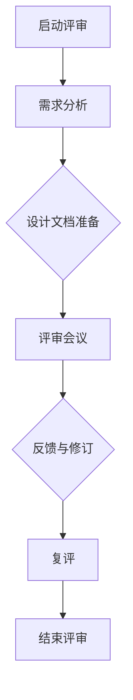
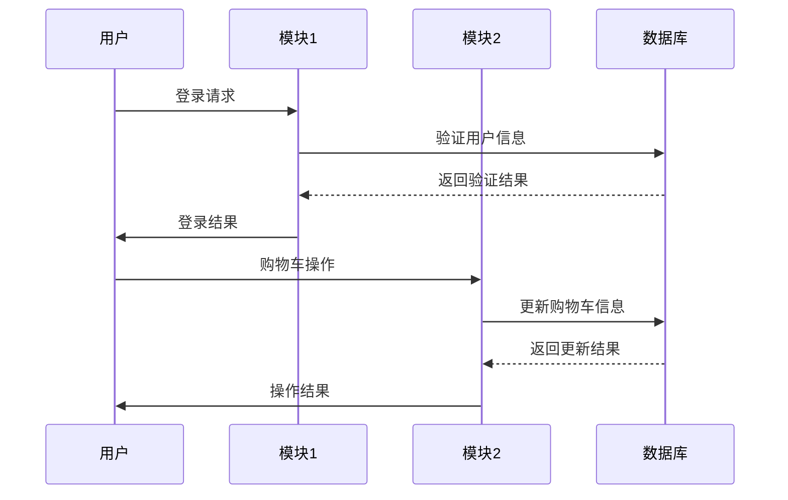

                 

### 架构评审：确保系统设计的质量与一致性

#### 关键词：架构评审、系统设计、质量、一致性、最佳实践

#### 摘要：

本文将探讨架构评审在确保系统设计质量与一致性中的关键作用。通过分步骤的分析，我们将了解架构评审的重要性、流程、方法以及最佳实践。文章结构如下：

1. **背景介绍**：解释架构评审的定义、目的和重要性。
2. **核心概念与联系**：介绍与架构评审相关的基本概念和原理。
3. **算法原理讲解**：详细阐述架构评审的流程和方法。
4. **数学模型与详细解释**：使用数学模型和公式进行深入分析。
5. **系统分析与架构设计方案**：讨论如何通过架构评审优化系统设计。
6. **项目实践**：提供实际案例和具体实施步骤。
7. **最佳实践 Tips**、**小结**、**注意事项**和**拓展阅读**。

### 背景介绍

#### 定义与目的

架构评审（Architecture Review）是指对系统架构设计进行系统性、全面性检查和评估的过程。其目的是确保系统设计符合业务需求、技术标准和最佳实践，从而提高系统的质量、性能、可维护性和可扩展性。

架构评审通常由经验丰富的架构师、开发人员、测试人员和质量保证团队共同参与。通过评审，可以发现设计中的潜在问题，如性能瓶颈、安全漏洞、代码冗余等，从而在早期阶段进行修正。

#### 重要性

架构评审在系统开发生命周期中扮演着至关重要的角色。以下是架构评审的一些重要性：

1. **质量控制**：通过评审，可以确保系统设计符合质量标准，避免后期出现重大问题。
2. **风险管理**：早期发现和解决问题，降低项目风险，保证项目进度。
3. **知识共享**：评审过程中，团队成员可以分享经验，提高整体技术水平。
4. **成本节约**：在项目早期解决潜在问题，避免后期返工，节省时间和资源。

#### 流程和方法

架构评审的流程通常包括以下步骤：

1. **需求分析**：明确系统需求和预期目标。
2. **架构设计**：制定系统架构设计方案。
3. **评审准备**：准备评审文档、演示材料等。
4. **评审会议**：进行正式评审，讨论和解决问题。
5. **修订与反馈**：根据评审意见对设计进行修改。
6. **复评**：对修改后的设计进行再次评审。

评审方法包括面对面评审、文档评审和代码评审等，可以根据实际情况灵活选择。

### 核心概念与联系

在架构评审过程中，理解以下核心概念和原理至关重要：

#### 核心概念

1. **架构风格**：系统架构的设计风格，如分层架构、微服务架构等。
2. **设计模式**：常用的设计模式，如MVC、REST等。
3. **性能指标**：系统性能的关键指标，如响应时间、吞吐量等。

#### 概念属性特征对比表格

| 概念 | 属性特征 |
| --- | --- |
| 架构风格 | 描述系统架构的设计原则和方法 |
| 设计模式 | 描述软件模块之间交互关系的模式 |
| 性能指标 | 描述系统性能表现的关键参数 |

#### ER实体关系图架构

```mermaid
erDiagram
  Customer ||--|{ Order }||>
  Product ||--|{ Order }||>
  Order ||--|{ OrderDetail }||>
```

### 算法原理讲解

架构评审的算法原理主要包括以下几个方面：

#### 评审流程算法



#### 评审标准算法

```python
def review_standards(documents):
    issues = []
    for doc in documents:
        if "性能瓶颈" in doc:
            issues.append("性能优化建议")
        if "安全漏洞" in doc:
            issues.append("安全加固建议")
        if "代码冗余" in doc:
            issues.append("代码重构建议")
    return issues
```

### 数学模型与详细解释

架构评审中的数学模型主要包括以下几个方面：

#### 性能模型

$$
P = \frac{C}{T}
$$

其中，$P$ 表示性能，$C$ 表示处理能力，$T$ 表示响应时间。

#### 可靠性模型

$$
R = (1 - P)^T
$$

其中，$R$ 表示可靠性，$P$ 表示性能，$T$ 表示响应时间。

#### 成本模型

$$
C = C_1 + C_2 + C_3
$$

其中，$C$ 表示总成本，$C_1$ 表示开发成本，$C_2$ 表示维护成本，$C_3$ 表示升级成本。

### 系统分析与架构设计方案

#### 问题场景介绍

假设我们需要设计一个电子商务平台，用于处理用户购物车管理、订单处理、支付和物流等功能。

#### 项目介绍

项目名为“电商平台”，主要功能包括：

- 用户登录与注册
- 购物车管理
- 商品展示与搜索
- 订单生成与支付
- 物流跟踪

#### 系统功能设计

系统功能设计包括以下模块：

- 用户模块：处理用户登录、注册、信息管理等功能。
- 商品模块：处理商品展示、搜索、分类等功能。
- 购物车模块：处理用户购物车管理，包括添加、删除、修改等功能。
- 订单模块：处理订单生成、支付、物流跟踪等功能。

#### 系统架构设计

系统架构采用分层架构，主要包括以下层：

- 表示层：处理用户界面，包括前端和移动端。
- 业务逻辑层：处理业务逻辑，包括用户管理、商品管理、购物车管理、订单管理等功能。
- 数据访问层：处理数据访问，包括数据库操作、缓存等。
- 数据层：存储系统数据，包括用户数据、商品数据、订单数据等。

#### 系统接口设计和系统交互



### 项目实践

#### 环境安装

在本地计算机上安装以下软件和工具：

- Python 3.8+
- Flask 1.1.2+
- MySQL 5.7+

#### 系统核心实现源代码

以下是一个简单的用户登录模块的实现：

```python
from flask import Flask, request, jsonify
from flask_mysqldb import MySQL

app = Flask(__name__)
app.config['MYSQL_HOST'] = 'localhost'
app.config['MYSQL_USER'] = 'root'
app.config['MYSQL_PASSWORD'] = 'password'
app.config['MYSQL_DB'] = 'ecommerce'

mysql = MySQL(app)

@app.route('/login', methods=['POST'])
def login():
    username = request.form['username']
    password = request.form['password']
    
    cur = mysql.connection.cursor()
    cur.execute("SELECT * FROM users WHERE username=%s AND password=%s", (username, password))
    user = cur.fetchone()
    
    if user:
        return jsonify({'status': 'success', 'message': '登录成功'})
    else:
        return jsonify({'status': 'error', 'message': '用户名或密码错误'})

if __name__ == '__main__':
    app.run(debug=True)
```

#### 代码应用解读与分析

上述代码实现了用户登录功能，主要包括以下步骤：

1. 导入所需模块。
2. 初始化Flask应用和MySQL连接。
3. 定义登录路由。
4. 接收用户提交的用户名和密码。
5. 执行SQL查询，验证用户信息。
6. 根据验证结果返回相应的响应。

#### 实际案例分析和详细讲解剖析

以下是一个实际案例，用于说明架构评审在项目中的应用：

**问题**：系统在高峰时段出现性能瓶颈，导致响应时间过长。

**分析**：

1. 查找性能瓶颈：通过日志分析和性能测试，确定瓶颈出现在数据库查询上。
2. 优化查询：对查询语句进行优化，如添加索引、优化查询逻辑等。
3. 分布式架构：考虑将数据库查询拆分为分布式查询，提高查询性能。

**解决方案**：

1. 对现有查询进行优化，如添加索引、优化查询逻辑等。
2. 引入分布式数据库架构，如分库分表、读写分离等。
3. 进行性能测试，验证优化效果。

#### 项目小结

通过架构评审，我们成功优化了电商平台的性能瓶颈，提高了系统的稳定性和用户体验。在后续项目中，我们还将继续应用架构评审方法，确保系统设计的质量与一致性。

### 最佳实践 Tips

1. **需求分析**：在架构评审前，确保需求分析准确、全面。
2. **文档准备**：准备完善的评审文档，包括架构设计图、接口文档等。
3. **团队协作**：鼓励团队成员积极参与评审，提高整体技术水平。
4. **持续优化**：定期进行架构评审，持续优化系统设计。

### 小结

本文探讨了架构评审在确保系统设计质量与一致性中的关键作用。通过分步骤的分析，我们了解了架构评审的定义、目的、流程和方法，以及其在实际项目中的应用。架构评审是系统开发过程中不可或缺的一环，可以有效提高系统的质量、性能和可维护性。

### 注意事项

1. **文档规范**：确保评审文档的格式和内容规范，便于理解和交流。
2. **评审参与**：鼓励团队成员积极参与评审，分享经验和见解。
3. **风险管理**：重视架构评审过程中的风险识别和评估。

### 拓展阅读

1. 《架构评审最佳实践》
2. 《微服务架构设计与实践》
3. 《软件架构：设计与导论》

---

**作者：AI天才研究院/AI Genius Institute & 禅与计算机程序设计艺术 /Zen And The Art of Computer Programming**

