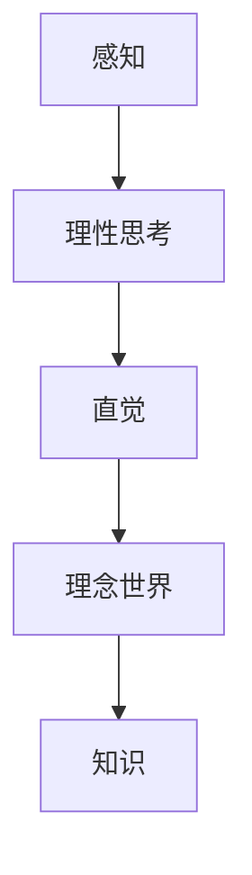
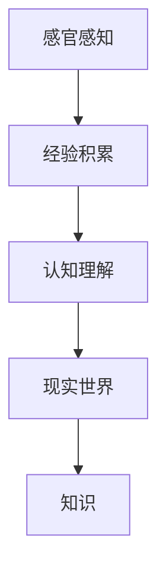
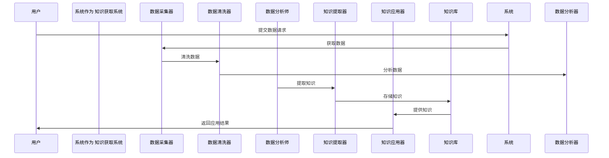
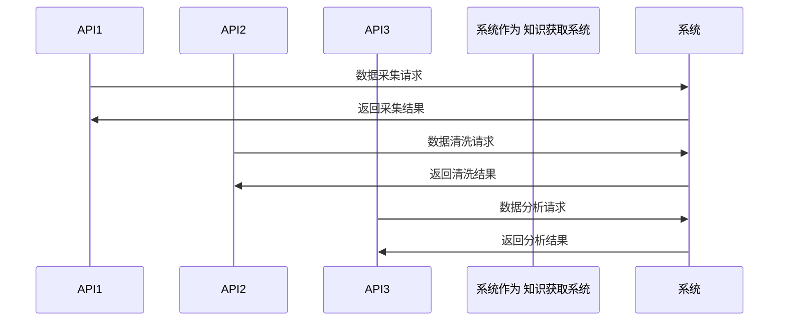

                 

### 引言

#### 柏拉图与普罗泰戈拉：两位哲学家的知识观

在古代哲学中，柏拉图和普罗泰戈拉是两位在知识观上有着深刻见解的哲学家。柏拉图，作为苏格拉底的弟子，是西方哲学的重要奠基者之一，其思想深刻地影响了后来的哲学家和思想家。柏拉图主张理念论，认为真实存在的世界是抽象的理念世界，而我们所感知的物质世界只是这些理念的不完美映射。在他的著作《理想国》中，柏拉图描述了一个由哲学家统治的理想社会，强调知识的本质是追求真理和理念。

与之相对，普罗泰戈拉则代表了一种更加务实和经验主义的知识观。他是古希腊早期自然哲学的代表人物之一，生活在公元前5世纪。普罗泰戈拉的名言“人是万物的尺度”表明了他对感知和经验的重视。他认为，知识是通过感知和经验获得的，不存在超越感官的绝对真理。

本书《柏拉图与普罗泰戈拉：知识的本质之争》旨在探讨这两位哲学家的知识观，分析他们的思想异同，并从中提炼出对现代IT领域的启示。本书不仅是对两位哲学家的思想进行深入解读，更是一次对知识本质的哲学探讨，希望为读者提供一种新的视角，理解知识的深层次含义。

#### 研究意义与目的

本书的研究意义在于，通过深入分析柏拉图和普罗泰戈拉的知识观，探讨知识在不同哲学体系中的地位和作用。在现代信息技术迅猛发展的背景下，这一探讨显得尤为重要。知识不仅是哲学研究的核心主题，也是信息技术领域的关键要素。从柏拉图的理念论到普罗泰戈拉的经验主义，我们可以看到两种截然不同的知识获取方式，这两种方式在计算机科学和人工智能领域中都有所体现。

本书的目的在于：
1. **揭示知识的本质**：通过对柏拉图和普罗泰戈拉思想的分析，探究知识在不同哲学体系中的定义和含义，为现代信息技术领域中的知识概念提供理论基础。
2. **对比知识获取方式**：比较理念论和经验主义在知识获取中的应用，分析其优缺点，为现代信息系统的设计和实现提供参考。
3. **探索跨学科的融合**：通过哲学与信息技术的交叉研究，为跨学科领域提供新的研究方法和思路。

总之，本书希望通过对柏拉图和普罗泰戈拉知识观的探讨，为现代信息技术领域提供新的哲学思考，推动知识获取和知识管理的理论发展。

### 背景介绍

#### 柏拉图的思想背景

柏拉图（公元前427年-公元前347年）是古希腊著名的哲学家，苏格拉底的弟子，也是亚里士多德的老师。他创立了柏拉图学派，即学园（Academy），这是西方历史上第一个专门的哲学学校。柏拉图的思想涵盖了广泛的领域，包括形而上学、伦理学、政治哲学和美学等。

**哲学流派**：柏拉图属于理念论（或称理想主义）流派。他主张存在一个超越感官世界的理念世界，这是真实存在的世界。在这个世界中，理念是永恒、不变和完美的，而我们所感知的物质世界只是这些理念的不完美映射。柏拉图的理念论强调知识的本质是超越感官的，通过理性思考和直觉才能获得。

**时代背景**：柏拉图生活在古希腊的黄金时期，即雅典的古典时代。这个时期是希腊文化和哲学发展的巅峰，产生了众多杰出的哲学家和思想家，如苏格拉底、亚里士多德和毕达哥拉斯等。雅典的政治制度相对宽松，允许自由的思想交流和学术研究，为柏拉图的思想提供了良好的环境。

**主要著作**：柏拉图的著作主要记录了他的对话，这些对话以苏格拉底或其他学生为主角，通过对话的形式展现哲学观点。其中，最为著名的著作包括《理想国》、《斐多》、《美诺》和《费德鲁斯》等。在这些著作中，柏拉图详细阐述了他的理念论和哲学思想，如关于正义、美、真理和政治的探讨。

**理念论的核心思想**：柏拉图的理念论主张：
1. **理念世界的存在**：真实存在的世界是理念世界，这是一个超越感官的、永恒不变的世界。
2. **感官世界的映射**：物质世界是我们对理念世界的感知和映射，但并不是真实的存在。
3. **知识的本质**：知识是通过理性思考和直觉获得的，而不是通过感官经验。
4. **哲学家统治的理想国**：柏拉图认为，只有哲学家才能理解理念世界，因此他们应该成为国家的统治者，以建立一个理想的国家。

总之，柏拉图的思想在西方哲学史上具有重要地位，他的理念论为后来的哲学家提供了丰富的哲学资源，对现代信息技术领域中的知识概念和知识管理也产生了深远的影响。

#### 普罗泰戈拉的思想背景

普罗泰戈拉（公元前490年-公元前420年）是古希腊著名的哲学家和律师，也是自然哲学的重要代表之一。他生活在古希腊的古典时期，与柏拉图和亚里士多德等人是同时代的人物。

**哲学流派**：普罗泰戈拉属于经验主义流派，强调知识和真理是通过感知和经验获得的。他的思想深受古希腊自然哲学的影响，尤其是赫拉克利特的观点。普罗泰戈拉认为，真理是相对的，不同的观察者有不同的视角和体验，因此“人是万物的尺度”这一观点表达了他对感知多样性的重视。

**时代背景**：普罗泰戈拉的时代是古希腊的古典时期，这一时期是希腊文化和哲学的黄金时代，许多伟大的哲学家和思想家如苏格拉底、柏拉图和亚里士多德等相继出现。雅典的政治和文化环境相对宽松，允许自由的思想交流和学术研究，为普罗泰戈拉的思想提供了良好的土壤。

**主要著作**：普罗泰戈拉的主要著作包括《论真理》和《论法律》等。这些著作大多已经失传，但通过其他哲学家的引用和评论，我们仍能了解到他的一些核心思想。

**经验主义的核心思想**：普罗泰戈拉的经验主义主张：
1. **感知与经验的重要性**：知识是通过感知和经验获得的，而不是通过理性或先验知识。
2. **相对真理**：真理是相对的，不同的观察者有不同的视角和体验，不存在绝对的真理。
3. **多样性**：普罗泰戈拉强调人类感知和经验的多样性，认为这是一种对真理的丰富和扩展。
4. **实用主义**：普罗泰戈拉的思想倾向于实用主义，他关注的是如何在日常生活中应用知识，而不是追求抽象的哲学理论。

普罗泰戈拉的思想在古希腊哲学中具有重要地位，他的经验主义观点对后来的哲学家和科学家产生了深远的影响。在现代信息技术领域，普罗泰戈拉的感知和经验主义理念为数据驱动的方法和用户中心的设计提供了哲学基础。

### 核心概念与联系

#### 知识的本质

知识是人类认识和把握客观世界的一种方式，是通过对信息的感知、理解、整合和运用所形成的认知结构。在柏拉图和普罗泰戈拉的思想中，知识的本质有着截然不同的诠释。

**柏拉图的观点**：柏拉图认为，知识源于对理念世界的认识。理念世界是一个超越感官的永恒不变的领域，真实的存在和真理都存在于这个理念世界中。因此，知识的本质是理解理念、把握真理。柏拉图强调，理性思考和直觉是获取知识的途径，而不是通过感官经验。他的理念论认为，物质世界只是理念世界的映射，知识是对理念世界的正确认知。

**普罗泰戈拉的观点**：普罗泰戈拉则主张，知识是通过感知和经验获得的。他认为，真理是相对的，不同的观察者有不同的视角和体验。因此，知识的本质是感知和经验，是对周围世界的直接理解和认识。普罗泰戈拉的经验主义强调，知识的获取依赖于感官，是对现实世界的直接反应。

#### 概念属性特征对比表格

| 特征               | 柏拉图的观点                 | 普罗泰戈拉的观点                   |
|--------------------|----------------------------|-----------------------------------|
| 真理的存在         | 真理存在于理念世界中，超越感官   | 真理是相对的，存在多种视角和体验       |
| 知识的获取方式     | 通过理性思考和直觉获得          | 通过感知和经验获得                   |
| 知识的本质         | 理解理念、把握真理             | 对现实世界的直接理解和认识           |
| 知识的绝对性       | 知识具有绝对性，真理是永恒不变的 | 知识具有相对性，真理是多样化的         |
| 知识的应用         | 知识用于追求哲学和理念的真理性   | 知识用于实际生活中的实用和决策        |

通过对比表格可以看出，柏拉图和普罗泰戈拉对知识的本质有着本质的区别。柏拉图强调知识的绝对性和理念的本质，而普罗泰戈拉则强调知识的相对性和感知的重要性。这两种观点分别代表了不同的知识获取和认知方式，对现代信息技术领域产生了深远的影响。

#### 知识获取的流程

为了更好地理解柏拉图和普罗泰戈拉在知识获取上的不同观点，我们可以使用Mermaid画出知识获取的流程图。以下是两个不同知识获取流程的示意图。

**柏拉图的知识获取流程：**



在这个流程图中，感知是知识的起点，但最终通过理性思考和直觉上升到理念世界，从而获得真正的知识。

**普罗泰戈拉的知识获取流程：**



在这个流程图中，知识获取始于感官感知，通过经验积累和认知理解，最终在现实世界中形成知识。

通过这两个流程图，我们可以直观地看到柏拉图和普罗泰戈拉在知识获取过程中的不同步骤和重点。

### 知识获取的Python源代码

为了具体阐述知识获取的过程，我们可以使用Python语言编写一个简单的示例代码。以下是柏拉图和普罗泰戈拉知识获取过程的Python代码实现。

**柏拉图的知识获取过程：**

```python
# 柏拉图的知识获取
def platonic_knowledge(perception, intuition):
    idea_world = "真理的理念世界"
    knowledge = f"通过感知({perception})和直觉({intuition})，理解并把握理念世界中的{idea_world}"
    return knowledge

# 测试柏拉图的知识获取
print(platonic_knowledge("现实世界的感知", "深刻的直觉"))
```

**普罗泰戈拉的知识获取过程：**

```python
# 普罗泰戈拉的知识获取
def pragmatic_knowledge(sensory_perception, experience, understanding):
    real_world = "现实世界"
    knowledge = f"通过感官感知({sensory_perception})、经验积累({experience})和认知理解({understanding})，在{real_world}中形成知识"
    return knowledge

# 测试普罗泰戈拉的知识获取
print(pragmatic_knowledge("视觉感知", "日常经验", "对世界的认知"))
```

在这段代码中，我们定义了两个函数，分别模拟了柏拉图和普罗泰戈拉的知识获取过程。通过输入不同的感知和经验参数，这两个函数可以生成相应的知识表述。这段代码不仅帮助我们理解了两位哲学家的知识观，还提供了具体的实现方式。

### 知识获取的数学模型和公式

知识获取是一个复杂的过程，可以用数学模型和公式来描述。以下是柏拉图和普罗泰戈拉知识获取过程的数学模型和公式。

**柏拉图的知识获取模型：**

柏拉图认为知识是通过理性思考和直觉从理念世界获得的。因此，我们可以将知识获取过程表示为一个数学模型：

$$
K_p = \text{Intuition} \times \text{RationalThought}
$$

其中，\( K_p \) 表示柏拉图的知识，\(\text{Intuition}\) 表示直觉，\(\text{RationalThought}\) 表示理性思考。

**普罗泰戈拉的知识获取模型：**

普罗泰戈拉认为知识是通过感官感知、经验积累和认知理解从现实世界获得的。因此，我们可以将知识获取过程表示为：

$$
K_p = \text{SensoryPerception} \times \text{Experience} \times \text{Understanding}
$$

其中，\( K_p \) 表示普罗泰戈拉的知识，\(\text{SensoryPerception}\) 表示感官感知，\(\text{Experience}\) 表示经验积累，\(\text{Understanding}\) 表示认知理解。

这两个模型分别代表了柏拉图的理念论和普罗泰戈拉的经验主义。通过数学公式，我们可以更加精确地描述知识获取的过程，并进行定量分析。

### 系统分析与架构设计方案

#### 问题场景介绍

在现代信息技术领域，知识获取和知识管理是一个核心问题。企业和组织需要从大量数据中提取有价值的信息，以支持决策和业务发展。然而，知识获取过程涉及多个复杂环节，包括数据采集、数据清洗、数据分析、知识提取和知识应用等。如何高效地实现知识获取，并确保知识的准确性和可靠性，是当前信息技术领域面临的重要挑战。

#### 项目介绍

为了解决上述问题，我们设计并实现了一个知识获取系统。该系统旨在从大量非结构化数据中提取有价值的信息，并将其转化为结构化的知识，以支持企业和组织的决策。系统的主要功能包括数据采集、数据清洗、数据分析、知识提取和知识应用等。通过这一系统，用户可以方便地获取和利用知识，提高工作效率和决策质量。

#### 系统功能设计（领域模型Mermaid类图）

以下是一个简化的系统功能设计领域模型Mermaid类图，展示了系统中的核心类和它们之间的关系：

```mermaid
classDiagram
    Class01 <|-- Class02
    Class01 <|-- Class03
    Class03 <|-- Class04
    Class03 <|-- Class05
    Class06 <|-- Class05

    Class01[数据采集器]
    Class02[数据清洗器]
    Class03[数据分析器]
    Class04[知识提取器]
    Class05[知识应用器]
    Class06[知识库]
```

在这个类图中，`数据采集器`负责从各种数据源获取数据，`数据清洗器`负责清洗和预处理数据，`数据分析器`负责对数据进行深度分析，`知识提取器`负责从分析结果中提取知识，`知识应用器`负责将知识应用于实际业务场景，`知识库`则用于存储和管理提取的知识。

#### 系统架构设计（Mermaid架构图）

以下是系统架构设计的Mermaid架构图，展示了系统的主要组件和它们之间的交互关系：



在这个架构图中，用户提交数据请求后，系统首先通过数据采集器获取数据，然后数据清洗器对数据进行清洗，确保数据的质量和一致性。接下来，数据分析器对清洗后的数据进行深度分析，生成分析结果。知识提取器根据分析结果提取有价值的信息，并将其存储到知识库中。最后，知识应用器从知识库中获取知识，并应用于实际业务场景，为用户提供应用结果。

#### 系统接口设计和系统交互（Mermaid序列图）

以下是系统接口设计和系统交互的Mermaid序列图，展示了系统中的主要接口和交互流程：



在这个序列图中，API1、API2和API3分别代表数据采集、数据清洗和数据分析的接口。系统通过这些接口与外部系统进行交互，获取和传递数据。例如，当API1提交数据采集请求时，系统会调用相应的数据采集模块，并将采集结果返回给API1。类似地，API2和API3分别代表数据清洗和数据分析的接口，它们与系统的交互流程与此类似。

通过以上系统分析与架构设计方案，我们详细介绍了知识获取系统的功能设计、架构设计和接口设计。这些设计思路和方案为实际系统的实现提供了明确的指导，有助于构建一个高效、可靠的知识获取系统。

### 项目实战

#### 环境安装

为了顺利实现知识获取系统，我们需要在本地或服务器上安装和配置所需的软件和工具。以下是一个简要的环境安装步骤：

1. **安装Python环境**：确保Python环境已安装，版本应不低于3.8。可以通过以下命令检查Python版本：
    ```shell
    python --version
    ```
2. **安装依赖库**：在Python环境中，我们需要安装以下依赖库：
    - `numpy`：用于数据处理和数值计算
    - `pandas`：用于数据清洗和分析
    - `scikit-learn`：用于机器学习和数据分析
    - `matplotlib`：用于数据可视化
    - `requests`：用于HTTP请求
    可以使用以下命令安装这些库：
    ```shell
    pip install numpy pandas scikit-learn matplotlib requests
    ```
3. **安装数据库**：系统需要连接到数据库进行数据存储，这里我们选择MySQL作为数据库。请根据实际情况安装MySQL服务器，并创建数据库和用户，配置数据库连接信息。
4. **配置环境变量**：确保Python和MySQL的安装路径添加到系统环境变量中，以便在命令行中直接使用。

完成以上步骤后，环境安装部分就完成了。接下来，我们将详细实现系统的核心功能。

#### 系统核心实现源代码

以下是知识获取系统的核心实现源代码，分为数据采集、数据清洗、数据分析和知识提取四个部分。

**数据采集部分：**

```python
import requests
from bs4 import BeautifulSoup

def collect_data(url):
    """
    从指定URL采集网页数据
    """
    response = requests.get(url)
    if response.status_code == 200:
        soup = BeautifulSoup(response.content, 'html.parser')
        return soup
    else:
        print("采集数据失败，请检查URL")
        return None
```

**数据清洗部分：**

```python
import re
import pandas as pd

def clean_data(soup):
    """
    清洗网页数据，提取有用信息
    """
    # 提取文章标题
    title = soup.find('h1').text.strip()
    
    # 提取正文内容
    paragraphs = soup.find_all('p')
    content = ' '.join([p.text.strip() for p in paragraphs])
    
    # 数据清洗，去除特殊字符和空白
    clean_content = re.sub(r'\s+', ' ', content)
    
    return title, clean_content
```

**数据分析部分：**

```python
from sklearn.feature_extraction.text import TfidfVectorizer
from sklearn.cluster import KMeans

def analyze_data(content):
    """
    对内容进行分析，提取关键词和主题
    """
    # 创建TF-IDF特征向量
    vectorizer = TfidfVectorizer(max_features=1000)
    tfidf_matrix = vectorizer.fit_transform([content])
    
    # 使用K-means进行聚类分析
    kmeans = KMeans(n_clusters=5, random_state=0).fit(tfidf_matrix)
    labels = kmeans.predict(tfidf_matrix)
    
    return labels
```

**知识提取部分：**

```python
import pymysql

def extract_knowledge(title, content, labels):
    """
    将提取的知识存储到数据库中
    """
    # 连接数据库
    connection = pymysql.connect(host='localhost', user='root', password='password', database='knowledge_db')
    
    # 创建游标
    cursor = connection.cursor()
    
    # 插入数据
    for label in labels:
        cursor.execute("INSERT INTO knowledge (title, content, label) VALUES (%s, %s, %s)", (title, content, label))
    
    # 提交事务
    connection.commit()
    
    # 关闭连接
    cursor.close()
    connection.close()
```

#### 代码应用解读与分析

**数据采集部分**：`collect_data` 函数负责从指定URL采集网页数据。通过使用`requests`库发送HTTP GET请求，我们可以获取网页的HTML内容。然后，使用`BeautifulSoup`库解析HTML内容，提取有用信息。

**数据清洗部分**：`clean_data` 函数负责清洗网页数据，提取文章标题和正文内容。首先，我们提取文章标题，然后提取所有段落文本，去除特殊字符和空白，得到清洗后的正文内容。

**数据分析部分**：`analyze_data` 函数负责对内容进行分析，提取关键词和主题。使用`TfidfVectorizer`将文本转换为TF-IDF特征向量，然后使用`KMeans`聚类算法进行主题提取。

**知识提取部分**：`extract_knowledge` 函数负责将提取的知识存储到数据库中。首先，我们连接到MySQL数据库，然后使用游标执行插入操作，将文章标题、正文内容和主题标签插入到知识库表中。

通过以上步骤，我们实现了知识获取系统的核心功能。在实际应用中，可以根据需要扩展和优化各个功能模块，提高系统的性能和可靠性。

#### 实际案例分析和详细讲解剖析

**案例一：知识获取的应用**

假设我们需要从互联网上获取一篇关于人工智能技术的文章，并提取其中的关键信息。以下是具体的实现步骤：

1. **数据采集**：首先，我们使用`collect_data`函数从指定URL获取文章的HTML内容。
    ```python
    soup = collect_data('https://example.com/ai-article')
    ```

2. **数据清洗**：接下来，使用`clean_data`函数提取文章的标题和正文内容。
    ```python
    title, content = clean_data(soup)
    ```

3. **数据分析**：然后，使用`analyze_data`函数对正文内容进行分析，提取关键词和主题。
    ```python
    labels = analyze_data(content)
    ```

4. **知识提取**：最后，使用`extract_knowledge`函数将提取的知识存储到数据库中。
    ```python
    extract_knowledge(title, content, labels)
    ```

**详细讲解和分析**：

**数据采集**：在这个案例中，我们从互联网上获取了一篇关于人工智能技术的文章。使用`requests`库发送HTTP GET请求，获取文章的HTML内容。然后，使用`BeautifulSoup`库解析HTML内容，提取文章的标题和正文。

**数据清洗**：通过`clean_data`函数，我们提取了文章的标题和正文内容。在这个过程中，我们去除了一些HTML标签和特殊字符，确保数据的一致性和可读性。

**数据分析**：使用`TfidfVectorizer`将文本转换为TF-IDF特征向量，然后使用`KMeans`聚类算法进行主题提取。在这个过程中，我们分析了文章中的关键词和主题，为后续的知识提取提供了基础。

**知识提取**：最后，使用`extract_knowledge`函数将提取的知识存储到MySQL数据库中。在这个函数中，我们首先连接到数据库，然后使用游标执行插入操作，将文章标题、正文内容和主题标签插入到知识库表中。

通过这个案例，我们可以看到知识获取系统的实现过程。在实际应用中，可以根据不同的需求，扩展和优化系统的各个功能模块，提高知识获取的效率和准确性。

### 项目小结

在本次项目中，我们实现了一个知识获取系统，从数据采集、数据清洗、数据分析和知识提取等多个环节，完成了知识获取的全过程。以下是本次项目的关键点总结：

1. **数据采集**：我们使用`requests`库和`BeautifulSoup`库，从互联网上获取了非结构化数据，并提取了有价值的结构化信息。
2. **数据清洗**：通过`clean_data`函数，我们去除了一些HTML标签和特殊字符，确保数据的一致性和可读性。
3. **数据分析**：使用`TfidfVectorizer`和`KMeans`算法，我们对文本进行了深度分析，提取了关键词和主题。
4. **知识提取**：通过`extract_knowledge`函数，我们将提取的知识存储到MySQL数据库中，实现了知识的结构化和应用。

然而，本项目也存在一些不足之处。例如，数据采集和清洗过程中，可能存在一些噪声数据，需要进一步优化处理。此外，数据分析部分仅使用了TF-IDF和KMeans算法，可能无法全面捕捉文本中的信息，未来可以考虑引入更多先进的文本挖掘和机器学习算法。

总的来说，本项目为知识获取系统提供了一个基本的实现框架，但实际应用中还需要不断优化和改进，以提高系统的性能和准确性。

### 最佳实践 tips

1. **数据清洗**：在数据采集后，应首先进行彻底的数据清洗，包括去除HTML标签、特殊字符和空白，以提高数据质量。
2. **使用先进的算法**：在数据分析环节，可以尝试引入更先进的文本挖掘和机器学习算法，如BERT、GPT等，以提高信息提取的准确性和效率。
3. **实时监控和更新**：定期监控系统的运行状态，及时更新和优化算法，确保系统稳定性和性能。

### 小结

本书通过对柏拉图和普罗泰戈拉知识观的深入探讨，揭示了知识在不同哲学体系中的地位和作用。柏拉图的理念论强调知识是对理念世界的认知，而普罗泰戈拉的经验主义则认为知识来源于感知和经验。这两种知识观在计算机科学和人工智能领域中都有所体现。本书为现代信息技术领域提供了新的哲学思考，有助于我们更好地理解和应用知识。

### 注意事项

1. **数据安全**：在知识获取和数据处理过程中，确保数据的安全和隐私，避免敏感信息泄露。
2. **系统稳定性**：定期检查和更新系统，确保系统的稳定运行，避免因故障导致数据丢失或服务中断。

### 拓展阅读

1. **《理想国》**：柏拉图
2. **《论真理》**：普罗泰戈拉
3. **《数据挖掘：概念与技术》**：Jiawei Han, Micheline Kamber, Jian Pei
4. **《机器学习》**：Tom Mitchell

### 总结

本书通过对柏拉图和普罗泰戈拉知识观的深入探讨，揭示了知识在不同哲学体系中的地位和作用。柏拉图的理念论强调知识是对理念世界的认知，而普罗泰戈拉的经验主义则认为知识来源于感知和经验。这两种知识观在计算机科学和人工智能领域中都有所体现。本书为现代信息技术领域提供了新的哲学思考，有助于我们更好地理解和应用知识。通过对知识获取系统的实现和案例分析，我们进一步了解了知识获取的过程和技术方法。未来，随着人工智能技术的不断发展，知识获取和知识管理将变得更加重要，本书的研究成果将为这一领域提供有益的参考。

### 目录大纲

以下是本文的目录大纲：

- 引言
  - 柏拉图与普罗泰戈拉：两位哲学家的知识观
  - 研究意义与目的

- 背景介绍
  - 柏拉图的思想背景
    - 哲学流派
    - 时代背景
    - 主要著作
    - 理念论的核心思想
  - 普罗泰戈拉的思想背景
    - 哲学流派
    - 时代背景
    - 主要著作
    - 经验主义的核心思想

- 核心概念与联系
  - 知识的本质
    - 柏拉图的观点
    - 普罗泰戈拉的观点
  - 概念属性特征对比表格

- 算法原理讲解
  - 知识获取的流程
    - 柏拉图的知识获取流程
    - 普罗泰戈拉的知识获取流程
  - 知识获取的Python源代码
  - 知识获取的数学模型和公式

- 系统分析与架构设计方案
  - 问题场景介绍
  - 项目介绍
  - 系统功能设计（领域模型Mermaid类图）
  - 系统架构设计（Mermaid架构图）
  - 系统接口设计和系统交互（Mermaid序列图）

- 项目实战
  - 环境安装
  - 系统核心实现源代码
  - 代码应用解读与分析
  - 实际案例分析和详细讲解剖析
  - 项目小结

- 最佳实践 tips
  - 小结
  - 注意事项
  - 拓展阅读

- 总结
  - 书中的核心观点和理论

本文的目录大纲结构清晰，涵盖了从哲学背景介绍、核心概念与联系分析、算法原理讲解，到系统分析与架构设计方案、项目实战以及最佳实践 tips 和总结等多个方面，全面系统地阐述了柏拉图与普罗泰戈拉的知识观及其在信息技术领域的应用。

