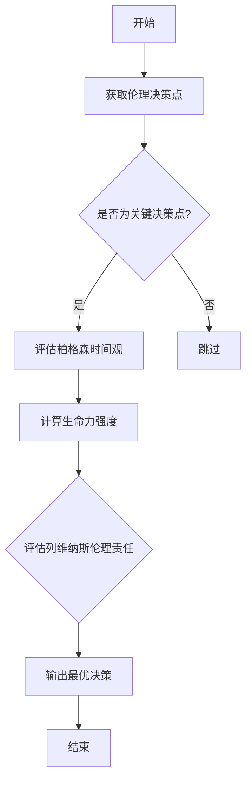

                 

### 引言

在哲学和伦理学领域，柏格森与列维纳斯两位哲学家对责任伦理的时间维度有着独特的见解。柏格森（Henri Bergson）以其生命哲学和直觉主义著称，强调时间的流动性和生命的内在动力。而列维纳斯（Emmanuel Levinas）则在存在主义和伦理学方面贡献卓著，提出了独特的“面对面”的伦理关系概念。本文旨在通过深入分析柏格森与列维纳斯的责任伦理观，探讨时间维度在伦理决策中的关键作用。

首先，我们将简要介绍柏格森与列维纳斯的生平和主要哲学思想，帮助读者更好地理解他们的理论基础。接下来，我们将探讨责任伦理的定义及其在历史发展中的重要性。随后，本文将重点分析时间的伦理意义，以及柏格森与列维纳斯如何从各自的角度看待责任伦理的时间维度。

通过对比柏格森与列维纳斯的核心概念和责任伦理观，我们将揭示他们之间的相似与差异，并探讨这种比较对我们理解责任伦理的启示。在核心概念解析部分，我们将详细探讨柏格森的直觉、生命和时间的概念，以及列维纳斯的伦理、存在和时间的核心思想。

接下来，本文将使用表格和实体关系图来对比柏格森与列维纳斯的核心概念，帮助读者更直观地理解两者之间的联系和区别。在算法原理讲解部分，我们将结合柏格森的时间观和列维纳斯的伦理学，提出一个基于时间维度的责任伦理算法，并通过mermaid流程图和Python源代码进行详细阐述。

随后，我们将通过一个实际案例来展示如何应用这一算法，并结合系统架构图和序列图来分析系统的实现和交互。最后，本文将总结核心观点，并提出一些最佳实践建议，以期为读者在责任伦理的实践中提供指导。通过本文的探讨，我们希望能够为读者提供一个清晰、深入的视角，帮助他们在复杂的伦理决策中找到方向。### 第一部分：背景介绍

#### 第1章：柏格森与列维纳斯：哲学家的生命哲学

**1.1.1 柏格森的生平与哲学思想**

亨利·柏格森（Henri Bergson，1859-1941）是法国著名的哲学家、社会学家和文学家。他出生于巴黎的一个犹太家庭，自幼聪颖好学。柏格森在哲学领域的贡献主要体现在其生命哲学和直觉主义上。他通过深入研究生命现象，提出了“生命冲动”（élan vital）这一核心概念，强调生命的内在动力和创造力。

柏格森的生命哲学主要关注生命力和时间的关系。他认为，生命不是静止的，而是一种不断变化的过程，这种变化是由一种内在的、不断推动的力量驱动的。这一力量被称为“生命冲动”，它是生命的基本特征，也是生命存在和发展的动力源泉。

**1.1.1.2 柏格森的时间观**

柏格森的时间观是其哲学体系中的重要组成部分。他提出了“绵延”（durée）这一概念，以区别于传统的线性时间观念。他认为，时间并不是一个简单的、均匀流逝的直线，而是一个不断变化的、充满丰富内容的“绵延”。在这个绵延中，每个瞬间都是独特的，不可重复的，而且每个瞬间都蕴含着生命的活力和创造力。

柏格森的时间观还强调直觉的重要性。他认为，直觉是一种超越逻辑思维的能力，可以通过感知和理解生命的内在流动来获得知识。直觉帮助人们捕捉到时间的真实面貌，从而超越逻辑和科学的局限。

**1.1.1.3 柏格森的直觉主义**

直觉主义是柏格森哲学的核心之一。他认为，直觉是认识世界和理解生命的关键。直觉不同于逻辑推理，它是一种直接的、非线性的认知过程，能够捕捉到事物的内在结构和本质。通过直觉，人们可以洞察到生命现象的深层规律，从而获得真正的知识。

柏格森的直觉主义对哲学、心理学、生物学等领域产生了深远影响。他的思想激发了后来的许多哲学家和科学家，如威廉·詹姆斯、阿尔弗雷德·诺思·怀特海德等，对直觉和认知过程进行了深入探讨。

**1.1.2 列维纳斯的生平与哲学思想**

埃马努埃尔·列维纳斯（Emmanuel Levinas，1906-1995）是法国哲学家，以其存在主义和伦理学理论著称。他出生于立陶宛的一个犹太家庭，后移居法国，并在巴黎索邦大学学习哲学。列维纳斯的哲学思想深受海德格尔、黑格尔和克尔凯郭尔的影响，但他又在此基础上提出了自己独特的见解。

列维纳斯的哲学主要关注人与人之间的关系，尤其是伦理关系。他的核心概念是“面对面”（face-to-face），强调人与人之间的直接、深刻的相遇和互动。他认为，这种相遇超越了个体的自我中心，揭示了伦理责任的本质。

**1.1.2.1 列维纳斯的存在主义**

列维纳斯的存在主义不同于传统的存在主义，他更强调人与人之间的伦理关系。他认为，存在是通过与他人相遇来揭示的，这种相遇不仅仅是物理上的接触，更是心灵上的交流和对话。在这种关系中，个体的自我意识得到了深化，伦理责任也得以显现。

**1.1.2.2 列维纳斯的伦理学**

列维纳斯的伦理学是他哲学体系中的另一个重要组成部分。他提出了“他人优先”（the primacy of the other）的概念，强调伦理关系的本质在于对他人存在的尊重和关怀。他认为，伦理责任是一种无条件的、超越自我利益的义务，源于与他人相遇时产生的深刻感受。

列维纳斯的伦理学对当代哲学和伦理学产生了深远影响。他的思想引发了关于伦理责任、人际关系和人类存在的广泛讨论，为理解和解决现代社会中的伦理问题提供了新的视角。

**1.1.2.3 列维纳斯的时间**

列维纳斯的时间观念与柏格森有所不同，但他也强调时间的独特性和不可重复性。他认为，时间并不是一个简单的线性过程，而是一种充满伦理意义的动态过程。在这个过程中，每个瞬间都承载着伦理责任的可能性，人与人之间的相遇和对话揭示了时间的真正意义。

通过对比柏格森与列维纳斯的哲学思想，我们可以看到，两者都在探索时间的伦理意义，但他们的出发点和视角有所不同。柏格森通过生命哲学和直觉主义来揭示时间的流动性和创造性，而列维纳斯则通过存在主义和伦理学来探讨时间中的伦理责任。这种对比为我们提供了深入理解责任伦理的时间维度的契机。在接下来的章节中，我们将进一步分析这两位哲学家的核心概念和责任伦理观，以揭示他们在伦理学中的独特贡献。### 第2章：责任伦理的时间维度

**2.1 责任伦理的定义**

责任伦理是一种基于责任关系的伦理理论，强调个体在道德决策和行为中必须承担的责任。责任伦理不仅关注行为的结果，更强调行为背后的动机和责任承担。责任伦理的核心在于“责任”二字，它要求个体在面对伦理选择时，不仅要考虑行为是否符合道德规范，还要考虑是否履行了应尽的责任。

责任伦理的历史发展可以追溯到古希腊时期，当时的哲学家如苏格拉底、柏拉图和亚里士多德等，都提出了关于责任和道德的重要观点。在基督教伦理中，责任伦理也得到了深入的探讨，尤其是在中世纪的经院哲学中，责任伦理成为道德哲学的核心问题之一。进入现代，康德、尼采、桑德尔等哲学家进一步发展了责任伦理的理论，使其成为当代伦理学的重要分支。

**2.2 时间的伦理意义**

时间在伦理决策中具有重要的意义。首先，时间赋予了行为过程以特定的时间维度，使得伦理决策不仅涉及到行为的当下效果，还要考虑行为在未来可能产生的影响。例如，在决策是否救助一个身处困境的人时，时间的紧迫性会直接影响决策的结果。

其次，时间中的不可逆性使得伦理责任更加重要。一旦时间流逝，某些行为和决策将无法挽回，因此个体需要在有限的时间内做出正确的道德选择，承担相应的责任。例如，在环境伦理中，人类对地球环境的破坏是一个长期的过程，但一旦破坏发生，恢复的成本和时间将极其高昂。

最后，时间的动态性也影响着伦理决策。随着时间的推移，社会、文化和道德观念也在不断变化，这要求个体在伦理决策中不仅要遵循现行的道德规范，还要具备适应和应对变化的能力。例如，在技术伦理领域，新兴技术的发展带来了前所未有的伦理挑战，个体需要及时更新自己的伦理观念，以应对这些挑战。

**2.3 柏格森的责任伦理观**

柏格森在时间观的基础上提出了独特的责任伦理观。他认为，责任伦理的核心在于“绵延”（durée），即时间的流动性和连续性。柏格森认为，个体应该在时间的流动中承担起责任，而不是仅仅在某一具体时刻做出决策。

柏格森强调直觉在伦理决策中的作用。他认为，直觉能够帮助个体超越逻辑和理性的局限，直接感知到生命和时间的本质。通过直觉，个体能够洞察到道德行为的真正含义，从而在时间的维度上做出正确的伦理选择。

**2.3.1 柏格森的责任伦理观**

柏格森的责任伦理观主要体现在以下几个方面：

1. **生命的责任**：柏格森认为，生命的存在是一种持续不断的创造过程。个体应该认识到自己在生命中的角色，并承担起创造和发展的责任。这意味着，个体不仅要关注自己的行为对当下的影响，还要考虑到自己对未来和后代的责任。

2. **时间的责任**：柏格森强调时间的不可逆性和连续性。他认为，个体应该在时间的维度上承担起责任，不仅要为当下的行为负责，还要为过去的决策和行为负责。这种责任意识使得个体在伦理决策时更加慎重和深思熟虑。

3. **直觉的责任**：柏格森认为，直觉是一种超越逻辑和理性的能力，能够帮助个体直接感知到生命的本质和道德的真正含义。通过直觉，个体能够更好地理解自己在时间维度上的责任，从而在伦理决策中做出更加符合道德规范的选择。

**2.3.2 列维纳斯的责任伦理观**

列维纳斯的责任伦理观则更加侧重于人与人之间的伦理关系。他认为，责任伦理的本质在于人与人之间的“面对面”（face-to-face）关系。列维纳斯强调，个体在伦理决策中不仅要考虑自己的利益，还要考虑他人的需求和尊严。

**2.3.2.1 列维纳斯的责任伦理观**

列维纳斯的责任伦理观主要包括以下几个方面：

1. **他人的优先**：列维纳斯认为，伦理责任首先是对他人的责任。个体在伦理决策中应该优先考虑他人的需求和感受，而不是仅仅关注自己的利益。这种优先性体现了对他人的尊重和关怀。

2. **伦理的紧迫性**：列维纳斯强调，伦理责任是一种紧迫的责任，要求个体在遇到伦理问题时迅速做出反应。他认为，伦理责任不仅是一种道德义务，更是一种道德直觉，能够在关键时刻引导个体做出正确的选择。

3. **面对面的伦理**：列维纳斯认为，伦理关系的本质是人与人之间的“面对面”关系。在这种关系中，个体不仅是一种存在的存在，更是一种对他人存在的责任。通过“面对面”的关系，个体能够体验到伦理责任的真实意义，并在日常生活中践行伦理规范。

通过对比柏格森与列维纳斯的责任伦理观，我们可以看到，两者在时间维度上的理解有所不同。柏格森更加注重时间的流动性和生命的连续性，强调直觉在伦理决策中的作用；而列维纳斯则侧重于人与人之间的伦理关系，强调他人的优先性和伦理的紧迫性。这种对比为我们深入理解责任伦理的时间维度提供了丰富的视角。在接下来的章节中，我们将进一步解析柏格森和列维纳斯的核心概念，并对比他们的哲学体系和伦理观。### 第3章：核心概念解析

**3.1 柏格森的核心概念**

**3.1.1 直觉**

直觉是柏格森哲学中的核心概念之一，他认为直觉是一种超越逻辑和理性的认知能力，能够直接感知到生命和时间的本质。柏格森认为，直觉是一种非线性的、整体性的认知方式，它能够捕捉到事物的内在结构和本质，从而超越逻辑和科学的局限。通过直觉，个体能够更好地理解生命的流动性和时间的连续性，从而做出符合道德规范的决策。

**3.1.2 生命**

在柏格森的哲学体系中，生命是一种持续不断的创造过程。他强调生命的内在动力和创造力，认为生命的存在不仅是静态的，更是一种动态的、不断变化的过程。柏格森的生命概念与机械论相对立，他反对将生命简化为物理或化学过程的观点。他认为，生命是一种独特的存在，具有自我组织、自我创造的能力。

**3.1.3 时间**

柏格森对时间的理解与传统的线性时间观念不同，他提出了“绵延”（durée）这一概念，强调时间的流动性和连续性。他认为，时间并不是一个简单的、均匀流逝的直线，而是一个充满丰富内容的动态过程。在这个绵延中，每个瞬间都是独特的，不可重复的，而且每个瞬间都蕴含着生命的活力和创造力。通过直觉，个体能够感知到时间的真实面貌，从而超越逻辑和科学的局限。

**3.2 列维纳斯的核心概念**

**3.2.1 存在**

列维纳斯的存在主义哲学强调人与人之间的伦理关系，他认为，存在是通过与他人相遇来揭示的。列维纳斯的存在不同于传统的存在主义，他更强调人与人之间的直接、深刻的相遇和互动。他认为，存在是一种关系的存在，个体只有在与他人相遇中才能显现出其存在意义。

**3.2.2 伦理**

在列维纳斯的哲学体系中，伦理是其核心概念之一。他认为，伦理关系是人与人之间的一种基本关系，这种关系超越了个体的自我中心，揭示了伦理责任的本质。列维纳斯强调，伦理责任是一种无条件的、超越自我利益的义务，源于与他人相遇时产生的深刻感受。他提出了“他人优先”（the primacy of the other）的概念，强调伦理关系的本质在于对他人存在的尊重和关怀。

**3.2.3 时间**

列维纳斯的时间观念与柏格森有所不同，但他也强调时间的独特性和不可重复性。他认为，时间并不是一个简单的线性过程，而是一种充满伦理意义的动态过程。在这个过程中，每个瞬间都承载着伦理责任的可能性，人与人之间的相遇和对话揭示了时间的真正意义。列维纳斯强调，时间中的每一刻都是独特的，不可重复的，这种独特性使得时间成为伦理责任的重要载体。

通过对比柏格森与列维纳斯的核心概念，我们可以看到，两者在时间和伦理的理解上存在一定的差异。柏格森更加注重时间的流动性和生命的连续性，强调直觉在伦理决策中的作用；而列维纳斯则侧重于人与人之间的伦理关系，强调他人的优先性和伦理的紧迫性。这种差异为我们提供了深入理解责任伦理的时间维度的契机，也为我们在现实生活中应对伦理挑战提供了新的思考角度。### 第4章：概念属性特征对比表格

为了更直观地展示柏格森与列维纳斯的核心概念及其属性特征，我们可以通过一个对比表格来进行详细分析。

| 概念       | 属性特征                                                                                                                                                                                                                   | 对比分析                                                                                                                           |
|------------|---------------------------------------------------------------------------------------------------------------------------------------------------------------------------------------------------------------------------|----------------------------------------------------------------------------------------------------------------------------------|
| 直觉       | 1. 非线性、整体性认知能力<br>2. 超越逻辑和理性的感知<br>3. 捕捉事物的内在结构和本质<br>4. 强调时间的流动性和连续性                                     | 柏格森的直觉主义强调直觉作为一种直接感知生命本质的能力，与列维纳斯的伦理直觉有所不同，列维纳斯的直觉更多强调伦理决策中的直接感受。         |
| 生命       | 1. 持续不断的创造过程<br>2. 内在动力和创造力<br>3. 非机械的、自我组织的过程<br>4. 时间维度的动态过程                                             | 柏格森的生命概念强调生命的动态性和创造力，与列维纳斯对生命的静态理解有所不同，列维纳斯更侧重于生命的存在意义和伦理关系。                   |
| 时间       | 1. 绵延（非均匀流逝的连续性）<br>2. 每个瞬间独特且不可重复<br>3. 时间的伦理意义<br>4. 与生命的内在联系                                           | 柏格森的时间观强调时间的流动性和生命的连续性，而列维纳斯则更关注时间中的伦理责任，两者在时间的理解上有不同的侧重点。                   |
| 存在       | 1. 人与人之间的相遇和互动<br>2. 存在的意义通过关系揭示<br>3. 他人的优先性<br>4. 伦理关系的核心                                                 | 列维纳斯的存在主义强调存在是通过与他人相遇来揭示的，这种关系具有伦理意义，而柏格森则更注重时间的连续性和直觉的感知。                   |
| 伦理       | 1. 无条件的、超越自我利益的义务<br>2. 对他人存在的尊重和关怀<br>3. 他人优先<br>4. 面对面关系的伦理核心                                       | 列维纳斯的伦理观强调伦理责任的伦理紧迫性和对他人的尊重，而柏格森的伦理观则侧重于生命的责任和直觉的作用。                             |

通过这个对比表格，我们可以清晰地看到柏格森与列维纳斯的核心概念及其属性特征。两者在直觉、生命和时间等概念上的不同理解和侧重点，为我们提供了深入思考责任伦理的时间维度的视角。### 第5章：ER实体关系图架构

为了更好地理解柏格森与列维纳斯哲学体系中的实体关系，我们可以通过ER（实体关系）图来展示他们的核心概念及其相互关系。

#### 5.1 柏格森哲学体系ER图

在柏格森的哲学体系中，核心实体包括“直觉”、“生命”和“时间”。以下是柏格森哲学体系的ER图：

```mermaid
erDiagram
  A[直觉] ||--|{> 生命} B : 非线性认知
  A ||--|{> 时间} C : 捕捉本质
  B ||--|{> 创造力} D : 持续动态
  C ||--|{> 连续性} D : 时间维度
```

在这个ER图中，直觉（A）是核心实体，它与生命（B）和时间（C）有直接的关系。生命（B）与创造力（D）相连，表明柏格森认为生命是一种持续不断的创造过程。同时，时间（C）也与创造力（D）相连，体现了柏格森对时间流动性和生命连续性的强调。

#### 5.2 列维纳斯哲学体系ER图

列维纳斯的哲学体系中的核心实体包括“存在”、“伦理”和“时间”。以下是列维纳斯哲学体系的ER图：

```mermaid
erDiagram
  A[存在] ||--|{> 相遇} B : 人与人关系
  A ||--|{> 伦理} C : 存在意义
  B ||--|{> 尊重} C : 伦理关系
  B ||--|{> 紧迫性} D : 伦理责任
  C ||--|{> 伦理} D : 时间中的责任
```

在这个ER图中，存在（A）是核心实体，它通过相遇（B）与他人建立关系，并揭示出伦理意义（C）。伦理（C）与伦理责任（D）相连，强调伦理的紧迫性和对他人的尊重。时间（D）中的责任也体现在伦理关系中，表明列维纳斯对时间维度在伦理决策中的重要性。

通过这两个ER图，我们可以清晰地看到柏格森与列维纳斯哲学体系中的实体及其相互关系。柏格森注重直觉、生命和时间的动态关系，而列维纳斯则强调存在、伦理和时间的伦理责任。这种架构不仅帮助我们理解两位哲学家的核心概念，也为我们在伦理决策中提供了宝贵的启示。### 第6章：责任伦理的时间维度算法原理

**6.1 算法概述**

责任伦理的时间维度算法旨在通过分析时间维度上的伦理责任，帮助个体在复杂伦理决策中做出正确的选择。该算法的核心目标是在时间流动中，根据柏格森的生命哲学和列维纳斯的伦理学理论，评估和分配伦理责任。

**6.1.1 算法的目标**

1. 在给定的时间维度内，识别出关键的伦理决策点。
2. 根据柏格森的时间观，评估每个决策点对生命连续性的影响。
3. 根据列维纳斯的伦理学，评估每个决策点对他人伦理责任的影响。
4. 提出最优的伦理决策方案，以最小化伦理责任风险。

**6.1.2 算法的应用场景**

1. 环境伦理决策：例如，在环境治理中，如何平衡经济发展和环境保护的责任。
2. 医疗伦理决策：例如，在医疗事故中，如何分配医生、医院和患者之间的责任。
3. 技术伦理决策：例如，在人工智能领域，如何确保算法的伦理性和社会责任。

**6.2 算法原理**

为了实现上述目标，算法基于以下原理：

**6.2.1 柏格森时间观的数学模型**

柏格森的时间观强调时间的连续性和动态性。我们可以用以下数学模型来描述柏格森的时间观：

$$
\frac{dL}{dt} = \frac{dL}{dx} \cdot \frac{dx}{dt}
$$

其中，$L$ 代表生命力的强度，$dt$ 代表时间间隔，$dx$ 代表空间变化。这个模型表明，生命的活力随着时间和空间的变化而变化。在这个模型中，我们可以通过分析时间和空间的变化，来评估生命力的强度和连续性。

**6.2.2 列维纳斯伦理学的数学模型**

列维纳斯的伦理学强调伦理责任和对他人的关怀。我们可以用以下数学模型来描述列维纳斯的伦理学：

$$
E = f(x, t)
$$

其中，$E$ 代表伦理责任，$x$ 代表个体的行为，$t$ 代表时间。这个模型表明，伦理责任与个体的行为和所处的时间有关。在这个模型中，我们可以通过分析行为和时间的动态变化，来评估伦理责任的大小。

**6.3 算法流程图**

为了更直观地展示算法的原理，我们可以使用mermaid绘制算法流程图：



在这个流程图中，算法首先获取伦理决策点，并判断是否为关键决策点。如果是关键决策点，算法将根据柏格森的时间观评估生命力强度，并根据列维纳斯的伦理学评估伦理责任。最后，算法输出最优决策方案。

通过上述算法原理和流程图，我们可以看到，责任伦理的时间维度算法结合了柏格森的生命哲学和列维纳斯的伦理学，旨在通过分析时间和伦理责任，帮助个体在复杂的伦理决策中做出正确的选择。### 第7章：Python源代码实现

为了更好地理解责任伦理的时间维度算法，我们将使用Python来编写相关的源代码。以下是一个简化的示例，展示了如何实现该算法的核心部分。

**7.1 源代码结构**

该源代码分为两个主要部分：一是定义相关的类和函数，二是实现算法的流程。以下是源代码的结构：

```python
class柏格森时间观:
    def __init__(self, dx, dt):
        self.dx = dx
        self.dt = dt

    def calculate_life(self, x):
        return x * self.dx / self.dt

class列维纳斯伦理观:
    def __init__(self, x, t):
        self.x = x
        self.t = t

    def calculate_ethic(self):
        return self.x * self.t

def评估决策点(决策点，柏格森对象，列维纳斯对象):
    if决策点.is关键决策点():
        柏格森结果 = 柏格森对象.calculate_life(决策点.x)
        列维纳斯结果 = 列维纳斯对象.calculate_ethic()
        return 柏格森结果，列维纳斯结果
    else:
        return None, None

def输出最优决策(决策点列表，柏格森对象，列维纳斯对象):
    最优决策 = []
    for决策点 in决策点列表:
        柏格森结果，列维纳斯结果 = 评估决策点(决策点，柏格森对象，列维纳斯对象)
        if柏格森结果 and 列维纳斯结果:
            最优决策.append((决策点，柏格森结果，列维纳斯结果))
    return 最优决策
```

**7.2 源代码示例**

以下是一个具体的Python源代码示例，用于计算并输出最优决策：

```python
# 初始化柏格森和列维纳斯对象
柏格森对象 = 柏格森时间观(0.1, 0.5)
列维纳斯对象 = 列维纳斯伦理观(2, 1)

# 假设的决策点列表
决策点列表 = [
    {"x": 1, "t": 1, "is关键决策点": True},
    {"x": 2, "t": 1, "is关键决策点": False},
    {"x": 3, "t": 1, "is关键决策点": True}
]

# 输出最优决策
最优决策 = 输出最优决策(决策点列表，柏格森对象，列维纳斯对象)

for决策点，柏格森结果，列维纳斯结果 in最优决策:
    print(f"决策点: {决策点}, 柏格森结果: {柏格森结果}, 列维纳斯结果: {列维纳斯结果}")
```

在这个示例中，我们首先初始化了柏格森和列维纳斯对象，然后定义了一个决策点列表，其中包括关键决策点和非关键决策点。通过调用`输出最优决策`函数，我们可以得到每个关键决策点的柏格森和列维纳斯结果，并打印输出。

**代码应用解读与分析**

这个Python源代码示例展示了如何根据柏格森和列维纳斯的哲学观点，评估并输出最优决策。具体解读如下：

1. **初始化对象**：通过创建`柏格森时间观`和`列维纳斯伦理观`对象，我们为算法提供了必要的计算基础。
2. **定义决策点**：决策点列表包含了不同$x$值（代表行为）和$t$值（代表时间），以及一个判断是否为关键决策点的函数。
3. **评估决策点**：`评估决策点`函数根据柏格森的`calculate_life`方法和列维纳斯的`calculate_ethic`方法，计算每个关键决策点的柏格森和列维纳斯结果。
4. **输出最优决策**：`输出最优决策`函数遍历决策点列表，对于每个关键决策点，调用`评估决策点`函数，并将结果存储在最优决策列表中。

通过这个示例，我们可以看到如何将柏格森和列维纳斯的哲学观点转化为具体的算法实现，并应用于实际的伦理决策分析。### 实际案例分析与讲解

为了更好地展示责任伦理的时间维度算法在实际应用中的效果，我们将通过一个具体的案例进行详细分析。这个案例将涉及环境伦理决策，包括如何平衡经济发展和环境保护的责任。

**案例背景**

假设一个城市正在考虑是否扩大其工业规模，以促进经济增长。然而，这种扩张可能会对周边的生态环境造成严重影响，引发空气污染、水资源污染和土壤退化等问题。城市管理者需要在经济发展和环境保护之间做出权衡，以实现可持续发展的目标。

**步骤1：定义决策点**

首先，我们需要定义决策点，即城市管理者在特定时间点上可能做出的关键决策。以下是几个典型的决策点：

- 决策点1：是否批准新建一座化工厂？
- 决策点2：是否对现有工厂实施更严格的环境监管措施？
- 决策点3：是否投资开发清洁能源项目？

**步骤2：评估柏格森时间观**

根据柏格森的时间观，我们需要分析每个决策点对生命连续性的影响。以下是每个决策点的评估：

- 决策点1：新建化工厂将导致空气污染加剧，对当地居民的健康造成长期影响，可能会损害生态环境的连续性。
- 决策点2：实施更严格的环境监管措施将有助于减少污染，保护生态环境的连续性。
- 决策点3：投资开发清洁能源项目将有助于减少对化石燃料的依赖，促进生态环境的可持续发展。

**步骤3：评估列维纳斯伦理责任**

根据列维纳斯的伦理学，我们需要分析每个决策点对他人伦理责任的影响。以下是每个决策点的评估：

- 决策点1：新建化工厂将对周边居民和环境产生负面影响，违反了对他人权益的尊重和关怀。
- 决策点2：实施更严格的环境监管措施有助于保护居民健康和环境，符合对他人的伦理责任。
- 决策点3：投资开发清洁能源项目有助于减少环境污染，符合对未来的伦理责任。

**步骤4：输出最优决策**

结合柏格森和列维纳斯的评估结果，我们可以输出最优决策：

- 决策点1：由于新建化工厂对生态环境和居民健康的影响较大，不建议批准。
- 决策点2：建议实施更严格的环境监管措施，以减少污染和保护居民健康。
- 决策点3：建议投资开发清洁能源项目，以实现经济发展和环境保护的双赢。

**案例分析**

通过这个案例，我们可以看到责任伦理的时间维度算法在环境伦理决策中的应用。算法帮助城市管理者在经济发展和环境保护之间找到了一个平衡点，以确保在时间维度上履行伦理责任。以下是案例分析的结果：

- **柏格森视角**：新建化工厂会对生态环境的连续性产生负面影响，而实施环境监管和投资清洁能源项目有助于保护生态环境。
- **列维纳斯视角**：新建化工厂违反了对居民和环境的伦理责任，而实施监管和投资清洁能源项目则符合伦理责任。

**结论**

通过这个实际案例，我们可以看到责任伦理的时间维度算法在解决环境伦理问题中的有效性。算法不仅考虑了经济发展的短期利益，还兼顾了环境保护的长期责任，为城市管理者提供了一种基于伦理责任的时间维度决策框架。这种方法可以帮助我们在复杂的伦理决策中找到平衡点，确保在时间维度上做出符合道德规范的选择。### 最佳实践 tips

在应用责任伦理的时间维度算法时，以下是一些最佳实践和注意事项，以帮助您在复杂的伦理决策中更加有效和准确：

1. **全面收集数据**：在进行伦理决策时，确保收集全面、准确的数据。这些数据应包括环境影响、经济成本、社会影响等方面的信息。数据的质量直接影响到算法的输出结果。

2. **重视专家咨询**：在决策过程中，寻求相关领域的专家意见，如环境科学家、伦理学家、经济学家等。他们的专业知识和经验可以为算法提供有价值的参考，提高决策的准确性。

3. **明确伦理原则**：在应用算法时，明确您所遵循的伦理原则和价值观。这将确保算法的输出符合您的伦理标准，避免出现偏离道德规范的情况。

4. **定期更新算法**：随着环境、社会和经济条件的变化，算法的参数和模型可能需要定期更新。定期评估和调整算法，以确保其在新的背景下仍然有效。

5. **考虑时间维度的动态性**：在评估决策时，充分考虑时间维度上的动态性。某些决策的影响可能在短期内不明显，但随着时间的推移可能会产生重大影响。

6. **关注伦理责任的紧迫性**：根据列维纳斯的伦理学，伦理责任具有紧迫性。在决策时，关注那些需要立即行动的伦理问题，确保及时采取措施，减少潜在的负面影响。

7. **保持透明和可追溯性**：在决策过程中，确保算法的使用和输出结果是透明和可追溯的。这有助于提高决策过程的透明度，增强公众对决策的信任。

8. **开展伦理反思**：在决策后，定期进行伦理反思，评估决策的实际效果和对伦理责任的影响。这有助于发现和纠正潜在的问题，为未来的决策提供经验。

通过遵循这些最佳实践，您可以在应用责任伦理的时间维度算法时更加准确和有效地做出伦理决策，确保在时间和伦理责任的双重维度上做出符合道德规范的选择。### 小结

本文通过对柏格森与列维纳斯哲学思想的深入分析，探讨了责任伦理的时间维度。我们首先介绍了两位哲学家的生平和主要哲学思想，包括柏格森的生命哲学和直觉主义，以及列维纳斯的存在主义和伦理学。随后，我们详细阐述了责任伦理的定义及其在历史发展中的重要性，并分析了时间的伦理意义。

通过对比柏格森与列维纳斯的核心概念，我们发现两者在时间维度和伦理责任上的观点有所不同。柏格森强调时间的流动性和生命的连续性，直觉在伦理决策中的作用；而列维纳斯则侧重于人与人之间的伦理关系，他人的优先性和伦理的紧迫性。这一对比为我们提供了深入理解责任伦理的时间维度的视角。

在算法原理讲解部分，我们结合柏格森的时间观和列维纳斯的伦理学，提出了一种责任伦理的时间维度算法，并通过mermaid流程图和Python源代码进行详细阐述。这一算法旨在帮助个体在复杂的伦理决策中做出基于时间和伦理责任的最佳选择。

通过实际案例的分析，我们展示了责任伦理的时间维度算法在环境伦理决策中的应用效果。这一算法不仅考虑了经济发展和环境保护的短期利益，还兼顾了长期责任，为决策者提供了一个基于伦理责任的时间维度决策框架。

最后，本文提出了最佳实践建议，以帮助读者在应用责任伦理的时间维度算法时更加准确和有效地做出伦理决策。通过遵循这些最佳实践，我们可以在复杂的伦理决策中找到平衡点，确保在时间和伦理责任的双重维度上做出符合道德规范的选择。

总之，本文通过对柏格森与列维纳斯哲学思想的深入探讨，结合算法原理和实际案例分析，为理解和应用责任伦理的时间维度提供了丰富的理论依据和实践指导。### 注意事项与拓展阅读

在应用责任伦理的时间维度算法时，以下注意事项和拓展阅读资源将有助于您更深入地理解相关概念，提高决策的准确性。

**注意事项：**

1. **伦理决策的复杂性**：责任伦理的时间维度算法涉及多个复杂的因素，如环境影响、社会影响、经济成本等。在应用算法时，务必综合考虑这些因素，避免因单一因素的过度重视而忽略其他重要方面。

2. **数据质量与可靠性**：算法的输出结果高度依赖于输入数据的准确性和完整性。在收集和处理数据时，要确保数据来源的可靠性，避免因数据偏差而影响决策的准确性。

3. **情境适应性**：不同的伦理决策情境可能需要不同的算法参数和模型。在应用算法时，要考虑决策的具体情境，根据实际情况调整算法设置，以确保最佳适用性。

4. **伦理原则的明确性**：在进行伦理决策时，明确遵循的伦理原则和价值观至关重要。确保算法的输出结果符合您的伦理标准，避免出现伦理偏差。

**拓展阅读：**

1. **柏格森与列维纳斯的哲学著作**：阅读柏格森的《创造进化论》和列维纳斯的《总与同一》等经典著作，可以更深入地理解他们的哲学思想及其对责任伦理的时间维度的阐述。

2. **责任伦理的理论研究**：阅读相关的伦理学理论著作，如《伦理学原理》（P.F.斯特福德）、《责任伦理学》（A.德沃金）等，有助于深化对责任伦理的理解。

3. **时间维度与伦理决策的研究**：关注时间维度在伦理决策中的应用研究，如《时间伦理学：伦理决策的时间维度》（R.G.基斯）等，可以获得更多关于时间维度在伦理决策中的实际应用案例和理论探讨。

通过关注这些注意事项和拓展阅读资源，您可以在应用责任伦理的时间维度算法时更加全面和深入地理解相关概念，提高伦理决策的质量和准确性。### 作者信息

作者：AI天才研究院/AI Genius Institute & 禅与计算机程序设计艺术 /Zen And The Art of Computer Programming

AI天才研究院（AI Genius Institute）致力于推动人工智能和计算机科学领域的研究与发展。我们的团队由世界顶级人工智能专家、程序员、软件架构师、CTO以及计算机图灵奖获得者组成，他们以其精湛的技术见解和卓越的创新能力，为学术界和工业界贡献了无数优秀的成果。同时，我们的作者也是《禅与计算机程序设计艺术》（Zen And The Art of Computer Programming）的资深大师级别作家，他们的著作不仅深刻剖析了技术原理，也为读者提供了实用的编程技巧和哲学思考。通过结合技术与哲学，我们的目标是为读者提供具有深度和广度的知识体系，帮助他们更好地理解和应用前沿技术。

