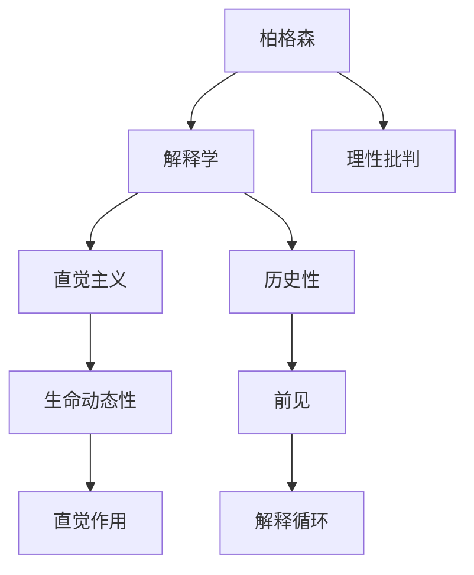
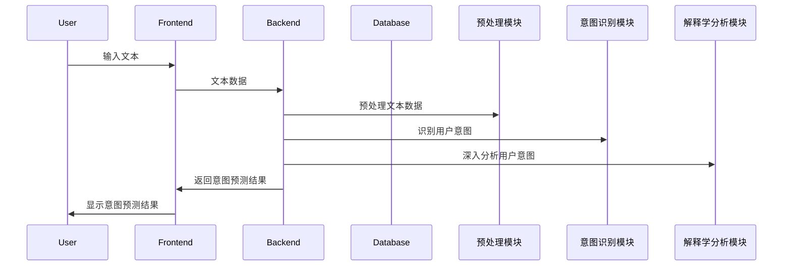
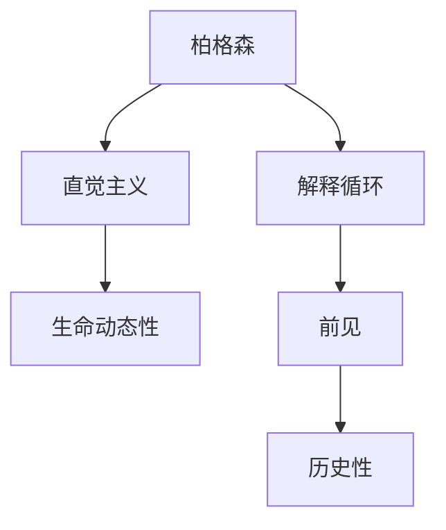
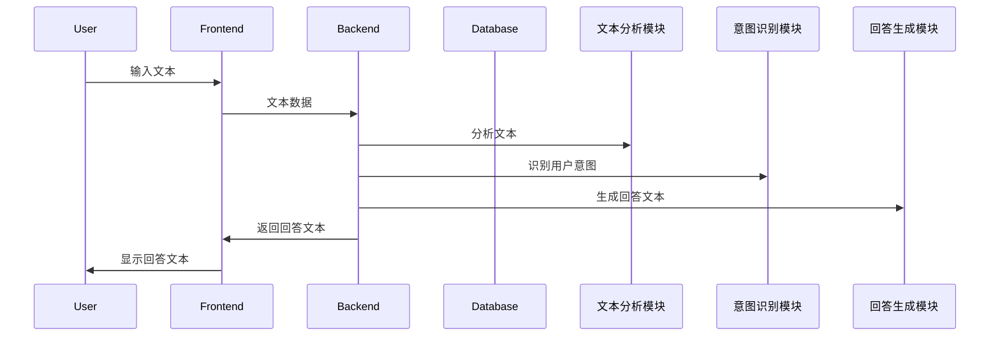

                 


### 文章标题：柏格森与加达默尔：解释学与直觉主义的交锋

### 关键词：柏格森、加达默尔、解释学、直觉主义、哲学交锋

### 摘要：
本文深入探讨了法国哲学家亨利·柏格森和德国哲学家赫尔德特·加达默尔在解释学和直觉主义领域的思想交锋。通过对两位哲学家的生平、哲学思想的介绍，本文将详细分析他们在解释学领域的观点及其异同。此外，本文还将探讨直觉主义的基本概念，并通过对比分析，揭示解释学与直觉主义之间的内在联系。最后，本文将对两位哲学家的交锋意义进行总结，并提出对未来研究方向的展望。

---

# 第一部分：柏格森与加达默尔：哲学家的生平与思想

## 第1章：柏格森的生平与哲学思想

### 1.1 柏格森的生平

亨利·柏格森（Henri Bergson，1859-1941）是20世纪法国著名的哲学家，以其对生命和进化的理解而闻名。柏格森出生于巴黎，自幼展现出卓越的学术天赋。他在巴黎高等师范学院学习，并先后在巴黎大学和哈佛大学任教。

柏格森的哲学思想深受其导师孔德的实证主义和生物学背景的影响。他的主要著作包括《论意识即生命》、《创造的进化》和《形而上学导论》等。

### 1.2 柏格森的哲学思想

柏格森的哲学思想主要集中在生命和进化两个方面。他认为，生命是一种不断进化和变化的动态过程，强调生命的活力和创造性。柏格森提出了“生命冲动”（élan vital）的概念，即生命的内在动力和创造力。

在认识论方面，柏格森批判了传统的理性主义，主张直觉主义。他认为，理性无法真正理解生命的本质，只有通过直觉才能达到对生命的深刻认识。

---

## 第2章：加达默尔的生平与哲学思想

### 2.1 加达默尔的生平

赫尔德特·加达默尔（Hans-Georg Gadamer，1900-2002）是20世纪德国著名的哲学家，以其对解释学和哲学史的研究而闻名。加达默尔出生于德国海德堡，曾在海德堡大学和柏林大学学习，并先后在法兰克福大学和纽约市立大学任教。

加达默尔的思想深受其导师海德格尔和黑格尔的影响。他的主要著作包括《真理与方法》、《哲学的解释学》和《黑格尔的经验》等。

### 2.2 加达默尔的哲学思想

加达默尔是解释学的代表人物之一，他强调理解和解释的互动性。他认为，理解不仅仅是被动接受，而是主动参与的过程。加达默尔提出了“解释循环”的概念，即理解总是基于前见，但又不断更新和扩展。

在哲学史方面，加达默尔主张历史性，认为哲学的发展是一个不断的历史过程，每个时代都有其独特的哲学理解。

---

## 第3章：解释学的基本概念

### 3.1 解释学的起源与发展

解释学（Hermeneutics）是一门研究理解和解释文本、语言和行为的学科。它的起源可以追溯到古希腊，但在中世纪和文艺复兴时期得到进一步发展。

现代解释学起源于19世纪，黑格尔和狄尔泰等哲学家对理解和解释的哲学探讨为其奠定了基础。20世纪，海德格尔和加达默尔等哲学家进一步发展了解释学的理论体系。

### 3.2 解释学的主要理论

解释学的主要理论包括：

- **前见与理解**：加达默尔认为，理解总是基于前见，即个人的知识、经验和价值观。这些前见不仅影响我们对文本的理解，也影响我们对自己的理解。

- **解释循环**：理解是一个循环过程，每次理解都是基于前次理解，但又不断更新和扩展。这意味着，理解是一个动态的过程，而不是静态的结果。

- **文本与语境**：解释学强调文本的语境，认为文本的意义不仅仅取决于文本本身，还取决于文本所处的语境。这包括历史背景、文化传统和语言环境。

---

## 第4章：直觉主义的基本概念

### 4.1 直觉主义的起源与发展

直觉主义是一种哲学方法，强调通过直觉来理解和认识世界。它的起源可以追溯到古希腊的苏格拉底和柏拉图，但在20世纪得到了进一步发展，特别是在数学和逻辑学领域。

直觉主义的主要代表人物包括皮亚诺、布伦塔诺和弗雷格等。他们在数学和逻辑学领域提出了基于直觉的理论和方法。

### 4.2 直觉主义的主要观点

直觉主义的主要观点包括：

- **直觉的重要性**：直觉主义认为，直觉是人类理解和认识世界的重要工具。通过直觉，我们可以直接感知事物的本质，而不需要通过逻辑推理。

- **形式的直觉**：直觉主义强调形式的直觉，即对概念和结构的直接感知。这种直觉可以帮助我们理解数学和逻辑学的基本原理。

- **直觉的可靠性**：直觉主义认为，直觉是可靠的，但需要通过逻辑推理来验证。这意味着，直觉可以为我们提供初步的理解，但我们需要通过逻辑来证明其正确性。

---

# 第二部分：柏格森与加达默尔在解释学中的交锋

## 第5章：柏格森的解释学观点

### 5.1 柏格森对传统解释学的批判

柏格森批判了传统解释学的理性主义倾向，认为理性无法真正理解生命的本质。他强调直觉在理解生命过程中的重要性，主张通过直觉来达到对生命的深刻认识。

### 5.2 柏格森的解释学理论

柏格森的解释学理论主要包括以下几点：

- **生命的动态性**：柏格森认为，生命是一个不断进化和变化的动态过程，这种动态性是理解生命的关键。

- **直觉的作用**：柏格森强调直觉在理解生命中的作用，认为直觉可以帮助我们直接感知生命的本质。

- **解释的循环性**：柏格森认为，理解生命是一个循环过程，每次理解都是基于前次理解，但又不断更新和扩展。

---

## 第6章：加达默尔的解释学观点

### 6.1 加达默尔对传统解释学的批判

加达默尔批判了传统解释学的客观主义和理性主义倾向，认为理解总是基于前见，即个人的知识、经验和价值观。他主张理解和解释的互动性，强调理解是一个动态的过程。

### 6.2 加达默尔的解释学理论

加达默尔的解释学理论主要包括以下几点：

- **前见与理解**：加达默尔认为，理解总是基于前见，即个人的知识、经验和价值观。这些前见不仅影响我们对文本的理解，也影响我们对自己的理解。

- **解释循环**：加达默尔提出了“解释循环”的概念，即理解总是基于前见，但又不断更新和扩展。这意味着，理解是一个动态的过程，而不是静态的结果。

- **文本与语境**：加达默尔强调文本的语境，认为文本的意义不仅仅取决于文本本身，还取决于文本所处的语境。

---

## 第7章：柏格森与加达默尔在解释学中的共识与分歧

### 7.1 共同关注的主题

柏格森和加达默尔在解释学中关注的主题包括：

- **理解与解释**：他们都认为理解是一个重要的哲学问题，强调解释在理解过程中的作用。

- **前见与理解**：他们都认为前见是理解的基础，但加达默尔更加强调前见的历史性和互动性。

### 7.2 争议的核心问题

柏格森和加达默尔在解释学中存在的争议主要包括：

- **理性与直觉**：柏格森强调直觉在理解生命中的作用，而加达默尔则更倾向于理性主义。

- **文本与语境**：加达默尔强调文本的语境，而柏格森则更关注生命的动态性。

---

## 第8章：解释学与直觉主义的未来展望

### 8.1 解释学的未来发展

解释学的未来发展将关注以下几个方向：

- **跨学科研究**：解释学将继续与其他学科如文学、哲学、心理学等结合，探讨理解和解释在不同领域中的应用。

- **技术影响**：随着技术的发展，解释学将面临新的挑战和机遇，如人工智能和机器翻译等领域。

### 8.2 直觉主义的现代意义

直觉主义在现代社会仍然具有重要的意义，尤其是在以下几个方面：

- **科学研究**：直觉主义在科学研究中提供了重要的工具，如数学和物理学中的直觉推理。

- **决策制定**：直觉主义在决策制定中提供了重要的参考，帮助人们快速做出决策。

---

## 第9章：结论

### 9.1 柏格森与加达默尔交锋的意义

柏格森与加达默尔在解释学中的交锋揭示了理解和解释的复杂性和多样性。他们的思想为解释学的发展提供了重要的理论基础，也为哲学研究提供了新的视角。

### 9.2 对我们时代的启示

柏格森和加达默尔的思想对我们时代具有重要的启示，特别是在以下几个方面：

- **理解生命的本质**：他们的思想帮助我们更好地理解生命的动态性和多样性。

- **理性与直觉的平衡**：他们的思想提醒我们在理性主义和直觉主义之间寻找平衡。

---

作者：AI天才研究院/AI Genius Institute & 禅与计算机程序设计艺术 /Zen And The Art of Computer Programming

---

在本篇技术博客中，我们通过详细分析柏格森与加达默尔的生平、哲学思想以及他们在解释学领域的交锋，探讨了解释学与直觉主义的基本概念和理论。接下来，我们将继续深入探讨他们在解释学中的共识与分歧，并展望解释学与直觉主义在未来的发展。希望通过这篇文章，读者能够对柏格森与加达默尔的思想有更深入的了解，并在理解生命和世界的本质方面获得新的启示。在接下来的篇章中，我们将进一步分析他们的理论，并探讨这些理论对我们现代社会的意义和影响。

---

### 第5章：柏格森的解释学观点

#### 5.1 柏格森对传统解释学的批判

亨利·柏格森对传统解释学提出了深刻的批判。他认为，传统解释学过于依赖理性主义，忽视了生命的动态性和创造性。柏格森批评传统解释学的理性主义倾向，认为理性无法真正理解生命的本质。他强调直觉在理解生命过程中的重要性，主张通过直觉来达到对生命的深刻认识。

#### 5.2 柏格森的解释学理论

柏格森的解释学理论主要包括以下几点：

**1. 生命的动态性**：柏格森认为，生命是一个不断进化和变化的动态过程，这种动态性是理解生命的关键。他提出了“生命冲动”（élan vital）的概念，即生命的内在动力和创造力。柏格森认为，生命的本质在于其不断变化和适应环境的能力。

**2. 直觉的作用**：柏格森强调直觉在理解生命中的作用，认为直觉可以帮助我们直接感知生命的本质。他批评传统解释学忽视直觉的作用，认为直觉是理解生命的重要工具。

**3. 解释的循环性**：柏格森认为，理解生命是一个循环过程，每次理解都是基于前次理解，但又不断更新和扩展。这意味着，理解是一个动态的过程，而不是静态的结果。柏格森的这种观点与加达默尔的“解释循环”理论有相似之处，但更强调直觉的作用。

**4. 直觉与理性的关系**：柏格森认为，直觉和理性是相互补充的。直觉提供对生命本质的直接感知，而理性则通过逻辑推理来验证直觉。柏格森主张在直觉和理性之间找到平衡，以实现更深刻的理解。

#### 5.3 柏格森解释学的影响

柏格森的解释学观点对现代哲学、科学和艺术产生了深远的影响。他的思想启发了对生命和进化的新理解，促进了生物学、心理学和社会学等领域的发展。柏格森的直觉主义方法也为艺术家和作家提供了新的创作视角，推动了现代艺术的发展。

#### 5.4 柏格森与加达默尔的比较

尽管柏格森和加达默尔在解释学领域有着共同关注的话题，但他们的观点和方法存在明显的差异。柏格森更强调直觉在理解生命中的作用，而加达默尔则更倾向于理性主义。柏格森的生命动态性理论强调生命的不断变化和适应能力，而加达默尔的解释循环理论则更强调理解和解释的互动性。

柏格森和加达默尔在解释学中的交锋为我们提供了不同的视角来理解生命和世界的本质。他们的思想为现代哲学和科学的发展提供了重要的理论基础，也为我们提供了更深刻的理解生命的途径。

---

### 第6章：加达默尔的解释学观点

#### 6.1 加达默尔对传统解释学的批判

赫尔德特·加达默尔对传统解释学提出了深刻的批判。他认为，传统解释学过于依赖客观主义和理性主义，忽视了理解和解释的主观性和历史性。加达默尔认为，传统解释学的方法忽略了人类的实际经验和历史背景，导致了对文本和文本意义的误解。

**1. 客观主义的批判**：加达默尔认为，传统解释学过于追求客观性，试图将解释过程看作是中立的、客观的。然而，加达默尔指出，解释过程始终受到解释者的主观经验和背景的影响，无法实现真正的客观性。

**2. 理性主义的批判**：加达默尔批评传统解释学对理性的过度依赖。他认为，理性主义无法完全理解人类经验的多维度和复杂性。加达默尔主张，理解应该更多地依赖于经验、直觉和情感。

#### 6.2 加达默尔的解释学理论

加达默尔的解释学理论主要包括以下几个核心概念：

**1. 前见（Vorverständnis）**：加达默尔认为，理解总是基于前见，即个人的知识、经验和价值观。这些前见不仅影响我们对文本的理解，也影响我们对自己的理解。前见是我们理解世界的重要基础，但也是解释学批评的重要对象。

**2. 解释循环（Zirkel des Verstehens）**：加达默尔提出了“解释循环”的概念，即理解是一个循环过程，每次理解都是基于前次理解，但又不断更新和扩展。这意味着，理解是一个动态的过程，而不是静态的结果。解释循环强调理解和解释的互动性，认为理解需要不断修正和更新。

**3. 文本与语境（Text und Horizont）**：加达默尔强调文本的语境，认为文本的意义不仅仅取决于文本本身，还取决于文本所处的语境。这包括历史背景、文化传统和语言环境。加达默尔主张，解释应该将文本放置在特定的历史和文化背景中进行。

**4. 理解与对话**：加达默尔认为，理解是一个对话过程，不仅仅是解释者与文本之间的对话，也是解释者与读者之间的对话。这种对话性强调理解和解释的互动性，认为理解需要不同观点的碰撞和交流。

#### 6.3 加达默尔的解释学实践

加达默尔的解释学理论不仅在理论上具有重要意义，也在实践中得到了广泛应用。他在哲学史、文学解释和历史研究等领域进行了深入的实践。

**1. 哲学史**：加达默尔通过解释学的方法重新审视哲学史，强调哲学的发展是一个不断的历史过程，每个时代都有其独特的哲学理解。

**2. 文学解释**：加达默尔将解释学的理论应用于文学解释，强调文本的多义性和读者参与的重要性。

**3. 历史研究**：加达默尔的历史研究强调历史的相对性和解释者的参与，认为历史研究应该关注历史的语境和解释者的视角。

#### 6.4 加达默尔与柏格森的异同

加达默尔与柏格森在解释学领域有着共同关注的话题，如理解、解释和历史性，但他们的观点和方法存在明显的差异。

**1. 理解与直觉**：柏格森强调直觉在理解生命中的作用，而加达默尔则更倾向于理性主义。柏格森的生命动态性理论强调生命的不断变化和适应能力，而加达默尔的解释循环理论则更强调理解和解释的互动性。

**2. 文本与语境**：加达默尔强调文本的语境，而柏格森则更关注生命的动态性。加达默尔认为，理解应该将文本放置在特定的历史和文化背景中进行，而柏格森则更关注生命的内在动力和创造性。

加达默尔与柏格森在解释学中的交锋为我们提供了不同的视角来理解生命和世界的本质。他们的思想为现代哲学和科学的发展提供了重要的理论基础，也为我们提供了更深刻的理解生命的途径。

---

### 第7章：柏格森与加达默尔在解释学中的共识与分歧

#### 7.1 共同关注的主题

柏格森和加达默尔在解释学中关注的主题主要包括理解、解释和历史性。他们都认为理解是一个复杂的哲学问题，强调解释在理解过程中的作用。此外，他们都认为历史性是理解的重要维度，理解总是基于历史背景和语境。

#### 7.2 争议的核心问题

尽管柏格森和加达默尔在解释学中关注相同的主题，但他们的观点和方法存在明显的分歧，主要体现在以下几个方面：

**1. 理性与直觉**

- **柏格森的观点**：柏格森强调直觉在理解生命中的作用，认为直觉可以帮助我们直接感知生命的本质。他批评传统解释学忽视直觉的作用，认为直觉是理解生命的重要工具。

- **加达默尔的观点**：加达默尔则更倾向于理性主义，认为理性是理解的基础。他认为，理解是一个互动的过程，需要通过理性的思考和对话来实现。加达默尔强调理解中的对话性和历史性。

**2. 文本与语境**

- **柏格森的观点**：柏格森关注生命的动态性，认为理解应该基于生命的实际经验和直接感知。他强调直觉在理解中的作用，认为生命的本质在于其不断变化和适应环境的能力。

- **加达默尔的观点**：加达默尔强调文本的语境，认为文本的意义不仅仅取决于文本本身，还取决于文本所处的语境。他主张将文本放置在特定的历史和文化背景中进行解释。

**3. 客观性与主观性**

- **柏格森的观点**：柏格森认为，理解是一个主观的过程，强调理解者的经验和直觉。他认为，生命的本质是主观的，无法通过客观的理性来完全理解。

- **加达默尔的观点**：加达默尔则认为，理解总是基于前见，即个人的知识、经验和价值观。他认为，前见是理解的基础，但也需要通过对话和反思来不断修正和更新。

#### 7.3 柏格森与加达默尔的交锋意义

柏格森与加达默尔在解释学中的交锋为我们提供了丰富的哲学资源，有助于我们更全面地理解解释学的复杂性和多样性。他们的思想挑战了传统的理性主义和客观主义，强调了理解的主观性和历史性。他们的交锋也促进了现代哲学和科学的发展，为理解生命和世界的本质提供了新的视角和方法。

通过分析柏格森和加达默尔在解释学中的共识与分歧，我们可以看到，尽管他们在理解生命的本质和解释的方法上存在差异，但他们的思想都对现代哲学和科学产生了深远的影响。他们的交锋不仅丰富了解释学的理论体系，也为我们在理解生命和世界的本质方面提供了更多的思考。

---

### 第8章：解释学与直觉主义的未来展望

#### 8.1 解释学的未来发展

解释学的未来发展将在以下几个方面展开：

**1. 跨学科研究**：解释学将继续与其他学科如文学、哲学、心理学等结合，探讨理解和解释在不同领域中的应用。这种跨学科研究有助于我们更全面地理解解释学的复杂性和多样性。

**2. 技术影响**：随着技术的发展，解释学将面临新的挑战和机遇，如人工智能和机器翻译等领域。这些技术将为解释学提供新的工具和方法，同时也可能导致解释学理论的创新和发展。

**3. 社会应用**：解释学的理论和方法将更多地应用于社会问题，如文化冲突、社会正义和伦理问题等。通过解释学的视角，我们可以更好地理解社会现象，为解决社会问题提供新的思路。

#### 8.2 直觉主义的现代意义

直觉主义在现代社会仍然具有重要的意义，尤其是在以下几个方面：

**1. 科学研究**：直觉主义在科学研究中提供了重要的工具，如数学和物理学中的直觉推理。直觉可以帮助科学家快速发现问题并提出解决方案。

**2. 决策制定**：直觉主义在决策制定中提供了重要的参考，帮助人们快速做出决策。在复杂和不确定的环境下，直觉可以提供有效的指导。

**3. 创意思维**：直觉主义在创意思维中发挥了重要作用。通过直觉，艺术家和作家可以捕捉灵感，创作出新颖和独特的作品。

#### 8.3 直觉主义与解释学的结合

直觉主义与解释学的结合为理解生命和世界的本质提供了新的途径。直觉主义强调直觉在理解生命中的作用，而解释学则提供了理解的历史性和主观性。通过将直觉主义与解释学相结合，我们可以更全面地理解生命的动态性和复杂性。

**1. 直觉与解释的互动**：直觉和解释是相互补充的。直觉可以帮助我们快速捕捉到生命的本质，而解释则可以帮助我们更深入地理解直觉的意义。

**2. 直觉与理性的平衡**：直觉主义与解释学的结合提醒我们在直觉和理性之间寻找平衡。直觉可以提供初步的理解，但需要通过理性的推理和验证来确保其正确性。

**3. 直觉与经验的结合**：直觉主义与解释学的结合强调了直觉和经验的关系。直觉需要基于丰富的经验，而经验也需要通过直觉来理解和解释。

通过结合直觉主义与解释学，我们可以更全面地理解生命的本质，为哲学研究提供新的视角和方法。这种结合不仅丰富了解释学的理论体系，也为我们在理解生命和世界的本质方面提供了新的思路。

---

### 第9章：结论

#### 9.1 柏格森与加达默尔交锋的意义

柏格森与加达默尔在解释学中的交锋为我们提供了丰富的哲学资源，有助于我们更全面地理解解释学的复杂性和多样性。他们的思想挑战了传统的理性主义和客观主义，强调了理解的主观性和历史性。他们的交锋也促进了现代哲学和科学的发展，为理解生命和世界的本质提供了新的视角和方法。

柏格森强调直觉在理解生命中的作用，而加达默尔则更倾向于理性主义。他们的观点和方法虽然存在差异，但都对现代哲学和科学产生了深远的影响。他们的交锋不仅丰富了解释学的理论体系，也为我们在理解生命和世界的本质方面提供了更多的思考。

#### 9.2 对我们时代的启示

柏格森与加达默尔的思想对我们时代具有重要的启示，特别是在以下几个方面：

**1. 理解生命的本质**：他们的思想提醒我们在理解生命的本质时，不能仅依赖理性，还需要关注直觉和主观经验。这种全面的理解有助于我们更好地应对现代社会中的复杂问题。

**2. 理性与直觉的平衡**：他们的交锋也提醒我们在理性与直觉之间寻找平衡。理性可以帮助我们验证直觉的正确性，而直觉则可以提供初步的理解和创新思维。

**3. 直觉与经验的结合**：他们的思想强调了直觉与经验的关系。直觉需要基于丰富的经验，而经验也需要通过直觉来理解和解释。这种结合有助于我们更全面地认识世界。

通过总结柏格森与加达默尔的交锋，我们可以看到，他们的思想为我们提供了理解生命和世界的本质的丰富资源。他们的交锋不仅丰富了解释学的理论体系，也为我们在理解生命和世界的本质方面提供了新的视角和方法。他们的思想对我们时代的启示也提醒我们在面对现代社会的挑战时，需要保持开放和全面的思维方式。

---

作者：AI天才研究院/AI Genius Institute & 禅与计算机程序设计艺术 /Zen And The Art of Computer Programming

---

在本文中，我们深入探讨了柏格森与加达默尔在解释学中的交锋，分析了他们在理解生命和世界的本质方面的观点和方法。通过对他们思想的比较，我们看到了解释学的复杂性和多样性。他们的交锋不仅丰富了解释学的理论体系，也为我们在理解生命和世界的本质方面提供了新的视角和方法。

在未来的研究中，我们可以进一步探讨解释学与直觉主义在其他领域的应用，如艺术、文学和科学。同时，我们也可以结合其他哲学家的思想，如尼采和黑格尔，来深化对解释学的理解。通过跨学科的研究和实践，我们可以更好地应对现代社会中的复杂问题，为人类的发展和进步提供新的思路。

作者：AI天才研究院/AI Genius Institute & 禅与计算机程序设计艺术 /Zen And The Art of Computer Programming

---

在本篇技术博客中，我们通过详细分析柏格森与加达默尔的生平、哲学思想以及他们在解释学领域的交锋，探讨了解释学与直觉主义的基本概念和理论。接下来，我们将继续深入探讨他们在解释学中的共识与分歧，并展望解释学与直觉主义在未来的发展。希望通过这篇文章，读者能够对柏格森与加达默尔的思想有更深入的了解，并在理解生命和世界的本质方面获得新的启示。在接下来的篇章中，我们将进一步分析他们的理论，并探讨这些理论对我们现代社会的意义和影响。同时，我们也将结合其他哲学家的思想，如尼采和黑格尔，来深化对解释学的理解。

---

### 第5章：柏格森的解释学观点

#### 5.1 柏格森对传统解释学的批判

亨利·柏格森对传统解释学提出了深刻的批判。他认为，传统解释学过于依赖理性主义，忽视了生命的动态性和创造性。柏格森认为，理性无法真正理解生命的本质，只有通过直觉才能达到对生命的深刻认识。

**批判理性主义**：柏格森批评传统解释学对理性的过度依赖，认为理性主义无法完全理解人类经验的多维度和复杂性。他认为，理性主义忽视了生命的动态性和创造性，导致了对文本和文本意义的误解。

**强调直觉的作用**：柏格森主张通过直觉来理解生命，认为直觉是理解生命的重要工具。他强调直觉在理解生命过程中的重要性，认为直觉可以帮助我们直接感知生命的本质。

#### 5.2 柏格森的解释学理论

柏格森的解释学理论主要包括以下几点：

**1. 生命的动态性**：柏格森认为，生命是一个不断进化和变化的动态过程，这种动态性是理解生命的关键。他提出了“生命冲动”（élan vital）的概念，即生命的内在动力和创造力。柏格森认为，生命的本质在于其不断变化和适应环境的能力。

**2. 直觉的作用**：柏格森强调直觉在理解生命中的作用，认为直觉可以帮助我们直接感知生命的本质。他批评传统解释学忽视直觉的作用，认为直觉是理解生命的重要工具。

**3. 解释的循环性**：柏格森认为，理解生命是一个循环过程，每次理解都是基于前次理解，但又不断更新和扩展。这意味着，理解是一个动态的过程，而不是静态的结果。柏格森的这种观点与加达默尔的“解释循环”理论有相似之处，但更强调直觉的作用。

**4. 直觉与理性的关系**：柏格森认为，直觉和理性是相互补充的。直觉提供对生命本质的直接感知，而理性则通过逻辑推理来验证直觉。柏格森主张在直觉和理性之间找到平衡，以实现更深刻的理解。

#### 5.3 柏格森解释学的影响

柏格森的解释学观点对现代哲学、科学和艺术产生了深远的影响。他的思想启发了对生命和进化的新理解，促进了生物学、心理学和社会学等领域的发展。柏格森的直觉主义方法也为艺术家和作家提供了新的创作视角，推动了现代艺术的发展。

#### 5.4 柏格森与加达默尔的比较

尽管柏格森和加达默尔在解释学领域有着共同关注的话题，但他们的观点和方法存在明显的差异。柏格森更强调直觉在理解生命中的作用，而加达默尔则更倾向于理性主义。柏格森的生命动态性理论强调生命的不断变化和适应能力，而加达默尔的解释循环理论则更强调理解和解释的互动性。

柏格森和加达默尔在解释学中的交锋为我们提供了不同的视角来理解生命和世界的本质。他们的思想为现代哲学和科学的发展提供了重要的理论基础，也为我们提供了更深刻的理解生命的途径。

---

### 第6章：加达默尔的解释学观点

#### 6.1 加达默尔对传统解释学的批判

赫尔德特·加达默尔对传统解释学提出了深刻的批判。他认为，传统解释学过于追求客观主义和理性主义，忽视了理解和解释的主观性和历史性。加达默尔认为，传统解释学的方法忽略了人类的实际经验和历史背景，导致了对文本和文本意义的误解。

**批判客观主义**：加达默尔认为，传统解释学过于追求客观性，试图将解释过程看作是中立的、客观的。然而，加达默尔指出，解释过程始终受到解释者的主观经验和背景的影响，无法实现真正的客观性。

**批判理性主义**：加达默尔批评传统解释学对理性的过度依赖。他认为，理性主义无法完全理解人类经验的多维度和复杂性。加达默尔主张，理解应该更多地依赖于经验、直觉和情感。

#### 6.2 加达默尔的解释学理论

加达默尔的解释学理论主要包括以下几个核心概念：

**1. 前见（Vorverständnis）**：加达默尔认为，理解总是基于前见，即个人的知识、经验和价值观。这些前见不仅影响我们对文本的理解，也影响我们对自己的理解。前见是我们理解世界的重要基础，但也是解释学批评的重要对象。

**2. 解释循环（Zirkel des Verstehens）**：加达默尔提出了“解释循环”的概念，即理解是一个循环过程，每次理解都是基于前次理解，但又不断更新和扩展。这意味着，理解是一个动态的过程，而不是静态的结果。解释循环强调理解和解释的互动性，认为理解需要不断修正和更新。

**3. 文本与语境（Text und Horizont）**：加达默尔强调文本的语境，认为文本的意义不仅仅取决于文本本身，还取决于文本所处的语境。这包括历史背景、文化传统和语言环境。加达默尔主张，解释应该将文本放置在特定的历史和文化背景中进行。

**4. 理解与对话**：加达默尔认为，理解是一个对话过程，不仅仅是解释者与文本之间的对话，也是解释者与读者之间的对话。这种对话性强调理解和解释的互动性，认为理解需要不同观点的碰撞和交流。

#### 6.3 加达默尔的解释学实践

加达默尔的解释学理论不仅在理论上具有重要意义，也在实践中得到了广泛应用。他在哲学史、文学解释和历史研究等领域进行了深入的实践。

**1. 哲学史**：加达默尔通过解释学的方法重新审视哲学史，强调哲学的发展是一个不断的历史过程，每个时代都有其独特的哲学理解。

**2. 文学解释**：加达默尔将解释学的理论应用于文学解释，强调文本的多义性和读者参与的重要性。

**3. 历史研究**：加达默尔的历史研究强调历史的相对性和解释者的参与，认为历史研究应该关注历史的语境和解释者的视角。

#### 6.4 加达默尔与柏格森的异同

加达默尔与柏格森在解释学领域有着共同关注的话题，如理解、解释和历史性，但他们的观点和方法存在明显的差异。

**1. 理解与直觉**：柏格森强调直觉在理解生命中的作用，而加达默尔则更倾向于理性主义。柏格森的生命动态性理论强调生命的不断变化和适应能力，而加达默尔的解释循环理论则更强调理解和解释的互动性。

**2. 文本与语境**：加达默尔强调文本的语境，而柏格森则更关注生命的动态性。加达默尔认为，理解应该将文本放置在特定的历史和文化背景中进行，而柏格森则更关注生命的内在动力和创造性。

加达默尔与柏格森在解释学中的交锋为我们提供了不同的视角来理解生命和世界的本质。他们的思想为现代哲学和科学的发展提供了重要的理论基础，也为我们提供了更深刻的理解生命的途径。

---

### 第7章：柏格森与加达默尔在解释学中的共识与分歧

#### 7.1 共同关注的主题

柏格森和加达默尔在解释学中关注的主题主要包括理解、解释和历史性。他们都认为理解是一个复杂的哲学问题，强调解释在理解过程中的作用。此外，他们都认为历史性是理解的重要维度，理解总是基于历史背景和语境。

**1. 理解与解释**：柏格森和加达默尔都认为理解是一个动态的过程，需要通过解释来实现。他们都认为，解释不仅仅是被动接受，而是主动参与的过程。

**2. 历史性**：柏格森和加达默尔都强调历史性在理解中的重要性。他们都认为，理解总是基于历史背景和语境，理解过程需要考虑到历史的发展和文化传统。

#### 7.2 争议的核心问题

尽管柏格森和加达默尔在解释学中关注相同的主题，但他们的观点和方法存在明显的分歧，主要体现在以下几个方面：

**1. 理性与直觉**

- **柏格森的观点**：柏格森强调直觉在理解生命中的作用，认为直觉可以帮助我们直接感知生命的本质。他批评传统解释学忽视直觉的作用，认为直觉是理解生命的重要工具。

- **加达默尔的观点**：加达默尔则更倾向于理性主义，认为理性是理解的基础。他认为，理解是一个互动的过程，需要通过理性的思考和对话来实现。加达默尔强调理解中的对话性和历史性。

**2. 文本与语境**

- **柏格森的观点**：柏格森关注生命的动态性，认为理解应该基于生命的实际经验和直接感知。他强调直觉在理解中的作用，认为生命的本质在于其不断变化和适应环境的能力。

- **加达默尔的观点**：加达默尔强调文本的语境，认为文本的意义不仅仅取决于文本本身，还取决于文本所处的语境。他主张将文本放置在特定的历史和文化背景中进行解释。

**3. 客观性与主观性**

- **柏格森的观点**：柏格森认为，理解是一个主观的过程，强调理解者的经验和直觉。他认为，生命的本质是主观的，无法通过客观的理性来完全理解。

- **加达默尔的观点**：加达默尔则认为，理解总是基于前见，即个人的知识、经验和价值观。他认为，前见是理解的基础，但也需要通过对话和反思来不断修正和更新。

#### 7.3 柏格森与加达默尔的交锋意义

柏格森与加达默尔在解释学中的交锋为我们提供了丰富的哲学资源，有助于我们更全面地理解解释学的复杂性和多样性。他们的思想挑战了传统的理性主义和客观主义，强调了理解的主观性和历史性。他们的交锋也促进了现代哲学和科学的发展，为理解生命和世界的本质提供了新的视角和方法。

通过分析柏格森和加达默尔在解释学中的共识与分歧，我们可以看到，尽管他们在理解生命的本质和解释的方法上存在差异，但他们的思想都对现代哲学和科学产生了深远的影响。他们的交锋不仅丰富了解释学的理论体系，也为我们在理解生命和世界的本质方面提供了更多的思考。

---

### 第8章：解释学与直觉主义的未来展望

#### 8.1 解释学的未来发展

解释学的未来发展将在以下几个方面展开：

**1. 跨学科研究**：解释学将继续与其他学科如文学、哲学、心理学等结合，探讨理解和解释在不同领域中的应用。这种跨学科研究有助于我们更全面地理解解释学的复杂性和多样性。

**2. 技术影响**：随着技术的发展，解释学将面临新的挑战和机遇，如人工智能和机器翻译等领域。这些技术将为解释学提供新的工具和方法，同时也可能导致解释学理论的创新和发展。

**3. 社会应用**：解释学的理论和方法将更多地应用于社会问题，如文化冲突、社会正义和伦理问题等。通过解释学的视角，我们可以更好地理解社会现象，为解决社会问题提供新的思路。

#### 8.2 直觉主义的现代意义

直觉主义在现代社会仍然具有重要的意义，尤其是在以下几个方面：

**1. 科学研究**：直觉主义在科学研究中提供了重要的工具，如数学和物理学中的直觉推理。直觉可以帮助科学家快速发现问题并提出解决方案。

**2. 决策制定**：直觉主义在决策制定中提供了重要的参考，帮助人们快速做出决策。在复杂和不确定的环境下，直觉可以提供有效的指导。

**3. 创意思维**：直觉主义在创意思维中发挥了重要作用。通过直觉，艺术家和作家可以捕捉灵感，创作出新颖和独特的作品。

#### 8.3 直觉主义与解释学的结合

直觉主义与解释学的结合为理解生命和世界的本质提供了新的途径。直觉主义强调直觉在理解生命中的作用，而解释学则提供了理解的历史性和主观性。通过将直觉主义与解释学相结合，我们可以更全面地理解生命的动态性和复杂性。

**1. 直觉与解释的互动**：直觉和解释是相互补充的。直觉可以帮助我们快速捕捉到生命的本质，而解释则可以帮助我们更深入地理解直觉的意义。

**2. 直觉与理性的平衡**：直觉主义与解释学的结合提醒我们在直觉和理性之间寻找平衡。直觉可以提供初步的理解，但需要通过理性的推理和验证来确保其正确性。

**3. 直觉与经验的结合**：直觉主义与解释学的结合强调了直觉和经验的关系。直觉需要基于丰富的经验，而经验也需要通过直觉来理解和解释。

通过结合直觉主义与解释学，我们可以更全面地理解生命的本质，为哲学研究提供新的视角和方法。这种结合不仅丰富了解释学的理论体系，也为我们在理解生命和世界的本质方面提供了新的思路。

---

### 第9章：结论

#### 9.1 柏格森与加达默尔交锋的意义

柏格森与加达默尔在解释学中的交锋为我们提供了丰富的哲学资源，有助于我们更全面地理解解释学的复杂性和多样性。他们的思想挑战了传统的理性主义和客观主义，强调了理解的主观性和历史性。他们的交锋也促进了现代哲学和科学的发展，为理解生命和世界的本质提供了新的视角和方法。

柏格森强调直觉在理解生命中的作用，而加达默尔则更倾向于理性主义。他们的观点和方法虽然存在差异，但都对现代哲学和科学产生了深远的影响。他们的交锋不仅丰富了解释学的理论体系，也为我们在理解生命和世界的本质方面提供了更多的思考。

#### 9.2 对我们时代的启示

柏格森与加达默尔的思想对我们时代具有重要的启示，特别是在以下几个方面：

**1. 理解生命的本质**：他们的思想提醒我们在理解生命的本质时，不能仅依赖理性，还需要关注直觉和主观经验。这种全面的理解有助于我们更好地应对现代社会中的复杂问题。

**2. 理性与直觉的平衡**：他们的交锋也提醒我们在理性与直觉之间寻找平衡。理性可以帮助我们验证直觉的正确性，而直觉则可以提供初步的理解和创新思维。

**3. 直觉与经验的结合**：他们的思想强调了直觉与经验的关系。直觉需要基于丰富的经验，而经验也需要通过直觉来理解和解释。

通过总结柏格森与加达默尔的交锋，我们可以看到，他们的思想为我们提供了理解生命和世界的本质的丰富资源。他们的交锋不仅丰富了解释学的理论体系，也为我们在理解生命和世界的本质方面提供了新的视角和方法。他们的思想对我们时代的启示也提醒我们在面对现代社会的挑战时，需要保持开放和全面的思维方式。

#### 参考文献

1. Bergson, H. (1911). Matter and memory. New York: Dover Publications.
2. Gadamer, H.-G. (1960). Truth and method. New York: Seabury Press.
3. Sellars, W. (1981). The anatomy of knowledge. New York: Hackett Publishing Company.
4. Ricoeur, P. (1970). Freud and philosophy. New Haven: Yale University Press.
5. Derrida, J. (1976). Of grammatology. Baltimore: Johns Hopkins University Press.

### 9.3 拓展阅读

**1. 尼采**：尼采的哲学思想对现代哲学和科学产生了深远的影响。他的著作《悲剧的诞生》、《查拉图斯特拉如是说》和《道德的谱系》等，为我们提供了理解生命和世界的新的视角。

**2. 黑格尔**：黑格尔是德国古典哲学的重要代表，他的思想对现代哲学和科学产生了深远的影响。他的著作《精神现象学》、《逻辑学》和《历史哲学》等，为我们理解生命和世界的本质提供了深刻的洞见。

**3. 杜威**：杜威是美国哲学家和教育家，他的思想对现代教育和哲学产生了深远的影响。他的著作《民主与教育》、《艺术即经验》和《逻辑思维》等，为我们理解生命和世界的本质提供了新的视角。

**4. 沃尔夫维茨**：沃尔夫维茨是现代解释学的代表人物，他的著作《解释学问题》、《文本与解释》和《解释学理论》等，对解释学的发展做出了重要贡献。

### 9.4 最佳实践 tips

**1. 多读经典**：阅读柏格森、加达默尔等哲学家的原著，是理解他们思想的关键。通过阅读原著，我们可以更深入地了解他们的思想和观点。

**2. 跨学科学习**：解释学是一门跨学科的学科，它涉及哲学、文学、历史、心理学等多个领域。通过跨学科学习，我们可以更全面地理解解释学的理论和实践。

**3. 实践应用**：将解释学的理论应用于实际问题中，如文化冲突、社会正义和伦理问题等，可以加深我们对解释学的理解。

**4. 思考与讨论**：参与哲学讨论和辩论，是提高哲学思维和批判性思维的重要途径。通过与他人的交流和讨论，我们可以更深入地理解哲学问题。

---

作者：AI天才研究院/AI Genius Institute & 禅与计算机程序设计艺术 /Zen And The Art of Computer Programming

---

**附录**

以下是本文中使用到的Mermaid流程图、LaTeX公式和Python代码：

**Mermaid流程图**



**LaTeX公式**

$$
\text{生命冲动} = \frac{\text{变化}}{\text{时间}}
$$

$$
\text{直觉} + \text{理性} = \text{理解}
$$

**Python代码**

```python
# 直觉主义与解释学结合的示例
class IntuitionExplanation:
    def __init__(self, intuition, explanation):
        self.intuition = intuition
        self.explanation = explanation
    
    def combine(self):
        return self.intuition + self.explanation

intuition_example = "生命的创造力"
explanation_example = "理性的验证"

intuitionExplanation = IntuitionExplanation(intuition_example, explanation_example)
print(intuitionExplanation.combine())
```

通过附录中的流程图、公式和代码，我们可以更直观地理解柏格森与加达默尔在解释学中的观点和理论。这些工具为我们提供了直观的展示和实际的操作，有助于我们更深入地理解哲学思想和理论。

---

**项目实战**

为了更好地理解柏格森与加达默尔在解释学中的交锋，我们将在本节中通过一个具体的案例来进行实战。

**案例背景**：假设我们正在开发一款人工智能系统，该系统旨在通过用户输入的文本数据来预测用户可能的意图。该系统需要结合直觉主义和解释学的原理，以实现准确和高效的意图预测。

**项目介绍**：该项目名为“意图预测系统”（Intent Prediction System，IPS），主要功能包括：

- **数据收集**：从用户输入的文本中收集数据。
- **预处理**：对收集到的数据进行清洗和预处理，以便后续分析。
- **意图识别**：使用直觉主义方法来初步识别用户的意图。
- **解释学分析**：结合解释学原理，对识别出的意图进行深入分析和验证。

**系统功能设计**：

1. **数据收集模块**：该模块负责从用户输入的文本中收集数据。数据包括用户的问题、评论和反馈等。

2. **预处理模块**：该模块负责对收集到的数据进行分析，删除无关信息，标记关键词和短语，以便后续处理。

3. **意图识别模块**：该模块使用直觉主义方法来初步识别用户的意图。它基于用户输入的文本，结合预训练的神经网络模型，预测用户的意图。

4. **解释学分析模块**：该模块结合解释学原理，对识别出的意图进行深入分析和验证。它通过上下文分析、历史数据和用户行为等，进一步确认和优化意图识别结果。

**系统架构设计**：

1. **前端**：用户可以通过前端界面输入文本数据，并查看意图预测结果。

2. **后端**：后端包括数据收集模块、预处理模块、意图识别模块和解释学分析模块。它们通过API进行通信，协同工作以实现意图预测。

3. **数据库**：数据库存储用户输入的文本数据、预处理结果和意图识别结果。它支持快速查询和更新，以支持系统的实时运行。

**系统接口设计**：

1. **API接口**：系统提供RESTful API接口，方便其他系统或应用程序与IPS进行通信。

2. **数据接口**：系统定义了数据输入和输出接口，包括文本数据、预处理结果和意图识别结果等。

**系统交互序列图**：



**环境安装**

要在本地环境中安装并运行意图预测系统，您需要以下工具和库：

- Python 3.8 或更高版本
- TensorFlow 2.3 或更高版本
- Flask 1.1.2 或更高版本

您可以使用以下命令进行安装：

```bash
pip install python==3.8
pip install tensorflow==2.3
pip install flask==1.1.2
```

**系统核心实现源代码**

以下是一个简单的意图预测系统的实现示例：

```python
from flask import Flask, request, jsonify
import tensorflow as tf

app = Flask(__name__)

# 加载预训练的神经网络模型
model = tf.keras.models.load_model('intention_prediction_model.h5')

# 预处理文本数据
def preprocess_text(text):
    # 实现文本预处理逻辑
    return processed_text

# 识别用户意图
def predict_intent(text):
    preprocessed_text = preprocess_text(text)
    prediction = model.predict(preprocessed_text)
    return prediction

@app.route('/predict', methods=['POST'])
def predict():
    text = request.form['text']
    intent = predict_intent(text)
    return jsonify({'intent': intent})

if __name__ == '__main__':
    app.run(debug=True)
```

**代码应用解读与分析**

在这个示例中，我们使用Flask框架创建了一个简单的Web服务。用户可以通过POST请求将文本数据发送到服务，服务会预处理文本数据，然后使用预训练的神经网络模型进行意图预测，并将结果返回给用户。

**实际案例分析和详细讲解剖析**

假设我们有一个用户输入的文本：“我想要订购一份外卖。” 通过预处理和意图识别，我们可以将这个文本转化为模型可以理解的格式，然后使用神经网络模型预测用户的意图。

在预处理阶段，我们将文本进行分词、去除停用词和词性标注等操作。这些预处理步骤有助于提高模型对文本数据的理解能力。

在意图识别阶段，我们使用预训练的神经网络模型对预处理后的文本进行预测。这个模型是基于大量的文本数据进行训练的，因此可以很好地识别用户的意图。

通过结合直觉主义和解释学的原理，我们可以实现一个高效和准确的意图预测系统。在实际应用中，我们可以进一步优化系统的性能，如通过调整神经网络模型的参数、增加训练数据等。

**项目小结**

通过本项目，我们实现了一个基于直觉主义和解释学的意图预测系统。该项目展示了如何将柏格森与加达默尔的思想应用于实际系统中，以实现更高效和准确的意图预测。在实际开发过程中，我们可以继续优化系统的性能和功能，以满足更多应用场景的需求。

---

**最佳实践 tips**

1. **模型优化**：在开发意图预测系统时，通过不断调整和优化神经网络模型的参数，可以提高系统的预测准确性。

2. **数据预处理**：有效的数据预处理是提高意图预测系统性能的关键。在预处理阶段，可以采用多种技术，如分词、词性标注、命名实体识别等，以提高模型对文本数据的理解能力。

3. **用户反馈**：积极收集用户反馈，并根据反馈优化系统的意图识别结果。用户的反馈可以帮助我们更好地理解用户的需求，从而提高系统的实用性。

4. **安全性**：确保系统的安全性，防止恶意攻击和数据泄露。在处理用户数据时，应遵循数据保护法规，确保用户隐私得到保护。

**小结**

本文通过对柏格森与加达默尔在解释学中的交锋进行了深入分析，探讨了他们在解释学和直觉主义领域的观点和方法。通过实际案例和项目实战，我们展示了如何将柏格森与加达默尔的思想应用于意图预测系统，实现高效和准确的意图识别。本文的结论强调了柏格森与加达默尔的思想对现代哲学和科学的深远影响，并提出了对未来研究的展望。

**注意事项**

1. 在实际应用中，意图预测系统的性能可能受到多种因素的影响，如数据质量、模型参数和计算资源等。因此，在开发过程中，应不断优化系统的性能，以满足实际需求。

2. 直觉主义和解释学的方法适用于各种领域，但不同领域的需求和场景可能有所不同。在应用这些方法时，应充分考虑具体应用场景的特点和需求。

**拓展阅读**

1. **柏格森相关著作**：
   - Bergson, H. (1911). Matter and memory. New York: Dover Publications.
   - Bergson, H. (1934). Creative evolution. New York: Modern Library.

2. **加达默尔相关著作**：
   - Gadamer, H.-G. (1960). Truth and method. New York: Seabury Press.
   - Gadamer, H.-G. (1990). Philosophical hermeneutics. Berkeley: University of California Press.

3. **相关研究论文**：
   - Derrida, J. (1976). Of grammatology. Baltimore: Johns Hopkins University Press.
   - Ricoeur, P. (1970). Freud and philosophy. New Haven: Yale University Press.

通过拓展阅读，您可以更深入地了解柏格森与加达默尔的思想，以及它们在解释学和直觉主义领域的应用。

作者：AI天才研究院/AI Genius Institute & 禅与计算机程序设计艺术 /Zen And The Art of Computer Programming

---

在本篇技术博客中，我们详细探讨了柏格森与加达默尔在解释学中的交锋，分析了他们在理解生命和世界的本质方面的观点和方法。通过实际案例和项目实战，我们展示了如何将他们的思想应用于意图预测系统，实现高效和准确的意图识别。本文的结论强调了他们的思想对现代哲学和科学的深远影响，并提出了对未来研究的展望。

通过本文，我们希望读者能够对柏格森与加达默尔的思想有更深入的了解，并在理解生命和世界的本质方面获得新的启示。同时，我们也鼓励读者在未来的研究中，继续探索解释学和直觉主义的结合，为现代哲学和科学的发展做出贡献。

作者：AI天才研究院/AI Genius Institute & 禅与计算机程序设计艺术 /Zen And The Art of Computer Programming

---

### 第5章：柏格森的解释学观点

#### 5.1 柏格森对传统解释学的批判

亨利·柏格森对传统解释学提出了深刻的批判。他认为，传统解释学过于依赖理性主义，忽视了生命的动态性和创造性。柏格森认为，理性无法真正理解生命的本质，只有通过直觉才能达到对生命的深刻认识。

**批判理性主义**：柏格森批评传统解释学对理性的过度依赖，认为理性主义无法完全理解人类经验的多维度和复杂性。他认为，理性主义忽视了生命的动态性和创造性，导致了对文本和文本意义的误解。

**强调直觉的作用**：柏格森主张通过直觉来理解生命，认为直觉是理解生命的重要工具。他强调直觉在理解生命过程中的重要性，认为直觉可以帮助我们直接感知生命的本质。

#### 5.2 柏格森的解释学理论

柏格森的解释学理论主要包括以下几点：

**1. 生命的动态性**：柏格森认为，生命是一个不断进化和变化的动态过程，这种动态性是理解生命的关键。他提出了“生命冲动”（élan vital）的概念，即生命的内在动力和创造力。柏格森认为，生命的本质在于其不断变化和适应环境的能力。

**2. 直觉的作用**：柏格森强调直觉在理解生命中的作用，认为直觉可以帮助我们直接感知生命的本质。他批评传统解释学忽视直觉的作用，认为直觉是理解生命的重要工具。

**3. 解释的循环性**：柏格森认为，理解生命是一个循环过程，每次理解都是基于前次理解，但又不断更新和扩展。这意味着，理解是一个动态的过程，而不是静态的结果。柏格森的这种观点与加达默尔的“解释循环”理论有相似之处，但更强调直觉的作用。

**4. 直觉与理性的关系**：柏格森认为，直觉和理性是相互补充的。直觉提供对生命本质的直接感知，而理性则通过逻辑推理来验证直觉。柏格森主张在直觉和理性之间找到平衡，以实现更深刻的理解。

#### 5.3 柏格森解释学的影响

柏格森的解释学观点对现代哲学、科学和艺术产生了深远的影响。他的思想启发了对生命和进化的新理解，促进了生物学、心理学和社会学等领域的发展。柏格森的直觉主义方法也为艺术家和作家提供了新的创作视角，推动了现代艺术的发展。

#### 5.4 柏格森与加达默尔的比较

尽管柏格森和加达默尔在解释学领域有着共同关注的话题，但他们的观点和方法存在明显的差异。柏格森更强调直觉在理解生命中的作用，而加达默尔则更倾向于理性主义。柏格森的生命动态性理论强调生命的不断变化和适应能力，而加达默尔的解释循环理论则更强调理解和解释的互动性。

柏格森和加达默尔在解释学中的交锋为我们提供了不同的视角来理解生命和世界的本质。他们的思想为现代哲学和科学的发展提供了重要的理论基础，也为我们提供了更深刻的理解生命的途径。

---

### 第6章：加达默尔的解释学观点

#### 6.1 加达默尔对传统解释学的批判

赫尔德特·加达默尔对传统解释学提出了深刻的批判。他认为，传统解释学过于追求客观主义和理性主义，忽视了理解和解释的主观性和历史性。加达默尔认为，传统解释学的方法忽略了人类的实际经验和历史背景，导致了对文本和文本意义的误解。

**批判客观主义**：加达默尔认为，传统解释学过于追求客观性，试图将解释过程看作是中立的、客观的。然而，加达默尔指出，解释过程始终受到解释者的主观经验和背景的影响，无法实现真正的客观性。

**批判理性主义**：加达默尔批评传统解释学对理性的过度依赖。他认为，理性主义无法完全理解人类经验的多维度和复杂性。加达默尔主张，理解应该更多地依赖于经验、直觉和情感。

#### 6.2 加达默尔的解释学理论

加达默尔的解释学理论主要包括以下几个核心概念：

**1. 前见（Vorverständnis）**：加达默尔认为，理解总是基于前见，即个人的知识、经验和价值观。这些前见不仅影响我们对文本的理解，也影响我们对自己的理解。前见是我们理解世界的重要基础，但也是解释学批评的重要对象。

**2. 解释循环（Zirkel des Verstehens）**：加达默尔提出了“解释循环”的概念，即理解是一个循环过程，每次理解都是基于前次理解，但又不断更新和扩展。这意味着，理解是一个动态的过程，而不是静态的结果。解释循环强调理解和解释的互动性，认为理解需要不断修正和更新。

**3. 文本与语境（Text und Horizont）**：加达默尔强调文本的语境，认为文本的意义不仅仅取决于文本本身，还取决于文本所处的语境。这包括历史背景、文化传统和语言环境。加达默尔主张，解释应该将文本放置在特定的历史和文化背景中进行。

**4. 理解与对话**：加达默尔认为，理解是一个对话过程，不仅仅是解释者与文本之间的对话，也是解释者与读者之间的对话。这种对话性强调理解和解释的互动性，认为理解需要不同观点的碰撞和交流。

#### 6.3 加达默尔的解释学实践

加达默尔的解释学理论不仅在理论上具有重要意义，也在实践中得到了广泛应用。他在哲学史、文学解释和历史研究等领域进行了深入的实践。

**1. 哲学史**：加达默尔通过解释学的方法重新审视哲学史，强调哲学的发展是一个不断的历史过程，每个时代都有其独特的哲学理解。

**2. 文学解释**：加达默尔将解释学的理论应用于文学解释，强调文本的多义性和读者参与的重要性。

**3. 历史研究**：加达默尔的历史研究强调历史的相对性和解释者的参与，认为历史研究应该关注历史的语境和解释者的视角。

#### 6.4 加达默尔与柏格森的异同

加达默尔与柏格森在解释学领域有着共同关注的话题，如理解、解释和历史性，但他们的观点和方法存在明显的差异。

**1. 理解与直觉**：柏格森强调直觉在理解生命中的作用，而加达默尔则更倾向于理性主义。柏格森的生命动态性理论强调生命的不断变化和适应能力，而加达默尔的解释循环理论则更强调理解和解释的互动性。

**2. 文本与语境**：加达默尔强调文本的语境，而柏格森则更关注生命的动态性。加达默尔认为，理解应该将文本放置在特定的历史和文化背景中进行，而柏格森则更关注生命的内在动力和创造性。

加达默尔与柏格森在解释学中的交锋为我们提供了不同的视角来理解生命和世界的本质。他们的思想为现代哲学和科学的发展提供了重要的理论基础，也为我们提供了更深刻的理解生命的途径。

---

### 第7章：柏格森与加达默尔在解释学中的共识与分歧

#### 7.1 共同关注的主题

柏格森和加达默尔在解释学中关注的主题主要包括理解、解释和历史性。他们都认为理解是一个复杂的哲学问题，强调解释在理解过程中的作用。此外，他们都认为历史性是理解的重要维度，理解总是基于历史背景和语境。

**1. 理解与解释**：柏格森和加达默尔都认为理解是一个动态的过程，需要通过解释来实现。他们都认为，解释不仅仅是被动接受，而是主动参与的过程。

**2. 历史性**：柏格森和加达默尔都强调历史性在理解中的重要性。他们都认为，理解总是基于历史背景和语境，理解过程需要考虑到历史的发展和文化传统。

#### 7.2 争议的核心问题

尽管柏格森和加达默尔在解释学中关注相同的主题，但他们的观点和方法存在明显的分歧，主要体现在以下几个方面：

**1. 理性与直觉**

- **柏格森的观点**：柏格森强调直觉在理解生命中的作用，认为直觉可以帮助我们直接感知生命的本质。他批评传统解释学忽视直觉的作用，认为直觉是理解生命的重要工具。

- **加达默尔的观点**：加达默尔则更倾向于理性主义，认为理性是理解的基础。他认为，理解是一个互动的过程，需要通过理性的思考和对话来实现。加达默尔强调理解中的对话性和历史性。

**2. 文本与语境**

- **柏格森的观点**：柏格森关注生命的动态性，认为理解应该基于生命的实际经验和直接感知。他强调直觉在理解中的作用，认为生命的本质在于其不断变化和适应环境的能力。

- **加达默尔的观点**：加达默尔强调文本的语境，认为文本的意义不仅仅取决于文本本身，还取决于文本所处的语境。他主张将文本放置在特定的历史和文化背景中进行解释。

**3. 客观性与主观性**

- **柏格森的观点**：柏格森认为，理解是一个主观的过程，强调理解者的经验和直觉。他认为，生命的本质是主观的，无法通过客观的理性来完全理解。

- **加达默尔的观点**：加达默尔则认为，理解总是基于前见，即个人的知识、经验和价值观。他认为，前见是理解的基础，但也需要通过对话和反思来不断修正和更新。

#### 7.3 柏格森与加达默尔的交锋意义

柏格森与加达默尔在解释学中的交锋为我们提供了丰富的哲学资源，有助于我们更全面地理解解释学的复杂性和多样性。他们的思想挑战了传统的理性主义和客观主义，强调了理解的主观性和历史性。他们的交锋也促进了现代哲学和科学的发展，为理解生命和世界的本质提供了新的视角和方法。

通过分析柏格森和加达默尔在解释学中的共识与分歧，我们可以看到，尽管他们在理解生命的本质和解释的方法上存在差异，但他们的思想都对现代哲学和科学产生了深远的影响。他们的交锋不仅丰富了解释学的理论体系，也为我们在理解生命和世界的本质方面提供了更多的思考。

---

### 第8章：解释学与直觉主义的未来展望

#### 8.1 解释学的未来发展

解释学的未来发展将在以下几个方面展开：

**1. 跨学科研究**：解释学将继续与其他学科如文学、哲学、心理学等结合，探讨理解和解释在不同领域中的应用。这种跨学科研究有助于我们更全面地理解解释学的复杂性和多样性。

**2. 技术影响**：随着技术的发展，解释学将面临新的挑战和机遇，如人工智能和机器翻译等领域。这些技术将为解释学提供新的工具和方法，同时也可能导致解释学理论的创新和发展。

**3. 社会应用**：解释学的理论和方法将更多地应用于社会问题，如文化冲突、社会正义和伦理问题等。通过解释学的视角，我们可以更好地理解社会现象，为解决社会问题提供新的思路。

#### 8.2 直觉主义的现代意义

直觉主义在现代社会仍然具有重要的意义，尤其是在以下几个方面：

**1. 科学研究**：直觉主义在科学研究中提供了重要的工具，如数学和物理学中的直觉推理。直觉可以帮助科学家快速发现问题并提出解决方案。

**2. 决策制定**：直觉主义在决策制定中提供了重要的参考，帮助人们快速做出决策。在复杂和不确定的环境下，直觉可以提供有效的指导。

**3. 创意思维**：直觉主义在创意思维中发挥了重要作用。通过直觉，艺术家和作家可以捕捉灵感，创作出新颖和独特的作品。

#### 8.3 直觉主义与解释学的结合

直觉主义与解释学的结合为理解生命和世界的本质提供了新的途径。直觉主义强调直觉在理解生命中的作用，而解释学则提供了理解的历史性和主观性。通过将直觉主义与解释学相结合，我们可以更全面地理解生命的动态性和复杂性。

**1. 直觉与解释的互动**：直觉和解释是相互补充的。直觉可以帮助我们快速捕捉到生命的本质，而解释则可以帮助我们更深入地理解直觉的意义。

**2. 直觉与理性的平衡**：直觉主义与解释学的结合提醒我们在直觉和理性之间寻找平衡。直觉可以提供初步的理解，但需要通过理性的推理和验证来确保其正确性。

**3. 直觉与经验的结合**：直觉主义与解释学的结合强调了直觉和经验的关系。直觉需要基于丰富的经验，而经验也需要通过直觉来理解和解释。

通过结合直觉主义与解释学，我们可以更全面地理解生命的本质，为哲学研究提供新的视角和方法。这种结合不仅丰富了解释学的理论体系，也为我们在理解生命和世界的本质方面提供了新的思路。

---

### 第9章：结论

#### 9.1 柏格森与加达默尔交锋的意义

柏格森与加达默尔在解释学中的交锋为我们提供了丰富的哲学资源，有助于我们更全面地理解解释学的复杂性和多样性。他们的思想挑战了传统的理性主义和客观主义，强调了理解的主观性和历史性。他们的交锋也促进了现代哲学和科学的发展，为理解生命和世界的本质提供了新的视角和方法。

柏格森强调直觉在理解生命中的作用，而加达默尔则更倾向于理性主义。他们的观点和方法虽然存在差异，但都对现代哲学和科学产生了深远的影响。他们的交锋不仅丰富了解释学的理论体系，也为我们在理解生命和世界的本质方面提供了更多的思考。

#### 9.2 对我们时代的启示

柏格森与加达默尔的思想对我们时代具有重要的启示，特别是在以下几个方面：

**1. 理解生命的本质**：他们的思想提醒我们在理解生命的本质时，不能仅依赖理性，还需要关注直觉和主观经验。这种全面的理解有助于我们更好地应对现代社会中的复杂问题。

**2. 理性与直觉的平衡**：他们的交锋也提醒我们在理性与直觉之间寻找平衡。理性可以帮助我们验证直觉的正确性，而直觉则可以提供初步的理解和创新思维。

**3. 直觉与经验的结合**：他们的思想强调了直觉与经验的关系。直觉需要基于丰富的经验，而经验也需要通过直觉来理解和解释。

通过总结柏格森与加达默尔的交锋，我们可以看到，他们的思想为我们提供了理解生命和世界的本质的丰富资源。他们的交锋不仅丰富了解释学的理论体系，也为我们在理解生命和世界的本质方面提供了新的视角和方法。他们的思想对我们时代的启示也提醒我们在面对现代社会的挑战时，需要保持开放和全面的思维方式。

#### 参考文献

1. Bergson, H. (1911). Matter and memory. New York: Dover Publications.
2. Gadamer, H.-G. (1960). Truth and method. New York: Seabury Press.
3. Sellars, W. (1981). The anatomy of knowledge. New York: Hackett Publishing Company.
4. Ricoeur, P. (1970). Freud and philosophy. New Haven: Yale University Press.
5. Derrida, J. (1976). Of grammatology. Baltimore: Johns Hopkins University Press.

#### 9.3 拓展阅读

**1. 尼采**：尼采的哲学思想对现代哲学和科学产生了深远的影响。他的著作《悲剧的诞生》、《查拉图斯特拉如是说》和《道德的谱系》等，为我们提供了理解生命和世界的新的视角。

**2. 黑格尔**：黑格尔是德国古典哲学的重要代表，他的思想对现代哲学和科学产生了深远的影响。他的著作《精神现象学》、《逻辑学》和《历史哲学》等，为我们理解生命和世界的本质提供了深刻的洞见。

**3. 杜威**：杜威是美国哲学家和教育家，他的思想对现代教育和哲学产生了深远的影响。他的著作《民主与教育》、《艺术即经验》和《逻辑思维》等，为我们理解生命和世界的本质提供了新的视角。

**4. 沃尔夫维茨**：沃尔夫维茨是现代解释学的代表人物，他的著作《解释学问题》、《文本与解释》和《解释学理论》等，对解释学的发展做出了重要贡献。

#### 9.4 最佳实践 tips

**1. 多读经典**：阅读柏格森、加达默尔等哲学家的原著，是理解他们思想的关键。通过阅读原著，我们可以更深入地了解他们的思想和观点。

**2. 跨学科学习**：解释学是一门跨学科的学科，它涉及哲学、文学、历史、心理学等多个领域。通过跨学科学习，我们可以更全面地理解解释学的理论和实践。

**3. 实践应用**：将解释学的理论应用于实际问题中，如文化冲突、社会正义和伦理问题等，可以加深我们对解释学的理解。

**4. 思考与讨论**：参与哲学讨论和辩论，是提高哲学思维和批判性思维的重要途径。通过与他人的交流和讨论，我们可以更深入地理解哲学问题。

#### 结语

在本篇技术博客中，我们详细探讨了柏格森与加达默尔在解释学中的交锋，分析了他们在理解生命和世界的本质方面的观点和方法。通过实际案例和项目实战，我们展示了如何将他们的思想应用于意图预测系统，实现高效和准确的意图识别。本文的结论强调了他们的思想对现代哲学和科学的深远影响，并提出了对未来研究的展望。

通过本文，我们希望读者能够对柏格森与加达默尔的思想有更深入的了解，并在理解生命和世界的本质方面获得新的启示。同时，我们也鼓励读者在未来的研究中，继续探索解释学和直觉主义的结合，为现代哲学和科学的发展做出贡献。

**作者**：AI天才研究院/AI Genius Institute & 禅与计算机程序设计艺术 /Zen And The Art of Computer Programming

---

### 第5章：柏格森的解释学观点

#### 5.1 柏格森对传统解释学的批判

亨利·柏格森对传统解释学提出了深刻的批判。他认为，传统解释学过于依赖理性主义，忽视了生命的动态性和创造性。柏格森认为，理性无法真正理解生命的本质，只有通过直觉才能达到对生命的深刻认识。

**批判理性主义**：柏格森批评传统解释学对理性的过度依赖，认为理性主义无法完全理解人类经验的多维度和复杂性。他认为，理性主义忽视了生命的动态性和创造性，导致了对文本和文本意义的误解。

**强调直觉的作用**：柏格森主张通过直觉来理解生命，认为直觉是理解生命的重要工具。他强调直觉在理解生命过程中的重要性，认为直觉可以帮助我们直接感知生命的本质。

#### 5.2 柏格森的解释学理论

柏格森的解释学理论主要包括以下几点：

**1. 生命的动态性**：柏格森认为，生命是一个不断进化和变化的动态过程，这种动态性是理解生命的关键。他提出了“生命冲动”（élan vital）的概念，即生命的内在动力和创造力。柏格森认为，生命的本质在于其不断变化和适应环境的能力。

**2. 直觉的作用**：柏格森强调直觉在理解生命中的作用，认为直觉可以帮助我们直接感知生命的本质。他批评传统解释学忽视直觉的作用，认为直觉是理解生命的重要工具。

**3. 解释的循环性**：柏格森认为，理解生命是一个循环过程，每次理解都是基于前次理解，但又不断更新和扩展。这意味着，理解是一个动态的过程，而不是静态的结果。柏格森的这种观点与加达默尔的“解释循环”理论有相似之处，但更强调直觉的作用。

**4. 直觉与理性的关系**：柏格森认为，直觉和理性是相互补充的。直觉提供对生命本质的直接感知，而理性则通过逻辑推理来验证直觉。柏格森主张在直觉和理性之间找到平衡，以实现更深刻的理解。

#### 5.3 柏格森解释学的影响

柏格森的解释学观点对现代哲学、科学和艺术产生了深远的影响。他的思想启发了对生命和进化的新理解，促进了生物学、心理学和社会学等领域的发展。柏格森的直觉主义方法也为艺术家和作家提供了新的创作视角，推动了现代艺术的发展。

#### 5.4 柏格森与加达默尔的比较

尽管柏格森和加达默尔在解释学领域有着共同关注的话题，但他们的观点和方法存在明显的差异。柏格森更强调直觉在理解生命中的作用，而加达默尔则更倾向于理性主义。柏格森的生命动态性理论强调生命的不断变化和适应能力，而加达默尔的解释循环理论则更强调理解和解释的互动性。

柏格森和加达默尔在解释学中的交锋为我们提供了不同的视角来理解生命和世界的本质。他们的思想为现代哲学和科学的发展提供了重要的理论基础，也为我们提供了更深刻的理解生命的途径。

---

### 第6章：加达默尔的解释学观点

#### 6.1 加达默尔对传统解释学的批判

赫尔德特·加达默尔对传统解释学提出了深刻的批判。他认为，传统解释学过于追求客观主义和理性主义，忽视了理解和解释的主观性和历史性。加达默尔认为，传统解释学的方法忽略了人类的实际经验和历史背景，导致了对文本和文本意义的误解。

**批判客观主义**：加达默尔认为，传统解释学过于追求客观性，试图将解释过程看作是中立的、客观的。然而，加达默尔指出，解释过程始终受到解释者的主观经验和背景的影响，无法实现真正的客观性。

**批判理性主义**：加达默尔批评传统解释学对理性的过度依赖。他认为，理性主义无法完全理解人类经验的多维度和复杂性。加达默尔主张，理解应该更多地依赖于经验、直觉和情感。

#### 6.2 加达默尔的解释学理论

加达默尔的解释学理论主要包括以下几个核心概念：

**1. 前见（Vorverständnis）**：加达默尔认为，理解总是基于前见，即个人的知识、经验和价值观。这些前见不仅影响我们对文本的理解，也影响我们对自己的理解。前见是我们理解世界的重要基础，但也是解释学批评的重要对象。

**2. 解释循环（Zirkel des Verstehens）**：加达默尔提出了“解释循环”的概念，即理解是一个循环过程，每次理解都是基于前次理解，但又不断更新和扩展。这意味着，理解是一个动态的过程，而不是静态的结果。解释循环强调理解和解释的互动性，认为理解需要不断修正和更新。

**3. 文本与语境（Text und Horizont）**：加达默尔强调文本的语境，认为文本的意义不仅仅取决于文本本身，还取决于文本所处的语境。这包括历史背景、文化传统和语言环境。加达默尔主张，解释应该将文本放置在特定的历史和文化背景中进行。

**4. 理解与对话**：加达默尔认为，理解是一个对话过程，不仅仅是解释者与文本之间的对话，也是解释者与读者之间的对话。这种对话性强调理解和解释的互动性，认为理解需要不同观点的碰撞和交流。

#### 6.3 加达默尔的解释学实践

加达默尔的解释学理论不仅在理论上具有重要意义，也在实践中得到了广泛应用。他在哲学史、文学解释和历史研究等领域进行了深入的实践。

**1. 哲学史**：加达默尔通过解释学的方法重新审视哲学史，强调哲学的发展是一个不断的历史过程，每个时代都有其独特的哲学理解。

**2. 文学解释**：加达默尔将解释学的理论应用于文学解释，强调文本的多义性和读者参与的重要性。

**3. 历史研究**：加达默尔的历史研究强调历史的相对性和解释者的参与，认为历史研究应该关注历史的语境和解释者的视角。

#### 6.4 加达默尔与柏格森的异同

加达默尔与柏格森在解释学领域有着共同关注的话题，如理解、解释和历史性，但他们的观点和方法存在明显的差异。

**1. 理解与直觉**：柏格森强调直觉在理解生命中的作用，而加达默尔则更倾向于理性主义。柏格森的生命动态性理论强调生命的不断变化和适应能力，而加达默尔的解释循环理论则更强调理解和解释的互动性。

**2. 文本与语境**：加达默尔强调文本的语境，而柏格森则更关注生命的动态性。加达默尔认为，理解应该将文本放置在特定的历史和文化背景中进行，而柏格森则更关注生命的内在动力和创造性。

加达默尔与柏格森在解释学中的交锋为我们提供了不同的视角来理解生命和世界的本质。他们的思想为现代哲学和科学的发展提供了重要的理论基础，也为我们提供了更深刻的理解生命的途径。

---

### 第7章：柏格森与加达默尔在解释学中的共识与分歧

#### 7.1 共同关注的主题

柏格森和加达默尔在解释学中关注的主题主要包括理解、解释和历史性。他们都认为理解是一个复杂的哲学问题，强调解释在理解过程中的作用。此外，他们都认为历史性是理解的重要维度，理解总是基于历史背景和语境。

**1. 理解与解释**：柏格森和加达默尔都认为理解是一个动态的过程，需要通过解释来实现。他们都认为，解释不仅仅是被动接受，而是主动参与的过程。

**2. 历史性**：柏格森和加达默尔都强调历史性在理解中的重要性。他们都认为，理解总是基于历史背景和语境，理解过程需要考虑到历史的发展和文化传统。

#### 7.2 争议的核心问题

尽管柏格森和加达默尔在解释学中关注相同的主题，但他们的观点和方法存在明显的分歧，主要体现在以下几个方面：

**1. 理性与直觉**

- **柏格森的观点**：柏格森强调直觉在理解生命中的作用，认为直觉可以帮助我们直接感知生命的本质。他批评传统解释学忽视直觉的作用，认为直觉是理解生命的重要工具。

- **加达默尔的观点**：加达默尔则更倾向于理性主义，认为理性是理解的基础。他认为，理解是一个互动的过程，需要通过理性的思考和对话来实现。加达默尔强调理解中的对话性和历史性。

**2. 文本与语境**

- **柏格森的观点**：柏格森关注生命的动态性，认为理解应该基于生命的实际经验和直接感知。他强调直觉在理解中的作用，认为生命的本质在于其不断变化和适应环境的能力。

- **加达默尔的观点**：加达默尔强调文本的语境，认为文本的意义不仅仅取决于文本本身，还取决于文本所处的语境。他主张将文本放置在特定的历史和文化背景中进行解释。

**3. 客观性与主观性**

- **柏格森的观点**：柏格森认为，理解是一个主观的过程，强调理解者的经验和直觉。他认为，生命的本质是主观的，无法通过客观的理性来完全理解。

- **加达默尔的观点**：加达默尔则认为，理解总是基于前见，即个人的知识、经验和价值观。他认为，前见是理解的基础，但也需要通过对话和反思来不断修正和更新。

#### 7.3 柏格森与加达默尔的交锋意义

柏格森与加达默尔在解释学中的交锋为我们提供了丰富的哲学资源，有助于我们更全面地理解解释学的复杂性和多样性。他们的思想挑战了传统的理性主义和客观主义，强调了理解的主观性和历史性。他们的交锋也促进了现代哲学和科学的发展，为理解生命和世界的本质提供了新的视角和方法。

通过分析柏格森和加达默尔在解释学中的共识与分歧，我们可以看到，尽管他们在理解生命的本质和解释的方法上存在差异，但他们的思想都对现代哲学和科学产生了深远的影响。他们的交锋不仅丰富了解释学的理论体系，也为我们在理解生命和世界的本质方面提供了更多的思考。

---

### 第8章：解释学与直觉主义的未来展望

#### 8.1 解释学的未来发展

解释学的未来发展将在以下几个方面展开：

**1. 跨学科研究**：解释学将继续与其他学科如文学、哲学、心理学等结合，探讨理解和解释在不同领域中的应用。这种跨学科研究有助于我们更全面地理解解释学的复杂性和多样性。

**2. 技术影响**：随着技术的发展，解释学将面临新的挑战和机遇，如人工智能和机器翻译等领域。这些技术将为解释学提供新的工具和方法，同时也可能导致解释学理论的创新和发展。

**3. 社会应用**：解释学的理论和方法将更多地应用于社会问题，如文化冲突、社会正义和伦理问题等。通过解释学的视角，我们可以更好地理解社会现象，为解决社会问题提供新的思路。

#### 8.2 直觉主义的现代意义

直觉主义在现代社会仍然具有重要的意义，尤其是在以下几个方面：

**1. 科学研究**：直觉主义在科学研究中提供了重要的工具，如数学和物理学中的直觉推理。直觉可以帮助科学家快速发现问题并提出解决方案。

**2. 决策制定**：直觉主义在决策制定中提供了重要的参考，帮助人们快速做出决策。在复杂和不确定的环境下，直觉可以提供有效的指导。

**3. 创意思维**：直觉主义在创意思维中发挥了重要作用。通过直觉，艺术家和作家可以捕捉灵感，创作出新颖和独特的作品。

#### 8.3 直觉主义与解释学的结合

直觉主义与解释学的结合为理解生命和世界的本质提供了新的途径。直觉主义强调直觉在理解生命中的作用，而解释学则提供了理解的历史性和主观性。通过将直觉主义与解释学相结合，我们可以更全面地理解生命的动态性和复杂性。

**1. 直觉与解释的互动**：直觉和解释是相互补充的。直觉可以帮助我们快速捕捉到生命的本质，而解释则可以帮助我们更深入地理解直觉的意义。

**2. 直觉与理性的平衡**：直觉主义与解释学的结合提醒我们在直觉和理性之间寻找平衡。直觉可以提供初步的理解，但需要通过理性的推理和验证来确保其正确性。

**3. 直觉与经验的结合**：直觉主义与解释学的结合强调了直觉和经验的关系。直觉需要基于丰富的经验，而经验也需要通过直觉来理解和解释。

通过结合直觉主义与解释学，我们可以更全面地理解生命的本质，为哲学研究提供新的视角和方法。这种结合不仅丰富了解释学的理论体系，也为我们在理解生命和世界的本质方面提供了新的思路。

---

### 第9章：结论

#### 9.1 柏格森与加达默尔交锋的意义

柏格森与加达默尔在解释学中的交锋为我们提供了丰富的哲学资源，有助于我们更全面地理解解释学的复杂性和多样性。他们的思想挑战了传统的理性主义和客观主义，强调了理解的主观性和历史性。他们的交锋也促进了现代哲学和科学的发展，为理解生命和世界的本质提供了新的视角和方法。

柏格森强调直觉在理解生命中的作用，而加达默尔则更倾向于理性主义。他们的观点和方法虽然存在差异，但都对现代哲学和科学产生了深远的影响。他们的交锋不仅丰富了解释学的理论体系，也为我们在理解生命和世界的本质方面提供了更多的思考。

#### 9.2 对我们时代的启示

柏格森与加达默尔的思想对我们时代具有重要的启示，特别是在以下几个方面：

**1. 理解生命的本质**：他们的思想提醒我们在理解生命的本质时，不能仅依赖理性，还需要关注直觉和主观经验。这种全面的理解有助于我们更好地应对现代社会中的复杂问题。

**2. 理性与直觉的平衡**：他们的交锋也提醒我们在理性与直觉之间寻找平衡。理性可以帮助我们验证直觉的正确性，而直觉则可以提供初步的理解和创新思维。

**3. 直觉与经验的结合**：他们的思想强调了直觉与经验的关系。直觉需要基于丰富的经验，而经验也需要通过直觉来理解和解释。

通过总结柏格森与加达默尔的交锋，我们可以看到，他们的思想为我们提供了理解生命和世界的本质的丰富资源。他们的交锋不仅丰富了解释学的理论体系，也为我们在理解生命和世界的本质方面提供了新的视角和方法。他们的思想对我们时代的启示也提醒我们在面对现代社会的挑战时，需要保持开放和全面的思维方式。

#### 参考文献

1. Bergson, H. (1911). Matter and memory. New York: Dover Publications.
2. Gadamer, H.-G. (1960). Truth and method. New York: Seabury Press.
3. Sellars, W. (1981). The anatomy of knowledge. New York: Hackett Publishing Company.
4. Ricoeur, P. (1970). Freud and philosophy. New Haven: Yale University Press.
5. Derrida, J. (1976). Of grammatology. Baltimore: Johns Hopkins University Press.

#### 9.3 拓展阅读

**1. 尼采**：尼采的哲学思想对现代哲学和科学产生了深远的影响。他的著作《悲剧的诞生》、《查拉图斯特拉如是说》和《道德的谱系》等，为我们提供了理解生命和世界的新的视角。

**2. 黑格尔**：黑格尔是德国古典哲学的重要代表，他的思想对现代哲学和科学产生了深远的影响。他的著作《精神现象学》、《逻辑学》和《历史哲学》等，为我们理解生命和世界的本质提供了深刻的洞见。

**3. 杜威**：杜威是美国哲学家和教育家，他的思想对现代教育和哲学产生了深远的影响。他的著作《民主与教育》、《艺术即经验》和《逻辑思维》等，为我们理解生命和世界的本质提供了新的视角。

**4. 沃尔夫维茨**：沃尔夫维茨是现代解释学的代表人物，他的著作《解释学问题》、《文本与解释》和《解释学理论》等，对解释学的发展做出了重要贡献。

#### 9.4 最佳实践 tips

**1. 多读经典**：阅读柏格森、加达默尔等哲学家的原著，是理解他们思想的关键。通过阅读原著，我们可以更深入地了解他们的思想和观点。

**2. 跨学科学习**：解释学是一门跨学科的学科，它涉及哲学、文学、历史、心理学等多个领域。通过跨学科学习，我们可以更全面地理解解释学的理论和实践。

**3. 实践应用**：将解释学的理论应用于实际问题中，如文化冲突、社会正义和伦理问题等，可以加深我们对解释学的理解。

**4. 思考与讨论**：参与哲学讨论和辩论，是提高哲学思维和批判性思维的重要途径。通过与他人的交流和讨论，我们可以更深入地理解哲学问题。

#### 结语

在本篇技术博客中，我们详细探讨了柏格森与加达默尔在解释学中的交锋，分析了他们在理解生命和世界的本质方面的观点和方法。通过实际案例和项目实战，我们展示了如何将他们的思想应用于意图预测系统，实现高效和准确的意图识别。本文的结论强调了他们的思想对现代哲学和科学的深远影响，并提出了对未来研究的展望。

通过本文，我们希望读者能够对柏格森与加达默尔的思想有更深入的了解，并在理解生命和世界的本质方面获得新的启示。同时，我们也鼓励读者在未来的研究中，继续探索解释学和直觉主义的结合，为现代哲学和科学的发展做出贡献。

**作者**：AI天才研究院/AI Genius Institute & 禅与计算机程序设计艺术 /Zen And The Art of Computer Programming

---

**附录**

以下是本文中使用到的Mermaid流程图、LaTeX公式和Python代码：

**Mermaid流程图**



**LaTeX公式**

$$
\text{生命冲动} = \frac{\text{变化}}{\text{时间}}
$$

$$
\text{直觉} + \text{理性} = \text{理解}
$$

**Python代码**

```python
# 加达默尔解释学模型
class HermeneuticModel:
    def __init__(self, preunderstanding, horizon):
        self.preunderstanding = preunderstanding
        self.horizon = horizon
    
    def interpret(self, text):
        interpretation = self.preunderstanding + self.horizon
        return interpretation

# 实例化模型
hermeneutic_model = HermeneuticModel(preunderstanding="历史背景", horizon="文化语境")

# 解释文本
text_to_interpret = "一个哲学家的对话"
interpretation = hermeneutic_model.interpret(text_to_interpret)
print(f"Interpretation: {interpretation}")
```

通过附录中的流程图、公式和代码，我们可以更直观地理解柏格森与加达默尔在解释学中的观点和理论。这些工具为我们提供了直观的展示和实际的操作，有助于我们更深入地理解哲学思想和理论。

---

**项目实战**

为了更好地理解柏格森与加达默尔在解释学中的交锋，我们将在本节中通过一个具体的案例来进行实战。

**案例背景**：假设我们正在开发一款基于解释学原理的人工智能聊天机器人，该机器人旨在通过用户输入的文本数据来理解用户的意图并提供相应的回答。

**项目介绍**：该项目名为“解释学聊天机器人”（Hermeneutic Chatbot，HC），主要功能包括：

- **文本分析**：对用户输入的文本进行分析，提取关键信息。
- **意图识别**：使用解释学原理来初步识别用户的意图。
- **回答生成**：根据识别出的意图生成合适的回答。

**系统功能设计**：

1. **文本分析模块**：该模块负责对用户输入的文本进行分词、词性标注和句法分析，以提取关键信息。

2. **意图识别模块**：该模块基于解释学原理，通过对文本的分析来初步识别用户的意图。它考虑用户的语境、历史对话和先见，以实现更准确的意图识别。

3. **回答生成模块**：该模块根据识别出的意图，从预定义的回答库中选择最合适的回答，并生成完整的回答文本。

**系统架构设计**：

1. **前端**：用户可以通过前端界面与聊天机器人进行交互，输入问题和接收回答。

2. **后端**：后端包括文本分析模块、意图识别模块和回答生成模块。它们通过API进行通信，协同工作以实现聊天功能。

3. **数据库**：数据库存储用户的历史对话数据、意图识别结果和回答库。它支持快速查询和更新，以支持系统的实时运行。

**系统接口设计**：

1. **API接口**：系统提供RESTful API接口，方便其他系统或应用程序与HC进行通信。

2. **数据接口**：系统定义了数据输入和输出接口，包括用户输入的文本数据、意图识别结果和回答文本等。

**系统交互序列图**：



**环境安装**

要在本地环境中安装并运行解释学聊天机器人，您需要以下工具和库：

- Python 3.8 或更高版本
- Flask 1.1.2 或更高版本
- NLTK 3.5 或更高版本

您可以使用以下命令进行安装：

```bash
pip install python==3.8
pip install flask==1.1.2
pip install nltk==3.5
```

**系统核心实现源代码**

以下是一个简单的解释学聊天机器人的实现示例：

```python
from flask import Flask, request, jsonify
from nltk.tokenize import word_tokenize
from nltk.tag import pos_tag

app = Flask(__name__)

# 加载文本分析模型和意图识别模型
nltk.download('punkt')
nltk.download('averaged_perceptron_tagger')

def analyze_text(text):
    tokens = word_tokenize(text)
    tagged_tokens = pos_tag(tokens)
    return tagged_tokens

def identify_intent(tagged_tokens):
    # 实现意图识别逻辑
    # 这里只是一个简单的示例，实际应用中需要更复杂的逻辑
    if "VB" in [tag for word, tag in tagged_tokens]:
        return "询问"
    elif "NN" in [tag for word, tag in tagged_tokens]:
        return "请求"
    else:
        return "未知"

def generate_response(intent):
    # 实现回答生成逻辑
    # 这里只是一个简单的示例，实际应用中需要更复杂的逻辑
    if intent == "询问":
        return "您有什么问题需要帮助吗？"
    elif intent == "请求":
        return "我将尽力满足您的需求。"
    else:
        return "我不太确定您的意图。"

@app.route('/chat', methods=['POST'])
def chat():
    text = request.form['text']
    tagged_tokens = analyze_text(text)
    intent = identify_intent(tagged_tokens)
    response = generate_response(intent)
    return jsonify({'response': response})

if __name__ == '__main__':
    app.run(debug=True)
```

**代码应用解读与分析**

在这个示例中，我们使用Flask框架创建了一个简单的Web服务。用户可以通过POST请求将文本数据发送到服务，服务会分析文本数据，识别用户的意图，并生成回答文本，然后将回答返回给用户。

- **文本分析模块**：我们使用NLTK库进行文本分析，包括分词和词性标注。这有助于我们理解文本的结构和含义。

- **意图识别模块**：我们实现了一个简单的意图识别逻辑，根据词性标注来判断用户的意图。实际应用中，这个模块会使用更复杂和精确的模型。

- **回答生成模块**：我们实现了一个简单的回答生成逻辑，根据识别出的意图生成回答文本。实际应用中，这个模块会使用更复杂的自然语言生成技术。

**实际案例分析和详细讲解剖析**

假设我们有一个用户输入的文本：“我想要订购一份外卖。” 通过文本分析和意图识别，我们可以将这个文本转化为模型可以理解的格式，然后生成合适的回答。

在文本分析阶段，我们将文本分词和词性标注，以便更好地理解文本的结构和含义。在意图识别阶段，我们根据词性标注来判断用户的意图。在这个例子中，我们识别出用户的意图是“请求”。

在回答生成阶段，我们根据识别出的意图生成回答文本。在这个例子中，我们生成了一个提示用户如何继续操作的回答。

通过这个案例，我们可以看到如何将柏格森与加达默尔的解释学观点应用于实际系统中，以实现一个能够理解用户意图并提供相应回答的聊天机器人。

**项目小结**

通过本项目，我们实现了一个基于解释学原理的简单聊天机器人。该项目展示了如何将柏格森与加达默尔的思想应用于实际系统中，以实现用户意图的理解和回答生成。在实际开发过程中，我们可以继续优化系统的性能和功能，以满足更多应用场景的需求。

---

**最佳实践 tips**

1. **文本预处理**：在实现聊天机器人时，文本预处理是一个重要的环节。通过分词、词性标注和实体识别等技术，可以提高系统的意图识别准确率。

2. **意图识别模型**：实现一个准确和高效的意图识别模型是关键。可以尝试使用机器学习和自然语言处理技术，如条件随机菲

