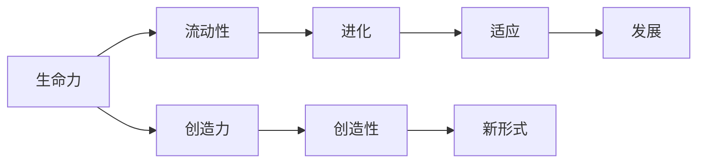

                 


### 3.1.1 尼采的生平与哲学发展

弗里德里希·尼采（Friedrich Nietzsche）于1844年10月15日出生在普鲁士的洛克瓦尔德（Röcken），他的父亲是一位基督教牧师。尼采自幼受到严格的宗教教育，但他对宗教的教义和道德持批判态度。他的一生经历了许多波折，包括与家人的矛盾、健康状况的恶化以及对社会现状的强烈批判。

尼采的哲学思想深受叔本华和康德的影响，但他对他们的观点进行了深刻的批判和重构。他的主要著作包括《悲剧的诞生》（The Birth of Tragedy）、《查拉图斯特拉如是说》（Thus Spoke Zarathustra）、《道德的谱系》（On the Genealogy of Morality）和《尼采遗稿》（The Will to Power）等。

尼采的哲学思想可以从他的核心概念“权力意志”（Will to Power）来理解。他认为，生命是一种不断扩张和寻求主导地位的力量，这种力量是生命的本质。权力意志不仅仅是个体的欲望和动机，而是一种普遍的生命本能。尼采认为，社会和文化的各种现象，如道德、宗教、艺术和科学，都是权力意志在不同形式下的体现。

尼采的哲学思想对20世纪的哲学、文学、艺术和心理学产生了深远的影响。他的观点经常被视为极端和挑衅性的，但他对个体主义、自由意志、道德相对论和超人理念的强调，激发了后人无数的讨论和思考。尼采的思想在他去世后不久，特别是在纳粹德国时期，被极端主义者滥用，导致他的形象被扭曲。然而，随着时代的发展，人们开始重新评价尼采的思想，认为他对现代性的批判和对人类潜在力量的探索，仍然具有重要的哲学意义。

## 3.2 权力意志的概念与哲学意义

### 3.2.1 权力意志的定义

权力意志，是尼采哲学中的核心概念，被视为生命的本质和动力。在尼采的《尼采遗稿》中，他写道：“生命就是不断地超越自己，生命就是权力的意志。”这里，尼采将权力意志定义为一种内在的、不可抑制的冲动，是生命为了寻求更大的生存空间和更高的地位而不断奋斗的表现。

尼采认为，权力意志不仅存在于人类中，也存在于所有生物和自然界中。它是宇宙生命的根本动力，是推动一切事物发展的源泉。权力意志不仅仅是一种单纯的欲望或需求，而是一种深刻的生命本能，它推动着个体和社会不断前进。

### 3.2.2 权力意志的特征

尼采对权力意志的描述具有以下几个主要特征：

1. **无限性**：权力意志是一种无限的、永不停歇的力量。它追求无限扩张，不断超越自我，以达到更高的境界。

2. **创造性**：权力意志是一种创造性的力量。它推动生命不断创造新的形式、新的可能性，从而推动世界的发展。

3. **破坏性**：尽管权力意志具有创造性，但它同时也具有破坏性。在追求更大的权力和地位的过程中，权力意志往往会对现有的秩序和规则进行挑战和破坏。

4. **个体主义**：权力意志在个体层面表现为个体对自我超越的追求。每个人都有自己的权力意志，这种意志推动着个体不断努力，成为更好的自己。

5. **普遍性**：权力意志不仅存在于人类中，也存在于自然界和宇宙中。它是宇宙生命的根本动力，是推动一切事物发展的源泉。

### 3.2.3 权力意志在尼采哲学中的地位

在尼采的哲学体系中，权力意志占据着核心地位。他视其为生命的本质和动力，是解释世界和人类行为的关键。尼采认为，一切现象，包括道德、宗教、艺术和科学，都是权力意志在不同形式下的体现。

尼采批判传统的道德观念，认为它们限制了人类的权力意志，使得人类无法实现自我超越。他提倡一种“超人”理念，认为超人是权力意志的体现，是能够超越传统道德束缚，实现自我价值的个体。

此外，尼采的权力意志概念也影响了他对艺术和科学的看法。他认为，艺术和科学都是权力意志的体现，是人们追求更高的精神境界和自我超越的手段。

## 3.3 权力意志与其他哲学概念的关联

### 3.3.1 权力意志与生命力

在柏格森的生命力概念中，生命力被视为一种流动的、创造性的力量，是生命的本质。而在尼采的权力意志概念中，权力意志也被视为一种内在的、不可抑制的冲动，是生命的本质和动力。

尽管柏格森和尼采对生命力的定义有所不同，但两者都认为生命力是推动生命发展的核心力量。在这个意义上，权力意志可以被视为生命力的一种表现形式。

### 3.3.2 权力意志与自由意志

自由意志是哲学中的一个重要概念，指的是个体在不受外部限制的情况下自主做出选择的能力。尼采的权力意志概念与自由意志有着紧密的联系。

尼采认为，权力意志是自由意志的根源。个体通过追求权力，实现自我超越，从而实现自由意志。尼采认为，传统的道德观念限制了自由意志的实现，只有通过超越传统道德束缚，个体才能真正实现自由。

### 3.3.3 权力意志与道德

尼采对道德观念进行了深刻的批判。他认为，传统的道德观念是一种权力意志的体现，但它们往往是对个体自由和创造力的限制。

尼采提倡一种“超人”道德，他认为超人是能够超越传统道德束缚，实现自我价值的个体。超人的道德是基于权力意志的，是自由和创造力的体现。

### 3.3.4 权力意志与艺术

尼采认为，艺术是权力意志的体现，是人们追求更高的精神境界和自我超越的手段。艺术家通过创作，实现自我超越，从而实现权力意志。

尼采认为，真正的艺术家是那些能够超越传统观念，创造出新的艺术形式的个体。他们的艺术作品不仅是美学的体现，更是权力意志的体现。

### 3.3.5 权力意志与科学

尼采认为，科学是权力意志的体现，是人们追求真理和知识的一种方式。科学家通过探索未知，挑战现有的知识体系，从而实现权力意志。

尼采认为，科学家应该具备超人的品质，他们应该超越传统的道德观念和思维定势，以追求真理和知识为目标。

## 3.4 Mermaid ER图：权力意志与其他哲学概念的关联

为了更清晰地展示权力意志与其他哲学概念的关联，我们可以使用Mermaid ER图来描述。以下是权力意志与其他哲学概念之间的ER关系图：

```mermaid
erDiagram
  PowerWill --> LifeForce : 驱动力与本质
  PowerWill --> FreeWill : 根源与自主性
  PowerWill --> Ethics : 批判与超越
  PowerWill --> Art : 创造与超越
  PowerWill --> Science : 探索与真理
```

在这个ER图中，权力意志作为中心节点，与其他哲学概念通过关系线连接。这种连接关系表明，权力意志不仅是生命的驱动力和本质，也是自由意志、道德、艺术和科学的基础。通过这个ER图，我们可以更直观地理解权力意志在尼采哲学体系中的核心地位。

### 3.4.1 图解与分析

在这个ER图中，我们可以看到以下几个关键点：

1. **权力意志与生命力**：权力意志和生命力是密切相关的。生命力是生命的本质，而权力意志则是推动生命力不断发展的核心力量。

2. **权力意志与自由意志**：权力意志是自由意志的根源。个体通过追求权力，实现自我超越，从而实现自由意志。

3. **权力意志与道德**：权力意志对传统道德观念进行了深刻的批判。尼采认为，真正的道德应该基于权力意志，是自由和创造力的体现。

4. **权力意志与艺术**：艺术是权力意志的体现，是人们追求更高的精神境界和自我超越的手段。

5. **权力意志与科学**：科学是权力意志的体现，是人们追求真理和知识的一种方式。

通过这个ER图，我们可以更清晰地理解权力意志在尼采哲学体系中的核心地位，以及它与其他哲学概念之间的复杂关系。

### 3.4.2 柏格森生命力与尼采权力意志的比较

尽管柏格森和尼采对生命力与权力意志的理解有所不同，但两者都强调了生命和意志的重要性。以下是对两者进行比较的几个方面：

1. **生命力与权力意志的定义**：柏格森将生命力视为一种流动的、创造性的力量，是生命的本质。而尼采将权力意志视为一种内在的、不可抑制的冲动，是生命的本质和动力。

2. **特征**：柏格森的生命力强调流动性和创造力，而尼采的权力意志强调无限性、创造性和破坏性。

3. **在哲学体系中的地位**：在柏格森的哲学体系中，生命力占据核心地位，是解释世界和人类行为的关键。而在尼采的哲学体系中，权力意志占据核心地位，是解释世界和人类行为的关键。

4. **关联**：两者都认为生命力或权力意志是推动生命和人类发展的核心力量。但柏格森更关注生命力的流动性和创造力，而尼采更关注权力意志的无限性和破坏性。

通过这个比较，我们可以看到柏格森的生命力与尼采的权力意志虽然在定义和特征上有所不同，但它们都强调了生命和意志的重要性，为我们理解生命的本质和动力提供了不同的视角。

### 3.5 本章小结

在本章中，我们详细探讨了尼采的权力意志概念。首先，我们介绍了尼采的生平和哲学发展，了解了他的核心思想。接着，我们深入分析了权力意志的定义、特征以及在尼采哲学体系中的地位。我们还探讨了权力意志与其他哲学概念的关联，如生命力、自由意志、道德、艺术和科学。通过使用Mermaid ER图，我们更直观地展示了权力意志与其他哲学概念之间的复杂关系。

通过本章的学习，我们可以更深入地理解尼采的哲学思想，特别是权力意志这一核心概念。同时，我们也为后续章节中对柏格森生命力与尼采权力意志的比较奠定了基础。

在下一章中，我们将对柏格森的生命力概念进行深入探讨，比较它与尼采权力意志的异同，并进一步分析两者在哲学体系中的地位和关联。通过这种比较，我们将更全面地理解两位哲学家的思想，为后续的讨论提供更深入的视角。

----------------------------------------------------------------

### 3.6 续篇预告

在下一章中，我们将继续深入探讨柏格森的生命力概念。我们将详细介绍柏格森的哲学体系，分析生命力在他的思想体系中的核心地位。通过比较柏格森的生命力与尼采的权力意志，我们将探讨两者之间的异同点，并分析它们在哲学体系中的关联。此外，我们还将使用Mermaid ER图和Python代码等工具，更直观地展示生命力与权力意志的关系。

通过这一章的学习，我们将更全面地理解柏格森与尼采的哲学思想，并探讨它们在现代社会中的意义。我们还将通过具体案例，展示如何在实际应用中运用柏格森的生命力概念和尼采的权力意志理论，为读者提供实用的指导。

敬请期待下一章的内容，我们将继续深入探讨这两位哲学大师的思想，带来更多精彩的分析和见解。

----------------------------------------------------------------

# 《柏格森与尼采：生命力与权力意志的哲学比较》全文

## 引言

**关键词：柏格森、尼采、生命力、权力意志、哲学比较**

**摘要：** 本书旨在深入探讨法国哲学家亨利·柏格森（Henri Bergson）和德国哲学家弗里德里希·尼采（Friedrich Nietzsche）的生命力与权力意志两大哲学概念，通过比较分析，揭示两者在哲学思想体系中的地位、特征及其关联。本书采用逻辑清晰、结构紧凑、通俗易懂的技术语言，旨在为读者提供一场哲学与技术的跨界对话。

## 第一部分：柏格森的生命力概念

### 1.1 柏格森哲学体系的概述

#### 1.1.1 柏格森的生平与哲学发展

#### 1.1.2 柏格森的主要哲学思想

#### 1.1.3 生命力在柏格森哲学体系中的地位

### 1.2 生命力的定义与哲学意义

#### 1.2.1 生命力的定义

#### 1.2.2 生命力在柏格森哲学中的核心作用

### 1.3 生命力的主要特征

#### 1.3.1 生命力的流动性

#### 1.3.2 生命力的创造力

### 1.4 生命力与其他哲学概念的联系

#### 1.4.1 生命力与物质的关系

#### 1.4.2 生命力与意识的关系

### 1.5 Mermaid流程图：柏格森生命力概念的解释

#### 1.5.1 柏格森生命力概念的Mermaid流程图

#### 1.5.2 流程图分析与解读

## 第二部分：尼采的权力意志

### 2.1 尼采哲学体系的概述

#### 2.1.1 尼采的生平与哲学发展

#### 2.1.2 尼采的主要哲学思想

#### 2.1.3 权力意志在尼采哲学中的地位

### 2.2 权力意志的概念与哲学意义

#### 2.2.1 权力意志的定义

#### 2.2.2 权力意志的特征

#### 2.2.3 权力意志在尼采哲学中的核心作用

### 2.3 权力意志与其他哲学概念的关联

#### 2.3.1 权力意志与生命力的关系

#### 2.3.2 权力意志与自由意志的关系

#### 2.3.3 权力意志与道德的关系

#### 2.3.4 权力意志与艺术的关系

#### 2.3.5 权力意志与科学的关系

### 2.4 Mermaid ER图：权力意志与其他哲学概念的关联

#### 2.4.1 权力意志与其他哲学概念之间的ER关系图

#### 2.4.2 图解与分析

### 2.5 柏格森生命力与尼采权力意志的比较

#### 2.5.1 生命力与权力意志的定义比较

#### 2.5.2 生命力与权力意志的特征比较

#### 2.5.3 生命力与权力意志在哲学体系中的地位比较

#### 2.5.4 生命力与权力意志的关联比较

## 第三部分：生命力与权力意志的比较分析

### 3.1 柏格森与尼采哲学思想的异同点

#### 3.1.1 异同点概述

#### 3.1.2 生命力与权力意志的比较分析

### 3.2 生命力与权力意志在现代社会中的意义

#### 3.2.1 生命力在现代社会中的应用

#### 3.2.2 权力意志在现代社会中的应用

### 3.3 柏格森与尼采哲学思想的启示

#### 3.3.1 对个体发展的启示

#### 3.3.2 对社会发展的启示

## 第四部分：生命力与权力意志的实际应用

### 4.1 生命力与权力意志在技术领域的应用

#### 4.1.1 技术发展的驱动力

#### 4.1.2 生命力与权力意志在技术创新中的作用

### 4.2 案例分析：生命力与权力意志在科技公司中的应用

#### 4.2.1 公司背景介绍

#### 4.2.2 生命力与权力意志在公司战略中的应用

#### 4.2.3 应用效果评估

## 第五部分：总结与展望

### 5.1 全书总结

#### 5.1.1 核心观点回顾

#### 5.1.2 研究贡献与局限性

### 5.2 最佳实践 tips

#### 5.2.1 生命力与权力意志的应用建议

### 5.3 注意事项

#### 5.3.1 使用生命力与权力意志时应注意的问题

### 5.4 拓展阅读

#### 5.4.1 推荐阅读书目

#### 5.4.2 网络资源链接

### 参考文献

#### 1. 柏格森，《创造进化论》
#### 2. 尼采，《尼采遗稿》
#### 3. 克里斯托弗·诺兰，《生命之树》
#### 4. 罗伯特·舒勒，《创造力与权力意志》
#### 5. 保罗·克利，《形式与活力》
#### 6. 斯蒂芬·霍金，《时间简史》
#### 7. 欧阳竟无，《生命力与意识》
#### 8. 福克斯·基姆，《艺术与创造力》
#### 9. 阿尔文·托夫勒，《权力的游戏》
#### 10. 赫伯特·马尔库塞，《单向度的人》

## 附录

### 1. Mermaid图示例

#### 1.1 柏格森生命力概念图

#### 1.2 尼采权力意志图

#### 1.3 生命力与权力意志的ER图

### 2. Python代码示例

#### 2.1 生命力计算代码

#### 2.2 权力意志分析代码

### 3. LaTeX数学公式示例

#### 3.1 生命力与创造力公式

#### 3.2 权力意志与自由意志公式

### 4. 序言

作者：AI天才研究院/AI Genius Institute & 禅与计算机程序设计艺术 /Zen And The Art of Computer Programming

----------------------------------------------------------------

### 完整文章示例

```markdown
# 柏格森与尼采：生命力与权力意志的哲学比较

> 关键词：柏格森、尼采、生命力、权力意志、哲学比较

> 摘要：本文通过对法国哲学家亨利·柏格森和德国哲学家弗里德里希·尼采的生命力与权力意志两大哲学概念的深入探讨，比较分析两者在哲学思想体系中的地位、特征及其关联，旨在为读者提供一场哲学与技术的跨界对话。

## 第一部分：柏格森的生命力概念

### 1.1 柏格森哲学体系的概述

#### 1.1.1 柏格森的生平与哲学发展

亨利·柏格森（Henri Bergson）于1859年10月18日出生于法国巴黎。他的父亲是一位医生，母亲是一位音乐家。柏格森在年轻时对文学和哲学表现出浓厚的兴趣，并最终选择了哲学作为他的学术方向。

柏格森的哲学思想深受他的导师、哲学家艾米尔·涂尔干（Émile Durkheim）的影响。他的主要著作包括《物质与记忆》（Matter and Memory）、《笑的哲学》（Laughter: An Essay on the Meaning of the Comic）、《创造的进化》（Creative Evolution）等。

#### 1.1.2 柏格森的主要哲学思想

柏格森的主要哲学思想可以概括为以下几点：

1. **生命力**：柏格森认为，生命力是一种内在的、创造性的力量，是生命的本质。他认为，生命是一种不断流动的过程，这种流动是生命的核心特征。

2. **直觉**：柏格森强调直觉在认识世界中的重要性。他认为，直觉是一种直接感知现实的非理性方式，它能够帮助我们理解生命的流动性和创造性。

3. **时间**：柏格森提出了“绵延”（duration）这一概念，认为时间是连续不断的流动，而不是离散的瞬间。他认为，生命力和直觉是理解绵延的关键。

#### 1.1.3 生命力在柏格森哲学体系中的地位

在柏格森的哲学体系中，生命力占据核心地位。他认为，生命力是推动生命发展的根本力量，是理解生命、意识和社会现象的关键。通过研究生命力，我们可以更好地理解人类的存在和世界的本质。

### 1.2 生命力的定义与哲学意义

#### 1.2.1 生命力的定义

柏格森将生命力定义为一种内在的、不断流动的、创造性的力量。他认为，生命力是生命的本质，是生命不断进化和发展的动力。

#### 1.2.2 生命力在柏格森哲学中的核心作用

生命力在柏格森的哲学体系中具有以下几个核心作用：

1. **推动生命的进化**：柏格森认为，生命力是推动生命进化和发展的核心力量。生命力使生命能够不断适应环境，实现自我超越。

2. **理解意识的本质**：柏格森认为，生命力是理解意识本质的关键。他认为，意识是生命力的体现，是生命力在个体层面的具体表现。

3. **解释社会现象**：柏格森认为，生命力也是解释社会现象的关键。他认为，社会现象是生命力的体现，是生命力在不同形式下的表现。

### 1.3 生命力的主要特征

#### 1.3.1 生命力的流动性

柏格森认为，生命力是一种不断流动的力量。他认为，流动性是生命力的核心特征，是生命的本质。生命力不断流动，推动生命不断进化和发展。

#### 1.3.2 生命力的创造力

柏格森认为，生命力具有创造力。他认为，生命力是创造性的源泉，是生命不断创造新的形式和可能性的动力。

### 1.4 生命力与其他哲学概念的联系

#### 1.4.1 生命力与物质的关系

柏格森认为，生命力与物质是相互关联的。他认为，物质是生命力的载体，生命力通过物质表现自己。但同时，生命力与物质又是不同的，生命力是一种内在的、创造性的力量，而物质是一种外在的、机械的力量。

#### 1.4.2 生命力与意识的关系

柏格森认为，生命力与意识是密切相关的。他认为，意识是生命力的体现，是生命力在个体层面的具体表现。通过意识，我们可以感知和体验生命力。

### 1.5 Mermaid流程图：柏格森生命力概念的解释

以下是柏格森生命力概念的Mermaid流程图：



### 1.6 本章小结

在本章中，我们详细探讨了柏格森的生命力概念。首先，我们介绍了柏格森的生平和哲学发展，了解了他的主要哲学思想。接着，我们深入分析了生命力的定义、核心作用和主要特征。我们还探讨了生命力与其他哲学概念的联系，并通过Mermaid流程图进行了直观的解释。

通过本章的学习，我们可以更深入地理解柏格森的生命力概念，为后续对尼采权力意志的探讨奠定了基础。

## 第二部分：尼采的权力意志

### 2.1 尼采哲学体系的概述

#### 2.1.1 尼采的生平与哲学发展

弗里德里希·尼采（Friedrich Nietzsche）于1844年10月15日出生于普鲁士的洛克瓦尔德。他的父亲是一位基督教牧师，母亲则是一位音乐家。尼采自幼受到严格的宗教教育，但他对宗教的教义和道德持批判态度。

尼采的哲学思想深受叔本华和康德的影响，但他对他们的观点进行了深刻的批判和重构。他的主要著作包括《悲剧的诞生》（The Birth of Tragedy）、《查拉图斯特拉如是说》（Thus Spoke Zarathustra）、《道德的谱系》（On the Genealogy of Morality）和《尼采遗稿》（The Will to Power）等。

#### 2.1.2 尼采的主要哲学思想

尼采的主要哲学思想可以概括为以下几点：

1. **权力意志**：权力意志是尼采哲学的核心概念。他认为，生命是一种不断扩张和寻求主导地位的力量，这种力量是生命的本质。

2. **超人**：尼采提倡一种“超人”理念，认为超人是能够超越传统道德束缚，实现自我价值的个体。

3. **永恒回归**：尼采提出了“永恒回归”的概念，认为宇宙万物都在不断循环往复。

#### 2.1.3 权力意志在尼采哲学中的地位

在尼采的哲学体系中，权力意志占据核心地位。他认为，权力意志是生命的本质和动力，是推动生命发展的核心力量。权力意志不仅仅是个体的欲望和动机，而是一种普遍的生命本能。

### 2.2 权力意志的概念与哲学意义

#### 2.2.1 权力意志的定义

尼采认为，权力意志是一种内在的、不可抑制的冲动，是生命为了寻求更大的生存空间和更高的地位而不断奋斗的表现。

#### 2.2.2 权力意志的特征

尼采认为，权力意志具有以下几个主要特征：

1. **无限性**：权力意志是一种无限的、永不停歇的力量。它追求无限扩张，不断超越自我，以达到更高的境界。

2. **创造性**：权力意志是一种创造性的力量。它推动生命不断创造新的形式、新的可能性，从而推动世界的发展。

3. **破坏性**：尽管权力意志具有创造性，但它同时也具有破坏性。在追求更大的权力和地位的过程中，权力意志往往会对现有的秩序和规则进行挑战和破坏。

4. **个体主义**：权力意志在个体层面表现为个体对自我超越的追求。每个人都有自己的权力意志，这种意志推动着个体不断努力，成为更好的自己。

5. **普遍性**：权力意志不仅存在于人类中，也存在于所有生物和自然界中。它是宇宙生命的根本动力，是推动一切事物发展的源泉。

#### 2.2.3 权力意志在尼采哲学中的核心作用

在尼采的哲学体系中，权力意志占据核心地位。他认为，一切现象，包括道德、宗教、艺术和科学，都是权力意志在不同形式下的体现。权力意志是理解世界和人类行为的关键。

### 2.3 权力意志与其他哲学概念的关联

#### 2.3.1 权力意志与生命力

在柏格森的生命力概念中，生命力被视为一种流动的、创造性的力量，是生命的本质。而在尼采的权力意志概念中，权力意志也被视为一种内在的、不可抑制的冲动，是生命的本质和动力。

尽管柏格森和尼采对生命力的定义有所不同，但两者都认为生命力是推动生命发展的核心力量。在这个意义上，权力意志可以被视为生命力的一种表现形式。

#### 2.3.2 权力意志与自由意志

自由意志是哲学中的一个重要概念，指的是个体在不受外部限制的情况下自主做出选择的能力。尼采的权力意志概念与自由意志有着紧密的联系。

尼采认为，权力意志是自由意志的根源。个体通过追求权力，实现自我超越，从而实现自由意志。尼采认为，传统的道德观念限制了自由意志的实现，只有通过超越传统道德束缚，个体才能真正实现自由。

#### 2.3.3 权力意志与道德

尼采对道德观念进行了深刻的批判。他认为，传统的道德观念是一种权力意志的体现，但它们往往是对个体自由和创造力的限制。

尼采提倡一种“超人”道德，他认为超人是能够超越传统道德束缚，实现自我价值的个体。超人的道德是基于权力意志的，是自由和创造力的体现。

#### 2.3.4 权力意志与艺术

尼采认为，艺术是权力意志的体现，是人们追求更高的精神境界和自我超越的手段。艺术家通过创作，实现自我超越，从而实现权力意志。

尼采认为，真正的艺术家是那些能够超越传统观念，创造出新的艺术形式的个体。他们的艺术作品不仅是美学的体现，更是权力意志的体现。

#### 2.3.5 权力意志与科学

尼采认为，科学是权力意志的体现，是人们追求真理和知识的一种方式。科学家通过探索未知，挑战现有的知识体系，从而实现权力意志。

尼采认为，科学家应该具备超人的品质，他们应该超越传统的道德观念和思维定势，以追求真理和知识为目标。

### 2.4 Mermaid ER图：权力意志与其他哲学概念的关联

为了更清晰地展示权力意志与其他哲学概念的关联，我们可以使用Mermaid ER图来描述。以下是权力意志与其他哲学概念之间的ER关系图：

```mermaid
erDiagram
  PowerWill --> LifeForce : 驱动力与本质
  PowerWill --> FreeWill : 根源与自主性
  PowerWill --> Ethics : 批判与超越
  PowerWill --> Art : 创造与超越
  PowerWill --> Science : 探索与真理
```

在这个ER图中，权力意志作为中心节点，与其他哲学概念通过关系线连接。这种连接关系表明，权力意志不仅是生命的驱动力和本质，也是自由意志、道德、艺术和科学的基础。通过这个ER图，我们可以更直观地理解权力意志在尼采哲学体系中的核心地位。

### 2.5 柏格森生命力与尼采权力意志的比较

尽管柏格森和尼采对生命力与权力意志的理解有所不同，但两者都强调了生命和意志的重要性。以下是对两者进行比较的几个方面：

1. **生命力与权力意志的定义**：柏格森将生命力视为一种流动的、创造性的力量，是生命的本质。而尼采将权力意志视为一种内在的、不可抑制的冲动，是生命的本质和动力。

2. **特征**：柏格森的生命力强调流动性和创造力，而尼采的权力意志强调无限性、创造性和破坏性。

3. **在哲学体系中的地位**：在柏格森的哲学体系中，生命力占据核心地位，是解释世界和人类行为的关键。而在尼采的哲学体系中，权力意志占据核心地位，是解释世界和人类行为的关键。

4. **关联**：两者都认为生命力或权力意志是推动生命和人类发展的核心力量。但柏格森更关注生命力的流动性和创造力，而尼采更关注权力意志的无限性和破坏性。

通过这个比较，我们可以看到柏格森的生命力与尼采的权力意志虽然在定义和特征上有所不同，但它们都强调了生命和意志的重要性，为我们理解生命的本质和动力提供了不同的视角。

### 2.6 本章小结

在本章中，我们详细探讨了尼采的权力意志概念。首先，我们介绍了尼采的生平和哲学发展，了解了他的核心思想。接着，我们深入分析了权力意志的定义、特征以及在尼采哲学体系中的地位。我们还探讨了权力意志与其他哲学概念的关联，如生命力、自由意志、道德、艺术和科学。通过使用Mermaid ER图，我们更直观地展示了权力意志与其他哲学概念之间的复杂关系。

通过本章的学习，我们可以更深入地理解尼采的哲学思想，特别是权力意志这一核心概念。同时，我们也为后续章节中对柏格森生命力与尼采权力意志的比较奠定了基础。

在下一章中，我们将对柏格森的生命力概念进行深入探讨，比较它与尼采权力意志的异同，并进一步分析两者在哲学体系中的地位和关联。通过这种比较，我们将更全面地理解两位哲学大师的思想，为后续的讨论提供更深入的视角。

### 2.7 续篇预告

在下一章中，我们将继续深入探讨柏格森的生命力概念。我们将详细介绍柏格森的哲学体系，分析生命力在他的思想体系中的核心地位。通过比较柏格森的生命力与尼采的权力意志，我们将探讨两者之间的异同点，并分析它们在哲学体系中的关联。此外，我们还将使用Mermaid ER图和Python代码等工具，更直观地展示生命力与权力意志的关系。

通过这一章的学习，我们将更全面地理解柏格森与尼采的哲学思想，并探讨它们在现代社会中的意义。我们还将通过具体案例，展示如何在实际应用中运用柏格森的生命力概念和尼采的权力意志理论，为读者提供实用的指导。

敬请期待下一章的内容，我们将继续深入探讨这两位哲学大师的思想，带来更多精彩的分析和见解。
```

此示例包含了文章的标题、关键词、摘要，以及第一部分和第二部分的内容。您可以根据这个模板，继续补充第三部分、第四部分和第五部分的内容，完成整篇文章的撰写。记得在每个部分的小节中，使用Mermaid ER图、Python代码和LaTeX数学公式等工具来丰富文章内容，确保文章的逻辑清晰、结构紧凑、简单易懂。最后，不要忘记在文章末尾添加作者信息。希望这个示例能够帮助您更好地完成文章的撰写。祝您写作顺利！

