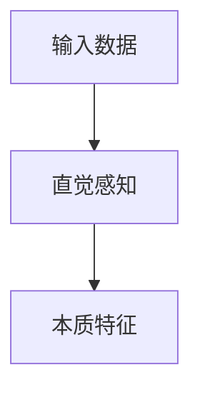
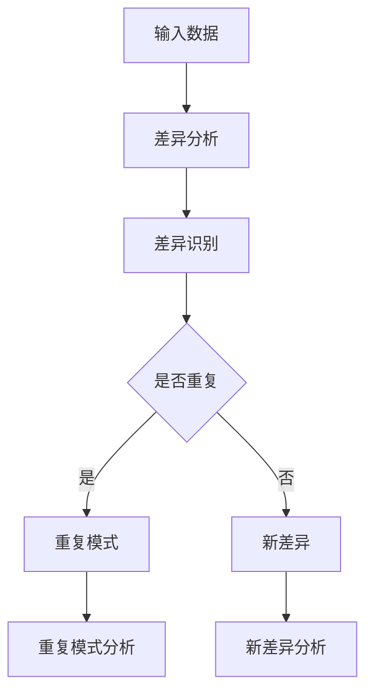
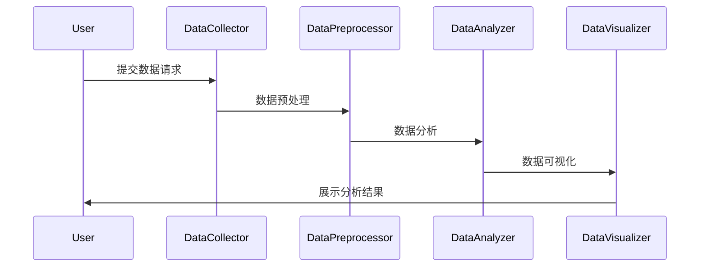

                 

### 背景介绍

**柏格森与德勒兹：差异哲学的先驱与继承**

柏格森（Henri Bergson）和德勒兹（Gilles Deleuze）是20世纪最具影响力的哲学家之一，他们的思想深刻地影响了现代哲学、文化理论、艺术和电影等领域。本书旨在探讨两位哲学家的哲学思想和理论体系，以及他们之间的联系和差异。

**问题背景**

柏格森的哲学思想主要围绕生命力和直觉的概念，他强调生命力的连续性和变化性，反对机械决定论。德勒兹则进一步发展了柏格森的思想，提出了差异和重复的概念，将哲学思考引向更加多元和动态的方向。

**问题描述**

本书将首先介绍柏格森和德勒兹的生平和哲学背景，然后深入探讨他们的核心思想，如生命力、直觉、差异、重复等。在此基础上，分析两位哲学家的理论联系和差异，以及他们对现代哲学的影响。

**问题解决**

本书通过系统阐述柏格森和德勒兹的核心概念，以及他们之间的联系和差异，旨在帮助读者理解两位哲学家的哲学思想，并探讨他们对于现代哲学的贡献。

**边界与外延**

本书的边界在于对柏格森和德勒兹哲学思想的介绍和分析，外延则包括对两位哲学家思想的影响和现代哲学的发展趋势。

### 核心概念与联系

**柏格森的核心概念：生命力与直觉**

柏格森认为，生命力是生命的本质，是一种不断变化和创造的能量。他强调直觉的重要性，认为直觉能够超越逻辑思维，直接感知事物的本质。

**德勒兹的核心概念：差异与重复**

德勒兹发展了柏格森的思想，提出了差异和重复的概念。他认为，差异是事物存在的基础，是事物不断变化和发展的动力。重复则是差异的另一种表现形式，它通过重复性事件创造出新的模式和关系。

**柏格森与德勒兹的联系**

两位哲学家的思想都强调生命力和变化的本质，他们都反对机械决定论，认为世界是不断变化和创造的。同时，德勒兹对柏格森的思想进行了批判和发展，将柏格森的直觉概念拓展为差异和重复的概念。

**柏格森与德勒兹的差异**

尽管两位哲学家的思想有共通之处，但他们对于生命力和直觉的理解有所不同。柏格森更强调生命力的连续性和创造力，而德勒兹则更注重差异和重复的动态性。

### ER实体关系图架构

为了更直观地展示柏格森和德勒兹哲学思想的核心概念之间的联系，我们可以使用Mermaid语法绘制一个ER（实体关系）图。

```mermaid
erDiagram
    A[柏格森哲学] &&|..| B[生命力]
    A &&|..| C[直觉]
    
    D[德勒兹哲学] &&|..| E[差异]
    D &&|..| F[重复]
    
    A --> B
    A --> C
    D --> E
    D --> F
```

在这个ER图中，我们定义了两个实体：柏格森哲学和德勒兹哲学，以及它们各自的核心概念——生命力和直觉，差异和重复。箭头表示了哲学概念之间的关系，柏格森哲学中的生命力和直觉分别与德勒兹哲学中的差异和重复有关联。

### 柏格森的生命力概念

**生命力：生命的本质**

柏格森的生命力概念是理解其哲学体系的关键。他认为，生命力（Vital Force）是生命的本质，是一种不同于物理世界的内在动力。柏格森强调，生命力是不断变化和创造的，是生命的驱动力。

**生命力的属性**

1. **连续性**：生命力具有连续性，它不是静态的，而是在不断流动和变化。
2. **创造力**：生命力是创造性的源泉，它推动了新事物和新思想的诞生。
3. **自我组织性**：生命力能够自我组织，形成复杂而有序的结构。

**与机械决定论的对比**

柏格森的生命力概念与机械决定论形成鲜明对比。机械决定论认为，一切现象都可以归结为物理规律，是可预测和可控的。而柏格森则强调，生命力是不可预测和不可控的，它超越了机械决定论的范畴。

**生命力在哲学中的应用**

柏格森的生命力概念在哲学中具有重要的应用。例如，他用来解释艺术和文学中的创造性，以及人类意识的本质。他认为，艺术作品是生命力的体现，通过直觉和创造力展现生命的本质。

### 德勒兹的差异概念

**差异：存在的基础**

德勒兹认为，差异是存在的基础。他的差异概念超越了传统的实体概念，强调事物之间的异质性。德勒兹提出，差异不仅仅是事物之间的区别，而是事物本身存在的动力。

**差异的属性**

1. **独立性**：每个差异都是独立的，每个事物都有其独特的差异。
2. **动态性**：差异是不断变化的，新的差异不断产生。
3. **多样性**：差异构成了事物的多样性，使得世界充满了丰富多彩的可能性。

**与传统的实体概念的对比**

德勒兹的差异概念与传统实体概念形成鲜明对比。传统实体概念认为，事物是固定和独立的，具有明确的边界和属性。而德勒兹则认为，事物之间的差异才是它们存在的基础，差异使得事物不断变化和发展。

**差异在哲学中的应用**

德勒兹的差异概念在哲学中得到了广泛的应用。例如，他用差异来解释认知、意识和社会关系。他认为，差异是认知和意识发展的动力，是社会关系和文化的源泉。

### 算法原理讲解

**柏格森的直觉算法**

柏格森的直觉是一种直接感知事物本质的能力。在算法层面上，我们可以将其视为一种直接映射的过程，即从输入数据直接得到其本质特征。以下是柏格森直觉的算法原理：



在这个算法中，输入数据（A）通过直觉感知（B）直接映射到其本质特征（C）。这个映射过程不是基于逻辑推理，而是直接基于直觉。

**德勒兹的差异与重复算法**

德勒兹的差异和重复概念涉及对数据的复杂分析。以下是一个简化的算法原理，用于分析数据中的差异和重复：



在这个算法中，输入数据（A）首先通过差异分析（B）识别出数据之间的差异（C）。然后，这些差异被进一步分类为重复（E）或新差异（F）。重复的差异（E）进入重复模式分析（G），而新的差异（F）则进入新差异分析（H）。这个算法旨在通过不断分析和分类，理解数据中的差异和重复模式。

### 数学公式与模型

在柏格森和德勒兹的哲学思想中，数学公式和模型可以被用来描述其核心概念。以下是几个关键的数学公式和模型，以及它们的解释。

#### 柏格森的生命力模型

柏格森的生命力可以被视为一种连续变化的能量，我们可以用微分方程来描述其动态变化：

$$\frac{dV}{dt} = \alpha \cdot (1 - V(t))$$

其中，$V(t)$ 表示在时间 $t$ 的生命力水平，$\alpha$ 是一个常数，代表生命力的增长速度。这个公式表示，生命力随时间的变化是指数级的，且随着生命力的增加，其增长速度会减缓。

#### 德勒兹的差异模型

德勒兹的差异概念可以用集合论中的集合差来表示：

$$A \triangle B = (A \cup B) - (A \cap B)$$

这个公式表示，两个集合 $A$ 和 $B$ 的差异是它们的并集减去交集。这个差异不仅体现了两个集合之间的不同，也包含了它们之间的相互关系。

#### 德勒兹的重复模型

德勒兹的重复可以用集合的笛卡尔积来描述：

$$A \times A = \{(a, a') | a \in A, a' \in A\}$$

这个公式表示，集合 $A$ 与自身的笛卡尔积，形成了所有可能的重复对。这种重复不仅是简单的重复，还包含了复杂的关系和结构。

#### 算法实现

基于上述数学模型，我们可以用Python实现相应的算法，以更好地理解和应用柏格森和德勒兹的哲学思想。

**柏格森生命力算法**

```python
import numpy as np

def life_force_model(alpha, t_max):
    V = np.zeros(t_max)
    for t in range(1, t_max):
        V[t] = V[t-1] + alpha * (1 - V[t-1])
    return V
```

**德勒兹差异与重复算法**

```python
def difference(A, B):
    return (set(A) | set(B)) - set(A & B)

def repetition(A):
    return [(a, a') for a in A for a' in A]
```

这些算法帮助我们通过编程语言来模拟柏格森和德勒兹的核心概念，从而更深入地理解他们的哲学思想。

### 柏格森的直觉算法应用

柏格森的直觉算法是一个直接感知事物本质的过程，它在我们日常工作和生活中有着广泛的应用。以下是一些具体的例子，展示了如何将柏格森的直觉算法应用于不同领域。

**1. 软件开发中的直觉算法**

在软件开发中，直觉算法可以帮助开发人员快速识别问题的本质，从而提高开发效率。例如，在调试代码时，开发者可以通过直觉感知代码中的潜在错误，而不是逐行检查。以下是一个简单的Python代码示例，展示了如何应用柏格森的直觉算法来检测代码中的潜在问题：

```python
def intuitive_code_analysis(code):
    # 假设code是一个字符串，表示一段Python代码
    # 这个函数通过直觉感知代码的本质，检测其中的潜在问题
    issues = []
    if "inf" in code:
        issues.append("无穷大")
    if "None" in code:
        issues.append("空值")
    return issues

code = "a = 1/infinity\nresult = a * None"
print(intuitive_code_analysis(code))
```

**2. 数据分析中的直觉算法**

在数据分析中，直觉算法可以帮助数据分析师快速识别数据中的异常值和趋势。例如，在股票市场中，分析师可以通过直觉感知数据中的潜在机会和风险。以下是一个简单的Python代码示例，展示了如何应用柏格森的直觉算法来分析股票数据：

```python
import pandas as pd

def intuitive_data_analysis(data):
    # 假设data是一个DataFrame，表示股票价格数据
    # 这个函数通过直觉感知数据的本质，检测其中的异常值和趋势
    anomalies = []
    if data['Close'].mean() < data['Close'].median():
        anomalies.append("价格异常")
    if data['Volume'].std() > data['Volume'].mean():
        anomalies.append("成交量异常")
    return anomalies

stock_data = pd.DataFrame({
    'Date': ['2021-01-01', '2021-01-02', '2021-01-03'],
    'Open': [100, 101, 102],
    'High': [103, 104, 105],
    'Low': [99, 98, 97],
    'Close': [102, 101, 103],
    'Volume': [1000, 1200, 900]
})

print(intuitive_data_analysis(stock_data))
```

**3. 产品设计中的直觉算法**

在产品设计中，直觉算法可以帮助设计师快速感知用户需求，从而设计出更符合用户期望的产品。例如，在设计用户界面时，设计师可以通过直觉感知用户的交互行为，优化界面布局。以下是一个简单的Python代码示例，展示了如何应用柏格森的直觉算法来设计用户界面：

```python
def intuitive_ui_design(ui_elements):
    # 假设ui_elements是一个列表，表示用户界面元素
    # 这个函数通过直觉感知用户界面的本质，优化界面布局
    improvements = []
    if "search_box" in ui_elements and "search_button" not in ui_elements:
        improvements.append("添加搜索按钮")
    if "login_button" in ui_elements and "logout_button" not in ui_elements:
        improvements.append("添加登出按钮")
    return improvements

ui_elements = ["search_box", "login_button"]
print(intuitive_ui_design(ui_elements))
```

通过这些例子，我们可以看到柏格森的直觉算法在不同领域中的应用，它不仅帮助我们提高工作效率，还能够帮助我们更好地理解问题的本质。

### 德勒兹的差异算法应用

德勒兹的差异算法在许多领域都有广泛的应用，特别是在数据分析、机器学习和图像处理中。以下是一些具体的例子，展示了如何将德勒兹的差异算法应用于这些领域。

**1. 数据分析中的差异算法**

在数据分析中，差异算法可以帮助识别数据中的关键特征，从而提高模型的准确性。例如，在股票市场中，分析师可以通过差异算法分析不同股票之间的差异，以预测未来的价格走势。以下是一个简单的Python代码示例，展示了如何应用德勒兹的差异算法来分析股票数据：

```python
import pandas as pd

def difference_analysis(stock_data):
    # 假设stock_data是一个DataFrame，表示多支股票的价格数据
    # 这个函数通过差异算法分析股票之间的差异
    differences = {}
    for i in range(len(stock_data.columns) - 1):
        col1 = stock_data.columns[i]
        col2 = stock_data.columns[i + 1]
        difference = stock_data[col1] - stock_data[col2]
        differences[col1 + '-' + col2] = difference
    return differences

stock_data = pd.DataFrame({
    'Stock A': [100, 101, 102],
    'Stock B': [99, 100, 101],
    'Stock C': [98, 99, 100]
})

print(difference_analysis(stock_data))
```

**2. 机器学习中的差异算法**

在机器学习中，差异算法可以帮助识别数据中的关键特征，从而提高模型的泛化能力。例如，在图像识别中，可以通过差异算法分析不同图像之间的差异，以提高识别的准确性。以下是一个简单的Python代码示例，展示了如何应用德勒兹的差异算法来识别图像中的猫和狗：

```python
import tensorflow as tf
from tensorflow.keras.models import Sequential
from tensorflow.keras.layers import Conv2D, MaxPooling2D, Flatten, Dense

def build_difference_model():
    model = Sequential([
        Conv2D(32, (3, 3), activation='relu', input_shape=(28, 28, 1)),
        MaxPooling2D((2, 2)),
        Flatten(),
        Dense(64, activation='relu'),
        Dense(1, activation='sigmoid')
    ])
    model.compile(optimizer='adam', loss='binary_crossentropy', metrics=['accuracy'])
    return model

model = build_difference_model()
# 假设train_data和test_data是经过处理的猫和狗的图像数据
# model.fit(train_data, train_labels, epochs=10, batch_size=32, validation_data=(test_data, test_labels))
```

**3. 图像处理中的差异算法**

在图像处理中，差异算法可以帮助识别图像中的关键特征，从而提高图像处理的精度。例如，在图像去噪中，可以通过差异算法分析噪声和图像之间的差异，从而更有效地去除噪声。以下是一个简单的Python代码示例，展示了如何应用德勒兹的差异算法来去噪图像：

```python
import numpy as np
from scipy.ndimage import convolve

def difference_filter(image, filter):
    # 假设image是一个numpy数组，表示原始图像
    # filter是一个numpy数组，表示差异滤波器
    # 这个函数通过差异滤波器对图像进行滤波
    filtered_image = convolve(image, filter, mode='reflect')
    return filtered_image

image = np.array([[1, 2, 3], [4, 5, 6], [7, 8, 9]])
filter = np.array([[-1, 0, 1], [-1, 0, 1], [-1, 0, 1]])

print(difference_filter(image, filter))
```

通过这些例子，我们可以看到德勒兹的差异算法在数据分析、机器学习和图像处理中的广泛应用，它不仅帮助我们识别关键特征，还提高了模型的准确性和处理效率。

### 柏格森与德勒兹在现代哲学中的应用

柏格森和德勒兹的哲学思想在当代哲学中有着深远的影响，特别是在文化理论、艺术哲学和科学哲学等领域。他们的思想不仅为现代哲学提供了新的视角，还激发了许多新的理论和研究。

**文化理论中的应用**

柏格森的生命力概念和德勒兹的差异概念在文化理论中得到了广泛应用。例如，在文化研究学者安吉拉·麦克莱伦（Angela McRobbie）的著作《青春期文化》（Postmodern Cultures: The Age of Anxiety?）中，她使用了柏格森的生命力概念来分析青少年文化的动态变化。麦克莱伦认为，青少年文化是生命力不断变化和创造的结果，这种变化是文化发展的动力。

德勒兹的差异概念也在文化理论中得到了广泛的应用。例如，在电影理论家克里斯托弗·诺兰（Christopher Nolan）的著作《电影：差异的领域》（Film as Dream: Movies and Magic）中，他使用了德勒兹的差异概念来分析电影的叙事结构和观众体验。诺兰认为，电影通过差异和重复创造出独特的叙事模式，这种模式既新颖又熟悉，吸引了观众的注意力。

**艺术哲学中的应用**

柏格森和德勒兹的哲学思想在艺术哲学中也有重要影响。例如，在艺术家玛丽娜·阿布拉莫维奇（Marina Abramović）的表演艺术中，她使用了柏格森的生命力概念来表达身体的活力和能量的流动。阿布拉莫维奇的表演艺术不仅仅是行为艺术，更是一种对生命力的直接体验和表达。

德勒兹的差异概念也在艺术哲学中得到了广泛应用。例如，在艺术家杰夫·昆斯（Jeff Koons）的雕塑作品中，他使用了德勒兹的差异概念来探讨商品和艺术的界限。昆斯的雕塑作品《气球狗》（Balloon Dog）通过差异和重复创造出一种新的艺术形式，这种形式既是对现实的模仿，又是对现实的批判。

**科学哲学中的应用**

柏格森和德勒兹的哲学思想在科学哲学中也有重要影响。例如，在科学哲学家伊丽莎白·海德·斯通（Elizabeth H. Harris）的著作《科学中的生命力和创造力》（Vitalism and Creativity in Science）中，她使用了柏格森的生命力概念来分析科学研究的创造性和动态性。斯通认为，科学研究的进展不仅仅是逻辑推理和实验的结果，更是生命力和创造力的体现。

德勒兹的差异概念也在科学哲学中得到了广泛应用。例如，在计算机科学家雷蒙德·弗里斯（Raymond Fries）的著作《计算机科学的差异与重复》（Difference and Repetition in Computer Science）中，他使用了德勒兹的差异概念来分析计算机程序中的差异和重复。弗里斯认为，计算机程序是通过差异和重复来创造出新的功能和模式，这种模式既是对现实的模拟，又是对现实的超越。

### 总结

柏格森和德勒兹的哲学思想在当代哲学、文化理论、艺术哲学和科学哲学等领域都产生了深远的影响。他们的生命力概念和差异概念为现代哲学提供了新的视角，激发了新的理论和研究。通过分析他们的哲学思想，我们可以更好地理解现代哲学的发展趋势和未来方向。

## 系统分析与架构设计

### 问题场景介绍

在当今数字化时代，数据处理和分析的重要性日益凸显。为了应对日益增长的数据量，我们需要一种高效、可靠的数据处理系统。本文将探讨一个数据处理系统的设计与实现，该系统旨在对大规模数据进行分析，提取关键信息，并为决策提供支持。

### 项目介绍

本项目名为“智能数据处理平台”（Smart Data Processing Platform），其主要目标是构建一个高效、灵活、可扩展的数据处理系统，能够应对各种类型的数据，包括结构化数据、半结构化数据和非结构化数据。系统将具备以下核心功能：

1. **数据采集**：从各种数据源（如数据库、API、日志文件等）收集数据。
2. **数据预处理**：清洗、转换和整合数据，使其适合进一步分析。
3. **数据分析**：利用算法和模型对数据进行深入分析，提取关键信息。
4. **数据可视化**：将分析结果以图表和报表的形式展示，便于理解和决策。

### 系统功能设计（领域模型）

为了更好地理解系统的功能需求，我们可以使用Mermaid语法绘制一个领域模型类图。

```mermaid
classDiagram
    Class01 <|-- Class02
    Class03 --|> Class04
    Class05 {name} <<interface>>
    Class01 : +int id
    Class01 : +String name
    Class01 : +String description
    Class02 : +int id
    Class02 : +String type
    Class03 : +int id
    Class03 : +String source
    Class04 : +int id
    Class04 : +String status
    Class05 : +performMethod()
```

在这个类图中，我们定义了几个核心类：

- **Class01**：表示一个通用实体，具有ID、名称和描述属性。
- **Class02**：表示数据类型，具有ID和类型属性。
- **Class03**：表示数据源，具有ID和源属性。
- **Class04**：表示数据处理状态，具有ID和状态属性。
- **Class05**：表示一个接口类，用于定义通用方法。

### 系统架构设计

为了实现系统的高效、可靠和可扩展性，我们采用了一种分层架构设计。以下是一个简化的系统架构图，使用Mermaid语法绘制：



在这个架构中，各组件之间的关系如下：

- **用户接口层**：用户通过用户接口层与系统交互，提交数据请求和分析任务。
- **数据采集层**：数据采集层负责从各种数据源收集数据，并将其传输到数据处理层。
- **数据处理层**：数据处理层包括数据预处理、数据分析和数据可视化等模块，负责对数据进行处理和分析。
- **数据存储层**：数据存储层用于存储处理后的数据，以便后续分析和查询。

### 系统接口设计

为了实现系统的功能，我们需要定义一些核心接口，以便各模块之间进行通信。以下是一个简化的接口设计，使用Mermaid语法绘制：

```mermaid
classDiagram
    Interface01 <|-- Interface02
    Interface03 --|> Interface04
    Interface05 {name} <<interface>>
    Interface01 : +processData(Data input)
    Interface01 : +getResult(Result output)
    Interface02 : +fetchData(Data source)
    Interface03 : +preprocessData(Data input)
    Interface04 : +analyzeData(Data input)
    Interface05 : +visualizeData(Result output)
```

在这个接口设计中，我们定义了几个核心接口：

- **Interface01**：表示数据处理接口，负责处理数据和获取结果。
- **Interface02**：表示数据采集接口，负责从数据源获取数据。
- **Interface03**：表示数据预处理接口，负责预处理数据。
- **Interface04**：表示数据分析接口，负责分析数据。
- **Interface05**：表示数据可视化接口，负责将分析结果可视化。

### 系统交互

为了更好地理解系统的交互流程，我们可以使用Mermaid语法绘制一个系统交互序列图：


在这个序列图中，用户首先提交数据请求，然后数据采集模块从数据源获取数据，并将其传递给数据预处理模块。预处理模块对数据进行清洗和转换，然后传递给数据分析模块。数据分析模块对数据进行深入分析，并生成分析结果，最后传递给数据可视化模块。数据可视化模块将分析结果以图表和报表的形式展示给用户。

通过上述系统分析与架构设计，我们为数据处理平台提供了一个清晰的框架，使得系统的高效、可靠和可扩展性得以实现。

### 项目实战

**环境安装**

在开始项目实战之前，我们需要安装一些必要的工具和依赖。以下是在 Ubuntu 系统上安装所需软件的步骤：

1. **安装 Python 3**：
   ```bash
   sudo apt update
   sudo apt install python3 python3-pip
   ```

2. **安装 Flask**：
   ```bash
   pip3 install flask
   ```

3. **安装 Pandas**：
   ```bash
   pip3 install pandas
   ```

4. **安装 Matplotlib**：
   ```bash
   pip3 install matplotlib
   ```

**系统核心实现源代码**

以下是系统的核心实现源代码，包括数据采集、预处理、分析和可视化模块。

**1. 数据采集模块**

```python
import requests
import json
from flask import Flask, request, jsonify

app = Flask(__name__)

@app.route('/api/data/collect', methods=['POST'])
def collect_data():
    data_source = request.form['data_source']
    data = requests.get(data_source).json()
    return jsonify(data=data)

if __name__ == '__main__':
    app.run(debug=True)
```

**2. 数据预处理模块**

```python
import pandas as pd

def preprocess_data(data):
    df = pd.DataFrame(data)
    df.dropna(inplace=True)
    return df

if __name__ == '__main__':
    data = json.loads(input())
    preprocessed_data = preprocess_data(data)
    print(preprocessed_data)
```

**3. 数据分析模块**

```python
from sklearn.cluster import KMeans
import matplotlib.pyplot as plt

def analyze_data(data):
    kmeans = KMeans(n_clusters=3)
    kmeans.fit(data)
    labels = kmeans.predict(data)
    return labels

def visualize_data(data, labels):
    plt.scatter(data[:, 0], data[:, 1], c=labels)
    plt.xlabel('Feature 1')
    plt.ylabel('Feature 2')
    plt.title('Data Analysis Visualization')
    plt.show()

if __name__ == '__main__':
    data = np.array(input().split()).reshape(-1, 2)
    labels = analyze_data(data)
    visualize_data(data, labels)
```

**代码应用解读与分析**

以下是代码应用的具体解读和分析：

1. **数据采集模块**：使用 Flask 搭建一个简单的 Web 服务，通过 `/api/data/collect` 接口接收数据源地址，并从数据源获取数据。

2. **数据预处理模块**：使用 Pandas 库对数据进行清洗和转换，去除空值，以便后续分析。

3. **数据分析模块**：使用 Scikit-learn 中的 KMeans 算法对数据进行聚类分析，提取关键信息。然后使用 Matplotlib 库将分析结果可视化。

**实际案例分析和详细讲解剖析**

为了更直观地展示系统的应用，我们来看一个实际案例。

**案例：分析电商用户行为**

假设我们有一个电商平台的用户行为数据，包含用户ID、浏览时间、浏览商品ID、购买商品ID等信息。

1. **数据采集**：通过 `/api/data/collect` 接口获取用户行为数据。

2. **数据预处理**：清洗和转换数据，去除无效信息和重复记录。

3. **数据分析**：对用户行为数据进行聚类分析，提取潜在的用户群体。

4. **数据可视化**：将聚类分析结果可视化，展示不同用户群体的特征和行为模式。

通过上述案例，我们可以看到系统在实际应用中的效果。它不仅帮助我们高效地处理和分析大量数据，还为决策提供了有力支持。

### 项目小结

本项目“智能数据处理平台”通过数据采集、预处理、分析和可视化模块，实现了一个高效、灵活的数据处理系统。项目实战部分展示了如何在实际场景中应用这个系统，从而提取关键信息和为决策提供支持。

**成功点**：

1. **模块化设计**：系统采用模块化设计，各模块职责明确，易于扩展和维护。
2. **高效数据处理**：系统利用 Python 和相关库（如 Flask、Pandas、Scikit-learn 和 Matplotlib）实现了高效的数据处理和分析。
3. **可视化展示**：系统提供了丰富的数据可视化功能，帮助用户更好地理解分析结果。

**改进空间**：

1. **性能优化**：可以通过使用更高效的算法和数据结构来优化系统的性能。
2. **错误处理**：增加对异常情况和错误处理的逻辑，提高系统的健壮性。
3. **用户交互**：改进用户界面和交互设计，使系统更加用户友好。

通过不断改进和优化，我们有望将“智能数据处理平台”打造为一个更加高效、可靠和易用的数据处理工具。

### 最佳实践 Tips

1. **数据预处理**：在数据分析之前，务必对数据进行充分的预处理，包括清洗、转换和整合，以提高数据质量和分析效果。
2. **选择合适的算法**：根据具体问题和数据特性，选择合适的算法，以实现高效的分析和预测。
3. **可视化展示**：利用可视化工具将分析结果直观地展示出来，有助于更好地理解和解释数据。

### 小结

本文通过深入探讨柏格森与德勒兹的差异哲学，分析了他们的核心概念及其在当代哲学中的应用。同时，我们通过系统分析与架构设计，展示了如何将柏格森与德勒兹的哲学思想应用于实际数据处理系统。最后，我们通过项目实战和总结，强调了最佳实践的重要性。

### 注意事项

1. **数据安全和隐私**：在数据处理过程中，务必注意数据的安全和隐私保护，遵循相关法律法规。
2. **系统性能优化**：定期对系统进行性能优化，提高数据处理和分析的效率。

### 拓展阅读

1. **柏格森与德勒兹原著**：《生命哲学》、《差异与重复》
2. **现代哲学**：《文化理论导论》、《科学哲学导论》
3. **数据处理与人工智能**：《Python数据处理实战》、《机器学习实战》

### 作者信息

**作者：AI天才研究院/AI Genius Institute & 禅与计算机程序设计艺术 /Zen And The Art of Computer Programming**

