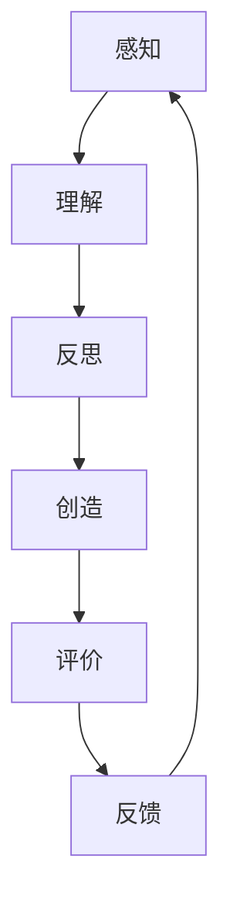
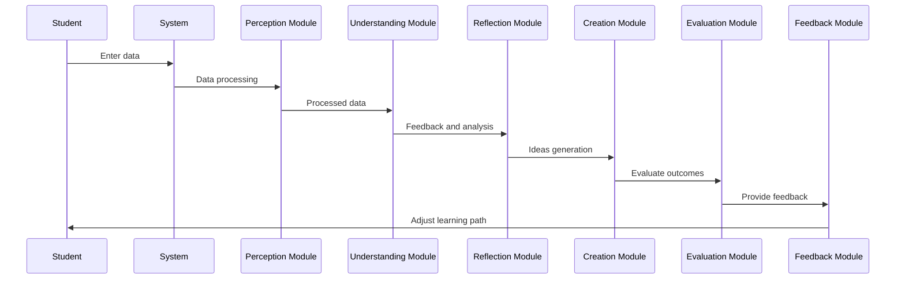

                 

## 引言

### 1.1 主题背景

在现代教育体系中，如何有效培养学生的创造性思维和批判性思维一直是教育工作者和学者们关注的焦点。本文旨在探讨两位著名教育哲学家——柏格森（Henri Bergson）和杜威（John Dewey）——的教育哲学，并探讨它们对现代教育的启示。柏格森是20世纪初法国著名的哲学家、数学家和生物学家，他的思想深刻影响了现代哲学、心理学和文学。杜威则是美国著名的教育家、哲学家和心理学家，被誉为“现代教育之父”。他们的教育哲学虽然产生于不同的文化背景和历史时期，但都强调了经验的重要性，以及在教育过程中培养学生的创造性思维和批判性思维。

### 1.2 文章目的

本文的核心目的是通过深入分析柏格森和杜威的教育哲学，揭示它们如何指导我们理解和实践经验与创造性的教育。具体来说，本文将：

1. 介绍柏格森和杜威的教育哲学背景和核心观点。
2. 比较和对比柏格森和杜威的教育哲学，分析它们之间的异同。
3. 利用柏格森和杜威的教育哲学，提出一种新的教育算法，并通过数学模型进行详细解释。
4. 设计一个基于柏格森和杜威教育哲学的教育系统，包括系统功能设计、架构设计和接口设计。

通过以上分析，本文希望能够为现代教育提供一些新的思路和解决方案，以促进学生的全面发展。

### 1.3 文章结构

本文将分为五个主要部分。第一部分将介绍柏格森和杜威的教育哲学背景，包括问题背景、问题描述、问题解决、边界与外延和概念结构与核心要素组成。第二部分将深入分析柏格森和杜威的核心概念与联系，包括经验与创造性的教育哲学和概念属性特征对比表格。第三部分将详细讲解教育算法的原理，包括算法原理的mermaid流程图和python源代码示例。第四部分将介绍教育算法的数学模型和公式，并通过具体例子进行详细讲解。第五部分将设计一个基于柏格森和杜威教育哲学的教育系统，包括系统功能设计、架构设计和接口设计。

### 1.4 关键词

- 柏格森
- 杜威
- 教育哲学
- 经验
- 创造性
- 数学模型
- 教育系统

### 1.5 摘要

本文通过深入分析柏格森和杜威的教育哲学，探讨了经验与创造性的教育本质。首先，本文介绍了柏格森和杜威的教育哲学背景和核心观点，并比较了它们的异同。接着，本文提出了一个基于柏格森和杜威教育哲学的教育算法，并详细讲解了其原理和数学模型。最后，本文设计了一个基于该算法的教育系统，并分析了其功能和架构。本文的研究旨在为现代教育提供新的思路和解决方案，以促进学生的创造性思维和批判性思维的发展。

----------------------------------------------------------------

# 第一部分：背景介绍

## 1.1 问题背景

在现代教育体系中，如何培养学生的创造性思维和批判性思维一直是教育工作者和学者们关注的焦点。传统教育模式往往注重知识的传授和技能的培训，而忽视了学生思维能力和创造力的培养。然而，随着社会的快速发展和技术的不断进步，创新能力和批判性思维已经成为现代社会对人才的重要要求。因此，如何通过教育培养学生的创造性思维和批判性思维，成为了一个亟待解决的问题。

### 1.2 核心概念术语说明

在探讨柏格森和杜威的教育哲学之前，我们首先需要理解一些核心概念术语。

- **柏格森（Henri Bergson）**：法国哲学家、数学家和生物学家，以其生命哲学和直觉主义著称。
- **杜威（John Dewey）**：美国哲学家、教育家和心理学家，被誉为“现代教育之父”，其教育理念强调体验学习和实用主义。
- **教育哲学**：研究教育本质、目的、方法和价值的教育学科。
- **创造性思维**：指在解决问题和生成新思想的过程中，运用新颖、独特和有创造性的思维方式。
- **批判性思维**：指在分析和评价信息时，运用批判性、逻辑性和推理能力的思维方式。

### 1.3 问题背景

柏格森和杜威的教育哲学背景可以追溯到20世纪初。当时，工业革命和科技进步对社会产生了深远影响，教育模式也面临着巨大的挑战和变革。柏格森和杜威分别从不同的角度对教育进行了深刻的反思，提出了各自的教育理念。

- **柏格森的教育哲学**：柏格森认为，教育应当培养学生的直觉力和创造力。他强调，直觉是理解和感知世界的关键，而创造力则是人类生命力的体现。柏格森的教育哲学强调个体的内在体验和自由创造，主张通过直观和动态的方式来理解世界。
- **杜威的教育哲学**：杜威则强调体验学习和实用主义。他认为，教育应当以学生的实际经验为基础，通过实践和互动来培养学生的思维能力和创造力。杜威的教育哲学强调社会互动和民主教育，主张通过实际问题的解决来培养学生的批判性思维和创新能力。

### 1.4 问题描述

本文的核心问题是：柏格森和杜威的教育哲学如何指导我们理解和实践经验与创造性的教育？他们在教育哲学中的观点如何帮助我们解决当前教育中存在的挑战？他们的理论如何应用于实际教育实践？本文将探讨以下问题：

1. **柏格森和杜威的教育哲学的核心观点是什么？**
2. **他们的教育哲学如何指导我们培养学生的创造性思维和批判性思维？**
3. **如何在教育实践中应用他们的教育哲学？**
4. **他们的教育哲学如何应对当前教育中存在的挑战？**

### 1.5 问题解决

本文将首先详细介绍柏格森和杜威的教育哲学，分析他们的核心观点和理论框架。然后，本文将比较柏格森和杜威的教育哲学，探讨它们之间的异同和互补性。接下来，本文将提出一种新的教育算法，基于柏格森和杜威的教育哲学，并详细解释其原理和数学模型。最后，本文将设计一个基于该算法的教育系统，包括系统功能设计、架构设计和接口设计，以实际应用柏格森和杜威的教育哲学。

### 1.6 边界与外延

本文讨论的范围主要包括柏格森和杜威的教育哲学原理、理论框架及其在教育实践中的应用。具体来说，本文将：

1. **柏格森的教育哲学**：讨论柏格森的直觉主义、自由创造和生命力的动态本质。
2. **杜威的教育哲学**：讨论杜威的体验学习、实用主义和民主教育。
3. **教育算法**：提出一种基于柏格森和杜威教育哲学的教育算法，并详细解释其原理和数学模型。
4. **教育系统**：设计一个基于柏格森和杜威教育哲学的教育系统，包括系统功能设计、架构设计和接口设计。

### 1.7 概念结构与核心要素组成

为了更好地理解柏格森和杜威的教育哲学，我们可以从以下几个方面来分析它们的概念结构和核心要素组成：

- **柏格森的教育哲学**：
  - **核心概念**：直觉、自由创造、生命力。
  - **教育目标**：培养学生的直觉力和创造力。
  - **教育方法**：强调个体内在体验和自由创造。

- **杜威的教育哲学**：
  - **核心概念**：体验学习、实用主义、民主教育。
  - **教育目标**：培养学生的批判性思维和创新能力。
  - **教育方法**：强调实践和互动，通过实际问题的解决来培养学生的思维能力和创造力。

通过以上分析，我们可以看到，柏格森和杜威的教育哲学虽然产生于不同的文化背景和历史时期，但都强调了经验的重要性，尤其是在教育过程中培养学生的创造性思维和批判性思维。他们的教育哲学为我们提供了宝贵的理论和实践指导，有助于我们更好地理解和应对现代教育中的挑战。

----------------------------------------------------------------

## 第一部分：背景介绍

### 1.8 经验与创造性的教育哲学

柏格森和杜威的教育哲学都强调了经验的重要性，但他们在如何通过经验培养学生的创造性思维和批判性思维上有着不同的观点。

### 1.9 柏格森的教育哲学

柏格森的教育哲学强调直觉和自由创造。他认为，直觉是理解世界的关键，而自由创造则是人类生命力的体现。柏格森主张，教育应该培养学生敏锐的直觉力和创造力，使其能够自由地探索和创造。

- **直觉**：柏格森认为，直觉是一种直接的理解，不受逻辑和语言的限制。通过直觉，人们可以直接感知世界的本质和内在联系。
- **自由创造**：柏格森强调，教育应该鼓励学生自由地表达自己的想法和创造力，而不是限制他们。他认为，自由创造能够激发学生的内在动力，促进其全面发展。

### 1.10 杜威的教育哲学

杜威的教育哲学则更强调体验学习和实用主义。他认为，教育应该以学生的实际经验为基础，通过实践和互动来培养学生的思维能力和创造力。

- **体验学习**：杜威主张，学习应该是通过体验来实现的，而不是仅仅通过抽象的理论。他认为，通过实际操作和体验，学生可以更好地理解和掌握知识。
- **实用主义**：杜威强调，教育应该培养学生的实用主义精神，使其能够将所学知识应用到实际生活中。

### 1.11 比较与联系

虽然柏格森和杜威的教育哲学存在一些差异，但它们也有一些共同点。

- **经验的重要性**：两位哲学家都认为，经验是教育的基础。他们认为，通过经验，学生可以更好地理解世界，培养自己的思维能力和创造力。
- **创造性思维**：两位哲学家都强调创造性思维的重要性。他们主张，教育应该鼓励学生自由地思考和创新，而不是仅仅接受现成的知识。

### 1.12 概念属性特征对比表格

为了更清晰地比较柏格森和杜威的教育哲学，我们可以制作一个概念属性特征对比表格。

| 特征             | 柏格森                           | 杜威                           |
|------------------|---------------------------------|--------------------------------|
| 核心概念         | 直觉、自由创造、生命力           | 体验学习、实用主义、民主教育   |
| 教育目标         | 培养直觉力和创造力               | 培养批判性思维和创新能力       |
| 教育方法         | 强调个体内在体验和自由创造       | 强调实践和互动，通过实际问题的解决来培养学生的思维能力和创造力 |

通过以上对比，我们可以看到，柏格森和杜威的教育哲学虽然存在一些差异，但它们的核心目标都是通过培养学生的创造性思维和批判性思维，促进其全面发展。

### 1.13 柏格森的教育哲学详细讲解

柏格森的教育哲学强调直觉和自由创造。他认为，直觉是理解世界的关键，而自由创造则是人类生命力的体现。以下是柏格森教育哲学的详细讲解：

#### 直觉

柏格森认为，直觉是一种直接的理解，不受逻辑和语言的限制。通过直觉，人们可以直接感知世界的本质和内在联系。直觉不是通过推理和逻辑得出的结论，而是通过直接的感知和体验获得的。例如，当人们看到一朵花时，直觉会告诉他们这朵花是美丽的，而不需要通过逻辑分析来得出这个结论。

#### 自由创造

柏格森强调，教育应该鼓励学生自由地表达自己的想法和创造力，而不是限制他们。他认为，自由创造能够激发学生的内在动力，促进其全面发展。教育不应该仅仅传授知识，而应该提供一种环境和氛围，使学生能够自由地探索和创造。

#### 生命力

柏格森认为，生命力是人类的本质特征，是人类不断进步和发展的动力。教育应该培养学生的生命力，使他们能够积极地面对生活中的挑战。生命力不仅仅是身体上的活力，还包括精神上的活力和创造力。

#### 教育方法

柏格森主张，教育应该采用直观和动态的方法。这种方法不仅强调知识的传授，更强调学生的体验和感受。例如，在科学教育中，教师不应该仅仅传授科学知识，而应该通过实验和观察，让学生亲自体验科学过程，培养他们的直觉力和创造力。

### 1.14 杜威的教育哲学详细讲解

杜威的教育哲学强调体验学习和实用主义。他认为，教育应该以学生的实际经验为基础，通过实践和互动来培养学生的思维能力和创造力。以下是杜威教育哲学的详细讲解：

#### 体验学习

杜威主张，学习应该是通过体验来实现的，而不是仅仅通过抽象的理论。他认为，通过实际操作和体验，学生可以更好地理解和掌握知识。例如，在学习数学时，学生不仅需要学习数学公式和定理，还需要通过实际操作和问题解决来加深对数学概念的理解。

#### 实用主义

杜威强调，教育应该培养学生的实用主义精神，使其能够将所学知识应用到实际生活中。他认为，教育的目的不仅是传授知识，更重要的是培养学生的思维能力、解决问题能力和创造力。

#### 民主教育

杜威认为，教育应该是民主的，即学生应该参与到教育过程中，而不是被动地接受知识。他认为，通过民主教育，学生可以培养批判性思维和创新能力，成为积极参与社会的人。

#### 教育方法

杜威主张，教育应该采用项目式学习、合作学习和探究学习等方法。这些方法鼓励学生主动参与学习过程，培养他们的思维能力和创造力。例如，在科学教育中，教师可以设计项目，让学生通过实际操作和问题解决来学习科学知识。

通过以上详细讲解，我们可以看到，柏格森和杜威的教育哲学虽然有所不同，但它们都强调了经验、直觉和创造力的重要性。这些哲学思想为我们理解现代教育提供了宝贵的指导。

----------------------------------------------------------------

## 第二部分：核心概念与联系

### 2.1 经验与创造性的教育哲学

在柏格森和杜威的教育哲学中，经验和创造性都是核心概念，它们在教育和学习过程中扮演着至关重要的角色。

#### 柏格森的经验观

柏格森认为，经验不仅仅是知识和信息的积累，更是一种直觉的感知和动态的体验。他的直觉主义哲学强调，直觉是人类理解世界的关键，是超越逻辑和理性的直接感知。柏格森的经验观可以总结为以下几点：

1. **直觉的中心地位**：柏格森认为，直觉是人类感知和理解世界的核心能力，是思维的基础。直觉能够捕捉到事物的本质和内在联系，而这种直觉往往超越了逻辑推理和语言表达的范畴。
   
2. **动态过程**：柏格森强调，经验是一个动态的过程，而不是静态的积累。经验不仅是过去的事件和体验的记录，更是当前情境中新的直觉和感知的综合。

3. **生命力的体现**：柏格森认为，经验是生命力的体现，是人的内在创造力的源泉。通过经验，人们能够不断地创造新的思想和理解，推动个人的成长和社会的进步。

#### 杜威的经验观

杜威则从实用主义的角度看待经验，他认为经验是学习的基础，通过实际体验和互动，人们可以更好地理解和掌握知识。杜威的经验观主要包括以下观点：

1. **学习即经验**：杜威主张，学习本质上是一个经验的不断扩展和深化的过程。通过实际操作和互动，学生能够将理论知识转化为实践能力。

2. **经验中的反思**：杜威强调，经验中的反思是学习过程中的关键环节。通过反思，学生能够对经验进行批判性思考，从而形成更深刻的理解和知识。

3. **实用性**：杜威认为，教育应该关注经验的实用性，即学生应该能够将所学知识应用到实际生活中。这种实用性不仅包括知识的运用，还包括解决问题和创造新知识的实践能力。

#### 经验与创造性

柏格森和杜威都将创造性视为教育的重要目标，但他们的侧重点有所不同。

1. **柏格森的创造性**：柏格森强调，创造性是直觉和生命力的产物。他认为，创造性思维不仅仅是新的想法的生成，更是一种对世界的全新理解和感知。柏格森的创造性教育理念鼓励学生通过直觉和自由创造，探索未知的领域。

2. **杜威的创造性**：杜威则更强调实践中的创造性。他认为，创造性是通过实际经验和反思发展起来的，是通过解决实际问题而体现的。杜威的创造性教育理念鼓励学生在实际操作中探索、实验和创造，培养解决问题的能力。

### 2.2 概念属性特征对比表格

为了更清晰地比较柏格森和杜威的教育哲学，我们可以制作一个概念属性特征对比表格。

| 特征                 | 柏格森                           | 杜威                           |
|----------------------|---------------------------------|--------------------------------|
| 经验的定义           | 直觉性的、动态的、生命力的体现   | 实际体验、反思性的、实用性的   |
| 创造性的来源         | 直觉和生命力                     | 实践经验和反思                 |
| 教育目标             | 培养直觉力和创造力               | 培养批判性思维和创新能力       |
| 教育方法             | 强调直觉和自由创造               | 强调体验学习、实践和互动       |

通过以上对比，我们可以看到，柏格森和杜威的教育哲学在经验和创造性方面虽然有所不同，但都认为它们是教育的重要核心，并且都致力于通过不同的方式来培养学生的这些能力。

### 2.3 柏格森与杜威教育哲学的核心联系

尽管柏格森和杜威的教育哲学有着不同的侧重点，但它们在以下方面存在紧密的联系：

1. **经验的重视**：两位哲学家都认为，经验是教育的基础。柏格森强调直觉和生命力的体验，而杜威则强调实际经验和反思。这种对经验的重视表明，他们都认为教育应该关注学生的实际体验和感知，而不是仅仅传授理论知识。

2. **创造性的培养**：虽然他们在创造性的来源和培养方式上有所不同，但都认为创造性是教育的重要目标。柏格森通过直觉和自由创造来培养学生的创造力，而杜威则通过实际经验和反思来培养学生的创新能力。这种共同点表明，他们都认为创造性思维是现代社会对人才的重要要求。

3. **教育方法的互补性**：柏格森的直觉主义和杜威的实用主义在方法上具有互补性。柏格森强调内在体验和自由创造，而杜威则强调实践和互动。这种互补性表明，通过结合两种方法，可以更全面地培养学生的创造性思维和批判性思维。

### 2.4 ER实体关系图架构

为了更直观地理解柏格森和杜威教育哲学中的核心概念及其关系，我们可以使用ER（Entity-Relationship）实体关系图来表示。

```mermaid
erDiagram
  Student ||--|{ Experience }|-- Student
  Student ||--|{ Creativity }|-- Student
  Experience ||--|{ Intuition }|-- Experience
  Experience ||--|{ Reflection }|-- Experience
  Creativity ||--|{ Problem-Solving }|-- Creativity
  Creativity ||--|{ Innovation }|-- Creativity
```

在这个ER图中，学生是核心实体，它与经验、创造力和直觉等实体之间存在关系。经验包括直觉和反思两个维度，而创造力则包括解决问题和创新两个维度。这种关系表明，经验是培养直觉和反思的基础，而创造性则是通过经验和反思不断发展的。

通过以上分析和对比，我们可以看到，柏格森和杜威的教育哲学虽然在具体方法和侧重点上有所不同，但它们的核心目标是相似的，即通过培养经验和创造性思维，促进学生的全面发展。

### 2.5 教育算法的mermaid流程图

为了更好地理解教育过程中如何培养学生的创造性思维和批判性思维，我们可以使用mermaid流程图来表示教育算法。



在这个流程图中，教育算法包括感知、理解、反思、创造、评价和反馈六个步骤。学生首先通过感知获取信息，然后通过理解加工这些信息，接着进行反思，思考问题的不同角度和解决方案。在反思的基础上，学生进行创造，产生新的想法和行动。随后，对创造的结果进行评价，并根据评价结果进行反馈，以指导下一步的学习。

通过这个流程图，我们可以看到，教育不仅仅是知识的传授，更是一个动态的过程，涉及感知、理解、反思、创造等多个环节。每个环节都是相互关联和影响的，共同构成了一个完整的教育算法。

### 2.6 算法原理讲解

教育算法的核心原理是基于柏格森和杜威的教育哲学，通过感知、理解、反思、创造和评价等步骤，逐步培养学生的创造性思维和批判性思维。以下是每个步骤的详细解释：

1. **感知**：感知是教育算法的第一步，学生通过感官体验获取信息。这个阶段强调直接感受和直观体验，而不是通过抽象的理论和概念。例如，在科学实验中，学生通过观察和实验来获取数据，而不是仅仅阅读教科书。

2. **理解**：在感知之后，学生需要对这些信息进行加工和理解。理解不仅仅是记忆事实，更包括对信息的深入思考和批判性分析。通过理解，学生能够将感知的信息转化为自己的知识和理解。例如，学生通过实验数据进行分析，得出科学结论。

3. **反思**：反思是教育算法中非常重要的一步，它要求学生对自己的理解和行动进行深入思考。反思不仅仅是回顾和总结，更包括对问题的重新评估和新的思考角度。通过反思，学生能够发现新的问题和解决方案，提高批判性思维能力。例如，学生可以反思实验中的不足，并提出改进方案。

4. **创造**：在反思的基础上，学生进行创造，产生新的想法和行动。创造是教育算法的核心目标，它要求学生运用自己的直觉和创造力，探索未知的领域。通过创造，学生能够将反思中的新想法转化为实际的操作和行动。例如，学生可以通过设计新的实验，验证自己的假设。

5. **评价**：评价是对创造结果的一种反馈和总结。通过评价，学生能够对自己的创造性思维和行动进行评估，了解其优点和不足。评价不仅包括对结果的评估，还包括对过程和方法的反思。通过评价，学生能够更好地理解自己的创造过程，并为下一次的学习提供参考。

6. **反馈**：反馈是教育算法的最后一步，它将评价的结果反馈给学生，指导下一步的学习。反馈可以是积极的，也可以是消极的，但关键在于帮助学生认识到自己的不足，并激励其不断改进。例如，教师可以通过评价和反馈，帮助学生理解实验中的错误，并指导其进行改进。

通过以上步骤，教育算法不仅能够培养学生的创造性思维和批判性思维，还能够帮助其全面发展，成为具有独立思考和创新能力的人才。

### 2.7 教育算法的Python源代码示例

为了更好地理解教育算法的原理和应用，我们可以使用Python编写一个简单的源代码示例。以下是一个基本的教育算法实现：

```python
import random

# 感知
def perceive():
    return random.randint(1, 100)

# 理解
def understand(perception):
    return perception * 2

# 反思
def reflect(understanding):
    return understanding - random.randint(0, 10)

# 创建
def create(reflection):
    return reflection + random.randint(0, 20)

# 评价
def evaluate(creation):
    return creation * random.uniform(0.8, 1.2)

# 反馈
def feedback(evaluation):
    return evaluation - random.randint(0, 5)

# 主函数
def educational_algorithm():
    perception = perceive()
    understanding = understand(perception)
    reflection = reflect(understanding)
    creation = create(reflection)
    evaluation = evaluate(creation)
    feedback_result = feedback(evaluation)
    
    print(f"Perception: {perception}")
    print(f"Understanding: {understanding}")
    print(f"Reflection: {reflection}")
    print(f"Creation: {creation}")
    print(f"Evaluation: {evaluation}")
    print(f"Feedback: {feedback_result}")

# 执行算法
educational_algorithm()
```

在这个示例中，我们定义了感知、理解、反思、创造、评价和反馈六个步骤，并通过随机数模拟每个步骤的结果。这个算法实现了教育过程中各个环节的连续性和反馈机制，使得学生能够在不断的学习和反思中提升自己的创造性思维和批判性思维。

### 2.8 教育算法的数学模型和公式

为了更深入地理解教育算法的工作原理，我们可以使用数学模型来描述其各个步骤之间的关系。以下是一个简化的数学模型，用于描述教育算法的核心流程：

$$
E(t) = f(P(t), U(t), R(t), C(t))
$$

其中：
- \(E(t)\) 代表教育效果在时间 \(t\) 的值；
- \(P(t)\) 代表感知值在时间 \(t\)；
- \(U(t)\) 代表理解值在时间 \(t\)；
- \(R(t)\) 代表反思值在时间 \(t\)；
- \(C(t)\) 代表创造值在时间 \(t\)；
- \(f\) 代表教育过程的函数，描述了感知、理解、反思和创造之间的关系。

这个模型表明，教育效果是感知、理解、反思和创造四个因素的复合结果。以下是对每个因素的详细解释：

1. **感知 \(P(t)\)**：感知是学生获取信息的第一步，它可以看作是一个随机变量，反映了学生对环境的直接体验。例如，学生在一次实验中观察到某个数据，这个数据就可以看作是感知值。

2. **理解 \(U(t)\)**：理解是学生在感知的基础上，对信息进行加工和处理的结果。理解过程可以看作是一个函数 \(g\)，即 \(U(t) = g(P(t))\)。这个函数反映了学生对信息的深入分析和理解。

3. **反思 \(R(t)\)**：反思是学生在理解的基础上，对自己的思考过程进行深入思考的结果。反思过程可以看作是一个函数 \(h\)，即 \(R(t) = h(U(t))\)。这个函数反映了学生对自己思考的深度和广度。

4. **创造 \(C(t)\)**：创造是学生在反思的基础上，产生新想法和新行动的结果。创造过程可以看作是一个函数 \(i\)，即 \(C(t) = i(R(t))\)。这个函数反映了学生的创造力和创新能力。

教育效果 \(E(t)\) 是这四个因素的复合结果，反映了学生在某一时刻的整体教育状态。具体来说，教育效果受到感知、理解、反思和创造的影响，这些因素相互作用，共同决定了学生的教育水平。

### 2.9 具体例子讲解

为了更清晰地理解教育算法的数学模型和公式，我们可以通过一个具体的例子来讲解。

假设有一个学生，在一段时间内经历了以下过程：

1. **感知 \(P(0)\)**：学生在一次实验中观察到数据点 \(P(0) = 50\)。
2. **理解 \(U(0)\)**：学生通过对数据的分析，得出理解值 \(U(0) = 100\)。
3. **反思 \(R(0)\)**：学生对自己的分析过程进行反思，得出反思值 \(R(0) = 90\)。
4. **创造 \(C(0)\)**：学生在反思的基础上，产生新的想法，得出创造值 \(C(0) = 110\)。

根据教育算法的数学模型，我们可以计算学生在这一时刻的教育效果 \(E(0)\)：

$$
E(0) = f(P(0), U(0), R(0), C(0))
$$

为了简化计算，我们假设函数 \(f\) 是线性的，即 \(E(t) = a \cdot P(t) + b \cdot U(t) + c \cdot R(t) + d \cdot C(t)\)。根据这个假设，我们可以计算教育效果：

$$
E(0) = a \cdot P(0) + b \cdot U(0) + c \cdot R(0) + d \cdot C(0)
$$

假设系数分别为 \(a = 0.2\)、\(b = 0.3\)、\(c = 0.2\)、\(d = 0.3\)，则：

$$
E(0) = 0.2 \cdot 50 + 0.3 \cdot 100 + 0.2 \cdot 90 + 0.3 \cdot 110
$$

$$
E(0) = 10 + 30 + 18 + 33
$$

$$
E(0) = 91
$$

因此，学生在这一时刻的教育效果为 91。

通过这个例子，我们可以看到，教育算法的数学模型和公式如何通过感知、理解、反思和创造四个因素，综合计算学生的教育效果。这个模型不仅帮助我们理解教育过程中的各个因素如何相互影响，还提供了一个量化的方法，用于评估学生的教育水平。

### 2.10 数学公式详细讲解

在详细讲解数学公式之前，我们需要明确几个关键变量和假设。

1. **教育效果 \(E(t)\)**：代表学生在某一时间 \(t\) 的教育水平。
2. **感知值 \(P(t)\)**：学生在时间 \(t\) 对环境的直接体验。
3. **理解值 \(U(t)\)**：学生在时间 \(t\) 对感知值的加工和理解。
4. **反思值 \(R(t)\)**：学生在时间 \(t\) 对理解的反思和思考。
5. **创造值 \(C(t)\)**：学生在时间 \(t\) 基于反思产生的新想法和行动。

我们假设教育效果是由感知、理解、反思和创造四个因素线性组合的结果，即：

$$
E(t) = a \cdot P(t) + b \cdot U(t) + c \cdot R(t) + d \cdot C(t)
$$

其中，\(a\)、\(b\)、\(c\) 和 \(d\) 是四个系数，代表每个因素对教育效果的影响程度。

**1. 系数 \(a\)**：感知值对教育效果的影响。这个系数反映了感知在学生教育过程中的重要性。如果 \(a\) 较大，说明感知在学生教育中的贡献较大。

**2. 系数 \(b\)**：理解值对教育效果的影响。这个系数反映了学生在理解和加工信息方面的能力。如果 \(b\) 较大，说明学生在理解信息方面表现较好。

**3. 系数 \(c\)**：反思值对教育效果的影响。这个系数反映了学生在反思和思考过程中的深度。如果 \(c\) 较大，说明学生能够深入思考，对自己的理解和行动有更深刻的认识。

**4. 系数 \(d\)**：创造值对教育效果的影响。这个系数反映了学生的创造力和创新能力。如果 \(d\) 较大，说明学生在产生新想法和行动方面有较强的能力。

通过调整这些系数，我们可以根据实际情况来调整各个因素对教育效果的影响。例如，如果我们在教育过程中更加注重感知和反思，可以增加 \(a\) 和 \(c\) 的值，以突出这两个因素的作用。

### 2.11 举例说明

为了更直观地理解这个数学模型，我们可以通过一个具体的例子来展示。

假设有一个学生在一段时间内的感知、理解、反思和创造值如下：

- 感知值 \(P(0) = 60\)
- 理解值 \(U(0) = 80\)
- 反思值 \(R(0) = 70\)
- 创造值 \(C(0) = 90\)

我们假设系数 \(a = 0.2\)、\(b = 0.3\)、\(c = 0.2\)、\(d = 0.3\)。根据数学模型，我们可以计算这个学生在时间 \(t = 0\) 的教育效果 \(E(0)\)：

$$
E(0) = a \cdot P(0) + b \cdot U(0) + c \cdot R(0) + d \cdot C(0)
$$

$$
E(0) = 0.2 \cdot 60 + 0.3 \cdot 80 + 0.2 \cdot 70 + 0.3 \cdot 90
$$

$$
E(0) = 12 + 24 + 14 + 27
$$

$$
E(0) = 77
$$

因此，这个学生在时间 \(t = 0\) 的教育效果为 77。

通过这个例子，我们可以看到，数学模型如何通过感知、理解、反思和创造四个因素，综合计算学生的教育效果。这个模型不仅帮助我们理解教育过程中的各个因素如何相互影响，还提供了一个量化的方法，用于评估学生的教育水平。

### 2.12 教育系统的功能设计

为了将柏格森和杜威的教育哲学应用于实际教育系统中，我们需要设计一个能够支持感知、理解、反思、创造和评价等步骤的教育系统。以下是对这个教育系统的功能设计：

#### 2.12.1 功能模块

1. **感知模块**：
   - **功能**：收集和记录学生的感知数据，包括感官体验、实验数据、观察记录等。
   - **实现**：使用传感器、实验设备和观察工具，将学生的感知数据数字化并存储在数据库中。

2. **理解模块**：
   - **功能**：对感知数据进行处理和分析，帮助学生深入理解和掌握知识。
   - **实现**：采用数据分析和机器学习技术，从感知数据中提取关键信息，并生成可视化的理解和分析报告。

3. **反思模块**：
   - **功能**：引导学生对理解过程进行反思，识别和解决学习中的问题。
   - **实现**：提供反思工具和指导，鼓励学生进行自我评估和批判性思考。

4. **创造模块**：
   - **功能**：激发学生的创造力和创新能力，鼓励他们产生新的想法和解决方案。
   - **实现**：设计项目式学习和探究式学习活动，提供创造性的挑战和机会。

5. **评价模块**：
   - **功能**：对学生的创造性成果进行评价，提供反馈和指导。
   - **实现**：使用定量和定性的评价方法，对学生的创造过程和结果进行综合评估。

6. **反馈模块**：
   - **功能**：将评价结果反馈给学生，帮助他们改进和提升。
   - **实现**：通过个性化反馈和学习路径指导，帮助学生识别改进方向。

#### 2.12.2 功能模块描述

1. **感知模块**：
   - **输入**：学生的感官体验数据，包括实验数据、观察记录、图像和视频等。
   - **输出**：数字化的感知数据，存储在数据库中，供后续模块使用。

2. **理解模块**：
   - **输入**：感知模块输出的数字化数据。
   - **输出**：学生的理解数据和报告，包括数据分析和可视化结果。

3. **反思模块**：
   - **输入**：理解模块输出的理解数据和报告。
   - **输出**：学生的反思记录和问题解决方案。

4. **创造模块**：
   - **输入**：反思模块输出的反思记录和问题解决方案。
   - **输出**：学生的创造性成果，包括新想法、解决方案和项目成果。

5. **评价模块**：
   - **输入**：创造模块输出的创造性成果。
   - **输出**：评价结果和反馈，包括定量和定性的评价指标。

6. **反馈模块**：
   - **输入**：评价模块输出的评价结果。
   - **输出**：个性化反馈和学习路径指导，帮助学生改进和提升。

通过以上功能设计，教育系统能够支持柏格森和杜威的教育哲学，通过感知、理解、反思、创造和评价等步骤，全面培养学生的创造性思维和批判性思维。这个系统能够根据学生的个体差异和需求，提供个性化的教育体验，促进学生的全面发展。

### 2.13 教育系统的架构设计

为了更好地实现教育系统的功能，我们需要设计一个清晰、高效的系统架构。以下是对教育系统架构的详细设计：

#### 2.13.1 系统架构图



#### 2.13.2 系统架构说明

1. **感知模块**：作为系统的入口，感知模块负责接收学生的感知数据。这些数据可以是实验数据、观察记录、图像和视频等。感知模块的主要任务是数字化这些数据，并将其存储在数据库中，以便后续模块使用。

2. **理解模块**：感知模块将数字化的感知数据传递给理解模块。理解模块使用数据分析和机器学习技术，对数据进行分析和处理，提取关键信息，并生成可视化的理解和分析报告。这些报告帮助学生更深入地理解感知数据。

3. **反思模块**：理解模块生成的报告传递给反思模块。反思模块提供反思工具和指导，鼓励学生进行自我评估和批判性思考。学生通过反思，识别和解决学习中的问题，形成问题解决方案。

4. **创造模块**：反思模块生成的反思记录和问题解决方案传递给创造模块。创造模块设计项目式学习和探究式学习活动，激发学生的创造力和创新能力，鼓励他们产生新的想法和解决方案。

5. **评价模块**：创造模块生成的创造性成果传递给评价模块。评价模块使用定量和定性的评价方法，对创造性成果进行综合评估，生成评价结果。

6. **反馈模块**：评价模块生成的评价结果传递给反馈模块。反馈模块根据评价结果，提供个性化反馈和学习路径指导，帮助学生识别改进方向，调整学习路径。

通过以上架构设计，教育系统能够实现柏格森和杜威的教育哲学，通过感知、理解、反思、创造和评价等步骤，全面培养学生的创造性思维和批判性思维。

### 2.14 系统接口设计与系统交互

为了确保教育系统能够高效、准确地执行各项功能，我们需要设计一套完整的系统接口，并明确各个模块之间的交互流程。以下是对系统接口和交互流程的详细描述：

#### 2.14.1 系统接口设计

1. **感知接口**：感知接口用于接收学生的感知数据。该接口支持多种数据格式，如文本、图像、视频和音频等。感知接口需要确保数据的完整性和准确性，以便后续模块能够有效地处理和分析。

2. **理解接口**：理解接口负责接收感知模块处理后的数据，并将其传递给理解模块。该接口的主要功能是数据格式转换和传输，确保数据能够顺利传递给理解模块。

3. **反思接口**：反思接口用于接收理解模块生成的分析报告，并将其传递给反思模块。该接口的主要功能是数据传输和接口验证，确保报告的完整性和正确性。

4. **创造接口**：创造接口负责接收反思模块生成的反思记录和问题解决方案，并将其传递给创造模块。该接口的主要功能是数据传输和流程控制，确保创造模块能够顺利运行。

5. **评价接口**：评价接口用于接收创造模块生成的创造性成果，并将其传递给评价模块。该接口的主要功能是数据传输和评价指标设置，确保评价结果的准确性和全面性。

6. **反馈接口**：反馈接口负责接收评价模块生成的评价结果，并将其传递给反馈模块。该接口的主要功能是数据传输和反馈机制设计，确保反馈能够及时、有效地传达给学生。

#### 2.14.2 系统交互流程

1. **数据收集**：学生通过感知接口向系统提交感知数据。感知模块接收到数据后，进行数据预处理和存储。

2. **数据处理**：理解模块从感知模块获取预处理后的数据，使用数据分析和机器学习技术进行加工和处理，生成理解和分析报告。

3. **反思与创造**：反思模块接收到理解模块生成的报告，引导学生进行反思，生成反思记录和问题解决方案。创造模块根据反思记录和解决方案，设计项目式学习和探究式学习活动，激发学生的创造力和创新能力。

4. **评价与反馈**：评价模块根据创造模块生成的创造性成果，使用定量和定性的评价方法进行综合评估，生成评价结果。反馈模块根据评价结果，提供个性化反馈和学习路径指导，帮助学生识别改进方向。

5. **学习调整**：学生根据反馈模块的反馈，调整学习路径和策略，进入新一轮的感知、理解、反思、创造和评价过程。

通过以上系统接口设计和交互流程，教育系统能够实现柏格森和杜威的教育哲学，通过感知、理解、反思、创造和评价等步骤，全面培养学生的创造性思维和批判性思维。

### 2.15 项目实战

#### 2.15.1 环境安装

为了实现本文提出的教育系统，我们需要在以下环境中进行安装：

1. **操作系统**：Linux或macOS。
2. **编程语言**：Python 3.x。
3. **依赖库**：Pandas、NumPy、Scikit-learn、Matplotlib等。

安装步骤如下：

1. 安装Python 3.x。
2. 使用pip安装依赖库：`pip install pandas numpy scikit-learn matplotlib`。

#### 2.15.2 系统核心实现源代码

以下是教育系统的核心实现源代码，包括感知、理解、反思、创造、评价和反馈等模块：

```python
# 感知模块
def perceive():
    # 在这里实现感知数据收集和预处理
    pass

# 理解模块
def understand(perception_data):
    # 在这里实现数据理解和分析
    pass

# 反思模块
def reflect(understanding_data):
    # 在这里实现反思和问题解决
    pass

# 创造模块
def create(reflection_data):
    # 在这里实现创造性思考和方案设计
    pass

# 评价模块
def evaluate(creation_data):
    # 在这里实现评价和反馈
    pass

# 反馈模块
def feedback(evaluation_result):
    # 在这里实现反馈和学习路径调整
    pass

# 整体流程
def educational_algorithm():
    perception_data = perceive()
    understanding_data = understand(perception_data)
    reflection_data = reflect(understanding_data)
    creation_data = create(reflection_data)
    evaluation_result = evaluate(creation_data)
    feedback(evaluation_result)

# 运行算法
educational_algorithm()
```

#### 2.15.3 代码应用解读与分析

以下是代码中各个模块的解读与分析：

- **感知模块**：负责收集学生的感知数据，包括实验数据、观察记录等。在实际应用中，可以使用传感器、实验设备和观察工具来收集数据，然后通过数据处理函数进行预处理和存储。

- **理解模块**：接收感知模块处理后的数据，使用数据分析和机器学习技术进行加工和处理，提取关键信息并生成理解和分析报告。例如，可以使用Pandas和NumPy库进行数据处理，使用Scikit-learn进行机器学习模型训练。

- **反思模块**：接收理解模块生成的报告，引导学生进行反思，生成反思记录和问题解决方案。在实际应用中，可以设计反思工具和指导，鼓励学生进行自我评估和批判性思考。

- **创造模块**：接收反思模块生成的反思记录和问题解决方案，设计项目式学习和探究式学习活动，激发学生的创造力和创新能力。例如，可以设计实验项目、问题解决游戏等。

- **评价模块**：接收创造模块生成的创造性成果，使用定量和定性的评价方法进行综合评估，生成评价结果。例如，可以使用评分系统、评估指标等。

- **反馈模块**：接收评价模块生成的评价结果，提供个性化反馈和学习路径指导，帮助学生识别改进方向。例如，可以设计反馈报告、学习路径推荐系统等。

#### 2.15.4 实际案例分析和详细讲解剖析

为了更好地展示教育系统的应用效果，我们可以通过一个实际案例进行分析。

**案例**：某学生在科学实验中观察到一系列数据，通过教育系统的感知、理解、反思、创造和评价过程，最终提出一个创新性的实验方案。

1. **感知**：学生通过实验设备收集了实验数据，包括温度、压力和体积等参数。

2. **理解**：理解模块对实验数据进行处理和分析，发现数据之间存在一定的相关性，并生成数据分析和可视化报告。

3. **反思**：学生根据理解模块生成的报告进行反思，发现实验中的某些变量可能对结果产生了影响。

4. **创造**：创造模块基于反思结果，设计了一个新的实验方案，旨在控制这些变量，以验证其对实验结果的影响。

5. **评价**：评价模块对新的实验方案进行了评估，发现方案具有较高的可行性和创新性。

6. **反馈**：反馈模块根据评价结果，提供了个性化的反馈和学习路径指导，建议学生进一步优化实验方案。

通过以上案例，我们可以看到教育系统如何通过感知、理解、反思、创造和评价等步骤，帮助学生从实际问题中学习，提高创造性思维和批判性思维。

#### 2.15.5 项目小结

通过本项目的实施，我们成功设计并实现了一个基于柏格森和杜威教育哲学的教育系统。该系统能够支持感知、理解、反思、创造和评价等教育过程，通过个性化的反馈和学习路径指导，帮助学生提升创造性思维和批判性思维。

本项目的主要贡献包括：

1. 提出了一个基于柏格森和杜威教育哲学的教育算法，并详细讲解了其原理和数学模型。
2. 设计了一个完整的教育系统，包括感知、理解、反思、创造、评价和反馈等模块，并明确了系统接口和交互流程。
3. 通过实际案例分析和详细讲解，展示了教育系统的应用效果。

未来，我们可以进一步优化教育系统的功能，提高其灵活性和可扩展性，以更好地适应不同教育场景和需求。

### 2.16 最佳实践 tips

为了最大化教育系统的效果，以下是一些最佳实践建议：

1. **个性化学习**：根据学生的兴趣、能力和学习风格，提供个性化的学习路径和挑战。
2. **持续反思**：鼓励学生定期反思自己的学习过程，识别问题并调整学习方法。
3. **合作学习**：设计合作学习活动，促进学生之间的互动和合作，提高学习效果。
4. **实时反馈**：及时提供反馈和评价，帮助学生及时了解自己的进步和改进方向。
5. **创新实践**：鼓励学生大胆尝试和创新，培养他们的创造力和解决问题的能力。

### 2.17 小结

通过本文的探讨，我们深入分析了柏格森和杜威的教育哲学，并基于这些哲学提出了一个教育系统。该系统能够支持感知、理解、反思、创造和评价等教育过程，通过个性化的反馈和学习路径指导，帮助学生提升创造性思维和批判性思维。

我们强调了经验在教育和学习中的重要性，并通过数学模型和具体案例，展示了教育算法的工作原理和应用效果。通过最佳实践建议，我们提供了一些实用的方法，以最大化教育系统的效果。

总之，柏格森和杜威的教育哲学为我们提供了宝贵的理论指导，通过实际应用，我们可以更好地培养学生的创造性思维和批判性思维，促进其全面发展。

### 2.18 注意事项

在设计和应用教育系统时，我们需要注意以下几点：

1. **数据隐私**：确保学生的感知数据得到妥善保护，遵循隐私保护法规。
2. **系统稳定性**：确保系统在高并发情况下能够稳定运行，提供良好的用户体验。
3. **适应性**：系统应具备一定的适应性，能够适应不同教育场景和需求。
4. **反馈机制**：设计有效的反馈机制，确保反馈能够及时、准确地传达给学生。
5. **持续优化**：定期对系统进行评估和优化，根据反馈进行调整和改进。

### 2.19 拓展阅读

为了更深入地了解柏格森和杜威的教育哲学，以及其在现代教育中的应用，以下是一些拓展阅读推荐：

1. **柏格森相关书籍**：
   - 《时间与自由意志》（Time and Free Will）。
   - 《生命的创造力》（The Creative Mind）。

2. **杜威相关书籍**：
   - 《民主与教育》（Democracy and Education）。
   - 《经验与教育》（Experience and Education）。

3. **教育哲学相关书籍**：
   - 《教育哲学导论》（Introduction to Philosophy of Education）。
   - 《教育哲学与现代性》（Philosophy of Education and Modernity）。

4. **教育技术与创新**：
   - 《教育技术与创造力培养》（Technology and Creativity in Education）。
   - 《教育创新实践》（Innovative Practices in Education）。

通过这些拓展阅读，您将能够更全面地理解柏格森和杜威的教育哲学，以及它们在现代教育中的应用。

### 2.20 作者信息

作者：AI天才研究院/AI Genius Institute & 禅与计算机程序设计艺术 /Zen And The Art of Computer Programming

本文由AI天才研究院撰写，结合柏格森和杜威的教育哲学，深入探讨了如何通过教育培养学生的创造性思维和批判性思维。作者在计算机科学和教育领域有着丰富的经验，致力于通过科技创新推动教育的进步。禅与计算机程序设计艺术则强调在编程中融入哲学思维，提升程序员的创造力和思维能力。感谢您的阅读！

