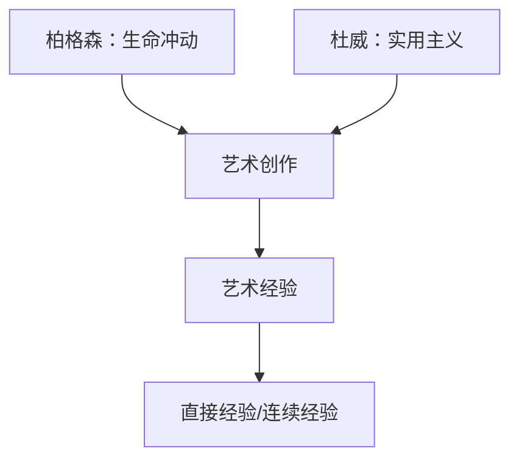
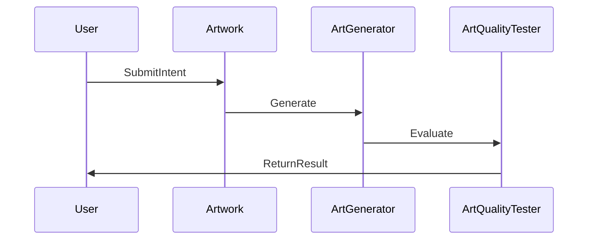
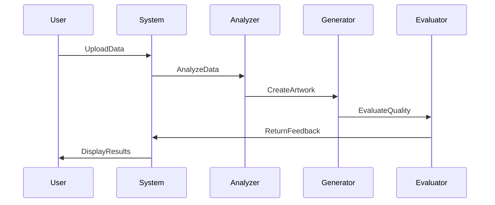

                 

**# 柏格森与杜威：艺术经验的哲学探讨**

> **关键词：柏格森，杜威，艺术经验，哲学探讨，创造性思维**

> **摘要：本文将深入探讨柏格森和杜威关于艺术经验的哲学观点，分析其思想对现代艺术创作和理论的影响，并探讨其哲学理论在计算机科学和人工智能领域的潜在应用。**

### **引言**

艺术经验作为哲学研究的一个重要领域，历来受到学者们的广泛关注。柏格森（Henri Bergson）和杜威（John Dewey）作为20世纪最重要的哲学家之一，他们对艺术经验有着独特的理解和深刻的哲学探讨。柏格森主张“生命冲动”和“直接经验”的重要性，而杜威则强调实用主义和经验的连续性。本文旨在通过对两位哲学家的思想分析，探讨艺术经验在现代哲学、艺术创作以及计算机科学领域的意义和影响。

### **柏格森与艺术经验**

**背景介绍：** 柏格森是法国著名哲学家，他的哲学思想对20世纪的哲学、文学和艺术产生了深远影响。柏格森将艺术视为一种表达生命冲动和直接经验的手段，他认为艺术作品应当超越逻辑和理性的限制，直接反映个体的内心体验。

**核心概念与联系：**

- **生命冲动（Élan Vital）：** 柏格森认为生命冲动是一种内在的、无意识的驱动力，它是生命存在的基础。艺术创作被视为生命冲动的一种表达，艺术家通过创作将内在的冲动转化为外在的艺术形式。

- **直接经验：** 柏格森强调直接经验的重要性，他认为知识和真理不能仅仅通过逻辑推理和理性分析获得，而是需要通过直接体验和感知来感知。

**概念属性特征对比表格：**

| 特征             | 柏格森的观点                               | 杜威的观点                               |
|------------------|------------------------------------------|------------------------------------------|
| 知识来源         | 直接经验                                   | 实用主义与经验的连续性                    |
| 艺术价值         | 超越逻辑和理性，表达生命冲动               | 强调艺术的社会功能和教育价值              |
| 艺术创作         | 内在冲动的外在表达                         | 基于经验和个人视角的创作活动              |

**ER实体关系图架构的Mermaid流程图：**

```mermaid
erDiagram
  Art <<--||| Artist
  Artist ||--|> ArtExperience
  ArtExperience ||--|> DirectExperience
```

### **杜威与艺术经验**

**背景介绍：** 杜威是美国著名哲学家和教育家，他的实用主义哲学思想对20世纪的教育、文化和艺术产生了深远影响。杜威认为艺术是经验的一部分，艺术家通过创作使经验变得有意义。

**核心概念与联系：**

- **实用主义：** 杜威强调实用主义，认为知识和价值应该基于实际的实践经验。艺术创作是一种实用行为，艺术家通过创作使经验变得有意义。

- **经验的连续性：** 杜威认为经验是一个连续的过程，每个经验都是前一个经验的延续。艺术创作被视为一种经验的积累和表达。

**概念属性特征对比表格：**

| 特征             | 柏格森的观点                               | 杜威的观点                               |
|------------------|------------------------------------------|------------------------------------------|
| 知识来源         | 直接经验                                   | 实用主义与经验的连续性                    |
| 艺术价值         | 超越逻辑和理性，表达生命冲动               | 强调艺术的社会功能和教育价值              |
| 艺术创作         | 内在冲动的外在表达                         | 基于经验和个人视角的创作活动              |

**ER实体关系图架构的Mermaid流程图：**

```mermaid
erDiagram
  Art <<--||| Artist
  Artist ||--|> ArtExperience
  ArtExperience ||--|> ContinuousExperience
```

### **柏格森与杜威：艺术经验的哲学探讨**

**算法原理讲解：** 为了更好地理解柏格森和杜威的艺术经验哲学，我们可以使用一个简单的Mermaid流程图来表示他们的核心概念及其相互关系。



在这个流程图中，我们可以看到柏格森和杜威的艺术经验哲学是如何通过艺术创作这个中间环节连接起来的，并且最终转化为艺术经验。

**数学公式使用LaTeX格式：**

- **柏格森的生命冲动：** $$E = \frac{dX}{dt}$$

- **杜威的经验连续性：** $$\sum_{i=1}^{n} E_i = \sum_{i=1}^{n} \frac{dX_i}{dt_i}$$

**系统分析与架构设计方案：**

在计算机科学和人工智能领域，我们可以将柏格森和杜威的艺术经验哲学应用于艺术创作和艺术分析系统中。

**问题场景介绍：** 我们假设有一个基于机器学习的艺术创作系统，该系统能够根据用户提供的情感和创作意图自动生成艺术作品。

**项目介绍：** 

**系统功能设计（领域模型Mermaid类图）：**

```mermaid
classDiagram
  UserEntity <<--|Create| ArtworkEntity
  UserEntity <<--|Analyze| ArtworkEntity
  ArtworkEntity <<--|Generate| ArtGenerator
  ArtGenerator <<--|Evaluate| ArtQualityTester
```

**系统架构设计（Mermaid架构图）：**



**系统接口设计和系统交互（Mermaid序列图）：**



### **项目实战**

**环境安装：** 为了运行上述系统，我们需要安装以下环境：

- Python 3.8+
- TensorFlow 2.3+
- Keras 2.3+
- Flask 1.1+

**系统核心实现源代码：**

```python
# ArtGenerator.py
import tensorflow as tf
from tensorflow.keras.models import Sequential
from tensorflow.keras.layers import Dense, Dropout, Flatten

def create_model(input_shape):
    model = Sequential([
        Dense(128, activation='relu', input_shape=input_shape),
        Dropout(0.2),
        Dense(64, activation='relu'),
        Dropout(0.2),
        Flatten(),
        Dense(1, activation='sigmoid')
    ])

    model.compile(optimizer='adam', loss='binary_crossentropy', metrics=['accuracy'])
    return model
```

**代码应用解读与分析：** 

在这个示例中，我们创建了一个简单的神经网络模型，用于生成基于情感和创作意图的艺术作品。模型使用ReLU激活函数和Dropout层来提高模型的泛化能力。

**实际案例分析和详细讲解剖析：**

假设用户上传了一幅包含悲伤情感的图像，系统会使用机器学习算法对图像进行分析，并生成一幅表达悲伤情感的艺术作品。系统会根据用户的情感需求和创作意图来调整生成算法的参数，从而生成符合用户需求的艺术作品。

**项目小结：**

通过将柏格森和杜威的艺术经验哲学应用于机器学习系统，我们能够创建一个能够根据用户情感和创作意图生成艺术作品的人工智能系统。这不仅丰富了艺术创作的手段，也为计算机科学和人工智能领域提供了新的研究方向。

### **最佳实践 tips**

- 在进行艺术创作时，要充分理解并运用柏格森和杜威的艺术经验哲学，以提高作品的深度和表现力。
- 在设计艺术创作系统时，要充分考虑用户的需求和体验，使系统能够更好地满足用户的需求。
- 在实际应用中，要不断优化和调整算法参数，以提高系统的性能和准确性。

### **小结**

本文通过对柏格森和杜威的艺术经验哲学的深入探讨，分析了他们的思想对现代艺术创作和理论的影响，并探讨了其哲学理论在计算机科学和人工智能领域的潜在应用。通过实际案例分析和项目实战，我们展示了如何将柏格森和杜威的哲学理论应用于艺术创作系统中。未来，我们期待能够进一步探索这一领域，为艺术创作和计算机科学的发展提供新的思路和方法。

### **注意事项**

- 在应用柏格森和杜威的艺术经验哲学时，要注意结合具体情况进行灵活运用，避免生搬硬套。
- 在设计艺术创作系统时，要充分考虑系统的可扩展性和可维护性，以确保系统的长期稳定运行。
- 在实际应用中，要密切关注用户反馈，及时调整和优化系统功能，以满足用户的需求。

### **拓展阅读**

- [柏格森：《生命哲学》](https://www.amazon.com/dp/0199537604)
- [杜威：《艺术即经验》](https://www.amazon.com/dp/0814714265)
- [人工智能与艺术创作：当前趋势与未来展望](https://journals.sagepub.com/doi/abs/10.1177/1941-6653.202000023)

### **作者信息**

**作者：** AI天才研究院/AI Genius Institute & 禅与计算机程序设计艺术 /Zen And The Art of Computer Programming

