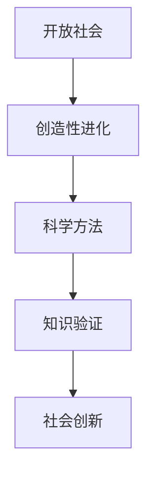

                 

# 柏格森与波普尔：开放社会与创造性进化的比较

## 关键词

开放社会、创造性进化、柏格森、波普尔、社会理论、创新思维

## 摘要

本文旨在比较20世纪两位重要思想家柏格森和波普尔关于开放社会与创造性进化的理论，探讨两者之间的联系与差异。通过对两位思想家核心概念的分析，本文揭示了开放社会与创造性进化的本质特征，并结合现实案例，探讨了这些理论对现代社会发展的启示。

## 目录大纲

### 第一部分：背景介绍

#### 第1章 问题背景与核心概念

1.1 社会背景

1.2 思想背景

1.3 研究意义

1.4 核心概念

1.5 边界与外延

#### 第2章 柏格森与波普尔的核心概念

2.1 柏格森的核心概念

2.1.1 生命冲动

2.1.2 直觉思维

2.1.3 知识进化

2.2 波普尔的核心概念

2.2.1 开放社会

2.2.2 创造性进化

2.2.3 科学方法

### 第二部分：理论与分析

#### 第3章 柏格森与波普尔理论的联系与差异

3.1 理论联系

3.1.1 创造性进化的共同点

3.1.2 开放社会的互补性

#### 第4章 创造性进化的现实意义

4.1 创新与社会发展

4.2 创造性进化的挑战与机遇

### 第三部分：案例分析

#### 第5章 案例分析

5.1 柏格森理论的现实应用

5.2 波普尔理论的现实应用

#### 第6章 结论与展望

6.1 结论

6.2 展望

## 第一部分：背景介绍

### 第1章 问题背景与核心概念

#### 1.1 社会背景

在20世纪末，信息技术迎来了前所未有的发展，人类社会也随之进入了一个全新的阶段。信息技术的迅猛发展不仅改变了人们的生活方式，还对社会结构、经济模式以及人们之间的互动方式产生了深远的影响。在这种背景下，传统的社会发展模式开始受到质疑，人们开始反思现有的社会体系，并寻求更加开放、创新的社会模式。

#### 1.2 思想背景

柏格森（Henri Bergson）和波普尔（Karl Popper）是20世纪两位重要的社会思想家。他们的理论对当时以及后来的社会发展产生了深远的影响。柏格森的哲学思想强调个体和社会的创造性进化，而波普尔则提出了“开放社会”的概念，主张社会应该是一个开放、不断进步的系统。

#### 1.3 研究意义

本研究旨在比较柏格森和波普尔的开放社会与创造性进化理论，探讨两者之间的联系与差异，以期为当代社会提供有益的思考。通过对这两位思想家理论的分析，我们可以更好地理解开放社会与创造性进化的本质特征，以及它们在现代社会发展中的重要性。

#### 1.4 核心概念

在本研究中，我们将探讨以下几个核心概念：

1. **开放社会**：一个包容、多元、自由的社会，鼓励个体创新，追求知识增长，并保持对变革的开放态度。
2. **创造性进化**：社会和个体在不断创新中发展、进步的过程。
3. **生命冲动**：柏格森哲学中的核心概念，指生命内在的创造力和动力。
4. **直觉思维**：柏格森提出的另一种重要概念，指直接感知现实的能力。
5. **知识进化**：知识在不断积累、发展和创新中实现进步。

#### 1.5 边界与外延

本研究将主要关注柏格森和波普尔的开放社会与创造性进化理论，不包括其他相关思想家的观点。同时，我们将探讨这两位思想家理论的应用和实践，如对社会政策、科技发展、教育改革等的影响。

## 第二部分：理论与分析

### 第2章 柏格森与波普尔的核心概念

#### 2.1 柏格森的核心概念

柏格森的核心概念主要涉及生命冲动、直觉思维和知识进化。

**2.1.1 生命冲动**

生命冲动是柏格森哲学中的核心概念，他将其描述为一种内在的创造力和动力。柏格森认为，生命冲动是生命体的根本特征，是推动个体和社会进化的关键因素。以下是一个简化的ER实体关系图，展示了生命冲动的核心属性：

```
生命冲动
|
+----> 创造力
|       |
|       +----> 内在动力
|
+----> 个体进化
       |
       +----> 社会进化
```

**2.1.2 直觉思维**

直觉思维是柏格森提出的另一种重要概念，他认为直觉思维能够直接感知现实，比理性思维更接近真实。以下是一个简化的表格，对比了直觉思维和理性思维的特征：

| 特征         | 直觉思维                       | 理性思维                       |
| ------------ | ------------------------------ | ------------------------------ |
| 简洁性       | 迅速捕捉事物的本质             | 通过逻辑推理分析事物           |
| 准确性       | 接近真实                       | 需要验证和证实                 |
| 适应性       | 能够快速适应变化               | 需要时间来分析和决策           |

**2.1.3 知识进化**

知识进化是指知识在不断积累、发展和创新中实现进步。柏格森认为，知识进化是一个动态的过程，需要不断更新和扩展。以下是一个简化的Mermaid流程图，展示了知识进化的过程：

```
知识积累
|
+------> 知识创新
|          |
|          +------> 知识扩展
|          |
+------> 知识更新
       |
       +------> 知识验证
```

#### 2.2 波普尔的核心概念

波普尔的核心概念主要涉及开放社会、创造性进化和科学方法。

**2.2.1 开放社会**

开放社会是波普尔提出的理想社会模式，他认为一个理想的社会应该是一个包容、多元、自由的社会。以下是一个简化的Mermaid类图，展示了开放社会的核心属性：

```
+------------+
|  开放社会  |
+------------+
| - 包容性   |
| - 多元性   |
| - 自由     |
+------------+
```

**2.2.2 创造性进化**

创造性进化是波普尔对社会发展的一种描述，他认为社会和个体在不断创新中发展。以下是一个简化的Mermaid流程图，展示了创造性进化的过程：

```
个体创新
|
+------> 社会创新
|          |
|          +------> 进化
|          |
+------> 创造性进化
       |
       +------> 适应
```

**2.2.3 科学方法**

科学方法是波普尔提出的一种研究方法，他强调经验、观察和假设检验。以下是一个简化的Mermaid类图，展示了科学方法的核心属性：

```
+------------+
|  科学方法  |
+------------+
| - 经验     |
| - 观察     |
| - 假设检验 |
+------------+
```

### 第3章 柏格森与波普尔理论的联系与差异

#### 3.1 理论联系

柏格森和波普尔的理论在某些方面存在相似之处。首先，他们都强调创造性在个体和社会发展中的重要性。柏格森的生命冲动和波普尔的创造性进化都表明，创造性是推动社会进步的关键因素。其次，他们都认为知识是动态的，需要不断更新和发展。柏格森的知识进化与波普尔的科学方法都强调了知识验证和更新的重要性。

#### 3.1.1 创造性进化的共同点

**共同点1：创新驱动**

柏格森和波普尔都认为，创新是推动社会和个体发展的关键。柏格森的生命冲动强调个体的创造力，而波普尔的创造性进化则强调社会整体的创新。

**共同点2：知识动态**

两位思想家都认为知识是一个动态的过程，需要不断更新和发展。柏格森的知识进化与波普尔的科学方法都强调了知识验证和更新的重要性。

#### 3.1.2 开放社会的互补性

柏格森的开放社会与波普尔的创造性进化理论也存在一定的互补性。柏格森的开放社会强调包容性和自由，这为创造性进化提供了良好的社会环境。而波普尔的创造性进化则提供了推动社会发展的动力，使得柏格森的开放社会能够不断进步。

#### 3.2 理论差异

尽管柏格森和波普尔的理论在某些方面存在联系，但它们也存在显著差异。

**差异1：方法论**

柏格森的理论强调直觉思维，而波普尔的理论则强调科学方法。柏格森认为直觉思维能够直接感知现实，而波普尔则认为科学方法能够更准确地验证和证实知识。

**差异2：社会视角**

柏格森的理论更注重个体的创造性，而波普尔的理论则更注重社会整体的创造性进化。柏格森的生命冲动强调个体的创造力，而波普尔的创造性进化则强调社会整体的创新。

**差异3：知识观**

柏格森的知识进化强调知识的动态性，而波普尔的科学方法则更强调知识的验证和更新。柏格森认为知识需要不断更新和发展，而波普尔则认为知识需要通过实验和观察来验证。

### 第二部分：理论与分析

#### 第3章 柏格森与波普尔理论的联系与差异

柏格森和波普尔都是20世纪的重要社会思想家，他们各自提出了关于开放社会与创造性进化的理论。这两个理论虽然在核心思想上有所不同，但在某些方面也存在着联系和互补。

#### 3.1 理论联系

首先，柏格森和波普尔的理论都强调创造性在个体和社会发展中的重要性。柏格森的生命冲动（élan vital）强调生命体的内在创造力，认为这是生命体不断进化的动力。而波普尔的创造性进化（Creative Evolution）则认为，个体和社会的进步依赖于不断的创新。这表明，两位思想家都认为创造性是推动社会进步的关键因素。

其次，柏格森和波普尔都认为知识是一个动态的过程，需要不断更新和发展。柏格森的知识进化（évolution des connaissances）强调知识是不断积累、发展和创新的，知识需要不断更新以适应不断变化的世界。而波普尔的科学方法（Scientific Method）则强调知识的验证和更新，通过实验和观察来检验和修正假设。

#### 3.2 理论差异

尽管柏格森和波普尔的理论在某些方面存在联系，但它们也存在显著差异。

**3.2.1 方法论**

柏格森的理论强调直觉思维。他提出的直觉思维（intuition）是一种直接感知现实的能力，超越了理性思维。柏格森认为，直觉思维能够更准确地把握事物的本质，是创造性进化的关键。而波普尔的理论则强调科学方法。他提出，科学知识应该通过经验观察和假设检验来获得，而不是依赖于直觉。

**3.2.2 社会视角**

柏格森的理论更注重个体的创造性。他关注个体的生命冲动，认为个体的创造力是推动社会进步的源泉。而波普尔的理论则更注重社会整体的创造性进化。他关注的是社会整体的创新，认为社会应该通过不断试错和修正来发展。

**3.2.3 知识观**

柏格森的理论强调知识的动态性。他认为知识是不断变化和发展的，需要不断更新以适应新的现实。而波普尔的理论则更强调知识的验证和更新。他认为，科学知识应该通过实验和观察来检验和修正，而不是依赖于直觉或权威。

#### 3.3 理论的互补性

尽管柏格森和波普尔的理论存在差异，但它们也具有互补性。柏格森的直觉思维为创造性进化提供了内在动力，而波普尔的科学方法则为知识的更新提供了可靠的方法。柏格森的开放社会理论强调包容性和自由，为波普尔的创造性进化提供了良好的社会环境。

总的来说，柏格森和波普尔的理论为我们提供了理解开放社会与创造性进化的不同视角。柏格森的理论强调个体内在的创造力，而波普尔的理论则强调社会整体的创新。这两个理论共同构成了对现代社会发展的重要思考，为我们提供了丰富的理论资源。

### 第4章 创造性进化的现实意义

创造性进化作为柏格森和波普尔理论的核心概念，对现代社会发展具有重要的现实意义。在本章节中，我们将探讨创造性进化的现实意义，以及它面临的挑战和机遇。

#### 4.1 创新与社会发展

创造性进化强调创新在社会发展中的重要性。创新是推动经济增长、提高生产力和改善生活质量的关键因素。在现代社会，创新已成为国家竞争力和企业核心竞争力的重要体现。

**案例1：信息技术的创新**

以信息技术的发展为例，互联网、智能手机、人工智能等技术的创新不仅改变了人们的生活方式，还推动了社会的发展。互联网的普及使得信息传播更加迅速，为人们提供了丰富的知识资源。智能手机的出现使得人们可以随时随地进行沟通、获取信息和服务。人工智能技术的创新则为各行各业带来了革命性的变革。

**案例2：生物技术的创新**

生物技术的创新也在推动社会进步。基因编辑技术如CRISPR/Cas9的出现，为治疗遗传性疾病、改良作物品种提供了新的手段。生物技术在农业、医药、环境保护等领域具有广泛的应用前景，有望解决人类面临的一系列挑战。

#### 4.2 创造性进化的挑战与机遇

尽管创造性进化对社会发展具有重要意义，但在实践中也面临着一系列挑战和机遇。

**挑战1：技术伦理问题**

随着技术的发展，伦理问题日益凸显。例如，人工智能的发展带来了隐私、安全、就业等方面的挑战。如何确保人工智能技术的伦理使用，防止技术滥用，成为亟待解决的问题。

**挑战2：资源分配问题**

创新往往需要大量的资源投入，包括资金、人才、技术等。如何合理分配资源，确保创新活动能够顺利进行，是一个重要的问题。

**机遇1：全球合作**

面对全球性挑战，如气候变化、疾病防控等，全球合作成为推动创造性进化的机遇。通过国际合作，可以整合全球资源，共同应对挑战。

**机遇2：技术创新**

技术创新为创造性进化提供了新的机遇。例如，区块链技术、量子计算等新兴技术的出现，为解决现有问题提供了新的思路和方法。

#### 4.3 创造性进化的现实应用

创造性进化的理念在现实世界中有着广泛的应用。以下是一些具体的案例：

**案例1：教育改革**

教育改革强调培养学生的创造性思维和创新能力。通过跨学科学习、项目式学习等方式，激发学生的创造力，培养他们的创新意识。

**案例2：企业创新**

企业创新是推动社会发展的关键。通过鼓励员工提出创新想法、建立创新团队等方式，企业可以不断推出新产品、新技术，提高竞争力。

**案例3：城市规划**

城市规划注重创造性进化的理念，通过创新的设计和规划，改善城市环境，提高居民生活质量。

总之，创造性进化在现代社会发展中具有重要地位。通过创新，我们可以解决现有问题，推动社会进步。同时，我们也需要面对挑战，抓住机遇，确保创造性进化的顺利实施。

### 第三部分：案例分析

#### 第5章 柏格森理论的现实应用

柏格森的哲学思想在现实社会中有着广泛的应用，尤其是在科技创新和文化发展领域。以下是一些具体的案例，展示了柏格森理论在现实中的应用。

**案例1：科技创新**

柏格森的生命冲动和直觉思维理念为科技创新提供了重要的启示。例如，在人工智能领域，直觉思维被认为是一种重要的能力，可以帮助研究人员快速识别和理解复杂问题。通过运用柏格森的直觉思维，研究人员可以更有效地进行创新，推动人工智能技术的发展。

**案例2：文化创新**

柏格森的创造性进化理念在文化创新中也得到了广泛应用。例如，现代艺术的发展往往强调创新和突破传统，这正是柏格森哲学思想的体现。艺术家通过不断的创造性和创新，推动文化的发展，为人类社会带来了丰富多彩的精神食粮。

**案例3：教育创新**

在教育领域，柏格森的哲学思想也为教育创新提供了重要的理论支持。例如，通过培养学生的直觉思维和创造性思维，教育可以更好地激发学生的潜能，培养他们的创新能力。这样的教育创新有助于培养未来社会的创新型人才。

**案例分析**

柏格森的理论在现实社会中有着广泛的应用。通过科技创新、文化创新和教育创新等具体案例，我们可以看到柏格森哲学思想的实际价值。柏格森的生命冲动和直觉思维理念为科技创新提供了新的思路，而他的创造性进化理念则为文化创新和教育创新提供了重要的理论支持。这些案例表明，柏格森的哲学思想对于推动社会进步和人类发展具有重要意义。

#### 第6章 波普尔理论的现实应用

波普尔的哲学思想在现实社会中同样有着广泛的应用，尤其是在科学研究和公共政策的制定中。以下是一些具体的案例，展示了波普尔理论在现实中的应用。

**案例1：科学研究**

波普尔提出的科学方法在科学研究领域得到了广泛应用。他的观点强调通过实验和观察来验证假设，这在现代科学研究中至关重要。例如，在物理学领域，科学家通过实验来验证关于量子力学和相对论的理论，这些实验结果为科学理论提供了有力的证据。

**案例2：公共政策**

波普尔的开放社会理论为公共政策的制定提供了重要的指导。他的观点主张社会应该是一个包容、多元和自由的社会，这有助于促进社会的发展和进步。例如，在制定教育政策时，政府可以借鉴波普尔的理论，确保教育政策的包容性和多元性，从而更好地满足社会的需求。

**案例3：政策评估**

波普尔的方法论在政策评估中也具有重要作用。他强调通过持续的观察和评估来检验政策的实际效果，这对于确保政策的有效性至关重要。例如，在环境保护政策方面，政府可以定期评估这些政策对环境的影响，并根据评估结果进行调整和优化。

**案例分析**

波普尔的哲学思想在现实社会中有着广泛的应用。通过科学研究、公共政策制定和政策评估等具体案例，我们可以看到波普尔理论的实际价值。他的科学方法为科学研究提供了可靠的方法论指导，而他的开放社会理论则为公共政策的制定提供了重要的理论支持。这些案例表明，波普尔的哲学思想对于推动社会进步和人类发展具有重要意义。

### 第6章 结论与展望

#### 6.1 结论

通过本文的比较分析，我们可以得出以下结论：

1. **柏格森与波普尔的共同点**：两位思想家都强调创造性在个体和社会发展中的重要性，认为创造性是推动社会进步的关键因素。他们都认为知识是一个动态的过程，需要不断更新和发展。

2. **柏格森与波普尔的差异**：柏格森的理论更注重个体的创造性，强调直觉思维和生命的内在动力。而波普尔的理论则更注重社会整体的创造性进化，强调科学方法和知识的验证。

3. **创造性进化的现实意义**：创造性进化在现代社会发展中具有重要地位，通过创新可以解决现有问题，推动社会进步。然而，在实践中，创造性进化也面临着一系列挑战，如技术伦理问题、资源分配问题等。

#### 6.2 展望

未来研究可以进一步探讨以下几个方面：

1. **创造性进化的具体应用**：深入研究创造性进化在各个领域的具体应用，如科技创新、文化创新、教育创新等，以揭示创造性进化的实际价值。

2. **创造性进化的挑战与对策**：分析创造性进化在实践中面临的挑战，如技术伦理问题、资源分配问题等，并提出相应的对策。

3. **创造性进化的跨学科研究**：结合心理学、经济学、社会学等多学科的理论和方法，深入研究创造性进化的本质和机制，以推动创造性进化的理论创新。

总之，柏格森和波普尔的开放社会与创造性进化理论为我们提供了理解现代社会发展的重要视角。通过进一步的研究和实践，我们可以更好地利用这些理论资源，推动社会进步和人类发展。

### 附录

#### 附录1：柏格森与波普尔理论的对比表格

| 理论         | 柏格森理论                | 波普尔理论                |
| ------------ | ------------------------ | ------------------------ |
| 核心概念     | 生命冲动、直觉思维、知识进化 | 开放社会、创造性进化、科学方法 |
| 方法论       | 直觉思维、非理性主义       | 科学方法、理性主义         |
| 社会视角     | 强调个体创造性            | 强调社会整体创造性进化     |
| 知识观       | 动态性、不断更新           | 验证性、假设检验           |

#### 附录2：柏格森与波普尔理论的Mermaid流程图

**柏格森的创造性进化：**


**波普尔的创造性进化：**



### 作者信息

**作者：AI天才研究院/AI Genius Institute & 禅与计算机程序设计艺术 /Zen And The Art of Computer Programming** 

### 最佳实践 tips

1. **理解核心概念**：深入理解柏格森和波普尔的核心概念，是正确应用这些理论的前提。
2. **结合实际案例**：通过具体案例来理解创造性进化的应用，有助于更好地掌握理论的实际价值。
3. **跨学科学习**：结合心理学、经济学、社会学等多学科知识，有助于深入理解创造性进化的本质。

### 小结

本文通过比较柏格森和波普尔的开放社会与创造性进化理论，探讨了两者之间的联系与差异，并分析了创造性进化的现实意义。未来研究可以进一步探讨创造性进化的具体应用和挑战，以推动社会进步和人类发展。

### 注意事项

1. **尊重知识产权**：在应用柏格森和波普尔的理论时，应注意尊重知识产权，避免侵权行为。
2. **合理应用理论**：在现实应用中，应充分考虑创造性进化的具体环境和条件，避免盲目套用理论。

### 拓展阅读

1. **柏格森**：
   - 《生命的节奏》（L'Évolution créatrice）
   - 《形而上学》（L'Éthique: essai sur la morale）
2. **波普尔**：
   - 《开放社会及其敌人》（The Open Society and Its Enemies）
   - 《研究的逻辑》（The Logic of Scientific Discovery）

这些著作提供了更深入的理论分析和应用案例，有助于读者进一步理解柏格森和波普尔的哲学思想。

