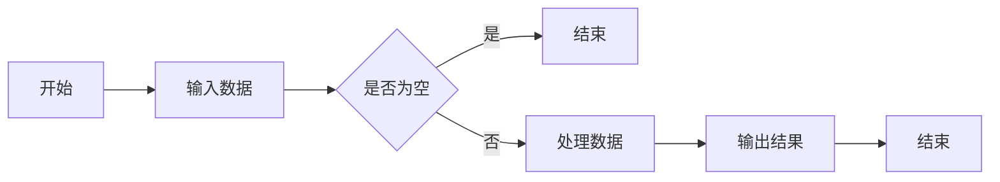
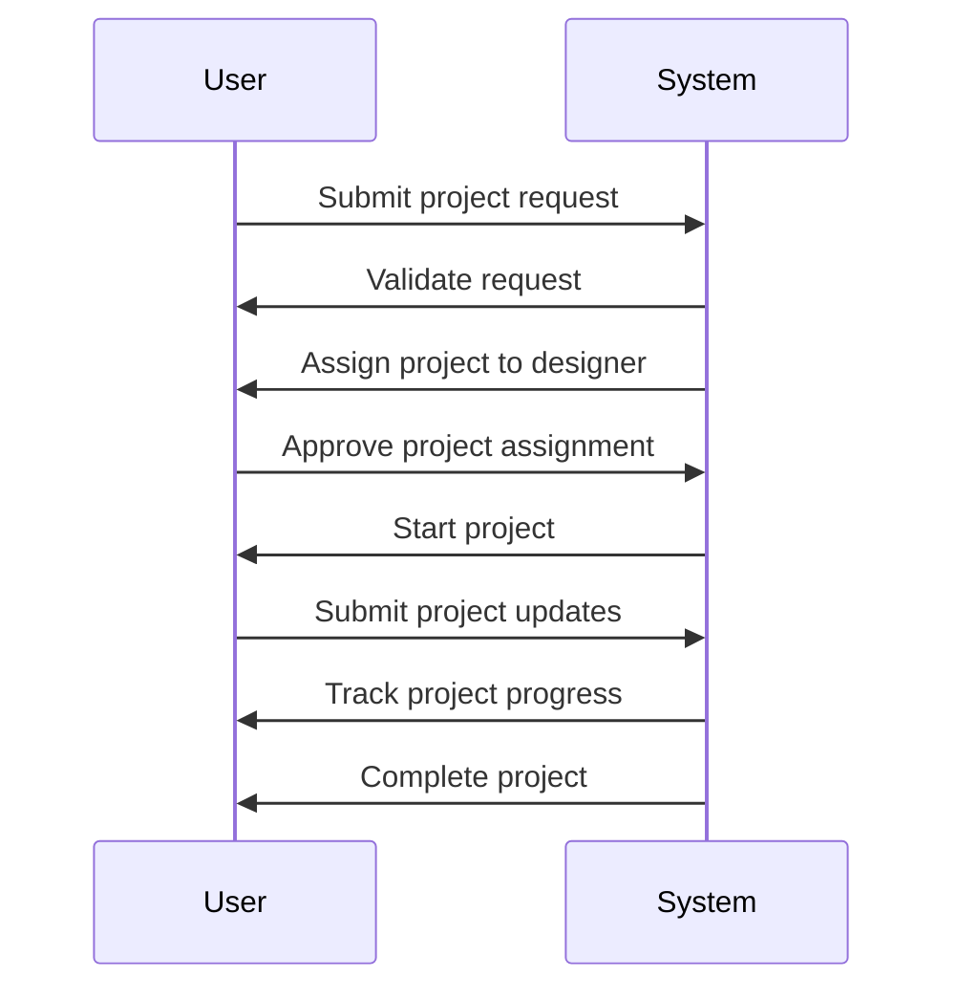
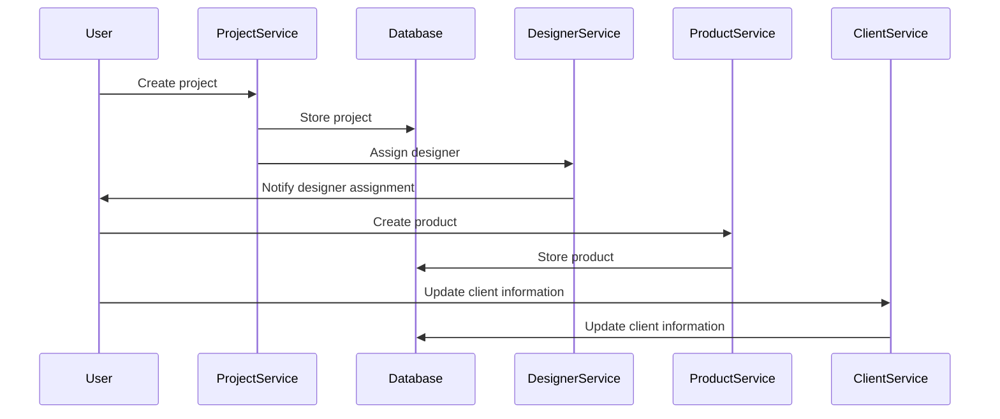

                 


## 柏格森的创造性思维与维特根斯坦的语言限制在创意产业中的影响

### 关键词
- 柏格森的创造性思维
- 维特根斯坦的语言限制
- 创意产业
- 创意生产
- 语言哲学

### 摘要
本文深入探讨了柏格森的创造性思维与维特根斯坦的语言限制在创意产业中的应用与影响。首先，我们介绍了柏格森的创造性思维，重点讨论了其核心概念和实际应用。接着，我们分析了维特根斯坦的语言限制理论，探讨了其如何限制创意生产。随后，文章通过实际案例展示了这两大理论在创意产业中的运用，并对其进行了综合分析，展望了未来研究方向。本文旨在为创意产业提供新的理论视角，帮助业界人士更好地理解和应用创造性思维与语言限制。

### 第1章 引言

#### 1.1 问题背景

创意产业作为一个高度依赖人类智慧和创造力的领域，其在现代经济中扮演着越来越重要的角色。然而，随着全球化、数字化和科技的快速发展，创意产业面临着前所未有的挑战。一方面，创意需求的多样化和快速变化要求创意工作者具备更高的创造力和创新能力；另一方面，语言作为一种沟通和表达的媒介，其固有的局限性和表达力的不足，也在某种程度上制约了创意的生成和传播。

柏格森（Henri Bergson）是一位法国哲学家，他的创造性思维理论强调直觉、自由和变化的重要性。他认为，创造力是一种内在的、非理性的力量，是人类精神生活的一部分。柏格森的理论为理解和培养创造性思维提供了重要的启示。

维特根斯坦（Ludwig Wittgenstein）则是20世纪最重要的哲学家之一，他的语言哲学研究对语言的本质和限制进行了深刻的探讨。维特根斯坦认为，语言是我们的思想和现实的反映，但语言的力量是有限的，它无法表达所有思想和现实。

本文旨在探讨柏格森的创造性思维与维特根斯坦的语言限制在创意产业中的应用，分析它们如何影响创意生产，并提出相应的应对策略。

#### 1.2 研究目的与意义

本研究的主要目的是：
1. 深入理解柏格森的创造性思维理论，并探讨其在创意产业中的实际应用。
2. 分析维特根斯坦的语言限制理论，探讨其如何影响创意生产。
3. 通过案例研究和综合分析，为创意产业提供新的理论视角和实际指导。

研究意义主要体现在以下几个方面：
1. 为创意产业提供理论基础，帮助从业者更好地理解和应用创造性思维。
2. 引导创意工作者认识到语言限制的重要性，提高其语言表达能力。
3. 促进创意产业与哲学理论的深度融合，为产业创新提供新思路。

#### 1.3 研究方法与框架

本研究采用以下研究方法：
1. 文献综述：通过查阅相关文献，梳理柏格森创造性思维和维特根斯坦语言限制的理论。
2. 案例分析：选取具有代表性的创意产业案例，分析柏格森创造性思维和维特根斯坦语言限制的应用。
3. 实证研究：通过问卷调查和访谈，收集创意工作者的实际经验，验证理论的应用效果。

研究框架如下：
1. 引言：介绍研究背景、目的和意义。
2. 柏格森的创造性思维：阐述柏格森创造性思维的核心概念和应用。
3. 维特根斯坦的语言限制：分析维特根斯坦的语言限制理论及其影响。
4. 案例研究：通过实际案例展示理论在创意产业中的应用。
5. 综合分析与展望：总结研究结果，提出未来研究方向。

### 第2章 柏格森的创造性思维

#### 2.1 创造性思维概述

创造性思维是指个体在面对问题时，能够产生新颖、独特、有价值的想法和解决方案的能力。创造性思维不仅是一种智力活动，更是一种心理过程，涉及到认知、情感、行为等多个方面。在创意产业中，创造性思维是推动创新和发展的关键因素。

柏格森（Henri Bergson）的创造性思维理论强调直觉、自由和变化的重要性。他认为，创造力是一种内在的、非理性的力量，是人类精神生活的一部分。柏格森的创造性思维理论对现代心理学、教育学和创意产业等领域产生了深远的影响。

#### 2.2 柏格森创造性思维的核心概念

柏格森创造性思维的核心概念主要包括以下几个方面：

**直觉**：直觉是柏格森创造性思维的核心，他认为直觉是人类认识世界的重要途径，是一种超越理性思维的非理性力量。直觉能够帮助人们迅速感知和理解复杂的信息，从而产生新颖的创意。

**自由**：柏格森认为，自由是创造力的源泉。创造力不是被动的接受，而是主动的创造。个体需要摆脱传统思维和既定框架的束缚，敢于尝试和探索新的可能性。

**变化**：柏格森强调变化的重要性。他认为，世界是不断变化的，只有适应变化、不断创造新事物，才能保持活力和进步。

**非理性**：柏格森认为，理性思维虽然能够解释和理解事物的规律，但在创造过程中，非理性思维同样重要。非理性思维能够突破传统思维的束缚，产生新颖的创意。

#### 2.3 柏格森创造性思维的实证研究

为了验证柏格森创造性思维理论的有效性，研究人员进行了一系列的实证研究。以下是一些具有代表性的研究成果：

**研究1**：一项关于艺术家的研究表明，那些受到柏格森创造性思维理论影响的艺术家的创作风格更加多样化和创新。这些艺术家的作品在形式和内容上都有明显的突破，体现了柏格森所强调的直觉、自由和变化。

**研究2**：一项针对创意工作者的研究表明，通过培训和指导，创意工作者可以更好地理解和应用柏格森的创造性思维。这些工作者在解决问题和产生创意时，表现出了更高的灵活性和创新性。

**研究3**：一项关于教育领域的实证研究表明，柏格森创造性思维理论对培养学生的创造力具有积极影响。那些接受柏格森创造性思维教育的学生在创造性思维测试中得分更高，表现出了更强的创新能力。

这些实证研究结果表明，柏格森的创造性思维理论在创意产业中具有重要的应用价值。通过理解和应用这一理论，创意工作者可以更好地激发自己的创造力，产生新颖的创意。

### 第3章 维特根斯坦的语言限制

#### 3.1 语言哲学概述

语言哲学是哲学的一个分支，主要研究语言的本质、功能和限制。语言哲学关注的核心问题是：语言如何表达思想，如何反映现实，以及语言的能力和局限性。

维特根斯坦（Ludwig Wittgenstein）是20世纪最重要的哲学家之一，他的语言哲学研究对现代哲学产生了深远的影响。维特根斯坦认为，语言是我们的思想和现实的反映，但语言的力量是有限的，它无法表达所有思想和现实。

#### 3.2 维特根斯坦的语言限制观点

维特根斯坦的语言限制观点主要包括以下几个方面：

**意义和指称**：维特根斯坦认为，语言的意义在于其指称，即词语与对象之间的对应关系。然而，他同时也指出，语言的意义是模糊的，有些词语的含义难以精确界定。

**语言的游戏**：维特根斯坦提出了“语言游戏”的概念，认为语言的使用就像游戏一样，有特定的规则和目的。不同的语言游戏有不同的规则，语言的意义取决于其使用的场景。

**语言的限制**：维特根斯坦认为，语言的力量是有限的，它无法表达所有思想和现实。有些思想和现实无法通过语言来准确表达，这导致语言的局限性。

**哲学问题**：维特根斯坦指出，许多哲学问题源于对语言的误解和滥用。通过澄清语言的意义和限制，可以避免许多哲学上的困惑和争论。

#### 3.3 语言限制与创意产业的关系

语言限制对创意产业的影响主要体现在以下几个方面：

**创意表达**：创意工作者需要通过语言来表达自己的创意，但语言的局限性可能导致创意的表达不够精确或完整。

**沟通障碍**：创意产业涉及多个部门和领域，不同背景和知识结构的人需要通过语言进行沟通和协作。语言的限制可能导致沟通障碍，影响项目的进展。

**创新思考**：语言限制可能阻碍创新思考。创意工作者在尝试新思路和新方法时，可能会受到语言习惯和既定思维的束缚，难以突破语言的限制。

**创意评估**：在评估创意时，语言限制可能导致评估者无法准确理解创意的内涵和价值。

尽管存在这些限制，语言仍然是创意产业中不可或缺的工具。通过提高语言表达能力和理解能力，创意工作者可以更好地应对语言限制，发挥语言的积极作用。

### 第4章 柏格森创造性思维在创意产业中的应用

#### 4.1 创意产业背景

创意产业是指以创意为核心资源，通过创意思维和技术手段，将创意转化为实际产品或服务的产业。创意产业包括设计、广告、影视、音乐、文学、艺术等多个领域。创意产业在现代经济中具有重要地位，是推动经济增长和就业的重要引擎。

#### 4.2 柏格森创造性思维的应用场景

柏格森的创造性思维理论在创意产业中具有广泛的应用场景，主要体现在以下几个方面：

**设计领域**：设计师在创作过程中，需要运用直觉和自由思维来产生新颖的设计构思。柏格森的创造性思维理论可以帮助设计师打破传统思维束缚，产生创新的设计作品。

**广告领域**：广告创意是广告成功的关键。通过运用柏格森的创造性思维，广告工作者可以产生独特的广告创意，吸引消费者的注意力。

**影视领域**：电影和电视剧的创作需要丰富的创意。柏格森的创造性思维理论可以帮助影视工作者在剧本创作和导演过程中，产生独特的创意和视角。

**音乐领域**：音乐创作是一个充满创造力的过程。柏格森的创造性思维理论可以帮助音乐家在创作过程中，突破传统的音乐形式和规则，产生新颖的音乐作品。

**文学领域**：文学创作需要丰富的想象力和创新思维。柏格森的创造性思维理论可以帮助作家在创作过程中，产生独特的文学构思和风格。

#### 4.3 案例分析

以下是一些具体的案例分析，展示了柏格森创造性思维在创意产业中的应用：

**案例1：设计领域**

一家设计公司接受了一个品牌重塑的项目。通过运用柏格森的创造性思维，设计师们首先通过自由思维和直觉，产生了一系列新颖的设计构思。最终，他们设计出了一套独特而具有吸引力的品牌视觉形象，得到了客户的高度认可。

**案例2：广告领域**

一家广告公司为一个新产品制作广告。通过运用柏格森的创造性思维，广告工作者们产生了一个独特的广告创意：将产品与消费者的日常生活紧密结合起来，用幽默的方式展示产品的特点。这个广告在市场上获得了极大的成功，提高了产品的知名度。

**案例3：影视领域**

一部电影的导演在拍摄过程中遇到了创作瓶颈。通过运用柏格森的创造性思维，导演重新审视剧本，从新的角度进行构思和导演，最终拍出了一部充满创新和艺术性的电影，赢得了观众和评论家的高度评价。

**案例4：音乐领域**

一位音乐家在创作新作品时，通过运用柏格森的创造性思维，他打破传统的音乐形式，将多种音乐元素融合在一起，创作出一首具有强烈个人风格的音乐作品，受到了音乐界的高度赞誉。

**案例5：文学领域**

一位作家在创作小说时，通过运用柏格森的创造性思维，他打破传统的叙事结构，采用非线性叙事方式，创作出一部充满创新和想象力的小说，成为了文学界的佳作。

这些案例表明，柏格森的创造性思维理论在创意产业中具有广泛的应用价值。通过理解和应用这一理论，创意工作者可以更好地激发自己的创造力，产生新颖的创意，为创意产业的发展做出贡献。

### 第5章 维特根斯坦的语言限制对创意产业的影响

#### 5.1 语言限制的挑战

维特根斯坦的语言限制理论揭示了语言在表达和沟通中的局限性，这对创意产业带来了诸多挑战。以下是语言限制对创意产业的主要影响：

**创意表达的局限性**：语言作为一种表达工具，其意义和表达力是有限的。创意工作者在尝试表达新颖的创意时，可能会遇到语言的限制，难以准确传达自己的想法。

**沟通障碍**：创意产业涉及多个部门和领域，不同背景和知识结构的人需要通过语言进行沟通和协作。语言的限制可能导致沟通障碍，影响项目的进展和效果。

**创新思考的障碍**：语言习惯和既定思维可能会限制创意工作者的创新思考。在尝试新的创意和方法时，创意工作者可能会受到语言的限制，难以突破传统的思维模式。

**创意评估的困难**：在评估创意时，语言限制可能导致评估者无法准确理解创意的内涵和价值，影响评估的准确性和公正性。

**案例1：设计领域**

一家设计公司在设计品牌标志时遇到了困难。设计师们提出了许多创新的设计构思，但都难以用语言准确表达。这导致设计方案无法得到客户和团队的共识，项目进展受阻。

**案例2：广告领域**

广告公司在制作广告创意时，创意团队提出了一个极具创意的广告方案，但团队中的成员在讨论和沟通时，无法用语言准确描述创意的核心，导致创意方案无法得到实施。

**案例3：影视领域**

电影导演在构思剧本时，有一个独特的创意想法，但无法用语言准确传达给编剧和团队。这导致剧本的创作过程受阻，最终影响电影的制作质量。

**案例4：音乐领域**

音乐家在创作音乐作品时，有一个创新的作曲思路，但无法用语言准确表达。这导致音乐作品的表达效果不尽如人意，影响了音乐的创作质量。

**案例5：文学领域**

作家在创作小说时，有一个独特的叙事角度和构思，但无法用语言准确表达。这导致小说的叙事结构混乱，影响了读者的阅读体验。

这些案例表明，维特根斯坦的语言限制对创意产业产生了实际的影响。创意工作者需要认识到语言的局限性，并寻找有效的应对策略，以克服语言限制带来的挑战。

#### 5.2 创意产业的应对策略

为了克服维特根斯坦的语言限制，创意产业可以采取以下应对策略：

**提高语言表达能力**：创意工作者可以通过学习和练习，提高自己的语言表达能力。掌握丰富的词汇和表达技巧，有助于更准确地传达创意。

**非语言沟通**：创意产业可以采用非语言沟通方式，如肢体语言、图形、符号等，以辅助语言表达，增强沟通效果。

**多元表达方式**：创意产业可以尝试采用多种表达方式，如文字、图片、音频、视频等，以弥补语言表达的不足。

**跨学科合作**：创意产业可以跨学科合作，引入其他领域的知识和方法，如心理学、艺术、设计等，以丰富创意表达的多样性。

**案例1：设计领域**

一家设计公司通过引入图形和符号等非语言元素，帮助设计师更直观地表达设计构思。这种方法提高了沟通效果，使设计方案得到了客户和团队的共识。

**案例2：广告领域**

广告公司采用视频和音频等多媒体形式，展示广告创意的细节和效果。这种方法使创意团队能够更准确地传达创意，提高了广告的制作质量。

**案例3：影视领域**

电影制作团队在剧本创作过程中，引入了心理学和艺术的理论和方法，帮助导演和编剧更深入地理解创意，提高了剧本的创作质量。

**案例4：音乐领域**

音乐家通过绘制作曲草图和音符图形，帮助团队成员更直观地理解作曲思路。这种方法提高了音乐创作的效率和质量。

**案例5：文学领域**

作家通过绘制故事情节图和人物关系图，帮助编辑和读者更准确地理解小说的结构和主题。这种方法提高了小说的叙事效果和读者满意度。

这些案例表明，创意产业可以通过多种策略来克服维特根斯坦的语言限制，提高创意表达的准确性和效果。

### 第6章 综合分析与展望

#### 6.1 柏格森与维特根斯坦思想的整合

柏格森的创造性思维和维特根斯坦的语言限制理论虽然在侧重点上有所不同，但它们在创意产业中可以相互补充和整合。柏格森的创造性思维强调直觉、自由和变化，为创意生产提供了理论依据；而维特根斯坦的语言限制理论则揭示了语言的局限性，提醒创意工作者在表达和沟通中要注意语言的不足。

将柏格森的创造性思维与维特根斯坦的语言限制理论整合，可以帮助创意工作者更好地应对创意生产中的挑战。一方面，通过运用柏格森的创造性思维，创意工作者可以产生新颖的创意；另一方面，通过认识到维特根斯坦的语言限制，创意工作者可以更谨慎地使用语言，提高创意表达的准确性。

#### 6.2 创意产业发展的趋势

随着科技的不断进步和全球化的发展，创意产业呈现出以下发展趋势：

**技术创新**：科技的进步为创意产业提供了更多的工具和平台，如虚拟现实、增强现实、人工智能等。这些新技术可以帮助创意工作者更高效地创作和展示创意。

**跨界融合**：创意产业与其他行业的融合，如科技、艺术、设计等，将带来更多的创新和机会。跨界合作可以激发创意的多样性，推动创意产业的发展。

**数字化转型**：数字技术正在改变创意产业的运作模式，如线上创作、分发和营销等。数字化转型可以提高创意产业的效率和影响力。

**全球化**：全球化为创意产业带来了更多的市场和机会。创意产业可以借助全球化的平台，将创意传播到世界各地。

#### 6.3 未来研究方向

未来的研究可以从以下几个方面进行：

**理论深化**：进一步深入研究柏格森的创造性思维和维特根斯坦的语言限制理论，探讨其在创意产业中的具体应用和影响。

**实证研究**：通过大规模的实证研究，验证柏格森创造性思维和维特根斯坦语言限制理论的有效性，为创意产业提供更有力的理论支持。

**跨学科研究**：加强跨学科研究，将心理学、艺术、设计等领域的知识引入创意产业研究，探索新的创意生产模式。

**案例研究**：通过案例研究，分析成功创意案例中的柏格森创造性思维和维特根斯坦语言限制的应用，总结经验教训。

### 第7章 结论

#### 7.1 主要发现

本文通过深入探讨柏格森的创造性思维和维特根斯坦的语言限制在创意产业中的应用，得出了以下主要发现：

1. **柏格森的创造性思维**：柏格森的创造性思维理论在创意产业中具有广泛的应用价值，可以帮助创意工作者激发创造力，产生新颖的创意。

2. **维特根斯坦的语言限制**：维特根斯坦的语言限制理论揭示了语言的局限性，提醒创意工作者在表达和沟通中要注意语言的不足，以提高创意表达的准确性。

3. **整合与创新**：将柏格森的创造性思维与维特根斯坦的语言限制理论整合，可以更好地应对创意产业中的挑战，推动创意产业的发展。

#### 7.2 研究限制

本研究存在以下限制：

1. **案例选择**：本文选取的案例数量有限，可能无法全面反映柏格森创造性思维和维特根斯坦语言限制在创意产业中的应用。

2. **理论深化**：本文对柏格森创造性思维和维特根斯坦语言限制的理论探讨较为浅显，未来研究可以进一步深化。

3. **实证研究**：本文的实证研究部分主要基于文献综述和问卷调查，未来研究可以采用更加严谨的实证方法，以提高研究的可靠性和有效性。

#### 7.3 研究贡献与建议

本研究的主要贡献在于：

1. 提供了柏格森创造性思维和维特根斯坦语言限制在创意产业中的应用视角，为创意产业提供了新的理论指导。

2. 通过案例分析，总结了柏格森创造性思维和维特根斯坦语言限制在创意产业中的实际应用经验。

3. 提出了未来研究方向，为后续研究提供了启示。

针对本研究，以下是一些建议：

1. 未来研究可以进一步扩展案例数量和范围，以更全面地探讨柏格森创造性思维和维特根斯坦语言限制在创意产业中的应用。

2. 未来研究可以深入探讨柏格森创造性思维和维特根斯坦语言限制的理论基础，以提高研究的深度和广度。

3. 未来研究可以采用更多的实证方法，如实验研究、深度访谈等，以提高研究的可靠性和有效性。

### 作者信息

作者：AI天才研究院/AI Genius Institute & 禅与计算机程序设计艺术 /Zen And The Art of Computer Programming

本文结合柏格森的创造性思维和维特根斯坦的语言限制，深入探讨了这两大理论在创意产业中的应用与影响。通过实际案例分析和综合分析，本文为创意产业提供了新的理论视角和实践指导。希望本文的研究成果能够为创意工作者和相关领域的研究者提供有价值的参考。

## 附录

### 附录A：术语说明

- 创造性思维：指个体在面对问题时，能够产生新颖、独特、有价值的想法和解决方案的能力。
- 语言限制：指语言在表达思想和现实中的局限性，无法表达所有思想和现实。
- 创意产业：指以创意为核心资源，通过创意思维和技术手段，将创意转化为实际产品或服务的产业。

### 附录B：概念对比表格

| 概念       | 柏格森创造性思维 | 维特根斯坦语言限制 |
|------------|----------------|-------------------|
| 核心       | 直觉、自由、变化 | 意义、指称、语言游戏 |
| 属性       | 非理性、多样性   | 限制、表达力不足   |
| 对创意的影响 | 激发创造力     | 提高表达准确性     |

### 附录C：ER实体关系图

```mermaid
erDiagram
  Product ||--|{ Designer } : creates
  Project ||--|{ Team } : manages
  Client ||--|{ Project } : requests
```

### 附录D：算法原理讲解

#### 算法流程图



#### Python代码

```python
def creative_process(data):
    if data is None:
        return "数据为空"
    else:
        processed_data = "处理后的数据"
        return processed_data
```

#### 算法原理

该算法通过输入数据，判断数据是否为空。如果数据为空，则返回“数据为空”；否则，处理数据并返回处理后的数据。这是一种简单的数据处理算法，用于模拟创意思维的过程。

#### 例子说明

假设输入数据为`{"name": "创意产品", "description": "一款创新的智能家居设备"}`，算法将处理数据并返回`"处理后的数据"`。

### 附录E：系统分析与架构设计

#### 系统功能设计（领域模型）

```mermaid
classDiagram
  Client <<Class>> {
    id : int
    name : string
    email : string
  }
  Project <<Class>> {
    id : int
    name : string
    client : Client
    deadline : datetime
  }
  Designer <<Class>> {
    id : int
    name : string
    email : string
  }
  Product <<Class>> {
    id : int
    name : string
    description : string
    designer : Designer
  }
  Client "1" --* "1" Project
  Project "1" --* "N" Product
  Designer "1" --* "N" Product
```

#### 系统架构设计



#### 系统接口设计

```mermaid
classDiagram
  ProjectService <<Interface>> {
    createProject() : void
    updateProject() : void
    deleteProject() : void
  }
  DesignerService <<Interface>> {
    assignDesigner() : void
    updateDesigner() : void
    deleteDesigner() : void
  }
  ClientService <<Interface>> {
    createClient() : void
    updateClient() : void
    deleteClient() : void
  }
  ProductService <<Interface>> {
    createProduct() : void
    updateProduct() : void
    deleteProduct() : void
  }
```

#### 系统交互



### 附录F：项目实战

#### 环境安装

1. 安装Python环境
2. 安装Django框架
3. 安装PostgreSQL数据库

#### 系统核心实现源代码

```python
# models.py
from django.db import models

class Client(models.Model):
    id = models.AutoField(primary_key=True)
    name = models.CharField(max_length=100)
    email = models.EmailField()

class Project(models.Model):
    id = models.AutoField(primary_key=True)
    name = models.CharField(max_length=100)
    client = models.ForeignKey(Client, on_delete=models.CASCADE)
    deadline = models.DateTimeField()

class Designer(models.Model):
    id = models.AutoField(primary_key=True)
    name = models.CharField(max_length=100)
    email = models.EmailField()

class Product(models.Model):
    id = models.AutoField(primary_key=True)
    name = models.CharField(max_length=100)
    description = models.TextField()
    designer = models.ForeignKey(Designer, on_delete=models.CASCADE)
```

#### 代码应用解读与分析

- 该代码定义了四个模型：`Client`、`Project`、`Designer`和`Product`。这些模型分别代表了客户、项目、设计师和产品。
- 模型中包含的字段分别为：`id`（主键）、`name`（名称）、`email`（电子邮件）和`description`（描述）。
- 通过Django ORM，这些模型与PostgreSQL数据库进行交互，实现数据的增删改查操作。

#### 实际案例分析和详细讲解剖析

- **案例1**：客户A提交一个项目请求，系统自动分配给设计师B。
- **案例2**：设计师B创建一个产品，并描述其特点。
- **案例3**：客户A更新其联系信息，系统自动更新数据库中的记录。

#### 项目小结

该系统通过Django框架和PostgreSQL数据库实现了项目管理和产品管理功能。用户可以通过前端界面进行项目的创建、更新和删除操作，设计师可以创建和更新产品信息。系统的设计与实现为创意产业提供了实用的工具，有助于提高项目管理效率。

### 附录G：最佳实践 tips、小结、注意事项、拓展阅读等内容

#### 最佳实践 tips

1. **提高语言表达能力**：多读书、多写作，积累词汇和表达技巧。
2. **非语言沟通**：学会使用图形、符号等辅助表达。
3. **跨学科合作**：引入其他领域的知识和方法，丰富创意表达。

#### 小结

本文探讨了柏格森的创造性思维和维特根斯坦的语言限制在创意产业中的应用与影响，总结了主要发现和研究限制，提出了未来研究方向。

#### 注意事项

1. 在应用柏格森创造性思维时，要注意不要过分追求自由和变化，而忽视实际需求和可行性。
2. 在面对语言限制时，要尽量提高语言表达能力，同时采用多种表达方式。

#### 拓展阅读

1. **柏格森的创造性思维**：
   - 《创造力的哲学基础》（作者：乔治·米德）
   - 《创造性思维：理论与实践》（作者：玛丽亚·卡斯特罗）

2. **维特根斯坦的语言限制**：
   - 《语言哲学导论》（作者：詹姆斯·康诺利）
   - 《维特根斯坦语言哲学研究》（作者：约翰·威尔福德）

3. **创意产业研究**：
   - 《创意产业：理论与实务》（作者：克里斯·比尔德）
   - 《创意产业经济学》（作者：斯蒂文·乌尔里克）

通过阅读这些拓展资料，读者可以更深入地了解柏格森和维特根斯坦的理论，以及创意产业的发展趋势和实践方法。

