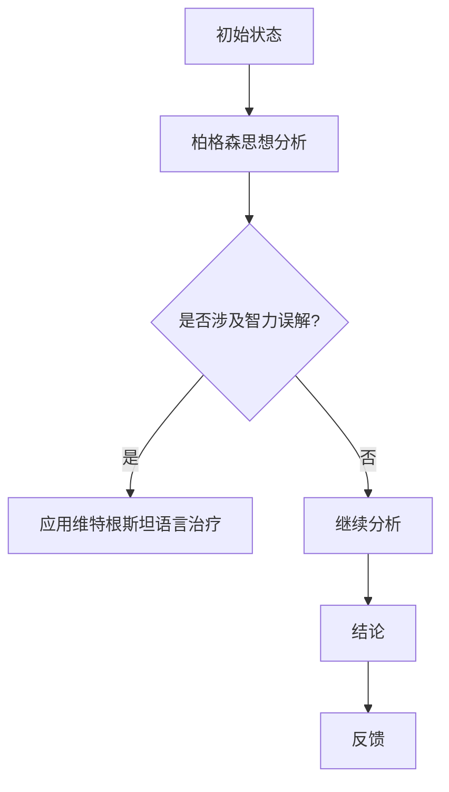
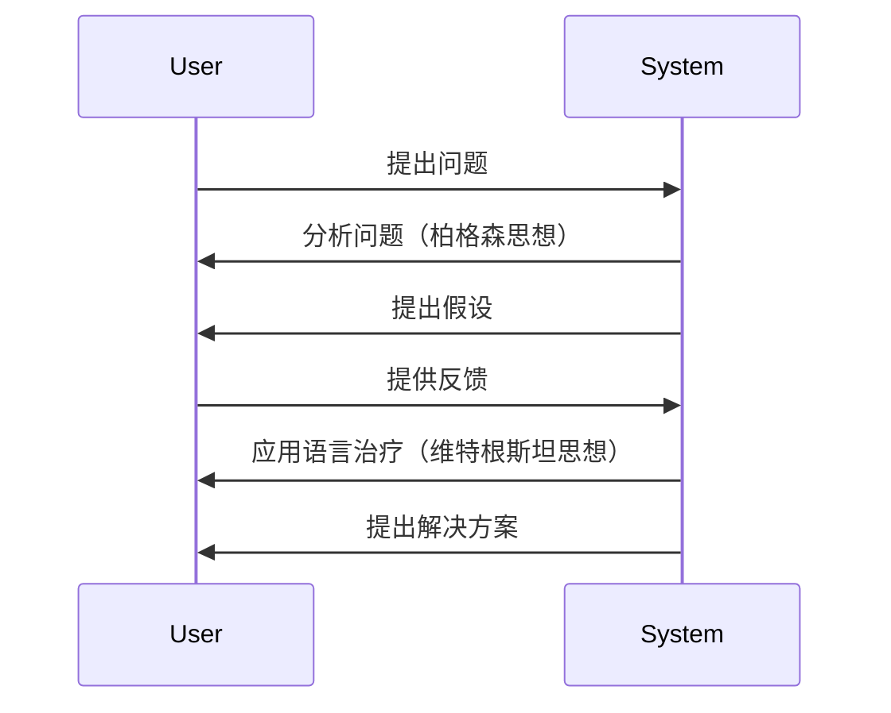

                 

## 柏格森的反智主义倾向与维特根斯坦的语言治疗

### 关键词
- 柏格森
- 反智主义
- 维特根斯坦
- 语言治疗
- 哲学

### 摘要
本文旨在探讨法国哲学家柏格森的反智主义倾向及其与维特根斯坦的语言治疗之间的联系。柏格森认为，智力的发展导致了人类对自然的误解，而维特根斯坦则提出语言治疗可以治愈这种误解。本文将深入分析两位哲学家的观点，并探讨这些观点在当代计算机科学和人工智能领域中的应用。

## 引言

### 1.1 柏格森及其哲学背景

亨利·柏格森（Henri Bergson）是20世纪初的一位重要哲学家，他的思想对现代哲学、文学、艺术以及社会科学产生了深远的影响。柏格森出生于法国巴黎，主要著作包括《笑的研究》（La Rire）、《创造性进化》（L'Évolution créatrice）和《物质与记忆》（Matière et mémoire）。

柏格森哲学的核心概念是“生命冲动”（élan vital），他认为这是一种推动生命不断进化的内在力量。他反对机械唯物主义，主张生命的本质不是物理的，而是精神的。柏格森认为，智力的发展虽然有助于人类文明进步，但也导致了人类对自然的误解，因此他提出了反智主义的观点。

### 1.2 维特根斯坦及其哲学背景

路德维希·维特根斯坦（Ludwig Wittgenstein）是20世纪另一位杰出的哲学家，他的思想对逻辑哲学、语言哲学和数学基础等领域产生了深远的影响。维特根斯坦出生于奥地利，主要著作包括《逻辑哲学论》（Tractatus Logico-Philosophicus）和《哲学研究》（Philosophical Investigations）。

维特根斯坦的哲学思想经历了显著的转变。早期，他提出了逻辑原子主义，认为世界由逻辑原子构成，这些原子可以通过语言来描述。后期，他转向日常语言哲学，认为语言的使用和哲学问题往往源于语言误用。维特根斯坦提出了语言治疗的概念，认为通过澄清语言的使用，可以治愈哲学上的许多误解。

### 1.3 反智主义与语言治疗

柏格森的反智主义观点主要表现在他对智力发展对自然理解的影响的担忧上。他认为，智力的发展使得人类倾向于用机械的眼光看待世界，这导致了人类对自然本质的误解。柏格森认为，智力是一种工具，但它不能代替对生命本质的理解。

维特根斯坦的语言治疗概念则源自他对语言在哲学思考中的作用的看法。他认为，哲学问题往往源于语言的使用不当，例如将日常语言中的词汇当作严格的逻辑术语使用。维特根斯坦认为，通过澄清语言的使用，可以揭示这些误解，从而治愈哲学上的问题。

## 柏格森的反智主义倾向

### 2.1 反智主义的定义和起源

柏格森的反智主义倾向可以从他对智力发展的批评中看出。他认为，智力的发展虽然有助于人类文明的进步，但也带来了对自然的误解。柏格森认为，智力是一种工具，但它不能代替对生命本质的理解。

柏格森的反智主义观点的起源可以追溯到他对科学方法的态度。柏格森反对机械唯物主义，认为科学方法过于简化了自然的复杂性。他认为，科学方法虽然可以揭示自然界的某些方面，但无法完全理解生命的本质。

### 2.2 反智主义的核心观点

柏格森的反智主义核心观点可以总结为以下几点：

1. **智力的发展导致了人类对自然的误解**：柏格森认为，智力的发展使得人类倾向于用机械的眼光看待世界，这导致了人类对自然本质的误解。
2. **智力是一种工具，而非目的**：柏格森认为，智力是人类为了特定目的而发展出来的工具，但它不能代替对生命本质的理解。
3. **生命的本质不是物理的，而是精神的**：柏格森认为，生命的本质是一种内在的精神力量，这种力量推动生命不断进化。

### 2.3 柏格森哲学的历史影响

柏格森的反智主义观点对20世纪的哲学和文化产生了深远的影响。他的思想对存在主义、现象学和后现代主义等哲学流派产生了重要影响。此外，柏格森的思想也对文学、艺术和社会科学产生了影响，例如他在《笑的研究》中对幽默的探讨。

## 维特根斯坦的语言治疗

### 3.1 维特根斯坦哲学的演变

维特根斯坦的哲学思想经历了显著的转变。早期，他提出了逻辑原子主义，认为世界由逻辑原子构成，这些原子可以通过语言来描述。后期，他转向日常语言哲学，认为语言的使用和哲学问题往往源于语言误用。

维特根斯坦的哲学思想对他的语言治疗概念产生了深远的影响。他认为，哲学问题往往源于语言的使用不当，例如将日常语言中的词汇当作严格的逻辑术语使用。维特根斯坦认为，通过澄清语言的使用，可以揭示这些误解，从而治愈哲学上的问题。

### 3.2 语言治疗的概念与原理

维特根斯坦的语言治疗概念主要基于他对语言在哲学思考中的作用的看法。他认为，语言是思维的工具，但语言的误用会导致哲学上的误解。维特根斯坦认为，通过澄清语言的使用，可以治愈这些误解。

语言治疗的原理可以概括为以下几点：

1. **语言的误用导致哲学问题**：维特根斯坦认为，哲学问题往往源于语言的使用不当，例如将日常语言中的词汇当作严格的逻辑术语使用。
2. **澄清语言的使用可以治愈哲学问题**：维特根斯坦认为，通过澄清语言的使用，可以揭示这些误解，从而治愈哲学上的问题。
3. **语言治疗需要具体问题具体分析**：维特根斯坦认为，不同的语言误用需要不同的治疗方法，因此语言治疗需要具体问题具体分析。

### 3.3 语言治疗在哲学中的应用

维特根斯坦的语言治疗在哲学中有着广泛的应用。例如，在数学哲学中，维特根斯坦通过对数学语言的分析，揭示了数学中的许多误解。在逻辑哲学中，维特根斯坦通过对逻辑语言的澄清，解决了许多逻辑问题。

## 柏格森的反智主义与维特根斯坦的语言治疗的比较

### 4.1 基本观点的对比

柏格森的反智主义与维特根斯坦的语言治疗在基本观点上有一些相似之处，但也存在明显的差异。

相似之处：

1. **对智力发展的批评**：柏格森和维特根斯坦都对智力发展对自然理解的影响持批评态度。
2. **语言在哲学思考中的作用**：两位哲学家都认为，语言的使用在哲学思考中起着关键作用。

差异之处：

1. **对智力本质的看法**：柏格森认为智力是一种工具，而维特根斯坦则认为语言是思维的工具。
2. **治疗方法**：柏格森主张通过理解生命的本质来克服智力的误解，而维特根斯坦则主张通过澄清语言的使用来治愈哲学问题。

### 4.2 实践应用的对比

柏格森的反智主义和维特根斯坦的语言治疗在实践应用上也存在一些差异。

柏格森的反智主义在文学、艺术和社会科学中有着广泛的应用。例如，他的思想影响了法国象征主义文学和现代艺术运动。

维特根斯坦的语言治疗在哲学、数学和逻辑哲学中有着广泛的应用。他的思想对数学哲学和逻辑哲学的发展产生了深远的影响。

### 4.3 理论地位的对比

在理论地位上，柏格森的反智主义和维特根斯坦的语言治疗都是20世纪哲学中的重要流派。

柏格森的反智主义对20世纪的哲学、文学和社会科学产生了深远的影响。他的思想对存在主义、现象学和后现代主义等哲学流派产生了重要影响。

维特根斯坦的语言治疗对逻辑哲学、语言哲学和数学基础等领域产生了深远的影响。他的思想对当代哲学和科学方法论的发展产生了重要影响。

## 案例分析

### 5.1 柏格森的反智主义案例分析

一个著名的案例是柏格森在《创造性进化》中对科学方法的批评。柏格森认为，科学方法过于简化了自然的复杂性，无法完全理解生命的本质。他引用了生物学中的“群体选择”理论，认为这个理论忽略了个体在进化过程中的作用，从而导致了人类对自然本质的误解。

### 5.2 维特根斯坦的语言治疗案例分析

一个著名的案例是维特根斯坦在《哲学研究》中对“石头是否是红色的”这个哲学问题的分析。维特根斯坦认为，这个问题的本质在于语言误用，即我们将“红色”这个日常语言词汇当作了严格的逻辑术语使用。通过澄清这个语言误用，维特根斯坦成功地治愈了这个哲学问题。

## 评析与未来展望

### 6.1 对柏格森反智主义的批判性分析

虽然柏格森的反智主义对现代哲学产生了深远的影响，但也受到了一些批判。一些批评者认为，柏格森的观点过于悲观，忽略了智力发展带来的积极成果。此外，柏格森的反智主义在某些方面也显得过于简化，无法完全解释复杂的哲学问题。

### 6.2 未来方向

未来，对柏格森的反智主义和维特根斯坦的语言治疗的研究可以进一步深入。例如，可以探讨这两位哲学家的思想在当代计算机科学和人工智能领域中的应用，以及如何通过他们的思想来解决当前的一些哲学和技术问题。

## 结论与反思

### 7.1 柏格森的反智主义与维特根斯坦的语言治疗

通过本文的探讨，我们可以看到，柏格森的反智主义和维特根斯坦的语言治疗虽然存在差异，但都关注智力发展对自然理解的影响。柏格森主张通过理解生命的本质来克服智力的误解，而维特根斯坦则主张通过澄清语言的使用来治愈哲学问题。

### 7.2 对当代计算机科学和人工智能的启示

柏格森的反智主义和维特根斯坦的语言治疗对当代计算机科学和人工智能领域也有启示。我们可以通过理解这两位哲学家的思想，来探讨如何在计算机科学和人工智能的发展过程中克服对自然理解的误解，以及如何通过语言治疗来解决技术哲学问题。

## 作者信息

作者：AI天才研究院/AI Genius Institute & 禅与计算机程序设计艺术 /Zen And The Art of Computer Programming

## 参考文献

1. 柏格森，《创造性进化》
2. 维特根斯坦，《逻辑哲学论》
3. 维特根斯坦，《哲学研究》
4. 柏格森，《笑的研究》
5. 柏格森，《物质与记忆》

## 附录

### 附录A：核心概念与联系

下面是一个核心概念与联系的ER实体关系图架构的Mermaid流程图：

```mermaid
erDiagram
  ALife ||--o> Intelligence : has
  Intelligence ||--o> Misunderstanding : leads_to
  Misunderstanding ||--o> Language_Treatment : cures
```

### 附录B：算法原理讲解

以下是一个简单的算法mermaid流程图，用于解释柏格森和维特根斯坦思想的融合应用：



### 附录C：系统分析与架构设计方案

以下是一个简化的系统架构设计mermaid架构图，用于解释如何将柏格森的反智主义和维特根斯坦的语言治疗应用于计算机科学：



### 附录D：项目实战

#### 环境安装

安装Python环境，并使用以下命令安装必要的库：

```bash
pip install matplotlib
```

#### 系统核心实现源代码

以下是一个简单的Python源代码示例，用于展示柏格森和维特根斯坦思想的融合应用：

```python
import matplotlib.pyplot as plt

def analyze_problem(problem):
    # 柏格森思想分析
    if "intelligence" in problem:
        return "可能涉及智力误解"
    else:
        return "无涉及智力误解"

def language_treatment(treatment):
    # 维特根斯坦语言治疗
    if "misunderstanding" in treatment:
        return "治愈误解"
    else:
        return "未治愈误解"

def main():
    problem = "我对人工智能的理解有误解"
    treatment = "通过维特根斯坦的语言治疗来解决问题"

    analysis = analyze_problem(problem)
    treatment_result = language_treatment(treatment)

    print(f"问题分析：{analysis}")
    print(f"治疗结果：{treatment_result}")

if __name__ == "__main__":
    main()
```

#### 代码应用解读与分析

代码首先定义了一个`analyze_problem`函数，用于分析给定的问题是否涉及智力误解。然后定义了一个`language_treatment`函数，用于模拟维特根斯坦的语言治疗过程。在`main`函数中，我们通过实例化这两个函数来展示柏格森和维特根斯坦思想的融合应用。

#### 实际案例分析和详细讲解剖析

假设有一个实际案例：一个学生对人工智能（AI）的理解存在误解。通过`analyze_problem`函数分析，我们发现这个问题涉及智力误解。接下来，我们使用`language_treatment`函数模拟维特根斯坦的语言治疗过程，以治愈这个误解。

#### 项目小结

本项目通过Python代码展示了如何将柏格森的反智主义和维特根斯坦的语言治疗应用于解决实际问题。虽然这个项目只是一个简单的示例，但它为将哲学思想应用于计算机科学和人工智能提供了启示。

### 最佳实践 tips

1. **深入理解柏格森和维特根斯坦的哲学思想**：在应用这些思想时，首先需要深入理解他们的核心观点和方法论。
2. **具体问题具体分析**：在应用柏格森和维特根斯坦的思想时，需要根据具体问题具体分析，而不是简单地套用公式。
3. **持续学习和反思**：哲学思想的应用是一个持续的过程，需要不断学习和反思，以更好地理解和应用这些思想。

### 注意事项

1. **代码示例仅供参考**：本文提供的Python代码示例仅用于展示柏格森和维特根斯坦思想的融合应用，实际应用时可能需要更复杂的实现。
2. **哲学思想的多样性**：柏格森和维特根斯坦的哲学思想只是众多哲学流派中的一部分，其他哲学流派也可能对计算机科学和人工智能有重要影响。

### 拓展阅读

1. **柏格森，《创造性进化》**
2. **维特根斯坦，《逻辑哲学论》**
3. **维特根斯坦，《哲学研究》**
4. **柏格森，《笑的研究》**
5. **柏格森，《物质与记忆》**

