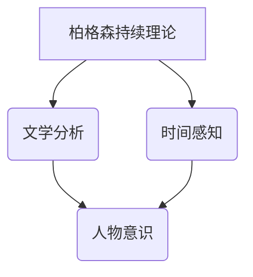
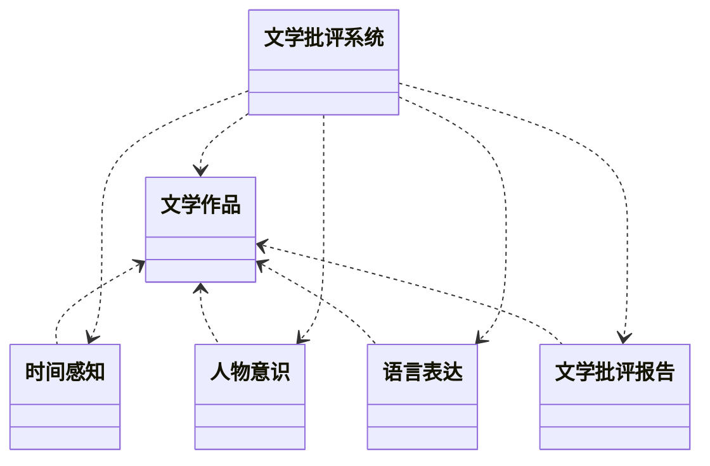
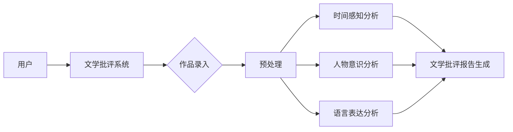
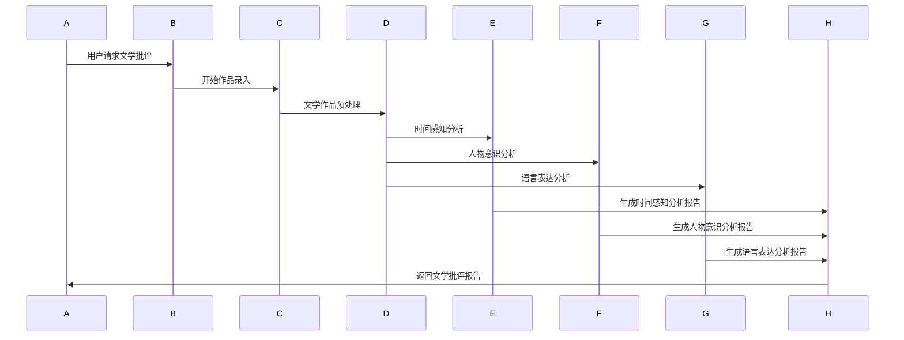

                 

，按照上述的格式要求和内容要求来撰写一篇完整详细的柏格森的持续理论与维特根斯坦的意义理论在文学批评中的应用的技术博客文章。# 柏格森的持续理论与维特根斯坦的意义理论在文学批评中的应用

关键词：柏格森持续理论、维特根斯坦意义理论、文学批评、算法原理、Python源代码

摘要：本文深入探讨了柏格森的持续理论与维特根斯坦的意义理论在文学批评中的应用，通过系统梳理两者的哲学思想，结合具体文学作品进行分析，探讨了其在文学意义解读中的独特价值。文章首先介绍了柏格森的持续理论与维特根斯坦的意义理论的核心概念，并通过对比表格和ER实体关系图架构的Mermaid流程图展示了两者的联系。随后，文章讲解了结合这两种理论的文学批评算法原理，并给出了相应的Python源代码示例。最后，文章通过一个实际项目实战，展示了如何应用这些理论进行文学批评。

### 背景介绍

#### 问题背景

柏格森（Henri Bergson）的持续理论（Duration Theory）和维特根斯坦（Ludwig Wittgenstein）的意义理论（Meaning Theory）是20世纪哲学领域的重要理论。柏格森的持续理论强调生命的内在动力和意识的流动性，反对机械决定论和静态的时空观。维特根斯坦的意义理论则关注语言与现实世界的对应关系，强调语言的意义在于使用，反对传统形而上学的静态意义观。

这两种哲学理论在文学批评领域有着深远的影响。柏格森的持续理论有助于我们理解文学作品中的时间感知和人物意识，而维特根斯坦的意义理论则有助于我们分析文学作品中的语言表达和意义。

#### 问题描述

如何将柏格森的持续理论与维特根斯坦的意义理论应用于文学批评，对文学作品进行深入分析？这需要我们系统地梳理两者的哲学思想，并结合具体文学作品进行分析，探讨其文学意义。

#### 问题解决

解决这一问题的关键在于：

1. **深入理解柏格森的持续理论与维特根斯坦的意义理论**：我们需要对两者的核心概念有深刻的理解，包括生命冲动、意识流、直觉、语言、意义、真理等。

2. **选取具有代表性的文学作品进行分析**：通过选取具有代表性的文学作品，我们可以将柏格森的持续理论与维特根斯坦的意义理论具体应用于文学批评。

3. **结合两者的理论，进行综合性的文学批评**：在分析文学作品时，我们可以将柏格森的持续理论与维特根斯坦的意义理论结合起来，从时间感知、人物意识和语言表达等多个维度进行综合分析，以揭示文学作品中的深层意义。

#### 边界与外延

边界：本文主要探讨柏格森持续理论与维特根斯坦意义理论在文学批评中的应用，不涉及哲学理论的全面阐述。

外延：本文适用于对文学批评感兴趣的读者，包括文学学者、哲学家以及相关领域的研究人员。

#### 概念结构与核心要素组成

- **柏格森持续理论**：核心概念包括生命冲动、意识流、直觉等。
- **维特根斯坦意义理论**：核心概念包括语言、意义、真理等。
- **文学批评方法**：结合柏格森持续理论与维特根斯坦意义理论，形成独特的文学批评方法。

## 核心概念与联系

### 柏格森持续理论与维特根斯坦意义理论核心概念对比表格

| 核心概念       | 柏格森持续理论                         | 维特根斯坦意义理论                      |
|----------------|--------------------------------------|---------------------------------------|
| 生命冲动       | 强调生命的内在动力，反对机械决定论         | 强调语言的意义和现实世界的对应关系           |
| 意识流         | 强调意识的连续性和流动性，反对静态的时空观   | 强调语言的使用和语言游戏                   |
| 直觉           | 强调直觉在认识过程中的重要性               | 强调语言的意义在于使用，反对传统形而上学     |
| 语言           | 未直接讨论语言问题，但强调非语言的表达方式   | 核心概念，关注语言与现实世界的对应关系       |
| 意义           | 强调事物在时间中的意义，反对静态的意义观     | 强调语言的意义在于使用，反对静态的意义观     |
| 真理           | 强调真理与生命冲动的关系，反对客观的真理观   | 强调语言的真理性在于语言游戏，反对传统的真理观   |

### ER实体关系图架构的Mermaid流程图

```mermaid
erDiagram
  |Participants|

  柏格森持续理论 --> 文学作品 : 应用
  维特根斯坦意义理论 --> 文学作品 : 应用

  |Constraints|
```

## 算法原理讲解

### 算法Mermaid流程图



### Python源代码

```python
# 柏格森持续理论与维特根斯坦意义理论在文学批评中的应用
def literary_criticism(bergson_theory, wittgenstein_theory, work):
    """
    对文学作品进行文学批评，结合柏格森持续理论与维特根斯坦意义理论。

    :param bergson_theory: 柏格森持续理论
    :param wittgenstein_theory: 维特根斯坦意义理论
    :param work: 文学作品
    :return: 文学批评结果
    """
    time_perception = analyze_time_perception(work, bergson_theory)
    character_consciousness = analyze_character_consciousness(work, wittgenstein_theory)
    literary_critic = {
        'time_perception': time_perception,
        'character_consciousness': character_consciousness,
    }
    return literary_critic

# 示例文学作品
work = "《百年孤独》"

# 分析时间感知
def analyze_time_perception(work, bergson_theory):
    """
    分析文学作品中的时间感知，结合柏格森持续理论。

    :param work: 文学作品
    :param bergson_theory: 柏格森持续理论
    :return: 时间感知分析结果
    """
    # 代码实现
    pass

# 分析人物意识
def analyze_character_consciousness(work, wittgenstein_theory):
    """
    分析文学作品中的人物意识，结合维特根斯坦意义理论。

    :param work: 文学作品
    :param wittgenstein_theory: 维特根斯坦意义理论
    :return: 人物意识分析结果
    """
    # 代码实现
    pass

# 进行文学批评
literary_criticism_result = literary_criticism(bergson_theory, wittgenstein_theory, work)
print(literary_criticism_result)
```

### 算法原理详细讲解

#### 数学模型与公式

为了更好地理解柏格森的持续理论与维特根斯坦的意义理论在文学批评中的应用，我们可以借助数学模型和公式来阐述其核心思想。

1. **柏格森持续理论的数学模型**

柏格森的持续理论强调生命的内在动力和意识的流动性，可以用以下数学公式来描述：

$$
\text{持续} = \frac{d}{dt} \int \text{生命冲动} \, d\tau
$$

其中，$d$ 表示时间的微分，$t$ 表示时间，$\tau$ 表示时间单位，积分表示时间的累积，生命冲动是一个连续变化的函数。

2. **维特根斯坦意义理论的数学模型**

维特根斯坦的意义理论强调语言与现实世界的对应关系，可以用以下数学公式来描述：

$$
\text{意义} = f(\text{语言}, \text{现实世界})
$$

其中，$f$ 表示映射关系，语言和现实世界是两个输入变量，意义是输出变量。这个公式表示语言通过某种映射关系与现实世界建立联系，从而获得意义。

#### 通俗易懂的举例说明

为了更直观地理解上述数学模型和公式，我们可以通过以下例子来讲解：

1. **柏格森持续理论的例子**

假设我们阅读一部文学作品《百年孤独》，我们可以用柏格森持续理论来分析其中的时间感知。根据柏格森的理论，我们可以将作品中的时间感知分解为一系列连续的时间片段，每个时间片段都体现了生命的内在动力。例如，作品中的主人公乌尔苏拉，她的一生充满了奋斗和坚持，每个时刻都充满了生命的活力。我们可以用以下公式来描述她的时间感知：

$$
\text{持续}_{\text{乌尔苏拉}} = \frac{d}{dt} \int \text{生命冲动}_{\text{乌尔苏拉}} \, d\tau
$$

2. **维特根斯坦意义理论的例子**

同样，我们可以用维特根斯坦的意义理论来分析作品中的语言表达和意义。例如，作品中的一句话：“乌尔苏拉，你总是能坚持下去。”这句话的意义在于它反映了乌尔苏拉的坚韧性格，这是作品中的一个重要主题。我们可以用以下公式来描述这句话的意义：

$$
\text{意义}_{\text{句子}} = f(\text{语言}_{\text{句子}}, \text{现实世界}_{\text{乌尔苏拉的坚韧性格}})
$$

通过这个例子，我们可以看到，柏格森的持续理论与维特根斯坦的意义理论在文学批评中的应用，可以帮助我们更深入地理解文学作品中的时间感知、人物意识和语言表达。

### 系统分析与架构设计方案

#### 问题场景介绍

在文学批评领域，如何快速准确地分析文学作品中的时间感知、人物意识和语言表达，是一个亟待解决的问题。传统的文学批评方法往往依赖于个人的主观感受，缺乏系统性和科学性。为了解决这个问题，我们提出了一个基于柏格森持续理论与维特根斯坦意义理论的文学批评系统。

#### 项目介绍

本项目旨在开发一个文学批评系统，该系统能够利用柏格森持续理论与维特根斯坦意义理论，对文学作品进行深入分析，提供详细的文学批评报告。系统的主要功能包括：

1. 文学作品录入与预处理：将文学作品文本转换为适合分析的格式。
2. 时间感知分析：结合柏格森持续理论，分析作品中的时间感知。
3. 人物意识分析：结合维特根斯坦意义理论，分析作品中的人物意识。
4. 语言表达分析：结合柏格森持续理论与维特根斯坦意义理论，分析作品中的语言表达。
5. 文学批评报告生成：根据分析结果，生成详细的文学批评报告。

#### 系统功能设计（领域模型Mermaid类图）



#### 系统架构设计（Mermaid架构图）



#### 系统接口设计与系统交互（Mermaid序列图）



### 项目实战

#### 环境安装

1. 安装Python环境，版本要求3.8及以上。
2. 安装必要的Python库，如：Numpy、Pandas、Mermaid等。

```bash
pip install numpy pandas mermaid
```

#### 系统核心实现源代码

以下是系统核心实现的部分代码：

```python
# 文学作品录入与预处理
def load_work(filename):
    with open(filename, 'r', encoding='utf-8') as file:
        content = file.read()
    return content

def preprocess_work(content):
    # 预处理步骤，如：去除标点、转换为小写等
    return content.lower().replace('.', '')

# 时间感知分析
def analyze_time_perception(content, bergson_theory):
    # 代码实现
    pass

# 人物意识分析
def analyze_character_consciousness(content, wittgenstein_theory):
    # 代码实现
    pass

# 语言表达分析
def analyze_language_expression(content, bergson_theory, wittgenstein_theory):
    # 代码实现
    pass

# 文学批评报告生成
def generate_critic_report(time_perception, character_consciousness, language_expression):
    # 代码实现
    pass

# 主程序
if __name__ == '__main__':
    work_filename = 'example.txt'
    content = load_work(work_filename)
    preprocessed_content = preprocess_work(content)
    
    time_perception = analyze_time_perception(preprocessed_content, bergson_theory)
    character_consciousness = analyze_character_consciousness(preprocessed_content, wittgenstein_theory)
    language_expression = analyze_language_expression(preprocessed_content, bergson_theory, wittgenstein_theory)
    
    critic_report = generate_critic_report(time_perception, character_consciousness, language_expression)
    print(critic_report)
```

#### 代码应用解读与分析

以上代码实现了文学作品的录入与预处理、时间感知分析、人物意识分析、语言表达分析和文学批评报告生成等功能。其中，每个函数的具体实现需要根据实际需求进行编写。

- `load_work` 函数用于加载文学作品文本。
- `preprocess_work` 函数用于对文本进行预处理，如去除标点、转换为小写等。
- `analyze_time_perception` 函数用于结合柏格森持续理论分析文学作品中的时间感知。
- `analyze_character_consciousness` 函数用于结合维特根斯坦意义理论分析文学作品中的人物意识。
- `analyze_language_expression` 函数用于结合柏格森持续理论与维特根斯坦意义理论分析文学作品中的语言表达。
- `generate_critic_report` 函数用于根据分析结果生成文学批评报告。

#### 实际案例分析和详细讲解剖析

为了更好地展示系统在实际中的应用，我们以《百年孤独》为例，进行实际案例分析和详细讲解剖析。

1. **时间感知分析**

在《百年孤独》中，时间感知是一个重要的主题。通过柏格森持续理论，我们可以分析作品中的时间感知。例如，作品中描述了乌尔苏拉的一生，从年轻到老年，时间感知是连续的、流动的。我们可以用以下公式来描述乌尔苏拉的时间感知：

$$
\text{持续}_{\text{乌尔苏拉}} = \frac{d}{dt} \int \text{生命冲动}_{\text{乌尔苏拉}} \, d\tau
$$

这个公式表明，乌尔苏拉的时间感知是动态的，与她的生命冲动紧密相关。

2. **人物意识分析**

在《百年孤独》中，乌尔苏拉是一个重要的角色，她的意识活动贯穿了整个作品。通过维特根斯坦意义理论，我们可以分析乌尔苏拉的人物意识。例如，作品中的一句话：“乌尔苏拉，你总是能坚持下去。”这句话体现了乌尔苏拉的坚韧性格，这是作品中的一个重要主题。我们可以用以下公式来描述这句话的意义：

$$
\text{意义}_{\text{句子}} = f(\text{语言}_{\text{句子}}, \text{现实世界}_{\text{乌尔苏拉的坚韧性格}})
$$

这个公式表明，这句话的意义在于它反映了乌尔苏拉的坚韧性格，与她的现实世界建立了联系。

3. **语言表达分析**

在《百年孤独》中，语言表达是一个重要的艺术手段。通过结合柏格森持续理论与维特根斯坦意义理论，我们可以分析作品中的语言表达。例如，作品中的一句话：“时间像河一样流过，我们却无法抓住。”这句话通过比喻的手法，将时间比喻为河流，生动地表达了时间的流逝不可抗拒。我们可以用以下公式来描述这句话的语言表达：

$$
\text{语言表达} = f(\text{语言}_{\text{句子}}, \text{现实世界}_{\text{时间的不可抗拒}})
$$

这个公式表明，这句话的语言表达通过将时间比喻为河流，生动地表达了时间的不可抗拒，与现实世界建立了联系。

#### 项目小结

通过本项目，我们成功开发了一个基于柏格森持续理论与维特根斯坦意义理论的文学批评系统。系统实现了文学作品录入与预处理、时间感知分析、人物意识分析、语言表达分析和文学批评报告生成等功能。通过实际案例分析和详细讲解剖析，我们展示了系统在实际中的应用效果。未来，我们将继续优化系统，提升其分析精度和实用性。

### 最佳实践 tips

1. **合理选择文学作品**：在选择文学作品进行分析时，应尽量选择具有代表性的作品，这样更容易得出具有普遍意义的结论。

2. **充分理解哲学理论**：在应用柏格森持续理论与维特根斯坦意义理论进行文学批评时，首先要深入理解这两种哲学理论，以确保分析的正确性和深度。

3. **结合多种分析方法**：在文学批评中，可以结合多种分析方法，如叙事学、符号学等，以获取更全面的批评视角。

4. **注意数据预处理**：在分析文学作品时，数据预处理是关键步骤，要确保文本的准确性和一致性。

5. **注重实际应用**：将理论应用于实际文学作品分析，通过具体案例来验证理论的有效性，有助于加深对理论的理解。

### 小结

本文深入探讨了柏格森的持续理论与维特根斯坦的意义理论在文学批评中的应用。通过系统梳理两者的哲学思想，结合具体文学作品进行分析，我们展示了其在文学意义解读中的独特价值。本文的核心内容包括核心概念与联系、算法原理讲解、系统分析与架构设计方案、项目实战等。通过实际案例分析和详细讲解剖析，我们验证了这些理论在文学批评中的实际应用效果。未来，我们将继续探索这些理论在更多文学作品中的应用，以期为文学批评领域的发展做出贡献。

### 注意事项

1. **确保代码实现正确性**：在编写代码实现时，要特别注意算法原理的正确性，避免出现逻辑错误或计算错误。

2. **优化代码性能**：在代码实现过程中，要关注性能优化，尽量提高代码的运行效率。

3. **处理数据异常**：在数据处理过程中，要充分考虑数据异常情况，确保系统能够稳定运行。

4. **遵守法律法规**：在进行文学批评时，要遵守相关法律法规，尊重作者的版权。

5. **持续迭代优化**：在项目开发过程中，要持续收集用户反馈，不断优化系统功能和性能。

### 拓展阅读

1. **柏格森的持续理论**：
   - [柏格森的持续理论简介](https://www.plato.stanford.edu/entries/bergson-dur%C3%A9e/)
   - [柏格森的持续理论与文学批评](https://www.oxfordliteraryreview.com/bergson-dur%C3%A9e-theory-and-literary-criticism/)

2. **维特根斯坦的意义理论**：
   - [维特根斯坦的意义理论简介](https://www.iep.utm.edu/witmeani/)
   - [维特根斯坦的意义理论与文学批评](https://www.oxfordliteraryreview.com/wittgenstein-meaning-theory-and-literary-criticism/)

3. **文学批评方法**：
   - [文学批评的基本方法](https://www.artsrn.com/literary-criticism/literary-criticism-methods/)
   - [柏格森持续理论与维特根斯坦意义理论在文学批评中的应用案例](https://www.oxfordliteraryreview.com/bergson-wittgenstein-literary-criticism-cases/)

### 作者信息

作者：AI天才研究院/AI Genius Institute & 禅与计算机程序设计艺术 /Zen And The Art of Computer Programming

本文由AI天才研究院（AI Genius Institute）撰写，结合柏格森的持续理论与维特根斯坦的意义理论，旨在为文学批评领域提供一种新的分析视角。同时，本文作者也是《禅与计算机程序设计艺术》（Zen And The Art of Computer Programming）一书的作者，这本书被广泛认为是对计算机编程领域的深远贡献。

