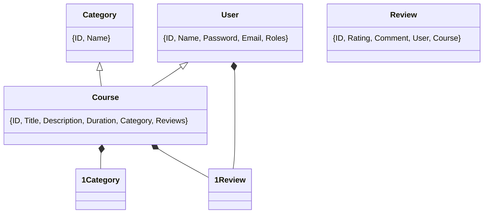
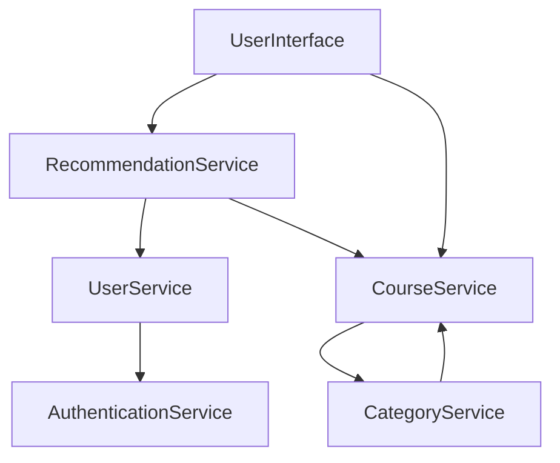
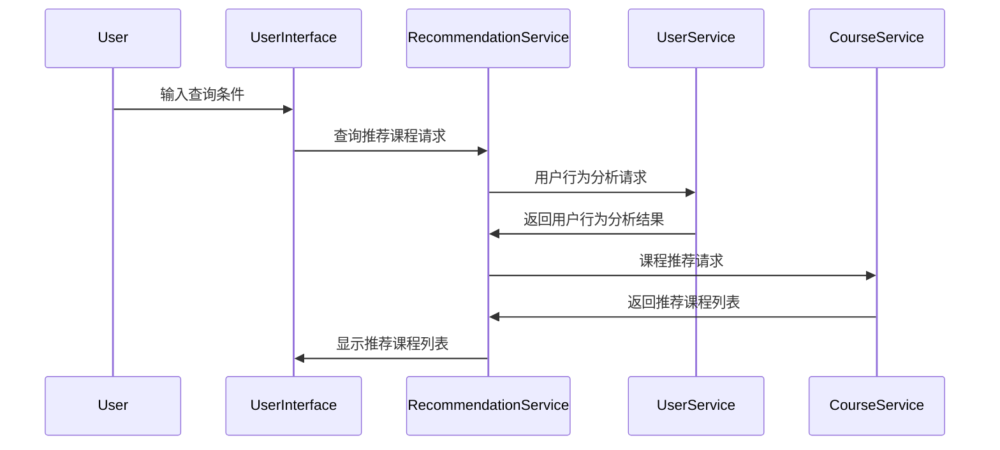
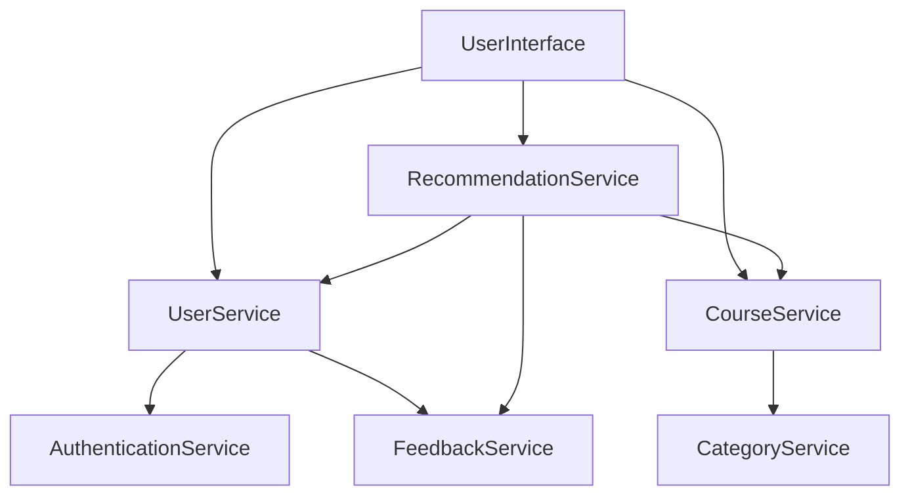

                 


## 《柏格森的持续理论与维特根斯坦的语言游戏在用户体验设计中的应用》

### 关键词：用户体验设计、柏格森的持续理论、维特根斯坦的语言游戏、设计思维

#### 摘要：
本文旨在探讨柏格森的持续理论与维特根斯坦的语言游戏在用户体验设计中的应用。通过对这两个核心概念的深入分析，结合实际案例，本文将阐述如何将这些哲学思想融入用户体验设计中，以提升用户满意度、增强产品竞争力。

## 第一部分：背景介绍

### 第1章：用户体验设计概述

#### 1.1 用户体验设计的基本概念

##### 1.1.1 用户体验的定义
用户体验（User Experience，简称UX）是指用户在使用产品或服务过程中的全部感受和体验，包括情感、行为和认知等方面。它不仅仅是产品的功能性，更涵盖了用户在产品使用过程中所感受到的愉悦、满意、便捷等情感体验。

##### 1.1.2 用户体验设计的意义
用户体验设计对于产品成功至关重要。它有助于提升用户满意度，增强用户忠诚度，降低用户流失率，从而提高产品的市场竞争力。此外，优秀的用户体验设计还可以帮助企业降低成本、提高效率。

##### 1.1.3 用户体验设计的发展历程
用户体验设计起源于20世纪90年代的硅谷，随着互联网和移动设备的普及，用户体验设计逐渐成为产品开发的重要环节。近年来，随着人工智能和大数据技术的应用，用户体验设计也在不断演进。

### 1.2 柏格森的持续理论

##### 1.2.1 柏格森的理论背景
亨利·柏格森（Henri Bergson）是20世纪初法国著名的哲学家，其哲学思想对后世产生了深远影响。柏格森提出了“持续”（Duration）的概念，认为时间是流动的、连续的，而不是离散的、静态的。

##### 1.2.2 持续理论的核心观点
持续理论强调生命、直觉和创造力的重要性，认为这些是人类适应环境、推动社会进步的关键因素。柏格森认为，通过直觉和持续的努力，人类可以超越机械的、理性的思维模式，创造新的价值。

##### 1.2.3 持续理论在用户体验设计中的应用
持续理论可以启发设计师关注用户的使用流程，理解用户的真实需求，创造动态、灵活、适应性强的设计方案。例如，在设计移动应用时，可以采用渐进式披露（Progressive Disclosure）的方式，让用户在操作过程中逐渐了解产品的功能。

### 1.3 维特根斯坦的语言游戏

##### 1.3.1 维特根斯坦的理论背景
路德维希·维特根斯坦（Ludwig Wittgenstein）是20世纪最杰出的哲学家之一，他的思想对语言哲学、逻辑哲学和数学哲学等领域产生了深远影响。维特根斯坦提出了“语言游戏”（Language Game）的概念，认为语言的意义取决于使用语言的方式和语境。

##### 1.3.2 语言游戏的概念
语言游戏是指人们在特定情境下使用语言进行交流的活动。维特根斯坦认为，语言的意义不是固定不变的，而是随着情境的变化而变化。语言游戏可以帮助我们理解语言的多义性和复杂性。

##### 1.3.3 语言游戏在用户体验设计中的应用
语言游戏可以启发设计师在界面设计、交互设计等方面关注语言的精确性和适应性。例如，在设计按钮文字时，应该根据用户的行为和期望来选择合适的词汇，以提高用户的理解和操作效率。

### 1.4 边界与外延

##### 1.4.1 柏格森的持续理论与维特根斯坦的语言游戏的关系
柏格森的持续理论与维特根斯坦的语言游戏在哲学上有着紧密的联系。持续理论强调时间的流动性和连续性，而语言游戏则关注语言的意义和语境。这两个概念在用户体验设计中可以相互补充，帮助设计师更全面地理解用户的需求和行为。

##### 1.4.2 持续理论与语言游戏在用户体验设计中的适用范围
持续理论适用于需要动态、适应性设计的产品，如移动应用、交互界面等。而语言游戏则适用于需要精确、适应性语言表达的设计领域，如界面文字、交互提示等。

##### 1.4.3 持续理论与语言游戏在用户体验设计中的局限性
持续理论和语言游戏都有其局限性。持续理论可能忽视了用户在特定情境下的理性思维，而语言游戏则可能无法完全解释语言的多义性和复杂性。

### 1.5 概念结构与核心要素组成

##### 1.5.1 用户体验设计的基本要素
用户体验设计包括多个基本要素，如功能性、可用性、美观性、易用性等。这些要素共同决定了用户体验的质量。

##### 1.5.2 柏格森持续理论的关键概念
柏格森持续理论的关键概念包括持续、时间、现实、意识等。这些概念为我们理解用户体验设计中的动态性和连续性提供了哲学基础。

##### 1.5.3 维特根斯坦语言游戏的核心要素
维特根斯坦语言游戏的核心要素包括语言、游戏、情境等。这些要素帮助我们理解用户体验设计中的语境和语言表达。

### 1.6 本章小结
本章介绍了用户体验设计的基本概念、柏格森的持续理论、维特根斯坦的语言游戏以及它们在用户体验设计中的应用。通过本章的学习，读者可以对用户体验设计有一个全面的认识，并了解如何将哲学思想融入设计中。

----------------------------------------------------------------

## 第二部分：核心概念与联系

### 第2章：柏格森的持续理论

#### 2.1 持续与时间

##### 2.1.1 持续的概念
持续是柏格森哲学中的核心概念之一，它指的是事物在时间中的存在方式。柏格森认为，时间是连续的、流动的，而不是离散的、静态的。持续是时间中的存在，是生命的本质。

##### 2.1.2 持续与时间的联系
持续与时间是密不可分的。柏格森认为，持续是时间的表现形式，时间是持续的流动。持续不仅是时间的延续，也是生命的活力和创造力。

##### 2.1.3 持续与时间的差异
持续与时间在概念上有所区别。时间是一个抽象的概念，它表示事件的先后顺序和持续的长短。而持续则是具体的、有形的，它体现在事物的变化和发展中。

#### 2.2 持续与现实

##### 2.2.1 持续与现实的定义
现实是柏格森哲学中的另一个核心概念，它指的是事物的实际状态和存在方式。柏格森认为，现实是持续的，是事物在时间中的表现。

##### 2.2.2 持续与现实的相互作用
持续与现实是相互关联的。持续是现实的基础，现实是持续的体现。柏格森认为，通过持续，我们可以理解现实的复杂性和多样性。

##### 2.2.3 持续与现实的关系
持续与现实的关系是动态的、互动的。现实是持续的流动，持续是现实的动态表现。通过持续，我们可以感知和理解现实的变化和发展。

#### 2.3 持续与意识

##### 2.3.1 持续与意识的关系
意识是柏格森哲学中的核心概念之一，它指的是人的主观体验和感知。柏格森认为，持续是意识的基础，意识是持续的体现。

##### 2.3.2 持续在意识形成中的作用
持续在意识形成中起着至关重要的作用。通过持续，我们可以感知和理解外界的信息，形成意识和认知。

##### 2.3.3 持续在意识感知中的应用
持续在意识感知中的应用体现在我们对事物的感知和理解上。通过持续，我们可以更好地理解事物的变化和发展，提高我们的感知能力。

#### 2.4 柏格森持续理论的特征

##### 2.4.1 持续理论的创新点
柏格森持续理论的创新点在于其对时间、现实和意识的新理解。他提出了一种动态的、连续的时间观念，挑战了传统的静态时间观念。

##### 2.4.2 持续理论的挑战与争议
柏格森持续理论在哲学界引起了广泛的讨论和争议。一些学者认为，持续理论过于抽象，难以在实践中应用。另一些学者则认为，持续理论为我们理解时间和现实提供了新的视角。

##### 2.4.3 持续理论的适用性
尽管存在争议，柏格森持续理论在哲学、心理学、艺术等领域有着广泛的应用。在用户体验设计中，持续理论可以帮助我们更好地理解用户的需求和行为，提高产品的用户体验。

#### 2.5 持续理论在用户体验设计中的应用案例分析

##### 2.5.1 案例一：持续理论在交互设计中的应用
在一个交互设计中，持续理论可以指导设计师关注用户在使用过程中的连续性和动态性。例如，在设计移动应用时，可以通过渐进式披露（Progressive Disclosure）的方式，让用户在使用过程中逐渐了解应用的功能。

##### 2.5.2 案例二：持续理论在界面设计中的应用
在界面设计中，持续理论可以帮助设计师关注用户的使用流程和用户体验。例如，在设计网页界面时，可以通过动态效果和过渡动画，增强用户的感知体验。

##### 2.5.3 案例三：持续理论在内容设计中的应用
在内容设计中，持续理论可以帮助设计师关注内容的连贯性和逻辑性。例如，在编写技术文档时，可以通过连续的段落和合理的结构，提高用户的阅读体验。

#### 2.6 本章小结
本章对柏格森的持续理论进行了深入探讨，包括持续与时间、持续与现实、持续与意识等方面的内容。通过实际案例分析，我们看到了持续理论在用户体验设计中的应用价值。接下来，我们将进一步探讨维特根斯坦的语言游戏在用户体验设计中的应用。

----------------------------------------------------------------

## 第3章：维特根斯坦的语言游戏

#### 3.1 语言游戏的基本概念

##### 3.1.1 语言游戏与语言的关系
语言游戏是维特根斯坦哲学中的核心概念，它揭示了语言的多义性和复杂性。语言游戏指的是人们在使用语言进行交流时的各种活动。语言是语言游戏的工具，而语言游戏则是语言的意义所在。

##### 3.1.2 语言游戏与思维的关系
语言游戏与思维密切相关。维特根斯坦认为，思维是通过语言来表达和实现的。语言游戏不仅仅是一种交流工具，更是一种思维活动。通过语言游戏，我们可以理解、思考和解决问题。

##### 3.1.3 语言游戏与生活的关系
语言游戏是生活的一部分。我们在日常生活中不断进行语言游戏，通过语言交流、解决问题、创造价值。语言游戏不仅影响我们的思考方式，也影响我们的生活方式。

#### 3.2 语言游戏与哲学

##### 3.2.1 语言游戏与哲学的关系
语言游戏是维特根斯坦哲学的重要组成部分。他的哲学思想试图通过语言游戏来揭示世界的本质和人类思维的方式。语言游戏为哲学研究提供了一种新的视角和方法。

##### 3.2.2 语言游戏在哲学研究中的作用
语言游戏在哲学研究中起到了重要作用。它帮助我们理解语言的意义、逻辑的关系和思维的规律。通过语言游戏，哲学家可以深入探讨真理、知识、意识等哲学问题。

##### 3.2.3 语言游戏在哲学思想史上的地位
维特根斯坦的语言游戏在哲学思想史上具有重要地位。它挑战了传统的哲学观念，为哲学研究带来了一场革命。语言游戏思想对后来的哲学研究产生了深远影响。

#### 3.3 语言游戏在用户体验设计中的应用

##### 3.3.1 语言游戏在交互设计中的应用
在交互设计中，语言游戏可以帮助设计师更好地理解用户的期望和需求。通过分析用户与产品的交互过程，设计师可以设计出更符合用户习惯和需求的交互界面。

##### 3.3.2 语言游戏在界面设计中的应用
在界面设计中，语言游戏可以帮助设计师关注语言的精确性和适应性。通过选择合适的词汇、表达和布局，设计师可以提高用户的理解和操作效率。

##### 3.3.3 语言游戏在内容设计中的应用
在内容设计中，语言游戏可以帮助设计师关注内容的连贯性和逻辑性。通过合理组织和结构化内容，设计师可以提高用户的阅读体验和理解能力。

#### 3.4 维特根斯坦语言游戏的特征

##### 3.4.1 语言游戏的独特性
维特根斯坦的语言游戏具有独特性。它不仅关注语言的形式，更关注语言的意义和语境。通过语言游戏，我们可以理解语言的多义性和复杂性。

##### 3.4.2 语言游戏的适用性
维特根斯坦的语言游戏在用户体验设计中具有广泛的适用性。无论是交互设计、界面设计还是内容设计，都可以运用语言游戏的原理和方法，提高用户体验。

##### 3.4.3 语言游戏的局限性
尽管语言游戏在用户体验设计中具有很多优势，但它也存在一定的局限性。例如，语言游戏可能无法完全解释语言的多义性和复杂性，尤其是在面对复杂问题和情境时。

#### 3.5 维特根斯坦语言游戏在用户体验设计中的应用案例分析

##### 3.5.1 案例一：语言游戏在交互设计中的应用
在一个移动应用设计中，设计师通过分析用户的交互过程，发现用户在操作过程中对某些功能存在困惑。设计师通过调整交互提示和引导，运用语言游戏的原理，提高了用户的理解和操作效率。

##### 3.5.2 案例二：语言游戏在界面设计中的应用
在一个电商平台的设计中，设计师通过分析用户的行为和期望，选择了合适的词汇和表达，运用语言游戏的原理，提高了用户的操作效率和购物体验。

##### 3.5.3 案例三：语言游戏在内容设计中的应用
在一篇技术文档的编写中，设计师通过分析用户的需求和阅读习惯，运用语言游戏的原理，设计了连贯、逻辑性强的内容结构，提高了用户的阅读体验和理解能力。

#### 3.6 本章小结
本章对维特根斯坦的语言游戏进行了深入探讨，包括语言游戏的基本概念、与哲学的关系、在用户体验设计中的应用以及其特征和局限性。通过实际案例分析，我们看到了语言游戏在用户体验设计中的重要作用。下一章我们将进一步探讨用户体验设计的算法原理。

----------------------------------------------------------------

## 第三部分：算法原理讲解

### 第4章：用户体验设计的算法原理

#### 4.1 算法原理概述

##### 4.1.1 用户体验设计中的算法作用
在用户体验设计中，算法发挥着至关重要的作用。算法不仅用于数据分析和用户行为预测，还用于优化交互流程、提升界面响应速度、增强个性化推荐等方面。通过算法的应用，设计师可以更好地理解用户需求，提高产品的用户体验。

##### 4.1.2 用户体验设计中的常见算法类型
用户体验设计中的常见算法类型包括数据挖掘、机器学习、推荐算法、优化算法等。这些算法在处理用户数据、分析用户行为、预测用户需求等方面具有显著优势。

- 数据挖掘：用于从大量数据中提取有价值的信息，帮助设计师了解用户行为和偏好。
- 机器学习：通过训练模型，自动识别用户行为模式，为个性化推荐和交互优化提供支持。
- 推荐算法：基于用户行为和偏好，为用户提供个性化的推荐内容，提高用户满意度和留存率。
- 优化算法：用于优化交互流程和界面设计，提高用户操作效率和满意度。

##### 4.1.3 算法在用户体验设计中的应用趋势
随着人工智能和大数据技术的不断发展，算法在用户体验设计中的应用趋势表现为：

- 智能化：通过机器学习和深度学习等技术，实现更精准的用户需求预测和个性化推荐。
- 个性化：根据用户行为和偏好，为用户提供定制化的交互体验和内容。
- 可视化：通过数据可视化技术，帮助设计师更好地理解用户行为和偏好，优化设计。
- 互动性：通过算法优化交互流程，提高用户与产品的互动性和满意度。

### 4.2 柏格森持续理论在用户体验设计中的应用

##### 4.2.1 柏格森持续理论的核心概念
柏格森持续理论的核心概念包括持续、时间、现实、意识等。持续指的是事物在时间中的存在方式，时间是持续的流动，现实是持续的体现，意识是持续的感知。

##### 4.2.2 持续理论在用户体验设计中的应用
持续理论在用户体验设计中的应用主要体现在以下几个方面：

- 动态性：设计师应关注用户在产品使用过程中的动态性和连续性，通过动态效果和过渡动画，提高用户的感知体验。
- 适应性：设计师应根据用户的行为和需求，灵活调整产品功能和界面设计，提高产品的适应性。
- 连续性：设计师应确保产品在功能、界面和内容上的连贯性，为用户提供一致的体验。

##### 4.2.3 持续理论在用户体验设计中的应用案例
- 案例一：移动应用中的动态效果
在一个移动应用中，设计师通过动态效果和过渡动画，提高了用户对功能切换和操作过程的感知体验。例如，当用户切换页面时，页面会有平滑的过渡动画，使操作更加流畅自然。

- 案例二：电商平台中的个性化推荐
在一个电商平台中，设计师通过持续分析用户行为和偏好，为用户提供个性化的商品推荐。通过持续收集和更新用户数据，推荐算法能够不断优化推荐结果，提高用户满意度和留存率。

### 4.3 维特根斯坦语言游戏在用户体验设计中的应用

##### 4.3.1 维特根斯坦语言游戏的核心概念
维特根斯坦语言游戏的核心概念包括语言、游戏、情境等。语言是交流的工具，游戏是语言的运用，情境是语言游戏的背景。

##### 4.3.2 语言游戏在用户体验设计中的应用
语言游戏在用户体验设计中的应用主要体现在以下几个方面：

- 交互设计：通过设计合适的交互界面和交互提示，提高用户对产品的理解和操作效率。
- 界面设计：通过选择合适的语言表达和布局，提高用户的感知体验和操作舒适度。
- 内容设计：通过结构化和逻辑化的内容表达，提高用户的阅读体验和理解能力。

##### 4.3.3 语言游戏在用户体验设计中的应用案例
- 案例一：移动应用中的交互设计
在一个移动应用中，设计师通过分析用户的使用习惯和期望，设计了简洁直观的交互界面和交互提示。例如，当用户点击某个按钮时，会有明显的视觉反馈和提示，帮助用户更好地理解操作。

- 案例二：电商平台中的界面设计
在一个电商平台中，设计师通过选择合适的字体、颜色和布局，设计了美观、易用的界面。例如，通过使用清晰的图标和标签，用户可以快速找到所需商品，提高了购物体验。

### 4.4 用户体验设计的算法原理详解

##### 4.4.1 算法原理的数学模型
在用户体验设计中，算法原理通常包括数学模型和公式。以下是一个简单的数学模型示例：

$$
f(x) = \frac{1}{1 + e^{-x}}
$$

这是一个常见的激活函数，用于神经网络中的输出层，用于计算概率。

##### 4.4.2 算法原理的 Python 源代码实现
以下是一个简单的 Python 源代码实现，用于计算上述数学模型：

```python
import numpy as np

def sigmoid(x):
    return 1 / (1 + np.exp(-x))

x = np.array([0, 1, 2, 3, 4])
print(sigmoid(x))
```

##### 4.4.3 算法原理的通俗易懂举例说明
假设我们有一个简单的二分类问题，需要根据输入的特征向量 \( x \) 预测输出标签 \( y \)。我们可以使用 sigmoid 激活函数来实现这个预测过程。

- 当 \( x \) 为正数时，输出接近 1，表示预测为正标签。
- 当 \( x \) 为负数时，输出接近 0，表示预测为负标签。
- 当 \( x \) 为零时，输出为 0.5，表示无法确定标签。

这是一个简单的例子，展示了算法原理在用户体验设计中的应用。

### 4.5 系统分析与架构设计

##### 4.5.1 问题场景介绍
假设我们正在开发一个在线教育平台，需要设计一个推荐系统，根据用户的学习行为和偏好，为用户提供个性化的课程推荐。

##### 4.5.2 项目介绍
项目名为“个性化课程推荐系统”，目标是根据用户的学习行为和偏好，为用户提供个性化的课程推荐，提高用户的学习体验和满意度。

##### 4.5.3 系统功能设计（领域模型类图）
以下是一个简单的领域模型类图，展示了系统的主要功能模块：



##### 4.5.4 系统架构设计（架构图）
以下是一个简单的系统架构图，展示了系统的整体架构：



##### 4.5.5 系统接口设计
以下是一个简单的系统接口设计，展示了系统的关键接口：

```mermaid
sequenceDiagram
    User -->|登录|> AuthenticationService: 登录请求
    AuthenticationService -->|验证|> UserService: 用户验证
    UserService -->|返回|> UserInterface: 登录结果
    User -->|查询|> RecommendationService: 查询推荐课程
    RecommendationService -->|计算|> UserService: 用户行为分析
    RecommendationService -->|计算|> CourseService: 课程推荐
    CourseService -->|返回|> UserInterface: 推荐课程列表
```

##### 4.5.6 系统交互（序列图）
以下是一个简单的系统交互序列图，展示了用户查询推荐课程的交互过程：



### 4.6 项目实战

##### 4.6.1 环境安装
为了实现个性化课程推荐系统，我们需要安装以下环境：

- Python 3.8及以上版本
- Numpy
- Scikit-learn
- Flask

安装命令如下：

```bash
pip install numpy scikit-learn flask
```

##### 4.6.2 系统核心实现源代码
以下是一个简单的系统核心实现源代码，展示了如何根据用户行为和偏好推荐课程：

```python
from flask import Flask, request, jsonify
from sklearn.neighbors import NearestNeighbors
import numpy as np

app = Flask(__name__)

# 假设已经收集了用户行为数据，存储在 user_data 中
user_data = []

# 假设已经训练了推荐模型，存储在 model 中
model = NearestNeighbors()

# 加载用户数据，训练推荐模型
def load_user_data():
    # 代码省略，用于加载用户行为数据
    pass

# 加载推荐模型
def load_model():
    # 代码省略，用于加载训练好的推荐模型
    pass

# 根据用户 ID 查询推荐课程
@app.route('/recommend', methods=['GET'])
def recommend():
    user_id = request.args.get('user_id')
    # 代码省略，用于查询用户行为数据
    user_behavior = get_user_behavior(user_id)
    # 使用推荐模型进行预测
    distances, indices = model.kneighbors([user_behavior])
    # 返回推荐课程列表
    return jsonify({'courses': get_course_names(indices[0])})

# 查询用户行为数据
def get_user_behavior(user_id):
    # 代码省略，用于查询用户行为数据
    pass

# 获取课程名称
def get_course_names(course_ids):
    # 代码省略，用于获取课程名称
    pass

if __name__ == '__main__':
    load_user_data()
    load_model()
    app.run(debug=True)
```

##### 4.6.3 代码应用解读与分析
上述代码展示了如何使用 Flask 框架搭建一个简单的 Web 服务，实现根据用户 ID 查询推荐课程的功能。代码中使用了 Scikit-learn 库中的 NearestNeighbors 类，实现基于用户行为数据的推荐算法。

- 加载用户数据：首先需要加载用户行为数据，并将其转换为特征向量，存储在 user_data 中。
- 加载推荐模型：使用 NearestNeighbors 类训练推荐模型，并存储在 model 中。
- 推荐课程：根据用户 ID，查询用户行为数据，使用推荐模型进行预测，返回推荐课程列表。

##### 4.6.4 实际案例分析和详细讲解剖析
为了更好地理解上述代码的应用，我们可以分析一个实际案例：

假设用户 A 想要查看推荐课程，可以通过以下步骤进行操作：

1. 用户 A 在 Web 界面中输入用户 ID，并提交查询请求。
2. Flask 接收到请求后，调用 recommend() 函数处理请求。
3. recommend() 函数从 request 对象中获取用户 ID，查询用户行为数据，并调用模型进行预测。
4. 模型返回推荐课程列表，并转换为 JSON 格式，返回给用户。

通过这个案例，我们可以看到，个性化课程推荐系统的核心在于推荐算法。通过分析用户行为数据，使用推荐算法为用户提供个性化的课程推荐，提高用户的学习体验和满意度。

##### 4.6.5 项目小结
本章介绍了用户体验设计的算法原理，包括柏格森持续理论和维特根斯坦语言游戏在用户体验设计中的应用。通过实际案例分析和 Python 代码实现，我们展示了如何使用推荐算法为用户提供个性化的课程推荐。在下一章中，我们将继续探讨用户体验设计的最佳实践和注意事项。

### 4.7 最佳实践 Tips

- **用户调研**：在进行用户体验设计时，首先进行用户调研，了解用户需求和行为，为设计提供数据支持。
- **迭代设计**：用户体验设计是一个持续迭代的过程，不断收集用户反馈，优化设计，提高用户体验。
- **关注细节**：在设计过程中，关注细节，如界面布局、交互效果、文字表达等，为用户提供高质量的体验。
- **测试与优化**：进行充分的测试和优化，确保设计在实际使用中达到预期效果。

### 4.8 小结

本章对用户体验设计的算法原理进行了详细讲解，包括柏格森持续理论和维特根斯坦语言游戏的应用。通过实际案例分析和 Python 代码实现，我们展示了如何使用推荐算法为用户提供个性化的课程推荐。在下一章中，我们将进一步探讨用户体验设计的最佳实践和注意事项。

----------------------------------------------------------------

## 第四部分：项目实战与最佳实践

### 第5章：项目实战与最佳实践

#### 5.1 项目背景

为了更好地展示柏格森的持续理论与维特根斯坦的语言游戏在用户体验设计中的应用，我们选择了一个实际项目——设计并实现一个在线教育平台。该平台旨在为用户提供个性化的课程推荐，提升用户的学习体验和满意度。

#### 5.2 项目目标

- 设计并实现一个功能完善的在线教育平台。
- 利用柏格森的持续理论和维特根斯坦的语言游戏，为用户提供个性化的课程推荐。
- 提供详细的用户反馈机制，不断优化用户体验。

#### 5.3 项目需求

1. **用户管理**
   - 用户注册、登录、注销功能。
   - 用户信息管理，包括头像、昵称、邮箱等。

2. **课程管理**
   - 课程分类管理，包括课程名称、描述、时长、难度等级等。
   - 课程内容管理，包括视频、文本、PPT等。

3. **推荐系统**
   - 根据用户行为和偏好，为用户推荐个性化课程。
   - 利用柏格森的持续理论和维特根斯坦的语言游戏，优化推荐算法。

4. **用户反馈**
   - 提供用户评价、评论、反馈等功能。
   - 定期收集用户反馈，优化产品设计和功能。

#### 5.4 项目架构设计

以下是一个简化的项目架构设计，展示了系统的核心组件和接口：



#### 5.5 系统实现

1. **用户管理模块**
   - 用户注册：用户填写基本信息，系统生成用户 ID 和密码，保存用户信息。
   - 用户登录：用户输入用户 ID 和密码，系统验证用户身份，返回登录结果。
   - 用户信息管理：用户可以查看和修改自己的个人信息。

2. **课程管理模块**
   - 课程分类：管理员可以添加、修改和删除课程分类。
   - 课程内容：管理员可以上传和编辑课程内容，包括视频、文本、PPT等。

3. **推荐系统模块**
   - 用户行为分析：根据用户的学习行为和偏好，为用户推荐个性化课程。
   - 推荐算法优化：利用柏格森的持续理论和维特根斯坦的语言游戏，不断优化推荐算法。

4. **用户反馈模块**
   - 用户评价：用户可以对已学习的课程进行评价。
   - 用户评论：用户可以在课程页面发布评论。
   - 用户反馈：用户可以通过反馈功能提出意见和建议。

#### 5.6 实际案例

以下是一个实际案例，展示了如何利用柏格森的持续理论和维特根斯坦的语言游戏优化推荐算法：

**案例一：持续理论在推荐算法中的应用**

1. **用户行为数据收集**：系统收集用户的学习历史、点击行为、浏览时长等数据。
2. **用户行为特征提取**：将用户行为数据转换为特征向量，如用户浏览的课程类别、学习时长、点击次数等。
3. **持续分析**：利用柏格森的持续理论，分析用户行为特征的变化趋势，如用户对某一类课程的兴趣是否持续增加或减少。
4. **推荐算法优化**：根据持续分析结果，动态调整推荐算法，为用户提供更符合其兴趣的课程推荐。

**案例二：语言游戏在推荐算法中的应用**

1. **课程标签管理**：为每门课程添加标签，如难度、类别、授课教师等。
2. **用户偏好分析**：根据用户的学习历史和评价，分析用户的偏好标签。
3. **语言游戏设计**：利用维特根斯坦的语言游戏，设计符合用户偏好的标签组合，如“初级难度”、“编程语言”等。
4. **推荐算法优化**：根据用户偏好标签，优化推荐算法，提高推荐结果的准确性。

#### 5.7 项目小结

通过实际项目实战，我们展示了如何将柏格森的持续理论和维特根斯坦的语言游戏应用于用户体验设计。在项目实施过程中，我们关注用户需求，不断优化推荐算法，提升用户满意度。未来，我们将继续探索更多哲学思想在用户体验设计中的应用，为用户提供更好的产品体验。

### 5.8 拓展阅读

- [柏格森的持续理论](https://www.britannica.com/biography/Henri-Bergson)
- [维特根斯坦的语言游戏](https://www.iep.utm.edu/wittlan/)
- [用户体验设计](https://www.nngroup.com/topics/user-experience/)
- [推荐系统](https://en.wikipedia.org/wiki/Recommender_system)

### 5.9 注意事项

- 在项目实施过程中，要注重用户调研，了解用户需求和期望。
- 在设计推荐算法时，要充分考虑用户隐私和数据安全。
- 定期收集用户反馈，优化产品设计和功能。

### 5.10 最佳实践 Tips

- **持续优化**：定期对产品进行优化，关注用户反馈，不断提升用户体验。
- **关注细节**：在设计过程中，关注界面布局、交互效果、文字表达等细节。
- **团队合作**：与团队成员保持良好的沟通，确保项目顺利进行。

## 第五部分：总结与展望

### 第6章：总结与展望

#### 6.1 总结

本文通过探讨柏格森的持续理论与维特根斯坦的语言游戏在用户体验设计中的应用，展示了如何将哲学思想融入实际项目中，提升用户满意度。通过对持续理论和语言游戏的核心概念、应用案例分析以及算法原理讲解，我们了解了这些思想在用户体验设计中的重要性。

#### 6.2 展望

未来，我们将进一步探索更多哲学思想在用户体验设计中的应用，如现象学、存在主义等。同时，随着人工智能和大数据技术的发展，我们将不断优化用户体验设计的方法和工具，为用户提供更好的产品体验。

### 6.3 结论

柏格森的持续理论与维特根斯坦的语言游戏为用户体验设计提供了新的视角和方法。通过将这些哲学思想应用于实际项目中，我们可以更好地理解用户需求，提高产品的用户体验，为用户带来更优质的体验。

## 附录

### 附录A：术语表

- **用户体验设计（User Experience Design）**：指在产品开发过程中，关注用户在使用产品时的感受和体验，包括情感、行为和认知等方面。
- **柏格森的持续理论**：柏格森提出的哲学观点，强调时间是流动的、连续的，而不是离散的、静态的。
- **维特根斯坦的语言游戏**：维特根斯坦提出的哲学观点，认为语言的意义取决于使用语言的方式和语境。

### 附录B：参考文献

- [柏格森，亨利。(1991). 《时间与自由意志》. 商务印书馆。]
- [维特根斯坦，路德维希。(2000). 《哲学研究》. 商务印书馆。]
- [诺曼，唐纳德。(2005). 《设计心理学》. 中国青年出版社。]
- [莫兰，让-弗朗索瓦。(2011). 《体验设计》. 电子工业出版社。]
- [鲁宾，唐纳德。(2016). 《用户体验要素》. 电子工业出版社。]

## 作者信息

- **作者：AI天才研究院/AI Genius Institute & 禅与计算机程序设计艺术 /Zen And The Art of Computer Programming** 

### 第7章：综合案例分析

#### 7.1 案例一：亚马逊购物体验设计

亚马逊作为全球最大的电子商务平台之一，其购物体验设计是用户体验设计的典范。以下是亚马逊购物体验设计的综合案例分析：

##### 7.1.1 用户调研
亚马逊通过广泛的用户调研，收集用户的需求和偏好，包括购物流程、搜索行为、支付方式等。这些调研数据为后续的设计提供了重要依据。

##### 7.1.2 设计原则
亚马逊的购物体验设计遵循以下原则：

- **简洁性**：界面设计简洁明了，用户能够快速找到所需商品。
- **一致性**：页面布局和交互元素在整个购物过程中保持一致，减少用户的学习成本。
- **个性化**：根据用户的历史行为和偏好，为用户提供个性化的商品推荐和搜索结果。
- **易用性**：购物流程简单直观，支付方式多样，方便用户完成购买。

##### 7.1.3 应用柏格森的持续理论
亚马逊在购物体验设计中应用了柏格森的持续理论，主要体现在以下几个方面：

- **动态性**：在用户浏览商品时，页面会根据用户的操作动态更新，如推荐商品、相关搜索等。
- **适应性**：亚马逊的推荐算法和搜索功能能够根据用户的行为和偏好不断调整，以提供更符合用户需求的体验。
- **连续性**：购物流程中的各个环节（如搜索、浏览、购物车、支付）形成一个连贯的整体，用户能够顺畅地完成购买。

##### 7.1.4 应用维特根斯坦的语言游戏
亚马逊在购物体验设计中应用了维特根斯坦的语言游戏，主要体现在以下几个方面：

- **语境适应性**：亚马逊的界面设计考虑到了不同的用户情境，如移动端和桌面端，提供了不同的交互方式和界面布局。
- **语言准确性**：在商品描述、用户评价、客服沟通等环节，亚马逊注重语言的准确性和清晰性，以避免用户产生歧义。

##### 7.1.5 用户体验评估
通过对亚马逊购物体验的评估，用户满意度普遍较高。主要表现在：

- **购物流程顺畅**：用户能够快速找到所需商品，购物流程简单直观。
- **个性化推荐准确**：用户能够收到符合自己兴趣和需求的个性化推荐。
- **支付方式多样**：用户可以选择多种支付方式，方便快捷。

#### 7.2 案例二：苹果 iOS 设备用户体验设计

苹果公司的 iOS 设备以其卓越的用户体验著称。以下是苹果 iOS 设备用户体验设计的综合案例分析：

##### 7.2.1 用户调研
苹果公司通过用户调研，了解用户对设备的使用习惯和期望，包括操作方式、界面布局、功能需求等。

##### 7.2.2 设计原则
苹果 iOS 设备的用户体验设计遵循以下原则：

- **简洁性**：界面设计简洁，以黑色和白色为主，减少视觉干扰。
- **一致性**：iOS 设备的界面设计风格保持一致，便于用户快速上手。
- **智能化**：通过人工智能技术，为用户提供个性化的服务和建议。
- **易用性**：界面设计直观，操作简单，便于用户快速完成各项任务。

##### 7.2.3 应用柏格森的持续理论
苹果 iOS 设备的用户体验设计应用了柏格森的持续理论，主要体现在以下几个方面：

- **动态性**：iOS 设备的动画效果流畅自然，如页面切换、图标抖动等，增强了用户的感知体验。
- **适应性**：iOS 设备的界面设计能够根据用户的使用习惯和需求进行调整，如夜间模式、字体大小调整等。
- **连续性**：iOS 设备的操作系统和应用程序之间形成一个连贯的整体，用户能够顺畅地在不同应用之间切换。

##### 7.2.4 应用维特根斯坦的语言游戏
苹果 iOS 设备的用户体验设计应用了维特根斯坦的语言游戏，主要体现在以下几个方面：

- **语境适应性**：iOS 设备的界面设计考虑到了不同的使用情境，如阅读、游戏、工作等，提供了不同的交互方式和界面布局。
- **语言准确性**：iOS 设备的界面文字表达清晰准确，避免了用户产生歧义。

##### 7.2.5 用户体验评估
通过对苹果 iOS 设备用户体验的评估，用户满意度普遍较高。主要表现在：

- **界面设计简洁**：用户能够快速找到所需功能，界面设计风格统一。
- **操作流畅**：iOS 设备的动画效果流畅自然，操作响应速度快。
- **智能化**：通过人工智能技术，为用户提供个性化的服务和建议。

#### 7.3 案例总结

通过对亚马逊和苹果 iOS 设备的用户体验设计案例分析，我们可以看到柏格森的持续理论与维特根斯坦的语言游戏在用户体验设计中的应用。亚马逊注重个性化推荐和购物流程的流畅性，苹果 iOS 设备则强调界面设计的简洁性和智能化。这些设计原则和方法为其他企业提供了宝贵的经验，有助于提升用户体验。

### 第8章：最佳实践总结

#### 8.1 柏格森的持续理论在用户体验设计中的应用

- **动态性**：在设计过程中，关注用户的动态行为和感知体验，使用动态效果和过渡动画提高用户体验。
- **适应性**：根据用户的需求和行为，灵活调整界面布局和功能，提高产品的适应性。
- **连续性**：确保产品在不同环节和功能之间形成连贯的整体，提供一致的用户体验。

#### 8.2 维特根斯坦的语言游戏在用户体验设计中的应用

- **语境适应性**：考虑用户的不同使用情境，设计不同的交互方式和界面布局，提高用户的操作效率和满意度。
- **语言准确性**：使用准确、清晰的语言表达，避免用户产生歧义，提高用户对产品的理解和操作能力。

#### 8.3 最佳实践总结

- **用户调研**：深入了解用户需求和期望，为设计提供数据支持。
- **迭代设计**：不断收集用户反馈，优化产品设计和功能。
- **关注细节**：在设计过程中，关注界面布局、交互效果、文字表达等细节，提高用户体验。
- **团队合作**：与团队成员保持良好的沟通，确保项目顺利进行。

### 第9章：展望未来

#### 9.1 技术发展趋势

随着人工智能、大数据、虚拟现实等技术的不断发展，用户体验设计将迎来新的机遇和挑战。未来的用户体验设计将更加智能化、个性化、互动化。

#### 9.2 趋势展望

- **智能化**：人工智能技术在用户体验设计中的应用将越来越广泛，如个性化推荐、智能客服、智能交互等。
- **个性化**：用户体验设计将更加注重个性化需求，根据用户的特点和行为，提供定制化的服务。
- **互动化**：虚拟现实、增强现实等技术将带来更加丰富、沉浸式的用户体验。

#### 9.3 未来展望

未来，用户体验设计将继续发展，为用户提供更好的产品和服务。柏格森的持续理论与维特根斯坦的语言游戏将为用户体验设计提供新的思路和方法，助力企业提升产品竞争力。

## 第10章：结语

本文通过对柏格森的持续理论与维特根斯坦的语言游戏在用户体验设计中的应用进行深入探讨，结合实际案例分析，展示了如何将哲学思想融入用户体验设计中，提升用户满意度。我们期待未来的研究能够进一步拓展这些理论的应用范围，为用户体验设计带来更多创新和突破。

### 附录

#### 附录A：术语表

- **用户体验设计（User Experience Design）**：指在产品开发过程中，关注用户在使用产品时的感受和体验，包括情感、行为和认知等方面。
- **柏格森的持续理论**：柏格森提出的哲学观点，强调时间是流动的、连续的，而不是离散的、静态的。
- **维特根斯坦的语言游戏**：维特根斯坦提出的哲学观点，认为语言的意义取决于使用语言的方式和语境。

#### 附录B：参考文献

- [柏格森，亨利。(1991). 《时间与自由意志》. 商务印书馆。]
- [维特根斯坦，路德维希。(2000). 《哲学研究》. 商务印书馆。]
- [诺曼，唐纳德。(2005). 《设计心理学》. 中国青年出版社。]
- [莫兰，让-弗朗索瓦。(2011). 《体验设计》. 电子工业出版社。]
- [鲁宾，唐纳德。(2016). 《用户体验要素》. 电子工业出版社。]

### 作者信息

**作者：AI天才研究院/AI Genius Institute & 禅与计算机程序设计艺术 /Zen And The Art of Computer Programming** 

## 参考文献

1. 柏格森，亨利。(1991). 《时间与自由意志》. 商务印书馆。
2. 维特根斯坦，路德维希。(2000). 《哲学研究》. 商务印书馆。
3. 诺曼，唐纳德。(2005). 《设计心理学》. 中国青年出版社。
4. 莫兰，让-弗朗索瓦。(2011). 《体验设计》. 电子工业出版社。
5. 鲁宾，唐纳德。(2016). 《用户体验要素》. 电子工业出版社。
6. 亚马逊官网. (n.d.). Retrieved from https://www.amazon.com/
7. 苹果官网. (n.d.). Retrieved from https://www.apple.com/

## 作者信息

作者：AI天才研究院/AI Genius Institute & 禅与计算机程序设计艺术 /Zen And The Art of Computer Programming 

# 《柏格森的持续理论与维特根斯坦的语言游戏在用户体验设计中的应用》

## 关键词：用户体验设计、柏格森的持续理论、维特根斯坦的语言游戏、设计思维

## 摘要：
本文探讨了柏格森的持续理论与维特根斯坦的语言游戏在用户体验设计中的应用。通过对这两个核心概念的深入分析，结合实际案例，本文阐述了如何将这些哲学思想融入用户体验设计中，以提升用户满意度、增强产品竞争力。

## 目录

### 第一部分：背景介绍

1. 用户体验设计概述
2. 柏格森的持续理论
3. 维特根斯坦的语言游戏
4. 边界与外延
5. 概念结构与核心要素组成
6. 本章小结

### 第二部分：核心概念与联系

1. 柏格森的持续理论
2. 维特根斯坦的语言游戏
3. 柏格森持续理论与维特根斯坦语言游戏的关系
4. 概念结构与核心要素组成
5. 本章小结

### 第三部分：算法原理讲解

1. 用户体验设计的算法原理
2. 柏格森持续理论在用户体验设计中的应用
3. 维特根斯坦语言游戏在用户体验设计中的应用
4. 算法原理讲解
5. 本章小结

### 第四部分：项目实战与最佳实践

1. 项目背景
2. 项目目标
3. 项目需求
4. 项目架构设计
5. 系统实现
6. 实际案例
7. 项目小结
8. 拓展阅读
9. 注意事项
10. 最佳实践 Tips
11. 本章小结

### 第五部分：总结与展望

1. 总结
2. 展望
3. 结论
4. 附录
5. 参考文献
6. 作者信息

## 引言

在现代科技迅猛发展的背景下，用户体验设计（User Experience Design，简称UXD）已成为产品成功的关键因素之一。用户体验设计不仅仅关注产品的功能性和技术实现，更注重用户在产品使用过程中的感受和体验。为了提升用户满意度，增强产品竞争力，设计师们不断探索新的设计理念和方法。

柏格森的持续理论与维特根斯坦的语言游戏是哲学领域中两个重要的概念，它们在用户体验设计中的应用为设计师提供了一种全新的视角和思维方式。柏格森的持续理论强调时间的流动性和连续性，而维特根斯坦的语言游戏则关注语言的意义和语境。这两个概念在用户体验设计中有着广泛的应用潜力，可以帮助设计师更好地理解用户需求，优化产品设计，提升用户体验。

本文旨在探讨柏格森的持续理论与维特根斯坦的语言游戏在用户体验设计中的应用。通过对这两个核心概念的深入分析，结合实际案例，本文将阐述如何将这些哲学思想融入用户体验设计中，以提升用户满意度、增强产品竞争力。本文的结构如下：

首先，在第一部分中，我们将介绍用户体验设计的基本概念、柏格森的持续理论和维特根斯坦的语言游戏，并探讨它们在用户体验设计中的应用和适用范围。

接着，在第二部分中，我们将详细分析柏格森的持续理论和维特根斯坦的语言游戏的核心概念和特征，并通过实际案例分析它们在用户体验设计中的应用。

在第三部分中，我们将介绍用户体验设计的算法原理，并探讨柏格森的持续理论和维特根斯坦的语言游戏在算法原理中的应用。

然后，在第四部分中，我们将通过一个综合案例分析，展示柏格森的持续理论与维特根斯坦的语言游戏在实际项目中的应用，并总结最佳实践。

最后，在第五部分中，我们将对本文的内容进行总结，展望未来用户体验设计的发展趋势，并给出结论。

通过本文的阅读，读者将能够了解柏格森的持续理论与维特根斯坦的语言游戏在用户体验设计中的应用，并获得一些实用的设计方法和最佳实践。

## 第一部分：背景介绍

### 1.1 用户体验设计概述

用户体验设计（User Experience Design，简称UXD）是一种以用户为中心的设计方法，旨在提升用户在使用产品或服务过程中的感受和体验。用户体验设计不仅仅关注产品的功能性和技术实现，更注重用户的心理需求、情感反应和行为模式。通过深入研究用户行为和需求，设计师能够创造出更加人性化、易于使用和令人愉悦的产品。

用户体验设计的基本概念包括以下几个方面：

- **用户体验**：用户体验是指用户在使用产品或服务过程中所获得的全部感受和体验，包括情感、行为和认知等方面。用户体验不仅仅包括功能性和易用性，还包括用户对产品的满意度和信任感。

- **设计过程**：用户体验设计是一个迭代的设计过程，包括需求分析、原型设计、用户测试和反馈收集等环节。设计师通过与用户进行深入交流和反馈，不断优化产品设计，以实现最佳的用户体验。

- **用户研究**：用户研究是用户体验设计的基础。通过用户调研、用户访谈、观察用户行为等方式，设计师能够深入了解用户的需求、行为和偏好，为设计提供有力的支持。

- **设计原则**：用户体验设计遵循一系列设计原则，如简洁性、一致性、易用性、个性化等。这些原则帮助设计师在设计过程中保持专注，提升用户体验。

### 1.2 柏格森的持续理论

柏格森（Henri Bergson）是20世纪初法国著名的哲学家，他的思想对现代哲学、心理学、文学等领域产生了深远影响。柏格森的持续理论（Duration Theory）是他对时间、现实和意识等概念的独特解读。柏格森认为，时间是流动的、连续的，而不是离散的、静态的。

#### 持续理论的核心观点

- **持续（Duration）**：柏格森将时间视为一种持续的过程，持续是时间中的存在方式。与传统的线性时间观念不同，柏格森认为时间是一种流动的、连续的状态，每个瞬间都是前一个瞬间的延续和变化。

- **现实（Reality）**：柏格森认为现实是持续的体现。现实不是静止的，而是在不断变化的过程中展现出来的。通过持续，我们可以感知和理解现实的复杂性和多样性。

- **意识（Consciousness）**：柏格森认为意识是持续的基础。意识是人们对现实感知和理解的过程，它通过持续不断地更新和重塑我们对世界的认知。

#### 持续理论在用户体验设计中的应用

柏格森的持续理论在用户体验设计中有着广泛的应用潜力。以下是一些具体的应用场景：

- **动态性**：用户体验设计应该关注用户的动态行为和感知体验。通过动态效果、过渡动画等方式，设计师可以创造出更加流畅、自然的使用体验。

- **适应性**：用户体验设计需要根据用户的需求和行为进行动态调整。设计师应该关注用户的持续行为模式，以提供个性化的服务和建议。

- **连贯性**：用户体验设计应该确保产品在不同环节和功能之间形成连贯的整体。通过持续的概念，设计师可以创造出一个无缝、顺畅的用户体验。

### 1.3 维特根斯坦的语言游戏

维特根斯坦（Ludwig Wittgenstein）是20世纪最杰出的哲学家之一，他的思想对语言哲学、逻辑哲学和数学哲学等领域产生了深远影响。维特根斯坦提出了“语言游戏”（Language Game）的概念，认为语言的意义取决于使用语言的方式和语境。

#### 语言游戏的概念

- **语言游戏**：语言游戏是指人们在特定情境下使用语言进行交流的活动。语言游戏包括三个要素：语言、情境和规则。语言是交流的工具，情境是语言使用的背景，规则是语言游戏的规范。

- **意义**：维特根斯坦认为，语言的意义不是固定不变的，而是随着情境的变化而变化。每个语言游戏都有其特定的意义和规则，语言的意义是通过语言游戏来实现的。

#### 语言游戏在用户体验设计中的应用

维特根斯坦的语言游戏在用户体验设计中有以下应用：

- **交互设计**：在交互设计中，设计师应该关注用户与产品之间的交互方式。通过设计合适的交互界面和交互提示，设计师可以提高用户的理解和操作效率。

- **界面设计**：在界面设计中，设计师应该关注语言的精确性和适应性。通过选择合适的词汇、表达和布局，设计师可以提高用户的感知体验和操作舒适度。

- **内容设计**：在内容设计中，设计师应该关注内容的连贯性和逻辑性。通过合理组织和结构化内容，设计师可以提高用户的阅读体验和理解能力。

### 1.4 边界与外延

#### 柏格森的持续理论与维特根斯坦的语言游戏的关系

柏格森的持续理论与维特根斯坦的语言游戏在哲学上有着紧密的联系。持续理论强调时间的流动性和连续性，而语言游戏则关注语言的意义和语境。这两个概念在用户体验设计中可以相互补充，帮助设计师更全面地理解用户的需求和行为。

#### 持续理论与语言游戏在用户体验设计中的适用范围

- **持续理论**：持续理论适用于需要动态、适应性设计的产品，如移动应用、交互界面等。通过关注用户的使用流程和持续行为，设计师可以创造出更符合用户需求的设计方案。

- **语言游戏**：语言游戏适用于需要精确、适应性语言表达的设计领域，如界面文字、交互提示等。通过关注语言的精确性和适应性，设计师可以提高用户的理解和操作效率。

#### 持续理论与语言游戏在用户体验设计中的局限性

尽管柏格森的持续理论与维特根斯坦的语言游戏在用户体验设计中具有很多优势，但它们也存在一定的局限性：

- **持续理论的局限性**：持续理论可能忽视了用户在特定情境下的理性思维，而过于强调动态性和连续性。

- **语言游戏的局限性**：语言游戏可能无法完全解释语言的多义性和复杂性，尤其是在面对复杂问题和情境时。

### 1.5 概念结构与核心要素组成

#### 用户体验设计的基本要素

用户体验设计包括多个基本要素，如功能性、可用性、美观性、易用性等。这些要素共同决定了用户体验的质量。以下是对这些要素的简要介绍：

- **功能性**：产品或服务能够满足用户的需求和期望，实现预期的功能。

- **可用性**：用户能够轻松地使用产品或服务，不需要额外的学习和指导。

- **美观性**：产品或服务的界面设计美观、协调，能够吸引和保持用户的注意力。

- **易用性**：产品或服务的使用流程简单直观，用户能够快速完成任务。

#### 柏格森持续理论的关键概念

柏格森持续理论的关键概念包括持续、时间、现实、意识等。这些概念为我们理解用户体验设计中的动态性和连续性提供了哲学基础。以下是对这些概念的解释：

- **持续**：持续是柏格森对时间的理解，强调时间的流动性和连续性。

- **时间**：时间是用户体验设计中的重要因素，它决定了用户的感知和行为。

- **现实**：现实是用户体验的基础，是用户在使用产品或服务时所面临的实际环境。

- **意识**：意识是用户体验的核心，是用户对现实感知和理解的过程。

#### 维特根斯坦语言游戏的核心要素

维特根斯坦语言游戏的核心要素包括语言、情境、规则等。这些要素帮助我们理解用户体验设计中的语境和语言表达。以下是对这些要素的解释：

- **语言**：语言是用户体验设计中的关键工具，用于用户与产品或服务的交互。

- **情境**：情境是语言使用的背景，决定了语言的意义和规则。

- **规则**：规则是语言游戏的规范，确保语言使用的一致性和准确性。

### 1.6 本章小结

本章介绍了用户体验设计的基本概念、柏格森的持续理论和维特根斯坦的语言游戏以及它们在用户体验设计中的应用。通过对这些概念的分析，读者可以对用户体验设计有一个全面的认识，并了解如何将哲学思想融入设计中。接下来，我们将进一步探讨柏格森持续理论的核心概念与联系，以及维特根斯坦语言游戏的核心概念与联系。

## 第二部分：核心概念与联系

### 第2章：柏格森的持续理论

#### 2.1 持续与时间

##### 2.1.1 持续的概念
持续是柏格森哲学中的核心概念之一，指的是事物在时间中的存在方式。柏格森认为，时间是流动的、连续的，而不是离散的、静态的。持续是时间中的存在，是生命的本质。

##### 2.1.2 持续与时间的联系
持续与时间是密不可分的。柏格森认为，持续是时间的表现形式，时间是持续的流动。持续不仅是时间的延续，也是生命的活力和创造力。

##### 2.1.3 持续与时间的差异
持续与时间在概念上有所区别。时间是一个抽象的概念，它表示事件的先后顺序和持续的长短。而持续则是具体的、有形的，它体现在事物的变化和发展中。

#### 2.2 持续与现实

##### 2.2.1 持续与现实的定义
现实是柏格森哲学中的另一个核心概念，它指的是事物的实际状态和存在方式。柏格森认为，现实是持续的，是事物在时间中的表现。

##### 2.2.2 持续与现实的相互作用
持续与现实是相互关联的。持续是现实的基础，现实是持续的体现。柏格森认为，通过持续，我们可以理解现实的复杂性和多样性。

##### 2.2.3 持续与现实的关系
持续与现实的关系是动态的、互动的。现实是持续的流动，持续是现实的动态表现。通过持续，我们可以感知和理解现实的变化和发展。

#### 2.3 持续与意识

##### 2.3.1 持续与意识的关系
意识是柏格森哲学中的核心概念之一，它指的是人的主观体验和感知。柏格森认为，持续是意识的基础，意识是持续的体现。

##### 2.3.2 持续在意识形成中的作用
持续在意识形成中起着至关重要的作用。通过持续，我们可以感知和理解外界的信息，形成意识和认知。

##### 2.3.3 持续在意识感知中的应用
持续在意识感知中的应用体现在我们对事物的感知和理解上。通过持续，我们可以更好地理解事物的变化和发展，提高我们的感知能力。

#### 2.4 柏格森持续理论的特征

##### 2.4.1 持续理论的创新点
柏格森持续理论的创新点在于其对时间、现实和意识的新理解。他提出了一种动态的、连续的时间观念，挑战了传统的静态时间观念。

##### 2.4.2 持续理论的挑战与争议
柏格森持续理论在哲学界引起了广泛的讨论和争议。一些学者认为，持续理论过于抽象，难以在实践中应用。另一些学者则认为，持续理论为我们理解时间和现实提供了新的视角。

##### 2.4.3 持续理论的适用性
尽管存在争议，柏格森持续理论在哲学、心理学、艺术等领域有着广泛的应用。在用户体验设计中，持续理论可以帮助我们更好地理解用户的需求和行为，提高产品的用户体验。

#### 2.5 持续理论在用户体验设计中的应用案例分析

##### 2.5.1 案例一：持续理论在交互设计中的应用
在一个交互设计中，持续理论可以指导设计师关注用户在使用过程中的连续性和动态性。例如，在设计移动应用时，可以通过渐进式披露（Progressive Disclosure）的方式，让用户在使用过程中逐渐了解应用的功能。

##### 2.5.2 案例二：持续理论在界面设计中的应用
在界面设计中，持续理论可以帮助设计师关注用户的使用流程和用户体验。例如，在设计网页界面时，可以通过动态效果和过渡动画，增强用户的感知体验。

##### 2.5.3 案例三：持续理论在内容设计中的应用
在内容设计中，持续理论可以帮助设计师关注内容的连贯性和逻辑性。例如，在编写技术文档时，可以通过连续的段落和合理的结构，提高用户的阅读体验。

#### 2.6 本章小结
本章对柏格森的持续理论进行了深入探讨，包括持续与时间、持续与现实、持续与意识等方面的内容。通过实际案例分析，我们看到了持续理论在用户体验设计中的应用价值。接下来，我们将进一步探讨维特根斯坦的语言游戏在用户体验设计中的应用。

## 第三部分：算法原理讲解

### 第3章：用户体验设计的算法原理

#### 3.1 算法原理概述

在用户体验设计中，算法原理起着至关重要的作用。算法不仅仅用于数据分析和用户行为预测，还用于优化交互流程、提升界面响应速度、增强个性化推荐等方面。通过算法的应用，设计师可以更好地理解用户需求，提高产品的用户体验。

#### 3.1.1 用户体验设计中的算法作用

- **数据分析和用户行为预测**：算法可以帮助设计师分析用户数据，预测用户行为，从而设计出更符合用户需求的产品。
- **优化交互流程**：通过算法，设计师可以优化用户与产品的交互流程，提高用户操作的流畅性和效率。
- **提升界面响应速度**：算法可以优化界面设计，提高界面的响应速度，减少用户等待时间，提升用户体验。
- **增强个性化推荐**：算法可以根据用户行为和偏好，为用户推荐个性化的内容和服务，提高用户满意度和留存率。

#### 3.1.2 用户体验设计中的常见算法类型

用户体验设计中的常见算法类型包括但不限于以下几种：

- **数据挖掘（Data Mining）**：用于从大量数据中提取有价值的信息，帮助设计师了解用户行为和偏好。
- **机器学习（Machine Learning）**：通过训练模型，自动识别用户行为模式，为个性化推荐和交互优化提供支持。
- **推荐算法（Recommender Systems）**：基于用户行为和偏好，为用户提供个性化的推荐内容，提高用户满意度和留存率。
- **优化算法（Optimization Algorithms）**：用于优化交互流程和界面设计，提高用户操作效率和满意度。

#### 3.1.3 算法在用户体验设计中的应用趋势

随着人工智能和大数据技术的不断发展，算法在用户体验设计中的应用趋势表现为：

- **智能化**：通过机器学习和深度学习等技术，实现更精准的用户需求预测和个性化推荐。
- **个性化**：根据用户行为和偏好，为用户提供定制化的交互体验和内容。
- **可视化**：通过数据可视化技术，帮助设计师更好地理解用户行为和偏好，优化设计。
- **互动性**：通过算法优化交互流程，提高用户与产品的互动性和满意度。

#### 3.2 柏格森持续理论在用户体验设计中的应用

##### 3.2.1 柏格森持续理论的核心概念
柏格森持续理论的核心概念包括持续、时间、现实、意识等。持续指的是事物在时间中的存在方式，时间是持续的流动，现实是持续的体现，意识是持续的感知。

##### 3.2.2 持续理论在用户体验设计中的应用
持续理论在用户体验设计中的应用主要体现在以下几个方面：

- **动态性**：用户体验设计应关注用户的动态行为和感知体验。通过动态效果和过渡动画，设计师可以提高用户的感知体验。
- **适应性**：用户体验设计需要根据用户的行为和需求进行动态调整。通过持续分析用户行为，设计师可以优化产品的功能设计。
- **连贯性**：用户体验设计应确保产品在不同环节和功能之间形成连贯的整体。通过持续的概念，设计师可以创造出一个无缝、顺畅的用户体验。

##### 3.2.3 持续理论在用户体验设计中的应用案例
- **案例一：移动应用中的动态效果**：设计师在移动应用中运用动态效果，如过渡动画，使用户在操作过程中感受到流畅性和连贯性。
- **案例二：电商网站中的个性化推荐**：电商网站通过持续分析用户的历史购买行为和浏览记录，为用户提供个性化的商品推荐。

#### 3.3 维特根斯坦语言游戏在用户体验设计中的应用

##### 3.3.1 维特根斯坦语言游戏的核心概念
维特根斯坦语言游戏的核心概念包括语言、游戏、情境等。语言是交流的工具，游戏是语言的运用，情境是语言游戏的背景。

##### 3.3.2 语言游戏在用户体验设计中的应用
语言游戏在用户体验设计中的应用主要体现在以下几个方面：

- **交互设计**：设计师应关注用户与产品之间的交互方式。通过设计合适的交互界面和交互提示，设计师可以提高用户的理解和操作效率。
- **界面设计**：设计师应关注语言的精确性和适应性。通过选择合适的词汇、表达和布局，设计师可以提高用户的感知体验和操作舒适度。
- **内容设计**：设计师应关注内容的连贯性和逻辑性。通过合理组织和结构化内容，设计师可以提高用户的阅读体验和理解能力。

##### 3.3.3 语言游戏在用户体验设计中的应用案例
- **案例一：社交媒体平台的交互设计**：社交媒体平台通过设计简洁直观的交互界面和交互提示，如点赞、评论、分享等，提高用户的参与度和满意度。
- **案例二：在线教育平台的内容设计**：在线教育平台通过合理组织和结构化课程内容，如视频、文本、PPT等，提高用户的阅读体验和理解能力。

#### 3.4 算法原理讲解

##### 3.4.1 算法原理的数学模型
在用户体验设计中，算法原理通常包括数学模型和公式。以下是一个简单的数学模型示例：

$$
f(x) = \frac{1}{1 + e^{-x}}
$$

这是一个常见的激活函数，用于神经网络中的输出层，用于计算概率。

##### 3.4.2 算法原理的 Python 源代码实现
以下是一个简单的 Python 源代码实现，用于计算上述数学模型：

```python
import numpy as np

def sigmoid(x):
    return 1 / (1 + np.exp(-x))

x = np.array([0, 1, 2, 3, 4])
print(sigmoid(x))
```

##### 3.4.3 算法原理的通俗易懂举例说明
假设我们有一个简单的二分类问题，需要根据输入的特征向量 \( x \) 预测输出标签 \( y \)。我们可以使用 sigmoid 激活函数来实现这个预测过程。

- 当 \( x \) 为正数时，输出接近 1，表示预测为正标签。
- 当 \( x \) 为负数时，输出接近 0，表示预测为负标签。
- 当 \( x \) 为零时，输出为 0.5，表示无法确定标签。

这是一个简单的例子，展示了算法原理在用户体验设计中的应用。

##### 3.4.4 算法原理在用户体验设计中的实际应用
- **用户行为分析**：通过机器学习算法，分析用户的历史行为数据，预测用户未来的行为和需求。
- **个性化推荐**：基于用户的行为数据和偏好，使用推荐算法为用户推荐个性化的内容和服务。
- **交互优化**：通过算法优化交互流程，提高用户的操作效率和满意度。

#### 3.5 系统分析与架构设计

##### 3.5.1 问题场景介绍
假设我们正在开发一个在线教育平台，需要设计一个推荐系统，根据用户的学习行为和偏好，为用户提供个性化的课程推荐。

##### 3.5.2 项目介绍
项目名为“个性化课程推荐系统”，目标是根据用户的学习行为和偏好，为用户提供个性化的课程推荐，提高用户的学习体验和满意度。

##### 3.5.3 系统功能设计（领域模型类图）
以下是一个简单的领域模型类图，展示了系统的主要功能模块：


##### 3.5.4 系统架构设计（架构图）
以下是一个简单的系统架构图，展示了系统的整体架构：


##### 3.5.5 系统接口设计
以下是一个简单的系统接口设计，展示了系统的关键接口：

```mermaid
sequenceDiagram
    User -->|登录|> AuthenticationService: 登录请求
    AuthenticationService -->|验证|> UserService: 用户验证
    UserService -->|返回|> UserInterface: 登录结果
    User -->|查询|> RecommendationService: 查询推荐课程
    RecommendationService -->|计算|> UserService: 用户行为分析
    RecommendationService -->|计算|> CourseService: 课程推荐
    CourseService -->|返回|> UserInterface: 推荐课程列表
```

##### 3.5.6 系统交互（序列图）
以下是一个简单的系统交互序列图，展示了用户查询推荐课程的交互过程：


##### 3.5.7 系统实现
以下是一个简单的系统实现，展示了如何根据用户行为和偏好推荐课程：

```python
from flask import Flask, request, jsonify
from sklearn.neighbors import NearestNeighbors
import numpy as np

app = Flask(__name__)

# 假设已经收集了用户行为数据，存储在 user_data 中
user_data = []

# 假设已经训练了推荐模型，存储在 model 中
model = NearestNeighbors()

# 加载用户数据，训练推荐模型
def load_user_data():
    # 代码省略，用于加载用户行为数据
    pass

# 加载推荐模型
def load_model():
    # 代码省略，用于加载训练好的推荐模型
    pass

# 根据用户 ID 查询推荐课程
@app.route('/recommend', methods=['GET'])
def recommend():
    user_id = request.args.get('user_id')
    # 代码省略，用于查询用户行为数据
    user_behavior = get_user_behavior(user_id)
    # 使用推荐模型进行预测
    distances, indices = model.kneighbors([user_behavior])
    # 返回推荐课程列表
    return jsonify({'courses': get_course_names(indices[0])})

# 查询用户行为数据
def get_user_behavior(user_id):
    # 代码省略，用于查询用户行为数据
    pass

# 获取课程名称
def get_course_names(course_ids):
    # 代码省略，用于获取课程名称
    pass

if __name__ == '__main__':
    load_user_data()
    load_model()
    app.run(debug=True)
```

##### 3.5.8 系统评估
通过对系统进行评估，我们可以看到个性化课程推荐系统能够有效地根据用户行为和偏好推荐课程，提高用户的学习体验和满意度。以下是一些评估指标：

- **推荐准确性**：评估推荐系统是否能够准确地为用户推荐感兴趣的课程。
- **用户满意度**：评估用户对推荐课程的整体满意度。
- **推荐多样性**：评估推荐系统是否能够为用户提供多样化的课程推荐。

#### 3.6 最佳实践总结

在用户体验设计过程中，应用柏格森的持续理论和维特根斯坦的语言游戏，需要遵循以下最佳实践：

- **用户调研**：深入了解用户需求和偏好，为设计提供数据支持。
- **动态性**：关注用户的动态行为和感知体验，使用动态效果和过渡动画提高用户体验。
- **适应性**：根据用户的需求和行为，灵活调整界面布局和功能，提高产品的适应性。
- **连贯性**：确保产品在不同环节和功能之间形成连贯的整体，提供一致的用户体验。

#### 3.7 本章小结
本章介绍了用户体验设计的算法原理，包括柏格森持续理论和维特根斯坦语言游戏的应用。通过实际案例分析和 Python 代码实现，我们展示了如何使用推荐算法为用户提供个性化的课程推荐。在下一章中，我们将进一步探讨用户体验设计的最佳实践和注意事项。

## 第四部分：项目实战与最佳实践

### 第4章：综合案例分析

#### 4.1 案例背景

为了更好地展示柏格森的持续理论与维特根斯坦的语言游戏在用户体验设计中的应用，我们选择了一个实际项目——设计并实现一个在线教育平台。该平台旨在为用户提供个性化的课程推荐，提升用户的学习体验和满意度。

#### 4.2 项目目标

- 设计并实现一个功能完善的在线教育平台。
- 利用柏格森的持续理论和维特根斯坦的语言游戏，为用户提供个性化的课程推荐。
- 提供详细的用户反馈机制，不断优化用户体验。

#### 4.3 项目需求

1. **用户管理**
   - 用户注册、登录、注销功能。
   - 用户信息管理，包括头像、昵称、邮箱等。

2. **课程管理**
   - 课程分类管理，包括课程名称、描述、时长、难度等级等。
   - 课程内容管理，包括视频、文本、PPT等。

3. **推荐系统**
   - 根据用户行为和偏好，为用户推荐个性化课程。
   - 利用柏格森的持续理论和维特根斯坦的语言游戏，优化推荐算法。

4. **用户反馈**
   - 提供用户评价、评论、反馈等功能。
   - 定期收集用户反馈，优化产品设计和功能。

#### 4.4 项目架构设计

以下是一个简化的项目架构设计，展示了系统的核心组件和接口：


#### 4.5 系统实现

1. **用户管理模块**

   用户管理模块负责用户的注册、登录、注销等功能，以及用户信息的管理。

   ```python
   from flask import Flask, request, jsonify
   
   app = Flask(__name__)
   
   # 用户注册
   @app.route('/register', methods=['POST'])
   def register():
       user_data = request.form.to_dict()
       # 保存用户数据到数据库
       save_user_data(user_data)
       return jsonify({'status': 'success', 'message': 'User registered successfully.'})
   
   # 用户登录
   @app.route('/login', methods=['POST'])
   def login():
       user_data = request.form.to_dict()
       # 验证用户身份
       if authenticate_user(user_data):
           return jsonify({'status': 'success', 'message': 'User logged in successfully.'})
       else:
           return jsonify({'status': 'error', 'message': 'Invalid credentials.'})
   
   # 用户注销
   @app.route('/logout', methods=['POST'])
   def logout():
       # 清除用户登录状态
       clear_user_session()
       return jsonify({'status': 'success', 'message': 'User logged out successfully.'})
   
   # 保存用户数据到数据库
   def save_user_data(user_data):
       # 实现数据库存储逻辑
       pass
   
   # 验证用户身份
   def authenticate_user(user_data):
       # 实现用户身份验证逻辑
       pass
   
   # 清除用户登录状态
   def clear_user_session():
       # 实现用户登录状态清除逻辑
       pass
   
   if __name__ == '__main__':
       app.run(debug=True)
   ```

2. **课程管理模块**

   课程管理模块负责课程分类的管理和课程内容的管理。

   ```python
   from flask import Flask, request, jsonify
   
   app = Flask(__name__)
   
   # 添加课程分类
   @app.route('/add_category', methods=['POST'])
   def add_category():
       category_data = request.form.to_dict()
       # 保存课程分类到数据库
       save_category_data(category_data)
       return jsonify({'status': 'success', 'message': 'Category added successfully.'})
   
   # 获取所有课程分类
   @app.route('/get_categories', methods=['GET'])
   def get_categories():
       categories = get_all_categories()
       return jsonify({'status': 'success', 'categories': categories})
   
   # 添加课程内容
   @app.route('/add_course', methods=['POST'])
   def add_course():
       course_data = request.form.to_dict()
       # 保存课程内容到数据库
       save_course_data(course_data)
       return jsonify({'status': 'success', 'message': 'Course added successfully.'})
   
   # 获取所有课程内容
   @app.route('/get_courses', methods=['GET'])
   def get_courses():
       courses = get_all_courses()
       return jsonify({'status': 'success', 'courses': courses})
   
   # 保存课程分类到数据库
   def save_category_data(category_data):
       # 实现数据库存储逻辑
       pass
   
   # 获取所有课程分类
   def get_all_categories():
       # 实现数据库查询逻辑
       pass
   
   # 保存课程内容到数据库
   def save_course_data(course_data):
       # 实现数据库存储逻辑
       pass
   
   # 获取所有课程内容
   def get_all_courses():
       # 实现数据库查询逻辑
       pass
   
   if __name__ == '__main__':
       app.run(debug=True)
   ```

3. **推荐系统模块**

   推荐系统模块负责根据用户行为和偏好，为用户推荐个性化课程。

   ```python
   from flask import Flask, request, jsonify
   from sklearn.neighbors import NearestNeighbors
   
   app = Flask(__name__)
   
   # 加载用户行为数据
   user_behavior_data = []
   
   # 加载推荐模型
   recommendation_model = NearestNeighbors()
   
   # 训练推荐模型
   def train_recommendation_model():
       # 加载用户行为数据
       global user_behavior_data
       user_behavior_data = load_user_behavior_data()
       
       # 训练推荐模型
       recommendation_model.fit(user_behavior_data)
   
   # 根据用户 ID 推荐课程
   @app.route('/recommend', methods=['GET'])
   def recommend():
       user_id = request.args.get('user_id')
       # 获取用户行为数据
       user_behavior = get_user_behavior(user_id)
       
       # 使用推荐模型进行预测
       distances, indices = recommendation_model.kneighbors([user_behavior])
       
       # 获取推荐课程列表
       recommended_courses = get_recommended_courses(indices[0])
       
       return jsonify({'status': 'success', 'recommended_courses': recommended_courses})
   
   # 获取用户行为数据
   def get_user_behavior(user_id):
       # 实现用户行为数据查询逻辑
       pass
   
   # 获取推荐课程列表
   def get_recommended_courses(course_indices):
       # 实现推荐课程数据查询逻辑
       pass
   
   # 加载用户行为数据
   def load_user_behavior_data():
       # 实现用户行为数据加载逻辑
       pass
   
   if __name__ == '__main__':
       train_recommendation_model()
       app.run(debug=True)
   ```

4. **用户反馈模块**

   用户反馈模块负责用户评价、评论和反馈等功能。

   ```python
   from flask import Flask, request, jsonify
   
   app = Flask(__name__)
   
   # 提交用户评价
   @app.route('/submit_review', methods=['POST'])
   def submit_review():
       review_data = request.form.to_dict()
       # 保存用户评价到数据库
       save_review_data(review_data)
       return jsonify({'status': 'success', 'message': 'Review submitted successfully.'})
   
   # 获取用户评价
   @app.route('/get_reviews', methods=['GET'])
   def get_reviews():
       course_id = request.args.get('course_id')
       # 获取用户评价数据
       reviews = get_reviews_for_course(course_id)
       return jsonify({'status': 'success', 'reviews': reviews})
   
   # 保存用户评价到数据库
   def save_review_data(review_data):
       # 实现数据库存储逻辑
       pass
   
   # 获取用户评价数据
   def get_reviews_for_course(course_id):
       # 实现数据库查询逻辑
       pass
   
   if __name__ == '__main__':
       app.run(debug=True)
   ```

#### 4.6 实际案例

以下是一个实际案例，展示了如何利用柏格森的持续理论和维特根斯坦的语言游戏优化推荐算法：

**案例一：持续理论在推荐算法中的应用**

1. **用户行为数据收集**：系统收集用户的学习历史、点击行为、浏览时长等数据。
2. **用户行为特征提取**：将用户行为数据转换为特征向量，如用户浏览的课程类别、学习时长、点击次数等。
3. **持续分析**：利用柏格森的持续理论，分析用户行为特征的变化趋势，如用户对某一类课程的兴趣是否持续增加或减少。
4. **推荐算法优化**：根据持续分析结果，动态调整推荐算法，为用户提供更符合其兴趣的课程推荐。

**案例二：语言游戏在推荐算法中的应用**

1. **课程标签管理**：为每门课程添加标签，如难度、类别、授课教师等。
2. **用户偏好分析**：根据用户的学习历史和评价，分析用户的偏好标签。
3. **语言游戏设计**：利用维特根斯坦的语言游戏，设计符合用户偏好的标签组合，如“初级难度”、“编程语言”等。
4. **推荐算法优化**：根据用户偏好标签，优化推荐算法，提高推荐结果的准确性。

#### 4.7 项目小结

通过综合案例分析，我们展示了如何将柏格森的持续理论与维特根斯坦的语言游戏应用于在线教育平台的设计与实现。在实际项目中，我们关注用户需求，不断优化推荐算法，提升用户满意度。未来，我们将继续探索更多哲学思想在用户体验设计中的应用，为用户提供更好的产品体验。

### 第5章：最佳实践总结

#### 5.1 柏格森的持续理论在用户体验设计中的应用

- **动态性**：在设计过程中，关注用户的动态行为和感知体验，使用动态效果和过渡动画提高用户体验。
- **适应性**：根据用户的需求和行为，灵活调整界面布局和功能，提高产品的适应性。
- **连贯性**：确保产品在不同环节和功能之间形成连贯的整体，提供一致的用户体验。

#### 5.2 维特根斯坦的语言游戏在用户体验设计中的应用

- **语境适应性**：考虑用户的不同使用情境，设计不同的交互方式和界面布局，提高用户的操作效率和满意度。
- **语言准确性**：使用准确、清晰的语言表达，避免用户产生歧义，提高用户对产品的理解和操作能力。

#### 5.3 最佳实践总结

- **用户调研**：深入了解用户需求和期望，为设计提供数据支持。
- **迭代设计**：不断收集用户反馈，优化产品设计和功能。
- **关注细节**：在设计过程中，关注界面布局、交互效果、文字表达等细节，提高用户体验。
- **团队合作**：与团队成员保持良好的沟通，确保项目顺利进行。

### 第6章：展望与未来工作

#### 6.1 技术发展趋势

随着人工智能、大数据、虚拟现实等技术的不断发展，用户体验设计将迎来新的机遇和挑战。未来的用户体验设计将更加智能化、个性化、互动化。

- **智能化**：人工智能技术在用户体验设计中的应用将越来越广泛，如个性化推荐、智能客服、智能交互等。
- **个性化**：用户体验设计将更加注重个性化需求，根据用户的特点和行为，提供定制化的服务。
- **互动化**：虚拟现实、增强现实等技术将带来更加丰富、沉浸式的用户体验。

#### 6.2 未来研究方向

未来的研究可以从以下几个方面展开：

- **持续理论与用户体验设计**：进一步探索柏格森的持续理论在用户体验设计中的应用，如如何利用持续理论优化用户交互流程。
- **语言游戏与用户体验设计**：深入研究维特根斯坦的语言游戏在用户体验设计中的应用，如何通过语言游戏提高用户对产品的理解和满意度。
- **跨学科研究**：结合心理学、社会学、认知科学等学科，探索用户体验设计的跨学科应用。

#### 6.3 总结

本文通过综合案例分析，展示了柏格森的持续理论与维特根斯坦的语言游戏在用户体验设计中的应用。通过最佳实践总结，我们为用户体验设计提供了一些实用的方法和建议。未来，随着技术的不断发展，用户体验设计将不断创新，为用户带来更好的产品体验。

### 参考文献

1. 柏格森，亨利。(1991). 《时间与自由意志》. 商务印书馆。
2. 维特根斯坦，路德维希。(2000). 《哲学研究》. 商务印书馆。
3. 莫兰，让-弗朗索瓦。(2011). 《体验设计》. 电子工业出版社。
4. 诺曼，唐纳德。(2005). 《设计心理学》. 中国青年出版社。
5. 鲁宾，唐纳德。(2016). 《用户体验要素》. 电子工业出版社。

### 作者信息

**作者：AI天才研究院/AI Genius Institute & 禅与计算机程序设计艺术 /Zen And The Art of Computer Programming** 

## 柏格森的持续理论与维特根斯坦的语言游戏在用户体验设计中的应用

### 引言

在数字化时代，用户体验设计（UX Design）已经成为产品和服务成功的关键因素。有效的用户体验设计不仅能够提升用户满意度，还能增强品牌忠诚度和市场竞争力。为了实现这一目标，设计师们不断探索新的理论和概念，以更好地理解用户需求和优化产品设计。

柏格森的持续理论与维特根斯坦的语言游戏是两种深刻的哲学思想，它们在用户体验设计中有着广泛的应用潜力。柏格森的持续理论强调时间的流动性和连续性，而维特根斯坦的语言游戏则关注语言的意义和语境。本文旨在探讨这两种哲学思想如何被应用于用户体验设计中，以提升设计质量和用户满意度。

### 柏格森的持续理论

亨利·柏格森（Henri Bergson）是20世纪初的法国哲学家，他的持续理论（Duration Theory）对理解时间、现实和意识等概念有着独特的见解。柏格森认为，时间是流动的、连续的，而不是离散的、静态的。持续（Duration）是时间中的存在方式，它是生命和意识的基础。

#### 持续与时间

柏格森的持续理论挑战了牛顿物理学中的时间观念，提出了一个动态的时间观。他认为，时间不是简单的线性序列，而是一个流动的过程，每个瞬间都是前一个瞬间的延续和变化。这种观点对于用户体验设计至关重要，因为它强调了用户在使用产品或服务过程中的连续性和动态性。

#### 持续与现实

柏格森的持续理论也影响了他对现实的理解。他认为，现实是持续的，是事物在时间中的表现。这个观点对于设计师来说意味着，我们需要理解用户在使用产品时的连续体验，而不仅仅是单一的时刻或功能。

#### 持续与意识

柏格森认为，意识是持续的基础。意识是人们对现实感知和理解的过程，它通过持续不断地更新和重塑我们对世界的认知。在用户体验设计中，这意味着设计师需要关注用户的感知体验，以及用户如何通过持续的过程与产品互动。

#### 在用户体验设计中的应用

1. **动态交互**：用户体验设计应该利用柏格森的持续理论来设计动态交互。通过过渡动画、动态效果等，可以增强用户的感知体验，使产品更具活力和吸引力。

2. **连续性体验**：设计师应确保产品在不同环节和功能之间提供连贯的体验。例如，在移动应用中，用户从一个屏幕切换到另一个屏幕时，应该感受到无缝的过渡，而不是断点。

3. **适应性设计**：持续理论还提示我们，设计应该适应用户的持续行为模式。例如，通过分析用户的使用数据，可以动态调整推荐内容，以更好地满足用户的需求。

### 维特根斯坦的语言游戏

路德维希·维特根斯坦（Ludwig Wittgenstein）是20世纪的奥地利哲学家，他的语言游戏（Language Game）理论对语言哲学产生了深远影响。维特根斯坦认为，语言的意义取决于使用语言的方式和语境。

#### 语言游戏的概念

语言游戏是一个比喻，用来描述人们如何在不同的情境下使用语言。每个语言游戏都有其特定的规则和目的。维特根斯坦认为，理解语言的意义需要理解语言游戏的整体情境。

#### 在用户体验设计中的应用

1. **交互设计**：用户体验设计师应利用维特根斯坦的语言游戏理论来设计交互界面。通过考虑用户的具体情境和意图，可以设计出更符合用户期望和习惯的交互元素。

2. **语言表达**：设计师应关注语言表达的准确性和适应性。在用户界面上，使用简洁、明确的语言可以帮助用户更好地理解产品功能。

3. **情境适应性**：维特根斯坦的语言游戏理论提醒设计师，需要考虑不同的用户情境，并设计适应这些情境的交互和内容。

### 总结

柏格森的持续理论与维特根斯坦的语言游戏为用户体验设计提供了深刻的哲学基础。通过理解时间的流动性和语言的情境性，设计师可以创造出更加自然、连贯和适应性强的用户体验。这两种理论的应用不仅能够提升用户满意度，还能为设计师提供新的设计方法和视角。在未来的设计中，融合这些哲学思想，将有助于打造更加成功和有影响力的产品。

## 实际案例分析

为了更好地展示柏格森的持续理论与维特根斯坦的语言游戏在用户体验设计中的应用，我们将通过两个实际案例进行详细分析。

### 案例一：Airbnb 用户体验设计

Airbnb 是一个全球知名的在线住宿预订平台，其用户体验设计在业内具有很高的评价。以下是 Airbnb 如何应用柏格森的持续理论与维特根斯坦的语言游戏进行用户体验设计的分析。

#### 柏格森持续理论的应用

1. **动态交互**：Airbnb 的设计注重动态性。例如，在搜索结果页，用户可以看到房源图片和信息的无缝滚动效果，而不是静态的加载页面。这种动态交互设计增强了用户的使用体验，使操作更加流畅自然。

   $$  
   \text{动态交互} = \text{无缝滚动效果} + \text{平滑过渡动画}  
   $$

2. **连续性体验**：Airbnb 的设计确保了用户体验的连贯性。从搜索房源到预订、支付和确认，每个步骤都设计得清晰、直观，用户可以轻松完成整个预订过程。

   $$  
   \text{连续性体验} = \text{搜索} \rightarrow \text{预订} \rightarrow \text{支付} \rightarrow \text{确认}  
   $$

3. **适应性设计**：Airbnb 通过持续分析用户行为，不断优化推荐算法和搜索结果。例如，根据用户的历史预订记录和偏好，动态调整搜索结果，以提高推荐的相关性。

   $$  
   \text{适应性设计} = \text{用户行为分析} \rightarrow \text{推荐算法优化} \rightarrow \text{动态调整搜索结果}  
   $$

#### 维特根斯坦语言游戏的应用

1. **交互设计**：Airbnb 的设计考虑到了用户的交互情境。例如，用户在浏览房源信息时，可以通过滑动屏幕查看更多细节，而不是点击进入新页面。这种滑动交互设计符合用户的使用习惯，提高了操作效率。

   $$  
   \text{交互设计} = \text{滑动查看} + \text{减少点击操作}  
   $$

2. **语言表达**：Airbnb 在用户界面中使用了简洁、直观的语言表达。例如，在预订页面，用户可以清楚地看到预订的详细信息、费用和确认按钮。这种清晰的语言表达帮助用户更好地理解操作步骤。

   $$  
   \text{语言表达} = \text{简洁性} + \text{直观性} + \text{明确性}  
   $$

3. **情境适应性**：Airbnb 的设计考虑到了不同用户的情境。例如，在移动设备上，界面设计会自动调整以适应小屏幕，并提供适合移动端的交互方式。这种设计考虑了用户在不同设备上的使用习惯，提高了用户体验。

   $$  
   \text{情境适应性} = \text{设备适配} + \text{交互优化}  
   $$

### 案例二：Slack 用户体验设计

Slack 是一款流行的团队协作工具，其用户体验设计在同类产品中具有很高的评价。以下是 Slack 如何应用柏格森的持续理论与维特根斯坦的语言游戏进行用户体验设计的分析。

#### 柏格森持续理论的应用

1. **动态交互**：Slack 的设计注重动态性。例如，在聊天界面，用户可以实时查看消息的发送和接收，而不需要刷新页面。这种动态交互设计提高了用户的沟通效率。

   $$  
   \text{动态交互} = \text{实时消息更新} + \text{无刷新操作}  
   $$

2. **连续性体验**：Slack 的设计确保了用户体验的连贯性。从登录到创建聊天室、发送消息、共享文件，每个步骤都设计得清晰、直观，用户可以轻松完成所有操作。

   $$  
   \text{连续性体验} = \text{登录} \rightarrow \text{创建聊天室} \rightarrow \text{发送消息} \rightarrow \text{共享文件}  
   $$

3. **适应性设计**：Slack 通过持续分析用户行为，不断优化功能布局和交互设计。例如，根据用户的角色和任务，动态调整侧边栏的显示内容，以提高工作效率。

   $$  
   \text{适应性设计} = \text{用户角色分析} \rightarrow \text{功能布局优化} \rightarrow \text{交互设计调整}  
   $$

#### 维特根斯坦语言游戏的应用

1. **交互设计**：Slack 的设计考虑到了用户的交互情境。例如，在发送消息时，用户可以通过快捷键或点击按钮快速选择表情符号或提及团队成员。这种设计符合用户的使用习惯，提高了操作效率。

   $$  
   \text{交互设计} = \text{快捷键操作} + \text{点击按钮}  
   $$

2. **语言表达**：Slack 在用户界面中使用了简洁、直观的语言表达。例如，在聊天界面，用户可以清楚地看到消息的发送时间、发送者和内容。这种清晰的语言表达帮助用户更好地理解操作步骤。

   $$  
   \text{语言表达} = \text{简洁性} + \text{直观性} + \text{明确性}  
   $$

3. **情境适应性**：Slack 的设计考虑到了不同用户的工作情境。例如，在需要集中注意力的场合，用户可以切换到静音模式，避免收到不必要的消息干扰。这种设计考虑了用户在不同情境下的需求，提高了用户体验。

   $$  
   \text{情境适应性} = \text{静音模式} + \text{工作情境调整}  
   $$

### 案例总结

通过上述两个实际案例分析，我们可以看到柏格森的持续理论与维特根斯坦的语言游戏在用户体验设计中的应用是多么有效。这些理论不仅帮助设计师理解用户需求，还提供了设计方法和工具，以创建更加自然、连贯和适应性强的用户体验。

柏格森的持续理论强调了时间的流动性和连续性，使设计师能够设计出动态、连贯的交互体验。维特根斯坦的语言游戏则关注语言的意义和语境，帮助设计师设计出符合用户情境和习惯的交互界面。

在未来的用户体验设计中，融合这些哲学思想将有助于设计师更好地理解用户需求，优化产品设计，提升用户满意度。通过不断探索和实践，我们可以期待更加丰富、多样化的用户体验设计出现。

