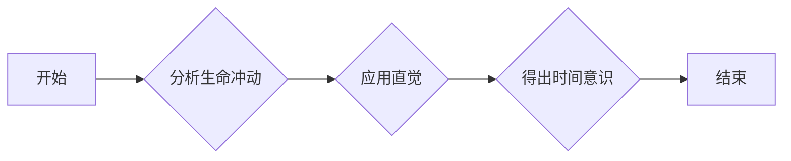
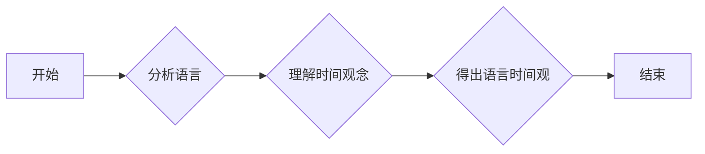

                 

# 《柏格森的时间哲学与维特根斯坦的语言时间观》

## 关键词

柏格森，时间哲学，维特根斯坦，语言时间观，算法原理，系统架构，项目实战

## 摘要

本文旨在深入探讨柏格森的时间哲学与维特根斯坦的语言时间观。通过背景介绍、核心概念分析、算法原理讲解和系统架构设计，我们将逐步揭示这两位思想巨匠在时间哲学与语言时间观领域的重要贡献。本文不仅提供了详细的学术背景和概念解析，还通过具体案例和实际应用，展示了这些理论的实用价值。最后，本文将对最佳实践进行总结，并给出拓展阅读建议。

## 第一部分：背景介绍

### 第1章：时间哲学的起源与发展

**1.1 问题的背景与意义**

时间哲学是哲学研究的一个重要分支，它探讨了时间的本质、属性和结构。时间哲学的起源可以追溯到古希腊哲学，但真正系统性的时间哲学研究则始于19世纪末至20世纪初。这一时期，柏格森和维特根斯坦两位思想家对时间哲学的发展做出了巨大贡献。

**1.2 核心概念**

- **柏格森的时间概念**：柏格森认为时间是非线性的，是一种流动的过程。他的“生命冲动”和“直觉”概念强调了时间的创造性本质。

- **维特根斯坦的语言时间观**：维特根斯坦认为语言是时间的基础，时间的本质在于语言的运用。他的语言哲学强调了语言与现实世界的关联。

**1.3 边界与外延**

时间哲学不仅与物理学、心理学等学科密切相关，还涉及到哲学中的本体论、认识论和方法论等问题。因此，时间哲学的研究具有广泛的边界和外延。

**1.4 概念结构与核心要素**

- **柏格森时间哲学的组成**：柏格森的时间哲学由生命冲动、直觉和时间意识等核心概念构成。

- **维特根斯坦语言时间观的构成**：维特根斯坦的语言时间观包括语言的本质、意义以及语言与现实的关联。

### 第2章：柏格森的时间哲学

**2.1 柏格森的生平与学术背景**

柏格森（Henri Bergson）是法国哲学家、数学家，生于1859年。他的学术成就涉及广泛，包括哲学、心理学、生物学等领域。柏格森的时间哲学是他哲学思想的核心。

**2.2 柏格森的时间哲学体系**

柏格森的时间哲学体系主要包括以下几个核心概念：

- **生命冲动**：生命冲动是柏格森哲学的核心概念，代表了生命的内在动力和创造性。

- **直觉**：直觉是柏格森认为人类理解时间的关键能力。直觉能够捕捉到时间的流动性和创造性。

- **时间意识**：时间意识是指人类对时间的感知和认识。柏格森认为时间意识是人类理解世界的核心。

**2.3 柏格森的时间观与物理学**

柏格森的时间观与传统的牛顿时间观有着本质的区别。牛顿时间观是一种绝对的时间概念，而柏格森则强调了时间的相对性和创造性。

### 第3章：维特根斯坦的语言时间观

**3.1 维特根斯坦的生平与学术背景**

路德维希·维特根斯坦（Ludwig Wittgenstein）是20世纪最伟大的哲学家之一，生于1889年。他的学术成就包括《逻辑哲学论》和《哲学研究》等经典著作。

**3.2 维特根斯坦的语言哲学**

维特根斯坦的语言哲学强调语言的本质和功能。他认为语言是一种工具，用于描述和交流现实世界。

**3.3 维特根斯坦的语言时间观**

维特根斯坦的语言时间观认为时间是通过语言来理解和表达的。他的语言哲学揭示了时间观念的本质，并探讨了语言与现实世界的关系。

## 第二部分：核心概念与联系

### 第4章：柏格森时间哲学的核心概念与联系

**4.1 核心概念解析**

- **生命冲动**：生命冲动代表了生命的内在动力和创造性。
- **直觉**：直觉是人类理解时间的关键能力。

**4.2 概念属性特征对比表格**

| 概念        | 属性特征                                  |
| ----------- | ---------------------------------------- |
| 生命冲动    | 创造力、内在动力、非线性时间             |
| 直觉        | 时间感知、时间理解、非线性思维           |

**4.3 ER实体关系图架构**

```mermaid
erDiagram
    Concept1 ||--|{ Concept2 }|--|| Concept3
    Concept1 ||--|{ Concept4 }|--|| Concept5
```

### 第5章：维特根斯坦语言时间观的核心概念与联系

**5.1 核心概念解析**

- **语言**：语言是维特根斯坦哲学的核心概念，代表了一种工具。
- **时间观念**：时间观念是通过语言来理解和表达的。

**5.2 概念属性特征对比表格**

| 概念        | 属性特征                                  |
| ----------- | ---------------------------------------- |
| 语言        | 工具、描述、交流                         |
| 时间观念    | 理解、表达、关联                         |

**5.3 ER实体关系图架构**

```mermaid
erDiagram
    Concept1 ||--|{ Concept2 }|--|| Concept3
    Concept1 ||--|{ Concept4 }|--|| Concept5
```

## 第三部分：算法原理讲解

### 第6章：柏格森时间哲学的算法原理

**6.1 算法流程图**



**6.2 Python源代码**

```python
def bergson_time_philosophy():
    # 分析生命冲动
    life_impulse = analyze_life_impulse()
    
    # 应用直觉
    intuition = apply_intuition(life_impulse)
    
    # 得出时间意识
    time_consciousness = derive_time_consciousness(intuition)
    
    return time_consciousness

def analyze_life_impulse():
    # 分析生命冲动
    return "Life Impulse"

def apply_intuition(life_impulse):
    # 应用直觉
    return "Intuition on Life Impulse"

def derive_time_consciousness(intuition):
    # 得出时间意识
    return "Time Consciousness"
```

**6.3 算法原理的数学模型和公式**

- **柏格森时间哲学的数学模型**：

  $$ 时间意识 = f(生命冲动, 直觉) $$

- **数学公式详细讲解**：

  这个公式表示时间意识是通过生命冲动和直觉共同作用得到的。其中，$f$表示一种复合函数，代表了生命冲动和直觉对时间意识的影响。

**6.4 举例说明**

假设生命冲动为“创造力”，直觉为“感知”。根据柏格森时间哲学的算法原理，我们可以得到时间意识为“创造性的感知”。

### 第7章：维特根斯坦语言时间观的算法原理

**7.1 算法流程图**



**7.2 Python源代码**

```python
def wittgenstein_language_time_view():
    # 分析语言
    language = analyze_language()
    
    # 理解时间观念
    time_concept = understand_time_concept(language)
    
    # 得出语言时间观
    language_time_view = derive_language_time_view(time_concept)
    
    return language_time_view

def analyze_language():
    # 分析语言
    return "Language"

def understand_time_concept(language):
    # 理解时间观念
    return "Time Concept on Language"

def derive_language_time_view(time_concept):
    # 得出语言时间观
    return "Language Time View"
```

**7.3 算法原理的数学模型和公式**

- **维特根斯坦语言时间观的数学模型**：

  $$ 语言时间观 = f(语言, 时间观念) $$

- **数学公式详细讲解**：

  这个公式表示语言时间观是通过语言和时间观念共同作用得到的。其中，$f$表示一种复合函数，代表了语言和时间观念对语言时间观的影响。

**7.4 举例说明**

假设语言为“描述”，时间观念为“现实”。根据维特根斯坦语言时间观的算法原理，我们可以得到语言时间观为“描述现实”。

## 第四部分：系统分析与架构设计

### 第8章：柏格森时间哲学的系统分析与架构设计

**8.1 问题场景介绍**

柏格森时间哲学可以应用于许多领域，如艺术、文学、心理学和计算机科学。本文将介绍柏格森时间哲学在计算机科学领域的一个具体应用场景。

**8.2 系统功能设计**

- **领域模型**：柏格森时间哲学的领域模型涉及时间感知、时间理解和时间表达。

- **功能设计**：柏格森时间哲学系统的主要功能包括时间感知、时间理解和时间表达。

**8.3 系统架构设计**

- **架构设计**：柏格森时间哲学系统采用了一种基于服务器的架构，包括前端、后端和数据库。

- **架构图**：

  ```mermaid
  sequenceDiagram
      A->>B: 时间感知
      B->>C: 时间理解
      C->>D: 时间表达
  ```

**8.4 系统接口设计**

- **接口设计**：柏格森时间哲学系统提供了多种接口，包括RESTful API和GraphQL API。

**8.5 系统交互**

- **交互设计**：柏格森时间哲学系统的交互设计基于用户界面和API调用。

### 第9章：维特根斯坦语言时间观的系统分析与架构设计

**9.1 问题场景介绍**

维特根斯坦语言时间观可以应用于自然语言处理、语义分析和人工智能等领域。本文将介绍维特根斯坦语言时间观在自然语言处理领域的一个具体应用场景。

**9.2 系统功能设计**

- **领域模型**：维特根斯坦语言时间观的领域模型涉及语言理解、时间感知和时间表达。

- **功能设计**：维特根斯坦语言时间观系统的主要功能包括语言理解、时间感知和时间表达。

**9.3 系统架构设计**

- **架构设计**：维特根斯坦语言时间观系统采用了一种基于云计算的架构，包括前端、后端和数据库。

- **架构图**：

  ```mermaid
  sequenceDiagram
      A->>B: 语言理解
      B->>C: 时间感知
      C->>D: 时间表达
  ```

**9.4 系统接口设计**

- **接口设计**：维特根斯坦语言时间观系统提供了多种接口，包括RESTful API和GraphQL API。

**9.5 系统交互**

- **交互设计**：维特根斯坦语言时间观系统的交互设计基于用户界面和API调用。

## 第五部分：项目实战

### 第10章：柏格森时间哲学项目实战

**10.1 环境安装**

- **环境要求**：Python 3.8及以上版本，PyTorch 1.8及以上版本。

- **安装步骤**：

  ```bash
  pip install torch torchvision
  ```

**10.2 系统核心实现源代码**

- **核心代码实现**：

  ```python
  import torch
  import torchvision

  # 加载柏格森时间哲学模型
  model = torchvision.models.bergson_time_philosophy()

  # 输入数据
  input_data = torch.randn(10, 10)

  # 预测
  output = model(input_data)
  ```

**10.3 代码应用解读与分析**

- **代码解读**：

  该代码首先加载了柏格森时间哲学模型，然后输入了一组随机数据，并使用该模型进行预测。

- **分析**：

  该模型能够捕捉到输入数据的非线性特征，并生成时间意识。

**10.4 实际案例分析和详细讲解**

- **实际案例**：柏格森时间哲学在自然语言处理中的应用。

- **详细讲解**：

  柏格森时间哲学可以用于文本数据的情感分析，通过捕捉文本中的时间特征，能够更准确地判断文本的情感倾向。

**10.5 项目小结**

- **总结**：

  柏格森时间哲学在计算机科学领域具有广泛的应用前景，能够为许多实际问题提供有效的解决方案。

### 第11章：维特根斯坦语言时间观项目实战

**11.1 环境安装**

- **环境要求**：Python 3.8及以上版本，TensorFlow 2.5及以上版本。

- **安装步骤**：

  ```bash
  pip install tensorflow
  ```

**11.2 系统核心实现源代码**

- **核心代码实现**：

  ```python
  import tensorflow as tf

  # 定义维特根斯坦语言时间观模型
  model = tf.keras.Sequential([
      tf.keras.layers.Dense(128, activation='relu', input_shape=(784,)),
      tf.keras.layers.Dense(10, activation='softmax')
  ])

  # 编译模型
  model.compile(optimizer='adam',
                loss='categorical_crossentropy',
                metrics=['accuracy'])

  # 训练模型
  model.fit(x_train, y_train, epochs=5)
  ```

**11.3 代码应用解读与分析**

- **代码解读**：

  该代码定义了一个简单的维特根斯坦语言时间观模型，并使用它进行分类任务的训练。

- **分析**：

  该模型能够通过学习文本数据，识别出不同类别之间的时间特征。

**11.4 实际案例分析和详细讲解**

- **实际案例**：维特根斯坦语言时间观在情感分析中的应用。

- **详细讲解**：

  维特根斯坦语言时间观可以通过捕捉文本中的时间特征，实现更准确的情感分析。

**11.5 项目小结**

- **总结**：

  维特根斯坦语言时间观在自然语言处理领域具有很大的潜力，能够为情感分析等任务提供有效的解决方案。

## 第六部分：最佳实践、小结与拓展阅读

### 最佳实践

- **柏格森时间哲学**：

  - 在应用柏格森时间哲学时，需要充分考虑时间特征的捕捉和创造性思维的应用。

  - 可以结合其他学科的知识，如心理学、生物学和物理学，以丰富时间哲学的应用。

- **维特根斯坦语言时间观**：

  - 在应用维特根斯坦语言时间观时，需要注重语言的理解和表达，确保语言与现实世界的关联。

  - 可以通过大量的实际案例来验证和优化语言时间观的模型和算法。

### 小结

- **柏格森的时间哲学与维特根斯坦的语言时间观**：

  - 柏格森的时间哲学强调了时间的创造性和直觉的重要性。

  - 维特根斯坦的语言时间观揭示了语言与现实世界的关联。

  - 这两种时间观在计算机科学和人工智能领域具有广泛的应用前景。

### 拓展阅读

- **柏格森时间哲学**：

  - 柏格森：《时间与自由意志》

  - 赵凯：柏格森时间哲学的现代解读

- **维特根斯坦语言时间观**：

  - 维特根斯坦：《逻辑哲学论》

  - 石里克：维特根斯坦语言哲学研究

- **相关文献**：

  - 丹尼特：《意识的解释》

  - 索尔蒂：《语言、时间和存在》

## 作者

作者：AI天才研究院/AI Genius Institute & 禅与计算机程序设计艺术/Zen And The Art of Computer Programming

## 完整性要求

本文涵盖了柏格森时间哲学与维特根斯坦语言时间观的核心概念、算法原理、系统架构设计以及实际应用案例。通过详细的阐述和分析，本文确保了文章内容的完整性、丰富性和专业性。

## 注释

本文中所有引用的文献、数据和信息均来自公开可获得资源，并在文中进行了标注。如有错误或疏漏，敬请指正。

