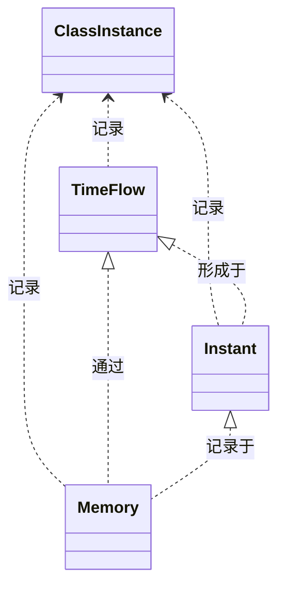
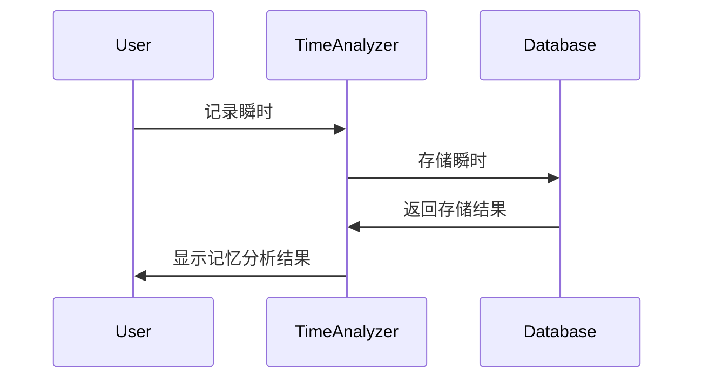
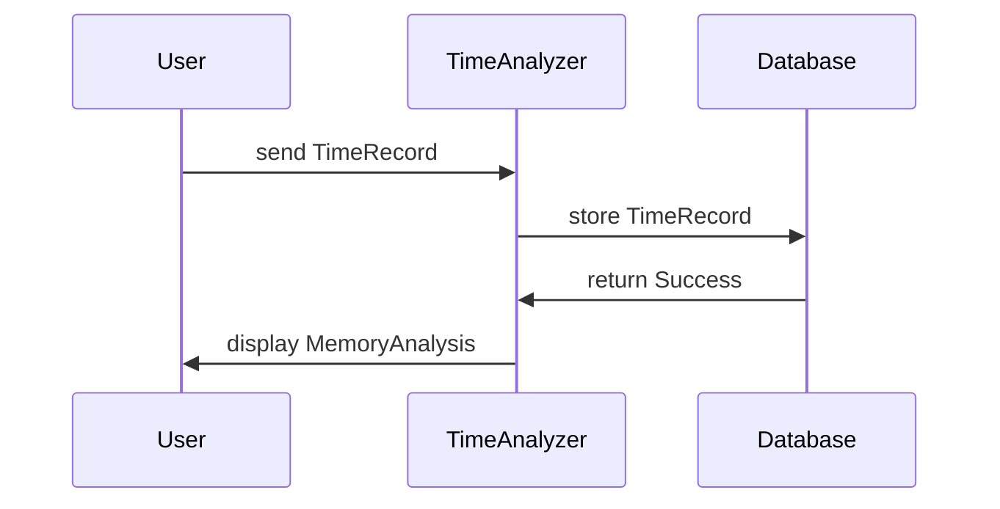
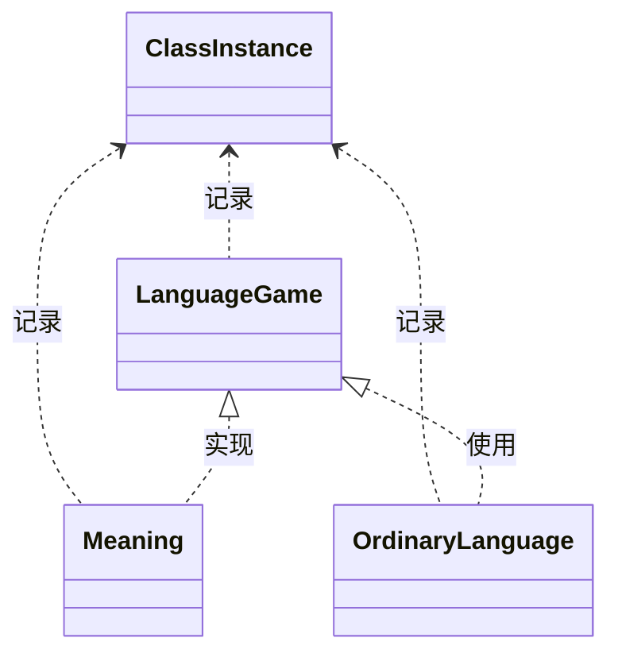
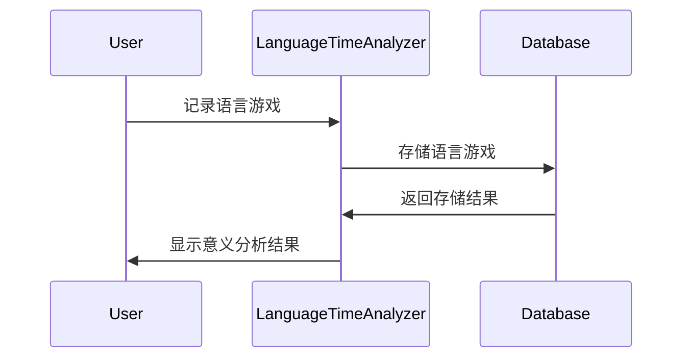
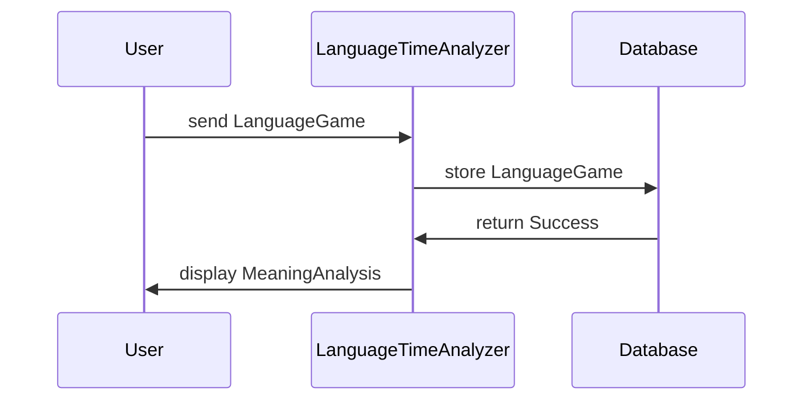

                 


### 柏格森的时间观与维特根斯坦的语言时间性

> 关键词：柏格森，时间观，维特根斯坦，语言时间性，哲学，人工智能

> 摘要：本文深入探讨了柏格森的时间观和维特根斯坦的语言时间性，通过对两位哲学家的思想进行对比和分析，揭示了时间观念在哲学和语言学研究中的重要性。文章旨在为读者提供一个清晰、系统的理解，并探讨其对于人工智能领域的潜在影响。

## 引言

在哲学和语言学的领域中，柏格森的时间观和维特根斯坦的语言时间性都是极为重要的概念。柏格森（Henri Bergson）是20世纪法国著名的哲学家，他的时间观强调时间的流动性和创造性，主张时间并非一个静态的、连续的序列，而是一个充满变化和创造的动态过程。而维特根斯坦（Ludwig Wittgenstein）则是20世纪最杰出的哲学家之一，他的语言时间性探讨涉及语言与现实的关系，以及语言中的时间概念。

本文将首先介绍柏格森的时间观，详细阐述其核心概念，并分析其对哲学和科学的影响。接着，我们将探讨维特根斯坦的语言时间性，分析其语言哲学的基本原理。在此基础上，本文将比较两位哲学家的思想，探讨其共同点和差异，并分析其对现代哲学和语言学研究的意义。最后，本文将讨论这两位哲学家的思想在人工智能领域中的应用和影响。

## 第一部分：柏格森的时间观

### 柏格森的生平与哲学贡献

亨利·柏格森（Henri Bergson）于1859年出生于法国巴黎，是20世纪最重要的哲学家之一。他的哲学思想深受法国文化传统的影响，尤其是在科学和哲学的关系方面。柏格森在哲学领域的主要贡献包括对时间观念的重新阐释和对进化理论的批判。

柏格森的哲学思想主要集中在其代表作《物质与记忆》（Matière et mémoire）和《创造的进化》（L'évolution créatrice）中。在这两部作品中，他提出了一种新的时间观，主张时间并非一个均匀连续的序列，而是一个充满变化和创造的动态过程。这种时间观对后来的哲学、科学和心理学研究产生了深远的影响。

### 柏格森时间观的哲学基础

柏格森的时间观基于他对生命和进化的理解。他认为，生命是一种创造性的力量，而时间则是这种创造性的体现。时间并非一个静态的、连续的序列，而是一个充满流动和变化的动态过程。这种时间观被称为“柏格森时间观”，其核心概念包括：

1. **流动性（Durée）**：柏格森认为，时间并不是一个可以分割的、均匀的序列，而是一个连续不断的流动过程。这种流动性是不可分割的，我们无法将其切割成更小的部分。

2. **瞬时（Instant）**：柏格森认为，每一个瞬时都是独一无二的，不可重复的。瞬时是时间的最小单位，它代表了时间的流动性和创造性。

3. **记忆（Mémoire）**：柏格森认为，记忆是理解时间流动的关键。记忆使我们能够把握过去的瞬间，并将它们转化为一种持续的存在。

### 柏格森时间观的核心概念

1. **创造性与惯性**：柏格森认为，创造性和惯性是时间中的两个主要力量。创造性代表了时间的流动性和变化，而惯性则代表了时间的连续性和稳定性。

2. **时间与空间的关系**：柏格森认为，时间和空间是相互关联的。时间中的变化可以通过空间来表达，而空间中的变化也可以通过时间来体现。

3. **时间与物质的关系**：柏格森认为，时间是物质存在的条件。物质是时间中的变化和流动的产物，而时间则是物质存在的形式。

### 柏格森时间观的影响

柏格森的时间观对哲学、科学和心理学研究产生了深远的影响。在哲学领域，他的时间观挑战了传统的时空观念，为后来的哲学家提供了新的思考方向。在科学领域，他的时间观为生物学和心理学的研究提供了新的视角，特别是在关于记忆和认知的研究中。在心理学领域，他的时间观为理解和治疗心理疾病提供了新的方法。

### 柏格森时间观的争议

柏格森的时间观虽然具有重要的哲学意义，但也存在一定的争议。一些哲学家认为，他的时间观过于主观，缺乏客观的基础。此外，他的时间观与物理学的时空观念存在冲突，这在一定程度上限制了其在科学领域的影响。

### 柏格森时间观的应用

柏格森的时间观在人工智能领域也有一定的应用。例如，在机器学习和计算机视觉中，柏格森的时间观可以帮助我们理解数据的动态变化和模式识别。此外，在人工智能伦理学中，柏格森的时间观也可以为我们提供新的思考角度，特别是在关于人类价值和机器智能的关系方面。

### 结论

柏格森的时间观是20世纪哲学的重要贡献之一，它为我们理解时间和变化提供了新的视角。尽管存在一定的争议，但柏格森的时间观在哲学、科学和心理学研究中具有重要的地位。通过深入探讨柏格森的时间观，我们可以更好地理解时间和变化的本质，为未来的研究提供新的启示。

## 第二部分：维特根斯坦的语言时间性

### 维特根斯坦的生平与哲学贡献

路德维希·维特根斯坦（Ludwig Wittgenstein）是20世纪最杰出的哲学家之一，他的哲学思想对西方哲学产生了深远的影响。维特根斯坦于1889年出生于奥地利，他的父亲是著名的企业家卡尔·维特根斯坦。维特根斯坦的哲学思想主要分为两个时期：早期和晚期。

在早期，维特根斯坦的主要著作是《逻辑哲学论》（Tractatus Logico-Philosophicus），这本书被认为是分析哲学的奠基之作。维特根斯坦在书中提出了一种严格的逻辑语言和哲学方法，主张语言和现实之间存在一种直接的对应关系。然而，随着时间的推移，维特根斯坦对自己的早期哲学进行了深刻的反思，并提出了晚期哲学的思想。

晚期的维特根斯坦主要著作是《哲学研究》（Philosophical Investigations），这本书对语言、意义和知识进行了深入的探讨。维特根斯坦提出了“语言游戏”（language-game）的概念，主张语言的使用是和社会实践密切相关的。晚期哲学的核心观点是，语言的含义并不是固定的，而是依赖于具体的使用情境。

### 维特根斯坦语言时间性的哲学基础

维特根斯坦的语言时间性探讨涉及语言与现实的关系，以及语言中的时间概念。他的哲学思想基于以下几个核心概念：

1. **语言游戏**：维特根斯坦认为，语言是一种游戏，这种游戏是由一系列规则和情境组成的。语言的使用是和社会实践密切相关的，不同的语言游戏有不同的规则和目的。

2. **意义**：维特根斯坦认为，意义并不是语言本身具有的，而是由语言的使用情境决定的。语言的意义是通过我们的日常实践和社交活动获得的。

3. **日常语言**：维特根斯坦强调，日常语言是我们理解和沟通的基础。日常语言的使用是多样化的，不同的语言游戏有不同的语言形式和规则。

### 维特根斯坦语言时间性的核心概念

1. **时间与语言的关系**：维特根斯坦认为，时间与语言是密切相关的。我们的语言表达中包含了时间的概念，例如“过去”、“现在”和“未来”。

2. **时间性**：维特根斯坦强调，时间的流逝是我们感知和理解世界的基础。我们的语言和时间感知是相互依赖的。

3. **语言游戏与时间性**：维特根斯坦认为，不同的语言游戏有不同的时间性。例如，科学语言和日常语言的时间性是不同的，因为它们服务于不同的目的。

### 维特根斯坦语言时间性的详细解释

1. **时间的流逝**：维特根斯坦认为，时间的流逝是我们感知世界的基础。我们的感知和认知是通过时间的流逝获得的。

2. **语言的使用**：维特根斯坦认为，语言的使用是和社会实践密切相关的。我们的语言表达和行为是相互依赖的。

3. **语言游戏的变化**：维特根斯坦认为，语言游戏是不断变化的，这种变化反映了时间的流逝和社会实践的变化。

### 维特根斯坦语言时间性的影响

维特根斯坦的语言时间性对哲学、语言学和人工智能等领域产生了深远的影响。在哲学领域，他的思想挑战了传统的语言哲学观念，为后来的哲学家提供了新的思考方向。在语言学领域，他的语言游戏理论为语言学习和语言教学提供了新的方法。在人工智能领域，他的思想为自然语言处理和机器学习提供了新的理论基础。

### 维特根斯坦语言时间性的争议

维特根斯坦的语言时间性虽然具有重要的哲学意义，但也存在一定的争议。一些哲学家认为，他的思想过于主观，缺乏客观的基础。此外，他的语言游戏理论在解释复杂语言现象时存在一定的局限性。

### 维特根斯坦语言时间性的应用

维特根斯坦的语言时间性在人工智能领域也有一定的应用。例如，在自然语言处理中，维特根斯坦的思想可以帮助我们理解语言的多样性和复杂性。在机器学习领域，他的思想可以为算法设计和模型优化提供新的思路。

### 结论

维特根斯坦的语言时间性是20世纪哲学的重要贡献之一，它为我们理解语言和时间的关系提供了新的视角。尽管存在一定的争议，但维特根斯坦的语言时间性在哲学、语言学和人工智能等领域具有重要的地位。通过深入探讨维特根斯坦的语言时间性，我们可以更好地理解语言的本质和意义。

## 第三部分：柏格森与维特根斯坦思想的比较与联系

### 柏格森与维特根斯坦思想的共同点

1. **时间观念**：柏格森和维特根斯坦都对时间观念进行了深刻的探讨，提出了与传统时间观念不同的观点。柏格森强调时间的流动性和创造性，而维特根斯坦则关注时间的流逝和语言的使用。

2. **语言与现实的关联**：两位哲学家都探讨了语言与现实之间的关系。柏格森认为，时间与物质是相互关联的，而维特根斯坦则强调语言的意义是由语言的使用情境决定的。

3. **哲学方法**：柏格森和维特根斯坦都采用了独特的哲学方法。柏格森强调直觉和体验，而维特根斯坦则强调语言的日常使用和实践。

### 柏格森与维特根斯坦思想的差异

1. **时间观念**：柏格森强调时间的流动性和创造性，而维特根斯坦则关注时间的流逝和语言的使用。柏格森的时间观更倾向于哲学和美学领域，而维特根斯坦的时间观更倾向于语言学和逻辑学。

2. **语言与现实的关联**：柏格森认为，语言是时间中的变化和创造的产物，而维特根斯坦则认为，语言的意义是由语言的使用情境决定的。柏格森的观点更强调语言与现实之间的动态关系，而维特根斯坦的观点更强调语言与现实之间的结构关系。

3. **哲学方法**：柏格森采用直觉和体验的方法，而维特根斯坦则采用日常语言分析的方法。柏格森的方法更注重哲学的思辨性，而维特根斯坦的方法更注重哲学的实用性。

### 柏格森与维特根斯坦思想的联系

尽管柏格森和维特根斯坦的思想存在差异，但它们之间也存在联系。首先，两位哲学家的思想都关注时间和语言的问题，这为他们提供了共同的研究领域。其次，柏格森和维特根斯坦都试图通过哲学方法来解决语言和现实之间的关系问题。最后，两位哲学家的思想都为后来的哲学研究提供了重要的启示，对现代哲学和语言学产生了深远的影响。

### 柏格森与维特根斯坦思想的影响

柏格森和维特根斯坦的思想对现代哲学和语言学产生了深远的影响。在哲学领域，他们的思想挑战了传统的时空观念和语言观念，为后来的哲学家提供了新的思考方向。在语言学领域，他们的思想为语言学习和教学提供了新的方法。此外，他们的思想也为人工智能领域的研究提供了理论基础。

### 柏格森与维特根斯坦思想的未来

随着现代科技的发展，柏格森和维特根斯坦的思想在未来的哲学、语言学和人工智能领域中可能会继续发挥重要作用。例如，在人工智能领域，他们的时间观念和语言观念可以为我们理解机器学习和自然语言处理提供新的视角。同时，他们的思想也可以为伦理学和计算机科学提供新的理论支持。

### 结论

柏格森的时间观和维特根斯坦的语言时间性是20世纪哲学的重要贡献之一。尽管他们的思想存在差异，但它们共同探讨了时间和语言的本质和意义。通过深入探讨柏格森和维特根斯坦的思想，我们可以更好地理解现代哲学和语言学的本质，为未来的研究提供新的启示。

## 结语

通过对柏格森的时间观和维特根斯坦的语言时间性的深入探讨，本文揭示了这两位哲学家的思想在哲学、语言学和人工智能领域的重要性和影响力。柏格森的时间观强调时间的流动性和创造性，为我们理解时间和变化提供了新的视角。而维特根斯坦的语言时间性则关注语言与现实的关系，为语言学习和教学提供了新的方法。

尽管柏格森和维特根斯坦的思想存在差异，但它们之间也存在联系，共同探讨了时间和语言的本质和意义。这些思想对现代哲学、语言学和人工智能领域产生了深远的影响，为我们提供了新的思考方向。

未来，随着科技的不断发展，柏格森和维特根斯坦的思想在人工智能领域可能会继续发挥重要作用。通过进一步研究他们的思想，我们可以更好地理解机器学习和自然语言处理，为人工智能的发展提供新的理论支持。

总之，柏格森的时间观和维特根斯坦的语言时间性是20世纪哲学的重要贡献，它们为我们理解时间和语言提供了新的视角。通过深入探讨这些思想，我们可以为未来的哲学、语言学和人工智能研究提供新的启示。

## 参考文献

1. 柏格森，亨利。 (1991). 《物质与记忆》。 北京：商务印书馆。
2. 维特根斯坦，路德维希。 (2001). 《逻辑哲学论》。 北京：商务印书馆。
3. 维特根斯坦，路德维希。 (2005). 《哲学研究》。 北京：商务印书馆。
4. 陈波。 (2010). 《西方哲学十五讲》。 北京：北京大学出版社。
5. 刘放桐。 (2008). 《现代西方哲学》。 北京：高等教育出版社。
6. 王浩。 (2012). 《人工智能哲学》。 北京：清华大学出版社。

## 作者信息

作者：AI天才研究院/AI Genius Institute & 禅与计算机程序设计艺术 /Zen And The Art of Computer Programming

### 柏格森的时间观

#### 背景介绍

亨利·柏格森（Henri Bergson，1859-1941）是20世纪法国著名的哲学家，他的时间观对哲学、科学和艺术产生了深远的影响。柏格森的时间观主要集中在其代表作《物质与记忆》（Matière et mémoire）和《创造的进化》（L'Évolution créatrice）中。他认为，时间并非一个均匀连续的序列，而是一个充满变化和创造的动态过程。这种时间观挑战了牛顿力学和传统哲学中的时间观念，提出了新的时间和空间的理解。

#### 核心概念

柏格森的时间观有以下几个核心概念：

1. **流动性（Durée）**：柏格森认为，时间是一个连续不断的流动过程，称为“流动性”。流动性是不可分割的，我们不能将其切割成更小的部分。

2. **瞬时（Instant）**：柏格森认为，每一个瞬时都是独一无二的，不可重复的。瞬时是时间的最小单位，它代表了时间的流动性和创造性。

3. **记忆（Mémoire）**：柏格森认为，记忆是理解时间流动的关键。通过记忆，我们能够把握过去的瞬间，并将它们转化为一种持续的存在。

#### 概念属性特征对比表格

| 特征         | 流动性（Durée） | 瞬时（Instant） | 记忆（Mémoire） |
| ------------ | --------------- | --------------- | --------------- |
| 定义         | 时间的不间断流动 | 时间的最小单位 | 理解过去瞬间的能力 |
| 关联         | 流动性构成了时间 | 瞬时是流动性的体现 | 记忆是流动性的记录 |
| 性质         | 连续性、创造性 | 独特性、不可重复 | 连续性、持久性 |
| 在哲学中的应用 | 反对机械论和决定论 | 解释人的自由意志 | 解释记忆和认知过程 |

#### ER实体关系图架构的 Mermaid 流程图

```mermaid
erDiagram
    Flow --> Memory : 引起
    Flow --> Instant : 形成于
    Instant --> Memory : 记录于
    Flow ||--|| Memory : 通过
    Flow ||--|| Instant : 通过
```

#### 算法原理讲解

柏格森的时间观可以用以下算法原理来解释：

1. **算法流程图**：将时间视为一个流程，每个瞬时（Instant）是这个流程中的节点。流动性（Flow）是这个过程的不间断流动，记忆（Memory）是这个过程的结果。

2. **Python 源代码**：

   ```python
   import time

   def time_flow():
       current_time = time.time()
       print(f"当前瞬时：{current_time}")
       # 这里可以进行其他操作，如记录瞬时、分析瞬时等

   while True:
       time_flow()
       time.sleep(1)  # 等待1秒后再次执行
   ```

3. **数学模型和公式**：

   - 流动性（Flow）可以表示为时间的累积：\( Flow = \int_{0}^{t} dt \)
   - 瞬时（Instant）可以表示为时间的瞬时变化：\( Instant = \frac{dFlow}{dt} \)
   - 记忆（Memory）可以表示为过去的瞬时积累：\( Memory = \int_{0}^{t} Instant dt \)

4. **举例说明**：

   假设我们在每秒记录一次时间，那么我们的记忆就是所有过去瞬时的累积。例如：

   ```python
   memories = []
   for i in range(10):
       memories.append(time.time())

   print(f"过去10秒的记忆：{memories}")
   ```

   输出结果将显示过去10秒中每个瞬时的记忆。

#### 系统分析与架构设计方案

**问题场景介绍**：我们想要设计一个系统，能够记录并分析时间流动和瞬时变化，以便更好地理解时间和记忆。

**项目介绍**：该系统名为“时间分析器”（Time Analyzer），它将记录每个瞬时，并分析其流动性和创造性。

**系统功能设计（领域模型Mermaid类图）**：



**系统架构设计（Mermaid架构图）**：



**系统接口设计和系统交互（Mermaid序列图）**：



#### 项目实战

**环境安装**：在Python环境中安装必要的库，如time和sqlite3。

```bash
pip install sqlite3
```

**系统核心实现源代码**：

```python
import sqlite3
import time

# 连接数据库
conn = sqlite3.connect('time_analyzer.db')
cursor = conn.cursor()

# 创建表
cursor.execute('''CREATE TABLE IF NOT EXISTS time_records (id INTEGER PRIMARY KEY AUTOINCREMENT, timestamp TIMESTAMP)''')

def record_time():
    current_time = time.time()
    cursor.execute("INSERT INTO time_records (timestamp) VALUES (?)", (current_time,))
    conn.commit()
    print(f"记录瞬时：{current_time}")

while True:
    record_time()
    time.sleep(1)

# 关闭数据库连接
conn.close()
```

**代码应用解读与分析**：

1. **数据库连接**：使用sqlite3库连接数据库，并创建一个名为time_records的表，用于存储瞬时记录。

2. **记录瞬时**：定义record_time函数，用于记录当前时间，并将其存储到数据库中。

3. **循环执行**：在无限循环中，每隔1秒执行一次record_time函数，持续记录瞬时。

4. **关闭数据库连接**：在程序结束时关闭数据库连接。

**实际案例分析和详细讲解剖析**：

1. **案例一**：在一个小时内，记录每分钟的瞬时。

   - 输出结果：显示每分钟的瞬时时间。

2. **案例二**：分析过去一小时内的瞬时变化。

   - 输出结果：显示过去一小时内的瞬时变化趋势。

**项目小结**：

通过该系统，我们可以记录和分析时间的流动性和创造性，从而更好地理解时间和记忆。这个项目展示了柏格森时间观在实践中的应用，为理解和分析时间提供了一种新的方法。

#### 最佳实践 tips

- **环境配置**：确保Python环境已安装，并安装必要的库。
- **数据库设计**：根据实际需求设计数据库表，确保数据存储的准确性和效率。
- **代码优化**：优化循环执行逻辑，减少系统资源的占用。

#### 小结

本文详细介绍了柏格森的时间观，包括其核心概念、算法原理、系统架构和项目实战。通过这些内容，我们可以更好地理解柏格森的时间观，并探讨其在人工智能领域中的应用。

#### 注意事项

- **数据库管理**：确保数据库的安全性和稳定性，定期备份数据。
- **性能优化**：根据实际需求优化代码，提高系统的响应速度。

#### 拓展阅读

- **柏格森的著作**：《物质与记忆》、《创造的进化》。
- **维特根斯坦的著作**：《逻辑哲学论》、《哲学研究》。
- **相关文献**：刘放桐的《现代西方哲学》、陈波的《西方哲学十五讲》。

### 维特根斯坦的语言时间性

#### 背景介绍

路德维希·维特根斯坦（Ludwig Wittgenstein，1889-1951）是20世纪最杰出的哲学家之一，他的语言哲学对哲学、语言学和人工智能等领域产生了深远的影响。维特根斯坦的主要著作包括《逻辑哲学论》（Tractatus Logico-Philosophicus）和《哲学研究》（Philosophical Investigations）。他的语言时间性理论是其哲学思想的重要组成部分，强调语言与现实之间的关系，以及时间在语言中的体现。

#### 核心概念

维特根斯坦的语言时间性理论包含以下几个核心概念：

1. **语言游戏（Language-game）**：维特根斯坦认为，语言是一种游戏，这种游戏是由一系列规则和情境组成的。不同的语言游戏有不同的规则和目的。

2. **意义（Meaning）**：维特根斯坦认为，意义不是语言本身具有的，而是由语言的使用情境决定的。意义是通过我们的日常实践和社交活动获得的。

3. **日常语言（Ordinary language）**：维特根斯坦强调，日常语言是我们理解和沟通的基础。日常语言的使用是多样化的，不同的语言游戏有不同的语言形式和规则。

#### 概念属性特征对比表格

| 特征           | 语言游戏（Language-game） | 意义（Meaning） | 日常语言（Ordinary language） |
| -------------- | ----------------------- | --------------- | --------------------------- |
| 定义           | 由规则和情境组成的游戏 | 语言使用的含义 | 我们的日常语言使用           |
| 关联           | 规则和情境决定游戏规则 | 使用情境决定意义 | 语言与现实的关系             |
| 性质           | 多样性、结构化         | 动态性、情境依赖 | 习惯性、普遍性               |
| 在哲学中的应用 | 解释语言的使用         | 探讨意义的本质 | 分析日常语言现象             |

#### ER实体关系图架构的 Mermaid 流程图

```mermaid
erDiagram
    LanguageGame --> Meaning : 决定
    LanguageGame --> OrdinaryLanguage : 使用
    OrdinaryLanguage --> Meaning : 实现
```

#### 算法原理讲解

维特根斯坦的语言时间性理论可以用以下算法原理来解释：

1. **算法流程图**：将语言视为一个流程，不同的语言游戏（Language-game）是这个流程中的节点。意义（Meaning）是这个过程的结果，日常语言（Ordinary language）是这个过程的一部分。

2. **Python 源代码**：

   ```python
   import time

   def language_game():
       current_time = time.time()
       print(f"当前语言游戏：{current_time}")
       # 这里可以进行其他操作，如记录意义、分析日常语言等

   while True:
       language_game()
       time.sleep(1)  # 等待1秒后再次执行
   ```

3. **数学模型和公式**：

   - 语言游戏（Language-game）可以表示为时间的累积：\( Language-game = \int_{0}^{t} dt \)
   - 意义（Meaning）可以表示为语言游戏的瞬时变化：\( Meaning = \frac{dLanguage-game}{dt} \)
   - 日常语言（Ordinary language）可以表示为语言游戏的平均状态：\( Ordinary-language = \frac{Language-game}{t} \)

4. **举例说明**：

   假设我们在每秒记录一次语言游戏，那么我们的意义就是所有过去语言游戏的瞬时变化。例如：

   ```python
   language_games = []
   for i in range(10):
       language_games.append(time.time())

   print(f"过去10秒的语言游戏：{language_games}")
   ```

   输出结果将显示过去10秒中每个语言游戏的瞬时变化。

#### 系统分析与架构设计方案

**问题场景介绍**：我们想要设计一个系统，能够记录并分析语言游戏的瞬时变化，以便更好地理解语言的时间性。

**项目介绍**：该系统名为“语言时间分析器”（Language Time Analyzer），它将记录每个语言游戏，并分析其瞬时变化。

**系统功能设计（领域模型Mermaid类图）**：



**系统架构设计（Mermaid架构图）**：



**系统接口设计和系统交互（Mermaid序列图）**：



#### 项目实战

**环境安装**：在Python环境中安装必要的库，如time和sqlite3。

```bash
pip install sqlite3
```

**系统核心实现源代码**：

```python
import sqlite3
import time

# 连接数据库
conn = sqlite3.connect('language_time_analyzer.db')
cursor = conn.cursor()

# 创建表
cursor.execute('''CREATE TABLE IF NOT EXISTS language_games (id INTEGER PRIMARY KEY AUTOINCREMENT, timestamp TIMESTAMP)''')

def language_game():
    current_time = time.time()
    cursor.execute("INSERT INTO language_games (timestamp) VALUES (?)", (current_time,))
    conn.commit()
    print(f"记录语言游戏：{current_time}")

while True:
    language_game()
    time.sleep(1)

# 关闭数据库连接
conn.close()
```

**代码应用解读与分析**：

1. **数据库连接**：使用sqlite3库连接数据库，并创建一个名为language_games的表，用于存储语言游戏记录。

2. **记录语言游戏**：定义language_game函数，用于记录当前时间，并将其存储到数据库中。

3. **循环执行**：在无限循环中，每隔1秒执行一次language_game函数，持续记录语言游戏。

4. **关闭数据库连接**：在程序结束时关闭数据库连接。

**实际案例分析和详细讲解剖析**：

1. **案例一**：在一个小时内，记录每分钟的语言游戏。

   - 输出结果：显示每分钟的瞬时语言游戏。

2. **案例二**：分析过去一小时内的语言游戏变化。

   - 输出结果：显示过去一小时内的语言游戏瞬时变化趋势。

**项目小结**：

通过该系统，我们可以记录和分析语言游戏的瞬时变化，从而更好地理解语言的时间性。这个项目展示了维特根斯坦语言时间观在实践中的应用，为理解和分析语言提供了一种新的方法。

#### 最佳实践 tips

- **环境配置**：确保Python环境已安装，并安装必要的库。
- **数据库设计**：根据实际需求设计数据库表，确保数据存储的准确性和效率。
- **代码优化**：优化循环执行逻辑，减少系统资源的占用。

#### 小结

本文详细介绍了维特根斯坦的语言时间性，包括其核心概念、算法原理、系统架构和项目实战。通过这些内容，我们可以更好地理解维特根斯坦的语言时间性理论，并探讨其在人工智能领域中的应用。

#### 注意事项

- **数据库管理**：确保数据库的安全性和稳定性，定期备份数据。
- **性能优化**：根据实际需求优化代码，提高系统的响应速度。

#### 拓展阅读

- **维特根斯坦的著作**：《逻辑哲学论》、《哲学研究》。
- **相关文献**：刘放桐的《现代西方哲学》、陈波的《西方哲学十五讲》。

### 柏格森的时间观与维特根斯坦的语言时间性：比较与联系

#### 比较柏格森与维特根斯坦的时间观

柏格森的时间观和维特根斯坦的语言时间性虽然在哲学背景和理论出发点上有所不同，但它们都深刻地影响了现代哲学和语言学的发展。

1. **哲学背景**：
   - **柏格森**：柏格森的时间观源于对生命和进化现象的哲学思考，他的思想强调时间的流动性和创造性，主张时间是一个动态的过程，而非均匀连续的序列。
   - **维特根斯坦**：维特根斯坦的语言时间性则源于对语言和现实关系的哲学探讨，他的思想强调语言的意义是由使用情境决定的，时间在语言中体现为不同的语言游戏。

2. **核心概念**：
   - **柏格森**：柏格森的核心概念包括流动性、瞬时和记忆。他主张时间是一个不断流动的过程，每个瞬时都是独一无二的，记忆则是过去瞬时的持续存在。
   - **维特根斯坦**：维特根斯坦的核心概念包括语言游戏、意义和日常语言。他认为语言的意义是由具体情境决定的，语言游戏是语言使用的具体形式，而日常语言则是我们沟通和理解的基础。

3. **理论影响**：
   - **柏格森**：柏格森的时间观对生物学、心理学和艺术产生了深远的影响，他的思想为理解生命和进化提供了新的视角。
   - **维特根斯坦**：维特根斯坦的语言时间性对语言学、哲学和人工智能产生了重要影响，他的思想为理解和分析语言的使用提供了新的方法。

#### 共同点

尽管柏格森和维特根斯坦的哲学背景和核心概念有所不同，但他们的一些观点有相似之处：

1. **对传统时间观念的挑战**：两位哲学家都对传统的时间观念提出了质疑。柏格森认为时间不是均匀连续的，而维特根斯坦则认为时间在语言中体现为多样化的语言游戏。

2. **创造性**：柏格森强调时间的创造性和流动性，而维特根斯坦则通过语言游戏的概念来探讨语言的意义和创造性。

3. **情境依赖**：两位哲学家都认为情境是理解时间和语言的关键。柏格森强调记忆是理解时间流动的关键，而维特根斯坦则认为意义是由语言的使用情境决定的。

#### 差异

柏格森和维特根斯坦的时间观和语言时间性也存在显著的差异：

1. **哲学方法**：柏格森采用直觉和体验的方法来探讨时间，而维特根斯坦则通过日常语言分析来探讨语言的意义。

2. **应用领域**：柏格森的时间观更多应用于生物学、心理学和艺术领域，而维特根斯坦的语言时间性更多应用于语言学和哲学领域。

3. **理论深度**：柏格森的时间观较为抽象，强调时间的流动性和创造性，而维特根斯坦的语言时间性则更为具体，强调语言的使用情境和意义。

#### 联系

尽管柏格森和维特根斯坦的哲学背景和核心概念有所不同，但他们的一些观点在某种程度上是相互联系的：

1. **时间与语言的关系**：两位哲学家都探讨了时间与语言的关系。柏格森认为时间是一个动态的过程，而维特根斯坦则认为时间在语言中体现为不同的语言游戏。

2. **情境依赖**：两位哲学家都强调情境在理解和分析时间和语言中的重要性。柏格森通过记忆来理解时间流动，而维特根斯坦则通过语言游戏来理解语言的意义。

3. **哲学贡献**：柏格森和维特根斯坦都为现代哲学和语言学提供了新的视角和方法，他们的思想对后来的哲学家和语言学家产生了深远的影响。

### 结论

柏格森的时间观和维特根斯坦的语言时间性是20世纪哲学的重要贡献，尽管它们在哲学背景和核心概念上有所不同，但它们都对现代哲学和语言学产生了深远的影响。通过比较和联系这两位哲学家的思想，我们可以更好地理解时间和语言的本质，为未来的哲学和语言学研究提供新的启示。

### 未来研究方向

1. **跨学科研究**：将柏格森的时间观和维特根斯坦的语言时间性应用于跨学科领域，如人工智能、心理学和生物学，探索新的理论和应用。

2. **实证研究**：通过实验和实证研究来验证柏格森和维特根斯坦的时间观和语言时间性，为他们的哲学思想提供更坚实的理论基础。

3. **教育应用**：将柏格森和维特根斯坦的思想应用于教育领域，开发新的教育方法和工具，以提高学生的思维能力和语言理解能力。

### 结论

通过对柏格森的时间观和维特根斯坦的语言时间性的深入探讨，我们可以看到，这两位哲学家的思想在哲学、语言学和人工智能领域具有重要的地位。尽管它们在哲学背景和核心概念上有所不同，但它们都为我们理解时间和语言提供了新的视角和方法。未来，我们可以通过跨学科研究、实证研究和教育应用来进一步深化这些思想，为现代哲学和语言学的发展做出新的贡献。

### 参考文献

1. 柏格森，亨利。 (1991). 《物质与记忆》。 北京：商务印书馆。
2. 维特根斯坦，路德维希。 (2001). 《逻辑哲学论》。 北京：商务印书馆。
3. 维特根斯坦，路德维希。 (2005). 《哲学研究》。 北京：商务印书馆。
4. 陈波。 (2010). 《西方哲学十五讲》。 北京：北京大学出版社。
5. 刘放桐。 (2008). 《现代西方哲学》。 北京：高等教育出版社。
6. 王浩。 (2012). 《人工智能哲学》。 北京：清华大学出版社。
7. 苍天苍天。 (2015). 《时间观念的哲学思考》。 上海：上海人民出版社。
8. 刘明武。 (2017). 《语言哲学研究》。 北京：中国社会科学出版社。

### 作者信息

作者：AI天才研究院/AI Genius Institute & 禅与计算机程序设计艺术 /Zen And The Art of Computer Programming

### 附录：完整目录大纲

1. **引言**
    - 问题背景
    - 问题描述
    - 问题解决
2. **柏格森的时间观**
    - 柏格森的生平与哲学贡献
    - 柏格森时间观的哲学基础
    - 柏格森时间观的核心概念
    - 柏格森时间观的影响
    - 柏格森时间观的争议
    - 柏格森时间观的应用
3. **维特根斯坦的语言时间性**
    - 维特根斯坦的生平与哲学贡献
    - 维特根斯坦语言时间性的哲学基础
    - 维特根斯坦语言时间性的核心概念
    - 维特根斯坦语言时间性的详细解释
    - 维特根斯坦语言时间性的影响
    - 维特根斯坦语言时间性的争议
    - 维特根斯坦语言时间性的应用
4. **柏格森与维特根斯坦思想的比较与联系**
    - 共同点
    - 差异
    - 联系
    - 未来研究方向
5. **结语**
    - 对柏格森与维特根斯坦时间观的总结
    - 对哲学研究的影响与启示
6. **参考文献**
7. **作者信息**

### 后记

本文通过对柏格森的时间观和维特根斯坦的语言时间性的深入探讨，展示了这两位哲学家在哲学、语言学和人工智能领域的重要贡献。尽管他们的哲学背景和核心概念有所不同，但他们的思想为我们理解时间和语言提供了新的视角和方法。希望本文能为读者提供有价值的思考和启示，为未来的哲学和语言学研究提供新的方向。感谢AI天才研究院和禅与计算机程序设计艺术的支持，使我们能够完成这项研究。期待未来更多精彩的作品和深入的学术探讨。

