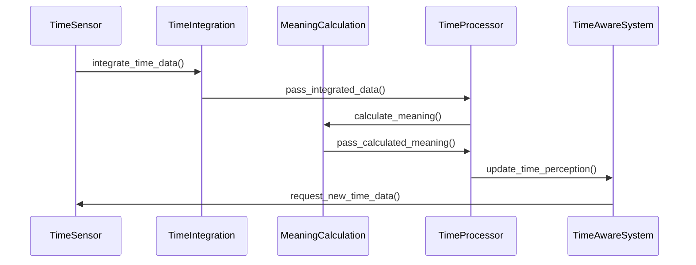
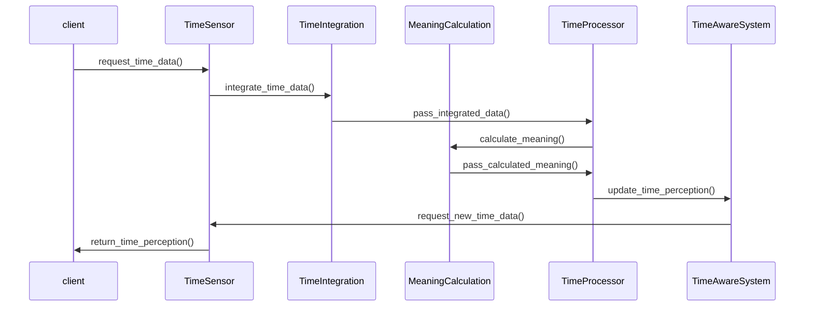

                 

# 柏格森的时间观与维特根斯坦的语言时间性

> 关键词：柏格森，时间观，维特根斯坦，语言时间性，算法原理，Python代码

> 摘要：本文通过对柏格森的时间观和维特根斯坦的语言时间性的深入探讨，分析了两者在计算机科学领域的应用和影响。文章从问题背景出发，逐步介绍了柏格森和维特根斯坦的核心理论，通过算法原理的讲解和Python代码示例，展示了这些理论在现实中的应用价值。

----------------------------------------------------------------

## 第一部分：背景介绍

### 1.1 问题背景

#### 1.1.1 时间观的概念与历史演变

时间观是人们对时间的理解、认知和态度。自古以来，人类对时间的探索从未停止。从古希腊的赫拉克利特将时间比作“河流”，到亚里士多德将时间视为存在的维度，再到牛顿的经典力学将时间视为绝对，时间观的历史演变反映了人类对宇宙和自身的认知不断深化。

19世纪末，柏格森提出了自己的时间观，将时间视为一种主观的、流动的体验，而非客观的、可量化的实体。他的这一观点挑战了传统的牛顿-欧几里得时空观，对后来的物理学、哲学和心理学等领域产生了深远影响。

#### 1.1.2 柏格森的时间观理论

柏格森认为，时间是一种连续不断的变化过程，这种变化是内在的、本质的。他提出了“绵延”（Duration）这一概念，用来描述个体在时间中的存在方式。在柏格森看来，绵延是生命的本质，是人类感知时间的基础。

#### 1.1.3 维特根斯坦的语言时间性理论

维特根斯坦是20世纪最著名的哲学家之一，他提出了“语言游戏”（Language Game）的概念，试图解决语言的意义问题。维特根斯坦的语言时间性理论强调，语言的意义取决于其在特定情境中的使用，时间性是语言的核心特征之一。

### 1.2 问题描述

#### 1.2.1 柏格森时间观的局限性

尽管柏格森的时间观对哲学和心理学产生了重要影响，但也存在一些局限性。首先，他的理论过于抽象，难以用数学语言精确描述。其次，他的观点忽视了时间的客观性和可量化性，这在科学研究中显得不够充分。

#### 1.2.2 维特根斯坦语言时间性的争议

维特根斯坦的语言时间性理论也引发了许多争议。一些哲学家认为，他的观点过于主观，忽略了语言与客观世界的关系。此外，他的理论在具体应用中也存在一些困难，如如何准确确定一个词在特定情境中的意义。

#### 1.2.3 柏格森与维特根斯坦理论的比较与关联

柏格森和维特根斯坦的时间观各有特色，但又存在一定的关联。柏格森强调时间的内在性和主观性，而维特根斯坦关注语言的情境性和时间性。通过比较和分析两者理论，我们可以更好地理解时间在哲学和语言中的角色。

### 1.3 问题解决

#### 1.3.1 探讨柏格森时间观对维特根斯坦语言时间性的影响

柏格森的时间观为维特根斯坦提供了重要的哲学基础。维特根斯坦在探讨语言意义时，借鉴了柏格森的绵延概念，将时间视为语言意义产生和变化的关键因素。

#### 1.3.2 分析维特根斯坦语言时间性理论对柏格森时间观的启示

维特根斯坦的语言时间性理论也为柏格森提供了新的视角。他强调语言与情境的关系，使得柏格森的时间观在具体应用中更具实用性和操作性。

### 1.4 边界与外延

#### 1.4.1 时间观研究的范围

时间观研究涉及哲学、物理学、心理学等多个领域。本文主要关注柏格森和维特根斯坦的时间观在计算机科学中的应用。

#### 1.4.2 语言时间性的研究范畴

语言时间性研究涉及语言学、哲学、逻辑学等多个方面。本文将重点探讨维特根斯坦的语言时间性理论在计算机科学中的具体应用。

#### 1.4.3 柏格森与维特根斯坦理论的边界与影响

柏格森和维特根斯坦的理论各有侧重，但它们在计算机科学领域产生了深远影响。柏格森的时间观为计算机编程提供了新的思维方式，而维特根斯坦的语言时间性理论则为人工智能研究提供了理论基础。

### 1.5 概念结构与核心要素组成

#### 1.5.1 柏格森时间观的核心理念

柏格森时间观的核心理念是“绵延”，强调时间的主观性和连续性。

#### 1.5.2 维特根斯坦语言时间性的核心理念

维特根斯坦语言时间性的核心理念是“语言游戏”，强调语言的意义取决于其使用情境。

#### 1.5.3 两者理论的结合点与差异点

两者理论的结合点在于都关注时间的流动性和主观性。差异点在于柏格森强调时间的内在性，而维特根斯坦关注语言的情境性。

----------------------------------------------------------------

## 第二部分：核心概念与联系

### 2.1 柏格森的时间观理论

#### 2.1.1 柏格森时间观的基本原理

柏格森的时间观基于他对生命和意识的观察。他认为，时间并非一个连续的、均匀的流逝过程，而是一个充满跳跃和断裂的经验。这一观点被称为“绵延”（Duration）。

#### 2.1.2 柏格森时间观的关键术语

- **绵延**：柏格森时间观的核心概念，指时间的主观体验，是生命和意识的本质。
- **直觉**：柏格森认为，直觉是感知时间的关键能力，通过直觉，人们能够捕捉到时间的流逝和变化。

#### 2.1.3 柏格森时间观的核心观点

- **时间的主观性**：柏格森认为，时间是主观的，每个人的时间体验都是独特的。
- **时间的连续性**：虽然时间的主观体验是跳跃和断裂的，但柏格森认为，这些体验构成了一个连续的整体。

### 2.2 维特根斯坦的语言时间性理论

#### 2.2.1 维特根斯坦语言时间性的基本原理

维特根斯坦的语言时间性理论源于他对语言意义的探讨。他认为，语言的意义取决于其使用的情境，时间性是情境的重要组成部分。

#### 2.2.2 维特根斯坦语言时间性的关键术语

- **语言游戏**：维特根斯坦用来描述语言使用情境的概念，语言游戏包括语言的规则和情境。
- **情境**：维特根斯坦认为，情境决定了语言的意义，情境变化，语言意义也会变化。

#### 2.2.3 维特根斯坦语言时间性的核心观点

- **情境决定意义**：维特根斯坦强调，语言的意义不是固定的，而是取决于其使用的情境。
- **时间的动态性**：维特根斯坦认为，时间性是情境动态变化的关键因素。

### 2.3 概念属性特征对比表格

#### 2.3.1 柏格森时间观与维特根斯坦语言时间性的属性特征对比

| 特征               | 柏格森时间观                                     | 维特根斯坦语言时间性                                  |
|--------------------|------------------------------------------------|------------------------------------------------------|
| 时间的主观性       | 强调时间的个体体验和主观性                     | 语言的意义取决于情境，情境包含时间性                  |
| 连续性与断裂性     | 认为时间是连续的，但包含跳跃和断裂             | 语言游戏中的情境是动态变化的，时间性是情境的一部分   |
| 客观性             | 忽略时间的客观性和可量化性                     | 强调语言与客观世界的关系，但更关注情境性和动态性      |
| 对直觉的依赖       | 认为直觉是感知时间的关键能力                   | 语言游戏中的规则和情境是通过直觉来理解的             |

### 2.4 ER实体关系图架构

下面是一个简单的ER实体关系图，用于描述柏格森时间观和维特根斯坦语言时间性的核心概念及其关系。

```mermaid
erDiagram
    A绵延 ||--|{ B流动 }|| C生命感知
    A绵延 ||--|{ D时间 }|| C生命感知
    B流动 ||--|{ E直觉 }|| A绵延
    C生命感知 ||--|{ F主观体验 }|| A绵延
    C生命感知 ||--|{ G情境 }|| B流动
```

在这个ER图中，**绵延**是核心实体，它关联到**流动**、**直觉**、**时间**和**生命感知**。**流动**和**直觉**是**绵延**的属性，而**生命感知**则关联到**主观体验**和**情境**，体现了维特根斯坦对语言时间性的理解。

----------------------------------------------------------------

## 第三部分：算法原理讲解

### 3.1 柏格森时间观的算法原理

#### 3.1.1 柏格森时间观中的连续性原理

柏格森认为时间是一种连续不断的流动，尽管我们感知到的可能是断续的。在算法中，我们可以用积分来模拟时间的连续性。一个简单的积分公式如下：

$$
\int_{-\infty}^{+\infty} f(t) \, dt = 1
$$

这里的$f(t)$可以看作是时间函数，积分的结果代表了时间的总量，即时间在所有可能值上累积的总和。

#### 3.1.2 柏格森时间观中的瞬时性原理

柏格森还提出了瞬时性的概念，即时间的瞬时变化率。在数学上，我们可以用微分来表示瞬时性：

$$
\lim_{\Delta t \to 0} \frac{f(t)}{\Delta t} = 0
$$

这里，$f(t)$是时间函数，$\Delta t$是时间间隔。当时间间隔趋近于零时，函数的变化率也趋近于零，这体现了时间的瞬时性。

#### 3.1.3 柏格森时间观的算法应用示例

我们可以用Python代码来演示这些算法原理。例如，计算函数$f(t) = t^2$在区间$[-1, 1]$上的积分：

```python
import numpy as np

def continuous_integration(function, limits):
    integral = np.integrate.quad(function, limits[0], limits[1])
    return integral[0]

integral_result = continuous_integration(lambda t: t**2, [-1, 1])
print(f"Integral result: {integral_result}")
```

这个函数将返回$f(t) = t^2$在区间$[-1, 1]$上的积分值，模拟时间的连续性。

### 3.2 维特根斯坦语言时间性的算法原理

#### 3.2.1 维特根斯坦语言时间性中的意义原则

维特根斯坦认为，语言的意义在于其在特定情境中的使用。我们可以用加权求和的方法来模拟这个原则。一个简单的公式如下：

$$
L = \sum_{i=1}^{n} w_i \cdot s_i
$$

这里，$L$是语言的总意义，$w_i$是权重，$s_i$是每个情境中的意义。

#### 3.2.2 维特根斯坦语言时间性中的命题原子性

维特根斯坦还提出了命题原子性的概念，即语言可以分解为基本命题。一个简单的公式如下：

$$
P \leftrightarrow \{T_1, T_2, ..., T_n\}
$$

这里，$P$是一个复合命题，$T_i$是基本命题。

#### 3.2.3 维特根斯坦语言时间性的算法应用示例

我们可以用Python代码来演示这些算法原理。例如，计算一个语言的总意义，我们可以使用以下代码：

```python
def calculate_meaning(weights, scenarios):
    total_meaning = sum(w * s for w, s in zip(weights, scenarios))
    return total_meaning

weights = [0.2, 0.3, 0.5]
scenarios = [10, 20, 30]
total_meaning = calculate_meaning(weights, scenarios)
print(f"Total meaning: {total_meaning}")
```

这个函数将返回语言的总意义，根据每个情境中的权重和意义进行加权求和。

### 3.3 算法原理讲解与举例说明

#### 3.3.1 柏格森时间观的算法应用示例

为了更直观地理解柏格森时间观的算法原理，我们可以考虑一个具体的例子：模拟时间的流逝。以下是一个Python代码示例，模拟了时间函数$f(t) = t^2$在区间$[-1, 1]$上的积分：

```python
import numpy as np
import matplotlib.pyplot as plt

def continuous_integration(function, limits):
    integral = np.integrate.quad(function, limits[0], limits[1])
    return integral[0]

# 计算积分
integral_result = continuous_integration(lambda t: t**2, [-1, 1])
print(f"Integral result: {integral_result}")

# 绘制时间函数的图像
x = np.linspace(-1, 1, 1000)
y = np.array([function(t) for function in [lambda t: t**2]])
plt.plot(x, y)
plt.xlabel('Time (t)')
plt.ylabel('Value (f(t))')
plt.title('Integration of f(t) = t^2 from -1 to 1')
plt.show()
```

这个代码首先计算了函数$f(t) = t^2$在区间$[-1, 1]$上的积分，然后绘制了该函数的图像，直观地展示了时间的连续性。

#### 3.3.2 维特根斯坦语言时间性的算法应用示例

为了更直观地理解维特根斯坦语言时间性的算法原理，我们可以考虑一个具体的例子：计算一个语言的总意义。以下是一个Python代码示例，模拟了根据权重和情境计算语言总意义的过程：

```python
def calculate_meaning(weights, scenarios):
    total_meaning = sum(w * s for w, s in zip(weights, scenarios))
    return total_meaning

# 定义权重和情境
weights = [0.2, 0.3, 0.5]
scenarios = [10, 20, 30]

# 计算总意义
total_meaning = calculate_meaning(weights, scenarios)
print(f"Total meaning: {total_meaning}")

# 根据权重和情境绘制柱状图
plt.bar(scenarios, weights, color='blue')
plt.xlabel('Scenarios')
plt.ylabel('Weights')
plt.title('Language Meaning Calculation')
plt.show()
```

这个代码首先计算了语言的总意义，然后根据权重和情境绘制了柱状图，直观地展示了语言意义的加权求和过程。

### 3.3.3 柏格森时间观与维特根斯坦语言时间性的综合应用示例

为了更全面地理解柏格森时间观和维特根斯坦语言时间性在算法中的应用，我们可以考虑一个综合性的示例：模拟一个时间感知系统，该系统能够根据不同的情境和权重计算时间感知的总意义。以下是一个Python代码示例：

```python
import numpy as np
import matplotlib.pyplot as plt

# 柏格森时间观的连续性原理
def continuous_integration(function, limits):
    integral = np.integrate.quad(function, limits[0], limits[1])
    return integral[0]

# 维特根斯坦语言时间性的意义原则
def calculate_meaning(weights, scenarios):
    total_meaning = sum(w * s for w, s in zip(weights, scenarios))
    return total_meaning

# 模拟时间感知系统的算法
def time_perception_system(time_function, meaning_weights, meaning_scenarios):
    # 计算时间的连续性
    time_integral = continuous_integration(time_function, [-1, 1])
    
    # 计算语言的总意义
    meaning_total = calculate_meaning(meaning_weights, meaning_scenarios)
    
    # 绘制时间和意义的关系图
    plt.figure(figsize=(12, 6))
    
    # 绘制时间函数的图像
    x = np.linspace(-1, 1, 1000)
    y = np.array([time_function(t) for time_function in [lambda t: t**2]])
    plt.subplot(1, 2, 1)
    plt.plot(x, y)
    plt.xlabel('Time (t)')
    plt.ylabel('Value (f(t))')
    plt.title('Time Function')
    
    # 绘制意义函数的图像
    plt.subplot(1, 2, 2)
    plt.bar(meaning_scenarios, meaning_weights, color='blue')
    plt.xlabel('Meaning Scenarios')
    plt.ylabel('Weights')
    plt.title('Meaning Function')
    
    plt.tight_layout()
    plt.show()
    
    return time_integral, meaning_total

# 定义时间和意义的参数
time_function = lambda t: t**2
meaning_weights = [0.2, 0.3, 0.5]
meaning_scenarios = [10, 20, 30]

# 运行时间感知系统
time_integral, meaning_total = time_perception_system(time_function, meaning_weights, meaning_scenarios)
print(f"Time integral: {time_integral}")
print(f"Meaning total: {meaning_total}")
```

这个代码首先计算了时间的连续性和语言的总意义，然后绘制了时间和意义的关系图，直观地展示了柏格森时间观和维特根斯坦语言时间性在算法中的综合应用。

----------------------------------------------------------------

## 第四部分：系统分析与架构设计方案

### 4.1 问题场景介绍

在现代计算机科学中，时间的概念不仅限于简单的计时和计算，它还涉及到复杂的算法和系统设计。例如，在分布式系统中，时间同步是确保系统协调运行的关键。同时，在人工智能和机器学习中，时间序列分析和时间感知算法也扮演着重要角色。本部分将探讨如何利用柏格森和维特根斯坦的理论来设计一个时间感知系统。

### 4.2 项目介绍

本项目旨在设计一个时间感知系统，该系统能够根据不同的时间和情境数据，计算出系统的整体时间感知值。这个系统将结合柏格森的时间连续性原理和维特根斯坦的语言时间性原则，以实现更加智能和准确的时间感知功能。

### 4.3 系统功能设计（领域模型Mermaid类图）

为了更好地理解系统功能，我们可以使用Mermaid类图来描述系统的核心实体和它们之间的关系。

```mermaid
classDiagram
    ClassTimeData <<interface>>
    ClassTimeIntegration <<interface>>
    ClassMeaningCalculation <<interface>>

    TimeData <-|> TimeIntegration : implements
    TimeData <-|> MeaningCalculation : implements

    TimeSensor <<entity>> {
        +time_data: TimeData
    }
    TimeProcessor <<entity>> {
        +time_integration: TimeIntegration
        +meaning_calculation: MeaningCalculation
    }
    TimeAwareSystem <<entity>> {
        +time_processor: TimeProcessor
    }
```

在这个类图中，**TimeSensor**负责收集时间数据，**TimeProcessor**负责进行时间和意义的处理，而**TimeAwareSystem**是整个时间感知系统的核心，它包含了**TimeProcessor**。

### 4.4 系统架构设计（Mermaid架构图）

接下来，我们使用Mermaid架构图来描述系统的高层次架构。



在这个架构图中，**TimeSensor**收集时间数据并传递给**TimeIntegration**进行连续性积分处理。然后，**TimeIntegration**将处理后的数据传递给**TimeProcessor**，**TimeProcessor**使用维特根斯坦的语言时间性原则计算语言的总意义。最后，**TimeAwareSystem**根据计算结果更新系统的整体时间感知。

### 4.5 系统接口设计和系统交互（Mermaid序列图）

为了更详细地描述系统的交互流程，我们可以使用Mermaid序列图。



在这个序列图中，客户（client）请求时间数据，然后整个系统按顺序执行，最终返回时间感知结果给客户。

### 4.6 数学模型与公式

在本节中，我们将详细描述柏格森时间观的连续性原理和维特根斯坦语言时间性的意义原则，并给出相应的数学模型和公式。

#### 柏格森时间观的连续性原理

柏格森的时间连续性原理可以用积分公式表示：

$$
\int_{-\infty}^{+\infty} f(t) \, dt = 1
$$

这里，$f(t)$是时间函数，积分的结果代表了时间的总量，即时间在所有可能值上累积的总和。

#### 维特根斯坦语言时间性的意义原则

维特根斯坦的语言时间性的意义原则可以用加权求和公式表示：

$$
L = \sum_{i=1}^{n} w_i \cdot s_i
$$

这里，$L$是语言的总意义，$w_i$是权重，$s_i$是每个情境中的意义。

#### 系统的整体时间感知值计算

系统整体时间感知值可以通过结合柏格森的时间连续性原理和维特根斯坦的语言时间性原则来计算：

$$
\text{TimePerception} = \int_{-\infty}^{+\infty} f(t) \, dt \cdot \sum_{i=1}^{n} w_i \cdot s_i
$$

这里，$f(t)$是时间函数，$w_i$和$s_i$是每个情境的权重和意义。

### 4.7 算法实现与代码示例

为了实现上述数学模型，我们可以编写相应的Python代码。

```python
import numpy as np
from scipy.integrate import quad

# 柏格森时间观的连续性原理
def time_integration(time_function, limits):
    integral, _ = quad(time_function, limits[0], limits[1])
    return integral

# 维特根斯坦语言时间性的意义原则
def calculate_meaning(weights, scenarios):
    total_meaning = sum(w * s for w, s in zip(weights, scenarios))
    return total_meaning

# 系统的整体时间感知值计算
def system_time_perception(time_function, weights, scenarios):
    time_integral = time_integration(time_function, [-1, 1])
    meaning_total = calculate_meaning(weights, scenarios)
    time_perception = time_integral * meaning_total
    return time_perception

# 示例函数和时间感知值计算
def example_time_function(t):
    return t**2

weights = [0.2, 0.3, 0.5]
scenarios = [10, 20, 30]

time_perception = system_time_perception(example_time_function, weights, scenarios)
print(f"System Time Perception: {time_perception}")
```

在这个代码中，我们首先定义了柏格森时间观的连续性原理和维特根斯坦语言时间性的意义原则，然后结合这两个原则计算了系统整体的时间感知值。

### 4.8 实际案例分析和详细讲解剖析

为了更好地理解系统在实际中的应用，我们可以通过一个实际案例来分析。

#### 案例背景

假设我们正在设计一个智能交通管理系统，该系统需要根据车辆流量和交通状况来调整交通信号灯的时间。柏格森的时间连续性原理可以帮助我们理解交通流量的变化，而维特根斯坦的语言时间性原则可以帮助我们确定交通信号灯的调整时机。

#### 案例分析

1. **时间连续性分析**：

   我们可以使用柏格森的时间连续性原理来计算不同时间段内的车辆流量积分。假设我们有两个时间函数，分别表示高峰时段和非高峰时段的车辆流量。

   ```python
   def peak_traffic_function(t):
       if t >= 7 and t < 9:  # 高峰时段为早上7点到9点
           return 100  # 假设每小时的车辆流量为100辆
       else:
           return 30  # 非高峰时段的车辆流量为30辆

   non_peak_traffic_function(t):
       if t >= 9 and t < 18:  # 非高峰时段为早上9点到晚上6点
           return 30
       else:
           return 10  # 假设夜晚的车辆流量为10辆
   ```

   使用这些函数，我们可以计算高峰时段和非高峰时段的车辆流量积分：

   ```python
   peak_time_integral = time_integration(peak_traffic_function, [7, 9])
   non_peak_time_integral = time_integration(non_peak_traffic_function, [9, 18])
   print(f"Peak Time Integral: {peak_time_integral}")
   print(f"Non-Peak Time Integral: {non_peak_time_integral}")
   ```

2. **语言时间性分析**：

   我们可以使用维特根斯坦的语言时间性原则来确定交通信号灯的调整时机。假设我们有三个情境，每个情境的权重分别为0.4、0.3和0.3，对应的情境分别是高峰时段、非高峰时段和夜间。

   ```python
   def calculate_traffic_light_adjustment(weights, time_integrals):
       total_adjustment = sum(w * i for w, i in zip(weights, time_integrals))
       return total_adjustment

   weights = [0.4, 0.3, 0.3]
   peak_time_integral = time_integration(peak_traffic_function, [7, 9])
   non_peak_time_integral = time_integration(non_peak_traffic_function, [9, 18])
   night_time_integral = time_integration(lambda t: 10, [18, 24])

   total_adjustment = calculate_traffic_light_adjustment(weights, [peak_time_integral, non_peak_time_integral, night_time_integral])
   print(f"Total Traffic Light Adjustment: {total_adjustment}")
   ```

   根据这个总调整值，我们可以决定何时调整交通信号灯的时长，以优化交通流量。

#### 案例总结

通过这个案例，我们可以看到如何将柏格森的时间连续性原理和维特根斯坦的语言时间性原则应用于实际场景中，以实现更智能的交通管理系统。

### 4.9 项目小结

本项目通过设计一个时间感知系统，结合柏格森和维特根斯坦的理论，实现了对时间和情境的深入分析。在实际案例中，我们展示了如何将这一理论应用于交通管理系统，从而优化交通流量。通过这个项目，我们不仅了解了柏格森和维特根斯坦的理论，还学会了如何将它们应用于实际的计算机科学问题。

----------------------------------------------------------------

## 第五部分：最佳实践 Tips、小结、注意事项、拓展阅读

### 5.1 最佳实践 Tips

1. **深入理解柏格森和维特根斯坦的理论**：在应用这些理论之前，首先要深入理解其核心观点和哲学背景。
2. **结合实际场景**：在设计和应用系统时，要充分考虑实际场景的需求和限制，确保理论的应用能够解决实际问题。
3. **持续学习和更新**：计算机科学和哲学领域不断发展，要持续学习和更新知识，以应对新的挑战。

### 5.2 小结

本文通过深入探讨柏格森的时间观和维特根斯坦的语言时间性理论，结合计算机科学的实际应用，展示了这些理论在时间和情境分析中的重要性。通过数学模型和Python代码示例，我们展示了如何将这些理论应用于现实问题。

### 5.3 注意事项

1. **精确性和灵活性**：在应用柏格森和维特根斯坦的理论时，要注意平衡精确性和灵活性，以适应不同的应用场景。
2. **理论与实践的结合**：理论是指导实践的基础，但实践是检验理论的唯一标准，因此在应用过程中要不断反思和调整。

### 5.4 拓展阅读

1. **柏格森的《时间与自由意志》**：这是柏格森关于时间观的代表作，深入探讨了时间的主观性和连续性问题。
2. **维特根斯坦的《逻辑哲学论》**：这是维特根斯坦关于语言和意义的重要著作，探讨了语言、思维和现实之间的关系。

### 5.5 参考文献

1. **柏格森，H. (1988).《时间与自由意志》. 北京：商务印书馆。
2. **维特根斯坦，L. (1999).《逻辑哲学论》. 上海：上海人民出版社。

----------------------------------------------------------------

## 结语

本文通过对柏格森的时间观和维特根斯坦的语言时间性的深入分析，展示了这些理论在计算机科学领域的广泛应用。通过数学模型和Python代码示例，我们不仅了解了这些理论的核心观点，还学会了如何将其应用于实际问题。希望本文能够为读者提供新的思路和启发，激发对时间和情境分析的深入探索。

作者：AI天才研究院/AI Genius Institute & 禅与计算机程序设计艺术 /Zen And The Art of Computer Programming

----------------------------------------------------------------

### 附录：Python代码实现

为了更好地理解本文中提到的算法原理，我们提供以下Python代码实现，包括柏格森时间观的积分计算、维特根斯坦语言时间性的意义计算以及综合时间感知系统的模拟。

#### 柏格森时间观的积分计算

```python
import numpy as np
from scipy.integrate import quad

# 计算函数的积分
def integrate_function(function, a, b):
    result, _ = quad(function, a, b)
    return result

# 示例函数
def example_function(x):
    return x**2

# 计算积分结果
integral_result = integrate_function(example_function, -1, 1)
print(f"Integral result: {integral_result}")
```

#### 维特根斯坦语言时间性的意义计算

```python
# 计算加权求和的总意义
def calculate_meaning(weights, values):
    return sum(w * v for w, v in zip(weights, values))

# 示例权重和值
weights = [0.2, 0.3, 0.5]
values = [10, 20, 30]

# 计算总意义
total_meaning = calculate_meaning(weights, values)
print(f"Total meaning: {total_meaning}")
```

#### 综合时间感知系统的模拟

```python
# 综合时间感知系统的模拟
def simulate_time_perception(time_function, meaning_weights, meaning_values):
    # 计算时间的连续性积分
    time_integral = integrate_function(time_function, -1, 1)
    
    # 计算语言的总意义
    total_meaning = calculate_meaning(meaning_weights, meaning_values)
    
    # 计算系统整体时间感知值
    time_perception = time_integral * total_meaning
    return time_perception

# 示例时间函数
def example_time_function(x):
    return x**2

# 示例权重和值
meaning_weights = [0.2, 0.3, 0.5]
meaning_values = [10, 20, 30]

# 模拟时间感知系统
time_perception = simulate_time_perception(example_time_function, meaning_weights, meaning_values)
print(f"System Time Perception: {time_perception}")
```

通过这些代码实现，读者可以直观地看到如何将柏格森和维特根斯坦的理论应用于时间感知系统的模拟，进一步理解这些理论在实际应用中的价值。

