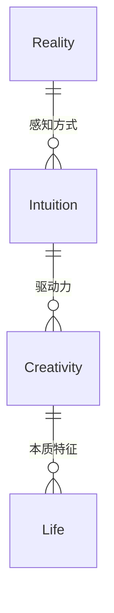
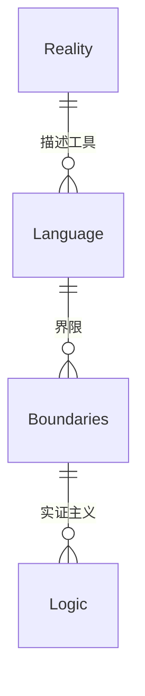
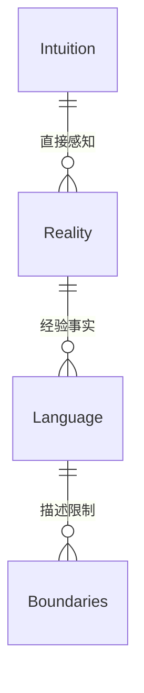

                 

## 引言

在哲学与语言学的交汇处，柏格森的神秘主义倾向与维特根斯坦的语言界限论构成了两个独特的理论体系。柏格森，作为20世纪法国重要的哲学家，他的思想深受生命哲学的影响，提出了关于直觉和创造力的深刻见解。他的神秘主义倾向强调对现实世界的直接感知，以及超越语言的认知体验。而维特根斯坦，这位奥地利的逻辑实证主义者，通过其《逻辑哲学论》和《哲学研究》两部著作，提出了关于语言与实在之间的关系，强调了语言界限的重要性。

本文旨在探讨柏格森的神秘主义倾向与维特根斯坦的语言界限论之间的异同，以及它们在哲学和语言哲学领域的深远影响。文章将首先介绍柏格森的思想背景和神秘主义观点，随后分析维特根斯坦的哲学背景和语言界限论。在接下来的章节中，我们将通过比较分析这两种理论，探讨它们在哲学和语言哲学中的应用，并进一步分析它们对现代哲学和语言哲学的影响。最后，我们将深入讨论柏格森神秘主义与维特根斯坦语言界限论的哲学意义。

通过这种步步深入的分析，我们希望读者能够对柏格森和维特根斯坦的思想有更深刻的理解，并能够认识到这两种理论在哲学和语言学领域中的重要性。

### 关键词

- 柏格森的神秘主义倾向
- 维特根斯坦的语言界限论
- 生命哲学
- 直觉与创造力
- 语言与实在
- 哲学与语言学

### 摘要

本文通过探讨柏格森的神秘主义倾向和维特根斯坦的语言界限论，分析了这两种理论在哲学和语言哲学中的重要性。文章首先介绍了柏格森的思想背景，包括他的生命哲学和对直觉、创造力的重视。接着，阐述了维特根斯坦的哲学背景和语言界限论，探讨了语言与实在之间的关系。随后，通过比较分析，揭示了柏格森神秘主义与维特根斯坦语言界限论的相似与差异。文章进一步讨论了这两种理论在哲学和语言哲学中的应用，以及它们对现代哲学和语言哲学的影响。最后，本文深入探讨了柏格森神秘主义与维特根斯坦语言界限论的哲学意义，为读者提供了对这两位哲学家的思想有更全面和深入的认识。

## 目录大纲

为了方便读者更好地理解文章内容，以下是本文的详细目录大纲：

### 引言
- **背景介绍**：介绍文章主题和作者意图
- **关键词与摘要**：列出文章的核心关键词和摘要

### 第1章 柏格森的神秘主义倾向
1. **柏格森的思想背景**
   - **核心概念术语说明**：直觉、创造力、生命哲学
   - **问题背景**：柏格森哲学的起源与发展
   - **问题描述**：柏格森如何通过直觉和创造力认识世界
   - **问题解决**：柏格森的解决思路和核心思想
   - **边界与外延**：柏格森思想的适用范围和限制
   - **概念结构与核心要素组成**：柏格森哲学的主要组成部分

2. **柏格森的神秘主义观点**
   - **核心概念与联系**：神秘主义倾向的定义及其在柏格森哲学中的地位
   - **对比表格**：柏格森神秘主义与其他哲学观点的对比
   - **ER实体关系图架构**：柏格森神秘主义思想的关系图

3. **柏格森神秘主义的影响与评价**
   - **影响**：柏格森神秘主义对现代哲学和语言哲学的影响
   - **评价**：学者们对柏格森神秘主义观点的评价和争议

### 第2章 维特根斯坦的语言界限论
1. **维特根斯坦的哲学背景**
   - **核心概念术语说明**：语言界限、逻辑实证主义
   - **问题背景**：维特根斯坦哲学的起源与发展
   - **问题描述**：语言与实在之间的关系问题
   - **问题解决**：维特根斯坦的解决思路和核心思想
   - **边界与外延**：维特根斯坦语言界限论的适用范围和限制
   - **概念结构与核心要素组成**：维特根斯坦哲学的主要组成部分

2. **语言界限的概念**
   - **核心概念与联系**：语言界限的定义及其在维特根斯坦哲学中的地位
   - **对比表格**：语言界限与其他哲学观点的对比
   - **ER实体关系图架构**：语言界限思想的关系图

3. **维特根斯坦对语言界限的探讨**
   - **核心概念与联系**：维特根斯坦如何探讨语言界限
   - **对比表格**：维特根斯坦对语言界限的不同探讨方法
   - **ER实体关系图架构**：维特根斯坦探讨语言界限的关系图

### 第3章 两种倾向的比较分析
1. **柏格森神秘主义与维特根斯坦语言界限论的对比**
   - **核心概念与联系**：两种理论的核心概念和联系
   - **对比表格**：柏格森神秘主义与维特根斯坦语言界限论的对比
   - **ER实体关系图架构**：两种理论的关系图

2. **比较中的相似与差异**
   - **相似**：两种理论中的相似之处
   - **差异**：两种理论中的差异和区别

### 第4章 柏格森神秘主义与维特根斯坦语言界限论的应用
1. **柏格森神秘主义在哲学领域中的应用**
   - **应用实例**：柏格森神秘主义在哲学中的应用案例
   - **分析**：柏格森神秘主义应用中的优点和挑战

2. **维特根斯坦语言界限论在语言哲学中的应用**
   - **应用实例**：维特根斯坦语言界限论在语言哲学中的应用案例
   - **分析**：维特根斯坦语言界限论应用中的优点和挑战

### 第5章 柏格森神秘主义与维特根斯坦语言界限论的影响
1. **对现代哲学的影响**
   - **影响**：两种理论对现代哲学的影响
   - **评价**：学者们对这两种理论影响的评价

2. **对语言哲学的影响**
   - **影响**：两种理论对语言哲学的影响
   - **评价**：学者们对这两种理论影响的评价

### 第6章 柏格森神秘主义与维特根斯坦语言界限论的哲学意义
1. **哲学意义的探讨**
   - **意义**：探讨两种理论的哲学意义
   - **评价**：学者们对这两种理论哲学意义的评价

2. **语言哲学的意义**
   - **意义**：探讨两种理论在语言哲学中的意义
   - **评价**：学者们对这两种理论在语言哲学中的评价

### 结论
- **总结**：总结文章的主要内容和观点
- **展望**：对柏格森神秘主义与维特根斯坦语言界限论未来发展的展望

### 第1章 柏格森的神秘主义倾向

#### 1.1 柏格森的思想背景

柏格森（Henri Bergson）是20世纪法国著名哲学家，生于1859年，逝于1941年。他的哲学思想深受生命哲学和直觉主义的影响，尤其在创造性思维和知识论方面具有独到见解。柏格森的思想背景可以追溯到19世纪末和20世纪初的欧洲哲学思潮，这一时期正处于传统形而上学和科学方法批判的高峰期。在此背景下，柏格森以其独特的生命哲学理念，对当时的哲学和科学方法提出了深刻的质疑和批判。

**核心概念术语说明**：

- **直觉**：柏格森认为直觉是人类认识世界的根本方式，它不同于理性思考和逻辑推理，而是直接感知世界的能力。
- **创造力**：柏格森强调创造力是生命的本质特征，它体现了生命的不断变化和进步。
- **生命哲学**：柏格森的哲学体系被称为生命哲学，他主张通过直觉来理解生命的本质和世界的真实状态。

**问题背景**：

柏格森的思想背景主要受到以下几个哲学和科学思潮的影响：

1. **生命哲学**：受德国哲学家叔本华和尼采的影响，柏格森认为生命是一种不断变化的流动状态，而非静态的存在。
2. **直觉主义**：柏格森强调直觉在认识中的作用，这种观点与形式逻辑和理性主义相对立。
3. **心理学和生理学**：柏格森深受心理学和生理学的研究成果影响，他认为心理活动与生理过程密切相关。

**问题描述**：

柏格森通过他的哲学思想，质疑传统哲学和科学方法对现实的解释能力。他认为理性思考和逻辑推理虽然是人类认识世界的重要手段，但它们不能完全揭示世界的真实本质。柏格森提出，直觉是人类认识世界的更高级方式，它能够直接感知到世界的流动性和变化性。

**问题解决**：

柏格森提出了一系列概念和理论来解释他关于直觉和创造力的观点：

1. **绵延（Durée）**：柏格森认为时间是连续不断的流动，而不是离散的瞬间。他提出了“绵延”这一概念，用以描述时间的流动性和生命的连续性。
2. **意识流**：柏格森强调意识是一个连续不断的过程，类似于一条流动的河流，而不是一系列独立的瞬间。
3. **本能与自由**：柏格森认为本能是生命的基本动力，但通过直觉和创造力，人类可以超越本能，实现自由。

**边界与外延**：

柏格森的思想具有广泛的适用范围，但他也面临一些限制：

1. **认识论的边界**：柏格森认为直觉能够直接感知到世界的真实本质，但这种观点在科学和哲学中受到了质疑。
2. **实证主义的挑战**：柏格森的生命哲学与实证主义相对立，他认为科学不能仅通过观察和实验来解释世界。

**概念结构与核心要素组成**：

柏格森的哲学体系主要包括以下几个核心要素：

1. **直觉**：直觉是柏格森哲学的核心，他认为直觉是人类认识世界的根本方式。
2. **创造力**：创造力是生命的本质特征，柏格森强调人类通过直觉和创造力可以实现超越。
3. **绵延**：绵延是柏格森对时间的独特理解，他用以描述时间的流动性和生命的连续性。

柏格森的哲学思想对现代哲学和语言哲学产生了深远的影响。他的生命哲学和直觉主义观点为后来的存在主义和现象学提供了重要的理论基础。同时，他的思想也对科学方法论和心理学研究产生了重要影响。

#### 1.2 柏格森的神秘主义观点

柏格森的神秘主义倾向是他哲学思想的重要组成部分，这一观点体现在他对直觉、创造力和现实本质的理解上。神秘主义倾向不仅仅是一种哲学立场，更是一种关于认知和存在的独特视角。在柏格森看来，神秘主义倾向是对现实世界深层次感知的一种方式，它超越了理性的分析和逻辑的推理。

**核心概念与联系**：

1. **直觉**：柏格森认为直觉是人类认知世界的根本方式，它与理性思考不同，能够直接感知到事物的本质。直觉不是基于逻辑推理，而是通过一种内在的感知能力来理解世界。在柏格森的哲学体系中，直觉与理性是两种不同的认知模式，前者强调直接感知，后者则依赖逻辑分析和推理。

2. **创造力**：柏格森将创造力视为生命的本质特征，认为它是人类能够超越现实、创造新事物的能力。创造力与直觉密切相关，它体现了生命的流动性和变化性。在柏格森看来，人类通过直觉和创造力能够突破现实的限制，达到一种更高级的存在状态。

3. **现实本质**：柏格森的神秘主义倾向使他关注现实世界的本质。他主张，现实不仅仅是表面现象，而是一种更深层次的存在状态。通过直觉，人们能够感知到这种更深层次的本质，从而理解世界的真实状态。

**对比表格**：

为了更清晰地展示柏格森神秘主义观点与其他哲学观点的对比，以下是一个简化的对比表格：

| 观点             | 柏格森的神秘主义倾向         | 其他哲学观点                |
|------------------|-----------------------------|-----------------------------|
| 认知模式         | 强调直觉，超越理性推理       | 通常依赖于理性分析和逻辑推理 |
| 现实本质         | 看重深层本质，超越表面现象   | 通常关注表面现象和经验       |
| 创造力           | 看作生命的本质特征           | 可能不被视为核心概念         |

**ER实体关系图架构**：

为了更好地理解柏格森神秘主义观点的概念结构，可以使用Mermaid绘制一个简化的ER实体关系图。以下是ER图的示例：

在这个ER图中，直觉、创造力和现实本质是三个核心实体，它们之间通过相互关系相互连接。直觉是感知现实的方式，创造力是生命的驱动力，而现实本质则是这两者共同指向的目标。

#### 1.3 柏格森神秘主义的影响与评价

柏格森的神秘主义倾向对现代哲学和语言哲学产生了深远的影响，并在学术界引发了广泛的讨论和评价。柏格森的思想不仅在哲学领域产生了重要影响，还对文学、艺术和心理学等领域产生了重要启示。

**影响**：

1. **存在主义和现象学**：柏格森的直觉主义和生命哲学为后来的存在主义和现象学提供了理论基础。特别是他的强调直觉和流动性的观点，与现象学创始人胡塞尔的思想有相通之处。存在主义哲学家如萨特和海德格尔，也从柏格森的思想中汲取了灵感。

2. **文学和艺术**：柏格森的神秘主义倾向影响了20世纪的文学和艺术创作。许多作家和艺术家，如普鲁斯特、乔伊斯和庞德，都受到了柏格森思想的影响，他们在作品中探索了时间和意识流动的复杂性。

3. **心理学**：柏格森的直觉主义观点对心理学研究产生了重要影响。他强调直觉和创造力的作用，启发了后来的心理学家对认知过程的研究。

**评价**：

1. **正面评价**：柏格森的神秘主义倾向受到了许多学者的正面评价。他的直觉主义和生命哲学为认识和理解人类经验和现实提供了新的视角。一些学者认为，柏格森的思想具有深刻的洞见，对现代哲学和科学方法论产生了重要影响。

2. **批评与争议**：然而，柏格森的思想也面临一些批评和争议。一些学者认为，柏格森的神秘主义倾向过于抽象和难以验证，他的直觉主义观点在科学领域受到了质疑。此外，柏格森的生命哲学有时被认为与实证主义和逻辑实证主义相矛盾，这使得他的思想在一些哲学流派中受到了批评。

总体来说，柏格森的神秘主义倾向在哲学和语言哲学领域产生了重要影响，虽然存在争议，但他的思想无疑为现代哲学提供了丰富的资源和新的思考方向。

#### 2.1 维特根斯坦的哲学背景

路德维希·维特根斯坦（Ludwig Wittgenstein）是20世纪最具影响力的哲学家之一，他的哲学思想对现代哲学和语言哲学产生了深远的影响。维特根斯坦生于1889年，逝于1951年，他的生平充满了传奇色彩，而他的哲学成就更是使他成为了哲学史上的重要人物。

**核心概念术语说明**：

- **语言界限**：维特根斯坦提出的核心概念，强调语言的表达能力和界限。
- **逻辑实证主义**：维特根斯坦早期的哲学立场，主张通过经验验证来理解语言和知识。
- **日常语言哲学**：维特根斯坦后期的工作，强调日常语言的实际使用和理解。

**问题背景**：

维特根斯坦的哲学背景可以追溯到19世纪末和20世纪初的欧洲哲学思潮。这一时期，哲学界正在经历一场深刻的变革，包括对传统形而上学和科学方法的批判，以及对语言和知识的重新审视。维特根斯坦的思想受到了当时多种哲学思潮的影响，尤其是弗雷格、罗素、摩尔等逻辑实证主义者的工作，以及康德、黑格尔等传统哲学家的思想。

**问题描述**：

维特根斯坦的哲学工作主要集中在探讨语言、思想和现实之间的关系。他认为，哲学的任务不是通过逻辑推理和形而上学来揭示世界的本质，而是通过分析语言的实际使用，理解思想和现实的界限。维特根斯坦提出，语言不仅仅是一种交流工具，它还与我们的思维方式密切相关。

**问题解决**：

维特根斯坦通过两本主要著作——《逻辑哲学论》和《哲学研究》——系统地阐述了其哲学思想。《逻辑哲学论》中，他提出了语言界限的概念，认为语言只能用于描述经验世界中的事实，而超越经验的事物则无法用语言表达。《哲学研究》则通过分析日常语言的使用，揭示了语言的多义性和模糊性，强调了理解语言的关键在于理解其在日常生活中的实际用法。

**边界与外延**：

维特根斯坦的思想具有广泛的适用范围，但也存在一些边界和限制：

1. **认识论的边界**：维特根斯坦强调语言和现实的界限，这使得他的思想在认识论领域具有独特价值，但也引发了对知识本质的质疑。
2. **实证主义的挑战**：尽管维特根斯坦在早期接受了逻辑实证主义的观点，但他在《哲学研究》中对其进行了深刻的批判，这导致他的思想与实证主义存在显著差异。

**概念结构与核心要素组成**：

维特根斯坦的哲学体系主要包括以下几个核心要素：

1. **语言界限**：维特根斯坦认为，语言的使用是有限的，它只能描述经验世界中的事实。这一概念成为他哲学思想的核心。
2. **逻辑实证主义**：维特根斯坦早期的工作深受逻辑实证主义影响，他试图通过经验验证来理解语言和知识。
3. **日常语言哲学**：维特根斯坦后期的工作转向日常语言的使用，强调理解语言的关键在于分析其在日常生活中的实际用法。

维特根斯坦的哲学思想对现代哲学和语言哲学产生了深远的影响。他的语言界限论和日常语言哲学为后来的语言哲学和认知科学提供了重要的理论基础。同时，他的思想也引发了对知识、语言和现实的深刻反思。

#### 2.2 语言界限的概念

语言界限是维特根斯坦哲学思想中的核心概念，它在《逻辑哲学论》和《哲学研究》两部著作中得到了系统阐述。维特根斯坦认为，语言的使用是有界限的，这种界限不仅决定了语言的表达能力，也影响了对现实世界的理解。

**核心概念与联系**：

1. **语言界限**：维特根斯坦将语言界限定义为语言所能描述和表达的范围。他认为，语言只能用于描述经验世界中的事实，而超越经验的事物则无法用语言表达。这个概念强调了语言的使用是有限制的，它不能超越其经验基础。

2. **逻辑实证主义**：维特根斯坦早期的哲学立场是逻辑实证主义，他主张通过经验验证来理解语言和知识。在这种立场下，语言界限的概念体现了他对语言与现实关系的理解。

3. **日常语言哲学**：在《哲学研究》中，维特根斯坦转向日常语言的使用，强调理解语言的关键在于分析其在日常生活中的实际用法。他通过分析日常语言中的多义性和模糊性，揭示了语言界限的复杂性。

**对比表格**：

为了更清晰地展示语言界限的概念与其他哲学观点的对比，以下是一个简化的对比表格：

| 观点             | 维特根斯坦的语言界限         | 其他哲学观点                |
|------------------|-----------------------------|-----------------------------|
| 语言功能         | 用于描述经验世界中的事实     | 可能涉及更广泛的领域，如形而上学 |
| 认识论立场       | 逻辑实证主义                | 可能是直觉主义或理性主义     |
| 语言界限         | 明确的界限，超越界限无法表达 | 可能没有明确界限，或强调超越界限 |

**ER实体关系图架构**：

为了更好地理解语言界限的概念结构，可以使用Mermaid绘制一个简化的ER实体关系图。以下是ER图的示例：

在这个ER图中，语言、现实和语言界限是三个核心实体，它们通过相互关系相互连接。语言是描述现实的工具，而语言界限则决定了语言的表达能力。逻辑实证主义是维特根斯坦对语言界限的一种解释。

#### 2.3 维特根斯坦对语言界限的探讨

维特根斯坦对语言界限的探讨贯穿于其哲学生涯的各个阶段，从早期的逻辑哲学论到后期的日常语言哲学，他都试图通过分析语言的实际使用来揭示语言的界限。以下将详细分析维特根斯坦在不同阶段对语言界限的探讨，并讨论其方法和观点。

**早期探讨：逻辑哲学论**

在《逻辑哲学论》中，维特根斯坦提出了著名的“图式理论”，他认为语言与世界的对应关系可以通过逻辑结构来描述。在这个阶段，维特根斯坦强调语言界限的重要性，认为语言只能用来描述经验世界中的事实，而超越经验的事物是无法用语言表达的。以下是维特根斯坦在《逻辑哲学论》中关于语言界限的几个关键观点：

1. **图式理论**：维特根斯坦认为，语言中的命题是由逻辑元素组成的图式，这些图式与经验世界中的事实相对应。通过这种对应关系，语言可以用来描述现实。
2. **不可说之物**：维特根斯坦指出，有些事物是无法用语言表达的，这些“不可说之物”超出了语言的表达范围。例如，关于“世界是什么”的问题，维特根斯坦认为这个问题没有意义，因为它超出了语言的能力。
3. **命题函数**：维特根斯坦提出命题函数的概念，即一种特定的句子形式，可以通过替换其中的变元来描述所有可能的事实。这个观点强调了语言的表达能力，但同时也指出了语言的界限。

**后期探讨：日常语言哲学**

在《哲学研究》中，维特根斯坦转向日常语言的使用，通过分析日常语言中的多义性和模糊性，揭示了语言界限的复杂性。在这个阶段，他强调理解语言的关键在于理解其在实际生活中的用法。以下是维特根斯坦在《哲学研究》中关于语言界限的几个关键观点：

1. **语言游戏**：维特根斯坦提出了“语言游戏”的概念，即语言的使用是多样化的，不同的语言游戏对应不同的生活形式。语言游戏的概念强调了语言的灵活性，但也指出了语言界限的存在。
2. **意义即使用**：维特根斯坦认为，词语的意义在于其在日常生活中的使用，而不是通过逻辑或形而上学来定义。这种观点被称为“意义即使用”原则，它强调了语言界限的相对性和主观性。
3. **语言界限的相对性**：维特根斯坦指出，语言界限并不是绝对的，而是相对的，取决于语言的具体使用情境。例如，一个词语在某个语言游戏中可能有特定的意义，但在另一个情境中可能没有意义。

**探讨方法与观点**

1. **图式理论与语言游戏**：维特根斯坦在不同阶段的方法有所不同，但都试图通过分析语言的使用来揭示语言的界限。早期的图式理论强调逻辑结构的确定性，而后期的语言游戏强调语言的灵活性和多样性。
2. **逻辑实证主义与日常语言哲学**：维特根斯坦的早期立场是逻辑实证主义，他试图通过经验验证来理解语言和知识。后期的日常语言哲学则更强调语言的现实使用，认为理解语言的关键在于分析其在日常生活中的实际用法。
3. **语言界限的主观性与客观性**：维特根斯坦认为，语言界限既是客观的，也是主观的。从客观角度看，语言确实存在界限，它不能表达超越经验的事物；从主观角度看，语言界限是相对的，取决于语言的使用情境。

总的来说，维特根斯坦对语言界限的探讨既具有深刻的哲学意义，又具有实际的应用价值。他的思想为我们理解语言、思想和现实之间的关系提供了重要的理论框架，同时也引发了对语言界限的深入思考和讨论。

### 第3章 两种倾向的比较分析

在上一章中，我们分别介绍了柏格森的神秘主义倾向和维特根斯坦的语言界限论。在本章中，我们将通过对比分析这两种理论，探讨它们之间的相似与差异，并分析其哲学和语言学上的意义。

#### 3.1 柏格森神秘主义与维特根斯坦语言界限论的对比

**核心概念与联系**

柏格森的神秘主义倾向和维特根斯坦的语言界限论在核心概念上存在显著差异，但也有一些联系。

**柏格森神秘主义**：
- 强调直觉和创造力的作用，认为直觉是人类认识世界的根本方式。
- 神秘主义倾向关注对现实世界的直接感知，超越语言的认知体验。

**维特根斯坦语言界限论**：
- 着重探讨语言与现实之间的关系，提出语言界限的概念，认为语言只能描述经验世界中的事实。
- 语言界限论强调语言的使用范围和限制，关注语言的明确性和确定性。

**对比表格**：

为了更直观地展示两种理论的核心概念和联系，我们可以使用一个对比表格：

| 观点            | 柏格森的神秘主义倾向                  | 维特根斯坦的语言界限论                   |
|-----------------|--------------------------------------|-----------------------------------------|
| 认知模式        | 直觉主义，强调直接感知               | 经验主义，强调语言与现实的对应关系       |
| 语言功能        | 超越语言，关注直接体验               | 描述经验世界，关注语言的界限和限制       |
| 现实本质        | 强调现实的本质在于直觉感知           | 强调现实在于经验事实，语言描述现实       |
| 哲学意义        | 提供对现实的一种直觉理解             | 探讨语言和现实的关系，揭示语言的界限和限制 |

**ER实体关系图架构**：

为了更深入地理解两种理论的关系，我们可以使用Mermaid绘制一个简化的ER实体关系图：

在这个ER图中，直觉和现实通过感知关系相连，而语言和现实通过界限关系相连。这种关系图展示了柏格森神秘主义和维特根斯坦语言界限论之间的内在联系和差异。

#### 3.2 比较中的相似与差异

**相似之处**：

- **对语言界限的关注**：尽管柏格森和维特根斯坦的观点有所不同，但他们都关注了语言的界限和限制。柏格森强调直觉的局限性，而维特根斯坦强调语言的经验界限。

- **对现实的探索**：两种理论都试图通过不同的途径理解现实。柏格森通过直觉和创造力的直接感知来认识现实，而维特根斯坦通过语言与现实的对应关系来描述现实。

**差异**：

- **认知模式**：柏格森强调直觉，认为它是认识世界的关键，而维特根斯坦则强调语言的实际使用，认为语言是描述现实的基础。

- **哲学立场**：柏格森的生命哲学带有强烈的神秘主义色彩，而维特根斯坦的哲学更偏向逻辑实证主义。

- **语言界限的界定**：柏格森的神秘主义倾向强调直觉的局限性，而维特根斯坦的语言界限论则更加具体，强调语言在经验世界中的使用范围。

总的来说，柏格森的神秘主义倾向和维特根斯坦的语言界限论在哲学和语言学上各有特点，尽管存在相似之处，但它们在认知模式、哲学立场和语言界限的界定上存在显著差异。这些差异和相似之处为我们深入理解语言、现实和认知提供了不同的视角。

### 第4章 柏格森神秘主义与维特根斯坦语言界限论的应用

柏格森的神秘主义倾向和维特根斯坦的语言界限论不仅在理论层面具有深远影响，而且在实际应用中也展现出了其独特的价值。在本节中，我们将探讨这两种理论在哲学和语言哲学领域中的应用实例，分析其优点和挑战。

#### 4.1 柏格森神秘主义在哲学领域中的应用

柏格森的神秘主义倾向在哲学领域有着广泛的应用，特别是在现象学和存在主义哲学中。以下是一些具体的应用实例：

**现象学中的应用**：

现象学哲学强调对直接经验的关注，而柏格森的神秘主义倾向与现象学的这一核心特点相契合。现象学创始人爱德蒙·胡塞尔受到柏格森的影响，他提出了“直观”的概念，强调直接感知在理解现象中的重要性。胡塞尔的学生马丁·海德格尔也在其哲学体系中融入了柏格森的思想，他提出了“存在-时间”的概念，强调存在是一种不断流动的状态。

**存在主义中的应用**：

存在主义哲学家让-保罗·萨特在《存在与虚无》一书中，借鉴了柏格森的直觉主义思想，探讨了自由和存在的本质。萨特认为，自由是人类存在的核心特征，这种自由是通过直觉来感知和把握的。柏格森的神秘主义倾向为萨特的存在主义提供了深刻的哲学基础。

**分析**：

柏格森的神秘主义倾向在哲学中的应用具有以下优点：

1. **强调直接经验**：柏格森的直觉主义使哲学研究回归到直接感知，避免了过度抽象和理性推理，有助于更真实地反映人类经验。

2. **提供新的视角**：柏格森的神秘主义倾向为哲学研究提供了新的视角，特别是对时间和意识的研究，丰富了哲学的理论体系。

然而，柏格森的神秘主义倾向也面临一些挑战：

1. **难以验证**：柏格森的直觉主义强调了直接感知的重要性，但这种感知往往是主观的，难以通过客观方法验证，这在科学和实证主义哲学中受到了质疑。

2. **概念模糊**：柏格森的一些概念，如“绵延”和“创造力”，较为抽象和模糊，难以精确界定，这给哲学研究带来了一定的困扰。

#### 4.2 维特根斯坦语言界限论在语言哲学中的应用

维特根斯坦的语言界限论在语言哲学中具有深远的应用，特别是对日常语言分析和逻辑哲学的研究。以下是一些具体的应用实例：

**日常语言分析**：

维特根斯坦在《哲学研究》中提出了“语言游戏”的概念，强调语言的使用是多样化的，不同的语言游戏对应不同的生活形式。通过这种分析，维特根斯坦揭示了日常语言中的多义性和模糊性，为理解日常语言提供了新的视角。

**逻辑哲学**：

维特根斯坦在《逻辑哲学论》中提出了“图式理论”，认为语言中的命题是由逻辑元素组成的图式，这些图式与经验世界中的事实相对应。这一理论为逻辑哲学提供了重要的基础，影响了后来的逻辑实证主义和形式逻辑研究。

**分析**：

维特根斯坦的语言界限论在语言哲学中的应用具有以下优点：

1. **强调语言的局限性**：维特根斯坦通过语言界限论揭示了语言的局限性，强调了语言在描述现实时的限制，这有助于我们更客观地看待语言的作用。

2. **促进语言分析**：维特根斯坦的日常语言分析为语言哲学提供了新的研究方法，使语言哲学从抽象的理论探讨转向具体语言现象的分析。

然而，维特根斯坦的语言界限论也面临一些挑战：

1. **逻辑实证主义的批评**：维特根斯坦在早期接受了逻辑实证主义的观点，但他在后期对其进行了深刻的批判，这导致他的思想与逻辑实证主义存在显著差异，这在一些学者中引起了争议。

2. **语言界限的模糊性**：尽管维特根斯坦提出了语言界限的概念，但这个界限在具体应用中往往难以明确界定，这给语言哲学的研究带来了一定的困难。

总的来说，柏格森的神秘主义倾向和维特根斯坦的语言界限论在哲学和语言哲学领域具有广泛的应用。它们不仅为哲学研究提供了新的视角和方法，也为我们理解语言、现实和认知提供了深刻的启示。然而，这些理论在应用中也面临着一些挑战，这需要我们在未来的研究中进一步探讨和解决。

### 第5章 柏格森神秘主义与维特根斯坦语言界限论的影响

柏格森的神秘主义倾向和维特根斯坦的语言界限论对现代哲学和语言哲学产生了深远的影响。这两位哲学家的思想不仅在学术界引发了广泛的讨论，还对实际应用和学科发展产生了重要推动作用。

#### 5.1 对现代哲学的影响

柏格森的神秘主义倾向对现代哲学的影响主要体现在对现象学、存在主义和生命哲学的推动上。柏格森强调直觉和创造力的作用，认为它们是人类认识世界的根本方式，这一观点对现象学创始人胡塞尔和存在主义哲学家如海德格尔和萨特产生了深远影响。

**现象学**：柏格森的直觉主义与现象学的直观原则有相似之处，这为现象学的发展提供了重要的理论基础。胡塞尔在创建现象学时，借鉴了柏格森的直觉概念，强调对直接经验的关注，这使得现象学成为20世纪最重要的哲学流派之一。

**存在主义**：柏格森的思想对存在主义哲学也产生了重要影响。萨特和海德格尔在探讨自由、存在和人的本质时，都受到了柏格森直觉主义的影响。萨特的自由意志理论和海德格尔的存在论，都体现了对柏格森思想的传承和发展。

**生命哲学**：柏格森的生命哲学为现代哲学提供了一种独特的视角，强调生命的流动性和变化性。这一思想为后来的生命哲学和生态哲学提供了理论基础，对当代哲学的多元发展产生了积极影响。

维特根斯坦的语言界限论对现代哲学的影响则体现在对逻辑哲学、语言哲学和科学哲学的推动上。维特根斯坦通过对语言与现实关系的探讨，为这些领域提供了深刻的见解。

**逻辑哲学**：维特根斯坦在《逻辑哲学论》中提出了图式理论，强调了逻辑和数学在哲学研究中的重要性。这一理论对逻辑哲学的发展产生了深远影响，为后来的形式逻辑和数学哲学奠定了基础。

**语言哲学**：维特根斯坦的日常语言哲学为语言哲学提供了新的研究方向，强调理解语言的关键在于分析其在日常生活中的实际用法。这一观点引发了大量关于语言本质、意义和使用的讨论，推动了语言哲学的发展。

**科学哲学**：维特根斯坦的思想也对科学哲学产生了重要影响。他通过对语言界限的探讨，揭示了科学理论在描述现实时的局限性和模糊性，这为科学哲学的研究提供了新的视角，促进了科学哲学的进步。

#### 5.2 对语言哲学的影响

柏格森的神秘主义倾向和维特根斯坦的语言界限论对语言哲学产生了深远的影响，特别是在探讨语言与现实关系、语言意义和理解方面。

**柏格森神秘主义对语言哲学的影响**：

柏格森的神秘主义倾向强调了直觉在认识中的作用，这为语言哲学提供了一种新的视角，即通过直接感知来理解语言与现实的关系。柏格森认为，语言不能完全表达现实，因为现实具有深层次的、难以言说的本质。这一观点启发了后来的语言哲学家对语言极限和语言意义的探讨。

**维特根斯坦语言界限论对语言哲学的影响**：

维特根斯坦的语言界限论为语言哲学提供了一个重要的理论基础，特别是对语言意义和理解的探讨。维特根斯坦认为，语言的意义在于其使用，语言界限决定了语言的表达能力。这一观点引发了关于语言界限、语言意义和语言使用的广泛讨论，推动了语言哲学的发展。

**影响评价**：

**柏格森神秘主义**：学者们对柏格森神秘主义的影响评价不一。一些学者认为，柏格森的直觉主义提供了对现实深刻理解的途径，有助于我们超越理性的局限。然而，另一些学者批评其观点过于抽象和难以验证，认为其难以在科学和实证主义框架内得到充分证实。

**维特根斯坦语言界限论**：维特根斯坦的语言界限论在语言哲学中得到了广泛认可。学者们普遍认为，他的观点为我们理解语言与现实关系提供了新的视角，特别是在揭示语言的局限性和模糊性方面具有深刻意义。然而，一些学者也指出，维特根斯坦的理论在某些方面过于理想化，需要进一步结合实际语言使用进行验证。

总的来说，柏格森神秘主义和维特根斯坦语言界限论对现代哲学和语言哲学产生了重要影响，它们为这些领域提供了丰富的理论资源和新的研究视角。尽管存在争议，但这两位哲学家的思想无疑为我们理解语言、现实和认知提供了深刻的启示。

### 第6章 柏格森神秘主义与维特根斯坦语言界限论的哲学意义

柏格森的神秘主义倾向和维特根斯坦的语言界限论在哲学领域具有深远的意义，不仅丰富了哲学的理论体系，还提供了对现实和语言本质的深刻见解。通过对这两位哲学家的思想进行深入探讨，我们可以更好地理解哲学的本质和哲学问题。

#### 6.1 哲学意义的探讨

**柏格森的神秘主义倾向**：

柏格森的神秘主义倾向强调直觉和创造力在认识中的作用，这为哲学提供了一种不同于理性主义和实证主义的认识模式。柏格森认为，直觉是人类认识世界的根本方式，它能够直接感知到事物的本质。这一观点挑战了传统哲学中理性推理的主导地位，促使哲学家们重新思考认识的本质和途径。

柏格森的神秘主义倾向还强调了生命的流动性和变化性，这为现代哲学，特别是存在主义和生命哲学提供了重要的理论基础。他的思想启发了后来的哲学家对人的存在、自由和意义的探讨，丰富了哲学的内涵。

**维特根斯坦的语言界限论**：

维特根斯坦的语言界限论通过探讨语言与现实的关系，揭示了语言的局限性和模糊性。他认为，语言的意义在于其使用，语言界限决定了语言的表达能力。这一观点为语言哲学提供了一个重要的理论基础，使哲学家们能够更加深入地探讨语言的本质和功能。

维特根斯坦的语言界限论还强调了理解语言的关键在于分析其在日常生活中的实际用法。这一观点挑战了传统哲学中过度抽象和理论化的倾向，促使哲学家们更加关注实际语言使用，这有助于我们更准确地理解语言的意义和作用。

#### 6.2 语言哲学的意义

柏格森神秘主义和维特根斯坦语言界限论在语言哲学中具有重要的意义，它们为我们理解语言的本质和语言哲学的基本问题提供了深刻的见解。

**柏格森神秘主义对语言哲学的意义**：

柏格森的神秘主义倾向强调了直觉在理解语言中的作用，这为语言哲学提供了一种新的认识模式。他提出了“直觉语言”的概念，认为直觉是人类理解语言和世界的根本方式。这一观点挑战了传统哲学中理性推理的主导地位，促使语言哲学家们重新思考语言的本质和功能。

柏格森的神秘主义倾向还强调了语言与现实的界限。他认为，语言无法完全表达现实，因为现实具有深层次的、难以言说的本质。这一观点为语言哲学提供了重要的理论基础，使哲学家们能够更加深入地探讨语言与现实的关系。

**维特根斯坦语言界限论对语言哲学的意义**：

维特根斯坦的语言界限论通过对语言与现实关系的探讨，揭示了语言的局限性和模糊性。他认为，语言的意义在于其使用，语言界限决定了语言的表达能力。这一观点为语言哲学提供了一个重要的理论基础，使哲学家们能够更加深入地探讨语言的本质和功能。

维特根斯坦的语言界限论还强调了理解语言的关键在于分析其在日常生活中的实际用法。这一观点挑战了传统哲学中过度抽象和理论化的倾向，促使语言哲学家们更加关注实际语言使用，这有助于我们更准确地理解语言的意义和作用。

总的来说，柏格森神秘主义和维特根斯坦语言界限论在哲学和语言哲学中具有深远的意义。它们不仅丰富了哲学的理论体系，还为我们理解现实和语言本质提供了深刻的见解。通过深入探讨这两位哲学家的思想，我们可以更好地理解哲学的本质和哲学问题，从而推动哲学的发展。

### 结论

本文通过对柏格森的神秘主义倾向和维特根斯坦的语言界限论的探讨，揭示了这两种哲学倾向在哲学和语言哲学领域的深远影响。柏格森的生命哲学和直觉主义为我们提供了对现实本质和认知方式的全新理解，而维特根斯坦的语言界限论则揭示了语言在描述现实时的局限性和模糊性。通过对比分析，我们看到了柏格森和维特根斯坦在哲学和语言学上的异同，并探讨了它们在哲学和语言哲学中的应用。

柏格森的神秘主义倾向强调直觉和创造力，认为直觉是人类认识世界的根本方式，这为我们理解存在的流动性和变化性提供了深刻见解。维特根斯坦的语言界限论则通过对语言与现实关系的探讨，揭示了语言的局限性和模糊性，强调了理解语言的关键在于分析其在日常生活中的实际用法。

未来的研究可以进一步探讨柏格森和维特根斯坦思想在现代哲学和语言哲学中的具体应用，以及它们对其他学科，如心理学、文学和艺术的影响。此外，研究者还可以探讨这两种理论在具体社会文化背景下的适用性和局限性，为当代哲学提供更加全面和深入的理论资源。通过不断的研究和反思，我们可以更好地理解哲学的本质和哲学问题，推动哲学的持续发展。

