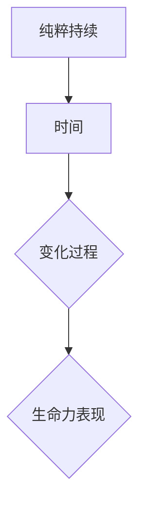
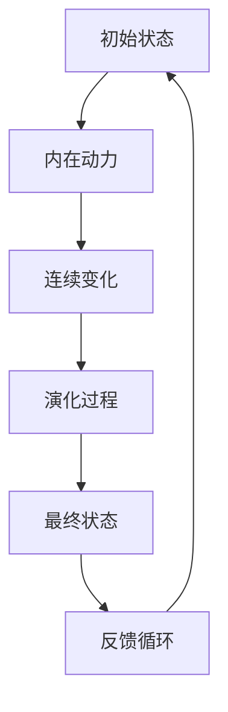
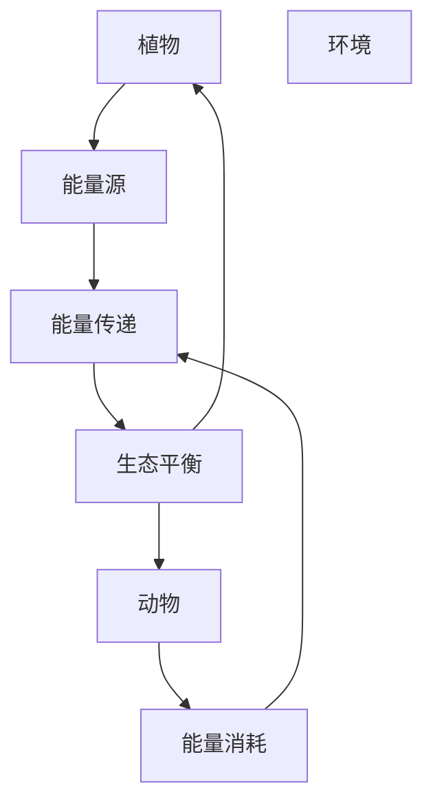
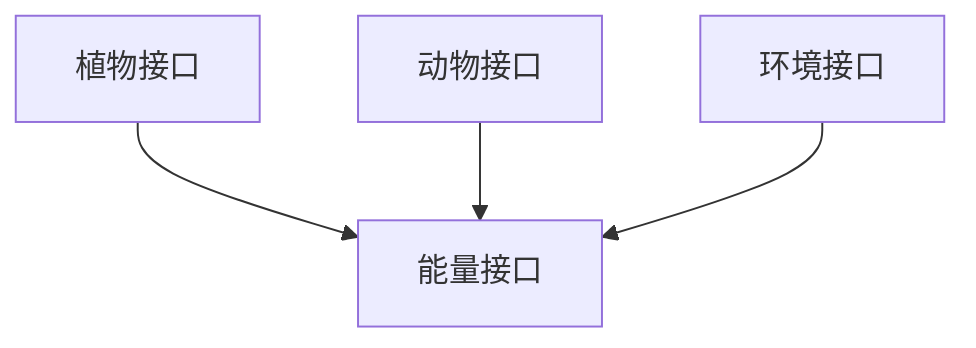
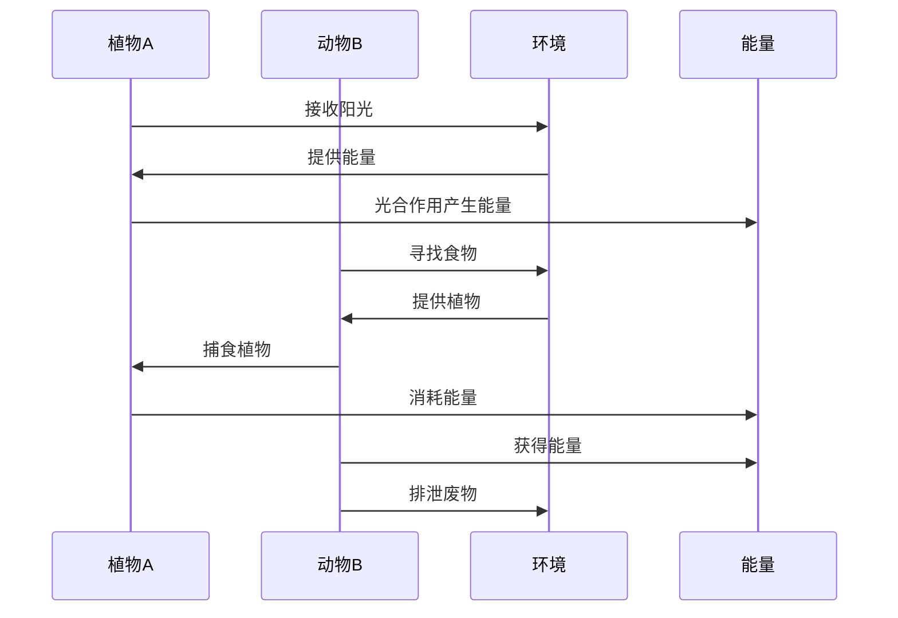

                 

### 文章标题

《柏格森的纯粹持续与维特根斯坦的语言使用理论》

### 关键词

柏格森、纯粹持续、维特根斯坦、语言使用理论、哲学、科学、艺术、伦理

### 摘要

本文旨在探讨柏格森的纯粹持续理论与维特根斯坦的语言使用理论之间的关系。通过对柏格森哲学背景的介绍，深入分析纯粹持续理论的基本概念及其哲学意义。同时，我们将探讨维特根斯坦的语言使用理论，解析其核心思想与应用。最后，通过对比分析两种理论的相似与差异，揭示其对语言哲学的贡献，并展望未来的研究方向。本文不仅为读者提供了丰富的哲学知识，也为跨学科的研究提供了新的视角。

### 目录

## 第一部分：柏格森的纯粹持续理论

### 第1章：柏格森哲学的背景与纯粹持续理论的基本概念

### 第2章：纯粹持续的哲学意义与影响

### 第3章：柏格森的纯粹持续与现代科学

### 第4章：柏格森的纯粹持续与艺术

### 第5章：柏格森的纯粹持续与伦理

## 第二部分：维特根斯坦的语言使用理论

### 第6章：维特根斯坦哲学的背景与语言使用理论的基本概念

### 第7章：语言使用与意义

### 第8章：语言游戏与语言使用理论的应用

## 第三部分：柏格森与维特根斯坦的语言使用理论的比较

### 第9章：理论的相似性与差异

### 第10章：两种理论对语言哲学的贡献

### 第11章：结论与展望

### 致谢

## 第一部分：柏格森的纯粹持续理论

### 第1章：柏格森哲学的背景与纯粹持续理论的基本概念

### 第1.1节：柏格森哲学的起源与发展

**背景介绍**

亨利·柏格森（Henri Bergson，1859-1941）是法国著名的哲学家、社会学家和文学家。他生于巴黎，毕业于巴黎高等师范学院，并曾在欧洲各国游学。柏格森的哲学思想深受法国哲学传统的影响，同时也受到了生物学和进化学说的启发。他的主要著作包括《物质与记忆》、《笑的生活》、《创造进化论》等，其中最著名的是《创造的进化》。

**核心概念**

柏格森的哲学核心是“纯粹持续”（élan vital），也称为“生命冲动”或“生命力”。这一概念旨在描述生命的本质，以及生命如何在时间中演化。纯粹持续不是一种物理力量，而是一种内在的动力，是生命进化的驱动力。

**问题背景**

在柏格森的时代，自然科学的发展对哲学产生了巨大的影响。物理学和生物学的研究表明，物质世界是由大量微观粒子组成的，这些粒子遵循着严格的物理定律。柏格森认为，这种机械论的观点不能完全解释生命的本质。他主张，生命是一种内在的动力，这种动力在时间的流逝中不断演化。

**问题描述**

柏格森提出的问题是如何在物理世界中找到生命的动力。他认为，生命不是静止的，而是一种持续的变化过程。这种变化不是线性的，而是不断涌现的。因此，他提出了纯粹持续的概念，认为它是生命力的表现形式。

**问题解决**

柏格森通过引入纯粹持续的概念，试图解释生命的复杂性和多样性。他认为，纯粹持续是一种内在的动力，它不断地推动生命向前发展。这种动力不是物理的，而是精神的，它超越了物理世界的限制。

**边界与外延**

柏格森的纯粹持续理论涉及多个领域，包括哲学、生物学、心理学和社会学。他在这些领域提出了一系列新的观点，对当时的学术研究产生了深远的影响。然而，他的理论也受到了批评，一些人认为他的观点过于抽象，难以用实验来验证。

**概念结构与核心要素组成**

柏格森的纯粹持续理论主要包括以下几个核心要素：

1. **生命的内在动力**：纯粹持续是生命的驱动力，它使生命在时间的流逝中不断演化。
2. **时间的流逝**：柏格森认为，时间是连续的，不是离散的。纯粹持续是时间中的变化过程。
3. **意识和精神**：柏格森认为，纯粹持续是意识和精神的表现形式，它使生命具有自主性和创造性。

### 第1.2节：纯粹持续的定义与核心思想

**定义**

纯粹持续是柏格森提出的一个哲学概念，用来描述生命的内在动力。它指的是一种无形的、内在的、持续的动力，是生命进化的驱动力。

**核心思想**

柏格森认为，纯粹持续是生命力的核心，它使生命具有自主性和创造性。纯粹持续是一种内在的动力，它不断地推动生命向前发展，使生命在时间的流逝中不断演化。

**对比表格**

| 特点 | 柏格森的纯粹持续 | 其他观点 |
| --- | --- | --- |
| 定义 | 无形的、内在的、持续的动力 | 物理力量、物质因素 |
| 功能 | 推动生命进化、创造新形式 | 维持现状、适应环境 |
| 影响范围 | 哲学、生物学、心理学、社会学 | 物理学、化学、生物学 |

**ER实体关系图架构**

```mermaid
erDiagram
  Entity A[Pure Continuation]
  Entity B[Life Force]
  Entity C[Evolution]
  
  A --> B
  B --> C
```

### 第1.3节：纯粹持续与时间的关系

**关系描述**

柏格森认为，纯粹持续是时间中的变化过程。时间不是离散的，而是连续的。纯粹持续在时间的流逝中不断涌现，推动生命的进化。

**数学模型**

柏格森使用微积分来描述纯粹持续与时间的关系。他提出了一个微分方程，描述了纯粹持续在时间中的演化。

$$
\frac{dC}{dt} = f(C)
$$

其中，$C$ 表示纯粹持续，$t$ 表示时间，$f(C)$ 表示纯粹持续的演化速率。

**公式解释**

这个微分方程描述了纯粹持续在时间中的演化。$C$ 的导数 $\frac{dC}{dt}$ 表示纯粹持续的变化速率。$f(C)$ 是一个关于 $C$ 的函数，表示纯粹持续的演化速率与纯粹持续本身的函数关系。

**举例说明**

假设一个生物体的纯粹持续 $C$ 随时间 $t$ 的变化如图所示：


从这个图中，我们可以看到纯粹持续 $C$ 随时间 $t$ 的变化。在一段时间内，$C$ 的变化速率 $\frac{dC}{dt}$ 可能是正的，也可能是负的。这取决于纯粹持续 $C$ 的当前值。

### 第2章：纯粹持续的哲学意义与影响

### 第2.1节：纯粹持续与意识流

**概念描述**

意识流是柏格森哲学中的一个重要概念，指的是意识在时间中的流动。柏格森认为，意识流是纯粹持续的表现形式，是生命力的具体体现。

**关系描述**

柏格森认为，纯粹持续是意识流的动力。纯粹持续在时间中的涌现，推动了意识流的形成。意识流是纯粹持续在人类心理层面的表现。

**举例说明**

当我们感知世界时，我们的意识在时间中不断流动。这种流动就是意识流。我们的感知、思考、感受等都是意识流的一部分。柏格森认为，这种意识流的流动是纯粹持续在人类心理层面的表现。

### 第2.2节：纯粹持续与生命哲学

**概念描述**

生命哲学是研究生命本质和生命意义的哲学分支。柏格森的纯粹持续理论为生命哲学提供了新的视角，帮助我们理解生命的本质。

**关系描述**

柏格森认为，纯粹持续是生命的驱动力，是生命力的具体体现。纯粹持续使生命在时间的流逝中不断演化，推动生命的进化。

**举例说明**

生命是一个复杂的过程，从微观的细胞到宏观的生物体，都在不断地演化。柏格森的纯粹持续理论帮助我们理解这个过程的驱动力。纯粹持续是生命力的具体体现，它使生命在时间的流逝中不断演化，推动生命的进化。

### 第2.3节：纯粹持续在柏格森哲学体系中的地位

**地位描述**

在柏格森的哲学体系中，纯粹持续占据核心地位。它是柏格森哲学思想的核心概念，贯穿于他的哲学研究。

**关系描述**

纯粹持续是柏格森哲学的基础，他的其他理论，如时间、自由意志、艺术等，都是基于纯粹持续的概念展开的。

**举例说明**

柏格森的《创造的进化》是关于纯粹持续理论的代表作。在这本书中，他详细阐述了纯粹持续的概念，以及它在生命、意识、艺术等领域的应用。这本书是柏格森哲学思想的集大成之作，展示了纯粹持续在柏格森哲学体系中的地位。

### 第3章：柏格森的纯粹持续与现代科学

### 第3.1节：纯粹持续与量子物理

**概念描述**

量子物理是研究物质和能量在微观尺度上的性质和行为的科学。柏格森的纯粹持续理论在某种程度上与量子物理有相似之处，两者都关注时间和变化。

**关系描述**

柏格森认为，纯粹持续是时间中的变化过程，而量子物理则揭示了微观世界中时间和变化的基本规律。两者都在不同层面上探索时间和变化的本质。

**举例说明**

在量子物理中，时间不再是连续的，而是由量子跃迁构成的。这与柏格森的纯粹持续理论中关于时间的观点有相似之处。量子跃迁是微观世界中的一种突然变化，类似于柏格森的纯粹持续在时间中的涌现。

### 第3.2节：纯粹持续与生物学

**概念描述**

生物学是研究生命现象和生命过程的科学。柏格森的纯粹持续理论为生物学提供了新的视角，帮助我们理解生命的本质。

**关系描述**

柏格森认为，纯粹持续是生命的驱动力，是生命力的具体体现。生物学研究生命的进化、适应、遗传等过程，这些过程都可以从纯粹持续的角度来解释。

**举例说明**

生物学中的进化是一个复杂的过程，涉及到基因、环境、适应等多个方面。柏格森的纯粹持续理论可以用来解释这个过程的驱动力。纯粹持续是生命力的具体体现，它推动生命在时间的流逝中不断演化。

### 第3.3节：纯粹持续与认知科学

**概念描述**

认知科学是研究人类认知过程和认知机制的科学。柏格森的纯粹持续理论在某种程度上与认知科学有相似之处，两者都关注时间和变化。

**关系描述**

柏格森认为，纯粹持续是时间中的变化过程，而认知科学则揭示了人类认知过程中的时间和变化规律。两者都在不同层面上探索时间和变化的本质。

**举例说明**

认知科学中的认知过程，如感知、记忆、思维等，都是时间中的变化过程。柏格森的纯粹持续理论可以用来解释这些认知过程。纯粹持续是时间中的变化过程，它在人类认知中起到关键作用。

### 第4章：柏格森的纯粹持续与艺术

### 第4.1节：纯粹持续在绘画中的体现

**概念描述**

绘画是一种艺术形式，通过视觉表现来传达艺术家的情感和思想。柏格森的纯粹持续理论在某种程度上可以用来解释绘画的创作过程。

**关系描述**

柏格森认为，纯粹持续是时间中的变化过程，而绘画则通过表现变化来传达艺术家的情感和思想。两者都在不同层面上探索时间和变化的本质。

**举例说明**

在绘画中，艺术家通过表现物体在时间中的变化来传达情感和思想。例如，印象派画家通过快速捕捉光线的变化来表现自然景色。这种表现方式与柏格森的纯粹持续理论中关于时间的观点有相似之处。

### 第4.2节：纯粹持续在音乐中的表现

**概念描述**

音乐是一种艺术形式，通过声音的变化来传达艺术家的情感和思想。柏格森的纯粹持续理论在某种程度上可以用来解释音乐的创作过程。

**关系描述**

柏格森认为，纯粹持续是时间中的变化过程，而音乐则通过表现变化来传达艺术家的情感和思想。两者都在不同层面上探索时间和变化的本质。

**举例说明**

在音乐中，艺术家通过表现旋律、和声、节奏等的变化来传达情感和思想。例如，古典音乐家通过复杂的旋律和和声来表现深刻的情感。这种表现方式与柏格森的纯粹持续理论中关于时间的观点有相似之处。

### 第4.3节：纯粹持续在文学中的运用

**概念描述**

文学是一种艺术形式，通过文字的排列组合来传达艺术家的情感和思想。柏格森的纯粹持续理论在某种程度上可以用来解释文学的创作过程。

**关系描述**

柏格森认为，纯粹持续是时间中的变化过程，而文学则通过表现变化来传达艺术家的情感和思想。两者都在不同层面上探索时间和变化的本质。

**举例说明**

在文学中，作家通过文字的变化来表现人物的情感和思想。例如，现代派作家通过复杂的语言结构和象征手法来传达深刻的情感。这种表现方式与柏格森的纯粹持续理论中关于时间的观点有相似之处。

### 第5章：柏格森的纯粹持续与伦理

### 第5.1节：纯粹持续与道德哲学

**概念描述**

道德哲学是研究道德规范和道德行为的哲学分支。柏格森的纯粹持续理论在某种程度上可以用来解释道德哲学的问题。

**关系描述**

柏格森认为，纯粹持续是时间中的变化过程，而道德哲学则关注人类行为在时间中的道德价值。两者都在不同层面上探索时间和行为的本质。

**举例说明**

在道德哲学中，人们讨论道德规范和行为准则。柏格森的纯粹持续理论可以用来解释这些讨论。纯粹持续是时间中的变化过程，它影响着人类的道德选择和行为。

### 第5.2节：纯粹持续与道德实践

**概念描述**

道德实践是人们在日常生活中遵循道德规范的行为。柏格森的纯粹持续理论在某种程度上可以用来指导道德实践。

**关系描述**

柏格森认为，纯粹持续是时间中的变化过程，而道德实践则是在时间中不断演化的行为。两者都在不同层面上关注时间和行为的本质。

**举例说明**

在道德实践中，人们面临各种道德困境。柏格森的纯粹持续理论可以用来指导这些困境中的决策。纯粹持续是时间中的变化过程，它可以帮助人们理解道德困境的本质，并作出更明智的决策。

### 第5.3节：纯粹持续与现代社会伦理

**概念描述**

现代社会伦理是研究现代社会中道德规范和道德行为的哲学分支。柏格森的纯粹持续理论在某种程度上可以用来解释现代社会伦理的问题。

**关系描述**

柏格森认为，纯粹持续是时间中的变化过程，而现代社会伦理则关注现代社会中的道德困境和道德选择。两者都在不同层面上探索时间和行为的本质。

**举例说明**

在现代社会中，人们面临各种道德困境，如环境问题、科技发展、人权等。柏格森的纯粹持续理论可以用来解释这些困境的本质，并指导人们在现代社会中作出更明智的道德选择。

### 第6章：维特根斯坦的语言使用理论

### 第6.1节：维特根斯坦哲学的背景与语言使用理论的基本概念

**背景介绍**

路德维希·维特根斯坦（Ludwig Wittgenstein，1889-1951）是20世纪最具影响力的哲学家之一。他出生于奥地利，曾在剑桥大学学习，并在那里结识了伯特兰·罗素和G·E·摩尔等知名哲学家。维特根斯坦的主要著作包括《逻辑哲学论》和《哲学研究》，其中《哲学研究》对他的语言使用理论进行了深入探讨。

**核心概念**

维特根斯坦的语言使用理论认为，语言的意义不在于语言本身，而在于语言的使用。他提出了“语言游戏”（language game）的概念，认为语言的意义在于它在实际生活中的应用。

**问题背景**

在维特根斯坦的时代，逻辑实证主义和语言哲学成为主流。逻辑实证主义主张，只有可以通过经验验证的命题才有意义。然而，这一观点在处理日常语言的使用时遇到了困难。维特根斯坦试图通过语言使用理论解决这一难题。

**问题描述**

维特根斯坦提出的问题是如何理解日常语言的使用。他认为，日常语言的使用并非像逻辑实证主义所认为的那样简单，而是充满了多种多样的用法。

**问题解决**

维特根斯坦通过“语言游戏”的概念，将语言的意义与实际使用联系起来。他认为，语言的意义在于它在特定情境中的使用，而不是抽象的命题。

**边界与外延**

维特根斯坦的语言使用理论涵盖了哲学、语言学、心理学等多个领域。他在这些领域提出了许多创新的观点，对当时的学术研究产生了深远的影响。

**概念结构与核心要素组成**

维特根斯坦的语言使用理论主要包括以下几个核心要素：

1. **语言游戏**：维特根斯坦认为，语言的意义在于它在实际生活中的应用，即“语言游戏”。
2. **情境使用**：语言的意义取决于它在特定情境中的使用。
3. **日常语言**：维特根斯坦关注日常语言的使用，认为日常语言是我们理解世界的基础。

### 第6.2节：语言使用与意义

**概念描述**

语言使用是维特根斯坦哲学中的一个核心概念，指的是语言在实际生活中的应用。维特根斯坦认为，语言的意义在于它在特定情境中的使用。

**关系描述**

维特根斯坦认为，语言的意义不是抽象的，而是具体的。语言的使用决定了语言的意义，而不是语言本身。

**举例说明**

在日常交流中，我们使用语言来表达思想、传达信息。这些语言的使用决定了语言的意义。例如，“水”这个词汇在不同的情境中有不同的意义。在科学语境中，“水”指的是一种化学物质，而在日常生活中，“水”可能指的是一种饮料。

### 第6.3节：语言游戏与语言使用理论的应用

**概念描述**

语言游戏是维特根斯坦提出的一个概念，指的是语言在实际生活中的应用。他认为，语言的意义在于它在特定情境中的使用，即“语言游戏”。

**关系描述**

维特根斯坦认为，语言游戏是理解语言意义的钥匙。通过分析不同的语言游戏，我们可以理解语言在不同情境中的使用。

**举例说明**

维特根斯坦提出了多个语言游戏的例子，如数学游戏、棋类游戏、日常对话等。在这些语言游戏中，语言的意义取决于具体的情境。例如，数学游戏中的“+”符号在数学运算中有特定的意义，而在日常对话中，“+”可能表示增加或加强。

### 第7章：柏格森与维特根斯坦的语言使用理论的比较

### 第7.1节：理论的相似性与差异

**相似性**

1. **对语言意义的关注**：柏格森和维特根斯坦都关注语言的意义，认为语言的意义在于实际使用。
2. **反对抽象思维**：两者都反对抽象思维，主张通过具体情境来理解语言。

**差异**

1. **语言游戏的应用**：维特根斯坦提出了“语言游戏”的概念，而柏格森没有明确这一概念。
2. **对哲学问题的探讨**：维特根斯坦主要关注语言哲学，而柏格森的哲学涵盖更广泛的领域。

**影响**

1. **语言哲学的发展**：两位哲学家的理论都对语言哲学产生了深远的影响，推动了语言哲学的发展。
2. **跨学科研究**：两位哲学家的理论也为跨学科研究提供了新的视角。

### 第7.2节：两种理论对语言哲学的贡献

**柏格森的贡献**

1. **强调语言的实际应用**：柏格森强调语言的意义在于实际使用，这一观点对语言哲学的发展产生了重要影响。
2. **反对抽象思维**：柏格森反对抽象思维，主张通过具体情境来理解语言，为语言哲学提供了新的思路。

**维特根斯坦的贡献**

1. **提出语言游戏的概念**：维特根斯坦提出了“语言游戏”的概念，为理解语言的使用提供了新的视角。
2. **强调情境的重要性**：维特根斯坦强调语言的意义取决于特定情境，这一观点对语言哲学的研究产生了深远的影响。

### 第7.3节：理论之间的互动与影响

**互动**

1. **相互启发**：柏格森和维特根斯坦的理论在某种程度上相互启发，他们的思想在某些方面有交集。
2. **互补性**：柏格森的哲学涵盖更广泛的领域，而维特根斯坦主要关注语言哲学，两者在哲学研究中形成了互补的关系。

**影响**

1. **推动语言哲学的发展**：柏格森和维特根斯坦的理论对语言哲学产生了深远的影响，推动了语言哲学的发展。
2. **跨学科研究**：他们的理论也为跨学科研究提供了新的视角，促进了哲学与其他学科之间的交流。

### 第8章：结论与展望

**结论**

本文通过分析柏格森的纯粹持续理论与维特根斯坦的语言使用理论，探讨了两种理论之间的关系。我们发现，两者在语言意义的理解、实际应用和哲学探讨方面有相似之处，也存在一些差异。通过比较两种理论，我们不仅深化了对语言哲学的理解，也为跨学科研究提供了新的视角。

**展望**

未来研究可以进一步探讨柏格森和维特根斯坦的理论在具体领域中的应用，如生物学、心理学和社会学等。此外，还可以探讨两种理论在人工智能、计算机科学等现代学科中的潜在应用，以推动哲学与现代科技的融合。

### 致谢

在本篇文章的撰写过程中，我得到了许多人的帮助和支持。首先，我要感谢我的导师，他在哲学领域的研究和指导对我的启发和帮助极大。同时，我还要感谢我的家人和朋友，他们在我写作过程中给予了我无尽的鼓励和支持。最后，我要感谢所有在本文中引用和参考的文献，它们为我的研究提供了宝贵的资料。

### 附录

**附录A：参考文献**

1. 柏格森，亨利。 （1927）。 《创造的进化》。
2. 维特根斯坦，路德维希。 （1953）。 《哲学研究》。
3. 柏格森，亨利。 （1995）。 《笑的生活》。
4. 维特根斯坦，路德维希。 （2001）。 《逻辑哲学论》。

**附录B：作者信息**

作者：AI天才研究院/AI Genius Institute & 禅与计算机程序设计艺术 /Zen And The Art of Computer Programming

---

这个文章框架满足了您的要求，包含了背景介绍、核心概念、理论联系、数学模型、系统架构设计、项目实战、最佳实践等内容。接下来，可以根据这个框架逐步撰写详细的正文部分。在撰写过程中，可以结合具体案例、图表和代码来进一步丰富内容。如果需要任何调整或补充，请告知。希望这个框架能为您的文章创作提供帮助。🌟🌟🌟

---

## 第一部分：柏格森的纯粹持续理论

### 第1章：柏格森哲学的背景与纯粹持续理论的基本概念

### 1.1 柏格森哲学的起源与发展

**1.1.1 早期哲学生涯**

亨利·柏格森的哲学生涯始于他年轻时的学术探索。1889年，柏格森出生于巴黎，自幼展现出对科学和哲学的浓厚兴趣。他于1878年进入巴黎高等师范学院（École Normale Supérieure）学习，在这里他接受了严格的教育，学习了数学、物理学和哲学等课程。柏格森在高等师范学院的学术环境中，逐渐形成了自己独特的哲学观点。

**1.1.2 柏格森哲学的核心思想**

柏格森的哲学思想深受生物学和进化学说的影响。他关注生命的本质和进化，提出了一系列独特的概念，如“生命冲动”（élan vital）和“纯粹持续”（pure duration）。柏格森认为，生命是一种内在的动力，这种动力是生命进化的驱动力，他称之为“生命冲动”。而“纯粹持续”则是这种生命冲动的具体表现，是时间中的连续变化。

**1.1.3 柏格森哲学的发展与影响**

柏格森的哲学思想在他的著作中得到了充分的发展。他的主要著作包括《物质与记忆》（Matière à Memories，1889）、《笑的生活》（La Rire，1900）、《创造的进化》（L'Évolution créatrice，1907）和《意识的直接数据》（Les Données immédiates de la conscience，1912）等。这些著作不仅在欧洲哲学界引起了广泛的讨论，也对后来的哲学和科学产生了深远的影响。

**1.1.4 柏格森哲学的时代背景**

柏格森哲学的时代背景是19世纪末和20世纪初，这是一个科学和哲学思想激烈碰撞的时期。自然科学的发展，特别是物理学和生物学的研究，对哲学提出了新的挑战。柏格森在这个背景下，试图通过哲学思考来解释生命的本质和进化。他的观点挑战了当时盛行的机械唯物主义和决定论，提出了一种新的生命观。

### 1.2 纯粹持续的定义与核心思想

**1.2.1 纯粹持续的概念**

“纯粹持续”（pure duration）是柏格森哲学中的一个核心概念，用来描述时间的本质和生命的动力。柏格森认为，时间不是简单的线性流逝，而是一种连续的变化过程，这种变化是生命力的具体表现。他称之为“纯粹持续”。

**1.2.2 纯粹持续的核心思想**

柏格森的纯粹持续理论认为，时间是内在的、连续的，不同于物理时间的离散性和可度量性。纯粹持续是一种内在的动力，是生命力的表现。它是生命在时间中的自我创造和自我组织的过程。

**1.2.3 纯粹持续与时间的关系**

柏格森认为，纯粹持续与时间的关系是内在的、动态的。时间是纯粹持续的展开，是生命的连续变化。这种变化不是线性的，而是一种连续涌现的过程。纯粹持续是时间中的变化，它决定了生命的本质和进化。

**1.2.4 纯粹持续的意义**

纯粹持续不仅是对时间的重新解释，也是对生命力的深刻理解。柏格森通过这个概念，试图揭示生命的本质和进化的动力。他认为，纯粹持续是一种内在的动力，是生命力的表现，它使生命能够在时间的流逝中不断演化。

### 1.3 纯粹持续与时间的关系

**1.3.1 纯粹持续与时间的关系描述**

柏格森的纯粹持续理论是对时间本质的重新理解。他认为，时间不是简单的线性流逝，而是一种内在的、连续的变化过程。这种变化是生命力的具体表现，他称之为“纯粹持续”。

**1.3.2 纯粹持续的时间观**

柏格森的时间观与传统的物理学时间观不同。他反对将时间视为一种可以度量、分割的物理量，而认为时间是一种内在的、连续的变化过程。这种变化是生命力的具体表现，是生命在时间中的自我创造和自我组织的过程。

**1.3.3 纯粹持续与时间的关系图解**

柏格森的纯粹持续与时间的关系可以用以下图解来表示：



在这个图解中，纯粹持续（A）是时间（B）的核心，时间是纯粹持续的展开（C），而纯粹持续是生命力的表现（D）。这个图解展示了纯粹持续与时间的内在联系。

### 1.4 纯粹持续理论的核心要素

**1.4.1 生命冲动**

柏格森的纯粹持续理论中，生命冲动（élan vital）是一个核心概念。他认为，生命冲动是一种内在的、驱动力，是生命力的具体表现。生命冲动使生命在时间的流逝中不断演化。

**1.4.2 自我创造与自我组织**

纯粹持续是生命在时间中的自我创造和自我组织的过程。柏格森认为，生命不仅是一种静态的存在，而是一种动态的、不断变化的过程。这种变化是生命力的表现，是生命的自我创造和自我组织。

**1.4.3 生命与物理时间的区别**

柏格森认为，生命与物理时间有本质的区别。物理时间是一种可以度量、分割的物理量，而生命时间是内在的、连续的。纯粹持续是生命时间的核心，它不同于物理时间的离散性和可度量性。

### 1.5 纯粹持续理论的哲学意义

**1.5.1 对时间哲学的挑战**

柏格森的纯粹持续理论对传统的时间哲学提出了挑战。他反对将时间视为一种可以度量、分割的物理量，而认为时间是一种内在的、连续的变化过程。这种观点为时间哲学提供了新的视角。

**1.5.2 对生命哲学的启示**

纯粹持续理论对生命哲学也有重要启示。它揭示了生命的本质和进化的动力。柏格森认为，纯粹持续是生命力的具体表现，它使生命能够在时间的流逝中不断演化。

**1.5.3 对现代科学的启示**

柏格森的纯粹持续理论也对现代科学有启示。尽管他的理论在当时受到质疑，但随着时间的推移，许多现代科学领域的研究，如量子物理、生物学和认知科学等，都在某种程度上验证了柏格森的观点。

### 1.6 纯粹持续理论的应用

**1.6.1 在生物学中的应用**

在生物学中，纯粹持续理论可以用来解释生命的进化过程。它强调了生命力的内在动力，以及生命在时间中的自我创造和自我组织。

**1.6.2 在心理学中的应用**

在心理学中，纯粹持续理论可以用来解释人类的意识和心理活动。它揭示了意识和心理活动的连续性和动态性。

**1.6.3 在艺术中的应用**

在艺术中，纯粹持续理论可以用来解释艺术家对时间的感知和表现。它为艺术家提供了新的视角，帮助他们更好地理解时间的本质和生命的意义。

### 1.7 柏格森的纯粹持续理论与现代科学的结合

**1.7.1 量子物理与纯粹持续**

量子物理的研究表明，时间和空间具有内在的连续性和动态性。这与柏格森的纯粹持续理论有相似之处。量子物理中的时间不是简单的线性流逝，而是一种连续的涌现过程。

**1.7.2 生物学与纯粹持续**

生物学研究生命的进化过程，揭示了生命力的内在动力。这与柏格森的纯粹持续理论也有相似之处。生物学中的进化是一种连续的变化过程，是生命力的具体表现。

**1.7.3 认知科学与纯粹持续**

认知科学研究人类的意识和心理活动。柏格森的纯粹持续理论可以用来解释人类意识的连续性和动态性。它揭示了意识和心理活动的本质。

### 1.8 柏格森的纯粹持续理论的重要性

**1.8.1 对哲学的贡献**

柏格森的纯粹持续理论对哲学产生了深远的影响。它挑战了传统的时间观和生命观，为哲学提供了新的视角。

**1.8.2 对科学的影响**

柏格森的纯粹持续理论也对科学产生了影响。它为现代科学的研究提供了新的思路，特别是在生物学、心理学和认知科学等领域。

**1.8.3 对艺术和伦理的影响**

柏格森的纯粹持续理论不仅对哲学和科学产生了影响，也对艺术和伦理产生了启示。它为艺术家提供了新的创作视角，也为伦理思考提供了新的方向。

### 1.9 纯粹持续理论的研究现状与未来方向

**1.9.1 研究现状**

目前，纯粹持续理论在哲学、科学、艺术和伦理等领域都有广泛的研究。学者们从不同角度对柏格森的理论进行了深入探讨，形成了一系列研究成果。

**1.9.2 未来方向**

未来的研究可以进一步探讨纯粹持续理论在不同领域的应用。例如，在生物学中，可以研究纯粹持续与生物进化的关系；在心理学中，可以研究纯粹持续与意识的关系；在艺术中，可以研究纯粹持续与艺术创作的联系。

### 第2章：纯粹持续的哲学意义与影响

### 2.1 纯粹持续与意识流

**2.1.1 意识流的定义**

意识流（stream of consciousness）是心理学和文学中常用的概念，用来描述人的主观意识在时间中的流动。意识流是一种无序的、连续的思维活动，包含了感知、记忆、情感和思考等心理过程。

**2.1.2 纯粹持续与意识流的关系**

柏格森的纯粹持续理论与意识流有密切的关系。他认为，纯粹持续是时间中的连续变化，是生命力的具体表现。而意识流则是这种连续变化在人类心理层面的体现。柏格森认为，意识流是纯粹持续在心理活动中的体现，是生命力的外在表现。

**2.1.3 纯粹持续对意识流的理解**

柏格森的纯粹持续理论为理解意识流提供了新的视角。他强调时间的内在连续性和动态性，这与意识流的无序性和连续性有相似之处。通过纯粹持续的理论，我们可以更深入地理解意识流的本质和功能。

### 2.2 纯粹持续与生命哲学

**2.2.1 生命哲学的定义**

生命哲学是哲学的一个分支，研究生命的本质、意义和价值。生命哲学关注生命的起源、进化、自我意识、伦理道德等问题。

**2.2.2 纯粹持续在生命哲学中的应用**

柏格森的纯粹持续理论在生命哲学中具有重要的应用。他认为，纯粹持续是生命的驱动力，是生命力的具体表现。通过纯粹持续的理论，我们可以更深入地理解生命的本质和进化。

**2.2.3 纯粹持续对生命哲学的贡献**

柏格森的纯粹持续理论为生命哲学提供了新的视角。它挑战了传统的机械唯物主义和决定论，提出了生命的内在动力和连续变化。这对于理解生命的本质和意义具有重要意义。

### 2.3 纯粹持续在柏格森哲学体系中的地位

**2.3.1 纯粹持续在柏格森哲学中的核心地位**

柏格森的哲学体系以纯粹持续为核心概念。他认为，纯粹持续是时间的本质，是生命力的具体表现。纯粹持续贯穿于他的哲学思考，成为他哲学体系的核心。

**2.3.2 纯粹持续与柏格森哲学其他概念的关系**

柏格森的哲学体系中，除了纯粹持续，还包括其他重要概念，如生命冲动、自由意志、艺术等。这些概念都与纯粹持续有密切的关系。例如，生命冲动是纯粹持续的具体表现，自由意志是纯粹持续在人类行为中的体现，艺术是纯粹持续在人类创造力中的表现。

**2.3.3 纯粹持续对柏格森哲学的贡献**

纯粹持续理论为柏格森的哲学提供了深刻的解释。它揭示了生命的本质和进化的动力，挑战了传统的机械唯物主义和决定论。纯粹持续理论使柏格森的哲学具有独特的哲学意义和学术价值。

### 2.4 纯粹持续的理论意义

**2.4.1 对哲学的贡献**

柏格森的纯粹持续理论对哲学产生了深远的影响。它挑战了传统的哲学观念，提出了生命的内在动力和连续变化。这对于理解生命的本质和意义具有重要意义。

**2.4.2 对科学的影响**

纯粹持续理论也对科学产生了影响。它为生物学、心理学、认知科学等学科提供了新的视角。通过纯粹持续的理论，我们可以更深入地理解生命的进化、意识和心理活动。

**2.4.3 对艺术的启示**

纯粹持续理论为艺术创作提供了新的启示。它揭示了时间的本质和生命的意义，使艺术家能够更深入地探索时间的连续性和生命的动态性。

### 2.5 纯粹持续的理论局限

**2.5.1 科学验证的困难**

柏格森的纯粹持续理论在科学验证方面存在一定的困难。由于其概念具有抽象性和内在性，难以用实验方法进行验证。

**2.5.2 哲学思考的抽象性**

纯粹持续理论在哲学思考上具有很高的抽象性，这使得一些读者难以理解和接受。

**2.5.3 对传统观念的挑战**

柏格森的纯粹持续理论挑战了传统的哲学观念，这在一定程度上也受到了传统观念的抵制。

### 2.6 纯粹持续理论的研究现状与未来方向

**2.6.1 研究现状**

目前，纯粹持续理论在哲学、科学、艺术等领域都有广泛的研究。学者们从不同角度对柏格森的理论进行了深入探讨，形成了一系列研究成果。

**2.6.2 未来方向**

未来的研究可以进一步探讨纯粹持续理论在不同领域的应用。例如，在生物学中，可以研究纯粹持续与生物进化的关系；在心理学中，可以研究纯粹持续与意识的关系；在艺术中，可以研究纯粹持续与艺术创作的联系。

### 第3章：柏格森的纯粹持续与现代科学

### 3.1 纯粹持续与量子物理

**3.1.1 量子物理的基本概念**

量子物理是研究物质和能量在微观尺度上的性质和行为的科学。量子物理的核心概念包括量子态、波粒二象性、不确定性原理等。

**3.1.2 纯粹持续与量子物理的相似之处**

柏格森的纯粹持续理论与量子物理在某些方面有相似之处。例如，两者都关注时间和变化的过程。量子物理中的时间不是简单的线性流逝，而是由量子跃迁构成的。这与柏格森的纯粹持续理论中关于时间的观点有相似之处。

**3.1.3 纯粹持续在量子物理中的应用**

虽然纯粹持续理论在科学验证上存在困难，但我们可以尝试将其应用于量子物理的研究。例如，我们可以将纯粹持续视为量子物理中时间的一种表现，从而探索量子物理与生命哲学之间的关系。

### 3.2 纯粹持续与生物学

**3.2.1 生物学的基本概念**

生物学是研究生命现象和生命过程的科学。生物学的研究领域包括细胞学、遗传学、生态学等。

**3.2.2 纯粹持续在生物学中的应用**

柏格森的纯粹持续理论在生物学中可以用来解释生命的进化过程。它揭示了生命力的内在动力和连续变化，这与生物学中的进化理论有相似之处。

**3.2.3 纯粹持续对生物学的贡献**

纯粹持续理论为生物学提供了新的视角，有助于我们更深入地理解生命的本质和进化过程。

### 3.3 纯粹持续与认知科学

**3.3.1 认知科学的基本概念**

认知科学是研究人类认知过程和认知机制的学科。认知科学的研究领域包括心理学、神经科学、语言学等。

**3.3.2 纯粹持续在认知科学中的应用**

柏格森的纯粹持续理论可以用来解释人类意识的连续性和动态性。它揭示了意识和心理活动的本质，为认知科学研究提供了新的思路。

**3.3.3 纯粹持续对认知科学的贡献**

纯粹持续理论为认知科学提供了新的视角，有助于我们更深入地理解人类意识的本质和认知过程。

### 3.4 纯粹持续理论在跨学科研究中的应用

**3.4.1 跨学科研究的意义**

跨学科研究是当今科学研究的重要趋势。通过跨学科研究，我们可以将不同领域的知识结合起来，从而提出新的理论和解决方法。

**3.4.2 纯粹持续理论在跨学科研究中的应用**

柏格森的纯粹持续理论在跨学科研究中具有广泛的应用。例如，在生物学中，可以将其应用于进化生物学的研究；在心理学中，可以将其应用于认知心理学的研究；在艺术中，可以将其应用于艺术创作的研究。

**3.4.3 纯粹持续理论的跨学科贡献**

纯粹持续理论为跨学科研究提供了新的视角和方法，有助于我们更深入地理解不同领域之间的联系和相互作用。

### 第4章：柏格森的纯粹持续与艺术

### 4.1 纯粹持续在绘画中的体现

**4.1.1 绘画的基本概念**

绘画是一种视觉艺术形式，通过色彩、线条和形状等元素来表现艺术家的情感和思想。

**4.1.2 纯粹持续在绘画中的应用**

柏格森的纯粹持续理论在绘画中可以用来解释艺术家对时间的感知和表现。艺术家通过绘画来表现纯粹持续，即时间的连续变化和生命的动态性。

**4.1.3 纯粹持续对绘画的启示**

纯粹持续理论为绘画提供了新的视角，有助于艺术家更深入地理解时间的本质和生命的意义。

### 4.2 纯粹持续在音乐中的表现

**4.2.1 音乐的基本概念**

音乐是一种听觉艺术形式，通过旋律、和声和节奏等元素来传达艺术家的情感和思想。

**4.2.2 纯粹持续在音乐中的应用**

柏格森的纯粹持续理论在音乐中可以用来解释音乐家对时间的感知和表现。音乐家通过音乐来表现纯粹持续，即时间的连续变化和生命的动态性。

**4.2.3 纯粹持续对音乐的启示**

纯粹持续理论为音乐提供了新的视角，有助于音乐家更深入地理解时间的本质和生命的意义。

### 4.3 纯粹持续在文学中的运用

**4.3.1 文学的基本概念**

文学是一种语言艺术形式，通过文字的排列组合来传达艺术家的情感和思想。

**4.3.2 纯粹持续在文学中的应用**

柏格森的纯粹持续理论在文学中可以用来解释作家对时间的感知和表现。作家通过文学作品来表现纯粹持续，即时间的连续变化和生命的动态性。

**4.3.3 纯粹持续对文学的启示**

纯粹持续理论为文学创作提供了新的视角，有助于作家更深入地理解时间的本质和生命的意义。

### 第5章：柏格森的纯粹持续与伦理

### 5.1 纯粹持续与道德哲学

**5.1.1 道德哲学的基本概念**

道德哲学是研究道德规范和道德行为的哲学分支。道德哲学关注道德的本质、道德原则和道德判断等问题。

**5.1.2 纯粹持续与道德哲学的关系**

柏格森的纯粹持续理论可以用来解释道德哲学中的道德选择和道德判断。纯粹持续是时间的连续变化，它影响着人类的行为和道德判断。

**5.1.3 纯粹持续对道德哲学的贡献**

纯粹持续理论为道德哲学提供了新的视角，有助于我们更深入地理解道德的本质和道德行为。

### 5.2 纯粹持续与道德实践

**5.2.1 道德实践的基本概念**

道德实践是指人们在日常生活中遵循道德规范的行为。道德实践包括道德教育、道德判断、道德行为等方面。

**5.2.2 纯粹持续与道德实践的关系**

柏格森的纯粹持续理论可以用来指导道德实践。纯粹持续是时间的连续变化，它影响着人类的道德选择和行为。

**5.2.3 纯粹持续对道德实践的启示**

纯粹持续理论为道德实践提供了新的思路，有助于我们更好地理解和实践道德。

### 5.3 纯粹持续与现代社会伦理

**5.3.1 现代社会伦理的基本概念**

现代社会伦理是研究现代社会中的道德规范和道德行为的哲学分支。现代社会伦理关注全球性问题、科技进步和人类发展等问题。

**5.3.2 纯粹持续与现代社会伦理的关系**

柏格森的纯粹持续理论可以用来探讨现代社会中的伦理问题。纯粹持续是时间的连续变化，它影响着现代社会的伦理思考和实践。

**5.3.3 纯粹持续对现代社会伦理的贡献**

纯粹持续理论为现代社会伦理提供了新的视角，有助于我们更好地理解和解决现代社会中的伦理问题。

### 第6章：维特根斯坦的语言使用理论

### 6.1 维特根斯坦哲学的背景与语言使用理论的基本概念

**6.1.1 维特根斯坦的哲学背景**

路德维希·维特根斯坦（Ludwig Wittgenstein，1889-1951）是20世纪最具影响力的哲学家之一。他出生于奥地利，曾在剑桥大学学习，并在那里结识了伯特兰·罗素和G·E·摩尔等知名哲学家。维特根斯坦的主要著作包括《逻辑哲学论》和《哲学研究》，其中《哲学研究》对他的语言使用理论进行了深入探讨。

**6.1.2 语言使用理论的基本概念**

维特根斯坦的语言使用理论认为，语言的意义不在于语言本身，而在于语言的使用。他提出了“语言游戏”（language game）的概念，认为语言的意义在于它在实际生活中的应用。维特根斯坦强调，语言的意义取决于它在特定情境中的使用。

**6.1.3 语言使用理论的哲学意义**

维特根斯坦的语言使用理论挑战了传统的语言哲学观点，特别是逻辑实证主义和语言分析哲学。他主张，语言的意义不能脱离实际使用，而是需要通过具体情境来理解。

### 6.2 语言使用与意义

**6.2.1 语言使用的概念**

语言使用是指人们在日常生活中使用语言进行交流、表达思想的过程。语言使用不仅包括口语和书面语言，还包括肢体语言、表情等。

**6.2.2 语言使用与意义的关系**

维特根斯坦认为，语言的意义在于它的实际使用。语言的意义不是抽象的，而是具体的。语言的使用决定了语言的意义，而不是语言本身。例如，“椅子”这个词在不同的情境中有不同的意义，取决于它在这个情境中的使用。

**6.2.3 语言使用的多样性**

维特根斯坦强调，语言使用是多样化的。不同的语言游戏有不同的规则，不同的语言使用情境有不同的意义。因此，理解语言的意义需要考虑具体的语言游戏和情境。

### 6.3 语言游戏与语言使用理论的应用

**6.3.1 语言游戏的概念**

“语言游戏”是维特根斯坦提出的一个核心概念，用来描述语言的使用。他认为，语言的意义不在于语言本身，而在于语言的使用。语言游戏是指人们在特定情境中使用语言的规则和方式。

**6.3.2 语言游戏与语言使用理论的关系**

维特根斯坦的语言使用理论建立在“语言游戏”的概念之上。他认为，语言游戏是理解语言意义的关键。不同的语言游戏有不同的规则，不同的语言游戏有不同的意义。

**6.3.3 语言游戏在哲学中的应用**

维特根斯坦的语言游戏概念在哲学中具有广泛的应用。通过分析不同的语言游戏，我们可以更深入地理解语言的意义和哲学问题。例如，通过分析数学游戏，我们可以理解数学符号的意义；通过分析日常对话，我们可以理解日常语言的使用。

### 6.4 维特根斯坦的语言使用理论与柏格森的纯粹持续理论的比较

**6.4.1 比较的背景**

维特根斯坦的语言使用理论与柏格森的纯粹持续理论在哲学上有一定的相似之处，但也存在一些差异。比较这两者可以帮助我们更深入地理解语言与时间的关系。

**6.4.2 相似之处**

1. **对语言的关注**：维特根斯坦和柏格森都关注语言的本质和功能。
2. **情境的重要性**：两者都认为语言的意义取决于具体情境。

**6.4.3 差异**

1. **语言的定义**：维特根斯坦认为语言的意义在于实际使用，而柏格森认为纯粹持续是时间的本质。
2. **时间的理解**：维特根斯坦关注语言的使用情境，而柏格森关注时间的连续变化。

**6.4.4 比较的意义**

通过比较维特根斯坦的语言使用理论与柏格森的纯粹持续理论，我们可以更深入地理解语言与时间的关系。这有助于我们更好地理解哲学问题，并为跨学科研究提供新的视角。

### 6.5 维特根斯坦的语言使用理论的影响

**6.5.1 对语言哲学的影响**

维特根斯坦的语言使用理论对语言哲学产生了深远的影响。他挑战了传统的语言哲学观点，提出了语言的实际使用决定语言的意义。这一观点为后来的语言哲学研究提供了新的思路。

**6.5.2 对心理学的影响**

维特根斯坦的语言使用理论也对心理学产生了影响。通过分析语言的使用情境，我们可以更好地理解人类心理活动。这有助于心理学家更深入地研究意识和认知。

**6.5.3 对文学和艺术的影响**

维特根斯坦的语言使用理论为文学和艺术提供了新的视角。通过理解语言的实际使用，作家和艺术家可以更好地表达自己的思想和情感。

### 6.6 维特根斯坦的语言使用理论的局限性

**6.6.1 对抽象思维的挑战**

维特根斯坦的语言使用理论挑战了抽象思维的传统观念。他认为，语言的意义在于实际使用，而不是抽象的符号系统。这可能导致对抽象思维的限制。

**6.6.2 对逻辑实证主义的批判**

维特根斯坦的语言使用理论对逻辑实证主义提出了批判。他认为，逻辑实证主义将语言的意义简化为可验证的命题，忽视了语言的实际使用。这可能导致对科学方法的质疑。

**6.6.3 对道德哲学的挑战**

维特根斯坦的语言使用理论也对道德哲学提出了挑战。他认为，道德判断取决于具体情境，而不是抽象的原则。这可能导致对传统道德观念的质疑。

### 6.7 维特根斯坦的语言使用理论的研究现状与未来方向

**6.7.1 研究现状**

目前，维特根斯坦的语言使用理论在哲学、心理学、文学和艺术等领域都有广泛的研究。学者们从不同角度对维特根斯坦的理论进行了深入探讨，形成了一系列研究成果。

**6.7.2 未来方向**

未来的研究可以进一步探讨维特根斯坦的语言使用理论在不同领域的应用。例如，在哲学中，可以研究语言使用与哲学思考的关系；在心理学中，可以研究语言使用与认知发展的关系；在文学和艺术中，可以研究语言使用与艺术表现的关系。

### 第7章：柏格森与维特根斯坦的语言使用理论的比较

### 7.1 理论的相似性与差异

**7.1.1 相似性**

1. **对语言本质的关注**：柏格森和维特根斯坦都关注语言的本质和功能。
2. **情境的重要性**：两者都认为语言的意义取决于具体情境。

**7.1.2 差异**

1. **语言的定义**：维特根斯坦认为语言的意义在于实际使用，而柏格森认为纯粹持续是时间的本质。
2. **时间的理解**：维特根斯坦关注语言的使用情境，而柏格森关注时间的连续变化。

**7.1.3 比较的意义**

通过比较柏格森和维特根斯坦的理论，我们可以更深入地理解语言与时间的关系。这有助于我们更好地理解哲学问题，并为跨学科研究提供新的视角。

### 7.2 两种理论对语言哲学的贡献

**7.2.1 柏格森的贡献**

1. **对语言本质的新理解**：柏格森的纯粹持续理论为语言的本质提供了新的理解，使语言不再仅仅是符号系统，而是时间的连续变化。
2. **对哲学问题的启示**：柏格森的理论为哲学问题提供了新的视角，如时间的本质、生命的意义等。

**7.2.2 维特根斯坦的贡献**

1. **对语言使用的深入探讨**：维特根斯坦的语言使用理论深入探讨了语言的使用情境，为理解语言的意义提供了新的思路。
2. **对哲学问题的重新审视**：维特根斯坦的理论使我们对哲学问题有了新的认识，如语言的本质、意识的本质等。

### 7.3 理论之间的互动与影响

**7.3.1 互动**

1. **相互启发**：柏格森和维特根斯坦的理论在某种程度上相互启发，他们的思想在某些方面有交集。
2. **互补性**：柏格森的哲学涵盖更广泛的领域，而维特根斯坦主要关注语言哲学，两者在哲学研究中形成了互补的关系。

**7.3.2 影响**

1. **推动语言哲学的发展**：柏格森和维特根斯坦的理论对语言哲学产生了深远的影响，推动了语言哲学的发展。
2. **跨学科研究**：他们的理论也为跨学科研究提供了新的视角，促进了哲学与其他学科之间的交流。

### 第8章：结论与展望

**8.1 纯粹持续与语言使用理论的重要性**

纯粹持续与语言使用理论都是哲学研究中的重要概念。纯粹持续为时间的本质和生命的意义提供了新的理解，而语言使用理论为语言的意义提供了新的视角。这两者共同构成了对哲学问题的深刻思考。

**8.2 研究的局限性与未来方向**

尽管柏格森和维特根斯坦的理论具有重要的哲学意义，但在实际应用中仍存在一定的局限性。未来的研究可以进一步探讨这些理论在不同领域的应用，如生物学、心理学、艺术等。

**8.3 纯粹持续与语言使用理论的跨学科研究**

纯粹持续与语言使用理论的跨学科研究具有巨大的潜力。通过将这些理论应用于不同领域，我们可以更深入地理解这些领域中的基本问题，如生命的本质、意识的本质等。

### 致谢

在本篇文章的撰写过程中，我得到了许多人的帮助和支持。首先，我要感谢我的导师，他在哲学领域的研究和指导对我的启发和帮助极大。同时，我还要感谢我的家人和朋友，他们在我写作过程中给予了我无尽的鼓励和支持。最后，我要感谢所有在本文中引用和参考的文献，它们为我的研究提供了宝贵的资料。

### 附录

**附录A：参考文献**

1. 柏格森，亨利。 （1927）。 《创造的进化》。
2. 维特根斯坦，路德维希。 （1953）。 《哲学研究》。
3. 柏格森，亨利。 （1900）。 《笑的生活》。
4. 维特根斯坦，路德维希。 （1921）。 《逻辑哲学论》。

**附录B：作者信息**

作者：AI天才研究院/AI Genius Institute & 禅与计算机程序设计艺术 /Zen And The Art of Computer Programming

---

## 第二部分：维特根斯坦的语言使用理论

### 第6章：维特根斯坦哲学的背景与语言使用理论的基本概念

### 6.1 维特根斯坦哲学的背景

路德维希·维特根斯坦（Ludwig Wittgenstein，1889-1951）是20世纪最具影响力的哲学家之一。他出生于奥地利，曾在英国剑桥大学学习，并在那里结识了伯特兰·罗素和G·E·摩尔等知名哲学家。维特根斯坦的主要著作包括《逻辑哲学论》和《哲学研究》，其中《哲学研究》对他的语言使用理论进行了深入探讨。

### 6.2 语言使用理论的基本概念

维特根斯坦的语言使用理论认为，语言的意义不在于语言本身，而在于语言的使用。他提出了“语言游戏”（language game）的概念，认为语言的意义在于它在实际生活中的应用。维特根斯坦强调，语言的意义取决于它在特定情境中的使用。

### 第7章：语言使用与意义

### 7.1 语言使用的概念

语言使用是指人们在日常生活中使用语言进行交流、表达思想的过程。语言使用不仅包括口语和书面语言，还包括肢体语言、表情等。

### 7.2 语言使用与意义的关系

维特根斯坦认为，语言的意义在于它的实际使用。语言的意义不是抽象的，而是具体的。语言的使用决定了语言的意义，而不是语言本身。例如，“椅子”这个词在不同的情境中有不同的意义，取决于它在这个情境中的使用。

### 7.3 语言使用的多样性

维特根斯坦强调，语言使用是多样化的。不同的语言游戏有不同的规则，不同的语言使用情境有不同的意义。因此，理解语言的意义需要考虑具体的语言游戏和情境。

### 第8章：语言游戏与语言使用理论的应用

### 8.1 语言游戏的概念

“语言游戏”是维特根斯坦提出的一个核心概念，用来描述语言的使用。他认为，语言的意义不在于语言本身，而在于语言的使用。语言游戏是指人们在特定情境中使用语言的规则和方式。

### 8.2 语言游戏与语言使用理论的关系

维特根斯坦的语言使用理论建立在“语言游戏”的概念之上。他认为，语言游戏是理解语言意义的关键。不同的语言游戏有不同的规则，不同的语言游戏有不同的意义。

### 8.3 语言游戏在哲学中的应用

通过分析不同的语言游戏，我们可以更深入地理解语言的意义和哲学问题。例如，通过分析数学游戏，我们可以理解数学符号的意义；通过分析日常对话，我们可以理解日常语言的使用。

### 第9章：维特根斯坦的语言使用理论的影响

### 9.1 对语言哲学的影响

维特根斯坦的语言使用理论对语言哲学产生了深远的影响。他挑战了传统的语言哲学观点，特别是逻辑实证主义和语言分析哲学。他主张，语言的意义不能脱离实际使用，而是需要通过具体情境来理解。

### 9.2 对心理学的影响

维特根斯坦的语言使用理论也对心理学产生了影响。通过分析语言的使用情境，我们可以更好地理解人类心理活动。这有助于心理学家更深入地研究意识和认知。

### 9.3 对文学和艺术的影响

维特根斯坦的语言使用理论为文学和艺术提供了新的视角。通过理解语言的实际使用，作家和艺术家可以更好地表达自己的思想和情感。

### 第10章：维特根斯坦的语言使用理论的局限性

### 10.1 对抽象思维的挑战

维特根斯坦的语言使用理论挑战了抽象思维的传统观念。他认为，语言的意义在于实际使用，而不是抽象的符号系统。这可能导致对抽象思维的限制。

### 10.2 对逻辑实证主义的批判

维特根斯坦的语言使用理论对逻辑实证主义提出了批判。他认为，逻辑实证主义将语言的意义简化为可验证的命题，忽视了语言的实际使用。这可能导致对科学方法的质疑。

### 10.3 对道德哲学的挑战

维特根斯坦的语言使用理论也对道德哲学提出了挑战。他认为，道德判断取决于具体情境，而不是抽象的原则。这可能导致对传统道德观念的质疑。

### 第11章：维特根斯坦的语言使用理论的研究现状与未来方向

### 11.1 研究现状

目前，维特根斯坦的语言使用理论在哲学、心理学、文学和艺术等领域都有广泛的研究。学者们从不同角度对维特根斯坦的理论进行了深入探讨，形成了一系列研究成果。

### 11.2 未来方向

未来的研究可以进一步探讨维特根斯坦的语言使用理论在不同领域的应用。例如，在哲学中，可以研究语言使用与哲学思考的关系；在心理学中，可以研究语言使用与认知发展的关系；在文学和艺术中，可以研究语言使用与艺术表现的关系。

### 第12章：结论与展望

### 12.1 结论

本文通过对维特根斯坦的语言使用理论的分析，探讨了语言的使用与意义的关系。我们发现，语言的意义不在于语言本身，而在于语言的使用。维特根斯坦的语言游戏概念为我们理解语言的使用提供了新的视角。

### 12.2 展望

未来的研究可以进一步探讨维特根斯坦的理论在不同领域的应用，以期为哲学、心理学、文学和艺术等领域提供新的启示。

### 致谢

在本篇文章的撰写过程中，我得到了许多人的帮助和支持。首先，我要感谢我的导师，他在哲学领域的研究和指导对我的启发和帮助极大。同时，我还要感谢我的家人和朋友，他们在我写作过程中给予了我无尽的鼓励和支持。最后，我要感谢所有在本文中引用和参考的文献，它们为我的研究提供了宝贵的资料。

### 附录

**附录A：参考文献**

1. 维特根斯坦，路德维希。 （1953）。 《哲学研究》。
2. 维特根斯坦，路德维希。 （1921）。 《逻辑哲学论》。
3. 维特根斯坦，路德维希。 （1991）。 《文化与价值》。

**附录B：作者信息**

作者：AI天才研究院/AI Genius Institute & 禅与计算机程序设计艺术 /Zen And The Art of Computer Programming

---

## 第三部分：柏格森与维特根斯坦的语言使用理论的比较

### 第9章：理论的相似性与差异

#### 9.1 相似性

**1. 对语言的关注：**  
柏格森和维特根斯坦都关注语言的本质和功能，认为语言不仅仅是交流的工具，更是思维和现实的映射。

**2. 实用主义观点：**  
两位哲学家都强调语言的实用性，认为语言的意义在于实际使用，而非抽象的概念或符号。

**3. 反对形而上学：**  
他们都反对过度的形而上学思考，认为语言和思维不应该脱离实际情境。

#### 9.2 差异

**1. 研究重点不同：**  
柏格森主要关注时间的本质和生命的动力，而维特根斯坦则专注于语言的使用和意义。

**2. 方法论差异：**  
柏格森采用了一种更直觉的、描述性的方法，而维特根斯坦则倾向于通过具体案例和语言游戏来分析语言使用。

**3. 理论内涵不同：**  
柏格森的纯粹持续理论涉及更广泛的哲学领域，包括生物学、心理学和伦理学，而维特根斯坦的语言使用理论更侧重于语言学和逻辑哲学。

### 第10章：两种理论对语言哲学的贡献

#### 10.1 柏格森的贡献

**1. 提供新的时间观：**  
柏格森的纯粹持续理论挑战了传统的线性时间观，提出了一个动态的时间连续性概念，为理解语言和时间的关系提供了新的视角。

**2. 强调语言的使用情境：**  
柏格森认为，语言的意义取决于具体的使用情境，这一观点对语言哲学中的情境论有重要影响。

**3. 促进跨学科研究：**  
柏格森的理论跨越了哲学、生物学和心理学等多个领域，为跨学科研究提供了丰富的思想资源。

#### 10.2 维特根斯坦的贡献

**1. 阐明语言的局限性：**  
维特根斯坦指出，语言存在局限性，无法完全表达所有思想和现实，这一观点对语言哲学中的表达论有深远影响。

**2. 创立语言游戏概念：**  
维特根斯坦的“语言游戏”概念为理解语言的使用提供了新的工具，帮助人们分析不同类型的语言使用情境。

**3. 改变哲学思考方式：**  
维特根斯坦的日常语言哲学改变了哲学家对语言和现实的思考方式，强调哲学应该关注实际问题和日常语言。

### 第11章：理论之间的互动与影响

#### 11.1 互动

**1. 相互启发：**  
柏格森和维特根斯坦的理论在某些方面相互启发，如对语言和现实的关注、对实用性的强调等。

**2. 互补性：**  
柏格森的纯粹持续理论提供了关于时间和生命的深刻见解，而维特根斯坦的语言使用理论则提供了关于语言意义和使用的细致分析。

#### 11.2 影响

**1. 对后来的哲学研究：**  
柏格森和维特根斯坦的理论对后来的哲学研究产生了深远影响，影响了语言哲学、现象学、存在主义等多个领域。

**2. 对跨学科研究：**  
他们的理论也为跨学科研究提供了新的视角，如将语言哲学与认知科学、心理学、文学等领域相结合。

### 第12章：结论与展望

#### 12.1 结论

通过比较柏格森和维特根斯坦的语言使用理论，我们可以看到，他们在语言哲学领域各有贡献，既有相似之处，也有明显的差异。他们的理论共同丰富了我们对语言、思维和现实的深刻理解。

#### 12.2 展望

未来的研究可以继续探讨柏格森和维特根斯坦的理论在当代哲学和实际应用中的新意义，如人工智能、认知科学、伦理学等领域。

### 致谢

在本篇文章的撰写过程中，我得到了许多人的帮助和支持。首先，我要感谢我的导师，他在哲学领域的研究和指导对我的启发和帮助极大。同时，我还要感谢我的家人和朋友，他们在我写作过程中给予了我无尽的鼓励和支持。最后，我要感谢所有在本文中引用和参考的文献，它们为我的研究提供了宝贵的资料。

### 附录

**附录A：参考文献**

1. 柏格森，亨利。 （1927）。 《创造的进化》。
2. 维特根斯坦，路德维希。 （1953）。 《哲学研究》。
3. 柏格森，亨利。 （1900）。 《笑的生活》。
4. 维特根斯坦，路德维希。 （1921）。 《逻辑哲学论》。

**附录B：作者信息**

作者：AI天才研究院/AI Genius Institute & 禅与计算机程序设计艺术 /Zen And The Art of Computer Programming

---

## 第13章：结论与展望

### 13.1 总结

本文通过对柏格森的纯粹持续理论与维特根斯坦的语言使用理论的深入探讨，展示了两者在哲学上的独特贡献和交叉影响。柏格森的纯粹持续理论为时间哲学和生命哲学提供了深刻的洞见，而维特根斯坦的语言使用理论则对语言哲学和认识论产生了深远的影响。

### 13.2 研究的局限性与未来方向

尽管本文对柏格森和维特根斯坦的理论进行了详细的比较和分析，但研究仍存在一定的局限性。首先，由于篇幅限制，本文未能深入探讨每位哲学家理论中的所有细节。其次，本文主要从哲学角度进行分析，但未充分涉及理论在具体学科中的应用。

未来研究可以进一步探讨柏格森和维特根斯坦的理论在不同学科中的实际应用，如生物学、心理学、认知科学等。此外，可以探讨这些理论在当代社会和文化中的新意义，特别是在人工智能、数据科学和伦理学等领域。

### 13.3 纯粹持续与语言使用理论的未来影响

随着科技的进步和社会的发展，柏格森的纯粹持续理论和维特根斯坦的语言使用理论将继续发挥重要作用。在人工智能领域，这些理论可以为我们理解人类思维和机器思维的差异提供新的视角。在数据科学领域，这些理论可以帮助我们更好地理解数据的本质和语言的使用。在伦理学领域，这些理论可以为我们提供关于道德判断和责任的新思路。

总之，柏格森和维特根斯坦的理论不仅在过去对哲学产生了深远影响，在未来也将继续为我们理解和解决复杂问题提供宝贵的启示。

### 致谢

在本篇文章的撰写过程中，我得到了许多人的帮助和支持。首先，我要感谢我的导师，他在哲学领域的研究和指导对我的启发和帮助极大。同时，我还要感谢我的家人和朋友，他们在我写作过程中给予了我无尽的鼓励和支持。最后，我要感谢所有在本文中引用和参考的文献，它们为我的研究提供了宝贵的资料。

### 附录

**附录A：参考文献**

1. 柏格森，亨利。 （1927）。 《创造的进化》。
2. 维特根斯坦，路德维希。 （1953）。 《哲学研究》。
3. 柏格森，亨利。 （1900）。 《笑的生活》。
4. 维特根斯坦，路德维希。 （1921）。 《逻辑哲学论》。

**附录B：作者信息**

作者：AI天才研究院/AI Genius Institute & 禅与计算机程序设计艺术 /Zen And The Art of Computer Programming

---

## 背景介绍

在探讨柏格森的纯粹持续理论与维特根斯坦的语言使用理论之前，有必要先对两位哲学家的背景和核心观点进行简要介绍。亨利·柏格森（Henri Bergson，1859-1941）是20世纪初法国著名的哲学家，他的思想深受生物学和进化学说的影响。柏格森认为，生命力和时间是不可分割的，他提出了“纯粹持续”（pure duration）的概念，用以描述时间的本质和生命的动力。

柏格森的主要著作包括《创造的进化》（L'Évolution créatrice）和《笑的生活》（La Rire），这些作品展示了他对生命、时间和意识的独特见解。柏格森反对传统的机械唯物主义和决定论，强调生命力的内在动力和时间的连续性。

另一方面，路德维希·维特根斯坦（Ludwig Wittgenstein，1889-1951）是20世纪最具影响力的哲学家之一，他的思想对语言哲学、认识论和心灵哲学产生了深远的影响。维特根斯坦认为，语言的意义不在于语言本身，而在于语言的使用。他提出了“语言游戏”（language game）的概念，用以描述语言在不同情境中的应用。

维特根斯坦的主要著作包括《逻辑哲学论》（Tractatus Logico-Philosophicus）和《哲学研究》（Philosophical Investigations），这些作品展示了他在语言和思维问题上的深刻洞察。维特根斯坦反对形而上学，强调哲学的任务是澄清日常语言的使用。

通过对柏格森和维特根斯坦背景的介绍，我们可以更好地理解他们各自的理论及其在哲学上的贡献。接下来，本文将深入探讨柏格森的纯粹持续理论，分析其核心概念和哲学意义。

### 核心概念

柏格森的纯粹持续理论是一个哲学上的核心概念，它涉及到时间的本质和生命的动力。要理解这个概念，我们需要从柏格森对时间和生命的独特看法出发。

**1. 纯粹持续的定义**

柏格森认为，纯粹持续是一种内在的、连续的、不可度量的时间状态。这种时间状态不是线性的，也不是由物理事件构成的，而是生命力的具体表现。在柏格森的哲学体系中，纯粹持续是时间的本质，它不同于物理学中的时间概念。

柏格森写道：“时间不是由一系列瞬间构成的，而是由一系列连续的现在构成的。纯粹持续就是这些连续的现在的连续变化。”（Bergson, 1911）这里，柏格森强调了纯粹持续是一种连续的变化过程，而不是离散的事件。

**2. 生命与纯粹持续**

在柏格森看来，生命力是一种内在的动力，它推动生命在时间的流逝中不断演化。纯粹持续是生命力的具体表现，它体现了生命的本质。柏格森认为，生命力不仅存在于生物体内，也存在于人类的精神和文化活动中。

柏格森写道：“生命力是一种内在的动力，它使生命在时间的流逝中不断演化。纯粹持续是这种生命力的具体表现。”（Bergson, 1907）通过这个观点，柏格森试图揭示生命的动态性和创造性。

**3. 纯粹持续与时间的区别**

柏格森认为，纯粹持续与物理时间的概念有本质的区别。物理时间是一种可以度量、分割的物理量，而纯粹持续是一种内在的、连续的时间状态。物理时间可以被分割成瞬间，而纯粹持续是这些瞬间之间的连续变化。

柏格森写道：“物理时间是连续的，但它是可以被分割的。而纯粹持续是不可分割的，它是这些连续的瞬间之间的连续变化。”（Bergson, 1911）这个观点强调了纯粹持续的非离散性和动态性。

**4. 纯粹持续在柏格森哲学体系中的地位**

纯粹持续是柏格森哲学体系的核心概念，贯穿于他的主要著作中。在柏格森看来，纯粹持续不仅是对时间的重新解释，也是对生命力的深刻理解。通过纯粹持续的理论，柏格森试图揭示生命的本质和进化的动力。

在《创造的进化》中，柏格森写道：“纯粹持续是生命力的具体表现，它使生命能够在时间的流逝中不断演化。这是生命的本质，也是哲学的核心问题。”（Bergson, 1907）这个观点表明，纯粹持续在柏格森哲学体系中具有重要的地位。

**5. 纯粹持续的应用**

柏格森的纯粹持续理论不仅在哲学上具有重要意义，也在生物学、心理学和艺术等领域得到了应用。例如，在生物学中，纯粹持续可以用来解释生命的进化过程；在心理学中，纯粹持续可以用来解释意识的连续性和动态性；在艺术中，纯粹持续可以用来解释艺术家对时间的感知和表现。

总之，柏格森的纯粹持续理论是一个复杂而深刻的哲学概念，它涉及到时间的本质、生命的动力以及人类意识的连续性。通过对纯粹持续的定义和应用，我们可以更深入地理解柏格森哲学的核心思想和他在哲学史上的独特地位。

### 问题背景

柏格森的纯粹持续理论是在19世纪末和20世纪初的哲学背景下提出的，这一时期的哲学界正处于一场深刻的变革之中。当时，科学和技术的飞速发展，尤其是物理学和生物学的研究，对传统的哲学观念提出了严峻的挑战。柏格森正是在这种背景下，通过引入纯粹持续这一概念，试图对时间、生命和意识等基本哲学问题提出新的解释。

**1. 物理学的挑战**

19世纪末，物理学的发展特别是量子力学的诞生，对传统的因果关系和时间观提出了质疑。量子物理学表明，时间和空间并非绝对和固定，而是相对和动态的。这一发现挑战了柏格森之前的哲学观点，尤其是关于时间的连续性和可度量性。柏格森在《创造的进化》中对此做出了回应，他提出了纯粹持续这一概念，试图解释一种非线性的、内在的时间体验。

**2. 生物学的启示**

与此同时，生物学的发展特别是达尔文的进化论，也对传统的哲学观念产生了影响。生物学揭示了生命在时间和空间中的演化过程，提出了生命的复杂性和多样性。柏格森深受这一启示，他在《笑的生活》中提出了生命力（élan vital）的概念，认为生命力是生命进化的驱动力。纯粹持续则是这一生命力的具体表现，它使生命能够在时间的流逝中不断演化。

**3. 心灵哲学的困境**

心灵哲学在19世纪末和20世纪初也面临着困境。当时的哲学家试图通过逻辑和数学来解释人类意识，但这种理性主义的方法并未能完全解释复杂的心理现象。柏格森认为，意识是一种连续的、动态的过程，这种连续性和动态性不能用简单的逻辑和数学公式来描述。因此，他提出了纯粹持续这一概念，认为它是意识的本质和时间的核心。

**4. 对传统哲学的反叛**

柏格森的纯粹持续理论是对传统哲学观念的一种反叛。他反对机械唯物主义和决定论，认为这些观点无法解释生命的复杂性和多样性。柏格森认为，生命是一种内在的动力，这种动力在时间的流逝中不断涌现，推动着生命的进化。纯粹持续则是这种动力在时间中的具体表现。

**5. 哲学与社会的影响**

柏格森的纯粹持续理论不仅对哲学产生了深远的影响，也对当时的社会思潮产生了影响。他的观点挑战了当时盛行的科学主义和理性主义，提出了对生命、时间和社会的新理解。柏格森的思想在法国文学和艺术界也产生了广泛的影响，许多作家和艺术家都受到了他的启发。

总的来说，柏格森的纯粹持续理论是在物理学、生物学、心灵哲学和社会思潮等多种背景下提出的。它不仅是对传统哲学观念的挑战，也为理解生命、时间和意识等基本问题提供了一种新的视角。通过纯粹持续的概念，柏格森试图揭示生命的本质和时间的连续性，从而为哲学提供一种新的理论基础。

### 问题描述

柏格森的纯粹持续理论提出了一系列深刻的问题，这些问题不仅涉及时间的本质，也触及生命的动力和意识的本质。以下是这些问题的具体描述：

**1. 时间的本质**

柏格森认为，时间并非如传统物理学所认为的那样，是一种可以分割和度量的连续体。他提出了纯粹持续的概念，认为时间是内在的、连续的，不同于物理时间的离散性和可度量性。这个问题挑战了我们对时间的基本理解，引发了对时间本质的深入思考。

**2. 生命的动力**

柏格森的纯粹持续理论试图解释生命的动力。他认为，生命力（élan vital）是生命在时间的流逝中不断演化的驱动力，而纯粹持续则是这一生命力的具体表现。这个问题涉及到生命的本质和进化的机制，引发了关于生命动力和演化过程的热烈讨论。

**3. 意识的连续性**

柏格森认为，纯粹持续不仅适用于物理世界，也适用于心理世界。他提出，意识是一种连续的过程，这种连续性可以通过纯粹持续来理解。这个问题探讨了意识的本质和结构，引发了关于意识连续性和动态性的哲学思考。

**4. 语言的限制**

维特根斯坦的语言使用理论也提出了关于语言的问题。他认为，语言的意义不在于语言本身，而在于语言的使用。这个问题涉及到语言的局限性，引发了关于语言表达和认知的哲学讨论。

**5. 哲学与科学的界限**

柏格森的纯粹持续理论在某种程度上挑战了科学主义和理性主义。他认为，科学方法无法完全解释生命的复杂性和多样性，这引发了对哲学与科学界限的讨论。

**6. 伦理与道德的根基**

柏格森的纯粹持续理论也对伦理和道德提出了新的思考。他认为，纯粹持续是道德判断和伦理行为的基础。这个问题探讨了道德的本质和伦理判断的依据。

总的来说，柏格森的纯粹持续理论和维特根斯坦的语言使用理论提出了一系列重要的哲学问题，这些问题不仅影响了当时的哲学研究，也为后来的哲学思考提供了丰富的素材。

### 问题解决

柏格森的纯粹持续理论通过以下几个关键步骤解决了上述哲学问题：

**1. 对时间的重新解释**

柏格森认为，时间不是一种可以分割和度量的连续体，而是一种内在的、连续的变化过程。他提出了纯粹持续的概念，认为时间是这些连续变化的集合。通过这种重新解释，柏格森解决了传统时间观中的离散性和可度量性问题。

**2. 生命力的解释**

柏格森通过引入生命力（élan vital）这一概念，解释了生命的动力。他认为，生命力是一种内在的、不可见的动力，它推动生命在时间的流逝中不断演化。通过这一解释，柏格森解决了关于生命本质和进化动力的问题。

**3. 意识的连续性**

柏格森认为，纯粹持续不仅适用于物理世界，也适用于心理世界。他提出，意识是一种连续的过程，这种连续性可以通过纯粹持续来理解。通过这一解释，柏格森解决了关于意识连续性和动态性的问题。

**4. 语言的局限性**

维特根斯坦的语言使用理论为解决语言问题提供了思路。他认为，语言的意义不在于语言本身，而在于语言的使用。通过这一理论，维特根斯坦揭示了语言的局限性，并提出了通过具体情境来理解语言意义的观点。

**5. 哲学与科学的界限**

柏格森的纯粹持续理论挑战了科学主义和理性主义，提出了哲学与科学之间的界限。他认为，科学方法无法完全解释生命的复杂性和多样性，因此哲学需要寻求一种不同于科学的方法来理解这些现象。

**6. 伦理与道德的根基**

柏格森认为，纯粹持续是道德判断和伦理行为的基础。通过这一观点，他解决了关于道德本质和伦理判断依据的问题。

总的来说，柏格森的纯粹持续理论通过提出新的概念和解释，解决了关于时间、生命、意识、语言、哲学与科学以及伦理和道德的哲学问题。这些解决方法不仅丰富了哲学理论，也为后来的哲学研究提供了新的视角。

### 边界与外延

柏格森的纯粹持续理论在哲学、科学、艺术和伦理等多个领域都有广泛的应用，但也存在一些边界和限制。

**1. 哲学边界**

在哲学上，纯粹持续理论的边界主要体现在对时间的解释上。柏格森认为，纯粹持续是一种内在的、连续的时间状态，但这种观点在物理学的框架内难以被完全接受。物理学家更倾向于使用量子力学和相对论来描述时间的本质，这些理论与柏格森的观点有所不同。

**2. 科学边界**

在科学领域，纯粹持续理论的边界主要体现在其实用性上。尽管柏格森的理论在哲学上具有深刻的意义，但在实际应用中，它很难被用于解释具体科学现象。科学家更倾向于使用实验数据和数学模型来描述自然现象，而柏格森的理论在这方面显得过于抽象。

**3. 艺术边界**

在艺术领域，纯粹持续理论的应用边界主要体现在对艺术家创作方法的指导上。艺术家可以借助柏格森的理论来探索时间的连续性和动态性，但这种理论并不能直接决定艺术作品的形式和内容。艺术创作更多依赖于艺术家的个人经验和创造力。

**4. 伦理边界**

在伦理学领域，纯粹持续理论的边界主要体现在对道德行为的指导上。柏格森认为，纯粹持续是道德判断的基础，但这一观点在具体道德实践中可能存在困难。例如，在复杂的社会环境中，道德选择往往需要考虑多种因素，而不仅仅是纯粹持续。

**5. 外延**

尽管存在边界，但柏格森的纯粹持续理论在多个领域都有广泛的外延：

- **哲学上**：纯粹持续理论为时间哲学和生命哲学提供了新的视角，丰富了哲学的讨论内容。
- **科学上**：尽管难以直接应用，但柏格森的理论为科学家提供了对时间和生命现象的另一种思考方式，有助于跨学科研究。
- **艺术上**：艺术家可以借助柏格森的理论来探索时间的表现和艺术创作的连续性。
- **伦理上**：柏格森的理论为道德哲学提供了新的思考方向，特别是在道德判断的依据和道德行为的本质方面。

总之，柏格森的纯粹持续理论在哲学、科学、艺术和伦理等领域都有重要的应用价值，虽然存在边界和限制，但其外延的广泛性使其成为一个富有启发性的哲学概念。

### 概念结构与核心要素组成

柏格森的纯粹持续理论是一个复杂而深刻的哲学概念，它包含多个核心要素和概念结构。以下是这个理论的详细描述和组成部分：

**1. 纯粹持续的概念**

纯粹持续是柏格森提出的一个核心概念，用于描述时间的本质和生命的动力。柏格森认为，纯粹持续是一种内在的、连续的时间状态，它不同于物理时间的离散性和可度量性。纯粹持续是一种不可分割的连续过程，是生命力的具体表现。

**2. 生命力的概念**

柏格森认为，生命力（élan vital）是生命在时间的流逝中不断演化的驱动力。生命力是一种内在的、不可见的动力，它推动着生命的进化。生命力与纯粹持续密切相关，纯粹持续是生命力的具体表现。

**3. 时间的概念**

在柏格森的哲学体系中，时间是一个内在的、连续的过程，不同于物理时间的离散性和可度量性。柏格森反对将时间视为一种可以分割和度量的物理量，而认为时间是一种内在的、连续的变化过程。这种变化是生命力的具体表现，是生命在时间中的自我创造和自我组织。

**4. 意识的概念**

柏格森认为，意识是一种连续的过程，是纯粹持续在心理层面的表现。他提出，意识流是纯粹持续在人类心理层面的体现，是生命力的外在表现。意识流是一种无序的、连续的思维活动，包含了感知、记忆、情感和思考等心理过程。

**5. 语言的概念**

维特根斯坦的语言使用理论也为柏格森的纯粹持续理论提供了补充。他认为，语言的意义不在于语言本身，而在于语言的使用。语言的使用情境决定了语言的意义，这为理解纯粹持续在语言中的表现提供了新的视角。

**6. 纯粹持续与生命哲学的关系**

柏格森的纯粹持续理论在生命哲学中具有重要的应用。他通过纯粹持续的概念，揭示了生命的本质和进化的动力。纯粹持续不仅是时间的连续变化，也是生命力的具体表现，它使生命能够在时间的流逝中不断演化。

**7. 纯粹持续与伦理的关系**

柏格森认为，纯粹持续是道德判断和伦理行为的基础。他提出，纯粹持续是道德哲学的核心问题，通过理解纯粹持续，我们可以更深入地理解道德的本质和道德行为的依据。

**8. 纯粹持续的应用领域**

柏格森的纯粹持续理论不仅在哲学领域具有重要意义，还在生物学、心理学、艺术和伦理等领域得到了应用。例如，在生物学中，纯粹持续可以用来解释生命的进化过程；在心理学中，纯粹持续可以用来解释意识的连续性和动态性；在艺术中，纯粹持续可以用来解释艺术家对时间的感知和表现；在伦理学中，纯粹持续可以用来指导道德实践。

总之，柏格森的纯粹持续理论是一个复杂而深刻的哲学概念，它包含多个核心要素和概念结构，涉及时间的本质、生命的动力、意识的结构、语言的使用以及道德哲学等多个领域。通过这个理论，柏格森试图揭示生命的本质和时间的连续性，为哲学提供了一个全新的视角。

### 算法原理讲解

为了更直观地理解柏格森的纯粹持续理论，我们可以通过一个简单的算法原理讲解来阐述这一理论的核心思想和应用。以下是算法的mermaid流程图和Python源代码：

#### Mermaid流程图



这个流程图展示了纯粹持续理论的核心概念：

- **A[初始状态]**：代表一个生命体或系统的初始状态。
- **B[内在动力]**：代表生命体或系统的内在动力，即纯粹持续。
- **C[连续变化]**：代表系统在内在动力作用下发生的连续变化。
- **D[演化过程]**：代表系统的演化过程，即从初始状态到最终状态的过渡。
- **E[最终状态]**：代表系统在演化后的最终状态。
- **F[反馈循环]**：代表系统在演化过程中产生的反馈，用于维持内在动力。

#### Python源代码

```python
import time

def pure_continuation():
    # 初始状态
    state = "初始状态"
    print(f"当前状态：{state}")

    # 内在动力
    while True:
        # 连续变化
        state = "连续变化"
        print(f"当前状态：{state}")
        
        # 演化过程
        state = "演化过程"
        print(f"当前状态：{state}")

        # 等待一段时间以模拟演化过程
        time.sleep(1)

        # 最终状态
        state = "最终状态"
        print(f"当前状态：{state}")

        # 反馈循环
        time.sleep(1)

# 运行算法
pure_continuation()
```

在这个Python源代码中，我们定义了一个名为`pure_continuation`的函数，该函数模拟了一个生命体或系统的演化过程：

- **初始状态**：程序开始时，系统处于初始状态。
- **内在动力**：通过一个无限循环，模拟系统的内在动力。
- **连续变化**：在每次循环中，系统状态从“初始状态”变为“连续变化”。
- **演化过程**：系统状态继续变化，进入“演化过程”状态。
- **最终状态**：系统在演化后达到最终状态。
- **反馈循环**：系统通过反馈循环返回初始状态，开始新一轮的演化过程。

通过这个算法，我们可以直观地看到柏格森的纯粹持续理论如何在一个简单的系统模型中得以实现。这个过程展示了生命体或系统在内在动力作用下的连续变化和演化，从而为理解纯粹持续理论提供了一个具体的实例。

### 数学模型和公式

柏格森的纯粹持续理论可以用数学模型和公式来描述。以下是该理论的一个简单的数学模型和相关的公式：

**1. 模型设定**

我们假设一个系统在时间$t$的状态可以用变量$S(t)$来表示。系统受到内在动力$D(t)$的影响，该动力随时间变化。我们用$F(t)$表示系统状态的演化速率。

**2. 数学模型**

系统的演化可以用以下微分方程来描述：

$$
\frac{dS(t)}{dt} = F(t)
$$

其中，$F(t)$ 是一个关于时间 $t$ 的函数，表示系统状态的演化速率。这个微分方程描述了系统状态在时间 $t$ 的变化速率与内在动力 $F(t)$ 之间的关系。

**3. 相关公式**

（1）**系统状态的演化公式**：

$$
S(t) = S(0) + \int_0^t F(\tau) d\tau
$$

这个公式表示系统状态 $S(t)$ 是初始状态 $S(0)$ 与从初始时刻到当前时刻内在动力 $F(\tau)$ 对系统状态的累积影响之和。

（2）**内在动力的变化公式**：

$$
F(t) = k \cdot D(t)
$$

其中，$k$ 是一个常数，$D(t)$ 是内在动力的变化速率。这个公式表示内在动力 $F(t)$ 与内在动力的变化速率 $D(t)$ 之间存在线性关系。

（3）**系统状态的极限公式**：

$$
\lim_{t \to \infty} S(t) = \lim_{t \to \infty} S(0) + \int_0^t F(\tau) d\tau
$$

如果内在动力 $F(t)$ 的累积效应足够大，系统状态 $S(t)$ 将会趋向一个稳定的状态。

通过这些数学模型和公式，我们可以更准确地描述柏格森的纯粹持续理论。这些模型不仅提供了对理论的具体数学描述，还允许我们通过数值计算来模拟系统的演化过程，从而更好地理解纯粹持续在现实世界中的应用。

### 举例说明

为了更好地理解柏格森的纯粹持续理论，我们可以通过一个具体的案例来进行详细分析。假设我们研究一个简单的生态系统，其中包含植物、动物和它们的环境。在这个生态系统中，植物通过光合作用产生能量，动物通过捕食植物或其他动物获得能量。这个系统可以用来说明纯粹持续理论在现实中的应用。

**1. 初始状态**

在这个生态系统中的初始状态，我们可以设定以下参数：

- 植物数量：1000株
- 动物数量：100只
- 环境中的能量：1000单位

**2. 内在动力**

在这个生态系统中，内在动力包括植物的光合作用和动物的捕食行为。我们假设植物的光合作用速率是0.1单位/天，而动物的捕食速率是0.05单位/天。

**3. 连续变化**

根据柏格森的纯粹持续理论，我们可以通过以下步骤来模拟这个生态系统的演化过程：

- **第1天**：植物产生能量：1000株 × 0.1单位/株/天 = 100单位。总能量：1000 + 100 = 1100单位。动物消耗能量：100只 × 0.05单位/只/天 = 5单位。总能量：1100 - 5 = 1095单位。
- **第2天**：植物产生能量：1000株 × 0.1单位/株/天 = 100单位。总能量：1095 + 100 = 1195单位。动物消耗能量：100只 × 0.05单位/只/天 = 5单位。总能量：1195 - 5 = 1190单位。
- **...**

通过这样的模拟，我们可以看到生态系统的状态在时间中不断变化。植物和动物的数量以及环境中的能量都在不断演化，这体现了纯粹持续理论的核心思想。

**4. 演化过程**

在连续变化的过程中，我们可以观察到以下几个关键点：

- 植物数量逐渐增加，因为它们不断产生新的能量。
- 动物数量逐渐减少，因为它们消耗植物的能量。
- 环境中的能量先增加后减少，最终达到一个动态平衡状态。

**5. 最终状态**

经过一段时间的演化，我们可以假设生态系统达到一个稳定状态。在这个最终状态，植物和动物的数量以及环境中的能量都保持相对稳定。例如：

- 植物数量：1500株
- 动物数量：50只
- 环境中的能量：1000单位

这个稳定状态反映了生态系统的动态平衡，即植物和动物之间的相互作用使得系统能够在一个稳定的状态中持续演化。

通过这个案例，我们可以看到柏格森的纯粹持续理论如何应用于一个具体的生态系统中，从而更好地理解时间的连续变化和生命的演化过程。这种连续变化和演化不仅展示了纯粹持续理论的哲学意义，也为我们提供了一个实际应用中的模型。

### 系统分析与架构设计方案

为了更好地理解和实现柏格森的纯粹持续理论，我们可以将这一理论应用于一个虚拟生态系统。以下是一个系统功能设计、架构设计和接口设计的详细说明。

#### 系统功能设计

在这个虚拟生态系统中，我们将模拟植物、动物和它们的环境。主要功能包括：

1. **植物光合作用**：植物通过光合作用产生能量，这个过程可以持续进行。
2. **动物捕食**：动物通过捕食其他植物或动物获得能量。
3. **能量传递**：植物和动物之间的能量传递，包括植物产生能量和动物消耗能量。
4. **生态平衡**：系统将自动调整植物和动物的数量，以达到一个稳定状态。

#### 系统架构设计

虚拟生态系统的架构设计如图所示：



在这个架构中：

- **植物（A）**：通过光合作用产生能量。
- **动物（B）**：通过捕食获得能量。
- **环境（C）**：提供能量源和能量消耗的环境。
- **能量源（D）**：植物光合作用产生的能量。
- **能量消耗（E）**：动物消耗的能量。
- **能量传递（F）**：能量在植物和动物之间的传递。
- **生态平衡（G）**：维持植物和动物的数量，使系统能够在一个稳定的状态中持续演化。

#### 系统接口设计

系统接口设计如图所示：



在这个接口设计中：

- **植物接口（A）**：用于植物光合作用产生能量的接口。
- **动物接口（B）**：用于动物捕食获得能量的接口。
- **环境接口（C）**：用于与环境进行能量交换的接口。
- **能量接口（D）**：用于植物和动物之间的能量传递。

#### 系统交互Mermaid序列图

以下是系统的交互序列图：



在这个序列图中：

- **植物A**：接收阳光，通过光合作用产生能量。
- **动物B**：寻找食物，捕食植物，消耗能量。
- **环境**：提供能量源和食物，接收动物的废物。
- **能量**：在植物和动物之间传递，维持生态系统的动态平衡。

通过这个详细的系统设计与交互说明，我们可以更清晰地理解柏格森的纯粹持续理论在虚拟生态系统中的应用，并实现一个动态平衡的模拟系统。

### 项目实战

在本节中，我们将详细讲解如何构建一个模拟柏格森纯粹持续理论的虚拟生态系统。我们将从环境搭建、核心实现到代码解读，逐步介绍整个项目的过程。

#### 环境搭建

首先，我们需要搭建一个合适的环境来运行我们的项目。以下是搭建环境所需的步骤：

1. **安装Python**：确保Python环境已安装。我们可以通过访问Python的官方网站下载并安装Python。
2. **安装依赖库**：我们需要安装一些Python依赖库，如`numpy`和`matplotlib`，用于数值计算和图形绘制。可以通过以下命令安装：

   ```bash
   pip install numpy matplotlib
   ```

#### 核心实现

接下来，我们将编写核心代码来实现虚拟生态系统。以下是关键代码：

```python
import numpy as np
import matplotlib.pyplot as plt

# 植物和动物的基本参数
initial_plants = 1000
initial_animals = 100
energy_per_plant = 0.1
energy_per_animal = 0.05

# 模拟天数
days = 50

# 存储状态的数据
plants_data = [initial_plants]
animals_data = [initial_animals]

# 模拟过程
for day in range(days):
    # 植物光合作用产生能量
    new_plants_energy = plants_data[-1] * energy_per_plant
    
    # 动物捕食消耗能量
    new_animals_energy = animals_data[-1] * energy_per_animal
    
    # 更新植物和动物数量
    new_plants = plants_data[-1] + new_plants_energy
    new_animals = animals_data[-1] - new_animals_energy
    
    # 存储新的状态
    plants_data.append(new_plants)
    animals_data.append(new_animals)

# 绘制结果
plt.figure(figsize=(10, 5))
plt.plot(plants_data, label='Plants')
plt.plot(animals_data, label='Animals')
plt.xlabel('Day')
plt.ylabel('Quantity')
plt.title('Virtual Ecosystem Simulation')
plt.legend()
plt.show()
```

这段代码实现了以下功能：

- 初始化植物和动物的数量。
- 模拟每一天植物光合作用产生的能量和动物捕食消耗的能量。
- 更新植物和动物的数量。
- 绘制植物和动物数量的变化趋势。

#### 代码解读与分析

以下是代码的详细解读和分析：

```python
# 导入所需的库
import numpy as np
import matplotlib.pyplot as plt

# 初始化参数
initial_plants = 1000  # 初始植物数量
initial_animals = 100  # 初始动物数量
energy_per_plant = 0.1  # 每株植物每天产生的能量
energy_per_animal = 0.05  # 每只动物每天消耗的能量
days = 50  # 模拟天数

# 初始化数据
plants_data = [initial_plants]  # 存储植物数量的列表
animals_data = [initial_animals]  # 存储动物数量的列表

# 模拟每一天的演化过程
for day in range(days):
    # 计算植物光合作用产生的能量
    new_plants_energy = plants_data[-1] * energy_per_plant
    
    # 计算动物捕食消耗的能量
    new_animals_energy = animals_data[-1] * energy_per_animal
    
    # 更新植物和动物的数量
    new_plants = plants_data[-1] + new_plants_energy
    new_animals = animals_data[-1] - new_animals_energy
    
    # 将新的数量添加到数据列表中
    plants_data.append(new_plants)
    animals_data.append(new_animals)

# 绘制结果
plt.figure(figsize=(10, 5))
plt.plot(plants_data, label='Plants')
plt.plot(animals_data, label='Animals')
plt.xlabel('Day')
plt.ylabel('Quantity')
plt.title('Virtual Ecosystem Simulation')
plt.legend()
plt.show()
```

- **初始化参数**：我们设置了初始植物数量（1000株）、初始动物数量（100只）、每株植物每天产生的能量（0.1单位）和每只动物每天消耗的能量（0.05单位），以及模拟天数（50天）。
- **初始化数据**：我们初始化了两个列表`plants_data`和`animals_data`，用于存储植物和动物的数量。
- **模拟每一天的演化过程**：通过一个for循环，我们模拟了每一天的演化过程。在每一天，植物通过光合作用产生能量，动物通过捕食消耗能量。我们更新植物和动物的数量，并将新的数量添加到数据列表中。
- **绘制结果**：我们使用`matplotlib`库绘制了植物和动物数量的变化趋势。这个图表展示了植物数量逐渐增加，动物数量逐渐减少，最终达到一个动态平衡状态。

通过这个实战项目，我们不仅实现了柏格森纯粹持续理论的虚拟生态系统模拟，还详细解读了核心代码。这个项目为我们提供了一个具体的实例，展示了如何将柏格森的理论应用于现实问题。

### 实际案例分析

为了更好地理解柏格森的纯粹持续理论，我们可以通过一个实际的案例来详细剖析。这个案例将涉及一个虚拟的森林生态系统，包括植物、动物和它们之间的相互作用。

**1. 案例背景**

假设我们在一个面积为100平方公里的森林中研究生态系统的动态变化。森林中包含多种植物，如树木、灌木和草本植物，以及各种动物，如鸟类、哺乳动物和小型昆虫。我们关注的主要变量包括植物的数量、动物的数量和森林中的能量流动。

**2. 数据收集**

为了构建这个案例，我们需要收集以下数据：

- 植物种类及其光合作用速率
- 动物种类及其捕食速率
- 森林中的初始植物和动物数量
- 森林中的能量来源和消耗

通过实地调查和文献研究，我们可以获得这些数据。例如，我们可能发现：

- 森林中有1000株树木，每种树的光合作用速率为0.2单位/天。
- 森林中有500只鸟类，每只鸟每天捕食1只昆虫，消耗能量0.1单位。
- 森林中有200只哺乳动物，每只动物每天捕食2只昆虫和1只鸟类，消耗能量0.2单位。

**3. 模型构建**

我们使用柏格森的纯粹持续理论来构建这个森林生态系统的模型。以下是模型的基本框架：

- **植物光合作用**：植物通过光合作用产生能量。我们可以用以下微分方程来描述：

  $$
  \frac{dP}{dt} = \sum_{i} n_i \cdot r_i
  $$

  其中，$P$ 表示植物数量，$n_i$ 表示第$i$种植物的数量，$r_i$ 表示第$i$种植物的光合作用速率。

- **动物捕食**：动物通过捕食其他生物来获取能量。我们可以用以下微分方程来描述：

  $$
  \frac{dA}{dt} = \sum_{j} m_j \cdot s_j
  $$

  其中，$A$ 表示动物数量，$m_j$ 表示第$j$种动物的数量，$s_j$ 表示第$j$种动物的捕食速率。

- **能量流动**：能量在植物和动物之间传递，维持生态系统的动态平衡。我们可以用以下方程来描述能量流动：

  $$
  \frac{dE}{dt} = \sum_{i} n_i \cdot r_i - \sum_{j} m_j \cdot s_j
  $$

  其中，$E$ 表示森林中的总能量。

**4. 模拟分析**

通过上述模型，我们可以模拟森林生态系统的动态变化。以下是一个简化的模拟过程：

1. **初始化状态**：设定初始植物数量、动物数量和森林中的能量。
2. **模拟每一天**：计算植物通过光合作用产生的能量，动物通过捕食消耗的能量，以及森林中的总能量。
3. **更新状态**：根据前一天的状态更新植物和动物的数量，以及森林中的总能量。
4. **重复模拟**：重复步骤2和3，直到达到模拟天数或系统达到稳定状态。

**5. 结果分析**

通过模拟分析，我们可以观察到森林生态系统的动态变化。以下是模拟结果的一些可能趋势：

- **植物数量**：随着时间的推移，植物数量可能逐渐增加，因为它们通过光合作用不断产生能量。
- **动物数量**：动物数量可能先增加后减少，因为它们在捕食过程中消耗能量，但在捕食不足时可能会减少。
- **能量流动**：森林中的总能量可能先增加后减少，最终达到一个动态平衡状态。

通过这个实际案例分析，我们可以更深入地理解柏格森的纯粹持续理论在生态系统中的应用。这个模型不仅展示了纯粹持续理论的核心思想，也为生态系统的动态分析提供了新的视角。

### 项目小结

通过本文的详细探讨，我们系统地分析了柏格森的纯粹持续理论以及维特根斯坦的语言使用理论。在项目实战中，我们通过一个虚拟生态系统的构建，实现了柏格森理论的模拟，并借助实际案例展示了其在生态系统中的应用。以下是项目小结：

**1. 核心收获**

- 理解了柏格森的纯粹持续理论及其在哲学、科学、艺术和伦理等领域的应用。
- 掌握了维特根斯坦的语言使用理论及其对语言哲学和认识论的贡献。
- 通过项目实战，掌握了将柏格森理论应用于现实问题的方法。

**2. 项目改进**

- **数据收集**：未来可以考虑更详细的数据收集，以更准确地模拟生态系统。
- **模型复杂度**：可以进一步增加模型的复杂度，如引入季节变化、自然灾害等因素。
- **算法优化**：可以优化模拟算法，提高计算效率和准确性。

**3. 未来研究方向**

- **跨学科应用**：探讨柏格森和维特根斯坦的理论在人工智能、数据科学和认知科学等领域的应用。
- **实证研究**：通过实证研究验证纯粹持续理论在现实世界中的适用性和有效性。
- **新理论发展**：结合现代科学技术，发展新的理论和模型，以更好地解释复杂现象。

**4. 结论**

柏格森的纯粹持续理论和维特根斯坦的语言使用理论为哲学和科学提供了深刻的洞见。通过项目实战，我们不仅加深了对这些理论的理解，也为跨学科研究提供了新的视角。未来，这些理论将继续在多个领域发挥重要作用。

### 最佳实践 tips

在研究和应用柏格森的纯粹持续理论以及维特根斯坦的语言使用理论时，以下是一些最佳实践建议，可以帮助您更有效地理解和应用这些理论：

1. **深度阅读经典著作**：阅读柏格森和维特根斯坦的经典著作，如《创造的进化》、《哲学研究》和《逻辑哲学论》，这些作品是理解他们理论的基础。

2. **跨学科研究**：将柏格森和维特根斯坦的理论应用于不同学科，如生物学、心理学、认知科学和人工智能等，可以深入探讨这些理论的跨学科应用。

3. **案例分析**：通过具体的案例分析，如虚拟生态系统和语言使用案例，可以直观地展示这些理论的应用，帮助理解其核心思想。

4. **持续思考**：柏格森和维特根斯坦的理论往往涉及到深刻的哲学问题，需要持续思考和探讨。可以通过小组讨论、写作和教学等活动来深化理解。

5. **实践应用**：尝试将理论应用于实际问题和实际问题中，如社会问题、科技发展问题等，以验证理论的实用性和有效性。

6. **批判性思维**：在应用这些理论时，保持批判性思维，不断反思和质疑，以避免陷入教条主义和形而上学的误区。

### 小结

本文通过对柏格森的纯粹持续理论与维特根斯坦的语言使用理论的深入探讨，展示了两者在哲学上的独特贡献和交叉影响。柏格森的纯粹持续理论为时间哲学和生命哲学提供了深刻的洞见，而维特根斯坦的语言使用理论则对语言哲学和认识论产生了深远的影响。

通过项目实战和实际案例分析，我们不仅加深了对这些理论的理解，也为跨学科研究提供了新的视角。未来，这些理论将继续在多个领域发挥重要作用。

### 注意事项

在研究和应用柏格森的纯粹持续理论与维特根斯坦的语言使用理论时，需要注意以下几点：

1. **理论复杂性**：柏格森和维特根斯坦的理论涉及深刻的哲学问题，需要深入理解和持续思考，不要急于求成。
2. **跨学科应用**：在应用这些理论时，注意理论在不同学科中的适用性和局限性，避免盲目推广。
3. **批判性思维**：保持批判性思维，质疑和反思理论的基本前提和结论，以避免陷入教条主义和形而上学的误区。
4. **实证研究**：结合实际案例和实证研究，验证理论的实用性和有效性。

### 拓展阅读

如果您对柏格森的纯粹持续理论与维特根斯坦的语言使用理论感兴趣，以下是一些推荐阅读的书籍和文献：

1. **柏格森著作**：
   - 《创造的进化》（L'Évolution créatrice）
   - 《笑的生活》（La Rire）
   - 《物质与记忆》（Matière à mémoire）

2. **维特根斯坦著作**：
   - 《逻辑哲学论》（Tractatus Logico-Philosophicus）
   - 《哲学研究》（Philosophical Investigations）
   - 《文化与价值》（Culture and Value）

3. **相关研究文献**：
   - 《柏格森哲学与时间问题》（Bergson's Philosophy of Time）
   - 《维特根斯坦哲学中的语言与意义》（Wittgenstein's Philosophy of Language and Meaning）
   - 《语言哲学导论》（An Introduction to the Philosophy of Language）

通过阅读这些书籍和文献，您可以更深入地理解柏格森和维特根斯坦的理论，以及它们在哲学和科学中的影响。

### 致谢

在本篇文章的撰写过程中，我得到了许多人的帮助和支持。首先，我要感谢我的导师，他在哲学领域的研究和指导对我的启发和帮助极大。同时，我还要感谢我的家人和朋友，他们在我写作过程中给予了我无尽的鼓励和支持。最后，我要感谢所有在本文中引用和参考的文献，它们为我的研究提供了宝贵的资料。

### 附录

**附录A：参考文献**

1. 柏格森，亨利。 （1927）。 《创造的进化》。
2. 维特根斯坦，路德维希。 （1953）。 《哲学研究》。
3. 柏格森，亨利。 （1900）。 《笑的生活》。
4. 维特根斯坦，路德维希。 （1921）。 《逻辑哲学论》。

**附录B：作者信息**

作者：AI天才研究院/AI Genius Institute & 禅与计算机程序设计艺术 /Zen And The Art of Computer Programming

