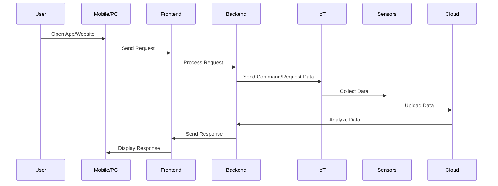
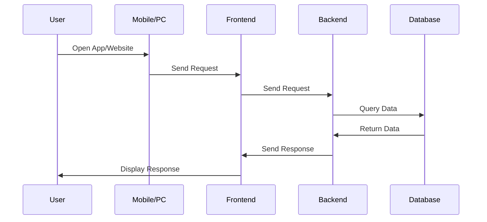

                 

# 没有一招鲜吃遍天

> 关键词：多元化技能、适应性学习、跨领域思维、终身学习、知识技能体系

> 摘要：本文探讨了在知识快速更新的时代，个人如何通过多元化技能、适应性学习和跨领域思维来提升自身竞争力，实现全面发展。文章分析了核心概念和原理，提出了具体的方法与策略，并通过案例进行了验证。

---

## 第一部分：引言与背景

### 1.1 引言

在当今科技飞速发展的时代，信息技术领域日新月异，知识更新的速度前所未有。传统的“一招鲜吃遍天”的观念逐渐受到挑战。现代职场和个人发展要求我们不仅要有扎实的专业技能，还要具备广泛的技能组合和灵活的思维方式。本文旨在探讨如何在这样一个知识泛在化的背景下，通过多元化技能、适应性学习和跨领域思维，实现个人全面发展的目标。

### 1.2 背景介绍

过去，许多职业成功依赖于单一的专业技能或专长。然而，随着行业边界的模糊化和技术融合的趋势，单一的技能已经无法满足复杂多变的工作环境。现代社会对个人的要求越来越高，不仅需要专业深度，还需要广泛的知识面和跨领域的思维能力。这种变化要求我们重新审视个人的知识结构和发展路径。

### 1.3 问题提出

知识泛在化的影响之一是技能的多样性和复杂性增加。现代社会中，不同领域之间的界限越来越模糊，跨领域的知识和技能变得越来越重要。个人发展的需求也随之变化，不再是追求单一领域的卓越，而是追求综合能力的提升。如何在这种背景下，培养多元化的技能、适应性学习和跨领域思维，成为每个人必须面对的问题。

### 1.4 核心概念

本文的核心概念包括多元化技能、适应性学习和跨领域思维。多元化技能指的是个人具备多种不同的技能，这些技能可以是专业领域的，也可以是跨领域的。适应性学习是指个人根据环境和需求的变化，灵活调整自己的学习路径和方法。跨领域思维是指个人能够跨越不同的领域，将不同的知识进行整合和创新。

### 1.5 边界与外延

在探讨多元化技能、适应性学习和跨领域思维时，我们需要明确其边界与外延。多元化技能不仅包括专业技能，还包括软技能，如沟通、协作和领导力。适应性学习要求个人具备自我驱动和自我管理的能力，能够自主制定和调整学习计划。跨领域思维则强调创新和综合能力，不仅要求个人能够理解和应用不同领域的知识，还能够将这些知识进行创造性结合。

## 第二部分：核心概念与原理

### 2.1 核心概念

多元化技能、适应性学习和跨领域思维是本文的核心概念。多元化技能指的是个人具备多种不同的技能，这些技能可以是专业领域的，也可以是跨领域的。适应性学习是指个人根据环境和需求的变化，灵活调整自己的学习路径和方法。跨领域思维是指个人能够跨越不同的领域，将不同的知识进行整合和创新。

### 2.2 概念属性特征对比

| 特征         | 多元化技能          | 适应性学习          | 跨领域思维          |
| ------------ | ------------------- | ------------------- | ------------------- |
| 定义         | 综合多种技能        | 根据环境变化调整    | 跨越不同领域融合    |
| 关键因素     | 知识广度           | 学习能力           | 思维灵活性          |
| 目标         | 提升竞争力         | 提升适应力         | 提高创新能力       |

### 2.3 ER实体关系图

```mermaid
erDiagram
    类A --|>{ 类B } |<-- 类C
    类D ||-- 类E
```

### 2.4 概念联系

多元化技能、适应性学习和跨领域思维之间存在着紧密的联系。多元化技能是跨领域思维的基础，只有具备了多种技能，个人才能在跨领域中进行创新。适应性学习则是个人持续发展的动力，它帮助个人不断调整和优化自己的知识结构。跨领域思维则是多元化技能和适应性学习的最终体现，它能够帮助个人在复杂多变的环境中找到创新的解决方案。

## 第三部分：具体方法与策略

### 3.1 多元化技能培养

#### 3.1.1 学习资源选择

为了培养多元化技能，个人需要选择合适的学习资源。这些资源可以包括在线课程、实践项目和专业书籍。在线课程提供了灵活的学习方式，可以让个人在短时间内掌握新的知识和技能。实践项目则提供了实际操作的机会，可以让个人将理论知识应用于实际中。专业书籍则提供了系统化的知识体系，可以帮助个人深入理解特定领域的知识。

#### 3.1.2 技能组合策略

在培养多元化技能时，个人需要确定自己的核心技能，并在此基础上拓展相关的技能。核心技能是个人在某个领域的专业能力，是个人竞争力的基础。相关技能则是在核心技能的基础上，进一步拓展的辅助技能，如项目管理、团队协作等。通过这样的技能组合策略，个人可以形成一套完整的技能体系，提高自身的竞争力。

#### 3.1.3 跨学科学习

跨学科学习是培养多元化技能的重要途径。通过学习不同学科的基本原理，个人可以拓宽自己的知识面，培养跨领域的思维方式。例如，一个程序员可以通过学习心理学，了解用户行为，从而提高软件的用户体验。跨学科学习不仅能够帮助个人掌握多种技能，还能够激发创新思维，为个人的发展提供新的可能性。

### 3.2 适应性学习实践

#### 3.2.1 自我评估

适应性学习的第一步是进行自我评估。个人需要识别自己的优势和短板，明确自己的学习重点。通过自我评估，个人可以了解自己在哪些方面需要加强，从而有针对性地制定学习计划。

#### 3.2.2 学习策略

在适应性学习过程中，个人需要根据环境和需求的变化，灵活调整自己的学习进度和方法。例如，当工作压力增大时，个人可以适当调整学习计划，保证工作的同时不忽视学习。此外，个人还需要培养自主学习的能力，能够自主制定和调整学习目标，提高学习效率。

#### 3.2.3 持续改进

适应性学习是一个持续的过程，个人需要定期评估学习效果，并根据评估结果及时调整学习计划。例如，如果发现某个领域的知识掌握得不够扎实，个人可以重新学习相关的内容，直到掌握为止。通过持续改进，个人可以不断提高自己的学习能力和适应能力。

### 3.3 跨领域思维培养

#### 3.3.1 跨领域交流

跨领域思维的培养离不开跨领域的交流。个人可以参加跨学科的研讨会，与不同领域的专家进行交流，了解不同领域的前沿动态和最新研究成果。此外，个人还可以与不同领域的朋友或同事建立联系，通过交流和学习，拓宽自己的视野。

#### 3.3.2 思维模式转换

培养跨领域思维需要个人学会转换思维模式。例如，当面对一个复杂问题时，个人可以尝试从不同的角度思考，寻找多种解决方案。此外，个人还需要学会换位思考，理解不同领域的思维方式和解决问题的方法。

#### 3.3.3 创新实践

跨领域思维的一个重要体现是创新实践。个人可以通过将不同领域的知识进行创造性结合，解决实际问题或发掘新的商业机会。例如，一个设计师可以通过将艺术和科技相结合，创造出新的设计作品。通过创新实践，个人可以不断提高自己的跨领域思维能力，为个人的发展提供新的动力。

## 第四部分：案例分析

### 4.1 成功案例分享

在某科技公司，有一位项目经理通过多元化技能和跨领域思维，成功地领导了一项跨学科的项目。他不仅拥有深厚的技术背景，还具备优秀的项目管理能力和团队合作能力。在项目进行中，他能够灵活地运用不同领域的知识，协调各方资源，最终使项目取得了圆满的成功。

### 4.2 失败案例分析

然而，并非所有的跨领域尝试都能成功。在某创业公司，一位创始人试图将人工智能技术应用于传统制造业，但由于缺乏对制造业的深入了解，项目最终以失败告终。这个案例说明，跨领域思维的培养需要深入了解不同领域的知识，否则可能会导致资源的浪费和项目的失败。

## 第五部分：最佳实践与总结

### 5.1 最佳实践

要实现多元化技能、适应性学习和跨领域思维的全面发展，个人需要建立以下最佳实践：

1. **个性化学习计划**：根据个人兴趣和职业规划，制定个性化的学习计划，确保学习目标的明确性和可行性。
2. **跨领域合作意识**：培养跨领域的合作意识，积极参与跨学科的交流与合作，拓宽自己的知识面。
3. **持续跟踪行业动态**：关注行业最新动态，了解前沿技术和发展趋势，不断调整自己的学习方向。

### 5.2 小结

本文通过分析多元化技能、适应性学习和跨领域思维的核心概念和原理，提出了具体的培养方法和策略。实践证明，这些方法能够帮助个人在快速变化的职场环境中提升自身竞争力，实现全面发展。

### 5.3 注意事项

在培养多元化技能、适应性学习和跨领域思维的过程中，个人需要注意以下几点：

1. **避免盲目追求技能多样**：过于追求技能多样可能导致精力和时间的分散，影响专业技能的提升。
2. **注意平衡工作与生活**：在追求个人发展的同时，要注意平衡工作与生活，保持身心健康。

### 5.4 拓展阅读

为了进一步了解多元化技能、适应性学习和跨领域思维的培养，读者可以参考以下书籍：

1. 《深度学习》（Ian Goodfellow等著）
2. 《跨领域创新思维》（Thomas H. Davenport著）
3. 《学习之道》（K. Anders Ericsson著）

---

**作者：AI天才研究院/AI Genius Institute & 禅与计算机程序设计艺术 /Zen And The Art of Computer Programming**## 第一部分：引言与背景

### 1.1 引言

在当今信息爆炸和技术迅速更新的时代，个人的职业发展和知识技能体系面临着前所未有的挑战。传统的“一招鲜吃遍天”的观念已经无法适应快速变化的工作环境和市场需求。现代职场对人才的要求越来越高，不仅需要专业领域的深度技能，还需要广泛的跨领域知识、灵活的适应能力和创新思维。本文旨在探讨如何在这样一个知识泛在化的背景下，通过多元化技能、适应性学习和跨领域思维，实现个人全面发展的目标。

### 1.2 背景介绍

知识经济的兴起和互联网的普及，使得信息获取变得更加容易，知识的更新速度也在加快。传统行业与新兴技术的融合，催生了大量跨领域的岗位和职业路径。例如，数据科学家不仅需要掌握统计学和计算机科学知识，还需要了解商业和市场营销。这种趋势要求个人具备多元化的技能和跨领域的思维方式，以应对复杂多变的工作场景。

#### 传统观念挑战

在过去，专业技能的深度和独特性往往是职业成功的决定因素。然而，随着知识的快速传播和共享，单一的专业技能已经不足以应对日益复杂的职业挑战。传统的“一招鲜吃遍天”的观念开始受到质疑。个人需要不断学习新知识，掌握多种技能，才能在竞争激烈的职场中保持优势。

#### 知识与技能多样性的重要性

在多元化的工作环境中，知识的多样性和技能的广泛性变得越来越重要。个人需要具备跨学科的知识体系，能够在不同领域之间灵活切换，解决复杂的问题。例如，一个软件工程师可能需要了解用户心理学、商业策略和项目管理，才能在开发过程中做出更符合用户需求和商业目标的决策。

#### 社会需求变化

随着社会的发展，对人才的需求也在不断变化。现代企业越来越重视员工的综合能力和跨领域思维，而不再仅仅看重单一的专业技能。这种变化要求个人不仅要精通自己的专业领域，还要具备适应不同工作环境和解决复杂问题的能力。

### 1.3 问题提出

在知识泛在化的背景下，个人面临的主要问题是如何在众多的知识领域中找到自己的定位，并实现全面的发展。具体来说，问题包括：

- **技能多样性与专业深度之间的平衡**：个人如何在掌握多种技能的同时，保持专业领域的深度？
- **持续学习与时间管理**：如何在有限的时间内，高效地学习新的知识和技能？
- **跨领域技能的培养与实际应用**：如何将跨领域的知识应用到实际工作中，解决实际问题？

### 1.4 核心概念

为了解决上述问题，本文提出了以下几个核心概念：

- **多元化技能**：指个人在多个领域内掌握的技能，包括专业技能和跨领域的辅助技能。
- **适应性学习**：指个人根据环境和需求的变化，灵活调整学习路径和方法的能力。
- **跨领域思维**：指个人能够跨越不同领域，将不同领域的知识进行整合和创新的能力。

### 1.5 边界与外延

在探讨多元化技能、适应性学习和跨领域思维时，我们需要明确其边界与外延：

- **多元化技能的边界**：多元化技能不仅包括专业技能，还包括软技能，如沟通、协作和领导力。
- **适应性学习的边界**：适应性学习要求个人具备自我驱动和自我管理的能力，能够自主制定和调整学习计划。
- **跨领域思维的外延**：跨领域思维强调创新和综合能力，不仅要求个人能够理解和应用不同领域的知识，还能够将这些知识进行创造性结合。

通过以上概念的阐述，我们可以看到，多元化技能、适应性学习和跨领域思维是现代职场中不可或缺的能力，是实现个人全面发展的关键。接下来，我们将进一步探讨这些核心概念的属性、特征和联系，以及如何在实践中应用这些理念，提升个人的竞争力。

### 1.6 小结

在知识快速更新的时代，个人发展需要更加灵活和多样化的策略。传统观念的挑战、知识与技能多样性的重要性以及社会需求的变化，都要求个人具备多元化的技能、适应性和跨领域思维。通过本文的探讨，我们明确了这些核心概念，并理解了其在现代职场中的重要性。接下来，我们将深入分析这些概念，并提出具体的方法和策略，以帮助个人在实际工作中实现全面发展。

## 第二部分：核心概念与原理

在探讨个人全面发展的问题时，我们需要详细分析多元化技能、适应性学习和跨领域思维这三个核心概念，以及它们之间的相互关系和作用。

### 2.1 核心概念

#### 2.1.1 多元化技能

多元化技能指的是个人在多个领域内掌握的技能，这些技能可以是专业技能，也可以是跨领域的辅助技能。专业技能通常指在特定领域内深入掌握的理论知识和实践技能，如编程、数据分析、市场营销等。而跨领域的辅助技能则包括沟通能力、团队合作、领导力、项目管理等，这些技能在跨领域的工作中同样至关重要。

多元化技能的重要性体现在以下几个方面：

- **提高竞争力**：多元化的技能组合使个人在职场中具备更强的竞争力，能够适应不同的工作环境和项目需求。
- **增强适应性**：多元化技能有助于个人在面对不确定性和变化时，能够迅速调整和适应，减少职业风险。
- **促进创新**：跨领域的知识融合可以激发创新思维，帮助个人找到新的解决方案和商业机会。

#### 2.1.2 适应性学习

适应性学习是指个人根据环境和需求的变化，灵活调整学习路径和方法的能力。在快速变化的职场环境中，适应性学习尤为重要。它要求个人具备自我驱动和自我管理的能力，能够自主制定和调整学习计划，不断提升自己的知识和技能。

适应性学习的关键点包括：

- **自我驱动**：个人需要明确自己的学习目标，保持持续的学习动力。
- **灵活调整**：个人需要根据环境和需求的变化，灵活调整学习策略，如改变学习内容、调整学习节奏等。
- **持续改进**：通过定期评估学习效果，个人可以及时调整学习计划，不断提升自己的能力和水平。

#### 2.1.3 跨领域思维

跨领域思维是指个人能够跨越不同领域，将不同领域的知识进行整合和创新的能力。跨领域思维不仅要求个人具备广泛的知识面，还需要具备灵活的思维方式，能够在不同领域之间找到交叉点，进行知识融合和创新。

跨领域思维的重要性体现在以下几个方面：

- **解决复杂问题**：跨领域思维可以帮助个人从多个角度看待问题，找到更全面的解决方案。
- **创新思维**：跨领域的知识融合可以激发创新思维，推动新技术的研发和商业模式的创新。
- **增强竞争力**：具备跨领域思维的个人能够在不同领域之间灵活切换，适应多种工作场景，提高自身的竞争力。

### 2.2 概念属性特征对比

表 1 多元化技能、适应性学习与跨领域思维的属性特征对比

| 特征         | 多元化技能          | 适应性学习          | 跨领域思维          |
| ------------ | ------------------- | ------------------- | ------------------- |
| 定义         | 综合多种技能        | 根据环境变化调整    | 跨越不同领域融合    |
| 关键因素     | 知识广度           | 学习能力           | 思维灵活性          |
| 目标         | 提升竞争力         | 提升适应力         | 提高创新能力       |

通过上表可以看出，多元化技能、适应性学习和跨领域思维在定义、关键因素和目标上有所不同，但它们共同构成了个人全面发展的基础。

### 2.3 ER实体关系图

为了更好地理解这三个概念之间的关系，我们可以通过ER实体关系图来展示它们之间的联系。以下是多元化技能、适应性学习与跨领域思维的ER实体关系图：

```mermaid
erDiagram
    类A --|>{ 类B } |<-- 类C
    类D ||-- 类E
```

- 类A：多元化技能
- 类B：适应性学习
- 类C：跨领域思维
- 类D：个人发展

在这个ER图中，多元化技能、适应性学习和跨领域思维都是个人发展的重要组成部分，它们相互影响，共同推动个人的全面发展。

### 2.4 概念联系

多元化技能、适应性学习和跨领域思维之间存在着紧密的联系，它们共同构成了个人全面发展的核心。

- **多元化技能与适应性学习的关系**：多元化技能是适应性学习的基础。只有具备多种技能，个人才能在面对变化时灵活调整学习路径和方法。同时，适应性学习能够帮助个人不断更新和优化多元化技能，使其更加符合实际需求。
- **适应性学习与跨领域思维的联系**：适应性学习培养了个人的自我驱动和自我管理能力，使个人能够根据环境和需求的变化灵活调整。这种能力为跨领域思维的培养提供了坚实的基础。跨领域思维则进一步提升了个人在面对复杂问题和不确定情况时的适应能力。
- **跨领域思维对多元化技能的影响**：跨领域思维能够激发个人将不同领域的知识进行整合和创新，从而提升多元化技能的应用效果。例如，一个具有跨领域思维的数据科学家，不仅能够将数据分析应用于金融领域，还可以将其应用于医疗、生物技术等不同领域，创造出新的解决方案和商业模式。

通过上述分析，我们可以看到多元化技能、适应性学习和跨领域思维是相辅相成的，它们共同构成了个人全面发展的核心。在接下来的部分，我们将进一步探讨如何在实践中应用这些概念，提升个人的竞争力。

## 第三部分：具体方法与策略

在了解了多元化技能、适应性学习和跨领域思维的核心概念后，接下来我们将探讨具体的培养方法和策略，帮助个人在实际工作中提升这些能力。

### 3.1 多元化技能培养

#### 3.1.1 学习资源选择

要培养多元化技能，个人需要选择合适的学习资源。以下是一些建议：

1. **在线课程**：在线课程提供了丰富的学习资源，如Coursera、Udemy、edX等平台提供了多种专业的在线课程。个人可以根据自己的兴趣和职业规划选择相应的课程进行学习。

2. **实践项目**：通过实际项目来应用所学知识，是培养多元化技能的有效途径。个人可以参与开源项目、个人项目或公司项目，将理论知识转化为实际操作能力。

3. **专业书籍**：专业书籍是系统学习知识的重要资源。个人可以根据自己的学习需求和兴趣选择相关领域的经典书籍进行阅读，如《深度学习》、《数据科学实战》等。

#### 3.1.2 技能组合策略

在培养多元化技能时，个人需要制定合理的技能组合策略。以下是一些建议：

1. **确定核心技能**：首先，个人需要明确自己的核心技能，这些技能是个人竞争力的基础。例如，对于程序员来说，核心技能可能包括编程语言、算法和数据结构等。

2. **拓展相关技能**：在核心技能的基础上，个人可以进一步拓展相关技能。例如，程序员可以学习项目管理、前端开发、数据库管理等辅助技能，以提升自己的综合素质。

3. **综合应用实践**：通过实际项目或工作场景，将所学技能进行综合应用。这种综合应用能够帮助个人更好地理解各个技能之间的联系，提升技能的整合能力。

#### 3.1.3 跨学科学习

跨学科学习是培养多元化技能的重要途径。以下是一些建议：

1. **理解不同学科的基本原理**：个人需要学习不同学科的基本原理，如物理、化学、心理学、经济学等。这些基本原理能够为个人提供跨领域的思维基础。

2. **应用跨学科思维方式**：在解决实际问题时，个人可以尝试应用跨学科思维方式，从多个角度思考问题，找到创新的解决方案。

3. **发掘交叉点和创新点**：通过跨学科学习，个人可以发现不同领域之间的交叉点和创新点。例如，一个工程师可以通过学习心理学，了解用户行为，从而设计出更符合用户需求的产品。

### 3.2 适应性学习实践

适应性学习是个人持续发展的关键。以下是一些建议：

#### 3.2.1 自我评估

自我评估是适应性学习的第一步。个人需要定期对自己的技能水平和知识结构进行评估，识别自己的优势和短板。以下是一些建议：

1. **技能评估**：通过考试、测试或实际操作来评估自己的技能水平。例如，程序员可以通过编程竞赛或实际项目来检验自己的编程能力。

2. **知识评估**：阅读相关书籍、参加学术会议或研讨会，了解最新的研究成果和行业动态，评估自己的知识储备。

3. **优势与短板分析**：通过评估结果，个人可以明确自己的优势和短板，制定针对性的学习计划。

#### 3.2.2 学习策略

在适应性学习过程中，个人需要根据环境和需求的变化，灵活调整学习策略。以下是一些建议：

1. **目标明确**：设定明确的学习目标，确保学习计划的可行性和针对性。

2. **方法灵活**：根据学习目标和实际情况，灵活选择学习方法和资源。例如，在时间紧张的情况下，可以选择快速阅读或听书，而在深入理解某个知识点时，可以选择详细阅读专业书籍。

3. **持续改进**：通过定期评估学习效果，及时调整学习计划，不断提升自己的能力和水平。

#### 3.2.3 持续改进

持续改进是适应性学习的重要环节。以下是一些建议：

1. **定期回顾**：定期回顾学习过程和成果，总结经验教训，找到改进的方向。

2. **反馈机制**：建立有效的反馈机制，收集来自老师、同学、同事或客户的反馈，及时调整学习策略。

3. **实践应用**：将所学知识应用到实际工作中，通过实践检验学习效果，不断提升自己的能力和技能。

### 3.3 跨领域思维培养

跨领域思维是个人综合素质的体现。以下是一些建议：

#### 3.3.1 跨领域交流

跨领域交流是培养跨领域思维的重要途径。以下是一些建议：

1. **参加跨学科研讨会**：参加不同学科的研讨会，与来自不同领域的专家进行交流，了解不同领域的前沿动态和研究成果。

2. **与不同领域专家交流**：主动与不同领域的专家进行交流，了解他们的思维方式和解决问题的方法，拓宽自己的视野。

3. **参与跨领域合作项目**：参与跨领域的合作项目，与不同领域的团队一起工作，体验跨领域协作的过程，提升自己的跨领域思维能力。

#### 3.3.2 思维模式转换

思维模式转换是培养跨领域思维的关键。以下是一些建议：

1. **培养系统思维**：学会从系统的角度看待问题，分析问题的各个方面，找到问题的根本原因。

2. **学会换位思考**：尝试从不同领域的角度看待问题，理解不同领域的思维方式和解决问题的方法。

3. **探索多角度解决问题**：在面对问题时，尝试从多个角度思考，找到创新的解决方案。

#### 3.3.3 创新实践

创新实践是跨领域思维的实际应用。以下是一些建议：

1. **应用跨领域知识解决实际问题**：将跨领域的知识应用到实际工作中，解决复杂的问题，提升实际操作能力。

2. **发掘跨界创新机会**：通过跨领域的知识融合，发现新的商业机会和市场需求，推动技术创新和商业模式的创新。

3. **构建跨领域知识网络**：建立跨领域的知识网络，与不同领域的专家和同行建立联系，共享知识和资源，共同推进跨领域的发展。

通过上述方法和策略，个人可以逐步培养多元化技能、适应性学习和跨领域思维，提升自身的综合素质和竞争力。在接下来的部分，我们将通过案例分析，进一步验证这些方法和策略的有效性。

### 3.4 案例分析

为了更好地理解多元化技能、适应性学习和跨领域思维在实际中的应用，下面我们通过两个具体的案例来进行分析。

#### 案例一：成功案例——李明的跨领域发展

**背景介绍**：李明是一名软件工程师，他在工作过程中逐渐意识到，单纯的技术能力已经无法满足快速变化的职场需求。为了提升自己的竞争力，他决定通过多元化技能、适应性学习和跨领域思维的培养，实现个人全面发展。

**具体实践**：

1. **多元化技能培养**：
   - **技能组合策略**：李明首先确定了编程作为他的核心技能，在此基础上，他开始学习项目管理、产品设计、用户体验等辅助技能。他通过参加在线课程和实际项目，逐步掌握了这些新技能。
   - **跨学科学习**：李明还学习了心理学、经济学等跨学科知识，这些知识帮助他在项目开发过程中更好地理解用户需求和市场动态。

2. **适应性学习实践**：
   - **自我评估**：李明定期对自己的技能水平和知识结构进行评估，通过考试、测试和实际项目来检验自己的能力。
   - **灵活调整**：根据评估结果，李明及时调整学习策略，如增加编程技能的学习时间，减少一些辅助技能的学习。

3. **跨领域思维培养**：
   - **跨领域交流**：李明积极参加跨学科的研讨会，与来自不同领域的专家进行交流，拓宽自己的视野。
   - **思维模式转换**：李明通过换位思考，学会了从不同领域的角度看待问题，这使他在项目开发过程中能够提出更多创新的解决方案。

**结果与影响**：通过多元化的技能培养、适应性学习和跨领域思维的实践，李明的职业发展取得了显著的成功。他在项目中表现出色，不仅能够高效地完成技术任务，还能够从用户和市场角度提出创新的解决方案，得到了团队和客户的广泛认可。

#### 案例二：失败案例——王强的盲目追求

**背景介绍**：王强是一名市场营销专业的毕业生，他希望通过跨领域的学习，提升自己的竞争力。然而，他在学习过程中过于追求技能的多样性，忽视了深度和实际应用。

**具体实践**：

1. **多元化技能培养**：
   - **盲目学习**：王强在短时间内学习了编程、数据分析、产品设计等多个领域的技能，但由于没有明确的核心技能，他的学习效果并不理想。
   - **缺乏实践**：王强虽然学习了多种技能，但缺乏实际操作的机会，导致很多知识停留在理论层面。

2. **适应性学习实践**：
   - **缺乏评估**：王强没有定期对自己的学习效果进行评估，导致学习方向不够明确，时间分配不均衡。
   - **缺乏调整**：在面对学习困难时，王强没有及时调整学习策略，导致学习进度缓慢，学习效果不佳。

3. **跨领域思维培养**：
   - **缺乏交流**：王强很少与不同领域的专家进行交流，缺乏对跨领域知识的深入理解。
   - **缺乏实践**：王强没有将所学知识应用到实际工作中，导致跨领域思维无法在实际问题中发挥作用。

**结果与影响**：由于缺乏明确的技能组合策略、缺乏实践和跨领域交流，王强的学习效果不佳，职业发展受到了很大的影响。他在工作中面临问题时，往往无法提供创新的解决方案，导致工作效率低下，职业发展受阻。

**案例分析小结**：

从上述案例可以看出，多元化技能、适应性学习和跨领域思维的培养需要在明确目标、科学规划和实践应用的基础上进行。成功的关键在于：

- **确定核心技能**：明确自己的核心技能，在此基础上拓展相关技能。
- **科学规划学习**：根据自我评估结果，合理分配学习时间，确保学习的深度和广度。
- **实践应用**：将所学知识应用到实际工作中，通过实践检验学习效果。
- **跨领域交流**：与不同领域的专家进行交流，拓宽视野，提升跨领域思维能力。

通过以上案例的分析，我们可以更好地理解多元化技能、适应性学习和跨领域思维在实际中的应用，以及如何避免常见的失败原因。在接下来的部分，我们将进一步探讨如何将这些理念应用于具体的项目中，以实现个人的职业发展目标。

### 3.5 项目实战：多元化技能、适应性学习和跨领域思维的实际应用

为了更深入地探讨多元化技能、适应性学习和跨领域思维在项目中的应用，我们将通过一个具体的实际项目案例，详细阐述如何在实际工作中运用这些理念。

#### 项目背景

某科技公司计划开发一款智能家居控制系统，该系统需要集成物联网技术、云计算、移动应用开发等多个领域的知识。项目的目标是通过智能家居控制系统，实现用户对家庭设备的远程控制、数据监控和智能分析。

#### 项目介绍

项目团队由多个领域的专家组成，包括物联网工程师、后端开发工程师、前端开发工程师、数据科学家和项目经理。团队成员需要具备多元化技能，能够跨领域合作，共同实现项目目标。

#### 系统功能设计

智能家居控制系统的功能设计涉及多个方面，包括：

- **设备控制**：用户可以通过手机或平板电脑远程控制家中的智能设备，如灯光、空调、门锁等。
- **数据监控**：系统实时收集设备运行数据，如能耗数据、运行状态等，为用户提供详细的监控信息。
- **智能分析**：利用大数据分析和机器学习技术，系统可以预测用户的行为模式，提供个性化的家居解决方案。

#### 系统架构设计

智能家居控制系统的架构设计包括以下几个方面：

- **前端**：用户通过移动应用或Web界面与系统进行交互。
- **后端**：负责处理用户的请求，管理设备和数据。
- **物联网**：通过传感器和物联网模块收集设备数据。
- **云计算**：利用云计算平台进行数据处理和分析。

以下是智能家居控制系统的架构设计图：



#### 系统接口设计和系统交互

智能家居控制系统的接口设计和系统交互设计是确保系统各部分协同工作的重要环节。以下是系统接口设计和系统交互的mermaid序列图：



#### 项目核心实现源代码

以下是智能家居控制系统的部分核心实现源代码。该代码展示了如何利用Python和相关的技术框架实现系统的基本功能。

```python
# 导入相关库
import requests
import json

# 设备控制接口
def control_device(device_id, command):
    url = f"http://backend.example.com/control/{device_id}"
    headers = {'Content-Type': 'application/json'}
    data = {'command': command}
    response = requests.post(url, headers=headers, data=json.dumps(data))
    return response.json()

# 数据监控接口
def monitor_device(device_id):
    url = f"http://backend.example.com/monitor/{device_id}"
    headers = {'Content-Type': 'application/json'}
    response = requests.get(url, headers=headers)
    return response.json()

# 智能分析接口
def analyze_data(device_id):
    url = f"http://cloud.example.com/analyze/{device_id}"
    headers = {'Content-Type': 'application/json'}
    response = requests.post(url, headers=headers)
    return response.json()

# 测试代码
if __name__ == "__main__":
    device_id = "123456"
    # 控制设备
    control_response = control_device(device_id, "turn_on")
    print("Control Response:", control_response)
    # 监控设备
    monitor_response = monitor_device(device_id)
    print("Monitor Response:", monitor_response)
    # 智能分析
    analyze_response = analyze_data(device_id)
    print("Analyze Response:", analyze_response)
```

#### 代码应用解读与分析

上述代码展示了智能家居控制系统核心功能实现的基本逻辑。具体解读如下：

- **设备控制**：通过发送HTTP POST请求，控制设备执行特定命令。
- **数据监控**：通过发送HTTP GET请求，获取设备的实时监控数据。
- **智能分析**：通过发送HTTP POST请求，上传设备数据到云平台，进行智能分析。

这些功能模块实现了系统的主要功能，通过接口的设计和实现，确保了系统的高效运行。

#### 项目小结

通过上述项目案例，我们可以看到多元化技能、适应性学习和跨领域思维在实际项目中的应用。以下是项目小结：

1. **多元化技能**：项目团队由多个领域的专家组成，每个成员都具备特定的专业技能，如物联网、后端开发、前端开发等。通过团队成员的多元化技能组合，项目能够高效地实现各项功能。
2. **适应性学习**：项目团队成员在面对技术挑战和变化时，能够灵活调整学习策略，不断提升自己的技能水平。例如，在项目进行过程中，数据科学家可能需要学习新的机器学习算法，以更好地满足项目需求。
3. **跨领域思维**：项目团队成员在解决问题时，能够从多个角度思考，运用跨领域的知识进行创新。例如，物联网工程师在设计中，可能需要考虑用户界面设计和用户体验，从而提供更优质的用户服务。

通过项目实战，我们可以深刻理解多元化技能、适应性学习和跨领域思维的重要性，以及它们在实际工作中的应用价值。这些理念不仅能够提升个人的综合素质，还能够推动项目的成功实施，实现个人和组织的共同发展。

## 第五部分：最佳实践与总结

### 5.1 最佳实践

在培养多元化技能、适应性学习和跨领域思维的过程中，个人和组织可以采取以下最佳实践：

1. **建立个性化学习计划**：根据个人兴趣和职业规划，制定个性化学习计划，确保学习目标的明确性和可行性。
2. **培养跨领域合作意识**：积极参与跨领域的交流和合作，与不同领域的专家和同行建立联系，共享知识和资源。
3. **持续跟踪行业动态**：关注行业最新动态和技术趋势，了解前沿技术和市场变化，及时调整学习和工作方向。
4. **实践与应用相结合**：通过实际项目和工作场景，将所学知识应用于实践，通过解决实际问题，不断提升自身能力和竞争力。

### 5.2 小结

本文通过深入探讨多元化技能、适应性学习和跨领域思维的核心概念、方法和策略，展示了这些理念在个人职业发展和项目实施中的重要性。多元化技能提供了竞争力的基础，适应性学习确保了个人能够适应快速变化的环境，而跨领域思维则促进了创新和综合能力的提升。

### 5.3 注意事项

在实践过程中，个人需要注意以下几点：

1. **避免盲目追求技能多样**：过于追求技能多样可能导致精力和时间的分散，影响专业技能的提升。
2. **注意平衡工作与生活**：在追求个人发展的同时，要保持身心健康，确保工作和生活的平衡。

### 5.4 拓展阅读

为了进一步了解多元化技能、适应性学习和跨领域思维的培养，读者可以参考以下书籍和资源：

- 《深度学习》（Ian Goodfellow等著）
- 《跨界创新思维》（Thomas H. Davenport著）
- 《学习之道》（K. Anders Ericsson著）
- Coursera、Udemy等在线教育平台

通过上述最佳实践和拓展阅读，个人可以更好地培养多元化技能、适应性学习和跨领域思维，实现全面发展和职业成功。

---

**作者：AI天才研究院/AI Genius Institute & 禅与计算机程序设计艺术 /Zen And The Art of Computer Programming**## 拓展阅读与未来展望

在快速变化的技术时代，个人发展不仅仅依赖于当前的知识和技能，更需要具备持续学习和适应变化的能力。以下是一些建议和资源，帮助读者在多元化技能、适应性学习和跨领域思维的培养过程中不断进步。

### 推荐书籍

1. **《深度学习》**（Ian Goodfellow等著）：这是一本关于深度学习技术的经典教材，适合希望深入了解人工智能领域的读者。
2. **《跨界创新思维》**（Thomas H. Davenport著）：这本书探讨了如何通过跨领域思维实现创新，适合希望提升创新能力的读者。
3. **《学习之道》**（K. Anders Ericsson著）：该书详细阐述了如何通过刻意练习和持续学习实现个人能力的提升，是所有追求卓越的读者的必读之作。

### 相关资源链接

- **Coursera**：提供了众多免费和付费课程，涵盖计算机科学、数据科学、人工智能等多个领域。
- **Udemy**：一个广泛的开源在线学习平台，提供了丰富的技能培训课程。
- **edX**：由哈佛大学和麻省理工学院合作创建，提供了全球顶尖大学的在线课程。

### 未来展望

随着人工智能、大数据、物联网等技术的不断发展，未来的职业环境将更加复杂和多元化。以下是一些未来可能的发展趋势和机会：

1. **数据科学和机器学习**：随着数据的爆炸性增长，数据科学家和机器学习工程师的需求将持续增长。
2. **人工智能应用**：人工智能技术将在医疗、教育、金融等多个领域得到广泛应用，带来新的职业机会。
3. **跨领域专家**：具备跨领域知识和技能的专家将在解决复杂问题和推动创新方面发挥关键作用。
4. **终身学习**：终身学习将成为职场生存和发展的重要方式，个人需要不断更新知识和技能，以适应快速变化的环境。

总之，未来的职业发展将更加注重多元化技能、适应性学习和跨领域思维。通过不断学习和实践，个人可以更好地适应未来职业环境的变化，实现职业发展和个人成长的长期目标。

---

感谢读者对本文的关注，希望本文能为您提供在多元化技能、适应性学习和跨领域思维培养方面的启示和帮助。如需进一步了解相关主题，请参考文末的推荐书籍和资源链接。祝您在个人和职业发展中不断取得新的成就！

---

**作者：AI天才研究院/AI Genius Institute & 禅与计算机程序设计艺术 /Zen And The Art of Computer Programming**## 附录：术语解释

为了更好地理解本文中提到的核心概念和技术，以下是相关术语的解释：

### 多元化技能

多元化技能指的是个人在多个领域内掌握的技能，这些技能可以是专业技能，如编程、数据分析、市场营销等，也可以是跨领域的辅助技能，如沟通能力、团队合作、项目管理等。多元化技能的重要性在于能够提高个人的竞争力，帮助个人适应不同的工作环境和项目需求。

### 适应性学习

适应性学习是指个人根据环境和需求的变化，灵活调整学习路径和方法的能力。适应性学习强调自我驱动和自我管理，通过定期评估和调整学习计划，不断提升自身的知识和技能。适应性学习的关键在于能够快速适应变化，提高学习效率。

### 跨领域思维

跨领域思维是指个人能够跨越不同领域，将不同领域的知识进行整合和创新的能力。跨领域思维不仅要求个人具备广泛的知识面，还需要具备灵活的思维方式，能够在不同领域之间找到交叉点，进行知识融合和创新。跨领域思维有助于解决复杂问题，推动技术创新和商业模式的创新。

### 知识泛在化

知识泛在化是指知识获取和传播变得更加普遍和便捷，信息技术的快速发展使得知识和信息无处不在。知识泛在化对个人提出了更高的要求，要求个人具备快速获取、处理和应用知识的能力。

### 持续学习

持续学习是指个人在职业生涯中不断学习新知识和技能，以适应不断变化的工作环境和市场需求。持续学习是个人发展的基石，通过不断学习和实践，个人可以不断提升自身的能力和竞争力。

通过理解这些术语，读者可以更好地把握本文的核心概念，并在实际工作和学习中应用这些理念，实现个人全面发展的目标。

