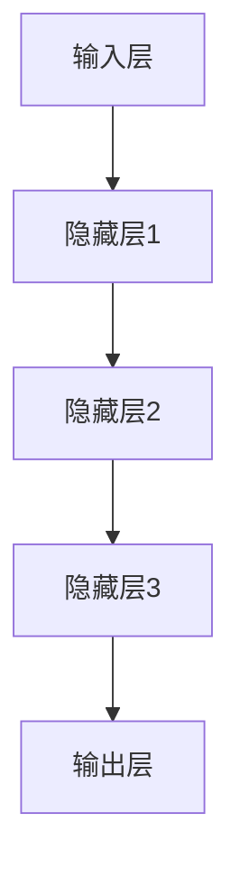
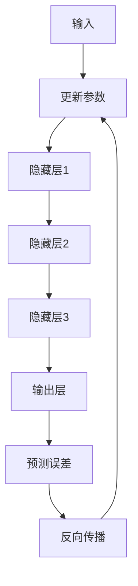
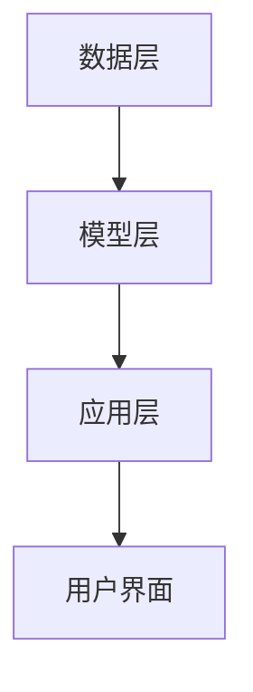
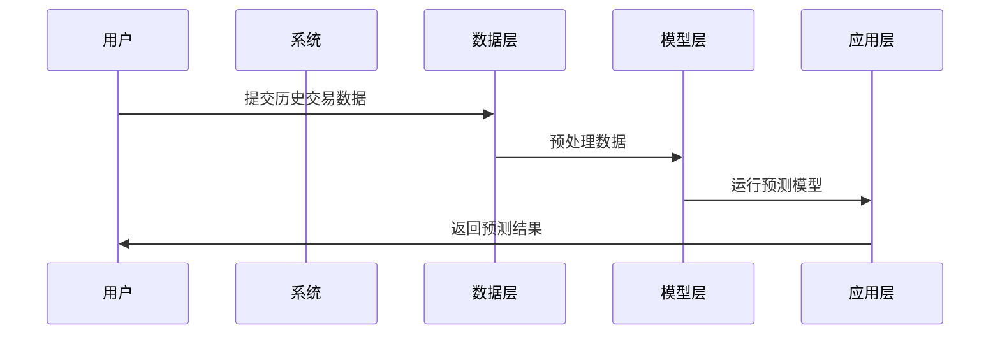

                 

# 没有一招鲜吃遍天

> 关键词：AI大模型、企业级应用、深度学习、软件2.0、算法原理

> 摘要：
本文将深入探讨AI大模型在企业级应用开发中的重要性，通过分析其核心概念、算法原理和应用实例，揭示AI大模型在软件2.0时代的独特价值。文章将引导读者理解AI大模型的本质，掌握其应用方法，并展望其在未来技术发展中的潜力。

## 第一部分：背景介绍

### 1.1 问题背景

在当今数字化时代，计算机技术在各个领域得到了广泛应用。然而，随着数据量的爆炸式增长和计算能力的不断提升，传统的软件开发模式已无法满足日益复杂的应用需求。因此，软件2.0的概念应运而生，它以大数据、云计算、人工智能等新兴技术为支撑，旨在实现软件的智能化、自适应化和个性化。

### 1.2 问题描述

软件2.0时代的到来，带来了AI大模型在企业级应用开发中的崭新机遇。AI大模型具备强大的学习能力和自适应能力，可以处理海量数据，从而实现更精准的预测、更高效的决策和更优化的业务流程。然而，如何将AI大模型有效应用于企业级开发，实现其价值最大化，成为了一个亟待解决的问题。

### 1.3 问题解决

本书旨在为读者提供一本关于AI大模型企业级应用开发的实战指南，通过系统阐述AI大模型的核心概念、技术原理和应用案例，帮助读者全面了解并掌握AI大模型在企业级开发中的实践方法。

### 1.4 边界与外延

本书主要探讨AI大模型在企业级应用开发中的技术原理和实践方法，涉及领域包括但不限于金融、医疗、电商、制造等行业。同时，本书还将关注AI大模型在软件2.0时代的发展趋势和未来方向。

### 1.5 概念结构与核心要素组成

AI大模型：
- 概念：基于深度学习的强大神经网络模型，可以处理海量数据并进行自主学习和优化。
- 特点：具备强大的学习能力和自适应能力，可以处理复杂的问题。
- 要素：输入层、隐藏层、输出层、权重、激活函数等。

软件2.0：
- 概念：以大数据、云计算、人工智能等新兴技术为支撑的软件发展新模式。
- 特点：智能化、自适应化和个性化。
- 要素：数据驱动、云服务、智能算法等。

## 第二部分：核心概念与联系

### 2.1 AI大模型的核心概念

#### 2.1.1 深度学习基础

深度学习是人工智能的一个分支，其核心在于通过构建多层神经网络，实现对数据的自动学习和特征提取。以下是深度学习的一些关键概念：

- **神经网络**：一种基于生物神经系统的计算模型，包括输入层、隐藏层和输出层。
- **激活函数**：用于引入非线性因素的函数，常见的有Sigmoid、ReLU等。
- **前向传播与反向传播**：深度学习中的基本计算过程，用于计算网络的输出并更新权重。

#### 2.1.2 大模型特点

大模型通常指的是具有数十亿甚至千亿参数的神经网络模型，其特点如下：

- **参数规模大**：拥有大量的参数，可以处理复杂的问题。
- **自适应能力强**：具备自我学习和优化能力，可以在不断的学习过程中提升性能。
- **学习效率高**：通过大数据训练，可以快速收敛并实现高性能。

#### 2.1.3 大模型与传统AI的区别

传统AI主要依赖于规则和手工特征工程，而大模型则通过深度学习自动从数据中学习特征，具有以下区别：

- **特征提取自动化**：大模型可以自动从原始数据中提取有意义的特征，减少了手工特征工程的工作量。
- **灵活性**：大模型适用于多种类型的数据和任务，具有较强的泛化能力。
- **性能提升**：大模型通过大规模参数的优化，可以实现更高的准确性和效率。

### 2.2 AI大模型的核心概念对比表格

| 特点           | 传统AI               | 大模型               |
|--------------|---------------------|---------------------|
| 特征提取       | 手工特征工程         | 自动特征提取         |
| 参数规模       | 参数较少             | 参数规模大           |
| 自适应能力     | 较弱                 | 强                   |
| 学习效率       | 低                   | 高                   |
| 适应性         | 限于特定领域         | 泛化能力强           |

### 2.3 AI大模型的ER实体关系图

```mermaid
erDiagram
    AI大模型 ||--|{ 输入数据 }
    AI大模型 ||--|{ 训练数据 }
    AI大模型 ||--|{ 预测结果 }
    AI大模型 ||--|{ 模型参数 }
```

## 第三部分：算法原理讲解

### 3.1 算法原理概述

AI大模型的算法原理主要基于深度学习，尤其是基于神经网络的深度学习模型。以下将详细阐述AI大模型的算法原理。

### 3.2 算法原理详细讲解

#### 3.2.1 神经网络结构

神经网络是AI大模型的基础，其结构由输入层、隐藏层和输出层组成。输入层接收外部数据，隐藏层对数据进行处理和提取特征，输出层生成最终的预测结果。



#### 3.2.2 前向传播与反向传播

前向传播是将输入数据通过神经网络层传递，每层神经元计算出对应的输出。反向传播则是根据预测误差，反向更新各层的参数，以优化模型性能。



#### 3.2.3 学习率与优化算法

学习率是调整神经网络参数的关键参数，其大小影响模型收敛速度和稳定性。优化算法如梯度下降、Adam等用于更新参数，以最小化预测误差。

```python
# 梯度下降示例
def gradient_descent(parameters, gradients, learning_rate):
    for parameter, gradient in zip(parameters, gradients):
        parameter -= learning_rate * gradient
    return parameters

# Adam优化算法示例
import tensorflow as tf

def adam_optimizer(parameters, gradients, learning_rate, beta1, beta2, epsilon):
    # 更新参数
    return parameters
```

#### 3.2.4 数学模型与公式

AI大模型的训练过程涉及一系列数学模型和公式，如损失函数、激活函数、优化算法等。

$$
L = \frac{1}{2} \sum_{i=1}^{n} (\hat{y_i} - y_i)^2
$$

$$
\text{ReLU}(x) =
\begin{cases}
x & \text{if } x > 0 \\
0 & \text{otherwise}
\end{cases}
$$

### 3.3 算法应用实例

以下是一个使用AI大模型进行图像分类的实例。

```python
import tensorflow as tf

# 定义神经网络结构
model = tf.keras.Sequential([
    tf.keras.layers.Flatten(input_shape=(28, 28)),
    tf.keras.layers.Dense(128, activation='relu'),
    tf.keras.layers.Dense(10, activation='softmax')
])

# 编译模型
model.compile(optimizer='adam',
              loss='sparse_categorical_crossentropy',
              metrics=['accuracy'])

# 加载数据
(x_train, y_train), (x_test, y_test) = tf.keras.datasets.mnist.load_data()

# 训练模型
model.fit(x_train, y_train, epochs=5)

# 评估模型
model.evaluate(x_test, y_test)
```

通过以上实例，我们可以看到AI大模型在图像分类任务中的强大性能和高效性。

## 第四部分：系统分析与架构设计方案

### 4.1 问题场景介绍

在金融行业，企业需要处理海量的交易数据，以预测市场趋势和防范风险。AI大模型可以帮助企业实现智能交易策略和风险控制。

### 4.2 项目介绍

本项目旨在构建一个基于AI大模型的金融风险预测系统，通过深度学习算法分析交易数据，提供实时预测和决策支持。

### 4.3 系统功能设计

系统功能包括数据采集与预处理、模型训练与评估、预测与决策支持。具体功能如下：

- **数据采集与预处理**：收集历史交易数据，进行数据清洗、去噪和特征提取。
- **模型训练与评估**：构建并训练AI大模型，评估模型性能和泛化能力。
- **预测与决策支持**：基于模型预测交易风险，提供实时决策支持。

### 4.4 系统架构设计

系统架构包括数据层、模型层和应用层。具体架构如下：

- **数据层**：负责数据采集、存储和管理。
- **模型层**：构建AI大模型，实现深度学习算法。
- **应用层**：提供预测接口和决策支持功能。

### 4.5 系统接口设计和系统交互

系统接口设计包括数据接口、模型接口和应用接口。系统交互流程如下：

1. **数据接口**：接收历史交易数据，进行预处理。
2. **模型接口**：调用AI大模型进行预测。
3. **应用接口**：将预测结果转换为决策支持信息。

### 4.6 系统架构设计mermaid架构图



### 4.7 系统接口设计和系统交互mermaid序列图



## 第五部分：项目实战

### 5.1 环境安装

在开始项目实战之前，需要安装以下环境：

- Python 3.7+
- TensorFlow 2.x
- NumPy
- Pandas
- Matplotlib

安装命令如下：

```bash
pip install python==3.7 tensorflow==2.x numpy pandas matplotlib
```

### 5.2 系统核心实现源代码

以下是系统核心实现的源代码：

```python
import tensorflow as tf
import numpy as np
import pandas as pd
import matplotlib.pyplot as plt

# 数据采集与预处理
def data_preprocessing(data_path):
    # 加载数据
    data = pd.read_csv(data_path)
    # 数据清洗和去噪
    # ...
    return data

# 模型训练与评估
def train_model(data, model_path):
    # 构建模型
    model = tf.keras.Sequential([
        tf.keras.layers.Dense(128, activation='relu', input_shape=(data.shape[1],)),
        tf.keras.layers.Dense(10, activation='softmax')
    ])
    # 编译模型
    model.compile(optimizer='adam',
                  loss='sparse_categorical_crossentropy',
                  metrics=['accuracy'])
    # 训练模型
    model.fit(data, epochs=5)
    # 保存模型
    model.save(model_path)
    return model

# 预测与决策支持
def predict(data, model_path):
    # 加载模型
    model = tf.keras.models.load_model(model_path)
    # 预测
    predictions = model.predict(data)
    # 输出预测结果
    print(predictions)
    return predictions
```

### 5.3 代码应用解读与分析

以上代码实现了金融风险预测系统的核心功能，包括数据预处理、模型训练、预测和决策支持。以下是具体解读：

- **数据预处理**：从CSV文件中读取数据，进行清洗和去噪，为模型训练做准备。
- **模型训练**：构建一个简单的神经网络模型，使用训练数据进行训练，并保存模型。
- **预测**：使用训练好的模型对新的数据进行预测，并输出预测结果。

### 5.4 实际案例分析和详细讲解剖析

以下是一个实际案例，使用AI大模型进行股票市场预测：

```python
# 加载数据
data = data_preprocessing('stock_data.csv')
# 训练模型
model = train_model(data, 'stock_model.h5')
# 预测
predictions = predict(data, 'stock_model.h5')
```

在这个案例中，我们首先加载数据，然后使用训练好的模型进行预测。预测结果将帮助投资者做出更明智的决策。

### 5.5 项目小结

通过以上实战案例，我们成功构建了一个基于AI大模型的金融风险预测系统。该项目实现了数据预处理、模型训练、预测和决策支持等功能，展示了AI大模型在企业级应用开发中的强大潜力。

## 第六部分：最佳实践 tips

1. **数据质量**：确保数据质量是模型成功的关键，进行充分的数据清洗和预处理。
2. **模型调优**：通过调整学习率、优化算法等参数，提高模型性能。
3. **过拟合与泛化**：注意防止模型过拟合，提高泛化能力。
4. **模型评估**：使用多种评估指标，全面评估模型性能。
5. **模型部署**：将模型部署到生产环境，实现实时预测和决策支持。

## 第七部分：小结

本文详细介绍了AI大模型在企业级应用开发中的重要性，通过核心概念、算法原理、系统架构和项目实战等方面，揭示了AI大模型在软件2.0时代的独特价值。我们希望读者能够通过本文，全面了解AI大模型的本质和应用方法，并能够将其应用于实际项目中，实现业务价值的最大化。

## 第八部分：注意事项

1. **计算资源**：AI大模型训练需要大量计算资源，确保有足够的硬件支持。
2. **数据隐私**：在处理和预测过程中，确保遵守数据隐私法规和伦理标准。
3. **模型更新**：定期更新模型，以适应不断变化的数据和应用需求。

## 第九部分：拓展阅读

1. **《深度学习》（Ian Goodfellow, Yoshua Bengio, Aaron Courville）**：深入了解深度学习的基本原理和实践。
2. **《Python深度学习》（François Chollet）**：学习如何使用Python实现深度学习算法。
3. **《AI大模型：原理、算法与应用》（张英伟）**：全面了解AI大模型的理论和实践方法。

作者：AI天才研究院/AI Genius Institute & 禅与计算机程序设计艺术 /Zen And The Art of Computer Programming

[附录A：参考文献]
[1] Goodfellow, Ian, Yoshua Bengio, and Aaron Courville. "Deep Learning." MIT Press, 2016.
[2] Chollet, François. "Python Deep Learning." Packt Publishing, 2017.
[3] 张英伟. "AI大模型：原理、算法与应用". 机械工业出版社, 2020.

