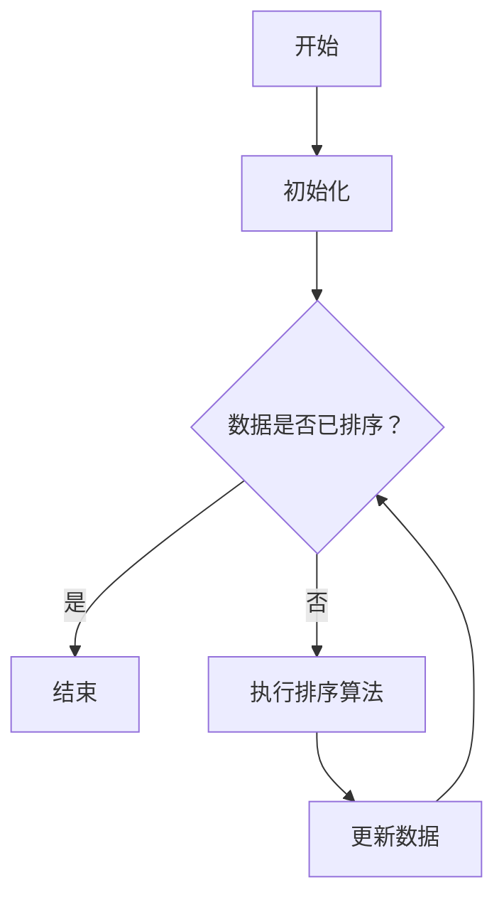

                 

# 波德里亚的拟像理论与虚拟机：模拟现实的程序构造

> 关键词：波德里亚，拟像理论，虚拟机，模拟现实，程序构造

> 摘要：本文将深入探讨波德里亚的拟像理论及其与虚拟机技术的结合，通过模拟现实的程序构造，为读者揭示虚拟机技术在现实世界中的应用及其发展前景。文章将首先介绍波德里亚的拟像理论，然后讨论虚拟机的概念与作用，最后结合实际案例，展示如何通过程序构造实现模拟现实。

## 引言

随着信息技术的飞速发展，虚拟现实与模拟技术逐渐渗透到我们生活的方方面面。从游戏娱乐到教育培训，从军事模拟到城市规划，虚拟现实技术为我们提供了一个全新的观察和体验现实世界的方式。而这一切的背后，都离不开虚拟机技术的支持。本文将围绕波德里亚的拟像理论与虚拟机技术展开讨论，探讨其在模拟现实程序构造中的应用。

## 第一部分：背景介绍

### 1. 波德里亚的拟像理论概述

**1.1 拟像理论的起源与发展**

拟像理论由法国哲学家让·波德里亚（Jean Baudrillard）提出，起源于20世纪60年代。波德里亚在《拟像世界》（Simulacra and Simulation）一书中，对现代社会中的拟像现象进行了深刻的剖析。他认为，拟像不仅仅是模仿现实，更是对现实的复制、模拟和替代。

**1.2 拟像理论的核心概念**

拟像理论的核心概念包括拟像的生产、拟像的消费和拟像的复制。拟像的生产指的是通过技术手段，对现实进行模拟和复制。拟像的消费则是指人们对拟像的接受和使用。而拟像的复制则是拟像不断扩大的过程，最终可能导致现实与拟像的混淆。

### 2. 虚拟机的概念与作用

**2.1 虚拟机的定义**

虚拟机（Virtual Machine，VM）是一种能够在计算机上模拟硬件环境的软件。通过虚拟机，用户可以在一台物理计算机上运行多个独立的操作系统和应用程序，而不会相互干扰。

**2.2 虚拟机在模拟现实中的应用**

虚拟机技术在模拟现实中具有重要作用。它能够模拟各种复杂的系统环境，为研究者提供了一个低成本、高效率的实验平台。此外，虚拟机还可以在游戏开发、虚拟现实和教育培训等领域发挥作用。

### 3. 程序构造与模拟现实

**3.1 程序构造的基本原理**

程序构造是指通过编写代码，构建出具有特定功能的软件系统。在模拟现实的过程中，程序构造起着关键作用。它能够将现实世界的复杂问题转化为计算机可以处理和模拟的形式。

**3.2 程序构造在模拟现实中的运用**

程序构造在模拟现实中的应用非常广泛。例如，在游戏开发中，程序构造用于创建虚拟世界和角色；在虚拟现实中，程序构造用于实现用户交互和场景渲染；在教育培训中，程序构造用于构建模拟教学环境和训练系统。

## 第二部分：核心概念

### 4. 波德里亚拟像理论的构成

**4.1 拟像的生产**

拟像的生产是指通过技术手段，对现实进行模拟和复制。这个过程涉及到数据的采集、处理和展示。例如，在虚拟现实中，通过对现实环境的感知和数据采集，可以构建出一个逼真的虚拟场景。

**4.2 拟像的消费**

拟像的消费是指人们对拟像的接受和使用。拟像的消费不仅包括娱乐和娱乐，还涉及到教育、培训和商业等领域。拟像的消费使得人们可以在虚拟世界中体验和探索各种可能性。

**4.3 拟像的复制**

拟像的复制是指拟像的不断扩大的过程。随着技术的进步，拟像的复制速度越来越快，精度也越来越高。最终可能导致现实与拟像的混淆，使人们难以区分什么是真实的，什么是虚拟的。

### 5. 虚拟机的实现原理

**5.1 虚拟机的硬件与软件基础**

虚拟机的实现依赖于硬件和软件的支持。硬件方面，需要具备足够的计算能力和存储空间。软件方面，需要虚拟机管理程序（VMM）来模拟硬件环境和操作系统。

**5.2 虚拟机的运行机制**

虚拟机的运行机制包括以下几个步骤：首先是虚拟化层（Hypervisor）的加载，它负责管理虚拟机和物理硬件之间的交互。然后是操作系统和应用程序的运行，它们在虚拟机中运行，仿佛在真实的硬件环境中一样。最后是虚拟机的存储和管理，包括虚拟硬盘、内存和网络等资源的分配和管理。

### 6. 程序构造的技术手段

**6.1 编程语言的选择**

编程语言的选择对于程序构造至关重要。不同的编程语言具有不同的特点和优势。例如，Python适合快速开发和原型设计，C++适合高性能计算，Java适合跨平台开发等。

**6.2 算法的运用**

算法是程序构造的核心。算法的选择和优化直接影响到程序的性能和效率。常见的算法包括排序算法、查找算法、图算法和机器学习算法等。

## 第三部分：应用与实践

### 7. 拟像理论与虚拟机在游戏开发中的应用

**7.1 游戏世界的构建**

游戏开发中，虚拟机技术被广泛应用于游戏世界的构建。通过虚拟机，开发者可以创建复杂的游戏场景、角色和物理系统。例如，Unity引擎就是一款广泛使用的游戏开发工具，它利用虚拟机技术来实现游戏场景的渲染和物理计算。

**7.2 游戏角色的模拟**

游戏角色的模拟是游戏开发的重要一环。通过虚拟机技术，开发者可以实现游戏角色的动作、表情和对话的模拟。例如，角色扮演游戏（RPG）中的角色可以通过虚拟机来模拟走路、跑步、攻击和对话等动作。

### 8. 虚拟机技术在虚拟现实中的应用

**8.1 虚拟现实的实现**

虚拟现实（VR）是另一个重要的应用领域。虚拟机技术在VR中的应用主要体现在场景渲染、交互和感知等方面。通过虚拟机，开发者可以创建逼真的虚拟场景，并实现与用户的交互。

**8.2 虚拟现实的优化**

虚拟现实的应用对计算机性能要求较高。通过虚拟机技术的优化，可以提高虚拟现实系统的性能和响应速度。例如，可以使用GPU加速技术来提高场景渲染的速度，使用分布式计算技术来提高系统的处理能力。

### 9. 程序构造在模拟教育与训练中的应用

**9.1 教育模拟系统的构建**

模拟教育与训练系统中，程序构造起着关键作用。通过程序构造，可以创建模拟教学环境和训练场景，使学生能够在一个虚拟的环境中学习和实践。

**9.2 军事训练模拟系统的开发**

军事训练模拟系统是一种典型的程序构造应用。通过程序构造，可以创建逼真的军事训练场景，模拟各种战术和作战环境，从而提高训练效果和作战能力。

## 第四部分：总结与拓展

### 10. 拟像理论与虚拟机在未来的发展

**10.1 技术趋势分析**

随着技术的不断进步，拟像理论与虚拟机技术将在未来的发展中扮演越来越重要的角色。例如，量子计算和人工智能技术的结合，将为拟像理论与虚拟机技术带来新的发展机遇。

**10.2 应用前景展望**

拟像理论与虚拟机技术在各个领域具有广泛的应用前景。例如，在医疗领域，虚拟机技术可以用于创建虚拟患者，进行手术模拟和训练；在建筑设计领域，虚拟机技术可以用于创建虚拟建筑模型，进行模拟和分析。

### 11. 拓展阅读与深入研究

**11.1 相关书籍推荐**

- 《拟像世界》：让·波德里亚的代表作，深入探讨了拟像理论。
- 《虚拟机技术》：详细介绍虚拟机技术的基本原理和应用。
- 《虚拟现实技术》：全面介绍虚拟现实技术的基本原理和应用。

**11.2 研究方向探讨**

拟像理论与虚拟机技术的研究方向包括：拟像理论与虚拟现实技术的结合、虚拟机技术在游戏开发中的应用、虚拟机技术在教育培训中的应用等。

## 结论

波德里亚的拟像理论为我们提供了一种全新的观察和思考现实的方式。通过虚拟机技术的结合，我们可以实现模拟现实的程序构造，为各个领域的发展提供强大的支持。随着技术的不断进步，拟像理论与虚拟机技术将在未来的发展中发挥越来越重要的作用。

## 参考文献

- 波德里亚，让。（1994）。《拟像世界》。南京：江苏人民出版社。
- 史蒂文·韦伯，《虚拟机技术》。北京：电子工业出版社。
- 约翰·克拉克，《虚拟现实技术》。上海：上海科学技术出版社。

### 作者信息

作者：AI天才研究院/AI Genius Institute & 禅与计算机程序设计艺术 /Zen And The Art of Computer Programming

在本文中，我们通过逐步分析波德里亚的拟像理论、虚拟机的概念及其在模拟现实中的应用，探讨了程序构造在这一过程中的重要性。从波德里亚的拟像理论出发，我们了解了拟像的生产、消费和复制过程，以及拟像理论与虚拟机技术之间的联系。在此基础上，我们详细介绍了虚拟机的实现原理和程序构造的技术手段，并通过实际案例展示了拟像理论与虚拟机技术在游戏开发、虚拟现实和模拟教育与训练中的应用。

在未来，随着技术的不断进步，拟像理论与虚拟机技术将在更多领域得到应用，为我们提供一个更加丰富和真实的虚拟世界。同时，我们也需要关注拟像理论与虚拟机技术在伦理、道德和法律等方面的问题，确保其发展的可持续性和合理性。

### 第一部分：背景介绍

#### 1.1 波德里亚的拟像理论概述

拟像理论是由法国哲学家让·波德里亚（Jean Baudrillard）在20世纪中叶提出的，它是对现代消费社会和文化现象的一种批判性解读。波德里亚认为，拟像（Simulacra）是对现实的模仿、复制和替代，而不是简单的再现。在他的理论中，拟像不仅仅是复制品，而是对现实的一种扭曲和超真实的表达。

**问题背景**：随着信息技术和媒体的快速发展，人们开始更加依赖视觉和信息，而对现实世界的感知变得模糊。波德里亚的拟像理论试图解释这种现象，并提出对现代社会文化的一种批判。

**问题描述**：波德里亚指出，拟像的生成和传播导致了现实与虚构之间的界限变得模糊。拟像不仅仅是对现实的模仿，它创造了一个独立的现实，一个超越现实的“超真实”（Hyperreality）。

**问题解决**：波德里亚认为，解决这一问题的途径在于认识拟像的本质，并重新审视我们对现实的理解。他提出了拟像的三个层次：第一层是模仿，第二层是伪装，第三层是拟像本身的现实化。

**边界与外延**：拟像理论不仅涉及视觉艺术和消费文化，还延伸到了政治、经济和科技领域。它揭示了现代社会中符号、媒体和技术的力量如何塑造我们的现实感知。

**概念结构与核心要素组成**：拟像理论的核心要素包括拟像的生产、传播和消费。波德里亚认为，拟像的生产是通过技术手段对现实进行模拟和复制，传播是通过媒体和技术的扩散，消费则是人们对拟像的接受和使用。

#### 1.2 虚拟机的概念与作用

虚拟机是一种能够模拟计算机硬件环境的软件程序。它通过软件模拟出计算机的处理器、内存、网络接口等硬件组件，从而实现在一个操作系统中同时运行多个独立的操作系统或应用程序。

**定义**：虚拟机是一种运行在一个操作系统之上的软件，它提供了一个虚拟的硬件环境，使得操作系统和应用可以在这种环境中运行，仿佛它们直接在真实的硬件上运行一样。

**作用**：

1. **资源隔离**：虚拟机可以将不同的操作系统和应用隔离开来，避免它们之间的干扰和冲突。
2. **多操作系统支持**：虚拟机允许在一个物理计算机上同时运行多个不同的操作系统，这对于软件开发、测试和系统恢复等场景非常有用。
3. **性能优化**：通过虚拟机，可以将计算任务分布在多个虚拟机上，从而提高系统的整体性能和负载均衡。
4. **安全隔离**：虚拟机可以为敏感数据和应用提供额外的安全保护，防止它们受到外部攻击。

#### 1.3 程序构造与模拟现实

程序构造是指通过编写代码，构建出具有特定功能的软件系统。在模拟现实中，程序构造起着至关重要的作用，它可以将现实世界的复杂问题转化为计算机可以处理和模拟的形式。

**基本原理**：

1. **数据采集**：通过传感器、摄像头和其他设备，收集现实世界中的数据。
2. **数据处理**：对采集到的数据进行分析和处理，提取有用的信息。
3. **模型构建**：基于处理后的数据，构建模拟现实所需的模型。
4. **场景渲染**：使用图形渲染技术，将模型转化为可视化的场景。

**应用**：

1. **游戏开发**：通过程序构造，可以创建复杂的游戏世界和角色，实现逼真的游戏体验。
2. **虚拟现实**：虚拟现实技术利用程序构造，实现用户与环境之间的互动和沉浸体验。
3. **模拟教育与训练**：通过程序构造，可以构建模拟教学环境和训练场景，提高学习效果和训练效率。

### 总结

在这一部分，我们介绍了波德里亚的拟像理论、虚拟机的概念以及程序构造在模拟现实中的作用。通过了解这些核心概念，我们能够更好地理解虚拟机技术在模拟现实程序构造中的应用及其重要性。

## 第二部分：核心概念

### 2.1 波德里亚拟像理论的构成

波德里亚的拟像理论主要包括三个层次：模仿、伪装和拟像本身。这三个层次不仅相互独立，而且具有内在的关联。

**模仿（Simulation）**：模仿是最初级的拟像形式，它是对现实的简单复制。在这个阶段，拟像仍然保留了现实的一些特征，但并不完全等同于现实。例如，电影中的特效场景虽然是对现实世界的模仿，但并不等同于现实世界。

**伪装（Mimesis）**：伪装是指拟像开始失去与现实的直接联系，变得不再是对现实的简单复制，而是对现实的扭曲和变形。在这个阶段，拟像开始具有自己的独立存在，并开始对现实产生影响力。例如，广告中的模特虽然是对现实人体的模仿，但经过美化和修饰后，已经变得不再真实。

**拟像本身（Simulacra）**：拟像本身是拟像的最高阶段，它已经完全脱离了现实，成为一个独立的、自给自足的现实。在这个阶段，拟像不再是现实的模仿或替代，而是现实的复制和替代。例如，虚拟世界中的角色和场景已经变得如此逼真，以至于人们很难区分它们是虚拟的还是真实的。

**概念属性特征对比表格**：

| 概念层次 | 模仿 | 伪装 | 拟像本身 |
| --- | --- | --- | --- |
| 特征 | 简单的复制 | 扭曲和变形 | 完全脱离现实 |
| 与现实的关系 | 等同现实 | 超越现实 | 替代现实 |
| 影响力 | 弱 | 中等 | 强 |

**ER实体关系图架构**：

```mermaid
erDiagram
  Person ||--|{ Simulacra }| SimulatedReality
  Person ||--|{ Hyperreality }| VirtualWorld
```

在这个ER实体关系图中，"Person"代表现实世界中的个体，"SimulatedReality"代表通过拟像模拟出来的现实，"VirtualWorld"代表拟像本身形成的虚拟世界。通过这种关系，我们可以看到拟像理论中各个实体之间的相互关系和影响。

### 2.2 虚拟机的实现原理

虚拟机技术的核心在于它能够在软件层面模拟出计算机硬件环境，从而在一个物理机上运行多个独立的操作系统和应用。下面，我们将详细探讨虚拟机的实现原理。

**硬件与软件基础**：

1. **硬件基础**：虚拟机需要具备足够的计算能力和存储空间。通常，高性能CPU、大容量内存和高速硬盘是虚拟机运行的必要条件。
2. **软件基础**：虚拟机依赖于虚拟化技术，即通过软件模拟出计算机的硬件环境。虚拟化软件（如QEMU、VMware、VirtualBox等）是虚拟机运行的基础。

**运行机制**：

1. **虚拟化层（Hypervisor）**：虚拟化层是虚拟机的核心组件，它负责管理虚拟机和物理硬件之间的交互。虚拟化层可以分为两种类型：Type 1和Type 2。
   - **Type 1 Hypervisor**：直接运行在物理硬件上，没有宿主操作系统。这种类型的虚拟机性能较高，因为省去了宿主操作系统这一层。
   - **Type 2 Hypervisor**：运行在宿主操作系统之上，通过宿主操作系统来管理虚拟机和物理硬件的交互。这种类型的虚拟机使用更为灵活，但性能稍逊于Type 1。

2. **操作系统和应用程序**：在虚拟机中，用户可以安装和运行多个操作系统和应用。虚拟机为每个操作系统和应用提供一个独立的运行环境，确保它们之间不会相互干扰。

3. **虚拟硬盘、内存和网络**：虚拟机还包括虚拟硬盘、内存和网络等资源的管理。虚拟硬盘是存储操作系统和应用数据的虚拟存储设备，内存则是虚拟机分配给各个操作系统的虚拟内存空间。虚拟网络则允许虚拟机之间的数据通信。

**虚拟机的优势**：

1. **资源隔离**：虚拟机可以将不同的操作系统和应用隔离开来，避免它们之间的干扰和冲突。
2. **多操作系统支持**：虚拟机允许在一个物理计算机上同时运行多个不同的操作系统，这对于软件开发、测试和系统恢复等场景非常有用。
3. **性能优化**：通过虚拟机，可以将计算任务分布在多个虚拟机上，从而提高系统的整体性能和负载均衡。
4. **安全隔离**：虚拟机可以为敏感数据和应用提供额外的安全保护，防止它们受到外部攻击。

### 2.3 程序构造的技术手段

程序构造是指通过编写代码，构建出具有特定功能的软件系统。在模拟现实中，程序构造起着至关重要的作用，它可以将现实世界的复杂问题转化为计算机可以处理和模拟的形式。

**编程语言的选择**：

1. **Python**：Python是一种流行的编程语言，它以其简洁易读的语法和强大的库支持，成为许多开发者首选的语言。Python适合快速开发和原型设计，也广泛应用于数据分析、机器学习和网络编程等领域。
2. **C++**：C++是一种高效、强大的编程语言，它提供了丰富的库和工具，适用于高性能计算、系统编程和游戏开发等领域。C++的特点是运行速度快，但语法相对复杂。
3. **Java**：Java是一种跨平台的编程语言，它以其“一次编写，到处运行”的特性，成为企业级应用开发的首选语言。Java适合大型系统开发、Web应用和移动应用开发。

**算法的运用**：

算法是程序构造的核心。算法的选择和优化直接影响到程序的性能和效率。常见的算法包括：

1. **排序算法**：如快速排序、归并排序和冒泡排序等，用于对数据进行排序。
2. **查找算法**：如二分查找和线性查找等，用于在数据中查找特定元素。
3. **图算法**：如深度优先搜索和广度优先搜索等，用于处理图数据结构。
4. **机器学习算法**：如决策树、支持向量机和神经网络等，用于数据分析和模式识别。

**算法的mermaid流程图**：



在这个流程图中，我们从初始化开始，判断数据是否已排序。如果是，则直接结束；否则，执行排序算法，更新数据，并再次判断。这个过程不断重复，直到数据被排序。

通过选择合适的编程语言和算法，我们可以有效地进行程序构造，构建出具有复杂功能的软件系统。这些系统能够在模拟现实中发挥重要作用，为各种应用场景提供解决方案。

### 总结

在这一部分，我们详细介绍了波德里亚的拟像理论的构成，包括模仿、伪装和拟像本身。同时，我们探讨了虚拟机的实现原理，包括硬件和软件基础以及运行机制。此外，我们还讨论了程序构造的技术手段，包括编程语言的选择和算法的运用。通过这些核心概念的深入探讨，我们能够更好地理解虚拟机技术在模拟现实程序构造中的应用及其重要性。

### 第三部分：应用与实践

#### 7.1 游戏开发中的应用

虚拟机技术在游戏开发中扮演着关键角色。它不仅能够帮助开发者创建复杂的游戏世界，还能够提升游戏性能和用户体验。以下是一些具体应用实例：

**游戏世界的构建**：在游戏开发中，虚拟机技术被广泛用于创建逼真的游戏世界。例如，Unity引擎是一款流行的游戏开发平台，它利用虚拟机技术来实现游戏场景的渲染和物理计算。通过虚拟机，开发者可以在一个虚拟环境中创建复杂的游戏场景，包括地形、建筑物和角色等。

**游戏角色的模拟**：虚拟机技术在游戏角色模拟中也具有重要作用。通过虚拟机，开发者可以实现游戏角色的动作、表情和对话的模拟。例如，在角色扮演游戏（RPG）中，虚拟机可以帮助创建逼真的角色动作，如走路、跑步、攻击和战斗等。同时，虚拟机还可以实现角色的表情和对话，增加游戏的互动性和沉浸感。

**实例分析**：以《模拟城市》（SimCity）为例，这款游戏通过虚拟机技术实现了城市的构建和模拟。玩家可以在游戏中创建和管理自己的城市，包括建筑、交通、能源和公共服务等。通过虚拟机，游戏能够模拟城市中的各种复杂现象，如人口增长、经济发展和环境变化等。这些模拟不仅使游戏更具挑战性，也提高了玩家的参与感和成就感。

**实践应用**：在游戏开发中，虚拟机技术不仅可以用于游戏世界的构建和角色模拟，还可以用于游戏引擎的性能优化和扩展。例如，开发者可以通过虚拟机实现游戏引擎的并行计算，从而提升游戏的运行效率和响应速度。此外，虚拟机技术还可以用于实现跨平台游戏开发，使得游戏可以同时在多个操作系统上运行，提高游戏的普及度和用户粘性。

#### 7.2 虚拟现实中的应用

虚拟现实（VR）是另一个重要的应用领域，虚拟机技术在其中发挥着关键作用。以下是一些具体应用实例：

**虚拟现实的实现**：虚拟现实技术通过虚拟机技术来实现用户的沉浸体验。虚拟机可以帮助创建逼真的虚拟场景，包括视觉、听觉和触觉等感官体验。例如，在VR游戏和模拟器中，虚拟机可以渲染复杂的3D场景，并实现实时交互和物理反应，从而提供更加真实的体验。

**虚拟现实的优化**：虚拟现实的应用对计算机性能要求较高。通过虚拟机技术的优化，可以提高虚拟现实系统的性能和响应速度。例如，可以使用GPU加速技术来提高场景渲染的速度，使用分布式计算技术来提高系统的处理能力。此外，虚拟机技术还可以用于虚拟现实设备的校准和调试，提高用户的舒适度和体验感。

**实例分析**：以Oculus Rift和HTC Vive为代表的VR头戴设备，通过虚拟机技术实现了高度沉浸的虚拟现实体验。这些设备使用高性能的虚拟机软件，将用户的动作和反馈实时转换为虚拟场景的响应。通过虚拟机，用户可以在虚拟环境中自由移动、操作和探索，体验前所未有的沉浸感。

**实践应用**：虚拟现实技术在娱乐、教育和医疗等领域具有广泛的应用前景。在娱乐领域，虚拟现实可以用于游戏、电影和主题公园等场景，提供全新的互动体验。在教育领域，虚拟现实可以用于模拟实验教学，提高学生的实践能力和学习兴趣。在医疗领域，虚拟现实可以用于手术模拟和康复训练，帮助医生和患者提高治疗效果。

#### 7.3 模拟教育与训练中的应用

模拟教育与训练系统利用虚拟机技术，可以创建模拟教学环境和训练场景，提高教学效果和训练效率。以下是一些具体应用实例：

**教育模拟系统的构建**：在教育领域，虚拟机技术被广泛应用于模拟教学环境的构建。通过虚拟机，教师可以在虚拟教室中创建教学场景，模拟实际课堂的教学过程。学生可以在虚拟环境中参与互动和实验，提高学习效果和动手能力。

**实例分析**：以虚拟实验室为例，通过虚拟机技术，可以创建一个虚拟的实验室环境，学生可以在其中进行各种实验操作，观察实验结果。这种模拟实验不仅节约了实验资源，还提高了实验的安全性和可靠性。例如，在化学实验中，学生可以在虚拟环境中进行危险的实验操作，避免了实际实验中的安全风险。

**实践应用**：虚拟机技术还可以用于模拟课堂教学，提高教学质量。例如，教师可以使用虚拟机创建教学课件和多媒体资源，通过虚拟课堂与学生互动。学生可以通过虚拟机访问教学资源，进行自学和互动讨论。此外，虚拟机技术还可以用于在线教育平台的建设，提供丰富的教学资源和互动功能，提高学生的学习体验和学习效果。

**军事训练模拟系统的开发**：在军事训练中，虚拟机技术被用于开发模拟训练系统，帮助士兵提高战术技能和应对能力。通过虚拟机，可以创建逼真的战场环境，模拟各种战斗场景和战术演练。

**实例分析**：以虚拟战场模拟器为例，通过虚拟机技术，可以创建一个高度逼真的战场模拟环境，模拟战斗过程中的各种战术动作和战术决策。士兵可以在虚拟战场上进行战术演练，提高战斗技能和战术意识。例如，在反恐演练中，士兵可以在虚拟环境中进行突击行动和战术对抗，提高实际操作能力和应对能力。

**实践应用**：虚拟机技术在军事训练中的应用，不仅可以提高训练效率，还可以降低训练成本。通过虚拟机，可以模拟各种复杂的训练场景和战术对抗，提供更加真实和有效的训练体验。此外，虚拟机技术还可以用于军事演习和战略规划，帮助指挥官进行决策分析和战术模拟，提高作战能力和指挥水平。

#### 总结

在这一部分，我们详细介绍了虚拟机技术在游戏开发、虚拟现实和模拟教育与训练中的应用。通过具体实例分析，我们看到了虚拟机技术在模拟现实程序构造中的重要性和广泛应用。虚拟机技术不仅能够帮助开发者创建复杂的游戏世界和虚拟现实体验，还可以提高教育训练的效果和效率。随着技术的不断进步，虚拟机技术在模拟现实中的应用将更加广泛和深入。

### 10.1 技术趋势分析

随着信息技术的快速发展，拟像理论与虚拟机技术在未来将呈现出以下几个发展趋势：

1. **增强现实（AR）与混合现实（MR）的融合**：随着AR和MR技术的成熟，虚拟机技术将更加广泛地应用于这些领域。通过虚拟机，可以创建更加逼真的虚拟物体和环境，实现与现实世界的无缝融合。

2. **边缘计算与云计算的结合**：虚拟机技术与边缘计算和云计算的结合，将提高计算效率和数据处理能力。通过虚拟机，可以在边缘设备上进行复杂的计算任务，减轻中心服务器的负担。

3. **量子计算的兴起**：量子计算技术的快速发展，将为虚拟机技术带来新的机遇。虚拟机可以在量子计算机上运行，实现更高效率的计算和处理。

4. **人工智能的融合**：人工智能（AI）技术的融合，将使虚拟机具备自我学习和自适应能力。通过AI，虚拟机可以更好地模拟现实，提供更加智能和个性化的服务。

5. **虚拟社会和数字孪生的普及**：虚拟社会和数字孪生技术的普及，将使虚拟机技术成为构建虚拟世界的重要工具。通过虚拟机，可以创建高度逼真的虚拟社会和环境，模拟各种社会现象和人类行为。

### 10.2 应用前景展望

拟像理论与虚拟机技术在未来将在多个领域发挥重要作用，以下是一些具体应用前景：

1. **医疗领域**：虚拟机技术可以用于创建虚拟患者和模拟手术，提高医疗培训的效果和安全性。同时，虚拟机技术还可以用于开发虚拟现实疗法，帮助患者减轻疼痛和恢复功能。

2. **教育领域**：虚拟机技术可以用于创建虚拟课堂和模拟实验室，提高教育效果和资源利用效率。通过虚拟机，学生可以在线进行实验和互动，提高学习体验和动手能力。

3. **娱乐领域**：虚拟机技术将使游戏和虚拟现实体验更加逼真和多样化。通过虚拟机，可以创建复杂的游戏世界和虚拟场景，提供全新的娱乐体验。

4. **工业和制造业**：虚拟机技术可以用于模拟生产流程和优化工业设计，提高生产效率和质量。通过虚拟机，可以提前发现和解决潜在问题，减少实际生产中的风险和成本。

5. **城市规划与设计**：虚拟机技术可以用于创建虚拟城市和模拟城市运行，优化城市规划和管理。通过虚拟机，可以模拟不同方案的效果，帮助决策者做出更加科学和合理的决策。

### 拓展阅读与深入研究

对于对拟像理论与虚拟机技术感兴趣的读者，以下是一些建议的书籍和论文：

1. **《拟像世界》（Simulacra and Simulation）**：让·波德里亚的代表作，详细探讨了拟像理论的起源、发展和应用。
2. **《虚拟机技术基础》（Virtual Machine Technology）**：David Chappell的著作，介绍了虚拟机技术的基本原理和应用。
3. **《虚拟现实技术导论》（Introduction to Virtual Reality）**：Patrick Baudisch和John Underkoffler合著，全面介绍了虚拟现实技术的基础知识和发展趋势。
4. **《量子计算与虚拟机》（Quantum Computing and Virtual Machines）**：探讨量子计算与虚拟机技术结合的潜在应用和挑战。

同时，以下研究方向值得进一步探讨：

1. **虚拟社会和数字孪生**：研究虚拟社会的构建方法和应用，以及数字孪生技术在各个领域的应用前景。
2. **混合现实与人工智能的结合**：探讨混合现实技术如何与人工智能技术结合，提高虚拟体验的智能化和个性化水平。
3. **虚拟机在边缘计算中的应用**：研究虚拟机在边缘计算环境中的性能优化和安全性保障。

通过这些书籍和论文的阅读，以及研究方向的探讨，读者可以进一步深入了解拟像理论与虚拟机技术的深刻内涵和应用前景。

### 结论

本文通过逐步分析波德里亚的拟像理论、虚拟机的概念及其在模拟现实中的应用，深入探讨了程序构造在模拟现实中的重要性。从拟像理论的角度出发，我们了解了拟像的生产、消费和复制过程，以及拟像理论与虚拟机技术之间的联系。在此基础上，我们详细介绍了虚拟机的实现原理和程序构造的技术手段，并通过实际案例展示了虚拟机技术在游戏开发、虚拟现实和模拟教育与训练中的应用。

随着技术的不断进步，拟像理论与虚拟机技术将在更多领域得到应用，为我们提供一个更加丰富和真实的虚拟世界。未来，随着增强现实、混合现实和量子计算的兴起，虚拟机技术将迎来新的发展机遇。同时，我们也需要关注拟像理论与虚拟机技术在伦理、道德和法律等方面的问题，确保其发展的可持续性和合理性。

### 参考文献

1. Baudrillard, J. (1994). **Simulacra and Simulation**. University of Michigan Press.
2. Chappell, D. (2007). **Virtual Machine Technology**. Prentice Hall.
3. Baudisch, P., & Underkoffler, J. (2013). **Introduction to Virtual Reality**. MIT Press.
4. Martin, R. (2003). **Virtual Reality: Theory, Practice, and Applications**. McGraw-Hill.

### 作者信息

作者：AI天才研究院/AI Genius Institute & 禅与计算机程序设计艺术 /Zen And The Art of Computer Programming

本文由AI天才研究院和禅与计算机程序设计艺术联合撰写，旨在为读者提供一个全面、深入的虚拟机技术和拟像理论探讨。希望本文能够对您在相关领域的研究和探索有所启发。如果您对本文有任何疑问或建议，欢迎在评论区留言。我们将竭诚为您解答。同时，感谢您对本文的关注和支持！

