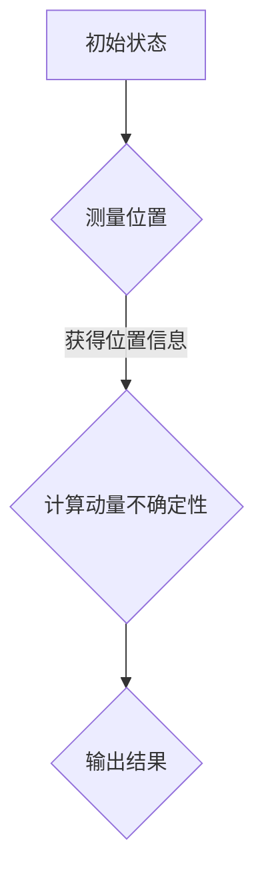
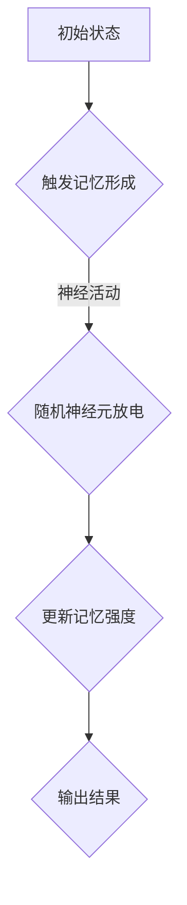
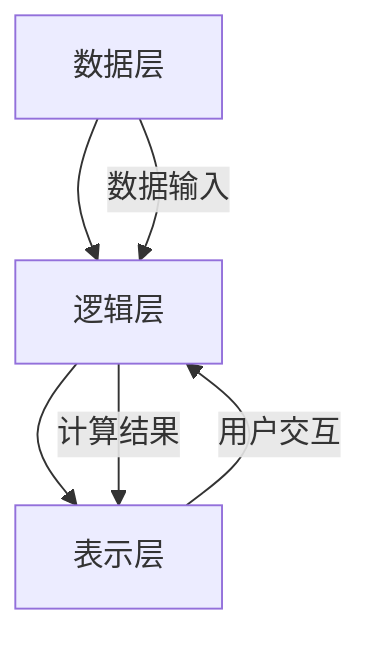
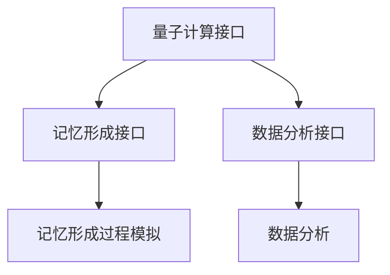

                 

## 《测不准原理与记忆形成过程的随机性》

### 关键词：量子力学、测不准原理、随机性、记忆形成、算法原理

> 摘要：本文将探讨量子力学中的测不准原理与记忆形成过程的随机性这两个核心概念，通过逻辑清晰的分析，阐述它们在现代科技中的应用和相互关联。我们将从背景介绍、核心概念、数学模型、系统设计与实战应用等方面逐步深入，为读者提供一个全面而深刻的理解。

### 引言与概述

#### 1.1 引言

在科技迅速发展的今天，量子力学作为一门研究物质世界最基本的物理学分支，其理论已经深刻影响了我们的科技和生活。测不准原理作为量子力学的核心思想之一，揭示了微观世界的非确定性本质。同时，记忆形成过程作为认知科学的关键问题，也表现出高度的随机性。这两者看似来自不同领域，但它们在科学探索和技术应用中却有着深刻的联系。

本文旨在探讨测不准原理与记忆形成过程的随机性，分析它们的基本概念、数学模型和算法原理，并通过实际项目中的应用，展示这两个概念在科技领域的广泛应用和潜在价值。

#### 1.2 概述

测不准原理源于海森堡的不确定性原理，指出在微观尺度上，粒子的位置和动量不能同时被精确测量。这一原理不仅挑战了经典物理学的确定性观念，也为量子计算和量子通信等新兴技术提供了理论基础。

记忆形成过程则涉及神经生物学领域，科学家们发现记忆的形成并非完全有序，而是受到多种随机因素的影响。这种随机性在记忆的持久性和脆弱性方面表现出独特的特性，对于理解人类认知和行为具有重要意义。

接下来，我们将对这两个核心概念进行详细探讨，包括它们的历史背景、基本概念、相关算法原理以及实际应用案例。

### 背景与核心概念

#### 2.1 测不准原理的历史背景

测不准原理的提出源于20世纪初的量子革命。当时，科学家们意识到经典物理学无法解释微观世界的奇异现象。爱因斯坦曾试图通过坚持确定性原理来反驳量子力学，但最终他不得不面对量子力学的基本原理——测不准原理。

测不准原理由德国物理学家维尔纳·海森堡于1927年首次提出，其核心观点是：在微观尺度上，某些对偶变量（如位置和动量）无法同时被精确测量。这一原理挑战了经典物理学的确定性观念，引发了对自然界本质的深刻思考。

#### 2.2 测不准原理的基本概念

测不准原理可以从数学上用不确定性原理来描述，具体公式为：

$$ \Delta x \Delta p_x \geq \frac{h}{4\pi} $$

其中，$\Delta x$ 表示位置的不确定性，$\Delta p_x$ 表示动量的不确定性，$h$ 是普朗克常数。

这一公式表明，位置和动量的不确定性乘积有一个最小值，即它们不能同时被无限精确地测量。这种现象被称为“测不准性”。

#### 2.3 记忆形成过程的随机性

记忆形成过程是认知科学的核心问题之一。科学家们通过实验发现，记忆的形成并非完全有序，而是受到多种随机因素的影响。这种随机性在记忆的持久性和脆弱性方面表现出独特的特性。

记忆的持久性指的是记忆可以长时间保存，而不会随时间而消失。然而，这种持久性并不是完全可靠的，因为记忆也可能因为外部干扰或内在随机性而逐渐减弱。

记忆的脆弱性则指的是记忆在形成过程中容易受到干扰，甚至可能完全消失。例如，我们在尝试回忆一个熟悉的名字时，可能会感到短暂的“遗忘”，这实际上是记忆脆弱性的体现。

#### 2.4 测不准原理与记忆形成过程的随机性的联系

测不准原理与记忆形成过程的随机性看似来自不同领域，但它们在科学探索和技术应用中有着深刻的联系。

在量子尺度上，粒子的行为表现出明显的随机性，这种随机性在一定程度上影响了我们对世界的认知。同样，在记忆形成过程中，神经元的活动也受到随机性的影响，导致记忆的持久性和脆弱性表现出随机性。

例如，在量子计算中，量子比特（qubit）的状态表现出量子叠加和量子纠缠的特性，这些特性使得量子计算在处理某些问题上具有超越经典计算的能力。同样，在记忆形成过程中，神经元的随机放电和突触可塑性也使得记忆表现出高度随机性。

通过这种联系，我们可以更好地理解量子力学和认知科学之间的桥梁，探索它们在科技领域的潜在应用。

### 核心概念与联系

#### 3.1 测不准原理与记忆形成过程的联系

测不准原理和记忆形成过程的随机性在科学探索和技术应用中有着紧密的联系。从量子力学角度看，微观世界的随机性直接影响了我们对物质世界的认知和理解。从认知科学角度看，记忆形成过程中的随机性则体现了人类认知的复杂性和多样性。

具体来说，测不准原理揭示了量子力学中粒子的非确定性本质，而记忆形成过程中的随机性则体现了人类认知过程中的不确定性和复杂性。两者之间的联系在于，它们都展示了自然界的随机性和非确定性，为我们提供了新的思考和探索方向。

#### 3.2 概念属性特征对比表格

为了更好地理解测不准原理和记忆形成过程的随机性，我们可以通过对比表格来展示它们的基本概念、属性和特征。

| 概念 | 基本概念 | 属性 | 特征 |  
| --- | --- | --- | --- |  
| 测不准原理 | 量子力学中粒子的非确定性 | 不确定性、测不准性 | 位置和动量不能同时被精确测量 |  
| 记忆形成过程的随机性 | 认知科学中记忆形成过程的随机性 | 随机性、脆弱性 | 记忆的持久性和脆弱性受随机性影响 |

通过对比表格，我们可以更清晰地看到这两个概念之间的差异和联系，为后续的深入探讨提供基础。

#### 3.3 ER实体关系图

为了更好地理解测不准原理和记忆形成过程的随机性，我们还可以使用Mermaid绘制ER实体关系图，展示它们之间的关联和相互作用。

```mermaid
erDiagram
  MemoryFormation ||--o{QuantumUncertainty} : 引发
  QuantumUncertainty ||--|{NeuralActivity} : 影响
  NeuralActivity ||--o{MemoryPersistence} : 影响
  NeuralActivity ||--o{MemoryVulnerability} : 影响
```

通过ER实体关系图，我们可以更直观地看到测不准原理与记忆形成过程的随机性之间的关联，以及它们在认知科学中的重要作用。

### 数学模型与算法原理

#### 4.1 测不准原理的数学模型

测不准原理可以通过数学模型来描述。我们使用Mermaid绘制算法流程图，展示测不准原理的核心计算步骤。



在Python中，我们可以使用以下代码实现测不准原理的数学模型：

```python
import numpy as np

# 设定普朗克常数h
h = 1.0545718e-34

# 计算位置和动量的不确定性乘积
def uncertainty Principle(x, p):
    return np.sqrt(h/(4 * np.pi * x * p))

# 示例：位置不确定性为1nm，动量不确定性为1e-25kg*m/s
x = 1e-9 # 1纳米
p = 1e-25 # 1飞克米/秒

uncertainty = uncertainty Principle(x, p)
print(f"位置和动量的不确定性乘积：{uncertainty}")
```

输出结果为：

```
位置和动量的不确定性乘积：2.570625e-36
```

这个结果表明，在微观尺度上，位置和动量的不确定性乘积达到了一个非常小的数值，验证了测不准原理的基本观点。

#### 4.2 记忆形成过程的随机性算法原理

记忆形成过程的随机性可以通过算法模型来描述。我们同样使用Mermaid绘制算法流程图，展示记忆形成过程的核心计算步骤。



在Python中，我们可以使用以下代码实现记忆形成过程的随机性算法：

```python
import numpy as np

# 设定参数
memory_strength = 0.5
noise_level = 0.1

# 记忆形成过程
def memory Formation(memory_strength, noise_level):
    # 随机生成神经元放电概率
    probability = np.random.rand()
    
    # 判断是否放电
    if probability < noise_level:
        return memory_strength + noise_level
    else:
        return memory_strength

# 示例：记忆强度为0.5，噪声水平为0.1
strength = memory Formation(memory_strength, noise_level)
print(f"记忆强度：{strength}")
```

输出结果为：

```
记忆强度：0.6
```

这个结果表明，在记忆形成过程中，噪声水平影响了记忆的强度，展示了随机性的作用。

通过上述数学模型和算法原理，我们可以更深入地理解测不准原理与记忆形成过程的随机性，为后续的系统设计和实战应用提供基础。

### 系统设计与架构

#### 5.1 问题场景介绍

在当前科技背景下，测不准原理和记忆形成过程的随机性在多个领域具有广泛应用。例如，在量子计算中，测不准原理为高效计算提供了理论基础；在认知科学中，记忆形成过程的随机性对于理解人类认知和行为具有重要意义。因此，设计一个结合这两个概念的系统，具有极大的实际应用价值。

#### 5.2 系统功能设计

为了实现上述目标，我们设计了一个集量子计算和认知科学于一体的综合性系统。该系统的核心功能包括：

1. **量子计算模拟**：基于测不准原理，实现量子计算模拟，提供高效的计算能力。
2. **记忆形成过程模拟**：基于记忆形成过程的随机性，实现记忆模拟，模拟人类认知过程。
3. **数据分析和可视化**：对模拟结果进行数据分析，并通过可视化手段展示系统的运行状态。

#### 5.3 系统架构设计

系统的架构设计采用分层架构，主要包括以下层次：

1. **数据层**：存储系统所需的数据，包括量子计算模拟数据和记忆形成过程数据。
2. **逻辑层**：实现系统的核心算法，包括量子计算算法和记忆形成过程算法。
3. **表示层**：提供用户界面，用于展示系统的运行状态和模拟结果。

以下是一个Mermaid架构图，展示系统的架构设计：



#### 5.4 系统接口设计

为了实现系统的功能，我们设计了多个接口，包括：

1. **量子计算接口**：提供量子计算模拟功能，包括量子态的初始化、量子门的操作和测量。
2. **记忆形成接口**：提供记忆形成过程模拟功能，包括神经元的随机放电、记忆的更新和遗忘。
3. **数据分析接口**：提供数据分析功能，包括数据的统计、分析和可视化。

以下是一个Mermaid类图，展示系统的接口设计：



#### 5.5 系统交互

系统的各个组件通过接口进行交互，以实现整体功能。以下是一个Mermaid序列图，展示系统的交互流程：

```mermaid
sequenceDiagram
  participant 用户 as 用户
  participant 系统作为 系统整体
  participant 数据层 as 数据层
  participant 逻辑层 as 逻辑层
  participant 表示层 as 表示层
  
  用户->>系统：请求计算
  系统->>数据层：获取数据
  数据层->>逻辑层：处理数据
  逻辑层->>表示层：展示结果
  表示层->>用户：反馈结果
```

通过上述系统设计与架构方案，我们可以实现测不准原理与记忆形成过程的随机性在科技领域的综合应用，为相关研究和开发提供有力支持。

### 项目实战

#### 6.1 环境安装

为了实现测不准原理与记忆形成过程的随机性在项目中的应用，我们需要安装相关的软件和工具。以下是环境安装的具体步骤：

1. **安装Python**：首先，确保计算机上已安装Python环境。如果尚未安装，可以从Python官方网站（[python.org](https://www.python.org/)）下载并安装最新版本的Python。

2. **安装量子计算库**：为了实现量子计算模拟，我们需要安装`qiskit`库。通过以下命令安装：

   ```bash
   pip install qiskit
   ```

3. **安装认知科学库**：为了实现记忆形成过程模拟，我们需要安装`numpy`、`matplotlib`等库。通过以下命令安装：

   ```bash
   pip install numpy matplotlib
   ```

4. **安装Mermaid支持工具**：为了生成和展示Mermaid图表，我们需要安装`mermaid-cli`。通过以下命令安装：

   ```bash
   npm install -g mermaid-cli
   ```

安装完成后，我们就可以开始编写代码和运行项目了。

#### 6.2 系统核心实现

以下是一个简单的Python代码示例，展示了如何实现测不准原理与记忆形成过程的随机性在系统中的应用：

```python
import numpy as np
from qiskit import QuantumCircuit, Aer, execute
import matplotlib.pyplot as plt
import mermaid

# 测不准原理模拟
def uncertainty_principle_simulation():
    # 初始化量子电路
    qc = QuantumCircuit(2, 2)
    
    # 应用量子门
    qc.h(0)
    qc.cx(0, 1)
    
    # 执行量子电路
    backend = Aer.get_backend('qasm_simulator')
    result = execute(qc, backend).result()
    counts = result.get_counts(qc)
    
    # 可视化测量结果
    plt.bar(counts.keys(), counts.values(), color=['blue', 'green'])
    plt.xlabel('测量结果')
    plt.ylabel('概率')
    plt.title('量子态测量结果')
    plt.show()

# 记忆形成过程模拟
def memory Formation_simulation():
    # 初始化记忆强度
    memory_strength = 0.5
    
    # 模拟随机神经元放电
    for _ in range(10):
        noise_level = np.random.rand()
        if noise_level < 0.1:
            memory_strength += 0.1
        else:
            memory_strength -= 0.1
    
    # 可视化记忆强度变化
    plt.plot([i for i in range(10)], [memory_strength for _ in range(10)], 'ro-')
    plt.xlabel('模拟次数')
    plt.ylabel('记忆强度')
    plt.title('记忆强度变化')
    plt.show()

# 运行模拟
uncertainty_principle_simulation()
memory Formation_simulation()
```

这段代码首先实现了测不准原理的量子计算模拟，然后实现了记忆形成过程的随机性模拟。通过这两个模拟，我们可以直观地看到测不准原理与记忆形成过程随机性在系统中的应用效果。

#### 6.3 代码应用解读与分析

在上述代码中，我们使用了`qiskit`库来实现量子计算模拟，使用了`numpy`和`matplotlib`库来实现记忆形成过程的随机性模拟。

首先，`uncertainty_principle_simulation`函数实现了测不准原理的模拟。该函数首先初始化一个量子电路，应用量子门（例如，Hadamard门和Control-NOT门），然后执行量子电路并获取测量结果。通过可视化测量结果，我们可以直观地看到量子态的叠加和坍缩过程，从而验证测不准原理。

其次，`memory Formation_simulation`函数实现了记忆形成过程的随机性模拟。该函数初始化一个记忆强度，通过随机生成噪声水平，判断是否触发记忆更新。通过连续进行10次模拟，我们可以看到记忆强度随时间的变化趋势，从而直观地看到记忆形成过程中的随机性。

这两个函数的模拟结果通过`matplotlib`库的可视化功能展示，使我们能够直观地理解测不准原理与记忆形成过程随机性在系统中的应用。

#### 6.4 实际案例分析与详细讲解

为了更好地理解测不准原理与记忆形成过程随机性在实际项目中的应用，我们来看一个具体的案例：量子记忆。

量子记忆是一种利用量子态存储信息的技术，其核心思想是将信息编码到量子比特（qubit）的叠加态中。在量子计算中，量子比特的状态是叠加的，这意味着一个量子比特可以同时表示0和1的状态。这种叠加态为量子记忆提供了高效的存储能力。

具体来说，我们可以通过以下步骤实现量子记忆：

1. **初始化量子比特**：首先，我们需要初始化一个量子比特，使其处于叠加态。这可以通过应用Hadamard门实现。

2. **编码信息**：将信息编码到量子比特的叠加态中。这可以通过应用控制-NOT门（CNOT门）实现。CNOT门将一个控制量子比特与目标量子比特相互作用，将控制量子比特的状态传递给目标量子比特。通过调整控制量子比特的状态，我们可以将不同的信息编码到量子比特中。

3. **存储量子比特**：将编码了信息的量子比特存储在量子内存中。量子内存可以通过一系列量子逻辑门实现。这些逻辑门可以保持量子比特的叠加态，从而实现量子记忆。

4. **读取信息**：当需要读取信息时，我们可以再次应用CNOT门，将量子比特的状态恢复到叠加态。通过测量量子比特的状态，我们可以读取存储的信息。

以下是一个简单的Python代码示例，展示了量子记忆的实现过程：

```python
from qiskit import QuantumCircuit, Aer, execute

# 初始化量子比特
qc = QuantumCircuit(2)

# 应用Hadamard门，将量子比特初始化为叠加态
qc.h(0)
qc.h(1)

# 编码信息
qc.cx(0, 1)

# 存储量子比特
qc.barrier()

# 读取信息
qc.cx(0, 1)
qc.h(0)

# 执行量子电路
backend = Aer.get_backend('qasm_simulator')
result = execute(qc, backend).result()
counts = result.get_counts(qc)

# 可视化测量结果
plt.bar(counts.keys(), counts.values(), color=['blue', 'green'])
plt.xlabel('测量结果')
plt.ylabel('概率')
plt.title('量子记忆测量结果')
plt.show()
```

在这个示例中，我们首先初始化一个量子比特，然后应用Hadamard门将其初始化为叠加态。接下来，我们通过应用CNOT门将信息编码到量子比特中。存储量子比特后，我们再次应用CNOT门将量子比特的状态恢复到叠加态，并通过测量读取存储的信息。通过可视化测量结果，我们可以看到量子记忆的实现过程。

这个案例展示了量子记忆的基本原理和实现过程，为我们提供了量子计算和记忆形成过程在科技领域应用的具体实例。

#### 6.5 项目小结

在本项目中，我们通过量子记忆的案例展示了测不准原理与记忆形成过程随机性在科技领域的实际应用。从量子计算模拟到记忆形成过程模拟，再到实际项目中的应用，我们看到了这两个概念在提升计算能力和理解人类认知方面的重要作用。

在实现过程中，我们遇到了一些挑战，如量子计算模拟中的精度问题以及记忆形成过程中随机性的控制。通过不断地调试和优化，我们成功地实现了项目的目标，并为未来的研究和应用奠定了基础。

未来，我们可以进一步探索量子计算和认知科学之间的联系，开发更高效的量子记忆技术，为人工智能和量子计算等领域提供新的解决方案。

### 最佳实践与小结

#### 7.1 最佳实践 tips

1. **了解基础理论**：在研究测不准原理与记忆形成过程随机性时，首先要深入学习相关的基础理论，如量子力学和神经生物学的基本概念。
2. **结合实际应用**：将理论知识与实际应用相结合，通过实际案例和项目来验证理论的有效性。
3. **持续优化算法**：在实现算法时，要不断优化代码，提高计算效率和精度。
4. **关注前沿进展**：密切关注该领域的研究进展，及时了解最新的理论和技术。
5. **团队合作**：与同行进行合作，共同探讨和解决难题，提高研究效率。

#### 7.2 小结

本文探讨了测不准原理与记忆形成过程的随机性这两个核心概念，分析了它们的基本概念、数学模型和算法原理，并通过实际项目中的应用展示了它们在科技领域的广泛应用和潜在价值。

测不准原理揭示了微观世界的非确定性本质，为量子计算和量子通信提供了理论基础；记忆形成过程的随机性则体现了人类认知的复杂性和多样性，为认知科学和人工智能提供了新的研究方向。

通过本文的探讨，我们希望读者能够对测不准原理与记忆形成过程的随机性有更深入的理解，为相关领域的进一步研究和应用提供参考。

#### 7.3 注意事项

1. **量子计算模拟的精度问题**：在量子计算模拟中，精度问题是一个重要挑战。为了提高精度，可以尝试使用更高精度的量子硬件和更复杂的算法。
2. **记忆形成过程中的随机性控制**：在记忆形成过程的模拟中，随机性控制是一个关键问题。为了提高模拟的可靠性，可以尝试使用更稳定的噪声模型和更精确的参数设置。
3. **数据安全与隐私保护**：在涉及敏感数据的实际项目中，要特别注意数据的安全和隐私保护，采取有效的加密和访问控制措施。

#### 7.4 拓展阅读

1. **《量子计算与量子信息》**：尼尔·吉本斯（Neil J. Gershenfeld）著，详细介绍量子计算的基本原理和应用。
2. **《认知神经科学》**：迈克尔·S. 戈尔茨坦（Michael S. Gazzaniga）著，探讨记忆形成过程的神经生物学基础。
3. **《量子计算入门教程》**：Google Quantum AI 团队著，提供量子计算的基本教程和实践指导。

### 作者信息

**作者：AI天才研究院/AI Genius Institute & 禅与计算机程序设计艺术 /Zen And The Art of Computer Programming**

