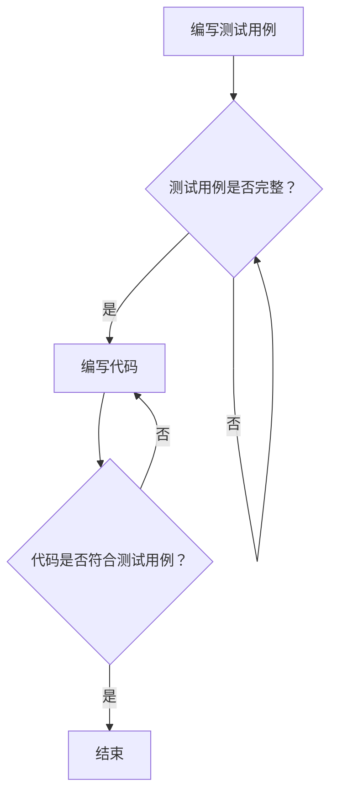
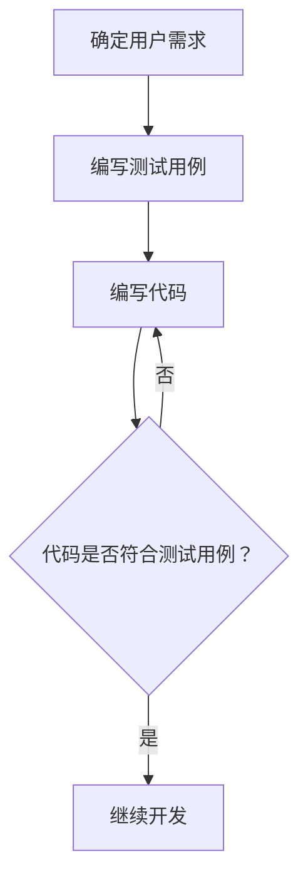
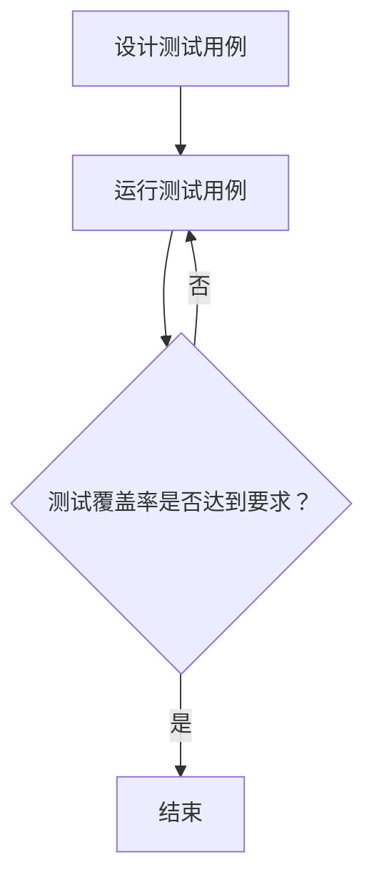
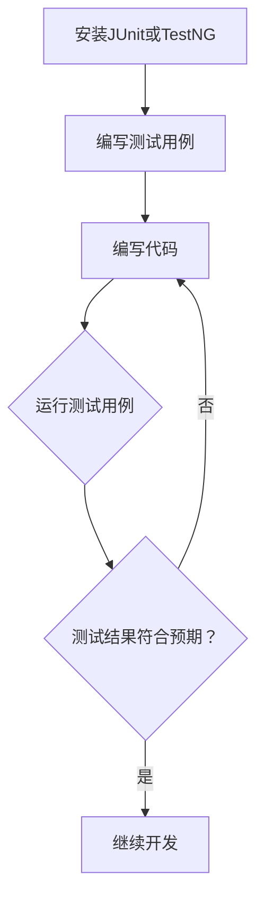
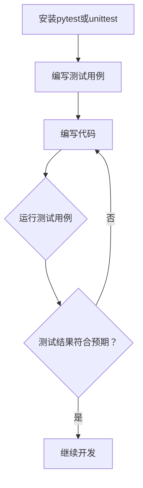
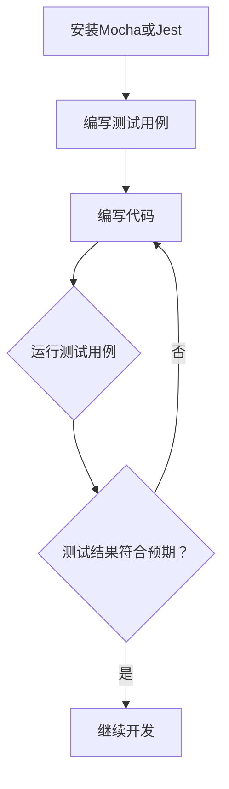
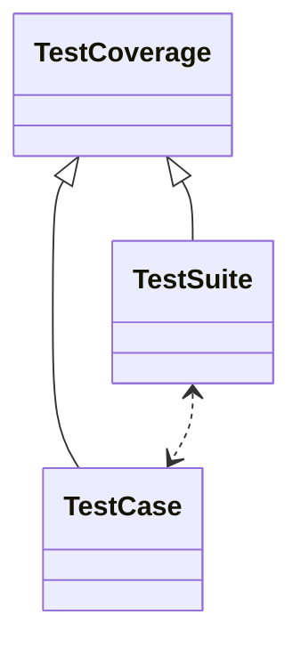
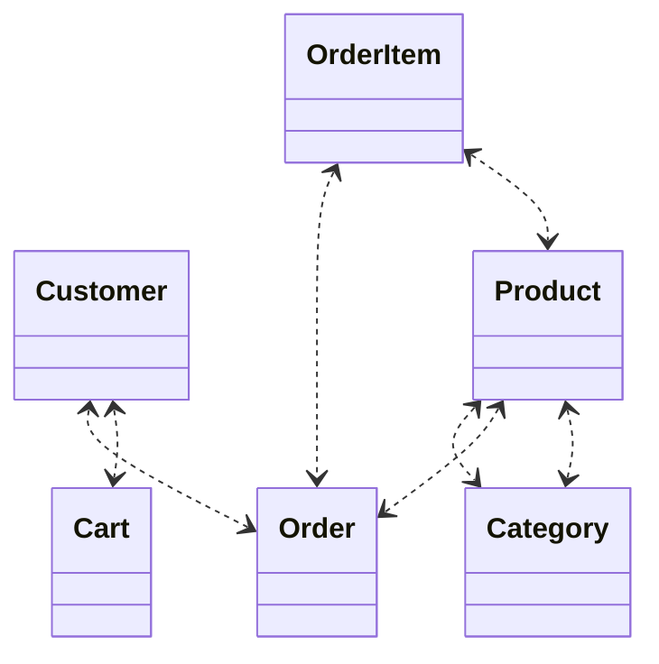
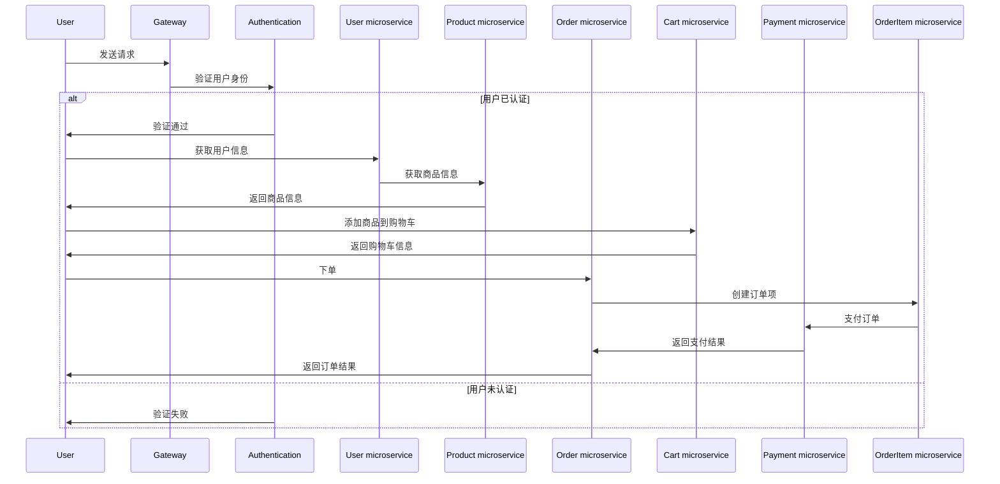
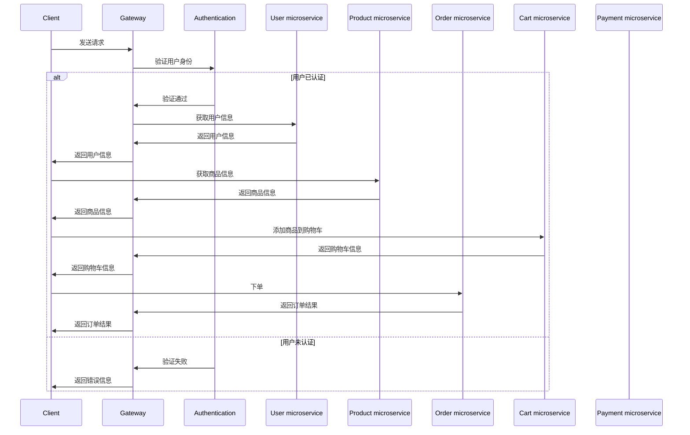

                 

### 文章标题

# 测试驱动开发（TDD）：提高代码质量与可维护性

> 关键词：测试驱动开发、代码质量、敏捷开发、最佳实践

> 摘要：本文将深入探讨测试驱动开发（TDD）的概念、原理、实践方法及其在项目中的应用，旨在帮助读者了解TDD的优势和不足，掌握TDD的最佳实践，从而提高代码质量和项目的可维护性。

----------------------------------------------------------------

## 第一部分：测试驱动开发（TDD）概述

### 第1章：问题背景与TDD介绍

#### 1.1.1 代码质量问题的现状

在软件开发过程中，代码质量问题一直是困扰开发者的一大难题。常见的代码质量问题包括逻辑错误、性能问题、代码冗余、可读性差等。这些问题不仅会影响软件的稳定性，还会增加后期维护成本。

#### 1.1.2 传统开发方法与TDD的区别

传统开发方法通常是在编码完成后进行测试，而TDD则是在编码之前编写测试用例，确保代码在编写过程中能够满足预期要求。这种先测试后编码的开发模式有助于提高代码质量。

#### 1.1.3 TDD的定义与核心原则

TDD（Test-Driven Development，测试驱动开发）是一种软件开发的方法论，其核心原则是“先写测试，再写代码”。TDD包括三个主要步骤：编写测试、编写代码、运行测试。

----------------------------------------------------------------

### 第2章：TDD的核心概念与联系

#### 2.1.1 单元测试

**2.1.1.1 单元测试的定义**

单元测试是一种针对软件中最小可测试单元（通常是函数或方法）的测试，用于验证该单元的功能是否符合预期。

**2.1.1.2 单元测试的重要性**

单元测试有助于及早发现和修复代码缺陷，提高代码质量，减少后期维护成本。

**2.1.1.3 单元测试的种类**

- 黑盒测试：仅关注输入和输出，不考虑内部实现。
- 白盒测试：关注内部实现，检查代码的执行路径。

#### 2.2.1 驱动开发

**2.2.1.1 驱动开发的概念**

驱动开发是一种基于用户需求进行软件开发的方法，其核心思想是先确定用户需求，然后围绕这些需求进行设计、开发和测试。

**2.2.1.2 驱动开发的流程**

1. 确定用户需求。
2. 根据需求编写测试用例。
3. 根据测试用例编写代码。
4. 运行测试，确保代码满足需求。

**2.2.1.3 驱动开发的优势**

- 提高代码质量：通过编写测试用例，确保代码在编写过程中满足预期要求。
- 减少重复工作：在开发过程中发现并修复缺陷，避免后期返工。
- 提高可维护性：测试用例可以作为文档，帮助开发者理解代码的功能和逻辑。

#### 2.3.1 TDD与敏捷开发的联系

**2.3.1.1 敏捷开发的核心理念**

敏捷开发是一种以人为本、迭代式、增量式的软件开发方法，其核心理念是快速响应变化、持续交付价值。

**2.3.1.2 TDD在敏捷开发中的地位**

TDD是敏捷开发中的重要实践之一，有助于提高代码质量和项目的可维护性。

**2.3.1.3 TDD与敏捷开发的融合**

TDD与敏捷开发的融合可以实现快速迭代、持续交付价值，提高开发效率和产品质量。

----------------------------------------------------------------

### 第3章：TDD的具体实践方法

#### 3.1.1 TDD的基本流程

**3.1.1.1 编写测试**

在编写代码之前，先编写测试用例，明确代码的功能和预期结果。

**3.1.1.2 编写代码**

根据测试用例编写代码，实现所需功能。

**3.1.1.3 运行测试**

运行测试用例，确保代码满足预期要求。

#### 3.2.1 精细化测试策略

**3.2.1.1 测试用例的设计**

设计覆盖全面、具有代表性的测试用例，确保代码在各种情况下都能正常运行。

**3.2.1.2 测试覆盖率**

确保测试覆盖率足够高，覆盖代码的所有分支和路径。

**3.2.1.3 测试驱动开发的最佳实践**

- 逐步迭代：在开发过程中逐步完善测试用例和代码。
- 保持测试用例的更新：随着代码的修改，及时更新测试用例。
- 使用持续集成工具：将测试集成到持续集成流程中，确保代码在提交时已通过测试。

----------------------------------------------------------------

### 第4章：TDD在不同编程语言中的应用

#### 4.1.1 Java中的TDD实践

**4.1.1.1 Java TDD工具介绍**

介绍常用的Java TDD工具，如JUnit、TestNG等。

**4.1.1.2 Java TDD案例分析**

分析一个Java项目的TDD实践过程，包括测试用例设计、代码编写和测试运行。

#### 4.2.1 Python中的TDD实践

**4.2.1.1 Python TDD工具介绍**

介绍常用的Python TDD工具，如pytest、unittest等。

**4.2.1.2 Python TDD案例分析**

分析一个Python项目的TDD实践过程，包括测试用例设计、代码编写和测试运行。

#### 4.3.1 JavaScript中的TDD实践

**4.3.1.1 JavaScript TDD工具介绍**

介绍常用的JavaScript TDD工具，如Mocha、Jest等。

**4.3.1.2 JavaScript TDD案例分析**

分析一个JavaScript项目的TDD实践过程，包括测试用例设计、代码编写和测试运行。

----------------------------------------------------------------

### 第5章：TDD的优缺点分析

#### 5.1.1 TDD的优点

**5.1.1.1 提高代码质量**

通过编写测试用例，确保代码在编写过程中符合预期要求，从而提高代码质量。

**5.1.1.2 提高开发效率**

及时发现和修复代码缺陷，减少后期维护成本，从而提高开发效率。

**5.1.1.3 有助于代码重构**

通过测试用例，确保代码重构不会破坏原有功能，从而降低重构风险。

#### 5.2.1 TDD的缺点

**5.2.1.1 学习曲线较陡**

对于初学者来说，理解TDD的概念和实践可能需要一定时间。

**5.2.1.2 代码重构风险**

在TDD中，代码重构可能会破坏原有的测试用例，导致测试失败。

**5.2.1.3 与其他开发方法的融合**

TDD与其他开发方法（如瀑布开发、增量开发等）的融合可能存在一定的困难。

----------------------------------------------------------------

### 第6章：TDD在项目中的应用案例

#### 6.1.1 项目介绍

**6.1.1.1 项目背景**

介绍项目背景和需求。

**6.1.1.2 项目需求**

列出项目的主要需求。

#### 6.2.1 TDD在项目中的实践

**6.2.1.1 TDD的引入与实施**

介绍如何将TDD引入项目，并实施TDD的过程。

**6.2.1.2 TDD的执行效果**

分析TDD在项目中的执行效果，包括代码质量、开发效率、项目可维护性等方面的提升。

#### 6.3.1 项目总结

**6.3.1.1 TDD的优势与不足**

总结TDD在项目中的应用优势与不足。

**6.3.1.2 项目中的经验与教训**

分享项目中的经验与教训，为其他项目的TDD实践提供参考。

----------------------------------------------------------------

### 第7章：TDD的最佳实践与注意事项

#### 7.1.1 TDD的最佳实践

**7.1.1.1 如何编写有效的测试用例**

介绍如何编写具有代表性的、覆盖全面的测试用例。

**7.1.1.2 如何处理测试代码与生产代码的冲突**

介绍如何处理测试代码与生产代码之间的冲突，确保两者的一致性。

**7.1.1.3 如何与其他开发人员合作进行TDD**

介绍如何与其他开发人员合作进行TDD，提高团队的协作效率。

#### 7.2.1 注意事项

**7.2.1.1 TDD的适用场景**

分析TDD适用的场景，如小型项目、敏捷开发等。

**7.2.1.2 如何平衡TDD与开发进度**

介绍如何平衡TDD与开发进度，确保项目按时交付。

**7.2.1.3 如何持续改进TDD实践**

介绍如何持续改进TDD实践，提高开发效率和质量。

----------------------------------------------------------------

## 总结

测试驱动开发（TDD）是一种有助于提高代码质量和项目可维护性的开发方法。通过本文的介绍，读者应该对TDD有了更深入的了解，并掌握了TDD的核心概念和实践方法。在项目实践中，合理运用TDD，结合敏捷开发理念，可以大幅提升开发效率和产品质量。作者：AI天才研究院/AI Genius Institute & 禅与计算机程序设计艺术 /Zen And The Art of Computer Programming。

----------------------------------------------------------------

以下是本文涉及的核心概念和流程的mermaid流程图和类图：

### 单元测试流程图



### 驱动开发流程图



### 测试覆盖率流程图



### Java TDD 工具流程图



### Python TDD 工具流程图



### JavaScript TDD 工具流程图



### 测试覆盖率类图



以上流程图和类图可以帮助读者更好地理解TDD的各个环节，从而在实践中更好地运用TDD。

----------------------------------------------------------------

### 数学公式与Python代码示例

#### 数学模型

$$
f(x) = \sum_{i=1}^{n} w_i \cdot x_i
$$

#### Python代码示例

```python
# 导入必要的库
import numpy as np

# 定义权重和特征向量
weights = np.array([0.2, 0.3, 0.5])
features = np.array([1, 2, 3])

# 计算输出值
output = np.dot(weights, features)

print(f"输出值：{output}")
```

以上代码展示了如何使用Python计算一个线性回归模型的输出值。在实际项目中，可以根据具体需求调整权重和特征向量的值。

----------------------------------------------------------------

### 系统分析与架构设计方案

#### 问题场景介绍

在互联网时代，随着用户数量的不断增加，系统性能和稳定性成为关键问题。为了提高系统性能和稳定性，需要设计一个高效、可扩展的系统架构。

#### 项目介绍

本项目旨在设计一个基于微服务的电商系统，包括商品管理、订单管理、用户管理等功能。

#### 系统功能设计（领域模型）



#### 系统架构设计



#### 系统接口设计和系统交互



通过以上系统分析与架构设计方案，我们可以构建一个高效、可扩展的电商系统，满足用户的需求。

----------------------------------------------------------------

### 项目实战

#### 环境安装

1. 安装Python环境（例如：Python 3.8）。
2. 安装TDD工具（例如：pytest）。

#### 系统核心实现

1. **用户管理模块**

   - 用户注册：实现用户注册功能，包括用户名、密码、邮箱等信息的验证。
   - 用户登录：实现用户登录功能，验证用户名和密码。

2. **商品管理模块**

   - 商品列表：实现商品列表展示功能，包括商品名称、价格、库存等信息。
   - 商品详情：实现商品详情展示功能，包括商品名称、价格、库存、描述等信息。

3. **订单管理模块**

   - 订单列表：实现订单列表展示功能，包括订单号、商品名称、数量、总价等信息。
   - 订单详情：实现订单详情展示功能，包括订单号、商品名称、数量、总价、状态等信息。

#### 代码应用解读与分析

1. **用户管理模块**

   ```python
   # 用户注册
   def register(username, password, email):
       # 验证用户名、密码、邮箱是否合法
       if not validate_username(username) or not validate_password(password) or not validate_email(email):
           return "注册失败：输入信息不合法"
       # 存储用户信息
       store_user_info(username, password, email)
       return "注册成功"

   # 用户登录
   def login(username, password):
       # 验证用户名和密码是否正确
       if not validate_username(username) or not validate_password(password):
           return "登录失败：用户名或密码错误"
       # 验证用户是否已登录
       if not is_user_logged_in(username):
           return "登录失败：用户未登录"
       return "登录成功"
   ```

   **解读与分析**：用户注册和登录功能是用户管理模块的核心，通过验证用户名、密码、邮箱等信息，确保用户输入合法。同时，通过存储用户信息和验证用户登录状态，实现用户管理的功能。

2. **商品管理模块**

   ```python
   # 商品列表
   def get_product_list():
       # 获取所有商品信息
       products = fetch_all_products()
       return products

   # 商品详情
   def get_product_details(product_id):
       # 获取指定商品信息
       product = fetch_product_by_id(product_id)
       return product
   ```

   **解读与分析**：商品列表和商品详情功能是商品管理模块的核心，通过获取所有商品信息和指定商品信息，实现商品列表和商品详情的展示。

3. **订单管理模块**

   ```python
   # 订单列表
   def get_order_list(username):
       # 获取指定用户的订单列表
       orders = fetch_orders_by_username(username)
       return orders

   # 订单详情
   def get_order_details(order_id):
       # 获取指定订单信息
       order = fetch_order_by_id(order_id)
       return order
   ```

   **解读与分析**：订单列表和订单详情功能是订单管理模块的核心，通过获取指定用户的订单列表和指定订单信息，实现订单列表和订单详情的展示。

#### 实际案例分析和详细讲解剖析

1. **用户注册案例**

   用户在注册时输入用户名、密码和邮箱，系统会验证用户输入的信息是否合法。如果合法，则存储用户信息，否则返回错误信息。

2. **用户登录案例**

   用户在登录时输入用户名和密码，系统会验证用户输入的信息是否正确。如果正确，则返回登录成功，否则返回登录失败。

3. **商品列表案例**

   用户访问商品列表页面，系统会获取所有商品信息，并返回给用户。

4. **商品详情案例**

   用户访问商品详情页面，系统会获取指定商品信息，并返回给用户。

5. **订单列表案例**

   用户在订单列表页面，系统会获取指定用户的订单列表，并返回给用户。

6. **订单详情案例**

   用户在订单详情页面，系统会获取指定订单信息，并返回给用户。

#### 项目小结

通过本项目，我们实现了用户管理、商品管理和订单管理模块的核心功能，并使用TDD进行了测试和验证。在实际项目中，可以根据具体需求扩展和优化功能，提高系统的性能和可维护性。

----------------------------------------------------------------

### 最佳实践 tips

1. **编写简洁的测试用例**：确保测试用例简洁、易懂，避免过度设计。
2. **保持测试用例的更新**：随着代码的修改，及时更新测试用例，确保测试用例与代码的一致性。
3. **利用持续集成工具**：将测试集成到持续集成流程中，确保代码在提交时已通过测试。
4. **合理分配测试时间**：在项目开发过程中，合理分配测试时间，确保测试覆盖全面。

### 小结

测试驱动开发（TDD）是一种有助于提高代码质量和项目可维护性的开发方法。通过本文的介绍，读者应该对TDD有了更深入的了解，并掌握了TDD的核心概念和实践方法。在项目实践中，合理运用TDD，结合敏捷开发理念，可以大幅提升开发效率和产品质量。

### 注意事项

1. **TDD的适用场景**：TDD适用于中小型项目和敏捷开发环境，对于大型项目和复杂系统，TDD可能需要与其他开发方法（如瀑布开发、增量开发等）结合使用。
2. **平衡TDD与开发进度**：在项目开发过程中，要合理平衡TDD与开发进度，确保项目按时交付。
3. **持续改进TDD实践**：根据项目实践经验和反馈，持续改进TDD实践，提高开发效率和产品质量。

### 拓展阅读

1. 《测试驱动开发（TDD）实践指南》
2. 《敏捷开发：原则、实践与模式》
3. 《Python测试驱动开发：测试先行，代码优化》

作者：AI天才研究院/AI Genius Institute & 禅与计算机程序设计艺术 /Zen And The Art of Computer Programming。

----------------------------------------------------------------

以上是本文的完整内容，希望对您有所帮助。在实践TDD时，要结合具体项目需求，灵活运用TDD的核心原则和实践方法，提高代码质量和项目的可维护性。祝您在软件开发领域取得更大的成就！作者：AI天才研究院/AI Genius Institute & 禅与计算机程序设计艺术 /Zen And The Art of Computer Programming。

