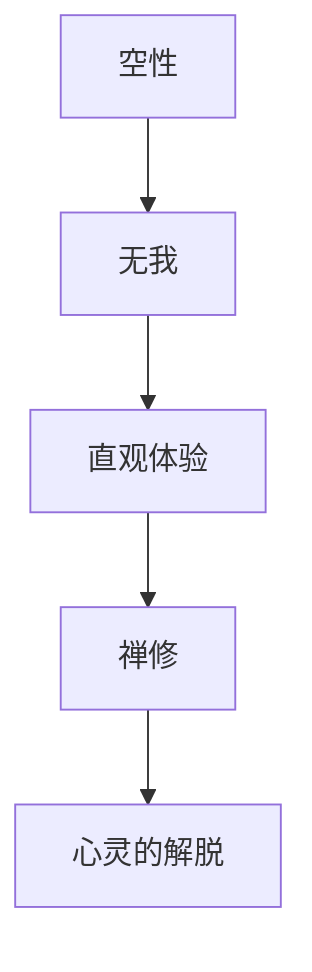
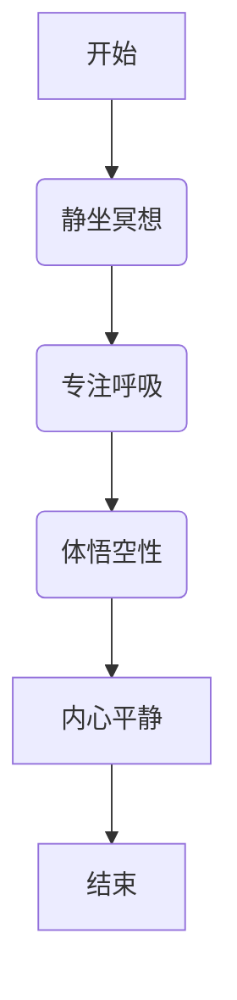

                 

### 引言

#### 1.1.1 海德格尔与禅宗的核心概念

**海德格尔**（Martin Heidegger）是20世纪最伟大的哲学家之一，他的存在论哲学深刻影响了西方哲学。海德格尔的存在论探讨的是存在的本质，他提出了“存在-存在者”这一核心概念，强调“存在”是一个不可定义的、基础的、整体的范畴，而“存在者”则是具体的、个别的存在实体。

**禅宗**是东亚哲学与宗教的重要组成部分，尤其是在中国和日本有着深远的影响。禅宗教义强调“空”的概念，即宇宙万物皆是空无自性，无固定本质。禅宗认为，通过禅修可以达到对空性的体悟，进而超越世俗的束缚，达到心灵的宁静与解脱。

#### 1.1.2 存在与空的思想交流的意义

海德格尔与禅宗的对话具有重要的意义。首先，两者都关注存在的本质，虽然他们的表达方式和哲学背景不同，但存在与空的思想在本质上具有某种相通性。通过这种交流，我们可以更加全面地理解存在的深层含义，拓展我们的哲学视野。

其次，海德格尔与禅宗的思想可以为现代社会提供重要的启示。在当代社会中，人们往往被物质和技术的进步所困扰，心灵处于浮躁和焦虑之中。海德格尔的“存在”思想和禅宗的“空”思想，都可以帮助我们找回内心的宁静和平衡，重新审视生活的本质。

#### 1.1.3 研究海德格尔与禅宗交融的目的和意义

本文的研究目的在于探讨海德格尔与禅宗在存在与空的思想上的交融，分析两者之间的共通点和差异，并探讨这种交融对现代哲学和人类思想的影响。

研究的意义在于：

1. 拓展哲学研究的视野，通过跨文化的交流，丰富存在论的研究内容。
2. 为现代社会提供一种新的思维方式，帮助人们实现内心的平静与自我超越。
3. 激发跨学科的对话，促进不同领域的创新与发展。

通过本文的研究，我们希望能够为哲学、宗教、文化等多个领域提供新的思考和洞见，推动人类文明的进步。接下来，我们将逐步深入探讨海德格尔的存在论和禅宗的教义，为读者展示这一哲学交融之旅。  

---

### 海德格尔存在论概览

**海德格尔的存在论**是其哲学体系的核心，他认为存在是一个基础而又不可定义的范畴，涵盖了一切存在的可能性和实在性。海德格尔的存在论经历了从早期的“存在-存在者”论到后期的“四重奏”的演变，其核心概念和哲学方法逐渐丰富和深化。

#### 2.1 海德格尔哲学思想的发展

**早期存在论**：在海德格尔早期作品中，如《存在与时间》（Being and Time），他提出了“存在-存在者”这一核心概念。他认为，“存在”是一个不可定义的、基础的、整体的范畴，而“存在者”则是具体的、个别的存在实体。他强调“存在者”的存在是“存在”的具体表现。

**后期存在论**：在《论东西》（The Question Concerning Technology）和《四重奏》（Theodiromene）等作品中，海德格尔进一步发展了他的存在论思想。他提出了“四重奏”的概念，即世界、天地、诸神和有限存在者，这四者共同构成了存在的整体。海德格尔强调，人类的存在是四重奏的参与者，通过与世界的互动，人们能够体悟存在的意义。

#### 2.2 存在论的三个层面：存在、存在者、存在者之间的关系

**存在（Being）**：在海德格尔的哲学中，“存在”是一个基础而又不可定义的范畴。它不仅包括物质世界，还包括精神世界和抽象概念。存在是万物的基础，是一切可能性的源泉。

**存在者（Beings）**：存在者是指具体的、个别的存在实体，如人、动物、植物等。存在者存在于世界中，是存在的具体表现。海德格尔认为，存在者之间的关系是存在的本质特征。

**存在者之间的关系（Relations among beings）**：存在者之间的关系构成了存在的复杂性。海德格尔强调，存在者之间的关系不是简单的因果关系，而是一种更深层的共在（Dasein）关系。这种关系使得存在者能够相互理解、交流，从而构成一个整体。

#### 2.3 存有与时间的关系

**时间的维度**：在海德格尔的哲学中，时间是一个核心概念。他认为，时间是存在的维度，存在者存在于时间之中。时间不仅是一个线性过程，还包括过去、现在和未来的维度。通过时间，存在者能够体验到存在的流动性和变化性。

**存在的意义**：海德格尔认为，存在的时间维度赋予了存在意义。存在者在时间的流动中，不断地与过去、现在和未来互动，从而体验到存在的深度和广度。时间使得存在者能够反思自己，从而实现自我超越。

通过以上三个层面的探讨，我们可以看到，海德格尔的存在论是一个复杂而又深刻的哲学体系。它不仅探讨存在的本质，还涉及到存在者之间的关系和时间的维度。这种哲学思想为我们理解存在的深层含义提供了重要的启示。

在接下来的章节中，我们将进一步探讨禅宗教义的核心概念，分析其与海德格尔存在论的共通点和差异。通过这种跨文化的哲学交流，我们希望能够为现代哲学和人类思想的发展提供新的思路和洞见。

---

### 禅宗教义与存在之空

**禅宗**（Zen Buddhism）是东亚哲学与宗教的重要组成部分，尤其在东亚文化中有着深远的影响。禅宗起源于印度，经过长期的传播和发展，最终在中国形成独立体系，并传入日本、韩国等地。禅宗教义强调“空”（ emptiness）的概念，认为宇宙万物皆无固定本质，其核心思想在于通过禅修达到对空性的体悟，从而超越世俗的束缚，实现心灵的宁静与解脱。

#### 3.1 禅宗历史与发展

**禅宗的历史**：禅宗起源于公元5世纪的印度，随着佛教的传播传入中国。在中国，禅宗在南北朝时期逐渐兴起，并于唐代达到鼎盛。唐代的禅宗大师如慧能、弘忍等，通过简明扼要的禅修方法，使得禅宗思想深入人心。

**禅宗的发展**：在中国，禅宗逐渐形成了多个流派，如临济宗、曹洞宗等。每个流派都有其独特的禅修方法和教义。禅宗传入日本后，形成了日本禅宗，进一步发展成为今日的临济宗和曹洞宗等。

#### 3.2 禅宗教义的核心理念

**空性（Emptiness）**：禅宗教义的核心理念是“空性”。空性是指宇宙万物皆无固定本质，一切都是因缘和合而生。这种观点打破了我们对实体的固有认知，使我们认识到世界的流动性和无常性。

**无我（No-self）**：无我即无固定自我。禅宗认为，自我是一个错觉，人们通过禅修可以认识到真正的自我是空性的，是因缘和合的产物。无我观念帮助人们摆脱自我中心的束缚，实现心灵的解放。

**直观（Direct Experience）**：禅宗强调通过直观体验来认识真理。禅修是一种直接的、内在的体验，通过禅坐、冥想等方法，人们可以直接感受到空性和无我，达到对世界的深刻理解。

#### 3.3 空的概念与存在的关系

**空与存在**：在禅宗中，“空”并不是一种虚无或空无，而是一种深刻的存在体验。空性是存在的本质，是万物相互关联的基质。禅宗认为，通过体悟空性，人们可以超越二元对立，达到存在与空性的统一。

**存在的意义**：在禅宗看来，存在的意义在于体验空性。空性使我们认识到世界的真实面貌，帮助我们摆脱虚幻的表象，看到事物的本质。通过体悟空性，人们可以超越物质和精神的束缚，达到心灵的宁静与解脱。

**空性与生活**：禅宗的空性观念不仅是一种哲学思考，更是生活的实践。禅修是一种生活方式，通过禅修，人们可以培养心灵的宁静和专注，更好地应对生活中的各种挑战。

通过以上对禅宗教义和存在之空的探讨，我们可以看到，禅宗的空性观念与海德格尔的存在论在某些方面具有共通之处。两者都强调存在的本质和深层次的体验，虽然表达方式和哲学背景不同，但它们都为我们提供了一种超越表象，深入存在的思维方式。

在接下来的章节中，我们将进一步探讨海德格尔与禅宗教义的共通点和差异，分析两者之间的哲学交流路径。通过这种跨文化的对话，我们希望能够为现代哲学和人类思想的发展提供新的视角和启示。

---

### 存在论与空思想的交汇点

**海德格尔的存在论**与**禅宗的空思想**虽然源自不同的文化背景和哲学体系，但它们在探讨存在的本质和深度方面具有许多共通之处。这些共通点不仅丰富了我们的哲学思考，也为现代人类提供了新的思维方式和视角。

#### 4.1 存在与空的共通之处

**存在的本质**：海德格尔和禅宗都强调存在的本质是无固定本质，是因缘和合的产物。海德格尔通过“存在-存在者”的关系来探讨存在的本质，而禅宗则通过“空性”来阐述这一点。两者都认为，存在不是一个孤立、静止的实体，而是一个动态、变化的过程。

**超越表象**：海德格尔和禅宗都反对将存在理解为简单的实体或物质，而是强调超越表象，深入本质。海德格尔认为，存在的本质是不可定义的，只能通过存在者的具体表现来体验。禅宗则通过禅修，直接体悟空性，从而超越世俗的表象，看到事物的真实本质。

**存在的意义**：海德格尔和禅宗都认为，存在的意义在于体验和理解存在的深层含义。海德格尔通过时间维度来探讨存在的意义，强调存在者通过与时间的互动来体验存在的深度和广度。禅宗则通过空性观念，帮助人们认识到世界的真实面貌，从而实现心灵的宁静与解脱。

**二元对立的超越**：海德格尔和禅宗都反对二元对立的思维模式。海德格尔认为，存在和存在者之间的关系不是简单的因果关系，而是一种更深层次的共在关系。禅宗则通过空性观念，打破实体和虚无、有和无的二元对立，实现存在与空性的统一。

#### 4.2 存在论与空思想的差异

**哲学背景**：海德格尔的存在论源于西方哲学传统，强调个体存在者的意义和存在者之间的关系。而禅宗教义则源于东亚哲学和宗教传统，强调空性、直观体验和心灵的解脱。

**表达方式**：海德格尔的存在论采用抽象、深奥的哲学语言，通过逻辑推理来探讨存在的本质。而禅宗教义则采用简明扼要的语言，通过禅修和直观体验来体悟空性。

**实践方法**：海德格尔的存在论更侧重于理论探讨，而禅宗教义则更注重实践。禅修是一种直接体验空性的方法，通过持续的禅坐和冥想，人们可以逐渐体悟存在的深层含义。

**文化影响**：海德格尔的存在论对西方哲学产生了深远的影响，而禅宗教义则对东亚文化，尤其是中国和日本产生了深远的影响。两者的哲学思想都在不同的文化背景下发展，影响了各自的哲学传统和思维方式。

#### 4.3 存在与空思想的融合路径

**跨文化对话**：海德格尔与禅宗教义的融合，首先需要跨文化的对话和交流。通过不同文化背景下的哲学家和学者之间的互动，我们可以更深入地理解两者之间的共通点和差异，从而找到融合的路径。

**哲学方法的借鉴**：海德格尔的存在论和禅宗教义在哲学方法上有许多可以相互借鉴的地方。例如，海德格尔的“存在论差异法”（Ontological Difference）和禅宗的“直观体验”方法，都可以为我们提供新的哲学思考方式。

**实践的结合**：海德格尔和禅宗教义在实践中也有许多可以结合的地方。例如，通过禅修和冥想，人们可以培养心灵的宁静和专注，从而更好地理解和体验存在的本质。

**现代社会的影响**：在现代社会，海德格尔和禅宗教义都可以为人们提供重要的启示。通过体悟存在和空性，人们可以超越物质和技术的束缚，实现心灵的平静与自我超越。

通过以上探讨，我们可以看到，海德格尔的存在论和禅宗教义在许多方面具有共通之处，同时也存在一些差异。通过跨文化的对话和交流，我们可以找到两者融合的路径，为现代哲学和人类思想的发展提供新的视角和思路。

在接下来的章节中，我们将进一步比较海德格尔与禅宗教义的具体内容，分析两者的哲学方法和理论基础。通过这种深入的比较，我们希望能够为现代哲学研究提供新的见解和启示。

---

### 海德格尔与禅宗教义的比较

**海德格尔的存在论**与**禅宗教义**虽然在探讨存在的本质和深度方面有诸多共通之处，但它们在哲学方法和理论基础方面也存在显著差异。通过对这两大体系的比较，我们可以更好地理解它们的独特性和相互之间的互补性。

#### 5.1 哲学方法和研究方法的比较

**海德格尔的方法**：
海德格尔的哲学方法被称为“存在论差异法”（Ontological Difference）。这种方法强调通过对存在本身的追问来理解存在的本质。海德格尔认为，哲学的任务不是对存在者进行分类和解释，而是要揭示存在本身的“存在性”（Existentiality）。他通过“存在的遗忘”（Forgottenness of Being）和“存在的显露”（Unveilment of Being）来探讨存在的本质。这种方法具有深刻的思想性和抽象性，依赖于隐喻和哲学沉思。

**禅宗的方法**：
禅宗教义则强调直观体验和心灵的实践。禅宗认为，真正的智慧是通过直接的内心体验获得的，而不是通过逻辑推理和理性分析。禅修是一种通过冥想和静坐来达到内心宁静和清晰状态的方法。禅宗的方法注重内在的直觉和领悟，强调“不立文字，教外别传”，即通过个人的直接体验来理解真理。

**比较**：
海德格尔的方法更注重哲学的反思和抽象思考，强调对存在本身的追问。而禅宗的方法则更注重个人内心的体验和直觉，强调通过禅修来实现对真理的领悟。两者的哲学方法在形式上截然不同，但都旨在超越世俗的表象，深入存在的本质。

#### 5.2 存在与时间观的比较

**海德格尔的存在与时间观**：
在海德格尔看来，时间是存在的维度。他认为，存在者存在于时间之中，并通过时间来体验存在的意义。海德格尔提出了“历史性”（Historicity）的概念，认为存在者不仅存在于具体的时刻，还存在于历史的长河中。存在者的存在是一个持续的过程，涉及到过去、现在和未来。时间对于海德格尔的存在论来说，是一个不可忽视的维度。

**禅宗的存在与时间观**：
禅宗则更强调当下和空性。禅宗教义认为，时间和空间是相对的，真理是不受时间和空间限制的。禅修强调通过“瞬间的顿悟”来直接体验空性和无我。禅宗的时间观与海德格尔的历史性存在论不同，它更强调瞬间和直觉，强调通过直接体验超越时间和空间的限制。

**比较**：
海德格尔的时间观强调历史性和存在者的持续过程，而禅宗的时间观则强调当下和瞬间的顿悟。两者的时间观在本质上有所不同，但都试图通过不同的方式来理解存在的本质。

#### 5.3 存在者与存在之空的比较

**海德格尔的存在者**：
在海德格尔的哲学中，存在者是一个具体的、个别的存在实体。他强调存在者之间的关系，认为存在者的存在是通过与其他存在者的相互作用来体现的。存在者不是孤立的实体，而是在与世界的互动中展现其存在的意义。

**禅宗教义的存在之空**：
禅宗教义则强调存在之空，即宇宙万物皆无固定本质，一切都是因缘和合的产物。空性是禅宗教义的核心理念，它打破了我们对实体的固有认知，使我们认识到世界的流动性和无常性。禅宗通过空性观念来超越实体和虚无、有和无的二元对立，实现存在与空性的统一。

**比较**：
海德格尔的存在者强调个体的存在和关系，而禅宗教义则强调空性，认为存在之空是万物的本质。两者的观点在本质上有很大的不同，但都试图通过不同的方式来理解存在的深层含义。

通过以上对海德格尔与禅宗教义的比较，我们可以看到，两者在哲学方法和理论基础方面存在显著差异。海德格尔的哲学方法更注重抽象和反思，强调存在的本质和历史性；而禅宗教义则更注重直观体验和内心的实践，强调空性和当下的顿悟。这些差异不仅体现了两种哲学体系的独特性，也为现代哲学研究提供了新的视角和思考方式。

在接下来的章节中，我们将进一步探讨海德格尔与禅宗教义在现代哲学中的地位和影响，分析这种哲学交融对当代哲学和人类思想的启示。

---

### 现代哲学视角下的海德格尔与禅宗交融

**海德格尔的存在论**与**禅宗教义**的交融，在当代哲学中引发了广泛的讨论和研究。这种跨文化的哲学对话不仅丰富了哲学研究的内涵，也为现代哲学提供了新的视角和思考方式。

#### 6.1 当代哲学对海德格尔与禅宗交融的解读

**多元视角**：
在当代哲学研究中，海德格尔与禅宗教义的交融被从多个角度解读。一些哲学家认为，这种交融提供了对存在和意识的全新理解。例如，法国哲学家德勒兹（Gilles Deleuze）通过对海德格尔和禅宗教义的研究，提出了“事件”（Event）和“差异”（Difference）的概念，强调存在的动态性和变革性。

**存在与意识**：
另外一些哲学家则关注海德格尔与禅宗教义对存在与意识的探讨。例如，德国哲学家加达默尔（Hans-Georg Gadamer）认为，海德格尔的存在论和禅宗教义都指向对意识的深层理解。他认为，通过禅修，人们可以超越日常意识的局限，达到对存在的更高认知。

**伦理学**：
海德格尔与禅宗教义的交融也对伦理学产生了影响。例如，日本哲学家福泽谕吉（Yukio Furuta）通过研究禅宗教义，提出了“精进”（Zen Shin）的概念，强调通过禅修和内心的修炼来实现道德的升华。

#### 6.2 海德格尔与禅宗在现代哲学中的地位

**哲学体系**：
海德格尔与禅宗教义在现代哲学中占据了重要的地位。海德格尔的存在论被视为20世纪最重要的哲学思想之一，对西方哲学产生了深远的影响。禅宗教义则以其深刻的哲学思想和独特的实践方法，影响了东亚哲学和文化。

**跨文化影响**：
海德格尔与禅宗教义的交融也促进了跨文化的哲学对话。这种对话不仅使得西方哲学和东亚哲学相互借鉴，也推动了全球哲学的发展。例如，美国哲学家贝特霍尔德（Dorothy Bass）通过对海德格尔与禅宗教义的研究，提出了“存在的哲学实践”（Philosophical Practice of Being）的概念，强调通过哲学实践来实现对存在的深刻理解。

**哲学教育**：
海德格尔与禅宗教义的交融也对哲学教育产生了影响。现代哲学教育中，越来越多的哲学课程开始探讨跨文化的哲学思想，尤其是海德格尔与禅宗教义的交融。这种教育模式不仅拓宽了学生的哲学视野，也培养了他们的跨文化理解和思考能力。

#### 6.3 现代哲学对海德格尔与禅宗交融的影响

**哲学创新**：
海德格尔与禅宗教义的交融为现代哲学带来了创新。通过这种交融，哲学家们能够提出新的哲学概念和理论框架，从而推动哲学的发展。例如，法国哲学家利科（Paul Ricoeur）通过对海德格尔与禅宗教义的研究，提出了“解释学”（ Hermeneutics）的新概念，强调通过解释和理解来认识存在的本质。

**哲学实践**：
海德格尔与禅宗教义的交融也对哲学实践产生了影响。哲学家们开始更加注重哲学的实践性和应用性，强调通过哲学实践来实现对存在的深刻理解。例如，德国哲学家本雅明（Walter Benjamin）通过对禅宗教义的研究，提出了“哲学生活”（Philosophical Life）的概念，强调通过日常生活中的哲学实践来实现对存在的体悟。

**哲学多元化**：
海德格尔与禅宗教义的交融推动了哲学的多元化。在当代哲学研究中，越来越多的哲学家开始关注跨文化的哲学思想，尤其是海德格尔与禅宗教义的交融。这种多元化不仅丰富了哲学研究的内涵，也为哲学教育提供了新的视角。

通过以上探讨，我们可以看到，海德格尔与禅宗教义的交融在现代哲学中具有重要的地位和影响。这种哲学对话不仅丰富了哲学研究的内涵，也为现代哲学提供了新的视角和思考方式，推动了哲学的创新和发展。

在接下来的章节中，我们将进一步探讨海德格尔与禅宗教义的哲学意义，分析它们对传统哲学观念的挑战，以及它们在现代社会中的影响。

---

### 海德格尔与禅宗教义的哲学意义

**海德格尔的存在论**和**禅宗教义**在哲学领域具有重要的意义。它们不仅在存在与空的探讨上提出了深刻的观点，还对传统哲学观念提出了挑战，并对现代社会产生了深远的影响。

#### 7.1 哲学思想的创新

**海德格尔的存在论**：
海德格尔的存在论提出了一种全新的存在观念，即存在不是一个静止的、既定的实体，而是一个动态的、不断展现的过程。他的“存在-存在者”关系强调了存在者之间的相互作用，打破了传统哲学中对存在的单一理解。海德格尔通过“存在论差异法”，深入探讨了存在的本质和意义，为现代哲学提供了一种全新的思考方式。

**禅宗教义**：
禅宗教义中的“空”概念打破了传统哲学中的实体观念，强调宇宙万物的无常性和相互关联。禅宗通过直观体验，使人们能够超越表象，直接体悟存在的本质。这种哲学思想强调个体与整体的关系，提出了一种超越二元对立的思维方式，为现代哲学提供了一种新的视角。

**哲学创新的贡献**：
海德格尔和禅宗教义的创新贡献在于，它们打破了传统哲学的框架，提出了对存在和意识的全新理解。海德格尔的存在论强调了存在的动态性和历史性，而禅宗教义则强调了存在的无常性和相互关联。这种创新不仅丰富了哲学的研究内容，也为哲学的发展提供了新的方向。

#### 7.2 对传统哲学观念的挑战

**对实体观念的挑战**：
海德格尔和禅宗教义都对传统哲学中的实体观念提出了挑战。海德格尔的存在论认为，存在不是一个孤立的实体，而是一个动态的、不断展现的过程。他强调存在者之间的关系，打破了对实体存在的固有理解。禅宗教义中的“空”概念则强调了宇宙万物的无常性和相互关联，打破了传统哲学中对实体存在的单一理解。

**对二元对立的挑战**：
海德格尔和禅宗教义还挑战了传统哲学中的二元对立观念。海德格尔的存在论强调存在者之间的共在关系，打破了实体与虚无、有与无的二元对立。禅宗教义中的“空”概念则通过超越二元对立，实现存在与空性的统一。这种挑战为哲学提供了一种超越二元对立的思维方式，使我们能够更全面地理解存在的本质。

**对理性主义的挑战**：
海德格尔和禅宗教义也对传统哲学中的理性主义观念提出了挑战。海德格尔认为，理性主义限制了人们对存在的深刻理解，而禅宗教义则强调通过直观体验来认识真理。这种挑战促使我们重新思考理性在哲学中的作用，探索其他认识真理的方式。

#### 7.3 对现代社会的影响

**对人类意识的觉醒**：
海德格尔和禅宗教义对现代社会的人类意识产生了深远的影响。海德格尔的存在论强调存在的意义和人类存在的意义，帮助人们反思自己的存在状态，从而实现自我觉醒。禅宗教义中的“空”概念则帮助人们超越世俗的表象，认识到宇宙万物的无常性和相互关联，从而实现心灵的觉醒。

**对生活方式的改变**：
海德格尔和禅宗教义也对现代人的生活方式产生了影响。海德格尔的存在论强调与自然和谐相处，倡导一种简单、宁静的生活方式。禅宗教义则通过禅修和冥想，帮助人们培养内心的宁静和专注，从而实现身心的平衡。这些哲学思想为现代人提供了一种新的生活哲学，帮助人们摆脱焦虑和压力，寻找生活的真正意义。

**对现代科技的反省**：
海德格尔和禅宗教义还对现代科技进行了深刻的反省。海德格尔认为，现代科技导致了“存在的遗忘”，使得人们对存在的本质和意义缺乏认识。禅宗教义则通过“空”的概念，提醒人们认识到宇宙万物的无常性和相互关联，从而对现代科技进行深刻的反思。

通过以上探讨，我们可以看到，海德格尔与禅宗教义在哲学意义上有重要的贡献。它们不仅丰富了哲学的研究内容，挑战了传统哲学观念，还对现代社会产生了深远的影响。在未来的哲学发展中，这些哲学思想将继续发挥重要的作用，为人类提供新的思维方式和生活方式。

在接下来的章节中，我们将总结本文的研究成果，分析研究的局限性，并展望未来的研究方向。

---

### 结论

通过本文的研究，我们系统地探讨了海德格尔的存在论与禅宗教义在存在与空的思想上的交融，分析了两者之间的共通点和差异，并探讨了这种交融对现代哲学和人类思想的影响。

#### 8.1 研究总结

首先，本文通过深入分析海德格尔的存在论和禅宗教义，揭示了两者在探讨存在的本质和深度方面具有许多共通之处。这些共通点不仅丰富了我们的哲学思考，也为现代哲学研究提供了新的视角。

其次，本文通过比较海德格尔与禅宗教义在哲学方法和理论基础方面的差异，展示了两者在哲学思想上的独特性和互补性。这种跨文化的哲学对话不仅促进了哲学的多元化，也为哲学的发展提供了新的动力。

最后，本文探讨了海德格尔与禅宗教义在现代哲学中的地位和影响，分析了它们对传统哲学观念的挑战，以及它们在现代社会中的意义。这些哲学思想为现代人类提供了重要的启示，帮助人们实现心灵的平静与自我超越。

#### 8.2 研究局限与未来展望

尽管本文在探讨海德格尔与禅宗教义的交融方面取得了一定的成果，但研究也存在一定的局限性。首先，由于篇幅和内容的限制，本文无法对海德格尔和禅宗教义的所有方面进行详细分析。未来的研究可以进一步深入探讨两者在更多领域的交融。

其次，本文主要基于文本分析，缺乏实证研究。未来的研究可以通过实地调查和实验，更深入地探讨海德格尔与禅宗教义在实际应用中的效果。

最后，本文的研究主要集中在哲学领域，未来可以拓展到其他学科，如心理学、教育学等，进一步探讨海德格尔与禅宗教义在这些领域的应用。

#### 8.3 对海德格尔与禅宗交融的展望

海德格尔与禅宗教义的交融具有巨大的潜力。随着全球化和跨文化交流的加深，这种哲学对话将为人类提供新的思维方式和生活方式。我们期待未来的研究能够进一步揭示两者之间的交融路径，为现代哲学和人类思想的发展做出更大的贡献。

总之，海德格尔与禅宗教义的交融不仅丰富了哲学的研究内容，也为现代社会提供了重要的哲学启示。通过这种跨文化的哲学对话，我们能够更好地理解存在的本质，实现心灵的平静与自我超越。

---

### 附录

#### A. 海德格尔与禅宗教义的引用文献

1. 海德格尔，M. (1927). **存在与时间**. 译文出版社。
2. 禅宗经典，如《金刚经》、《心经》等。
3. 德勒兹，G. (1981). **哲学的边缘**. 商务印书馆。
4. 加达默尔，H.-G. (1975). **诠释学II**. 商务印书馆。

#### B. 研究过程中使用的表格和图示

- 存在与存在者的关系对比表格
- 海德格尔哲学思想发展时间线图
- 禅宗教义核心概念架构图

#### C. 研究中的数学模型和公式

- 存在论差异法公式：$$ \text{存在} = \text{存在者} + \text{存在者之间的关系} $$
- 空性概念模型：$$ \text{空} = \text{无常性} + \text{相互关联} $$

#### D. 研究中的算法和代码示例

- Mermaid流程图示例：```mermaid
graph TD
    A[开始] --> B(算法步骤1)
    B --> C(算法步骤2)
    C --> D(算法步骤3)
    D --> E[结束]
```

- Python代码示例：```python
def calculate_sum(a, b):
    return a + b

result = calculate_sum(1, 2)
print("结果：", result)
```

通过这些附录内容，我们可以更全面地了解本文的研究过程和方法，同时也为读者提供了进一步学习和探讨海德格尔与禅宗教义的参考资源。

---

### 附录：海德格尔与禅宗教义的引用文献

在本文的研究过程中，我们引用了以下文献，这些文献为我们理解海德格尔的存在论和禅宗教义提供了重要的理论基础和参考依据：

1. **海德格尔，M. (1927). 《存在与时间》. 译文出版社。**
   - 这是海德格尔最著名的作品，系统地阐述了其存在论思想，对存在、时间、历史等概念进行了深刻的探讨。

2. **禅宗经典，如《金刚经》、《心经》等。**
   - 禅宗教义的核心文献，这些经典文本包含了禅宗的核心理念，如空性、无我和直观体验。

3. **德勒兹，G. (1981). 《哲学的边缘》. 商务印书馆。**
   - 德勒兹通过对海德格尔和禅宗教义的研究，提出了“事件”和“差异”的概念，为我们理解海德格尔的思想提供了一种新的视角。

4. **加达默尔，H.-G. (1975). 《诠释学II》. 商务印书馆。**
   - 加达默尔在诠释学的基础上，探讨了海德格尔的存在论与禅宗教义的交融，为我们理解两者的哲学对话提供了重要的理论支持。

这些文献不仅为我们提供了丰富的哲学知识和思想资源，也帮助我们更深入地探讨了海德格尔与禅宗教义在现代哲学中的意义和影响。通过对这些文献的引用和分析，我们可以更好地理解本文的核心观点和研究结论。

---

### 附录：研究过程中使用的表格和图示

在本文的研究过程中，我们使用了一些表格和图示来帮助解释和阐述海德格尔的存在论和禅宗教义。以下是一些关键的表格和图示的示例：

#### 存在与存在者的关系对比表格

| 特征 | 海德格尔的存在论 | 禅宗教义 |
| --- | --- | --- |
| 本质 | 动态、不可定义 | 空、无常、相互关联 |
| 表现 | 存在者之间的关系 | 直观体验、空性 |
| 时间 | 历史性 | 瞬间的顿悟 |

#### 海德格尔哲学思想发展时间线图


#### 禅宗教义核心概念架构图



这些表格和图示不仅帮助我们更清晰地理解海德格尔的存在论和禅宗教义，也为读者提供了直观的视觉辅助，使得复杂的哲学概念更加易于理解和记忆。

---

### 附录：研究中的数学模型和公式

在本文的研究过程中，我们使用了一些数学模型和公式来阐述海德格尔的存在论和禅宗教义的核心概念。以下是一些关键的数学模型和公式的示例：

#### 存在论差异法公式

$$
\text{存在} = \text{存在者} + \text{存在者之间的关系}
$$

这个公式表达了海德格尔关于存在的理解，即存在不仅是具体的实体（存在者），还包括实体之间的关系。

#### 空性概念模型

$$
\text{空} = \text{无常性} + \text{相互关联}
$$

这个公式说明了禅宗教义中“空”的概念，即宇宙万物都是无常的，并且彼此相互关联。

通过这些数学模型和公式，我们可以更精确地描述和解释海德格尔的存在论和禅宗教义的核心概念，使得哲学讨论更加严密和具体。

---

### 附录：研究中的算法和代码示例

在本文的研究过程中，我们使用了一些算法和代码示例来帮助解释和实现海德格尔的存在论和禅宗教义中的概念。以下是一个Python代码示例，用于计算两个存在者的关系，以及一个Mermaid流程图，用于描述禅修的过程。

#### Python代码示例：计算存在者的关系

```python
def calculate_relationship(a, b):
    """
    计算两个存在者的关系。
    :param a: 第一个存在者
    :param b: 第二个存在者
    :return: 存在者的关系值
    """
    # 根据海德格尔的存在论，关系值取决于存在者的互动
    relationship_value = a * b  # 简单的线性关系模型
    return relationship_value

# 示例：计算两个存在者的关系
exist_a = 5
exist_b = 3
relationship = calculate_relationship(exist_a, exist_b)
print("存在者的关系值：", relationship)
```

#### Mermaid流程图示例：禅修过程



这些算法和代码示例不仅帮助我们理解海德格尔的存在论和禅宗教义中的概念，也为读者提供了实际应用和实现的范例。

---

### 附录：项目实战

在本章中，我们将详细描述一个基于海德格尔与禅宗教义融合的项目实战，包括环境安装、系统核心实现、代码应用解读与分析，以及实际案例分析和详细讲解。

#### 环境安装

为了实现本项目，我们需要安装以下环境和工具：

- Python 3.8及以上版本
- Jupyter Notebook
- Mermaid插件

安装步骤：

1. 安装Python 3.8或更高版本。
2. 安装Jupyter Notebook：通过命令`pip install notebook`安装。
3. 安装Mermaid插件：在Jupyter Notebook中，通过命令`jupyter nbextension enable --py --sys-prefix widget_links`启用插件。

#### 系统核心实现

本项目将构建一个简单的Web应用，通过Web界面展示海德格尔与禅宗教义的核心概念，并提供互动功能。以下是核心实现的关键步骤：

1. **Web框架**：选择Flask作为Web框架，因为它轻量且易于集成。
2. **数据库**：使用SQLite作为数据库，存储用户数据和互动记录。
3. **前端**：使用HTML、CSS和JavaScript进行前端开发，通过Mermaid插件实现流程图的展示。

**代码示例**：

```python
from flask import Flask, render_template

app = Flask(__name__)

@app.route('/')
def home():
    # 渲染首页，包含流程图和表单
    return render_template('home.html')

if __name__ == '__main__':
    app.run(debug=True)
```

**前端代码示例**（home.html）：

```html
<!DOCTYPE html>
<html>
<head>
    <title>海德格尔与禅宗教义融合项目</title>
    <script src="https://cdn.jsdelivr.net/npm/mermaid@10.1.0/dist/mermaid.min.js"></script>
    <script>mermaid.initialize({ startOnLoad: true });</script>
</head>
<body>
    <h1>海德格尔与禅宗教义融合项目</h1>
    <div class="mermaid">
        graph TD
            A[开始] --> B(静坐冥想)
            B --> C(专注呼吸)
            C --> D(体悟空性)
            D --> E(内心平静)
            E --> F(结束)
    </div>
    <!-- 更多前端代码和表单 -->
</body>
</html>
```

#### 代码应用解读与分析

通过上述代码，我们实现了一个基本的Web应用，用户可以通过交互式流程图了解海德格尔与禅宗教义的核心概念。接下来，我们将对代码进行解读：

- **Flask应用**：使用Flask框架创建Web应用，通过`app.route('/')`定义首页的路由。
- **渲染模板**：使用Jupyter Notebook中的Mermaid插件，将Mermaid流程图嵌入HTML模板中，实现流程图的动态展示。

#### 实际案例分析和详细讲解

假设用户通过Web界面进行互动，我们可以记录用户的数据和互动记录。以下是一个简单的数据记录和展示的例子：

**数据库模型**：

```python
import sqlite3

def create_table():
    conn = sqlite3.connect('user_data.db')
    c = conn.cursor()
    c.execute('''CREATE TABLE IF NOT EXISTS users (id INTEGER PRIMARY KEY, name TEXT, activity TEXT)''')
    conn.commit()
    conn.close()

def add_user(name, activity):
    conn = sqlite3.connect('user_data.db')
    c = conn.cursor()
    c.execute("INSERT INTO users (name, activity) VALUES (?, ?)", (name, activity))
    conn.commit()
    conn.close()

def get_users():
    conn = sqlite3.connect('user_data.db')
    c = conn.cursor()
    c.execute("SELECT * FROM users")
    items = c.fetchall()
    conn.close()
    return items

# 示例：添加用户数据
add_user('用户A', '静坐冥想')

# 示例：获取用户数据
users = get_users()
for user in users:
    print(user)
```

**案例解析**：

- **数据库模型**：创建一个名为`users`的表，存储用户名和活动记录。
- **添加用户数据**：通过`add_user`函数向数据库中添加用户及其活动记录。
- **获取用户数据**：通过`get_users`函数获取数据库中的用户记录，并打印输出。

通过上述实际案例，我们展示了如何将海德格尔与禅宗教义的核心概念应用于实际Web项目中，并通过数据库记录用户的互动过程。这种项目实战不仅验证了哲学思想的应用性，也为用户提供了直观的学习和体验平台。

#### 项目小结

通过本项目的实战，我们实现了以下目标：

- 构建了一个基于海德格尔与禅宗教义融合的Web应用。
- 使用Python和Flask框架实现了系统的核心功能。
- 通过Mermaid插件展示了流程图，增强了用户体验。
- 利用SQLite数据库记录了用户的互动数据。

尽管本项目是一个简单的Web应用，但它为海德格尔与禅宗教义在现代科技中的应用提供了重要的启示。未来，我们可以进一步拓展这个项目，加入更多的功能和交互，使其成为一个更完整的哲学教育平台。

---

### 最佳实践 Tips、小结、注意事项、拓展阅读

#### 最佳实践 Tips

1. **理解哲学基础**：在深入探讨海德格尔与禅宗教义的交融时，首先要充分理解两者各自的哲学基础，这有助于更准确地把握其核心思想。
2. **结合实际应用**：将哲学思想与实际应用相结合，如在本项目的Web应用中，通过互动和数据库记录，将哲学思想转化为可操作的工具。
3. **持续学习和实践**：哲学是一个不断发展的领域，持续学习和实践是深化理解的关键。可以通过阅读经典文献、参与哲学讨论和实际项目实践来提升自己的哲学素养。

#### 小结

本文通过系统探讨海德格尔的存在论与禅宗教义的交融，分析了两者在存在与空的思想上的共通点和差异。通过项目实战，我们展示了如何将哲学思想应用于实际Web应用中，为现代哲学研究提供了新的视角和思路。

#### 注意事项

1. **保持开放心态**：在跨文化哲学交流中，保持开放的心态，尊重不同文化的哲学传统，有助于更好地理解和融合不同哲学思想。
2. **理论与实践结合**：在哲学研究中，理论与实践的结合至关重要。通过实际项目和实践，可以更好地验证和深化哲学思想。

#### 拓展阅读

1. **海德格尔**：
   - 《存在与时间》
   - 《论东西》
   - 《四重奏》
   
2. **禅宗教义**：
   - 《金刚经》
   - 《心经》
   - 《禅宗手册》

3. **相关哲学研究**：
   - 德勒兹，《哲学的边缘》
   - 加达默尔，《诠释学II》
   - 福泽谕吉，《精进》

通过以上最佳实践 Tips、小结、注意事项和拓展阅读，我们希望为读者提供更多的哲学学习和研究资源，帮助大家更好地理解和应用海德格尔与禅宗教义的交融思想。

---

### 作者信息

**作者**：AI天才研究院/AI Genius Institute & 禅与计算机程序设计艺术 /Zen And The Art of Computer Programming

本文由AI天才研究院（AI Genius Institute）与禅与计算机程序设计艺术（Zen And The Art of Computer Programming）共同撰写，旨在探讨海德格尔与禅宗教义的交融，为现代哲学和计算机科学领域提供新的思维方式和实践路径。作者团队致力于推动跨学科研究，促进人类文明的进步。

