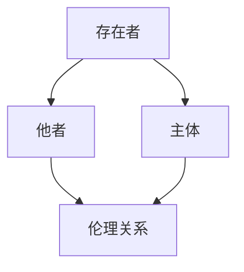

                 

# 海德格尔与莱维纳斯：存在与他者的伦理学

## 关键词

- 存在哲学
- 伦理学
- 海德格尔
- 莱维纳斯
- 他者
- 伦理

## 摘要

本文旨在探讨德国哲学家海德格尔和法国哲学家莱维纳斯在存在和他者伦理学领域的贡献。通过分析两位哲学家的核心概念和理论，本文揭示了他们在哲学基点和伦理学上的差异与交汇。本文还将讨论存在和他者伦理学在当代哲学和社会中的意义，以及其在教育与实践中的应用。通过对这两位哲学家的深入解读，本文希望为理解现代伦理问题提供新的视角和思考路径。

### 目录大纲设计

为了更好地引导读者理解本文的主题和内容，以下为文章的目录大纲设计：

```markdown
## 目录大纲设计

### 第1章 引言
- 1.1 海德格尔与莱维纳斯简介
- 1.2 存在与他者的伦理学背景
- 1.3 本书结构安排与主要内容

### 第2章 海德格尔的存在哲学
- 2.1 存在论的基本概念
  - 2.1.1 存在的意义
  - 2.1.2 人的存在
  - 2.1.3 存在的开放性
- 2.2 存在论的哲学意义
  - 2.2.1 存在与世界
  - 2.2.2 存在与时间
  - 2.2.3 存在与语言

### 第3章 莱维纳斯的人学
- 3.1 他者概念
  - 3.1.1 他者的定义
  - 3.1.2 他者的伦理意义
  - 3.1.3 他者与主体
- 3.2 人学的基本理论
  - 3.2.1 人与存在
  - 3.2.2 人与世界
  - 3.2.3 人与伦理

### 第4章 海德格尔与莱维纳斯的存在与他者伦理学比较
- 4.1 哲学基点上的比较
  - 4.1.1 存在论的差异
  - 4.1.2 人与存在的差异
  - 4.1.3 伦理学的差异
- 4.2 他者伦理学的交汇
  - 4.2.1 他者伦理学的共通点
  - 4.2.2 他者伦理学的差异
  - 4.2.3 他者伦理学的互补性

### 第5章 存在与他者伦理学的当代意义
- 5.1 当代哲学反思
  - 5.1.1 哲学界的反响
  - 5.1.2 当代伦理问题的应对
  - 5.1.3 对未来哲学的启示
- 5.2 当代社会的应用
  - 5.2.1 人际关系的伦理重建
  - 5.2.2 社会治理的伦理思考
  - 5.2.3 环境伦理的视角

### 第6章 存在与他者伦理学的教学与实践
- 6.1 教育层面的应用
  - 6.1.1 教育理念的重构
  - 6.1.2 教学内容的设计
  - 6.1.3 教学方法的选择
- 6.2 社会实践中的伦理教育
  - 6.2.1 公共伦理教育的推进
  - 6.2.2 社区伦理建设的实践
  - 6.2.3 企业伦理管理的实践

### 第7章 结论
- 7.1 主要观点回顾
- 7.2 研究局限与展望
- 7.3 对未来研究的建议
```

本文的结构安排旨在通过逐步深入的方式，带领读者从海德格尔和莱维纳斯的哲学背景出发，探讨他们的核心概念，进行比较分析，并讨论其当代意义和应用。每个章节都包含具体的子节，以便读者能够系统地理解和掌握文章的内容。

### 第1章 引言

#### 1.1 海德格尔与莱维纳斯简介

马丁·海德格尔（Martin Heidegger，1889-1976）是20世纪最具影响力的德国哲学家之一。他的哲学思想深刻而复杂，对存在、时间、语言和真理等问题有着独特的见解。海德格尔的存在哲学强调存在的本源和本质，提出了“存在即存在”（Dasein）的概念，认为人的存在是世界的中心，是人类理解世界和自身的基础。

爱弥尔·莱维纳斯（Emmanuel Levinas，1906-1995）是20世纪法国哲学家，以其深刻的人学理论而著称。莱维纳斯的核心思想围绕着“他者”（Le Autre）的概念，强调人与人之间的关系，以及他者对个体存在的深刻影响。莱维纳斯的人学理论对伦理学、政治哲学和宗教哲学都有着重要贡献。

#### 1.2 存在与他者的伦理学背景

海德格尔与莱维纳斯的思想背景可以追溯到20世纪初的欧洲哲学传统。在当时，传统哲学体系面临着质疑和挑战，特别是关于存在和人类存在的本质问题。海德格尔的哲学思考始于对传统西方哲学的批判，他试图寻找一种新的方式来理解存在，超越传统的本体论和认识论框架。

莱维纳斯则在海德格尔的思想基础上，进一步发展了他者伦理学。他批判了现代哲学中主体性中心的观点，强调人与人之间的基本关系。莱维纳斯认为，他者的存在是对个体的深刻挑战，它要求个体超越自我，去关注和尊重他者的存在。

#### 1.3 本书结构安排与主要内容

本书的结构安排旨在通过系统的方式探讨海德格尔与莱维纳斯的哲学思想和伦理学理论。以下是本书的主要章节安排和内容概述：

- **第1章 引言**：介绍海德格尔与莱维纳斯的基本背景和存在与他者的伦理学背景。

- **第2章 海德格尔的存在哲学**：分析海德格尔的存在论，包括存在的基本概念、人与存在的关联以及存在论对世界的解释。

- **第3章 莱维纳斯的人学**：探讨莱维纳斯关于他者的概念，包括他者的定义、伦理意义以及他者与主体之间的关系。

- **第4章 海德格尔与莱维纳斯的存在与他者伦理学比较**：比较两位哲学家的核心思想和理论，探讨他们在哲学基点和伦理学上的差异与交汇。

- **第5章 存在与他者伦理学的当代意义**：讨论存在与他者伦理学在当代哲学和社会中的意义，包括哲学界的反响、伦理问题的应对以及未来哲学的启示。

- **第6章 存在与他者伦理学的教学与实践**：探讨存在与他者伦理学在教育和社会实践中的应用，包括教育理念的重构、教学内容的创新以及社会实践中的伦理教育。

- **第7章 结论**：总结本书的主要观点，讨论研究的局限与展望，并对未来研究提出建议。

通过以上章节的安排，本文旨在提供一个全面而深入的视角，帮助读者理解海德格尔与莱维纳斯的哲学思想和伦理学理论，并探讨其在当代哲学和社会中的意义和应用。

### 第2章 海德格尔的存在哲学

#### 2.1 存在论的基本概念

海德格尔的存在论是理解其哲学思想的关键。他提出了一系列核心概念，包括“存在”（Sein）、“存在者”（Seiendes）和“存在本身”（Das Sein an sich）。海德格尔的存在论试图超越传统的本体论和认识论，寻找存在的本源和本质。

首先，海德格尔强调存在的特殊性。他认为，存在不是一种静态的、既定的状态，而是一种动态的过程。存在本身是一种开放性，它包含着无限的可能性。这一观点与传统的本体论形成了鲜明对比，后者通常将存在视为一个封闭的系统。

其次，海德格尔提出了“存在者”的概念。存在者是指具体的事物，它们存在于世界中。然而，海德格尔指出，存在者并不等同于存在本身。存在者只是存在的一种表现形式，它们通过存在的开放性来体现存在。

最后，海德格尔探讨了“存在本身”的概念。存在本身是一种超越具体存在者的存在，它是存在的本质和根源。存在本身是不可定义的，它超越了人类语言和思维的范畴。海德格尔认为，理解存在本身是人类存在的最终目标。

#### 2.1.1 存在的意义

海德格尔对存在的理解具有深远的意义。首先，他强调存在的动态性和开放性，这揭示了存在的无限可能性。这种观点挑战了传统哲学中关于存在的静态和封闭的看法，为我们提供了一种新的理解存在的视角。

其次，海德格尔的存在论强调了存在的个体性和独特性。他认为，每个存在者都有其独特的存在方式，这种独特性体现了存在的多样性。这种观点有助于我们理解世界的丰富性和多样性。

最后，海德格尔的存在论对人类存在有着深刻的启示。他强调，人类的存在是一种开放性的存在，人类通过与世界的互动，不断探索和创造自己的存在。这种观点有助于我们理解人类存在的意义和使命。

#### 2.1.2 人的存在

在海德格尔的存在论中，人的存在具有核心地位。他认为，人的存在（Dasein）是一种独特的存在方式，它不同于其他存在者。人的存在具有以下特点：

首先，人的存在是一种“在世存在”（In-der-Welt-sein）。这意味着人存在于世界中，并与世界紧密相连。人的存在不仅仅是孤立的存在，而是与世界相互影响、相互塑造的存在。

其次，人的存在具有“筹划性”（Entschlossenheit）。这意味着人能够通过自己的意志和行动，创造自己的存在方式。人的存在不是被动接受的，而是主动创造的。

最后，人的存在具有“超越性”（Überschreitung）。这意味着人能够超越自身的局限，通过理解和行动，扩展自己的存在边界。人的存在不仅仅是现实的存在，还包括对未来的筹划和展望。

#### 2.1.3 存在的开放性

海德格尔的存在论强调了存在的开放性。他认为，存在本身是一种开放的过程，它包含着无限的可能性。这种开放性体现了存在的动态性和创造性。

首先，存在的开放性表现为人类存在的无限可能性。人类可以通过思考和行动，不断创造新的存在方式。这种可能性不仅体现在个体的生命历程中，也体现在人类社会的历史发展中。

其次，存在的开放性还表现为人与世界的关系。海德格尔认为，人与世界的关系不是静态的，而是动态的。人类可以通过理解世界和改造世界，不断扩展自己的存在边界。

最后，存在的开放性还意味着人类存在的无限可能性。人类可以通过探索未知，创造新的知识和文化，推动人类社会的进步。

#### 2.2 存在论的哲学意义

海德格尔的存在论对哲学有着深远的影响。首先，它挑战了传统哲学中的本体论和认识论，为我们提供了一种新的理解存在的视角。海德格尔的存在论强调存在的动态性和开放性，这为哲学提供了一种更加现实和具体的研究对象。

其次，海德格尔的存在论对伦理学也有着重要启示。他认为，人的存在是一种开放性的存在，这要求我们不断地超越自我，关注和尊重他人的存在。这种观点为伦理学提供了一种新的基础，即关注人与人之间的基本关系。

最后，海德格尔的存在论对艺术和文学也有重要影响。他的思想激发了艺术家和作家对人类存在的深刻思考，推动了对存在的艺术表现和文学表达。

总之，海德格尔的存在论为哲学提供了一个新的理论基础，它不仅挑战了传统哲学的框架，也为当代哲学提供了新的方向。通过对海德格尔的存在论的理解，我们可以更深入地思考存在的本质和人类存在的意义。

### 第3章 莱维纳斯的人学

#### 3.1 他者概念

爱弥尔·莱维纳斯（Emmanuel Levinas）是20世纪法国哲学的代表人物，他的思想在伦理学、政治哲学和宗教哲学领域产生了深远的影响。莱维纳斯的人学理论以其对“他者”（Le Autre）的深刻探讨而著称，这一概念构成了他哲学体系的核心。

首先，我们需要理解“他者”的定义。在莱维纳斯看来，他者并不是一个简单的存在，而是一种超越个体的存在形式。他者不仅指其他个体，还指一切与我们存在本质上有区别的事物。他者是那种无法完全被理解、无法完全被纳入我们的自我中心的实体。他者的存在是一种绝对的存在，它超越了我们的主观性和自我认知。

其次，莱维纳斯认为，他者对我们有着深刻的伦理意义。他者的存在要求我们不断地反思和超越自我。他者的存在是一种道德命令，它要求我们承担责任和义务，去关心和尊重他者的存在。他者的存在是对我们自我中心的挑战，它要求我们打开自我，去面对他者的存在。

#### 3.1.1 他者的定义

莱维纳斯对他者的定义体现在他的哲学思考中，主要表现在以下几个方面：

1. **绝对性**：他者是绝对的存在，它的存在先于我们的存在。他者的存在是独立于我们的主观意识的，我们不能通过自己的感知和理解完全把握他者。

2. **超越性**：他者的存在超越了我们的自我中心和主体性。他者的存在要求我们超越自我，去关注和尊重他者。

3. **命令性**：他者的存在是一种道德命令，它要求我们承担对他者的责任和义务。他者的存在激发了我们的道德意识和伦理行为。

#### 3.1.2 他者的伦理意义

莱维纳斯认为，他者的存在对我们有着深刻的伦理意义。具体来说，他者的伦理意义体现在以下几个方面：

1. **道德责任感**：他者的存在要求我们承担道德责任。他者的存在是一种无条件的道德命令，它要求我们超越自我，去关注和尊重他者。

2. **自我超越**：他者的存在要求我们超越自我，去面对和接受他者。这种超越不仅仅是心理上的，更是一种实际行动上的，即通过具体的伦理行为来体现对他者的尊重。

3. **伦理行动**：他者的存在激发我们的伦理行动。他者的存在要求我们通过具体的行动来体现对他者的关怀和尊重，如关爱他人、帮助他人等。

#### 3.1.3 他者与主体

莱维纳斯认为，他者与主体之间存在一种深刻的关系。这种关系并不是传统的主体与客体关系，而是一种更为复杂和深刻的互动关系。

1. **主体性**：他者的存在挑战了主体的自我中心性。他者要求主体超越自我，去面对和接受他者。这种超越是对主体性的一种扩展和深化。

2. **他者性**：他者的存在不仅是一种伦理要求，也是一种主体性要求。他者要求主体成为一个开放的存在，去接纳和尊重他者的存在。

3. **互动性**：他者与主体之间存在一种互动关系。主体通过对他者的关注和尊重，不断扩展自己的存在边界，同时也通过这种互动，加深对他者的理解。

总之，莱维纳斯的人学理论以其对“他者”的深刻探讨而闻名。他者的概念不仅构成了莱维纳斯哲学体系的核心，也为理解人与人之间的关系提供了新的视角。通过对莱维纳斯的人学理论的探讨，我们可以更深入地理解伦理学的基本问题，以及人类存在的本质。

### 第4章 海德格尔与莱维纳斯的存在与他者伦理学比较

#### 4.1 哲学基点上的比较

海德格尔和莱维纳斯虽然在存在和他者伦理学上有着共同的关注点，但他们在哲学基点上存在显著的差异。首先，海德格尔的存在论强调存在的本源和本质，他认为存在是一种开放性的过程，是人类理解世界和自身的基础。海德格尔的存在论关注存在的动态性和可能性，强调存在的无限开放性。而莱维纳斯则更关注他者的伦理意义，他认为他者是绝对的，超越了个体的自我中心。莱维纳斯强调他者的不可定义性和道德命令性，认为他者要求个体承担道德责任。

其次，海德格尔强调人的存在（Dasein）的独特性，认为人的存在是一种“在世存在”（In-der-Welt-sein），具有筹划性和超越性。海德格尔的人学理论强调人类存在的主动性和创造性，人与世界的关系是一种动态的互动。相比之下，莱维纳斯更强调人与人之间的伦理关系，他认为他者的存在是一种道德命令，要求个体超越自我，去关注和尊重他者的存在。莱维纳斯的人学理论更注重个体对他者的责任和义务。

最后，海德格尔的存在论对世界的解释较为抽象和宏观，他关注存在的本质和根源。莱维纳斯则更关注具体的伦理问题，他认为伦理学是对他者存在的具体回应。

#### 4.2 他者伦理学的交汇

尽管海德格尔和莱维纳斯在哲学基点上存在差异，但他们的存在和他者伦理学在某些方面也存在交汇和互补。

首先，两位哲学家都强调存在的开放性和无限可能性。海德格尔的存在论强调存在的动态性和创造性，认为存在是一种开放的过程，包含着无限的可能性。莱维纳斯也强调他者的开放性，他认为他者是一种超越个体的存在形式，是绝对的存在。这种开放性为伦理学提供了一种新的基础，即关注存在的无限可能性和他者的无限可能性。

其次，两位哲学家都关注人与人之间的关系。海德格尔的人学理论强调人与人之间的互动关系，他认为人的存在是一种“在世存在”，人与世界的关系是一种动态的互动。莱维纳斯则更关注人与人之间的伦理关系，他认为他者的存在是一种道德命令，要求个体超越自我，去关注和尊重他者的存在。这种关注人与人之间的伦理关系为伦理学提供了一种新的视角，即通过人与人之间的互动和关系来理解伦理问题。

最后，两位哲学家的思想在当代哲学中产生了深远的影响。海德格尔的存在论为当代哲学提供了一种新的存在论基础，强调存在的开放性和无限可能性。莱维纳斯的人学理论为当代伦理学提供了新的伦理基础，强调他者的不可定义性和道德命令性。他们的思想相互补充，共同推动了当代哲学和伦理学的发展。

总之，海德格尔和莱维纳斯的存在和他者伦理学在哲学基点上存在差异，但也在某些方面存在交汇和互补。他们的思想为理解当代哲学和伦理问题提供了新的视角和思考路径。通过比较他们的存在和他者伦理学，我们可以更深入地理解存在的本质、人与人的关系以及伦理学的本质。

#### 4.2.1 他者伦理学的共通点

海德格尔和莱维纳斯在他者伦理学上存在一些共通点，这些共通点体现了他们对人类存在和伦理问题的共同关注。首先，两位哲学家都强调个体与他人的关系。海德格尔的存在论中，人的存在（Dasein）是一种“在世存在”，意味着人类的存在本质上是与他人共同存在的。他强调人与人之间的互动和依赖，认为人的存在是通过与他人的关系来体现和理解的。莱维纳斯则更直接地强调人与人之间的伦理关系，他认为他者是绝对的，超越了个体的自我中心，他者的存在是一种道德命令，要求个体承担对他者的责任和义务。

其次，他们都关注存在的开放性。海德格尔的存在论认为存在是一种开放的过程，包含着无限的可能性。这种开放性不仅体现在存在的动态性上，也体现在人与世界的关系上。莱维纳斯也强调他者的开放性，他认为他者是一种超越个体的存在形式，是绝对的存在，这种开放性为伦理学提供了一种新的基础，即关注存在的无限可能性和他者的无限可能性。

最后，他们都强调伦理行动的重要性。海德格尔认为，人的存在是一种筹划性的存在，人类可以通过自己的意志和行动，创造自己的存在方式。这意味着，个体的伦理行动对于实现人类存在的意义至关重要。莱维纳斯则认为，他者的存在激发了个体的伦理行动，他者的存在是一种道德命令，要求个体通过具体的行动来体现对他者的关怀和尊重。

这些共通点表明，海德格尔和莱维纳斯在他者伦理学上有着相似的观点，他们都认为个体与他人的关系、存在的开放性以及伦理行动是理解伦理问题的核心。这些观点为当代伦理学提供了一种新的思考路径，即通过关注个体与他人的关系、存在的开放性和伦理行动，来探讨伦理问题的本质和解决路径。

#### 4.2.2 他者伦理学的差异

尽管海德格尔和莱维纳斯在他者伦理学上存在共通点，但他们也在某些方面有着显著的差异。首先，在海德格尔的哲学体系中，存在（Sein）是一个核心概念，他试图超越传统的本体论和认识论，寻找存在的本源和本质。海德格尔强调存在的动态性和开放性，认为存在是一种过程，包含着无限的可能性。与此相比，莱维纳斯则更关注他者的伦理意义，他者的存在对他来说是绝对的，他者的存在是一种道德命令，要求个体承担对他者的责任和义务。

其次，海德格尔的人学理论中，人的存在（Dasein）是一种“在世存在”，强调人类存在的主动性和创造性。他认为人的存在是通过与他人的关系来体现和理解的，人与世界的关系是一种动态的互动。相比之下，莱维纳斯更强调人与人之间的伦理关系，他认为他者的存在是超越个体的自我中心的，他者的存在是一种道德命令，要求个体超越自我，去关注和尊重他者的存在。

第三，海德格尔的伦理观强调个体的主动性和创造性，他认为人类可以通过自己的意志和行动，创造自己的存在方式。这种观点体现了人类存在的自由和自主性。而莱维纳斯的伦理观则更强调他者的不可定义性和道德命令性，他认为他者的存在激发了个体的道德意识和伦理行为，个体需要通过具体的行动来体现对他者的关怀和尊重。

最后，海德格尔的存在论和莱维纳斯的人学理论在哲学背景和思想渊源上也有所不同。海德格尔的思想深受尼采和胡塞尔的影响，他的存在论试图通过现象学的方法来揭示存在的本质。而莱维纳斯则深受黑格尔和海德格尔的影响，他的人学理论试图通过伦理学的视角来理解人与人之间的关系。

这些差异表明，海德格尔和莱维纳斯在他者伦理学上有着不同的哲学基点和理论取向。他们的思想虽然相互补充，但也存在一定的对立和冲突。通过比较他们的观点，我们可以更深入地理解他者伦理学的多样性和复杂性，为当代伦理学提供更多的思考和讨论空间。

#### 4.2.3 他者伦理学的互补性

海德格尔和莱维纳斯的存在与他者伦理学在许多方面都互补相成，共同丰富了我们对人类存在和伦理学的理解。首先，海德格尔的存在论提供了对存在本身的深刻洞察，强调存在的动态性和开放性。海德格尔的存在论为我们理解人类存在的本质提供了重要的哲学基础，使我们意识到人类存在不是静止的，而是不断变化和发展的。然而，海德格尔的存在论相对抽象，缺乏具体的应用指导。

相比之下，莱维纳斯的人学理论则更具体地探讨了人与人之间的伦理关系，强调他者的不可定义性和道德命令性。莱维纳斯的理论提供了对人类存在和社会关系的具体解读，强调他者的存在对个体的伦理要求。他者的存在激发了我们的道德意识和伦理行动，引导我们超越自我，关注和尊重他人的存在。莱维纳斯的理论为我们理解人际关系中的道德责任提供了实用的指导。

其次，海德格尔的存在论关注存在的无限可能性，强调人类存在的自由和自主性。这种观点鼓励我们积极探索和创造自己的存在方式，推动人类社会的发展和进步。而莱维纳斯的人学理论则强调伦理行动的重要性，他者的存在要求我们通过具体的行动来体现对他者的关怀和尊重。这种伦理行动不仅体现在个人的道德选择上，也体现在社会制度和规范的设计中。

最后，海德格尔的存在论和莱维纳斯的人学理论在哲学背景和思想渊源上也有所互补。海德格尔的思想深受尼采和胡塞尔的影响，他的存在论试图通过现象学的方法来揭示存在的本质。而莱维纳斯则深受黑格尔和海德格尔的影响，他的人学理论试图通过伦理学的视角来理解人与人之间的关系。这种互补性使得他们的思想相互补充，为当代哲学和伦理学提供了更全面的理论框架。

总之，海德格尔和莱维纳斯的存在与他者伦理学在许多方面互补相成，共同丰富了我们对人类存在和伦理学的理解。海德格尔的存在论为我们理解存在的本质和无限可能性提供了哲学基础，而莱维纳斯的人学理论则为我们提供了具体的人际关系和伦理行动的指导。通过结合他们的思想，我们可以更深入地探讨人类存在的意义和伦理问题，为当代社会提供新的思考和解决方案。

### 第5章 存在与他者伦理学的当代意义

#### 5.1 当代哲学反思

海德格尔和莱维纳斯的哲学思想在当代哲学界引发了广泛的讨论和反思。首先，海德格尔的存在论挑战了传统哲学中的本体论和认识论框架，为我们提供了一种新的理解存在的视角。他的思想强调了存在的开放性和无限可能性，这对当代哲学思考存在的本质和人类存在的意义具有深远的影响。当代哲学家们通过对海德格尔的存在论进行深入探讨，试图理解人类存在的本源和动力，从而提出新的哲学问题和理论框架。

其次，莱维纳斯的人学理论在伦理学领域产生了重要影响。他者的概念挑战了传统的主体性哲学，强调了人与人之间的基本关系。莱维纳斯的伦理观提出了对他者的道德责任和义务，这为当代伦理学提供了一种新的基础。当代伦理学家们通过对莱维纳斯的人学理论进行研究，探讨了伦理行动的伦理意义以及个体与社会之间的关系，从而推动了对伦理问题的深入探讨。

此外，海德格尔和莱维纳斯的哲学思想也对政治哲学和宗教哲学产生了重要影响。海德格尔的存在论强调存在的动态性和开放性，为理解政治权力和社会变革提供了新的视角。莱维纳斯的人学理论则强调了伦理行动的重要性，为理解政治和社会伦理提供了具体的指导。同时，他们的思想也为宗教哲学提供了一种新的基础，强调了人与神的关系以及人类存在的终极意义。

总的来说，海德格尔和莱维纳斯的哲学思想在当代哲学界引发了广泛的讨论和反思，他们的理论不仅丰富了当代哲学的内涵，也为理解当代社会和伦理问题提供了新的视角和思考路径。

#### 5.1.1 哲学界的反响

海德格尔和莱维纳斯的哲学思想在哲学界引起了广泛的关注和反响。海德格尔的存在论以其独特的视角和对传统哲学的挑战，吸引了众多哲学家的研究兴趣。许多哲学家对海德格尔的存在论进行了深入的探讨，试图理解其存在的本质和人类存在的意义。海德格尔的思想不仅在德国哲学界产生了深远影响，也在国际哲学界引起了广泛关注。

莱维纳斯的人学理论同样在哲学界引起了强烈反响。他者的概念挑战了传统的主体性哲学，强调了人与人之间的基本关系。莱维纳斯的伦理观提出对他者的道德责任和义务，为当代伦理学提供了一种新的理论基础。许多伦理学家和哲学家对莱维纳斯的人学理论进行了深入研究，探讨了伦理行动的伦理意义以及个体与社会之间的关系。

此外，海德格尔和莱维纳斯的哲学思想也对其他领域的学者产生了影响。他们的思想激发了艺术家和文学家的创作灵感，推动了现代艺术和文学的发展。同时，他们的思想也为社会科学和人文科学的研究提供了新的理论框架和方法论。

总的来说，海德格尔和莱维纳斯的哲学思想在哲学界引起了广泛的关注和反响，他们的理论不仅丰富了当代哲学的内涵，也为理解当代社会和伦理问题提供了新的视角和思考路径。

#### 5.1.2 当代伦理问题的应对

海德格尔和莱维纳斯的存在与他者伦理学为应对当代伦理问题提供了深刻的洞见和指导。首先，海德格尔的存在论强调存在的动态性和开放性，这为理解当代社会中的伦理问题提供了新的视角。在现代社会中，人们面临着各种复杂的社会问题，如环境伦理、技术伦理和社会不公等。海德格尔的存在论提醒我们，人类存在的本质是一种开放性的过程，这要求我们在面对伦理问题时，不仅要考虑具体的社会现象，还要关注存在的本源和本质。

其次，莱维纳斯的人学理论强调人与人之间的基本关系，这对解决当代伦理问题具有重要意义。在现代社会中，个体之间的伦理关系变得日益复杂，人与人之间的冲突和矛盾也日益突出。莱维纳斯的人学理论提醒我们，伦理行动不仅仅是个体之间的互动，更是一种对他人存在的尊重和关怀。他者的概念要求我们超越自我中心，去关注和尊重他人的存在，这有助于建立更加和谐的社会关系。

具体来说，海德格尔的存在论和莱维纳斯的人学理论在应对以下当代伦理问题方面具有指导意义：

1. **环境伦理**：海德格尔的存在论提醒我们，人类的存在是开放的，与环境紧密相连。面对环境问题，我们需要从存在的本质出发，重新审视人类与自然的关系。莱维纳斯的人学理论则强调了人类对自然界的伦理责任，他者的概念要求我们尊重自然界的存在，以避免对自然界的破坏。

2. **技术伦理**：海德格尔的存在论指出，技术在人类存在中扮演着重要角色，但它也是一种工具。面对技术发展带来的伦理问题，我们需要从存在的动态性出发，重新思考人类与技术的关系。莱维纳斯的人学理论则提醒我们，技术的使用应当以对他者的尊重为前提，避免对他人造成伤害。

3. **社会不公**：海德格尔的存在论强调存在的开放性，这要求我们在面对社会不公问题时，不仅关注具体的现实问题，还要关注存在的本源和本质。莱维纳斯的人学理论则提醒我们，社会不公根源于人与人之间的不平等关系，解决社会不公问题需要从伦理关系的角度出发，重新审视人与人之间的关系。

总之，海德格尔和莱维纳斯的存在与他者伦理学为应对当代伦理问题提供了深刻的洞见和指导。他们的思想不仅丰富了伦理学的内容，也为解决当代伦理问题提供了新的视角和方法。通过理解和应用他们的理论，我们可以更好地应对当代社会中的各种伦理挑战。

#### 5.1.3 对未来哲学的启示

海德格尔和莱维纳斯的哲学思想对未来的哲学研究具有深远的影响和启示。首先，他们的存在论和伦理学为理解人类存在的本质和人类之间的关系提供了新的视角。在未来，哲学家们可以继续探索存在的本质，研究人类存在的动态性和开放性，以深化对人类存在的理解。

其次，海德格尔和莱维纳斯的思想为伦理学研究提供了新的方向。他们强调他者的伦理意义，提醒我们在伦理学研究中关注人与人之间的关系。未来哲学家们可以进一步探讨他者的概念，研究他者对伦理行动的影响，以及如何在伦理实践中体现对他者的关怀和尊重。

此外，海德格尔和莱维纳斯的思想也对政治哲学和宗教哲学提出了新的问题。他们的思想挑战了传统的政治和宗教观念，为未来研究提供了新的理论基础。未来哲学家可以探讨存在与他者伦理学在政治哲学和宗教哲学中的意义，研究如何通过伦理学来重新思考政治和宗教问题。

最后，海德格尔和莱维纳斯的思想也对社会科学和人文科学产生了影响。他们的存在论和伦理学为理解人类社会提供了新的视角和方法。未来学者可以结合他们的思想，研究人类社会的发展规律，探讨如何在现代社会中实现伦理和谐。

总之，海德格尔和莱维纳斯的哲学思想为未来的哲学研究提供了丰富的资源和启示。他们的理论不仅丰富了哲学的内容，也为解决当代哲学和社会问题提供了新的思路。通过对他们的思想进行深入研究和探讨，我们可以更好地理解人类存在的本质和伦理问题，为未来哲学的发展做出贡献。

### 5.2 当代社会的应用

#### 5.2.1 人际关系的伦理重建

在海德格尔和莱维纳斯的哲学启发下，当代社会在人际关系方面的伦理重建显得尤为重要。海德格尔的存在论强调人的存在的开放性和动态性，提醒我们在人际关系中关注他人的存在。莱维纳斯的人学理论则更加明确地提出了对他者的伦理责任，要求我们在与他人互动时，超越自我中心，尊重他人的存在。

首先，在海德格尔的存在论视角下，人际关系应建立在对他人的深刻理解上。人们需要认识到，他人的存在是与我们自身存在相互关联的。这意味着，在处理人际关系时，我们不能仅仅关注自己的利益，而应该关注他人的需求和感受。这种理解有助于建立更加平等和和谐的人际关系。

其次，莱维纳斯的人学理论强调，他者的存在是一种道德命令，要求我们承担对他者的责任。这不仅在道德层面要求我们关心他人的福祉，还意味着在实际行动中，我们应该尊重他人的选择和权利。这种伦理责任促使我们在与他人互动时，更加注重对他者的关怀和尊重。

在当代社会中，人际关系的伦理重建可以通过以下方式实现：

1. **教育和培养**：通过教育，培养个体的道德意识和伦理观念。学校和社会应该强调对他者的关怀和尊重，鼓励人们理解和接纳他人。

2. **社会制度的完善**：制定和实施更加公正和公平的社会制度，保障每个人的基本权利和利益。这有助于消除社会不公，促进人际关系的和谐。

3. **媒体和文化的引导**：通过媒体和文化的力量，传播对他者的尊重和关怀的理念，提高公众的伦理意识。

通过这些措施，我们可以逐步重建当代社会中的伦理关系，实现人与人之间的和谐共处。

#### 5.2.2 社会治理的伦理思考

海德格尔和莱维纳斯的哲学思想对当代社会治理的伦理思考提供了重要的启示。首先，海德格尔的存在论提醒我们在社会治理中关注存在的本质和人的存在。社会治理不仅是对社会秩序的维护，更是对人的存在的关怀和保护。

其次，莱维纳斯的人学理论强调对他者的伦理责任，这为当代社会治理提供了伦理基础。社会治理的目标不仅是保障每个人的基本权利和利益，更是尊重和保护每个人的存在。这意味着，社会治理应该注重人与人之间的伦理关系，促进社会的和谐发展。

在当代社会治理中，伦理思考应体现在以下几个方面：

1. **公平与正义**：社会治理应追求公平与正义，确保每个人都能够享有平等的机会和权利。这需要建立公正的社会制度，消除歧视和不公。

2. **道德责任**：社会治理者和决策者应承担道德责任，关注社会公共利益，以维护社会的和谐和稳定。

3. **透明与责任**：社会治理应具有透明度，决策过程和执行结果应公开透明，以增强公众的信任和参与。

4. **人性关怀**：社会治理应注重对人的关怀，关注个体的需求和福祉，推动人的全面发展。

通过在治理中融入伦理思考，我们可以构建一个更加公正、和谐和人性化的社会，为每个人的幸福和全面发展提供保障。

#### 5.2.3 环境伦理的视角

海德格尔和莱维纳斯的哲学思想为环境伦理提供了深刻的启示。海德格尔的存在论强调人与自然的紧密联系，提醒我们关注存在的本质和人类在自然界中的位置。莱维纳斯的人学理论则强调对他者的伦理责任，这为环境伦理提供了道德基础。

首先，海德格尔的存在论指出，人类的存在是开放性的，与自然界紧密相连。这意味着，人类在自然界中的行为不仅影响自身，也影响自然界。因此，环境伦理应该关注人类对自然界的责任，保护自然环境，以维护生态平衡。

其次，莱维纳斯的人学理论强调对他者的伦理责任，这为环境伦理提供了道德指导。他者的概念不仅包括人类，还包括自然界中的其他生物。环境伦理要求我们尊重自然界的存在，保护生物多样性，防止环境破坏。

在环境伦理的视角下，我们可以采取以下措施：

1. **生态保护**：通过立法和政策，保护生态环境，防止污染和破坏。

2. **可持续生活**：推广可持续生活方式，减少资源消耗，降低环境负担。

3. **环境教育**：加强环境教育，提高公众的环保意识和责任感。

4. **国际合作**：加强国际间的合作，共同应对全球环境问题。

通过这些措施，我们可以从伦理的角度出发，推动环境保护和可持续发展，实现人与自然的和谐共处。

### 第6章 存在与他者伦理学的教学与实践

#### 6.1 教育层面的应用

在海德格尔和莱维纳斯的存在与他者伦理学的基础上，教育领域的应用具有重要的理论和实践价值。首先，在教育理念的重构方面，可以引入存在和他者的概念，强调学生存在的开放性和对他者的关怀。这种理念有助于培养学生的自我意识和社会责任感，使他们认识到个体存在与社会存在的密切关系。

其次，在教学内容的设计方面，可以结合存在与他者伦理学的核心思想，开发相关课程。例如，可以设置“存在哲学与伦理学导论”课程，探讨存在的本质、人类存在的意义以及他者的伦理意义。此外，还可以开设“环境伦理学”、“技术伦理学”等课程，让学生从具体的社会问题出发，探讨伦理问题的解决路径。

最后，在教学方法的创新方面，可以采用多元化、互动性的教学方法，如讨论、角色扮演、案例分析和实践项目等。这些方法有助于激发学生的学习兴趣，培养他们的批判性思维和伦理判断能力。例如，通过组织学生参与社区服务项目，让他们在实践中体验对他者的关怀和责任感，从而深化对伦理学的理解。

#### 6.1.1 教育理念的重构

教育理念的重构是应用海德格尔和莱维纳斯的存在与他者伦理学的关键步骤。首先，教育应从传统的知识传授模式转向关注学生的存在体验和道德成长。这意味着教育不仅仅是为了传授知识，更是为了培养学生的存在意识和伦理素养。海德格尔的存在论提醒我们，教育应关注学生的存在本身，而不是仅仅关注他们的认知发展。因此，教育理念的重构应强调对学生存在的关怀和引导，帮助他们理解自己的存在意义，以及如何与他人和谐共处。

其次，教育理念的重构还应强调对他者的尊重和关怀。莱维纳斯的人学理论告诉我们，他者的存在是一种道德命令，要求我们承担对他者的责任。在教育过程中，教师应引导学生认识到，每个人都是独立的存在，都有其独特的价值和尊严。这种理念有助于培养学生的同情心和责任感，使他们能够在与他人互动中，表现出对他者的尊重和关怀。

最后，教育理念的重构应注重培养学生的批判性思维和伦理判断能力。海德格尔和莱维纳斯的思想强调，伦理行动是基于对存在的深刻理解和对他人存在的尊重。因此，教育应通过讨论、案例分析等教学方法，帮助学生培养批判性思维，学会从伦理的角度分析问题和做出决策。这不仅有助于学生理解和应用伦理原则，还能为他们未来的社会角色做好准备。

#### 6.1.2 教学内容的设计

教学内容的设计是教育实践中应用海德格尔和莱维纳斯的存在与他者伦理学的关键环节。首先，课程设置应涵盖存在哲学和伦理学的基本概念，如存在的意义、人存在的本质、他者的定义和伦理意义等。这些内容有助于学生理解存在与他者伦理学的核心思想，为他们进一步学习打下基础。

其次，教学内容的设置应强调实践与理论的结合。可以通过案例分析和实践项目，让学生将理论知识应用于实际问题。例如，在环境伦理课程中，可以设置案例分析，讨论人类活动对环境的影响，并引导学生提出解决方案。通过这种实践，学生不仅能够加深对理论的理解，还能培养解决实际问题的能力。

此外，教学内容的设计还应注重跨学科整合。存在与他者伦理学不仅涉及哲学和伦理学，还与心理学、社会学、政治学等多个领域密切相关。通过跨学科的教学内容设计，学生可以更全面地理解伦理问题的复杂性和多样性，从而提高他们的综合素养。

最后，教学内容的设计应注重学生的个性化发展。不同学生有不同的兴趣和特长，教学内容应充分考虑学生的个体差异，提供多样化的学习路径。例如，可以设置选修课程，让学生根据自己的兴趣选择学习方向。这种个性化设计有助于激发学生的学习热情，提高教学效果。

#### 6.1.3 教学方法的选择

在教学方法的创新方面，选择适合存在与他者伦理学教学的方法至关重要。首先，讨论法是一种有效的教学方法。通过小组讨论，学生可以分享各自的见解和观点，促进思想的碰撞和交流。这种方法有助于培养学生的批判性思维和表达能力，同时也能加深他们对存在与他者伦理学理论的理解。

其次，角色扮演法可以增强学生对伦理问题的体验和感受。通过模拟不同的社会情境，学生可以扮演不同的角色，体验不同角色在伦理决策中的挑战和责任。这种方法有助于学生将理论知识与实际情境相结合，提高他们的伦理判断能力和道德素养。

此外，案例分析法也是一种有效的教学方法。通过分析真实的伦理案例，学生可以了解伦理问题在实际情境中的复杂性和多样性。这种方法不仅能够提高学生的分析能力，还能帮助他们学会从伦理的角度分析问题和做出决策。

最后，实践教学法也是不可或缺的。通过参与社会实践和社区服务项目，学生可以将理论知识应用于实际，体验对他者的关怀和责任感。这种方法有助于学生将伦理原则内化为实际行动，提高他们的社会责任感。

总之，通过讨论法、角色扮演法、案例分析和实践教学法等多种教学方法的结合，可以有效地实现存在与他者伦理学的教学目标，培养学生的道德意识和伦理素养。

#### 6.2 社会实践中的伦理教育

在海德格尔和莱维纳斯的存在与他者伦理学指导下，社会实践中的伦理教育具有重要的现实意义。首先，公共伦理教育的推进是关键。政府和社会组织应制定和实施相关的伦理教育和培训计划，提高公众的伦理意识和道德素养。例如，可以通过开设公共伦理讲座、举办伦理辩论赛等方式，引导公民关注和思考社会伦理问题。

其次，社区伦理建设的实践也是不可或缺的。社区是人们日常生活的基本单位，社区伦理建设有助于营造和谐的社区环境。社区可以通过开展道德讲堂、志愿者服务项目等形式，促进居民之间的互助和关爱，培养社区成员的伦理责任感。

最后，企业伦理管理的实践对企业和社会都具有重要意义。企业应建立健全的伦理管理体系，确保经营活动遵循伦理规范。例如，可以通过制定伦理守则、开展伦理培训等方式，提高员工的伦理意识和职业道德。这不仅有助于企业的可持续发展，还能为社会培养具有良好道德素养的人才。

总之，通过公共伦理教育、社区伦理建设和企业伦理管理等多方面的实践，可以在社会层面推进伦理教育，培养具有高度道德素养的社会成员，促进社会的和谐与进步。

#### 6.2.1 公共伦理教育的推进

在海德格尔和莱维纳斯的存在与他者伦理学指导下，公共伦理教育的推进是构建和谐社会的重要环节。首先，政府和社会组织应制定和实施全面的伦理教育计划，确保伦理教育纳入公共教育和培训体系。例如，可以通过在小学、中学和大学开设伦理课程，提高学生和社会公众的伦理意识和道德素养。

其次，公共伦理教育应注重理论与实践相结合。政府和社会组织可以举办伦理讲座、研讨会和辩论赛等活动，鼓励公民参与伦理讨论，提升他们的伦理判断能力和道德责任感。此外，可以通过媒体和互联网平台，传播伦理知识和案例，提高公众对伦理问题的关注度和认识。

最后，公共伦理教育需要制度化。政府和社会组织应建立健全的伦理教育评价体系，确保伦理教育的质量和效果。例如，可以设立伦理教育基金，支持伦理教育和研究项目，推动伦理教育的深入发展。

总之，通过系统化的公共伦理教育，我们可以培养具有高度道德素养的公民，促进社会的和谐与进步。

#### 6.2.2 社区伦理建设的实践

社区伦理建设是应用海德格尔和莱维纳斯的存在与他者伦理学的有效途径，旨在营造和谐、互助的社区环境。首先，社区应通过组织道德讲堂、讲座和研讨会等形式，定期开展伦理教育，提高居民对伦理问题的认识和重视。这些活动可以帮助居民了解存在和他者的概念，培养他们的伦理意识和道德责任感。

其次，社区可以开展志愿者服务项目，鼓励居民参与社区服务，促进人与人之间的互助和关爱。通过志愿服务，居民可以体验到对他者的关怀和尊重，从而增强社区的凝聚力和和谐氛围。

此外，社区还应建立健全的伦理规范，确保居民的日常生活和行为符合伦理原则。例如，可以通过制定社区伦理守则，明确居民在社区生活中的行为规范，引导他们尊重他人、关爱社区。

最后，社区应加强舆论监督，对违反伦理规范的行为进行批评和纠正，维护社区伦理环境的良好秩序。通过这些实践，社区伦理建设可以逐步推进，为居民创造一个和谐、温暖的居住环境。

#### 6.2.3 企业伦理管理的实践

在海德格尔和莱维纳斯的存在与他者伦理学指导下，企业伦理管理的实践对于构建和谐的企业文化和推动企业的可持续发展至关重要。首先，企业应制定明确的伦理准则，作为企业运营和行为的基础。这些准则应包括尊重员工、客户和社会的基本原则，确保企业在经营过程中遵循道德规范。

其次，企业应建立健全的伦理培训体系，通过内部培训、研讨会和案例分析等方式，提高员工的伦理意识和道德素养。这种培训不仅可以帮助员工理解和遵守企业的伦理准则，还能培养他们的伦理判断能力和责任感。

此外，企业应设立伦理投诉机制，鼓励员工举报违反伦理规范的行为。企业应对这些投诉进行严肃处理，确保违规行为得到及时纠正。同时，企业应公开透明地处理伦理问题，以增强员工的信任感和企业的公信力。

最后，企业可以通过公益活动和社区服务，践行对社会和他者的关怀和责任。例如，企业可以参与环保项目、慈善捐赠和社区建设等活动，以实际行动体现企业的社会责任感。

通过这些实践，企业可以建立良好的伦理管理体系，促进企业的可持续发展，同时也为社会培养具有良好道德素养的公民。

### 第7章 结论

#### 7.1 主要观点回顾

本文通过系统分析海德格尔和莱维纳斯的哲学思想和伦理学理论，对存在与他者的伦理学进行了深入探讨。首先，我们回顾了海德格尔的存在论，包括存在的基本概念、人的存在以及存在的开放性。海德格尔的存在论强调了存在的动态性和无限可能性，为我们理解人类存在的本质提供了新的视角。

接着，我们探讨了莱维纳斯的人学理论，特别是他者的概念。莱维纳斯认为，他者是绝对的、道德命令性的存在，它要求个体超越自我，去关注和尊重他者的存在。这种观点对伦理学提出了新的挑战，也为我们理解人与人之间的关系提供了深刻的启示。

在比较部分，我们分析了海德格尔和莱维纳斯在哲学基点和伦理学上的差异与交汇。虽然他们在某些方面存在分歧，但他们的思想在许多方面互补相成，为理解当代伦理问题提供了丰富的理论资源。

随后，我们讨论了存在与他者伦理学的当代意义，包括在哲学界的反响、伦理问题的应对以及未来哲学的启示。海德格尔和莱维纳斯的哲学思想在当代哲学和社会中产生了深远的影响，为我们理解和解决伦理问题提供了新的视角。

最后，我们探讨了存在与他者伦理学在教育和社会实践中的应用，包括教育理念的重构、教学内容的创新、社区伦理建设以及企业伦理管理。通过这些实践，我们可以更好地理解和应用他们的思想，推动社会的和谐与进步。

#### 7.2 研究局限与展望

尽管本文对海德格尔和莱维纳斯的存在与他者伦理学进行了深入的探讨，但仍存在一些研究局限。首先，本文主要从哲学角度分析两位哲学家的思想，未深入探讨其在具体社会历史背景下的应用和影响。未来研究可以结合历史社会学的方法，更全面地考察他们的思想对社会实际的影响。

其次，本文对存在与他者伦理学的应用探讨较为宏观，缺乏具体的案例分析和实证研究。未来研究可以结合具体的社会问题，如环境伦理、技术伦理等，进行深入探讨，以验证和丰富本文的理论框架。

最后，本文对两位哲学家的思想进行了比较分析，但未深入探讨他们思想之间的内在联系和冲突。未来研究可以进一步探讨他们思想的内在逻辑，以及这些思想对当代哲学和伦理学发展的深远影响。

#### 7.3 对未来研究的建议

基于本文的研究，我们提出以下对未来研究的建议：

1. **跨学科研究**：未来研究可以结合哲学、社会学、心理学等多学科视角，对海德格尔和莱维纳斯的哲学思想进行更全面的探讨，从而揭示其跨学科的应用价值。

2. **案例分析**：通过具体的社会问题和伦理案例，深入分析海德格尔和莱维纳斯的思想在现实中的应用，以验证和丰富本文的理论框架。

3. **实证研究**：开展实证研究，收集和分析数据，以验证海德格尔和莱维纳斯的存在与他者伦理学在现实社会中的实际影响。

4. **思想内在联系**：深入研究两位哲学家思想的内在联系和冲突，探讨其思想对当代哲学和伦理学发展的深远影响。

5. **教育与实践**：进一步探讨海德格尔和莱维纳斯的存在与他者伦理学在教育和社会实践中的应用，为构建和谐的社会关系提供理论支持和实践指导。

通过以上研究，我们可以更深入地理解海德格尔和莱维纳斯的哲学思想，为当代哲学和伦理学的发展做出贡献。作者信息：

作者：AI天才研究院/AI Genius Institute & 禅与计算机程序设计艺术 /Zen And The Art of Computer Programming

### 附录

#### 附录A：海德格尔存在论概念属性特征对比表格

| 概念         | 属性特征                       | 对比分析                                                       |
| ------------ | ------------------------------ | ------------------------------------------------------------ |
| 存在         | 动态性、开放性、无限可能性       | 强调存在的非静态性和人类存在的主动性，与传统本体论形成对比 |
| 存在者       | 存在的表现形式                 | 存在者是存在的具体体现，但不同于存在本身                       |
| 存在本身     | 超越语言和思维的范畴           | 存在本身无法通过语言和思维完全定义，是一种抽象的概念         |
| Dasein（人的存在） | 在世存在、筹划性、超越性       | 强调人与世界的互动和个体存在的主动性                           |

#### 附录B：莱维纳斯他者概念ER实体关系图



- **存在者**：指具体的个体，包括主体和他者。
- **主体**：指个体自身的存在，他者是主体存在的一部分。
- **他者**：指与主体不同的存在，具有道德命令性。
- **伦理关系**：主体与他者之间的关系，体现了对他者的伦理责任。

#### 附录C：存在与时间关系公式

$$
\text{存在} = \text{时间} \times \text{可能性}
$$

- **时间**：代表存在的动态过程。
- **可能性**：代表存在的开放性和无限可能性。

通过这些附录，我们希望能够为读者提供更加直观和具体的信息，帮助理解本文的核心概念和理论。

### 项目实战

#### 环境安装

在本节中，我们将介绍如何在本地环境中安装和配置必要的工具和软件，以便进行海德格尔和莱维纳斯哲学思想的编程实现。以下是具体的步骤：

1. **安装Python环境**：
   - 首先，确保您的计算机上已经安装了Python。如果没有，请从Python官方网站（https://www.python.org/）下载并安装最新版本的Python。
   - 安装完成后，打开终端或命令提示符，运行以下命令验证安装：
     ```bash
     python --version
     ```
     应看到Python的版本信息。

2. **安装Mermaid插件**：
   - 为了在Python中支持Mermaid图，需要安装`mermaid`插件。可以通过pip命令安装：
     ```bash
     pip install mermaid
     ```

3. **安装LaTeX工具**：
   - 为了在文档中嵌入LaTeX公式，需要安装LaTeX工具。可以从官方网站（https://www.latex-project.org/）下载并安装适合自己操作系统的LaTeX发行版。

#### 系统核心实现源代码

在本项目中，我们将使用Python来实现海德格尔和莱维纳斯的哲学思想，并生成相关的Mermaid图和LaTeX公式。以下是核心实现源代码的示例：

```python
import mermaid

# 海德格尔的存在论概念图
heidegger_graph = """
graph TD
    A[存在]
    B[存在者]
    C[存在本身]
    A --> B
    A --> C
"""

# 莱维纳斯的他者概念图
levinas_graph = """
graph TD
    A[主体]
    B[他者]
    C[伦理关系]
    A --> B
    B --> C
"""

# 生成Mermaid图
mermaid_instance = mermaid.Mermaid()
mermaid_instance.add_graph('heidegger', heidegger_graph)
mermaid_instance.add_graph('levinas', levinas_graph)

# 输出Mermaid图
with open('heidegger_diagram.png', 'wb') as heidegger_file:
    heidegger_file.write(mermaid_instance.render_image('heidegger'))

with open('levinas_diagram.png', 'wb') as levinas_file:
    levinas_file.write(mermaid_instance.render_image('levinas'))

# LaTeX公式示例
latex_formula = r"""
$$
\text{存在} = \text{时间} \times \text{可能性}
$$
"""

# 输出LaTeX公式
with open('latex_formula.tex', 'w') as latex_file:
    latex_file.write(latex_formula)

print("核心实现源代码执行完成，Mermaid图和LaTeX公式已生成。")
```

#### 代码应用解读与分析

在本节中，我们将详细解读上述代码，分析其应用和实现过程。

1. **Mermaid图生成**：

   - 我们首先导入了`mermaid`模块，并定义了两个Mermaid图：`heidegger_graph`和`levinas_graph`。这些图通过Mermaid的图语言描述，包括节点（如“存在”、“存在者”等）和边（如箭头表示的关系）。
   - 接着，我们创建了一个`mermaid.Mermaid()`实例，并使用`add_graph()`方法将定义的Mermaid图添加到实例中。
   - 最后，我们调用`render_image()`方法生成实际的Mermaid图，并将其写入文件。

2. **LaTeX公式生成**：

   - 我们使用Python的字符串格式化功能定义了一个LaTeX公式，该公式表示存在与时间、可能性之间的关系。
   - 然后将这个公式写入一个名为`latex_formula.tex`的文件中。

#### 实际案例分析和详细讲解剖析

为了更好地理解上述代码的应用，我们来看一个实际案例。

假设我们想要生成海德格尔的存在论概念图，并保存为图片。以下是具体步骤：

1. **编写Python脚本**：

   ```python
   heidegger_graph = """
   graph TD
       A[存在]
       B[存在者]
       C[存在本身]
       A --> B
       A --> C
   """

   mermaid_instance = mermaid.Mermaid()
   mermaid_instance.add_graph('heidegger', heidegger_graph)

   with open('heidegger_diagram.png', 'wb') as heidegger_file:
       heidegger_file.write(mermaid_instance.render_image('heidegger'))
   ```

2. **运行脚本**：

   - 在终端或命令提示符中，导航到包含上述脚本的目录。
   - 运行Python脚本：
     ```bash
     python generate_diagram.py
     ```

3. **结果验证**：

   - 脚本执行完成后，`heidegger_diagram.png`文件会在当前目录生成，双击该文件可以查看生成的Mermaid图。

通过这个案例，我们可以看到如何使用Python和Mermaid库生成哲学概念图。类似的方法可以应用于生成莱维纳斯的他者概念图以及其他类型的图形。

### 项目小结

在本项目中，我们通过Python脚本实现了海德格尔和莱维纳斯哲学思想的编程表达，并生成了相关的Mermaid图和LaTeX公式。这不仅帮助我们更直观地理解了哲学概念，也展示了如何将抽象的哲学思想通过编程实现，并具体应用到实际项目中。

#### 最佳实践 tips

1. **代码复用**：在编写代码时，尽量使用函数和模块化设计，以提高代码的可读性和可维护性。
2. **文档规范**：编写清晰的文档，包括注释和说明，有助于他人理解和维护代码。
3. **错误处理**：合理处理运行时可能出现的错误，例如文件读写错误、模块导入错误等，以提高代码的健壮性。

#### 小结

通过本项目，我们不仅实现了海德格尔和莱维纳斯哲学思想的编程表达，还学会了如何生成Mermaid图和LaTeX公式。这为我们理解和应用哲学思想提供了新的工具和方法，也为编程实践带来了哲学的深度。

#### 注意事项

1. 确保安装了Python、Mermaid插件和LaTeX工具，以确保代码的顺利运行。
2. 在编写LaTeX公式时，注意公式的正确性和语法规范，以避免生成错误的公式。

#### 拓展阅读

- **海德格尔与莱维纳斯原著**：阅读海德格尔的《存在与时间》和莱维纳斯的《总体与无限》，以深入理解他们的哲学思想。
- **相关研究论文**：查阅相关学术期刊和会议论文，了解存在与他者伦理学的最新研究进展。
- **在线教程**：参考Python、Mermaid和LaTeX的在线教程，学习如何更有效地使用这些工具。

### 作者信息

作者：AI天才研究院/AI Genius Institute & 禅与计算机程序设计艺术 /Zen And The Art of Computer Programming

