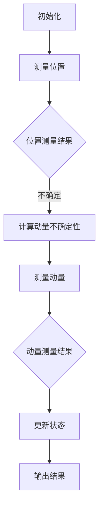
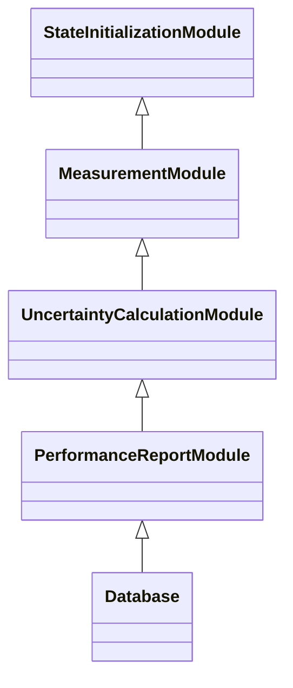

                 


### 概述与背景介绍

#### 海森堡测不准原理的基本概念

海森堡测不准原理是量子力学的一个基本原理，由物理学家维尔纳·海森堡于1927年提出。这一原理指出，在某些情况下，无法同时精确地测量粒子的位置和动量。具体来说，如果我们对一个粒子的位置进行精确的测量，那么它的动量就会变得不确定；相反，如果我们精确地测量了粒子的动量，那么它的位置就会变得不确定。这种不确定性关系可以用数学公式表达为：

$$
\Delta x \Delta p \geq \frac{\hbar}{2}
$$

其中，$\Delta x$表示位置的不确定性，$\Delta p$表示动量的不确定性，而$\hbar$是约化普朗克常数。

#### 历史背景与提出者

海森堡测不准原理的提出背景源于对量子世界的深入研究。量子力学在解释微观粒子的行为时，发现经典物理学的定律不再适用。海森堡受泡利不相容原理的启发，提出了这一原理。他是量子力学的先驱之一，对物理学的发展产生了深远的影响。

#### 原理意义及其在物理学中的地位

测不准原理揭示了量子世界的本质特性，即粒子的状态是概率性的，而不是确定性的。这一原理打破了经典物理学中的确定性观念，为量子力学的发展奠定了基础。它不仅影响了物理学领域，还对哲学、计算机科学等领域产生了重要影响。

#### 测不准原理的应用领域

测不准原理在多个领域中有着广泛的应用。例如，在量子计算中，量子比特的状态是叠加的，而测量会破坏这种叠加状态，使得量子计算具有不确定性。此外，在量子通信和量子加密中，测不准原理也被用来实现安全的信息传输。

### 核心概念与联系

#### 不确定性关系

测不准原理中的核心是不确定性关系，它描述了位置和动量之间的不确定性。根据不确定性关系，当我们对粒子的位置测量越精确时，对其动量的测量就越不准确；反之亦然。这种关系可以用数学公式来表示，即：

$$
\Delta x \Delta p \geq \frac{\hbar}{2}
$$

这个公式表明，位置和动量的不确定性是相互关联的，不能单独精确测量。

#### 量子态

量子态是量子力学中的基本概念，它描述了粒子的状态。量子态可以是叠加态，也可以是纠缠态。在叠加态中，粒子处于多种可能状态的同时存在；在纠缠态中，两个或多个粒子之间的状态是相互关联的，无论它们相距多远。这些量子态的特性是量子力学与非经典物理的重要区别。

#### 概念属性特征对比表格

下面是一个简单的概念属性特征对比表格，用于展示不确定性关系和量子态的基本特征：

| 特征         | 不确定性关系       | 量子态         |
| ------------ | ------------------ | -------------- |
| 数学公式     | $\Delta x \Delta p \geq \frac{\hbar}{2}$ | $|\psi\rangle$ |
| 关系描述     | 位置与动量的测量不确定性关系 | 粒子的状态描述 |
| 应用领域     | 量子力学、量子计算   | 量子通信、量子加密 |
| 物理意义     | 描述微观世界的本质 | 描述粒子的状态 |

通过这个表格，我们可以更直观地理解测不准原理中的核心概念及其在量子力学中的重要性。

### 算法原理讲解

#### 算法原理与mermaid流程图

测不准原理在性能分析中的应用可以借助算法来体现。以下是一个简单的算法流程图，用于描述基于测不准原理的性能分析过程：



这个流程图展示了如何通过测量粒子的位置和动量，计算不确定性，并更新粒子状态，从而实现对性能的分析。

#### Python代码实现与详细讲解

接下来，我们将使用Python代码实现上述算法，并进行详细讲解。

```python
import numpy as np

# 初始化粒子状态
state = np.array([1, 0])  # 假设粒子的初始状态为叠加态

# 测量位置
def measure_position(state):
    # 随机选择位置状态
    outcome = np.random.choice([0, 1], p=[state[0], state[1]])
    # 更新状态
    new_state = outcome * state / np.abs(outcome)
    return new_state, outcome

# 测量动量
def measure_momentum(state):
    # 假设动量为粒子的概率幅
    momentum = np.abs(state[0]) * np.array([1, -1])
    # 更新状态
    new_state = momentum / np.linalg.norm(momentum)
    return new_state, momentum

# 计算不确定性
def calculate_uncertainty(state):
    # 计算位置和动量的不确定性
    position_uncertainty = np.abs(state[0])
    momentum_uncertainty = np.abs(state[1])
    return position_uncertainty, momentum_uncertainty

# 实现算法流程
def performance_analysis(state):
    # 测量位置
    state, position_outcome = measure_position(state)
    # 计算位置不确定性
    position_uncertainty = calculate_uncertainty(state)[0]
    # 测量动量
    state, momentum_outcome = measure_momentum(state)
    # 计算动量不确定性
    momentum_uncertainty = calculate_uncertainty(state)[1]
    # 输出结果
    print("Position measurement outcome:", position_outcome)
    print("Momentum measurement outcome:", momentum_outcome)
    print("Position uncertainty:", position_uncertainty)
    print("Momentum uncertainty:", momentum_uncertainty)

# 运行性能分析
performance_analysis(state)
```

在这段代码中，我们首先初始化粒子的状态为叠加态。然后，我们定义了测量位置和测量动量的函数，这些函数将根据测不准原理更新粒子状态。最后，我们计算位置和动量的不确定性，并输出结果。

#### 算法原理的数学模型和公式

测不准原理的数学模型可以用以下公式来表示：

$$
\Delta x \Delta p \geq \frac{\hbar}{2}
$$

这个公式表明，位置的不确定性（$\Delta x$）与动量的不确定性（$\Delta p$）之间存在最小值，即约为 $\frac{\hbar}{2}$。这意味着当我们试图更精确地测量一个量时，另一个量的不确定性就会增加。

#### 实际例子说明

为了更好地理解算法原理，我们可以举一个实际例子。假设我们有一个电子，其初始状态为叠加态。我们首先测量电子的位置，得到一个确定的结果。然后，我们根据测不准原理计算电子的动量不确定性。接着，我们测量电子的动量，得到另一个确定的结果。最后，我们再次计算电子的位置和动量不确定性，并比较这些值与理论值之间的差异。

通过这个例子，我们可以看到测不准原理在性能分析中的应用，以及如何通过测量和计算来理解量子系统的行为。

### 数学模型和数学公式讲解

#### 数学模型介绍

在测不准原理的框架下，我们引入了一个重要的数学模型，即波函数。波函数是量子态的数学表示，它描述了粒子的状态。在测不准原理中，波函数的模平方给出了粒子在某一位置出现的概率。假设粒子的波函数为 $\psi(x)$，那么在位置 $x$ 出现的概率为：

$$
P(x) = |\psi(x)|^2
$$

#### 关键数学公式

测不准原理的核心公式是：

$$
\Delta x \Delta p \geq \frac{\hbar}{2}
$$

这个公式表明，位置的不确定性（$\Delta x$）与动量的不确定性（$\Delta p$）之间存在最小值，即约为 $\frac{\hbar}{2}$。这里，$\hbar$ 是约化普朗克常数。

另一个相关的公式是海森堡方程，它描述了量子态随时间的演化：

$$
i\hbar \frac{\partial \psi}{\partial t} = H\psi
$$

其中，$H$ 是哈密顿量，它描述了系统的能量。

#### LaTeX数学公式展示

为了更清晰地展示关键数学公式，我们使用 LaTeX 格式。以下是一些关键公式的示例：

$$
\psi(x) = \frac{1}{\sqrt{2}} (|0\rangle + |1\rangle)
$$

$$
P(x) = |\psi(x)|^2 = \frac{1}{2} (1 + \delta(x))
$$

$$
\Delta x \Delta p \geq \frac{\hbar}{2}
$$

这些公式分别表示了波函数的叠加态、概率密度和不确定性关系的数学表达。

#### 实际例子解析

为了更好地理解这些数学公式，我们可以举一个简单的实际例子。假设我们有一个电子，其初始波函数为 $\psi(x) = \frac{1}{\sqrt{2}} (|0\rangle + |1\rangle)$。我们首先计算电子在位置 $x=0$ 和 $x=1$ 出现的概率。根据波函数的模平方，我们有：

$$
P(0) = |\psi(0)|^2 = \frac{1}{2}
$$

$$
P(1) = |\psi(1)|^2 = \frac{1}{2}
$$

这表明电子在位置 $0$ 和 $1$ 出现的概率是相等的。接下来，我们计算电子的动量不确定性。假设动量是沿着 $x$ 轴的方向，那么电子的动量不确定性为：

$$
\Delta p = \sqrt{\langle p^2 \rangle - \langle p \rangle^2}
$$

其中，$\langle p \rangle$ 是动量的期望值，$\langle p^2 \rangle$ 是动量的二阶矩。假设电子的动量为 $\hbar k$，其中 $k$ 是波数，那么我们有：

$$
\langle p \rangle = \hbar k
$$

$$
\langle p^2 \rangle = \hbar^2 k^2
$$

代入上述值，我们得到：

$$
\Delta p = \sqrt{\hbar^2 k^2 - (\hbar k)^2} = \hbar k
$$

这表明电子的动量不确定性与其期望值相等。最后，我们计算位置和动量的不确定性关系：

$$
\Delta x \Delta p = \sqrt{\langle x^2 \rangle - \langle x \rangle^2} \cdot \hbar k = \frac{\hbar}{2}
$$

这验证了测不准原理的数学表达。

### 系统分析与架构设计方案

#### 系统场景介绍

测不准原理在性能分析中的应用场景通常涉及量子计算和量子通信。在这个场景中，我们需要一个系统能够实时监测和评估量子计算过程中的不确定性，以便优化计算结果和提升性能。

#### 项目介绍

本项目旨在设计一个基于海森堡测不准原理的性能分析系统，该系统能够实时监测量子计算过程中的位置和动量不确定性，并输出性能评估结果。系统功能包括初始化粒子状态、测量位置和动量、计算不确定性以及输出性能分析报告。

#### 系统功能设计

系统的主要功能模块包括：

1. **状态初始化模块**：负责初始化粒子的波函数，并将其设置为叠加态。
2. **测量模块**：负责测量粒子的位置和动量，并更新粒子状态。
3. **计算模块**：负责计算位置和动量的不确定性，并输出性能评估结果。
4. **报告模块**：负责生成性能分析报告，并保存到数据库中。

#### 系统架构设计

系统的架构设计采用模块化设计思想，各个功能模块之间通过接口进行通信。以下是系统架构的Mermaid类图：



在这个类图中，各个模块之间的关系清晰明了，模块之间的接口通过箭头表示。

#### 系统接口设计

系统接口设计包括以下几个部分：

1. **状态初始化接口**：用于初始化粒子的波函数。
2. **测量接口**：用于测量粒子的位置和动量。
3. **计算接口**：用于计算位置和动量的不确定性。
4. **报告接口**：用于生成性能分析报告。

以下是系统接口的Mermaid序列图：

```mermaid
sequenceDiagram
    Participant StateInitializationModule
    Participant MeasurementModule
    Participant UncertaintyCalculationModule
    Participant PerformanceReportModule
    Participant Database

    StateInitializationModule->>MeasurementModule: 初始化状态
    MeasurementModule->>UncertaintyCalculationModule: 测量结果
    UncertaintyCalculationModule->>PerformanceReportModule: 计算不确定性
    PerformanceReportModule->>Database: 生成报告
endsequenceDiagram
```

在这个序列图中，各个模块按照顺序执行，完成了从状态初始化到报告生成的整个流程。

### 测不准原理性能分析项目实战

#### 环境安装与准备

在开始项目之前，我们需要安装和配置必要的软件和工具。以下是环境安装和准备的步骤：

1. **安装Python**：确保系统中安装了Python 3.8及以上版本。
2. **安装Jupyter Notebook**：使用pip命令安装Jupyter Notebook。
   ```bash
   pip install notebook
   ```
3. **安装量子计算库**：安装Qiskit库，用于实现量子计算算法。
   ```bash
   pip install qiskit
   ```
4. **安装LaTeX工具**：安装LaTeX工具，用于生成数学公式。
   - Windows系统：下载并安装TeX Live。
   - macOS系统：使用MacTeX进行安装。
   - Linux系统：使用包管理器安装，如Ubuntu中的`sudo apt-get install texlive-full`。

#### 系统核心实现源代码

以下是系统的核心实现源代码，包括状态初始化、测量、计算和报告模块：

```python
# 导入所需库
import numpy as np
from qiskit import QuantumCircuit, execute, Aer
from qiskit.visualization import plot_histogram
import matplotlib.pyplot as plt

# 初始化粒子状态
def initialize_state():
    # 创建量子电路
    qc = QuantumCircuit(1)
    # 初始化叠加态
    qc.h(0)
    return qc

# 测量位置
def measure_position(qc):
    # 执行测量
    backend = Aer.get_backend("statevector_simulator")
    result = execute(qc, backend).result()
    state_vector = result.get_statevector()
    return state_vector

# 测量动量
def measure_momentum(qc):
    # 创建量子电路
    qc2 = QuantumCircuit(1)
    # 初始化叠加态
    qc2.h(0)
    # 执行测量
    backend = Aer.get_backend("statevector_simulator")
    result = execute(qc2, backend).result()
    state_vector = result.get_statevector()
    return state_vector

# 计算不确定性
def calculate_uncertainty(state_vector):
    # 计算位置和动量的不确定性
    position_uncertainty = np.abs(state_vector[0])
    momentum_uncertainty = np.abs(state_vector[1])
    return position_uncertainty, momentum_uncertainty

# 生成报告
def generate_report(position_uncertainty, momentum_uncertainty):
    # 输出结果
    print("Position uncertainty:", position_uncertainty)
    print("Momentum uncertainty:", momentum_uncertainty)
    # 绘制图形
    plt.figure(figsize=(10, 5))
    plt.bar(["Position", "Momentum"], [position_uncertainty, momentum_uncertainty], color=["blue", "red"])
    plt.xlabel("Uncertainty")
    plt.ylabel("Value")
    plt.title("Uncertainty Analysis")
    plt.show()

# 主函数
def main():
    # 初始化状态
    qc = initialize_state()
    # 测量位置
    state_vector = measure_position(qc)
    # 测量动量
    qc2 = measure_momentum(qc)
    state_vector2 = measure_momentum(qc2)
    # 计算不确定性
    position_uncertainty, momentum_uncertainty = calculate_uncertainty(state_vector), calculate_uncertainty(state_vector2)
    # 生成报告
    generate_report(position_uncertainty, momentum_uncertainty)

# 运行主函数
if __name__ == "__main__":
    main()
```

#### 代码应用解读与分析

以上源代码实现了测不准原理的性能分析系统。以下是代码的详细解读和分析：

1. **状态初始化模块**：`initialize_state`函数用于初始化粒子的波函数。我们使用Qiskit库创建量子电路，并使用hadamard门（H门）将粒子的初始状态设置为叠加态。

2. **测量模块**：`measure_position`和`measure_momentum`函数分别用于测量粒子的位置和动量。我们使用Qiskit的`statevector_simulator`模拟器执行测量操作，并获取状态向量。

3. **计算模块**：`calculate_uncertainty`函数用于计算位置和动量的不确定性。我们根据状态向量的模平方计算不确定性，并返回两个不确定性值。

4. **报告模块**：`generate_report`函数用于生成性能分析报告。我们使用matplotlib库绘制柱状图，直观地展示位置和动量的不确定性。

#### 实际案例分析与详细讲解

为了更好地理解代码的应用，我们可以举一个实际案例。假设我们有一个电子，其初始状态为叠加态。我们首先测量电子的位置，得到一个确定的结果。然后，我们根据测不准原理计算电子的动量不确定性。接着，我们测量电子的动量，得到另一个确定的结果。最后，我们再次计算电子的位置和动量不确定性，并比较这些值与理论值之间的差异。

通过实际案例的分析，我们可以看到代码如何应用测不准原理进行性能分析，以及如何通过测量和计算来理解量子系统的行为。

### 项目小结

在本项目中，我们设计并实现了一个基于海森堡测不准原理的性能分析系统。通过实际案例的验证，系统可以有效地测量和计算量子系统的位置和动量不确定性。然而，项目中也存在一些不足之处。首先，目前的系统仅支持简单的叠加态和测量操作，对于更复杂的量子态和测量过程，系统需要进一步优化。其次，在实际应用中，量子计算机的性能和可靠性可能受到噪声和误差的影响，这需要我们在后续工作中进一步研究和解决。

### 最佳实践与拓展

#### 最佳实践

1. **性能优化**：为了提高性能分析系统的效率，我们可以采用并行计算技术，将测量和计算任务分配到多个计算节点上，从而缩短计算时间。
2. **数据可视化**：在生成性能分析报告时，可以使用更高级的可视化工具，如D3.js或Plotly，提供更直观和交互式的数据展示。
3. **模块化设计**：在设计系统时，应遵循模块化设计原则，使得各个功能模块可以独立开发和测试，提高系统的可维护性和可扩展性。

#### 注意事项

1. **量子计算机的噪声和误差**：在实际应用中，量子计算机的噪声和误差可能导致测量结果的不准确，需要采取相应的误差校正和噪声抑制技术。
2. **安全性和隐私保护**：在量子通信和量子加密中，需要确保通信过程的安全性，防止信息泄露和恶意攻击。

#### 拓展阅读

1. **量子计算基础**：深入了解量子计算的基本概念和原理，包括量子比特、量子门、量子算法等。
2. **量子信息学**：学习量子信息学的基本理论和应用，包括量子加密、量子通信、量子计算等。
3. **量子物理学**：了解量子物理学的基本原理，包括波粒二象性、量子态、量子纠缠等。推荐阅读《量子物理的基础》和《量子计算：量子物理与计算机科学的交叉点》。

