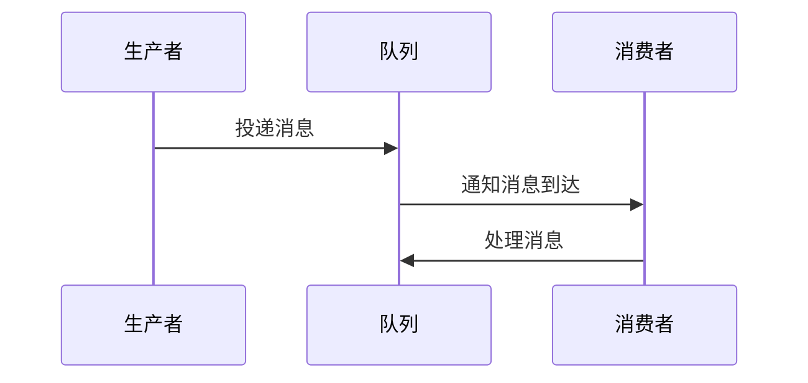

                 

# 消息队列在分布式系统中的应用

## 关键词

消息队列、分布式系统、异步通信、负载均衡、高可用性

## 摘要

本文旨在深入探讨消息队列在分布式系统中的应用。随着云计算和微服务架构的普及，分布式系统在处理高并发、高可用性等方面面临诸多挑战。消息队列作为一种重要的分布式通信机制，能够有效地解决这些问题。本文将从消息队列的基本概念、主流消息队列技术、消息队列在分布式系统中的应用、故障处理与性能优化，以及实际应用实战等方面，全面解析消息队列在分布式系统中的关键作用。

## 目录大纲

----------------------------------------------------------------

## 第一部分：消息队列技术基础

### 第1章：消息队列概述

#### 1.1.1 问题背景与问题描述

#### 1.1.2 消息队列的基本概念

#### 1.1.3 消息队列的边界与外延

#### 1.1.4 消息队列的核心要素

#### 1.1.5 消息队列的类型

### 第2章：主流消息队列技术

#### 2.1.1 消息队列技术演进史

#### 2.1.2 主流消息队列技术对比

### 第3章：消息队列在分布式系统中的应用

#### 3.1.1 分布式系统中的通信挑战

#### 3.1.2 消息队列在分布式系统中的应用

#### 3.1.3 消息队列的架构设计

## 第二部分：消息队列深度解析

### 第4章：消息队列的故障处理与性能优化

#### 4.1.1 故障处理

#### 4.1.2 性能优化

### 第5章：消息队列的应用实战

#### 5.1.1 实战环境搭建

#### 5.1.2 实战项目介绍

#### 5.1.3 实战项目实现

#### 5.1.4 实战项目总结

## 第三部分：最佳实践与总结

### 第6章：最佳实践

### 第7章：小结

### 第8章：注意事项

### 第9章：拓展阅读

----------------------------------------------------------------

### 第一部分：消息队列技术基础

#### 第1章：消息队列概述

#### 1.1.1 问题背景与问题描述

随着互联网的快速发展，企业业务系统逐渐复杂化，如何确保系统之间高效、可靠的数据通信成为一个关键问题。传统的同步通信方式在面对高并发场景时，容易出现阻塞、性能瓶颈等问题。而消息队列技术作为一种异步通信机制，能够有效解决这些问题。

**问题背景**：在分布式系统中，不同模块之间需要相互通信，如订单处理、用户评论、物流跟踪等。这些模块可能分布在不同的服务器上，如何保证它们之间高效、可靠的数据传输成为一个关键问题。

**问题描述**：消息队列技术如何在分布式系统中解决数据通信问题，实现异步通信、负载均衡和高可用性。

#### 1.1.2 消息队列的基本概念

**消息队列的定义**：消息队列（Message Queue）是一种异步通信机制，允许消息生产者和消费者独立运行。消息生产者将消息发送到队列中，消费者从队列中获取并处理消息。

**消息队列的特点**：

- **异步性**：消息生产者和消费者不需要同时运行，消息可以在任何时间被发送和处理。
- **可靠性**：消息队列通常具备高可用性，确保消息不被丢失。
- **可扩展性**：消息队列支持水平扩展，可以处理大量并发请求。

**消息队列的基本概念**：

- **生产者**：负责发送消息的模块。
- **消费者**：负责接收和处理消息的模块。
- **消息**：数据传递的基本单位。
- **队列**：存储消息的缓冲区。

**消息队列的类型**：

- **阻塞队列**：当队列满时，生产者会等待。
- **非阻塞队列**：当队列满时，生产者会丢弃消息。
- **有界队列**：队列大小有限。
- **无界队列**：队列大小无限。

#### 1.1.3 消息队列的边界与外延

**边界**：消息队列的处理能力、并发处理量。不同的消息队列系统在处理能力和并发处理量上存在差异，需要根据具体场景进行选择。

**外延**：消息队列在分布式系统中的应用场景。消息队列可以应用于订单处理、用户评论、物流跟踪等多个方面，实现分布式系统中不同模块之间的数据通信。

#### 1.1.4 消息队列的核心要素

**生产者**：生产者是消息队列的核心组成部分，负责将消息发送到队列中。生产者通常由业务模块或服务提供者实现，根据业务需求生成消息并投递到消息队列。

**消费者**：消费者是消息队列的另一重要组成部分，负责从队列中获取并处理消息。消费者通常由业务模块或服务消费者实现，根据业务需求处理消息并执行相应的操作。

**消息**：消息是数据传递的基本单位，通常包含业务数据、消息属性等信息。消息的格式和内容取决于具体的业务场景，常见的消息格式包括JSON、XML等。

**队列**：队列是消息队列的缓冲区，用于存储消息。队列通常采用先进先出（FIFO）的顺序处理消息，确保消息的顺序执行。队列的大小和容量需要根据具体场景进行配置，以平衡处理能力和延迟。

#### 1.1.5 消息队列的类型

**阻塞队列**：阻塞队列在队列满时，生产者会等待，直到队列有空间。这种类型的队列适用于生产者消费速度较慢的场景，确保消息不会丢失。



**非阻塞队列**：非阻塞队列在队列满时，生产者会丢弃消息。这种类型的队列适用于生产者消费速度较快的场景，避免消息积压。


**有界队列**：有界队列的大小有限，当队列满时，生产者会等待或丢弃消息。这种类型的队列适用于消息量可控的场景，避免消息积压。


**无界队列**：无界队列的大小无限，生产者可以随时投递消息。这种类型的队列适用于消息量较大的场景，确保消息不会丢失。


#### 第2章：主流消息队列技术

#### 2.1.1 消息队列技术演进史

消息队列技术经历了多个发展阶段，从最初的基于文件系统或内存的消息队列，到基于缓存和数据库的消息队列，再到基于分布式架构的消息队列。每个阶段都有其独特的特点和适用场景。

- **第一代消息队列**：基于文件系统或内存的消息队列。这类消息队列通常以简单的形式存储消息，如文本文件或内存缓冲区。它们具有实现简单、可扩展性较好的特点，但可靠性较低，易受系统故障影响。

- **第二代消息队列**：基于缓存的消息队列。这类消息队列利用缓存技术，如Redis等，提高消息的读写性能。它们具有高性能、高可靠性的特点，但受限于缓存容量，无法处理大量消息。

- **第三代消息队列**：基于数据库的消息队列。这类消息队列利用数据库技术，如MySQL等，存储和管理消息。它们具有高可靠性、高吞吐量的特点，但受限于数据库的性能和扩展性。

- **第四代消息队列**：基于分布式架构的消息队列。这类消息队列采用分布式架构，如Kafka、RabbitMQ等，实现高可用性、高吞吐量的消息处理能力。它们具有高度可扩展性、可靠性和高性能的特点，适用于大规模分布式系统。

#### 2.1.2 主流消息队列技术对比

在当前主流消息队列技术中，RabbitMQ、Apache Kafka、ActiveMQ和RocketMQ等是最为常见的几种。每种消息队列技术都有其独特的特点和适用场景。

| 消息队列        | 特点           | 适用场景                  |
|-------------|--------------|-------------------------|
| RabbitMQ     | 支持多种消息协议 | 复杂消息路由场景          |
| Apache Kafka | 高吞吐量     | 大规模日志处理、数据流处理  |
| ActiveMQ     | 高性能     | 实时消息通信               |
| RocketMQ     | 高可靠性   | 分布式系统中的异步通信     |

**RabbitMQ**：

- **特点**：RabbitMQ 是一款基于 AMQP 协议的消息队列，支持多种消息协议，如 HTTP、STOMP 等。它具有高可用性、可扩展性、灵活路由等特点。
- **适用场景**：RabbitMQ 适用于复杂消息路由场景，如电商系统中的订单处理、消息通知等。

**Apache Kafka**：

- **特点**：Apache Kafka 是一款分布式消息队列系统，具有高吞吐量、高可靠性、可扩展性等特点。它采用拉模式（Pull Model）处理消息，支持大数据流处理和日志收集。
- **适用场景**：Apache Kafka 适用于大规模日志处理、数据流处理、实时分析等场景。

**ActiveMQ**：

- **特点**：ActiveMQ 是一款基于 JMS（Java Message Service）规范的消息队列，具有高性能、高可用性、可扩展性等特点。
- **适用场景**：ActiveMQ 适用于实时消息通信、异步处理、分布式系统中的数据同步等场景。

**RocketMQ**：

- **特点**：RocketMQ 是一款由阿里巴巴开发的分布式消息队列，具有高可靠性、高吞吐量、可扩展性等特点。它采用推模式（Push Model）处理消息，支持消息顺序保证和事务消息。
- **适用场景**：RocketMQ 适用于分布式系统中的异步通信、大规模日志处理、实时计算等场景。

#### 第3章：消息队列在分布式系统中的应用

#### 3.1.1 分布式系统中的通信挑战

分布式系统在面对高并发、高可用性等方面面临诸多通信挑战。

- **数据一致性**：在分布式系统中，数据的一致性是一个重要问题。如何确保不同节点之间的数据保持一致，是分布式系统设计的关键。
- **系统可靠性**：分布式系统中的节点可能因为故障、网络异常等原因导致通信失败。如何确保系统的高可用性，是分布式系统设计的重要目标。
- **负载均衡**：在分布式系统中，如何合理分配负载，避免单点瓶颈，是分布式系统设计的关键。

**数据一致性**：在分布式系统中，数据的一致性是一个重要问题。如何确保不同节点之间的数据保持一致，是分布式系统设计的关键。常见的数据一致性方案包括强一致性、最终一致性等。

- **强一致性**：强一致性要求所有节点在同一时间看到相同的数据。这需要分布式系统具备强一致性保证，如分布式数据库、Paxos算法等。
- **最终一致性**：最终一致性允许不同节点在不同时间看到不同版本的数据，但最终会达到一致。这种方案适用于对一致性要求不高的场景，如缓存系统、消息队列等。

**系统可靠性**：分布式系统中的节点可能因为故障、网络异常等原因导致通信失败。如何确保系统的高可用性，是分布式系统设计的重要目标。常见的高可用性方案包括主从复制、负载均衡等。

- **主从复制**：主从复制是一种常见的高可用性方案，通过将主节点的数据复制到从节点，实现数据的备份和故障转移。当主节点故障时，从节点可以自动接替主节点的工作。
- **负载均衡**：负载均衡是一种常见的分布式系统设计手段，通过将请求分配到多个节点上，实现负载的均衡。常见的负载均衡算法包括轮询、随机、最小连接数等。

**负载均衡**：在分布式系统中，如何合理分配负载，避免单点瓶颈，是分布式系统设计的关键。负载均衡可以通过多种方式实现，如反向代理、负载均衡器、消息队列等。

- **反向代理**：反向代理通过接收客户端请求，将请求转发到后端节点，实现负载均衡。常见的反向代理软件包括Nginx、HAProxy等。
- **负载均衡器**：负载均衡器是一种专门的硬件或软件设备，用于实现负载均衡。常见的负载均衡器包括F5 BIG-IP、Nginx等。
- **消息队列**：消息队列可以通过异步通信的方式，实现负载均衡。消息生产者将请求发送到消息队列，消费者从消息队列中获取请求并处理。通过合理配置消费者数量和优先级，可以实现负载的均衡。

#### 3.1.2 消息队列在分布式系统中的应用

消息队列在分布式系统中具有广泛的应用，主要表现在以下几个方面：

**异步通信**：消息队列可以用于实现分布式系统中的异步通信，降低系统之间的耦合度。通过消息队列，消息生产者可以独立运行，无需等待消息消费者处理完成。这有助于提高系统的并发能力和响应速度。

**负载均衡**：消息队列可以通过异步通信的方式实现负载均衡。消息生产者将请求发送到消息队列，消费者从消息队列中获取请求并处理。通过合理配置消费者数量和优先级，可以实现负载的均衡，避免单点瓶颈。

**分布式事务**：消息队列可以用于实现分布式事务，确保数据的一致性。通过消息队列，可以将分布式事务拆分为多个本地事务，并在消息队列中依次执行。当所有本地事务执行成功后，将消息投递到下一个处理节点，实现分布式事务的最终一致性。

**消息队列的架构设计**：

消息队列在分布式系统中的应用，需要合理设计其架构。以下是一种常见消息队列的架构设计：

1. **生产者-消费者模型**：消息队列的核心架构是生产者-消费者模型。生产者负责发送消息，消费者负责接收和处理消息。通过这种方式，可以实现消息的异步传输和处理。

2. **分布式架构**：消息队列在大规模分布式系统中的应用，需要采用分布式架构。分布式架构可以将消息队列部署在多个节点上，实现高可用性和高吞吐量。

3. **容错机制**：消息队列需要具备容错机制，确保在节点故障或网络异常的情况下，能够自动恢复。常见的容错机制包括消息重试、备份和故障转移等。

**分布式架构**：消息队列在大规模分布式系统中的架构设计，通常采用分布式架构。分布式架构可以将消息队列部署在多个节点上，实现高可用性和高吞吐量。

- **节点部署**：消息队列的节点可以部署在分布式系统的不同区域，实现负载均衡和故障转移。
- **数据分区**：消息队列的数据可以分区存储，提高查询性能和扩展性。
- **网络通信**：消息队列的节点之间通过网络进行通信，确保消息的可靠传输。

**容错机制**：消息队列需要具备容错机制，确保在节点故障或网络异常的情况下，能够自动恢复。

- **消息重试**：当消息无法正常处理时，可以重试发送。通过设置重试次数和重试间隔，可以提高消息的可靠性。
- **备份**：消息队列可以采用备份机制，将消息存储在多个节点上，避免单点故障。
- **故障转移**：当主节点故障时，可以从备份节点自动接替工作，确保消息队列的高可用性。

#### 第4章：消息队列的故障处理与性能优化

#### 4.1.1 故障处理

消息队列在分布式系统中，可能面临多种故障，如节点故障、网络异常、消息丢失等。以下是一些常见的故障处理方法：

**消息丢失**：消息丢失是消息队列中常见的问题。为了防止消息丢失，可以采取以下措施：

- **消息持久化**：将消息存储在持久化存储中，如数据库、文件系统等。确保在节点故障或网络异常的情况下，消息不会丢失。
- **消息确认**：消费者在处理消息后，向生产者发送确认信号。当生产者收到确认信号后，将消息标记为已处理。这样可以确保消息被成功处理，不会丢失。
- **消息重试**：当消息处理失败时，可以重试发送。通过设置重试次数和重试间隔，可以提高消息的可靠性。

**消息重复**：消息队列中可能存在消息重复的问题。为了防止消息重复，可以采取以下措施：

- **去重策略**：采用去重策略，如基于消息ID或消息内容去重。当接收到重复的消息时，忽略或丢弃。
- **幂等处理**：确保消息处理是幂等的，即多次处理的结果相同。这样可以避免因重复处理导致的错误。

**消息顺序错误**：消息队列中可能存在消息顺序错误的问题。为了防止消息顺序错误，可以采取以下措施：

- **顺序消息**：采用顺序消息机制，如基于消息序号或消息时间戳。确保消息按照正确的顺序处理。
- **消息排序**：在消息处理过程中，对消息进行排序。通过排序，确保消息按照正确的顺序处理。

#### 4.1.2 性能优化

消息队列的性能优化是确保其高效运行的关键。以下是一些常见的性能优化方法：

**吞吐量优化**：提高消息队列的吞吐量，可以采用以下措施：

- **分布式架构**：采用分布式架构，将消息队列部署在多个节点上。通过水平扩展，提高消息队列的吞吐量。
- **批量处理**：批量处理消息，减少消息传输和处理的次数。通过批量处理，提高消息队列的吞吐量。
- **压缩消息**：对消息进行压缩，减少消息的传输和存储空间。通过压缩消息，提高消息队列的吞吐量。

**延迟优化**：降低消息队列的处理延迟，可以采用以下措施：

- **预分配资源**：预分配消息队列所需的资源，如内存、网络带宽等。通过预分配资源，减少消息处理的延迟。
- **缓存优化**：采用缓存技术，如Redis、Memcached等。通过缓存优化，减少消息的存储和检索时间。
- **消息压缩**：对消息进行压缩，减少消息的传输和存储空间。通过消息压缩，降低消息队列的处理延迟。

**资源利用优化**：提高消息队列的资源利用效率，可以采用以下措施：

- **动态资源分配**：根据消息队列的实际负载，动态调整资源分配。通过动态资源分配，提高消息队列的资源利用效率。
- **负载均衡**：采用负载均衡技术，将消息分配到不同的节点上。通过负载均衡，提高消息队列的资源利用效率。
- **并行处理**：采用并行处理技术，同时处理多个消息。通过并行处理，提高消息队列的资源利用效率。

#### 第5章：消息队列的应用实战

#### 5.1.1 实战环境搭建

在进行消息队列应用实战之前，需要搭建一个合适的实战环境。以下是一个简单的环境搭建步骤：

1. **操作系统**：选择一个适合的操作系统，如Linux。在Linux上安装消息队列软件，如Kafka。
2. **开发工具**：选择一个合适的开发工具，如IntelliJ IDEA。在IDEA中创建一个Maven项目，用于消息队列的应用开发。
3. **消息队列选型**：选择一个合适的消息队列，如Apache Kafka。在项目中引入Kafka的依赖，进行消息队列的应用开发。

#### 5.1.2 实战项目介绍

本次实战项目是一个电商平台的消息系统。该项目包括订单处理、用户评论、物流跟踪等功能。通过消息队列，实现不同模块之间的异步通信，提高系统的并发能力和响应速度。

#### 5.1.3 实战项目实现

在实战项目中，需要实现以下核心功能：

1. **生产者实现**：生产者是负责发送消息的模块。在项目中，通过Java代码实现生产者，发送订单消息、评论消息和物流跟踪消息。
2. **消费者实现**：消费者是负责接收和处理消息的模块。在项目中，通过Java代码实现消费者，处理订单消息、评论消息和物流跟踪消息。
3. **消息处理逻辑**：在项目中，实现消息的处理逻辑，包括订单处理、评论处理和物流跟踪。

以下是一个简单的示例代码：

```java
// 生产者代码
Producer producer = new Producer();
producer.send("order_topic", "order_message");

// 消费者代码
Consumer consumer = new Consumer();
consumer.subscribe("order_topic");
consumer.consume((message) -> {
    // 处理订单消息
    processOrderMessage(message);
});

// 处理订单消息
private static void processOrderMessage(Message message) {
    // 处理订单逻辑
}
```

#### 5.1.4 实战项目总结

通过本次实战项目，我们深入了解了消息队列在分布式系统中的应用。消息队列能够实现异步通信、负载均衡和高可用性，提高系统的并发能力和响应速度。在实战项目中，我们通过Java代码实现了消息的生产和消费，实现了订单处理、用户评论和物流跟踪等功能。

经验教训如下：

- **消息队列的配置**：合理配置消息队列的参数，如队列大小、消费者数量等，可以提高系统的性能和稳定性。
- **消息持久化**：将消息持久化存储，如存储在数据库或文件系统中，可以防止消息丢失。
- **消息确认**：确保消息被成功处理，通过消息确认机制，避免消息重复。

#### 第6章：最佳实践

在消息队列的实际应用中，最佳实践对于确保系统的稳定性和性能至关重要。以下是一些最佳实践：

- **选择合适的消息队列**：根据业务需求选择合适的消息队列。如高吞吐量场景选择Kafka，高可靠性场景选择RabbitMQ。
- **合理配置消息队列**：根据实际负载和需求，合理配置消息队列的参数，如队列大小、消费者数量等。
- **消息持久化**：确保消息被持久化存储，防止消息丢失。
- **消息确认**：确保消息被成功处理，避免消息重复。
- **负载均衡**：合理分配消息处理负载，避免单点瓶颈。
- **监控与报警**：对消息队列进行监控，及时发现和处理异常情况。

#### 第7章：小结

本文深入探讨了消息队列在分布式系统中的应用。通过分析消息队列的基本概念、主流消息队列技术、消息队列在分布式系统中的应用、故障处理与性能优化，以及实际应用实战等方面，全面解析了消息队列在分布式系统中的关键作用。

主要结论如下：

- **消息队列**是一种重要的分布式通信机制，能够实现异步通信、负载均衡和高可用性。
- **RabbitMQ**、**Apache Kafka**、**ActiveMQ**和**RocketMQ**等主流消息队列技术各有特点，适用于不同的应用场景。
- **消息队列**在分布式系统中的应用，需要合理设计其架构，实现分布式架构和容错机制。
- **故障处理**和**性能优化**是确保消息队列稳定性和性能的关键，需要采取相应的措施。

#### 第8章：注意事项

在消息队列的实际应用中，需要注意以下事项：

- **消息队列**的配置和选型：根据业务需求和负载情况，选择合适的消息队列和配置参数。
- **消息持久化**：确保消息被持久化存储，防止消息丢失。
- **消息确认**：确保消息被成功处理，避免消息重复。
- **负载均衡**：合理分配消息处理负载，避免单点瓶颈。
- **监控与报警**：对消息队列进行监控，及时发现和处理异常情况。

#### 第9章：拓展阅读

为了更深入地了解消息队列及其在分布式系统中的应用，读者可以参考以下拓展阅读资源：

- **《消息队列实践》**：一本关于消息队列的实战指南，详细介绍了消息队列的原理、应用场景和最佳实践。
- **《分布式系统原理》**：一本关于分布式系统的经典教材，详细介绍了分布式系统的基本原理、架构设计和性能优化。
- **《Apache Kafka实战》**：一本关于Apache Kafka的实战指南，详细介绍了Kafka的安装、配置和应用。
- **《RabbitMQ实战》**：一本关于RabbitMQ的实战指南，详细介绍了RabbitMQ的安装、配置和应用。

通过阅读这些资源，读者可以进一步了解消息队列及其在分布式系统中的应用，提高自己在分布式系统设计和管理方面的能力。

