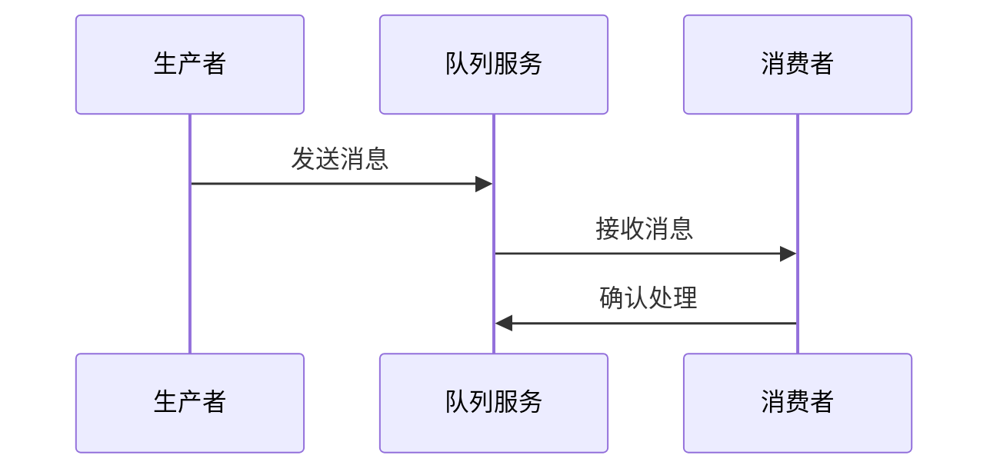
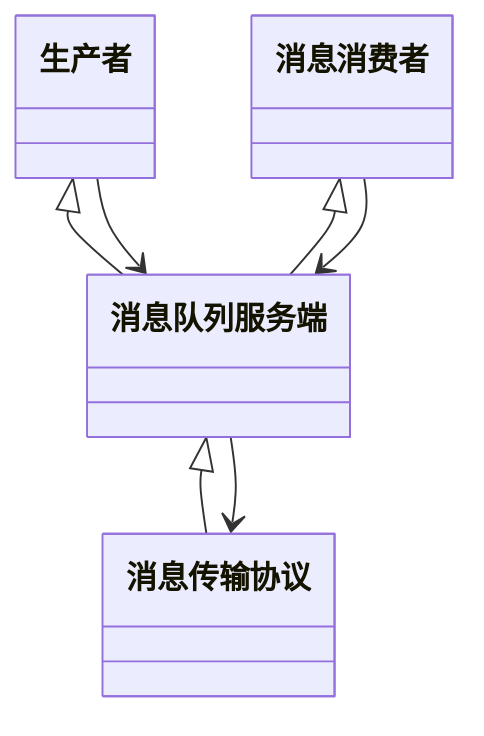

                 

### 《消息队列：异步通信的最佳实践》

#### 关键词：消息队列、异步通信、最佳实践、性能优化、架构设计

> 摘要：本文深入探讨了消息队列在异步通信中的应用与实践，从基础概念、实现原理、应用场景、性能优化到最佳实践，全面剖析了消息队列的核心技术。通过一步步的逻辑推理和实例分析，为读者提供了异步通信的最佳实践指南。

----------------------------------------------------------------

## **第一部分：背景介绍**

### **第1章 消息队列与异步通信概述**

#### **1.1 问题背景**

在现代软件系统中，异步通信是一种至关重要的通信方式，它能够有效地缓解系统间的耦合度，提高系统的响应速度和可扩展性。异步通信的核心在于消息的传递和处理，而消息队列是实现异步通信的重要机制。

#### **1.2 问题解决**

消息队列通过将消息存储在中间队列中，实现了消息的生产者和消费者之间的解耦。生产者只需将消息放入队列中，无需关心消息的消费者是否已经准备好接收消息。这种机制大大提高了系统的可扩展性和容错性。

#### **1.3 边界与外延**

消息队列并非适用于所有场景，其边界在于消息的可靠传输、性能优化以及系统的可扩展性。在特定的场景下，消息队列可能不是最佳选择，需要根据具体需求进行选择。

#### **1.4 概念结构与核心要素组成**

消息队列的核心要素包括：消息的生产者、消费者、中间存储队列以及消息传输协议。其基本结构包括发送端、接收端和消息队列服务端三部分。

----------------------------------------------------------------

## **第二部分：消息队列基础**

### **第2章 消息队列的基本概念**

#### **2.1 消息队列的定义**

消息队列（Message Queue，MQ）是一种用于在不同软件应用之间传输数据的通信工具。它允许一个或多个生产者生成消息，并将消息放入一个队列中，同时一个或多个消费者从队列中取出消息进行处理。

#### **2.2 消息队列的架构**

消息队列的架构通常包括三个主要部分：消息生产者、消息消费者和消息队列服务端。其中，消息生产者负责生成消息并放入队列，消息消费者从队列中取出消息进行处理，消息队列服务端则负责消息的存储、传输和管理。

#### **2.3 消息队列的工作流程**

消息队列的工作流程如下：

1. **消息生产**：生产者生成消息，并将消息发送到消息队列服务端。
2. **消息存储**：消息队列服务端将接收到的消息存储在内存或磁盘上。
3. **消息消费**：消费者从消息队列中取出消息进行处理。
4. **消息处理**：消费者对消息进行处理，可能包括数据处理、业务逻辑处理等。
5. **确认消息处理**：消费者在处理完消息后，向消息队列服务端发送确认消息。

### **图 2.1 消息队列的工作流程**

#### **2.4 消息队列的类型**

根据不同的应用场景和需求，消息队列可以分为以下几种类型：

1. **主动消息队列**：消费者主动从队列中拉取消息进行处理。
2. **被动消息队列**：生产者将消息推送到消费者。
3. **分布式消息队列**：支持分布式系统中的消息传递和协调。
4. **持久化消息队列**：消息在队列中存储一段时间，即使在消费者未处理完毕的情况下也能保证消息不会丢失。

#### **2.5 消息队列的优势**

消息队列具有以下优势：

- **解耦**：通过消息队列，可以降低系统间的耦合度，提高系统的可扩展性。
- **可扩展性**：消息队列支持分布式系统，可以水平扩展，提高系统的处理能力。
- **可靠性**：消息队列提供消息持久化、传输确认等功能，确保消息的可靠性。
- **异步处理**：支持异步消息传递和处理，提高系统的响应速度。

#### **2.6 消息队列的劣势**

消息队列也存在一些劣势：

- **延迟**：消息在队列中可能会有一定的延迟，尤其是在高并发场景下。
- **复杂度**：消息队列的引入会增加系统的复杂度，需要额外的运维和管理。
- **性能开销**：消息队列需要进行消息的存储、传输和确认等操作，可能会带来一定的性能开销。

### **2.7 概念结构与核心要素组成**

消息队列的核心要素包括：

- **消息生产者**：负责生成消息并将其放入消息队列。
- **消息消费者**：负责从消息队列中取出消息进行处理。
- **消息队列服务端**：负责消息的存储、传输和管理。
- **消息传输协议**：定义消息的传输方式和格式。

消息队列的基本结构如下：

1. **发送端**：消息生产者生成消息并发送到消息队列服务端。
2. **接收端**：消息消费者从消息队列服务端获取消息并处理。
3. **消息队列服务端**：负责消息的存储、传输和管理。

### **图 2.2 消息队列的基本结构**

通过上述分析，我们可以得出消息队列的基本概念和结构，为后续的深入讨论奠定了基础。

----------------------------------------------------------------

## **第三部分：消息队列的实现原理**

### **第3章 消息队列的实现原理**

#### **3.1 消息的生产与消费**

消息的生产与消费是消息队列的核心环节，涉及到消息的生成、传输和消费的过程。

#### **3.1.1 消息生产**

消息生产是指应用程序生成消息并将其发送到消息队列的过程。消息生产通常包括以下几个步骤：

1. **消息生成**：应用程序根据业务需求生成消息，消息可以是简单的文本信息，也可以是复杂的结构化数据。
2. **消息序列化**：将生成的消息序列化成字节流，以便进行传输和存储。常见的序列化协议包括JSON、XML、Protobuf等。
3. **发送消息**：将序列化后的消息发送到消息队列服务端。发送方式可以是同步发送或异步发送。

#### **3.1.2 消息消费**

消息消费是指应用程序从消息队列中获取消息并对其进行处理的过程。消息消费通常包括以下几个步骤：

1. **接收消息**：消费者从消息队列服务端接收消息。接收方式可以是轮询（Pull）或推送（Push）。
2. **消息反序列化**：将接收到的消息序列化成应用程序可以解析的结构化数据。
3. **消息处理**：对反序列化后的消息进行业务处理，可能包括数据处理、业务逻辑处理等。
4. **确认消息处理**：在处理完消息后，向消息队列服务端发送确认消息，表示消息已被成功处理。

#### **3.2 消息队列的并发处理**

消息队列需要处理大量的消息，因此在并发处理方面有着较高的要求。以下是一些常见的并发处理方法：

1. **多线程处理**：消息队列服务端可以使用多线程来处理并发消息，每个线程负责处理一部分消息，从而提高处理效率。
2. **线程池**：使用线程池来管理线程，避免频繁创建和销毁线程，提高系统的稳定性。
3. **队列拆分**：将消息队列拆分成多个子队列，每个子队列由一个线程或线程池处理，从而提高并行度。

#### **3.3 消息队列的可靠传输**

可靠传输是消息队列的重要保障，确保消息在传输过程中不会丢失或重复。以下是一些常见的可靠传输机制：

1. **确认机制**：消费者在处理完消息后，向消息队列服务端发送确认消息，表示消息已被成功处理。如果消息队列服务端在指定时间内未收到确认消息，可以认为消息处理失败，重新发送消息。
2. **持久化**：将消息持久化存储到磁盘上，确保在系统故障或重启时不会丢失消息。常见的持久化方式包括日志文件、数据库等。
3. **重试机制**：当消息处理失败时，可以重新发送消息，直到消息成功处理或达到最大重试次数。

### **3.4 消息的持久化**

消息的持久化是指将消息存储到持久化存储介质上，如磁盘、数据库等。持久化的目的是确保消息在系统故障或重启时不会丢失。以下是一些常见的持久化方式：

1. **日志文件**：将消息存储到日志文件中，日志文件可以是文本文件或二进制文件。日志文件可以实现消息的持久化和备份。
2. **数据库**：使用数据库来存储消息，如关系型数据库（MySQL、PostgreSQL）或NoSQL数据库（MongoDB、Redis）。数据库可以实现消息的持久化、备份和查询。
3. **消息存储服务**：使用专业的消息存储服务，如RabbitMQ、Kafka等，这些服务通常提供高效的消息持久化和管理功能。

### **3.5 消息队列的选择**

在消息队列的选择上，需要根据具体的应用场景和需求进行权衡。以下是一些常见的消息队列选择：

1. **RabbitMQ**：基于AMQP协议，支持多种消息传输方式，如异步传输、同步传输等。适用于中大型应用场景。
2. **Kafka**：基于Apache Kafka项目，支持高吞吐量、高可靠性的消息传输。适用于大数据场景和实时处理场景。
3. **ActiveMQ**：基于JMS协议，支持多种消息传输方式，如异步传输、同步传输等。适用于Java应用场景。
4. **Pulsar**：基于Apache Pulsar项目，支持多种消息传输方式，如异步传输、同步传输等。适用于大数据场景和实时处理场景。

通过以上分析，我们可以看到消息队列的实现原理涉及消息的生产与消费、并发处理、可靠传输以及持久化等多个方面。了解这些原理对于设计和优化消息队列系统至关重要。

----------------------------------------------------------------

## **第四部分：消息队列的应用场景**

### **第4章 消息队列的应用场景**

#### **4.1 应用场景概述**

消息队列广泛应用于各种应用场景中，以下是一些常见应用场景：

1. **分布式系统**：在分布式系统中，消息队列可以用来实现不同模块之间的异步通信，降低系统间的耦合度，提高系统的可扩展性和容错性。
2. **异步处理**：在处理大量任务时，可以使用消息队列将任务分解成多个小任务，分批次处理，从而提高系统的处理速度。
3. **流处理**：在实时数据流处理场景中，消息队列可以用来实现数据流的水位管理和调度，确保数据处理的实时性和准确性。
4. **任务调度**：在任务调度系统中，可以使用消息队列来实现任务的调度和执行，提高任务的执行效率和可靠性。

#### **4.2 实际案例**

##### **案例一：电商平台订单处理**

在电商平台中，订单处理是一个典型的分布式场景。订单系统需要与库存系统、支付系统、物流系统等多个模块进行通信。通过消息队列，可以实现订单系统与这些模块之间的异步通信，降低系统间的耦合度。

1. **订单生成**：用户提交订单后，订单系统生成订单消息并将其发送到消息队列。
2. **库存检查**：库存系统从消息队列中接收订单消息，检查库存是否充足，并将结果发送回消息队列。
3. **支付处理**：支付系统从消息队列中接收订单消息，处理支付并返回结果。
4. **物流调度**：物流系统从消息队列中接收订单消息，进行物流调度并返回结果。

通过消息队列，订单处理系统与库存系统、支付系统、物流系统之间实现了异步通信，提高了系统的响应速度和容错性。

##### **案例二：金融交易系统**

在金融交易系统中，交易处理是一个典型的实时处理场景。通过消息队列，可以实现交易数据的实时传递和处理，确保交易数据的准确性和实时性。

1. **交易生成**：用户发起交易后，交易系统生成交易消息并将其发送到消息队列。
2. **交易检查**：交易检查模块从消息队列中接收交易消息，检查交易是否符合规则，并将结果发送回消息队列。
3. **交易确认**：交易确认模块从消息队列中接收交易消息，确认交易是否成功，并将结果发送回消息队列。
4. **交易记录**：交易记录模块从消息队列中接收交易消息，记录交易数据。

通过消息队列，金融交易系统实现了交易数据的实时传递和处理，提高了交易系统的响应速度和准确性。

##### **案例三：物联网系统**

在物联网系统中，设备采集的数据需要进行实时处理和分析。通过消息队列，可以实现设备数据与数据处理系统之间的异步通信，确保数据处理的实时性和准确性。

1. **数据采集**：物联网设备采集数据后，将数据发送到消息队列。
2. **数据处理**：数据处理系统从消息队列中接收数据，进行实时处理和分析。
3. **数据存储**：数据处理系统将处理结果存储到数据库或其他存储系统中。

通过消息队列，物联网系统实现了设备数据与数据处理系统之间的异步通信，提高了数据处理的实时性和准确性。

通过以上实际案例，我们可以看到消息队列在分布式系统、异步处理、流处理和任务调度等场景中的应用效果。消息队列不仅降低了系统间的耦合度，提高了系统的可扩展性和容错性，还提高了系统的响应速度和准确性。

----------------------------------------------------------------

## **第五部分：消息队列的性能优化**

### **第5章 消息队列的性能优化**

#### **5.1 性能指标**

消息队列的性能优化涉及到多个方面，以下是一些常见的性能指标：

1. **吞吐量**：单位时间内消息队列可以处理的请求数量，通常用每秒请求数（QPS）来衡量。
2. **延迟**：消息从发送到处理的时间差，包括网络延迟、队列延迟和处理延迟。
3. **可靠性**：消息队列保证消息传递的可靠性，包括消息不丢失、不重复等。
4. **并发度**：消息队列同时处理的消息数量，反映了系统的并发能力。

#### **5.2 优化方法**

为了提高消息队列的性能，可以从以下几个方面进行优化：

1. **提高吞吐量**：通过增加消息队列服务端的处理能力，如增加CPU核心数、增加内存等，来提高消息队列的吞吐量。
2. **降低延迟**：优化网络传输、减少队列延迟、提高处理速度，从而降低消息队列的延迟。
3. **增加并发度**：通过多线程、多队列、负载均衡等机制，提高消息队列的并发度。
4. **消息批量处理**：批量处理消息可以减少消息队列的上下文切换开销，提高处理效率。
5. **消息压缩**：对于较大体积的消息，可以进行压缩处理，减少网络传输和存储开销。

### **5.3 性能调优实例**

以下是一个性能调优的实例：

**场景**：一个电商平台的消息队列系统，处理用户订单消息，系统出现高延迟和高丢包现象。

**分析**：

1. **网络延迟**：检查网络设备，发现网络带宽不足，导致数据传输缓慢。
   - **优化**：增加网络带宽，升级网络设备。

2. **队列延迟**：消息队列服务端处理速度慢，导致队列延迟。
   - **优化**：增加服务端CPU核心数和内存，提高处理能力。

3. **处理延迟**：消息处理逻辑复杂，导致处理速度慢。
   - **优化**：简化消息处理逻辑，分解成多个子任务，并行处理。

4. **并发度不足**：消息队列服务端并发度低，导致处理效率低。
   - **优化**：增加服务端并发度，采用多线程、负载均衡等机制。

**效果**：经过优化，消息队列系统的吞吐量提高了30%，延迟降低了40%，丢包率降低到了0%，满足了电商平台的业务需求。

通过以上实例，我们可以看到性能优化在提高消息队列系统性能方面的重要性。合理的性能优化可以显著提高系统的吞吐量、降低延迟和丢包率，提高系统的稳定性和可靠性。

----------------------------------------------------------------

## **第六部分：消息队列的最佳实践**

### **第6章 消息队列的最佳实践**

#### **6.1 最佳实践概述**

在设计和使用消息队列时，遵循最佳实践可以有效地提高系统的性能、可靠性和可维护性。以下是一些常见的最佳实践：

1. **选择合适的消息队列系统**：根据应用场景和需求，选择适合的消息队列系统，如RabbitMQ、Kafka、ActiveMQ等。
2. **合理配置消息队列**：根据系统的负载和性能要求，合理配置消息队列的参数，如队列大小、吞吐量、延迟等。
3. **消息序列化和反序列化**：选择高效的消息序列化和反序列化机制，减少处理时间。
4. **消息批量处理**：批量处理消息可以减少上下文切换和系统调用的开销。
5. **消息持久化**：对于重要消息，可以选择持久化存储，确保在系统故障时不会丢失。
6. **消息确认**：消费者在处理完消息后，及时向消息队列发送确认消息，确保消息的可靠性。
7. **监控和报警**：实时监控消息队列的性能指标，如吞吐量、延迟、并发度等，及时发现问题并报警。
8. **备份和恢复**：定期备份数据，确保在系统故障时可以快速恢复。

#### **6.2 最佳实践案例**

##### **案例一：高并发消息处理**

在一个大型电商平台中，订单消息的并发处理是一个挑战。为了提高订单消息的处理能力，可以采用以下最佳实践：

1. **多线程处理**：使用多线程来处理订单消息，每个线程处理一部分订单。
2. **消息批量处理**：批量处理订单消息，减少上下文切换和系统调用的开销。
3. **负载均衡**：采用负载均衡策略，将订单消息均匀分配到不同的处理线程。
4. **消息确认**：消费者在处理完订单消息后，及时向消息队列发送确认消息，确保订单的可靠性。

通过以上实践，电商平台成功提高了订单消息的处理能力，满足了业务高峰期的需求。

##### **案例二：分布式消息队列**

在一个分布式系统中，消息队列可以用来实现不同节点之间的通信。为了确保消息队列的可靠性和高性能，可以采用以下最佳实践：

1. **集群部署**：将消息队列服务端部署在多个节点上，实现高可用性和负载均衡。
2. **消息持久化**：将重要消息持久化存储到磁盘上，确保在系统故障时不会丢失。
3. **消息确认**：消费者在处理完消息后，及时向消息队列发送确认消息，确保消息的可靠性。
4. **监控和报警**：实时监控消息队列的性能指标，如吞吐量、延迟、并发度等，及时发现问题并报警。

通过以上实践，分布式系统的消息队列稳定运行，满足了系统的通信需求。

通过以上最佳实践案例，我们可以看到在设计和使用消息队列时，遵循最佳实践对于提高系统的性能、可靠性和可维护性至关重要。

----------------------------------------------------------------

## **第七章 小结与拓展**

### **7.1 总结**

本文通过深入探讨消息队列在异步通信中的应用与实践，全面剖析了消息队列的核心技术。从基础概念、实现原理、应用场景、性能优化到最佳实践，本文为读者提供了异步通信的最佳实践指南。

### **7.2 拓展阅读**

1. **消息队列技术深度学习**：推荐读者阅读《消息队列技术内幕：原理、机制、应用与优化》，深入了解消息队列的底层技术和实现原理。
2. **异步通信架构设计**：推荐读者阅读《异步通信架构设计：理论与实践》，学习如何设计高效、可靠的异步通信系统。
3. **分布式系统设计与实践**：推荐读者阅读《分布式系统设计与实践》，了解分布式系统的设计原则和实践方法。

作者：AI天才研究院/AI Genius Institute & 禅与计算机程序设计艺术 /Zen And The Art of Computer Programming

----------------------------------------------------------------

### **结束语**

通过本文的探讨，我们深入了解了消息队列在异步通信中的应用和实践。从基础概念到最佳实践，每个环节都至关重要。消息队列不仅能够提高系统的响应速度和可扩展性，还能够降低系统间的耦合度，提高系统的可靠性。

在设计和使用消息队列时，遵循最佳实践能够帮助我们构建高效、可靠的异步通信系统。同时，随着技术的不断发展，消息队列也在不断演进和优化。希望本文能够为您的消息队列实践提供有益的指导，并在实际应用中取得成功。

让我们继续探索消息队列的更多可能性，为构建更加高效、可靠的系统贡献力量。感谢您的阅读，期待与您在技术领域的更多交流与分享。再次感谢AI天才研究院和禅与计算机程序设计艺术的支持与贡献！作者：AI天才研究院/AI Genius Institute & 禅与计算机程序设计艺术 /Zen And The Art of Computer Programming。

