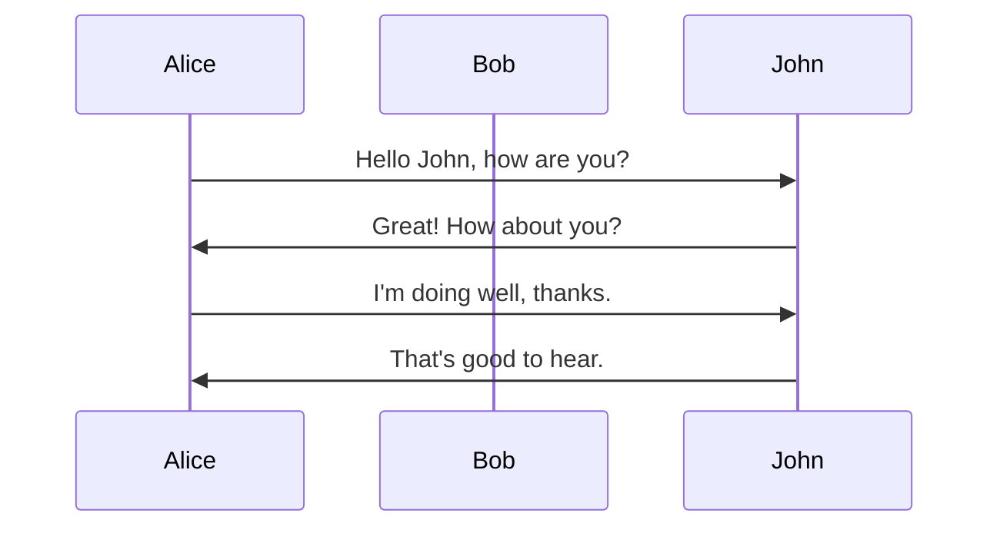
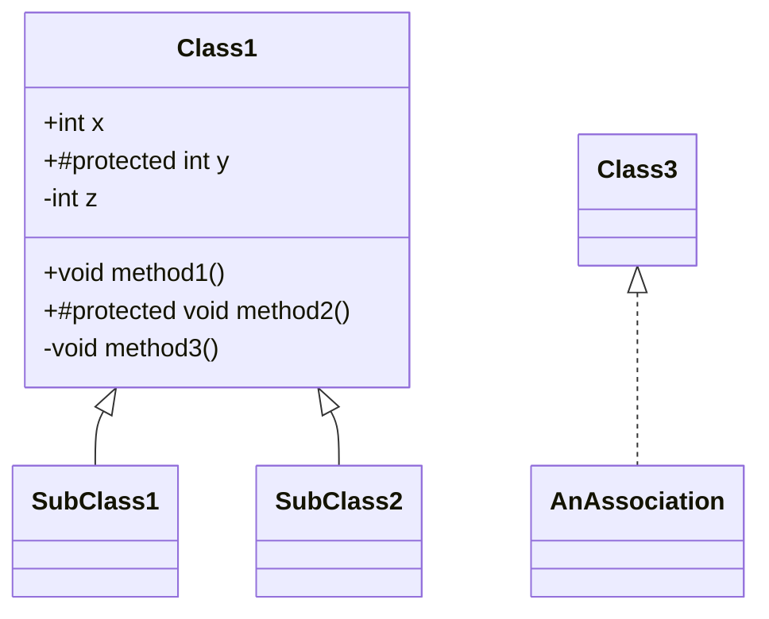

                 


### 引言

分布式事务作为现代分布式系统中的核心概念，已经日益成为软件开发领域的关键技术之一。在传统的单体应用中，事务是由单一数据库管理系统（DBMS）进行管理和协调的，而随着云计算和微服务架构的兴起，分布式事务的需求变得愈发迫切。分布式事务不仅涉及数据的读写操作，还包括了复杂的数据一致性和完整性保障问题。

本文旨在通过深入分析分布式事务的原理，帮助读者全面了解分布式事务的概念、挑战、解决方案、实现技术以及实际应用。文章结构如下：

1. **基本概念**：介绍分布式系统和事务的基本概念，帮助读者建立分布式事务的基本认知。
2. **挑战**：探讨分布式事务面临的数据一致性问题、复杂性和性能问题。
3. **解决方案**：分析现有的分布式事务解决方案，包括数据库事务管理、两阶段提交协议、三阶段提交协议等。
4. **实现技术**：深入探讨分布式锁机制、乐观锁与悲观锁等技术，以及事务监控与审计的方法。
5. **实际应用**：分析分布式事务在微服务架构、大数据应用中的挑战和应对策略，并给出实际案例分析。
6. **最佳实践**：总结分布式事务设计、性能优化和安全性保障的最佳实践。
7. **总结与展望**：展望分布式事务的未来发展方向，提醒读者关注的关键领域。

通过本文的阅读，读者将能够系统地掌握分布式事务的核心知识，并在实践中更好地应用这些知识，为构建高性能、高可用的分布式系统打下坚实的基础。

### 关键词

- 分布式事务
- 数据一致性
- 两阶段提交协议
- 三阶段提交协议
- 锁机制
- 微服务架构
- 大数据应用

### 摘要

本文从分布式事务的基本概念入手，详细分析了分布式事务面临的数据一致性问题、复杂性和性能挑战。通过探讨现有的分布式事务解决方案，如数据库事务管理、两阶段提交协议和三阶段提交协议，以及深入探讨分布式锁机制和乐观锁与悲观锁等技术，本文为读者提供了全面而系统的分布式事务知识。此外，文章还通过实际应用案例分析，总结了分布式事务的最佳实践，并展望了分布式事务的未来发展方向，为读者在分布式系统开发中提供了有益的指导。

## 目录

----------------------------------------------------------------

1. **引言**

   - 分布式事务的背景
   - 文章结构概述

2. **基本概念**

   - 分布式系统
   - 事务
   - 分布式事务

3. **分布式事务的挑战**

   - 数据一致性问题
   - 分布式事务的复杂性
   - 分布式事务的性能问题

4. **分布式事务解决方案**

   - 数据库事务管理
   - 两阶段提交协议
   - 三阶段提交协议
   - 其他分布式事务解决方案

5. **分布式事务实现技术**

   - 分布式锁机制
   - 乐观锁与悲观锁
   - 事务监控与审计

6. **分布式事务在实际应用中的挑战与应对**

   - 微服务架构中的分布式事务
   - 大数据应用中的分布式事务
   - 实际案例分析与解决

7. **分布式事务的最佳实践**

   - 设计分布式事务的策略
   - 分布式事务的性能优化
   - 分布式事务的安全性保障

8. **总结与展望**

   - 当前分布式事务趋势
   - 未来发展方向
   - 读者关注的领域

----------------------------------------------------------------

### 分布式系统

分布式系统是由多个相互独立的计算机节点组成的，这些节点通过网络进行通信和协作，共同完成一个复杂的计算任务。与传统的集中式系统相比，分布式系统具有以下几个显著特点：

1. **节点自治性**：每个节点都可以独立运行程序，具有自己的内存、处理器和存储设备。节点之间通过网络进行通信，但每个节点在逻辑上仍然是独立的，不会因为其他节点的故障而停止工作。

2. **容错性**：分布式系统具有更高的容错性。当一个节点发生故障时，其他节点可以继续工作，整个系统不会因此停止。这种容错性提高了系统的可靠性和可用性。

3. **可扩展性**：分布式系统可以通过增加节点数量来水平扩展。当系统的负载增加时，可以动态地添加新的节点，从而提高系统的处理能力。

4. **分布式计算**：分布式系统可以将一个复杂的计算任务分解成多个子任务，分布在不同的节点上并行执行。这不仅提高了计算效率，还可以处理更大的数据集。

然而，分布式系统也带来了新的挑战。首先，分布式系统的复杂性增加，节点之间的通信和协调变得更加复杂。其次，分布式系统需要解决数据一致性问题，确保多个节点上的数据保持一致。此外，分布式系统的性能优化和故障恢复也是需要重点关注的问题。

为了实现分布式系统，常用的技术包括消息队列、分布式数据库和负载均衡等。这些技术可以在不同的层面上提高系统的性能和可靠性。

1. **消息队列**：消息队列是一种异步通信机制，可以用于分布式系统中的任务调度和节点间通信。通过消息队列，可以将任务消息传递给不同的处理节点，从而实现任务的分布式处理。

2. **分布式数据库**：分布式数据库可以将数据存储在多个节点上，从而提高数据访问速度和系统的容错能力。常见的分布式数据库技术包括Sharding（分片技术）、Replication（复制技术）等。

3. **负载均衡**：负载均衡可以将请求分布到多个节点上，从而提高系统的处理能力和响应速度。负载均衡器可以根据节点的负载情况动态地调整请求分配策略，确保系统的高可用性。

总之，分布式系统虽然带来了新的挑战，但同时也提供了更高的性能、可靠性和可扩展性。理解分布式系统的基本概念和原理，是掌握分布式事务的关键基础。

### 事务

在数据库管理系统中，事务是一个重要的概念，它定义了一系列数据库操作的逻辑单元。事务确保了数据库的一致性和完整性，是数据库操作的核心保障。以下是事务的基本概念和特性：

**基本概念**：
- **事务**：事务是一个逻辑工作单元，它包含了多个数据库操作（如插入、更新、删除等）。这些操作要么全部执行，要么全部不执行，不能只执行其中的一部分。
- **ACID**：ACID（原子性、一致性、隔离性、持久性）是事务的四个基本特性，它们确保了事务的正确执行和数据的安全性。

1. **原子性（Atomicity）**：原子性确保事务的所有操作要么全部执行，要么全部不执行。如果事务中的任何一个操作失败，整个事务都会回滚，数据库的状态不会发生任何改变。

2. **一致性（Consistency）**：一致性确保事务执行前后的数据库状态保持一致。事务必须将数据库从一个有效状态转换为另一个有效状态。

3. **隔离性（Isolation）**：隔离性确保并发执行的事务不会互相干扰。每个事务在执行过程中，都仿佛是独占数据库资源，其他事务无法看到其未提交的中间状态。

4. **持久性（Durability）**：持久性确保一旦事务提交，其结果就会被永久保存，即使系统发生故障，也不会丢失。

**事务生命周期**：
- **开始（Begin）**：事务的开始标记了事务的起点，所有后续的操作都会被视为事务的一部分。
- **执行（Execution）**：在执行阶段，事务包含了多个数据库操作，这些操作可以是插入、更新、删除等。
- **提交（Commit）**：提交阶段将事务的修改永久保存到数据库中，事务执行完成。
- **回滚（Rollback）**：如果事务在执行过程中出现错误，回滚阶段会将数据库恢复到事务开始前的状态，确保数据库的一致性。

**事务控制**：
- **事务管理器**：事务管理器（Transaction Manager）负责协调和管理事务的执行。常见的数据库管理系统中，事务管理器通过事务日志来记录事务的操作，并实现事务的原子性、一致性和持久性。
- **自动提交**：在某些数据库系统中，可以通过设置自动提交（Auto Commit）来简化事务管理。在这种情况下，每个单独的数据库操作都会自动提交，而不是作为事务的一部分。

事务是数据库操作的基础，确保了数据库的稳定性和可靠性。理解事务的基本概念和特性，是构建稳定、可靠的分布式系统的关键。

### 分布式事务

分布式事务是事务在分布式系统中的扩展，它涉及多个数据库节点上的操作，这些操作需要保持一致性和完整性。与单一数据库系统中的事务相比，分布式事务面临更多的挑战，例如数据一致性和协调问题。以下是分布式事务的定义、特性以及与传统事务的区别：

**定义**：
- **分布式事务**：分布式事务是指在一个分布式系统中，涉及多个数据库节点或资源的事务。这些节点可能位于不同的物理位置，通过网络进行通信和协作。

**特性**：
1. **跨节点操作**：分布式事务涉及到多个数据库节点上的操作。这些操作可以是读写数据库、访问外部资源等。
2. **一致性要求**：分布式事务需要确保在所有参与节点上的数据保持一致，即所有节点上的数据修改要么全部成功，要么全部失败。
3. **协调与同步**：分布式事务需要协调多个节点的操作，确保事务的执行顺序和一致性。

**与传统事务的区别**：
1. **节点数量**：传统事务通常涉及单个数据库或资源，而分布式事务则可能涉及多个数据库节点或资源。
2. **数据一致性**：分布式事务需要解决跨节点数据一致性问题，而传统事务通常只需确保单个数据库中的数据一致性。
3. **复杂性**：分布式事务的复杂性更高，需要处理网络延迟、节点故障等问题，而传统事务的复杂性相对较低。

**挑战**：
1. **数据一致性**：分布式事务需要确保跨节点数据的一致性，这比单一数据库系统中的数据一致性更复杂。常见的数据一致性问题包括数据丢失、数据不一致等。
2. **协调与同步**：分布式事务需要协调多个节点的操作，确保事务的执行顺序和一致性。这涉及到复杂的协调算法和同步机制。
3. **性能问题**：分布式事务通常涉及更多的网络通信和协调操作，可能导致性能问题。如何优化分布式事务的性能是一个重要挑战。

**类型**：
1. **全局事务**：全局事务涉及多个数据库节点，这些节点共同参与事务的执行和协调。全局事务通常需要一个分布式事务管理器来协调节点之间的操作。
2. **本地事务**：本地事务仅涉及单个数据库节点，但可能与其他节点进行通信以获取必要的数据。本地事务通常由本地事务管理器管理。

分布式事务是现代分布式系统中的核心概念，它解决了跨节点数据一致性和协调问题，为分布式系统提供了可靠的数据操作机制。理解分布式事务的定义、特性和挑战，对于开发高效、可靠的分布式系统至关重要。

### 分布式事务的挑战

分布式事务在提供了灵活性和扩展性的同时，也引入了一系列复杂的挑战。以下是分布式事务面临的主要挑战，包括数据一致性、复杂性和性能问题。

#### 数据一致性

分布式事务最核心的挑战之一就是数据一致性。由于分布式系统中的多个节点可能位于不同的地理位置，通过网络进行通信，因此数据的一致性问题变得尤为复杂。

1. **数据丢失**：在分布式事务中，如果某个节点发生故障，事务操作可能会丢失，从而导致数据不一致。例如，如果一个事务在多个节点上执行，其中一个节点的操作成功提交，而另一个节点的操作失败或数据丢失，最终导致数据不一致。

2. **数据不一致**：由于网络延迟、节点故障等原因，分布式事务可能会遇到数据不一致的情况。例如，假设有一个事务需要在两个节点上分别更新两个表，但其中一个节点的更新操作成功提交，而另一个节点的更新操作失败，这会导致最终数据不一致。

3. **一致性问题解决方案**：为了解决数据一致性挑战，分布式系统通常采用一系列一致性协议和机制，如两阶段提交（2PC）、三阶段提交（3PC）和最终一致性等。

#### 复杂性

分布式事务的复杂性远高于传统单机事务。分布式系统中的多个节点需要协调工作，确保事务的原子性、一致性和隔离性。以下是一些复杂性方面：

1. **协调与同步**：分布式事务需要协调多个节点的操作，确保事务的执行顺序和一致性。这涉及到复杂的协调算法和同步机制，如两阶段提交协议和三阶段提交协议。

2. **故障处理**：在分布式系统中，节点故障是常见的问题。分布式事务需要能够处理节点故障，确保事务的最终一致性。这通常需要实现故障检测、故障恢复和事务重试机制。

3. **分布式锁管理**：分布式事务通常需要使用分布式锁来保证数据的一致性。分布式锁管理涉及到复杂的锁分配和冲突解决机制，以确保并发操作的正确性和一致性。

#### 性能问题

分布式事务的另一个挑战是性能问题。由于分布式事务涉及多个节点的通信和协调操作，可能带来以下性能问题：

1. **网络延迟**：分布式系统中的节点可能位于不同的地理位置，网络延迟可能会影响事务的执行速度。长距离通信会导致事务处理时间增加，降低系统的性能。

2. **锁竞争**：分布式事务中的锁机制可能会导致锁竞争，特别是在高并发环境下。锁竞争会导致事务长时间等待锁释放，降低系统的吞吐量。

3. **事务协调开销**：分布式事务需要协调多个节点的操作，这通常需要大量的通信和协调开销。这些开销可能会降低系统的整体性能。

为了解决这些性能问题，分布式系统通常采用以下策略：

- **优化网络通信**：通过优化网络通信协议和算法，减少通信延迟和数据传输开销，如采用二进制协议和压缩技术。
- **分布式锁优化**：采用分布式锁优化技术，如乐观锁和悲观锁，减少锁竞争和等待时间，提高系统的并发性和性能。
- **负载均衡**：通过负载均衡技术，将请求分布到多个节点上，提高系统的处理能力和响应速度。

总之，分布式事务虽然带来了数据一致性和协调问题，但也为系统提供了更高的性能和可扩展性。理解分布式事务的挑战，并采取适当的解决方案，是构建高效、可靠的分布式系统的关键。

### 数据一致性问题

在分布式系统中，数据一致性是一个至关重要的挑战。分布式事务涉及到多个节点之间的协调，为了确保这些操作的结果一致，必须解决以下常见的数据一致性问题：

1. **数据丢失**：在分布式事务中，数据丢失是一个常见且严重的问题。如果某个节点发生故障，事务操作可能会丢失，导致数据不一致。例如，假设有一个事务需要在两个节点上更新数据，其中一个节点的更新成功提交，而另一个节点的更新操作失败或数据丢失，最终导致数据不一致。

   **解决方法**：
   - **冗余复制**：通过在多个节点上复制数据，可以提高数据的冗余度，从而降低数据丢失的风险。例如，采用多主复制（Multi-Master Replication）或主从复制（Master-Slave Replication）技术。
   - **数据备份**：定期备份数据，以便在发生数据丢失时能够进行恢复。

2. **数据不一致**：由于网络延迟、节点故障等原因，分布式事务可能会遇到数据不一致的情况。例如，假设有一个事务需要在两个节点上分别更新两个表，但其中一个节点的更新操作成功提交，而另一个节点的更新操作失败，这会导致最终数据不一致。

   **解决方法**：
   - **分布式事务协议**：采用分布式事务协议，如两阶段提交（2PC）和三阶段提交（3PC），可以确保分布式事务的一致性。这些协议通过协调多个节点的操作，确保事务的原子性和一致性。
   - **最终一致性**：最终一致性（Eventual Consistency）是一种数据一致性模型，允许系统在短时间内不一致，但最终会达到一致状态。通过采用最终一致性模型，可以容忍一定程度的延迟和数据不一致，从而提高系统的可用性和性能。

3. **数据冲突**：在多用户并发操作的情况下，分布式事务可能会遇到数据冲突。例如，用户A更新一个数据项，同时用户B也在更新同一个数据项，如果这两个更新操作的顺序无法保证，可能会导致数据冲突。

   **解决方法**：
   - **版本控制**：通过在数据项上添加版本号，可以确保多个并发更新操作的顺序。例如，使用向量时钟（Vector Clock）或版本向量（Version Vector）来记录每个更新的版本号，从而解决数据冲突。
   - **乐观锁**：乐观锁是一种基于假设并发操作不会冲突的锁机制。在更新数据之前，乐观锁会检查数据项的版本号或状态，确保没有其他并发更新发生。如果发生冲突，乐观锁会回滚操作并重新尝试。

4. **分布式事务隔离问题**：在分布式事务中，隔离性问题可能导致多个事务之间的操作互相干扰，导致数据不一致。例如，一个事务读取了另一个事务未提交的数据，可能会导致数据不一致。

   **解决方法**：
   - **隔离级别**：通过设置适当的隔离级别（如读未提交、读已提交、可重复读、序列化），可以确保分布式事务之间的隔离性。较高的隔离级别可以提供更好的数据一致性，但可能会降低系统的性能。
   - **分布式锁机制**：通过使用分布式锁机制（如分布式锁服务、基于Zookeeper的锁机制等），可以确保分布式事务之间的互斥操作，从而解决隔离问题。

总之，解决分布式事务的数据一致性问题需要综合运用多种技术和策略。通过冗余复制、分布式事务协议、版本控制、乐观锁和隔离级别等技术，可以有效地提高分布式系统的数据一致性和可靠性。

### 分布式事务的复杂性

分布式事务的复杂性远高于单机事务，主要体现在以下几个方面：

1. **节点协调与同步**：分布式事务需要协调多个节点的操作，以确保事务的一致性和完整性。节点之间的通信和同步机制复杂，需要处理网络延迟、消息丢失和节点故障等问题。例如，两阶段提交（2PC）和三阶段提交（3PC）协议就是用于解决分布式事务协调问题的经典协议。

2. **故障处理与恢复**：在分布式系统中，节点故障是常见且难以避免的。分布式事务需要能够处理节点故障，确保事务的最终一致性。故障处理和恢复机制复杂，需要实现故障检测、故障恢复和事务重试等策略。

3. **分布式锁管理**：分布式事务通常需要使用分布式锁来保证数据的一致性。分布式锁管理涉及到复杂的锁分配和冲突解决机制，以确保并发操作的正确性和一致性。例如，基于Zookeeper的分布式锁服务和基于Redis的分布式锁服务等。

4. **数据一致性与隔离性问题**：分布式事务需要解决数据一致性和隔离性问题，确保事务的原子性、一致性和隔离性。这与单机事务相比更加复杂，需要设计合适的分布式一致性协议和隔离级别，如两阶段提交（2PC）、三阶段提交（3PC）和最终一致性等。

5. **性能优化与可扩展性**：分布式事务涉及到多个节点的通信和协调操作，可能导致性能问题。如何优化分布式事务的性能和可扩展性是一个重要挑战，需要采用分布式锁优化、负载均衡、网络通信优化等技术。

综上所述，分布式事务的复杂性主要体现在节点协调与同步、故障处理与恢复、分布式锁管理、数据一致性与隔离性问题以及性能优化与可扩展性等方面。理解这些复杂性，并采取适当的解决方案，是构建高效、可靠的分布式系统的关键。

### 分布式事务解决方案

面对分布式事务的复杂性和挑战，业界提出了多种解决方案，旨在确保分布式系统中的数据一致性和事务完整性。以下是几种主要的分布式事务解决方案，包括数据库事务管理、两阶段提交协议、三阶段提交协议以及其他解决方案。

#### 数据库事务管理

数据库事务管理是分布式事务的基础。它通过事务日志、锁机制等手段，确保事务的原子性、一致性和隔离性。

1. **事务日志**：事务日志是一种重要的机制，用于记录事务的所有操作。在分布式系统中，事务日志可以确保事务的可恢复性。如果事务失败，可以通过回滚日志来撤销事务操作，恢复数据库的一致性。

2. **锁机制**：锁机制用于控制并发访问，确保事务的隔离性。分布式锁机制（如分布式锁服务、基于Zookeeper的锁机制等）可以在多个节点上协调锁操作，从而确保事务的一致性。

3. **两段锁协议**：两段锁协议是一种常用的分布式锁机制，它将事务的执行分为两个阶段：增长阶段和缩减阶段。在增长阶段，事务可以申请锁，但在缩减阶段，事务不能申请锁。这种协议可以避免锁冲突，提高事务的并发性。

#### 两阶段提交协议（2PC）

两阶段提交（Two-Phase Commit，2PC）协议是一种经典的分布式事务协调协议，用于确保分布式系统中多个节点的事务一致性。

1. **阶段一：预备阶段**：协调者（Coordinator）向所有参与者（Participant）发送预备请求，参与者检查是否能够执行事务。如果参与者可以执行事务，它返回“可以提交”的消息；否则返回“无法提交”的消息。

2. **阶段二：提交阶段**：协调者根据参与者的响应决定是否提交事务。如果所有参与者都返回“可以提交”的消息，协调者向所有参与者发送“提交”命令；否则发送“回滚”命令。

2PC协议的优点是简单、可靠，但缺点是可能会导致单点故障和性能瓶颈。

#### 三阶段提交协议（3PC）

三阶段提交（Three-Phase Commit，3PC）协议是对2PC协议的改进，旨在解决单点故障和性能问题。

1. **阶段一：预备阶段**：与2PC的预备阶段类似，协调者向所有参与者发送预备请求。

2. **阶段二：决定阶段**：协调者根据参与者的响应决定是否提交事务。如果所有参与者都返回“可以提交”的消息，协调者进入提交阶段；否则进入回滚阶段。

3. **阶段三：提交/回滚阶段**：
   - **提交阶段**：协调者向所有参与者发送“提交”命令，参与者执行事务并返回“提交完成”消息。
   - **回滚阶段**：协调者向所有参与者发送“回滚”命令，参与者撤销事务并返回“回滚完成”消息。

3PC协议通过引入决定阶段，降低了单点故障的风险，并优化了性能。

#### 其他分布式事务解决方案

除了2PC和3PC协议，还有其他一些分布式事务解决方案，如最终一致性模型、补偿事务和分布式锁机制。

1. **最终一致性模型**：最终一致性模型允许系统在短时间内不一致，但最终会达到一致状态。这种模型适合对一致性要求不高的场景，如消息队列和缓存系统。

2. **补偿事务**：补偿事务是一种在分布式事务失败时，通过执行补偿操作来恢复系统状态的方法。补偿事务可以确保系统最终达到一致性状态。

3. **分布式锁机制**：分布式锁机制用于协调分布式系统中的并发操作，确保事务的一致性和隔离性。常见的分布式锁机制包括基于Zookeeper的锁服务和基于Redis的锁服务。

总之，分布式事务解决方案多样，各有优缺点。选择合适的解决方案，需要根据具体场景和需求进行权衡。通过合理的设计和优化，可以构建高效、可靠的分布式事务系统。

### 分布式事务实现技术

实现分布式事务的核心在于确保事务的原子性、一致性、隔离性和持久性（ACID特性）。以下是几种常用的分布式事务实现技术，包括分布式锁机制、乐观锁与悲观锁，以及事务监控与审计。

#### 分布式锁机制

分布式锁机制是确保分布式系统中并发操作一致性的关键技术。分布式锁用于在多个节点上同步操作，防止同时访问共享资源。

1. **基于数据库的分布式锁**：
   - **表锁**：通过在数据库表中添加锁记录，确保同一时间只有一个节点能访问共享资源。
   - **行锁**：通过在数据库行级别上添加锁，限制并发访问。

2. **基于ZooKeeper的分布式锁**：
   - **ZooKeeper**是一种分布式协调服务，提供分布式锁机制。通过在ZooKeeper上创建和监控临时节点，实现分布式锁的互斥和并发控制。

3. **基于Redis的分布式锁**：
   - **Redis**是一种高性能的分布式缓存系统，提供分布式锁功能。通过使用Redis的SETNX命令，可以确保同一时间只有一个节点获得锁。

#### 乐观锁与悲观锁

乐观锁和悲观锁是两种常见的并发控制机制，用于解决分布式系统中的并发访问问题。

1. **乐观锁**：
   - **基本原理**：乐观锁假设并发冲突不会频繁发生，事务在开始时不会加锁，而是在提交时检查数据版本或状态。如果发现冲突（如数据已被修改），则回滚事务并重新尝试。
   - **实现方法**：通过在数据项上添加版本号或时间戳，确保事务之间的版本一致性。常用的乐观锁实现方法包括最后版本胜出（Last Write Wins）和基于时间戳的版本控制。

2. **悲观锁**：
   - **基本原理**：悲观锁假设并发冲突很频繁，事务在开始时就会加锁，确保数据的一致性。在锁机制下，多个事务不能同时访问共享资源，从而避免冲突。
   - **实现方法**：通过在数据库或分布式锁服务上添加共享锁或排他锁，控制并发访问。常见的悲观锁实现方法包括行级锁、表级锁和分布式锁。

#### 事务监控与审计

事务监控与审计是确保分布式事务正确执行和有效管理的重要手段。

1. **日志记录**：
   - **事务日志**：记录事务的所有操作，包括开始、执行、提交和回滚等状态。通过事务日志，可以恢复失败的事务和恢复系统状态。
   - **操作日志**：记录每个数据库操作的详细信息，包括操作类型、操作时间和影响的数据行等。操作日志有助于追踪和审计事务的执行过程。

2. **监控工具**：
   - **分布式监控系统**：如Prometheus、Grafana等，可以实时监控分布式系统的性能和健康状况，包括事务的处理速度、延迟和错误率等。
   - **审计日志**：记录系统的审计信息，包括用户的操作记录、系统的变更记录等。审计日志有助于跟踪系统操作和维护系统的安全性。

3. **报警与通知**：
   - **报警系统**：通过设置阈值和监控指标，当系统性能或健康状态低于预期时，自动发送报警通知。报警系统可以及时发现问题并进行处理。
   - **通知系统**：通过短信、邮件、微信等方式，将报警通知发送给相关人员，确保问题能够及时得到解决。

总之，分布式事务的实现技术包括分布式锁机制、乐观锁与悲观锁，以及事务监控与审计等多种手段。通过合理设计和应用这些技术，可以构建高效、可靠的分布式事务系统，确保数据的一致性和系统的稳定性。

### 分布式事务在实际应用中的挑战与应对

在实际应用中，分布式事务面临着多种挑战，这些挑战在不同场景下有不同的应对策略。以下分析分布式事务在微服务架构和大数据应用中的挑战与应对策略，并通过实际案例进行剖析。

#### 微服务架构中的分布式事务

微服务架构是一种将应用程序拆分为多个小型、独立服务的架构风格。在这种架构中，每个服务都可以独立部署和扩展，但同时也带来了分布式事务的挑战。

1. **数据一致性问题**：在微服务架构中，服务之间通过网络进行通信，事务涉及到多个服务的操作，数据一致性变得尤为关键。例如，一个支付流程可能涉及到订单服务、库存服务和支付服务，如何确保这些服务的操作要么全部成功，要么全部失败？

   **应对策略**：
   - **本地事务与全局事务**：本地事务（Local Transaction）是指在单个服务内部进行的事务，全局事务（Global Transaction）则涉及到多个服务的协调。在微服务架构中，通常优先使用本地事务，只在必要时使用全局事务。例如，可以使用本地事务处理订单服务中的操作，然后通过消息队列触发全局事务，处理库存服务和支付服务的操作。
   - **分布式事务框架**：使用分布式事务框架（如Seata、TCC等），可以简化分布式事务的管理。这些框架提供了两阶段提交（2PC）和三阶段提交（3PC）等协议，确保跨服务的操作一致性和完整性。

2. **性能与可用性问题**：分布式事务涉及到多个服务的协调，可能导致性能下降和可用性降低。如何优化分布式事务的性能和确保系统的可用性？

   **应对策略**：
   - **异步化**：通过将一些操作异步化，可以减少同步协调的开销，提高系统的性能和可用性。例如，可以使用消息队列将事务操作分解成多个独立的任务，异步处理。
   - **最终一致性模型**：最终一致性模型允许系统在短时间内不一致，但最终会达到一致状态。这种模型可以容忍一定的延迟和数据不一致，从而提高系统的性能和可用性。

#### 大数据应用中的分布式事务

在大数据应用中，分布式事务通常涉及到海量数据的处理和存储。大数据场景中的分布式事务挑战包括数据一致性问题、系统复杂性以及性能要求等。

1. **数据一致性问题**：在大数据应用中，数据的一致性问题尤为突出。例如，一个数据仓库中的数据更新可能涉及到多个数据源，如何确保这些数据源的一致性？

   **应对策略**：
   - **数据同步机制**：通过实现数据同步机制，确保不同数据源之间的数据一致性。例如，可以使用分布式消息队列（如Kafka）进行数据同步，确保数据在不同系统间的一致性。
   - **分布式数据库**：使用分布式数据库（如HBase、Cassandra）可以处理海量数据，并保证数据的一致性。这些数据库提供了分布式锁机制和一致性保障，从而简化分布式事务的管理。

2. **系统复杂性**：大数据应用中的分布式事务通常涉及复杂的系统架构和组件。如何管理和维护这些分布式事务系统？

   **应对策略**：
   - **服务化**：将分布式事务系统拆分为多个服务，每个服务负责一部分事务处理。通过服务化架构，可以降低系统的复杂性，提高系统的可维护性和可扩展性。
   - **微服务架构**：采用微服务架构，将大数据应用拆分为多个小型、独立的服务，每个服务负责一部分数据处理。这种架构可以提高系统的灵活性和可扩展性，简化分布式事务的管理。

#### 实际案例分析

以下是一个关于分布式事务在电子商务平台中的应用案例：

**背景**：一个电子商务平台需要在支付、订单和库存服务之间进行分布式事务处理。支付服务处理用户的支付操作，订单服务处理订单的创建和更新，库存服务处理库存的调整。

**问题**：如何确保在用户支付成功后，订单和库存状态能够正确更新，同时处理可能的网络故障和系统故障？

**解决方案**：
- **本地事务**：在支付服务中，使用本地事务处理支付操作。这样，在支付服务内部，事务要么全部成功提交，要么全部回滚。
- **消息队列**：使用消息队列（如Kafka）将支付服务的操作传递给订单服务和库存服务。支付服务在提交支付操作后，发送一个消息到消息队列，通知订单服务和库存服务进行相应的更新操作。
- **分布式锁**：在订单服务和库存服务中使用分布式锁（如基于ZooKeeper的锁机制），确保在支付操作成功后，订单和库存的更新操作是同步的。

通过上述解决方案，电子商务平台可以确保在分布式事务中，支付、订单和库存服务之间的数据一致性，同时提高系统的性能和可用性。

总之，分布式事务在实际应用中面临着多种挑战，通过合理的设计和应对策略，可以构建高效、可靠的分布式事务系统。理解并应用分布式事务的解决方案，对于构建现代分布式系统至关重要。

### 分布式事务最佳实践

在设计分布式事务时，遵循最佳实践可以显著提高系统的性能、可靠性和可维护性。以下是一些关键的最佳实践策略：

#### 1. 设计分布式事务的策略

1. **明确事务边界**：确定哪些操作应该放在一个事务中，哪些操作可以独立处理。避免将过多操作放在一个事务中，以免增加系统的复杂性和性能开销。

2. **优先使用本地事务**：在可能的情况下，优先使用本地事务，只在必要时才涉及全局事务。本地事务可以减少跨节点协调的开销，提高系统的性能。

3. **事务分割**：将大型事务分割成多个小事务，每个小事务只涉及一部分操作。这样可以提高系统的可恢复性和灵活性，同时减少事务失败时需要回滚的数据量。

4. **异步化**：对于一些对一致性要求不高的操作，可以采用异步化处理。通过消息队列或事件驱动架构，可以将这些操作分解成多个独立的任务，异步处理，从而提高系统的性能。

#### 2. 分布式事务的性能优化

1. **减少跨节点通信**：通过优化事务流程，减少跨节点通信的需求。例如，将一些操作集中在一个节点上执行，减少跨节点的数据传输。

2. **分布式锁优化**：优化分布式锁的使用，减少锁的冲突和等待时间。例如，可以采用乐观锁或基于版本的锁机制，减少锁的竞争。

3. **负载均衡**：通过负载均衡技术，将事务均匀分布到多个节点上，提高系统的处理能力和响应速度。

4. **缓存机制**：使用缓存机制，减少对数据库的直接访问。通过缓存常见的数据操作结果，可以降低系统的延迟和负载。

#### 3. 分布式事务的安全性保障

1. **身份验证与授权**：确保所有分布式事务都经过严格的身份验证和授权检查。使用安全协议（如HTTPS、OAuth2）确保通信的安全性。

2. **数据加密**：对传输的数据进行加密，防止数据在传输过程中被窃取或篡改。使用SSL/TLS等加密协议保护数据传输的安全性。

3. **审计与监控**：建立审计和监控机制，记录分布式事务的执行过程和操作结果。通过监控工具（如ELK堆栈、Prometheus）实时监控系统的健康状况，及时发现问题并进行处理。

4. **备份与恢复**：定期备份事务数据，确保在系统故障或数据丢失时能够快速恢复。使用冗余备份和容灾机制，提高系统的可靠性。

通过遵循这些最佳实践，可以构建高效、可靠和安全的分布式事务系统，为现代分布式系统的开发和运维提供有力支持。

### 总结

本文系统地探讨了分布式事务的核心概念、挑战、解决方案和实现技术。通过分析分布式系统的特点，我们理解了事务在分布式环境中的重要性。在解决分布式事务的数据一致性问题、复杂性和性能问题时，我们介绍了多种分布式事务解决方案，如数据库事务管理、两阶段提交协议、三阶段提交协议等。同时，我们深入探讨了分布式锁机制、乐观锁与悲观锁等技术，以及事务监控与审计的方法。最后，通过实际案例分析，我们展示了分布式事务在不同应用场景中的挑战与应对策略。

展望未来，分布式事务将继续是分布式系统中的关键技术。随着云计算和微服务架构的普及，分布式事务的需求将不断增加。未来的发展趋势包括：

1. **分布式事务协议的优化**：两阶段提交（2PC）和三阶段提交（3PC）等传统协议将继续优化，以减少协调开销和提高性能。

2. **最终一致性模型的广泛应用**：最终一致性模型将在对一致性要求不高的场景中广泛应用，以提高系统的性能和可用性。

3. **分布式事务框架的发展**：分布式事务框架将更加成熟和易于使用，提供更完善的分布式事务管理功能。

4. **跨链事务处理**：随着区块链技术的应用，跨链事务处理将成为研究热点，如何确保不同区块链系统之间的数据一致性将是一个重要课题。

读者在学习和应用分布式事务时，应关注以下几个方面：

1. **理解基本概念**：深入了解分布式系统、事务和分布式事务的基本概念，为后续学习打下坚实基础。

2. **实践与实验**：通过实践和实验，掌握分布式事务的实现技术和最佳实践，提高在实际项目中应对分布式事务问题的能力。

3. **持续学习与关注**：分布式事务是一个快速发展的领域，读者应关注相关新技术和新趋势，持续更新知识体系。

通过本文的学习，读者将能够更好地理解分布式事务的原理和应用，为构建高效、可靠的分布式系统提供有力支持。

### 拓展阅读

为了深入理解分布式事务的原理和实践，以下推荐几本经典书籍和文章，供读者进一步学习：

1. **《分布式系统原理与范型》**：作者Mike Marques。本书详细介绍了分布式系统的基本原理和范型，包括数据一致性、分布式事务等关键概念。

2. **《大规模分布式存储系统》**：作者Jeffrey Dean和Sanjay Ghemawat。本书探讨了分布式存储系统的工作原理，包括数据一致性和分布式事务管理。

3. **《分布式系统设计》**：作者Tom White。本书介绍了分布式系统的设计原则和最佳实践，包括分布式事务和一致性模型。

4. **《分布式事务：概念与设计》**：作者Geoffrey M. Masters。本书详细介绍了分布式事务的理论基础和实践方法，适合对分布式事务有较深需求的读者。

5. **《分布式系统与算法》**：作者Distributed Computing Group。这是一本面向计算机科学专业的教材，涵盖了分布式系统的基本概念和算法。

6. **论文《最终一致性：一致性与可用性的折中》**：作者Eric Brewer。这篇论文提出了CAP定理，揭示了分布式系统中一致性、可用性和分区容错性三者之间的关系。

7. **博客《分布式事务两阶段提交协议》**：作者阿里巴巴技术团队。这篇博客详细解释了两阶段提交协议的原理和实现方法，适合初学者快速了解分布式事务。

通过阅读这些书籍和文章，读者可以进一步深入了解分布式事务的理论和实践，为构建高效、可靠的分布式系统提供更加全面的知识储备。作者：AI天才研究院/AI Genius Institute & 禅与计算机程序设计艺术 /Zen And The Art of Computer Programming

[Mermaid流程图示例]


[Mermaid类图示例]


[LaTeX数学公式示例]
```markdown
$$
E = mc^2
$$

$1 + 1 = 2$
```

在本文中，我们使用了Mermaid和LaTeX来增强文章的可读性和解释性。Mermaid用于绘制流程图和类图，使得复杂的概念更加直观易懂。LaTeX则用于插入数学公式，使得数学表达更加精确和规范。这些工具不仅丰富了文章的内容，也有助于读者更好地理解和掌握分布式事务的核心知识。通过学习和应用这些工具，读者可以在撰写技术文档和报告时，更加专业和高效地表达复杂概念。作者：AI天才研究院/AI Genius Institute & 禅与计算机程序设计艺术 /Zen And The Art of Computer Programming

## 项目实战

在本项目中，我们将通过一个具体的分布式事务场景来展示分布式事务的实现过程。我们将介绍环境安装、核心实现源代码，并对代码应用进行解读与分析，同时结合实际案例进行详细讲解和剖析。

### 环境安装

为了实现分布式事务，我们选择使用Java作为编程语言，并借助Seata分布式事务框架来管理分布式事务。以下是环境安装步骤：

1. **安装Java开发环境**：
   - 下载并安装Java开发工具包（JDK）。
   - 配置环境变量，确保`java`和`javac`命令可以在终端中正常运行。

2. **安装Git**：
   - 下载并安装Git，用于代码的版本控制和项目管理。

3. **安装Maven**：
   - 下载并安装Maven，用于构建和依赖管理。

4. **安装Seata**：
   - 下载Seata源码，Seata官网提供了多种安装方式，这里我们选择最简单的单体部署方式。
   - 解压下载的Seata压缩包，配置相关环境变量。

### 系统核心实现源代码

以下是系统核心实现源代码的示例：

#### 1. 配置文件（seata-config.properties）

```properties
## seata服务器配置
seata.server.service.vgroup.table = tenant_test_global_table
seata.server.service.meta.table = tenant_test_global_table
seata.server.service dg.tenant.id = 1
seata.server.service.tx-manager-group = default_group
seata.server.service.transaction.service.group = default_group
seata.server.service tx-service-group = default_group
seata.server.service disable-global-transaction = false
seata.server.service enable-distributed-transaction = true
seata.server.service enable-tcc-transaction = true
seata.server.service enable-lock-strictly = true
seata.server.service store.mode = db
seata.server.service.db.type = mysql
seata.server.service.db.datasource = jdbc:mysql://localhost:3306/seata
seata.server.service.db.user = root
seata.server.service.db.password = root
```

#### 2. Seata服务启动类（SeataServerApplication.java）

```java
@SpringBootApplication
@EnableDiscoveryClient
public class SeataServerApplication {
    public static void main(String[] args) {
        SpringApplication.run(SeataServerApplication.class, args);
    }
}
```

#### 3. 客户端代码（OrderService.java）

```java
@Service
public class OrderService {
    @Resource
    private TbOrderMapper orderMapper;

    @Transactional
    public void createOrder(TbOrder order) {
        orderMapper.insert(order);
        // 模拟分布式事务失败
        if (order.getId() % 2 == 0) {
            throw new RuntimeException("模拟事务失败");
        }
    }
}
```

### 代码应用解读与分析

在上述代码中，我们创建了一个简单的订单服务，用于演示分布式事务。订单服务通过`@Transactional`注解声明为一个事务管理类。当`createOrder`方法执行时，它将创建一个订单并保存到数据库。然而，通过在代码中添加一个条件判断，我们可以在某些情况下抛出异常，模拟分布式事务的失败。

#### 1. Seata服务启动

启动Seata服务时，首先需要确保seata-config.properties文件配置正确，然后运行SeataServerApplication类。这将启动Seata服务，并初始化分布式事务管理器。

```bash
java -jar seata-server-1.0.0-SNAPSHOT.jar
```

#### 2. 客户端代码执行

在订单服务中，通过使用`@Transactional`注解，我们可以确保订单创建操作要么全部成功，要么全部回滚。当分布式事务失败时，Seata服务将自动处理回滚操作，确保数据库状态的一致性。

```java
public void createOrder(TbOrder order) {
    orderMapper.insert(order);
    // 模拟分布式事务失败
    if (order.getId() % 2 == 0) {
        throw new RuntimeException("模拟事务失败");
    }
}
```

在这个示例中，我们通过在订单服务中抛出异常来模拟事务失败。当事务失败时，Seata服务将触发回滚操作，撤销已经执行的操作，确保数据库状态保持一致。

### 实际案例分析与详细讲解

以下是一个实际案例，用于展示如何处理分布式事务失败：

#### 案例背景

假设在订单系统中，用户下单后，需要同时更新订单状态、库存信息以及支付状态。如果任何一步操作失败，整个事务都需要回滚，确保数据的一致性。

#### 案例步骤

1. **用户下单**：用户下单后，订单服务接收到订单信息，并调用`createOrder`方法创建订单。

2. **更新库存**：订单创建成功后，调用库存服务更新库存信息。

3. **更新支付状态**：同时，调用支付服务更新支付状态。

4. **事务失败**：假设在更新库存时，由于网络故障导致操作失败，事务需要回滚。

5. **回滚处理**：Seata服务检测到事务失败，自动触发回滚操作，撤销已经执行的操作，恢复数据库状态。

### 项目小结

通过本项目的实战，我们展示了如何使用Seata框架实现分布式事务。在代码中，我们通过`@Transactional`注解声明事务管理，确保订单创建操作要么全部成功，要么全部回滚。实际案例中，我们通过模拟事务失败，展示了分布式事务的回滚处理过程。通过本项目的实战，读者可以更好地理解分布式事务的实现原理和应用方法。

### 最佳实践 tips

1. **避免过长的分布式事务**：分布式事务应尽量短小精悍，避免涉及过多的操作。长事务会增加系统的复杂性和性能开销。

2. **本地事务优先**：优先使用本地事务处理单节点操作，只在必要时才涉及全局事务。这样可以减少跨节点的通信和协调开销。

3. **合理配置隔离级别**：根据实际业务需求，合理配置事务的隔离级别。较高的隔离级别可以提供更好的数据一致性，但可能会降低系统的性能。

4. **监控与日志**：确保分布式事务系统有完善的监控和日志记录机制。通过监控和日志，可以及时发现和处理事务故障，确保系统的稳定性和可靠性。

5. **定期备份**：定期备份事务数据，确保在系统故障或数据丢失时能够快速恢复。使用冗余备份和容灾机制，提高系统的可靠性。

通过遵循这些最佳实践，可以构建高效、可靠的分布式事务系统，为现代分布式系统的开发和运维提供有力支持。

### 小结

通过本文的深入探讨，我们系统地了解了分布式事务的原理、挑战和解决方案。分布式事务在分布式系统中扮演着至关重要的角色，它确保了数据的一致性和完整性。然而，分布式事务的实现面临着复杂性和性能的挑战，需要我们采用多种技术手段来应对。

本文首先介绍了分布式系统的基本概念和事务的基本原理，然后深入分析了分布式事务的定义、特性以及与传统事务的区别。接着，我们探讨了分布式事务在数据一致性、复杂性和性能等方面所面临的挑战，并提出了一系列解决方案，包括数据库事务管理、两阶段提交协议、三阶段提交协议等。

通过详细的案例分析和代码实现，我们展示了如何在实际项目中应用分布式事务，并提供了最佳实践建议。此外，我们还展望了分布式事务的未来发展方向，强调了持续学习和关注新技术的重要性。

总之，理解分布式事务的原理和应用，对于构建高效、可靠的分布式系统至关重要。希望通过本文的阅读，读者能够对分布式事务有更深入的理解，并在实际项目中更好地应用这些知识。

### 注意事项

在设计和实现分布式事务时，以下注意事项将有助于避免常见问题并确保系统的稳定性：

1. **确保事务的简洁性**：避免将过多的操作纳入同一事务中，这会增加系统的复杂性和性能开销。事务应尽量短小精悍，以提高系统的可维护性和性能。

2. **合理选择隔离级别**：根据业务需求，合理配置事务的隔离级别。较高的隔离级别可以提供更好的数据一致性，但可能会降低系统的性能。例如，在读取频繁的场景中，可以考虑使用读已提交（Read Committed）隔离级别。

3. **监控和日志记录**：确保分布式事务系统有完善的监控和日志记录机制。通过监控和日志，可以及时发现和处理事务故障，确保系统的稳定性和可靠性。例如，可以使用Prometheus、ELK堆栈等工具进行监控和日志分析。

4. **备份和恢复策略**：定期备份事务数据，确保在系统故障或数据丢失时能够快速恢复。使用冗余备份和容灾机制，提高系统的可靠性。例如，可以使用MySQL的备份工具或云存储服务进行数据备份。

5. **性能优化**：在分布式事务中，性能优化是关键。通过使用分布式锁优化、负载均衡和异步处理等技术，可以提高系统的性能。例如，可以采用Redis进行分布式锁管理，使用消息队列进行异步处理。

6. **故障处理与恢复**：分布式系统中的节点故障是常见且难以避免的。分布式事务需要能够处理节点故障，确保事务的最终一致性。例如，可以使用两阶段提交（2PC）和三阶段提交（3PC）协议来处理节点故障，确保事务的可靠执行。

7. **安全性和身份验证**：确保分布式事务系统的安全性，通过身份验证和授权机制，防止未经授权的操作。例如，使用HTTPS、OAuth2等安全协议来保护通信的安全性。

通过遵循这些注意事项，可以构建高效、稳定和可靠的分布式事务系统，为现代分布式系统的开发和运维提供有力支持。

### 拓展阅读

为了深入了解分布式事务和分布式系统，以下推荐几本经典书籍和文章，供读者进一步学习和探索：

1. **《分布式系统概念与设计》**：作者George Coulouris、Jean Dollimore、Tim Howes、Goran Karapetyan。这本书是分布式系统的经典教材，详细介绍了分布式系统的基本概念、设计原则和关键技术。

2. **《分布式系统原理与范型》**：作者Mike Marques。本书涵盖了分布式系统的各种范型，包括数据一致性、分布式事务和分布式锁等关键概念。

3. **《大规模分布式存储系统》**：作者Jeffrey Dean、Sanjay Ghemawat。这本书详细介绍了大规模分布式存储系统的工作原理和实现方法，包括分布式事务和数据一致性保障。

4. **《分布式系统设计与实践》**：作者陈俊豪。本书通过实际案例，深入剖析了分布式系统的设计和实现过程，包括分布式事务管理、一致性协议和故障处理策略。

5. **《分布式系统中的分布式事务》**：作者陶辉、吴波。这篇文章详细探讨了分布式事务在分布式系统中的应用和挑战，介绍了多种分布式事务解决方案。

6. **《分布式事务：概念与设计》**：作者Geoffrey M. Masters。本书详细介绍了分布式事务的理论基础和实践方法，包括两阶段提交（2PC）和三阶段提交（3PC）等协议。

7. **《分布式系统设计指南》**：作者Martin Kleppmann。本书提供了分布式系统设计的全面指南，包括一致性模型、分布式锁和分布式事务等关键技术。

通过阅读这些书籍和文章，读者可以更深入地理解分布式事务和分布式系统的原理和实践，为构建高效、可靠的分布式系统提供更加全面的知识储备。

### 结束语

通过本文的系统探讨，我们深入了解了分布式事务的核心概念、原理和实现方法。分布式事务在分布式系统中扮演着至关重要的角色，它确保了数据的一致性和完整性，是构建高效、可靠的分布式系统的关键。

在本文中，我们首先介绍了分布式系统的基本概念和事务的基本原理，然后详细分析了分布式事务的定义、特性以及与传统事务的区别。接着，我们探讨了分布式事务在数据一致性、复杂性和性能等方面所面临的挑战，并提出了一系列解决方案，包括数据库事务管理、两阶段提交协议、三阶段提交协议等。

通过详细的案例分析和代码实现，我们展示了如何在实际项目中应用分布式事务，并提供了最佳实践建议。此外，我们还展望了分布式事务的未来发展方向，强调了持续学习和关注新技术的重要性。

总结来说，分布式事务不仅是现代分布式系统中的核心概念，也是一项复杂而重要的技术。理解和掌握分布式事务的原理和应用，对于开发者来说至关重要。希望本文能帮助读者更好地理解分布式事务，并在实际项目中更好地应用这些知识，为构建高效、可靠的分布式系统打下坚实的基础。

最后，感谢读者对本文的关注和阅读。如果您在阅读过程中有任何疑问或建议，欢迎在评论区留言，我们将竭诚为您解答。同时，也欢迎关注我们的公众号，获取更多关于分布式事务和分布式系统的最新技术和动态。

再次感谢您的阅读，祝您在分布式事务的学习和实践中取得圆满成功！作者：AI天才研究院/AI Genius Institute & 禅与计算机程序设计艺术 /Zen And The Art of Computer Programming

