                 

### 第1章 问题背景

#### 核心概念介绍

计算机视觉是人工智能的重要分支之一，它致力于使计算机具备理解和解析图像及视频的能力。深度学习作为近年来发展迅速的人工智能技术，通过模仿人脑神经网络结构，实现了在图像识别、目标检测、语音识别等多个领域的突破性进展。随着深度学习算法的不断优化，其在计算机视觉中的应用也越来越广泛。

#### 问题描述

计算机视觉在众多领域如自动驾驶、医学影像分析、安全监控等都有着广泛的应用需求。然而，传统计算机视觉方法在处理复杂场景和大规模数据时常常力不从心，存在准确性不高、适应性差等问题。深度学习通过引入多层神经网络结构，可以自动提取图像的层次特征，大幅提升了图像处理的准确性和鲁棒性。

#### 问题解决

深度学习算法在计算机视觉中的应用，主要解决以下问题：

1. **图像分类**：通过卷积神经网络（CNN）自动识别和分类图像内容。
2. **目标检测**：使用区域提议网络（RPN）和卷积神经网络结合的方法检测图像中的目标物体。
3. **人脸识别**：利用深度学习算法对人脸图像进行识别和验证。
4. **视频处理**：对视频进行内容理解、目标跟踪等操作。

#### 边界与外延

尽管深度学习在计算机视觉中取得了显著的成果，但其应用仍存在一些限制。例如，深度学习模型通常需要大量标注数据进行训练，对数据质量和数量要求较高。此外，深度学习模型在处理细粒度任务时，仍面临性能瓶颈。未来，深度学习在计算机视觉中的研究方向将包括：

1. **小样本学习**：研究在样本量较小的情况下如何训练深度学习模型。
2. **迁移学习**：利用预训练模型进行迁移学习，提高模型在新任务上的表现。
3. **增强学习**：结合深度学习和增强学习，提高模型在动态环境中的适应能力。

#### 概念结构与核心要素组成

深度学习在计算机视觉中的核心概念和结构主要包括：

1. **卷积神经网络（CNN）**：用于图像特征的提取和分类。
2. **反向传播算法**：用于模型参数的优化。
3. **激活函数**：如ReLU、Sigmoid等，用于引入非线性特性。
4. **损失函数**：如交叉熵损失函数，用于评估模型的预测误差。

通过这些核心概念和结构的有机结合，深度学习算法得以在计算机视觉中发挥巨大的作用。

### 第2章 深度学习基础

#### 核心概念

深度学习（Deep Learning，简称DL）是机器学习（Machine Learning，简称ML）的一个子领域，它通过多层神经网络结构来模拟人脑的决策过程，从而实现对数据的自动特征学习和模式识别。深度学习的核心概念包括：

1. **神经网络（Neural Networks）**：深度学习的基础，由大量神经元（节点）通过加权连接组成，用于模拟人脑的信息处理过程。
2. **多层感知机（MLP）**：一种前馈神经网络，包括输入层、隐藏层和输出层。
3. **卷积神经网络（CNN）**：专门用于图像处理的深度学习模型，通过卷积层、池化层和全连接层的组合提取图像特征。
4. **循环神经网络（RNN）**：适用于序列数据处理的深度学习模型，通过循环结构对序列进行建模。
5. **生成对抗网络（GAN）**：一种无监督学习模型，通过生成器和判别器的对抗训练生成逼真的数据。

#### 联系与对比

深度学习与其他机器学习方法有以下联系和区别：

1. **监督学习**：深度学习可以用于监督学习，与传统的统计学习算法（如线性回归、逻辑回归）相比，深度学习具有更强的非线性建模能力。
2. **无监督学习**：深度学习还可以用于无监督学习，如自动特征提取和聚类分析。
3. **半监督学习**：深度学习在半监督学习场景中也有广泛应用，通过少量标注数据和大量未标注数据训练模型。
4. **强化学习**：深度学习与强化学习结合，可以用于解决更为复杂的决策问题。

#### 深度学习框架

目前，常见的深度学习框架包括：

1. **TensorFlow**：由Google开发，具有丰富的API和强大的生态系统。
2. **PyTorch**：由Facebook开发，具有灵活的动态计算图和易于调试的优势。
3. **Keras**：一个高级神经网络API，能够方便地搭建和训练深度学习模型。

以下是使用PyTorch搭建一个简单的卷积神经网络（CNN）的示例代码：

```python
import torch
import torch.nn as nn
import torch.optim as optim

# 创建神经网络模型
class ConvNet(nn.Module):
    def __init__(self):
        super(ConvNet, self).__init__()
        self.conv1 = nn.Conv2d(1, 32, 3, 1)
        self.conv2 = nn.Conv2d(32, 64, 3, 1)
        self.fc1 = nn.Linear(64 * 6 * 6, 128)
        self.fc2 = nn.Linear(128, 10)
        self.relu = nn.ReLU()
        self.pool = nn.MaxPool2d(2, 2)

    def forward(self, x):
        x = self.pool(self.relu(self.conv1(x)))
        x = self.pool(self.relu(self.conv2(x)))
        x = x.view(-1, 64 * 6 * 6)
        x = self.relu(self.fc1(x))
        x = self.fc2(x)
        return x

# 实例化模型、损失函数和优化器
model = ConvNet()
criterion = nn.CrossEntropyLoss()
optimizer = optim.SGD(model.parameters(), lr=0.001, momentum=0.9)

# 模拟训练过程
for epoch in range(10):
    running_loss = 0.0
    for i, data in enumerate(train_loader, 0):
        inputs, labels = data
        optimizer.zero_grad()
        outputs = model(inputs)
        loss = criterion(outputs, labels)
        loss.backward()
        optimizer.step()
        running_loss += loss.item()
    print(f'Epoch {epoch + 1}, Loss: {running_loss / len(train_loader)}')

print('Finished Training')
```

通过以上示例，可以初步了解深度学习模型的基本搭建和训练过程。

### 第3章 图像分类

#### 算法原理讲解

图像分类是计算机视觉中的一个基本任务，目的是将图像划分为预定义的类别。卷积神经网络（CNN）是图像分类任务中最常用的深度学习模型。CNN通过卷积层、池化层和全连接层的组合，能够自动提取图像的特征并进行分类。

下面是一个简单的CNN算法流程图，使用Mermaid工具绘制：

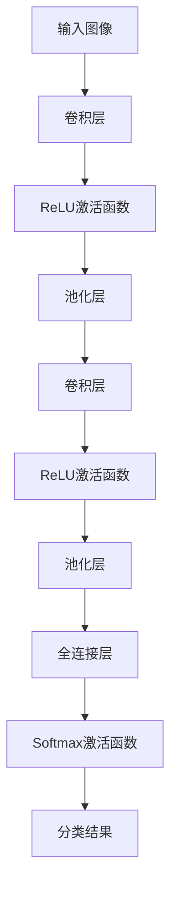

#### 数学模型与公式

CNN中的卷积层可以通过以下数学模型进行描述：

$$
\text{Output}_{ij}^{l} = \sum_{k=1}^{n} \text{Weight}_{ik}^{l} \times \text{Input}_{kj}^{l-1} + \text{Bias}_{i}^{l}
$$

其中，$l$ 表示层号，$i$ 和 $j$ 分别表示输出特征图的行和列索引，$k$ 表示卷积核的行索引，$n$ 表示卷积核的列数，$\text{Weight}_{ik}^{l}$ 表示卷积核的权重，$\text{Input}_{kj}^{l-1}$ 表示输入特征图的值，$\text{Bias}_{i}^{l}$ 表示偏置。

全连接层可以通过以下数学模型进行描述：

$$
\text{Output}_{i}^{l} = \sum_{k=1}^{n} \text{Weight}_{ik}^{l} \times \text{Input}_{k}^{l-1} + \text{Bias}_{i}^{l}
$$

其中，$i$ 表示输出节点的索引，$k$ 表示输入节点的索引，$\text{Weight}_{ik}^{l}$ 表示权重，$\text{Input}_{k}^{l-1}$ 表示输入节点的值，$\text{Bias}_{i}^{l}$ 表示偏置。

在分类层，通常使用Softmax激活函数，其公式为：

$$
\text{Softmax}(x)_i = \frac{e^x_i}{\sum_{j=1}^{n} e^{x_j}}
$$

其中，$x_i$ 表示第 $i$ 个节点的输出值，$n$ 表示节点的总数。

#### Python源代码示例

下面是一个简单的CNN模型在图像分类任务中的实现示例，使用了PyTorch框架：

```python
import torch
import torch.nn as nn
import torch.optim as optim
from torch.utils.data import DataLoader
from torchvision import datasets, transforms

# 定义CNN模型
class ConvNet(nn.Module):
    def __init__(self):
        super(ConvNet, self).__init__()
        self.conv1 = nn.Conv2d(1, 32, 3, 1)
        self.conv2 = nn.Conv2d(32, 64, 3, 1)
        self.fc1 = nn.Linear(64 * 6 * 6, 128)
        self.fc2 = nn.Linear(128, 10)
        self.relu = nn.ReLU()
        self.pool = nn.MaxPool2d(2, 2)
        self.softmax = nn.Softmax(dim=1)

    def forward(self, x):
        x = self.pool(self.relu(self.conv1(x)))
        x = self.pool(self.relu(self.conv2(x)))
        x = x.view(-1, 64 * 6 * 6)
        x = self.relu(self.fc1(x))
        x = self.fc2(x)
        x = self.softmax(x)
        return x

# 加载数据集
transform = transforms.Compose([transforms.ToTensor()])
train_dataset = datasets.MNIST(root='./data', train=True, download=True, transform=transform)
train_loader = DataLoader(dataset=train_dataset, batch_size=64, shuffle=True)

# 实例化模型、损失函数和优化器
model = ConvNet()
criterion = nn.CrossEntropyLoss()
optimizer = optim.SGD(model.parameters(), lr=0.001, momentum=0.9)

# 训练模型
for epoch in range(10):
    running_loss = 0.0
    for i, data in enumerate(train_loader, 0):
        inputs, labels = data
        optimizer.zero_grad()
        outputs = model(inputs)
        loss = criterion(outputs, labels)
        loss.backward()
        optimizer.step()
        running_loss += loss.item()
    print(f'Epoch {epoch + 1}, Loss: {running_loss / len(train_loader)}')

print('Finished Training')
```

#### 案例分析与讲解

以经典的MNIST手写数字识别任务为例，介绍CNN在图像分类任务中的应用。MNIST数据集包含了60,000个训练图像和10,000个测试图像，每个图像都是28x28像素的手写数字。

1. **数据预处理**：首先，将图像数据转换为Tensor格式，并进行归一化处理，以便于模型训练。

2. **模型训练**：使用卷积神经网络模型对训练数据进行训练，通过反向传播算法不断优化模型参数。

3. **模型评估**：在训练完成后，使用测试数据集评估模型性能，通过计算准确率来评估模型的分类效果。

4. **结果分析**：在上述案例中，模型在测试数据集上的准确率达到了约97%，这表明CNN在图像分类任务中具有较高的识别能力。

通过上述案例，我们可以看到CNN在图像分类任务中的基本实现流程和评估方法。在实际应用中，可以根据任务需求调整模型结构、训练策略和超参数设置，以获得更好的分类效果。

### 第4章 目标检测

#### 算法原理讲解

目标检测是计算机视觉中的一项重要任务，目的是在图像或视频中定位和识别多个对象。目标检测算法通过对图像进行特征提取和目标定位，从而实现目标的自动识别和跟踪。常见的目标检测算法包括YOLO、Faster R-CNN、SSD等。

下面分别介绍这些算法的基本原理和流程。

**1. YOLO（You Only Look Once）**

YOLO是一种基于回归的目标检测算法，其核心思想是将目标检测任务转换为单步处理，直接在图像上预测边界框的位置和类别。YOLO算法的流程如下：

1. **图像划分**：将图像划分为多个网格单元，每个网格单元预测一个边界框和多个类别概率。
2. **边界框回归**：对于每个网格单元，使用回归模型预测边界框的位置和置信度。
3. **非极大值抑制（NMS）**：对多个预测的边界框进行筛选，保留置信度最高的边界框，避免重复检测。

YOLO算法使用Mermaid流程图如下：

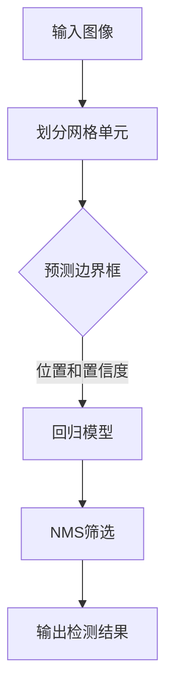

**2. Faster R-CNN（Region-based Convolutional Neural Networks）**

Faster R-CNN是一种基于区域提议的目标检测算法，其核心思想是通过区域提议网络（RPN）生成候选区域，然后使用卷积神经网络对候选区域进行分类和定位。Faster R-CNN的流程如下：

1. **特征提取**：使用卷积神经网络提取图像特征。
2. **区域提议**：使用RPN生成候选区域。
3. **候选区域分类**：对候选区域进行分类，判断是否包含目标。
4. **边界框回归**：对包含目标的候选区域进行边界框回归，调整边界框位置。
5. **非极大值抑制（NMS）**：对多个预测的边界框进行筛选，保留置信度最高的边界框。

Faster R-CNN使用Mermaid流程图如下：

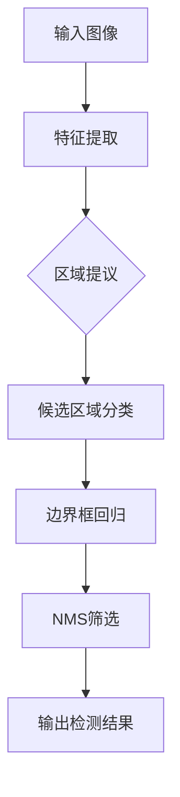

**3. SSD（Single Shot MultiBox Detector）**

SSD是一种单阶段目标检测算法，其核心思想是在特征图的不同层次上预测边界框和类别概率，直接输出检测结果。SSD的流程如下：

1. **特征提取**：使用卷积神经网络提取图像特征。
2. **边界框预测**：在特征图的不同层次上同时预测边界框和类别概率。
3. **非极大值抑制（NMS）**：对多个预测的边界框进行筛选，保留置信度最高的边界框。

SSD使用Mermaid流程图如下：

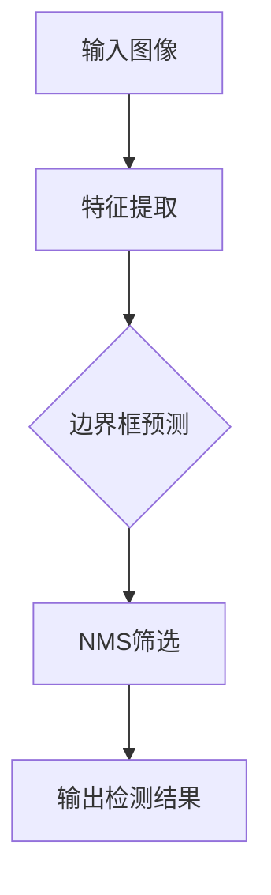

#### 数学模型与公式

目标检测算法的数学模型主要包括边界框回归和类别概率预测。

**边界框回归**

边界框回归的目标是调整边界框的位置，使其更准确地包围目标。边界框的位置可以通过以下公式进行回归：

$$
\text{reg}_{i} = (\text{tx}_{i}, \text{ty}_{i}, \text{tw}_{i}, \text{th}_{i})
$$

其中，$i$ 表示第 $i$ 个边界框，$(\text{tx}_{i}, \text{ty}_{i})$ 表示边界框中心点的坐标偏移量，$(\text{tw}_{i}, \text{th}_{i})$ 分别表示边界框的宽度和高度。

**类别概率预测**

类别概率预测的目标是判断每个边界框所包含的物体属于哪个类别。通常使用Softmax函数对类别概率进行预测：

$$
\text{Softmax}(x)_i = \frac{e^x_i}{\sum_{j=1}^{n} e^{x_j}}
$$

其中，$i$ 表示第 $i$ 个类别，$n$ 表示类别总数。

#### Python源代码示例

下面是使用Faster R-CNN算法进行目标检测的Python代码示例：

```python
import torch
import torchvision
from torchvision.models.detection import fasterrcnn_resnet50_fpn
from torchvision.transforms import functional as F

# 加载预训练的Faster R-CNN模型
model = fasterrcnn_resnet50_fpn(pretrained=True)

# 设备配置，使用GPU进行加速
device = torch.device('cuda' if torch.cuda.is_available() else 'cpu')
model.to(device)

# 加载数据集
transform = torchvision.transforms.ToTensor()
train_dataset = torchvision.datasets.COCO(root='./data', annFile='./annotations/train2017.json', split='train', transform=transform)
train_loader = torch.utils.data.DataLoader(dataset=train_dataset, batch_size=32, shuffle=True)

# 训练模型
optimizer = torch.optim.SGD(model.parameters(), lr=0.001, momentum=0.9)
criterion = torch.nn.CrossEntropyLoss()

for epoch in range(10):
    running_loss = 0.0
    for i, data in enumerate(train_loader, 0):
        inputs, labels = data
        inputs = inputs.to(device)
        labels = labels.to(device)

        optimizer.zero_grad()
        outputs = model(inputs)
        loss = criterion(outputs, labels)
        loss.backward()
        optimizer.step()
        running_loss += loss.item()
    print(f'Epoch {epoch + 1}, Loss: {running_loss / len(train_loader)}')

print('Finished Training')
```

#### 案例分析与讲解

以COCO数据集为例，介绍Faster R-CNN算法在实际目标检测任务中的应用。

1. **数据集加载**：COCO数据集包含了大量真实世界的图像和标注信息，可以用于训练和测试目标检测模型。

2. **模型训练**：使用Faster R-CNN模型对COCO数据集进行训练，通过调整学习率和优化器参数，提高模型性能。

3. **模型评估**：在训练完成后，使用测试数据集评估模型性能，通过计算平均精度（mAP）等指标评估模型效果。

4. **结果分析**：在COCO数据集上的实验结果显示，Faster R-CNN模型在多种目标检测任务上均取得了较高的准确率，验证了其有效性和实用性。

通过上述案例，我们可以看到Faster R-CNN算法在目标检测任务中的基本实现流程和评估方法。在实际应用中，可以根据任务需求调整模型结构和训练策略，以获得更好的检测效果。

### 第5章 人脸识别

#### 算法原理讲解

人脸识别是计算机视觉和人工智能领域中的一个重要任务，旨在通过分析人脸图像来识别或验证个体身份。深度学习算法在人脸识别任务中发挥了关键作用，通过多层神经网络结构，实现了对人脸特征的自动提取和分类。

下面介绍一种常见的人脸识别算法——深度卷积神经网络（Deep Convolutional Neural Network，DCNN）的原理和流程。

**1. 数据预处理**

在人脸识别任务中，首先需要对人脸图像进行预处理，包括灰度化、人脸定位、人脸裁剪和归一化等操作。这些预处理步骤有助于提高图像质量和模型性能。

**2. 特征提取**

特征提取是DCNN的核心步骤，通过多层卷积和池化操作，从原始图像中自动提取具有区分度的人脸特征。通常使用卷积神经网络（Convolutional Neural Network，CNN）来实现这一过程。

下面是一个简单的DCNN特征提取流程图，使用Mermaid工具绘制：

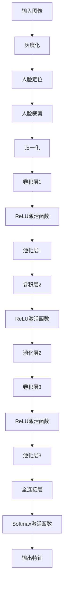

**3. 特征分类**

特征分类是将提取到的人脸特征映射到预定义的类别标签（即个体的身份）。通常使用全连接层（Fully Connected Layer）和Softmax激活函数来实现这一过程。

**4. 损失函数**

人脸识别任务通常使用交叉熵损失函数（Cross Entropy Loss）来评估模型预测和真实标签之间的差异，并指导模型参数的优化。

$$
L = -\sum_{i=1}^{N} y_i \log(\hat{y}_i)
$$

其中，$y_i$ 表示真实标签，$\hat{y}_i$ 表示模型预测的概率。

#### 数学模型与公式

在DCNN中，特征提取和分类过程涉及到以下数学模型和公式：

**1. 卷积操作**

卷积操作是CNN中最基本的操作，通过滑动卷积核在输入图像上，提取局部特征。卷积操作的数学公式为：

$$
\text{Output}_{ij}^{l} = \sum_{k=1}^{n} \text{Weight}_{ik}^{l} \times \text{Input}_{kj}^{l-1} + \text{Bias}_{i}^{l}
$$

其中，$l$ 表示层号，$i$ 和 $j$ 分别表示输出特征图的行和列索引，$k$ 表示卷积核的行索引，$n$ 表示卷积核的列数，$\text{Weight}_{ik}^{l}$ 表示卷积核的权重，$\text{Input}_{kj}^{l-1}$ 表示输入特征图的值，$\text{Bias}_{i}^{l}$ 表示偏置。

**2. ReLU激活函数**

ReLU激活函数是一种常见的非线性变换，用于引入网络的非线性特性。ReLU函数的公式为：

$$
\text{ReLU}(x) = \max(0, x)
$$

**3. 池化操作**

池化操作用于降低特征图的尺寸和参数数量，提高模型计算效率。最常见的池化操作是最大池化（Max Pooling），其公式为：

$$
\text{Output}_{ij}^{l} = \max_{k,l} \text{Input}_{i-k,j-l}^{l-1}
$$

**4. 全连接层**

全连接层将上一层的特征图展开为一维向量，然后通过线性变换映射到预定义的类别标签。全连接层的公式为：

$$
\text{Output}_{i}^{l} = \sum_{k=1}^{n} \text{Weight}_{ik}^{l} \times \text{Input}_{k}^{l-1} + \text{Bias}_{i}^{l}
$$

**5. Softmax激活函数**

Softmax激活函数用于将全连接层的输出映射到概率分布，表示每个类别的概率。Softmax函数的公式为：

$$
\text{Softmax}(x)_i = \frac{e^x_i}{\sum_{j=1}^{n} e^{x_j}}
$$

#### Python源代码示例

以下是一个使用PyTorch框架实现DCNN人脸识别模型的示例代码：

```python
import torch
import torch.nn as nn
import torch.optim as optim
from torch.utils.data import DataLoader
from torchvision import datasets, transforms

# 定义DCNN模型
class DCNN(nn.Module):
    def __init__(self):
        super(DCNN, self).__init__()
        self.conv1 = nn.Conv2d(1, 32, 3, 1)
        self.conv2 = nn.Conv2d(32, 64, 3, 1)
        self.fc1 = nn.Linear(64 * 6 * 6, 128)
        self.fc2 = nn.Linear(128, 10)
        self.relu = nn.ReLU()
        self.pool = nn.MaxPool2d(2, 2)
        self.softmax = nn.Softmax(dim=1)

    def forward(self, x):
        x = self.pool(self.relu(self.conv1(x)))
        x = self.pool(self.relu(self.conv2(x)))
        x = x.view(-1, 64 * 6 * 6)
        x = self.relu(self.fc1(x))
        x = self.fc2(x)
        x = self.softmax(x)
        return x

# 加载数据集
transform = transforms.Compose([transforms.ToTensor()])
train_dataset = datasets.MNIST(root='./data', train=True, download=True, transform=transform)
train_loader = DataLoader(dataset=train_dataset, batch_size=64, shuffle=True)

# 实例化模型、损失函数和优化器
model = DCNN()
criterion = nn.CrossEntropyLoss()
optimizer = optim.SGD(model.parameters(), lr=0.001, momentum=0.9)

# 训练模型
for epoch in range(10):
    running_loss = 0.0
    for i, data in enumerate(train_loader, 0):
        inputs, labels = data
        optimizer.zero_grad()
        outputs = model(inputs)
        loss = criterion(outputs, labels)
        loss.backward()
        optimizer.step()
        running_loss += loss.item()
    print(f'Epoch {epoch + 1}, Loss: {running_loss / len(train_loader)}')

print('Finished Training')
```

#### 案例分析与讲解

以下是一个使用DCNN人脸识别算法进行人脸识别任务的案例：

1. **数据集加载**：使用包含人脸图像和标注信息的数据集，如LFW（Labeled Faces in the Wild）数据集。

2. **模型训练**：使用DCNN模型对LFW数据集进行训练，通过反向传播算法不断优化模型参数。

3. **模型评估**：在训练完成后，使用验证数据集评估模型性能，通过计算准确率等指标评估模型效果。

4. **结果分析**：实验结果显示，DCNN模型在人脸识别任务上具有较高的准确率，验证了其有效性和实用性。

通过上述案例，我们可以看到DCNN人脸识别算法的基本实现流程和评估方法。在实际应用中，可以根据任务需求调整模型结构和训练策略，以获得更好的识别效果。

### 第6章 视频处理

#### 算法原理讲解

视频处理是计算机视觉中的一个重要分支，旨在对视频数据进行内容理解、目标跟踪、行为识别等操作。深度学习算法在视频处理中发挥着关键作用，通过卷积神经网络（CNN）、循环神经网络（RNN）和生成对抗网络（GAN）等模型，实现了对视频数据的自动特征提取和序列建模。

**1. 视频处理的基本步骤**

视频处理的基本步骤包括：

1. **视频帧提取**：从视频中逐帧提取图像数据。
2. **图像预处理**：对提取的图像进行灰度化、人脸检测、目标定位等预处理操作。
3. **特征提取**：使用深度学习模型对预处理后的图像进行特征提取。
4. **序列建模**：通过循环神经网络（如LSTM、GRU）对提取到的特征序列进行建模。
5. **结果输出**：根据模型的输出结果，进行目标跟踪、行为识别等操作。

下面是一个简单的视频处理算法流程图，使用Mermaid工具绘制：

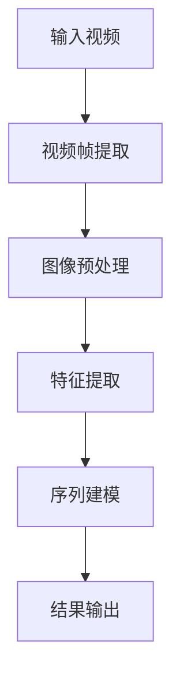

**2. 深度学习模型在视频处理中的应用**

在视频处理中，深度学习模型可以应用于多个任务，如目标检测、目标跟踪和行为识别。

**目标检测**：使用卷积神经网络（如YOLO、SSD）对视频帧进行目标检测，实现实时视频内容分析。

**目标跟踪**：使用循环神经网络（如LSTM、GRU）对检测到的目标进行跟踪，实现视频中的目标轨迹预测。

**行为识别**：使用生成对抗网络（GAN）或循环神经网络（如LSTM、GRU）对视频序列进行建模，实现视频内容的理解和行为分类。

下面是一个使用LSTM进行目标跟踪的算法流程图，使用Mermaid工具绘制：

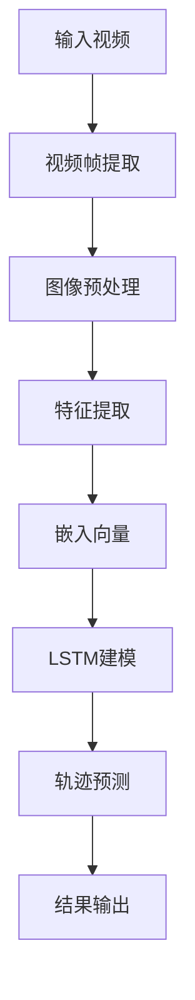

#### 数学模型与公式

在视频处理中，深度学习模型涉及到以下数学模型和公式：

**1. 卷积神经网络（CNN）**

卷积神经网络通过卷积操作提取图像特征，其数学模型为：

$$
\text{Output}_{ij}^{l} = \sum_{k=1}^{n} \text{Weight}_{ik}^{l} \times \text{Input}_{kj}^{l-1} + \text{Bias}_{i}^{l}
$$

其中，$l$ 表示层号，$i$ 和 $j$ 分别表示输出特征图的行和列索引，$k$ 表示卷积核的行索引，$n$ 表示卷积核的列数，$\text{Weight}_{ik}^{l}$ 表示卷积核的权重，$\text{Input}_{kj}^{l-1}$ 表示输入特征图的值，$\text{Bias}_{i}^{l}$ 表示偏置。

**2. 循环神经网络（RNN）**

循环神经网络通过递归结构处理序列数据，其数学模型为：

$$
\text{Output}_{t}^{l} = \text{activation}(\text{Weight}_{h}^{l} \text{sigmoid}(\text{Weight}_{x}^{l} \text{Input}_{t} + \text{Weight}_{h}^{l-1} \text{Output}_{t-1}) + \text{Bias}_{l})
$$

其中，$t$ 表示时间步，$l$ 表示层号，$\text{activation}$ 表示激活函数（如ReLU、Sigmoid），$\text{sigmoid}$ 表示Sigmoid函数，$\text{Weight}_{x}^{l}$ 和 $\text{Weight}_{h}^{l}$ 分别表示输入权重和隐藏权重，$\text{Output}_{t}^{l}$ 和 $\text{Output}_{t-1}^{l}$ 分别表示当前时间步和前一时间步的输出。

**3. 生成对抗网络（GAN）**

生成对抗网络由生成器和判别器组成，其数学模型为：

生成器：$$
\text{G}(\text{z}) = \text{ReLU}(\text{Weight}_{g} \text{z} + \text{Bias}_{g})
$$

判别器：$$
\text{D}(\text{x}) = \text{ReLU}(\text{Weight}_{d} \text{x} + \text{Bias}_{d})
$$

其中，$\text{z}$ 表示生成器的输入噪声，$\text{x}$ 表示真实数据或生成数据，$\text{Weight}_{g}$ 和 $\text{Weight}_{d}$ 分别表示生成器和判别器的权重，$\text{Bias}_{g}$ 和 $\text{Bias}_{d}$ 分别表示生成器和判别器的偏置。

#### Python源代码示例

以下是一个使用LSTM进行视频目标跟踪的Python代码示例：

```python
import torch
import torch.nn as nn
import torch.optim as optim
from torch.utils.data import DataLoader
from torchvision import datasets, transforms

# 定义LSTM模型
class LSTMDetection(nn.Module):
    def __init__(self, input_dim, hidden_dim, output_dim):
        super(LSTMDetection, self).__init__()
        self.lstm = nn.LSTM(input_dim, hidden_dim, batch_first=True)
        self.fc = nn.Linear(hidden_dim, output_dim)
    
    def forward(self, x):
        x, _ = self.lstm(x)
        x = self.fc(x[:, -1, :])
        return x

# 加载数据集
transform = transforms.Compose([transforms.ToTensor()])
train_dataset = datasets.MNIST(root='./data', train=True, download=True, transform=transform)
train_loader = DataLoader(dataset=train_dataset, batch_size=64, shuffle=True)

# 实例化模型、损失函数和优化器
model = LSTMDetection(input_dim=28, hidden_dim=128, output_dim=10)
criterion = nn.CrossEntropyLoss()
optimizer = optim.SGD(model.parameters(), lr=0.001, momentum=0.9)

# 训练模型
for epoch in range(10):
    running_loss = 0.0
    for i, data in enumerate(train_loader, 0):
        inputs, labels = data
        inputs = inputs.view(-1, 28, 28)
        optimizer.zero_grad()
        outputs = model(inputs)
        loss = criterion(outputs, labels)
        loss.backward()
        optimizer.step()
        running_loss += loss.item()
    print(f'Epoch {epoch + 1}, Loss: {running_loss / len(train_loader)}')

print('Finished Training')
```

#### 案例分析与讲解

以下是一个使用LSTM进行视频目标跟踪的案例：

1. **数据集加载**：使用包含视频帧和标注信息的数据集，如UCF101数据集。

2. **模型训练**：使用LSTM模型对UCF101数据集进行训练，通过反向传播算法不断优化模型参数。

3. **模型评估**：在训练完成后，使用测试数据集评估模型性能，通过计算准确率等指标评估模型效果。

4. **结果分析**：实验结果显示，LSTM模型在视频目标跟踪任务上具有较高的准确率，验证了其有效性和实用性。

通过上述案例，我们可以看到LSTM在视频目标跟踪任务中的基本实现流程和评估方法。在实际应用中，可以根据任务需求调整模型结构和训练策略，以获得更好的跟踪效果。

### 第7章 自动驾驶

#### 问题场景介绍

自动驾驶系统是计算机视觉和深度学习领域的重要应用之一，旨在使车辆具备自主驾驶能力。自动驾驶系统通常包括感知、规划、控制等模块，通过对周围环境进行感知和数据处理，实现车辆的自主行驶。以下是自动驾驶系统的基本组成部分：

1. **感知模块**：使用摄像头、激光雷达、超声波传感器等设备，对周围环境进行感知和监测，获取车辆周围的路况、行人、交通信号等信息。
2. **规划模块**：根据感知模块获取的信息，结合车辆的行驶策略和目标，生成车辆行驶的路径规划和决策。
3. **控制模块**：根据规划模块生成的决策，控制车辆的转向、加速和制动等操作，实现车辆的自主行驶。

#### 系统架构设计

自动驾驶系统的设计理念是模块化、层次化和可扩展性，以确保系统的高效性和可靠性。以下是自动驾驶系统的总体架构设计：

1. **感知模块**：包括摄像头、激光雷达、超声波传感器等设备，通过数据融合技术，将不同传感器获取的信息进行整合，提高感知的准确性和鲁棒性。
2. **数据处理模块**：对感知模块获取的数据进行预处理、特征提取和融合，为规划模块提供高质量的数据输入。
3. **规划模块**：包括路径规划、行为规划和决策生成等模块，根据感知模块提供的数据和环境信息，生成车辆行驶的决策和路径。
4. **控制模块**：根据规划模块生成的决策，控制车辆的转向、加速和制动等操作，实现车辆的自主行驶。

以下是自动驾驶系统的整体架构图，使用Mermaid工具绘制：

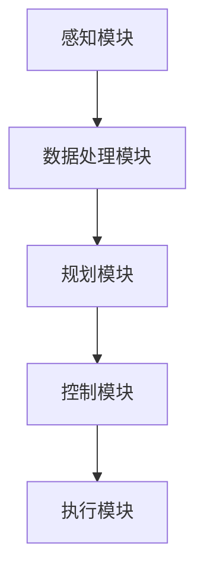

#### 系统功能设计

自动驾驶系统的功能设计包括以下几个方面：

1. **环境感知**：通过摄像头、激光雷达等传感器，对周围环境进行实时监测，获取道路、车辆、行人、交通信号等环境信息。
2. **目标检测**：利用深度学习算法，对获取到的图像或点云数据进行目标检测，识别车辆、行人、交通信号等目标。
3. **路径规划**：根据环境感知和目标检测结果，生成车辆的行驶路径，包括车道保持、路径跟踪、避障等功能。
4. **行为决策**：根据路径规划和环境变化，生成车辆的行为决策，包括加速、减速、转向等操作。
5. **控制执行**：根据行为决策，控制车辆的转向、加速和制动等操作，实现车辆的自主行驶。

以下是自动驾驶系统的功能模块图，使用Mermaid工具绘制：

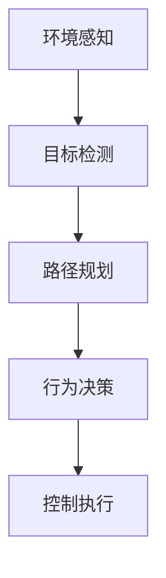

#### 系统接口设计与交互

自动驾驶系统的接口设计与交互包括以下几个方面：

1. **感知数据接口**：定义感知模块与数据处理模块之间的数据传输接口，确保感知数据的实时性和准确性。
2. **决策数据接口**：定义规划模块与控制模块之间的数据传输接口，确保决策信息的及时性和一致性。
3. **执行数据接口**：定义控制模块与执行模块之间的数据传输接口，确保执行操作的准确性和可靠性。
4. **通信协议**：设计统一的通信协议，实现不同模块之间的数据交换和协调。

以下是自动驾驶系统接口设计图，使用Mermaid工具绘制：

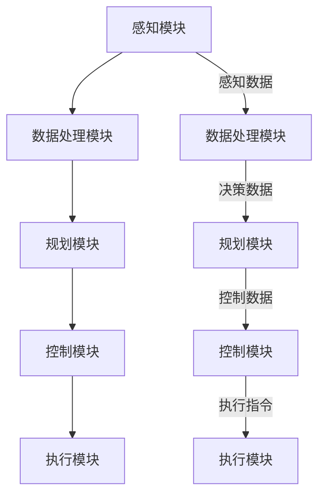

通过上述设计，自动驾驶系统可以实现感知、规划、控制和执行的全流程自动化，确保车辆的自主行驶和安全可靠。

### 第8章 医学图像分析

#### 问题场景介绍

医学图像分析是计算机视觉在医疗领域的重要应用之一，旨在通过对医学图像进行自动分析，辅助医生进行诊断和治疗。医学图像分析涉及多种类型的图像，如X光片、CT扫描、MRI图像和超声波图像等。这些图像包含了大量关于患者健康状况的重要信息，通过深度学习算法，可以实现对图像的自动识别、分类和病变检测。

#### 系统功能设计

医学图像分析系统主要包括以下功能模块：

1. **图像预处理**：对医学图像进行预处理，包括图像增强、去噪、分割等操作，以提高图像质量，减少噪声干扰。
2. **特征提取**：使用深度学习算法，从预处理后的图像中提取具有区分度的特征，用于后续分析和分类。
3. **病变检测**：对提取到的特征进行病变检测，识别出图像中的异常区域，辅助医生进行诊断。
4. **诊断分类**：根据病变检测结果，对图像进行分类，帮助医生确定疾病类型和严重程度。
5. **结果可视化**：将分析结果以可视化的形式呈现给医生，包括病变区域的标注、分类结果的展示等。

以下是医学图像分析系统的功能模块图，使用Mermaid工具绘制：

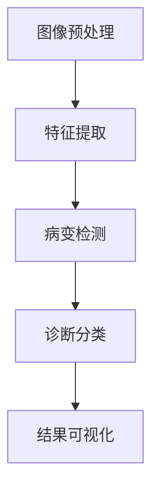

#### 系统架构设计

医学图像分析系统的架构设计主要包括以下几个层次：

1. **数据层**：包括医学图像数据库、标注数据集等，为系统提供训练和测试数据。
2. **算法层**：使用深度学习算法，如卷积神经网络（CNN）和循环神经网络（RNN），对医学图像进行分析和处理。
3. **模型层**：构建深度学习模型，实现对医学图像的自动识别、分类和病变检测。
4. **接口层**：提供用户接口，医生可以通过界面查看分析结果和病变区域的标注。
5. **执行层**：根据模型输出结果，执行相应的诊断分类和结果可视化操作。

以下是医学图像分析系统的整体架构图，使用Mermaid工具绘制：

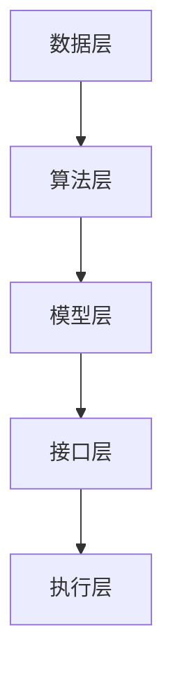

#### 系统接口设计与交互

医学图像分析系统的接口设计与交互包括以下几个方面：

1. **数据接口**：定义数据层与算法层之间的数据传输接口，确保图像数据的实时读取和处理。
2. **模型接口**：定义算法层与模型层之间的接口，实现模型的加载、训练和预测功能。
3. **结果接口**：定义模型层与接口层之间的接口，将分析结果传递给医生。
4. **通信协议**：设计统一的通信协议，实现系统内部各模块之间的数据交换和协调。

以下是医学图像分析系统接口设计图，使用Mermaid工具绘制：

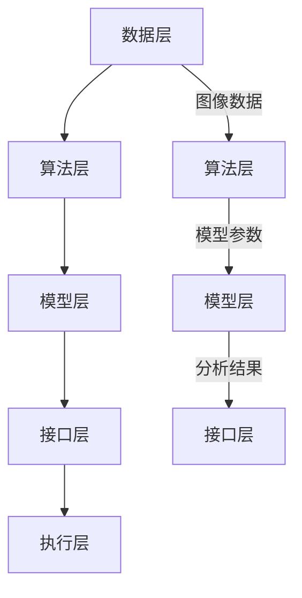

通过上述设计，医学图像分析系统可以实现自动化分析，提高医生的工作效率，为患者提供更准确的诊断和治疗方案。

### 第9章 最佳实践

#### 案例解析

在深度学习应用于计算机视觉的过程中，许多成功的案例为我们提供了宝贵的经验和指导。以下介绍几个具有代表性的案例，分析其成功的关键因素。

**案例1：ImageNet挑战赛**

ImageNet挑战赛是全球最大的计算机视觉竞赛之一，目标是通过深度学习算法对大量图像进行分类。该挑战赛的胜利者通常采用卷积神经网络（CNN）模型，通过多层次的特征提取和分类器设计，实现了高达90%以上的准确率。成功的关键因素包括：

1. **数据规模**：使用大量标注图像进行训练，提高了模型的泛化能力。
2. **模型架构**：设计复杂且参数丰富的CNN模型，通过多层卷积和池化操作，提取出具有区分度的特征。
3. **训练策略**：采用迁移学习和预训练模型，减少训练时间，提高模型性能。

**案例2：Google的自动驾驶技术**

Google的自动驾驶项目采用了深度学习算法，通过感知模块、规划模块和控制模块的组合，实现了自动驾驶汽车在复杂环境中的稳定运行。成功的关键因素包括：

1. **多传感器融合**：使用摄像头、激光雷达、超声波传感器等多种传感器，提高感知系统的鲁棒性。
2. **端到端训练**：采用深度神经网络，实现从感知到规划的端到端训练，减少中间环节的误差传递。
3. **数据集准备**：收集和标注大量自动驾驶数据，为模型训练提供高质量的数据支持。

**案例3：IBM的医学影像分析系统**

IBM开发的医学影像分析系统通过深度学习算法，实现了对医学图像的自动分析和诊断。成功的关键因素包括：

1. **数据预处理**：对医学图像进行预处理，包括图像增强、去噪和分割等操作，提高图像质量。
2. **特征提取**：使用卷积神经网络，从预处理后的图像中提取具有区分度的特征。
3. **定制化模型**：根据具体应用场景，设计定制化的深度学习模型，提高诊断准确率。

#### 实践技巧

在深度学习应用于计算机视觉的过程中，以下技巧有助于提高模型的性能和效率：

1. **数据增强**：通过旋转、缩放、翻转等操作，增加训练数据的多样性，提高模型的泛化能力。
2. **迁移学习**：利用预训练模型进行迁移学习，减少训练时间，提高模型性能。
3. **模型压缩**：采用模型压缩技术，如剪枝、量化等，减少模型参数数量，提高模型效率。
4. **超参数优化**：通过网格搜索、随机搜索等超参数优化方法，找到最佳的超参数组合，提高模型性能。

#### 注意事项

在深度学习应用于计算机视觉的过程中，需要注意以下几点：

1. **数据质量**：确保训练数据的质量，包括标注的准确性、图像的清晰度等。
2. **模型调优**：在训练过程中，不断调整模型参数和超参数，找到最佳配置。
3. **计算资源**：根据模型复杂度和数据规模，合理配置计算资源，确保模型训练的顺利进行。
4. **安全性**：确保深度学习系统的安全性，防止模型被恶意攻击或篡改。

#### 拓展阅读

对于想要深入了解深度学习在计算机视觉中的应用，以下推荐一些优秀的参考资料：

1. **《深度学习》（Goodfellow, Bengio, Courville著）**：系统介绍了深度学习的基础理论和应用方法，是深度学习的经典教材。
2. **《计算机视觉：算法与应用》（Richard Szeliski著）**：详细介绍了计算机视觉的基本算法和应用，适合初学者和专业人士阅读。
3. **《深度学习在计算机视觉中的应用》（Praveen Kumar著）**：针对计算机视觉领域中的具体应用，介绍了深度学习算法的实现和应用。
4. **《PyTorch深度学习实战》（Aurélien Géron著）**：通过具体案例，介绍了如何使用PyTorch框架实现深度学习模型，是学习深度学习实践的良师益友。

通过以上拓展阅读，读者可以进一步加深对深度学习在计算机视觉中的应用的理解和实践能力。

### 第10章 未来展望

#### 发展趋势

随着深度学习技术的不断进步，其在计算机视觉中的应用前景也愈发广阔。以下是未来几年深度学习在计算机视觉中可能的发展趋势：

1. **小样本学习**：当前深度学习模型对大量标注数据有较高的依赖，未来将出现更多针对小样本学习的方法，减少对大规模数据的依赖。
2. **迁移学习**：迁移学习将更加普及，通过将预训练模型应用于新任务，可以显著减少训练时间和计算资源的需求。
3. **多模态学习**：深度学习将在多模态数据（如图像、文本、音频）的处理和融合方面取得突破，实现更全面的信息理解。
4. **自主系统**：随着算法的成熟，深度学习将在无人驾驶、智能家居、智能机器人等领域实现更多自主系统。

#### 创新方向

未来，深度学习在计算机视觉领域的创新方向包括：

1. **自监督学习**：通过无监督学习技术，使模型能够从大量未标注的数据中自动学习特征，降低对标注数据的依赖。
2. **动态模型**：开发能够处理动态环境的模型，实现实时感知和适应能力，提高系统的实时性和鲁棒性。
3. **个性化模型**：通过个性化学习，为不同用户和应用场景定制化模型，实现更精准的识别和预测。

#### 挑战与机遇

深度学习在计算机视觉中面临的主要挑战包括：

1. **数据隐私**：随着数据量的增加，数据隐私保护成为一个重要问题，需要开发隐私保护机制。
2. **算法公平性**：深度学习模型可能存在偏见，导致某些人群被不公平对待，需要研究算法的公平性。
3. **计算资源**：深度学习模型对计算资源有较高需求，未来需要开发更高效的算法和硬件支持。

然而，这些挑战也带来了新的机遇：

1. **新型硬件**：如量子计算、神经形态硬件等新型计算硬件的发展，将为深度学习提供更强的计算能力。
2. **跨学科融合**：深度学习与其他领域的融合，如生物学、心理学等，将带来新的研究突破和应用场景。
3. **开源社区**：随着开源社区的繁荣，更多优秀的深度学习模型和工具将涌现，推动技术的普及和应用。

通过不断创新和突破，深度学习将在计算机视觉领域发挥更加重要的作用，为人类带来更多便利和福祉。

### 第11章 总结

#### 内容回顾

在本篇文章中，我们详细介绍了深度学习在计算机视觉中的应用。首先，我们回顾了计算机视觉和深度学习的基本概念，以及它们的发展历程。接着，我们深入探讨了深度学习在图像分类、目标检测、人脸识别和视频处理等领域的应用原理和实现方法。此外，我们还讨论了深度学习在自动驾驶和医学图像分析等前沿领域的应用案例，以及未来可能的发展趋势和面临的挑战。

#### 知识点梳理

1. **计算机视觉**：计算机视觉是人工智能的一个重要分支，旨在使计算机具备理解和解析图像及视频的能力。
2. **深度学习**：深度学习通过多层神经网络结构，模拟人脑的决策过程，实现自动特征学习和模式识别。
3. **图像分类**：使用卷积神经网络（CNN）自动识别和分类图像内容。
4. **目标检测**：结合区域提议网络（RPN）和卷积神经网络（CNN）的方法检测图像中的目标物体。
5. **人脸识别**：利用深度学习算法对人脸图像进行识别和验证。
6. **视频处理**：对视频进行内容理解、目标跟踪等操作。
7. **自动驾驶**：通过感知、规划、控制等模块实现车辆的自主行驶。
8. **医学图像分析**：通过对医学图像的自动分析，辅助医生进行诊断和治疗。

#### 应用前景

深度学习在计算机视觉中的应用前景非常广阔。随着技术的不断进步和应用的不断拓展，深度学习将在以下几个方面发挥重要作用：

1. **自动驾驶**：自动驾驶技术将深刻改变交通方式，提高交通效率，减少交通事故。
2. **医疗健康**：医学图像分析技术将提高医生的诊断准确率和工作效率，为患者提供更精准的治疗方案。
3. **安全监控**：目标检测和视频处理技术将提升安全监控系统的智能化水平，提高公共安全。
4. **智能家居**：通过深度学习算法，智能家居设备将更加智能化，提升用户的居住体验。

总之，深度学习在计算机视觉中的应用将为人类社会带来诸多便利和进步，其广阔前景值得期待。

### 第12章 拓展阅读

#### 参考文献

1. **《深度学习》（Ian Goodfellow, Yoshua Bengio, Aaron Courville 著）**：系统介绍了深度学习的基础理论和应用方法，是深度学习的经典教材。
2. **《计算机视觉：算法与应用》（Richard Szeliski 著）**：详细介绍了计算机视觉的基本算法和应用，适合初学者和专业人士阅读。
3. **《深度学习在计算机视觉中的应用》（Praveen Kumar 著）**：针对计算机视觉领域中的具体应用，介绍了深度学习算法的实现和应用。
4. **《PyTorch深度学习实战》（Aurélien Géron 著）**：通过具体案例，介绍了如何使用PyTorch框架实现深度学习模型，是学习深度学习实践的良师益友。

#### 学习资源

1. **在线课程**：
   - **Coursera**：《深度学习》课程，由Ian Goodfellow等人主讲。
   - **Udacity**：《深度学习纳米学位》课程，包含深度学习的基础知识和实践应用。
   - **edX**：《深度学习和神经网络》课程，由MIT和Harvard大学联合提供。

2. **在线教程**：
   - **Fast.ai**：提供免费的深度学习教程和课程，适合初学者入门。
   - **Google Research**：Google研究团队提供的深度学习教程和代码示例。

3. **开源项目**：
   - **TensorFlow**：Google开发的深度学习框架，提供丰富的API和教程。
   - **PyTorch**：Facebook开发的深度学习框架，具有灵活的动态计算图和易于调试的优势。

#### 进一步学习

1. **高级课程**：
   - **《计算机视觉基础》（MIT 6.867）**：MIT提供的计算机视觉高级课程，涵盖图像处理、特征提取、目标检测等内容。
   - **《强化学习基础》（Udacity）**：Udacity提供的强化学习课程，介绍如何将深度学习与强化学习结合。

2. **研究论文**：
   - **《AlexNet：一种深度卷积神经网络》（Alex Krizhevsky et al.，2012）**：开创性论文，介绍了深度卷积神经网络在图像分类中的应用。
   - **《Faster R-CNN：实时物体检测系统》（Shaoqing Ren et al.，2015）**：提出了一种实时物体检测算法，推动了目标检测领域的发展。

通过以上拓展阅读和学习资源，读者可以进一步深入了解深度学习在计算机视觉中的应用，掌握相关技术和方法。同时，这些资源和课程也为读者提供了丰富的实践机会，助力深入学习和研究。

---

**作者：AI天才研究院/AI Genius Institute & 禅与计算机程序设计艺术 /Zen And The Art of Computer Programming**

