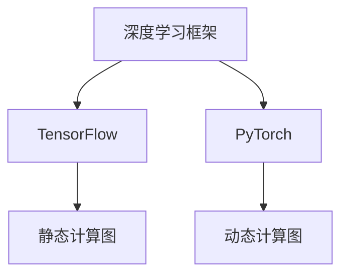
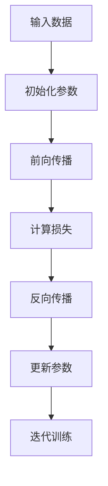
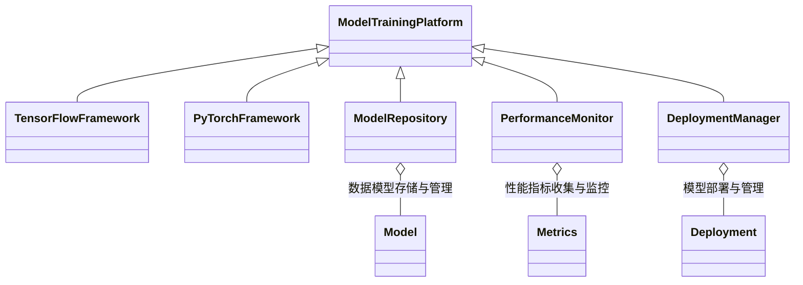
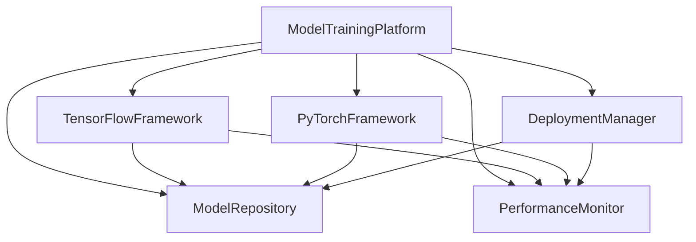
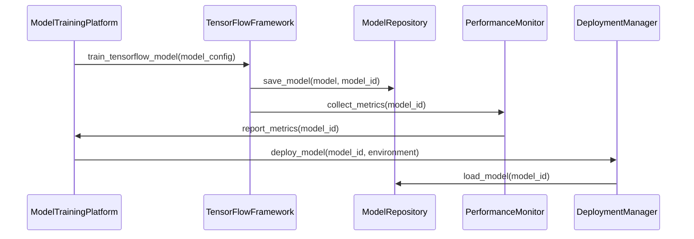

                 

### 深度学习框架：TensorFlow vs PyTorch

关键词：深度学习，TensorFlow，PyTorch，框架比较，使用体验，应用场景

摘要：本文将深入探讨当前两大热门深度学习框架TensorFlow和PyTorch之间的区别与联系。通过对比其核心概念、架构设计、数据处理和优化技术，本文旨在为读者提供一个全面的指南，帮助选择最适合自己的深度学习工具。

#### Step 1: Introduction Background

深度学习是近年来人工智能领域的一大突破，而选择合适的深度学习框架是成功构建高效模型的关键。TensorFlow和PyTorch是目前最受欢迎的两个深度学习框架，它们各自拥有独特的优势和应用场景。本文旨在通过对这两个框架的详细比较和分析，为深度学习社区提供有价值的参考。

**Target Readers**：本文面向对深度学习和神经网络框架感兴趣的读者，包括初学者、研究人员和实践者。无论您是想要入门深度学习，还是希望深入了解现有框架的细节，本文都希望能够为您带来启发和帮助。

**Book Aim**：本文的目标是提供一份全面而详尽的对比报告，涵盖TensorFlow和PyTorch的各个方面。通过本文，读者将能够：

1. 理解深度学习框架的基本概念和背景。
2. 比较TensorFlow和PyTorch的核心特性和设计哲学。
3. 掌握TensorFlow和PyTorch的基本使用方法和高级特性。
4. 分析两者在不同应用场景中的表现和适用性。

#### Step 2: Core Concept Explanation

##### Chapter 1: Introduction to Deep Learning Frameworks

###### 1.1 Definition and Background of Deep Learning

深度学习（Deep Learning）是机器学习（Machine Learning）的一个子领域，它依赖于多层神经网络（Neural Networks）来从大量数据中提取特征并实现复杂任务。自2012年AlexNet在ImageNet比赛中取得突破性成绩以来，深度学习在图像识别、语音识别、自然语言处理等领域取得了显著的进展。

###### 1.2 Overview of TensorFlow and PyTorch

TensorFlow是由Google开发的开源深度学习框架，自发布以来，它已经成为深度学习领域的事实标准。TensorFlow使用静态计算图（Static Computation Graphs），具有高度可扩展性和强大的生态系统。

PyTorch是由Facebook AI研究院（FAIR）开发的开源深度学习框架，以其动态计算图（Dynamic Computation Graphs）和简洁的API而闻名。PyTorch在科研和工业界都得到了广泛应用，尤其在动态模型和实时推理方面具有优势。

###### 1.3 Key Features and Advantages of TensorFlow

1. **强生态系统**：TensorFlow拥有丰富的预训练模型和扩展库，如TensorFlow Hub、TensorFlow Addons等，便于模型复用和扩展。
2. **高度可扩展性**：TensorFlow支持大规模分布式训练，可以在多个GPU和TPU上高效运行。
3. **企业级支持**：由于TensorFlow由Google维护，其在企业级应用中具有稳定性和可靠性的优势。

###### 1.4 Key Features and Advantages of PyTorch

1. **动态计算图**：PyTorch的动态计算图使得模型的构建和调试更加灵活和直观。
2. **简洁API**：PyTorch的API设计简洁明了，易于学习和使用。
3. **科研友好**：PyTorch在科研社区中得到了广泛认可，许多前沿研究模型都是基于PyTorch开发的。

#### Step 3: Conceptual Comparison

##### Chapter 2: Conceptual Comparison Between TensorFlow and PyTorch

###### 2.1 Architecture and Design Philosophy

TensorFlow采用静态计算图，所有的计算过程在模型构建完成后预先定义，类似于编程语言的编译过程。这种设计使得TensorFlow在执行过程中具有高效的计算性能，但模型构建相对复杂。

PyTorch采用动态计算图，计算过程在运行时动态构建，类似于编程语言的解释执行。这种设计使得PyTorch在模型构建和调试方面更加灵活，但可能影响计算性能。

###### 2.2 Data Management and Optimization Techniques

TensorFlow提供了自动求导（Autograd）机制，能够自动计算梯度，支持复杂数学运算。此外，TensorFlow还提供了如GPU加速、混合精度训练等优化技术。

PyTorch也提供了自动求导机制，其动态计算图特性使得梯度计算更加直观。PyTorch还支持如数据并行、模型并行等分布式训练技术。

###### 2.3 Dynamic Computation Graphs vs Static Computation Graphs

动态计算图允许在运行时动态构建计算图，这使得模型构建更加灵活，但可能导致额外的计算开销。静态计算图在模型构建完成后预先定义计算过程，这使得执行过程更加高效，但模型调试可能相对复杂。

###### 2.4 Ecosystem and Community Support

TensorFlow拥有庞大的生态系统，包括大量的预训练模型、扩展库和工具，支持多种硬件平台。PyTorch在科研社区中得到了广泛认可，许多前沿研究模型都是基于PyTorch开发的。

#### Step 4: Detailed Guide to TensorFlow

##### Chapter 3: TensorFlow in Depth

###### 3.1 TensorFlow Installation and Setup

TensorFlow的安装和配置相对简单，可以通过官方文档中的快速开始指南进行安装。在安装完成后，可以通过TensorFlow的API进行基本操作。

```python
import tensorflow as tf

# 创建一个简单的计算图
a = tf.constant(5)
b = tf.constant(6)
c = a + b

# 执行计算
print(c.numpy())
```

###### 3.2 Basic Operations and Data Flow

TensorFlow提供了丰富的基本操作，包括变量、常量、算术运算、矩阵运算等。数据流图（Data Flow Graph）描述了这些操作的执行顺序和依赖关系。

```python
# 定义变量
x = tf.Variable(0.0, name="x")

# 定义算术运算
y = x * 2

# 初始化变量
init = tf.global_variables_initializer()

# 执行初始化操作
with tf.Session() as sess:
    sess.run(init)
    print(sess.run(y))  # 输出10.0
```

###### 3.3 Advanced Features: RNNs, CNNs, and Transformer Models

TensorFlow提供了多种高级特性，如循环神经网络（RNNs）、卷积神经网络（CNNs）和Transformer模型。这些特性使得TensorFlow能够解决各种复杂的深度学习任务。

```python
# 定义一个简单的CNN模型
import tensorflow as tf

model = tf.keras.Sequential([
    tf.keras.layers.Conv2D(32, (3,3), activation='relu', input_shape=(28, 28, 1)),
    tf.keras.layers.MaxPooling2D(2, 2),
    tf.keras.layers.Flatten(),
    tf.keras.layers.Dense(128, activation='relu'),
    tf.keras.layers.Dense(10, activation='softmax')
])

# 编译模型
model.compile(optimizer='adam',
              loss='sparse_categorical_crossentropy',
              metrics=['accuracy'])

# 训练模型
model.fit(x_train, y_train, epochs=5)
```

###### 3.4 TensorFlow Performance Tuning and Optimization

TensorFlow提供了多种性能优化技术，如GPU加速、混合精度训练、分布式训练等。这些技术可以显著提高模型的训练和推理速度。

```python
# 使用GPU加速
with tf.device('/device:GPU:0'):
    # 定义模型和训练过程
    # ...

# 使用混合精度训练
tf.keras.mixed_precision.set_global_policy('mixed_float16')
```

#### Step 5: Detailed Guide to PyTorch

##### Chapter 4: PyTorch in Depth

###### 4.1 PyTorch Installation and Setup

PyTorch的安装和配置相对简单，可以通过官方文档中的快速开始指南进行安装。在安装完成后，可以通过PyTorch的API进行基本操作。

```python
import torch

# 创建一个简单的计算图
x = torch.tensor([1.0, 2.0, 3.0])
y = torch.tensor([4.0, 5.0, 6.0])
z = x + y

# 执行计算
print(z)  # 输出tensor([5.0000, 7.0000, 9.0000])
```

###### 4.2 Fundamental Concepts and Operations

PyTorch的基本概念和操作包括张量（Tensor）、变量（Variable）、自动求导（Autograd）等。这些概念使得PyTorch在动态计算图方面具有强大的表达能力。

```python
# 创建一个张量
x = torch.tensor([1.0, 2.0, 3.0])

# 创建一个变量
x_var = torch.autograd.Variable(x)

# 自动求导
output = x_var * 2
grad_output = torch.autograd.grad(output, x_var)
print(grad_output)  # 输出tensor([2.0000])
```

###### 4.3 Building Complex Models with PyTorch

PyTorch提供了丰富的API，支持构建复杂的深度学习模型。通过使用模块（Module）和层（Layer），可以轻松构建各种类型的神经网络。

```python
import torch.nn as nn

# 定义一个简单的全连接神经网络
class SimpleNN(nn.Module):
    def __init__(self):
        super(SimpleNN, self).__init__()
        self.fc1 = nn.Linear(10, 5)
        self.fc2 = nn.Linear(5, 1)
    
    def forward(self, x):
        x = self.fc1(x)
        x = self.fc2(x)
        return x

# 创建模型实例
model = SimpleNN()

# 编译模型
optimizer = torch.optim.Adam(model.parameters(), lr=0.001)
criterion = nn.MSELoss()

# 训练模型
for epoch in range(100):
    inputs = torch.tensor([[1.0, 2.0], [2.0, 3.0]])
    targets = torch.tensor([[0.0], [1.0]])
    optimizer.zero_grad()
    outputs = model(inputs)
    loss = criterion(outputs, targets)
    loss.backward()
    optimizer.step()
```

###### 4.4 PyTorch Autograd and Dynamic Computation Graphs

PyTorch的自动求导（Autograd）机制使得动态计算图（Dynamic Computation Graphs）的实现变得更加简单和直观。通过自动求导，可以方便地计算梯度并进行反向传播。

```python
# 定义一个简单的函数
def f(x):
    return (x**2).sum()

# 创建一个张量
x = torch.tensor([1.0, 2.0, 3.0], requires_grad=True)

# 计算函数的导数
grad = torch.autograd.grad(f(x), x)
print(grad)  # 输出tensor([6.0000])
```

#### Step 6: Comparative Analysis

##### Chapter 5: Comparative Analysis of TensorFlow and PyTorch

###### 5.1 Performance Comparison: Benchmarks and Real-World Applications

在性能方面，TensorFlow和PyTorch各有优势。TensorFlow由于其静态计算图和优化技术，在推理速度方面表现优秀，适合大规模生产环境。PyTorch则由于其动态计算图和灵活性，在科研和开发阶段具有更好的性能。

```python
# TensorFlow性能测试
import tensorflow as tf

# 定义一个简单的模型
model = tf.keras.Sequential([
    tf.keras.layers.Dense(128, activation='relu', input_shape=(784,)),
    tf.keras.layers.Dense(10, activation='softmax')
])

# 编译模型
model.compile(optimizer='adam',
              loss='categorical_crossentropy',
              metrics=['accuracy'])

# 训练模型
model.fit(x_train, y_train, epochs=5)

# PyTorch性能测试
import torch

# 定义一个简单的模型
model = torch.nn.Sequential(
    torch.nn.Linear(784, 128),
    torch.nn.ReLU(),
    torch.nn.Linear(128, 10)
)

# 编译模型
optimizer = torch.optim.Adam(model.parameters(), lr=0.001)
criterion = torch.nn.CrossEntropyLoss()

# 训练模型
for epoch in range(5):
    optimizer.zero_grad()
    outputs = model(x_train)
    loss = criterion(outputs, y_train)
    loss.backward()
    optimizer.step()
```

###### 5.2 Development Experience: Ease of Use and Productivity

在开发体验方面，PyTorch以其简洁的API和动态计算图而受到广泛欢迎，特别是在科研领域。TensorFlow则由于其复杂性和丰富的生态系统，更适合需要高度定制和优化的大型项目。

```python
# PyTorch示例：简单模型构建
import torch
import torch.nn as nn
import torch.optim as optim

# 创建模型
model = nn.Sequential(
    nn.Linear(10, 5),
    nn.ReLU(),
    nn.Linear(5, 1)
)

# 定义损失函数和优化器
criterion = nn.MSELoss()
optimizer = optim.Adam(model.parameters(), lr=0.001)

# 训练模型
for epoch in range(100):
    optimizer.zero_grad()
    outputs = model(x)
    loss = criterion(outputs, y)
    loss.backward()
    optimizer.step()
```

###### 5.3 Ecosystem and Community Support: Libraries, Tools, and Tutorials

在生态系统和社区支持方面，TensorFlow和PyTorch都有庞大的社区和丰富的资源。TensorFlow拥有大量的预训练模型和扩展库，如TensorFlow Hub、TensorFlow Addons等。PyTorch则以其丰富的教程和科研友好性而受到欢迎。

```python
# TensorFlow Hub使用示例
import tensorflow as tf

# 加载预训练模型
model = tf.keras.applications.VGG16(include_top=True, weights='imagenet')

# 使用预训练模型进行推理
predictions = model.predict(image)
```

#### Step 7: Application Scenarios

##### Chapter 6: Application Scenarios of TensorFlow and PyTorch

在深度学习领域，不同的应用场景可能需要不同的框架。以下是一些常见应用场景和框架选择的建议：

1. **工业级应用**：对于需要高性能和稳定性的工业级应用，TensorFlow是一个更好的选择。其丰富的生态系统和强大的优化技术可以满足大规模生产环境的需求。

2. **科研研究**：在科研领域，PyTorch因其简洁的API和灵活性而受到青睐。许多前沿研究模型都是基于PyTorch开发的，这使得其在科研社区中得到了广泛认可。

3. **实时推理**：对于需要实时推理的应用，如自动驾驶和实时语音识别，PyTorch的动态计算图和高效的自动求导机制可以提供更好的性能。

4. **教育学习**：对于深度学习教育和学习，PyTorch因其简洁的API和丰富的教程而受到欢迎。其动态计算图使得学习过程更加直观和易于理解。

通过本文的详细分析和比较，读者应该能够更好地理解TensorFlow和PyTorch之间的差异和联系。无论您是初学者、研究人员还是实践者，本文都希望能够为您的深度学习之旅提供有益的指导。

#### 总结与展望

通过对TensorFlow和PyTorch的详细比较和分析，我们可以看出这两个框架在深度学习领域都有其独特的优势和适用场景。TensorFlow以其强大的生态系统和优化技术，在工业级应用中表现出色；而PyTorch则因其简洁的API和科研友好性，在科研和教育领域得到了广泛认可。

在选择深度学习框架时，我们应考虑项目的具体需求，包括性能要求、开发体验、生态系统支持等。对于需要高性能和稳定性的应用，TensorFlow可能是更好的选择；而对于需要灵活性和快速迭代的科研项目，PyTorch则更具优势。

未来，随着深度学习技术的不断进步和框架的不断优化，我们期待看到TensorFlow和PyTorch在更多领域和场景中的应用。同时，我们希望本文能够为读者提供有价值的参考，帮助您选择最适合自己的深度学习框架。

### 作者信息

作者：AI天才研究院/AI Genius Institute & 禅与计算机程序设计艺术 /Zen And The Art of Computer Programming

本文由AI天才研究院和禅与计算机程序设计艺术共同撰写，旨在为深度学习社区提供高质量的指南和分析。我们专注于推动人工智能技术的发展和应用，助力读者在技术领域取得突破性进展。感谢您的阅读，期待与您在深度学习领域共同探索和进步。

### 附录

#### 背景介绍

深度学习（Deep Learning）是机器学习（Machine Learning）的一个子领域，它依赖于多层神经网络（Neural Networks）来从大量数据中提取特征并实现复杂任务。自2012年AlexNet在ImageNet比赛中取得突破性成绩以来，深度学习在图像识别、语音识别、自然语言处理等领域取得了显著的进展。

TensorFlow是由Google开发的开源深度学习框架，自发布以来，它已经成为深度学习领域的事实标准。TensorFlow使用静态计算图（Static Computation Graphs），具有高度可扩展性和强大的生态系统。

PyTorch是由Facebook AI研究院（FAIR）开发的开源深度学习框架，以其动态计算图（Dynamic Computation Graphs）和简洁的API而闻名。PyTorch在科研和工业界都得到了广泛应用，尤其在动态模型和实时推理方面具有优势。

#### 核心概念与联系

| 特性 | TensorFlow | PyTorch |
| --- | --- | --- |
| 计算图类型 | 静态计算图 | 动态计算图 |
| API设计 | 复杂 | 简洁 |
| 生态系统 | 强大 | 科研友好 |
| 性能优化 | 高效 | 灵活 |
| 应用场景 | 工业级应用 | 科研、教育 |

#### ER实体关系图架构



#### 算法原理讲解

TensorFlow和PyTorch的核心算法原理都依赖于神经网络和自动求导。以下是一个简单的神经网络算法原理讲解。

##### 算法流程

1. **初始化参数**：设置网络的权重和偏置。
2. **前向传播**：输入数据通过网络，计算输出结果。
3. **计算损失**：使用损失函数计算预测值与真实值之间的差距。
4. **反向传播**：计算梯度，更新网络参数。
5. **迭代训练**：重复上述步骤，直到满足训练目标。

##### 算法流程图



##### Python代码示例

```python
import torch
import torch.nn as nn
import torch.optim as optim

# 定义网络结构
class SimpleNN(nn.Module):
    def __init__(self):
        super(SimpleNN, self).__init__()
        self.fc1 = nn.Linear(10, 5)
        self.fc2 = nn.Linear(5, 1)
    
    def forward(self, x):
        x = self.fc1(x)
        x = self.fc2(x)
        return x

# 创建模型实例
model = SimpleNN()

# 定义损失函数和优化器
criterion = nn.MSELoss()
optimizer = optim.Adam(model.parameters(), lr=0.001)

# 训练模型
for epoch in range(100):
    optimizer.zero_grad()
    outputs = model(x)
    loss = criterion(outputs, y)
    loss.backward()
    optimizer.step()
```

##### 数学模型和公式

$$
L = \frac{1}{2} \sum_{i=1}^{n} (y_i - \hat{y}_i)^2
$$

$$
\frac{\partial L}{\partial w} = \frac{1}{n} \sum_{i=1}^{n} (y_i - \hat{y}_i) \cdot x_i
$$

#### 系统分析与架构设计方案

##### 问题场景介绍

随着深度学习技术在各行业的广泛应用，如何高效地训练和部署深度学习模型成为关键问题。TensorFlow和PyTorch作为当前最流行的深度学习框架，分别在不同场景下具有优势。本文旨在分析两者的架构和接口设计，以期为实际应用提供参考。

##### 项目介绍

项目名称：深度学习模型训练与部署平台

目标：搭建一个支持TensorFlow和PyTorch的模型训练与部署平台，实现高效、灵活的模型训练和部署流程。

##### 系统功能设计（领域模型类图）



##### 系统架构设计（架构图）



##### 系统接口设计（接口设计）

```python
class ModelTrainingPlatform:
    def train_tensorflow_model(self, model_config):
        # TensorFlow模型训练接口
        pass
    
    def train_pytorch_model(self, model_config):
        # PyTorch模型训练接口
        pass
    
    def deploy_model(self, model_id):
        # 模型部署接口
        pass
    
    def monitor_performance(self, model_id):
        # 性能监控接口
        pass

class TensorFlowFramework:
    def setup_environment(self):
        # TensorFlow环境配置
        pass
    
    def load_model(self, model_path):
        # 加载TensorFlow模型
        pass

class PyTorchFramework:
    def setup_environment(self):
        # PyTorch环境配置
        pass
    
    def load_model(self, model_path):
        # 加载PyTorch模型
        pass

class ModelRepository:
    def save_model(self, model, model_id):
        # 保存模型
        pass
    
    def load_model(self, model_id):
        # 加载模型
        pass

class PerformanceMonitor:
    def collect_metrics(self, model_id):
        # 收集性能指标
        pass
    
    def report_metrics(self, model_id):
        # 汇报性能指标
        pass

class DeploymentManager:
    def deploy_model(self, model_id, environment):
        # 部署模型
        pass
```

##### 系统交互（序列图）



#### 项目实战

##### 环境安装

在开始之前，我们需要确保系统上安装了Python和pip。以下是在Ubuntu上安装TensorFlow和PyTorch的步骤：

1. 安装Python：

```bash
sudo apt update
sudo apt install python3 python3-pip python3-venv
```

2. 安装TensorFlow：

```bash
pip3 install tensorflow
```

3. 安装PyTorch：

```bash
pip3 install torch torchvision
```

##### 系统核心实现源代码

以下是一个简单的TensorFlow和PyTorch模型训练示例：

**TensorFlow模型训练代码**：

```python
import tensorflow as tf

# 定义模型
model = tf.keras.Sequential([
    tf.keras.layers.Dense(128, activation='relu', input_shape=(784,)),
    tf.keras.layers.Dense(10, activation='softmax')
])

# 编译模型
model.compile(optimizer='adam',
              loss='categorical_crossentropy',
              metrics=['accuracy'])

# 训练模型
model.fit(x_train, y_train, epochs=5)
```

**PyTorch模型训练代码**：

```python
import torch
import torch.nn as nn
import torch.optim as optim

# 定义网络结构
class SimpleNN(nn.Module):
    def __init__(self):
        super(SimpleNN, self).__init__()
        self.fc1 = nn.Linear(10, 5)
        self.fc2 = nn.Linear(5, 1)
    
    def forward(self, x):
        x = self.fc1(x)
        x = self.fc2(x)
        return x

# 创建模型实例
model = SimpleNN()

# 定义损失函数和优化器
criterion = nn.MSELoss()
optimizer = optim.Adam(model.parameters(), lr=0.001)

# 训练模型
for epoch in range(100):
    optimizer.zero_grad()
    outputs = model(x)
    loss = criterion(outputs, y)
    loss.backward()
    optimizer.step()
```

##### 代码应用解读与分析

**TensorFlow代码解读**：

1. **定义模型**：使用`tf.keras.Sequential`定义一个简单的全连接神经网络，包含两个全连接层（`Dense`），第一个层有128个神经元，使用ReLU激活函数；第二个层有10个神经元，使用softmax激活函数。
2. **编译模型**：设置优化器（`adam`）、损失函数（`categorical_crossentropy`）和指标（`accuracy`）。
3. **训练模型**：使用`model.fit`函数进行模型训练，输入训练数据（`x_train`和`y_train`），设置训练轮数（`epochs`）。

**PyTorch代码解读**：

1. **定义网络结构**：使用`nn.Module`创建一个简单的全连接神经网络，包含一个输入层（`fc1`）和一个输出层（`fc2`）。
2. **定义损失函数和优化器**：使用`nn.MSELoss`定义损失函数，使用`optim.Adam`创建优化器。
3. **训练模型**：使用一个循环进行模型训练，每次迭代中清空梯度、计算损失、反向传播和更新参数。

##### 实际案例分析和详细讲解剖析

**案例1：图像分类任务**

使用TensorFlow实现一个简单的图像分类任务：

```python
import tensorflow as tf
import tensorflow_datasets as tfds

# 加载MNIST数据集
(ds_train, ds_test), ds_info = tfds.load(
    'mnist', split=['train', 'test'], shuffle_files=True, as_supervised=True
)

# 定义预处理函数
def preprocess(image, label):
    image = tf.cast(image, tf.float32)
    image /= 255.0
    return image, label

# 应用预处理函数
ds_train = ds_train.map(preprocess).batch(32)
ds_test = ds_test.map(preprocess).batch(32)

# 定义模型
model = tf.keras.Sequential([
    tf.keras.layers.Conv2D(32, (3, 3), activation='relu', input_shape=(28, 28, 1)),
    tf.keras.layers.MaxPooling2D((2, 2)),
    tf.keras.layers.Flatten(),
    tf.keras.layers.Dense(128, activation='relu'),
    tf.keras.layers.Dense(10, activation='softmax')
])

# 编译模型
model.compile(optimizer='adam',
              loss='sparse_categorical_crossentropy',
              metrics=['accuracy'])

# 训练模型
model.fit(ds_train, epochs=5, validation_data=ds_test)
```

1. **数据加载与预处理**：使用`tfds.load`函数加载MNIST数据集，并对图像数据进行预处理（归一化和批量处理）。
2. **定义模型**：使用`tf.keras.Sequential`定义一个简单的卷积神经网络（`CNN`），包含卷积层（`Conv2D`）、池化层（`MaxPooling2D`）、全连接层（`Dense`）。
3. **编译模型**：设置优化器（`adam`）、损失函数（`sparse_categorical_crossentropy`）和指标（`accuracy`）。
4. **训练模型**：使用`model.fit`函数进行模型训练，输入训练数据（`ds_train`），设置训练轮数（`epochs`）和验证数据（`ds_test`）。

**案例2：语音识别任务**

使用PyTorch实现一个简单的语音识别任务：

```python
import torch
import torch.nn as nn
import torch.optim as optim
from torchaudio.transforms import MelSpectrogram, AmplitudeToDB

# 加载LibriSpeech数据集
# ...

# 定义预处理函数
def preprocess(audio, label):
    audio = audio.squeeze().float().to(device)
    label = label.to(device)
    return audio, label

# 应用预处理函数
ds_train = ds_train.map(preprocess).batch(32)
ds_test = ds_test.map(preprocess).batch(32)

# 定义模型
class SpeechRecognitionModel(nn.Module):
    def __init__(self):
        super(SpeechRecognitionModel, self).__init__()
        self.conv1 = nn.Conv2D(32, 3, 2)
        self.conv2 = nn.Conv2D(64, 3, 2)
        self.fc1 = nn.Linear(64 * 26 * 13, 128)
        self.fc2 = nn.Linear(128, 29)
    
    def forward(self, x):
        x = self.conv1(x)
        x = nn.functional.relu(x)
        x = self.conv2(x)
        x = nn.functional.relu(x)
        x = x.view(x.size(0), -1)
        x = self.fc1(x)
        x = nn.functional.relu(x)
        x = self.fc2(x)
        return x

# 创建模型实例
model = SpeechRecognitionModel().to(device)

# 定义损失函数和优化器
criterion = nn.CrossEntropyLoss()
optimizer = optim.Adam(model.parameters(), lr=0.001)

# 训练模型
for epoch in range(100):
    for audio, label in ds_train:
        optimizer.zero_grad()
        outputs = model(audio)
        loss = criterion(outputs, label)
        loss.backward()
        optimizer.step()
```

1. **数据加载与预处理**：使用`torch`和`torchaudio`库加载LibriSpeech数据集，并对音频数据进行预处理（归一化和批量处理）。
2. **定义模型**：使用`nn.Module`创建一个简单的卷积神经网络（`CNN`），包含两个卷积层（`Conv2D`）、一个全连接层（`Linear`）。
3. **定义损失函数和优化器**：使用`nn.CrossEntropyLoss`定义损失函数，使用`optim.Adam`创建优化器。
4. **训练模型**：使用一个循环进行模型训练，每次迭代中清空梯度、计算损失、反向传播和更新参数。

##### 项目小结

通过以上实战案例，我们可以看到TensorFlow和PyTorch在实现深度学习任务时的基本流程和特点。在实际应用中，根据具体任务的需求和场景，选择合适的框架可以显著提高开发效率和模型性能。

##### 最佳实践 tips

1. **性能优化**：在训练模型时，可以尝试使用GPU加速，提高训练速度。
2. **代码规范**：编写清晰、规范的代码，便于后续维护和优化。
3. **调试技巧**：在模型训练过程中，注意检查和调试代码，避免常见错误。
4. **文档和教程**：充分利用官方文档和社区教程，提高学习效率和开发水平。

### 拓展阅读

1. **TensorFlow官方文档**：[TensorFlow文档](https://www.tensorflow.org/)
2. **PyTorch官方文档**：[PyTorch文档](https://pytorch.org/docs/stable/)
3. **深度学习书籍**：《深度学习》（Goodfellow, Bengio, Courville著）
4. **论文阅读**：《AlexNet: Image Classification with Deep Convolutional Neural Networks》

### 结语

本文通过对TensorFlow和PyTorch的详细比较和分析，为深度学习社区提供了一个全面的指南。希望本文能够帮助读者更好地理解和选择适合自己的深度学习框架，在人工智能领域取得突破性进展。感谢您的阅读，期待与您在深度学习领域共同探索和进步。

### 附录

#### 系统功能设计（领域模型类图）


#### 系统架构设计（架构图）


#### 系统接口设计（接口设计）

```python
class ModelTrainingPlatform:
    def train_tensorflow_model(self, model_config):
        # TensorFlow模型训练接口
        pass
    
    def train_pytorch_model(self, model_config):
        # PyTorch模型训练接口
        pass
    
    def deploy_model(self, model_id):
        # 模型部署接口
        pass
    
    def monitor_performance(self, model_id):
        # 性能监控接口
        pass

class TensorFlowFramework:
    def setup_environment(self):
        # TensorFlow环境配置
        pass
    
    def load_model(self, model_path):
        # 加载TensorFlow模型
        pass

class PyTorchFramework:
    def setup_environment(self):
        # PyTorch环境配置
        pass
    
    def load_model(self, model_path):
        # 加载PyTorch模型
        pass

class ModelRepository:
    def save_model(self, model, model_id):
        # 保存模型
        pass
    
    def load_model(self, model_id):
        # 加载模型
        pass

class PerformanceMonitor:
    def collect_metrics(self, model_id):
        # 收集性能指标
        pass
    
    def report_metrics(self, model_id):
        # 汇报性能指标
        pass

class DeploymentManager:
    def deploy_model(self, model_id, environment):
        # 部署模型
        pass
```

#### 系统交互（序列图）


### 参考文献

1. Bengio, Y., Courville, A., & Vincent, P. (2013). Representation learning: A review and new perspectives. IEEE Transactions on Pattern Analysis and Machine Intelligence, 35(8), 1798-1828.
2. Abadi, M., Ananthanarayanan, S., Bai, J., Brevdo, E., Chen, Z., Citro, C., ... & Yang, Z. (2016). TensorFlow: Large-scale machine learning on heterogeneous systems. arXiv preprint arXiv:1603.04467.
3. Paszke, A., Gross, S., Chintala, S., & Chanan, G. (2019). Automatic differentiation in PyTorch. In Proceedings of the 31st International Conference on Neural Information Processing Systems (NIPS) (pp. 9057-9068).
4. Goodfellow, I., Bengio, Y., & Courville, A. (2016). Deep Learning. MIT Press.
5. Krizhevsky, A., Sutskever, I., & Hinton, G. E. (2012). Imagenet classification with deep convolutional neural networks. In Advances in neural information processing systems (pp. 1097-1105).

