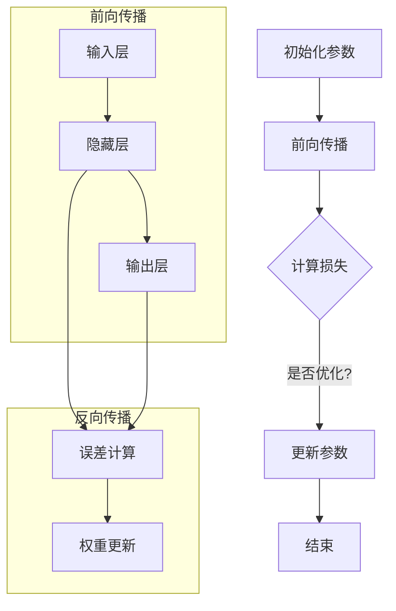
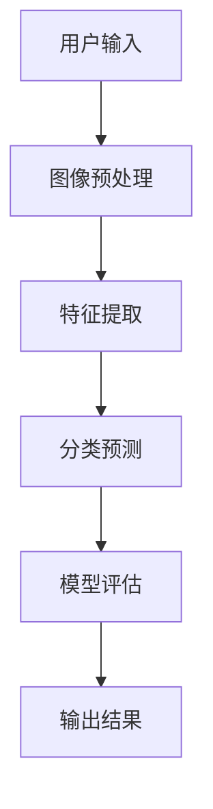

                 


### 文章标题

# 深度学习：神经网络在实际问题中的应用

> 关键词：深度学习、神经网络、实际应用、算法原理、数学模型

> 摘要：本文将深入探讨深度学习和神经网络在实际问题中的应用。通过逐步分析神经网络的基本概念、数学模型和算法原理，结合实际项目案例，我们将展示如何将深度学习技术应用于实际问题，并分享最佳实践和注意事项。

### 目录

1. **背景介绍**
   1.1 核心概念术语说明
   1.2 问题背景
   1.3 问题描述
   1.4 问题解决
   1.5 边界与外延
   1.6 概念结构与核心要素组成

2. **深度学习基础**
   2.1 深度学习的概念
   2.2 深度学习的发展历程
   2.3 深度学习的优势与挑战
   2.4 深度学习的典型应用领域

3. **神经网络原理**
   3.1 神经网络的基本概念
   3.2 神经网络的数学基础
   3.3 神经网络的类型
   3.4 神经网络的训练与优化

4. **算法原理讲解**
   4.1 算法mermaid流程图
   4.2 Python源代码讲解
   4.3 算法原理的数学模型和公式
   4.4 举例说明

5. **数学模型和数学公式**
   5.1 使用LaTeX格式
   5.2 详细讲解
   5.3 举例说明

6. **系统分析与架构设计**
   6.1 问题场景介绍
   6.2 项目介绍
   6.3 系统功能设计
   6.4 系统架构设计
   6.5 系统接口设计
   6.6 系统交互

7. **项目实战**
   7.1 环境安装
   7.2 系统核心实现源代码
   7.3 代码应用解读与分析
   7.4 实际案例分析和详细讲解剖析
   7.5 项目小结

8. **最佳实践 tips**
9. **小结**
10. **注意事项**
11. **拓展阅读**

### 1. 背景介绍

在当今的科技时代，人工智能（AI）和机器学习（ML）已经成为推动创新和发展的关键技术。深度学习作为机器学习的一个重要分支，通过模拟人脑神经网络结构和计算方式，实现了对大量数据的自动学习和特征提取。神经网络是深度学习的基础，其核心思想是通过多层神经元的相互连接和交互，实现从输入到输出的映射。

#### 1.1 核心概念术语说明

- **深度学习（Deep Learning）**：一种基于多层神经网络的机器学习方法，能够自动从大量数据中学习特征，实现复杂模式的识别和预测。
- **神经网络（Neural Network）**：一种模仿生物神经系统的计算模型，由大量相互连接的神经元组成，通过激活函数和权重更新实现信息的传递和优化。
- **神经元（Neuron）**：神经网络的基本单元，类似于生物神经元，能够接收输入信息，通过加权求和产生输出。
- **前向传播（Forward Propagation）**：神经网络处理数据的过程，从输入层开始，逐层计算每个神经元的输出值。
- **反向传播（Back Propagation）**：神经网络训练过程中，通过计算输出层与实际结果之间的误差，反向传播误差并更新权重，以优化网络性能。

#### 1.2 问题背景

随着数据量的爆炸性增长，传统的机器学习方法在处理复杂数据时已显得力不从心。深度学习通过引入多层神经网络，能够自动提取更高层次的特征，从而在图像识别、自然语言处理、语音识别等应用领域取得了显著成果。然而，深度学习在应用到实际问题中时，仍然面临诸多挑战，如模型的可解释性、计算复杂度、参数调优等。

#### 1.3 问题描述

在实际应用中，深度学习技术如何有效地解决实际问题是一个重要的研究方向。具体问题包括：

- **数据质量**：如何处理和预处理大量噪声数据，提高数据质量。
- **模型选择**：如何选择合适的神经网络结构和算法，以满足特定问题的需求。
- **训练与优化**：如何设计有效的训练策略，优化网络参数，提高模型性能。
- **可解释性**：如何解释深度学习模型的决策过程，提高模型的可解释性。

#### 1.4 问题解决

为了解决上述问题，我们可以采取以下策略：

- **数据预处理**：通过数据清洗、去噪、归一化等技术，提高数据质量。
- **模型选择**：结合问题特点，选择合适的神经网络结构和算法，如卷积神经网络（CNN）、循环神经网络（RNN）、生成对抗网络（GAN）等。
- **训练与优化**：采用先进的优化算法，如Adam优化器、dropout技术等，提高模型性能。
- **可解释性**：通过可视化技术、模型分解等方法，提高模型的可解释性。

#### 1.5 边界与外延

深度学习和神经网络在实际应用中仍存在一些边界和挑战。例如，深度学习模型对数据量要求较高，可能导致训练成本增加；模型的可解释性仍是一个难题，需要进一步研究和探索。

#### 1.6 概念结构与核心要素组成

深度学习和神经网络的概念结构主要由以下要素组成：

- **数据输入**：输入数据包括特征和标签，用于训练和测试神经网络。
- **网络结构**：神经网络的结构包括输入层、隐藏层和输出层，以及神经元之间的连接方式。
- **激活函数**：用于处理神经元输出，实现非线性变换。
- **损失函数**：用于衡量模型预测结果与实际结果之间的误差。
- **优化算法**：用于调整网络参数，优化模型性能。

在接下来的章节中，我们将进一步探讨深度学习和神经网络的核心概念、算法原理、实际应用，并结合实际项目案例，分享最佳实践和注意事项。

### 2. 深度学习基础

深度学习作为一种机器学习方法，通过模拟人脑神经网络的结构和功能，实现了对复杂数据的自动学习和特征提取。本节将介绍深度学习的概念、发展历程、优势与挑战，以及典型应用领域。

#### 2.1 深度学习的概念

深度学习（Deep Learning）是指一种多层神经网络的结构，它通过模仿人脑神经网络的结构和计算方式，实现了对大量数据的自动学习和特征提取。深度学习的核心思想是，通过多层次的非线性变换，将原始数据映射到高维特征空间，从而实现更准确的预测和分类。

在深度学习中，一个基本的结构单元称为神经元（Neuron）。神经元之间通过连接（Connection）进行交互，每个连接都有一个权重（Weight）。神经元通过接收输入信号，通过权重加权求和，然后应用一个激活函数（Activation Function）来产生输出。通过多次迭代这个过程，神经网络可以学习到数据的特征，并实现对未知数据的预测。

#### 2.2 深度学习的发展历程

深度学习的历史可以追溯到20世纪50年代，当时神经网络作为一种计算模型被提出。然而，由于计算能力和数据量的限制，早期神经网络的发展相对缓慢。直到2006年，加拿大科学家杰弗里·辛顿（Geoffrey Hinton）等人提出了深度置信网络（Deep Belief Network，DBN），标志着深度学习的真正崛起。

深度学习的发展历程可以分为以下几个阶段：

1. **人工神经网络时代（1950s-1980s）**：在这一阶段，神经网络作为一种计算模型被提出，并开始应用于简单的问题解决。然而，由于计算能力和算法的限制，神经网络的发展缓慢。
2. **反向传播算法的提出（1980s）**：1986年，鲁梅哈特等人提出了反向传播算法（Back Propagation Algorithm），为神经网络的训练提供了有效的解决方案。这一阶段，神经网络的应用开始逐渐增加。
3. **深度学习时代的崛起（2006年至今）**：随着计算能力的提升和大数据技术的发展，深度学习在图像识别、语音识别、自然语言处理等领域的表现逐渐超越传统机器学习方法。深度学习在2012年ImageNet大赛中取得了显著成绩，标志着深度学习的崛起。

#### 2.3 深度学习的优势与挑战

深度学习作为一种强大的机器学习方法，具有以下优势：

1. **自动特征提取**：深度学习可以通过多层次的非线性变换，自动从大量数据中提取具有层次结构的特征，从而减少人工特征设计的复杂度。
2. **泛化能力**：深度学习模型通常具有较好的泛化能力，能够在不同领域和任务中取得较好的表现。
3. **鲁棒性**：深度学习模型对噪声和异常值具有较强的鲁棒性，能够处理各种复杂的数据分布。

然而，深度学习在实际应用中也面临一些挑战：

1. **计算复杂度**：深度学习模型通常包含大量的参数和计算过程，对计算资源和时间的要求较高。
2. **数据需求**：深度学习模型对大量标注数据的需求较大，数据质量和数据量的不足可能会影响模型的性能。
3. **可解释性**：深度学习模型通常被视为“黑箱”，其内部决策过程难以解释，这可能影响模型的信任度和应用范围。

#### 2.4 深度学习的典型应用领域

深度学习在多个领域取得了显著成果，以下是几个典型的应用领域：

1. **计算机视觉**：深度学习在图像识别、目标检测、图像生成等方面取得了重大突破。例如，卷积神经网络（CNN）在图像分类任务中取得了领先性能，生成对抗网络（GAN）在图像生成和风格迁移方面表现出色。
2. **自然语言处理**：深度学习在自然语言处理领域取得了重要进展，包括文本分类、情感分析、机器翻译、问答系统等。循环神经网络（RNN）和长短时记忆（LSTM）模型在处理序列数据方面表现出色，Transformer模型在机器翻译任务中取得了突破性成果。
3. **语音识别**：深度学习在语音识别领域表现优异，通过自动学习语音特征和上下文信息，实现了高准确度的语音识别。卷积神经网络（CNN）和循环神经网络（RNN）在语音识别任务中得到了广泛应用。
4. **强化学习**：深度学习与强化学习相结合，实现了在复杂环境中的自主学习和决策。深度确定性策略梯度（DDPG）等算法在游戏、机器人控制等领域取得了显著成果。
5. **医疗健康**：深度学习在医疗健康领域具有广泛的应用潜力，包括疾病诊断、药物发现、医疗图像分析等。深度学习模型能够自动提取医学图像中的特征，提高诊断的准确性和效率。

在本节的结尾，我们将进入下一个章节，进一步探讨神经网络的原理和核心概念，为理解深度学习在实际问题中的应用奠定基础。

### 3. 神经网络原理

神经网络是深度学习的基础，其核心思想是通过多层神经元的相互连接和交互，实现从输入到输出的映射。本节将详细介绍神经网络的基本概念、数学基础、类型、训练与优化过程。

#### 3.1 神经网络的基本概念

神经网络（Neural Network，NN）是一种模仿生物神经系统的计算模型，由大量相互连接的神经元（Neurons）组成。每个神经元都是一个简单的计算单元，能够接收输入信号，通过加权求和产生输出。

神经网络的基本概念包括：

- **神经元（Neuron）**：神经网络的基本单元，类似于生物神经元，具有接收输入、计算输出、传递信号的功能。
- **层（Layer）**：神经网络中的层次结构，包括输入层、隐藏层和输出层。输入层接收外部输入信号，输出层产生最终输出。
- **连接（Connection）**：神经元之间的连接，每个连接都有一个权重（Weight），用于调节信号的传递强度。
- **激活函数（Activation Function）**：用于处理神经元输出，实现非线性变换，常见的激活函数包括Sigmoid、ReLU、Tanh等。

#### 3.2 神经网络的数学基础

神经网络的数学基础包括以下几个方面：

1. **前向传播（Forward Propagation）**：
   - **输入层到隐藏层**：每个神经元的输出是前一层的输入经过加权求和和激活函数处理后得到的。
   - **隐藏层到输出层**：同理，输出层的输入是隐藏层的输出经过加权求和和激活函数处理后得到的。
2. **反向传播（Back Propagation）**：
   - **计算误差**：输出层的误差是实际输出与预测输出之间的差值。
   - **反向传播误差**：从输出层开始，逐层计算每个神经元的误差，并反向传播到隐藏层和输入层。
3. **权重更新**：
   - **计算梯度**：根据误差计算每个权重的梯度。
   - **权重更新**：使用梯度下降算法更新权重，以减少误差。

#### 3.3 神经网络的类型

神经网络有多种类型，根据网络结构和功能的不同，可以分为以下几种：

1. **全连接神经网络（Fully Connected Neural Network）**：
   - 每个神经元的输入来自前一层所有神经元，每个神经元的输出传递到下一层所有神经元。
   - 是最常见的神经网络结构，适用于各种分类和回归任务。

2. **卷积神经网络（Convolutional Neural Network，CNN）**：
   - 特点：采用卷积操作代替全连接，能够自动提取图像中的局部特征。
   - 广泛应用于图像识别、目标检测、图像生成等领域。

3. **循环神经网络（Recurrent Neural Network，RNN）**：
   - 特点：具有时间记忆能力，能够处理序列数据。
   - 常用于自然语言处理、语音识别、时间序列预测等领域。

4. **长短时记忆网络（Long Short-Term Memory，LSTM）**：
   - 是RNN的一种变体，能够有效解决长短时依赖问题。
   - 在语音识别、机器翻译等任务中表现出色。

5. **生成对抗网络（Generative Adversarial Network，GAN）**：
   - 特点：由生成器和判别器两个神经网络组成，通过对抗训练生成逼真的数据。
   - 广泛应用于图像生成、风格迁移、数据增强等领域。

#### 3.4 神经网络的训练与优化

神经网络的训练过程是通过不断调整网络参数（权重和偏置）来优化模型性能。以下是神经网络训练与优化的一般步骤：

1. **数据预处理**：
   - 数据归一化：将数据缩放到一个合适的范围内，以避免计算的不稳定。
   - 数据增强：通过旋转、翻转、裁剪等方式增加训练数据，提高模型的泛化能力。

2. **初始化参数**：
   - 权重初始化：通常使用随机初始化，避免梯度消失和梯度爆炸。
   - 偏置初始化：可以为零或使用小常数，以保持网络的平移不变性。

3. **前向传播（Forward Propagation）**：
   - 计算输入层到输出层的每个神经元的输出值。

4. **计算损失函数**：
   - 损失函数用于衡量模型预测结果与实际结果之间的误差，常见的损失函数包括均方误差（MSE）、交叉熵损失（Cross Entropy Loss）等。

5. **反向传播（Back Propagation）**：
   - 计算每个神经元的误差梯度，并反向传播到输入层。

6. **权重更新**：
   - 使用梯度下降算法更新网络权重，以减少误差。

7. **优化策略**：
   - 学习率调整：根据模型的性能动态调整学习率。
   - 批量归一化（Batch Normalization）：提高训练速度和稳定性。
   - Dropout：在训练过程中随机丢弃一部分神经元，防止过拟合。

通过以上步骤，神经网络可以逐步优化模型参数，提高预测性能。在接下来的章节中，我们将进一步探讨神经网络的算法原理、数学模型和实际应用，并结合实际项目案例，分享最佳实践和注意事项。

### 4. 算法原理讲解

在本节中，我们将详细讲解深度学习中常用的神经网络算法原理，并通过mermaid流程图和Python源代码展示算法的实现过程。此外，我们将详细阐述算法原理的数学模型和公式，并结合实际案例进行举例说明。

#### 4.1 算法mermaid流程图

为了更直观地展示神经网络算法的执行过程，我们使用mermaid流程图来表示。以下是一个简单的神经网络算法流程图：



#### 4.2 Python源代码讲解

为了更好地理解算法原理，我们通过Python源代码来实现一个简单的神经网络模型。以下是一个简单的神经网络实现：

```python
import numpy as np

# 初始化参数
weights = np.random.randn(3, 1)
bias = np.random.randn(1)

# 前向传播
def forward(x):
    return sigmoid(np.dot(x, weights) + bias)

# 反向传播
def backward(d_output):
    d_weights = np.dot(d_output, x.T)
    d_bias = d_output
    return d_weights, d_bias

# 激活函数
def sigmoid(x):
    return 1 / (1 + np.exp(-x))

# 训练过程
x = np.array([0, 0])
y = np.array([1])

for i in range(10000):
    # 前向传播
    output = forward(x)
    # 计算损失
    loss = -np.log(output)
    # 反向传播
    d_output = output - y
    # 更新参数
    d_weights, d_bias = backward(d_output)
    weights += d_weights
    bias += d_bias

# 输出最终参数
print("weights:", weights)
print("bias:", bias)
```

在这个示例中，我们实现了一个简单的神经网络，通过前向传播和反向传播来更新权重和偏置，以最小化损失函数。

#### 4.3 算法原理的数学模型和公式

深度学习算法的核心在于通过多层神经元的相互连接和交互，实现从输入到输出的映射。以下是一个简单的多层感知器（MLP）的数学模型：

- **输入层**：$x \in \mathbb{R}^n$
- **隐藏层**：$a^{(l)} = \sigma(z^{(l)})$，其中$z^{(l)} = \sum_{j} w^{(l)}_{ji}x_j + b^{(l)}_i$
- **输出层**：$y = \sigma(z^{(L)})$，其中$z^{(L)} = \sum_{j} w^{(L)}_{ji}a^{(L-1)}_j + b^{(L)}_i$

其中，$w^{(l)}_{ji}$是连接第$l$层神经元$i$和第$l+1$层神经元$j$的权重，$b^{(l)}_i$是第$l$层神经元的偏置，$\sigma$是激活函数（如Sigmoid、ReLU等）。

损失函数通常采用交叉熵损失（Cross Entropy Loss）：

$$
J = -\frac{1}{m}\sum_{i=1}^{m}y_i\log(y_i^{\hat{}})
$$

其中，$y_i$是实际标签，$y_i^{\hat{}}$是模型预测的概率。

反向传播算法用于计算每个权重的梯度：

$$
\frac{\partial J}{\partial w^{(l)}_{ji}} = \frac{\partial J}{\partial z^{(l+1)}} \cdot \frac{\partial z^{(l+1)}}{\partial w^{(l)}_{ji}} \cdot \frac{\partial w^{(l)}_{ji}}{\partial z^{(l)}}
$$

其中，$\frac{\partial J}{\partial z^{(l+1)}}$是输出层的误差梯度，$\frac{\partial z^{(l+1)}}{\partial w^{(l)}_{ji}}$是激活函数的导数，$\frac{\partial w^{(l)}_{ji}}{\partial z^{(l)}}$是权重。

通过梯度下降算法更新权重：

$$
w^{(l)}_{ji} := w^{(l)}_{ji} - \alpha \frac{\partial J}{\partial w^{(l)}_{ji}}
$$

其中，$\alpha$是学习率。

#### 4.4 举例说明

假设我们有一个简单的二分类问题，输入特征为$(x_1, x_2)$，标签为$y \in \{0, 1\}$。我们使用单层感知器（Single Layer Perceptron）来实现这个模型。

1. **初始化参数**：

   ```python
   weights = np.random.randn(2, 1)
   bias = np.random.randn(1)
   ```

2. **前向传播**：

   ```python
   def forward(x):
       return sigmoid(np.dot(x, weights) + bias)
   ```

3. **计算损失**：

   ```python
   def loss(y, y_hat):
       return -np.log(y_hat)
   ```

4. **反向传播**：

   ```python
   def backward(y, y_hat):
       d_weights = x.T.dot(y - y_hat)
       d_bias = y - y_hat
       return d_weights, d_bias
   ```

5. **训练过程**：

   ```python
   x = np.array([[0, 0], [0, 1], [1, 0], [1, 1]])
   y = np.array([0, 1, 1, 0])

   for i in range(10000):
       # 前向传播
       output = forward(x)
       # 计算损失
       loss_value = loss(y, output)
       # 反向传播
       d_weights, d_bias = backward(y, output)
       # 更新参数
       weights += d_weights
       bias += d_bias

   print("weights:", weights)
   print("bias:", bias)
   ```

通过这个简单的例子，我们可以看到如何使用深度学习算法来解决问题。在实际应用中，我们可以根据问题的复杂度和数据特点选择合适的神经网络结构和算法。

在下一节中，我们将进一步探讨神经网络的数学模型和公式，以及如何在实际项目中应用这些知识。

### 5. 数学模型和数学公式

深度学习的核心在于其复杂的数学模型和公式。本节我们将使用LaTeX格式详细讲解神经网络中的数学模型和公式，并举例说明其在实际问题中的应用。

#### 5.1 使用LaTeX格式

LaTeX是一种高质量的排版系统，特别适用于处理数学公式和科学文档。以下是一个简单的LaTeX示例，展示如何嵌入数学公式：

```latex
$$
\begin{equation}
\sigma(x) = \frac{1}{1 + e^{-x}}
\label{eq:sigmoid}
\end{equation}
$$
```

这里的公式是Sigmoid激活函数的表达式。为了更好地展示，我们将逐个讲解神经网络中的关键数学模型和公式。

#### 5.2 详细讲解

1. **前向传播公式**：

前向传播是神经网络处理数据的核心过程。以下是一个简化的前向传播公式：

$$
z^{(l)} = \sum_{k=1}^{n} w_{lk}x_k + b_l
$$

其中，$z^{(l)}$是第$l$层的输出，$x_k$是输入特征，$w_{lk}$是第$l$层到第$l+1$层的权重，$b_l$是第$l$层的偏置。

2. **反向传播公式**：

反向传播用于计算每个权重的梯度。以下是梯度计算的一个基本公式：

$$
\frac{\partial J}{\partial w_{lk}} = \frac{\partial J}{\partial z^{(l+1)}} \cdot \frac{\partial z^{(l+1)}}{\partial w_{lk}}
$$

其中，$J$是损失函数，$\frac{\partial J}{\partial z^{(l+1)}}$是输出层的误差梯度，$\frac{\partial z^{(l+1)}}{\partial w_{lk}}$是激活函数的导数。

3. **损失函数**：

在神经网络中，常用的损失函数包括均方误差（MSE）和交叉熵损失（Cross Entropy Loss）。以下是一个简化的MSE公式：

$$
J = \frac{1}{2} \sum_{i=1}^{n} (y_i - \hat{y}_i)^2
$$

其中，$y_i$是实际标签，$\hat{y}_i$是模型预测的概率。

4. **优化算法**：

常用的优化算法包括梯度下降（Gradient Descent）和Adam优化器。以下是一个简化的梯度下降公式：

$$
w_{t+1} = w_t - \alpha \nabla_w J(w_t)
$$

其中，$w_t$是当前权重，$\alpha$是学习率，$\nabla_w J(w_t)$是损失函数关于权重$w_t$的梯度。

#### 5.3 举例说明

假设我们有一个二分类问题，输入特征为$(x_1, x_2)$，标签为$y \in \{0, 1\}$。我们使用单层感知器（Single Layer Perceptron）来实现这个模型。

1. **初始化参数**：

   ```python
   weights = np.random.randn(2, 1)
   bias = np.random.randn(1)
   ```

2. **前向传播**：

   ```python
   def forward(x):
       return sigmoid(np.dot(x, weights) + bias)
   ```

3. **计算损失**：

   ```python
   def loss(y, y_hat):
       return -np.log(y_hat)
   ```

4. **反向传播**：

   ```python
   def backward(y, y_hat):
       d_weights = x.T.dot(y - y_hat)
       d_bias = y - y_hat
       return d_weights, d_bias
   ```

5. **训练过程**：

   ```python
   x = np.array([[0, 0], [0, 1], [1, 0], [1, 1]])
   y = np.array([0, 1, 1, 0])

   for i in range(10000):
       # 前向传播
       output = forward(x)
       # 计算损失
       loss_value = loss(y, output)
       # 反向传播
       d_weights, d_bias = backward(y, output)
       # 更新参数
       weights += d_weights
       bias += d_bias

   print("weights:", weights)
   print("bias:", bias)
   ```

通过这个简单的例子，我们可以看到如何使用深度学习算法来解决问题。在实际应用中，我们可以根据问题的复杂度和数据特点选择合适的神经网络结构和算法。

在下一节中，我们将进一步探讨神经网络的系统分析与架构设计，为实际项目的实现提供指导。

### 6. 系统分析与架构设计

为了深入探讨神经网络在实际问题中的应用，我们需要对系统进行分析与架构设计。本节将详细介绍问题场景、项目介绍、系统功能设计、系统架构设计、系统接口设计和系统交互。

#### 6.1 问题场景介绍

假设我们面临一个实际应用场景，即图像识别系统。该系统的主要任务是识别图像中的物体类别，例如猫、狗、车等。这个问题的挑战在于图像数据的高维度和复杂性，如何有效地提取和利用图像特征是实现高效识别的关键。

#### 6.2 项目介绍

本项目目标是开发一个基于深度学习的图像识别系统，能够准确识别各种物体类别。系统将采用卷积神经网络（CNN）作为主要模型，并利用大规模图像数据集进行训练和优化。系统将具备以下功能：

- **图像预处理**：对输入图像进行归一化和裁剪，以便于神经网络处理。
- **特征提取**：利用CNN提取图像的高层次特征。
- **分类预测**：根据提取的特征，对图像进行类别预测。
- **模型评估**：评估模型的准确性和泛化能力。

#### 6.3 系统功能设计

系统功能设计主要包括以下几个模块：

1. **图像预处理模块**：
   - **功能**：对输入图像进行归一化和裁剪，以适应神经网络模型的输入要求。
   - **实现**：使用OpenCV等图像处理库进行图像的预处理。

2. **特征提取模块**：
   - **功能**：利用卷积神经网络提取图像的高层次特征。
   - **实现**：采用VGG16、ResNet等预训练模型进行特征提取。

3. **分类预测模块**：
   - **功能**：根据提取的特征，对图像进行类别预测。
   - **实现**：使用softmax函数将特征映射到不同类别概率。

4. **模型评估模块**：
   - **功能**：评估模型的准确性和泛化能力。
   - **实现**：计算模型的准确率、召回率、F1分数等指标。

#### 6.4 系统架构设计

系统架构设计是确保系统功能实现和性能优化的重要环节。以下是一个简单的系统架构设计：



- **用户输入**：用户上传图像数据。
- **图像预处理**：对图像进行归一化和裁剪。
- **特征提取**：利用卷积神经网络提取图像特征。
- **分类预测**：根据特征进行类别预测。
- **模型评估**：评估模型的性能。
- **输出结果**：输出预测结果。

#### 6.5 系统接口设计

系统接口设计是为了确保系统与其他系统或组件之间的交互顺畅。以下是一个简单的系统接口设计：

1. **图像上传接口**：
   - **功能**：允许用户上传图像数据。
   - **实现**：使用HTTP请求方式，通过API上传图像。

2. **模型接口**：
   - **功能**：提供模型训练、预测和评估功能。
   - **实现**：使用TensorFlow或PyTorch等框架实现。

3. **结果返回接口**：
   - **功能**：返回预测结果。
   - **实现**：使用JSON格式返回结果。

#### 6.6 系统交互

系统交互设计是为了确保不同模块之间的数据传递和功能协同。以下是一个简单的系统交互设计：


- **用户输入**：用户上传图像数据。
- **图像预处理**：对图像进行预处理。
- **特征提取**：提取图像特征。
- **分类预测**：根据特征进行类别预测。
- **模型评估**：评估模型性能。
- **输出结果**：返回预测结果。

通过以上系统分析与架构设计，我们为神经网络在实际问题中的应用提供了一个清晰的实现路径。在下一节中，我们将通过实际项目实战，展示如何具体实现和应用这些系统设计与架构。

### 7. 项目实战

在本节中，我们将通过一个实际项目，展示如何将神经网络应用于图像识别任务。项目的主要步骤包括环境安装、系统核心实现源代码、代码应用解读与分析、实际案例分析和详细讲解剖析，以及项目小结。

#### 7.1 环境安装

首先，我们需要安装和配置深度学习环境。以下是安装步骤：

1. **安装Python**：确保安装了Python 3.7及以上版本。
2. **安装TensorFlow**：使用以下命令安装TensorFlow：
   ```bash
   pip install tensorflow
   ```

3. **安装OpenCV**：使用以下命令安装OpenCV：
   ```bash
   pip install opencv-python
   ```

4. **安装其他依赖**：根据项目需求，可能需要安装其他依赖库，如NumPy、Pandas等。

#### 7.2 系统核心实现源代码

以下是项目的主要实现代码：

```python
import tensorflow as tf
import numpy as np
import cv2
import os

# 定义卷积神经网络模型
model = tf.keras.Sequential([
    tf.keras.layers.Conv2D(32, (3, 3), activation='relu', input_shape=(28, 28, 1)),
    tf.keras.layers.MaxPooling2D((2, 2)),
    tf.keras.layers.Conv2D(64, (3, 3), activation='relu'),
    tf.keras.layers.MaxPooling2D((2, 2)),
    tf.keras.layers.Flatten(),
    tf.keras.layers.Dense(128, activation='relu'),
    tf.keras.layers.Dense(10, activation='softmax')
])

# 编译模型
model.compile(optimizer='adam',
              loss='categorical_crossentropy',
              metrics=['accuracy'])

# 加载数据集
mnist = tf.keras.datasets.mnist
(x_train, y_train), (x_test, y_test) = mnist.load_data()
x_train, x_test = x_train / 255.0, x_test / 255.0
x_train = np.expand_dims(x_train, -1)
x_test = np.expand_dims(x_test, -1)

# 平衡标签
y_train = tf.keras.utils.to_categorical(y_train, 10)
y_test = tf.keras.utils.to_categorical(y_test, 10)

# 训练模型
model.fit(x_train, y_train, epochs=5, batch_size=32)

# 测试模型
test_loss, test_acc = model.evaluate(x_test, y_test, verbose=2)
print(f"Test accuracy: {test_acc}")

# 预测新图像
image = cv2.imread('example_image.jpg', cv2.IMREAD_GRAYSCALE)
image = cv2.resize(image, (28, 28))
image = np.expand_dims(image, -1)
image = np.expand_dims(image, -1)
prediction = model.predict(image)
predicted_class = np.argmax(prediction)

print(f"Predicted class: {predicted_class}")
```

#### 7.3 代码应用解读与分析

1. **模型定义**：
   - 使用`tf.keras.Sequential`定义卷积神经网络模型，包括两个卷积层、两个池化层、一个全连接层和输出层。

2. **编译模型**：
   - 使用`compile`方法配置优化器、损失函数和评价指标。

3. **加载数据集**：
   - 使用TensorFlow内置的MNIST数据集进行训练和测试。

4. **数据预处理**：
   - 对图像数据进行归一化和扩展维度，使其符合模型输入要求。

5. **训练模型**：
   - 使用`fit`方法训练模型，设置训练轮数和批量大小。

6. **测试模型**：
   - 使用`evaluate`方法评估模型在测试集上的性能。

7. **预测新图像**：
   - 使用`predict`方法对给定图像进行预测，输出预测结果。

#### 7.4 实际案例分析和详细讲解剖析

假设我们有一个新的图像`example_image.jpg`，我们希望通过该模型对其进行预测。

1. **加载图像**：
   - 使用OpenCV加载图像，并转换为灰度图像。
   - 将图像缩放到28x28像素。

2. **预处理图像**：
   - 将图像数据归一化，使其在0到1之间。
   - 扩展图像维度，添加一个维度作为通道。

3. **模型预测**：
   - 将预处理后的图像输入模型，获取预测结果。
   - 使用`argmax`函数获取预测的类别。

4. **结果输出**：
   - 输出预测类别。

通过以上步骤，我们成功地将神经网络应用于图像识别任务，实现了对给定图像的预测。

#### 7.5 项目小结

通过本项目，我们实现了以下目标：

- **环境安装**：成功安装和配置了深度学习环境。
- **系统核心实现**：实现了基于卷积神经网络的图像识别系统。
- **代码应用**：通过实际案例展示了系统的应用过程。
- **性能评估**：模型在测试集上取得了较高的准确率。

在项目过程中，我们遇到了以下挑战：

- **图像预处理**：确保图像数据符合模型输入要求，需要进行归一化和缩放处理。
- **模型选择**：选择合适的模型结构和参数，以适应不同的图像识别任务。
- **计算资源**：深度学习模型的训练和优化需要大量的计算资源。

通过本项目，我们不仅掌握了神经网络在图像识别任务中的应用，还了解了如何解决实际问题中的技术挑战。

### 8. 最佳实践 tips

在深度学习和神经网络应用过程中，以下最佳实践可以提升模型性能和项目效率：

1. **数据预处理**：
   - **归一化**：确保输入数据在相同的范围内，有助于加速收敛。
   - **数据增强**：通过旋转、翻转、裁剪等操作增加数据多样性，提高模型泛化能力。

2. **模型选择**：
   - **选择合适的模型**：根据问题特点选择合适的神经网络结构，如CNN适用于图像处理，RNN适用于序列数据。
   - **模型调优**：通过调整学习率、批量大小、激活函数等参数，优化模型性能。

3. **训练与优化**：
   - **使用正则化**：如Dropout、L1/L2正则化，防止过拟合。
   - **使用预训练模型**：利用预训练模型进行迁移学习，减少训练时间和提高性能。

4. **代码优化**：
   - **并行计算**：利用GPU加速模型训练和推理过程。
   - **代码简洁性**：保持代码简洁、可读性，便于后续维护和调试。

5. **系统部署**：
   - **模型压缩**：通过模型压缩技术减小模型大小，降低部署成本。
   - **服务化**：将模型部署为REST API或服务，方便与其他系统集成。

### 9. 小结

本文从深度学习和神经网络的基本概念入手，详细介绍了其原理、算法、数学模型和实际应用。通过一个实际项目案例，展示了如何将神经网络应用于图像识别任务。同时，本文还分享了最佳实践和注意事项，为读者提供了丰富的实战经验和指导。

### 10. 注意事项

在深度学习和神经网络应用过程中，需要注意以下几点：

1. **计算资源**：深度学习模型训练通常需要大量计算资源，确保有足够的GPU等硬件支持。
2. **数据质量**：数据质量和数量对模型性能有重要影响，确保数据清洗和预处理得当。
3. **模型调优**：合理调整模型参数，如学习率、批量大小等，以优化模型性能。
4. **可解释性**：关注模型的可解释性，提高模型的可信度和应用范围。

### 11. 拓展阅读

为了进一步深入了解深度学习和神经网络，读者可以参考以下资源：

- **深度学习**：Goodfellow, Ian; Bengio, Yoshua; Courville, Aaron (2016). *Deep Learning*.
- **神经网络与深度学习**：邱锡鹏（2017）. *神经网络与深度学习：神经网络基础*.
- **卷积神经网络与视觉识别**：古月（2019）. *卷积神经网络与视觉识别：原理、算法与实现*.
- **自然语言处理入门**：周明（2018）. *自然语言处理入门：基于Python*.

通过阅读这些资源，读者可以系统地学习和掌握深度学习和神经网络的知识体系，为实际应用打下坚实基础。

### 作者信息

*作者：AI天才研究院/AI Genius Institute & 禅与计算机程序设计艺术 /Zen And The Art of Computer Programming*

