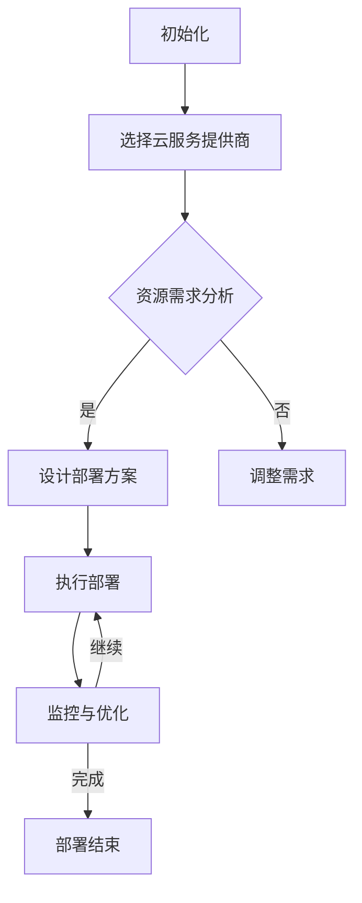
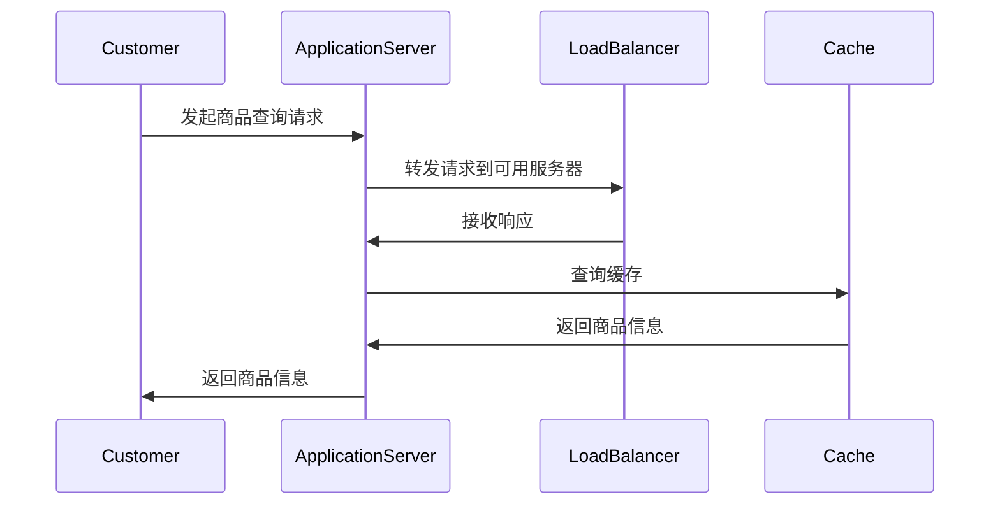
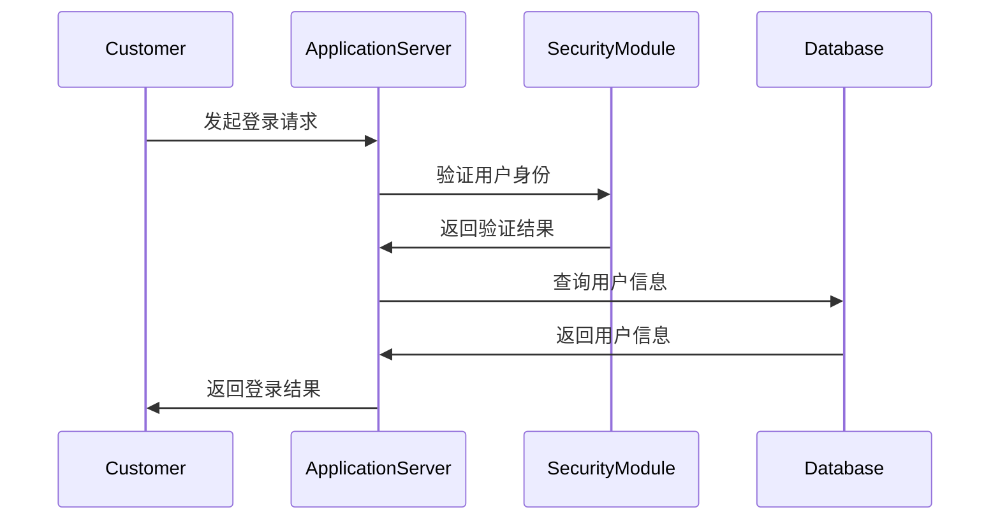

                 

# 混合云部署: 平衡安全与灵活性的架构

## 关键词
- 混合云
- 安全
- 灵活性
- 部署架构
- IT基础设施

## 摘要
本文探讨了混合云部署的关键议题，即如何在确保系统安全的同时，实现高度的灵活性。通过详细分析混合云的基础概念、安全性要求、灵活性指标，以及架构设计策略，本文旨在为IT专业人士提供一套全面、实用的混合云部署指南。文章还将结合实际案例，展示如何在实践中平衡这两大要素，并总结最佳实践以供参考。

## Step 1: 背景介绍

### 1.1.1 混合云的概念与重要性
混合云是指将公有云和私有云结合在一起，以获得两者的最佳优势。在公有云中，企业可以使用第三方提供的计算资源，以灵活、高效的方式扩展业务；而在私有云中，企业可以控制自己的数据和处理能力，从而确保敏感信息和关键业务的保密性和可靠性。

在现代企业的IT架构中，混合云的重要性不容忽视。首先，它能够帮助企业实现资源的优化配置，根据业务需求动态调整计算资源的使用。其次，混合云提供了高可用性和灾难恢复能力，使企业能够更好地应对突发事件和业务中断。最后，混合云还支持多租户环境，便于企业进行资源隔离和权限管理，从而提升整体运营效率。

### 1.1.2 安全与灵活性在混合云中的双重挑战
混合云部署带来了安全与灵活性的双重挑战。一方面，随着企业对云服务的依赖增加，数据泄露、系统入侵等安全威胁也日益严重。企业需要采取严格的安全措施，如数据加密、访问控制、漏洞扫描等，来保障系统的安全性。另一方面，企业需要在保证安全的前提下，实现高效的业务流程和灵活的资源管理。

## Step 2: 核心概念与联系

### 1.2.1 混合云的基础概念
#### 1.2.1.1 公有云与私有云
- **公有云**：由第三方提供商管理，为多个租户提供服务，具有高可用性、可扩展性和低成本等特点。
- **私有云**：为企业内部使用，提供更高级别的安全性和灵活性，通常部署在企业的数据中心或托管设施中。

#### 1.2.1.2 混合云的优势与挑战
- **优势**：
  - 灵活调整资源使用
  - 提高系统可用性和灾难恢复能力
  - 降低基础设施成本
- **挑战**：
  - 安全性问题：涉及跨云服务的数据保护
  - 管理复杂性：涉及多云环境的运维和管理
  - 法规遵从：需要满足不同地区和行业的数据法规要求

### 1.2.2 安全与灵活性的概念
#### 1.2.2.1 安全性的要求与评估方法
- **安全性要求**：确保数据完整性、保密性和可用性。
- **评估方法**：进行安全审计、风险评估、漏洞扫描等。

#### 1.2.2.2 灵活性的指标与实现策略
- **灵活性指标**：包括资源分配效率、业务响应速度、系统可扩展性等。
- **实现策略**：采用自动化部署、容器化技术、服务网格等。

### 1.2.3 核心概念联系图
```mermaid
erDiagram
    Cloud_Server : 公有云服务器
    Private_Server : 私有云服务器
    Hybrid_Cloud : 混合云架构
    Security_Measure : 安全措施
    Flexibility_Strategy : 灵活策略
    Cloud_Server -> Hybrid_Cloud
    Private_Server -> Hybrid_Cloud
    Hybrid_Cloud -> Security_Measure
    Hybrid_Cloud -> Flexibility_Strategy
```

## Step 3: 算法原理讲解

### 1.3.1 混合云部署策略
为了实现混合云部署，我们需要设计一个综合的部署策略。以下是一个简单的算法流程图，用于描述混合云部署的基本步骤。

#### 1.3.1.1 算法流程图


#### 1.3.1.2 Python源代码示例
```python
def hybrid_cloud_deployment(resources):
    if resources['storage'] + resources['compute'] + resources['network'] > 100:
        print("资源需求过大，请调整需求。")
        return False
    
    print("开始选择云服务提供商...")
    provider = choose_provider()
    
    print("进行资源需求分析...")
    if not analyze_resources(resources):
        print("资源需求分析失败，请调整。")
        return False
    
    print("设计部署方案...")
    deployment_plan = design_deployment(resources)
    
    print("执行部署...")
    success = execute_deployment(deployment_plan)
    
    if success:
        print("部署成功。")
        return True
    else:
        print("部署失败，请重新部署。")
        return False

def choose_provider():
    # 选择云服务提供商的逻辑
    pass

def analyze_resources(resources):
    # 资源需求分析的逻辑
    pass

def design_deployment(resources):
    # 设计部署方案的逻辑
    pass

def execute_deployment(deployment_plan):
    # 执行部署的逻辑
    pass
```

#### 1.3.1.3 算法原理的数学模型与公式讲解
混合云部署策略的数学模型可以表示为：
$$
\text{Deployment\_Strategy} = f(\text{Resources}, \text{Provider}, \text{Security}, \text{Flexibility})
$$
其中，$f$ 表示部署策略函数，$\text{Resources}$ 表示资源需求，$\text{Provider}$ 表示云服务提供商，$\text{Security}$ 表示安全措施，$\text{Flexibility}$ 表示灵活性策略。

#### 1.3.1.4 举例说明
假设企业需要部署一个高性能的数据库系统，资源需求如下：
- 存储：1TB
- 计算资源：8核CPU，16GB内存
- 网络带宽：1Gbps

根据上述算法流程，首先选择一个合适的云服务提供商，然后进行资源需求分析。如果资源需求符合要求，则设计部署方案，并执行部署。在此过程中，需要考虑安全性（如数据加密、访问控制）和灵活性（如弹性扩展、负载均衡）。

## Step 4: 系统分析与架构设计方案

### 1.4.1 混合云部署场景介绍
假设某企业需要在全球范围内部署一个电子商务平台，以应对季节性促销活动带来的流量高峰。该平台需要具备高可用性、可扩展性和安全性，同时要降低运营成本。

### 1.4.2 系统功能设计
为了实现上述需求，系统需要具备以下功能：
- 用户认证与授权
- 商品展示与管理
- 订单处理与支付
- 数据存储与检索
- 系统监控与日志记录

#### 1.4.2.1 领域模型类图
```mermaid
classDiagram
    Customer <|-- Order
    Product <|-- Order
    ShoppingCart <|-- Customer
    Payment <|-- Order
    Inventory <|-- Product
    User <|-- Customer, Administrator
    OrderProcessor <|-- Order
    Database <|-- Inventory, Order, User
    Cache <|-- Database
    LoadBalancer <|-- ApplicationServer
    ApplicationServer <|-- OrderProcessor, PaymentProcessor
    SecurityModule <|-- ApplicationServer
    LogModule <|-- ApplicationServer
```

### 1.4.3 系统架构设计
系统架构需要支持高并发、可扩展和高可用性，同时要确保数据的安全性和隐私性。以下是一个简单的系统架构图：

#### 1.4.3.1 系统架构图
```mermaid
graph TD
    Customer --> Order
    Product --> Order
    ShoppingCart --> Customer
    Payment --> Order
    Inventory --> Product
    User --> Customer, Administrator
    OrderProcessor --> Order
    Database --> Inventory, Order, User
    Cache --> Database
    LoadBalancer --> ApplicationServer
    ApplicationServer --> OrderProcessor, PaymentProcessor
    SecurityModule --> ApplicationServer
    LogModule --> ApplicationServer
```

### 1.4.4 系统接口设计
系统接口设计需要考虑各个模块之间的交互和通信。以下是一个简单的接口设计：

#### 1.4.4.1 接口设计与描述


### 1.4.5 系统交互
系统交互需要确保各个模块之间的协同工作。以下是一个简单的系统交互序列图：

#### 1.4.5.1 系统交互序列图


## Step 5: 项目实战

### 1.5.1 环境安装
环境安装包括安装必要的操作系统、云平台服务、数据库和应用程序。以下是一个简单的安装步骤：

1. 安装Linux操作系统。
2. 安装Docker和Kubernetes，以便进行容器化部署。
3. 安装云平台服务（如AWS、Azure、Google Cloud等）。
4. 安装MySQL或PostgreSQL数据库。
5. 安装Nginx或其他Web服务器。

### 1.5.2 系统核心实现
系统核心实现包括应用程序代码、配置文件和部署脚本。以下是一个简单的Python应用程序代码示例：

```python
from flask import Flask, jsonify, request

app = Flask(__name__)

@app.route('/api/products', methods=['GET'])
def get_products():
    # 获取商品信息
    pass

@app.route('/api/products/<int:product_id>', methods=['GET'])
def get_product(product_id):
    # 获取特定商品信息
    pass

@app.route('/api/orders', methods=['POST'])
def create_order():
    # 创建订单
    pass

if __name__ == '__main__':
    app.run(host='0.0.0.0', port=8080)
```

### 1.5.3 实际案例分析
假设企业选择AWS作为主要云服务提供商，部署一个混合云架构。以下是一个简单的案例分析：

1. 在AWS上创建一个私有云环境，用于处理敏感数据和关键业务。
2. 在AWS上创建一个公有云环境，用于处理非敏感数据和日常业务。
3. 使用AWS Elastic Beanstalk进行应用程序部署，实现自动化部署和弹性扩展。
4. 使用AWS RDS进行数据库部署，实现高可用性和自动备份。
5. 使用AWS Lambda进行后端逻辑处理，实现无服务器架构。

### 1.5.4 详细讲解剖析
在上述案例中，企业通过混合云部署实现了以下目标：

1. **安全性**：私有云环境确保了敏感数据和关键业务的安全性，公有云环境则用于日常业务，降低了安全风险。
2. **灵活性**：使用AWS Elastic Beanstalk和Lambda，企业实现了自动化部署和弹性扩展，提高了系统的响应速度和资源利用率。

### 1.5.5 项目小结
通过实际案例分析，我们可以看到混合云部署的优势和挑战。在确保安全性的同时，实现高度的灵活性是混合云部署的关键。企业需要根据自身业务需求和资源情况，设计合适的混合云架构，并持续优化和调整。

## Step 6: 最佳实践 tips

### 1.6.1 安全性最佳实践
1. **数据加密**：确保所有数据在传输和存储过程中都进行加密。
2. **访问控制**：使用多因素身份验证和最小权限原则，限制对敏感数据和操作的访问。
3. **定期审计**：定期进行安全审计和漏洞扫描，及时发现和修复安全问题。

### 1.6.2 灵活性最佳实践
1. **自动化部署**：使用自动化工具进行部署和管理，提高部署速度和稳定性。
2. **弹性扩展**：根据业务需求动态调整资源使用，实现按需扩展。
3. **容器化**：使用容器化技术（如Docker），实现快速部署和高效管理。

## Step 7: 小结

本文探讨了混合云部署的关键议题，即如何在确保系统安全的同时，实现高度的灵活性。通过详细分析混合云的基础概念、安全性要求、灵活性指标，以及架构设计策略，本文为IT专业人士提供了一套全面、实用的混合云部署指南。实际案例分析展示了如何在实践中平衡这两大要素，并总结了最佳实践以供参考。

## 注意事项
在混合云部署中，企业需要注意以下几点：
1. **合规性**：确保遵守不同地区和行业的数据法规要求。
2. **数据备份**：定期备份数据，以防止数据丢失和系统故障。
3. **监控与优化**：持续监控系统性能和安全性，及时进行优化和调整。

## 拓展阅读
1. 《云计算与大数据技术》
2. 《混合云：实现灵活、安全、高效的IT架构》
3. AWS官方文档：[AWS混合云部署指南](https://docs.aws.amazon.com/zh_cn/whitepapers/latest/hybrid-cloud-deployment/hybrid-cloud-deployment.html)

## 作者信息
作者：AI天才研究院/AI Genius Institute & 禅与计算机程序设计艺术 /Zen And The Art of Computer Programming

