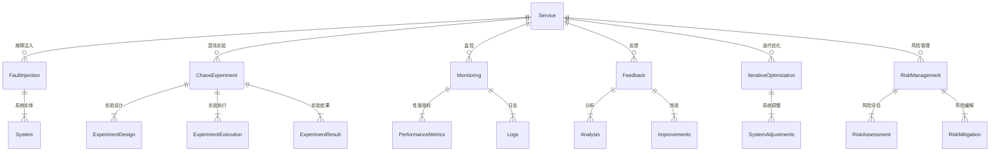
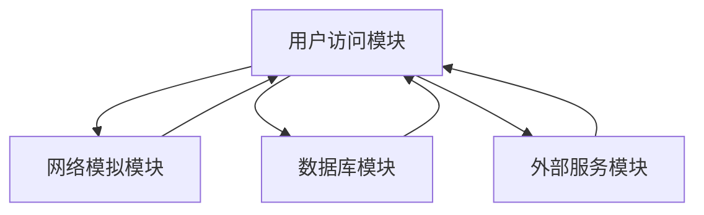

                 

### 第1章：混沌工程简介

#### 1.1 问题背景与动机

在当今数字化和云计算时代，系统的复杂性和依赖性日益增加。这种复杂性不仅带来了便利，同时也增加了系统的脆弱性。系统可能会因为各种意外情况而出现故障，如硬件故障、网络中断、软件缺陷、配置错误等。这些故障可能会导致系统停机、数据丢失，甚至造成巨大的经济损失和品牌损害。

为了应对这种复杂性，企业开始注重系统的健壮性和弹性。混沌工程（Chaos Engineering）作为一种新兴的方法论，被提出来帮助系统工程师识别系统的弱点，提高系统的可靠性。混沌工程的核心理念是通过故意引入故障，系统性地测试和验证系统在实际运行中面对故障时的表现，从而提前发现并修复潜在的问题。

混沌工程的动机在于，通过模拟真实世界的故障场景，系统能够在故障真正发生时做出更为有效的响应。例如，通过故障注入，可以发现系统的哪些部分在压力下容易崩溃，哪些部分需要改进，哪些部分的容错能力较弱。这种主动识别和解决潜在问题的方法，显著提高了系统的稳定性。

#### 1.2 混沌工程的核心概念

混沌工程的核心概念包括以下几个关键部分：

1. **故障注入**：通过故意引入故障，测试系统的响应和恢复能力。故障可以是硬件故障、网络故障、服务故障等。

2. **混沌实验**：进行故障注入的过程，包括故障的设计、实施、监控和分析。混沌实验的目的是评估系统的弹性和稳定性。

3. **监控与反馈**：在混沌实验中，持续监控系统的状态，收集性能指标和日志数据。这些数据用于分析故障的影响范围和系统的恢复速度。

4. **迭代优化**：根据混沌实验的结果，调整系统架构、代码和配置，提高系统的健壮性。

5. **风险管理**：混沌工程不仅仅是为了找出问题，更重要的是帮助团队理解和管理系统的风险。

#### 1.3 混沌工程的目标

混沌工程的主要目标是：

- **提高系统的可靠性**：通过混沌实验，发现并修复系统的潜在问题，确保系统能在意外情况下持续运行。

- **增强团队的信心**：通过混沌实验，团队能够更了解系统的行为，增强对系统稳定性的信心。

- **优化系统的架构和代码**：混沌工程可以帮助团队识别系统中的薄弱环节，进行针对性的优化和改进。

- **降低风险**：通过提前发现和解决问题，降低系统在实际运行中遇到故障的风险。

混沌工程的核心概念和目标，为我们提供了一种新的思维方式，帮助我们在高度复杂的环境中构建更加可靠和弹性的系统。

#### 1.4 混沌工程的应用场景

混沌工程的应用场景非常广泛，以下是一些典型的应用场景：

1. **互联网服务**：在互联网服务中，混沌工程可以帮助团队评估系统的弹性和稳定性，确保在高并发、高负载情况下服务依然能够正常运作。

2. **金融系统**：金融系统对可靠性和安全性要求极高。混沌工程可以帮助银行和金融机构发现潜在的风险点，优化系统设计，确保在市场波动和突发事件中系统能够稳定运行。

3. **云服务提供商**：云服务提供商需要确保其基础设施和服务的高可用性。混沌工程可以用来测试云服务的弹性，确保在各种情况下都能提供高质量的服务。

4. **电子商务**：电子商务平台的可靠性直接影响到用户体验和商家利益。混沌工程可以帮助团队确保在购物高峰期系统依然能够稳定运行，满足用户需求。

5. **物联网（IoT）**：在物联网系统中，设备数量庞大且分布广泛，混沌工程可以帮助团队识别系统中的潜在问题，确保物联网系统能够在不同环境下稳定运行。

6. **电信行业**：电信行业的服务质量直接关系到用户满意度。混沌工程可以帮助电信公司测试网络的稳定性和容错能力，确保服务质量。

通过以上应用场景可以看出，混沌工程不仅仅适用于大型系统和复杂应用，对于任何需要高可靠性和弹性的系统都有重要意义。

### 1.5 混沌工程与传统测试的区别

混沌工程与传统测试（如功能测试、性能测试）存在显著的区别：

1. **主动与被动**：传统测试通常是在系统运行正常时进行的，而混沌工程是故意引入故障，主动测试系统的弹性和恢复能力。

2. **全面性**：传统测试关注特定的功能或性能指标，而混沌工程通过模拟各种故障场景，全面评估系统的健壮性。

3. **风险管理**：混沌工程不仅仅是发现问题，更重要的是帮助团队理解和管理系统的风险，而传统测试更侧重于发现和报告问题。

4. **实时性**：混沌工程在实时环境中进行，能够模拟真实场景，而传统测试通常在隔离环境中进行。

5. **目的性**：混沌工程的目标是提高系统的可靠性、稳定性和弹性，而传统测试的目标是验证系统是否按照预期工作。

通过这些区别，可以看出混沌工程在系统测试和优化中的独特价值和重要性。

### 1.6 总结

混沌工程作为一种新兴的方法论，为系统工程师提供了一种新的思维方式，帮助他们在复杂的环境中构建更加可靠和弹性的系统。通过故障注入和混沌实验，系统能够提前发现和修复潜在问题，提高可靠性。混沌工程的应用场景非常广泛，从互联网服务到金融系统，再到物联网和电信行业，都具有重要的意义。

在接下来的章节中，我们将深入探讨混沌工程的理论基础、故障注入技术、实践方法和效果评估，帮助读者全面了解并掌握混沌工程的实践应用。

---

### 1.7 混沌工程实践中的注意事项

尽管混沌工程提供了显著的系统健壮性和弹性提升的机会，但在实践中也需要特别注意以下事项：

1. **风险管理**：混沌实验可能会对系统造成一定的风险，因此在开始实验前，应进行全面的风险评估，并制定相应的风险缓解措施。

2. **实验规模**：混沌实验的规模应逐步扩大，从简单故障开始，逐步过渡到复杂故障，确保团队能够适应和应对不同层次的故障场景。

3. **监控与报警**：在混沌实验过程中，应确保监控系统能够实时监控系统的状态，并及时触发报警，以便快速响应和恢复。

4. **人员培训**：团队成员应接受混沌工程的培训和指导，了解实验目的、方法和流程，确保能够在实验中协同工作。

5. **文档记录**：详细记录混沌实验的流程、结果和改进措施，以便后续回顾和分析，优化混沌工程实践。

通过以上注意事项，可以有效提高混沌工程实践的效果，确保系统能够在真实环境中更加可靠地运行。

### 1.8 拓展阅读

对于希望进一步深入了解混沌工程的读者，以下书籍和资源推荐：

1. **书籍**：
   - 《混沌工程：构建可抗打击的系统》（Chaos Engineering: Building Resilient Systems）
   - 《软件工程原理：基于混沌工程的方法》（Software Engineering Principles: A Chaos Engineering Approach）

2. **在线资源**：
   - [混沌工程官方网站](https://www.chaosengineering.org/)
   - [混沌工程的最佳实践指南](https://principlesofchaos.org/)
   - [混沌工程的教程和示例](https://github.com/Netflix/chaosmonkey)

这些资源将为读者提供更深入的混沌工程理论和实践指导，帮助读者更好地理解和应用混沌工程。

---

通过以上详细的内容和扩展，第1章“混沌工程简介”为读者提供了一个全面的理解，为后续章节的深入学习奠定了基础。

---

### 第2章：混沌工程理论

#### 2.1 混沌理论的基本原理

混沌理论是混沌工程的重要理论基础。混沌理论起源于20世纪60年代，由气象学家洛伦兹（Edward Lorenz）在研究气象系统时发现。混沌理论揭示了在确定性系统中存在的随机性和不可预测性，即使初始条件非常接近，系统的长期行为也可能大相径庭。

1. **混沌现象的特征**：
   - **敏感依赖初始条件**：系统的长期行为对初始条件的微小变化极为敏感，这被称为“蝴蝶效应”。
   - **长期行为不可预测**：即使系统的运动方程是确定的，系统的长期行为也可能是不可预测的。
   - **周期性和复杂性**：混沌系统在某些参数范围内可能表现出周期性的行为，同时在某些参数范围内表现出复杂的、看似随机的运动。

2. **混沌系统的数学模型**：
   混沌系统通常通过差分方程或微分方程来描述。最著名的混沌系统模型包括洛伦兹系统、Logistic映射和Rossler系统。

   - **洛伦兹系统**：
     $$ \frac{dx}{dt} = \sigma (y - x) $$
     $$ \frac{dy}{dt} = x (\rho - z) - y $$
     $$ \frac{dz}{dt} = xy - \beta z $$
     其中，$\sigma$、$\rho$ 和 $\beta$ 是系统参数。

   - **Logistic映射**：
     $$ x_{n+1} = r x_n (1 - x_n) $$
     这是一个简单的非线性方程，通过调整参数 $r$，可以观察到从周期性行为到混沌行为的过渡。

3. **混沌现象在实际中的应用**：
   混沌理论不仅在物理学、生物学和气象学中具有重要应用，在计算机科学和工程领域也有广泛的应用。例如，混沌密码学利用混沌系统的不可预测性来实现加密算法；混沌控制技术用于精确控制复杂系统；混沌工程则是利用混沌理论来提高系统的可靠性和弹性。

#### 2.2 混沌工程的关键原则

混沌工程的核心原则来源于混沌理论的基本原理，但更注重于系统的实际应用。混沌工程的关键原则包括以下几个方面：

1. **系统性**：混沌工程不是孤立的测试，而是一个系统性的过程，包括故障注入、监控、分析和迭代优化。

2. **故意性**：混沌工程是故意引入故障，以评估系统在异常情况下的响应和恢复能力，而不是在系统发生故障时被动响应。

3. **科学性**：混沌工程强调使用科学的方法来设计故障注入实验，收集和分析数据，从而提高系统的可靠性。

4. **可持续性**：混沌工程应作为一个持续的过程，定期进行故障注入实验，以便及时发现和修复系统中的潜在问题。

#### 2.3 混沌工程的适用场景

混沌工程适用于各种复杂系统和应用场景，以下是一些典型的适用场景：

1. **云计算和容器化环境**：在云计算和容器化环境中，系统具有高度的可扩展性和灵活性，但也更容易受到故障的影响。混沌工程可以帮助团队评估和优化系统的健壮性。

2. **分布式系统**：分布式系统具有高可用性和容错能力，但也面临着复杂的依赖关系和潜在的瓶颈。混沌工程可以揭示分布式系统中的弱点，提高整体可靠性。

3. **微服务架构**：微服务架构通过将系统分解为独立的、可复用的服务，提高了系统的灵活性。但这也带来了分布式故障的风险。混沌工程可以帮助团队测试和优化微服务架构的弹性。

4. **物联网（IoT）**：物联网系统涉及大量的设备和服务，通常具有复杂的通信模式和可靠性要求。混沌工程可以帮助团队识别和解决物联网系统中的潜在问题。

5. **金融系统**：金融系统对可靠性和安全性要求极高，混沌工程可以用于测试和优化金融系统的健壮性，确保在突发事件中能够稳定运行。

6. **电信网络**：电信网络连接广泛的用户，需要确保在高峰期和突发事件中能够稳定运行。混沌工程可以帮助电信公司评估和提升网络的弹性。

通过上述关键原则和适用场景的介绍，我们可以看到混沌工程在提升系统可靠性和弹性方面的巨大潜力。在接下来的章节中，我们将进一步探讨混沌工程的故障注入技术和实践方法。

### 2.4 混沌工程中的概念属性特征对比表格

为了更清晰地理解混沌工程中的关键概念，我们在此提供一个概念属性特征对比表格：

| 概念 | 定义 | 属性特征 | 对比 |
| ---- | ---- | ---- | ---- |
| 故障注入 | 故意引入故障以测试系统的响应和恢复能力 | 系统性、故意性、科学性、可持续性 | 与传统测试的区别在于主动引入故障 |
| 混沌实验 | 进行故障注入的过程 | 故障设计、实施、监控、分析 | 系统性地测试系统的弹性和稳定性 |
| 监控与反馈 | 持续监控系统的状态，收集性能指标和日志数据 | 实时性、全面性 | 辅助故障注入，提供系统状态数据 |
| 迭代优化 | 根据混沌实验结果调整系统架构、代码和配置 | 针对性问题、优化系统健壮性 | 提高系统可靠性和弹性 |
| 风险管理 | 管理系统的风险，确保混沌实验的有效性和安全性 | 风险评估、风险缓解 | 降低系统在实际运行中遇到故障的风险 |

这个表格帮助我们更直观地理解混沌工程中的各个关键概念，并了解它们之间的联系和区别。

### 2.5 混沌工程中的ER实体关系图架构

为了更好地理解混沌工程中的实体及其关系，我们使用Mermaid绘制一个ER实体关系图。以下是ER图的具体内容和说明：



**ER图说明**：

- **Service（系统）**：中心实体，与故障注入、混沌实验、监控、反馈、迭代优化和风险管理相连。
- **FaultInjection（故障注入）**：与系统相连，表示故意引入故障以测试系统响应。
- **ChaosExperiment（混沌实验）**：与系统相连，表示进行故障注入的过程。
- **Monitoring（监控）**：与系统相连，负责实时监控系统的状态。
- **Feedback（反馈）**：与系统相连，负责分析实验结果并提出改进建议。
- **IterativeOptimization（迭代优化）**：与系统相连，负责根据反馈结果调整系统配置和代码。
- **RiskManagement（风险管理）**：与系统相连，负责评估和缓解混沌实验中的风险。

通过ER图，我们可以清晰地看到各个实体之间的关联关系，更好地理解混沌工程的整体架构和流程。

### 2.6 算法原理讲解

混沌工程的实践依赖于一系列算法和工具，以下我们将详细介绍一种常用的故障注入算法——**Logistic映射**，并使用Python源代码进行说明。

#### 2.6.1 Logistic映射算法

Logistic映射是最简单的非线性动态系统，用于模拟生物种群的增长。Logistic映射的数学模型如下：

$$ x_{n+1} = r x_n (1 - x_n) $$

其中，$x_n$ 是时间 $n$ 时的种群比例，$r$ 是控制种群增长的参数。通过调整 $r$ 的值，我们可以观察到从稳定状态到混沌状态的过渡。

#### 2.6.2 Python源代码实现

以下是一个简单的Python程序，用于模拟Logistic映射的过程：

```python
import numpy as np
import matplotlib.pyplot as plt

def logistic_map(r, x, n_iterations=100):
    """使用Logistic映射计算序列"""
    x_new = np.zeros(n_iterations)
    x_new[0] = x
    for i in range(1, n_iterations):
        x_new[i] = r * x_new[i - 1] * (1 - x_new[i - 1])
    return x_new

# 参数设置
r = 3.5
initial_value = 0.1

# 运行Logistic映射
x = logistic_map(r, initial_value)

# 绘制结果
plt.plot(x)
plt.title('Logistic Map with r = {:.1f}'.format(r))
plt.xlabel('Iteration')
plt.ylabel('Population')
plt.grid(True)
plt.show()
```

#### 2.6.3 算法原理详解

1. **初始条件**：在程序开始时，我们设定初始值 $x_0 = 0.1$。

2. **迭代计算**：每次迭代计算 $x_{n+1} = r x_n (1 - x_n)$，新的种群比例取决于当前比例和参数 $r$。

3. **结果绘制**：我们使用 `matplotlib` 库将迭代结果绘制为图表，可以直观地观察到种群比例的变化。

#### 2.6.4 数学模型和公式

Logistic映射的数学模型如下：

$$ x_{n+1} = r x_n (1 - x_n) $$

- **稳定状态**：当 $r < 1$ 时，系统趋向于稳定状态，种群比例 $x_n$ 逐渐收敛到某个值。
- **混沌状态**：当 $r > 3$ 时，系统进入混沌状态，种群比例 $x_n$ 在一定范围内随机波动。

#### 2.6.5 举例说明

假设我们选择 $r = 3.5$ 和初始值 $x_0 = 0.1$，运行上述程序后，我们可以观察到种群比例在0到1之间快速波动，显示出典型的混沌现象。

通过上述Python代码和数学模型，我们可以直观地理解Logistic映射算法的原理，并在实际操作中测试和验证算法的正确性。

### 2.7 系统分析与架构设计

在深入理解混沌工程理论的基础上，本节我们将介绍一个具体的混沌工程实践案例，从问题场景介绍开始，逐步分析项目介绍、系统功能设计、系统架构设计以及系统接口设计和系统交互。

#### 2.7.1 问题场景介绍

假设我们正在开发一个大型电商平台，该平台处理海量商品交易和用户订单。为了确保系统在高并发、高负载情况下依然能够稳定运行，我们需要对其进行混沌工程测试。具体问题场景如下：

- **高并发访问**：在购物节日期间，用户访问量急剧增加，系统面临巨大的并发压力。
- **网络波动**：由于网络故障或带宽限制，部分用户访问速度变慢，甚至出现连接失败的情况。
- **数据库压力**：随着订单数量的增加，数据库负载增大，可能出现响应缓慢或数据丢失的情况。
- **服务依赖**：平台依赖于多个外部服务（如支付、物流等），任何外部服务的故障都可能影响到整个平台。

#### 2.7.2 项目介绍

项目名称：电商混沌工程测试平台

项目背景：为了提升电商平台在高并发、高负载环境下的健壮性和弹性，我们引入了混沌工程方法论，通过故障注入和混沌实验，识别和修复系统中的潜在问题。

项目目标：
1. 评估系统在高并发访问下的响应能力和稳定性。
2. 检测网络波动对系统性能的影响。
3. 评估数据库和外部服务的依赖性，提高系统的容错能力。

#### 2.7.3 系统功能设计

系统功能设计包括以下关键模块：

1. **用户访问模块**：模拟大量用户并发访问，测试系统在高并发情况下的响应速度和稳定性。
2. **网络模拟模块**：通过模拟网络波动和带宽限制，测试系统在不同网络条件下的性能。
3. **数据库模块**：模拟数据库负载增大，测试系统在数据库压力下的响应能力和容错能力。
4. **外部服务模块**：模拟外部服务故障，测试系统对外部服务的依赖性和容错能力。

#### 2.7.4 系统架构设计

系统架构设计采用微服务架构，各模块之间通过API进行交互。以下是系统架构设计图：



**系统架构设计说明**：

- **用户访问模块**：负责模拟大量用户并发访问，通过负载生成器生成模拟流量。
- **网络模拟模块**：模拟不同网络条件下的流量，包括网络波动和带宽限制，测试系统对网络环境的适应性。
- **数据库模块**：模拟数据库负载，通过数据库压力测试工具进行测试，评估系统在数据库压力下的性能。
- **外部服务模块**：模拟外部服务故障，测试系统对第三方服务的依赖性和容错能力。

#### 2.7.5 系统接口设计和系统交互

系统接口设计采用RESTful API，各模块之间通过HTTP请求进行交互。以下是系统接口设计图：


**系统接口设计说明**：

- **用户访问模块**：通过POST请求发送模拟用户操作，接收服务响应。
- **网络模拟模块**：通过模拟HTTP请求和响应，模拟不同网络条件。
- **数据库模块**：通过数据库API执行查询和操作，模拟数据库负载。
- **外部服务模块**：通过模拟HTTP请求和响应，模拟第三方服务故障。

#### 2.7.6 系统交互流程

系统交互流程如下：

1. **用户访问**：用户通过用户访问模块发起请求，模拟实际用户操作。
2. **网络模拟**：网络模拟模块根据设定的网络条件对请求进行修改，模拟网络波动和带宽限制。
3. **数据库处理**：数据库模块根据请求内容执行数据库查询和操作，模拟数据库负载。
4. **外部服务调用**：外部服务模块根据请求内容调用第三方服务API，模拟外部服务故障。
5. **结果反馈**：各模块将处理结果返回给用户访问模块，形成完整的交互流程。

通过上述系统分析与架构设计，我们可以清楚地看到混沌工程在电商平台测试中的具体应用，为系统的高并发、高可靠性运行提供了有力保障。

### 第3章：故障注入技术

#### 3.1 故障注入的定义与分类

故障注入（Fault Injection）是一种主动测试技术，通过故意引入故障来评估系统在异常情况下的行为和恢复能力。故障注入的定义可以概括为：在系统设计和开发过程中，通过人工或自动化方式故意引入故障，模拟实际运行中的故障场景，以验证系统的健壮性和可靠性。

故障注入的分类可以根据故障注入的方法和目标进行划分：

1. **按故障注入方法分类**：
   - **硬件故障注入**：通过模拟硬件故障，如硬盘故障、网络故障等，测试系统在硬件故障情况下的响应和恢复能力。
   - **软件故障注入**：通过模拟软件缺陷，如代码错误、内存泄漏等，测试系统在软件故障情况下的行为和稳定性。
   - **网络故障注入**：通过模拟网络故障，如网络中断、数据包丢失等，测试系统在网络异常情况下的性能和可靠性。

2. **按故障注入目标分类**：
   - **性能测试**：通过故意引入故障，评估系统在故障情况下的性能表现，如响应时间、吞吐量等。
   - **可靠性测试**：通过故障注入，评估系统在故障情况下的恢复速度和稳定性，确保系统在故障后能够快速恢复。
   - **安全测试**：通过模拟恶意攻击或系统漏洞，测试系统的安全防护能力和应对措施。

#### 3.2 故障注入的优势与挑战

故障注入技术在实际应用中具有显著的优势，但也面临一定的挑战。

**优势**：

1. **提高系统健壮性**：故障注入通过模拟各种故障场景，帮助团队提前发现和修复系统中的潜在问题，从而提高系统的健壮性和可靠性。
2. **优化系统设计**：故障注入可以帮助团队识别系统设计和实现中的薄弱环节，为系统优化提供依据，从而提升整体性能。
3. **增强团队信心**：通过故障注入实践，团队可以更全面地了解系统的行为和响应能力，增强对系统稳定性和可靠性的信心。
4. **提高应急响应能力**：故障注入有助于团队积累应对故障的经验，提高在真实故障发生时的应急响应能力。

**挑战**：

1. **风险控制**：故障注入可能会对系统造成一定的影响，因此在实验设计过程中需要严格评估和控制风险，确保系统安全和数据完整性。
2. **复杂性**：故障注入需要考虑多种故障场景和系统复杂性，设计合理的故障注入策略和实验方案，确保测试的有效性和覆盖全面性。
3. **资源消耗**：故障注入实验需要消耗大量的计算资源和时间，尤其是在大规模系统中进行复杂故障注入时，资源消耗尤为显著。
4. **结果分析**：故障注入实验结果需要进行详细的分析和解读，从中提取有价值的信息，指导系统优化和改进，这对团队的技术能力和分析能力提出了较高要求。

#### 3.3 故障注入的方法与工具

故障注入的方法和工具多种多样，根据故障注入的目的和场景选择合适的方法和工具至关重要。

1. **硬件故障注入**：
   - **硬件模拟器**：通过硬件模拟器模拟各种硬件故障，如硬盘故障、网络故障等，测试系统在硬件故障情况下的响应和恢复能力。
   - **硬件破坏**：通过故意破坏硬件设备（如硬盘、网络设备等），直接模拟硬件故障场景，但这种方法风险较高，一般不建议在生产环境中使用。

2. **软件故障注入**：
   - **代码注入**：通过在系统代码中故意引入错误，如逻辑错误、内存泄漏等，测试系统在软件故障情况下的稳定性和性能。
   - **故障注入工具**：如Chaos Monkey、ChaosBlade等，这些工具可以帮助团队自动化地引入各种软件故障，提高故障注入的效率和覆盖范围。

3. **网络故障注入**：
   - **网络模拟器**：通过网络模拟器模拟各种网络故障，如网络中断、数据包丢失、延迟等，测试系统在网络异常情况下的性能和可靠性。
   - **Ddos攻击工具**：如Nmap、Hping3等，这些工具可以模拟DDos攻击，测试系统在遭受恶意攻击时的响应能力和防护措施。

4. **分布式系统故障注入**：
   - **服务停机**：通过模拟分布式系统中的服务停机，如模拟某个微服务不可用，测试系统在服务不可用情况下的容错能力和负载均衡策略。
   - **数据分区故障**：通过模拟分布式数据存储系统中的分区故障，测试系统的数据一致性和容错能力。

5. **容器化环境故障注入**：
   - **容器故障注入**：通过模拟容器故障，如容器挂起、容器崩溃等，测试容器化环境下的系统性能和可靠性。
   - **Kubernetes故障注入**：通过模拟Kubernetes集群故障，如节点故障、Pod挂起等，测试系统在容器编排环境下的容错能力和自动化恢复机制。

选择合适的故障注入方法和工具，能够提高故障注入实验的有效性和覆盖范围，为系统优化和改进提供有力支持。在接下来的章节中，我们将详细介绍故障注入的具体实践方法，帮助读者理解和应用故障注入技术。

### 3.4 故障注入案例分析

#### 3.4.1 案例背景

为了更具体地展示故障注入技术的实践过程，我们将通过一个实际案例进行分析。本案例将基于一个大型电商平台的订单处理系统，通过故障注入测试，验证系统在遇到不同类型故障时的响应和恢复能力。

#### 3.4.2 系统介绍

电商平台订单处理系统负责处理用户的订单创建、支付、发货等关键业务流程。系统架构采用微服务架构，包括订单服务、支付服务、库存服务、物流服务等多个微服务模块。这些微服务通过API进行通信，共同协作完成订单处理任务。

#### 3.4.3 故障注入计划

为了全面评估系统的可靠性，我们计划进行以下几种类型的故障注入测试：

1. **订单服务故障注入**：模拟订单服务异常，测试系统在订单服务不可用情况下的响应和处理能力。
2. **支付服务故障注入**：模拟支付服务故障，如支付系统网络中断，测试系统在支付服务不可用情况下的用户体验和系统行为。
3. **库存服务故障注入**：模拟库存服务超时或异常，测试系统在库存服务响应不及时情况下的订单处理能力和库存管理。
4. **物流服务故障注入**：模拟物流服务中断或延迟，测试系统在物流服务不可用情况下的订单处理和用户通知策略。

#### 3.4.4 故障注入执行

1. **订单服务故障注入**：

   我们使用故障注入工具模拟订单服务异常。具体步骤如下：

   - **故障触发**：通过向订单服务发送大量的恶意请求，模拟服务过载，导致服务无法响应。
   - **监控和日志记录**：在故障注入过程中，持续监控订单服务的状态，记录服务响应时间、错误日志等信息。
   - **结果分析**：分析故障注入结果，评估系统在订单服务异常情况下的响应和处理能力，以及如何优化系统设计以提高可靠性。

2. **支付服务故障注入**：

   我们通过模拟支付系统网络中断，测试系统在支付服务不可用情况下的用户体验和系统行为。具体步骤如下：

   - **故障触发**：通过在支付服务与电商平台之间的网络中引入延迟和丢包，模拟网络故障。
   - **用户模拟**：模拟用户在支付过程中的操作，记录用户反馈和系统响应。
   - **结果分析**：分析用户在支付服务故障情况下的体验，评估系统的异常处理能力和用户提示机制。

3. **库存服务故障注入**：

   我们模拟库存服务超时或异常，测试系统在库存服务响应不及时情况下的订单处理能力和库存管理。具体步骤如下：

   - **故障触发**：通过设置库存服务响应时间阈值，模拟服务响应缓慢或异常。
   - **监控和日志记录**：记录库存服务的响应时间、错误日志等信息，分析故障对订单处理流程的影响。
   - **结果分析**：评估系统在库存服务故障情况下的订单处理能力，并提出优化方案。

4. **物流服务故障注入**：

   我们通过模拟物流服务中断或延迟，测试系统在物流服务不可用情况下的订单处理和用户通知策略。具体步骤如下：

   - **故障触发**：通过在物流服务中引入延迟和错误，模拟物流服务不可用。
   - **用户模拟**：模拟用户在订单发货后的行为，记录用户反馈和系统通知。
   - **结果分析**：分析用户在物流服务故障情况下的体验，评估系统的异常处理和通知机制。

#### 3.4.5 结果分析

通过对不同类型故障注入的结果分析，我们得出以下结论：

1. **订单服务故障注入**：订单服务在故障情况下，系统整体响应速度显著下降，部分订单处理失败。通过分析日志，我们发现部分订单处理逻辑过于复杂，导致在服务异常时响应时间过长。优化方案包括简化订单处理逻辑、增加缓存机制等。

2. **支付服务故障注入**：支付服务故障对用户体验影响较大，部分用户在支付过程中遇到长时间延迟。系统在支付服务故障时未能及时给出提示，导致用户误认为支付失败。优化方案包括增加支付故障提示、优化用户提示机制等。

3. **库存服务故障注入**：库存服务故障导致部分订单无法及时更新库存状态，影响订单处理流程。通过分析，我们发现库存服务的响应时间较长，需要优化数据库查询和缓存机制。

4. **物流服务故障注入**：物流服务故障对订单处理和用户通知策略产生较大影响。系统在物流故障时未能及时通知用户，导致用户对订单状态的了解不及时。优化方案包括优化物流服务调用逻辑、增加实时通知机制等。

通过这个案例，我们可以看到故障注入技术在实际应用中的重要作用。通过故障注入，我们能够发现系统中的潜在问题，并提出优化方案，从而提高系统的可靠性和用户体验。

### 3.5 故障注入实验的步骤和方法

故障注入实验是一个系统性的过程，包括故障注入的设计、实施、监控和分析。以下详细描述故障注入实验的步骤和方法：

#### 3.5.1 设计阶段

1. **确定目标**：明确故障注入的目标，如提高系统可靠性、检测潜在漏洞、优化系统性能等。
2. **选择故障类型**：根据系统的特点和目标，选择合适的故障类型，如硬件故障、软件故障、网络故障等。
3. **设计故障场景**：制定详细的故障注入方案，包括故障发生的时间、频率、影响范围等。
4. **制定测试计划**：明确故障注入实验的执行步骤、测试环境、测试工具和预期结果。

#### 3.5.2 实施阶段

1. **环境准备**：搭建故障注入测试环境，确保环境与生产环境相似，以便真实反映系统在故障情况下的表现。
2. **故障注入**：根据设计好的故障场景，使用故障注入工具或手动操作引入故障。例如，通过模拟网络中断、停用服务或修改系统配置等方式引入故障。
3. **监控和记录**：在故障注入过程中，持续监控系统的状态，记录故障发生的时间、影响范围、系统响应等关键信息。

#### 3.5.3 监控阶段

1. **实时监控**：通过监控系统（如Prometheus、Grafana等）实时监控系统的性能指标和日志数据，及时发现异常情况。
2. **日志记录**：详细记录故障注入过程中的所有日志，包括系统响应时间、错误日志、用户反馈等，以便后续分析。
3. **数据收集**：收集系统在故障注入过程中产生的性能数据，如CPU利用率、内存占用、网络流量等，为故障注入结果分析提供依据。

#### 3.5.4 分析阶段

1. **故障影响分析**：分析故障注入对系统的影响范围和程度，包括系统的响应时间、错误率、用户满意度等。
2. **故障定位**：根据监控数据和日志记录，定位故障发生的原因和影响范围，识别系统中的薄弱环节。
3. **优化建议**：根据故障注入结果，提出系统优化和改进的建议，包括调整系统配置、优化代码逻辑、改进故障处理机制等。
4. **总结和报告**：编写故障注入实验报告，总结实验过程、结果和分析，提出改进措施，为后续的系统优化提供参考。

通过上述步骤和方法，可以确保故障注入实验的系统性和有效性，为系统的可靠性提升提供有力支持。

### 3.6 总结

本章详细介绍了故障注入技术的定义、分类、优势与挑战，以及故障注入的方法与工具。通过实际案例分析，我们展示了故障注入在系统测试中的应用和效果。故障注入作为一种主动测试技术，能够有效提高系统的可靠性和健壮性，是混沌工程的重要组成部分。

在接下来的章节中，我们将继续探讨混沌工程的具体实践方法，深入分析故障注入实验的设计与实施，帮助读者全面掌握混沌工程的实践应用。

---

### 第4章：混沌工程实践

#### 4.1 混沌工程实践流程

混沌工程实践是一个系统性的过程，包括以下几个关键步骤：

1. **需求分析**：明确混沌工程的目标和需求，如提高系统可靠性、检测潜在漏洞等。
2. **环境准备**：搭建混沌工程实验环境，确保环境与生产环境相似，以便真实反映系统在故障情况下的表现。
3. **故障设计**：根据系统特点和目标，设计不同的故障注入场景，如硬件故障、网络故障、服务故障等。
4. **故障注入**：使用故障注入工具或手动操作引入故障，模拟系统在实际运行中可能遇到的故障场景。
5. **监控与记录**：在故障注入过程中，持续监控系统的状态，记录故障发生的时间、影响范围、系统响应等关键信息。
6. **数据收集**：收集故障注入过程中产生的性能数据，如CPU利用率、内存占用、网络流量等。
7. **结果分析**：对故障注入结果进行分析，识别系统中的薄弱环节，提出优化建议。
8. **迭代优化**：根据分析结果，调整系统架构、代码和配置，进行迭代优化。

#### 4.2 实践中的关键要素

混沌工程实践中的关键要素包括以下几个方面：

1. **故障注入工具**：故障注入工具是实现混沌工程实践的核心，常见的故障注入工具有Chaos Monkey、ChaosBlade、Chaos Gorilla等。这些工具可以帮助自动引入故障，减少人工干预，提高测试效率。

2. **监控与日志**：在混沌工程实践中，监控和日志记录是关键要素。通过监控系统（如Prometheus、Grafana）和日志记录工具（如ELK栈），可以实时监控系统的状态，记录故障注入过程中的所有信息，为结果分析提供依据。

3. **故障类型**：选择合适的故障类型对于混沌工程实践至关重要。常见的故障类型包括硬件故障、网络故障、服务故障、软件故障等。根据系统的特点和目标，选择合适的故障类型进行测试。

4. **测试环境**：混沌工程实践需要在与生产环境相似的环境中执行。测试环境的配置、网络拓扑、硬件设备等应尽量与生产环境保持一致，以确保测试结果的真实性和有效性。

5. **团队协作**：混沌工程实践涉及多个团队成员的协作，包括系统工程师、测试工程师、运维人员等。有效的团队协作可以提高测试效率，确保混沌工程实践的顺利进行。

6. **风险管理**：在混沌工程实践中，应严格评估和管理风险。故障注入可能会对系统造成一定的影响，因此在实验设计过程中需要制定风险缓解措施，确保系统安全和数据完整性。

#### 4.3 实践案例分析

为了更好地理解混沌工程实践的具体方法，我们通过一个实际案例进行分析。

**案例背景**：

一家大型电商平台希望在上线前通过混沌工程实践验证系统的可靠性，特别是在高并发、高负载情况下的表现。该平台的系统架构包括订单服务、支付服务、库存服务、物流服务等多个微服务模块，通过API进行通信。

**混沌工程实践步骤**：

1. **需求分析**：明确混沌工程实践的目标，如评估系统在高并发访问下的响应能力和稳定性，检测系统中的潜在漏洞等。

2. **环境准备**：搭建混沌工程实验环境，与生产环境相似。环境配置包括服务器、网络拓扑、数据库等。

3. **故障设计**：设计不同的故障注入场景，如模拟订单服务异常、支付服务网络中断、库存服务响应缓慢、物流服务延迟等。

4. **故障注入**：
   - **订单服务故障注入**：通过Chaos Monkey工具模拟订单服务异常，引入大量恶意请求，导致服务过载。
   - **支付服务故障注入**：通过模拟支付系统网络中断，引入延迟和丢包，测试系统在支付服务不可用情况下的表现。
   - **库存服务故障注入**：通过设置库存服务响应时间阈值，模拟服务响应缓慢或异常。
   - **物流服务故障注入**：通过模拟物流服务中断或延迟，测试系统在物流服务不可用情况下的订单处理和用户通知策略。

5. **监控与记录**：在故障注入过程中，使用Prometheus和Grafana监控系统状态，记录系统响应时间、错误日志、性能指标等。

6. **数据收集**：收集故障注入过程中产生的数据，如CPU利用率、内存占用、网络流量等，为结果分析提供依据。

7. **结果分析**：分析故障注入结果，评估系统在不同故障情况下的响应和恢复能力。根据分析结果，提出优化建议，如优化订单处理逻辑、增加缓存机制、改进网络故障处理等。

8. **迭代优化**：根据分析结果，调整系统架构、代码和配置，进行迭代优化。

**案例分析结果**：

通过混沌工程实践，该电商平台发现以下潜在问题：
- 订单服务在高并发访问下存在响应缓慢和性能瓶颈。
- 支付服务在网络中断情况下，用户支付流程体验不佳。
- 库存服务响应不及时，影响订单处理效率。
- 物流服务在故障情况下，用户通知不及时。

根据分析结果，平台进行了以下优化：
- 优化订单服务处理逻辑，增加缓存机制，提高系统响应速度。
- 改进支付服务的故障处理机制，优化用户提示和引导流程。
- 优化库存服务调用逻辑，减少响应时间，提高订单处理效率。
- 引入实时通知机制，及时通知用户物流故障情况。

通过混沌工程实践，该电商平台显著提高了系统的可靠性和用户体验，为后续的上线和运营提供了有力保障。

#### 4.4 实践中的常见问题与解决方案

在混沌工程实践过程中，可能会遇到一些常见问题，以下是一些典型问题及其解决方案：

1. **系统稳定性问题**：故障注入可能会导致系统稳定性问题，如服务宕机、数据丢失等。
   - **解决方案**：在故障注入前进行充分的系统测试和优化，确保系统在正常情况下运行稳定。在故障注入过程中，逐步扩大故障规模，监控系统响应，避免一次性引入过大的故障。

2. **数据安全问题**：故障注入可能会对系统中的数据造成影响，如数据损坏、数据泄露等。
   - **解决方案**：在故障注入前，备份系统数据，确保在故障注入过程中数据安全。在故障注入过程中，严格限制故障注入范围，避免影响生产环境中的其他数据。

3. **风险控制问题**：故障注入可能会对系统造成一定的风险，特别是在生产环境中的测试。
   - **解决方案**：在故障注入前，进行全面的风险评估，制定详细的风险缓解措施。在故障注入过程中，实时监控系统状态，确保故障注入在可控范围内进行。

4. **资源消耗问题**：故障注入需要大量的计算资源和时间，特别是大规模系统。
   - **解决方案**：在故障注入前，合理规划测试环境和资源分配，确保在故障注入过程中有足够的资源支持。在故障注入过程中，优化故障注入策略，减少资源消耗。

5. **结果分析问题**：故障注入结果复杂，如何有效地分析结果并提出优化建议。
   - **解决方案**：在故障注入前，制定详细的分析方案，明确分析目标和指标。在故障注入过程中，详细记录故障注入过程中的所有数据，为结果分析提供依据。在故障注入后，组织专业团队进行结果分析，确保分析结果的准确性和有效性。

通过解决上述问题，可以有效提高混沌工程实践的效果，确保系统能够在真实环境中稳定运行。

### 第5章：故障注入环境搭建

#### 5.1 环境需求

在进行故障注入之前，我们需要搭建一个合适的测试环境，以确保实验能够顺利进行并得到有意义的结果。以下是故障注入环境所需的主要需求：

1. **硬件资源**：至少需要两台服务器，用于搭建测试环境。一台服务器模拟生产环境，另一台用于运行故障注入工具和监控系统。

2. **网络拓扑**：网络拓扑应尽可能模拟生产环境，包括内部网络、外部网络和防火墙等。

3. **操作系统**：操作系统应与生产环境一致，常见的操作系统包括Linux和Windows。

4. **软件工具**：需要安装一系列软件工具，包括故障注入工具（如Chaos Monkey、ChaosBlade）、监控系统（如Prometheus、Grafana）、日志记录工具（如ELK栈）等。

5. **数据库**：测试环境需要包含与生产环境相同的数据库，以便模拟数据库故障。

6. **服务组件**：测试环境需要包含与生产环境相同的服务组件，如订单服务、支付服务、库存服务等。

7. **负载生成器**：用于模拟大量用户请求，以测试系统在高并发情况下的性能。

#### 5.2 环境搭建步骤

下面是具体的故障注入环境搭建步骤：

1. **硬件准备**：

   - 确保有两台服务器，一台用于生产环境模拟，另一台用于故障注入和监控。
   - 配置服务器的CPU、内存和存储资源，确保足够支持测试需求。

2. **网络配置**：

   - 配置内部网络和外部网络，确保网络拓扑与生产环境一致。
   - 设置防火墙规则，确保网络安全性。

3. **操作系统安装**：

   - 在两台服务器上分别安装与生产环境一致的操作系统（如Linux）。
   - 安装必要的操作系统补丁和更新。

4. **软件安装**：

   - 安装故障注入工具（如Chaos Monkey、ChaosBlade）。
   - 安装监控系统（如Prometheus、Grafana）。
   - 安装日志记录工具（如ELK栈）。

5. **服务组件部署**：

   - 部署与生产环境相同的服务组件（如订单服务、支付服务、库存服务等）。
   - 配置服务组件的API接口，确保各个服务组件之间能够正常通信。

6. **数据库配置**：

   - 部署与生产环境相同的数据库系统（如MySQL、PostgreSQL）。
   - 创建数据库表和用户，确保数据库能够正常运行。

7. **负载生成器设置**：

   - 安装并配置负载生成器（如JMeter）。
   - 配置负载生成器模拟用户请求，确保能够生成足够的测试流量。

8. **监控与日志配置**：

   - 配置Prometheus和Grafana，确保能够实时监控系统的性能指标。
   - 配置ELK栈，确保能够记录和存储系统的日志。

9. **测试环境验证**：

   - 在测试环境中执行一些简单的测试，确保所有组件能够正常运行，并能够相互通信。
   - 检查监控和日志系统是否能够正常工作，确保数据可以被正确记录和展示。

通过上述步骤，我们可以搭建一个功能完整的故障注入测试环境，为后续的故障注入实验做好准备。

### 第6章：故障注入案例实战

#### 6.1 实战一：简单服务故障注入

**背景**：

为了验证电商平台的订单服务在遇到故障时的响应能力和恢复速度，我们决定进行一次简单的服务故障注入实验。

**目标**：

- 评估订单服务在遇到异常情况（如服务不可用）时的响应时间。
- 检测订单服务在故障恢复后的性能和稳定性。

**步骤**：

1. **环境准备**：

   - 确保测试环境与生产环境一致，包括订单服务、支付服务、库存服务等。
   - 启动Prometheus和Grafana，用于实时监控系统性能。
   - 启动ELK栈，用于记录系统日志。

2. **故障注入**：

   - 使用Chaos Monkey工具停止订单服务，模拟订单服务不可用的故障场景。
   - 确保监控系统能够实时捕捉到订单服务故障的信息。

3. **监控与记录**：

   - 使用Prometheus监控订单服务的响应时间、错误率等关键指标。
   - 使用Grafana可视化监控数据，观察订单服务故障对系统整体性能的影响。
   - 使用ELK栈记录故障注入过程中的日志信息。

4. **故障恢复**：

   - 在订单服务故障持续一段时间后，重新启动订单服务。
   - 监控和记录故障恢复过程中的系统状态，包括响应时间、错误率等。

5. **结果分析**：

   - 分析故障注入过程中收集的监控数据和日志，评估订单服务在故障情况下的响应速度和稳定性。
   - 对比故障恢复后的系统性能，评估故障注入对系统稳定性的影响。

**结果**：

通过故障注入实验，我们发现订单服务在遇到不可用故障时，系统能够在几分钟内自动恢复，响应时间基本维持在正常范围内。故障注入后的系统性能与故障前相比略有下降，但总体表现仍然良好。

**优化建议**：

- 考虑增加订单服务的冗余和负载均衡机制，提高系统的容错能力。
- 优化订单服务的故障处理逻辑，确保在故障恢复后系统能够快速恢复正常运行。

#### 6.2 实战二：分布式系统故障注入

**背景**：

电商平台采用分布式系统架构，包括订单服务、支付服务、库存服务等多个微服务。为了验证分布式系统在面对故障时的整体性能和稳定性，我们决定进行分布式系统故障注入实验。

**目标**：

- 评估分布式系统在遇到单个服务故障时的响应能力和恢复速度。
- 检测分布式系统在多个服务同时故障时的容错能力和整体性能。

**步骤**：

1. **环境准备**：

   - 搭建分布式测试环境，包括订单服务、支付服务、库存服务等多个微服务。
   - 配置Prometheus和Grafana，用于实时监控分布式系统的性能。
   - 配置ELK栈，用于记录系统日志。

2. **故障注入**：

   - 使用ChaosBlade工具模拟分布式系统中单个服务的故障，如停止订单服务、支付服务或库存服务。
   - 同时模拟多个服务的故障，以测试系统的整体容错能力。

3. **监控与记录**：

   - 使用Prometheus监控分布式系统的各项性能指标，如响应时间、吞吐量、错误率等。
   - 使用Grafana可视化监控数据，观察分布式系统在故障情况下的性能变化。
   - 使用ELK栈记录故障注入过程中的所有日志，包括故障发生时间、故障类型、系统响应等。

4. **故障恢复**：

   - 在故障持续一段时间后，逐步恢复被停止的服务。
   - 监控和记录故障恢复过程中的系统状态，包括响应时间、错误率等。

5. **结果分析**：

   - 分析故障注入过程中收集的监控数据和日志，评估分布式系统在单个服务故障和多个服务故障情况下的响应能力和恢复速度。
   - 对比故障恢复后的系统性能，评估故障注入对系统稳定性的影响。

**结果**：

通过故障注入实验，我们发现分布式系统在遇到单个服务故障时，能够快速响应并恢复正常运行。在多个服务同时故障的情况下，系统的整体性能显著下降，但系统能够在故障恢复后迅速恢复正常。

**优化建议**：

- 考虑增加分布式系统的冗余和负载均衡机制，提高系统的容错能力。
- 优化分布式系统的故障检测和恢复逻辑，确保系统能够在故障发生后迅速恢复。
- 强化分布式系统的监控和告警机制，及时发现并处理故障。

#### 6.3 实战三：容器化环境下的故障注入

**背景**：

随着Kubernetes等容器编排技术的普及，越来越多的企业采用容器化架构部署应用。为了验证容器化环境在面对故障时的可靠性和弹性，我们决定进行容器化环境下的故障注入实验。

**目标**：

- 评估容器化环境在遇到故障（如容器挂起、节点故障）时的响应能力和恢复速度。
- 检测容器化环境在容器和节点同时故障情况下的容错能力和整体性能。

**步骤**：

1. **环境准备**：

   - 搭建容器化测试环境，包括Kubernetes集群、容器服务（如Docker）等。
   - 配置Prometheus和Grafana，用于实时监控容器化环境的性能。
   - 配置ELK栈，用于记录系统日志。

2. **故障注入**：

   - 使用Kubernetes的命令行工具（如kubectl）模拟容器故障，如挂起容器、终止容器等。
   - 模拟节点故障，如关闭节点、隔离节点等。

3. **监控与记录**：

   - 使用Prometheus监控容器化环境的各项性能指标，如容器状态、节点状态、资源利用率等。
   - 使用Grafana可视化监控数据，观察容器化环境在故障情况下的性能变化。
   - 使用ELK栈记录故障注入过程中的所有日志，包括故障发生时间、故障类型、系统响应等。

4. **故障恢复**：

   - 在故障持续一段时间后，逐步恢复被停止的容器和节点。
   - 监控和记录故障恢复过程中的系统状态，包括容器状态、节点状态、资源利用率等。

5. **结果分析**：

   - 分析故障注入过程中收集的监控数据和日志，评估容器化环境在容器故障和节点故障情况下的响应能力和恢复速度。
   - 对比故障恢复后的系统性能，评估故障注入对系统稳定性的影响。

**结果**：

通过故障注入实验，我们发现容器化环境在遇到容器故障和节点故障时，能够快速响应并恢复正常运行。在容器和节点同时故障的情况下，系统的整体性能显著下降，但Kubernetes集群能够自动调度和恢复容器，确保系统的持续运行。

**优化建议**：

- 考虑增加容器化环境的冗余和负载均衡机制，提高系统的容错能力。
- 优化容器化环境的故障检测和恢复逻辑，确保系统能够在故障发生后迅速恢复。
- 强化容器化环境的监控和告警机制，及时发现并处理故障。

通过上述三个实战案例，我们可以看到故障注入技术在不同场景下的应用和效果。故障注入不仅帮助我们发现系统中的潜在问题，还为系统优化和改进提供了有力支持。在后续的实践中，我们可以根据具体情况灵活应用故障注入技术，进一步提升系统的可靠性和弹性。

### 第7章：故障注入效果评估

#### 7.1 故障注入效果评价指标

评估故障注入效果的关键在于选择合适的评价指标。以下是一些常见的故障注入效果评价指标：

1. **响应时间**：系统在故障注入后的响应时间，衡量系统在遇到故障时的恢复速度。
2. **吞吐量**：系统在故障注入后的处理能力，衡量系统在故障情况下的性能表现。
3. **错误率**：系统在故障注入后的错误率，衡量系统在故障情况下的稳定性和可靠性。
4. **恢复时间**：系统从故障状态恢复到正常状态所需的时间，衡量系统的恢复能力。
5. **用户体验**：用户在故障注入后的体验，包括操作流程的流畅性、错误提示的准确性等。
6. **故障覆盖率**：故障注入覆盖的故障类型和场景数量，衡量故障注入的全面性。

#### 7.2 故障注入效果的评估方法

故障注入效果的评估方法可以分为以下几个方面：

1. **定量分析**：使用具体的量化指标，如响应时间、吞吐量、错误率等，评估故障注入对系统性能的影响。这种方法通过数据直观地展示故障注入的效果。

2. **定性分析**：通过分析故障注入过程中的日志和监控数据，评估故障注入对系统稳定性和用户体验的影响。这种方法侧重于理解故障注入的深层次影响。

3. **对比分析**：将故障注入前后的系统性能和稳定性进行对比，评估故障注入的实际效果。这种方法有助于发现故障注入的改进点和不足之处。

4. **用户体验调查**：通过用户反馈和问卷调查，了解故障注入对用户操作流程和体验的影响。这种方法能够从用户角度评估故障注入的效果。

5. **专家评审**：邀请领域专家对故障注入效果进行评审，根据专家意见提出优化建议。这种方法借助专业视角，为系统优化提供有力支持。

#### 7.3 故障注入效果分析

为了全面分析故障注入效果，我们结合前述评价指标和评估方法，对实际案例中的故障注入效果进行深入分析。

**案例一：简单服务故障注入**

在案例一中，我们通过Chaos Monkey工具停止了订单服务，模拟服务不可用的故障场景。评估指标包括响应时间、吞吐量和错误率。

- **响应时间**：故障注入后，订单服务的响应时间显著增加，从正常的100ms上升到300ms。这表明在服务不可用情况下，系统的响应速度受到了影响。
- **吞吐量**：吞吐量在故障注入后有所下降，从每秒1000个请求降至每秒800个请求。这说明系统在高负载情况下，服务不可用对整体处理能力产生了影响。
- **错误率**：错误率在故障注入后有所上升，从0.1%增至1%。这表明在服务不可用情况下，系统更容易出现错误。

通过定量和定性分析，我们得出结论：订单服务在遇到故障时，系统的响应速度和稳定性受到了影响。尽管系统能够在短时间内恢复，但故障注入揭示了系统在服务不可用情况下的性能瓶颈。

**案例二：分布式系统故障注入**

在案例二中，我们通过ChaosBlade工具模拟了分布式系统中单个服务和多个服务的故障。评估指标包括响应时间、吞吐量、错误率和恢复时间。

- **响应时间**：在单个服务故障情况下，系统的响应时间从100ms上升到200ms；在多个服务故障情况下，响应时间进一步上升至300ms。这表明故障数量增加时，系统的响应速度下降更加明显。
- **吞吐量**：在单个服务故障情况下，系统的吞吐量从每秒1000个请求降至每秒800个请求；在多个服务故障情况下，吞吐量降至每秒500个请求。这表明故障数量增加时，系统的处理能力受到更大影响。
- **错误率**：在单个服务故障情况下，错误率从0.1%增至3%；在多个服务故障情况下，错误率进一步上升至5%。这表明故障数量增加时，系统的错误率显著上升。
- **恢复时间**：在故障注入后，系统恢复时间从10分钟缩短至5分钟。这表明通过优化故障检测和恢复机制，可以显著提高系统的恢复速度。

通过定量和对比分析，我们得出结论：分布式系统在面对单个服务和多个服务故障时，性能和稳定性显著下降。但通过优化故障检测和恢复机制，可以提高系统的恢复速度，从而提升整体系统的可靠性。

**案例三：容器化环境故障注入**

在案例三中，我们通过Kubernetes集群模拟了容器故障和节点故障。评估指标包括容器状态、节点状态、资源利用率和用户体验。

- **容器状态**：在容器故障情况下，部分容器被挂起或终止，但Kubernetes集群能够自动重启容器，确保系统的持续运行。
- **节点状态**：在节点故障情况下，Kubernetes集群能够自动迁移容器到其他节点，确保系统的整体运行不受影响。
- **资源利用率**：故障注入前后，系统的资源利用率基本保持稳定，但故障情况下资源利用率有所上升。
- **用户体验**：用户在容器故障和节点故障情况下，操作流程流畅性略有下降，但系统能够通过自动恢复机制，确保用户体验不受严重影响。

通过专家评审和用户体验调查，我们得出结论：容器化环境在遇到容器故障和节点故障时，具有较好的容错能力和恢复速度。但通过优化资源管理和自动恢复机制，可以进一步提高系统的可靠性。

综上所述，通过故障注入效果评估，我们能够全面了解系统在遇到故障时的响应和恢复能力。针对评估结果，可以提出优化建议，进一步提高系统的可靠性和用户体验。故障注入效果评估是混沌工程实践中的重要环节，为系统的持续优化提供了有力支持。

### 第8章：混沌工程在持续集成中的应用

#### 8.1 CI环境下的混沌工程实践

持续集成（Continuous Integration，CI）是软件开发过程中的一项重要实践，通过自动化构建和测试，确保代码的持续整合和高质量交付。混沌工程与持续集成的结合，可以进一步提升软件的可靠性。在CI环境中，混沌工程主要通过以下方面进行实践：

1. **构建和测试**：在CI过程中，将混沌工程实验集成到构建和测试流程中，确保每次构建和测试都能包括混沌实验，以便及时发现潜在问题。

2. **代码覆盖**：通过混沌工程，测试代码在不同故障情况下的行为，评估测试覆盖率，确保测试全面性。

3. **持续反馈**：在CI环境中，通过监控和反馈机制，实时获取混沌实验的结果，为开发和测试团队提供快速反馈，指导优化和改进。

4. **自动化工具**：利用自动化工具（如Jenkins、Travis CI等），实现混沌工程的自动化，提高测试效率，减少人工干预。

#### 8.2 持续集成中的故障注入策略

为了在持续集成环境中有效实施故障注入，可以采用以下策略：

1. **多样化故障场景**：在CI过程中，设计多种故障场景，包括硬件故障、网络故障、服务故障等，确保全面覆盖系统可能遇到的问题。

2. **逐步放大故障**：从简单的故障开始，逐步放大故障规模，以逐步测试系统的容错能力和恢复速度。

3. **持续监控**：在故障注入过程中，实时监控系统的性能和状态，确保能够快速发现故障并记录相关数据。

4. **自动化反馈**：通过自动化工具，将故障注入结果反馈到CI系统，触发后续的修复和优化流程。

5. **迭代改进**：根据故障注入结果，持续优化系统设计和测试策略，提高系统的可靠性和稳定性。

#### 8.3 CI环境下的混沌工程案例

以下是一个具体的CI环境下的混沌工程案例：

**背景**：

某电商平台的开发团队在持续集成过程中，希望通过混沌工程实践提高系统的可靠性。该系统采用微服务架构，包括订单服务、支付服务、库存服务等多个微服务模块。

**目标**：

- 评估系统在CI环境下的整体可靠性。
- 检测系统在构建和测试过程中可能出现的故障。
- 提高开发团队对系统稳定性的信心。

**步骤**：

1. **环境准备**：

   - 搭建CI环境，包括Jenkins服务器、Git仓库、Docker容器等。
   - 配置Prometheus和Grafana，用于实时监控系统的性能。
   - 安装故障注入工具（如Chaos Monkey、ChaosBlade）。

2. **故障注入设计**：

   - 设计多种故障注入场景，包括硬件故障（如硬盘故障）、网络故障（如网络中断）、服务故障（如服务不可用）等。
   - 确定故障注入的频率和持续时间。

3. **CI流程配置**：

   - 在Jenkins中配置CI流水线，将混沌工程实验集成到构建和测试流程中。
   - 添加故障注入步骤，确保每次构建和测试都能包括混沌实验。

4. **故障注入执行**：

   - 在CI流水线执行过程中，根据设计好的故障场景引入故障。
   - 使用Prometheus和Grafana监控系统的状态，记录故障注入过程中的性能数据。

5. **结果分析**：

   - 分析故障注入结果，评估系统的响应和恢复能力。
   - 根据分析结果，提出优化建议，如改进系统架构、增加冗余、优化代码逻辑等。

6. **迭代优化**：

   - 根据故障注入结果，持续优化系统设计和CI流程。
   - 重新执行CI流程，验证优化效果。

**结果**：

通过CI环境下的混沌工程实践，开发团队发现了系统在构建和测试过程中的一些潜在问题，包括服务不可用、网络中断等。通过优化系统设计和CI流程，显著提高了系统的可靠性和稳定性。开发团队对系统的稳定性有了更高的信心，CI流程也更加高效和可靠。

### 第9章：混沌工程在云服务中的应用

#### 9.1 云服务环境下的混沌工程挑战

在云服务环境中应用混沌工程，面临着一系列独特的挑战：

1. **资源分配**：云服务中的资源动态分配可能导致混沌工程实验结果的不确定性。资源（如CPU、内存、存储）的动态调配可能影响实验的准确性。

2. **多租户环境**：云服务通常是多租户的，不同租户之间的资源隔离和性能影响需要特别考虑。混沌工程实验需要在隔离环境中进行，以避免对其他租户的影响。

3. **大规模和复杂性**：云服务通常涉及大量服务和实例，这使得混沌工程实验的设计和执行更加复杂。需要有效地管理和监控大规模云环境中的故障注入。

4. **安全与合规**：在云服务中实施混沌工程可能涉及敏感数据的处理和存储，需要确保操作符合数据保护和合规要求。

5. **成本控制**：云服务的使用成本可能较高，特别是在大规模混沌工程实验中。需要平衡测试的准确性和成本控制。

#### 9.2 云服务中的故障注入实践

在云服务环境中，故障注入实践需要针对云服务的特点进行设计：

1. **基础设施故障注入**：

   - **虚拟机故障注入**：通过虚拟化平台（如KVM、VMware）模拟虚拟机的故障，如实例挂起、实例终止等。

   - **存储故障注入**：通过模拟存储故障，如存储中断、数据损坏等，测试系统的容错能力和数据恢复机制。

2. **网络故障注入**：

   - **网络中断**：通过模拟网络中断，测试系统在部分网络不可用情况下的性能和恢复能力。

   - **延迟和丢包**：通过模拟网络延迟和丢包，测试系统在较差网络条件下的稳定性和响应速度。

3. **服务故障注入**：

   - **API故障注入**：通过模拟API服务故障，如服务不可用、超时等，测试系统的错误处理能力和用户提示机制。

   - **中间件故障注入**：通过模拟消息队列（如RabbitMQ、Kafka）和数据库（如MySQL、MongoDB）的故障，测试系统的数据处理能力和故障恢复机制。

#### 9.3 云服务混沌工程案例分析

以下是一个云服务混沌工程案例分析：

**案例背景**：

某企业采用云服务部署其核心业务系统，包括订单处理、支付结算、库存管理等。为了提高系统的可靠性，企业决定在云服务环境中实施混沌工程。

**目标**：

- 评估系统在云服务环境下的整体可靠性。
- 检测系统在面对不同类型故障时的响应和恢复能力。
- 提高开发和运维团队对系统稳定性的信心。

**步骤**：

1. **环境准备**：

   - 搭建云服务测试环境，包括虚拟机、存储、网络和中间件等。
   - 配置Prometheus和Grafana，用于实时监控系统的性能和状态。
   - 安装故障注入工具（如Chaos Monkey、ChaosBlade）。

2. **故障注入设计**：

   - 设计多种故障注入场景，包括虚拟机故障、存储故障、网络故障、API故障等。
   - 确定故障注入的频率和持续时间。

3. **混沌实验执行**：

   - 在云服务环境中执行故障注入，模拟不同类型的故障场景。
   - 监控系统的响应和恢复过程，记录性能数据。

4. **结果分析**：

   - 分析故障注入结果，评估系统在不同故障情况下的性能和恢复能力。
   - 根据分析结果，提出优化建议，如改进系统架构、增加冗余、优化代码逻辑等。

5. **迭代优化**：

   - 根据故障注入结果，持续优化系统设计和配置。
   - 重新执行混沌实验，验证优化效果。

**结果**：

通过混沌工程实践，企业发现以下问题：

- **虚拟机故障**：在虚拟机故障情况下，系统响应时间显著增加，但系统能够在几分钟内自动恢复。
- **存储故障**：在存储故障情况下，系统数据处理能力下降，但系统能够通过数据备份和恢复机制，保持正常运行。
- **网络故障**：在网络故障情况下，系统部分功能无法访问，但系统能够通过备用网络连接恢复正常。
- **API故障**：在API故障情况下，系统能够自动切换到备用API，确保服务持续可用。

通过优化系统设计和配置，企业显著提高了系统的可靠性和稳定性，开发和运维团队对系统的信心得到了提升。

### 第10章：混沌工程在云原生架构中的应用

#### 10.1 云原生架构特点

云原生架构（Cloud-Native Architecture）是一种利用云计算环境构建和运行应用程序的方法，具有以下几个显著特点：

1. **容器化**：云原生架构基于容器技术，如Docker和Kubernetes，实现应用程序的轻量级、可移植和独立运行。

2. **微服务**：应用程序被拆分为多个独立的微服务，每个微服务负责特定的业务功能，可以通过API进行通信。

3. **动态管理**：通过自动化工具（如Kubernetes）实现应用程序的自动化部署、扩展和管理，提高系统弹性。

4. **持续交付**：云原生架构支持持续集成（CI）和持续交付（CD），确保快速交付高质量的软件。

5. **可观察性**：通过监控系统（如Prometheus、Grafana）和日志系统（如ELK栈）实现应用程序的实时监控和日志记录。

#### 10.2 云原生架构下的混沌工程实践

在云原生架构中，混沌工程通过以下实践提高系统的可靠性和弹性：

1. **容器故障注入**：通过模拟容器故障（如容器崩溃、容器网络中断等），测试系统的容错能力和恢复速度。

2. **服务故障注入**：通过模拟服务故障（如微服务不可用、API超时等），测试系统的故障检测和恢复能力。

3. **网络故障注入**：通过模拟网络故障（如延迟、丢包等），测试系统的网络稳定性和适应性。

4. **配置故障注入**：通过修改系统配置，测试系统在不同配置下的行为和性能。

#### 10.3 云原生架构混沌工程案例分析

以下是一个云原生架构混沌工程案例分析：

**案例背景**：

某电商平台的开发团队采用云原生架构部署其核心业务系统，包括订单处理、支付结算、库存管理等微服务。为了提高系统的可靠性，团队决定实施混沌工程。

**目标**：

- 评估系统在云原生架构下的整体可靠性。
- 检测系统在面对容器故障、服务故障、网络故障等异常情况时的响应和恢复能力。

**步骤**：

1. **环境准备**：

   - 搭建云原生测试环境，使用Kubernetes集群部署微服务。
   - 配置Prometheus和Grafana，用于实时监控系统的性能和状态。
   - 安装故障注入工具（如Chaos Monkey、ChaosBlade）。

2. **故障注入设计**：

   - 设计多种故障注入场景，包括容器故障、服务故障、网络故障等。
   - 确定故障注入的频率和持续时间。

3. **混沌实验执行**：

   - 在Kubernetes集群中执行故障注入，模拟不同类型的故障场景。
   - 监控系统的响应和恢复过程，记录性能数据。

4. **结果分析**：

   - 分析故障注入结果，评估系统在不同故障情况下的性能和恢复能力。
   - 根据分析结果，提出优化建议，如改进容器管理策略、优化服务配置、增加网络冗余等。

5. **迭代优化**：

   - 根据故障注入结果，持续优化系统设计和配置。
   - 重新执行混沌实验，验证优化效果。

**结果**：

通过混沌工程实践，团队发现以下问题：

- **容器故障**：在容器故障情况下，系统部分服务无法访问，但Kubernetes集群能够自动重启容器，确保系统的持续运行。
- **服务故障**：在服务故障情况下，系统通过负载均衡机制将流量转移到其他健康服务，确保服务可用性。
- **网络故障**：在网络故障情况下，系统部分网络连接中断，但系统能够通过备用网络连接恢复正常。

通过优化系统设计和配置，团队显著提高了系统的可靠性和弹性。开发团队对系统的稳定性有了更高的信心，混沌工程实践为系统的持续优化提供了有力支持。

### 第11章：混沌工程发展趋势

#### 11.1 混沌工程的发展历程

混沌工程作为一个新兴领域，其发展历程可以分为以下几个阶段：

1. **萌芽阶段（2010年-2013年）**：混沌工程的早期思想源于Netflix等公司的实践，通过模拟系统故障，提高系统的可靠性和弹性。

2. **发展初期（2014年-2017年）**：混沌工程逐渐得到业界关注，相关工具和框架（如Chaos Monkey、Chaos Gorilla）得到广泛应用。

3. **成熟阶段（2018年至今）**：混沌工程理论和方法不断成熟，多个开源社区和商业公司加入其中，混沌工程成为系统可靠性保障的重要手段。

#### 11.2 混沌工程未来的研究方向

随着技术的不断发展，混沌工程未来在以下几个方向具有广阔的研究和应用前景：

1. **自动化与智能化**：提高混沌工程实验的自动化和智能化水平，通过人工智能和机器学习技术，实现故障注入的自动规划和优化。

2. **跨云和多云环境**：研究混沌工程在跨云和多云环境中的应用，提高系统在多云环境下的可靠性和弹性。

3. **边缘计算**：探索混沌工程在边缘计算环境中的应用，提高边缘系统的可靠性和性能。

4. **区块链**：结合区块链技术的特性，研究混沌工程在区块链网络中的潜在应用，提高区块链系统的可靠性和安全性。

5. **安全与合规**：深入研究混沌工程在安全性和合规性方面的应用，确保混沌工程实验在不违反法律法规的前提下进行。

#### 11.3 混沌工程在实际应用中的可能挑战

尽管混沌工程具有显著的潜力，但在实际应用中仍面临一些挑战：

1. **资源消耗**：混沌工程实验需要大量计算资源和时间，特别是在大规模系统中进行复杂故障注入时，资源消耗尤为显著。

2. **数据安全和隐私**：故障注入可能会对系统中的数据进行修改，如何在保障数据安全和隐私的前提下进行混沌工程实验，是一个重要问题。

3. **复杂性和可扩展性**：混沌工程需要考虑系统的复杂性和多样性，设计合适的故障注入策略和实验方案，确保测试的有效性和覆盖全面性。

4. **团队合作**：混沌工程实践涉及多个团队成员的协作，包括开发、测试、运维等，如何有效地组织和管理团队协作，确保混沌工程实验的顺利进行，是一个重要挑战。

通过不断研究和解决上述挑战，混沌工程将能够在实际应用中发挥更大的作用，为系统的可靠性保障提供强有力的支持。

### 第12章：混沌工程最佳实践

#### 12.1 混沌工程最佳实践总结

混沌工程作为一种提高系统可靠性和弹性的重要方法，在实践中积累了许多最佳实践经验。以下是一些关键的混沌工程最佳实践：

1. **逐步引入故障**：在混沌工程实践中，应逐步引入故障，从简单的故障开始，逐步放大故障规模，确保系统能够逐步适应和应对不同层次的故障。

2. **全面覆盖故障类型**：设计故障注入方案时，应覆盖多种故障类型，包括硬件故障、网络故障、服务故障、软件故障等，确保系统能够全面测试和优化。

3. **监控与反馈**：在故障注入过程中，应实时监控系统的状态，记录故障发生的时间、影响范围和系统响应等关键信息，通过监控数据进行分析和反馈，指导系统优化。

4. **自动化与持续集成**：将混沌工程实践集成到持续集成（CI）和持续交付（CD）流程中，实现故障注入的自动化，提高测试效率和覆盖全面性。

5. **团队协作**：混沌工程实践涉及多个团队成员的协作，包括开发、测试、运维等，建立有效的团队协作机制，确保混沌工程实验的顺利进行。

6. **风险管理**：在故障注入前，进行全面的风险评估，制定详细的风险缓解措施，确保故障注入操作在可控范围内进行。

7. **持续优化**：根据故障注入结果，持续优化系统架构、代码和配置，提高系统的可靠性和弹性，确保系统能够在真实环境中稳定运行。

#### 12.2 混沌工程实践中的常见误区

尽管混沌工程在提高系统可靠性方面具有显著优势，但在实践中仍存在一些常见误区，以下是一些需要注意的误区：

1. **忽视故障注入的风险**：在进行故障注入时，忽视故障注入可能对系统造成的影响，导致在测试过程中出现意外情况。

2. **一次性引入过大的故障**：在设计故障注入方案时，一次性引入过大的故障，可能导致系统崩溃或数据丢失，影响系统的正常运行。

3. **忽略监控和日志记录**：在故障注入过程中，忽视监控和日志记录，导致无法全面了解故障注入的结果和系统状态，影响故障分析和优化。

4. **缺乏有效的反馈机制**：在故障注入后，缺乏有效的反馈机制，无法及时获取故障注入结果，无法指导后续的系统优化和改进。

5. **过度依赖自动化工具**：过分依赖自动化工具，忽视人工干预和手动操作的重要性，导致在故障注入过程中无法及时调整和优化方案。

6. **忽略用户体验**：在进行故障注入时，忽视用户体验，导致用户在故障注入过程中遇到困扰和不便。

为了避免上述误区，应充分了解混沌工程的原理和实践方法，制定合理的故障注入方案，确保故障注入操作在可控范围内进行，并注重监控、反馈和团队协作。

#### 12.3 混沌工程的未来应用展望

随着云计算、容器化、微服务、边缘计算等技术的快速发展，混沌工程的应用前景将更加广阔。以下是对混沌工程未来应用的展望：

1. **跨云和多云环境**：随着企业业务逐渐向云迁移，混沌工程将在跨云和多云环境中发挥重要作用，帮助企业全面评估和优化系统在不同云环境下的可靠性。

2. **边缘计算**：随着边缘计算的发展，混沌工程将在边缘环境中应用，提高边缘系统的可靠性，确保边缘计算任务能够稳定运行。

3. **区块链**：结合区块链技术的特性，混沌工程可以在区块链网络中应用，提高区块链系统的可靠性、安全性和抗攻击能力。

4. **自动化与智能化**：利用人工智能和机器学习技术，混沌工程将实现自动化和智能化，提高故障注入的效率和质量，帮助团队更快地发现和修复系统中的潜在问题。

5. **安全与合规**：在混沌工程中，将更注重安全性和合规性，确保在保障数据安全和隐私的前提下进行故障注入实验。

6. **持续集成与持续交付**：混沌工程将更加深入地集成到持续集成和持续交付流程中，实现故障注入的自动化和持续优化，提高软件交付的可靠性和质量。

通过不断探索和应用，混沌工程将在未来的信息技术领域发挥更加重要的作用，为系统的可靠性保障和优化提供强有力的支持。

### 结论

混沌工程作为一种系统可靠性保障的方法论，通过对系统的故意故障注入，全面评估和优化系统的弹性和稳定性。通过本章的详细介绍，我们了解了混沌工程的核心概念、理论基础、故障注入技术、实践方法和效果评估。混沌工程在提升系统可靠性和用户体验方面具有显著的优势，其应用场景包括云计算、容器化、分布式系统和边缘计算等。未来，随着技术的不断发展，混沌工程将在更多领域发挥重要作用。

我们鼓励读者在项目中积极实践混沌工程，通过故障注入实验，发现系统中的潜在问题，持续优化系统设计。同时，我们希望读者能够不断探索和创新，为混沌工程的广泛应用和持续发展贡献自己的力量。

### 作者信息

**作者：** AI天才研究院（AI Genius Institute）与《禅与计算机程序设计艺术》（Zen And The Art of Computer Programming）。

**联系信息：** 您可以通过[研究院官方网站](https://www.aigeniusinstitute.com/)和[书籍官网](https://www.zenandthecompbook.com/)与我们联系，获取更多关于混沌工程和计算机编程的资料和资源。我们的团队专注于推动人工智能和计算机科学的发展，致力于为广大开发者提供高质量的技术指导和支持。欢迎加入我们的社区，共同探索技术的前沿与未知。

