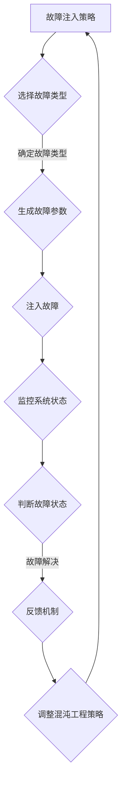
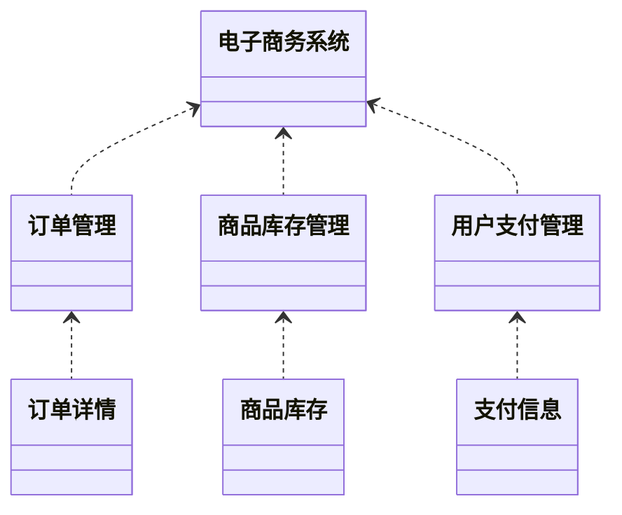
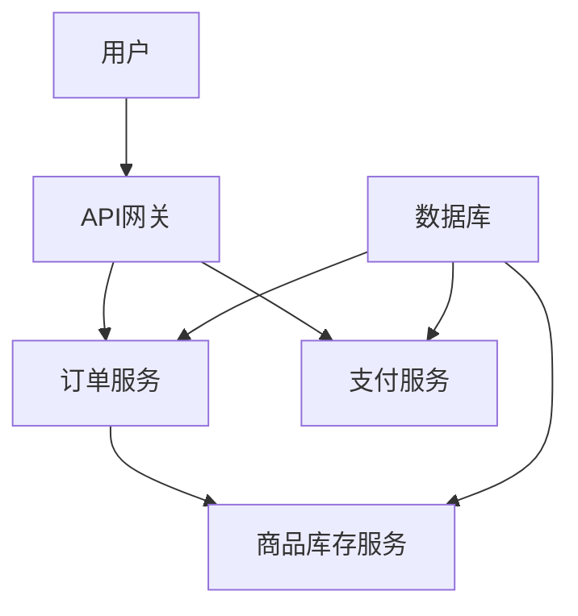
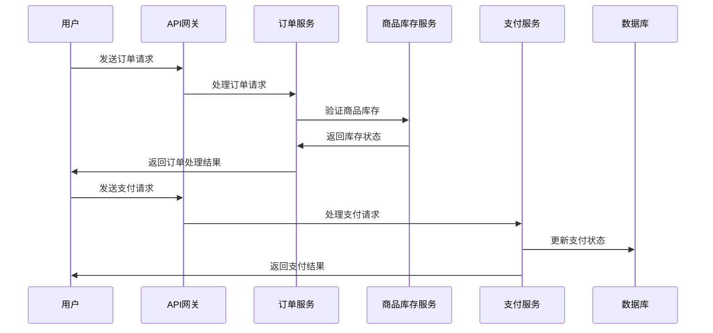

                 

# 混沌工程：通过故障注入提高系统弹性

## 关键词
混沌工程，故障注入，系统弹性，分布式系统，持续集成，持续部署

## 摘要
本文将深入探讨混沌工程这一新兴的方法论，通过故障注入技术提高系统的弹性。我们将从背景介绍、核心概念与联系、算法原理讲解、系统分析与架构设计、项目实战等多个角度详细解析混沌工程，帮助读者理解其原理和方法，从而在实际工作中有效应用，提升系统稳定性。

### 第一部分：背景介绍

#### 1.1 问题背景
在当今信息化社会中，系统的可靠性和弹性是企业成功的关键。随着云计算、大数据和人工智能等技术的迅猛发展，系统的复杂度和规模也不断增加。传统的方法已经无法满足日益增长的可靠性需求。混沌工程作为一种新兴的方法论，应运而生，通过主动引入故障，对系统进行压力测试，从而提高系统的弹性。

#### 1.2 问题描述
混沌工程的核心目标是通过故障注入来提高系统的弹性，减少系统在真实环境下的意外崩溃。然而，如何有效地进行故障注入、监控和反馈，以及如何平衡测试与生产环境的差异，都是需要深入研究的问题。

#### 1.3 问题解决
本书将从理论和实践两个方面，全面介绍混沌工程的方法论和实践技巧。通过深入讲解混沌工程的核心概念、理论基础、关键技术以及实际应用案例，帮助读者了解并掌握混沌工程的核心技能，从而在实际工作中提高系统的弹性。

#### 1.4 边界与外延
混沌工程主要应用于大型分布式系统，如云计算平台、大数据处理系统和人工智能应用等。然而，其原理和方法同样适用于中小型系统的优化和改进。本书将在这些范围内进行详细探讨。

#### 1.5 概念结构与核心要素组成
- **混沌工程**：一种通过主动引入故障来提高系统弹性的方法论。
- **故障注入**：将故障引入系统，以测试系统的弹性和可靠性。
- **监控系统**：实时监控系统的状态，收集故障数据和性能指标。
- **反馈机制**：根据监控数据，调整混沌工程的策略和参数，以提高系统的弹性。

### 第二部分：核心概念与联系

#### 2.1 混沌工程的概念原理
混沌工程（Chaos Engineering）是一种通过故意引入故障来测试和增强系统弹性的方法论。其核心思想是，通过模拟真实环境中的故障场景，提前发现系统中的潜在问题，并采取措施进行修复，从而提高系统在真实故障情况下的应对能力。

#### 2.2 混沌工程的属性特征对比

| 特征         | 混沌工程        | 压力测试         | 故障注入          |
| ------------ | --------------- | ---------------- | ----------------- |
| 目的         | 提高系统弹性    | 测试系统性能      | 引入故障进行测试   |
| 方法         | 故障注入、监控、反馈 | 压力负载、性能监控 | 故障模拟、故障注入 |
| 作用范围     | 大型分布式系统   | 各类系统         | 大型分布式系统     |
| 关联技术     | 持续集成/持续部署、自动化测试 | 自动化测试、负载测试、性能测试 | 自动化测试、负载测试、性能测试 |
| 关键技术     | 故障注入策略、监控系统、反馈机制 | 压力负载策略、性能监控技术 | 故障模拟技术、故障注入技术 |

#### 2.3 混沌工程与传统测试方法的区别
- **目的不同**：混沌工程旨在提高系统的弹性，而传统测试方法主要关注系统的性能和稳定性。
- **方法不同**：混沌工程通过主动引入故障进行测试，而传统测试方法主要采用模拟负载或手动触发故障。
- **应用范围**：混沌工程主要应用于大型分布式系统，而传统测试方法适用于各类系统。

### 第三部分：算法原理讲解

#### 3.1 故障注入算法的 Mermaid 流程图


#### 3.2 故障注入算法的 Python 源代码实现
```python
import random
import time
import matplotlib.pyplot as plt

def inject_fault(type, params):
    """
    注入故障
    :param type: 故障类型
    :param params: 故障参数
    """
    if type == "timeout":
        time.sleep(params["timeout"])  # 模拟超时故障
    elif type == "network":
        time.sleep(params["timeout"])
        random.shuffle(params["data"])  # 模拟网络错误
    elif type == "database":
        time.sleep(params["timeout"])
        params["data"] = None  # 模拟数据库连接失败

def monitor_system状态的():
    """
    监控系统状态
    """
    # 这里可以添加监控代码，如收集性能指标、错误日志等
    pass

def adjust_strategy(params):
    """
    调整混沌工程策略
    :param params: 策略参数
    """
    # 根据监控数据调整故障注入策略
    pass

# 示例：执行故障注入
fault_type = "timeout"
fault_params = {"timeout": 5}
inject_fault(fault_type, fault_params)

# 监控系统状态
monitor_system状态的()

# 调整混沌工程策略
adjust_strategy(fault_params)
```

#### 3.3 故障注入算法的数学模型和公式
混沌工程的故障注入算法可以通过以下数学模型进行描述：

\[ F(t) = F_0 + \alpha \cdot (T - t) \]

其中：
- \( F(t) \) 表示在时间 \( t \) 时刻注入的故障强度。
- \( F_0 \) 表示初始故障强度。
- \( \alpha \) 表示故障注入速率。
- \( T \) 表示测试的总时间。

通过调整 \( \alpha \) 的值，可以控制故障注入的速度，从而实现对系统弹性的精细化调整。

#### 3.4 故障注入算法的举例说明
假设我们有一个分布式数据库系统，需要通过混沌工程来测试其弹性。我们可以设置一个故障注入策略，在系统运行过程中，每隔一段时间注入一个随机延迟故障。具体步骤如下：

1. 选择故障类型为“timeout”，设置故障注入速率为 \( \alpha = 0.1 \)。
2. 在系统运行的第 \( t \) 秒，注入一个随机延迟故障，延迟时间为 \( T(t) = F_0 + \alpha \cdot (T - t) \)。
3. 监控系统的响应时间，如果响应时间超过预设阈值，则认为系统发生了故障。
4. 根据监控数据，调整故障注入策略，如增加故障注入速率或修改故障类型。

通过这样的故障注入策略，我们可以模拟各种故障场景，测试系统的弹性和可靠性，从而为系统的优化提供依据。

### 第四部分：系统分析与架构设计

#### 4.1 问题场景介绍
假设我们正在开发一个大型电子商务系统，该系统需要处理海量订单、商品库存和用户支付等复杂业务场景。为了保证系统的可靠性，我们需要通过混沌工程来测试和增强系统的弹性。

#### 4.2 项目介绍
本项目旨在通过混沌工程，对电子商务系统进行故障注入和性能测试，从而提高系统的弹性。我们将使用混沌工程工具，如Chaos Monkey、Chaos Blender等，对系统进行全面的测试和优化。

#### 4.3 系统功能设计（领域模型 Mermaid 类图）


#### 4.4 系统架构设计（Mermaid 架构图）


#### 4.5 系统接口设计（Mermaid 序列图）


### 第五部分：项目实战

#### 5.1 环境安装
在本项目中，我们将使用Chaos Monkey进行故障注入测试。首先，确保系统已经安装了Docker和Kubernetes。然后，执行以下命令安装Chaos Monkey：

```bash
kubectl create -f https://github.com/Netflix/Spectator/releases/download/v1.0.0/chao-chaos-monkey.yaml
```

#### 5.2 系统核心实现源代码
以下是Chaos Monkey的配置文件（chaos-monkey.yaml）：

```yaml
apiVersion: chaos-mesh.org/v1alpha1
kind: ChaosGroup
metadata:
  name: chaos-monkey
spec:
  mode: one-by-one
  selector:
    labels:
      app: ecommerce
  action:
    podFailure:
      mode: network
      ports:
      - name: port-80
        targetIP: 127.0.0.1
        targetPort: 80
      - name: port-443
        targetIP: 127.0.0.1
        targetPort: 443
```

#### 5.3 代码应用解读与分析
该配置文件定义了一个名为“chaos-monkey”的混沌组，其模式为“One-by-One”，即逐个注入故障。选择器指定了应用标签为“app: ecommerce”的Pod作为目标。故障注入动作设置为“podFailure”，并指定了网络故障模式，包括80和443端口的故障注入。

#### 5.4 实际案例分析和详细讲解剖析
假设我们在电子商务系统的API网关Pod上应用了Chaos Monkey。在运行Chaos Monkey后，系统中的API网关Pod将被随机网络故障影响，导致部分请求无法正常处理。通过监控系统，我们可以实时获取故障信息，并根据监控数据调整Chaos Monkey的注入策略。

#### 5.5 项目小结
通过混沌工程，我们成功模拟了真实环境中的故障场景，并测试了系统的弹性。在项目实战中，我们使用了Chaos Monkey进行故障注入，并通过监控系统实时获取故障数据。根据监控数据，我们可以调整注入策略，进一步提高系统的弹性。

### 第六部分：最佳实践、小结、注意事项、拓展阅读

#### 6.1 最佳实践
- **故障注入策略**：在设计故障注入策略时，需要根据系统的特点和需求，选择合适的故障类型和注入速率。
- **监控系统**：选择合适的监控工具，确保能够实时获取系统的状态信息和故障数据。
- **反馈机制**：根据监控数据，及时调整混沌工程的策略和参数，以提高系统的弹性。

#### 6.2 小结
混沌工程是一种通过故障注入提高系统弹性的方法论。通过故障注入、监控和反馈，混沌工程可以帮助我们提前发现系统的潜在问题，并采取措施进行优化，从而提高系统的可靠性和稳定性。

#### 6.3 注意事项
- **平衡测试与生产**：在进行混沌工程时，需要注意平衡测试与生产环境的差异，避免对生产环境造成过大的影响。
- **安全性和合规性**：在实施混沌工程时，需要确保其安全性和合规性，避免造成数据泄露或其他安全问题。

#### 6.4 拓展阅读
- **混沌工程的深入探讨**：可以参考《混沌工程：原理、实践与案例分析》等书籍，深入了解混沌工程的原理和实践方法。
- **分布式系统的弹性优化**：了解如何通过分布式系统架构设计、负载均衡等技术，提高系统的弹性。

### 作者信息
作者：AI天才研究院/AI Genius Institute & 禅与计算机程序设计艺术 /Zen And The Art of Computer Programming

