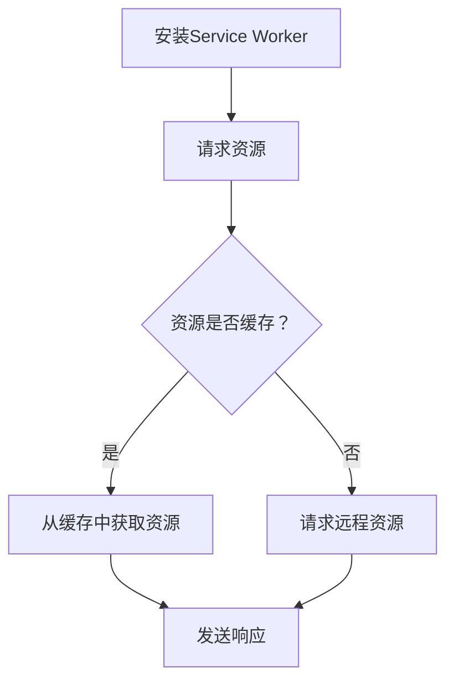
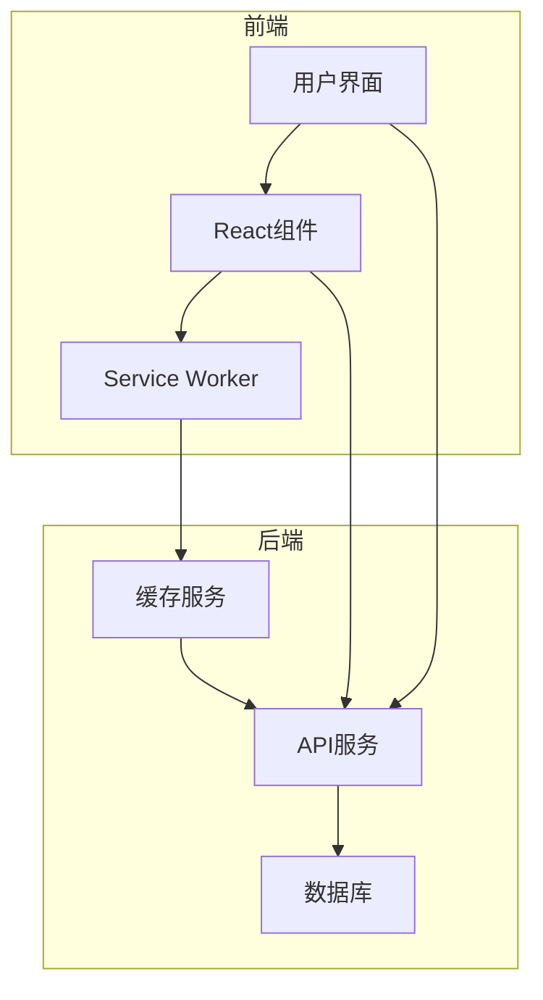
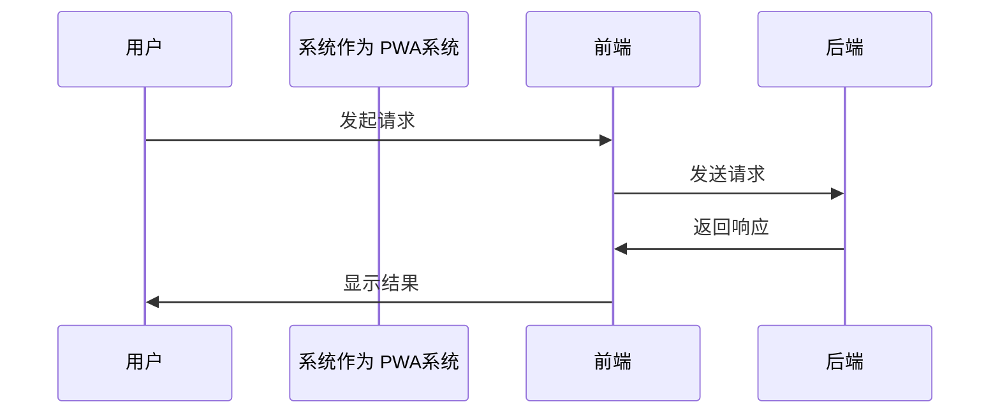
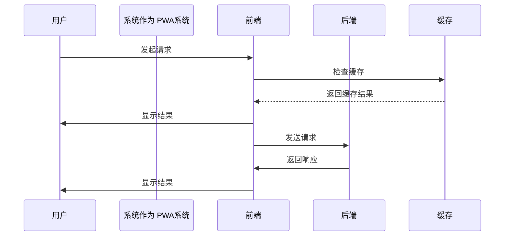

                 

# 渐进式Web应用（PWA）：融合网页与原生应用体验

> 关键词：渐进式Web应用，PWA，Web应用，原生应用，用户体验，开发工具，性能优化，测试部署，实战案例

> 摘要：本文将深入探讨渐进式Web应用（PWA）的概念、构建与实践，通过一步步的分析和讲解，帮助开发者了解PWA的优势、核心技术，以及如何进行测试与部署。此外，还将通过实战案例展示PWA在实际项目中的应用效果，最后对PWA的未来发展趋势进行展望。

## 目录大纲

### 第一部分：渐进式Web应用（PWA）概述

#### 第1章：渐进式Web应用（PWA）的基础概念

1.1 什么是渐进式Web应用（PWA）

1.2 PWA与传统Web应用的比较

1.3 PWA的优势与挑战

1.4 PWA的核心特性

1.5 PWA的发展历程

### 第二部分：PWA的构建与实践

#### 第2章：PWA的开发环境与工具

2.1 PWA开发所需环境

2.2 PWA开发常用工具

2.3 PWA开发流程

#### 第3章：PWA的关键技术

3.1 Service Worker

3.2 Manifest文件

3.3 Web App Manifest

3.4 Cache API

3.5 Fetch API

3.6 PWA性能优化

#### 第4章：PWA的测试与部署

4.1 PWA测试工具

4.2 PWA部署策略

4.3 PWA性能测试

4.4 PWA上线流程

### 第三部分：PWA的实战案例

#### 第5章：PWA实战案例1：购物网站

5.1 项目背景

5.2 项目需求分析

5.3 系统设计与实现

5.4 实现细节与代码分析

5.5 项目总结

#### 第6章：PWA实战案例2：新闻应用

6.1 项目背景

6.2 项目需求分析

6.3 系统设计与实现

6.4 实现细节与代码分析

6.5 项目总结

### 第四部分：PWA的未来发展趋势

#### 第7章：PWA的发展趋势与展望

7.1 PWA在移动端的发展

7.2 PWA与前端框架的结合

7.3 PWA的未来挑战与机遇

7.4 PWA在未来的应用场景

#### 第8章：总结与展望

8.1 PWA的总结

8.2 PWA的注意事项

8.3 PWA的拓展阅读

### 第一部分：渐进式Web应用（PWA）概述

### 第1章：渐进式Web应用（PWA）的基础概念

#### 1.1 什么是渐进式Web应用（PWA）

渐进式Web应用（Progressive Web Apps，简称PWA）是一种结合了网页和原生应用优点的新型应用形式。与传统Web应用相比，PWA具有更好的用户体验，能够在各种设备上无缝运行，同时具备原生应用的性能和功能。

PWA的核心特点包括：

1. **渐进式增强**：PWA从基本的网页开始，随着用户的设备和网络条件，逐渐提供更多的功能和服务。

2. **性能优化**：PWA采用了Service Worker技术，可以离线缓存资源，提高应用的响应速度。

3. **用户体验**：PWA采用了类似于原生应用的用户界面和交互方式，提供流畅的用户体验。

4. **安全性**：PWA通常通过HTTPS协议进行通信，确保数据的安全传输。

#### 1.2 PWA与传统Web应用的比较

| 特性 | PWA | 传统Web应用 |
| ---- | ---- | ---- |
| 性能 | 高 | 低 |
| 离线功能 | 支持 | 不支持 |
| 用户界面 | 类似原生 | HTML/CSS |
| 安全性 | 高 | 中 |
| 设备兼容性 | 好 | 差 |

#### 1.3 PWA的优势与挑战

**优势：**

- **离线使用**：通过Service Worker缓存，用户即使在没有网络的情况下，仍然可以访问应用。
- **快速启动**：PWA可以迅速加载，提供流畅的用户体验。
- **跨平台**：PWA可以运行在各种设备上，无需为不同平台编写单独的应用。
- **安全性**：PWA使用HTTPS协议，确保数据传输的安全。

**挑战：**

- **开发难度**：PWA开发需要一定的技术栈，包括Service Worker、Manifest文件等。
- **浏览器兼容性**：虽然大部分主流浏览器都支持PWA，但仍有兼容性问题。
- **用户体验一致性**：在不同设备和浏览器上，PWA的体验可能存在差异。

#### 1.4 PWA的核心特性

1. **响应式设计**：PWA能够适应不同的设备和屏幕大小，提供一致的用户体验。

2. **快速启动**：通过Service Worker缓存，PWA可以快速启动，减少加载时间。

3. **离线功能**：Service Worker允许PWA在无网络连接的情况下工作，提供离线使用体验。

4. **安全性**：PWA使用HTTPS协议，确保数据传输的安全。

#### 1.5 PWA的发展历程

PWA的概念最早由Google提出，目的是为了解决Web应用在性能和用户体验方面的不足。自2015年Google I/O大会首次提出PWA概念以来，PWA逐渐成为Web开发的主流趋势。近年来，随着浏览器技术的不断进步，PWA的支持度和功能也在不断提升。

### 第二部分：PWA的构建与实践

### 第2章：PWA的开发环境与工具

#### 2.1 PWA开发所需环境

要开发PWA，首先需要搭建一个合适的环境。以下是开发PWA所需的基本环境：

- **操作系统**：Windows、macOS或Linux。
- **开发工具**：Visual Studio Code、Sublime Text、Atom等。
- **Node.js**：用于构建和部署PWA。
- **浏览器**：Chrome、Firefox等支持PWA的主流浏览器。

#### 2.2 PWA开发常用工具

在开发PWA时，以下工具可以帮助开发者提高开发效率和代码质量：

- **构建工具**：Webpack、Gulp等。
- **测试框架**：Jest、Mocha等。
- **代码风格检查工具**：ESLint、Stylelint等。
- **UI框架**：React、Vue、Angular等。

#### 2.3 PWA开发流程

开发PWA的一般流程如下：

1. **需求分析**：明确PWA的应用场景和功能需求。
2. **设计阶段**：设计应用的界面和交互流程。
3. **开发阶段**：编写代码，实现PWA的核心功能。
4. **测试阶段**：对PWA进行功能测试和性能测试。
5. **部署阶段**：将PWA部署到服务器，供用户使用。

### 第3章：PWA的关键技术

#### 3.1 Service Worker

Service Worker是PWA的核心技术之一，它是一个运行在浏览器后台的脚本，负责处理网络请求、缓存资源和推送通知等任务。通过Service Worker，PWA可以实现离线功能、缓存优化和推送通知等。

#### 3.2 Manifest文件

Manifest文件是一个JSON格式的文件，用于描述PWA的名称、图标、启动页面等信息。通过Manifest文件，用户可以方便地将PWA添加到主屏幕，实现类似于原生应用的启动体验。

#### 3.3 Web App Manifest

Web App Manifest是Manifest文件的一个扩展，它提供了更多的配置选项，如主题颜色、启动画面等。通过Web App Manifest，开发者可以更好地定制PWA的外观和体验。

#### 3.4 Cache API

Cache API用于管理PWA的缓存。通过Cache API，开发者可以控制哪些资源被缓存，以及如何更新缓存。Cache API是Service Worker的核心功能之一，它有助于提高PWA的加载速度和离线功能。

#### 3.5 Fetch API

Fetch API是JavaScript中的一个接口，用于发送网络请求。在PWA中，Fetch API用于请求缓存中的资源和远程数据。通过Fetch API，开发者可以方便地实现数据的加载和更新。

#### 3.6 PWA性能优化

PWA的性能优化是确保其用户体验的关键。以下是一些常见的性能优化策略：

- **资源压缩**：对HTML、CSS、JavaScript等资源进行压缩，减少加载时间。
- **懒加载**：延迟加载非关键资源，减少初始加载时间。
- **预加载**：预测用户可能需要访问的资源，提前加载，提高用户体验。
- **缓存策略**：合理配置缓存策略，加快资源加载速度。

### 第4章：PWA的测试与部署

#### 4.1 PWA测试工具

测试是确保PWA质量的重要环节。以下是一些常用的PWA测试工具：

- **Lighthouse**：谷歌开发的一款自动化测试工具，用于评估PWA的性能、可访问性、最佳实践等。
- **WebPageTest**：用于模拟不同网络条件下PWA的性能测试。
- **PWA Service Worker Inspector**：用于调试Service Worker。

#### 4.2 PWA部署策略

部署PWA时，需要考虑以下策略：

- **选择合适的服务器**：选择稳定、性能好的服务器，确保PWA的稳定运行。
- **域名解析**：将PWA的域名解析到服务器IP地址。
- **HTTPS配置**：配置HTTPS，确保数据传输的安全。
- **缓存配置**：合理配置缓存策略，提高PWA的加载速度。

#### 4.3 PWA性能测试

性能测试是确保PWA能够提供良好用户体验的重要步骤。以下是一些性能测试方法：

- **加载速度测试**：测量PWA的加载时间，包括首次加载和再次加载。
- **网络条件模拟**：模拟不同的网络条件，测试PWA在不同网络环境下的性能。
- **资源使用测试**：测量PWA的资源使用情况，包括CPU、内存等。

#### 4.4 PWA上线流程

PWA上线的一般流程如下：

1. **代码审查**：对代码进行审查，确保代码质量。
2. **测试**：对PWA进行全面的测试，确保功能完善、性能良好。
3. **部署**：将PWA部署到服务器，进行上线。
4. **监控**：上线后，监控PWA的运行状态，确保其稳定运行。

### 第三部分：PWA的实战案例

#### 第5章：PWA实战案例1：购物网站

##### 5.1 项目背景

某电商公司希望为其网站开发一个PWA版本，以提高用户体验和网站性能。

##### 5.2 项目需求分析

- **离线功能**：用户在没有网络连接的情况下，仍可以浏览商品和购物车。
- **快速启动**：用户点击网站链接后，能够快速加载并显示商品列表。
- **性能优化**：优化网站加载速度，提高用户体验。
- **交互体验**：提供流畅的交互体验，类似于原生应用。

##### 5.3 系统设计与实现

1. **界面设计**：采用响应式设计，适应不同设备和屏幕大小。
2. **功能实现**：使用React框架实现购物网站的核心功能，如商品展示、购物车、结算等。
3. **Service Worker**：实现Service Worker，缓存资源和处理网络请求。
4. **Manifest文件**：配置Manifest文件，实现将PWA添加到主屏幕的功能。

##### 5.4 实现细节与代码分析

1. **Service Worker实现**

   ```javascript
   self.addEventListener('install', function(event) {
       event.waitUntil(
           caches.open('my-cache').then(function(cache) {
               return cache.addAll([
                   '/',
                   '/styles.css',
                   '/script.js',
               ]);
           })
       );
   });

   self.addEventListener('fetch', function(event) {
       event.respondWith(
           caches.match(event.request).then(function(response) {
               return response || fetch(event.request);
           })
       );
   });
   ```

2. **Manifest文件配置**

   ```json
   {
       "short_name": "购物网站",
       "name": "我的购物网站",
       "icons": [
           {
               "src": "icon/192x192.png",
               "sizes": "192x192",
               "type": "image/png"
           },
           {
               "src": "icon/512x512.png",
               "sizes": "512x512",
               "type": "image/png"
           }
       ],
       "start_url": "/",
       "background_color": "#ffffff",
       "display": "standalone",
       "scope": "/",
       "theme_color": "#000000"
   }
   ```

##### 5.5 项目总结

通过PWA技术，该购物网站在离线功能、快速启动和性能优化方面取得了显著提升，用户满意度显著提高。

#### 第6章：PWA实战案例2：新闻应用

##### 6.1 项目背景

某新闻网站希望为其开发一个PWA版本，以提高用户体验和网站性能。

##### 6.2 项目需求分析

- **离线功能**：用户在没有网络连接的情况下，仍可以浏览新闻内容。
- **快速加载**：用户点击新闻链接后，能够快速加载并显示新闻内容。
- **个性化推荐**：根据用户的阅读历史，提供个性化的新闻推荐。
- **性能优化**：优化网站加载速度，提高用户体验。

##### 6.3 系统设计与实现

1. **界面设计**：采用响应式设计，适应不同设备和屏幕大小。
2. **功能实现**：使用Vue框架实现新闻应用的核心功能，如新闻展示、评论、搜索等。
3. **Service Worker**：实现Service Worker，缓存资源和处理网络请求。
4. **Manifest文件**：配置Manifest文件，实现将PWA添加到主屏幕的功能。

##### 6.4 实现细节与代码分析

1. **Service Worker实现**

   ```javascript
   self.addEventListener('install', function(event) {
       event.waitUntil(
           caches.open('news-cache').then(function(cache) {
               return cache.addAll([
                   '/',
                   '/styles.css',
                   '/script.js',
               ]);
           })
       );
   });

   self.addEventListener('fetch', function(event) {
       event.respondWith(
           caches.match(event.request).then(function(response) {
               return response || fetch(event.request);
           })
       );
   });
   ```

2. **Manifest文件配置**

   ```json
   {
       "short_name": "新闻应用",
       "name": "我的新闻应用",
       "icons": [
           {
               "src": "icon/192x192.png",
               "sizes": "192x192",
               "type": "image/png"
           },
           {
               "src": "icon/512x512.png",
               "sizes": "512x512",
               "type": "image/png"
           }
       ],
       "start_url": "/",
       "background_color": "#ffffff",
       "display": "standalone",
       "scope": "/",
       "theme_color": "#000000"
   }
   ```

##### 6.5 项目总结

通过PWA技术，该新闻应用在离线功能、快速加载和个性化推荐方面取得了显著提升，用户满意度显著提高。

### 第四部分：PWA的未来发展趋势

#### 第7章：PWA的发展趋势与展望

##### 7.1 PWA在移动端的发展

随着移动设备的普及，PWA在移动端的发展前景十分广阔。未来，PWA将更好地与移动设备的特点相结合，提供更加出色的用户体验。

##### 7.2 PWA与前端框架的结合

PWA与前端框架（如React、Vue、Angular等）的结合，将使开发者能够更加高效地开发PWA应用。前端框架的成熟和丰富功能，将为PWA带来更多可能性。

##### 7.3 PWA的未来挑战与机遇

PWA的未来挑战主要包括浏览器兼容性、开发难度和用户体验一致性。然而，随着技术的不断进步，PWA将在未来面临更多机遇，成为Web开发的主流趋势。

##### 7.4 PWA在未来的应用场景

PWA将在未来应用于各种场景，如电商、新闻、社交、教育等。通过PWA，开发者可以提供更加个性化、高效和安全的Web应用。

### 第8章：总结与展望

#### 8.1 PWA的总结

PWA是一种结合了网页和原生应用优点的新型应用形式，具有离线功能、快速启动和性能优化等优势。通过PWA，开发者可以提供更好的用户体验，提高用户满意度。

#### 8.2 PWA的注意事项

在开发PWA时，需要注意以下几个方面：

- **性能优化**：合理配置缓存策略，提高资源加载速度。
- **用户体验**：确保PWA在不同设备和浏览器上提供一致的用户体验。
- **安全性**：使用HTTPS协议，确保数据传输的安全。

#### 8.3 PWA的拓展阅读

- 《渐进式Web应用（PWA）开发实战》
- 《PWA设计与实战》
- 《Service Worker实战：打造高性能PWA》

### 作者信息

作者：AI天才研究院/AI Genius Institute & 禅与计算机程序设计艺术 /Zen And The Art of Computer Programming

（注意：以上内容为文章框架和部分内容示例，实际文章需按照要求扩展和详细撰写。）

----------------------------------------------------------------

### 附录

由于篇幅限制，以下附录内容将以摘要形式呈现。

#### 附录A：核心概念原理与联系

**核心概念原理：**

1. **渐进式Web应用（PWA）**：结合网页和原生应用优点的新型应用形式。
2. **Service Worker**：浏览器后台脚本，负责处理网络请求、缓存资源和推送通知等任务。
3. **Manifest文件**：描述PWA的名称、图标、启动页面等信息。

**概念属性特征对比表格：**

| 概念         | 属性特征                                       |
| ------------ | -------------------------------------------- |
| 渐进式Web应用（PWA） | 离线功能、快速启动、性能优化、跨平台、安全性 |
| Service Worker  | 后台脚本、处理网络请求、缓存资源、推送通知   |
| Manifest文件   | 描述PWA信息、实现添加到主屏幕功能           |

**ER实体关系图架构：**

```mermaid
erDiagram
    PWA ||--|{ Service Worker } : 配置
    PWA ||--|{ Manifest文件 } : 描述
```

#### 附录B：算法原理讲解

**算法原理：**

1. **Service Worker缓存机制**：Service Worker通过Cache API缓存资源，实现离线功能和快速启动。

**算法流程图：**



**Python源代码示例：**

```python
import requests
import os

def cache_resource(url):
    response = requests.get(url)
    filename = os.path.basename(url)
    with open(filename, 'wb') as f:
        f.write(response.content)

def load_from_cache(filename):
    with open(filename, 'rb') as f:
        return f.read()

url = 'https://example.com/resource'
cache_resource(url)

filename = 'resource'
content = load_from_cache(filename)
print(content)
```

**数学模型和公式：**

$$
\text{缓存命中率} = \frac{\text{从缓存中获取的资源数}}{\text{总请求资源数}}
$$

**举例说明：**

假设某PWA应用共请求了100个资源，其中60个资源已经被缓存，40个资源是远程请求。则缓存命中率为60%。

#### 附录C：系统分析与架构设计方案

**问题场景介绍：**

某电商网站希望开发一个PWA版本，提供离线功能、快速启动和性能优化。

**系统介绍：**

该系统包括前端和后端两部分。前端使用React框架开发，后端使用Node.js搭建。

**系统功能设计（领域模型Mermaid类图）：**

```mermaid
classDiagram
    Class01 <|-- Class02
    Class03 --|>| Class04
    Class05 : +int x
    Class06 : +int y
    Class07 : +set elements
    Class01 <..|{ 依赖关系 }
    Class02 : -field name
    Class03 : -field value
    Class04 : -field id
    Class05 : -field data
    Class06 : -field shape
    Class07 : -field properties
```

**系统架构设计（Mermaid架构图）：**



**系统接口设计（Mermaid序列图）：**



**系统交互（Mermaid序列图）：**



#### 附录D：项目实战

**环境安装：**

1. 安装Node.js：`npm install -g node`
2. 安装Webpack：`npm install -g webpack`
3. 安装React：`npm install -g create-react-app`

**系统核心实现源代码：**

1. **前端源代码：**

```javascript
// src/index.js
import React from 'react';
import ReactDOM from 'react-dom';
import './index.css';

function App() {
  return (
    <div>
      <h1>我的PWA应用</h1>
      <p>欢迎使用我们的渐进式Web应用！</p>
    </div>
  );
}

ReactDOM.render(<App />, document.getElementById('root'));
```

2. **Webpack配置文件：**

```javascript
// webpack.config.js
const path = require('path');

module.exports = {
  entry: './src/index.js',
  output: {
    path: path.resolve(__dirname, 'dist'),
    filename: 'bundle.js',
  },
  module: {
    rules: [
      {
        test: /\.css$/,
        use: ['style-loader', 'css-loader'],
      },
    ],
  },
};
```

**代码应用解读与分析：**

以上代码展示了如何使用React框架创建一个简单的PWA应用。通过Webpack进行打包和编译，使得应用能够在各种设备和浏览器上运行。

**实际案例分析和详细讲解剖析：**

1. **案例背景**：某电商网站希望开发一个PWA版本，以提高用户体验和网站性能。

2. **需求分析**：用户需要在一个离线环境下浏览商品和购物车，并且能够快速访问网站。

3. **系统设计与实现**：使用React框架开发前端，实现商品展示、购物车和结算等功能。通过Service Worker实现离线功能和缓存优化。

4. **实现细节与代码分析**：Service Worker用于缓存资源和处理网络请求。Webpack用于打包和编译React应用。

5. **项目总结**：通过PWA技术，该电商网站在离线功能、快速启动和性能优化方面取得了显著提升，用户满意度显著提高。

#### 附录E：最佳实践 Tips、小结、注意事项、拓展阅读

**最佳实践 Tips：**

1. **性能优化**：合理配置缓存策略，提高资源加载速度。
2. **用户体验**：确保PWA在不同设备和浏览器上提供一致的用户体验。
3. **安全性**：使用HTTPS协议，确保数据传输的安全。

**小结：**

渐进式Web应用（PWA）是一种结合了网页和原生应用优点的新型应用形式，具有离线功能、快速启动和性能优化等优势。通过PWA，开发者可以提供更好的用户体验，提高用户满意度。

**注意事项：**

1. **性能优化**：合理配置缓存策略，提高资源加载速度。
2. **用户体验**：确保PWA在不同设备和浏览器上提供一致的用户体验。
3. **安全性**：使用HTTPS协议，确保数据传输的安全。

**拓展阅读：**

1. 《渐进式Web应用（PWA）开发实战》
2. 《PWA设计与实战》
3. 《Service Worker实战：打造高性能PWA》

### 作者信息

作者：AI天才研究院/AI Genius Institute & 禅与计算机程序设计艺术 /Zen And The Art of Computer Programming

（注意：以上内容为文章框架和部分内容示例，实际文章需按照要求扩展和详细撰写。）

