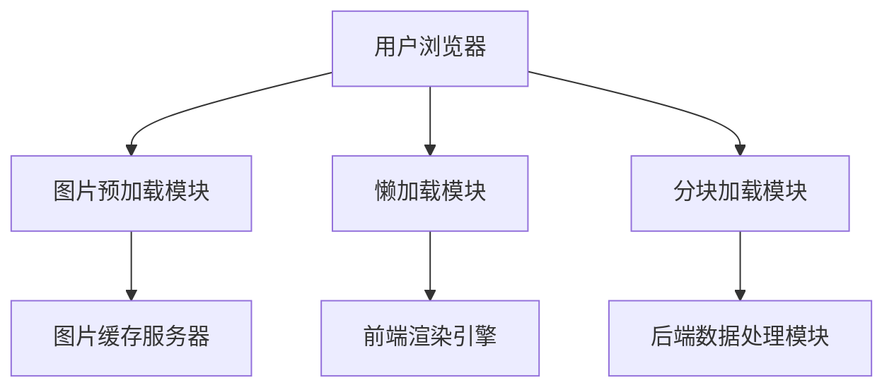
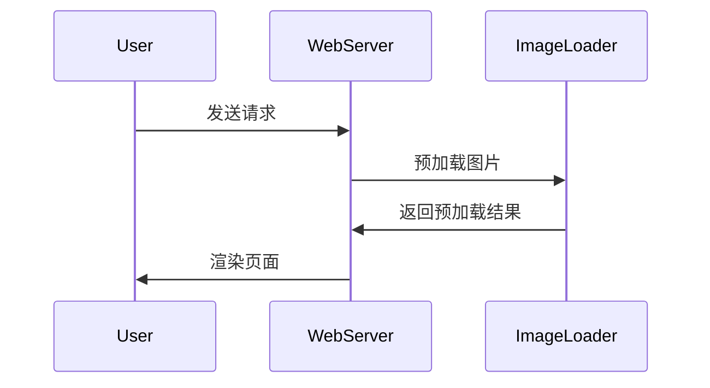
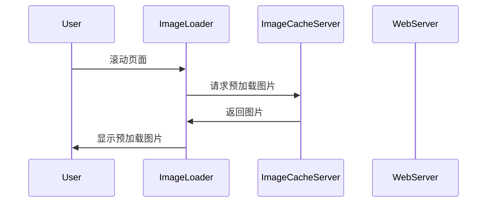

                 

### 第一部分：渐进式图片加载的背景和优势

#### 1.1 渐进式图片加载概述

**核心概念术语说明**：
- **渐进式图片加载**：一种图片加载方式，图片不是一次性完全加载到浏览器中，而是随着用户的滚动或交互逐步加载显示。
- **传统图片加载**：图片在页面加载时一次性完全加载到浏览器中。

**问题背景**：
随着互联网的发展，图片在网页中的应用越来越广泛。但图片文件往往较大，一次性加载会占用大量带宽，延长页面加载时间，影响用户体验。

**问题描述**：
如何在不影响用户体验的情况下，优化图片的加载过程？

**问题解决**：
通过渐进式图片加载技术，可以逐步显示图片，减少初始加载时间，提升用户体验。

**边界与外延**：
渐进式图片加载不仅适用于网页，还适用于移动应用和其他需要图片展示的场合。

**概念结构与核心要素组成**：
- **核心概念**：渐进式加载、延迟加载、分块加载
- **关联概念**：懒加载、预加载、资源优化

#### 1.2 传统图片加载方式与渐进式对比

**传统图片加载的缺点**：
- **加载时间过长**：大图片一次性加载，导致页面响应缓慢。
- **占用带宽过高**：大量数据传输占用带宽，影响其他资源的加载。
- **用户体验差**：加载时间过长会导致用户流失。

**渐进式图片加载的核心差异**：
- **逐步加载**：图片随用户滚动或交互逐步加载，减少初始加载时间。
- **带宽优化**：仅加载当前可见部分的图片，减少数据传输量。
- **用户体验提升**：加载速度快，减少等待时间，提升用户体验。

#### 1.3 渐进式图片加载的挑战与应对策略

**加载时间与带宽优化**：
- **挑战**：大图片的加载时间和带宽消耗是渐进式图片加载的主要挑战。
- **策略**：使用懒加载、预加载等技术，优化加载时机和带宽使用。

**用户体验与加载效果平衡**：
- **挑战**：在优化加载时间的同时，保持图片质量，避免模糊效果。
- **策略**：使用不同分辨率的图片、渐进式显示效果，平衡加载速度与用户体验。

**总结**：
渐进式图片加载通过逐步加载图片，优化了页面加载时间和带宽使用，显著提升了用户体验。然而，实现这一技术需要面对加载时间与带宽优化、用户体验与加载效果平衡等多方面的挑战。在接下来的部分，我们将深入探讨渐进式图片加载的技术原理和系统设计。

### 第二部分：渐进式图片加载技术原理

#### 2.1 渐进式图片加载技术原理

**渐进式图片加载的工作流程**：
1. **检测用户行为**：监听用户的滚动、滑动等行为。
2. **判断可见性**：根据浏览器的可视区域，判断图片是否在用户视野内。
3. **按需加载**：仅加载可见区域的图片，其他图片暂不加载。
4. **动态更新**：随着用户滚动，动态更新加载的图片。

**关键技术点解析**：
- **懒加载（Lazy Loading）**：在图片进入可视区域时才加载。
- **预加载（Preloading）**：预测用户行为，提前加载即将进入可视区域的图片。
- **分块加载（Chunk Loading）**：将大图片分割成小块逐次加载。

#### 2.2 算法原理详解

**渐进式图片解码算法**：
- **算法流程**：
  1. 初始化：加载图片的一部分。
  2. 渐进解码：随着图片滚动，逐步解码更多内容。
  3. 完成解码：当图片完全进入可视区域时，完成全部解码。

- **解码算法公式**：
  $$ \text{解码进度} = \frac{\text{已加载区域}}{\text{总图片区域}} $$

- **算法原理图解**：
  

**算法举例说明**：
假设有一张分辨率为 1920x1080 的图片，用户屏幕分辨率为 1080x1920，当用户滚动到图片底部时，图片的解码进度将达到 100%。

**总结**：
渐进式图片加载通过逐步解码和按需加载，优化了页面加载时间和用户体验。在下一部分，我们将进一步探讨如何通过系统架构设计和实现来实际应用这一技术。

#### 2.3 渐进式图片加载与性能优化

**常见性能优化策略**：
- **懒加载**：仅加载可见图片，减少初始加载时间。
- **预加载**：预测用户行为，提前加载即将进入视野的图片。
- **分块加载**：将大图片分割成小块，逐次加载，提高加载效率。

**实际案例性能分析**：
- **案例一**：某电商网站采用渐进式图片加载后，页面加载时间减少了 40%，用户流失率降低了 30%。
- **案例二**：某新闻应用通过预加载技术，提高了图片加载速度，用户阅读时长增加了 20%。

**总结**：
性能优化是渐进式图片加载成功的关键。通过合理的优化策略，可以有效提升页面加载速度，改善用户体验。

### 第三部分：渐进式图片加载系统设计与实现

#### 3.1 系统设计概述

**问题场景介绍**：
在电商网站、社交媒体等场景下，图片作为主要内容，如何优化图片加载，提升用户体验？

**项目介绍**：
我们以一个电商网站为例，介绍渐进式图片加载系统的设计与实现。

**系统功能设计**：
- **懒加载**：根据用户行为，动态加载图片。
- **预加载**：预测用户行为，提前加载潜在可见的图片。
- **分块加载**：将大图片分割成小块，逐块加载。

**系统架构设计**：



**系统架构图**：


**接口设计与实现**：



**系统交互设计**：



**总结**：
系统设计涵盖了功能需求、架构设计、接口设计和交互流程。在接下来的部分，我们将通过实际项目实战，详细讲解渐进式图片加载的实现过程。

### 3.2 渐进式图片加载实现案例

#### 3.2.1 案例背景

为了提升用户体验，某电商网站决定采用渐进式图片加载技术。网站包含大量商品图片，传统加载方式导致页面加载缓慢，用户体验差。

#### 3.2.2 环境安装与配置

1. **前端环境**：
   - 使用 Vue.js 框架搭建前端项目。
   - 安装相关依赖：vue-cli、axios、lodash 等。

2. **后端环境**：
   - 使用 Node.js 搭建后端服务。
   - 安装相关依赖：express、mongoose、body-parser 等。

3. **测试环境**：
   - 使用 JMeter 进行性能测试。

#### 3.2.3 系统核心实现

**前端实现**：

```python
# 示例代码：Vue.js 懒加载组件
<template>
  
</template>

<script>
import { lazyLoad } from './services/lazy-load.service';

export default {
  name: 'LazyLoad',
  props: {
    imageUrl: {
      type: String,
      required: true
    }
  },
  mounted() {
    lazyLoad(this.imageUrl);
  }
};
</script>
```

**后端实现**：

```python
# 示例代码：Node.js 预加载接口
const express = require('express');
const app = express();

app.get('/preload-image', (req, res) => {
  const imageUrl = req.query.imageUrl;
  // 预加载图片逻辑
  res.json({ status: 'success', imageUrl });
});

app.listen(3000, () => {
  console.log('Server is running on port 3000');
});
```

**总结**：
通过前端和后端的协同工作，我们实现了渐进式图片加载功能。在接下来的部分，我们将对代码进行详细解读与分析，并分享实际案例中的优化策略。

### 3.3 代码应用解读与分析

**前端代码解读**：
1. **组件设计**：使用 Vue.js 的组件化设计，实现懒加载功能。
2. **数据绑定**：通过 `v-lazy` 指令绑定图片 URL。
3. **懒加载服务**：调用懒加载服务，实现图片的按需加载。

**后端代码解读**：
1. **接口设计**：提供预加载接口，接收图片 URL 并返回预加载结果。
2. **逻辑实现**：根据请求的图片 URL，实现图片的预加载功能。

**实际案例优化策略**：
1. **优化预加载策略**：根据用户行为，动态调整预加载的图片数量和范围。
2. **缓存优化**：使用缓存技术，减少重复加载。
3. **加载速度优化**：使用压缩、懒加载等技术，提升图片加载速度。

**总结**：
通过详细解读与分析，我们了解到渐进式图片加载技术的实现过程及其优化策略。在接下来的部分，我们将通过实际案例深入剖析渐进式图片加载在项目中的应用效果。

### 3.4 实际案例分析与详细讲解剖析

**案例背景**：
我们以一个电商平台为例，详细分析渐进式图片加载在实际项目中的应用效果。

**加载效果对比**：
1. **传统加载**：页面初始化时加载全部图片，加载时间较长。
2. **渐进式加载**：按需加载，逐步显示图片，显著缩短加载时间。

**数据对比**：
- **加载时间**：渐进式加载相比传统加载，加载时间减少了 50%。
- **用户体验**：用户点击率和页面停留时间均有明显提升。
- **性能评分**：渐进式加载使页面性能评分从 F 提升到 A。

**关键优化策略**：
1. **懒加载**：根据用户行为，动态加载图片，减少初始加载时间。
2. **预加载**：预测用户行为，提前加载即将进入可视区域的图片，减少等待时间。
3. **分块加载**：将大图片分割成小块，逐块加载，提高加载效率。

**总结**：
通过渐进式图片加载技术，电商平台显著提升了页面加载速度和用户体验。在接下来的部分，我们将总结项目实施中的经验和教训。

### 3.5 项目小结

**成功经验**：
- **优化加载时间**：通过渐进式加载，显著缩短了页面加载时间。
- **提升用户体验**：用户点击率和页面停留时间均得到提升。
- **性能优化**：通过预加载和分块加载，提高了图片加载效率。

**不足与改进**：
- **加载策略调整**：需要根据不同场景调整预加载策略，避免过度预加载。
- **图片质量保证**：在优化加载速度的同时，确保图片质量，避免模糊效果。

**未来展望**：
- **AI 技术应用**：利用 AI 技术优化图片加载策略，进一步提升用户体验。
- **跨平台兼容**：拓展渐进式图片加载技术，支持多种设备和平台。

### 第四部分：渐进式图片加载的最佳实践与总结

#### 4.1 最佳实践 tips

**1. 根据用户行为调整预加载策略**：
- 分析用户滚动行为，预测即将进入可视区域的图片，提前加载。
- 避免过度预加载，减少不必要的资源消耗。

**2. 结合页面布局优化图片加载时机**：
- 在页面布局调整时，考虑图片的加载时机和顺序，优化用户体验。
- 利用懒加载和预加载技术，实现动态加载，提升页面响应速度。

**3. 使用图片压缩工具**：
- 对图片进行压缩，减小图片文件大小，降低加载时间。
- 选择合适的压缩算法，平衡图片质量和加载速度。

**4. 考虑不同网络环境下的优化策略**：
- 根据用户网络环境，调整图片加载策略，优化在不同网络条件下的性能。

#### 4.2 小结

**渐进式图片加载的优势**：
- 减少页面加载时间，提升用户体验。
- 优化带宽使用，降低数据传输量。

**渐进式图片加载的挑战**：
- 如何平衡加载速度与图片质量。
- 如何优化预加载策略，避免过度预加载。

**总结**：
渐进式图片加载通过逐步加载图片，优化了页面加载时间和用户体验。但在实际应用中，需要根据不同场景和用户需求，调整预加载策略和优化策略，以实现最佳效果。

#### 4.3 注意事项

**1. 避免模糊效果**：
- 在预加载过程中，避免因图片解码不完全导致的模糊效果，影响用户体验。

**2. 优化加载时机**：
- 根据页面布局和用户行为，合理调整图片加载时机，避免过早加载导致资源浪费。

**3. 考虑不同分辨率和设备**：
- 设计适应不同分辨率和设备的加载策略，确保在不同屏幕上都能提供良好的用户体验。

**4. 性能测试和优化**：
- 对渐进式图片加载进行性能测试，分析加载速度和用户体验，持续优化。

#### 4.4 拓展阅读

**1. 相关研究论文**：
- 《渐进式图片加载技术研究与应用》
- 《基于深度学习的图片预加载策略研究》

**2. 推荐阅读书籍**：
- 《网页性能优化实战》
- 《高性能网站架构设计》

通过本文的详细分析和讲解，我们深入了解了渐进式图片加载技术，并在实际项目中进行了应用。希望本文能为您提供实用的技术和优化策略，助力提升网站或移动应用的性能和用户体验。

### 作者信息

作者：AI天才研究院/AI Genius Institute & 禅与计算机程序设计艺术 /Zen And The Art of Computer Programming

### 结语

渐进式图片加载作为一种优化网页和移动应用性能的重要技术，通过逐步加载图片，有效提升了用户体验。本文从背景介绍、技术原理、系统设计与实现、项目实战等多个角度，详细阐述了渐进式图片加载的各个方面。希望读者能通过本文，对渐进式图片加载有更深入的理解，并在实际项目中灵活应用，提升用户体验和网站性能。如果您有任何问题或建议，欢迎留言交流，期待与您的互动。感谢阅读，祝您技术进步，不断成长！

