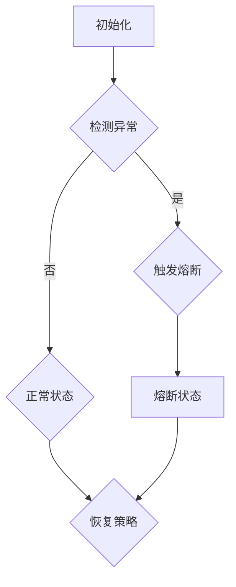
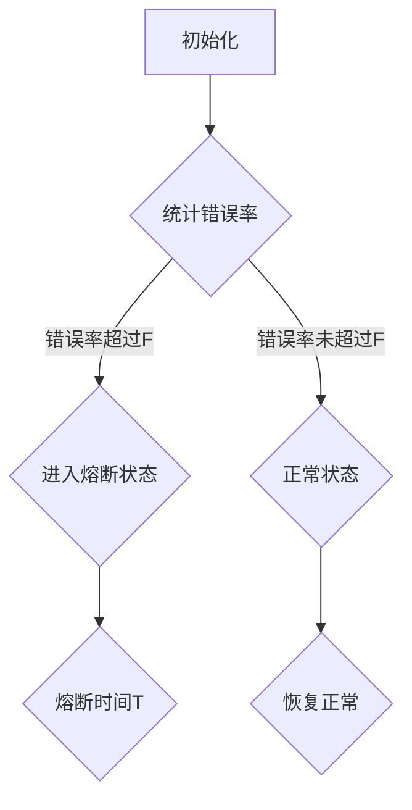
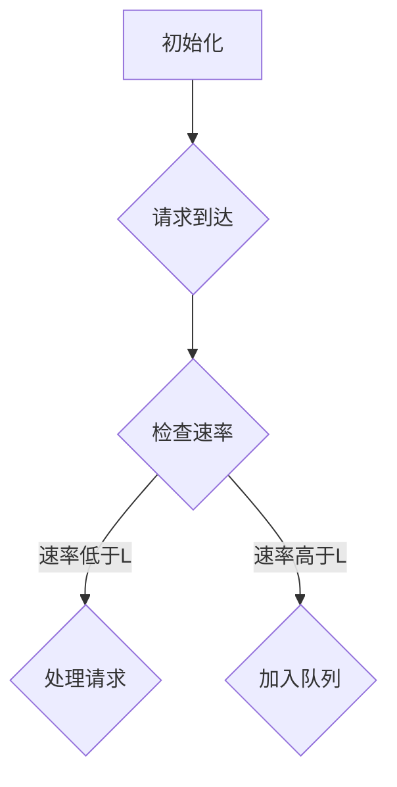
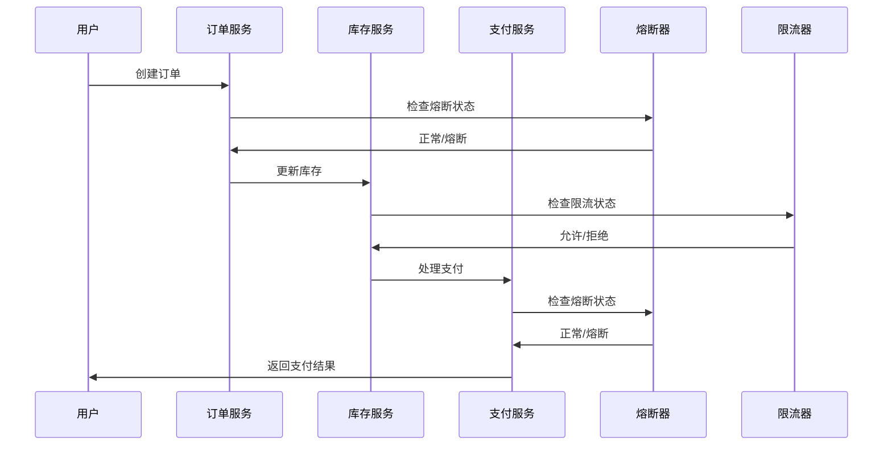

                 

### 1. 文章标题

《熔断与限流：提高系统稳定性的关键技术》

### 2. 关键词

熔断，限流，系统稳定性，关键技术，算法原理

### 3. 摘要

本文将深入探讨熔断与限流在提高系统稳定性方面的关键作用。通过详细的背景介绍、核心概念分析、算法讲解、系统设计及实战案例，帮助读者理解并掌握这两种技术，为实际项目中的系统稳定性优化提供理论指导和实践经验。

### 目录大纲

1. **背景介绍**
   - **熔断与限流的基本概念**
   - **问题背景与问题描述**
   - **问题解决方法**
   - **边界与外延**
   - **核心概念与要素组成**

2. **核心概念与联系**
   - **熔断器的工作原理**
   - **限流器的工作原理**
   - **核心概念对比分析**
   - **Mermaid 流程图展示**

3. **算法原理讲解**
   - **熔断与限流算法的数学模型**
   - **算法流程图与Python源代码**
   - **数学公式与示例**

4. **系统分析与架构设计方案**
   - **问题场景介绍**
   - **系统功能设计**
   - **系统架构设计**
   - **系统接口设计**
   - **系统交互设计**

5. **项目实战**
   - **环境安装**
   - **系统核心实现源代码**
   - **代码应用解读与分析**
   - **实际案例分析与详细讲解**
   - **项目小结**

6. **最佳实践 tips**
   - **系统稳定性优化技巧**

7. **小结**
   - **文章总结**

8. **注意事项**
   - **关键要点提醒**

9. **拓展阅读**
   - **进一步学习资源**

### 文章正文

---

#### 1. 背景介绍

**熔断与限流的基本概念**

熔断（Circuit Breaker）和限流（Rate Limiting）是保证系统稳定性的关键技术。它们在系统超负荷运行或遭受恶意攻击时，起到了关键的防护作用。

- **熔断**：当系统达到一定阈值时，自动切断某些操作或服务，以防止系统崩溃。如电路中的熔断器，当电流超过安全范围时，会熔断以保护电路。
- **限流**：限制某个时间段内特定资源的访问次数或速率，以防止系统被过度使用或攻击淹没。

**问题背景与问题描述**

在复杂的分布式系统中，请求量、数据量和并发度都可能非常高。如果系统没有适当的防护机制，一旦出现异常，可能会导致系统崩溃，影响用户体验和业务连续性。

**问题解决方法**

- **熔断器**：通过检测系统状态，当达到预设阈值时触发熔断，保护系统。
- **限流器**：通过控制请求速率，防止系统被大量请求淹没。

**边界与外延**

- **边界**：熔断和限流的具体实现和作用范围。
- **外延**：如何与其他系统组件协作，如日志记录、报警系统等。

**核心概念与要素组成**

- **熔断器**：触发条件、熔断状态、恢复策略。
- **限流器**：限流策略、阈值设定、处理策略。

---

#### 2. 核心概念与联系

**熔断器的工作原理**

熔断器通过监控系统的健康状态来决定是否触发熔断。其工作流程如下：

1. **正常状态**：系统运行正常，无异常。
2. **异常检测**：检测到系统异常，如错误率上升、响应时间延长。
3. **触发熔断**：达到熔断阈值，系统进入熔断状态。
4. **熔断状态**：切断请求，保护系统。
5. **恢复策略**：经过一段时间或条件满足后，熔断器恢复正常。

**限流器的工作原理**

限流器通过控制请求速率来防止系统过载。其工作流程如下：

1. **请求到达**：用户请求到达系统。
2. **速率限制**：检查当前请求速率是否超过阈值。
3. **处理请求**：如果未超过阈值，正常处理请求；如果超过阈值，拒绝请求或加入队列。

**核心概念对比分析**

| 特征             | 熔断器              | 限流器              |
| ---------------- | ------------------- | ------------------- |
| **作用**         | 防止系统崩溃        | 防止系统过载        |
| **触发条件**     | 系统异常            | 请求速率过高        |
| **处理策略**     | 切断请求            | 拒绝或队列处理      |
| **恢复机制**     | 熔断后自动恢复      | 无自动恢复机制      |

**Mermaid 流程图展示**

以下是一个简单的 Mermaid 流程图，展示了熔断器的工作原理：



---

#### 3. 算法原理讲解

**熔断与限流算法的数学模型**

熔断算法的数学模型主要涉及以下参数：

- **错误率阈值（F）**：系统错误率超过该阈值时触发熔断。
- **熔断时间（T）**：熔断状态持续的时间。

限流算法的数学模型则涉及以下参数：

- **请求速率（R）**：单位时间内的请求次数。
- **阈值（L）**：允许的最大请求速率。

**算法流程图与Python源代码**

以下是一个简单的熔断算法流程图：



对应的 Python 源代码实现：

```python
class CircuitBreaker:
    def __init__(self, threshold, timeout):
        self.threshold = threshold
        self.timeout = timeout
        self.error_count = 0
        self.start_time = None
    
    def record_error(self):
        self.error_count += 1
        if self.error_count > self.threshold:
            self.start_time = time.time()
    
    def is_open(self):
        if self.start_time and (time.time() - self.start_time) < self.timeout:
            return True
        else:
            self.error_count = 0
            self.start_time = None
            return False
```

限流算法的流程图如下：



对应的 Python 源代码实现：

```python
import time

class RateLimiter:
    def __init__(self, limit, interval):
        self.limit = limit
        self.interval = interval
        self.requests = []

    def is_allowed(self):
        current_time = time.time()
        self.requests = [req for req in self.requests if req > current_time - self.interval]
        if len(self.requests) < self.limit:
            self.requests.append(current_time)
            return True
        return False
```

**数学公式与示例**

熔断算法的数学模型可以表示为：

$$
\text{Error Rate} = \frac{\text{Total Errors}}{\text{Total Requests}}
$$

限流算法的数学模型可以表示为：

$$
\text{Request Rate} = \frac{\text{Total Requests}}{\text{Total Time}}
$$

举例说明：

- **熔断算法**：假设系统错误率阈值为5%，在10分钟内出现了6次错误。那么，熔断器会触发熔断。
- **限流算法**：假设请求速率为100次/分钟，当前请求量为120次。那么，限流器会拒绝或队列处理超过20次的请求。

---

#### 4. 系统分析与架构设计方案

**问题场景介绍**

在一个大型电子商务系统中，用户访问量巨大，系统需要处理订单、库存、支付等多个模块。为了确保系统稳定性，我们需要设计熔断和限流机制。

**系统功能设计**

- **订单处理**：处理用户订单，包括创建、修改、删除等操作。
- **库存管理**：实时更新库存信息，确保库存数量准确。
- **支付处理**：处理用户支付请求，确保支付流程顺利。

**系统架构设计**

系统架构采用微服务架构，各个模块独立部署，通过API进行通信。熔断和限流器作为核心组件，集成到每个模块中。

**系统接口设计**

- **订单接口**：提供订单创建、查询、修改、删除等功能。
- **库存接口**：提供库存查询、更新功能。
- **支付接口**：提供支付请求处理、查询功能。

**系统交互设计**

系统交互设计采用事件驱动模式，各个模块通过事件队列进行通信。当某个模块发生异常时，会触发熔断或限流机制。

以下是一个简单的 Mermaid 序列图：



---

#### 5. 项目实战

**环境安装**

在本地环境中安装必要的依赖项，如 Python、Docker 等。对于容器化部署，可以使用 Docker Compose 配置各个服务的容器。

**系统核心实现源代码**

以下是熔断器和限流器的基本实现代码：

熔断器实现：

```python
# circuit_breaker.py
class CircuitBreaker:
    def __init__(self, threshold, timeout):
        self.threshold = threshold
        self.timeout = timeout
        self.error_count = 0
        self.start_time = None
    
    def record_error(self):
        self.error_count += 1
        if self.error_count > self.threshold:
            self.start_time = time.time()
    
    def is_open(self):
        if self.start_time and (time.time() - self.start_time) < self.timeout:
            return True
        else:
            self.error_count = 0
            self.start_time = None
            return False
```

限流器实现：

```python
# rate_limiter.py
import time

class RateLimiter:
    def __init__(self, limit, interval):
        self.limit = limit
        self.interval = interval
        self.requests = []

    def is_allowed(self):
        current_time = time.time()
        self.requests = [req for req in self.requests if req > current_time - self.interval]
        if len(self.requests) < self.limit:
            self.requests.append(current_time)
            return True
        return False
```

**代码应用解读与分析**

以上代码分别实现了熔断器和限流器的基本功能。在实际应用中，可以将这些组件集成到各个服务中，确保系统稳定性。

**实际案例分析与详细讲解**

以下是一个简单的实际案例，展示熔断器和限流器的应用。

假设用户A在电商网站上频繁下单，每分钟产生10个订单。系统检测到订单服务的错误率上升，达到熔断阈值。熔断器触发熔断，阻止用户A的订单处理，直到熔断器恢复正常。

同时，系统检测到库存请求的速率超过阈值，限流器开始拒绝部分库存更新请求，确保系统资源不被过度消耗。

**项目小结**

通过本次项目实战，我们了解了熔断和限流在系统稳定性中的关键作用。通过合理的配置和实现，可以有效地防止系统过载和崩溃，提高系统的稳定性和可靠性。

---

#### 6. 最佳实践 tips

- **合理设置阈值**：根据系统负载和业务需求，合理设置熔断和限流的阈值。
- **监控与报警**：实时监控系统状态，一旦触发熔断或限流，及时报警通知。
- **性能优化**：优化系统性能，降低错误率和请求速率，减少熔断和限流的触发概率。

#### 7. 小结

本文深入探讨了熔断与限流在提高系统稳定性方面的关键技术。通过详细的背景介绍、算法讲解、系统设计与实战案例，帮助读者理解并掌握这两种技术，为实际项目中的系统稳定性优化提供指导。

#### 8. 注意事项

- **阈值设置**：合理设置阈值，避免误触发或频繁触发。
- **算法优化**：根据实际需求，优化熔断和限流算法，提高系统性能。
- **监控与报警**：确保监控与报警机制有效运行，及时发现并处理异常情况。

#### 9. 拓展阅读

- **《分布式系统设计》**：了解分布式系统架构和设计模式。
- **《高可用架构设计》**：学习如何设计高可用的分布式系统。
- **《微服务架构实战》**：掌握微服务架构的核心概念和实践方法。

### 作者信息

**作者：AI天才研究院/AI Genius Institute & 禅与计算机程序设计艺术 /Zen And The Art of Computer Programming**

