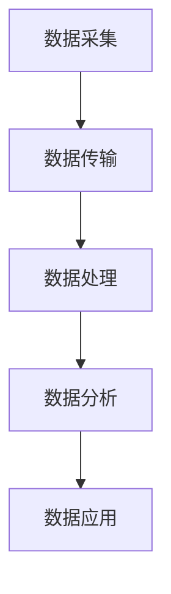

                 

### 第一部分：背景介绍

#### 1.1 物联网的定义与发展历史

**1.1.1 物联网的基本概念**

物联网（Internet of Things，简称IoT）是指通过互联网、通信技术和传感器技术，将各种物理设备、智能终端和系统连接起来，实现设备与设备之间、设备与用户之间的信息交换和通信。简单来说，物联网是将物理世界与数字世界相连接，实现智能化管理和自动化控制。

**1.1.2 物联网的发展历程**

物联网的概念最早可以追溯到1999年，IBM提出了“物联网”的构想。2005年，麻省理工学院（MIT）的“自动识别中心”（Auto-ID Lab）正式将“物联网”命名为“物联网”。2009年，奥巴马政府将物联网列为国家七大战略性新兴产业之一。2013年，我国政府提出了“物联网”的发展战略，标志着物联网进入了快速发展阶段。

**1.1.3 物联网的核心概念与关键要素**

物联网的核心概念包括传感器、网络通信、数据处理、云计算和边缘计算等。关键要素包括数据采集、数据传输、数据存储、数据分析和数据应用。

1. **传感器**：用于感知和采集环境信息，如温度、湿度、光照、运动等。
2. **网络通信**：实现传感器与云计算平台、边缘设备之间的数据传输，包括有线和无线通信。
3. **数据处理**：对采集到的数据进行处理、过滤、清洗和转换，为后续分析提供准确的数据基础。
4. **云计算**：提供强大的计算和存储能力，支持大规模数据分析和应用部署。
5. **边缘计算**：在靠近数据源的地方进行数据处理，降低延迟，提高实时性。

#### 1.2 物联网的应用场景与市场前景

**1.2.1 物联网在不同领域的应用**

物联网在智能家居、智慧城市、智能制造、智能医疗、智能交通等多个领域得到了广泛应用。

1. **智能家居**：通过物联网技术，实现家庭设备的互联互通，提高生活舒适度和便利性。
2. **智慧城市**：通过物联网技术，实现对城市资源、环境和公共服务的智能化管理，提高城市运营效率。
3. **智能制造**：通过物联网技术，实现设备与设备的互联互通，提高生产效率和质量。
4. **智能医疗**：通过物联网技术，实现对患者的实时监控和远程诊断，提高医疗服务的质量和效率。
5. **智能交通**：通过物联网技术，实现交通信息的实时监控和智能调度，提高交通管理效率。

**1.2.2 物联网市场的现状与未来趋势**

根据市场研究机构的预测，未来几年，物联网市场将继续保持高速增长。特别是在5G、人工智能、大数据等新兴技术的推动下，物联网的应用场景将进一步拓展，市场规模将不断增大。

#### 1.3 物联网的基本架构与功能

**1.3.1 物联网的物理层**

物理层是物联网的基础，包括各种传感器、执行器、通信模块等硬件设备。这些设备负责采集环境数据、执行控制指令，并通过通信模块将数据发送到感知层。

**1.3.2 物联网的感知层**

感知层负责对物理层采集到的数据进行初步处理，包括数据过滤、数据清洗和数据压缩等。感知层的数据主要分为感知数据和执行数据，前者用于后续的数据分析和应用，后者用于控制执行器执行相应的操作。

**1.3.3 物联网的网络层**

网络层负责将感知层的数据传输到平台层。网络层可以采用有线和无线通信技术，如Wi-Fi、蓝牙、LoRa、5G等。网络层的核心任务是保证数据传输的可靠性和实时性。

**1.3.4 物联网的平台层**

平台层是物联网的核心，负责对感知层传输的数据进行进一步处理和分析。平台层通常包括数据处理模块、存储模块、分析模块和应用程序接口（API）等。数据处理模块负责对数据进行清洗、转换和存储，分析模块负责对数据进行统计分析和挖掘，应用程序接口（API）用于与其他系统和应用程序的交互。

**1.3.5 物联网的应用层**

应用层是物联网的直接用户接口，负责将平台层处理得到的数据和应用提供给用户。应用层可以包括各种智能终端应用程序、Web应用、移动应用等，通过这些应用，用户可以实现对物联网设备和系统的实时监控、远程控制和智能决策。

#### 1.4 物联网的技术挑战与解决方案

**1.4.1 数据处理与存储**

物联网设备会产生海量数据，如何高效地处理和存储这些数据是一个重要挑战。解决方案包括分布式数据处理框架（如Hadoop、Spark）、大数据存储技术（如HDFS、Cassandra）和边缘计算技术。

**1.4.2 安全性与隐私保护**

物联网设备的安全性和用户隐私保护也是一大挑战。解决方案包括数据加密、身份认证、访问控制、安全协议和安全审计等。

**1.4.3 可靠性与实时性**

物联网应用场景多样，对数据的实时性和可靠性要求较高。解决方案包括网络冗余、故障转移、实时数据处理技术和智能调度算法。

**1.4.4 跨平台与兼容性**

物联网涉及多种设备、系统和平台，如何实现跨平台和兼容性是一个挑战。解决方案包括标准化协议（如MQTT、CoAP）、中间件技术和设备抽象层。

#### 1.5 物联网平台架构设计的基本原则

**1.5.1 可扩展性与灵活性**

物联网平台需要具备良好的可扩展性和灵活性，以适应不断变化的需求和应用场景。解决方案包括模块化设计、微服务架构和分布式系统。

**1.5.2 可靠性与容错性**

物联网平台需要保证系统的可靠性和容错性，以应对设备故障、网络中断和数据丢失等问题。解决方案包括冗余设计、故障转移、自动恢复和备份策略。

**1.5.3 可维护性与可升级性**

物联网平台需要易于维护和升级，以满足长期运行的需求。解决方案包括自动化运维工具、模块化设计和版本控制。

#### 1.6 本章小结

本文对物联网的定义、发展历史、核心概念、应用场景、基本架构和技术挑战进行了详细介绍。物联网作为一种新兴技术，正逐渐改变着我们的生活方式和工业生产方式。随着5G、人工智能、大数据等新兴技术的推动，物联网的应用场景将进一步拓展，市场规模也将持续增长。因此，深入研究物联网平台架构设计，具有重要的现实意义和广阔的发展前景。

---

### 第二部分：核心概念与联系

#### 2.1 物联网的核心概念介绍

物联网的核心概念主要包括传感器、网络通信、数据处理、云计算和边缘计算。以下将分别介绍这些核心概念。

**2.1.1 传感器**

传感器是物联网系统的基本组成部分，用于感知和采集环境信息。根据感知对象的差异，传感器可以分为温度传感器、湿度传感器、光照传感器、运动传感器等。传感器通常具有高灵敏度、高精度和实时响应等特点。

**2.1.2 网络通信**

网络通信是物联网系统中实现设备间数据传输的关键技术。网络通信技术可以分为有线通信和无线通信。有线通信技术包括以太网、光纤通信等；无线通信技术包括Wi-Fi、蓝牙、LoRa、5G等。不同类型的网络通信技术具有不同的通信速率、覆盖范围和功耗特点。

**2.1.3 数据处理**

数据处理是物联网系统中的核心任务，包括数据采集、传输、存储、分析和应用。数据处理技术涉及数据预处理、数据清洗、数据转换、数据挖掘和机器学习等多种方法。数据处理的目标是提取有用信息，为决策提供支持。

**2.1.4 云计算**

云计算是物联网系统中的重要基础设施，提供强大的计算和存储能力。云计算技术包括基础设施即服务（IaaS）、平台即服务（PaaS）和软件即服务（SaaS）等多种服务模式。云计算技术具有弹性扩展、高可用性和高可靠性等特点，可以满足物联网系统大规模数据处理的需求。

**2.1.5 边缘计算**

边缘计算是在靠近数据源的地方进行数据处理和存储，以降低网络带宽和延迟。边缘计算技术包括边缘服务器、边缘设备和边缘平台等。边缘计算可以将数据处理和计算任务分散到边缘节点，提高系统的实时性和可靠性。

#### 2.2 物联网核心概念之间的联系

物联网的核心概念之间紧密联系，共同构成了一个复杂的系统。以下将介绍这些核心概念之间的联系。

**2.2.1 传感器与网络通信**

传感器负责采集环境信息，并通过网络通信模块将数据传输到感知层。网络通信技术决定了传感器数据传输的速率、覆盖范围和功耗。因此，传感器与网络通信之间的匹配至关重要。

**2.2.2 数据处理与网络通信**

数据处理需要对网络通信模块传输的数据进行预处理、清洗和转换。此外，数据处理模块还需要通过网络通信模块将处理结果传输到平台层或应用层。因此，数据处理与网络通信之间也需要密切配合。

**2.2.3 数据处理与云计算/边缘计算**

云计算和边缘计算为数据处理提供了强大的计算和存储能力。数据处理模块可以将原始数据传输到云计算平台或边缘节点进行进一步处理。云计算和边缘计算之间的协同工作，可以提高数据处理效率，降低延迟。

#### 2.3 物联网系统的ER实体关系图

物联网系统涉及多个实体和关系，使用ER实体关系图可以清晰地展示这些实体和关系。以下是一个简化的物联网系统ER实体关系图：

```mermaid
erDiagram
    Device ||--|{ Sensor } : 采集数据
    Device ||--|{ Actuator } : 执行动作
    Device ||--|{ NetworkModule } : 通信模块
    Device ||--|{ DataProcessor } : 数据处理模块
    Device ||--|{ CloudService } : 云服务
    Device ||--|{ EdgeDevice } : 边缘设备
    Device ||--|{ Application } : 应用程序
    Sensor ||--|{ Data } : 存储数据
    Actuator ||--|{ Command } : 接收命令
    NetworkModule ||--|{ Connection } : 网络连接
    DataProcessor ||--|{ Result } : 处理结果
    CloudService ||--|{ DataStorage } : 存储数据
    CloudService ||--|{ DataProcessing } : 数据处理
    EdgeDevice ||--|{ DataProcessing } : 数据处理
    Application ||--|{ Presentation } : 展示结果
```

在上述ER实体关系图中，Device（设备）是核心实体，其他实体都与Device实体相关联。Sensor（传感器）和Actuator（执行器）负责数据的采集和执行，NetworkModule（网络模块）负责数据传输，DataProcessor（数据处理模块）负责数据预处理和清洗，CloudService（云服务）和EdgeDevice（边缘设备）提供计算和存储资源，Application（应用程序）负责数据的展示和交互。

### 第三部分：物联网平台架构原理

物联网平台的架构设计是确保物联网系统能够高效、可靠、安全运行的关键。一个典型的物联网平台架构包括物理层、感知层、网络层、平台层和应用层。以下将逐一介绍每一层的功能、组件及其相互关系。

#### 3.1 物理层

物理层是物联网架构的基础，主要包括各种传感器、执行器、通信模块等硬件设备。这些设备负责感知环境信息、执行控制指令，并通过通信模块将数据传输到感知层。

**物理层的功能与组件：**

- **传感器**：用于感知环境信息，如温度、湿度、光照、运动等。
- **执行器**：用于执行控制指令，如电机、阀门、显示器等。
- **通信模块**：负责数据传输，包括有线和无线通信模块。

物理层的特点是设备多样、分布广泛、功耗低、实时性强。物理层的可靠性直接影响整个物联网平台的稳定性。

#### 3.2 感知层

感知层位于物理层之上，主要负责对物理层采集到的数据进行分析和处理。感知层的主要组件包括传感器数据采集器、边缘计算设备、数据预处理模块等。

**感知层的功能与组件：**

- **传感器数据采集器**：用于采集物理层传感器数据，并将数据传输到感知层。
- **边缘计算设备**：在靠近数据源的地方进行数据处理，降低网络带宽和延迟。
- **数据预处理模块**：负责对采集到的数据进行清洗、过滤、转换等预处理操作。

感知层的主要任务是提高数据质量和传输效率，同时降低网络带宽和延迟。感知层的可靠性直接影响物联网平台的数据准确性和实时性。

#### 3.3 网络层

网络层是物联网架构的核心，负责将感知层的数据传输到平台层。网络层可以采用有线和无线通信技术，如Wi-Fi、蓝牙、LoRa、5G等。网络层的主要组件包括网络通信模块、数据传输协议、路由器和交换机等。

**网络层的功能与组件：**

- **网络通信模块**：实现感知层和平台层之间的数据传输。
- **数据传输协议**：确保数据传输的可靠性和实时性，如MQTT、CoAP等。
- **路由器和交换机**：负责数据包的转发和交换，实现不同网络之间的互联互通。

网络层的核心任务是保证数据传输的可靠性和实时性，同时提高网络的覆盖范围和容量。网络层的稳定性直接影响物联网平台的数据传输效率和系统性能。

#### 3.4 平台层

平台层是物联网架构的核心，负责对网络层传输的数据进行进一步处理和分析。平台层的主要组件包括数据处理模块、存储模块、分析模块和应用程序接口（API）等。

**平台层的功能与组件：**

- **数据处理模块**：对采集到的数据进行清洗、转换、存储等处理操作。
- **存储模块**：提供大规模数据存储能力，如关系型数据库、NoSQL数据库、分布式存储系统等。
- **分析模块**：对存储的数据进行统计分析和挖掘，提取有用信息。
- **应用程序接口（API）**：提供与其他系统和应用程序的交互接口，支持自定义开发和应用部署。

平台层的主要任务是提供强大的数据处理和分析能力，支持多种应用场景和业务需求。平台层的灵活性和可扩展性直接影响物联网平台的功能和应用范围。

#### 3.5 应用层

应用层是物联网架构的最终用户接口，负责将平台层处理得到的数据和应用提供给用户。应用层可以包括各种智能终端应用程序、Web应用、移动应用等。

**应用层的功能与组件：**

- **智能终端应用程序**：如智能家居APP、智能医疗设备APP等，提供用户与物联网系统的交互界面。
- **Web应用**：如物联网管理平台、数据分析平台等，提供Web端的用户交互界面。
- **移动应用**：如物联网监测APP、物联网控制APP等，提供移动端的用户交互界面。

应用层的主要任务是提供便捷的用户交互体验，满足用户的个性化需求。应用层的用户体验直接影响物联网平台的用户满意度和市场竞争力。

#### 3.6 物联网平台的运作流程

物联网平台的运作流程可以概括为数据采集、数据传输、数据处理、数据分析和数据应用五个阶段。

1. **数据采集**：物理层传感器采集环境信息，并将数据传输到感知层。
2. **数据传输**：感知层通过网络层将数据传输到平台层。
3. **数据处理**：平台层对采集到的数据进行预处理、存储和分析。
4. **数据分析**：分析模块对存储的数据进行统计分析和挖掘，提取有用信息。
5. **数据应用**：应用层将分析结果和应用提供给用户，实现物联网系统的智能化管理和控制。

通过上述运作流程，物联网平台实现了对物理世界的实时监控和智能控制，提高了系统的运行效率和管理水平。

#### 3.7 Mermaid流程图展示

以下是一个简化的物联网平台运作流程的Mermaid流程图：



在上述流程图中，A表示数据采集，B表示数据传输，C表示数据处理，D表示数据分析，E表示数据应用。各个阶段相互衔接，构成了物联网平台的核心运作流程。

### 第三部分：物联网平台架构原理（续）

#### 3.8 物联网平台设计方法

物联网平台的设计是一个复杂的过程，涉及多个方面的考量，包括需求分析、系统架构设计、接口设计和安全设计等。以下将详细讨论这些设计方法。

**3.8.1 需求分析**

需求分析是物联网平台设计的首要步骤，旨在明确用户需求、应用场景和系统功能。需求分析包括以下几个方面：

- **用户需求**：了解用户对物联网平台的具体需求，包括功能需求、性能需求、可靠性需求等。
- **应用场景**：分析物联网平台的应用场景，如智能家居、智能医疗、智能交通等，了解不同场景下的特殊需求。
- **功能需求**：明确物联网平台需要实现的功能，如数据采集、数据传输、数据处理、数据分析、数据应用等。
- **性能需求**：确定物联网平台的性能指标，如数据传输速率、响应时间、存储容量等。
- **可靠性需求**：确保物联网平台在复杂环境下能够稳定运行，具备容错性和高可用性。

**3.8.2 系统架构设计**

系统架构设计是物联网平台设计的关键环节，旨在确定系统的整体架构和各个组件的职责。系统架构设计包括以下几个方面：

- **模块化设计**：将系统划分为多个功能模块，每个模块负责特定的功能，提高系统的可维护性和可扩展性。
- **分布式设计**：采用分布式架构，将数据处理和存储分散到多个节点上，提高系统的性能和可靠性。
- **微服务架构**：采用微服务架构，将系统划分为多个独立的微服务，每个微服务负责特定的功能，提高系统的可扩展性和灵活性。
- **边缘计算设计**：在靠近数据源的地方部署边缘计算设备，降低网络带宽和延迟，提高系统的实时性和响应速度。

**3.8.3 接口设计**

接口设计是物联网平台设计的重要组成部分，旨在确定系统内部和外部的交互接口。接口设计包括以下几个方面：

- **RESTful API设计**：采用RESTful风格设计API，提供统一的接口规范，方便其他系统和应用程序的集成和调用。
- **数据接口设计**：定义数据传输的格式和协议，如JSON、XML等，确保数据在不同系统之间的兼容性和可扩展性。
- **安全接口设计**：设计安全接口，如身份认证、访问控制、加密等，确保系统的数据安全和隐私保护。

**3.8.4 安全设计**

安全设计是物联网平台设计的核心，旨在确保系统的数据安全、通信安全和设备安全。安全设计包括以下几个方面：

- **数据安全**：采用数据加密、数据备份和数据恢复等手段，确保数据的安全性和完整性。
- **通信安全**：采用TLS、SSL等加密协议，确保数据在传输过程中的安全性和隐私性。
- **设备安全**：设计设备身份认证、设备访问控制等安全机制，防止未经授权的设备接入系统。
- **安全审计**：建立安全审计机制，记录系统的操作日志和安全事件，便于监控和追溯。

**3.8.5 可维护性与可升级性**

物联网平台的设计不仅要考虑当前的需求，还要考虑到未来的发展和变化。因此，系统设计需要具备良好的可维护性和可升级性。

- **可维护性**：采用模块化设计和微服务架构，使系统易于维护和升级。
- **可升级性**：采用版本控制和热升级技术，确保系统的升级过程对用户无感知，不影响系统的正常运行。

#### 3.9 最佳实践与建议

在实际的物联网平台设计中，可以参考以下最佳实践和建议：

- **优先考虑系统的性能和可靠性**：在系统设计阶段，充分考虑性能和可靠性的需求，确保系统在复杂环境下能够稳定运行。
- **采用标准化协议和开源技术**：采用标准化协议和开源技术，提高系统的兼容性和可扩展性，降低开发成本和维护难度。
- **重视数据安全和隐私保护**：设计安全机制，确保系统的数据安全和隐私保护，防范潜在的安全威胁和攻击。
- **持续优化和迭代**：在系统运行过程中，持续收集用户反馈和性能数据，不断优化和迭代系统，提升用户体验和系统性能。

通过上述设计方法、最佳实践和建议，可以构建一个高效、可靠、安全的物联网平台，满足不同应用场景和业务需求。

### 第四部分：物联网平台实现与部署

#### 4.1 物联网平台实现步骤

物联网平台的实现是一个复杂的过程，需要考虑硬件选择、软件开发和系统集成等多个方面。以下将详细讨论物联网平台实现的步骤。

**4.1.1 硬件选择**

硬件选择是物联网平台实现的基础，主要包括传感器、通信模块、边缘计算设备等。硬件选择需要考虑以下因素：

- **传感器类型**：根据应用场景选择合适的传感器，如温度传感器、湿度传感器、光照传感器等。
- **传感器精度**：传感器精度直接影响数据采集的准确性，需要根据实际需求选择合适的传感器精度。
- **通信模块**：根据通信距离、通信速率和功耗需求选择合适的通信模块，如Wi-Fi、蓝牙、LoRa等。
- **边缘计算设备**：在数据密集型和实时性要求较高的场景下，选择具备较强计算和存储能力的边缘计算设备。

**4.1.2 软件开发**

软件开发是物联网平台实现的核心，包括前端开发、后端开发和中间件开发等。软件开发需要考虑以下方面：

- **前端开发**：设计用户交互界面，提供直观易用的用户体验，可以使用HTML、CSS和JavaScript等技术。
- **后端开发**：构建服务器端应用程序，负责数据处理、存储和通信，可以使用Java、Python、Node.js等技术。
- **中间件开发**：开发用于连接硬件设备和后端应用程序的中间件，实现数据采集、传输和转换等功能，可以使用MQTT、CoAP等协议。

**4.1.3 系统集成**

系统集成是将硬件和软件整合为一个完整系统的过程。系统集成需要考虑以下方面：

- **硬件集成**：将传感器、通信模块和边缘计算设备等硬件进行物理连接和配置，确保硬件之间的通信正常。
- **软件集成**：将前端、后端和中间件软件进行集成，确保软件之间的交互和功能协同。
- **测试与验证**：对整个物联网平台进行测试和验证，确保系统的功能、性能和稳定性。

#### 4.2 实际案例

以下是一个实际案例，介绍一个智能家居物联网平台的实现过程。

**4.2.1 案例背景**

某智能家居项目需要实现家庭设备的互联互通，为用户提供智能化的家居管理体验。项目需求包括：

- **设备接入**：将家庭中的各种设备（如灯泡、空调、门锁等）接入物联网平台。
- **设备控制**：通过物联网平台实现对设备的远程控制和自动化管理。
- **数据监控**：实时监控家庭环境数据（如温度、湿度、光照等），为用户提供个性化的家居建议。

**4.2.2 实现步骤**

1. **硬件选择**

- **传感器**：选择温度传感器、湿度传感器、光照传感器等。
- **通信模块**：选择Wi-Fi通信模块，实现设备的无线连接。
- **边缘计算设备**：选择具备较强计算和存储能力的边缘计算设备，用于数据预处理和本地决策。

2. **软件开发**

- **前端开发**：使用HTML、CSS和JavaScript设计智能家居管理界面，提供设备控制、数据监控等功能。
- **后端开发**：使用Java开发后端应用程序，负责设备接入、数据存储和通信等功能。
- **中间件开发**：使用MQTT协议开发中间件，实现设备与后端应用程序之间的数据传输和转换。

3. **系统集成**

- **硬件集成**：将传感器、通信模块和边缘计算设备进行物理连接和配置，确保硬件之间的通信正常。
- **软件集成**：将前端、后端和中间件软件进行集成，确保软件之间的交互和功能协同。
- **测试与验证**：对智能家居物联网平台进行测试和验证，确保系统的功能、性能和稳定性。

**4.2.3 项目小结**

通过该案例，我们可以看到，实现一个物联网平台需要综合考虑硬件选择、软件开发和系统集成等多个方面。在实际操作中，需要根据具体需求和应用场景进行灵活调整，确保物联网平台的高效、可靠和稳定运行。

### 第五部分：物联网平台性能优化与维护

#### 5.1 物联网平台性能优化方法

物联网平台性能优化是确保系统高效运行的关键。以下是一些常见的性能优化方法：

**5.1.1 负载均衡**

负载均衡可以分散系统负载，提高系统的响应速度和吞吐量。负载均衡可以通过以下方式实现：

- **硬件负载均衡器**：使用专业的硬件设备进行负载均衡。
- **软件负载均衡**：使用软件实现的负载均衡，如Nginx、HAProxy等。

**5.1.2 数据压缩**

数据压缩可以减少数据传输量，降低网络带宽消耗。常用的数据压缩算法包括：

- **无损压缩**：如Huffman编码、LZ77编码等。
- **有损压缩**：如JPEG、MP3等。

**5.1.3 缓存策略**

缓存策略可以加快数据访问速度，降低系统负载。缓存策略包括：

- **客户端缓存**：在客户端缓存常用的数据，减少对服务器的访问。
- **服务器缓存**：在服务器端缓存常用的数据，减少对数据库的访问。
- **分布式缓存**：使用分布式缓存系统，如Redis、Memcached等。

**5.1.4 异步处理**

异步处理可以减少系统的阻塞，提高系统的并发处理能力。异步处理可以通过以下方式实现：

- **消息队列**：使用消息队列（如RabbitMQ、Kafka等）实现异步通信。
- **协程**：使用协程（如Python的asyncio）实现异步编程。

#### 5.2 物联网平台维护策略和常见问题解决方案

物联网平台维护是确保系统长期稳定运行的关键。以下是一些常见的维护策略和问题解决方案：

**5.2.1 定期监控**

定期监控可以及时发现系统异常，确保系统正常运行。定期监控包括以下几个方面：

- **性能监控**：监控系统的CPU、内存、磁盘等资源使用情况，确保系统资源充足。
- **网络监控**：监控系统的网络连接状况，确保数据传输正常。
- **日志监控**：监控系统的日志文件，发现错误日志和异常情况。

**5.2.2 故障恢复**

故障恢复是确保系统在故障发生时能够快速恢复的关键。故障恢复包括以下几个方面：

- **自动恢复**：使用自动恢复机制，如心跳检测、故障转移等。
- **人工干预**：在自动恢复无法解决问题时，人工干预进行故障排查和修复。

**5.2.3 安全性维护**

安全性维护是确保系统数据安全和设备安全的关键。安全性维护包括以下几个方面：

- **数据加密**：对传输的数据进行加密，防止数据泄露。
- **访问控制**：实施严格的访问控制策略，防止未授权访问。
- **安全审计**：记录系统的操作日志和安全事件，便于监控和追溯。

**5.2.4 常见问题解决方案**

在物联网平台运行过程中，可能会遇到各种问题。以下是一些常见问题及其解决方案：

- **网络延迟**：优化网络拓扑结构，减少网络延迟。
- **数据丢失**：使用数据备份和冗余存储技术，确保数据不丢失。
- **设备故障**：定期检查设备，及时更换故障设备。
- **安全漏洞**：定期进行安全检查和漏洞修复，确保系统安全。

通过以上维护策略和问题解决方案，可以确保物联网平台长期稳定运行，为用户提供高质量的服务。

### 第六部分：物联网平台安全与隐私

#### 6.1 安全性与隐私保护的重要性

物联网平台的安全性和隐私保护至关重要。随着物联网设备的数量和连接的增多，物联网平台面临着越来越多的安全威胁和隐私泄露风险。以下将讨论物联网平台安全性和隐私保护的重要性。

**6.1.1 安全性**

物联网平台的安全性关系到设备和用户的安全。如果物联网平台受到攻击，可能会导致以下风险：

- **设备控制权被窃取**：攻击者可以远程控制物联网设备，如智能家居设备、工业控制系统等，导致设备损坏或功能失效。
- **数据泄露**：物联网设备采集和处理的数据可能包含敏感信息，如个人信息、财务信息等，如果泄露，将对用户隐私造成严重威胁。
- **拒绝服务攻击**：攻击者可以通过分布式拒绝服务（DDoS）攻击，使物联网平台瘫痪，影响正常业务运行。

**6.1.2 隐私保护**

物联网平台隐私保护的重要性体现在以下几个方面：

- **用户隐私保护**：物联网设备会采集用户的日常行为数据，如位置信息、生活习惯等，如果这些数据被泄露，将严重侵犯用户的隐私权。
- **数据安全**：物联网平台需要处理和存储大量用户数据，如果数据安全得不到保障，可能会导致数据泄露、篡改等风险。
- **法律合规性**：许多国家和地区都制定了相关的数据保护法律法规，如《通用数据保护条例》（GDPR），物联网平台需要遵守这些法律法规，确保数据的合法合规处理。

#### 6.2 安全架构设计

为了确保物联网平台的安全性和隐私保护，需要设计一个全面的安全架构。以下是一个典型的物联网平台安全架构：

**6.2.1 物理安全**

物理安全是物联网平台安全的基础，包括以下几个方面：

- **设备安全**：对物联网设备进行物理保护，防止设备被盗窃或损坏。
- **通信安全**：在物联网设备与平台之间的通信过程中，采用加密技术保护数据传输安全。

**6.2.2 网络安全**

网络安全是物联网平台安全的核心，包括以下几个方面：

- **防火墙**：部署防火墙，阻止未经授权的访问和攻击。
- **入侵检测系统（IDS）**：部署入侵检测系统，实时监测网络流量，发现潜在的安全威胁。
- **VPN**：使用虚拟专用网络（VPN）加密数据传输，确保数据传输安全。

**6.2.3 数据安全**

数据安全是物联网平台安全的关键，包括以下几个方面：

- **数据加密**：对传输的数据进行加密，防止数据泄露。
- **数据备份与恢复**：定期进行数据备份，确保数据不丢失，并在数据丢失或损坏时能够快速恢复。
- **访问控制**：实施严格的访问控制策略，确保只有授权用户可以访问敏感数据。

**6.2.4 安全策略与管理**

安全策略与管理是物联网平台安全的重要组成部分，包括以下几个方面：

- **安全策略**：制定安全策略，明确物联网平台的安全要求和操作规范。
- **安全审计**：定期进行安全审计，检查系统是否符合安全要求，发现潜在的安全漏洞。
- **安全培训**：对物联网平台的相关人员进行安全培训，提高安全意识和操作技能。

#### 6.3 安全措施的最佳实践

为了确保物联网平台的安全性和隐私保护，可以参考以下最佳实践：

**6.3.1 数据加密**

- **传输加密**：采用TLS/SSL等加密协议，确保数据在传输过程中的安全性。
- **存储加密**：对存储的数据进行加密，防止数据泄露。

**6.3.2 访问控制**

- **身份认证**：使用强密码和多因素认证，确保用户身份的合法性。
- **权限管理**：实施严格的权限管理策略，确保用户只能访问授权的数据和功能。

**6.3.3 安全审计**

- **日志记录**：记录系统的操作日志，便于监控和追踪安全事件。
- **安全报告**：定期生成安全报告，分析系统安全状况，发现潜在的安全隐患。

**6.3.4 安全更新与补丁管理**

- **及时更新**：及时更新系统的软件和硬件，确保系统漏洞得到及时修复。
- **补丁管理**：定期检查和部署系统补丁，防止潜在的安全漏洞被利用。

通过上述安全措施和最佳实践，可以有效地提高物联网平台的安全性和隐私保护水平，确保物联网平台的稳定运行和用户数据的安全。

### 第七部分：物联网平台未来趋势

#### 7.1 5G技术的影响

5G技术的普及将对物联网平台产生深远影响。5G具有高带宽、低延迟、高可靠性和大规模连接的特点，可以满足物联网设备对高速数据传输和实时通信的需求。

**7.1.1 高带宽**

5G技术提供更高的带宽，可以支持大规模物联网设备的接入和大量数据的传输，满足物联网应用场景对数据传输速度的需求。

**7.1.2 低延迟**

5G技术具有低延迟的特点，可以确保物联网设备之间的实时通信，提高物联网平台的响应速度和实时性。

**7.1.3 高可靠性**

5G技术提供高可靠性的连接，可以确保物联网设备在复杂环境下的稳定通信，提高物联网平台的稳定性和可靠性。

**7.1.4 大规模连接**

5G技术支持大规模连接，可以连接更多的物联网设备，满足物联网应用场景对设备数量和连接密度的需求。

#### 7.2 边缘计算的发展

边缘计算是物联网平台发展的一个重要趋势。边缘计算将数据处理和存储能力下沉到网络边缘，降低数据传输延迟，提高系统的实时性和可靠性。

**7.2.1 实时性**

边缘计算可以在靠近数据源的地方进行数据处理，降低数据传输延迟，提高物联网平台的实时性，满足实时性要求较高的应用场景。

**7.2.2 可靠性**

边缘计算可以减少数据传输过程中的网络拥塞和延迟，提高系统的可靠性，确保物联网平台在复杂环境下的稳定运行。

**7.2.3 资源利用**

边缘计算可以充分利用网络边缘的资源和计算能力，降低中心化数据处理的资源消耗，提高系统资源利用率。

#### 7.3 人工智能的应用

人工智能（AI）技术的应用将进一步提升物联网平台的能力和智能化水平。AI技术可以用于数据分析和决策支持，实现更加智能化的物联网应用。

**7.3.1 数据分析**

AI技术可以用于大规模数据分析和挖掘，提取有用信息，为物联网平台的决策提供支持。

**7.3.2 决策支持**

AI技术可以用于智能决策，实现自动化的物联网管理和控制，提高系统的智能化水平。

**7.3.3 个性化服务**

AI技术可以用于个性化服务，根据用户行为和偏好，为用户提供定制化的服务体验。

#### 7.4 5G、边缘计算和人工智能的协同

5G、边缘计算和人工智能的协同发展将推动物联网平台的创新和变革。5G技术提供高速、低延迟和高可靠的连接，边缘计算将数据处理和存储能力下沉到网络边缘，人工智能技术则提供数据分析和决策支持。这三种技术的协同发展，将实现物联网平台的智能化、高效化和安全化，为各行各业带来新的机遇和挑战。

### 第八部分：小结与拓展阅读

#### 8.1 小结

本文从物联网的定义、发展历史、核心概念、架构设计、实现与部署、性能优化、安全与隐私、未来趋势等多个方面，全面介绍了物联网平台架构设计。物联网平台作为连接物理世界和数字世界的桥梁，正逐渐改变着我们的生活方式和工业生产方式。随着5G、人工智能、大数据等新兴技术的推动，物联网平台将迎来更加广阔的发展前景。

#### 8.2 拓展阅读

为了进一步了解物联网平台架构设计，以下是几本推荐的拓展阅读书籍：

1. **《物联网架构设计与实践》**，作者：张波、李明
   - 内容涵盖了物联网平台的设计原则、架构模式和实现技术，适合初学者和有经验的开发者。

2. **《物联网技术与应用》**，作者：陈旧、刘华
   - 该书详细介绍了物联网的基本概念、技术原理和应用案例，有助于读者全面了解物联网技术。

3. **《人工智能与物联网：融合创新与应用》**，作者：李勇、王昊
   - 本书探讨了人工智能与物联网的深度融合，介绍了相关的技术原理和应用案例，适合对人工智能和物联网感兴趣的读者。

通过阅读这些书籍，您可以更深入地了解物联网平台架构设计的理论和技术，为实际项目开发提供有力支持。

---

**作者：AI天才研究院/AI Genius Institute & 禅与计算机程序设计艺术 /Zen And The Art of Computer Programming**

