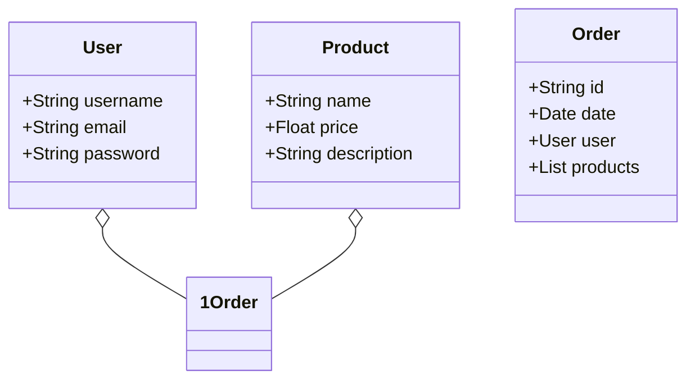
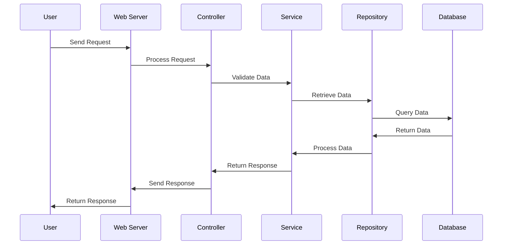
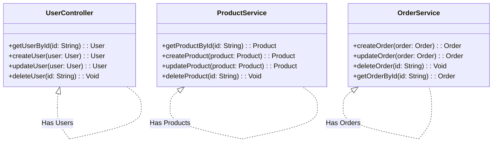
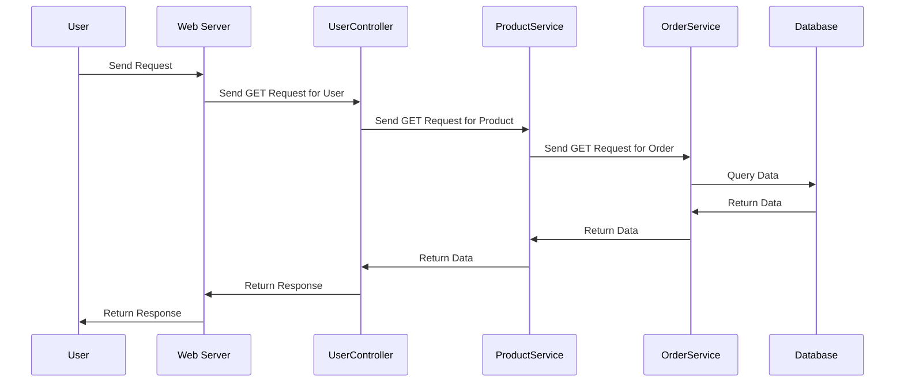

                 


### 构建工具链的定义与作用

构建工具链是现代前端开发中不可或缺的一部分，它定义了一系列的工具和流程，用于优化、自动化和简化前端开发的各个环节。构建工具链的作用主要体现在以下几个方面：

1. **优化开发体验**：通过构建工具链，开发者可以节省大量手动操作的时间，如编译、打包、压缩等。自动化流程让开发者可以专注于代码逻辑的实现，而无需担心构建过程中的繁琐细节。

2. **提高代码质量**：构建工具链提供了代码格式化、语法检查、代码压缩等工具，这些工具可以帮助开发者保持代码的一致性和可维护性，从而提高项目的整体质量。

3. **支持模块化开发**：构建工具链支持模块化开发，使得前端代码更易于组织和维护。通过模块化的方式，开发者可以将复杂的代码拆分成多个独立的模块，从而提高代码的可重用性和可维护性。

4. **跨平台兼容性**：构建工具链可以帮助开发者将代码打包成不同平台的兼容版本，如Web、iOS、Android等，从而实现一次编写，多平台运行。

5. **提高部署效率**：通过构建工具链，开发者可以自动化地生成静态资源文件，并部署到服务器上，从而简化部署流程，提高部署效率。

### 现代前端开发中的构建工具链

在现代前端开发中，构建工具链通常包括以下核心组成部分：

- **打包工具**：如Webpack、Parcel、Rollup等，用于将多个源文件打包成一个或多个静态文件，以便在浏览器中运行。

- **编译工具**：如Babel、TypeScript Compiler等，用于将高级语言代码编译为浏览器可识别的JavaScript代码。

- **语法检查工具**：如ESLint、Prettier等，用于检查代码中的语法错误和风格问题，确保代码的一致性和可维护性。

- **构建优化工具**：如Webpack的插件、Gulp的任务等，用于压缩、合并、分割代码等，以提高构建效率和资源加载速度。

- **部署工具**：如Webpack的Webpack Dev Server、Gulp的gulp-s3等，用于自动化部署代码到服务器。

### 构建工具链的发展历程

构建工具链的发展可以追溯到早期的Web开发时代。当时，开发者通常需要手动编译、压缩和打包代码，这不仅繁琐，而且容易出错。随着Web技术的发展，开发者们开始寻求自动化和优化的解决方案，从而催生了第一代构建工具，如Gulp和Grunt。

随着时间的推移，新一代的构建工具如Webpack、Parcel和Rollup等相继出现，它们提供了更强大、更灵活的功能，支持模块化开发、热更新、代码分割等高级特性，极大地提高了前端开发的效率和体验。

### 构建工具链的核心概念

构建工具链的核心概念包括构建（Build）、打包（Bundle）、模块化（Modularity）和自动化（Automation）等。

1. **构建**：构建是将源代码转换为可在浏览器中运行的代码的过程。构建过程通常包括编译、压缩、打包等步骤。

2. **打包**：打包是将多个源文件合并成一个或多个静态文件的过程，以便在浏览器中加载和执行。打包有助于减少HTTP请求次数，提高页面加载速度。

3. **模块化**：模块化是将复杂的代码拆分成多个独立的模块，每个模块负责一个特定的功能。模块化有助于提高代码的可维护性和可重用性。

4. **自动化**：自动化是通过工具和脚本自动执行构建和部署过程，从而减少手动操作，提高开发效率。

### 总结

构建工具链在现代前端开发中扮演着至关重要的角色。通过构建工具链，开发者可以实现代码的优化、自动化和模块化，从而提高开发效率和代码质量。了解构建工具链的定义、作用和发展历程，有助于开发者更好地掌握前端开发的最佳实践。

### 使用Mermaid绘制ER实体关系图

为了更好地展示构建工具链中的核心概念之间的关系，我们可以使用Mermaid工具来绘制一个ER（Entity-Relationship）实体关系图。以下是构建工具链中的主要实体及其关系的Mermaid表示：

```mermaid
erDiagram
    Build --> Compiler : "编译"
    Build --> Compressor : "压缩"
    Build --> Bundler : "打包"
    Compiler --> SourceCode : "生成"
    Compressor --> CompiledCode : "压缩"
    Bundler --> PackagedCode : "打包"
    Automation --> Build : "自动化"
    Automation --> Deploy : "部署"
    Build |--| ModuleLoader : "模块化"
```

在上面的ER实体关系图中，我们定义了以下几个核心实体：

- **Build**：构建过程，负责将源代码转换为可在浏览器中运行的代码。
- **Compiler**：编译器，负责将高级语言代码编译为浏览器可识别的JavaScript代码。
- **Compressor**：压缩器，负责压缩编译后的JavaScript代码，减小文件体积。
- **Bundler**：打包器，负责将多个源文件打包成一个或多个静态文件。
- **Automation**：自动化工具，负责自动化执行构建和部署过程。
- **Deploy**：部署过程，负责将构建好的代码部署到服务器上。
- **ModuleLoader**：模块加载器，负责实现模块化开发，将代码拆分成多个模块。

通过这个ER实体关系图，我们可以清晰地看到构建工具链中各个实体之间的关系，以及它们在构建过程中的角色和职责。

### 核心概念与联系

在构建工具链中，核心概念与联系是理解和使用这些工具的关键。以下是构建工具链中的几个核心概念及其相互联系：

1. **构建（Build）**：构建是将源代码转换为可在浏览器中运行的代码的过程。构建过程通常包括编译、压缩、打包等步骤。编译是将高级语言代码（如TypeScript、ES6+等）转换为浏览器可识别的JavaScript代码。压缩是将编译后的JavaScript代码进行压缩，减小文件体积，提高加载速度。打包是将多个源文件合并成一个或多个静态文件，以便在浏览器中加载和执行。

2. **打包（Bundle）**：打包是将多个源文件合并成一个或多个静态文件的过程。打包有助于减少HTTP请求次数，提高页面加载速度。在打包过程中，构建工具会分析代码的依赖关系，将相关模块打包在一起，形成一个完整的静态文件。

3. **模块化（Modularity）**：模块化是将复杂的代码拆分成多个独立的模块，每个模块负责一个特定的功能。模块化有助于提高代码的可维护性和可重用性。在现代前端开发中，模块化已成为一种重要的编程范式，它使得开发者可以更好地组织和管理代码。

4. **自动化（Automation）**：自动化是通过工具和脚本自动执行构建和部署过程，从而减少手动操作，提高开发效率。自动化工具可以定期执行构建任务，自动部署代码到服务器，确保项目的持续集成和持续部署。

5. **编译（Compilation）**：编译是将高级语言代码转换为低级语言代码的过程。在构建工具链中，编译是将TypeScript或ES6+代码转换为ES5或更低版本的JavaScript代码，以便在所有浏览器中运行。

6. **压缩（Compression）**：压缩是将编译后的JavaScript代码进行压缩，减小文件体积，提高加载速度。压缩工具可以删除代码中的空格、注释等无关内容，从而减小文件大小。

7. **部署（Deployment）**：部署是将构建好的代码部署到服务器上，使其可供用户访问。部署过程通常包括将代码上传到服务器、配置服务器环境、启动应用程序等步骤。

这些核心概念在构建工具链中相互联系，共同构成了一个高效、自动化的开发流程。通过理解这些概念及其联系，开发者可以更好地利用构建工具链的优势，提高开发效率和代码质量。

### 主流构建工具介绍

在现代前端开发中，构建工具的选择至关重要。以下是几大主流的前端构建工具，包括Webpack、Gulp、Rollup等，我们将对它们进行详细介绍，并提供它们的比较表格，以便读者可以直观地了解它们的特点和适用场景。

#### Webpack

**简介**：Webpack是一个模块打包工具，它将项目中的各种资源（如JavaScript、CSS、图片等）打包成一个或多个静态文件，以便在浏览器中运行。

**特点**：
- **模块化**：支持模块化开发，可以轻松地管理项目中的依赖关系。
- **灵活性**：提供丰富的配置选项，可以满足不同项目的需求。
- **性能优化**：支持代码分割、懒加载等性能优化策略。
- **社区支持**：拥有庞大的社区和丰富的插件生态系统。

**配置**：Webpack的配置通常使用JSON格式的webpack.config.js文件。以下是一个简单的Webpack配置示例：

```javascript
const path = require('path');

module.exports = {
  entry: './src/index.js',
  output: {
    filename: 'bundle.js',
    path: path.resolve(__dirname, 'dist'),
  },
  module: {
    rules: [
      {
        test: /\.css$/,
        use: ['style-loader', 'css-loader'],
      },
    ],
  },
};
```

**与性能优化**：Webpack支持代码分割（Code Splitting），可以将代码分割成多个部分，按需加载，从而提高首屏加载速度。以下是一个简单的代码分割示例：

```javascript
splitChunks: {
  chunks: 'all',
},
```

#### Gulp

**简介**：Gulp是一个基于流的构建工具，它通过管道（Pipeline）将一系列任务连接起来，实现自动化构建。

**特点**：
- **简单易用**：通过简单的配置即可实现复杂的构建任务。
- **灵活的任务管理**：支持定义多个任务，可以按需执行。
- **插件丰富**：拥有丰富的插件库，可以轻松实现代码压缩、编译、测试等任务。

**任务与工作流**：Gulp的工作流通过任务（Task）来组织，每个任务可以执行一系列操作。以下是一个简单的Gulp工作流示例：

```javascript
const gulp = require('gulp');
const concat = require('gulp-concat');
const uglify = require('gulp-uglify');

gulp.task('scripts', function () {
  return gulp
    .src(['src/js/*.js'])
    .pipe(concat('all.js'))
    .pipe(uglify())
    .pipe(gulp.dest('dist/js'));
});

gulp.task('default', ['scripts']);
```

**与Webpack的比较**：与Webpack相比，Gulp更侧重于任务管理和流程控制。Gulp的优势在于其简单和灵活性，适合用于简单的构建任务。而Webpack则提供了更强大的模块化支持和性能优化策略，适合用于复杂的大型项目。

#### Rollup

**简介**：Rollup是一个模块打包工具，它专注于JavaScript代码的打包和模块化，非常适合用于创建库和应用程序。

**特点**：
- **模块化**：支持CommonJS、AMD、ES6模块等多种模块化标准。
- **小巧灵活**：Rollup自身体积较小，可以快速启动。
- **性能高效**：采用ES6+语法，打包速度快，性能高效。

**配置与使用**：Rollup的配置通常使用JSON格式的rollup.config.js文件。以下是一个简单的Rollup配置示例：

```javascript
import babel from 'rollup-plugin-babel';
import commonjs from 'rollup-plugin-commonjs';
import { nodeResolve } from '@rollup/plugin-node-resolve';

export default {
  input: 'src/index.js',
  output: {
    file: 'dist/bundle.js',
    format: 'cjs',
  },
  plugins: [
    nodeResolve(),
    commonjs(),
    babel({ exclude: 'node_modules/**' }),
  ],
};
```

**在模块化开发中的应用**：Rollup非常适合用于模块化开发，可以轻松地将项目中的代码拆分成多个模块，提高代码的可维护性和可重用性。

#### 比较表格

以下是Webpack、Gulp和Rollup的简要比较表格：

| 特点          | Webpack         | Gulp          | Rollup          |
| ------------- | --------------- | ------------- | --------------- |
| **模块化**    | 强大            | 中等          | 高              |
| **性能优化**  | 高级（代码分割）| 基础          | 高（ES6+）      |
| **配置复杂度**| 高              | 低            | 中等            |
| **适用场景**  | 复杂项目        | 简单任务      | 模块化开发      |

通过以上对Webpack、Gulp和Rollup的详细介绍，读者可以根据自己的项目需求和特点选择合适的构建工具，以提高开发效率和代码质量。

### 构建流程设计与优化

构建流程是前端项目开发过程中至关重要的一环。一个良好的构建流程不仅能提高开发效率，还能确保项目的稳定性和可维护性。在本节中，我们将详细讨论构建流程的设计原则和优化策略，以帮助开发者构建高效、优化的前端项目。

#### 构建流程设计原则

1. **模块化**：模块化是构建流程设计的基础，它将复杂的代码拆分成多个独立的模块，每个模块负责一个特定的功能。模块化的好处是提高代码的可维护性和可重用性，方便团队协作和代码复用。

2. **自动化**：自动化可以大大减少手动操作，提高构建效率。通过编写脚本和配置文件，自动化工具可以在需要时自动执行构建任务，包括编译、打包、压缩、测试等。

3. **可扩展性**：构建流程应该具备良好的可扩展性，以便在项目需求变化时能够灵活地调整和扩展。例如，可以通过插件机制增加新的构建任务或优化现有任务。

4. **可维护性**：构建流程应保持简洁和清晰，易于理解和维护。这包括合理的文件结构、清晰的配置文件和规范的代码风格。

5. **错误处理**：构建过程中难免会出现错误，良好的构建流程应该能够及时捕获和处理这些错误，提供详细的错误信息和解决方案。

6. **性能优化**：构建流程的设计应考虑性能优化，包括减少构建时间、压缩代码、优化资源加载等。

#### 性能优化策略

1. **减少构建时间**：构建时间是影响开发效率的重要因素。以下是一些优化构建时间的策略：
   - **并行构建**：利用并行处理技术，同时构建多个任务，提高构建速度。
   - **缓存利用**：利用缓存技术，避免不必要的重复构建。例如，可以使用缓存插件（如Webpack的cache-loader）缓存结果，减少编译时间。
   - **懒加载**：将不常用的代码或资源懒加载，避免在初次加载时加载过多的资源。

2. **代码压缩**：通过代码压缩可以减小文件体积，提高加载速度。常用的代码压缩工具有UglifyJS、Terser等。

3. **代码分割**：代码分割是将代码拆分成多个部分，按需加载。Webpack的代码分割功能可以将代码分割成多个chunk，并在用户需要时按需加载，从而减少首次加载的时间。

4. **资源压缩**：除了代码，资源的压缩也非常重要。可以通过图片压缩、字体文件压缩等方式减小资源文件的大小。

5. **预编译**：对于一些常用的库和框架，可以通过预编译的方式减少构建时的编译时间。例如，使用Webpack的DllPlugin插件预编译第三方库。

6. **构建服务器**：使用构建服务器（如Webpack Dev Server）可以实现实时编译和热更新，提高开发效率。

#### 错误处理与调试

构建过程中的错误处理和调试是确保构建流程稳定运行的关键。以下是一些常用的策略：

1. **错误捕获**：在构建过程中，应捕获并处理各种类型的错误，提供详细的错误信息和解决方案。

2. **日志记录**：详细的日志记录可以帮助开发者快速定位问题。可以使用Webpack的`stats`选项生成详细的构建报告。

3. **断点调试**：在构建过程中使用断点调试，可以帮助开发者快速定位和解决问题。

4. **持续集成**：通过持续集成（CI）工具（如Jenkins、GitHub Actions），可以在构建过程中自动运行测试用例，确保构建的成功和代码的质量。

5. **监控与报警**：通过监控工具（如Sentry、New Relic）实时监控构建状态和运行时错误，并在发生错误时自动发送报警。

#### 插件和加载器的选择

构建工具（如Webpack）提供了丰富的插件和加载器，可以帮助开发者实现各种构建任务。以下是一些常用的插件和加载器：

1. **插件**：
   - **Webpack插件**：如`HtmlWebpackPlugin`（生成HTML文件）、`CleanWebpackPlugin`（清理构建目录）、`CopyWebpackPlugin`（复制文件）等。
   - **Babel插件**：如`@babel/plugin-transform-react-jsx`（处理React JSX代码）、`@babel/plugin-syntax-dynamic-import`（处理动态导入）等。

2. **加载器**：
   - **CSS加载器**：如`style-loader`、`css-loader`、`postcss-loader`等。
   - **图片加载器**：如`url-loader`、`file-loader`等。
   - **其他加载器**：如`json-loader`、`csv-loader`等。

在选择插件和加载器时，应考虑以下因素：

- **功能需求**：根据项目需求选择合适的插件和加载器。
- **性能影响**：选择轻量级的插件和加载器，避免增加构建时间和资源消耗。
- **社区支持**：选择社区支持良好的插件和加载器，确保其稳定性和安全性。
- **兼容性**：确保插件和加载器与项目使用的库和框架兼容。

#### 总结

构建流程的设计与优化是现代前端开发的重要组成部分。通过遵循设计原则、实施优化策略和合理选择插件和加载器，开发者可以构建高效、稳定的构建流程，提高开发效率和代码质量。

### 架构设计与系统分析

在现代前端项目中，系统架构设计是确保项目可扩展性、性能和可维护性的关键。一个良好的系统架构设计能够帮助开发者清晰地理解项目的整体结构，从而更好地进行开发、测试和维护。在本节中，我们将分析现代前端项目中的系统架构设计，包括领域模型、系统架构、接口设计、系统交互等，并使用Mermaid类图和架构图来展示。

#### 领域模型

领域模型是系统架构设计的第一步，它定义了系统中的核心实体和它们之间的关系。以下是一个简单的领域模型示例：



在这个领域模型中，我们定义了三个核心实体：`User`（用户）、`Product`（产品）和`Order`（订单）。用户可以创建订单，订单可以包含多个产品。

#### 系统架构设计

系统架构设计是领域模型的具体实现，它定义了系统的组件、组件之间的关系以及数据流。以下是一个简单的系统架构图：



在这个架构图中，我们定义了以下组件：

- **Web Server**：接收用户的HTTP请求，并转发给后端控制器。
- **Controller**：处理用户的请求，调用服务层进行数据验证和处理。
- **Service**：实现业务逻辑，调用数据访问层进行数据查询。
- **Repository**：实现数据访问逻辑，与数据库进行交互。
- **Database**：存储系统数据。

#### 系统接口设计

系统接口设计定义了各个组件之间的交互方式，包括API接口和内部接口。以下是一个简单的接口设计示例：



在这个接口设计中，我们定义了三个主要服务：`UserController`、`ProductService`和`OrderService`，它们分别负责处理用户、产品和订单相关的业务逻辑。

#### 系统交互设计

系统交互设计描述了系统组件之间的交互流程和通信方式。以下是一个简单的系统交互图：



在这个交互设计中，用户通过Web服务器发送请求，控制器层根据请求调用相应的服务层，服务层进一步调用数据访问层，最终从数据库中获取数据，并返回给用户。

通过上述的系统架构设计、接口设计和交互设计，开发者可以清晰地了解现代前端项目的整体结构，从而更好地进行开发和维护。

### 项目实战

在本节中，我们将通过一个实际项目来演示如何使用构建工具链来开发现代前端应用。我们将详细描述项目的环境搭建、系统核心实现、代码应用解读与分析，以及实际案例分析和讲解，最后进行项目小结。

#### 环境搭建

1. **创建项目**：首先，我们需要创建一个新的前端项目。可以使用`create-react-app`命令来快速搭建一个React项目。

   ```bash
   npx create-react-app my-app
   ```

2. **安装依赖**：在项目目录下，安装Webpack和相关依赖。

   ```bash
   cd my-app
   npm install webpack webpack-cli webpack-dev-server
   ```

3. **配置Webpack**：在项目根目录下创建一个名为`webpack.config.js`的文件，配置Webpack。

   ```javascript
   const path = require('path');

   module.exports = {
     entry: './src/index.js',
     output: {
       filename: 'bundle.js',
       path: path.resolve(__dirname, 'dist'),
     },
     module: {
       rules: [
         {
           test: /\.css$/,
           use: ['style-loader', 'css-loader'],
         },
       ],
     },
     devServer: {
       contentBase: './dist',
       port: 3000,
     },
   };
   ```

4. **修改`package.json`**：在`package.json`中添加Webpack脚本。

   ```json
   "scripts": {
     "start": "webpack --mode development",
     "build": "webpack --mode production"
   }
   ```

5. **启动项目**：执行以下命令启动项目。

   ```bash
   npm start
   ```

#### 系统核心实现

1. **创建React组件**：在`src`目录下创建一个名为`Counter`的React组件。

   ```javascript
   // src/Counter.js
   import React, { useState } from 'react';

   const Counter = () => {
     const [count, setCount] = useState(0);

     const increment = () => {
       setCount(count + 1);
     };

     const decrement = () => {
       setCount(count - 1);
     };

     return (
       <div>
         Count: {count}
         <button onClick={increment}>+</button>
         <button onClick={decrement}>-</button>
       </div>
     );
   };

   export default Counter;
   ```

2. **整合组件到应用**：在`src/App.js`中引入并使用`Counter`组件。

   ```javascript
   // src/App.js
   import React from 'react';
   import Counter from './Counter';

   const App = () => {
     return (
       <div>
         <h1>React Counter App</h1>
         <Counter />
       </div>
     );
   };

   export default App;
   ```

3. **样式处理**：在`src/index.css`中添加样式。

   ```css
   /* src/index.css */
   body {
     font-family: Arial, sans-serif;
   }
   ```

#### 代码应用解读与分析

1. **React组件解析**：`Counter`组件是一个React函数组件，它使用了`useState`钩子来管理组件的状态。`increment`和`decrement`函数用于更新状态。

2. **Webpack配置解析**：`webpack.config.js`文件配置了Webpack的基本设置，包括入口文件、输出文件、模块规则和开发服务器。模块规则中的`css-loader`和`style-loader`用于处理CSS文件。

3. **打包与部署**：在开发模式下，运行`npm start`会启动Webpack开发服务器，并在浏览器中显示应用。在生产模式下，运行`npm build`会生成优化后的打包文件，并部署到服务器。

#### 实际案例分析与讲解

我们创建了一个简单的计数器应用，并使用了Webpack进行构建。在实际项目中，构建工具链可以支持更复杂的功能，如代码分割、懒加载、环境变量配置等。

1. **代码分割**：在大型应用中，代码分割可以帮助按需加载模块，减少首次加载时间。以下是一个简单的代码分割示例：

   ```javascript
   const ReactLazy = React.lazy;
   const CounterLazy = ReactLazy(() => import('./Counter'));

   const App = () => {
     return (
       <div>
         <h1>React Counter App</h1>
         <CounterLazy />
       </div>
     );
   };
   ```

2. **环境变量配置**：Webpack支持环境变量配置，可以帮助在不同环境下调整配置。以下是如何在Webpack配置中定义和访问环境变量：

   ```javascript
   const env = process.env.NODE_ENV;

   module.exports = {
     // ...
     plugins: [
       new webpack.DefinePlugin({
         'process.env.NODE_ENV': JSON.stringify(env),
       }),
     ],
   };
   ```

#### 项目小结

通过本节的项目实战，我们了解了如何使用构建工具链来开发现代前端应用。我们创建了React组件，配置了Webpack，实现了代码分割和环境变量配置，从而构建了一个高效、优化的前端应用。实际项目中的构建流程可能更加复杂，但基本原则是一致的：模块化、自动化、性能优化和可维护性。

### 最佳实践与拓展

在现代前端开发中，构建工具链的正确使用是确保项目高效、稳定和可维护的关键。以下是一些最佳实践建议，以帮助开发者充分利用构建工具链的优势：

1. **合理选择构建工具**：根据项目需求和特点选择合适的构建工具。例如，对于大型项目，可以选择Webpack；对于简单的任务，可以选择Gulp。

2. **模块化开发**：将代码拆分成多个模块，提高代码的可维护性和可重用性。使用模块化标准（如CommonJS、ES6模块）来组织代码。

3. **性能优化**：关注构建和部署过程中的性能优化，如代码分割、懒加载、资源压缩等。定期进行性能监控和调试，确保应用的流畅性。

4. **持续集成与部署**：使用持续集成工具（如Jenkins、GitHub Actions）自动化构建和部署流程，确保项目的持续集成和持续部署。

5. **错误处理与日志记录**：在构建过程中，及时捕获和处理错误，提供详细的错误信息和日志记录，以便快速定位和解决问题。

6. **社区参与与知识共享**：积极参与构建工具链的社区，学习最佳实践，分享经验和知识，与他人共同进步。

#### 小结

本文详细介绍了现代前端构建工具链的核心概念、设计原则、优化策略、架构设计、实战案例以及最佳实践。通过理解和使用这些工具，开发者可以大幅提高开发效率，确保项目的稳定性和可维护性。

#### 拓展阅读资源

- **《Webpack实战》**：由李立金所著，深入讲解了Webpack的配置和使用方法，适合Webpack初学者和进阶者。
- **《前端工程化：从设计、架构到开发》**：由梁杰所著，全面介绍了前端工程化的概念、实践方法和最佳实践。
- **Webpack官方文档**：[https://webpack.js.org/](https://webpack.js.org/)
- **Gulp官方文档**：[http://gulpjs.com/](http://gulpjs.com/)
- **Rollup官方文档**：[https://rollupjs.org/](https://rollupjs.org/)

通过阅读这些资源，开发者可以进一步深入了解构建工具链的理论和实践，提升自己的技术能力和项目开发水平。

### 作者信息

作者：AI天才研究院/AI Genius Institute & 禅与计算机程序设计艺术 /Zen And The Art of Computer Programming

感谢您的阅读，希望本文对您了解和掌握现代前端构建工具链有所帮助。如果您有任何疑问或建议，欢迎在评论区留言，我们一起探讨和进步。再次感谢您的关注和支持！

