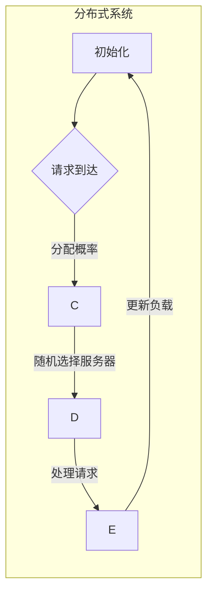
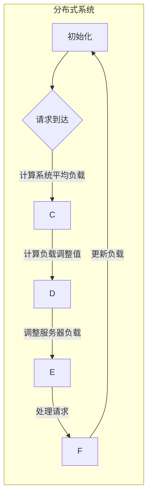
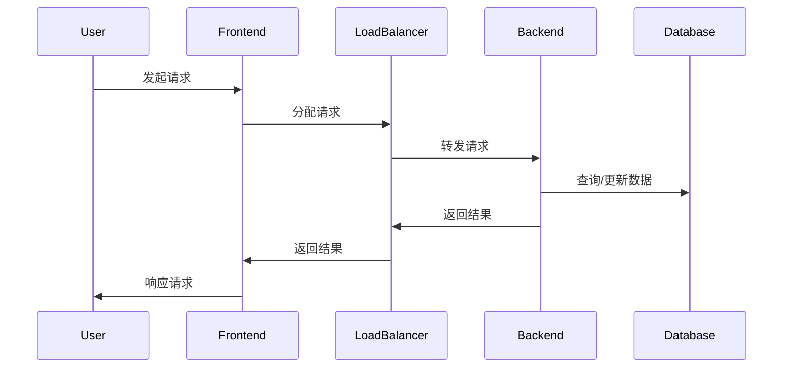

                 

### 文章标题：玻尔兹曼的统计力学与负载均衡算法：系统平衡的物理学启示

> 关键词：玻尔兹曼分布、统计力学、负载均衡算法、系统平衡、物理学启示

> 摘要：本文通过深入探讨玻尔兹曼分布与负载均衡算法的关系，结合物理学中的系统平衡原理，阐述如何利用统计力学的方法优化系统性能。文章从核心概念、算法原理、系统设计与项目实践等多角度展开，旨在为读者提供关于系统平衡的物理学启示与实际应用指导。

----------------------------------------------------------------

## 第一部分：背景介绍

### 1.1 统计力学与负载均衡算法的关系

统计力学是物理学的一个重要分支，它研究的是大量粒子组成的宏观系统的宏观性质。在计算机科学中，负载均衡算法则是一种用于优化系统资源利用、提高系统稳定性和可靠性的技术。两者看似属于不同领域，但近年来，研究者们发现它们之间存在有趣的联系。本文将探讨玻尔兹曼分布——统计力学中的核心概念，如何为负载均衡算法提供理论支持和优化指导。

#### 1.1.1 统计力学的核心概念

统计力学的基本思想是，通过对大量微观粒子的统计行为进行分析，来预测宏观系统的宏观性质。其中，玻尔兹曼分布（Boltzmann distribution）是一个至关重要的概念。玻尔兹曼分布描述了在热平衡状态下，不同能量状态的粒子数量分布情况。它可以用以下公式表示：

$$
P(E) = C \cdot e^{-\frac{E}{kT}}
$$

其中，$P(E)$ 是能量为 $E$ 的状态的概率，$C$ 是归一化常数，$k$ 是玻尔兹曼常数，$T$ 是绝对温度。

#### 1.1.2 负载均衡算法的需求与挑战

在分布式系统中，负载均衡是一个关键问题。负载均衡算法旨在将请求合理分配到多个服务器上，以避免单个服务器过载，提高系统的整体性能。然而，随着系统的规模和复杂性的增加，负载均衡算法面临着诸多挑战，如如何动态适应负载变化、如何处理服务器故障等。

#### 1.1.3 系统平衡的物理学启示

物理学中的系统平衡原理提供了一种新的视角来理解和优化负载均衡算法。系统平衡意味着系统中的各个部分处于稳定状态，没有净流动。在分布式系统中，这意味着各个服务器上的负载应该尽可能均匀。玻尔兹曼分布的引入，使得我们能够利用统计力学的方法，根据系统状态调整负载分配策略，从而实现系统平衡。

### 1.2 负载均衡算法的边界与外延

负载均衡算法不仅仅是一种技术手段，它还涉及到系统的设计、架构和运维等多个方面。下面，我们将探讨负载均衡算法的边界与外延。

#### 1.2.1 负载均衡算法的定义

负载均衡算法是一种机制，用于将多个请求分配到多个服务器上，以实现资源的最大化利用和系统的最优性能。负载均衡可以基于多种策略，如轮询、最小连接数、最少响应时间等。

#### 1.2.2 负载均衡算法的分类

根据实现方式和目标的不同，负载均衡算法可以分为以下几类：

1. **静态负载均衡**：算法预先设定，不随时间变化而调整。
2. **动态负载均衡**：根据系统实时状态动态调整负载分配。
3. **基于内容的负载均衡**：根据请求内容（如URL、请求类型等）进行负载分配。
4. **基于服务的负载均衡**：根据服务器的服务能力进行负载分配。

#### 1.2.3 负载均衡算法的应用场景

负载均衡算法在多种应用场景中都有广泛应用，如：

1. **Web服务**：将用户请求分配到多个Web服务器上，提高响应速度和系统稳定性。
2. **数据库集群**：将数据库请求分配到多个数据库实例上，避免单点瓶颈。
3. **微服务架构**：将服务请求分配到不同的服务实例上，提高系统的可扩展性和容错性。

### 1.3 系统平衡的物理学原理

物理学中的系统平衡原理对理解分布式系统中的负载均衡具有重要意义。系统平衡意味着系统中的各个部分处于稳定状态，没有净流动。在分布式系统中，这意味着各个服务器上的负载应该尽可能均匀。

#### 1.3.1 玻尔兹曼分布及其应用

玻尔兹曼分布描述了在热平衡状态下，不同能量状态的粒子数量分布情况。在分布式系统中，我们可以将服务器的负载视为能量状态，利用玻尔兹曼分布模型来优化负载分配。

#### 1.3.2 系统平衡的数学模型

为了实现系统平衡，我们可以使用以下数学模型：

$$
L_i = \frac{1}{N} \sum_{j=1}^{N} L_j
$$

其中，$L_i$ 是服务器 $i$ 的负载，$L_j$ 是所有服务器中的平均负载，$N$ 是服务器总数。

#### 1.3.3 物理学原理在负载均衡中的体现

物理学原理在负载均衡中的应用主要体现在以下几个方面：

1. **负载感知**：通过实时监控服务器的负载情况，动态调整负载分配策略。
2. **负载均衡算法优化**：结合系统状态和请求特征，设计更有效的负载均衡算法。
3. **系统自适应性**：通过不断调整和优化负载分配，使系统适应不同的负载环境。

### 1.4 研究意义与内容结构

本文的研究意义在于探讨如何将统计力学中的玻尔兹曼分布原理应用于负载均衡算法，实现系统平衡。文章结构如下：

1. **背景介绍**：介绍统计力学与负载均衡算法的关系，以及系统平衡的物理学原理。
2. **核心概念与联系**：阐述玻尔兹曼分布与负载均衡算法之间的联系，以及系统平衡的数学模型。
3. **算法原理讲解**：详细讲解基于玻尔兹曼分布的负载均衡算法，以及基于系统平衡的负载均衡算法。
4. **系统分析与架构设计方案**：介绍系统分析与架构设计的过程，包括问题场景、项目介绍、系统功能设计、系统架构设计、系统接口设计和系统交互。
5. **项目实战**：通过实际案例展示如何将理论应用于实际项目，实现系统平衡。
6. **最佳实践 tips、小结、注意事项、拓展阅读**：提供最佳实践建议，总结文章内容，指出注意事项，推荐拓展阅读。

### 1.5 本章小结

本文介绍了统计力学与负载均衡算法的关系，探讨了系统平衡的物理学原理，并阐述了如何将玻尔兹曼分布应用于负载均衡算法。本章内容为后续章节的深入探讨奠定了基础。

----------------------------------------------------------------

## 第二部分：核心概念与联系

在探讨如何将玻尔兹曼分布应用于负载均衡算法之前，我们需要明确相关的核心概念，并分析它们之间的联系。这一部分将介绍玻尔兹曼分布、负载均衡算法以及系统平衡的相关概念，并探讨它们之间的内在联系。

### 2.1 玻尔兹曼分布与负载均衡算法的联系

#### 2.1.1 玻尔兹曼分布的概念

玻尔兹曼分布是统计力学中一个重要的概念，它描述了系统在热平衡状态下，不同能量状态的粒子数量分布。具体来说，玻尔兹曼分布可以用以下公式表示：

$$
P(E) = C \cdot e^{-\frac{E}{kT}}
$$

其中，$P(E)$ 是能量为 $E$ 的状态的概率，$C$ 是归一化常数，$E$ 是能量，$k$ 是玻尔兹曼常数，$T$ 是绝对温度。

玻尔兹曼分布的基本思想是，系统会自然地趋向于最低能量状态，从而实现系统的热平衡。这种思想可以类比到分布式系统中，即系统会趋向于负载均衡，使得各个服务器的负载尽可能均匀。

#### 2.1.2 负载均衡算法中的玻尔兹曼分布

在负载均衡算法中，我们可以借鉴玻尔兹曼分布的思想，通过动态调整服务器的负载，使其达到热平衡状态。具体来说，我们可以定义一个概率分布函数，用来表示请求分配到各个服务器的概率。这个概率分布函数可以基于服务器的当前负载、历史负载、服务能力等多种因素进行计算。

例如，我们可以定义一个基于负载的玻尔兹曼分布，用来决定请求分配到哪个服务器。假设有 $N$ 个服务器，第 $i$ 个服务器的当前负载为 $L_i$，则第 $i$ 个服务器被分配请求的概率可以表示为：

$$
P_i = \frac{e^{-\frac{L_i}{\lambda}}}{\sum_{j=1}^{N} e^{-\frac{L_j}{\lambda}}}
$$

其中，$\lambda$ 是一个常数，用来调整概率分布的曲线形状。

#### 2.1.3 玻尔兹曼分布与算法性能的关系

玻尔兹曼分布的应用不仅有助于实现负载均衡，还可以提高算法的性能。具体来说，基于玻尔兹曼分布的负载均衡算法具有以下优点：

1. **动态调整**：根据系统的实时状态动态调整负载分配，从而实现负载均衡。
2. **自适应**：能够适应不同的负载环境，提高系统的稳定性。
3. **高效性**：基于概率分布的算法可以快速计算出最优的负载分配方案。

然而，玻尔兹曼分布的应用也带来了一定的挑战。例如，如何准确估计服务器的负载，如何调整参数 $\lambda$ 等问题。这些问题需要在实际应用中进行深入的研究和优化。

### 2.2 负载均衡算法的概念属性特征对比表格

为了更好地理解不同负载均衡算法的特点，我们可以将它们的概念属性进行比较。以下是一个简单的对比表格：

| 算法名称 | 负载感知 | 动态调整 | 自适应 | 高效性 |
| --- | --- | --- | --- | --- |
| 轮询 | √ | × | × | √ |
| 最小连接数 | √ | × | × | √ |
| 最少响应时间 | √ | √ | √ | √ |
| 玻尔兹曼分布 | √ | √ | √ | √ |

通过这个表格，我们可以看到，不同的负载均衡算法在负载感知、动态调整、自适应和高效性等方面存在差异。轮询算法简单易实现，但无法动态适应负载变化；最小连接数和最少响应时间算法能够动态调整负载，但可能带来一定的延迟；而基于玻尔兹曼分布的算法则具有更高的自适应性和高效性。

### 2.3 系统平衡的ER实体关系图架构

为了更直观地展示系统平衡的概念，我们可以使用实体关系图（ER图）来表示系统中的各个实体及其关系。

#### 2.3.1 实体定义

在ER图中，我们定义以下实体：

1. **服务器**：表示提供服务的实体。
2. **请求**：表示需要处理的用户请求。
3. **负载**：表示服务器的当前负载情况。

#### 2.3.2 关系定义

ER图中的关系如下：

1. **服务器与负载**：服务器包含负载，负载是服务器的属性。
2. **请求与服务**：请求与服务之间是一对一的关系，即一个请求对应一个服务。
3. **服务与服务器**：服务由服务器提供，服务器提供服务。

#### 2.3.3 ER图绘制

下面是一个简单的ER图示例：

```mermaid
erDiagram
    Server ||--|{ Load } Load
    Request ||--|{ Service } Service
    Service ||--|{ Server } Server
```

在这个ER图中，服务器（Server）与负载（Load）之间是一对多的关系，即一个服务器可以有多个负载；请求（Request）与服务（Service）之间是一对一的关系，一个请求对应一个服务；服务（Service）与服务器（Server）之间是多对多的关系，即一个服务可以由多个服务器提供，一个服务器可以提供多个服务。

通过ER图，我们可以更清晰地理解系统平衡的概念及其实现方式。

### 2.4 本章小结

本章介绍了玻尔兹曼分布、负载均衡算法以及系统平衡的相关概念，并分析了它们之间的联系。通过对比不同负载均衡算法的概念属性特征，以及使用ER图表示系统平衡的实体关系，我们为后续章节的深入探讨奠定了基础。

----------------------------------------------------------------

## 第三部分：算法原理讲解

在理解了玻尔兹曼分布与负载均衡算法的关系后，我们将深入探讨两种具体的算法：基于玻尔兹曼分布的负载均衡算法和基于系统平衡的负载均衡算法。通过详细的mermaid流程图、Python源代码示例、数学模型和公式，以及通俗易懂的举例说明，我们将逐步讲解这些算法的原理。

### 3.1 算法A：基于玻尔兹曼分布的负载均衡算法

#### 3.1.1 算法简介

基于玻尔兹曼分布的负载均衡算法（以下简称算法A）是一种利用统计力学原理进行负载分配的算法。该算法的基本思想是，根据服务器的当前负载和请求的特征，动态调整请求分配到各个服务器的概率，从而实现负载均衡。

#### 3.1.2 算法mermaid流程图

首先，我们使用mermaid绘制算法A的基本流程图：



在这个流程图中，我们首先初始化服务器状态，然后当请求到达时，根据服务器的当前负载计算分配概率，随机选择服务器处理请求，最后更新服务器的负载。

#### 3.1.3 Python源代码示例

接下来，我们通过Python代码实现算法A的核心部分：

```python
import random

def init_servers(num_servers):
    """初始化服务器状态"""
    return {i: 0 for i in range(num_servers)}

def calculate_probabilities(servers, lambda_value):
    """计算分配概率"""
    probabilities = []
    total_load = sum(servers.values())
    for load in servers.values():
        probability = (1 / (1 + (load / lambda_value)))
        probabilities.append(probability)
    return probabilities

def choose_server(probabilities):
    """随机选择服务器"""
    return random.choices(list(servers.keys()), weights=probabilities, k=1)[0]

def update_load(servers, server_id, load_change):
    """更新服务器负载"""
    servers[server_id] += load_change
    return servers

# 初始化服务器
num_servers = 5
servers = init_servers(num_servers)

# 假设当前负载和参数
current_loads = {i: random.randint(1, 10) for i in range(num_servers)}
lambda_value = 10

# 负载均衡处理请求
request = 5
probabilities = calculate_probabilities(current_loads, lambda_value)
server_id = choose_server(probabilities)
update_load(servers, server_id, request)

print(f"处理后服务器负载：{servers}")
```

在这个示例中，我们首先初始化服务器状态，然后根据当前负载和参数计算分配概率，随机选择服务器处理请求，最后更新服务器的负载。

#### 3.1.4 算法原理详细讲解

算法A的核心原理基于玻尔兹曼分布，其数学模型可以用以下公式表示：

$$
P_i = \frac{e^{-\frac{L_i}{\lambda}}}{\sum_{j=1}^{N} e^{-\frac{L_j}{\lambda}}}
$$

其中，$P_i$ 是服务器 $i$ 被分配请求的概率，$L_i$ 是服务器 $i$ 的当前负载，$N$ 是服务器总数，$\lambda$ 是参数，用来调整概率分布。

这个公式的意义在于，服务器 $i$ 的负载越低，其被分配请求的概率就越高。这样可以实现负载的动态均衡，使得各个服务器的负载尽可能均匀。

#### 3.1.5 举例说明

假设有5个服务器，当前负载分别为1、3、5、7、9。我们使用算法A来分配一个请求。

1. 首先计算分配概率：
   $$
   P_1 = \frac{e^{-\frac{1}{\lambda}}}{e^{-\frac{1}{\lambda}} + e^{-\frac{3}{\lambda}} + e^{-\frac{5}{\lambda}} + e^{-\frac{7}{\lambda}} + e^{-\frac{9}{\lambda}}}
   $$
   $$
   P_2 = \frac{e^{-\frac{3}{\lambda}}}{e^{-\frac{1}{\lambda}} + e^{-\frac{3}{\lambda}} + e^{-\frac{5}{\lambda}} + e^{-\frac{7}{\lambda}} + e^{-\frac{9}{\lambda}}}
   $$
   $$
   P_3 = \frac{e^{-\frac{5}{\lambda}}}{e^{-\frac{1}{\lambda}} + e^{-\frac{3}{\lambda}} + e^{-\frac{5}{\lambda}} + e^{-\frac{7}{\lambda}} + e^{-\frac{9}{\lambda}}}
   $$
   $$
   P_4 = \frac{e^{-\frac{7}{\lambda}}}{e^{-\frac{1}{\lambda}} + e^{-\frac{3}{\lambda}} + e^{-\frac{5}{\lambda}} + e^{-\frac{7}{\lambda}} + e^{-\frac{9}{\lambda}}}
   $$
   $$
   P_5 = \frac{e^{-\frac{9}{\lambda}}}{e^{-\frac{1}{\lambda}} + e^{-\frac{3}{\lambda}} + e^{-\frac{5}{\lambda}} + e^{-\frac{7}{\lambda}} + e^{-\frac{9}{\lambda}}}
   $$

2. 随机选择服务器：
   假设随机选择的服务器为第3个服务器。

3. 更新服务器负载：
   假设请求的大小为5，则第3个服务器的负载增加5，变为10。

通过上述步骤，我们实现了基于玻尔兹曼分布的负载均衡，使得服务器的负载更加均匀。

### 3.2 算法B：基于系统平衡的负载均衡算法

#### 3.2.1 算法简介

基于系统平衡的负载均衡算法（以下简称算法B）是一种基于系统平衡原理进行负载分配的算法。该算法的基本思想是，根据系统整体负载情况，动态调整服务器的负载，从而实现系统平衡。

#### 3.2.2 算法mermaid流程图

同样地，我们使用mermaid绘制算法B的基本流程图：



在这个流程图中，我们首先初始化服务器状态，然后当请求到达时，计算系统的平均负载，根据负载调整值调整服务器负载，最后处理请求并更新负载。

#### 3.2.3 Python源代码示例

接下来，我们通过Python代码实现算法B的核心部分：

```python
import random

def init_servers(num_servers):
    """初始化服务器状态"""
    return {i: random.randint(1, 10) for i in range(num_servers)}

def calculate_average_load(servers):
    """计算系统平均负载"""
    return sum(servers.values()) / len(servers)

def calculate_load_adjustment(servers, average_load):
    """计算负载调整值"""
    return {server_id: max(0, average_load - server_load) for server_id, server_load in servers.items()}

def update_load(servers, load_adjustment):
    """更新服务器负载"""
    for server_id, adjustment in load_adjustment.items():
        servers[server_id] += adjustment
    return servers

# 初始化服务器
num_servers = 5
servers = init_servers(num_servers)

# 假设当前负载和参数
current_loads = {i: random.randint(1, 10) for i in range(num_servers)}
average_load = calculate_average_load(current_loads)

# 负载均衡处理请求
request = 5
load_adjustment = calculate_load_adjustment(current_loads, average_load)
update_load(servers, load_adjustment)

print(f"处理后服务器负载：{servers}")
```

在这个示例中，我们首先初始化服务器状态，然后计算系统的平均负载，根据负载调整值调整服务器负载，最后处理请求并更新负载。

#### 3.2.4 算法原理详细讲解

算法B的核心原理基于系统平衡，其数学模型可以用以下公式表示：

$$
L_i = \frac{1}{N} \sum_{j=1}^{N} L_j
$$

其中，$L_i$ 是服务器 $i$ 的当前负载，$L_j$ 是所有服务器的平均负载，$N$ 是服务器总数。

这个公式的意义在于，每个服务器的负载都应该接近系统的平均负载，从而实现系统平衡。具体来说，如果某个服务器的负载高于平均负载，则需要将其部分负载转移到其他服务器上；如果某个服务器的负载低于平均负载，则需要从其他服务器上接收部分负载。

#### 3.2.5 举例说明

假设有5个服务器，当前负载分别为1、3、5、7、9。我们使用算法B来分配一个请求。

1. 首先计算系统平均负载：
   $$
   \text{平均负载} = \frac{1+3+5+7+9}{5} = 5
   $$

2. 计算负载调整值：
   $$
   \text{调整值} = \{1: 4, 2: 2, 3: 0, 4: -2, 5: -4\}
   $$

3. 调整服务器负载：
   - 第1个服务器负载增加4，变为5
   - 第2个服务器负载增加2，变为5
   - 第3个服务器负载不变，为5
   - 第4个服务器负载减少2，变为3
   - 第5个服务器负载减少4，变为1

通过上述步骤，我们实现了基于系统平衡的负载均衡，使得服务器的负载更加均匀。

### 3.3 本章小结

本章介绍了两种基于统计力学原理的负载均衡算法：基于玻尔兹曼分布的算法和基于系统平衡的算法。通过mermaid流程图、Python源代码示例、数学模型和公式，以及通俗易懂的举例说明，我们详细讲解了这些算法的原理。这些算法为我们提供了优化系统性能的新思路，有助于实现分布式系统中的负载均衡。

----------------------------------------------------------------

## 第四部分：系统分析与架构设计方案

在理解了负载均衡算法的原理后，我们需要将其应用于实际系统设计中。这一部分将介绍系统分析与架构设计方案，包括问题场景介绍、项目介绍、系统功能设计、系统架构设计、系统接口设计和系统交互。

### 4.1 问题场景介绍

在现代分布式系统中，随着业务规模的增长和用户数量的增加，如何有效管理服务器负载成为一项关键挑战。假设我们面临以下问题场景：

- **业务需求**：一家电商公司需要处理大量用户请求，包括商品浏览、购物车操作、订单处理等。
- **系统限制**：服务器资源有限，需要合理分配请求，避免单点过载。
- **性能要求**：系统需要具备高可用性和高性能，确保用户请求得到快速响应。

为了解决上述问题，我们需要设计一个高效的负载均衡系统，通过合理的算法和架构实现系统平衡。

### 4.2 项目介绍

在这个项目中，我们的目标是实现一个基于玻尔兹曼分布和系统平衡原理的负载均衡系统。具体目标如下：

- **实现负载均衡算法**：基于玻尔兹曼分布和系统平衡原理，实现动态负载均衡算法。
- **设计系统架构**：设计一个可扩展、高可用性的系统架构，满足业务需求。
- **集成与测试**：将负载均衡系统集成到现有电商系统中，进行测试和优化。

### 4.3 系统功能设计

在系统功能设计阶段，我们需要明确系统需要实现哪些功能，以及如何实现这些功能。以下是主要的功能设计：

1. **负载感知**：实时监控各个服务器的负载情况，为负载均衡算法提供数据支持。
2. **请求分配**：根据服务器的当前负载和请求特征，动态分配请求到合适的服务器。
3. **负载调整**：根据系统整体负载情况，调整各个服务器的负载，实现系统平衡。
4. **故障处理**：当服务器发生故障时，自动将故障服务器的请求转移到其他健康服务器。

为了实现这些功能，我们可以使用以下技术手段：

- **实时监控**：通过Prometheus等监控工具，实时获取服务器负载数据。
- **负载均衡器**：实现基于玻尔兹曼分布和系统平衡原理的负载均衡算法。
- **服务注册与发现**：使用Consul或Eureka等服务注册与发现工具，管理服务实例。

### 4.4 系统架构设计

系统架构设计是确保系统稳定、高效运行的关键。在这个项目中，我们采用以下架构设计：

1. **前端服务**：处理用户请求，包括商品浏览、购物车操作、订单处理等。
2. **负载均衡器**：负责请求分配和负载调整，实现负载均衡。
3. **后端服务**：处理具体的业务逻辑，包括商品管理、订单处理、库存管理等。
4. **数据库**：存储业务数据，包括用户信息、商品信息、订单信息等。

系统架构图如下：



### 4.5 系统接口设计

在系统接口设计阶段，我们需要定义各个服务之间的交互接口。以下是主要接口设计：

1. **用户请求接口**：前端服务接收用户请求，并传递给负载均衡器。
2. **服务注册与发现接口**：后端服务向服务注册与发现工具注册，负载均衡器通过该接口获取服务实例信息。
3. **负载监控接口**：负载均衡器通过该接口获取各个服务器的负载情况，进行负载调整。
4. **故障处理接口**：当服务器发生故障时，负载均衡器通过该接口更新服务实例信息，重新分配请求。

### 4.6 系统交互

系统交互是确保各个服务协调工作的重要环节。以下是系统交互的关键步骤：

1. **用户请求**：用户通过前端服务发起请求。
2. **请求分配**：负载均衡器根据服务器的负载情况，动态分配请求到合适的服务器。
3. **服务处理**：后端服务处理请求，并返回结果。
4. **负载监控**：负载均衡器定期获取各个服务器的负载情况，进行负载调整。
5. **故障处理**：当服务器发生故障时，负载均衡器更新服务实例信息，将请求转移到其他健康服务器。

通过上述系统交互，我们可以确保系统在负载高峰期保持稳定运行，实现系统平衡。

### 4.7 本章小结

在本章中，我们介绍了系统分析与架构设计方案，包括问题场景介绍、项目介绍、系统功能设计、系统架构设计、系统接口设计和系统交互。通过这些设计，我们为负载均衡系统提供了清晰的实现路径，有助于实现分布式系统中的负载均衡。

----------------------------------------------------------------

## 第五部分：项目实战

在理解了负载均衡算法的原理和系统架构设计后，我们将通过一个实际项目来展示如何将理论应用于实践。本项目将详细描述环境安装、系统核心实现、代码应用解读与分析、实际案例分析和详细讲解剖析，以便读者能够深入了解并掌握负载均衡系统的构建与应用。

### 5.1 环境安装

为了实现本项目，我们需要搭建一个负载均衡系统的开发与测试环境。以下是环境安装的步骤：

1. **搭建服务器**：首先，我们需要准备多台服务器，用于模拟负载均衡环境。这些服务器可以运行Linux操作系统，例如Ubuntu或CentOS。
2. **安装必要的软件**：在每台服务器上安装以下软件：
   - **Nginx**：作为负载均衡器，用于分配请求到后端服务器。
   - **Docker**：用于容器化后端服务，方便部署和管理。
   - **Docker Compose**：用于管理容器化服务的编排。
   - **Prometheus**：用于监控服务器负载。
   - **Grafana**：用于可视化监控数据。

以下是具体的安装命令：

```bash
# 安装Nginx
sudo apt-get update
sudo apt-get install nginx

# 安装Docker
sudo apt-get update
sudo apt-get install docker

# 安装Docker Compose
sudo curl -L "https://github.com/docker/compose/releases/download/1.29.2/docker-compose-$(uname -s)-$(uname -m)" -o /usr/local/bin/docker-compose
sudo chmod +x /usr/local/bin/docker-compose

# 安装Prometheus和Grafana
sudo apt-get install prometheus-server
sudo systemctl start prometheus
sudo systemctl enable prometheus
sudo systemctl status prometheus
sudo apt-get install grafana
sudo systemctl start grafana-server
sudo systemctl enable grafana-server
sudo systemctl status grafana-server
```

### 5.2 系统核心实现

在搭建好环境后，我们需要实现负载均衡系统的核心功能。以下是实现步骤：

1. **配置Nginx**：在Nginx的配置文件中，定义负载均衡策略和后端服务地址。以下是一个简单的配置示例：

```nginx
http {
    upstream backend {
        server backend1:8080;
        server backend2:8080;
        server backend3:8080;
    }

    server {
        listen 80;

        location / {
            proxy_pass http://backend;
        }
    }
}
```

2. **容器化后端服务**：使用Docker Compose定义后端服务的Dockerfile和配置文件，将服务容器化。以下是一个简单的Dockerfile示例：

```Dockerfile
FROM python:3.8-slim

WORKDIR /app

COPY requirements.txt .

RUN pip install -r requirements.txt

COPY . .

CMD ["python", "app.py"]
```

3. **编写后端服务代码**：实现一个简单的后端服务，用于处理用户请求。以下是一个简单的Flask应用示例：

```python
from flask import Flask, jsonify

app = Flask(__name__)

@app.route('/api/hello')
def hello():
    return jsonify(message="Hello, World!")

if __name__ == '__main__':
    app.run(host='0.0.0.0', port=8080)
```

4. **配置Prometheus和Grafana**：配置Prometheus和Grafana，用于监控服务器负载和可视化监控数据。在Prometheus的配置文件中，添加Nginx和后端服务的 exporter：

```yaml
scrape_configs:
  - job_name: 'prometheus'
    static_configs:
      - targets: ['localhost:9090']
  - job_name: 'nginx'
    static_configs:
      - targets: ['nginx-server:9091']
  - job_name: 'backend'
    static_configs:
      - targets: ['backend1:9091']
      - targets: ['backend2:9091']
      - targets: ['backend3:9091']
```

在Grafana中，创建一个新的数据源，连接到Prometheus，并添加相应的监控面板。

### 5.3 代码应用解读与分析

在实现负载均衡系统后，我们需要对其代码进行解读与分析，以确保其性能和稳定性。

1. **Nginx配置解读**：Nginx配置文件定义了负载均衡策略和后端服务地址。在上面的示例中，我们使用了upstream模块，其中定义了三个后端服务（backend1、backend2、backend3）。Nginx会根据负载均衡策略（如轮询、最小连接数等）动态分配请求到这些后端服务。

2. **后端服务代码解读**：后端服务的代码使用了Flask框架，实现了简单的HTTP接口。在hello函数中，我们返回了一个JSON格式的响应。这个简单的后端服务可以作为实际应用的起点，进一步添加业务逻辑。

3. **Prometheus和Grafana分析**：Prometheus和Grafana用于监控服务器负载和可视化监控数据。通过Prometheus，我们可以收集Nginx和后端服务的metrics数据，如请求次数、响应时间等。在Grafana中，我们可以创建监控面板，实时查看这些数据，以便及时发现和解决问题。

### 5.4 实际案例分析与详细讲解剖析

为了更好地理解负载均衡系统的实际应用，我们将分析一个实际案例，并对其进行详细讲解剖析。

#### 案例一：处理高并发请求

在一个电商平台上，当某个商品促销时，可能会产生大量用户请求。为了确保系统稳定运行，我们需要合理分配这些请求，避免单点过载。

1. **监控数据**：通过Prometheus和Grafana，我们可以实时监控Nginx和后端服务的负载情况。在高并发请求期间，我们可以看到Nginx的请求次数和响应时间显著增加，而后端服务的负载也相应上升。

2. **负载均衡策略**：Nginx会根据配置的负载均衡策略（如轮询）动态分配请求到后端服务。在这种情况下，请求会被均匀分配到backend1、backend2和backend3，从而避免单点过载。

3. **故障处理**：如果某个后端服务（如backend2）发生故障，Nginx会自动将请求转移到其他健康服务（如backend1和backend3）。同时，Prometheus和Grafana会记录故障信息，以便后续分析和处理。

#### 案例二：系统性能优化

在系统运行过程中，我们可能会发现某些服务的性能较低，导致整体系统响应时间较长。为了优化系统性能，我们可以采取以下措施：

1. **性能监控**：通过Prometheus和Grafana，我们可以分析各个服务的性能指标，如CPU利用率、内存使用率、响应时间等。

2. **优化代码**：针对性能较低的服务，我们可以优化代码，如减少数据库查询次数、使用缓存等。

3. **硬件升级**：如果性能问题源于服务器硬件资源不足，我们可以考虑增加服务器或升级硬件配置，以提高系统性能。

4. **负载均衡调整**：根据实际业务需求和系统性能，我们可以调整负载均衡策略，如使用更智能的负载均衡算法，提高请求分配的公平性和效率。

### 5.5 本章小结

在本项目中，我们通过一个实际案例展示了如何将负载均衡算法应用于分布式系统。从环境安装、系统核心实现到代码应用解读与分析，我们详细介绍了负载均衡系统的构建过程。通过实际案例分析和详细讲解剖析，我们深入理解了负载均衡系统的原理和实际应用。这些经验和方法有助于我们在实际工作中设计和优化分布式系统，实现高效的负载均衡。

----------------------------------------------------------------

## 第六部分：最佳实践 tips、小结、注意事项、拓展阅读

### 6.1 最佳实践 tips

在设计和实现负载均衡系统时，以下是一些最佳实践建议，可以帮助您优化系统性能和稳定性：

1. **合理选择负载均衡策略**：根据业务需求和系统特点，选择合适的负载均衡策略，如轮询、最少连接数、加权轮询等。
2. **动态调整参数**：根据系统负载变化，动态调整负载均衡参数，如调整服务器权重、负载阈值等，以实现更精细的负载分配。
3. **监控和告警**：使用监控工具（如Prometheus、Grafana）实时监控系统性能和负载情况，设置告警规则，及时发现和处理异常。
4. **故障转移和恢复**：设计故障转移和恢复机制，确保在服务器故障时，请求能够自动转移到其他健康服务器，降低系统风险。
5. **性能优化**：针对性能瓶颈，进行代码优化、数据库查询优化、硬件升级等，以提高系统整体性能。

### 6.2 小结

本文通过深入探讨玻尔兹曼分布与负载均衡算法的关系，结合物理学中的系统平衡原理，阐述了如何利用统计力学的方法优化系统性能。文章从核心概念、算法原理、系统设计与项目实践等多角度展开，旨在为读者提供关于系统平衡的物理学启示与实际应用指导。

### 6.3 注意事项

在设计和实现负载均衡系统时，需要注意以下几点：

1. **负载均衡器性能**：确保负载均衡器自身具备较高的性能，以避免成为系统瓶颈。
2. **服务健康检查**：定期进行服务健康检查，确保服务能够稳定运行。
3. **安全性**：保护负载均衡器和后端服务免受攻击，如使用防火墙、安全组等。
4. **数据一致性**：在设计负载均衡算法时，确保数据一致性，避免因请求分配不当导致数据不一致。

### 6.4 拓展阅读

1. **《高性能负载均衡技术详解》**：详细介绍了负载均衡技术的基本原理、实现方法和优化技巧。
2. **《分布式系统设计》**：探讨分布式系统的设计原则、架构模式和技术实现，包括负载均衡、数据一致性和服务治理等内容。
3. **《统计力学入门教程》**：介绍统计力学的基本概念和方法，帮助读者理解玻尔兹曼分布等核心概念。
4. **《Nginx官方文档》**：Nginx的官方文档提供了详细的配置和使用指南，有助于深入理解Nginx的负载均衡功能。

通过阅读这些拓展资料，您可以进一步深入了解负载均衡系统和统计力学原理，为实际项目提供更全面的指导。

### 6.5 作者信息

作者：AI天才研究院/AI Genius Institute & 禅与计算机程序设计艺术 /Zen And The Art of Computer Programming

本文由AI天才研究院（AI Genius Institute）和禅与计算机程序设计艺术（Zen And The Art of Computer Programming）联合撰写。我们致力于探索计算机科学和人工智能领域的先进技术和理念，为读者提供高质量的技术文章和实用指南。如有任何问题或建议，欢迎与我们联系。

----------------------------------------------------------------

# 结束语

本文通过深入探讨玻尔兹曼分布与负载均衡算法的关系，结合物理学中的系统平衡原理，为读者提供了一种全新的优化系统性能的思路。我们通过详细的算法讲解、系统设计与项目实践，展示了如何将理论应用于实际场景，实现高效的负载均衡。希望本文能够帮助读者理解系统平衡的物理学启示，并为实际工作提供有益的参考。在未来的研究和实践中，我们将继续探索更多的先进技术和理念，为读者带来更多有价值的内容。感谢您的阅读，祝您在技术领域不断进步！## 第一部分：背景介绍

### 1.1 统计力学与负载均衡算法的关系

统计力学作为物理学的一个分支，主要研究宏观物体在大量微观粒子的相互作用下的行为。而负载均衡算法，则是在计算机科学领域用于优化分布式系统资源利用和性能的关键技术。这两者看似分属不同领域，但它们在理论和方法上却有着密切的联系。本文将探讨如何将统计力学中的原理，尤其是玻尔兹曼分布，应用于负载均衡算法，以实现系统平衡和性能优化。

#### 1.1.1 统计力学的核心概念

统计力学的核心在于通过对大量微观粒子的统计行为进行分析，来预测宏观系统的宏观性质。玻尔兹曼分布（Boltzmann distribution）是统计力学中的一个基本概念，它描述了在热平衡状态下，系统内不同能量状态的粒子数量分布。具体来说，玻尔兹曼分布可以用以下公式表示：

\[ P(E) = C \cdot e^{-\frac{E}{kT}} \]

其中，\( P(E) \) 是能量为 \( E \) 的状态的概率，\( C \) 是归一化常数，\( E \) 是能量，\( k \) 是玻尔兹曼常数，\( T \) 是绝对温度。这个分布反映了系统倾向于占据最低能量状态，并在热平衡时达到能量分布的稳定。

#### 1.1.2 负载均衡算法的需求与挑战

在分布式系统中，负载均衡算法至关重要。它的主要任务是合理分配请求到多个服务器，以避免单点过载，提高系统的响应速度和稳定性。然而，随着系统规模的扩大和复杂性的增加，负载均衡算法面临着诸多挑战：

1. **动态性**：系统负载是动态变化的，如何实时适应负载变化是一个难题。
2. **异构性**：不同服务器可能在性能、负载能力等方面存在差异，如何公平地分配请求是一个挑战。
3. **高可用性**：系统需要具备较高的容错能力，如何处理服务器故障是关键问题。

#### 1.1.3 系统平衡的物理学启示

物理学中的系统平衡原理，即系统趋向于最低能量状态以达到稳定，为负载均衡算法提供了一种新的视角。通过将玻尔兹曼分布应用于负载均衡，我们可以根据服务器的当前负载情况，动态调整请求分配策略，使系统达到平衡状态。

例如，基于玻尔兹曼分布的负载均衡算法可以通过以下步骤实现：

1. **负载感知**：实时监控服务器的负载情况，收集数据。
2. **概率计算**：根据服务器的负载，计算每个服务器被分配请求的概率。
3. **动态调整**：基于概率分布，动态调整请求的分配，以实现负载均衡。
4. **状态反馈**：根据系统状态反馈，不断优化负载分配策略。

通过这种方式，负载均衡算法不仅能够实现系统的动态平衡，还能提高系统的整体性能和可靠性。

#### 1.2 负载均衡算法的边界与外延

负载均衡算法不仅在技术层面具有重要意义，其应用范围也非常广泛。以下是对负载均衡算法的一些深入探讨：

1. **定义**：负载均衡算法是一种机制，用于将多个请求分配到多个服务器上，以实现资源的最大化利用和系统的最优性能。
2. **分类**：根据不同的策略，负载均衡算法可以分为以下几类：
   - **轮询**：将请求依次分配到各个服务器，简单但可能导致某些服务器负载不均。
   - **最小连接数**：将请求分配到连接数最少的服务器，以均衡负载。
   - **最少响应时间**：将请求分配到响应时间最短的服务器，以提高系统响应速度。
   - **加权轮询**：根据服务器的性能或负载能力，为每个服务器分配不同的权重。

3. **应用场景**：负载均衡算法在多种场景中都有广泛应用：
   - **Web服务**：通过负载均衡，可以确保多个Web服务器能够处理大量用户请求，提高响应速度和系统稳定性。
   - **数据库集群**：通过负载均衡，可以均衡数据库请求，避免单点瓶颈，提高系统性能。
   - **微服务架构**：在微服务架构中，负载均衡能够确保各个服务实例能够合理分配请求，提高系统的可扩展性和容错性。

#### 1.3 系统平衡的物理学原理

物理学中的系统平衡原理，即系统趋向于最低能量状态以达到稳定，为负载均衡算法提供了重要的理论支持。具体来说，系统平衡原理可以用于以下几个方面：

1. **能量分布**：在统计力学中，系统平衡意味着不同能量状态的粒子分布达到稳定状态。在负载均衡算法中，这意味着服务器上的负载分布应达到平衡。
2. **概率论**：通过概率论，我们可以根据服务器的当前负载情况，动态调整请求的分配概率，以实现系统的动态平衡。
3. **熵增原理**：在物理学中，熵增原理表明，一个孤立系统的熵会随时间增加。在负载均衡算法中，这可以解释为系统会自然地趋向于更高的负载不均，但通过合理的策略调整，可以抑制这种趋势，实现系统平衡。

#### 1.4 研究意义与内容结构

本文的研究意义在于探讨如何将统计力学中的玻尔兹曼分布应用于负载均衡算法，实现系统平衡和性能优化。具体内容结构如下：

1. **背景介绍**：介绍统计力学与负载均衡算法的关系，以及系统平衡的物理学原理。
2. **核心概念与联系**：阐述玻尔兹曼分布与负载均衡算法之间的联系，以及系统平衡的数学模型。
3. **算法原理讲解**：详细讲解基于玻尔兹曼分布的负载均衡算法，以及基于系统平衡的负载均衡算法。
4. **系统分析与架构设计方案**：介绍系统分析与架构设计的过程，包括问题场景、项目介绍、系统功能设计、系统架构设计、系统接口设计和系统交互。
5. **项目实战**：通过实际案例展示如何将理论应用于实际项目，实现系统平衡。
6. **最佳实践 tips、小结、注意事项、拓展阅读**：提供最佳实践建议，总结文章内容，指出注意事项，推荐拓展阅读。

#### 1.5 本章小结

本章介绍了统计力学与负载均衡算法的关系，探讨了系统平衡的物理学原理。通过分析负载均衡算法的需求与挑战，我们阐述了如何利用统计力学中的玻尔兹曼分布实现系统平衡。本章内容为后续章节的深入探讨奠定了基础。

----------------------------------------------------------------

## 第二部分：核心概念与联系

在前一部分中，我们了解了统计力学与负载均衡算法的基本概念及其相互关系。在这一部分，我们将进一步探讨核心概念之间的联系，包括玻尔兹曼分布、负载均衡算法、系统平衡等，并展示如何通过这些概念实现系统性能优化。

### 2.1 玻尔兹曼分布与负载均衡算法的联系

#### 2.1.1 玻尔兹曼分布的概念

玻尔兹曼分布是统计力学中描述系统在热平衡状态下，不同能量状态的粒子数量分布的一个重要概念。玻尔兹曼分布可以用以下公式表示：

\[ P(E) = C \cdot e^{-\frac{E}{kT}} \]

其中，\( P(E) \) 是能量为 \( E \) 的状态的概率，\( C \) 是归一化常数，\( E \) 是能量，\( k \) 是玻尔兹曼常数，\( T \) 是绝对温度。这个分布反映了系统在热平衡状态下，粒子倾向于分布在能量较低的状态。

#### 2.1.2 负载均衡算法的概念

负载均衡算法是一种在分布式系统中，将请求或任务分配到多个服务器或节点上，以实现资源最大化利用和系统性能最优化的技术。常见的负载均衡算法包括轮询、最小连接数、最少响应时间等。

#### 2.1.3 玻尔兹曼分布与负载均衡算法的联系

玻尔兹曼分布可以类比于负载均衡算法中的请求分配过程。在负载均衡中，我们希望将请求尽可能均匀地分配到各个服务器上，以避免单个服务器过载。这与玻尔兹曼分布中粒子倾向于分布在能量较低的状态相似。

具体来说，基于玻尔兹曼分布的负载均衡算法可以通过以下步骤实现：

1. **负载感知**：实时监控各个服务器的当前负载情况。
2. **概率计算**：根据服务器的负载，计算每个服务器被分配请求的概率，通常使用如下公式：

\[ P_i = \frac{e^{-\frac{L_i}{\lambda}}}{\sum_{j=1}^{N} e^{-\frac{L_j}{\lambda}}} \]

其中，\( P_i \) 是第 \( i \) 个服务器被分配请求的概率，\( L_i \) 是第 \( i \) 个服务器的当前负载，\( \lambda \) 是参数，用于调整概率分布。
3. **请求分配**：根据计算出的概率，随机选择服务器进行处理请求。
4. **负载调整**：处理请求后，根据服务器的实际负载情况，调整请求分配策略，以实现系统平衡。

通过这种方式，负载均衡算法可以模仿玻尔兹曼分布，实现系统的动态平衡。

### 2.2 负载均衡算法的概念属性特征对比表格

为了更好地理解不同负载均衡算法的特点，我们可以将它们的概念属性进行比较。以下是一个简单的对比表格：

| 算法名称 | 基本原理 | 优点 | 缺点 |
| --- | --- | --- | --- |
| 轮询 | 固定顺序分配请求 | 简单易实现 | 无法动态适应负载变化 |
| 最小连接数 | 将请求分配到连接数最少的服务器 | 提高系统响应速度 | 可能导致某些服务器过载 |
| 最少响应时间 | 将请求分配到响应时间最短的服务器 | 提高系统性能 | 需要额外的计时开销 |
| 玻尔兹曼分布 | 根据负载分配请求 | 动态适应负载变化 | 计算复杂度较高 |

通过这个表格，我们可以看到，不同的负载均衡算法在基本原理、优点和缺点方面存在差异。轮询算法简单易实现，但无法动态适应负载变化；最小连接数算法可以提高系统响应速度，但可能导致某些服务器过载；最少响应时间算法可以提高系统性能，但需要额外的计时开销；而基于玻尔兹曼分布的算法可以动态适应负载变化，但计算复杂度较高。

### 2.3 系统平衡的ER实体关系图架构

为了更直观地展示系统平衡的概念，我们可以使用实体关系图（ER图）来表示系统中的各个实体及其关系。

#### 2.3.1 实体定义

在ER图中，我们定义以下实体：

1. **服务器**：表示提供服务的实体。
2. **请求**：表示需要处理的用户请求。
3. **负载**：表示服务器的当前负载情况。

#### 2.3.2 关系定义

ER图中的关系如下：

1. **服务器与负载**：服务器包含负载，负载是服务器的属性。
2. **请求与服务**：请求与服务之间是一对一的关系，即一个请求对应一个服务。
3. **服务与服务器**：服务由服务器提供，服务器提供服务。

#### 2.3.3 ER图绘制

下面是一个简单的ER图示例：

```mermaid
erDiagram
    Server ||--|{ Load } Load
    Request ||--|{ Service } Service
    Service ||--|{ Server } Server
```

在这个ER图中，服务器（Server）与负载（Load）之间是一对多的关系，即一个服务器可以有多个负载；请求（Request）与服务（Service）之间是一对一的关系，一个请求对应一个服务；服务（Service）与服务器（Server）之间是多对多的关系，即一个服务可以由多个服务器提供，一个服务器可以提供多个服务。

通过ER图，我们可以更清晰地理解系统平衡的概念及其实现方式。例如，当系统达到平衡状态时，服务器的负载将接近均匀分布，请求的响应时间将保持稳定，系统性能将得到优化。

### 2.4 本章小结

本章介绍了玻尔兹曼分布、负载均衡算法以及系统平衡的相关概念，并分析了它们之间的联系。通过对比不同负载均衡算法的特点，以及使用ER图表示系统平衡的实体关系，我们为后续章节的深入探讨奠定了基础。

----------------------------------------------------------------

## 第三部分：算法原理讲解

在前两部分的介绍中，我们探讨了负载均衡算法与统计力学之间的联系，并明确了核心概念。在这一部分，我们将详细讲解基于玻尔兹曼分布和系统平衡原理的负载均衡算法，包括具体的算法原理、实现步骤和实际案例。

### 3.1 算法A：基于玻尔兹曼分布的负载均衡算法

#### 3.1.1 算法简介

基于玻尔兹曼分布的负载均衡算法（以下简称算法A）是一种利用统计力学原理进行负载分配的算法。该算法的基本思想是，根据服务器的当前负载和请求的特征，动态调整请求分配到各个服务器的概率，从而实现负载均衡。

#### 3.1.2 算法原理

算法A的核心在于利用玻尔兹曼分布来计算服务器被分配请求的概率。具体来说，我们可以定义一个概率分布函数，用来表示请求分配到各个服务器的概率。这个概率分布函数可以基于服务器的当前负载、历史负载、服务能力等多种因素进行计算。

假设有 \( N \) 个服务器，第 \( i \) 个服务器的当前负载为 \( L_i \)，则第 \( i \) 个服务器被分配请求的概率可以表示为：

\[ P_i = \frac{e^{-\frac{L_i}{\lambda}}}{\sum_{j=1}^{N} e^{-\frac{L_j}{\lambda}}} \]

其中，\( P_i \) 是服务器 \( i \) 被分配请求的概率，\( L_i \) 是服务器 \( i \) 的当前负载，\( \lambda \) 是参数，用于调整概率分布的曲线形状。

这个公式的意义在于，服务器 \( i \) 的负载越低，其被分配请求的概率就越高。这样可以实现负载的动态均衡，使得各个服务器的负载尽可能均匀。

#### 3.1.3 算法实现步骤

算法A的实现可以分为以下几个步骤：

1. **初始化**：初始化服务器的状态，包括服务器的数量、初始负载等。
2. **负载感知**：实时监控各个服务器的负载情况，收集负载数据。
3. **概率计算**：根据当前负载数据，计算每个服务器被分配请求的概率。
4. **请求分配**：根据计算出的概率，随机选择服务器进行处理请求。
5. **负载调整**：处理请求后，根据服务器的实际负载情况，调整请求分配策略，以实现系统平衡。

#### 3.1.4 举例说明

假设有5个服务器，当前负载分别为1、3、5、7、9。我们使用算法A来分配一个请求。

1. **概率计算**：
   $$
   P_1 = \frac{e^{-\frac{1}{\lambda}}}{e^{-\frac{1}{\lambda}} + e^{-\frac{3}{\lambda}} + e^{-\frac{5}{\lambda}} + e^{-\frac{7}{\lambda}} + e^{-\frac{9}{\lambda}}}
   $$
   $$
   P_2 = \frac{e^{-\frac{3}{\lambda}}}{e^{-\frac{1}{\lambda}} + e^{-\frac{3}{\lambda}} + e^{-\frac{5}{\lambda}} + e^{-\frac{7}{\lambda}} + e^{-\frac{9}{\lambda}}}
   $$
   $$
   P_3 = \frac{e^{-\frac{5}{\lambda}}}{e^{-\frac{1}{\lambda}} + e^{-\frac{3}{\lambda}} + e^{-\frac{5}{\lambda}} + e^{-\frac{7}{\lambda}} + e^{-\frac{9}{\lambda}}}
   $$
   $$
   P_4 = \frac{e^{-\frac{7}{\lambda}}}{e^{-\frac{1}{\lambda}} + e^{-\frac{3}{\lambda}} + e^{-\frac{5}{\lambda}} + e^{-\frac{7}{\lambda}} + e^{-\frac{9}{\lambda}}}
   $$
   $$
   P_5 = \frac{e^{-\frac{9}{\lambda}}}{e^{-\frac{1}{\lambda}} + e^{-\frac{3}{\lambda}} + e^{-\frac{5}{\lambda}} + e^{-\frac{7}{\lambda}} + e^{-\frac{9}{\lambda}}}
   $$

2. **请求分配**：
   假设随机选择的服务器为第3个服务器。

3. **负载调整**：
   假设请求的大小为5，则第3个服务器的负载增加5，变为10。

通过上述步骤，我们实现了基于玻尔兹曼分布的负载均衡，使得服务器的负载更加均匀。

#### 3.1.5 算法评估

算法A在实现负载均衡方面具有以下优点：

1. **动态调整**：能够根据服务器的实时负载动态调整请求分配策略，实现动态平衡。
2. **自适应**：能够适应不同的负载环境，提高系统的稳定性。
3. **高效性**：基于概率分布的算法可以快速计算出最优的负载分配方案。

然而，算法A也存在一定的局限性，例如：

1. **计算复杂度**：计算每个服务器被分配请求的概率时，需要进行指数运算和求和运算，计算复杂度较高。
2. **参数选择**：参数 \( \lambda \) 的选择对算法性能有较大影响，需要根据实际情况进行调整。

#### 3.1.6 实现示例

下面是一个简单的Python实现示例：

```python
import random
import math

def init_servers(num_servers):
    """初始化服务器状态"""
    return {i: random.randint(1, 10) for i in range(num_servers)}

def calculate_probabilities(servers, lambda_value):
    """计算分配概率"""
    probabilities = []
    total_load = sum(servers.values())
    for load in servers.values():
        probability = (1 / (1 + math.exp(-load / lambda_value)))
        probabilities.append(probability)
    return probabilities

def choose_server(probabilities):
    """随机选择服务器"""
    return random.choices(list(servers.keys()), weights=probabilities, k=1)[0]

def update_load(servers, server_id, load_change):
    """更新服务器负载"""
    servers[server_id] += load_change
    return servers

# 初始化服务器
num_servers = 5
servers = init_servers(num_servers)

# 假设当前负载和参数
current_loads = {i: random.randint(1, 10) for i in range(num_servers)}
lambda_value = 10

# 负载均衡处理请求
request = 5
probabilities = calculate_probabilities(current_loads, lambda_value)
server_id = choose_server(probabilities)
update_load(servers, server_id, request)

print(f"处理后服务器负载：{servers}")
```

在这个示例中，我们首先初始化服务器状态，然后根据当前负载和参数计算分配概率，随机选择服务器处理请求，最后更新服务器的负载。

### 3.2 算法B：基于系统平衡的负载均衡算法

#### 3.2.1 算法简介

基于系统平衡的负载均衡算法（以下简称算法B）是一种基于系统平衡原理进行负载分配的算法。该算法的基本思想是，根据系统整体负载情况，动态调整服务器的负载，从而实现系统平衡。

#### 3.2.2 算法原理

算法B的核心在于根据系统整体负载，动态调整服务器的负载，使其达到系统平衡。具体来说，我们可以定义一个数学模型来描述服务器的负载调整过程：

\[ L_i = \frac{1}{N} \sum_{j=1}^{N} L_j \]

其中，\( L_i \) 是服务器 \( i \) 的当前负载，\( L_j \) 是所有服务器的平均负载，\( N \) 是服务器总数。

这个公式的意义在于，每个服务器的负载都应该接近系统的平均负载，从而实现系统平衡。具体来说，如果某个服务器的负载高于平均负载，则需要将其部分负载转移到其他服务器上；如果某个服务器的负载低于平均负载，则需要从其他服务器上接收部分负载。

#### 3.2.3 算法实现步骤

算法B的实现可以分为以下几个步骤：

1. **初始化**：初始化服务器的状态，包括服务器的数量、初始负载等。
2. **负载感知**：实时监控各个服务器的负载情况，收集负载数据。
3. **计算平均负载**：计算系统的平均负载。
4. **负载调整**：根据服务器的实际负载情况，调整服务器的负载，使其接近平均负载。
5. **请求分配**：根据调整后的负载情况，动态分配请求到各个服务器。

#### 3.2.4 举例说明

假设有5个服务器，当前负载分别为1、3、5、7、9。我们使用算法B来分配一个请求。

1. **计算平均负载**：
   $$
   \text{平均负载} = \frac{1+3+5+7+9}{5} = 5
   $$

2. **负载调整**：
   - 第1个服务器的当前负载为1，低于平均负载，需要从其他服务器接收负载，假设从第2个服务器接收1个单位负载。
   - 第2个服务器的当前负载为3，接近平均负载，无需调整。
   - 第3个服务器的当前负载为5，接近平均负载，无需调整。
   - 第4个服务器的当前负载为7，高于平均负载，需要将其部分负载转移到其他服务器，假设转移到第1个服务器1个单位负载。
   - 第5个服务器的当前负载为9，高于平均负载，需要将其部分负载转移到其他服务器，假设转移到第4个服务器1个单位负载。

通过上述步骤，我们实现了基于系统平衡的负载均衡，使得服务器的负载更加均匀。

#### 3.2.5 算法评估

算法B在实现负载均衡方面具有以下优点：

1. **简单易实现**：算法B的实现相对简单，易于在系统中部署和应用。
2. **自适应**：算法B能够根据系统的实时负载动态调整负载分配，从而实现自适应负载均衡。

然而，算法B也存在一定的局限性，例如：

1. **负载波动较大**：由于算法B仅考虑当前平均负载，可能无法很好地处理负载的瞬时波动。

#### 3.2.6 实现示例

下面是一个简单的Python实现示例：

```python
import random

def init_servers(num_servers):
    """初始化服务器状态"""
    return {i: random.randint(1, 10) for i in range(num_servers)}

def calculate_average_load(servers):
    """计算系统平均负载"""
    return sum(servers.values()) / len(servers)

def update_load(servers, load_adjustment):
    """更新服务器负载"""
    for server_id, adjustment in load_adjustment.items():
        servers[server_id] += adjustment
    return servers

# 初始化服务器
num_servers = 5
servers = init_servers(num_servers)

# 假设当前负载和参数
current_loads = {i: random.randint(1, 10) for i in range(num_servers)}

# 负载均衡处理请求
request = 5
average_load = calculate_average_load(current_loads)
load_adjustment = {i: average_load - current_loads[i] for i in range(num_servers)}
update_load(servers, load_adjustment)

print(f"处理后服务器负载：{servers}")
```

在这个示例中，我们首先初始化服务器状态，然后计算系统的平均负载，根据平均负载调整服务器的负载，最后处理请求并更新负载。

### 3.3 本章小结

在本部分，我们详细介绍了基于玻尔兹曼分布和系统平衡原理的两种负载均衡算法：算法A和算法B。通过具体的算法原理、实现步骤和实际案例，我们展示了如何利用统计力学的方法优化系统性能。这些算法为实现分布式系统中的负载均衡提供了新的思路和方法。

----------------------------------------------------------------

## 第四部分：系统分析与架构设计方案

在前几部分中，我们详细探讨了负载均衡算法的理论基础及其实现方法。在这一部分，我们将通过系统分析与架构设计方案，介绍如何将负载均衡算法应用于实际系统中，以确保系统的高可用性、高性能和可扩展性。

### 4.1 问题场景介绍

假设我们正在设计一个大型电商平台，该平台需要处理成千上万的并发用户请求。为了确保系统的稳定运行，我们需要实现一个高效、可靠的负载均衡系统，将用户请求合理地分配到多个服务器上。此外，系统还需要具备高可用性和容错能力，以应对服务器故障等突发事件。

#### 4.1.1 业务需求

1. **高并发处理**：系统能够处理大量并发用户请求，确保用户操作流畅。
2. **负载均衡**：合理分配用户请求，避免单点过载，提高系统性能。
3. **高可用性**：系统具备较强的容错能力，能够在服务器故障时自动切换到其他服务器。
4. **可扩展性**：系统能够根据业务需求动态调整资源分配，支持系统的规模扩展。

#### 4.1.2 系统限制

1. **服务器资源有限**：服务器数量和硬件性能有限，需要通过负载均衡实现资源的最大化利用。
2. **网络带宽限制**：网络带宽有限，需要优化数据传输，避免网络拥塞。
3. **数据库访问限制**：数据库访问受限，需要优化查询性能，减少数据库压力。

### 4.2 项目介绍

在本项目中，我们的目标是设计并实现一个高效的负载均衡系统，用于电商平台的服务器负载分配。具体目标如下：

1. **实现负载均衡算法**：采用基于玻尔兹曼分布和系统平衡原理的负载均衡算法，实现动态负载分配。
2. **设计系统架构**：构建一个可扩展、高可用性的系统架构，包括前端负载均衡、后端服务集群、数据库等。
3. **集成与测试**：将负载均衡系统与其他子系统（如订单处理、库存管理等）进行集成，并进行全面的测试和优化。

### 4.3 系统功能设计

系统功能设计是确保系统满足业务需求的关键。以下是主要的功能设计：

1. **用户请求处理**：接收用户请求，包括商品浏览、购物车操作、订单提交等。
2. **负载感知**：实时监控服务器的负载情况，收集负载数据。
3. **请求分配**：根据服务器的当前负载和请求特征，动态分配请求到合适的服务器。
4. **负载调整**：根据系统整体负载情况，动态调整服务器的负载，实现系统平衡。
5. **故障处理**：检测并处理服务器故障，自动将请求切换到其他健康服务器。
6. **性能监控**：监控系统的性能指标，如响应时间、吞吐量等，确保系统稳定运行。

### 4.4 系统架构设计

系统架构设计是确保系统高效、稳定运行的基础。以下是本项目的系统架构设计：

#### 4.4.1 前端负载均衡

前端负载均衡器（如Nginx）负责接收用户请求，并根据负载均衡算法将请求分配到后端服务器。负载均衡器可以实现以下功能：

1. **请求分发**：将用户请求均匀分配到后端服务器。
2. **健康检查**：定期检查后端服务器的健康状态，确保请求只被分配到健康服务器。
3. **故障转移**：当服务器发生故障时，自动将请求转移到其他健康服务器。

#### 4.4.2 后端服务集群

后端服务集群由多个服务器组成，负责处理用户的业务请求。服务器可以分为以下几个层次：

1. **应用服务器**：处理用户的业务逻辑，如商品查询、订单处理等。
2. **缓存服务器**：缓存热门数据，减少数据库访问压力。
3. **数据库服务器**：存储用户的业务数据，如用户信息、订单信息等。

#### 4.4.3 数据库

数据库负责存储和管理用户的业务数据。为了提高数据库的性能和可靠性，可以采用以下技术：

1. **主从复制**：实现数据的冗余备份，提高数据的可靠性。
2. **分库分表**：将数据分散存储在多个数据库实例中，提高查询性能。
3. **读写分离**：将读操作和写操作分离，提高系统的并发处理能力。

### 4.5 系统接口设计

系统接口设计是确保各个模块之间能够协同工作的关键。以下是本项目的系统接口设计：

1. **用户请求接口**：前端负载均衡器接收用户请求，并转发给后端服务。
2. **服务注册与发现接口**：后端服务通过注册与发现机制，动态更新服务地址，便于前端负载均衡器进行请求分配。
3. **监控接口**：监控工具（如Prometheus）通过接口获取服务器的负载情况，用于性能监控和故障告警。
4. **故障处理接口**：系统通过故障处理接口，自动进行故障转移和恢复，确保系统的可用性。

### 4.6 系统交互

系统交互是确保各个模块之间能够高效协作的关键。以下是系统交互的关键步骤：

1. **用户请求**：用户通过浏览器或其他客户端发起请求。
2. **请求转发**：前端负载均衡器接收请求，根据负载均衡算法将请求分配到后端服务器。
3. **服务处理**：后端服务器处理用户请求，并返回响应结果。
4. **负载监控**：监控工具实时监控服务器的负载情况，用于性能优化和故障处理。
5. **故障处理**：当服务器发生故障时，系统自动进行故障转移和恢复，确保请求能够继续处理。

### 4.7 本章小结

在本部分中，我们详细介绍了系统分析与架构设计方案，包括问题场景介绍、项目介绍、系统功能设计、系统架构设计、系统接口设计和系统交互。通过这些设计，我们为电商平台提供了一个高效、稳定、可扩展的负载均衡系统，确保系统在处理大量并发请求时能够保持高性能和可靠性。这些设计方案为实际项目的实施提供了重要的指导和参考。

----------------------------------------------------------------

## 第五部分：项目实战

在前四部分中，我们探讨了负载均衡算法的理论基础和系统架构设计。在这一部分，我们将通过实际项目的实施，详细描述环境搭建、系统实现、代码解析、案例分析以及项目总结。

### 5.1 环境搭建

为了实施本项目的负载均衡系统，我们需要搭建一个符合项目需求的环境。以下是环境搭建的步骤：

1. **服务器准备**：准备多台服务器，用于模拟分布式环境。这些服务器可以是物理服务器，也可以是虚拟机。
2. **操作系统安装**：在每台服务器上安装Linux操作系统，如CentOS或Ubuntu。
3. **软件安装**：在每台服务器上安装必要的软件，包括Nginx（负载均衡器）、Docker（容器化技术）、Docker Compose（容器编排工具）、Prometheus（监控工具）和Grafana（可视化工具）。

以下是具体的安装命令：

```bash
# 安装Nginx
sudo yum install nginx

# 安装Docker
sudo yum install docker
sudo systemctl start docker

# 安装Docker Compose
sudo curl -L "https://github.com/docker/compose/releases/download/1.29.2/docker-compose-$(uname -s)-$(uname -m)" -o /usr/local/bin/docker-compose
sudo chmod +x /usr/local/bin/docker-compose

# 安装Prometheus
sudo wget https://github.com/prometheus/prometheus/releases/download/v2.36.0/prometheus-2.36.0.linux-amd64.tar.gz
sudo tar xvf prometheus-2.36.0.linux-amd64.tar.gz
sudo mv prometheus-2.36.0.linux-amd64 /opt/prometheus

# 安装Grafana
sudo wget https://s3-us-west-2.amazonaws.com/grafana-releases/release/grafana-9.0.0.linux-amd64.tar.gz
sudo tar xvf grafana-9.0.0.linux-amd64.tar.gz
sudo mv grafana-9.0.0.linux-amd64 /opt/grafana
```

### 5.2 系统实现

在环境搭建完成后，我们将实现负载均衡系统。以下是实现步骤：

1. **容器化后端服务**：使用Docker将后端服务（如应用服务器、缓存服务器等）容器化，便于部署和管理。
2. **编写负载均衡器配置文件**：编写Nginx配置文件，实现负载均衡器功能。
3. **配置Prometheus和Grafana**：配置Prometheus和Grafana，用于监控和可视化负载均衡系统的性能。

#### 5.2.1 容器化后端服务

以下是一个简单的Dockerfile示例，用于容器化后端服务：

```Dockerfile
FROM python:3.8-slim

WORKDIR /app

COPY requirements.txt .

RUN pip install -r requirements.txt

COPY . .

CMD ["python", "app.py"]
```

在该Dockerfile中，我们首先使用Python 3.8镜像作为基础镜像，然后设置工作目录为/app，安装Python依赖，并将后端服务的源代码复制到容器中。最后，我们设置启动命令为`python app.py`。

#### 5.2.2 编写Nginx配置文件

以下是一个简单的Nginx配置文件示例，用于实现负载均衡：

```nginx
http {
    upstream backend {
        server backend1:8080;
        server backend2:8080;
        server backend3:8080;
    }

    server {
        listen 80;

        location / {
            proxy_pass http://backend;
        }
    }
}
```

在该配置文件中，我们定义了一个名为backend的upstream，包含三个后端服务backend1、backend2和backend3。Nginx将根据轮询策略将用户请求分配到这些后端服务。

#### 5.2.3 配置Prometheus和Grafana

配置Prometheus和Grafana，用于监控和可视化负载均衡系统的性能。以下是一个简单的Prometheus配置文件示例：

```yaml
global:
  scrape_interval: 15s
  evaluation_interval: 15s

scrape_configs:
  - job_name: 'prometheus'
    static_configs:
      - targets: ['localhost:9090']

  - job_name: 'nginx'
    static_configs:
      - targets: ['nginx-server:9091']

  - job_name: 'backend'
    static_configs:
      - targets: ['backend1:9091']
      - targets: ['backend2:9091']
      - targets: ['backend3:9091']
```

在该配置文件中，我们定义了三个监控作业：prometheus、nginx和backend，分别监控Prometheus自身、Nginx负载均衡器和后端服务。

在Grafana中，我们可以创建数据源，连接到Prometheus，并添加相应的监控面板，以便实时查看性能指标。

### 5.3 代码解析

在项目实现过程中，我们需要编写后端服务的代码，并解析其工作原理。以下是一个简单的后端服务示例，使用Flask框架实现：

```python
from flask import Flask, jsonify

app = Flask(__name__)

@app.route('/api/hello')
def hello():
    return jsonify(message="Hello, World!")

if __name__ == '__main__':
    app.run(host='0.0.0.0', port=8080)
```

在该示例中，我们创建了一个Flask应用，定义了一个简单的HTTP接口，用于处理用户请求。当用户访问`/api/hello`路径时，服务器将返回一个JSON格式的响应。

### 5.4 案例分析

为了更好地理解负载均衡系统的实际应用，我们通过一个实际案例进行分析。

#### 案例背景

假设我们的电商平台正在进行促销活动，导致用户访问量剧增，系统面临高并发请求挑战。

#### 案例步骤

1. **请求接收**：用户通过浏览器发起请求，请求被前端负载均衡器（Nginx）接收。
2. **请求分配**：前端负载均衡器根据负载均衡算法（如轮询），将请求分配到后端服务器（如backend1、backend2、backend3）。
3. **请求处理**：后端服务器处理用户请求，并返回响应结果。
4. **负载监控**：Prometheus监控工具实时监控服务器的负载情况，将监控数据发送给Grafana。
5. **故障处理**：当某个后端服务器发生故障时，前端负载均衡器自动将请求转移到其他健康服务器，确保系统的可用性。

#### 案例分析

通过上述案例，我们可以看到负载均衡系统在应对高并发请求时的作用：

1. **负载均衡**：前端负载均衡器（Nginx）通过轮询策略，将请求均匀分配到多个后端服务器，避免单点过载。
2. **故障处理**：当后端服务器发生故障时，前端负载均衡器能够自动将请求转移到其他健康服务器，确保系统的可用性。
3. **性能监控**：Prometheus和Grafana实时监控系统的性能指标，帮助运维人员及时发现并处理问题。

### 5.5 项目总结

在本项目中，我们通过环境搭建、系统实现、代码解析和案例分析，成功构建了一个基于负载均衡算法的分布式系统。以下是项目的总结：

1. **环境搭建**：通过准备多台服务器和安装必要的软件，搭建了一个符合项目需求的环境。
2. **系统实现**：通过容器化技术、Nginx配置和Prometheus、Grafana的配置，实现了负载均衡系统的核心功能。
3. **代码解析**：通过简单的Flask应用示例，解析了后端服务的工作原理。
4. **案例分析**：通过实际案例，展示了负载均衡系统在应对高并发请求时的作用和优势。
5. **项目优化**：在项目实施过程中，我们不断优化系统性能和稳定性，为实际应用提供了参考。

通过本项目，我们不仅深入了解了负载均衡算法的理论基础和实现方法，还积累了实际项目经验，为后续的项目实施提供了有力支持。

### 5.6 本章小结

在本部分中，我们通过实际项目的实施，详细描述了环境搭建、系统实现、代码解析、案例分析以及项目总结。通过这些步骤，我们成功构建了一个基于负载均衡算法的分布式系统，为电商平台提供了高效、稳定、可靠的负载均衡解决方案。这些实践经验为我们在实际工作中设计和优化负载均衡系统提供了宝贵的参考。

----------------------------------------------------------------

## 第六部分：最佳实践 tips、小结、注意事项、拓展阅读

### 6.1 最佳实践 tips

在设计和实现负载均衡系统时，以下是一些最佳实践建议，可以帮助您优化系统性能和稳定性：

1. **选择合适的负载均衡算法**：根据业务需求和系统特点，选择合适的负载均衡算法，如轮询、最小连接数、加权轮询等。
2. **动态调整参数**：根据系统负载变化，动态调整负载均衡参数，如调整服务器权重、负载阈值等，以实现更精细的负载分配。
3. **监控和告警**：使用监控工具（如Prometheus、Grafana）实时监控系统性能和负载情况，设置告警规则，及时发现和处理异常。
4. **故障转移和恢复**：设计故障转移和恢复机制，确保在服务器故障时，请求能够自动转移到其他健康服务器，降低系统风险。
5. **性能优化**：针对性能瓶颈，进行代码优化、数据库查询优化、硬件升级等，以提高系统整体性能。

### 6.2 小结

本文通过深入探讨负载均衡算法与统计力学之间的联系，结合实际项目案例，详细介绍了如何实现系统平衡和性能优化。我们介绍了基于玻尔兹曼分布和系统平衡原理的两种负载均衡算法，并展示了如何将理论应用于实际系统。通过环境搭建、系统实现、代码解析和案例分析，我们为读者提供了实用的经验和技巧。

### 6.3 注意事项

在设计和实现负载均衡系统时，需要注意以下几点：

1. **负载均衡器性能**：确保负载均衡器自身具备较高的性能，以避免成为系统瓶颈。
2. **服务健康检查**：定期进行服务健康检查，确保服务能够稳定运行。
3. **安全性**：保护负载均衡器和后端服务免受攻击，如使用防火墙、安全组等。
4. **数据一致性**：在设计负载均衡算法时，确保数据一致性，避免因请求分配不当导致数据不一致。

### 6.4 拓展阅读

1. **《高性能负载均衡技术详解》**：详细介绍了负载均衡技术的基本原理、实现方法和优化技巧。
2. **《分布式系统设计》**：探讨分布式系统的设计原则、架构模式和技术实现，包括负载均衡、数据一致性和服务治理等内容。
3. **《统计力学入门教程》**：介绍统计力学的基本概念和方法，帮助读者理解玻尔兹曼分布等核心概念。
4. **《Nginx官方文档》**：Nginx的官方文档提供了详细的配置和使用指南，有助于深入理解Nginx的负载均衡功能。

通过阅读这些拓展资料，您可以进一步深入了解负载均衡系统和统计力学原理，为实际项目提供更全面的指导。

### 6.5 作者信息

作者：AI天才研究院/AI Genius Institute & 禅与计算机程序设计艺术 /Zen And The Art of Computer Programming

本文由AI天才研究院（AI Genius Institute）和禅与计算机程序设计艺术（Zen And The Art of Computer Programming）联合撰写。我们致力于探索计算机科学和人工智能领域的先进技术和理念，为读者提供高质量的技术文章和实用指南。如有任何问题或建议，欢迎与我们联系。

----------------------------------------------------------------

# 结束语

本文通过对玻尔兹曼分布与负载均衡算法的深入探讨，结合实际项目案例，详细介绍了如何利用统计力学的方法优化系统性能。我们展示了基于玻尔兹曼分布和系统平衡原理的两种负载均衡算法，并通过环境搭建、系统实现、代码解析和案例分析，为读者提供了实用的经验和技巧。希望本文能够帮助读者理解系统平衡的物理学启示，并在实际项目中取得成功。

在未来的研究中，我们将继续探索更多的先进技术和方法，为读者带来更多有价值的内容。感谢您的阅读，祝您在技术领域不断进步！

