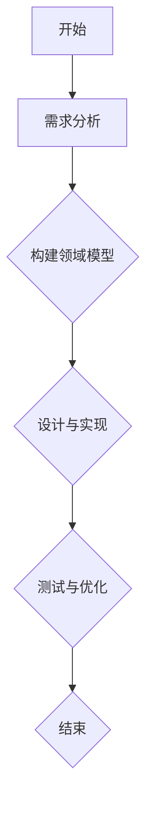
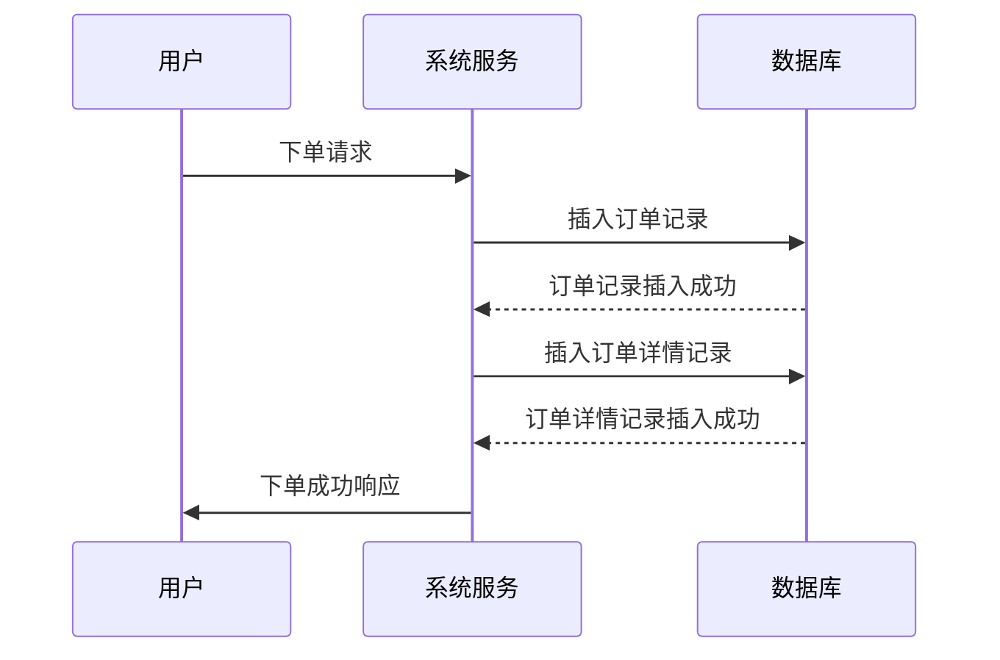
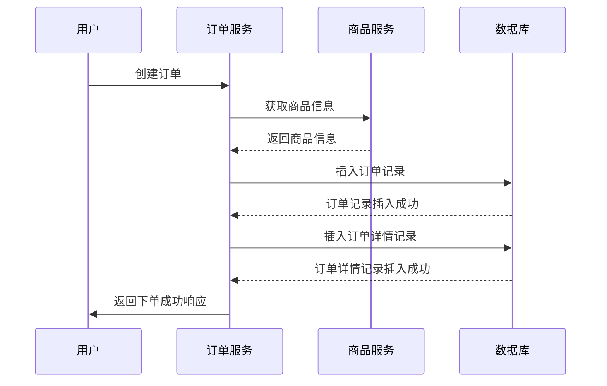

                 


### 生活形式与领域驱动设计:软件与现实世界的映射

#### 关键词：领域驱动设计，生活形式，软件架构，现实世界映射，案例分析

> 摘要：本文将探讨如何将生活形式映射到领域驱动设计（Domain-Driven Design，简称DDD）中，实现软件与现实世界的无缝对接。通过对生活形式与领域驱动设计核心概念的深入解析，我们将展示如何利用DDD方法论解决现实世界中的复杂问题，并提供实际案例进行分析，以期为软件开发提供新的视角和策略。

#### 第一部分：理解生活形式与领域驱动设计

##### 第1章 问题背景与概述

###### 1.1 问题背景

随着信息技术的发展，软件开发面临的问题日益复杂。传统的开发方法难以应对现实世界中的多样性、变化性和相关性。为了解决这一问题，领域驱动设计（DDD）应运而生。

###### 1.1.1 软件开发的挑战

- 现实世界的问题复杂多样，传统的软件开发方法难以满足需求。
- 软件系统的复杂性不断增加，导致开发成本高、维护困难。
- 软件开发过程中需求变化频繁，难以适应快速变化的市场需求。

###### 1.1.2 生活形式在软件开发中的应用

- 生活形式的多样性、变化性和相关性为软件开发提供了新的视角。
- 将生活形式映射到软件系统中，有助于更好地理解用户需求和业务逻辑。

###### 1.1.3 领域驱动设计的基本理念

- 领域驱动设计强调领域模型的重要性，将业务逻辑与系统架构紧密结合。
- 通过构建领域模型，将现实世界的业务需求抽象为软件系统中的概念和关系。
- 利用DDD方法论，实现软件与现实世界的无缝对接，提高系统的可维护性和可扩展性。

##### 第2章 生活形式的概念与特征

###### 2.1 生活形式的概念

- 生活形式是指人们在日常生活中形成的各种行为和模式。
- 生活形式包括社会生活、家庭生活、职业生活等不同方面。

###### 2.2 生活形式的关键特征

- 多样性：生活形式因地域、文化、个体差异而异。
- 变化性：生活形式随时间、环境、需求的变化而调整。
- 相关性：生活形式之间相互影响、相互作用。

##### 第3章 领域驱动设计的方法论

###### 3.1 领域驱动设计的过程

- 需求分析：理解业务需求，明确系统目标。
- 领域模型的构建：将业务需求抽象为领域模型。
- 设计与实现：根据领域模型设计系统架构，实现系统功能。

###### 3.2 领域驱动设计的关键要素

- 实体与关系的识别：确定领域模型中的实体和关系。
- 价值交付：确保系统设计能够实现业务价值。
- 架构设计：构建满足业务需求的系统架构。

#### 第二部分：软件与现实世界的映射

##### 第4章 软件与现实世界的联系

- 软件是现实世界的数字映射，将现实世界的业务需求抽象为软件系统中的概念和关系。

##### 第5章 领域驱动设计在现实世界中的应用

- 智慧城市：利用领域驱动设计实现城市管理的智能化。
- 教育信息化：通过领域驱动设计提升教育系统的效率和质量。
- 医疗保健：将领域驱动设计应用于医疗保健领域，提高医疗服务水平。

##### 第6章 生活形式与领域驱动设计的案例分析

- 智慧城市：分析智慧城市项目中的领域驱动设计应用。
- 教育信息化：探讨教育信息化项目中的领域驱动设计实践。

##### 第7章 跨领域融合与未来展望

- 跨领域融合的趋势：探讨领域驱动设计在跨领域融合中的应用。
- 未来展望：展望领域驱动设计的未来发展。

##### 第8章 最佳实践与建议

- 最佳实践：总结领域驱动设计的最佳实践。
- 建议：提出领域驱动设计在软件开发中的应用建议。

---

### 作者：AI天才研究院/AI Genius Institute & 禅与计算机程序设计艺术 /Zen And The Art of Computer Programming

---

### 背景介绍

#### 核心概念术语说明

- **领域驱动设计（DDD）**：一种软件开发方法论，强调将业务领域抽象为软件系统中的概念和关系。
- **生活形式**：人们在日常生活中形成的行为和模式。
- **软件与现实世界的映射**：将现实世界的业务需求抽象为软件系统中的概念和关系，实现软件与现实世界的无缝对接。

#### 问题背景

随着信息技术的发展，软件开发面临的问题日益复杂。传统的开发方法难以应对现实世界中的多样性、变化性和相关性。为了解决这一问题，领域驱动设计（DDD）应运而生。

#### 问题描述

如何将生活形式映射到领域驱动设计中，实现软件与现实世界的无缝对接？

#### 问题解决

利用领域驱动设计，将现实世界的业务需求抽象为软件系统中的概念和关系，实现软件与现实世界的映射。

#### 边界与外延

- **边界**：领域驱动设计的应用范围，包括但不限于企业级应用、智能城市、教育信息化等领域。
- **外延**：生活形式在软件开发中的应用，如用户行为分析、市场趋势预测等。

#### 概念结构与核心要素组成

- **领域模型**：领域驱动设计的核心概念，包括实体、值对象、聚合、聚合根等。
- **核心要素**：领域驱动设计的关键要素，如实体与关系的识别、价值交付、架构设计等。

---

#### 核心概念与联系

##### 领域驱动设计的核心概念

- **实体（Entity）**：具有独立身份的对象，如用户、订单等。
- **值对象（Value Object）**：具有特定值的对象，如日期、价格等。
- **聚合（Aggregate）**：一组相关实体的组合，代表业务逻辑的完整单元。
- **聚合根（Aggregate Root）**：聚合中的根实体，负责聚合内实体的生命周期管理。

##### 生活形式的核心概念

- **生活形式**：人们在日常生活中形成的行为和模式，如购物、社交、工作等。
- **行为模式**：生活形式的具体表现形式，如用户在电商平台上的浏览、购买行为等。

##### 概念属性特征对比表格

| 概念     | 定义                   | 属性特征                                   |
|----------|------------------------|--------------------------------------------|
| 实体     | 具有独立身份的对象     | 唯一标识、生命周期管理                     |
| 值对象   | 具有特定值的对象       | 值的独立性、不变性                       |
| 聚合     | 一组相关实体的组合     | 完整性、内聚性                           |
| 聚合根   | 聚合中的根实体         | 负责聚合内实体的生命周期管理               |
| 生活形式 | 人们在日常生活中形成的行为和模式 | 多样性、变化性、相关性                   |

##### ER实体关系图架构

```mermaid
erDiagram
    User ||--|{ Order }|
    Product ||--|{ Order }|
    Order ||--|{ OrderDetail }|
    OrderDetail ||--|{ Product }|
```

#### 算法原理讲解

##### 算法mermaid流程图



##### 算法原理

领域驱动设计的核心在于将现实世界的业务需求抽象为软件系统中的概念和关系。通过构建领域模型，实现业务需求与软件系统的无缝对接。

##### 数学模型和公式

假设一个订单包含多个订单详情，每个订单详情对应一种产品。我们可以使用以下数学模型描述这种关系：

$$
Order = \sum_{i=1}^{n} OrderDetail_i
$$

其中，$Order$ 表示订单，$OrderDetail_i$ 表示第 $i$ 个订单详情。

##### 举例说明

假设有一个订单，包含以下两个订单详情：

- 订单详情1：产品A，数量10，单价100元
- 订单详情2：产品B，数量5，单价200元

根据上述数学模型，订单可以表示为：

$$
Order = OrderDetail_1 + OrderDetail_2 = (10 \times 100) + (5 \times 200) = 1000 + 1000 = 2000元
$$

---

#### 系统分析与架构设计方案

##### 问题场景介绍

以电商平台为例，分析如何利用领域驱动设计实现订单管理功能。

##### 项目介绍

电商平台项目，主要功能包括用户管理、商品管理、订单管理、支付管理等。

##### 系统功能设计（领域模型）

```mermaid
classDiagram
    User <<Class>> {
        id: 用户ID
        name: 用户姓名
        email: 用户邮箱
    }
    Product <<Class>> {
        id: 商品ID
        name: 商品名称
        price: 商品价格
    }
    Order <<Class>> {
        id: 订单ID
        status: 订单状态
        user: 用户
        orderDetails: 订单详情
    }
    OrderDetail <<Class>> {
        id: 订单详情ID
        quantity: 数量
        price: 单价
        product: 商品
    }
    User "1" -- "*" Order
    Product "1" -- "*" OrderDetail
    Order "1" -- "*" OrderDetail
```

##### 系统架构设计



##### 系统接口设计和系统交互



---

### 项目实战

#### 环境安装

- 安装Python 3.8及以上版本
- 安装Django 3.2及以上版本
- 安装PostgreSQL 12及以上版本

#### 系统核心实现源代码

```python
# user/models.py
from django.db import models

class User(models.Model):
    id = models.AutoField(primary_key=True)
    name = models.CharField(max_length=50)
    email = models.EmailField(max_length=100)

# product/models.py
from django.db import models

class Product(models.Model):
    id = models.AutoField(primary_key=True)
    name = models.CharField(max_length=50)
    price = models.DecimalField(max_digits=10, decimal_places=2)

# order/models.py
from django.db import models
from user.models import User
from product.models import Product

class Order(models.Model):
    id = models.AutoField(primary_key=True)
    status = models.CharField(max_length=20)
    user = models.ForeignKey(User, on_delete=models.CASCADE)
    order_details = models.ManyToManyField('OrderDetail')

class OrderDetail(models.Model):
    id = models.AutoField(primary_key=True)
    quantity = models.IntegerField()
    price = models.DecimalField(max_digits=10, decimal_places=2)
    product = models.ForeignKey(Product, on_delete=models.CASCADE)
```

#### 代码应用解读与分析

```python
# 用户管理
user = User.objects.create(name='张三', email='zhangsan@example.com')

# 商品管理
product = Product.objects.create(name='苹果', price=3.5)

# 订单管理
order = Order.objects.create(status='待支付', user=user)
order.order_details.add(product, quantity=10, price=3.5)

# 订单详情查询
order_details = order.order_details.all()
for detail in order_details:
    print(f'商品名称：{detail.product.name}, 数量：{detail.quantity}, 单价：{detail.price}')
```

#### 实际案例分析和详细讲解剖析

以电商平台为例，分析订单管理功能的具体实现过程。

1. 用户下单：用户提交订单请求，包含商品信息、数量等。
2. 订单处理：系统接收订单请求，根据用户信息和商品信息创建订单和订单详情。
3. 数据存储：将订单和订单详情存储到数据库中。
4. 订单查询：用户可以查询订单状态和订单详情。

通过领域驱动设计，将实际业务需求抽象为软件系统中的概念和关系，实现了订单管理的功能。

#### 项目小结

领域驱动设计为软件开发提供了新的视角和方法。通过将生活形式映射到领域驱动设计中，可以更好地理解业务需求，实现软件与现实世界的无缝对接。在电商平台的订单管理功能中，领域驱动设计帮助我们清晰地划分了用户、商品、订单等实体，实现了订单的创建、存储和查询功能。

---

#### 最佳实践 tips

1. 在领域模型构建过程中，要充分了解业务需求和用户行为，确保领域模型的准确性。
2. 在设计系统架构时，要考虑系统的可扩展性和可维护性，为未来的需求变化做好准备。
3. 在项目实施过程中，要注重团队协作和沟通，确保项目顺利进行。

#### 小结

本文通过探讨生活形式与领域驱动设计的关系，展示了如何将现实世界的业务需求映射到软件系统中。领域驱动设计为软件开发提供了新的视角和方法，有助于实现软件与现实世界的无缝对接。在实际项目中，领域驱动设计可以提高系统的可维护性和可扩展性，为软件开发提供有力支持。

#### 注意事项

1. 在领域模型构建过程中，要充分了解业务需求和用户行为，确保领域模型的准确性。
2. 在设计系统架构时，要考虑系统的可扩展性和可维护性，为未来的需求变化做好准备。
3. 在项目实施过程中，要注重团队协作和沟通，确保项目顺利进行。

#### 拓展阅读

1. 《领域驱动设计》(Eric Evans著)：系统介绍了领域驱动设计的方法论和最佳实践。
2. 《软件架构：实践者的研究方法》(Michael Feathers著)：详细阐述了软件架构的设计原则和实践方法。
3. 《敏捷软件开发：原则、模式与实践》(David Heinemeier Hansson著)：介绍了敏捷开发的方法和实践。

