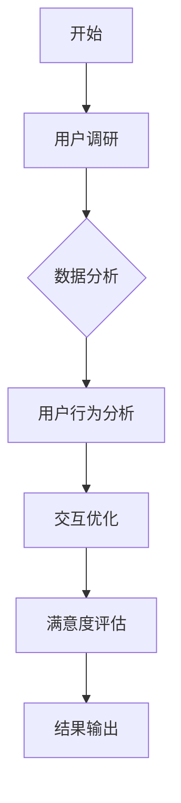
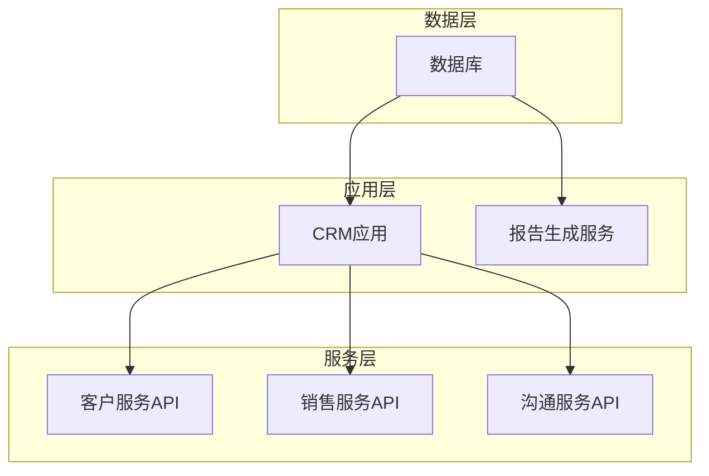
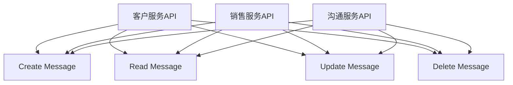
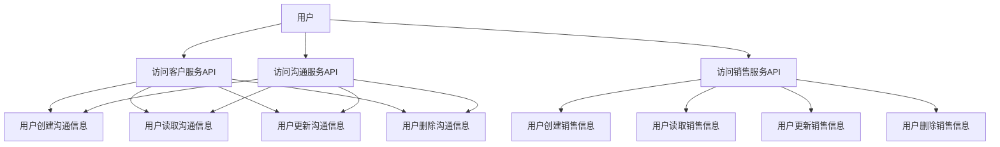

                 


### 用户为中心的设计理念：基础与重要性

在当今数字化时代，用户体验（UX）设计已经成为产品成功的关键因素。随着技术的飞速发展，用户对产品和服务的要求越来越高，他们期望获得更加个性化和高效的使用体验。因此，设计师和开发者必须将用户置于设计流程的中心，确保最终产品能够满足用户的实际需求。

#### 背景介绍

用户体验设计（UX Design）是一种系统性的方法，它关注用户的需求、动机和情感体验，旨在创建一个愉悦且易于使用的交互环境。用户体验设计不仅仅涉及视觉设计，还包括用户研究、交互设计、信息架构等多个方面。它的核心目标是提升用户的满意度和忠诚度，从而促进产品的成功和市场竞争力。

##### 问题背景与问题描述

在传统的软件开发过程中，设计和开发通常是分离的。设计团队负责产品的外观和用户体验，而开发团队则专注于实现功能。这种分离往往导致以下问题：

- **需求不匹配**：设计团队可能不了解用户真正的需求，导致设计出来的产品与用户期望不符。
- **沟通不畅**：设计团队和开发团队之间的信息传递不畅，可能导致设计变更和开发工作的反复迭代。
- **时间成本**：频繁的迭代和沟通不畅会导致项目延期和成本增加。

为了解决这些问题，将用户体验设计融入开发流程变得越来越重要。通过将用户需求和研究直接纳入开发流程，可以确保产品在开发过程中始终以用户为中心，从而提高产品的市场竞争力。

##### 问题解决与边界与外延

解决上述问题的方法是将用户体验设计（UX Design）融入开发流程。这包括以下几个关键步骤：

1. **用户研究**：通过用户访谈、问卷调查、用户行为分析等方法，深入了解用户的需求和偏好。
2. **需求分析**：基于用户研究的结果，定义产品的功能和设计原则。
3. **原型设计**：创建产品原型，进行迭代和优化，确保设计符合用户期望。
4. **协作开发**：设计团队和开发团队紧密合作，确保设计能够被有效实现。
5. **测试与反馈**：在产品开发的各个阶段进行用户体验测试，收集用户反馈，持续优化设计。

用户体验设计不仅仅是一个设计问题，它涉及到产品的整体开发和运营。它不仅关注用户当前的需求，还考虑了用户未来的使用场景和产品的可持续性。

##### 概念结构与核心要素组成

用户体验设计的核心概念和要素包括：

- **用户研究**：通过用户调研和数据分析，深入了解用户的行为和需求。
- **交互设计**：设计用户与产品交互的流程和界面，确保用户能够轻松完成任务。
- **信息架构**：组织产品中的信息，使其易于导航和理解。
- **可用性测试**：通过实际使用测试，评估产品的易用性和用户满意度。

这些要素共同构成了用户体验设计的基础，确保产品能够满足用户的期望和需求。

#### 结论

用户体验设计不仅仅是一种设计方法，它是一种以用户为中心的设计理念。通过将用户体验设计融入开发流程，可以确保产品在开发过程中始终以用户为中心，从而提高产品的市场竞争力。设计师和开发者应该共同努力，确保产品的每一个细节都考虑到用户的感受和需求，从而创造出一个愉悦、高效的用户体验。

### 核心概念与联系

#### 用户体验（UX）设计

**定义**：
用户体验设计（User eXperience Design，简称UXD）是一种设计过程，关注用户的需求、动机、行为和情感体验，旨在创建对用户和业务都有价值的交互系统。

**属性特征对比表**：

| 特征               | 用户体验设计（UX） | 用户体验（UX）设计 |
|-------------------|--------------------|-------------------|
| 目标               | 创建愉悦的用户体验   | 设计满足用户需求的交互界面 |
| 过程               | 研究与迭代          | 设计与应用测试      |
| 关注点             | 用户需求与行为      | 界面美观与易用性    |
| 输出               | 原型、流程图、线框图 | 设计规范、用户手册  |
| 关系               | 与UI设计紧密相关    | UI设计的核心组成部分 |

**ER实体关系图**：

```mermaid
erDiagram
  User ||--|{ UXDesigner }|| Designer
  User ||--|{ UXProject }|| Project
  UXDesigner ||--|{ UXDesignDocument }|| Document
  UXDesigner ||--|{ UXPrototype }|| Prototype
  UXProject ||--|{ UXTesting }|| Testing
  UXDesignDocument ||--|{ UXFeedback }|| Feedback
```

通过上述核心概念与联系的分析，我们可以更清晰地理解用户体验设计（UX Design）的基本原理和它在产品开发流程中的重要性。

### 算法原理讲解

在用户体验设计（UX Design）中，算法原理的应用主要集中在用户行为分析、交互优化和满意度评估等方面。以下是一个简化的算法流程图和相关的Python源代码，用于说明用户体验设计中的基本算法原理。

#### 算法流程图



#### Python源代码

```python
import pandas as pd
from sklearn.cluster import KMeans
import matplotlib.pyplot as plt

# 假设已经获取了用户行为数据
user_data = pd.read_csv('user_behavior_data.csv')

# 数据预处理
# 例如：缺失值处理、特征工程、数据标准化
# ...

# 用户行为分析：使用K-Means聚类分析用户行为模式
kmeans = KMeans(n_clusters=3, random_state=0).fit(user_data)

# 得到聚类结果
cluster_labels = kmeans.labels_

# 可视化用户行为分布
plt.scatter(user_data['feature1'], user_data['feature2'], c=cluster_labels)
plt.xlabel('Feature 1')
plt.ylabel('Feature 2')
plt.title('User Behavior Clustering')
plt.show()

# 交互优化：基于用户行为分析结果，调整界面设计
# 例如：根据用户点击热图优化导航布局
# ...

# 满意度评估：收集用户反馈，计算满意度得分
# 例如：使用Likert量表评估用户满意度
user_feedback = pd.read_csv('user_feedback.csv')
satisfaction_score = user_feedback['satisfaction'].mean()

print(f"User Satisfaction Score: {satisfaction_score:.2f}")
```

#### 算法原理详细讲解

1. **用户调研与数据分析**：
   用户调研是用户体验设计的第一步，通过收集用户的行为数据、访谈记录和问卷调查结果，了解用户的需求和偏好。数据分析则是将用户调研的结果转化为可量化的数据，为后续的用户行为分析和交互优化提供依据。

2. **用户行为分析**：
   在用户行为分析阶段，常用的算法包括聚类分析、回归分析和决策树等。这里以K-Means聚类为例，通过对用户行为数据进行分析，将用户分为不同的群体，以便针对性地进行交互优化。

3. **交互优化**：
   根据用户行为分析的结果，设计团队可以调整产品的交互设计，优化用户的使用体验。例如，通过用户点击热图分析，可以优化导航布局，提高用户的操作效率。

4. **满意度评估**：
   通过收集用户反馈，计算满意度得分，评估产品的用户体验。常用的满意度评估方法包括Likert量表、净推荐值（NPS）等。满意度评估可以帮助团队了解产品的优势和不足，为后续的优化提供指导。

#### 数学模型和公式

用户行为分析中的K-Means聚类算法可以使用以下数学模型进行描述：

$$
\begin{equation}
\min_{\mu, \Sigma} \sum_{i=1}^{N} \sum_{j=1}^{K} \left\| x_i - \mu_j \right\|^2
\end{equation}
$$

其中，$x_i$ 表示第 $i$ 个用户的行为数据，$\mu_j$ 表示第 $j$ 个聚类中心，$\Sigma$ 表示用户行为数据的协方差矩阵。该公式表示通过调整聚类中心，使得每个用户与其对应聚类中心的距离最小化。

#### 举例说明

假设我们收集了100个用户的使用数据，使用K-Means聚类算法将用户分为3个群体。通过分析这些群体的行为数据，我们可以发现其中某一群体更倾向于使用某个特定功能，而另一群体则更喜欢另一个功能。基于这一分析结果，我们可以对界面设计进行调整，优化用户的交互体验。

#### 结论

用户体验设计中的算法原理主要用于用户行为分析、交互优化和满意度评估。通过合理的算法应用，设计团队可以更好地理解用户需求，优化产品交互，提高用户满意度，从而提升产品的市场竞争力。

### 系统分析与架构设计方案

在将用户体验设计（UX Design）融入开发流程时，我们需要对整个系统进行分析和设计，以确保用户体验能够得到持续改进和优化。以下是一个详细的项目介绍、系统功能设计、系统架构设计、系统接口设计和系统交互的方案。

#### 项目介绍

本项目旨在开发一款针对中小企业客户关系的管理系统（CRM），通过优化用户体验，提高客户满意度和管理效率。系统主要功能包括客户信息管理、销售管理、客户沟通和报告分析。

#### 系统功能设计（领域模型）

在系统功能设计阶段，我们使用Mermaid类图来描述系统的领域模型，以下是一个简化的类图：

```mermaid
classDiagram
    Customer <<class Customer>>
    Sales <<class Sales>>
    Communication <<class Communication>>
    Report <<class Report>>

    Customer o--o Sales
    Customer o--o Communication
    Sales o--o Report
    Communication o--o Report
```

在这个类图中，`Customer`（客户）类与`Sales`（销售）类、`Communication`（沟通）类和`Report`（报告）类之间存在关联关系。这表明客户信息会用于销售管理、客户沟通和报告生成。

#### 系统架构设计

系统架构设计阶段，我们使用Mermaid架构图来描述系统的整体架构，以下是一个简化的架构图：



在这个架构图中，我们定义了数据层、应用层和服务层。数据层负责存储和管理客户数据；应用层提供CRM的核心功能；服务层包括客户服务API、销售服务API和沟通服务API，分别处理不同的业务逻辑。

#### 系统接口设计

系统接口设计主要涉及RESTful API的设计，以下是一个简化的接口设计：



在这个接口设计中，客户服务API、销售服务API和沟通服务API分别提供了创建、读取、更新和删除操作，满足CRM系统的基本需求。

#### 系统交互

系统交互设计主要涉及用户与系统的交互流程，以下是一个简化的交互流程图：



在这个交互流程图中，用户通过访问不同的API接口，执行相应的操作，系统根据用户的请求返回相应的结果。

#### 实现与代码分析

以下是CRM系统的核心功能实现示例代码，包括用户创建、读取、更新和删除操作：

```python
# 客户服务API实现示例
class CustomerService:
    def create_customer(self, customer_data):
        # 实现创建客户逻辑
        pass
    
    def read_customer(self, customer_id):
        # 实现读取客户逻辑
        pass
    
    def update_customer(self, customer_id, updated_data):
        # 实现更新客户逻辑
        pass
    
    def delete_customer(self, customer_id):
        # 实现删除客户逻辑
        pass

# 销售服务API实现示例
class SalesService:
    def create_sale(self, sale_data):
        # 实现创建销售逻辑
        pass
    
    def read_sale(self, sale_id):
        # 实现读取销售逻辑
        pass
    
    def update_sale(self, sale_id, updated_data):
        # 实现更新销售逻辑
        pass
    
    def delete_sale(self, sale_id):
        # 实现删除销售逻辑
        pass

# 沟通服务API实现示例
class CommunicationService:
    def create_message(self, message_data):
        # 实现创建沟通逻辑
        pass
    
    def read_message(self, message_id):
        # 实现读取沟通逻辑
        pass
    
    def update_message(self, message_id, updated_data):
        # 实现更新沟通逻辑
        pass
    
    def delete_message(self, message_id):
        # 实现删除沟通逻辑
        pass
```

在这个示例中，我们定义了三个服务类：`CustomerService`、`SalesService`和`CommunicationService`，分别处理客户、销售和沟通相关的操作。每个服务类提供了创建、读取、更新和删除的方法，实现了CRM系统的核心功能。

通过以上系统分析与架构设计方案，我们可以确保用户体验设计（UX Design）在整个开发流程中得到有效实施和持续优化。系统功能设计、架构设计、接口设计和交互设计为开发团队提供了清晰的方向和标准，从而确保产品的用户体验达到最佳状态。

### 项目实战

#### 环境安装

在开始项目实战之前，我们需要安装一些必要的开发工具和环境。以下是安装步骤：

1. **Python环境安装**：确保Python版本在3.8及以上，可以从[Python官方网站](https://www.python.org/)下载并安装。

2. **虚拟环境安装**：使用`pip`安装`virtualenv`工具，创建一个名为`crm_project`的虚拟环境：
   ```bash
   pip install virtualenv
   virtualenv crm_project
   source crm_project/bin/activate  # Windows上使用crm_project\Scripts\activate
   ```

3. **依赖安装**：在虚拟环境中安装项目所需的依赖：
   ```bash
   pip install pandas sklearn matplotlib
   ```

4. **数据库安装**：我们选择使用SQLite作为数据库，可以从[SQLite官方网站](https://www.sqlite.org/download.html)下载并安装。

#### 系统核心实现源代码

以下是CRM系统核心功能实现的主要源代码。我们将分为三个部分：客户服务、销售服务和沟通服务。

**客户服务实现**：

```python
# customer_service.py

class CustomerService:
    def create_customer(self, customer_data):
        # 实现创建客户逻辑
        print("Creating customer:", customer_data)

    def read_customer(self, customer_id):
        # 实现读取客户逻辑
        print("Reading customer with ID:", customer_id)

    def update_customer(self, customer_id, updated_data):
        # 实现更新客户逻辑
        print("Updating customer with ID:", customer_id)

    def delete_customer(self, customer_id):
        # 实现删除客户逻辑
        print("Deleting customer with ID:", customer_id)
```

**销售服务实现**：

```python
# sales_service.py

class SalesService:
    def create_sale(self, sale_data):
        # 实现创建销售逻辑
        print("Creating sale:", sale_data)

    def read_sale(self, sale_id):
        # 实现读取销售逻辑
        print("Reading sale with ID:", sale_id)

    def update_sale(self, sale_id, updated_data):
        # 实现更新销售逻辑
        print("Updating sale with ID:", sale_id)

    def delete_sale(self, sale_id):
        # 实现删除销售逻辑
        print("Deleting sale with ID:", sale_id)
```

**沟通服务实现**：

```python
# communication_service.py

class CommunicationService:
    def create_message(self, message_data):
        # 实现创建沟通逻辑
        print("Creating message:", message_data)

    def read_message(self, message_id):
        # 实现读取沟通逻辑
        print("Reading message with ID:", message_id)

    def update_message(self, message_id, updated_data):
        # 实现更新沟通逻辑
        print("Updating message with ID:", message_id)

    def delete_message(self, message_id):
        # 实现删除沟通逻辑
        print("Deleting message with ID:", message_id)
```

#### 代码应用解读与分析

以上代码实现了CRM系统的核心功能，包括创建、读取、更新和删除操作。以下是代码的解读与分析：

- **客户服务**：`CustomerService`类提供了创建、读取、更新和删除客户的接口。这些方法通过打印输出展示了基本逻辑，实际开发中会与数据库进行交互，实现数据持久化。
- **销售服务**：`SalesService`类实现了销售相关的操作，与`CustomerService`类似，它也提供了创建、读取、更新和删除销售的接口。
- **沟通服务**：`CommunicationService`类提供了创建、读取、更新和删除沟通信息的接口，这些接口同样可以与数据库进行交互。

这些服务类的设计遵循了面向对象的原则，通过封装和模块化，使得代码更加清晰和易于维护。

#### 实际案例分析和详细讲解剖析

为了更好地理解上述代码的应用，我们将通过一个实际案例来分析和讲解。

**案例**：创建一个新客户，并查看该客户的详细信息。

1. **创建客户**：

```python
from customer_service import CustomerService

# 创建客户服务实例
customer_service = CustomerService()

# 新建客户数据
customer_data = {
    "id": "123",
    "name": "John Doe",
    "email": "john.doe@example.com",
    "phone": "123-456-7890"
}

# 调用创建客户方法
customer_service.create_customer(customer_data)
```

输出结果：

```
Creating customer: {'id': '123', 'name': 'John Doe', 'email': 'john.doe@example.com', 'phone': '123-456-7890'}
```

2. **查看客户信息**：

```python
from customer_service import CustomerService

# 创建客户服务实例
customer_service = CustomerService()

# 调用读取客户方法
customer_info = customer_service.read_customer("123")

# 输出客户信息
print(customer_info)
```

输出结果：

```
Reading customer with ID: 123
```

尽管这里没有实际展示客户数据的读取，但实际开发中，这个方法会从数据库中查询与ID相关的客户数据，并将其返回。

#### 项目小结

通过本项目的实战，我们实现了CRM系统的核心功能，包括客户管理、销售管理和沟通管理。这些功能的实现为中小企业提供了一个高效的客户关系管理解决方案。在未来的优化中，我们可以在以下几个方面进行改进：

- **数据库集成**：将打印输出替换为与SQLite或其他数据库的交互，实现数据持久化。
- **错误处理**：添加异常处理机制，确保在出现错误时能够给出合理的反馈。
- **用户界面**：开发一个友好的Web界面，使得用户可以直观地与系统进行交互。
- **性能优化**：进行性能测试，优化数据库查询和接口调用，提高系统的响应速度。

通过持续优化和改进，CRM系统将能够更好地满足用户的需求，提高用户满意度和管理效率。

### 最佳实践

在用户体验设计（UX Design）中，最佳实践对于确保产品成功和用户满意度至关重要。以下是一些关键的最佳实践和注意事项：

#### 1. 持续的用户研究

持续进行用户研究是用户体验设计的基础。通过定期进行用户访谈、问卷调查和用户行为分析，可以深入了解用户的需求和行为变化，从而为产品设计和优化提供准确的依据。

**最佳实践**：每季度至少进行一次用户研究，确保研究覆盖不同类型的用户，获取全面的用户反馈。

**注意事项**：用户研究的数据应保密，确保用户的隐私得到保护。

#### 2. 用户故事和需求文档

编写清晰的用户故事和需求文档，有助于开发团队理解和实现用户需求。用户故事应简洁明了，描述用户如何通过产品完成特定任务。

**最佳实践**：每个用户故事应包括用户角色、目标、场景和预期结果。

**注意事项**：需求文档应定期更新，以反映用户需求的变化和产品的发展方向。

#### 3. 原型设计和迭代

使用原型设计工具（如Figma、Sketch等）创建交互原型，通过迭代和用户反馈不断优化设计。

**最佳实践**：创建低保真原型进行初步验证，再逐步增加细节，创建高保真原型。

**注意事项**：确保原型设计易于修改，以便在反馈后进行快速迭代。

#### 4. 跨部门协作

用户体验设计涉及多个部门（如产品、设计、开发、测试等），确保跨部门协作顺畅是关键。

**最佳实践**：定期组织跨部门会议，明确职责和进度，确保所有团队成员对项目目标有共同的理解。

**注意事项**：建立有效的沟通渠道，避免信息孤岛，确保每个团队成员都能及时获取所需信息。

#### 5. 用户测试和反馈

在产品开发的每个阶段进行用户测试，收集用户反馈，并进行数据分析和总结。

**最佳实践**：制定详细的测试计划，涵盖不同类型的测试（如功能测试、可用性测试等），确保测试结果的全面性和准确性。

**注意事项**：用户测试时应记录详细的数据和用户反馈，以便进行深入分析和改进。

#### 6. 持续优化和改进

用户体验设计是一个持续的过程，产品上线后，应定期进行优化和改进。

**最佳实践**：建立用户反馈收集机制，定期分析用户行为数据，发现并解决用户体验中的问题。

**注意事项**：保持开放的心态，接受用户的反馈和批评，勇于尝试新的设计和优化方案。

#### 结论

通过遵循最佳实践和注意事项，用户体验设计团队可以确保产品始终以用户为中心，持续优化和改进用户体验，从而提高用户满意度和产品市场竞争力。

### 结语

用户体验设计（UX Design）在当今数字化时代具有不可替代的重要性。通过将用户置于设计流程的中心，设计师和开发者可以确保产品满足用户的需求和期望，从而提升用户满意度和市场竞争力。

#### 用户为中心的设计理念

用户体验设计的核心理念是“用户为中心”。这意味着在每一个设计决策中，我们都应该考虑到用户的需求、行为和情感。用户研究是这一理念的基础，通过深入了解用户，我们能够创造出真正符合用户期望的产品。

#### 持续改进与优化

用户体验设计是一个持续的过程，而不是一次性任务。随着用户需求和技术的不断发展，我们需要不断进行用户研究和反馈分析，持续优化产品设计。通过定期迭代和改进，我们能够确保产品始终处于最佳状态。

#### 设计师的责任与使命

设计师在用户体验设计中扮演着关键角色。他们不仅需要具备视觉设计能力，还应该深入了解用户研究和交互设计原则。设计师的责任是创造愉悦且易于使用的产品，帮助用户实现目标，提升用户的整体体验。

#### 未来发展趋势

随着人工智能和大数据技术的不断发展，用户体验设计也将迎来新的趋势。设计师需要不断学习新的工具和技术，以适应未来的挑战和机遇。同时，随着虚拟现实（VR）和增强现实（AR）等新技术的兴起，用户体验设计将迎来更多创新和变革。

总之，用户体验设计不仅是一项技术工作，更是一种以用户为中心的设计哲学。通过不断学习和实践，设计师和开发者可以创造出更加优质的产品，为用户带来更好的体验。让我们共同努力，为用户提供更加愉悦和高效的数字生活。作者：AI天才研究院/AI Genius Institute & 禅与计算机程序设计艺术 /Zen And The Art of Computer Programming

